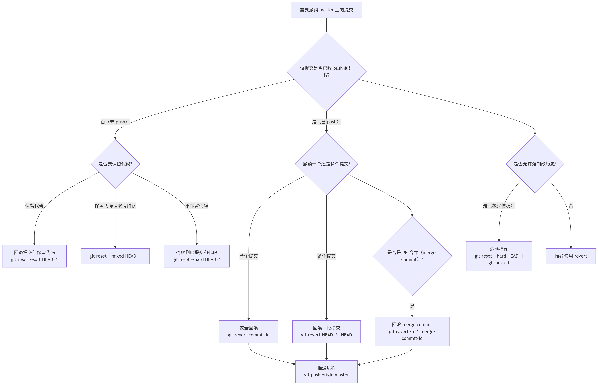

# Git 团队协作与回滚手册

本文以一次功能开发为主线，说明如何从主分支创建功能分支、提交并推送代码、创建 PR、同步主分支，以及在出错时选择合适的回滚方式。

适合已经会使用 `git clone`、`git add`、`git commit` 和 `git push`，但还不熟悉多人协作流程的开发者。文中的主分支以 `master` 为例；如果团队使用 `main`，将命令中的 `master` 替换为 `main`。

## 1. 一次功能开发的协作流程

团队协作时，功能开发应始终在独立分支中完成。这样主分支保持稳定，代码经过 PR 审查后再合并。完成一个功能通常包括：更新主分支、创建功能分支、开发并提交、同步主分支、推送分支和创建 PR。

### 1.1 更新主分支并创建功能分支

开始开发前，先切换到本地主分支并拉取远程最新代码。这样创建出的功能分支会包含团队已经合并的改动，后续与主分支发生冲突的概率更低。

```bash
git checkout master
git pull origin master
git checkout -b feature/xxx
```

将 `feature/xxx` 替换为能描述本次工作的分支名，例如 `feature/login` 或 `fix/payment-error`。最后一条命令会创建并切换到新分支；从这一刻开始，后续代码修改和提交都应在该功能分支上完成。

> [!NOTE]
> 可以使用 `git branch` 查看当前分支。带有 `*` 的分支就是当前所在分支。

### 1.2 开发、提交并推送功能分支

完成一部分独立且可说明的修改后，先检查工作区和改动内容，再将需要提交的文件加入暂存区。确认无误后创建提交并推送到远程仓库。

```bash
git status
git diff
git add -p
git diff --staged
git commit -m "feat: xxx"
git push -u origin feature/xxx
```

这三条命令对应同一条检查链路：先查看**工作区中还没有暂存的修改**，再选择哪些修改进入**暂存区**，最后检查**下一次提交中实际会包含什么**。

#### `git diff`：查看工作区与暂存区的差异

`git diff` 显示的是“文件当前内容”与“已经暂存的内容”之间的差异。换句话说，它只显示**尚未暂存**的修改；已经执行过 `git add` 的内容不会出现在这里，新建但尚未被 Git 跟踪的文件通常也不会显示具体差异。

执行它的目的不是确认“我改了什么”，而是确认“还有哪些内容没有被选入下一次提交”。如果这里仍有应该提交的修改，就继续暂存；如果出现不该提交的修改，就先拆分或还原它。

#### `git add -p`：按改动块选择暂存内容

`git add -p` 中的 `-p` 表示 patch。Git 会把文件中的改动拆成多个改动块，逐块询问是否加入暂存区。常用选项如下：

| 选项 | 含义 |
| --- | --- |
| `y` | 暂存当前改动块。 |
| `n` | 跳过当前改动块。 |
| `s` | 尝试将当前改动块继续拆小。 |
| `e` | 手动编辑当前改动块后再暂存。 |
| `q` | 结束本次选择性暂存。 |

例如，同一个文件同时包含“修复登录校验”和“顺手调整页面文字”时，可以只暂存前者，让一次提交只表达登录校验的修复。`git add -p` 的价值在于让提交按逻辑划分，而不是按文件划分。

#### `git diff --staged`：检查下一次提交的准确内容

`git diff --staged` 比较的是暂存区和当前 `HEAD` 提交，因此它显示的就是执行 `git commit` 后会进入新提交的全部改动。`git diff --cached` 是它的同义写法。

提交前应把这条命令视为最后检查：确认没有遗漏需要提交的改动，也没有把调试代码、临时文件或其他任务的修改带进去。

`git add .` 会将当前目录下的所有改动加入暂存区，只适合确认所有改动都属于同一次提交时使用。提交应保持原子性：一个提交只表达一个能独立说明、独立审查和独立回滚的变更。提交信息应概括本次变更，例如 `feat: add login page`。

首次推送分支时使用 `-u`，将本地功能分支关联到远程同名分支。关联后，后续推送通常只需要执行 `git push`。

### 1.3 创建 PR 前同步主分支

功能开发期间，其他成员可能已经向主分支合并了代码。在创建 PR 前，将最新主分支改动同步到自己的功能分支，并在本地处理冲突，可以避免把冲突留到 PR 合并时才处理。

```bash
git fetch origin
git rebase origin/master
```

这组命令会先获取远程仓库信息，再把当前功能分支的提交放到最新 `origin/master` 之后。若团队约定使用合并提交，也可以改用下面的命令；`rebase` 和 `merge` 是两种同步方式，选择团队约定的一种即可。

```bash
git fetch origin
git merge origin/master
```

发生冲突时，Git 会暂停操作。先根据业务需求修改冲突文件，再将已解决的文件加入暂存区并继续当前操作：

```bash
git status
git add <已解决的文件>
git rebase --continue
```

如果发现同步方向不对，或暂时不准备处理冲突，可以放弃本次 rebase：

```bash
git rebase --abort
```

若使用的是 `merge`，完成冲突处理后创建合并提交；需要放弃该合并时使用 `git merge --abort`。处理完成后，再次检查改动并推送功能分支。


> [!TIP]
> 同步主分支的目的，是让冲突在功能分支中被解决。不要为了处理功能分支的冲突而直接修改或提交主分支。

### 1.4 创建 PR 与整理提交记录

功能分支推送到远程仓库后，创建 PR，请团队成员审查并合并。在 PR 描述中说明本次修改解决的问题、主要改动和验证方式，审查者才能快速判断改动是否符合预期。

如果开发过程中产生了许多零散的临时提交，例如“修复样式”“再次修复样式”，可以在提交 PR 前整理它们。先查看提交历史：

```bash
git log --oneline
```

整理提交通常使用交互式 rebase，将同一个功能的临时提交合并成更清晰的提交记录。只应整理自己功能分支上的提交；已经被其他人基于其继续开发的共享分支，不应随意改写历史。若分支已经推送到远程，整理后需要按团队约定更新远程分支。

```bash
git rebase -i origin/master
git push --force-with-lease
```

`git rebase -i` 用于交互式地合并、重排或修改自己的提交。它会改变提交 ID，因此普通 `git push` 会被拒绝。此时使用 `git push --force-with-lease` 更新远程分支：它会在远程分支仍处于你预期状态时才覆盖，能避免覆盖他人刚推送的提交。不要使用这种方式改写主分支或多人共同维护的分支。

## 2. 常用命令速查

下面的命令用于日常查看状态和完成基本操作。命令速查用于回忆；具体操作仍应结合前面的流程和当前分支状态判断。

| 场景 | 命令 | 用途 |
| --- | --- | --- |
| 查看或切换分支 | `git branch`、`git checkout xxx` | 查看本地分支，或切换到指定分支。 |
| 查看状态和改动 | `git status`、`git diff` | 确认当前分支、修改文件和未暂存的差异。 |
| 拉取主分支 | `git pull origin master` | 获取远程主分支的最新改动。 |
| 创建分支 | `git checkout -b feature/xxx` | 创建并切换到功能分支。 |
| 提交代码 | `git add -p`、`git diff --staged`、`git commit -m "feat: xxx"` | 选择性暂存、检查暂存区并创建提交。 |
| 推送分支 | `git push -u origin feature/xxx` | 首次推送功能分支并建立远程关联。 |
| 同步主干 | `git fetch origin`、`git rebase origin/master` | 获取远程信息，并将功能分支同步到最新主分支。 |
| 查看历史 | `git log --oneline` | 以简洁形式查看提交历史。 |
| 临时保存改动 | `git stash`、`git stash pop` | 暂时收起未提交的修改，之后恢复。 |
| 恢复文件 | `git restore <file>` | 放弃指定文件尚未暂存的修改。 |
| 删除分支 | `git branch -d feature/xxx` | 删除已经合并或不再需要的本地分支。 |

## 3. 理解 Git 的状态与引用

Git 的大多数“撤销”操作都在移动不同位置的内容。理解下面三个区域，才能判断命令会影响什么：

| 区域 | 含义 | 常见命令 |
| --- | --- | --- |
| 工作区 | 当前磁盘上正在编辑的文件。 | `git diff`、`git restore` |
| 暂存区 | 下一次提交准备包含的内容。 | `git add`、`git diff --staged`、`git restore --staged` |
| 本地提交历史 | 已由 `git commit` 创建、位于本地仓库中的快照。 | `git log`、`git reset`、`git revert` |

`HEAD` 表示当前检出的提交，分支名只是指向某个提交的可移动引用。`origin/master` 则是本地记录的远程主分支位置，只有执行 `git fetch` 或 `git pull` 后才会更新。先看清当前分支和这些引用指向的位置，再执行可能改写历史的命令。

```bash
git status
git branch --show-current
git log --oneline --decorate -n 10
```

## 4. 使用 `git worktree` 并行处理任务

通常一个仓库目录一次只能检出一个分支。`git worktree` 允许同一个 Git 仓库同时拥有多个工作树目录，每个目录检出不同分支，但它们共享对象库和远程配置。这样可以在不 stash 当前修改的情况下，切换去处理紧急修复、审查 PR 或运行另一个分支的代码。

例如，当前项目目录正在开发功能，需要额外创建一个目录处理线上登录问题：

```bash
git fetch origin
git worktree add ../project-hotfix -b fix/login-error origin/master
```

这会在当前项目目录的同级目录创建 `project-hotfix`，并从 `origin/master` 创建、检出 `fix/login-error` 分支。之后进入新目录即可独立工作：

```bash
cd ../project-hotfix
git status
```

查看当前仓库管理的所有工作树：

```bash
git worktree list
```

任务完成且该工作树没有未提交修改后，再从主仓库目录移除它：

```bash
git worktree remove ../project-hotfix
```

同一个本地分支默认不能同时检出到两个工作树中，Git 会阻止这种操作，避免两个目录同时修改同一分支的工作区。`git worktree` 解决的是并行目录需求，不替代分支管理、提交或 PR 流程；每个工作树仍应遵守同样的分支和提交规则。

## 5. 回滚与撤销

出现错误时，先判断改动处于哪个阶段：是否已经提交、是否已经推送到远程、是否已经通过 PR 合并到主分支。不同阶段应使用不同方式，避免误删代码或改写共享历史。

### 5.1 用 `git restore` 恢复工作区或暂存区

`git restore` 用于恢复文件内容，不会移动分支或提交历史。它默认从暂存区恢复工作区，因此适合处理“文件改错了，但还没有暂存”的情况。

| 目标 | 命令 | 结果 |
| --- | --- | --- |
| 放弃指定文件尚未暂存的修改 | `git restore <file>` | 工作区恢复为暂存区版本；暂存区保持不变。 |
| 取消指定文件的暂存 | `git restore --staged <file>` | 暂存区恢复为 `HEAD` 版本；工作区修改保留。 |
| 同时放弃暂存和工作区修改 | `git restore --source=HEAD --staged --worktree <file>` | 暂存区和工作区都恢复为最近一次提交。 |

例如，误执行 `git add config.ts` 后，若只想把它移出暂存区但保留本地修改，使用：

```bash
git restore --staged config.ts
```

如果确定 `config.ts` 的未暂存修改完全不需要，并希望恢复到暂存区中的版本，使用：

```bash
git restore config.ts
```

使用 `git restore .` 会作用于当前目录下的多个受 Git 跟踪文件，应先通过 `git status` 和 `git diff` 确认范围。`restore` 不会删除未跟踪文件；未跟踪文件需要单独判断是否保留。

### 5.2 撤销本地但未推送的最近一次提交

如果刚创建提交，发现提交信息或提交内容需要调整，并且该提交还没有推送到远程，可以使用：

```bash
git reset --soft HEAD~1
```

这会撤销最近一次提交，但保留代码修改在暂存区。之后可以调整文件或提交信息，再重新执行 `git commit`。不要把这种方式用于已经推送并被其他人使用的提交，因为它会改写本地历史。

### 5.3 撤销已推送或已合并的提交

当错误提交已经推送到远程，尤其是已经合并到主分支时，使用 `revert` 创建一个新的反向提交更安全：

```bash
git revert <commit-id>
```

将 `<commit-id>` 替换为需要撤销的提交 ID。这个操作保留历史记录，其他成员也能看到“哪个提交被撤销以及为什么撤销”。

### 5.4 撤销或关闭 PR 后是否保留分支

关闭或撤销 PR 并不等于必须删除功能分支。若还需要修复问题后重新提交 PR，应保留该分支并继续修改；确认该功能不再需要，或 PR 已经合并后，再删除本地和远程分支。

```bash
git branch -d feature/xxx
```

> [!NOTE]
> Git 的每一次提交都是一个代码快照，并通过父提交连接为历史链路。回滚时先确认要处理的是工作区、暂存区、本地提交，还是远程共享提交，才能选择正确命令。



### 5.5 `reset` 的三种常用模式

`git reset` 的区别在于它是否移动暂存区和工作区。执行前先用 `git status` 与 `git diff` 确认当前状态。

| 命令 | 提交历史 | 暂存区 | 工作区 | 适用场景 |
| --- | --- | --- | --- | --- |
| `git reset --soft HEAD~1` | 撤销最近提交 | 保留 | 保留 | 仅想重新组织最近一次提交。 |
| `git reset --mixed HEAD~1` | 撤销最近提交 | 清空 | 保留 | 想重新选择哪些改动进入下一次提交。 |
| `git reset --hard HEAD~1` | 撤销最近提交 | 清空 | 丢弃 | 确认不需要保留本地改动时使用。 |

`--hard` 会丢弃受 Git 跟踪文件的未提交修改。它适用于明确可舍弃的本地实验，不应用于不确定是否需要保留的工作。

### 5.6 用 `reflog` 找回误操作前的提交

即使分支被 reset、rebase 或删除，本地通常仍保留近期引用移动记录。发现误操作后，先停止继续提交或清理，再查看：

```bash
git reflog
```

找到误操作前的提交 ID 后，可以先创建一个恢复分支保存它：

```bash
git branch recovery/<name> <commit-id>
```

先把找回的提交固定在新分支上，再比较内容并决定如何合并回原分支。这样比直接再次执行 `reset --hard` 更容易保留恢复路径。

### 5.7 使用 stash 时的注意点

`git stash` 适合临时切换任务前收起未提交修改，但它不是长期保存方案。执行 `git stash pop` 时也可能发生冲突；每次暂存前应使用描述信息，避免多个 stash 难以辨认。

```bash
git stash push -m "wip: login validation"
git stash list
git stash pop
```

## 6. 常见错误与处理原则

- **直接在主分支开发**：先切换回主分支并确认最新代码，再创建独立功能分支。
- **未同步主分支就提交 PR**：在功能分支同步 `origin/master`，先在本地解决冲突，再更新远程分支。
- **把 rebase 和 merge 连续执行**：两者都是同步主分支的方式，应遵循团队约定选择其一。
- **对已共享的提交使用 reset**：已经推送或合并的提交优先使用 `revert`，避免影响其他成员的历史。
- **提交前没有检查改动**：执行 `git status` 和 `git diff`，确认提交中没有无关文件或遗漏文件。
- **rebase 后直接使用 `--force` 推送**：个人功能分支优先使用 `git push --force-with-lease`，并先确认没有其他成员在该分支工作。
- **把 `pull` 当作单一操作理解**：`git pull` 会获取远程更新并立即合并或 rebase；需要先检查远程变化时，使用 `git fetch` 后再决定下一步。
- **误操作后继续执行清理命令**：先查看 `git reflog` 并创建恢复分支，保留可回退的位置。
- **为了切换任务而反复 stash**：需要长期并行维护两个分支时，使用 `git worktree` 创建独立目录。

## 7. 延伸阅读

- [git rebase](https://git-scm.com/docs/git-rebase)
- [git reset](https://git-scm.com/docs/git-reset)
- [git revert](https://git-scm.com/docs/git-revert)
- [git reflog](https://git-scm.com/docs/git-reflog)
- [git worktree](https://git-scm.com/docs/git-worktree)
