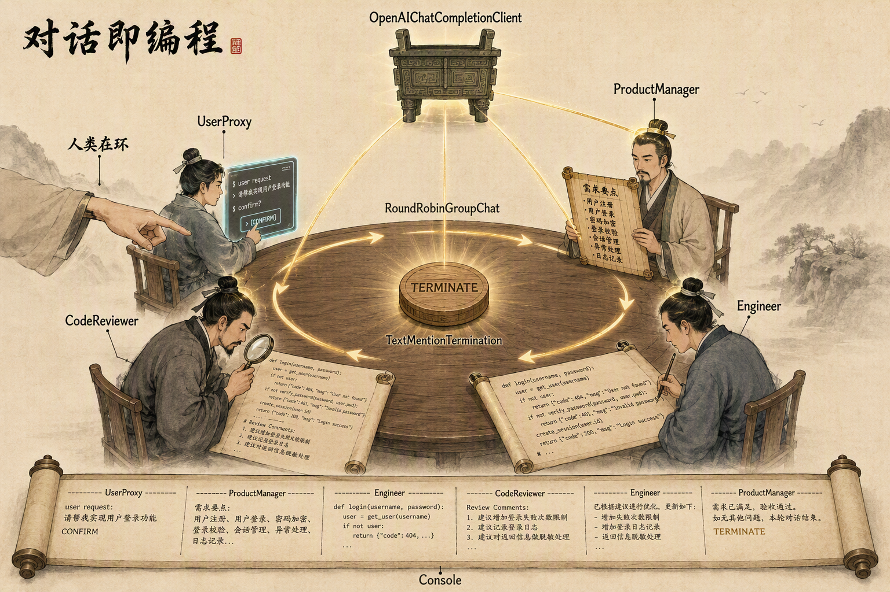
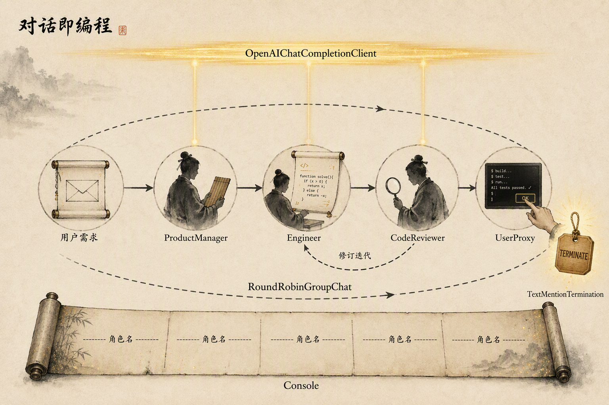

# 第六章：AutoGen 软件开发团队协作

源码：[autogen_software_team.py](../code/chapter6/AutoGenDemo/autogen_software_team.py)、[output.py](../code/chapter6/AutoGenDemo/output.py)

## 学习目标

理解 AutoGen 的「对话即编程」设计理念：把智能体组织成团队，用「轮流发言 + 终止条件」替代手写控制流，并理解「人类在环」的 UserProxy 角色在本案例中的位置。

## 项目功能

让四个智能体协作完成一个比特币价格显示应用：产品经理做需求分析、工程师写代码、代码审查员提意见、用户代理代表用户验收。全程由模型驱动，产出一个可运行的 Streamlit 应用。

```text
用户需求
-> 产品经理：需求分析、技术选型、验收标准
-> 工程师：编写完整代码
-> 代码审查员：审查并提出修改意见
-> 工程师：按意见修订
-> 用户代理：测试并回复 TERMINATE
-> 终止
```

## 设计理念

### 对话即编程（Conversation-oriented Programming）

这是 AutoGen 与手写控制流最本质的区别。传统的多智能体程序是「写代码调用智能体」：程序决定谁、何时、说什么。AutoGen 反过来，把**对话本身当作控制流**：

```text
不写：for agent in agents: agent.run()
而是：声明参与者、终止条件，让对话自己流动
```

你只定义「有哪些角色」和「什么时候结束」，中间的谁先说、谁说几次、要不要来回修订，由团队自动协商。这类似于把一个多人会议交给会议主持人，而不是给每个人写调度脚本。

### 角色即分工，不是提示词即分工

每个 `AssistantAgent` 的差异**只在于 `system_message`**，模型客户端是共享的。产品经理和工程师用的是同一个模型、同一套代码，唯一的区别是那段角色描述：

```python
AssistantAgent(name="ProductManager", model_client=client, system_message="你是产品经理…")
AssistantAgent(name="Engineer",        model_client=client, system_message="你是工程师…")
```

这说明在 AutoGen 的世界里，「角色」不是代码结构，而是一段 prompt。新增一个角色不需要写新类，只需要多一份 `system_message` 和一个名字。

### 团队编排：轮转（RoundRobin）

`RoundRobinGroupChat` 让参与者**按固定顺序轮流发言**，每人一次，周而复始：

```text
ProductManager -> Engineer -> CodeReviewer -> UserProxy -> ProductManager -> ...
```

它不关心每个人说了什么，只保证「公平轮流」。真正的控制权在**终止条件**手里——只要对话中没人说出 `TERMINATE`，轮转就一直继续（受 `max_turns` 兜底）。

这种编排的优点是简单、可预测；缺点是「呆板」：即使某个角色不需要发言，也必须轮到它。本案例中角色数量少、流程线性，轮转是合适的。

### 人类在环（Human-in-the-loop）

`UserProxy` 是 AutoGen 里一个特殊角色：它**没有模型**，代表真实的人类用户。轮到它时，它会停下来等你从终端输入。

```text
AssistantAgent  -> 有 model_client，自动回复
UserProxyAgent  -> 无 model_client，等待人类输入
```

这体现了 AutoGen 的一个核心理念：**不是所有智能体都必须是 AI**。把人类当作团队的一员，可以在「生成结果」与「拍板验收」之间画一条清晰的线——AI 负责产出，人类负责确认。本案例用它来代表「用户验收」这一步。

但这也带来一个常见坑：如果 `UserProxy` 没有传 `input_func`，它会用默认的终端输入，程序看起来就像「卡住」了（其实是停在 `Enter your response:` 等你输入）。

## 智能体架构总览



这张图把 AutoGen 的「对话即编程」画成一场圆桌会议，意象自外向内对应：

```text
顶部青铜方鼎 + 三条光柱   -> OpenAIChatCompletionClient（DeepSeek）
                            所有 AssistantAgent 共享同一个模型客户端
                            三条光柱分别连 PM / Engineer / Reviewer
左侧伸入的真人手臂        -> UserProxyAgent 没有模型，等待人类输入
圆桌边缘的金色光带        -> RoundRobinGroupChat 的轮转顺序
                            ProductManager -> Engineer -> CodeReviewer -> UserProxy -> ...
桌心刻着 TERMINATE 的令牌  -> TextMentionTermination 终止条件
                            对话里出现这个词，团队就散会
底部展开的长卷轴          -> Console 流式渲染，按「---- 角色名 ----」分段
```

四个角色围坐同一张桌，但只有三个头顶连着光柱——这正是 AutoGen 与 AgentScope 狼人杀最本质的差别：这里**没有信息隔离**，全员看得到所有发言；角色的差异只在 `system_message`，模型客户端是共享的。控制流不是手写的 `for` 循环，而是圆桌上那条轮转的光带加上桌心那块「终止令牌」。

## 代码结构

| 文件 | 职责 |
| --- | --- |
| `autogen_software_team.py` | 定义模型客户端、四个角色、轮转团队和协作流程 |
| `output.py` | 团队协作生成的比特币价格应用示例（Streamlit） |
| `requirements.txt` | 依赖列表 |

## 核心组件

### OpenAIChatCompletionClient

模型客户端，负责和 LLM 通信。它是 OpenAI 兼容的，通过 `base_url` 可以切换到 DeepSeek 等厂商。所有需要模型的智能体共享同一个客户端实例。

### AssistantAgent

有模型的智能体。它接收对话历史，调用模型生成回复，再把自己的回复追加进团队消息流。本案例的 ProductManager、Engineer、CodeReviewer 都是它，只是 `system_message` 不同。

### UserProxyAgent

无模型的「人类代理」。它不生成内容，而是把团队发来的消息转成「需要用户输入」的请求，再把用户输入作为自己的回复送回团队。默认行为是打印 `Enter your response:` 并阻塞等待终端输入。

### RoundRobinGroupChat

团队编排器。维护参与者列表，按顺序让每个人发言，直到终止条件满足或达到 `max_turns`。

### TextMentionTermination

终止条件。检查任意一条消息里是否包含指定文本（这里是 `TERMINATE`）。一旦出现，团队对话结束。这是「对话即编程」的终点：**终止不是代码里的 break，而是对话里的一个词**。

### Console

流式渲染器，把团队对话按 `---------- 角色名 ----------` 分段打印到终端。

## 协作流程

```text
run_software_development_team()
-> create_openai_model_client()      # 一个共享的 DeepSeek 客户端
-> 创建 4 个角色
-> TextMentionTermination("TERMINATE")
-> RoundRobinGroupChat(participants=[PM, Engineer, Reviewer, UserProxy])
-> team_chat.run_stream(task=任务)   # 流式驱动对话
```

实际对话（以本次运行为例）大致是：

```text
user          : 提出比特币应用需求
ProductManager: 需求分析 + 技术选型 + 验收标准 -> "请工程师开始实现"
Engineer      : 输出第一版 Streamlit 代码
CodeReviewer  : 审查，列出问题 -> "请工程师开始实现"(修订)
Engineer      : 输出修订版代码（加降级源、错误分级）
CodeReviewer  : 第二轮审查 -> "请用户代理测试"
UserProxy     : 打印 Enter your response: 等待输入
   （人类输入 TERMINATE）
终止
```

注意角色之间是靠**自然语言**衔接的："请工程师开始实现"、"请代码审查员检查"、"请用户代理测试"——这些是 prompt 里约定的暗号，但它们本身不驱动流程（轮转驱动流程），只是让对话内容读起来连贯。

上面两条线索可以合到一张流程图里看：



图的读法自上而下：

```text
顶部金色光带  OpenAIChatCompletionClient -> 三位 AI 角色共享同一个 DeepSeek 客户端
中部主流程链  用户需求 -> ProductManager -> Engineer -> CodeReviewer -> UserProxy
回环虚线      「修订迭代」：审查意见打回工程师，代码在对话中完成修订
外围大圆环    RoundRobinGroupChat：真正驱动流程的不是箭头，而是这个环
右侧令牌      TextMentionTermination：UserProxy 说出 TERMINATE，团队散会
底部卷轴      Console：整场对话按「---- 角色名 ----」分段流式打印
```

注意图里两条「控制流」的区别：中部那条从左到右的箭头链是**任务内容的流向**（需求变成代码、代码变成验收结论），外围的圆环才是**程序的控制流**（决定下一个发言的是谁）。AutoGen 的「对话即编程」正体现在这里——你只声明圆环和令牌，箭头链是对话自己长出来的。

## 与 AgentScope 案例的对比

同一章里，AgentScope 狼人杀和 AutoGen 团队协作是两种不同的多智能体范式：

| 维度 | AgentScope 狼人杀 | AutoGen 团队协作 |
| --- | --- | --- |
| 控制流 | 显式：游戏主循环逐个调用阶段 | 隐式：轮转团队 + 终止条件 |
| 消息可见性 | 由 MsgHub 广播域精确控制 | 团队内全公开（无信息隔离） |
| 结构化输出 | Pydantic 注入工具 schema，取 `metadata` | 不依赖结构化输出，纯文本对话 |
| 人类参与 | 无 | UserProxy 代表人类 |
| 终止 | 胜负判定（业务逻辑） | 对话中出现 `TERMINATE` |

AgentScope 适合需要**精确控制信息流和输出结构**的场景（游戏、严格协议）；AutoGen 适合**让多个角色自由对话协作产出**的场景（软件团队、头脑风暴）。前者把规则写进代码，后者把规则写进 prompt 和对话。

## 我的理解

AutoGen 的核心是「把对话当成程序」：角色是 prompt，编排是轮转，终止是一句话，人类也是一个参与者。它的生产力来自**极低的搭建成本**——定义一个团队，几十行代码就能让多个智能体协作产出一段可运行的软件。

代价是**控制力弱**：你无法精确决定谁说、看到什么、以什么结构输出，只能通过 prompt 和终止条件间接引导。当任务需要严格的信息隔离或可靠的结构化结果时（如狼人杀的身份保密），这种「公开对话」的模型就不够用了，这正是 AgentScope 用 MsgHub 和 Pydantic 要解决的问题。

所以选择哪个框架，本质是回答：**你要的是一群能自由协作、产物由人类把关的「团队」，还是一个信息流可控、输出可校验的「系统」。** 前者选 AutoGen，后者选 AgentScope，或在同一个项目里按阶段混用。
