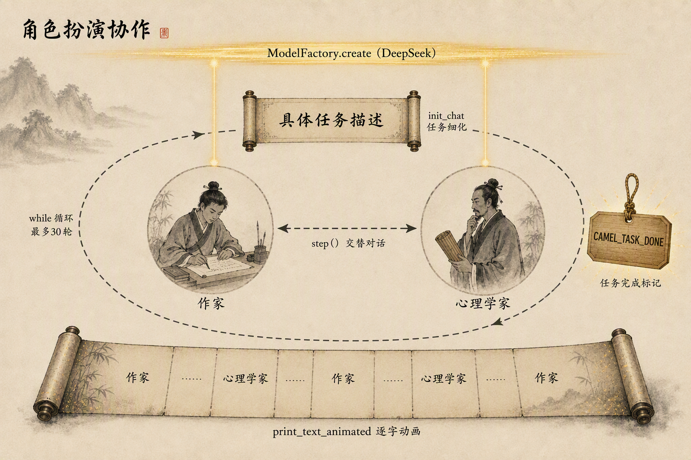

# 第六章：CAMEL 角色扮演协作创作

源码：[DigitalBookWriting.py](../code/chapter6/CAMEL/DigitalBookWriting.py)

## 学习目标

理解 CAMEL 的「角色扮演」范式：让两个智能体分别扮演不同角色，通过交替对话自主协作完成任务，而不是由程序逐条指令驱动；并理解 CAMEL 独有的「起始提示」（Inception Prompt）与任务细化机制。

## 项目功能

让「心理学家」和「作家」两个角色协作创作一本关于「拖延症心理学」的短篇电子书。两个角色围绕任务交替发言：作家负责起草内容，心理学家负责从专业角度把关与补充，直到一方输出任务完成标记。

```text
任务：创作《拖延症心理学》电子书
-> 心理学家（assistant）先发起
-> 作家（user）回应
-> 心理学家再补充
-> 作家再回应
-> ...（最多 30 轮）
-> 出现 CAMEL_TASK_DONE 标记 -> 结束
```

整个过程由模型驱动，没有人工参与，也没有外部工具，纯靠两个角色对话产出内容。

## CAMEL 的核心概念：角色扮演

### 两个智能体，一个任务

CAMEL 的协作单元不是「一个智能体 + 一组工具」，而是**两个角色围绕一个任务对话**。`RolePlaying` 实例化时只需要四样东西：

```python
RolePlaying(
    assistant_role_name="心理学家",   # 助手角色：负责专业把关
    user_role_name="作家",            # 用户角色：负责起草
    task_prompt=task_prompt,          # 要完成的任务
    model=model                       # 共享的模型
)
```

`assistant_role_name` 和 `user_role_name` 决定两个智能体的系统提示词与人设，`task_prompt` 决定它们要一起做什么。CAMEL 论文的原始动机正是：让一个 LLM 扮演「用户」提出需求，另一个扮演「助手」执行，从而**在没有真人参与的情况下自主展开多轮对话**。

### 角色名即人设

两个角色用的是同一个模型、同一套代码，唯一的区别是 `assistant_role_name` 和 `user_role_name` 这两个字符串。CAMEL 会把角色名注入系统提示词，让模型进入对应身份：

```text
你是「心理学家」...   -> assistant agent 的系统提示词
你是「作家」...       -> user agent 的系统提示词
```

所以在这里，「角色」同样不是代码结构，而是一段 prompt。这一点和 AutoGen 的 `system_message` 如出一辙：新增一个角色不需要新类，只需要一个名字。

### 起始提示与任务细化

CAMEL 最具原创性的贡献是**起始提示（Inception Prompt）**。它的流程是：先用一个独立的「任务细化智能体」（task-specify agent）把用户给的粗粒度任务改写为更具体、更可执行的版本，再让两个角色在这个细化后的任务上开始对话。

在代码里能直接观察到这一步：`task_prompt` 原本只有几条泛泛的要求，而 `init_chat()` 之后打印的标题是「具体任务描述」，读到的 `role_play_session.task_prompt` 已经是细化过的版本。也就是说，`init_chat()` 内部做的不只是「开个头」，还包括**先细化任务、再启动对话**两件事。

这一机制的价值在于：用户只需给一句粗略的目标，任务细化智能体负责把它展开成分工明确、可执行的具体描述，从而降低后续对话跑偏的概率。

## 代码结构

| 文件 | 职责 |
| --- | --- |
| `DigitalBookWriting.py` | 创建模型、初始化 `RolePlaying`、驱动对话循环 |
| `requirements.txt` | 依赖（`camel-ai==0.2.75`） |

## 核心组件

### ModelFactory

模型工厂，用 `model_platform` + `model_type` + `api_key` + `url` 创建模型后端。CAMEL 用它在不同厂商（OpenAI、Qwen、DeepSeek 等）之间切换，而 `RolePlaying` 只依赖一个抽象的模型对象，不关心具体是哪家。

### RolePlaying

角色扮演会话，封装了「两个智能体交替对话」这一模式。它内部创建 assistant agent 和 user agent，维护对话历史，并提供 `init_chat()` / `step()` 两个入口。传入的 `model` 会覆盖两个智能体的模型配置。

### init_chat()

初始化会话：先（默认）用任务细化智能体改写 `task_prompt`，再重置两个智能体，并返回一条初始消息。这条初始消息由 assistant agent（心理学家）生成，是整场对话的第一句。

### step()

推进一轮对话。它接收 assistant 的一条消息，内部按固定顺序执行：

```text
user agent（作家）回复 assistant 的消息
-> assistant agent（心理学家）回复作家的消息
-> 返回 (assistant_response, user_response)
```

返回的是两个 `ChatAgentResponse`，各自带 `.msg.content`（正文）。所以一轮 `step()` 其实包含了「作家说一句 + 心理学家回一句」两次模型调用。

### print_text_animated

CAMEL 的打印工具，逐字动画输出文本，让对话像真人打字一样滚动，便于观察两个角色的交流过程。

### CAMEL_TASK_DONE

任务完成标记。当某一方在消息正文里输出这个字符串时，表示任务已完成，程序据此跳出循环。它是 CAMEL 默认约定的「终止信号」——就像 AutoGen 的 `TERMINATE` 一样，终止不是代码里的 break，而是对话里的一个词。

## 协作流程

```text
ModelFactory.create(DEEPSEEK)          # 1. 创建模型
-> RolePlaying(心理学家, 作家, 任务)    # 2. 初始化会话
-> input_msg = init_chat()             # 3. 细化任务 + 心理学家开第一句
-> while n < 30:                       # 4. 交替对话循环
     assistant_response, user_response = step(input_msg)
     #   user_response   = 作家本轮的发言
     #   assistant_response = 心理学家本轮的发言
     打印 作家 / 心理学家
     if "CAMEL_TASK_DONE" in user_response.msg.content: break
     input_msg = assistant_response.msg  # 把心理学家的最新消息交给下一轮
```

注意两点：

1. **实际对话顺序**是「心理学家开第一句 -> 作家回 -> 心理学家再回 -> 作家再回 ...」，即 assistant 先发起、user 先接话。而代码里打印时先打 `user_response`（作家）再打 `assistant_response`（心理学家），对应的是 `step()` 内部「user 先回复、assistant 后回复」的执行顺序。

2. **终止标记检查的是 user 的消息**（`user_response.msg.content`），因为本案例里「作家」承担写作主体的角色，由它来宣布「书写完了」；而下一轮的输入取的是 `assistant_response.msg`，让心理学家继续往下接。

整个流程可以合到一张图里看：



图的读法自上而下：

```text
顶部金色光带  ModelFactory.create (DeepSeek) -> 两个角色共享同一个模型
中上卷轴      init_chat 内部的任务细化，把 task_prompt 展开成「具体任务描述」
中部两个圆框  左「作家」(user)、右「心理学家」(assistant)
              中间双向虚线箭头是 step() 的一轮：作家先回、心理学家再回
外围虚线回环  while 循环，最多 30 轮
右侧木牌      CAMEL_TASK_DONE，任务完成标记——终止不是 break，而是对话里的一个词
底部长卷轴    print_text_animated 逐字动画，对话按「作家 -> 心理学家 -> ...」交替展开
```

## 模型接入：改用 DeepSeek

原案例使用阿里云百炼的 Qwen。本项目改为 DeepSeek，配置统一从 `code/.env` 读取：

```python
CODE_ROOT = Path(__file__).resolve().parents[2]   # code/ 目录
load_dotenv(CODE_ROOT / ".env", override=False)

DEEPSEEK_API_KEY   = os.getenv("DEEPSEEK_API_KEY")
DEEPSEEK_BASE_URL  = os.getenv("DEEPSEEK_BASE_URL", "https://api.deepseek.com")
DEEPSEEK_MODEL     = os.getenv("DEEPSEEK_MODEL", "deepseek-flash")

model = ModelFactory.create(
    model_platform=ModelPlatformType.DEEPSEEK,   # 平台切换为 DeepSeek
    model_type=DEEPSEEK_MODEL,                    # "deepseek-flash"
    url=DEEPSEEK_BASE_URL,
    api_key=DEEPSEEK_API_KEY,
)
```

CAMEL 的 `ModelPlatformType` 原生包含 `DEEPSEEK`，而 `model_type` 可以直接传字符串，所以自定义模型名 `deepseek-flash` 无需在枚举里注册即可使用。

与同章的 AgentScope 案例不同，这里**不需要**处理 `reasoning_content` 回传和流式解析问题：

- `.env` 中 `DEEPSEEK_THINKING=disabled`，关闭思考模式，模型不会返回 `reasoning_content`；
- CAMEL 的 `RolePlaying` 是纯对话，不调用工具，也不涉及结构化输出的流式解析。

因此本案例只需「换平台 + 换模型名」即可跑通，这也是三个框架里接入 DeepSeek 成本最低的一个。

## 与同章其他框架的对比

CAMEL 的角色扮演、AgentScope 的狼人杀、AutoGen 的团队协作，是第六章里三种不同的多智能体范式：

| 维度 | CAMEL 角色扮演 | AgentScope 狼人杀 | AutoGen 团队协作 |
| --- | --- | --- | --- |
| 协作单元 | 两个角色交替对话 | 多个玩家 + 主持人 | 多角色轮转团队 |
| 控制流 | `while` + `step()` | 显式游戏主循环 | 轮转团队 + 终止条件 |
| 消息可见性 | 双方全公开 | MsgHub 精确隔离 | 团队内全公开 |
| 结构化输出 | 纯文本 | Pydantic 工具 schema | 纯文本 |
| 终止信号 | `CAMEL_TASK_DONE` | 胜负判定 | `TERMINATE` |
| 接入成本 | 最低（无工具、无流式） | 最高（需关思考、关流式） | 中等（需声明模型能力） |

CAMEL 是三者里**最简**的一个：没有信息隔离、没有结构化输出、没有复杂的编排，就是两个角色轮流说话。它最接近论文最初提出的「让 LLM 互相扮演角色」这一朴素想法。

它和 AutoGen 最接近——两者都靠对话推进、都共享模型、都用对话里的一个词做终止。区别在于：AutoGen 把「参与者 + 终止条件」拆成独立对象（`RoundRobinGroupChat` + `TextMentionTermination`），由你自由组合；CAMEL 则把「两个智能体交替对话」这一模式**固化成一个 `RolePlaying` 类**，你只需要给两个角色名和一个任务。前者更灵活（可扩到任意人数、任意终止逻辑），后者更省事（两行参数就搭起一场协作）。

## 我的理解

CAMEL 的价值在于把「角色扮演」压缩到了极致：两个角色名 + 一个任务，就是一次完整的自主协作。它的「起始提示 + 任务细化」思路尤其值得借鉴——在真正的多轮对话开始前，先用一个智能体把模糊目标翻译成可执行的具体任务，能显著降低后续跑偏的概率。

代价同样明显：`RolePlaying` 只有两个角色、没有信息隔离、没有结构化输出，控制力是三种范式里最弱的。当任务需要身份保密（狼人杀）、可靠的结构化结果（投票）或人类验收（软件交付）时，这个「两角色公开对话」的模型就不够用了，这正是 AgentScope 和 AutoGen 各自补强的地方。

所以三者并不互斥，而是一个从「简单对话」到「可控系统」的谱系：**CAMEL 教你怎么让两个角色聊起来，AutoGen 教你怎么把一群人组织成团队，AgentScope 教你怎么精确控制谁看到什么、以什么结构产出。** 选哪个，取决于你需要的是「一次对话」、「一个团队」，还是「一套信息可控的系统」。
