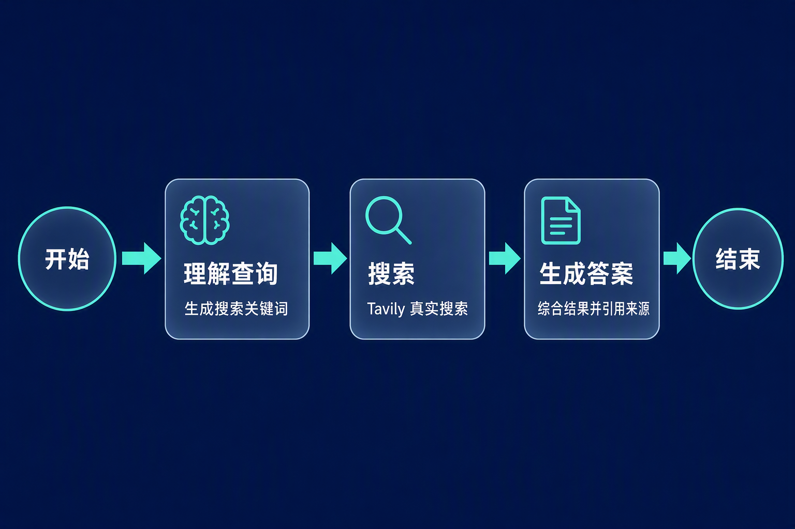

# 第六章：LangGraph 智能搜索助手

源码：[Dialogue_System.py](../code/chapter6/Langgraph/Dialogue_System.py)

## 学习目标

理解 LangGraph 如何用「图」显式表达智能体工作流：节点是处理步骤、边是控制流、状态是节点间共享的数据；并掌握 `StateGraph`、`reducer`、`checkpointer` 三个核心机制的含义。

## 项目功能

一个三步智能搜索助手，把「搜索增强回答」拆成三条流水线：

```text
用户提问
-> 理解查询，生成搜索关键词
-> 调用 Tavily API 真实搜索
-> 基于搜索结果生成带来源的回答
```

相比第四章用 SerpApi 手写 ReAct 循环，这里换成了 LangGraph 编排 + Tavily 搜索，回答会引用真实来源。

## 本章定位：从手写循环到显式图

第四章的 ReAct 需要自己拼提示词、用正则解析 `Action: Search[...]`、自己维护 `history` 字符串，控制流藏在 `while` 循环里。LangGraph 把这些职责显式化：

| 职责 | 第四章 ReAct | LangGraph 做法 |
| --- | --- | --- |
| 控制流 | 藏在 `while` 循环里 | 显式声明节点 + 边 |
| 状态 | 自己维护 `history` 字符串 | `TypedDict` 定义状态 schema |
| 消息合并 | 手写字符串拼接 | `add_messages` reducer |
| 记忆 | 无（每轮重传整个历史） | `checkpointer` 保存状态快照 |
| 输出协议 | 正则解析 `Action` 文本 | 节点间传结构化状态，无需解析 |

核心变化是：**程序不再靠解析模型输出来推进流程，而是把流程画成一张图**。谁先谁后、每一步读什么写什么，都由图结构决定，不再依赖模型"说对格式"。

## LangGraph 的三个核心机制

### 1. StateGraph 与 State：状态是显式声明的

`SearchState` 用 `TypedDict` 声明，图从这个类型推导出节点函数的输入输出：

```python
class SearchState(TypedDict):
    messages: Annotated[list, add_messages]
    user_query: str        # 用户查询
    search_query: str      # 优化后的搜索查询
    search_results: str    # Tavily 搜索结果
    final_answer: str      # 最终答案
    step: str             # 当前步骤
```

每个节点函数接收整个 `state`，返回一个「要更新的字段」字典，框架负责把返回值合并回状态。节点不关心别人怎么处理，只关心自己读写哪些字段。

### 2. reducer：决定字段如何合并

`messages` 字段标注了 `Annotated[list, add_messages]`，意思是「节点返回的新消息要**追加**到已有列表，而不是覆盖」。这是 LangGraph 状态合并的关键：

```text
普通字段：节点返回的新值直接覆盖旧值
messages：用 add_messages reducer 追加，保留历史
```

因为三个节点都会往 `messages` 里塞新消息，如果不用 reducer，后一个节点就会把前一个节点的消息覆盖掉。`add_messages` 来自 `langgraph.graph.message`，专门处理 `HumanMessage` / `AIMessage` 列表的累积。

### 3. checkpointer：让图有记忆

```python
memory = InMemorySaver()
app = workflow.compile(checkpointer=memory)
```

传入 `checkpointer` 后，图每次运行会把状态快照存起来，用 `thread_id` 区分会话。这是 LangGraph 支撑多轮对话、断点重放、人机交互的基础设施——它不改变图的逻辑，只是给图加了一层「记忆」。

`InMemorySaver` 存在内存里，进程结束即丢；要持久化需换成 `SqliteSaver` 或 `PostgresSaver`。

## 工作流：三个节点的线性 DAG

```text
START -> understand -> search -> answer -> END
```



### understand：理解查询并生成搜索词

从 `state["messages"]` 里找出最新的 `HumanMessage`，让模型总结需求并产出搜索关键词：

```text
格式：
理解：[用户需求总结]
搜索词：[最佳搜索关键词]
```

随后从模型回复里用 `split("搜索词：")` 抠出关键词。注意这里又回到了「用文本协议解析模型输出」——如果模型没按格式写「搜索词：」，就会退回用原始问题直接搜索。这是本案例里唯一一处残留的手工解析。

### search：Tavily 真实搜索

调用 Tavily API，`include_answer=True` 优先取综合答案，再取前 3 条结果的标题、内容、来源 URL，拼成一段文本：

```text
综合答案：……
相关信息：
1. 标题 / 内容 / 来源
2. …
3. …
```

### answer：基于搜索结果生成答案

把「用户问题 + 搜索结果」一起交给模型，要求综合结果、引用来源、结构化回答。它还有一个降级分支：当 `state["step"] == "search_failed"` 时，改为让模型基于自身知识回答，并说明「这是基于已有知识」。

## 状态如何流转

节点之间共享同一份 `state`，返回值决定下一份 `state`：

```text
初始 state（用户问题）
-> understand 返回 { user_query, search_query, messages, step }
-> search 返回 { search_results, messages, step }
-> answer 返回 { final_answer, messages, step }
```

`step` 字段在节点间充当**控制信号**：`search` 成功写 `searched`、失败写 `search_failed`，`answer` 根据它决定走正常答案还是降级答案。节点间不互相调用，而是通过共享状态传递信息——这是图式编排与函数式调用的本质区别。

## 三个值得注意的细节

### 1. 这是一张「线性图」，没有循环

LangGraph 最强大的能力是**循环边 + 条件边**——ReAct 的「思考 → 行动 → 观察 → 再思考」循环，正是靠条件边判断「是否还要继续」、循环边回到 LLM 节点实现的。但本案例是固定的三步线性 DAG，一条循环边都没有。

所以它更像 LangGraph 的「入门用法」：演示了 StateGraph、reducer、checkpointer，但还没用上 LangGraph 真正的杀手锏——循环。

### 2. thread_id 每次都新建，多轮记忆没被用上

```python
session_count += 1
config = {"configurable": {"thread_id": f"search-session-{session_count}"}}
```

每个问题都自增一个全新的 `thread_id`，意味着每次都开启全新会话，`checkpointer` 里存的记忆每次都被清空。换句话说：**checkpointer 在这个例子里被装上了，但多轮记忆的能力没有真正启用**。若想让助手记得上一轮对话，需要复用同一个 `thread_id`，并且把历史消息喂给模型。

### 3. LLM 调用只带当前 prompt，不带历史

每个节点调用模型时，只传了当前节点的 `SystemMessage`（如 `understand_prompt`、`answer_prompt`），并没有把 `state["messages"]` 的历史一起传给模型。所以 `messages` 字段在这里更多是「记录日志」，而非「对话上下文」。

这三点共同说明：**这是一个「流水线」，不是「对话 agent」**——每个节点是独立的一次模型调用，靠结构化状态串联，而不是靠对话历史。

## 容错设计

`search` 节点用 `try/except` 包住 Tavily 调用，失败时不中断流程，而是把 `step` 写成 `search_failed`、把错误信息塞进 `search_results`，让 `answer` 节点走降级分支。这让整条流水线在搜索 API 不可用时仍能给出回答，代价是回答质量依赖模型自身知识。

## 与本章其他框架的对比

同一章里，AgentScope、AutoGen、LangGraph 是三种不同的多智能体/工作流编排范式：

| 维度 | LangGraph | AgentScope 狼人杀 | AutoGen 团队协作 |
| --- | --- | --- | --- |
| 控制流 | 显式图（节点 + 边） | 显式主循环 + MsgHub | 隐式轮转 + 终止条件 |
| 状态 | `TypedDict` + reducer | 游戏状态 + 各自记忆 | 团队消息流 |
| 记忆 | checkpointer | Memory 对象 | 对话历史 |
| 信息隔离 | 由图结构决定 | MsgHub 广播域精确控制 | 无（全公开） |
| 结构化输出 | 无（靠文本约定） | Pydantic 注入工具 schema | 无（纯文本） |
| 适用场景 | 显式、可调试的多步流程 | 严格信息隔离与协议 | 自由协作产出 |

LangGraph 的独特价值在于**控制流被显式声明成图**：流程可以画出来、可视化、断点调试、重放。它最接近「手写代码」的思维，只是把状态管理和流转交给了框架，而不是把控制流藏进对话（AutoGen）或广播域（AgentScope）。

## 我的理解

LangGraph 回答的核心问题是：**多步骤智能体工作流的控制流，该如何表达？** 它不像 AutoGen 把控制流藏进对话，也不像 AgentScope 靠游戏主循环逐个调用，而是把流程画成一张图——节点是步骤、边是顺序、状态是节点间流动的数据。这种显式性让流程可读、可调试、可复用。

但这个案例也暴露了一个常见误区：**用了图，不一定就用上了图的能力**。它把三步搜索做成线性 DAG，没有循环；装了 checkpointer，却每次都换 `thread_id`；声明了 `messages` 字段，却没把历史喂给模型。这些「装了但没用上」的细节提醒我，LangGraph 真正的价值不在固定流水线，而在**需要根据中间结果反复决策的循环**——那正是第四章 ReAct 手写循环最该被框架接管的场景。

换句话说，这个例子画出了「图」的形状，却还没画出「图」的灵魂：循环边和条件边。理解「图」只是第一步，理解「循环」才是它区别于普通函数编排的关键。
