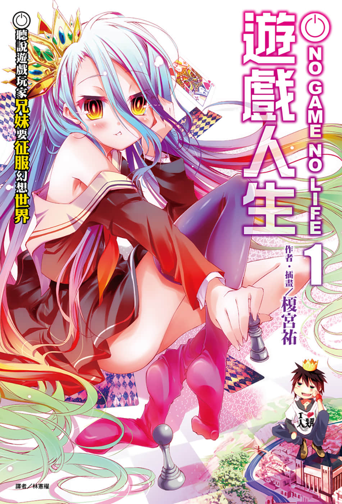
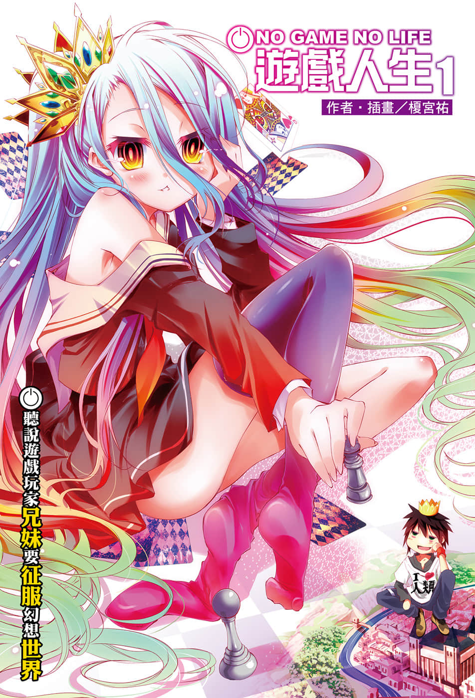
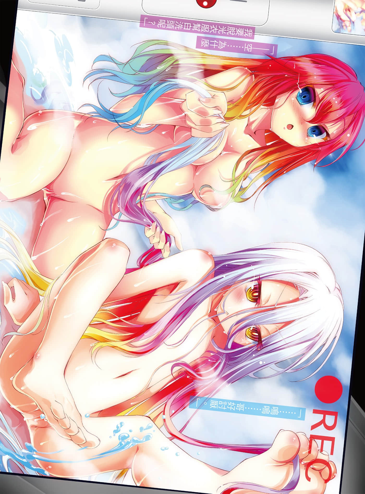
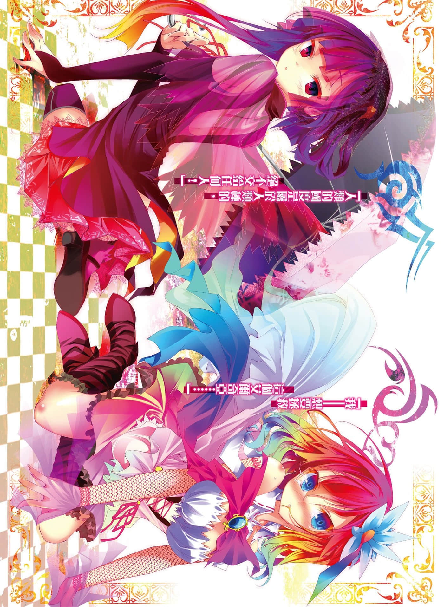
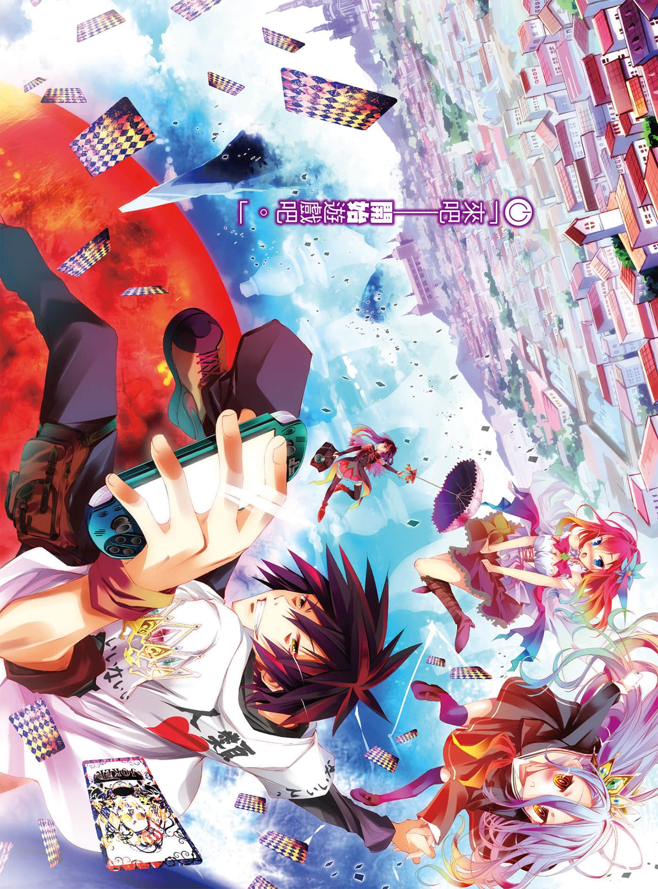
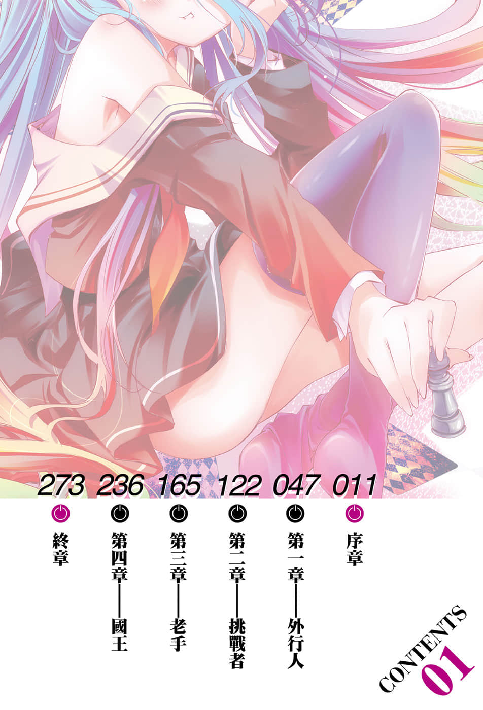

# 插图

> 来源：https://www.linovelib.com/novel/9/118061.html

台版 转自 深夜读书会

作者：榎宫祐

插画：榎宫祐

译者：林宪权

图源：深夜读书会

录入：深夜读书会

深夜读书会：ritdon.com

仅供个人学习交流使用，禁作商业用途

下载后请在24小时内删除，深夜读书会不负担任何责任

请尊重翻译、扫图、录入、校对的辛勤劳动，转载请保留信息

————————————————

【内容简介】

超强兄妹搭档闯关，

用游戏征服世界！

空与白既是尼特族又是家里蹲，但是在网路上却是被奉为都市传说的天才游戏玩家兄妹。称世界为「烂游戏」的两人，某一天被自称是『神』的少年召唤至异世界，那是个战争为神所禁止，只能『用游戏决定一切』的世界——没错，甚至连国界也是一样。

被其他种族逼至绝境，只剩下最后都市的『人类种』，空与白这两个废人兄妹能够成为异世界的『人类救世主』吗？

『——来吧，游戏开始了。』

【作者简介】

榎宫祐

大家好，我是榎宫祐。

榎宫祐

无论经验多少次，第一集总是令人紧张，不过先别管紧张了，话说作者是为了治病而来到巴西，却窝在亲戚家，花了三个礼拜写作原稿，就算被人吐槽「你到底是为什么来巴西啊」，那也是理所当然的事吧，而且竟然还特地打国际电话询问编辑「一太郎（文字处理软体）不能在mac平台使用吗！？」，你知不知道羞耻啊！

这是我的出道作，所以我非常紧张，不过——负责插画的那位突然改变执笔环境、跷掉icc、尝试在巴西作画、为了画而修改本文，真是有点太过放纵了，你要好好反省喔。

啊……那个、我喜欢画画和游戏♪

【绘者简介】

大家好，我是负责插画的榎宫祐。

啊～我喜欢小说和游戏。（*ˊ∀`）

