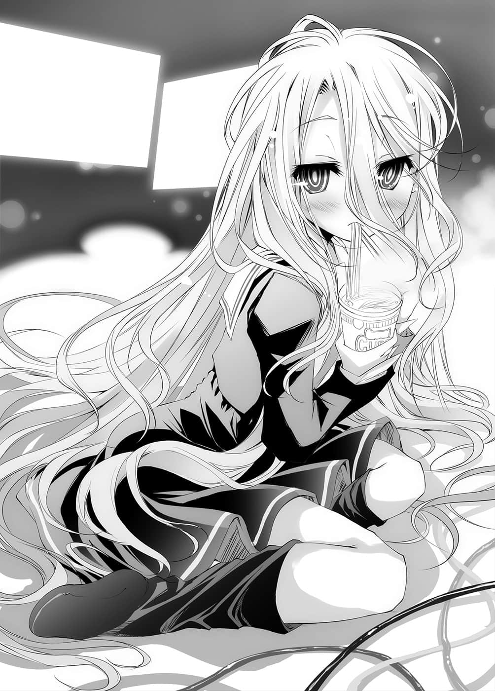

# 序章

> 来源：https://www.linovelib.com/novel/9/2041.html

——『都市传说』。

世上流传的都市传说多如繁星，它们也是一种『愿望』。

——好比说，『人类其实没有登陆月球』的谣言。

——好比说，共济会隐藏在美钞上的阴谋。

——好比说，费城计划所进行的瞬间移动实验。

千代田线有辐射避难所的传闻、51区、罗斯威尔事件等等……

检视这些不胜枚举的都市传说，不难看出有个明确的法则。

那就是……它们都是由『如果真有其事那才好玩啊』这个『愿望』所构成。

正所谓无风不起浪。

但是『谣言』一旦有了尾鳍，就会传闻得比鱼更加肥大，考虑到这样的性质，这些都市传说形成的过程就不言可喻了。

简单说就是有根没据。

说得更直接一点就是，大半都是编造出来的。

但是那也没什么奇怪或好责怪的。

因为自古以来，人都是偏好『必然』更甚于『偶然』。

甚至比起人类诞生是天文机率下的偶然产物这个事实，人们更本能地依照经验法则期盼，是某个人有计划地创造了人类。

期盼世界并非出于混沌，而是由秩序所构成。

借由想像有人在背后操控一切，想要在这紊乱且不讲理的世界找出意义。

……至少人们希望是那样。

因此可以说都市传说大多都是由那种殷切的『愿望』所产生。

——不过——

就会看到列出名符其实该以『无数』形容的战功，以及未食败果的对战成绩。

「……吸吸（吸面声）……用脚操控两只滑鼠……太勉强了……」

这确实是至今在超过二百八十种游戏的世界排名顶端屹立不摇，如今也持续创造无法打破的纪录，传说中的游戏玩家『 空白』——他的真面目就是————！

「别废话了，快点帮我复活——喂，妹妹啊，你太狡猾了吧！我都已经三天没吃东西了，你却一个人优雅地在那边吃泡面，而且还是在战斗中！」

「喔，好了，谢啦～……对了，现在几点了？」

「……呃……才凌晨八点……」

「妹妹啊，把早上八点说成凌晨，这可真是崭新的修辞啊，那今天是几日呢？」

室内的两人说道：

没有人知道他的真面目——那也是加速谣言化为都市传说的主要原因。

因为不管在任何主机、任何社群网站上，都确实存在以『 空白』名义登录的使用者帐号，而且调出任何人都能调阅的战绩一看——

只充满了偶然。

没错，任谁都会这么想。

——以上。

但是无数的游戏机，以及一人四台——总计八台电脑上连接的线路铺满地面，有如现代艺术般错综复杂，加上开封后的游戏盒、他们称为『兵粮』的泡面与宝特瓶散乱一地，让人感受不到房间原本的宽敞。

总归来说，正如前述一般，都市传说就是人们的『愿望』。

穿着令人联想到典型家里蹲的牛仔裤与Ｔ恤，一名披头散发的黑发青年。

少女的发色仿佛要引人怀疑两人的血缘关系般，是与哥哥形成对比的纯白色，似乎未经整理的长发遮住了脸，身上是自转学那天以来未曾在家中以外的地方穿过的小学水手服制服。

——于是乎，谜团变得更深了。

「……对尼特族的哥哥来说……几号有差吗？」

『那人是能够删除自己败绩的电脑骇客。』

「……我也不知道……一、二——第四碗泡面……所以是第四天？」

尽管存在事实根据，『谣言』却演变得更加超脱现实。

咻啪……叮铃！

「……吸吸（喝汤声）……嗯，好。」

兄——空，十八岁，无业，处男，阿宅，患有沟通障碍，游戏废人。

「……哥要吃吗……？CalorieMate㊟……」

我接下来说的千真万确。

极少人知道，在那多如天上繁星的『都市传说』之中，也包含了『虽是事实却被视为都市传说』的谣言。

不管是察觉这个事实的人，还是不愿承认的人，他们都希望这世界能够更有趣一些。

据说……据说……据说——

「谁要吃CalorieMate那种有钱人的食品啊！别说了，快帮我复活！」

而是也有发生原理与那些不同的都市传说。

根本没有任何意义。

据说……那人的打法风格超乎常理，让人无法预测。

房间——大约八坪左右，空间算是相当宽敞。

据说——有个玩家在超过二百八十种游戏的线上排名树立无法打破的纪录，却取了『空白』这个蔑视世界排名顶点的玩家名称。

「不不，妹妹啊，我不是问熬夜的天数，我是在问几月几号啦。」

---

■ ■ ■

——沉迷网路游戏的一对男女。

「……啊……快死了快死了……啊，死了……喂……快帮我复活～」

既然对方在家用游戏、电脑游戏和网页游戏的线上排名取得第一名，那就表示那位玩家一定会有帐号。

那是一个在网路上被谣传得绘声绘影，关于一个叫『 空白』的玩家的谣言。

——好了，至此已经向各位解说过『都市传说』形成的过程。

这并不夸张……因为方法很简单。

源自于那样殷切盼望下而诞生的就是——『都市传说』。

据说……即使使用辅助程式或外挂也赢不了他。

但是很奇怪地，与之对战过的人却层出不穷。

之后两人之间就不再有对话了。

但是怎么可能有那种人存在——

只要是对那种『谣言』有一点兴趣的人，都会进一步追究。

因为尽管那人拥有帐号，也有可以让他发声的场所，他却从未说过一句话，不曾与人交流，也不提供任何情报，因此除了勉强知道对方是日本人之外，其他的一切全属谜团。

——请不要误会，我并不是说前述的都市传说是真实。

也不合理。

「——你才是呢，今天也不去上学吗？」

照在房间里的光线，只有游戏玩家偏好的高反应速度ＬＥＤ显示器所发出的微光，以及早已升起的太阳从遮光窗帘照落的阳光。

让我为各位介绍——

各位一定觉得「怎么可能有那种事」对吧？

我现在说的这个就是属于那样的『谣言』。

（译注：由日本大冢制药生产的能量补充食品品牌。）

既不讲理。

妹——白，十一岁，拒绝上学，没朋友，饱受同学欺负，患有对人恐惧症，游戏废人。

这就是『 空白』——也就是『空与白』这个游戏玩家的真实身份。

而既然有使用者帐号的话，那应该能够调阅他的战绩。

这个世界混沌不堪。

就这样，于是又诞生了新的『都市传说』。

——比如说过于离奇而演变成『都市传说』的『谣言』。

若是像这样嗤之以鼻，抱持这种想法去调查——就会发现自己大错特错了。

而大家归纳出的推论也很单纯。

据说……那人所向无敌。

那就是——某游戏的开发人员为了不暴露身份，在排名中输入了『空白栏位』，却不知不觉造成一股风潮，自此演变为一种形式，其实那是不存在的玩家。

「……」

---

■ ■ ■

「……」

这世上也存在着像这种宁愿不知道还比较有梦的都市传说。

『那是聘请游戏高手的玩家集团』——等等。

「有差啊！我要注意网路游戏的活动举办日和排名大会啊！」

据说……那人甚至完封连国际西洋棋大师Ｇｒａｎｄｍａｓｔｅｒ也不敌的西洋棋程式。

所以——

「……哥，你……不去找工作吗？」

——不过就这个情况而言，让『 空白』这个谣言诞生的本人也要负起一些责任。

在屋内对话的两人视线不曾交会。

没有所谓的必然。

——那么在此就让我帮各位，让枯燥无味的现实变得有趣一些吧。

也就是说——我要提供各位一个『新的都市传说』。

——进行这样的行为时，做为一句固定台词，同时也是形式之美。

——我想用这句话做为开头。

——那就是『您听过这样的传说吗？』。

据说只要是在游戏上强得过头的玩家，某一天就会收到一封邮件。

邮件的本文只有谜一般的语句，以及前往某游戏的『ＵＲＬ邀请函』。

只要通过那个游戏——

---

■ ■ ■

「……不行了……我要睡一下。」

「喂！等等！你现在下线就没有补师了！」

「……哥你办得到的。」

「理论上是那样吧！如果我用双手操纵现在的两个角色，再用双脚控制你放弃操纵的两个角色的话啦！」

「……加油。」

「等等！等一下啊，白小姐！你这么一睡，大家会——或者该说基本上就是我一个人会死掉啊——呜喔喔喔喔！我拼了啦！」

当妹妹累积的泡面空容器数量到达五个时。

也就是在不眠不休的第五天，房间响起兄妹俩这样的对话。

不理会哥哥悲痛却又心怀觉悟的呐喊，妹妹正准备要枕着游戏机睡去，这时她的耳朵却听到——咚隆。

从电脑传来收到新邮件的通知声。

「……哥，邮件。」

「虽然不知道你对于操纵四个画面四个角色的哥哥还有什么要求，但我可没空啊！」

「……呼啊……晚安……」

不然她早就默默地回去枕着游戏机睡觉了。

「……这个……」

「什么事呢？为了睡觉而放哥哥一个人游戏，结果不但没睡，还让哥哥一个人做物理上的限制玩法，我亲爱的鬼畜妹妹啊。」

——【您有一封新邮件——主旨：致『 空白』们。】

就在空也感到不对劲的同时，白站起来说道：

「……咦？奇怪，这家伙。」

「……不说是白的朋友……理由……不用我说吧。」

但问题不在主旨，而是在本文里。

过去有个程式曾经在对上世界最强西洋棋手——国际西洋棋大师大获全胜。

妹妹侧着头略感疑问。

「三点钟方向，左边数来第二堆小山上，从上面数来第四个H-game的下面！唔喔，我的脚快抽筋了！」

然而——下了五步、十步之后。

但是自从妹妹对战那个程式二十连胜之后，她就很久不再对西洋棋产生兴趣了。

不是他自夸，自己别说是女朋友了，就连朋友都没有，当然不可能存在会寄邮件给他的「友人」，所以这个说法就可以否决了。

「……？」

「——谁的朋友？」

「……哥，换手……」

ＵＲＬ的结尾并没有「﹒ＪＰ」这种表示国家的文字列。

文面让人感到有些，不，是相当阴森恐怖。

「……要怎么办？」

「……哥，平板电脑在哪……？」

对战邀请、邀约采访、挑衅的挑战信——这些都多的是，不过这封信——

（编注：Two Person Zero Sum Finite Game of Perfect Information，为建立在赛局理论中的一种游戏分类。）

各位一定感到疑问，家里蹲的尼特族用平板电脑做什么吧？

不过对于仿佛知道两人真实身份的内容，妹妹似乎也觉得不寻常吧。

当然是——游戏用。

「喂、等一下啦，这可是对『 空白』下的挑战书喔，对方若是高段的西洋棋程式，那我一个人是应付不来的啊。」

「『 空白』是不能输的，你至少等了解对手的实力后再睡吧。」

于是空开始下起西洋棋。

一个人操纵四人队伍，活跃地大杀四方的哥哥，无暇分身地如此回答。

在这个完全没有『运气』左右胜负的竞赛中，理论上确实存在必胜法，但那完全只存在于理论上，除非能够完全掌握多达十的一百二十次方种棋局变化才办得到。

白发挥异样的记忆力，一下子就找出了信件。

本文只写了这么一句，并且贴着ＵＲＬ。

「……对方为什么知道『 空白』是兄妹？」

「打算跟我玩心理战吗？好吧，就算对方是虚张声势，陪他玩玩也无妨。」

确认过确实无误地存档之后，他关掉开了五天的游戏画面。

也就是说，她断言她能预测十的一百二十次方种棋局变化，并且以此对战名符其实的世界最强西洋棋程式，取得二十连胜。

「那么果然是广告邮件吧，话说你要睡就快睡！不睡就来帮忙啊啊啊啊！啊、啊啊！要死掉了，要死掉了！」

他灵活地利用双手双脚，同时操作着四只滑鼠。

而且那是从未见过的ＵＲＬ。

那是在直接连接特定网页脚本——也就是游戏位址时会看到的ＵＲＬ。

「……唔唔……我知道了。」

为了防范病毒之类的攻击，他是在开启防毒软体的情况下，试着按下那串连结。

【你们兄妹有没有感觉过，自己生错了世界呢？】

妹妹似乎没什么兴趣地问道。

——确实，哥哥也知道网路上有流传空白不止一人的说法。

也就是说，事实上等于没有必胜的方法。

但……出现的却是极为简单素朴，非常单纯的西洋棋棋盘。

另外——哥哥似乎真的一个人操纵了四个角色，以即时战斗的方式讨伐成功了，听着背后哥哥胜利的咆哮声，白开始检视邮件。

「……这是什么啊。」

该说他们效率至上呢。

「哈哈，真奇怪，我感觉我被亲爱的妹妹挖苦了呢。」

——西洋棋是『两人零和有限确定完全情报竞赛㊟』。

不过就这对兄妹而言，他们也有别的用途。

从个人电脑连接上收信箱，然后讶异地说道：

无视痛苦哀嚎的哥哥，白在他所说的地方翻找——发现了。

「……呜……真麻烦。」

空一步又一步地下棋，而白则是兴致缺缺地，不，是一脸困倦，一边打瞌睡，一边看着哥哥的对局。

原本眼皮已经阖上五分之四的白，却突然睁大眼睛凝视着画面。

但这种疑问未免也太过愚蠢了。

哥哥的讽刺她只当成没听见一般，把映在画面上的信件拿给哥哥看。

「反正一定是广告邮件吧，别理它！」

妹妹似乎突然兴趣全失，准备回去睡觉，哥哥却赶紧阻止她。

西洋棋只要下的都是最佳棋步，永远都是先攻获胜，后攻最多只能平手而已。

「是啊……不，你的心情我能理解啦。」

「存档完毕，掉落物确认完毕。」

兄——空。

「……哥的。」

「…………」

哥哥也发现那封信的特别之处了吧。

「……声音是咚隆……那是３号主信箱的收信声……是这个吧？」

因为如果那只是普通广告信当然没有问题。

两人为了玩无数的游戏，办了无数的帐号和电子邮件信箱，基本上个人电脑是当成游戏专用机使用，取而代之就是用这个平板电脑，连接30个以上的邮件帐号，浏览信件。

接手后的妹妹一步又一步地走下去。

——然而，白却能断言「有」。

「……或许是……朋友寄来的？」

还是该说他们是笨蛋呢。

容我再重复一次——十八岁，无业，处男，阿宅，患有沟通障碍，游戏废人。

但是白仍强行打起快要败给睡意的精神，爬了起来。

不过就这一点而言，妹妹——白的情况似乎也一样。

那代表妹妹判断对方的实力不是哥哥所能应付。

她会提不起兴致也不难理解，但是……

哥哥没有任何异议，乖乖地把座位让给妹妹。

有人寄信给『 空白』——也就是「空与白」，并不是特别稀奇的事。

交给哥哥判断——因为她判断这是属于哥哥擅长的领域，也就是说——

但若是『新游戏的广告信』，那她就无法漠视了。

「嗯？——这是什么啊。」

「……事到如今……西洋棋那种东西……」

「……哥。」

空如此判断，然后点下连结。

也就是说，她判断对方的实力足以做为世界最强西洋棋手的对手。

理论上是这样。

妹妹在西洋棋这个游戏上，以一秒能够运算两亿种棋步的程式为对手，在先攻后攻轮流交替下取得二十连胜，证明了电脑程式尚有瑕疵，而那样的妹妹如今却睁大了眼，惊愕地说道：

「骗人……」

——但是一旁的哥哥对于对方的棋路却感觉到不太对劲。

「镇定一点，这个对手是人类。」

「——咦？」

「电脑程式总是下最佳的棋步，虽然专注力不会中断，但只会照着既存的战术下棋，所以你才能取胜，可是这家伙——」

哥哥指着画面。

「他刻意走坏步引诱你，如果你判断那是对方程式出错，就是你的失误了。」

「……呜呜。」

听到哥哥这么说，妹妹却也无话可说。

——确实在西洋棋的棋力上，不，应该说几乎所有的游戏都是如此。

白拥有的技巧都压倒性凌驾于空，她可以说是——天才玩家。

但是事关心理战、互猜心思、勾心斗角等等，在看穿「对方的情绪」这种不确定因素方面——哥哥则是超乎常人的优异。

正因如此，『空白』——因为是两人合力所以才能——不败。

「好了，你镇定一点，既然对方不是电脑程式，那么你更没有输的因素，别中了对方的挑衅，我会指出对方的陷阱和战术，你就冷静应战吧。」

「……了解……我会努力。」

这就是——

一名游戏玩家，能够在众多游戏的世界中，排名独领风骚的秘密所在。

————……

收到的是不成回答的内容。

「……会是什么样的人呢？」

无视规则的人，却志得意满地高高在上——

窗帘遮蔽住阳光，夺走了时间的感觉，仿佛时间停止一般的空间。

对于这个让妹妹伤心的人，哥哥愤怒地敲打键盘输入道：

既不明白这游戏的目的，也没有数据，甚至连类别都不明。

同时，仿佛保险丝烧断一般，啪的一声响起，房间的一切全都停止了。

「……好厉害喔……好久没有……这样苦战了。」

就因为这样一句话。

面对着ＬＥＤ显示器，才刚上演过激烈战斗的两人，他们的背后是——

「啧——真令人不爽。」

——因为看穿他人的内心，说得太过一针见血而遭到疏远。

【了不起，有那么高超的棋艺，想必在你们的世界活得很痛苦吧？】

——妹妹却制止了他。

两人讶异地看着那句话，但是一经想像，他们就无法隐藏对那个世界的向往。

说得太多，介入太深会遭到疏远。

——因为头脑太好，不能被他人理解而遭排挤虐待的妹妹。

……而且是规则与目的皆不明确的无聊游戏。

电脑画面传来些微的杂音。

就在那一瞬间——

原来如此，是这么回事啊。

妹妹曾大赢彻底打败国际西洋棋大师的电脑程式，但此刻她对对战对手产生了兴趣。

两人再度看着彼此的脸，面带自嘲笑着点了点头。

哥哥久违地想要关掉电脑，正将滑鼠游标指向起始功能表的时候，他的耳中再度听到——咚隆♪——收到信件的声音。

『将死checkmate』。

赢得太多会受到处罚。

两人的心情——立刻降到冰点以下。

脑部分泌的肾上腺素与多巴胺，让他们忘了已经五天没睡，甚至赶走疲劳，将两人的专注力提升至极限。

没有拒绝的权利。

输得太多也要受到处罚。

与世界隔离——八坪大的狭小房间。

想起这段实在称不上快乐回忆的过去——不，应该说是现在。

「……这样啊……那下次……我也想用将棋……和龙王㊟对战……」

——这世界是「烂游戏」。

「「————」」

『谢谢你多管闲事，你算哪根葱啊！』

这场没有时间限制的棋局长达六小时以上。

看到这样的句子，他连愤怒也忘了，与妹妹互望一眼。

「龙王会答应下网路将棋吗？算了，就来考虑看看吧！」

由于生气火大的关系，疲劳一口气涌了上来。

「怎、怎么回事！？」

然后几乎是立刻有了回信。

多达七十亿的玩家，恣意地走着自己的棋步。

妹妹默默地低下头去。

在漫长的沉默之后。

空咂舌一声，摸了摸仍低着头的妹妹的头。

——可是收到的那封信上，只是这样写着：

——不，那真的是回信吗？

不用重新确认，答案早就决定了。

是兄妹——获胜。

再度响起邮件收信声。

感受着比赛后安多酚所带来的幸福感，两人笑嘻嘻地谈笑，这个时候——

——甚至连双亲也抛下他们去世，这终于让兄妹关闭了心扉。

「不，说不定对方就是国际西洋棋大师喔？电脑程式虽然正确，却不及人类复杂。」

【如果有一个规则与目的皆很明确的棋盘上的世界，你们会怎么想呢？】

哥哥不予理会，正要按下关机键的时候。

『是啊，如果有那样的世界，那我们还真是生错了世界呢。』

（译注：日本将棋的头衔。）

这里就是兄妹俩的世界——就是他们的一切。

六小时——但是实际上这场对弈却令他们感到有数日之久。

即使遵从既定的规则也会受到惩罚，而且更令人愤怒的是——

「……好、好。」

唯一剩下——显示着信件的那台荧幕。

由于与生具来的超高智商和白头发、红眼睛的缘故，因此没有人理解她的妹妹。

「「哈啊啊啊啊啊～～～～…………」」

从喇叭传来毫无情绪的声音。

【你们觉得你们的世界如何呢？快乐吗？活得舒适吗？】

由于生来头脑就不如人，因而变得极为擅长判读别人的话语和内心的哥哥。

【如果有一个『单纯以游戏决定一切的世界』的话——】

「……太厉害了……哥，对手……真的是人类？」

——咚隆♪

「……嗯？」

然后——

然后，分出胜负的瞬间终于来到。

「应该是刚才对战的对手吧？你打开信箱看看。」

两人长长吐了一口气，说明这场对弈让他们甚至忘了呼吸。

「哈哈，我还是第一次看到你苦战呢。」

长长地吐了一口气后，两人笑了出来。

——刚才上演神一般棋局的那两人已经不见。

只剩下沮丧失意——下场凄惨——即使以社会的眼光看来也虚弱不堪，而且无依无靠，遭到世界排挤的兄妹而已。

哥哥将手放在键盘上。

无机质的光源，电脑、游戏机所发出的风扇声。

——不断地考试不及格，即使被教师、父母责骂，脸上仍是保持笑容的哥哥。

「是啊，不会错的，从你没有中计时的漫长思考，还有设下的陷阱无效时，也能看出对方有些动摇。对方毫无疑问是人类——不然就是实力在你之上的天才怪物。」

——痛苦的记忆在两人的脑海里穿梭。

与这种人生烂游戏相比，任何游戏都——太简单了。

无数的电线爬满地面，垃圾、脱下的衣服散落一地。

——即使默不作声，霸凌仍愈演愈烈。

——像这样，仿照最先收到的信件内容，寄出回信。

整个房间开始窜出杂音。

房子摇晃的声音、有如放电般爆炸的声音。

哥哥慌张地环视周围，妹妹则不知发生何事，只是呆立原地。

而杂音无视两人的心情，变得更加激烈——

终于变成有如电视的雪花杂讯一般。

而且从喇叭——不对……

那无疑是从画面传来。

这次传回的不是文章，而是——『声音』。

『我也那么认为，你们正是生错了世界。』

至此，除了画面以外，房间的一切都被吞没至杂讯之中。

突然，有一只手伸了出来。

「什么！？」

「……咿——」

从画面伸出的手，抓住了兄妹的手臂。

然后以无法抗拒的力量，将两人拉了进去。

拉进画面之中——

『那么我就让你们重生吧——重生在你们该出生的世界。』

——……

然后——

视界一片白茫茫。

「这里就是你们梦寐以求的理想国度【棋盘上的世界・迪司博德】！这是个一切都由单纯的游戏决定的世界！没错——不管是人命，甚至国界也是如此！」

而在空怀中的白则发出无声的惨叫。

「……～～～～～～～～！」

自称是神的少年则是愉快地对着两人说：

于是空呻吟着坐起身来。

「——那、那是怎么回事啊……？」

——是梦吗？

发现自己正站在悬崖边缘，空急忙后退。

「对耶，以你们那世界的说法，就是所谓的——〈神〉——吧？」

以壮大且异常的景色为背景，一名『少年』在落下的途中，张开双臂笑道。

邮件的本文——只有简短的语句，以及贴着某个连结ＵＲＬ。

——不管怎么看，不管看了几遍，都看到……

「……嗯……」

上方是看不习惯的高耸天空，然后——

就这样——两人的意识再度转暗。

「我说妹妹啊。」

兄妹以呆滞的目光，眺望着那样的景色说道。

大概迟了空十秒钟左右吧。

却听见晚空一步醒来的妹妹，如此呻吟道。

「……你、你、你是——谁啊——！」

心里这么想着，空却不把这句话说出口。

或许是终于把握住状况了吧，白睁开双眼，以一脸哭泣的表情抱住哥哥。

感觉到土的触感，闻到草的香味——清醒过来后，空发现自己倒在地上。

「呜……唔嗯……」

也就是说，这——不是梦。

「期待与你们再会，我想那一天一定不会太远吧。」

「别说那个了，重要的是现在该怎么办啦！接近地面了——唔喔喔喔喔喔！白！」

那是因为睁开了眼睛——之所以知道那是阳光，是因为感觉到久违的网膜烧灼之感。

将会被招待前往异世界。

他们现在正是在没有背着降落伞的情况下，进行高空跳伞的途中。

——————………

他们在——空中。

然后——

但是最令他震惊无比的——

空这么想着站了起来，但是他再怎么装作没发现，脚下踩的仍然是泥土。

为了掌握情况，空仿佛要烧坏脑子般加速思考，然后放声大叫：

「……呜呜……奇怪的梦。」

啊啊，妹妹啊。

虽然不知道这么做有没有意义，不过空有如抱住白的手一般，让自己垫在她的下方。

这样的确信，哥哥总共花了三秒钟的时间。

——但是让哥哥发出惊叫的，却是映入眼底的那片异常景色的缘故。

「「不过这次终于『出错了』……真是的，这是什么烂游戏啊……」」

「啊，要死了。」

那样的『都市传说』……您，相信吗？

是从眼下辽阔的云海中，发现自己感觉到的飘浮感，就是自己正在坠落的事实。

在地平线的彼端、群山深处看得到巨大的西洋棋子，巨大到令人丧失了远近感。

也就是说，这是在坠落时见到的，奇异世界的景色。

他听到旁边传来高亢的叫声：

明白了这一切后，从惊叫直到转变成——

少年说着朝远方一指——指向空也看到的，位于地平线彼端的巨大西洋棋子。

而当眼睛终于逐渐适应光线，从映入眼中的景色，哥哥理解到一件事。

只要通过那个游戏————就会从这个世界消失。

眼前是一片不可能出现的景色。

「唔喔啊啊啊啊！」

——但是两人才不管那种事。

「这——这是什么啊～～！」

从狭小的房间，一口气来到广阔的空间。

——就这样，两人意识一黑。

只要点击那个连结，某个游戏就会启动。

「……嗯。」

「我一直认为〈人生〉是坑人游戏，是自虐游戏。」

不过有如要打破那种悲怆的确信一般。

——『您听过这样的传说吗？』——

然而少年却依然愉快地笑着说道：

「唔啊啊啊啊！？」

「欢迎来到我的世界！」

有一座岛浮在空中。

宛如是在哪个游戏中登场的幻想中的景色。

即使对自己的眼睛和脑袋怀疑了无数遍，飞翔在视野尽头的那生物依然是龙。

……不，不对，更正一下。

天空有岛和龙，而地平线群山的彼端则是巨大的西洋棋子。

接着两人齐声说道：

---

■ ■ ■

白使尽全力，发出像是轻声细语般的抗议叫声。

——妹妹啊！枉费我刻意不说出口的说。

那景色不管怎么想，都不是自己所知道的『地球』。

自称神的少年，用食指抵着脸颊，装可爱地说道。

——从崖上放眼眺望一览无遗的景色。

「我吗？我啊～就住在那里。」

请不要插起『这不是梦的旗子』啊。

据说只要是在游戏上强得过头的玩家，某一天就会收到一封邮件。
