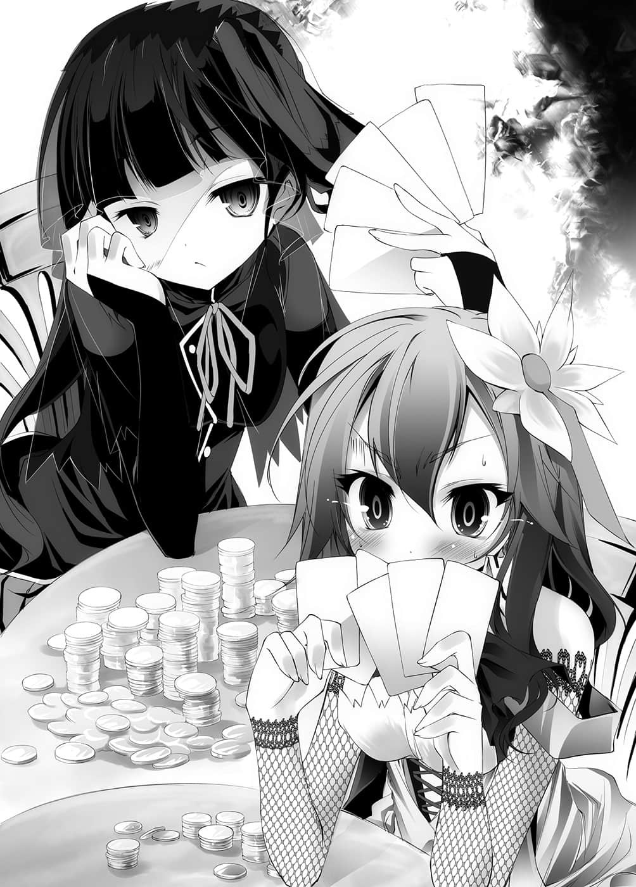
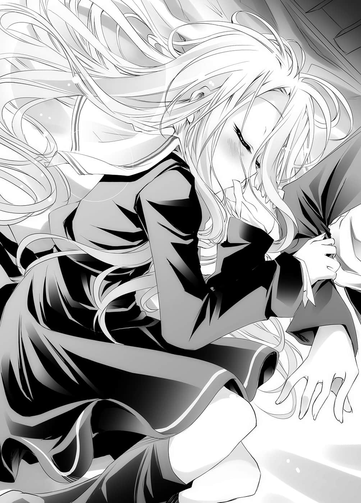
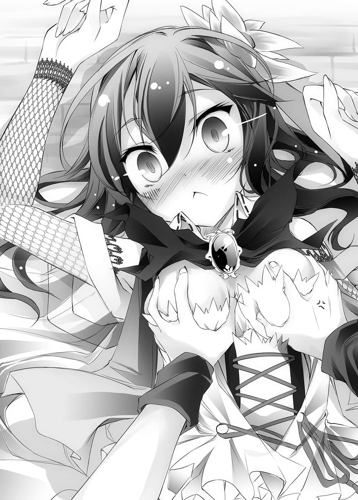

# 第一章 外行人

> 来源：https://www.linovelib.com/novel/9/2042.html

——很久很久以前。

神灵种赌上唯一神的霸权，与其眷属・被创造物们一同展开争夺。

战争持续了长久一段时间。

大地无一处不是染满鲜血，悲鸣响彻每一处天空。

具有知性的生物们彼此憎恨，为了歼灭对方而展开一连串惨烈的厮杀。

森精种们以小型聚落为据点，驱使魔法，猎杀敌人。

龙精种凭藉着本能杀戮，兽人种们则如同野兽般啃食猎物。

大地化为荒芜，被黄昏所吞噬，更因诸神的战乱，而陷入黑暗的深渊。

幻想种突变而成的『魔王』，以及其同胞怪物们，横行于世上。

在那样的世界里，不管是无数的王家、众多美丽的公主，甚至勇者，全部都不存在。

人类种只不过是孱弱的存在。

建立国家，结党聚众，只为生存而赌上一切。

吟游诗人们所歌颂的英雄故事也尚未诞生——那就是这样一个涂满鲜血的时代。

那是这片天空、海洋和大地，尚未被命名为『迪司博德』之前——遥远以前的故事……

但是那场仿佛会永久持续的战乱，却唐突地落幕。

天空、海洋、大地——星球本身憔悴疲弊到极点，使得他们被迫放弃继续与同归于尽无异的战争。

就这样——在那个时点剩下最多力量的一位神，就此登上唯一神的宝座。

祂是直到最后都没有参与战乱……

始终保持旁观的神。

登上唯一神宝座的神，在环视过地上的惨状后……

这个在神话时代，领土曾遍及大陆一半的国家，如今已不复昔日的强盛。

那是一个与年幼少女同样披着兜帽的青年，和一个长着胡子、有着啤酒肚的中年男人。

「啊～我们是刚从乡下来的，不太清楚都会的事情啦。」

「对啊，因为前任国王驾崩时的遗言啦。」

男人附加那一句话后，叹了一口气，辛辣地说明了屋内热闹的原因。

倾尽你们的理性、智力、才能、资源……

于是从这一天起，『战争』从世界上消失了。

现在是只剩下最后的城市——只剩首都的一个小国。

『下任国王不由我的血亲出任，而是加冕给〈人类最强的赌徒〉。』

「……遴选……下任国王？」

青年似乎也对酒场内的情况感兴趣，他仿效兜帽少女，探头往屋内窥视。

「啊？你们不知道吗？你们这些异国人——啊，对耶，人类已经没有异国了吧。」

于是红发少女的神色变得更加苦恼了。

让人类输到这种地步的家伙，他的血亲还真是拼命想保住地位呢……

一位坐在露天座位的桌子旁，从窗户窥视屋内，头戴兜帽的年幼少女说道：

另一方面，黑发少女则有如死人般面无表情，但神色显得一派从容。

于是神说道：

「那个红发少女叫〈史蒂芬妮・多拉〉——是前国王的血亲。依照遗言，若是非王族血缘的人当上国王，那她就失去一切了，所以她也想争夺下任国王宝座吧。」

巧的是他们玩的游戏与屋内相同……也是『扑克』。

「哈哈，就是说啊。那么里面为什么那么吵闹呢？」

「吵、吵死人了，我正在思考啦。」

——禁止这天地间一切的杀伤与掠夺。

---

■ ■ ■

然而具有知性的生物们却纷纷向神抗议。

而另一位少女——

青年只是随口敷衍，胡子男则是说道：

自称具有知性的你们，请你们证明……

年纪大概和红发少女相同吧，但是她的服装和气质，让人感觉她相当年长。

「目前艾尔奇亚正在举行『遴选下任国王』的赌博大会啦。」

是过去被称为『游戏之神』的神明……

那也是最后一个人类种的国家。

「——这么说来，那两个女孩也是下任国王候补啰？」

眺望着酒吧内的情况，兜帽少女追问道：

……——

「因此现在正在举行循环赛制的赌博大会。」

也就是说——红发少女大概输得一败涂地吧。

她们在玩的游戏……似乎是扑克。

其中一位少女看来大约十五岁左右，红头发，服装举止在在透露出上流气质。

听到青年的回答，中年男性讶异地回答道：

向在地上徘徊的一切生物们喊话：

——那个地方是酒吧，大白天就喝得醉醺醺的观众们发出低俗的嘲笑声。

——主张具有知性的『十六种族』们啊……

到最后，他们始终无法提出能让神接受的解答。

筑起智慧之塔，证明你们的知性吧。

成为唯一神的那位神名叫——特图。

然而在荒废殆尽的世界之前，他们的话语显得更加空虚。

「想要成为下任国王的人，凡是人类种，无论任何人都没关系；只要自己报上名字，不管用任何方法都行，以游戏决胜负，输家就遭到淘汰，由最后留下的人当国王，那制度就是这样。」

「嗯～『争夺国土之赌』啊……这里竟然有这么好玩的事。」

「因为人类在争夺国土之赌上一败涂地，如今只剩下艾尔奇亚这个国家，而且只剩下首都了——所以只能豁出去了吧。」

——倾尽腕力、暴力与武力，堆积起死尸之塔……

「……循环赛制？」

少女看起来很赞叹。

「唔嗯……『争夺国土之赌』——甚至连国界也是以游戏决定……吗？」

只见神取出十六个棋子——恶作剧般地笑了。

——原来如此，规则很单纯，简单明了。

说道——即使消除了『战争』，『纷争』也不会因此消失。

话语成为『盟约』，化为绝对不变的世界法则。

有两名少女，在众多观众围绕下，坐在同一张桌子，面对面地玩游戏。

「……好热闹……那是什么？」

那是位于赤道南方，往东北延伸的大陆上，地处最西端的一个小国的一座小城市。

在那位窥视窗户的少女的旁边座位上，同样有一组人隔着桌子在面对面玩牌。

那是一位有如出席葬礼般，身上罩着黑色面纱与披肩的——黑发少女。

神于是这么说了：

青年回答道：

究竟你们与『毫无知性的野兽』有何差别？

「……喂，你快点好吗？」

不过，不管怎么说——这边看起来都相当地热闹。

兜帽少女与青年吐露彼此的感想。

两人的表情形成对比，或许是因为焦躁的关系吧，红发少女一脸认真的表情。

「……哦，嗯……」

露西亚大陆，艾尔奇亚王国的首都——艾尔奇亚。

——更正确地说……

但是兜帽青年讶异地说道：

一间酒吧兼旅店，看起来就像是ＲＰＧ中会出现的建筑物一楼。

兜帽青年如此回答道。

于是『十条盟约』就此诞生，『战争』从世界上消失了。

胡子男在用瓶盖加注的同时，仍继续说道：

此后一切的纷争都要靠『游戏』来解决。

——明明在玩扑克，难道不知道〈扑克脸〉这个词吗？

向那位一脸苦恼表情、瞪着手牌看的红发少女瞥了一眼后，男人说道：

在进行那场牌局的酒吧外。

在距离那都市中央稍远处的郊外。

理由很明显——因为黑发少女面前有大量的金币，而红发少女面前则仅剩少许金币。

——只不过他们是用瓶盖当筹码。

「不过……」——男人语带保留，视线往酒吧内看去。

「嗯～？或许不能说是『候补』吧，因为只要是人类种，每个人都有参选的资格啊。」

「人类种所剩领土中的乡下地方……那已经与世隔绝了吧。」

所有种族都口口声声，想要证明自己的知性。

青年则是感到有趣。

「……还真是随便啊，那种做法好吗？」

「遵从『十条盟约』，只要双方判断公平就可以打赌了，不限比赛方式——包含和谁、用什么游戏、在何时战斗，因为这是『争夺国土之赌』啊。」

「……不，我并不是说那个啦。」

青年别有含意地低声辩解道，然后再度往酒吧里看去。

少女则是低声向青年说：

「……会输得一败涂地也很正常吧。」

「是啊，我完全同意。」

两人互相这么说道，然后青年从口袋里取出一个四方形的东西。

他将那东西对准酒吧里，进行了某种操作，随即响起啪嚓一声。

——此时中年男性得意地笑道：

「小哥？你还有心情在意别人的胜负吗？」

说着，男人摊开手中的扑克牌。

「葫芦full house，抱歉啦。」

确信自己胜利——想到之后的好处，男人露出了下流的笑容。

——但是，兜帽青年好似打从一开始就没兴趣。

他宛如现在才想起在打牌般回应：

「咦？啊，对喔，抱歉，你说的对。」

青年说着将手上的牌随便一摊，中年男看了不禁睁大了双眼。

「同、同花大顺～～～～！？」

见青年一声不吭地拿到最强的手牌，男人站起来向他咆哮。

「……哥……好狡猾。」

空用手转动着收下的钥匙。

「嗯～……空白就好了。」

她还是一样，苦恼的表情忠实地表现在脸上。

「——不过这里还真是奇幻世界呢……不知为何，我非但不觉得没有真实感，反而感觉应该如此呢……是游戏玩太多了吗？」

无视至今仍在火热地比拼胜负的中央桌子，两人迳自前往柜台。

兜帽青年说完从椅子上站了起来。

「唔哇，原来是这么回事……真可怕……」

「小哥看似不懂世故，没想到这么奸诈啊……好吧，那就四晚附三餐，这样如何？」

「——也就是说，只要没被发现，用了也没关系。那样做刚好也确认了这一点吧。」

「不……我是问你是同性恋还是萝莉控，不管哪个都很危险就是了……」

然后他明白了妹妹刚才话中的真意，不禁脱口而出说道：

「……哥赢得了那个吗？」

少女鞠了一躬之后，便追在青年背后离去了。

胡子男叹了一口气，然后不开心地回答道：

「按照那样的条件，别说同行女孩子的贞操，『就连两人的性命都赌上了』；他们却还有心情一边看着别的地方，一边若无其事拿到同花大顺？他们到底是什么人啊……」

或许是被那句话刺激到了吧，空认真地反驳。

「你是酒吧的老板，不是旅馆的老板对吧？小心我打小报告喔？」

「唔，别说傻话，作弊不是比多厉害，而是看如何使用。」

「我、我才不是！而且我身上的钱才刚被搜刮一空啊！不过先不说那些——」

「不……倒是你是哪一边啊？」

「『十条盟约』第六条，绝对要遵守向盟约宣誓的赌博——很好，我收下了。」

「请问如果给我们一间两人房，一张床就好，这些钱足够住几晚呢？」

唰啦一声，兜帽青年将包袱与钱包摊开在柜台上，然后不疾不徐地问道：

或许就像胡子男所说，王家的血脉说不定是笨蛋吧。

男人咂舌一声，然后将钱包和包袱交了出来。

——青年的眼神仿佛看穿了一切，笑着如此说道。

「好，多谢啰♪」

青年有如确认一般，轻声念出才刚记住的这世界的规则。

「混、混帐！你是不是作弊啊！？」

「走上三楼，最里面左边的那间房间，啊……你的名字是？」

「——啊。」

看到妹妹观望着正赌得火热的赌桌，空在妹妹的背上拍了一下。

白的目光注视之处，是胡子男所说的那个叫史蒂……什么的红发少女。

「……哥……你会用这个世界的钱吗？」

「什、等等、为什么——」

「啊啊……伤脑筋，生活费该怎么办才好啊。」

「要把我们当成不懂货币价值的乡下人是无所谓啦，不过我要给你一个忠告，说谎的时候，最好注意一下视线与声调哦♪」

开出那样的牌，等于公开宣布自己作弊。

那么露骨地将感情表现在脸上，原本能赢的比赛也会输掉。

青年笑着接过房间钥匙。

青年嘻皮笑脸，交涉手段却是奸诈狡猾。老板表情僵硬地回答道：

不过——

但是听他这么说，青年却嘻皮笑脸——眼神毫无笑意地回答：

---

■ ■ ■

貌似老板的人物瞥了一眼……

「不，比起那个，我比较想知道，你连生活费都赌上了……那对方到底赌了什么啊？」

「————可恶！」

「看看你，又说谎了……不然折衷一下，算十晚附三餐吧。」

「——啥？」

「那么按照约定，请你将〈赌注〉交出来吧？」

「欸～喂喂，真失礼……你有什么证据？」

空看着黑发少女如此说道，而白则点头表示同意。

「……那么明显的作弊……哥却刻意使了出来。」

青年嘻皮笑脸地拉开椅子站了起来，而男人仍是紧咬不放。

「什——」

「当然不会啊。不过包在我身上，这种事是哥哥的拿手好戏啦。」

「啊哈哈～我说啊，我们已经五天没睡，又在久未走路的状态下走了一大段路，现在已经累得半死啦～能不能请你早点告诉我，『实际是几晚』好吗？」

「他们说〈我们两人可以任你处置〉。」

青年不当一回事地说完，然后向他伸出手……

胡子男就这样目送着两人进入酒吧，此时一个像是他朋友的人走了过来。

「……谢谢你……叔叔。」

同花大顺那种牌不是那么容易能拿到。

「——什么？」

「你放心吧，我不会跟你老婆讲的啦，不过你要请客喔♪」

老板流下一道冷汗，咂舌一声答道：

「『十条盟约』第八条，游戏中若有不正当行为，一旦败露即视同败北——」

「喂，我从头到尾都看到了，你怎么赌上〈身上所有的家当〉啊？」

「……呿，两晚啦。」

「同花大顺的机率是65万分之１，哪有那么容易拿到！」

一边小声说着不让胡子男与其友人听见，两人一边进入兼营酒吧的旅馆。

犹豫了一瞬之后。

「……嗯。」

他伸了个懒腰，说得好像自己只是做了个小实验般。

本来这么想的空——忽然发现了。

「什、喂、你等一下！」

————………

「啊，那请你打个折，算我们五晚附餐点吧。」

——是的，那男人说的没错。

「好了，我讲好了可以住宿四晚喔，还不快崇拜哥哥大人——你在做什么？」

「什么——」

老板不高兴地取出住宿名册，兜帽青年则是回答他：

「我心想条件这么丰厚……他们又好像是乡下人，应该赢得了……怎么了？」

「……哥，你输给人家了……」

「那是当然的啊，那又怎样了？」

「……一晚附餐点。」

「啊？什么啊，怎么连你都那样说。」

「好，这样就得到了一些资金了。」

「什么！那是什么折衷啊！？我、我知道了，三晚附餐点，真的是这样！」

「……那个人——会输。」

甚至让人不觉得她还想赢了。

「只要把你从客人那边敲诈暗杠起来的钱，用来请我们就好了吧？」

「今天碰巧就是那65万次中的中奖日啊，你运气太差了，大叔。」

「不愧是……这个世界的作弊真厉害呢，我可不想和那种人比啊……」

空刻意不回答妹妹的问题，说着就往三楼走去。

「……是我问了蠢问题。」

白向他道歉。

————没错，『 空白』不可能败北。

然后——在途中擦身而过时……

不知为什么——空一时兴起，对那个叫史蒂……什么的红发少女，低声说道：

「……你被人出千了喔。」

「————咦？」

少女闻言，惊讶地圆睁着与红发形成对比的蓝眼。

空只说了这句话，背后感觉到少女愣愣地目送他们步上三楼的视线……但是他刻意不再多说一句话，头也不回地前往房间——

---

■ ■ ■

转动钥匙，不牢靠的门锁发出嘎嘎声响，房门开启后看到房内。

只见房间——就像在Olivion和Skyrim㊟见到的廉价木造房间。

（译注：此处的Olivion与Skyrim，应是角色扮演游戏〈上古卷轴〉的第四和第五代。）

那是一间狭小的房间，踩在上面会发出嘎嘎脚步声的地板，角落摆放着最低限度的椅子和桌子，还有一张床，而且有窗户，内部装潢非常简素。

一进入房间，锁上了门，两人终于取下兜帽。

只穿着一件Ｔ恤与牛仔裤、运动鞋，一头蓬松乱发的黑发青年——空。

隐藏在纯白翘鬈的长发下，红色眼眸，身穿水手服的娇小少女——白。

这身装扮在这世界是看不到的，为了不引人注目，他们特地借来长袍；现在脱下长袍，空一副终于清爽的模样，往屋内唯一的一张床上趴下去。

然后他从口袋取出手机——在行事历程式做纪录 。

「——『目标 』确保住宿……——『达成』，这样应该算达成了吧？」

那是有如制式盗贼般，凶神恶煞的一群人——真是不禁让人想诅咒上天了。空感到生命危险，立刻护住了白。

「……唔哇！这不是盗贼吗？」

——那也是当然的吧。

「是啊，遭遇盗贼袭击的时候，我还想说会变成怎样呢。」

掌上型游戏机ＤＳＰ，两台。

「——喔？」

「我们输了的话就任凭你们处置，看是要卖掉还是怎样都可以。」

「啊？没关系，那就——」

只见出现的集团突然加快脚步，散开来将两人团团围住。

他们身穿绿色的服装，脚上是便于奔跑的鞋子——

他们离开崖边，坐在未铺设过的道路旁。

然而空却打断盗贼的话，肆无忌惮地继续说下去。

「是啊，没有心做就办不到 ——这是很适合形容我们的一句话呢。」

翻出来的物品有——

他有如梳理妹妹的头发般，抚摸着她的头说道。

那样消极的解释——白却点头表示同意。

她打开窗户，确认窗外的景色。

迷失在路边，最先遭遇的竟是『我们就是幻想世界的盗贼』。

……好了，虽然借由科学的力量（空的手机）明白了方向。

「你们这两个家伙在笑什么！不答应比游戏就别想从这里过去！」

从开启的窗户，勉强看得见遥远的彼方，他们原本所在的悬崖。

盗贼们不明白他们在笑什么，气得向两人大声吼叫。

「他们大概想靠着人多势众，出老千洗劫落单的人——大概就是这么回事吧？」

手里拿着最先进的科技产物，坐在路边，不知人生该何去何从的时候……

空、白各自的智慧型手机，两支。

「……哎，在幻想世界里，手机当然收不到讯号吧。」

「ＯＫ！好，我们来一决胜负吧。不过很不凑巧，我们身上没有半毛钱。」

——白从经验上早已理解，发生预期以外的事态时，听从哥哥的话才是上策。

但是这种身上没有海图，只带着罗盘，被遗弃在汪洋大海上的现状仍未改变。

「喔～！帅呀！我的ＲＰＧ经历果然不是假的！」

两人马上就接受现实，将他们与自己世界的窃盗集团相比较，只觉得那幅光景可爱得甚至让人忍不住笑了出来。

---

■ ■ ■

这句话令兄妹看了看彼此的脸，不过——

正因如此，空也下定决心，在来到这里之前，绝不能发半句牢骚。

「——好了，这种时候，我们应该先确认身上携带的物品。」

为了在上厕所或洗澡的时候——甚至停电时也能玩游戏，他们一直都随身携带那些装备。

「喔～原来如此！一样通，样样通，这句话原来是真的！」

……充实得不像是遇难者会有的装备。

从第二次的昏迷中醒来后。

以这种程度的认知为根据，两人开始从口袋里取出随身携带的物品。

——不过背景光源在夜晚可以代替手电筒使用，而且也可以拍照。

以及呆若木鸡只是一直叹气的白。

诅咒人生的蛮横无理，大吼大叫一遍后，疲劳不堪的空……

「……嗯，我想应该算吧。」

只见这时有一群人从街道（貌似）走来。

「……原本没想过那种……精通方式吧。」

白也同样，终于脱下了长袍，整理水手服的皱褶。

像这样两人说笑也已经到了极限吧。

就算她是个天才少女，也还是个年仅十一岁的女孩。

「不合理～太不讲理了～好久没有出门却走了这么长的路，太过分了！」

确认过后，空不禁百感交集，发自内心地喊道：

「不，ＲＰＧ里的道路就是『街道』吧？我想应该会有人经过……」

也就是……他们刚被丢在这个世界不久的时候。

「啊啊啊啊啊，累死人了啊啊啊啊啊啊啊啊啊…………」

「……收到。」

「——对喔，那个小鬼说这是——『一切都由游戏决定的世界』。」

只不过——那些全部都是用来游戏的装备。

只见白的眼皮已经闭上一半以上。

而就像忍耐一旦溃堤就再也止不住般，空开始抱怨起来。

「不过啊，原本以为我的腰和脚应该很衰弱呢，想不到我还挺能走的。」

「……人类只要有心想做，就办得到呢。」

「……（拼命摇头）」

——附带一提，一旦真正遇难的时候，那些充实的装备是否有用就很微妙了。

「你真的很努力。了不起喔，不愧是哥哥引以为傲的妹妹。」

手上拿着显示无法收讯的手机，空如此说道。

或许是怨天尤人也终于腻了吧，两人在疲劳之中恢复了冷静。

「……因为用两脚操纵滑鼠的关系？」

地图功能——当然是无效，不过还能当成罗盘使用。

真的累死了……

记得在玩求生类的作品时，他都是先做这项行动，于是空如此说道。

多用途备用电池两颗、太阳能充电器两具、充电用的多功能电源线……

但是兄妹两人却用勉强不会被盗贼们听见的声量，小声地进行讨论。

「……哥，为什么要坐在这里？」

「……这就是……这世界的盗贼？」

五日彻夜不眠又接着西洋棋对决，中间除了昏倒之外就是强行军——就连空也感到辛苦的长距离移动（虽说途中有让空背着走），她却毫无怨言地跟了过来，已经足以让人惊叹了。

「…………嗯，成功确保……睡的地方了。」

「……好，白的手机和平板电脑先关机，趁现在还有太阳，把平板电脑和白的手机接上太阳能充电器充电。平板电脑里有为了猜谜游戏查询资料用的电子书籍，再说最坏的打算，我们可能会需要野外求生手册。」

「——好了，该怎么办呢？」

空忍不住仰天叫道。

妹妹摇摇晃晃，往空趴着的床上倒了下去。

「……哥，情况不太对。」

虽然没有表现在脸上，但是从她的呼吸可以明显感觉得出因疲劳而辛苦难受。

这样交谈之后，空拍了拍手。

…………

以及白一直拿在手上的平板电脑——

——像这样，空将思考退回数小时之前……

虽不知游戏里的知识能适用到什么程度，但这姑且不论——

空一边感谢着最近手机的优越性能，一边说道：

「嘿嘿……想要由此过——就和我们比游戏。」

——然而，盗贼开口说出的话却是……

听到哥哥这么说，白听话地关掉两者的电源，接上太阳能充电器。

那是先前他下定决心，绝对不能说出的一句话。

「……对我们来说……这样正好呢。」

「——啊？」

想要说的话却被对方先提出来，盗贼们面露讶异的神色。

「不过，相反的，如果我们赢的话——」

哥哥这么说着——脸上露出令人背脊发寒的笑容。

「请带我们到最近的城市♪然后给我们那边那两个人身上穿的长袍。异世界的打扮在城市里会很显眼——这是游戏中的老套桥段了。还有，请多告诉我们一些这个世界的游戏规则吧☆」

空发挥出游戏头脑才办得到的适应能力。

并已经确信自己的胜利，开始在不断索求了。

---

■ ■ ■

思考回到现在，空喃喃说道：

「『十条盟约』——啊，白，你记起来了吧？」

「……嗯。很有趣的……规则。」

妹妹睡意朦胧，声音困倦地回答。

他们从大败的盗贼们那里，打听到这个世界的规则。

空叫出输入手机里的规则，将之念了出来。

【十条盟约】

看来那是这个世界的『神』所订下的绝对规则。

妹妹似乎很轻易就记住了，哥哥输入手机的内容如下：

♟【第一条】这个世界禁止一切杀伤、战争与掠夺。

♟【第二条】所有的纠纷一律以游戏胜负解决。

♟【第三条】游戏需赌上双方判断对等的赌注。

♟【第四条】在不违反〈三〉的情况下，游戏内容、赌注皆不限制。

抓着哥哥的右臂，妹妹流着口水，一脸熟睡的模样。

「……？……什么……？」

「……呜……我被哥甩了……」

「——是啊……是啊！我是输了啦！这下子一切都完了啦！」

红发蓝眼，气质高贵的少女。

「……那种事我根本无所谓。」

于是空拖着沉重的身体离开床上，踩着木地板，发出嘎嘎声响，前去开门。

由此感觉得到讽刺意味的【十条盟约规则】，让人联想到那个『神』的愉悦表情。

「……嗯。」

（——像这种漂流异世界的作品，首先都会在意回去的方法……）

哥哥如此喃喃自语，一旁的妹妹则是攀着哥哥的手臂，很快地就开始沉沉睡去。

「那不是重点。我要问的是白天的事。」

「啊～睡眠不足头很痛啊，可不可以请你别叫得那么大声……」

「把我们拖到这个世界的小鬼——如果他就是『神』，那他的个性可真好啊。」

「……果然……输了吗？」

也就是说——原本该警戒的事，在这个世界却没有提防的必要。

「——什么？啊，我先说明，我们可是兄妹喔？我们并没有——」

——叩、叩叩。

也就是说，意思是并不强制一定要和平共处。

——……

……史蒂芬妮……啊啊。

空取出手机把玩。

她面露完全放心的表情，看起来令人羡慕地似乎正作着美梦。

「啊～来了来了，请问是哪位？」

收起手机，哥哥面露苦笑地说道。

他又想到在这住宿四晚后该怎么办呢？

有一半以上还没睡醒的妹妹，终于放开了他的手。

「啊，喔，请进。」

——叩叩两声。

「呃～不是那样的喔。我是空，没有女朋友的经历＝年龄，正在募集女友♪」

要把充满灰尘味的毯子盖在妹妹身上，空虽然有些犹豫，但至少比没有要好。

「白天擦身而过时你说了吧，说我『被人出千』了。」

坐在床上的妹妹仍半睡半醒，左右摇晃着头，而空则在床上坐下。

只见在门的另一边，和手机里的表情相去甚远——一副灰心丧志模样的『史蒂芬妮』就站在那里。

再说现在已经几点了？从窗户看不到阳光——

「……咪……」

---

■ ■ ■

总之，空遵照她的要求，让史蒂芬妮进入房间。

先开口的是史蒂芬妮。

明知妹妹睡着了，他仍向她提出这个问题，但是果然没有回答。

「……妹妹啊，被留在异世界的主角们，为什么会想回那样的世界呢？」

♟【第五条】受挑战方有权决定游戏的内容。

「对喔，仔细想想，这个世界不能杀伤和掠夺喔……」

「…………呼……」

「在第九条就用『以上各条』结尾了，却还有第十条……」

「——可以让我进去吗？」

听到哥哥这样说，妹妹意识朦胧地要求「帮我盖」。

「然后【第十条】——『大家一起和平地玩』吧。」

♟【第六条】举凡〈向盟约宣誓〉的打赌绝对要遵守。

大概是来到陌生的土地，神经正处于过于敏锐的状态吧。

——不被社会接受的妹妹。

♟【第七条】集团间的纠纷应指定全权代理人。

或许妹妹的态度让她火大了吧。

「……唔咪。」

「果然我的头脑比不上她啊……」

躺了下来，露出隐藏在刘海下的脸庞，空看到的是陶瓷般的雪白肌肤，以及如艺术品般的端正容貌。

史蒂芬妮站起来放声大叫，空赶紧捂起耳朵。

一躺在床上思考，或许是疲劳一口气袭来吧，他的意识模糊，思绪开始变得散漫。

或者『反正要你们和平共处也是不可能的事』。

——只有荧幕里才有立足之处——那样的世界。

再次听到小声的敲门声，空回应道：

（——今后该怎么办呢……）

「我叫史蒂芬妮・多拉，来此想请教今天白天的事……」

尽管尝试思考——可是在得到结论之前，睡魔就切断了空的思绪。

「……想想这也是很正常的事，毕竟已五天没睡又突然遇到这种事啊……」

空取出手机，确认拍摄的照片。

♟【第八条】游戏中若有不正当行为，一旦败露即视同败北。

——不过妹妹却似乎没有那样的情况。

是因为她已经理解这一点了吗——不，她毫无疑问已经理解了吧。

往手机偷瞄了一眼，手机显示从入睡到现在过了四个小时——难怪还是很困。

会因为那小声的敲门声醒来——

然而或许是连争吵的力气都没有了吧，史蒂芬妮虚弱地继续说道：

眺望着睡意正酣的妹妹的睡脸，哥哥开始思考。

他试着寻找手机里是否有什么有用的应用程式，然后忽然想到。

「啊～来了，我现在就开门。」

——无法接受社会的自己。

「……那是怎么回事？」

而他们竟然会是兄妹，对这个有如洋娃娃般的少女来说，真像是恶劣的玩笑。

然后请她坐在狭小房间角落的小桌椅上。

「——我不是常说至少该盖个毯子吗……会感冒喔。」

白天——白天，咦？她是说哪件事呢？

虽不知这世界的社会观感如何，但还是先辩解一下。

看到这么早就适应这个世界，睡得一脸香甜模样的妹妹，空不禁露出苦笑。

——双亲已经不在人世。

让大声抗议完全睡不够的身体闭嘴，空的头脑开始急速地活络起来。

对了，好像是在酒吧里——进行决定新国王游戏的其中一人。

并不是半睡半醒——而是有八成还在睡梦中的妹妹，往背上靠了上来。

——容我更正……

「——妹妹啊，你这么粘我，这是身为哥哥的幸福，不过放开我的手好吗？不然我没办法开门。」

♟【第九条】以神之名宣布，以上各条皆为绝对不变的规则。

尽管咂着嘴，不过妹妹似乎还是听见他们的谈话，她闭着眼睛说道：

史蒂芬妮像在发泄一般拍桌子大叫，对于空微小的要求，她似乎充耳不闻，仍尖锐高亢地继续叫道：

「既然你知道对方出老千，那把内容也一起告诉我又有什么关系呢！只要揭穿她我就可以获胜了说！」

回想起睡前观看手机里的备忘录，空说道：

「唔嗯……『十条盟约』第八条，游戏中若有不正当行为，一旦败露即视同败北……是吗？」

那也就是说，就算知道对方出千，若没有败露——也就是无法证明的话，就不被视为败北。

「因为这样所以害我输了！这样我就被从国王选拔除名了啦！」

「……也就是……说……」

白似乎仍未睡醒般，口齿不清地说道。

「……因为输了……不甘心，所以来……找别人出气？」

被丝毫无心掩饰的这句话一语说中，史蒂芬妮气愤地紧咬着牙。

「啊～妹妹啊，请你别假装还没睡醒，刻意火上加油好吗？」

「……唔……为什么被发现了？」

「在我说出『正在募集女友』的瞬间，你就已经醒了吧……我们在这个地方已经孤立无援，能不能更友善点——」

——但是……

空说到这里停了下来。

他脑中忽然浮现一个计策。

或许是从哥哥的表情变化看出了端倪，白在那之后就闭上了嘴。

另一方面，空则像是换了个人似的，脸上浮现惹人厌的笑容说道：

「——不过我妹妹说的没错啊，人类会输得那么惨也是正常的。」

「……你说什么？」

态度一转，空好似很伤脑筋地搔着头。

因为那是唯一有可能输的手势！

不过头脑也因此恢复冷静，她慎重地问道：

真相大概就是这样吧。

「反正事到如今就算知道对方的千术，你也已经没有当王的资格了。你又那么喜欢防守，因此没有必要背负这种风险嘛。你可以拒绝，没关系的。」

——把人当傻瓜——！

---

■ ■ ■

这个男人到底在说什么？史蒂芬妮更加地警戒了。

「你没发现人家出千，那是因为你只想着防守——你心想与其背负风险，不如安全地获胜，那种人总是忙于顾虑自身安全，而忘了去注意对手啊。」

这样告诫自己之后，史蒂芬妮发现了一件事。

我才不会让你称心如意——让你平手！

「那么差不多可以开始了吧？」

「不然我们来玩个游戏吧。」

「好，幸好这个世界也有猜拳。那么就用猜拳决胜负，不过——」

他不管出什么，输的可能性都一样呀!!

然后露出宛如嘲笑般的苦笑，把她贬得一文不值。

——这男人认为我绝对不会出石头——！

他声明自己只会出布。

那么——不管我出什么，这男人只有依照声明出「布」而已……

「猜拳——？我知道啦。」

「——然后！我如果赢了。反过来的，你也要接受我一切的要求。」

「——」

「收回？哈哈，为什么？」

遵从十条盟约——这誓词就是向神表明宣誓，这是一场绝对遵守的赌局。

这男的只是想说，暂时让我敲诈几天吧。

石头：２胜１败。剪刀：２胜１和。布：１胜２和。

看到空那副神情——史蒂芬妮有如被浇了一头冷水，原本涌上的血液再度退去。

「…………你给我……收回那句话。」

史蒂芬妮一副愤怒得想扑过来的模样，但是空却是发出讥笑，甚至比手画脚。

「——！」

史蒂芬妮感觉原本冲上脑部的血液，正因寒意而逐渐冷却。

史蒂芬妮闻言嘴角抽动。

然后他就会嘲笑我『果然如我所料～真好骗』，这就是他的打算吧。

对方是以平手为目标——除此之外没有别的。

对方以言语挑衅，说自己没大脑、冲动、单纯，我怎么可以自己暴露出来呢？

「——啥？」

史蒂芬妮这样说服自己，再度重新展开思考。

这男人只是想要住宿之处——而且其实不知道千术的手法。

——没什么大不了的。

——那是表示这游戏将遵从『十条盟约』的宣誓语句。

以他出布以外就算输为前提，我出手的胜率是——

对于史蒂芬妮这句话，空只是以笑容回应。

如果我老实地出剪刀，他就会出石头。

他以下流、丑陋而且冷酷的语气继续说道：

只见愉快却又比冰更冷的表情上，覆盖了一层阴森的笑意。

这是摆明的挑衅。

但是史蒂芬妮脑中已经开始展开盘算了。

史蒂芬妮从椅子上站起来，一副要扑过来的样子，空却打断她说道：

史蒂芬妮闻言睁大了双眼，接着神情愤怒地瞪着他。

「……咦？啊，啥？」

空竖起手指，别有含意地缓缓说道：

空以一副看着低智能动物般的眼神如此说道。

然而空毫不理会，刻意用下流的眼神，在史蒂芬妮的身上徘徊审视。

这不是理所当然的事吗？

仿佛在说——你很上道那就省事了，空得意地笑着回答：

她就像幻想世界的公主一样，穿著有许多褶边的轻柔礼服。

赢了是幸运，平手正如预定！

「那也请你成全我些微的愿望吧。我们身上的钱虽然还够再撑几天——但老实说，四晚之后，我们就无处落脚也没食物了。话说我本来就在烦恼今后该怎么办呢……」

对于这过于明显的挑衅——史蒂芬妮却刻意答应。

而是因为那男人的脸上只是冷酷地，浮现出确信自己胜利的冷静浅笑。

「连那种程度的千术也无法看穿，甚至还迁怒他人……而且被小孩说中内心，愤怒马上就表现在脸上——真是没大脑。既然国王的血脉是这种人，那会输得一塌糊涂也是很正常的。」

「单纯、沸点低、不能控制情绪、又保守，老实说根本『不值一谈』。」

「愚弄我没关系——但我绝不原谅你愚弄我爷爷！」

「…………你这可恶的家伙！」

「……好啊，那就来比吧——【向盟约宣誓】！」

「我如果出了布以外的就是『我输』……但是我用布以外的赢你的话，因为你也输了，所以那种情况就算『平手』——当然，出布以外要是两人相同，那也是『我输』。」

「ＯＫ，那我也来……【向盟约宣誓】。」

「我可是赌上性命了——那么要你赌上贞操之类的，也不算太过分吧？」

「——我不吭声你还给我愈说愈过分——!!」

脸上笑嘻嘻——嘴里说着让人猜不着真意的感想，空也进行宣誓。

眼神有如舔拭一般，打量着那件衣服也藏不住的凹凸有致的丰满身材。

「——也就是说，要我提供住处，就是这么一回事吧？」

「怎么样啊～？要放弃吗～？」

——没错。

「——如果平手呢？」

——不对，冷静点！我要冷静下来！

「不是普通的猜拳——听好啰！我只会出布。」

出布以外就算输？

他以为那样说，我就会傻傻地出剪刀吗？

「你赢的话，我会接受你全部的要求，要我说出你输的理由。出千的真相也可以，你想以我侮辱那愚王老头之罪，要我的命我也毫无怨言。」

不管出石头还是剪刀，我的胜率都是『２：１』哦。

听到空这么说，史蒂芬妮虽然困惑，却是全神戒备。

话虽如此，出布的话——虽然不会输，但这样几乎确定会是平手，结果还是称了对手的心意。

「不用想得那么难啦，只不过是猜拳而已。你知道猜拳吗？」

除了布以外，不管出什么，他都不可能『获胜』。

并不是因为眼前是个轻薄可恶的男人。

「……」

「——要赌什么呢？」

「那我就只告诉你千术的提示……相对的——」

——他只会出布？

——可是当她瞪着空的表情时，竟忍不住抽了一口气。

史蒂芬妮的目光有如要贯穿空一般瞪着他。

从对方提出的条件看来——对方的意图很明显。

慎重选择会触及对方逆鳞的话语——然后说出来。

这家伙——这个男人——除了依照宣告出布以外，他根本没有别的选择了！

空好似已经获胜般笑着说道，但——

「是啊，你已做好遵守盟约的心理准备了吗？」

史蒂芬妮同样确信胜利地回答道。

（你的招数我已经看穿了——我要让你输到哭出来！）

「那要开始啰，剪刀、石头——」

——布。

出『剪刀』的史蒂芬妮，惊讶地睁大了双眼。

「什——」

——看着空出的『石头』。

「为、为什么……怎么可能……」

「你没有被我激得出石头，算是值得夸奖——但是你还太浅了。」

——空收起冷酷的从容与轻薄的笑容。

空在床上重新坐好，平淡地替史蒂芬妮道出心声。

「你中了我的挑衅，原本打算出自己唯一可能输的石头。」

「……！」

「——但是因为我的表情而恢复冷静，理解到我除了出布以外不会【获胜】。」

「——什……」

被看穿了——也就是说那表情……全是在演戏！？

「到这里都没问题，但是……如果想要我输，你应该选择出『布』才对……那样除了破坏我唯一的胜算，赢我的机率又可以翻升一倍。」

——全部被他看穿——不，是被他操纵了。

「————————啊……」

「我要你爱上我！」

——〈嫉妒〉！

「……〈成为我的所有物〉……这样不行吗？」

「啊啊啊啊啊啊啊啊啊啊啊啊啊啊啊啊啊啊啊啊啊啊啊啊啊啊啊啊啊啊啊啊啊啊啊啊！」

「……那样就全部都到手了。」

原本预定的后续，却因为重大的失误而打乱，空开始思索。

——那也请你成全我些微的愿望吧。我们身上的钱虽然还够再撑几天——但老实说，四晚之后，我们就无处落脚也没食物了。话说我本来就在烦恼今后该怎么办呢……

——即使那是这个世界的法则……

从刚才就无视自己，和妹妹进行谈话的空，让她感到胸口郁闷。

史蒂芬妮愤怒得全身颤抖，终于大叫着站了起来。

「这下你明白了吧！那么你就好好听我『些微的愿望』吧♪」

「你仔细回想看看，我是这么说的吧？」

「……呃，哥。」

笑而不答而已。

「对，就是那个，就是那一点——『不是喔』？」

「对不起啊啊啊啊啊我是在逞强啊啊啊啊啊啊啊啊！」

沮丧的史蒂芬妮自暴自弃地如此回答，但是——

「我怎么可能承认啊啊啊啊啊啊！」

「……我才不管……」

而白看起来很不高兴，仍是以冰冷的语气说道：

「——————嗯？」

心理战属于自己的专长，空拥有足够的成绩与实力能够如此主张，这样的他为何会——？

「来，在此我要请教一个问题！我有提到——『些微的愿望』的内容吗？」

而根据第九条——在神力的作用下，想要反悔是不可能的。

「……哥说过……不要女友……只要有白……就够了……」

---

■ ■ ■

哥哥滔滔不绝地找寻借口，然而妹妹的眼神依然冰冷。

为什么没想到——？

但是——

「——咦？奇、奇怪？」

「那、那、那那那哪里是『些微的愿望』啊！你、你把少女的恋情当成什么了！？」

……经过漫长的沉默。

空仿佛要五体投地一般，向在床上鼓着脸颊的妹妹下跪磕头道歉。

「——呜、唔唔！」

怎么可能有这种事？

然后——

「……呃……怎么回事……？」

『十条盟约』第六条——举凡〈向盟约宣誓〉的打赌绝对要遵守。

还不能掌握妹妹的意图，然而空已经沉醉在自己完美的要求里了。

「可恶——！」

「因、因为我又不能对妹妹出手！更何况你才十一岁！我会被警察抓去的！哥哥正值青春年少，会有那种愿望也是——」

「咦？可是我有向你确认要我提供住宿吧！？」

「我知道，你的目的是想平手吧。好啊，反正不过是提供住宿——」

「对，但是我可没答应喔～」

——擅自误以为他想敲诈的人是——

「而且这场胜负打从一开始，就设定成只有我一个人得利了。」

史蒂芬妮紧咬着唇，双膝跪地，手撑在地上。

没错，正如空的预料，盟约是没有拒绝权的，那是世界的绝对法则。

遭到要求的史蒂芬妮本人则被抛在一边，低着头颤抖着身子。

不止是恢复冷静的过程——甚至在那之后，史蒂芬妮想取胜的心理都被看穿了。

空搔着脸颊，一副心虚的表情，眼神四处游移。

空的意思像是在说：聪明如你，为什么会不明白呢？

「奇、奇怪？那样好像比较有利……咦？」

只不过是刚才的事，史蒂芬妮让头脑全力运转，打算连影像声音也一并回想起来。

「我、我说白啊，这下要怎么办呢？」

「………………什么！？」

「……什么？」

「啊，那个……那是……」

就是那样没错啊。

空笑容满面地，伸手往史蒂芬妮一指——然后说道：

「…………哥，那包含了你的愿望？」

那么想当然尔，这其中不存在个人的自由意志！

史蒂芬妮急忙站起来，猛然发出抗议。

大概不是因为睡意的关系吧，只见妹妹露出半开的冷眼。

——仿佛是在说，这就是史蒂芬妮白天输掉的理由。

只听到白喃喃说道：

空瞬间混乱了一下，然后开始高速地进行思考。

与空眼神交会的瞬间，她的心跳加快，脸颊变得更烫了。

看到妹妹似乎仍不了解，这次换成空露出不可思议的表情。

「唔喔！吓了我一跳！」

「啊——啊——」

………………————

「难、难道……难道是那样吗！？害怕错失这个机会就一辈子交不到女朋友，就是因为我这肤浅的自卑感，让我在关键时刻判断错误了吗！？怎、怎么可能……怎么会呢？我、我竟然犯下那种无聊的失误——」

「呼呼呼，怎么了？妹妹啊，被哥哥完美的计划感动得说不出话来了吗？」

但是——她的脸发烫，心脏不停地鼓动。

在他用没有住处、食物，今后该如何这些言词矫饰之下。

「————」

空——这个男人只是——

她坚决抗拒被强制性植入的感情，狠狠地瞪了空一眼，但是——

为了这种家伙……

正如妹妹所说，只要命令她『成为我的所有物』，所有物的所有物，自然就会自动地变成自己的东西——

打破沉默的是至此一直不发一语，观看着状况的白。

「咦？真是稀奇啊，我的妹妹，不是有句话叫爱上的先输吗？既然绝对遵守盟约是这个世界的法则，那么她当然会『向我进贡』吧？不管是住宿还是金钱，甚至还能得到人才，这不是一石三鸟吗♪」

空抱头发出惨叫。

自己竟会为了这种男人……

难道说……

身为『 空白』参谋的自己，竟然犯下这种失误——空甚至感到晕眩。

然而空仍继续说道：

为了不让他察觉自己的心情，史蒂芬妮移开目光叫道。不过她一鼓作气站起来，却稍嫌缺乏气势。

「唔、唔呃……！」

没出息地向妹妹求助，却遭到冷漠拒绝——

「欸～～！——嗯哼！」

空打定主意豁出去了，他清了清喉咙。

决定当作自己没有失误。

豁出去之后，心情也轻松了，空哈哈一笑。

「些微的基准因人而异。说那个蛋糕给我吃一口，结果却一口全部吃掉，那样都是一口。」

或许是恢复状况了吧，空开始侃侃而谈地说出这些台词。

「那……那样不是诈欺吗！」

但是史蒂芬妮的反驳却显得颇为慌张。

——因为空的声音进入耳中令她发痒。

可以的话，希望他别再说话了；可是却又想再听见他的声音，内心十分挣扎。

她只是用『要求解释』为借口，压抑内心的挣扎，持续进行反驳。

而对于史蒂芬妮纠结的少女情怀一无所知，空（十八岁・处男）则是冷静地，仿佛老师指谪学生的错误般，指着她说道：

「没错，就是那个。你太过在意胜负的内容，而疏忽了『胜负的前提』。那种毫不具体的发言，怎么可以忽略呢……即便是我强调胜败的条件来吓唬你，刻意让你难以发现也一样唷～」

——简单说这场胜负的目的就是平手。

到这里的确如同史蒂芬妮的预测。

不过那样还不够。

因为不管是平手还是胜利——史蒂芬妮背负的风险都相同。

那才是这场胜负的本质，也就是说——

「————啊，好，可以喔❤」

这样这个诈欺师就会自觉失败了——到时候他的表情一定会很有趣吧。

史蒂芬妮泪眼汪汪，至今仍想反驳；本来责备她是很残酷的一件事。

史蒂芬妮有拒绝游戏的权利，也有变更游戏内容的权利。

「不，不太像，可、可是我赌赢了。那个……我的要求是——」

「嗯，那你也叫我空吧。那么史蒂芙，你是出身王族之家吧？」

因为他提出了『没有契约上的强制力』的要求。

史蒂芙只能干笑着仰望天花板。

史蒂芙内心窃笑。

对于空提出的要求，她要从正面说出『我拒绝！』。

「——唔……你这个！」

——没错，空确实犯了很大的失误。

「是的！一点没错♪在决定赌博的时点，游戏就已经开始了。」

「看起来像没事吗！？」

——没错，再说若是依照十条盟约。

看起来像是在对史蒂芬妮解释，但实际上却是兄妹的对谈。

「没错！重点是『判断』。而且同样地第四条，在不违反〈三〉的情况下，游戏内容、赌注皆不限制——是这样对吧？」

「那么你家一定很大吧。可以暂时让我们一起住吗？」

史蒂芙强迫自己这么想，然而她却没发现——

同住——同居的意思。

空扭动身体指了过来，白于是回答：

也就是一直在一起的意思。

「啊、啊、啊啊啊啊啊啊啊啊啊啊！不对，不是的！不是那样啊！」

也就是说——她下意识地想要待在空的身边这里……

额头红肿的史蒂芬妮，狠狠地瞪了空一眼。空吓得后退，但是——

既然明白是这样，那事情就好办了。

「怎么可能不行——啊啊～～……抵抗也没用了吧……」

「不是——啊，不，名、名字那种事，不管叫什么都无所谓，不、不需要在意！对，没错，嗯！只要不答应今后他的一切要求就好了！」

她只要赶快冲出这个房间逃走就好了。

没错，既然他的目的是要她进贡，那么他一定打算提出金钱、住宿、食物等要求。

那也就是住在一起的意思。

史蒂芙头脑混乱，不知道自己为何会有这种发言。

十一岁的少女——以怜悯的眼神，静静地，但却确实地补上最后一刀。

「——唔～～～～为什么啊～～～～！」

也就是说，不管何种要求，史蒂芬妮都没有答应的义务。

「不是的！这是要确认自由意志能否介入，不得已才——」

不过，等一下——史蒂芬妮心想。

事实上，盟约成立——现在史蒂芬妮也受到了影响。

「唔喔——你、你没事吧！？」

这样一切就搞定了！

不管史蒂芬妮再怎么辩解，她都是输家，赌注也成立了。

这就表示，世界认同这场胜负的正当性。

「你、你这个诈欺师！」

——来了。

「…………哥。」

见到白终于回到他这一边，空开心地继续说道：

「小的罪该万死。」

但是——

「……『十条盟约』……第三条……游戏需赌上……双方判断对等的……赌注。」

没错，也就是说，这是『诈欺』。

——感情却不容许她骂出口。

「——呜呜……」

史蒂芬妮会想这样大叫也很正常，不过——

两秒前，决心『不答应他一切要求』的理性已经不见。

但是脸颊愈来愈烫，仿佛快要流鼻血了。她回想空说的话。

空的要求是『爱上他』，并不是『听从命令』吧。

看来『当作没有失误』这招对妹妹不管用。

听到史蒂芬妮仍然继续抗议，原本在闹别扭的白，这时终于插嘴了。

然而白——

「……生命、人权也是——赌注的对象……」

或许是已经无话可说了吧，只见史蒂芬妮无力地坐倒在地。

「呵……呵呵呵，你棋差一步啊……」

「……忘记盟约的意义与沉重……中了挑衅的人……是你。」

不管他有任何要求，只要说『ＮＯ』就好了。

「呃，史蒂芬妮？既然你已经接受现实……」

「……可是没必要……连感情也赌上去……」

「那么叫史蒂芬妮太长了，我可以用史蒂芙当你的爱称吗？」

「欸～～好过分的指控，是被骗的人不好吧～」

史蒂芬妮心里涌现愤怒之情，就这样有如下跪磕头一般，用头猛撞地面。

要求——

也就是……共用床铺和浴室——

即使想大骂，你这个人渣！

『让我们一起住』——

「……『十条盟约』第六条……向盟约宣誓的赌博绝对会遵守……」

【第五条】——受挑战方有权决定游戏的内容。

——对于被取了爱称这件事，『史蒂芙』笑容满面地点头答应。

——就是史蒂芬妮自己。

史蒂芙准备好了台词，等待空提出要求。

「可、可是——！为了这种诈欺——」

但是那种要求并没有令史蒂芙听从的强制力。

为了这种诈欺而赔上自己的初恋——

「呃～那个、事情好像变得很严重……不行吗？」

「咦？奇怪？为什么？」

没错，她想起空原先的目的并不是要她『爱上他』，而是爱上之后的结果——『要她进贡』。

舍弃了那些权利答应输赢的人，不是别人——

不止如此，被他呼唤名字时心里甚至会涌起一股甜蜜的感情——

「咦？啊，好的，可以喔♪————啊！」

咦？

——……

只剩下一个羞红了脸，对爱上之人以昵称称呼她感到高兴的少女——

「那、那种说法也是诈欺师的台词啊！」

史蒂芙硿硿硿地，用头撞在木制的墙壁上；空则是脸色苍白，战战兢兢地看着她。

但无论是没有女朋友经历＝年龄的空。

还是现在正被强迫经验初恋滋味的史蒂芙。

他们都太过小看一个事实……

——历史上甚至有国家因为一段恋情而灭亡。

---

■ ■ ■

「呵、呵呵……我已经无所谓了，你想怎样就怎样吧。」

史蒂芙趴在地上，有如受尽挫折般哭着说道。

即使没有契约上的强制力，自己也已没有拒绝的权利。

领悟了这一点，史蒂芙只能两眼无神，半笑半不笑地这么说了。

「——没有其他的要求了吗？呵呵，要什么尽管开口吧。」

但——

即使到了这个地步，只能说史蒂芙还是有欠思虑。

因为既然被要求『爱上他』，她却没有考虑到，某个理所当然会提出的要求。

「啊……那个、是啊……」

空朝白瞥了一眼。

而那一眼代表什么意思，史蒂芙当然不可能知道。

只见白点了点头。

「……没关系的，如果要等到白十八岁……那样哥太可怜了。」

「可以不要说我可怜好吗？还有哥哥不会对妹妹出手喔！」

「所以说……」

白面无表情，将拇指夹在食指与中指的中间。

「……那种程度的话倒还可以——不过这种状况衣服要掉下来，是相当不可能的事吧。」

「……那算了……」

史蒂芙发出惊讶的声音，但是空依然不理会她。

不知是家教太好，还是单纯缺乏想像力。

「————咦？」

「……第一幕，意外跌倒……再从跌倒发生意外～？」

——当然是依照惯例，放在史蒂芙的乳房上。

「……第二幕……不可抗力的揉乳。」

「……第三幕，接下来露胸。」

而两人则仿佛遭遇困难问题，正在寻求解决方法的学者一般，双手盘在胸前沉思，然后似乎终于灵光一闪。

当然那有部分是因为——她的理解还跟不上事态发展。

「不不，全裸不好吧！现实里是有乳头这种东西的耶？」

「咦？那样算健全吗？」

弹呀弹、晃呀晃。

揉啊揉、揉啊揉。

不过更主要的原因是——被他的手摸着的感触，不知为何让她有种思考被融化的感觉。

「嗯？你那么期待我是很高兴，但是因为某个因素，所以我不能那样做。」

另一方面，史蒂芙也不知道白拿出的智慧型手机是什么，只是愣愣地呆在原地。

而是——因为期待。发现自己这样的心情，史蒂芙准备再次回去用头撞墙的作业。

「——咦？」

「如果你是指我有接触〈那种〉漫画或游戏，那我必须声明，那和自己亲手实践是两回事啊，我的妹妹。」

一如预料，那是相当丰满的触感，让空除了感叹词之外，再也说不出别的感想。

弹呀弹、晃呀晃。

「……我认为哥是因为不擅于凌辱系……所以才说出『爱上我』的那种条件……」

「——可是能够做到什么程度呢？」

空怀着复杂的心情转身面向史蒂芙。

而且——虽然不是很清楚是怎么回事，看来他们似乎找到在妹妹陪伴下〈办事〉的方法了，史蒂芙对此心怀警戒。

「那么……」

推倒史蒂芙的双手——

白微皱眉头，往下看着自己平坦的胸部说道。

「……以Ｊ●ＭＰ的基准，全裸也……没问题。」

轻轻踢了他一脚。

「让我演吧，导演！我会努力的！——喝呀！」

对于空不住地赞美，妹妹似乎非常得意。

「——啊……嗯……」

「……哥，恭喜处男毕业。」

「唔嗯，妹妹太过机灵也是麻烦呢，不过你的好意我就接受了。」

揉啊揉、揉啊揉。

但是双眼回神不是因为恐惧自己贞操的危机。

「不，那个、为什么你能掌握哥哥的性癖？」

「——那个、把令妹请出房间不就好了？」

「什、什、什么？我我我没听说那种事啊！那、那种事应该要讲究气氛，在应该发生的状况下——嗯？咦？」

空正要找寻是否有会绊到脚的东西，白从背后——

「……因为是……处男……所以不知道……该怎么做吗？」

「呜哇……」

「——————什么！」

然而对于史蒂芙心思忙碌的细微转变，空好像并没察觉，而是清楚地告知：

「……白会一边用手机摄影……一边下指示。」

空忍不住指谪道，而白却是一脸严肃地断言：

「……游戏的盒子……全都放在房间里……哪里还有为什么……」

正当空深切感受到现实与虚构的不同，白对他说：

「……白不介意。」

「不行，到白满十八岁为止，禁止十八禁的发展。」

「……那……内衣？」

「……嗯！」

一旁的史蒂芙面红耳赤地吼叫。

「呜喔——原来如此！喔～我要摔倒了！（念稿）」

「……哥很擅长那种事……」

「哥哥会介意！小孩子绝对不可以接触色情！」

空连装都懒得装地演戏，故意连累史蒂芙一起跌倒。

——没错。

「……哥，不需要自慰材料吗……？」

开始摄影之后，白下达了最初的指示。

「……只要做的事……是在健全边缘的范围内……」

对于她适当却不必要的翻译，空拜服不已，而白则是拿起智慧型手机对着他。

「喔——对喔，揉乳只是意外事故，最多就三格左右比较好——那么接下来该怎么做呢？导演。」

「——不是！不是的！你是笨蛋吗？你傻了吗！？」

白提出了那个残酷的解决方法。

「……哥，不是上面……如果是下面的话……」

「…………咦？」

另一方面，史蒂芙则只是圆睁着眼，呈现放空状态。

史蒂芙完全不懂他们在说什么。

搓揉搓揉，弹动弹动，扭曲变形。

不过她理解到自己遭到漠视的事实，以及——不知为何竟是以〈妹妹在场为前提〉在讨论。

「导演，这里是现场。事件发生在现场。要涂白或修改都是不可能的。」

「……嗯……但是哥……揉太久了。」

「喔——是那样的剧情啊。呃……这种状况要我怎么跌倒啊——」

「喔喔！就是那个！我妹妹不愧是天才少女啊！」

「唔嗯。妹妹啊，下达指示先姑且不论，为什么需要摄影呢？」

要用一句〈老梗剧情〉就教史蒂芙了解这个状况——那算是暴力吧。

「——唔～唔……三、三次元也没那么坏嘛……呃——请问导演，这种程度还算是『适合全年龄』吗？」

幸好由于史蒂芙用手捂住嘴的关系，因此从口中外漏的声音，并没有传入两人的耳中。

「不……有意图就不叫不可抗力了吧……」

被要求身体，那种理所当然的发展，让原本已经放弃一切的史蒂芙，眼神又再度恢复了光芒。

「……那个……会在单行本修正……」

「啊，掀裙子露出内裤是吗！确实那样就完全在健全的范围内了，导演！」

说着为了掀开史蒂芙的裙子，空伸手碰到裙子的瞬间……

史蒂芙原本溶化的头脑，这时急速地点火了。

——掀……裙子？

内衣——也就是他要看我的内裤吗？

——不，那就困扰了。

上面倒还好。

不，并不好啦。

并不是史蒂芙勉强残存的理性清醒过来，而是她的本能发出了警告。

她的本能告诉她：下面不行。

那是不行的，为什么不行？至少现在不行。

那个、该怎么说才好呢？

——因为虽然说被植入了感情……

但是被喜欢的人推倒揉胸……

自然而然会发生——『生理状态的变化』！

「——咿——呀啊啊啊啊啊啊！？」

那样的本能驱动着史蒂芙已经溶化的头脑。

她突然拂开空触摸自己的手，一把将他推开。

「唔哇——喔！」

空为了掀裙子而跪在地上，被女性轻轻一推就失去了平衡。

「对不起对不起对不起对不起。」

「对不起对不起对不起对不起对不起请原谅我！」

「————什么？」

「……哥！」

「欸——咦？等等——！」

一个患有无法沟通的对人恐惧症。

门上简陋的门锁，因为这一撞而轻松地打开，空就这样往走廊上倒了下去。

——犯下那种诈欺和性骚扰，先前一直桀傲不逊的空。

然而事实就是——

一个是家里蹲。

「——这、这对兄妹究竟是怎么回事啊？」

他的头重重撞在门上，该不会——史蒂芙脸色发白，不过——

事到如今却像只刚出生的小羊般，全身颤抖着拼命道歉。

空撞到头，吃痛地叫了一声。

这样说服自己之后，她急忙打开门，冲到走廊上。

---

■ ■ ■

——这边的情况也和哥哥差不多。她抱着膝盖坐在床上，身体不停地发抖，面无表情流着眼泪。

她第一次叫了『男人』的名字，慌慌张张地站了起来。

而是他们彼此若是离开一定以上的距离变成这样，也就是说——

史蒂芙完全无法掌握状况。

他好不容易站起来，没有倒下去，但那却反而弄巧成拙。

——硿！一声沉重的声音响起。

一瞬间，史蒂芙不知发生何事，呆呆地伫立原地。

——而且感到勒紧胸口的感觉，以及强烈的不安感。

——看来并不是撞到头的关系。

年纪相差七岁的兄妹能够待在一起的地方『只有家里』——

——但是事情还没结束。

「好痛！」

在开门时的反作用力反弹之下，门静静地——关了起来。

「……哥……哥，你在哪里……」

各位差不多也明白了吧。

她不觉得自己用了那么大力，竟把空推到那么远的地方。

但是自己的这一推，把空推到旅馆走廊上的事实……

——啊啊，简陋的旅馆啊。

「空、空！？你、你没事吧！？」

因为那让他倒地的距离拉长，向后退了几步。

她绝不承认是——那是因为『害怕被讨厌』而感到不安。

「什么————！」

史蒂芙已经忘了胸部被揉的事，只是呆呆地站在原地。

她决定把那当成只是担心自己的行为可能伤害到人……

那并不单纯只是各有擅长与不擅长的领域。

——碰！

——……

空似乎只是缩着身子，不断地道歉。

一个则是无可救药的社会不适应者。

「…………哥……哥～～……你在哪……不要……丢下……白一个人……」

然后仿佛要隔绝担心空的两人的声音般……

她为了向妹妹——白征求说明，往房内看去。

叽～～……随着简陋的金属声响起……

——……

没错，这就是『 空白』——即是空与白。

空正在走廊角落〈抱着头〉。

「——啊！空！？」

只见空在走廊的角落，抱着头发抖。

「对不起对不起因为若是错过这个机会我想我一辈子再也不会有机会摸到胸部我也是男生也会想要有个女朋友也会心生杂念不我知错了请别用那种轻蔑的眼神看我是的我很差劲我是变态是的我知道错了对不起真的对不起！」

而这就是全部的答案。

〈两人为一人〉的玩家。

「……这、这是怎么一回事？」

——也就是史蒂芙这轻轻的一推，就把空推到了门边，然后——

一个是尼特族。
