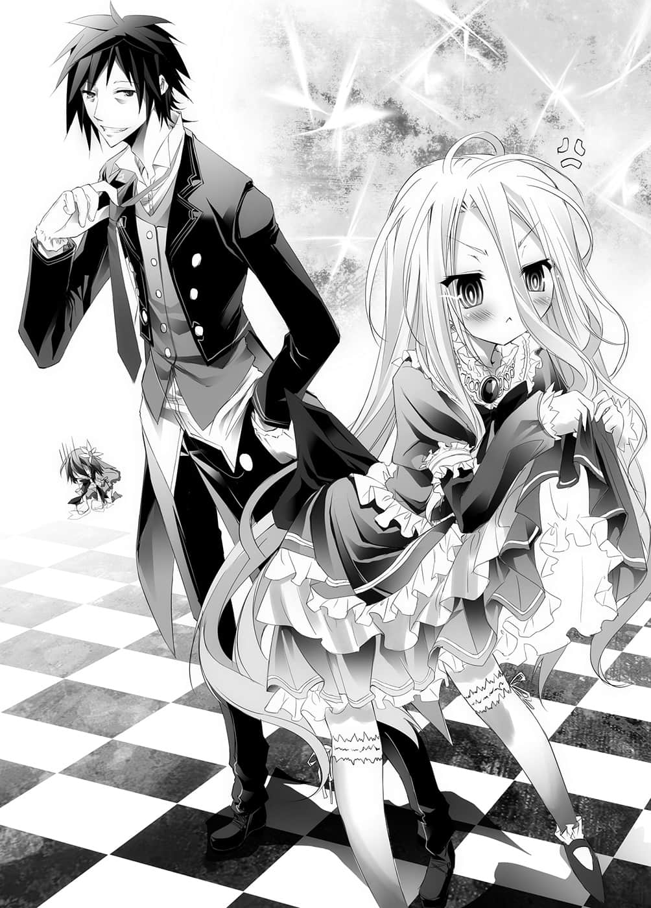

# 第二章 挑战者

> 来源：https://www.linovelib.com/novel/9/2043.html

艾尔奇亚王国的首都艾尔奇亚——西区的三号地带。

威胁老板得来的连续住宿，结果他们一晚也没住就结账离开。

兄妹就在史蒂芬妮・多拉的家中，迎接隔天早晨的到来。

不，正确说来——是在家中的浴室迎接早晨。

「……哥，希望你说明一下。」

赤裸裸的白正让人帮她洗头。

「说明？既然是在健全边缘，当然不能没有入浴镜头，除此之外还需要说明吗？」

「……哥……入浴镜头……必须遮点……小学生则是……完全禁止……」

「妹妹啊，放心吧，『蒸气先生』会做好他的工作，这样就勉强算是『健全』了。」

空眺望着不自然地笼罩在蒸气中的浴室说道。

「你该不会就是为了这个原因，才说『要让大澡池沸腾』？」

在帮白洗头发的史蒂芙，一副被他打败了的表情说道。

「就为了这个原因是什么意思？这可是很重要的事耶。」

「为了这件事，你知道佣人们白白烧掉多少柴火吗？」

而且沸腾的浴池当然不能进去洗。

所以这是为了制造蒸气而在浪费水。

「真要那么说，这么大的浴室一个人使用，你的浪费又该怎么说？」

「——呜呜……」

应该说她不愧是前王族的后裔吗？

史蒂芙富有得超乎空的想象。

（我、我失策了……！）

——那种事根本无所谓。

那就是现在这个状况，为什么？

不过，总而言之，意思似乎是空现在并没有看的必要。

——不，我很清楚各位想说什么。

久久清洗一次身体，空一副神清气爽的模样；可是与他形成对比，白却很不开心地回答道。

「……嗯？咦？还没说吗？」

「——喔、喔。」

或许是因为空的肩膀宽阔，身材清瘦的关系吧，管家风格的衣服穿起来格外好看，让史蒂芙不禁心跳加速；而看起来像是受到他服侍的妹妹，则是让胸口郁闷的史蒂芙第三次产生同样的感想。

——之后请白进行确认，若没问题的话就要她给我看。

于是史蒂芙嘴里念念有词，转身出去寻找衣服。

「这里有图书室或书斋那种可以调查资料的地方吗？」

「……不是美人也没关系……」

史蒂芙再次偷瞄了一眼。

不自觉地脱口而出，史蒂芙内心焦急的同时，不停地摇头。

在和刚才同样的地方，史蒂芙跪倒在地，低下头，激烈地感到后悔。

对于生长在日本东京的空而言，或许是想不到史蒂芙的〈住处〉该归为哪一类吧，「什么都好啦」最后他做了这个结论。

撇开那种事，有件事更令她在意。

空接着说道：

被他这么一说，史蒂芙满脸通红地遮住身体。

「……呜呜……」

「要是我也一起洗澡，万一我的小弟弟突然有精神；或者蒸气先生不够活跃，让我不小心直接看到妹妹的话，那就不只是十八禁而已，甚至会变成禁止发售啊！」

若是空能察觉她那份微妙的少女心情，那他也不会当了十八年处男。

但——问题并不在那里。

「……好多褶边，不方便行动……」

「——〈这个世界〉？」

「我、我有听到啦！我是问你要查什么资料啊！」

空并不觉得这世界会有烘衣机，他如此问道。

白的言外之意像是在如此抗议。

替半裸的两人找寻合适的衣服是很好，但是男性的衣服只有佣人——也就是管家们的衣服；同样地，适合十一岁少女的衣服，也只有自己小时候的衣服而已。兄妹两人的那身打扮，宛如出身高贵的千金小姐，与服侍她的管家一般——

「……要我们把衣服拿出来洗的是你耶。我们就只有那么一套衣服而已，干了吗？」

——她对着身上只裹着浴巾，一脸惊讶的半裸兄妹大叫道。

「可是哥哥喜欢的是美人的白啊～」

「史蒂芙小妹妹重听了吗？当然是查资料啊。」

等待白洗完离开浴室后，空也迅速地冲过澡。

「咦？啊，什么？什、什么事啊？」

空在心底如此发誓，压抑着想要向后转的心情。

---

■ ■ ■

或许是还无法接受柔顺的头发吧，白不高兴地说道。

「抱歉啦。因为我妹讨厌洗澡——她坚持『十一岁的裸体就连在十八禁作品也算出局』，不肯让我帮她洗，而且也不自己洗。她昨天自己说在健全边缘就可以，所以我当然要利用这个机会了。」

「我失策了……」

虽然不是很明白他的意思。

「……反正除了哥之外……我不会给别人看。」

「好了，睡过一觉，也洗过澡，身体清爽了——史蒂芙。」

因为史蒂芙怎么可能知道，设置在浴室里的两支手机与平板电脑，那小小的摄影机代表什么意义呢？

「那、那那、那个……那我去准备别的衣服过来——我们有男、男性用的衣服吗……呜呜……为什么会这样……」

「你没听我说话吗？因为若是不这样，白就不肯洗澡啊。」

然后史蒂芙拍了拍刚才跪在地上的膝盖，站了起来。

「……什么？」

那就是史蒂芙能够理解的极限，这也是没办法的事吧。

（失、失策了。）

不过空也一样，他剃掉胡渣后清爽的模样——

说起来，那个规则应该是用在史蒂芙才对吧。

为了将这间装饰得同样像罗马风格的浴室，变成『全年龄』的浴室而烧沸池水——这间浴室的豪华程度，实在不像输得一败涂地，濒临灭亡的人类的家。

「——空……为什么我要脱光衣服帮白洗头呢？」

「你、你、你们两个——快点把衣服穿上啊啊！」

「嗯？什么事情？」

史蒂芙拼命忍耐，不让鼻血流出来。

——原来如此，正如空所说，白清洗、梳理过头发后的模样——

「哦哦～这就是管家服——也就是所谓的『燕尾服』吧……虽然有些气闷，不过这好像在角色扮演，真好玩啊！白那身衣服也很好看喔。」

该怎么说呢……

以及穿着史蒂芙年幼时的礼服的白。

「平常也这样就好了说，真是太可惜了。」

「没什么啦！」

「……呜呜……哥好讨厌。」

在垂头丧气的史蒂芙眼前，是一身管家打扮的空。

即使说到这种地步，白似乎还在内心挣扎般发出呻吟。

「你慌张什么？这个家……宅邸——城堡？」

那么自己为什么不拒绝呢？她早就深深自责过，然后才提出了这个问题。

让直视着他的史蒂芙产生这种想法，甚至需要拼命压抑着鼻血……减少了几分初见面时的无赖模样，他看起来就像是个清爽的「好青年」。

「放心吧，史蒂芙。你的裸体我之后会用『别的手段』，好好地确认。」

「怎——怎么可能！我的意思是你在找我麻烦吗！」

「嗯？你想要我看你吗？」

「妹妹啊，你只要好好打扮就是个非常漂亮的美人胚子说，你就好好注重仪容吧。」

————十分钟后。

「……唔……头发轻飘飘……好痒……」

另一方面，听到空这么说，知道他并不是对自己没有兴趣，自己竟然感到〈松了一口气〉。史蒂芙不禁环视周围，想要找墙来撞，却听到空悲痛地说：

那如雪一般洁白柔软，画出和缓波浪的秀发，衬托出如陶瓷般的雪白肌肤——端正的鹅蛋脸与红色的眼眸，使得她看起来仿佛是精心雕琢的人偶。

「可是现在不行——因为不能太过相信『蒸气先生』。」

「那个……我完全不明白你们在说哪件事耶。」

她所拥有的这栋仿佛罗马式建筑的宅邸，对于只知道日本的兄妹而言，可以说大得就像『城堡』一般；现在使用的这间史蒂芙的个人浴室，宽敞到给十个人洗澡应该都没问题。

为什么她在帮裸体的白洗头发，身后却是穿着衣服背对着这里的空呢？

当史蒂芙对他这仿佛是说还有不同世界的说词，感到困惑的时候——

「那、那我就无所谓了吗！？」

不，对于兄妹感情这么好，史蒂芙多少有些不满也是事实，但这件事先不管。

「——什么！」

「啊，是的……有是有，不过你想做什么？」

「还有什么……当然是关于这个世界的事啊。」

「呼……清爽多了……」

「……哥，那件事……还没告诉她。」

「啊，该怎么说，伤脑筋啊，该怎么说明才好呢。」

在这种类型的故事里，要取信于人肯定都要花费一番工夫。

该怎么说才能让她相信呢，空慎重地斟酌该用怎样的说词。

——他搔了搔头，叹一口气。

明显是嫌麻烦了，于是也不多想，就随便地向她说道：

「简单的说我们是『异世界的人』，所以想了解关于这个世界的知识啦。」

---

■ ■ ■

之后，他们被带到书库——不……

那是宽敞得有如高中『图书馆』、史蒂芙的私人书斋。

书架整整齐齐地排满一面墙壁，架上摆满了相当数量的书。

这里确实是查资料的绝佳之处，不过——

「……我说史蒂芙啊。」

「嗯？什么事？」

空遭遇一道意料之外的巨大障碍。

「——这个国家的公用语言不是日语吗？」

手里拿着看不懂的书，空抱头呻吟。

「日语？虽然不是很明白你在说什么，不过人类种的公用语当然是『人类语』啊。」

「唔哇……真是超级单纯的世界。」

简单说他们遭遇的问题就是，明明对话不知为何可以成立，可是写在书本上的字，却完全看不懂。

「……那么空你们真的是从异世界来的啊。」

「是啊，虽然我也知道这件事很难相信啦……」

「如果是用魔法制造的游戏，那么人类是可以使用……不过那只是游戏靠着魔法在运作而已——人类是无法使用魔法的。」

「至少能够沟通的只有『人类』啦——那么如何呢？」

空说出感想之后，忽地感到疑问。

「十六种族……」

也就是说，这一点和他们的世界完全没有差别……

史蒂芙思考着如果他真是来自异世界的人，那么该从哪里开始说明才好呢，然后开口问道：

「——人类种的国家只有一个吗？」

「……原来如此，也就是王道幻想世界啊。」

——嗯哼。

空中断思考，回到本来的话题。

「呃，我也不太清楚，似乎是位阶序列的样子。」

「……因为资源有限……生物只要繁衍下去就是无限……用有限除以无限……结果只有同归于尽。」

即使〈战争〉消失了，却仍无法消除〈纷争〉。

「——绝对不行吗？」

「嗯～不过没办法自己收集情报还真是麻烦啊。你学得会吗……白？」

「……零？」

「像是败给唯一神的第一位的神灵种、第二位的幻想种、第三位的精灵种——还有龙精种和巨人种……森精种和兽人种之类。」

「……嗯。」

被她这样一扫兴，空叹了一口气。

史蒂芙反而讶异地回答道：

但是这个问题似乎打从心底出乎她意外之外，史蒂芙反问道：

两人静静地看着书，默然不语。

她补充了一句「本来就暧昧」，然后清了清喉咙说：

「嗯——？等一下，人类不能使用魔法吗？」

只见史蒂芙屈指算数，回想自己所学到的知识。

「绝对不行。因为人类种的身上没有连接『精灵回廊』——魔法之源的回路。」

「啊啊……对喔～这里是幻想世界嘛～……唉。」

「——位阶序列？」

却见空一脸正经地开口说道：

空与白。

空把自己是尼特族的事实摆一边这么说，而史蒂芙闻言只感到火大。

「……空的世界只有人类种吗？」

「你你你、你在说什么啊！那种程度的事情我当然有想！」

史蒂芙有些沮丧地低下了头。

由于妹妹抢先回答，史蒂芙的意见也就无法参考了，空受不了地看着她。

「……你啊，其实没想过这个问题吧……」

然后他重新面向看不懂的书本，烦恼地抓着头。

一旁的史蒂芙在这寂静中叹了一口气。

空忍不住叹息。

被史蒂芙有如要贯穿他的目光一瞪，空再次将视线移回书本上说道：

「又是似乎，又是听说，你说得相当暧昧呢。史蒂芙，你有好好念书吗？」

「既然战争消失了，为什么还要争夺国土？不能用协商的方式解决吗？」

听到史蒂芙答得干脆，空惊讶地睁大双眼。

——那就表示不可能有『完全的平等』。

「啊、呃……该怎么说呢……」

「对，简单的说就是魔法适性值的高低，我是这么听说的。」

「在『十条盟约』约束之下，【十六种族】禁止对彼此做出侵害权利、杀伤、暴力、厮杀——等一切行为，结果就让战争从世界上消失了。」

「『十条盟约』诞生的经过吗？我听在喷水池弹奏乐器的吟游诗人说过。」

但是妹妹却代替支支吾吾的史蒂芙回答：

但是目光没有离开书本的空却提出别的要求。

「我问你，那个『第几位』的……是什么啊？」

「嗯～那么我就问了，常听到『人类种』这个词，其他的『种』又是哪些？」

「首先——你知道〈神话〉吗？」

——不过，如果在这个世界，从一出生就已经如此认定了；那么即使对为何要以游戏互相争夺感到疑问，大概也很难找出答案吧。

「……现在是这样没错……并没有规定各种族只能有一个国家——不过这个艾尔奇亚就是人类种的最后一个国家。」

「哪有什么为什么，因为森精种们使用的高度魔法中，也有从异世界召唤的魔法，所以并不是多么难以相信的事。再说从你们的服装和长相就知道，你们至少不是这个国家的人，话虽如此，外表却怎么看都是人类种……」

「啊，不，关于那个我觉得没什么啊。」

「……然后呢？你要我怎么做？」

史蒂芙有如搭便车一般，慌张地赞同妹妹先回答出的意见。

说到一半时，或许是放弃举出全部十六种了吧，史蒂芙用之类来做结尾。

「对、没错，就是那么一回事！」

「……原来如此，我还在好奇你们的粮食要怎么办呢——原来是只存在于知性生命之间的『盟约』啊。」

因为椅子有限，与其互相礼让，倒不如彼此争夺，这就是『抢椅子游戏』。

——听到这里，空刻意提出已经知道答案的疑问。那是为了比较这个世界，与他们世界的常识有何差异。

「……那么具体来说，那【十六种族】是怎样的种族呢？」

〈争夺国土之赌〉——对于这个听过的词语，空有了反应。

「目前就请你先回答几个问题好吗？」

「啥？为什么？」

结果『少数』丰衣足食的代价，就是『多数』必须受害——

「……嗯。」

「但是该说是以游戏进行战争吗？也就是夺取领土的战争——『争夺国土之赌』至今仍持续着。」

她语带讽刺地加了一句：这次要我『进贡』个家教老师吗？

「……呃、那是因为……」

「是啊，非但如此，连侦测魔法的能力都没有。」

史蒂芙做好心理准备，不管对方提出何种变态要求都不会惊讶，不过——

听到空这么说，史蒂芙回想起昨晚和今早的事，立刻全神戒备。

——然后现在人类的国家又只剩这里了——她补上了一句。

「……不管怎么说，这一点也和我们的世界相同啊。」

「『种』是指神将『十条盟约』套用其上，具有知性的【十六种族】。」

「我先声明，我可是从翰林院毕业的喔！因为人类本来就没有研究位阶序列——毕竟人类种是第十六位——也就是说魔法适性值是０，即使想研究也无法观测。」

看到空一边看书，一边仍确实地听她说话，史蒂芙内心佩服他的灵巧，然后继续说下去。

「昨天揉你胸部你都没抵抗，为什么一要掀你的裙子，你就把我推开——我知错了，只是开个玩笑而已，我会严肃一点的……」

「所以在『争夺国土之赌』才会输啊……」

这种事很难让别人相信，可以说是老套剧情了，空甚至不打算说服她相信。

他们似乎正在以只有兄妹才能明白的方式沟通。

「——啊……呼，回答你是没关系啦。」

「不，我要拜托你别的事。」

「如何？」

听到出乎意料的正常要求，史蒂芙松了一口气。

空的视线离开书本问道。

「……连那种……像是使用道具发出的魔法都没有吗？」

「我知道了——那么——」

空烦人地追问，然而史蒂芙并不生气，反而——

——哦。

空微微露出苦笑，然后继续问道：

「……那反过来说，最擅长使用魔法的是哪一个种族？是第一位吗？」

「啊，不，到了第一位就是众神——祂们的存在本身就是一种魔法，一般被称为最擅长使用魔法的，应该还是第七位的『森精种ｅｌｆ』吧。」

精灵，空的脑海闪过典型的印象。

「——精灵……精灵就是那个耳朵尖尖、皮肤白白的吗？」

史蒂芙的表情就像在说：你明明是异界人，却相当清楚呢。

「是啊，没错。现在世界最大的国家『爱尔文・加尔得』，也是驱使他们的魔法才得以跃升为大国，只要提到魔法，那可以说是森精种的代名词了。」

——空「嗯」的应了一声。

然后手摸着下巴，以至今未曾见过的认真眼神，注视着虚空，进行沉思。

「——！」

空穿着一身整齐的燕尾服，认真的侧脸令史蒂芙心跳加速。

（错觉错觉错觉——这是被植入的感情。）

就在史蒂芙有如念咒一般，像这样在心里叨念的期间，空似乎也考虑出结果了。

他有如刺探一般，慎选词句问道：

「……不会使用魔法的种族……就没有〈大国〉吗？」

「咦？啊，不，比如说第十四位的兽人种也不会使用魔法……」

尽管吞吞吐吐，史蒂芙总算还是答了出来。

「相对的，听说他们可以靠超常的五感，判读魔法的气息或人类的感情。兽人种的国家『东部联合』合并了东南大海洋上的群岛，是现今世界第三大国——」

扶在手臂上的手无意识地握紧，史蒂芙难过地继续说道：

「……我们约好的——不管哥到哪里，我都会跟随。」

「不，那条线我已经考虑过了，可是这么一来，述语在文法上的位置就很奇怪了吧。」

「好……」

词语相同，能够对话，所以只要学会文字。

「……哥明明比白……更擅长判读人心的说……」

「咦？只有在记述时以倒置为前提啊？真麻烦——啊，不过那样确实就成立了。」

（在、在他们的世界里——这样算是普通吗？）

那种不可能的游戏，当然不可能破得了，这是不言可喻的道理。

然而兄妹俩似乎并没有特别在意。

「将那个能力反映到游戏，与是否善体人意，这两者是不同的问题啊。」

空确认过能够读完一本书后，啪的一声，阖上了书本。

而他们正是——可能会改变这个国家的人。

「——我要是懂就不会当了十八年的处男了。再说刚才的对话和女人心有关系吗？」

——约定啊。

「……再多夸一些……」

哥哥以少见的缺乏自信问道：

就有如每秒会浮现数万条时间限制选项的美少女游戏。

——不明所以的史蒂芙，茫然地看着他们，喃喃说道：

传来白的声音。

——如果心里存有这样的想法，那当然会输吧。

「那是十几分钟就记住的你太快了。哥哥的头脑不像你那么好啦，我还需要一小时的时间吧。先别提那些了，这个要怎么念啊？我完全抓不住这个符号的规则性——」

空似乎对她的问题很惊讶，视线转向史蒂芙，然后不当一回事地继续说道：

「……嗯。」

但是白只是闭上眼睛回答：

说来所谓的女人——不，〈所谓的人类就像是〉……对了……

生来头脑就太好的白。

「……哥——我学会了。」

然后一脸严肃的表情，双手在面前交叉相握。

「——这么短的时间？你们是在开玩笑吧？」

「……咦？学会什么？」

「你已经发觉了吧？」

「……那不是日语……如果用拉丁语系的文法解读……」

空讶异地目送着她离开后说道：

与生来头脑就很差的哥哥。

说完史蒂芙急急忙忙走出图书馆，而她的耳朵似乎有些红润。

「咦、啊、不、那个——我去泡杯茶过来。」

「啊，不愧是你。」

「不过你真的不愧是天才呢，我还得再花一些时间的样子。」

「……哥不懂……女人心……」

「这没什么好惊讶的吧？我们既然能够像这样交谈，表示文法和单字完全相同。既然如此，接下来只要记住文字不就好了？」

「……嗯。」

但是胸口又感到逐渐上升的热度。

人类无法使用魔法，即使别人使用，甚至也不会发现。

十八岁男子被十一岁妹妹教训不懂女人心的景象。

「……汉文……」

「好了——白。」

原来如此，这么一罗列出来，看起来的确像是很简单。

「那是连十八国的古文都会的你太特别了啦～身为平常人的哥哥只要会六国语言，玩游戏就不愁有问题了。」

或许自己遇见了非常不得了的人们了。

「…………哥，很小。」

在妹妹协助之下，空总算能够阅读人类语了。

「……但是……哥还没记住。」

「……哥该多学些语言……」

「……她是怎么了？」

这两个生物已经完全超出自己的理解范围了。

「原来如此，是这么回事啊。」

「——哦，原来如此。」

「……哥，好慢。」

或许是察觉到史蒂芙的视线吧，转过身来的空，让史蒂芙的心跳加快了。

——不过，那种事情现在怎么样都好。

「——嗯？怎么了？」

不过他们说漏了一个重大的事实，不知他们是否有自觉？

据说男人在精神上成熟得比女人慢……

看着来自异世界的人类兄妹，史蒂芙背脊窜起一股寒意。

白小声地说道，但是空反而自豪地断言道：

能够在这么短的时间内办到那件事，甚至毫不夸耀。

「那个……是我听错了吗？你们刚才说的是——学会一种语言了？」

被人单方面地使用无法拆穿的千术，这样当然没有胜算。

至少在现在这个场合，那句话似乎是事实。

「好啊，那是当然的。不愧是我引以为傲的妹妹，你这个天才少女！」

〈没有任何人教〉就办到那件事，那并不是『学习』，而是『解读』。

「呼呼呼，比起快，男人就是要慢才好。」

说不定……

「……白会——追随哥。」

她以沙哑的声音问道：

史蒂芙哑然无语地听着两人的对话。

空似乎若有所得，深深点了点头，几乎就在同时……

然而白看也不看他一眼，依然看着书说道：

虽然两人好像理所当然般，说得那么简单。

兄妹交换着只有两人才能明白的对谈。

那就是——

史蒂芙表情僵硬地再次确认，空却若无其事地回答：

正因为太过不正常，使得两人契合得比真正的兄妹更像兄妹。

「……就算不会使用魔法，但是靠着人类种所不及的能力，也的确存在即使不能压倒『爱尔文・加尔得』，却也足以抗衡的种族或国家。不过，反过来说，就人类种而言，他们都等于是使用『超能力』或『超感觉』来进行游戏。」

「还有什么，当然是人类语啊。」

「对啊？是那样没错。」

「我、我我我我才不小!!你有什么根据————史蒂芙，你怎么了吗？」

空站起来，用手粗鲁地抚摸白的头，白则像猫一般眯起了眼睛。

「……（点头）」

「——你怎么想？」

她双目微睁，一如往常般面无表情地淡淡说道：

——史蒂芙以难以置信的眼神看着他们交谈。

父亲再婚对象带来的『妹妹』——白。

终于连双亲也抛下了他们。

既没有朋友，也没有同伴的两人，交换了某个约定。

——由于太过杰出而无法理解他人的妹妹。

——由于太过驽钝而善于察言观色的哥哥。

为了弥补彼此不足之处，当时十岁的『哥哥』提出一个提案。

当时年仅三岁就已能运用多种语言的『妹妹』点头勾了手指。

空抚摸着『妹妹』的头。

在那之后过了八年——

妹妹——白答应跟随这样的自己。

但是哥哥——空甚至无法将她带出家里。

若被问到是否后悔——

「这个嘛——至少把她带到一个比『那边的世界』更有趣的地方了吧。」

看着远方地平线那端的西洋棋子……

空取出手机，开启行事历程式。

---

■ ■ ■

史蒂芙凝视着煮沸的热水。

泡茶时热茶叶的时间固然不用提，开水的温度也很重要。

茶点则是日前做的薄煎饼。

如今人类的领土已经许久无法取得砂糖，用这个做为茶点虽然有些不足……

但是相对地，她以肉桂等香料代替砂糖烘焙，这是她的自信之作。

——把茶具组和装在小盘子里的薄煎饼切片放在托盘上。

「……嗯。」

思及这个疑问时，史蒂芙的脑海闪过某个景象。

————…………（脸红）

但是对方是来自异世界的访客。

史蒂芙大叫着头撞墙壁。

「对、对了，至今一直被他小看，如果还被认为连一杯茶、一块茶点都做不好，那可是会影响到多拉家的声誉的。这些毫无疑问一定很美味，如果不合他的口味，那一定是文化差异的关系——也就是说，这绝不是——那个……」

史蒂芙来到空的旁边，从阳台探出身子，眺望街景。

「等等，等一下啊。史蒂芬妮，这个会合异世界人的口味吗？」

而在更远处的山上所开垦的一段段农田，那是比都市样式更为老旧的农作方式。

『恶，抱歉，这个我不要。』

「……那个……请用茶。」

如果花费了数千年的时光，科技水准都只停留在他们世界的十五世纪初期……

「不、那个……您只要吩咐我们这些下人，就会有女仆帮您准备茶和茶点了，可是您却默默地自己开始泡起茶来……而且还那么努力……」

看起来连蒸汽机都尚未发明。

连活版印刷都还没发明吗？又或者是尚未普及呢？

「妹妹也请用。」

也就是条件与他们原本所在世界对等的〈人类〉……

手拿茶杯笑着这么说着的空。

——不过，空心想：

结果她还是无法胜过感情，把自己泡的茶端了过来，对此她再度叹了一口气。

咦？

史蒂芙突然停下脚步。

---

■ ■ ■

「……完全照抄……战略游戏……辛苦了。」

——仿佛一旦分开就会死掉一般，让人感觉不出违和感的双人组。

——应该是因为禁止战争，所以城市没有受到破坏吧。

「我听说你是因为担心当不成王族，所以才那么拼命。」

「我说史蒂芙——你为什么想当国王呢？」

「——是啊，因为选拔国王的赌博大会还在进行嘛。」

「不……请恕我失礼，小姐您才是怎么了呢？」

马路尽管铺装过，跑在上面的却是马车，远处港口里停泊的是三桅帆船。

空眺望着外面的喧嚣向史蒂芙说道。

「……街上真是热闹啊。」

————…………

空忽然问道：

她深呼吸，以整理思绪的名义，开始思考借口。

可是自从缔结『盟约』之后，都已经过数千年了。

空皱起眉头如此说道。

——谣言终究只是谣言。她只是一笑置之。

「那个……小姐。」

——不战争的影响就表现在这里了吧。

确实，不管是泡茶还是料理，史蒂芙都对自己的手艺有自信。

——可是放眼望去却没看到刚才仍在此处的兄妹身影。

依照神话，那场让星球化成焦土的大战，甚至还不到数千年前的等级。

脑海再度闪过一个景象。

她如此回答，将托盘放在阳台的桌子上，把茶倒入茶杯里。

「小、小姐！请振作一点!!」

「这里是文艺复兴中期的欧洲啊，天空尚未因工业革命而受到污染之前……美丽的街景。」

然而……

「啊——糟糕——」

穿着管家服的哥哥，正靠着扶手，将身子探出去，用手机拍摄街景。

她环视周遭，只见在屋子的二楼，登上楼梯的前方处，通往阳台的门被人打开，窗帘受风吹拂而不停摇摆。

「哎呀，怎么了？」

享受着完成一件工作后的成就感，史蒂芙喘口气，擦拭掉额上的汗水。

「——啊啊啊啊啊啊啊啊我真是的啊啊啊啊!!」

史蒂芙感到胸口相当郁闷，不过她告诉自己那是错觉。

战争会加速『化学』的发展，具有能让依靠肥料或燃料的技术跃进，这讽刺的一面。

对这如画一般的光景——以及其关系性……

她嘴里念念有词。

空含了一口茶，然后再次眺望街景。

史蒂芙走到阳台……看见兄妹俩就在那里。

类似罗马建筑、古典建筑、巴洛克建筑等建物，混杂在一起。

「——咦？」

说来在史蒂芙的图书馆里所看到的书，几乎都是手写——也就是手抄本。

似乎从刚才就一直在旁寻找搭话时机的女仆们对她说道。

和最初的印象——『典型幻想世界』的街景——有些不同。

这么说来，为什么自己非泡茶不可呢？

无法使用魔法的〈人类种〉……

「为什么我竟然想用手制茶点，展现我也有贤慧的一面呢！那种男人随便拿地上的水——还有石头和草给他吃就够了啦！」

令人联想到白发千金的妹妹则是——把哥哥的脚当成椅背，正在读书。

叹着气走在走廊上的史蒂芙，手上端着银色的托盘。

「……唉～……」

为了阻止史蒂芙的额头叩叩叩地发出沉重声响，女仆们陷入一片慌乱之中。

「……真的很失礼耶。怎么突然这么说？」

「喔，谢啦。」

史蒂芙已经慌乱到难以收拾的地步了。

自我厌恶，但是在同时一想到若是能让他称赞一声好吃——

在口中一边叨念着借口，双手拿着东西的状态下，史蒂芙辛苦地打开书库的门，回到书库里。

「……无法否定心里也有这样的期待吧……唉～」

「……这个国家——艾尔奇亚本来也是相当大的国家哦。」

「……好，这样应该就可以了。」

只感觉到血液往脸部涌了上来。

空回想起在酒吧旅馆外听到的情报。

「女、女仆长！小、小姐她、小姐她发疯了——！」

『喔，真美味呢，原来史蒂芙这么贤慧啊。』

盘子上装着两人份——也就是为兄妹准备的茶具和茶点。

——那么能使用魔法这种外挂的种族，其文明究竟发展到什么样的程度了呢？

「——什么？」

「啊啊啊啊……糟、糟糕了！这样就没有『茶是女仆泡的』这个退路了啊——不对！什么退路啊！他怎么看待我，我根本就——有所谓！啊啊啊，真是的……这是诅咒啊……」

「——其实对我而言，当不当王族并没有差。」

她注视着远方——仿佛是以看着过去的眼神，如此说道。

「过去世界上曾经有数个人类种的国家，艾尔奇亚是其中最大的国家。」

她有些骄傲却又有如讽刺般继续说道：

「大到『十条盟约』之后，在一路输到底的人类种之中，还能够成为『最后的国家』呢。」

「……」

「街景看起来很热闹吗？但是……艾尔奇亚已经要破产了。」

她再次望向街上的喧嚣，但这次却是以哀伤的眼神看着。

追着她的目光，空回答：这我能想象。

失去领土，狭小的国土上却有过多的人口。

资源与粮食的不足，导致经济走入绝境。

就算想要生产粮食，没有土地就没有生产物，没有生产物就没有工作。

靠着『十条盟约』，治安固然安定，不过——

——空想起刚来到这个世界时，袭击他们的盗贼。

哥哥注视着山崖的方向。

倚靠在他脚上读书的妹妹，也将视线转向史蒂芙。

「前国王——我的爷爷在争夺国土之赌上输掉，被追赶到只剩下现在的首都也是事实。但是人类种早就输得一败涂地，会变成现在这种情况本来就只是时间的问题而已……」

史蒂芙紧握栏杆，咬牙切齿地说道：

「即使被骂是愚王，我爷爷仍想拯救这个国家，爷爷他并没有错——！」

——若不收复失土，不管怎样人类都活不久了。

与其坐以待毙，倒不如死中求活——是吗？

——史蒂芙以带着眼泪的笑容，毫不犹豫地如此答道。

和白——

「————咦？」

「……真好……」

「照这样下去——这个国家将会灭亡。就在下任国王选出的同时。」

「……（点头）」

想起〈神〉所说的话……

「——咦？」

对于空爽快的回答，史蒂芙不明白他的意图，愣愣地发出疑问的声音。

他轻松得像是到附近买个东西一样。

「难得在这个世界重生，要是突然失去住的地方，那可就伤脑筋了。」

「——好！我说妹妹啊。」

但是脸上浮现出只有哥哥才看得出的笑容。

史蒂芬妮・多拉反刍自己听到的话，进行确认。

妹妹一如往常般面无表情。

「但是你的愿望不会实现。」

「——什……」

「啊，对了。」

史蒂芙以比起困惑，更是用歇斯底里般的声调反驳。

「对。」

「……史蒂芙……你喜欢……这个国家和世界吗？」

话一说完，两人立刻转身前行。

——『目标』——总之先试着成为国王。

空回过头，露出笑容向她这么说道。

感觉到史蒂芙慌张地跟了过来，空按了按手机，确认行事历程式纪录的项目。

——是听错了吗？

「回答得真干脆，我可是做了一番觉悟说——」

「……说谎。」

史蒂芙惊讶得说不出话来，空却紧接着落井下石。

「不管哥哥做什么，你都会跟随我吗？」

可是兄妹俩却有如对照般低下头。

史蒂芙已经快要分辨不出来了。

「我们就去当个国王，收复领土吧。」

让人联想到十五世纪欧洲的街景。

——然后两人想起来到这个世界时的事……

空抓起放在阳台桌子上的茶点，放入口中咀嚼。

「而且我想要证明爷爷并没有错——人类种想要活下去……即便是发动攻势也要收回领土才行，不然不用多久，人类真的会灭亡的。」

「我要去证明你爷爷是正确的。」

对于完全出乎意料的这句话……

虽然对于尚未得到满意的解答感到不满，史蒂芙还是回答：

这心跳加快的感觉，究竟是不是「盟约」的关系呢？

那不是他们所知的灰色，而是像泼上原色颜料一般的蓝色天空。

「为、为什么！就是为了不变成那样，所以才要进行新国王的选拔——」

打破漫长的沉默，史蒂芙好不容易才开口挤出一句：

苦笑着将手机收入口袋后，空说道：

正因为如此——更令人感到可惜。

空与白受不了她的迟钝，抬头仰望两人头上的天空。

「黄昏时会在王的大厅举行最后的对战，如果没有人对最后的胜利者有异议，那个人就会成为新国王……那又怎样了？」

「——今天就是最后一天。」

白则依然以毫不关心的神情向她问道：

然后史蒂芙强忍着流出的泪水说道：

「你的爷爷——直到临死之前都还是个愚王。」

「嗯？」

——妹妹啪的一声，阖上了书本。

「……嗯。」

——梦寐以求的世界。

「——哈哈，果然被你看出来了？」

她的视线从阳台往东移去，眺望一个像是城堡的地方。

「王城。」

但是空不理会她继续说下去：

即使是爱上的对象——不对……

——史蒂芙表情沉痛地挤出这些话。

「喂，你们要上哪去啊！？」

「……是啊，能说得那么坚定，真是让人羡慕。」

「……史蒂芙，这场赌博大会会持续到什么时候？」

——…………

哥哥则是大大地伸个懒腰，然后双手一拍脸颊。

即使是被强迫爱上的对象，她也不能容许那样的暴言。

……如果不是这个世界禁止暴力，她可能不会问出这个问题，取而代之的是赏空一个耳光吧，她的语气中含有明确的怒意。

史蒂芙紧咬着唇，握紧的拳头仿佛指甲都快刺入肉中。

「是啊——当然喜欢！」

「……哥看起来……很愉快。」

我——

确认并没有听错后，她往那个男人的背后望去。

——我们重生来到的——世界。

由于没有战争，这里古老的建筑与新式的建筑掺杂在一起，是一个美丽的城市。

但又仿佛是去确认一件既定事项般，背影充满了骄傲的自信与信赖感。

「我——想要拯救这个艾尔奇亚……」

「不只如此，不好意思，我不得不说——」

史蒂芙似乎也忘记这回事了。

「——为什么……你会那样想？」

然而——哥哥却以平静的语气，二话不说地斩断史蒂芬妮・多拉的希望。

然而对于她的问题，空只是叹了口气，浏览着以手机拍摄的照片。

她看着那个扬言要夺回人类领土的男人的背影。

「——啊。」

一切都由单纯游戏决定，棋盘上的世界「迪司博德」。

「嗯，很好吃。不管是茶还是茶点都很美味喔，谢啦。」
