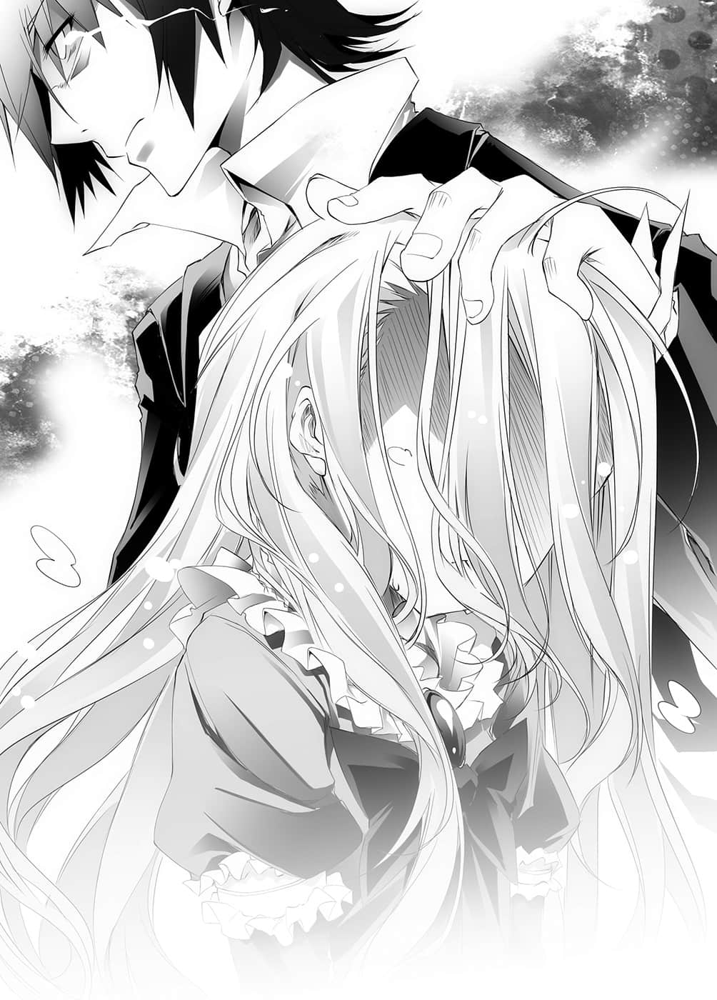
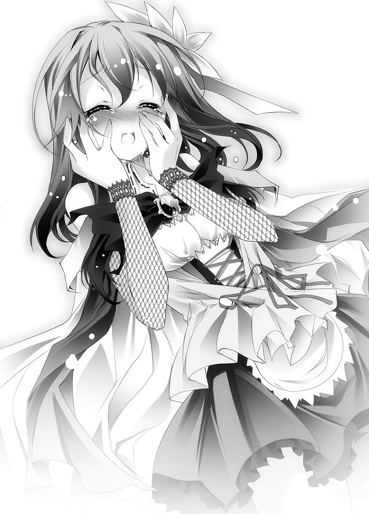
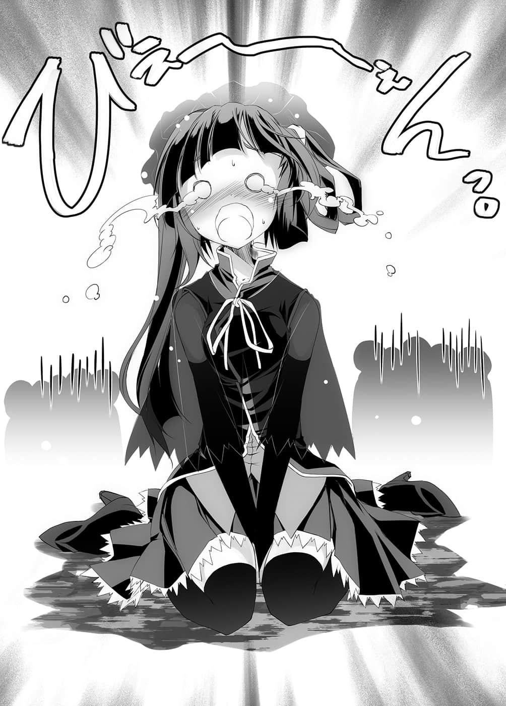

# 第三章 老手

> 来源：https://www.linovelib.com/novel/9/2044.html

黄昏时刻——在艾尔奇亚王城的大厅。

国王选拔最后一战像是已经结束。

王座前有一小张桌子和一对椅子。

众多的观众挤满了大厅，聚集在那里，围观一位单独坐在椅子上的人物……

——那个坐在桌子前，面无表情地双手交抱在胸前的人，是个有如出席葬礼般，穿戴着黑面纱与黑衣服，脸上是让人联想到死人般的虚弱表情，留着黑色长发的少女——

没错……她就是在酒吧里，出老千赢了史蒂芙的——那位少女。

只见一位身着像是高官服装的老人说道：

「——好了，这位——克拉米・杰尔在选拔的战斗中取得最后的胜利……还有人想挑战她吗？」

大厅里的群众只是交头接耳，似乎没有人打算挑战。

那也难怪——在此之前屡战屡胜的少女——克拉米。

事到如今应该不会有人认为自己能胜过她。

对于这个事实，克拉米只是闭上双眼，面无表情的脸上覆上更加无感的阴影。

看到这个情况，老人说道：

「——那么，遵从前国王的遗言，我在此为克拉米小姐——进行艾尔奇亚国王的加冕仪式，有异议的人请提出，若无则请保持沉默——」

「啊，我、我～！我有异议！非常有异议！」

听到打断老人发言的响亮声音，黑发少女——克拉米睁开了双眼。

人声嘈杂的大厅内，所有人的视线一同往声音的方向看去。

只见一位管家与白色长发的少女——空与白两人举起手，站在那里。

「对对，就是我们，有异议的就是我们两人。」

「……嗯。」

看着他们这副模样，空说道：真的都没有人发觉吗？

「——我不懂你在说什么。」

「……一人。」

「——有吗？」

「——你自己输给我，失去选拔的资格，所以派了下人过来是吗？真是的，死皮赖脸的真是难看啊……」

只见那人露出了两只耳朵。

只见克拉米与——被指出的男人，脸上同时微微地抽动了一下。

「不，老实说国王的宝座好像很麻烦，其实我没什么兴趣。」

兄妹进行了这样的讨论。

「……嗯。」

那细微的变化——已经足够让空看出，果然被他说中了。

「——史蒂芬妮・多拉的下人？」

然后他大声地说了出来：

——经过数秒钟的沉默。

「你想说我是靠魔法作弊吗？」

空笑着说了句——「可是啊」，露出锐利的眼神。

只见克拉米说着就准备取出扑克牌，却被空打断。

——被那仿佛看穿一切的眼眸窥视……

说着他把手机的相机对准克拉米，啪嚓一声，拍了照。

空搔着头，语气似乎真的觉得很麻烦，而克拉米则是眼神一敛。

「啊，是吗？那么就算把他赶出去，你也不会有意见吧？」

「比方说若是让与精灵勾结，靠魔法取得优胜的人当王，那这个国家就完蛋了吧！」

「如果要比扑克的话——先把那边那位帮手请出去比较好喔？」

喂喂……真的就像那个人说的——

然后他重新面向克拉米，取出另一支——白的手机。

「宾果，你配合我的时机指认出来。」

嘈杂声有如退潮般静了下来，众人的目光往她所指之处集中。

克拉米的视线仿佛要射杀他，空却反而窥视她的眼神。

「……四个人。」

「这里也不是可以把王座交给『借用他国力量的诈欺师』的地方吧？」

但是对于那样的压迫感，空却好似不当一回事。

（叽叽喳喳）

站在两人背后的史蒂芙闻言，肩膀震了一下。

只见史蒂芙四处张望，确认周围没有人之后，她终于找到机会询问空：

空启动手机的应用程式，一边把玩，一边笑着说道。

「好了，那我们就立刻来比扑克吧？」

「就如你所愿，要把那个森精种赶到哪里去都请便。然后——我们就用不会有作弊取巧的余地，最适合用来证明实力的游戏一决胜负吧。」

空满不在乎地刻意用言词挑衅，但是对方似乎也有绝对的自信。

「……那可以请你们消失吗？这里可不是带小孩来玩耍的地方。」

……克拉米迅速地站起来，朝空走了过来。

而克拉米则是以无动于衷却又带着点嘲笑的语气说道：

「——不过，既然如此，我也有我的自尊。」

空这么说着，然后把映在画面的照片拿给她看。

克拉米感到微微的寒意窜过——

要他们在城里暂待片刻，然后就离开了城堡。

「——别让我一再重复，我不懂你在说什么。」

——那是在幻想作品中常见的——没错，就是像精灵那样的长耳朵。

白手上拿的是空昨天用来拍摄酒吧的手机。

隐藏在面纱下，完全感觉不出感情的脸上，伴随着奇妙的压迫感。

「好，那样可真是感谢你了～♪不过——」

可是对于更加挑衅的空，克拉米则是说道：

「——原来如此，你随便勾结一个森精种，企图诬赖我是使用魔法的〈人类之敌〉……这就是你的如意算盘吧？」

那婆娘都是靠魔法作弊的吗！？

（叽叽喳喳）

「——很好。既然你有异议，那就如你所愿一决胜负吧？」

「等等……那、那是怎么一回事？你说他国的力量？」

「……哎，这么大的缺陷都没发觉，那么人类会输得那么惨也是理所当然了。」

空刻意开玩笑地说道，然而克拉米却神色不变。

——他国力量？——那是什么意思？

「啊哈哈，你有立场说那种话吗？」

「哦～你这个借口还不差呢。还是说那是事先准备好的？」

「啊，是吗？那么能不能请哪位，把那个家伙的帽子摘下来呢？」

城内的嘈杂声终于转变成伴随着恐惧之情的声音。

但仿佛她的视线与提案都在预料之中一般，空笑嘻嘻地回答：

这、这家伙是森精种啊！

空一脸笑容地这么说道，而白就像回应他一般，伸手指了过去。

「讨厌啦，你没听见吗？我只是打个『比方』而已，还是说你心虚了呢？」

她的脸上依然看不出任何表情，然而面纱后的眼神，却锐利得仿佛要将空射杀一般。

克拉米声称要把最适合证明实力的游戏从家里拿来。

史蒂芙小声地在空的耳边问道，而空则是受不了地回答：

「在那些人里面——遮住耳朵的人呢？」

这句话让城内登时骚动了起来。

「你还不懂吗？听好了，我打个比方，比方说——」

「——什么意思？」

但是空却嘻皮笑脸地走过来说道：

「好啊～『十条盟约』第五条，受挑战方有权决定游戏的内容——至于你为什么这时候推辞用扑克比赛，我就特别不去追究了，我真是温柔❤」

空无视那些声音，以只有白听得见的声量问道：

「——喂，你。」

「嗯～你照片看起来不太好看呢，最好多笑一笑比较好喔！」

克拉米毫不掩饰轻蔑的神色说道。

空笑嘻嘻地挥了挥手，示意把那个精灵男赶出去。

另一方面，空他们也决定在城的中庭，沐浴在夕阳中等待。

面无表情注视着两人的克拉米，这时目光向两人的身后看去。

白指出的男人退后一步，却被在场的观众不疾不徐地摘下帽子。

---

■ ■ ■

「我说这位当自己是冰山美人的诈欺师小姐，你不救你的朋友吗？」

「……谁？」

白回答在手机拍摄的照片里，以及这间大厅内中，两边都有出现的人。

然后克拉米面无表情地闭目说道：

就在空与白两人坐在长椅上，玩着手机等待的时候。

「——那、那么她对我用了魔法吗！？」

「……你的声音太大了。」

看来史蒂芙似乎不了解他们为什么特地换了场所。

——不过她终于知道了让自己输了竞赛的千术真相。

更何况知道了那原来是用魔法作弊，她的心情自是不难想像。

然而空却在想别的事情，有些心不在焉地回答她：

「是啊，没错……正确来说是那个森精种的帮手下的手。」

「那、那是怎样的魔法呢？」

对方对自己使用了怎样的魔法？

另外，身为普通人类的空，又是如何看破的呢？

而且她对两人在操作的东西也很在意。

异世界的道具——该不会那个东西能够侦测魔法？

史蒂芙露出期待的眼神等待解答，可是得到的答案却是——

「我怎么知道。」

——这个与她的期待相去甚远的答案。

不理会目瞪口呆、说不出话来的史蒂芙，空淡淡地回答道：

「她有作弊是千真万确的。我看过在酒吧与你对战时的她，她集到的手牌明显动过手脚。我和白都发现了。」

「……是白发现的。」

「妹妹啊，你太吹毛求疵了吧……是那样没错啦。」

——昨天在旅馆一楼的酒吧……

空内心松了一口气，不过并没有表现在态度上，他嘻皮笑脸地应对。

「所以我们才要避开那样的魔法啊。」

然而，听到空这么说，史蒂芙面露忧色。

「……怎、怎么这样，那事态不就更加恶化了吗？」

「啊……」

「跟那种对手根本没得比，比了只有『必败』——连万分之一的胜算都没有。」

「你也说过『森精种最擅长使用魔法』对吧？设想可能会与拥有检测魔法技术的他国对战，他们应该准备了施有更复杂、更难被揭穿的作弊魔法的游戏——她要去拿的游戏恐怕就是『那个』吧。」

似乎总算理解的史蒂芙，第一次说出准确的意见：

听到空想也不想就断言，史蒂芙再次惊讶得说不出话来。

「只要反其道而行，让对方以为〈我也是其中一人〉就好了。」

不过那就不会是像与史蒂芙玩扑克时的那种『必胜』方式了。

确实，那游戏一定施加了绝对有利的作弊方式吧。

然后空将思考拉回原本在想的事情上。

但是——

——没错，这是个无条件循环赛制的选拔方式。

「我说你啊——对于我们这种纯正的普通人类而言，像『记忆窜改』、『透视』那种直接干涉的单纯魔法，才是最大的威胁，因为我们无法察觉。可是如果是以与人类以外的国家对战为前提的游戏，那就不会使用那些魔法。」

真是漏洞百出，愚不可及的方法。

「你、你是说——」

「史蒂芙，你说过人类虽然不会使用魔法，不过可以使用『施了魔法的游戏』对吧？」

「……不是。」

他国只要借由人类无法察觉的作弊方式，让某个人取得优胜，那么傀儡政府就成立了。

「为、为什么责备我呢！？」

「首先，这个循环赛制的国王选拔，优胜的人会成为人类种的代表。」

「是、是啊……」

「其他国家应该也有同样的想法。姑且不论是否实行，至少可能性很高。」

空一边把玩着手上的手机，恶作剧地笑了。

「是啊，没有错。那又有什么问题呢？」

人类将会失去胜算，确实地走向灭亡。

——唔哇……

「我知道啊，因为你要交给森精种他们嘛～」

自己也是一直到被指出后才发现的人之一，史蒂芙懊悔地移开视线。

白似乎察觉到什么，转身一看。

「…………」

而且无法察觉——也就是说，那是不会直接干涉对手的游戏。

「但是我怎么可能知道她是怎么办到的，我对魔法一窍不通啊。」

「——啥？为什么？」

空以只有白听得见的声量说道，白则是点了点头。

然而空却从容地回应。他一把将坐在长椅上的白抱了过来，然后说道：

「那、那么——这样就可以将比赛带入无作弊的对战了吧！」

「等一下喔！那这样要怎么赢啊！」

不过在史蒂芙再次复活大叫之前，空先补充说明：

史蒂芙登时露出满面的笑容，但是空却一副被她打败的眼神，垂下肩膀回答道：

听到空回答得好像若无其事，史蒂芙半张着嘴，整个人愣住了。

「……糟糕，刚才的对话该不会被听见了吧？」

「——我不会把这个国家交给你们。」

这已经是今天第几次了呢？空再次叹了一口气。

史蒂芙与克拉米进行扑克比赛时……

「可、可是……」

也就是说，那会是〈表面上〉看起来公平的游戏。

「哎呀，真是意外的回答。」空催促她说下去，克拉米则毅然地说道：

「——你的脑袋到底有多天真啊。」

空忽然想到史蒂芙曾说过的话。

只见一个人影逐渐接近——花费了相当长的时间，才看出那是克拉米。

——就在这时候。

「……嗯。」

「听好了，我尽可能简单地说明给你听。」

「——敌人应该有所准备，准备了即使在这个状况下也能对自己有利的作弊方式。」

「——也就是说，这并不是个人战，而是国家战、外交战，这样你明白了吗？」

——意思像是在说：没问题。

到目前为止，一切都进行得很顺利。

「人类的国度是属于人类种的，绝不交给任何人。」

「只要不是原理上赢不了的游戏，『 空白』就没有败北两个字。」

空迅速地转身面向史蒂芙，然后说道：

对于嘻皮笑脸继续挑衅的空，克拉米则眼神严肃地断言道：

既然如此——

而克拉米开口第一句话，就宛如做了证明。

但是实际上却动了会对他们绝对有利的手脚。

仿佛思考的事情有了答案，空露出爽快的表情。

「你没听我说话吗？他国的介入是意料中的事。也就是说，他们早就设想会有像我这样的家伙出现，这么想才是正常吧。」

史蒂芙似乎终于从石化状态恢复，她摇着头逼问道：

虚张声势就是为了让对方拿出那个游戏。

「是、是啊……我明白了。」

「——是啊，是那样没错……」

「——咦？」

「好了，那个叫森精种对吧？他们就是打算用这种方式来扶植一个傀儡国王，不过——这种程度的方法，你总不会以为只有森精种想得到吧？」

「啥？当然不可能赢啊。」

「——喂！」

「——我就单刀直入问了吧，你们是哪里的间谍？」

「好、好的……」

「对方拿着人类所没有的装置，表现得仿佛是用那个装置看穿了森精种的魔法，面对那样的对手，若是使用太过明显的魔法，就必须背负不正当行为败露而失去资格的风险。而且那个魔法师本人已经遭到怀疑，被赶出去了——」

「啊，是的，其实我们是某国的——你以为我会这么回答吗？你是笨蛋吗？」

「哎呀，魔法还真厉害呢。像是『窜改记忆』或是『改写底牌』的话，根本无从证明，也没有胜算。即使被设计了人类也不会有感觉，那么就不可能察觉了。」

「纵使如此——我方不是同样面对『压倒性的不利』吗？」

「但是这个方案有缺陷，因为有他国介入的余地。」

「————哦？」

「咦？因为你说对方会使用更复杂的作弊魔法——」

为此才用了手机。

外面碰巧也是在玩扑克，那时候也同样出千的空，可以肯定她是出老千。

「是啊……」

才刚完封手机里最高难度将棋游戏的白也点头同意。

「借助森精种的力量是为了确保人类的生存圈——为此，你一定想像不到，我和他们缔结了多么复杂的契约……不过一旦确保了最低限度的领土——我就会和森精种断绝关系。」

即便是空，他的内心也忍不住想抱头。

他露出发自真心的苦笑，对她说道：

「把那样的策略说给可能是他国间谍的人听，你是笨蛋吗？想死吗？」

但是克拉米却用隔着面纱也看得出充满自信的眼神瞪着空。

「……无论你是哪个国家的间谍，你都不可能赢过我喔？」

「哦，真是有自信呢。」

「只是事实而已。世界最大国家『爱尔文・加尔得』——森精种们所拥有的魔法不会输给任何种族，所以才能成为〈最大国〉，和他们正面交手必败无疑，没有例外。」

……唔嗯。

「……你身为人类种——」

克拉米原本严厉的目光缓和下来，注视着空的双眼。

「如果心中还剩下为这国家、为人类种着想的心情，我希望你别再当间谍，放弃这场比赛。我发誓绝不会让这国家成为森精种们的傀儡。」

「……」

见到空仍是无言的回应，她的语气已经有如恳求一般。

「——不会使用魔法，甚至无法察觉，这就是我们——人类种。」

隐藏在黑色面纱下的表情，看得出克拉米懊悔的神色。

「想在这个世界存活，只有在大国的庇护下，取得『生存权利』，之后再放弃所有的比赛，断绝一切的来往——我们只能这么做，你应该明白吧？」

……唔嗯。

遵从十条盟约的话，受挑战的一方有权决定游戏内容。

借助最强种族的力量，确实可以取得一定领土。

之后再拒绝一切胜负，采取锁国政策，这的确是有效率且有效的战略。

克拉米有如感谢一般地闭上双眼——

「——看来是浪费时间了。那我就依你们所愿，用实力制服你们……我会在大厅等待。」

「「对自认为站在绝对有利立场的家伙

触目所及的是，可能一直在那里等着的大批观众，挤满了整个大厅。

「好的好的～请你准备好『出卖屁眼给他人借来的力量』，好好等我们过去吧～」

「——你们都太小看人类了。」

——但是空却喊停进行确认。

「呼呼，理由就是……」

妹妹在旁边以看不出感情的表情静观事态发展，这时空一把将她抱了过来。

而且还有同样放在王座前的小桌子，与两张椅子。

「这、这样好吗？我觉得那个人说的话也有一点道理……」

一行人回到大厅。

只不过那样做——

「啊……」

这次——轮到空困惑了。

仿佛是看穿了空的思考，克拉米如此回答。

说『ＮＯ』……！」」

「……也不只是那样就是了，那家伙——还有你也是。」

而克拉米宛如要推测空的意图般，窥视着空的眼睛。

「「——？」」

「第三，就算全都是事实，会把那种情报透露给可能是他国间谍的那种笨蛋，不能把人类交给她。然后是第四，若是被对方摸清我们的底牌，那就完蛋了，ＯＫ？」

那简直就像——对了——

接着他将视线移向白。

「第二，如果她有必胜的手法，还需要特地来找我们交涉，要我们放弃比赛吗？」

「……啊！」

空用手把玩着手机说道。

就这样，空刻意选择触怒对方的言语，目送她离去。

「……哥认为白会输……？」

不知是顾虑到空手上的手机，还是因为从眼神看不出端倪而有所警戒。

由于对方的行动超出自己预料，空难以拭去心中的忧虑。

——她带了个麻烦的游戏过来。

「你、你是想了这么多才会说出那个台词吧……」

因为下西洋棋——究竟要如何作弊呢？

「……唔嗯，原来如此……这个计策不差，我非常明白……」

但前提是那是普通的西洋棋。

「……没问题，比西洋棋的话……我不会输。」

「棋子会自己移动，只需一声命令，棋子就会依照命令行动。」

「如有万一，还是有可能输……也就是没有必胜的手段——！？」

……她一点也不知道梗的出处。

「我们『 空白』最喜欢做的事之一就是——」

那也就是说——正如空所料。

「那么你愿意放弃比赛了吧……」

而对手肯定用魔法动了什么手脚。

「抱歉，我们比赛时都是两人算一个玩家。而且这是你单方面熟知的游戏吧～？就连内部每一个角落都一清二楚。」

「西洋棋盘……？」

「——请便，你们高兴就好。」

三十二颗——黑白各十六颗棋子，有如滑行在盘上一般，自己就固定位置排好。

森精种动了手脚的游戏……

「呼哈哈！『想要说一次的台词・第四名』——在现实中说出来了！」

---

■ ■ ■

而对于难得答对的史蒂芙，空则是以笑容，继续竖起第三、第四根手指。

然而空却朝克拉米离去的方向——通往城堡大厅的道路望去。

「第一，那家伙的话有什么事实根据吗？」

「……怎么办？白。」

「没错，就是西洋棋。不过这个——并不是普通的西洋棋。」

不过克拉米却是坐在对面的椅子上，以毫无感情的声音进行说明。

史蒂芙坦率地对空的看法重新改观，发现自己脸上热了起来，她才突然惊醒地摇着头。

史蒂芙战战兢兢地提问，空受不了地看着她。

白说着强势地走向前去。

随即——

对不知道梗出处㊟的克拉米以及史蒂芙两人来说，这个理由实在非常不合理。

「…………原来如此，用这招啊。」

如果是普通的西洋棋，那么白就能确实地获胜。

不过空的眼神当然不会透露任何想法。

或许是感到丢脸吧，史蒂芙低下了头；而空则不理会，接着又竖起手指。

她们只能哑口无言，看着欢天喜地的兄妹。

他考虑过许许多多游戏的可能性——西洋棋却在他预料之外。

只见白点头答应，空便带着白前往大厅。

史蒂芙张大了嘴，不住点头。

空回答的话却让她目瞪口呆。

——会犯下那种愚蠢失误的人，不可能担任『 空白』的一角。

「——我说你啊，你也差不多该学会〈怀疑他人〉了吧？」

她把那句话看成挑衅，或是没有交涉的余地了吧。

白跟着空异口同声地说道。

空竖起手指头说道。

「——可以……告诉我理由吗？」

我拒绝。」

「请问这游戏可以在中途换手吗？」

（译注：这两句台词改自漫画ＪＯＪＯ的奇妙冒险中，登场人物岸边露伴所说的知名台词。）

或许她也发现了吧，只见史蒂芙抬起头来。

克拉米和白同感讶异。

「但

「没错，这是『棋子拥有意志』的西洋棋……」

兄妹互相对彼此竖起大拇指，而克拉米则是愤怒地颤抖着肩膀。

就有如将棋最强的布阵就是按兵不动。

然后摆放在桌上的是——

说着她取出一个小盒子，将棋子往棋盘上一洒。

不会得到，相对的也不会失去。

「……哥，超ＧＪ。」

空推想可能使用的作弊方式，不禁在心中咂舌。

克拉米冷漠地说道，但——

提出意料之外的抗议声的人——却是身为另外一角的妹妹。

「白，你太冲动了。如果是普通的西洋棋，你百分之百不会输。」

「……嗯。」

白有如理所当然般点头同意。

那是空的真心话。她不可能会输。

可是——

「这不是普通的西洋棋——〈比那家伙说的更不普通〉啊。」

「……」

「别忘了。我们两人是一人，合我们两人才是『 最强』，懂了吗？」

「……对不起，我会、小心的……」

「好！那你就去大闹一番吧。」

空这么说完，抚摸着白的头——然后在她耳边轻声说道：

「——在我看穿她的手法，想出解决办法之前，你要保持优势喔。」

白点头答应，接着缓缓走向桌子。

那张椅子对年幼的白而言算是稍矮，她在椅子上以正坐姿势就座。

「谈话结束了吗？——那么我们就开始吧，我就让你先下吧。」

「……——」

面对这明显的挑衅，白瞬间皱起眉头。

对于主张西洋棋就和「井字游戏没两样」的白而言，那句话就等于表明将胜利奉送给她一样。

因为西洋棋就原理上来说，若是彼此持续下着最佳的一步，那么就是『先下者胜』。

……而且事实也是如此。

——战况瞬间恶化。

克拉米浅笑道。

妹妹低着头，在长长的白发遮蔽下，看不到她的双眼。

至此白首度浮现困惑的表情……

空却担心某件事情。

——她会哭也是很正常的吧。

面对持续走着犯规棋步的克拉米，白毫不动摇。

「……ｄ２士兵，前进至ｄ３。」

「「「——什么！？」」」

她有如明镜止水一般，展现超乎常人的冷静。

这盘西洋棋的关键并不是——只要拥有领袖魅力，棋子就能无视规则移动。

「也就是不能使用弃子战术。」

——前进了三格。

比赛就在白这略感不快的号令下展开了。

……没错——战术将会大幅受限。

然而面露嘲笑的克拉米，她的士兵们却是一丝不乱地继续动作。

「我不是说过了吗？——这是〈拥有意志的棋子〉。」

她甚至开始将对手逼入困境了，究竟是怎么做到的呢？

「士兵５，前进。」

更何况妹妹在西洋棋上——一次也没输过。

白如此指示，但是白的棋子却——

士气低迷的棋子变得更不听使唤，白开始焦躁起来。

「……咦？」

与同样困惑的史蒂芙等人如同对比一般。

她遵守规则，让仅限第一步可走两格的士兵，前进两格。

但是白压倒性的专注力，甚至击败了神。

白维持比赛，让空能够彻底观察。

而且盘面毫无风险，白持续地走着棋子——

『 空白』不容许败北。

……然而一旦专注投入游戏，挑衅等行为对白就不管用了。

白咬着指甲，第一次陷入漫长思考中。

「——怎么了？」

「但是——」

「是啊。」

这不是用手移动棋子，而是以声音发出指示，棋子会自行移动的西洋棋盘。

——通常不会有士兵为了大局而乐意送死。

克拉米棋子的动作，已经充分说明了这个诈术的真相。

这么说完之后……

然而空也冷静地观察着状况。

「７号士兵，〈前进〉。」

叫出声的是空和吵杂的观众。

「不过那没什么好值得惊讶的。」

——但是克拉米说了……

另外眼神有如死人一般，充满嘲弄色彩的克拉米，怎么看都不可能拥有领袖魅力。

「啥？你在说什么啊，我们还没输吧。」

也就是说——

就后攻的情况而言，要以对手至少犯下一次失误为前提，才会形成『和局』。

白以神一般的指挥，应对超乎常识的棋步。

而是『领袖魅力不足，棋子就不会动』。

白只是淡淡地、冷静地继续下棋。

「咦？」

不久——他担心的事情很快就成真了。

面对棋步接近无法预测的克拉米——

她或许也自觉了吧——白的胜算已经消失了。

……到了这个地步，她已经无能为力了。

那是得拥有彻底的指挥与命令——或者等同于疯狂的士气，才有可能使用的战术。

假如就像克拉米所说，这个游戏的关键是『拥有意志的棋子』的话……

「……骗人。」

——空将手放在妹妹头上说道：

「——果然是这么回事。」

「——呿！」

指挥官的焦躁情绪传染给士兵们，演变成恶性循环——

不过——已经足够了。

「……哥……对不起。」

在群情骚动的大厅之中……

「白，换手了。」

假如把棋子比喻成现实中的「士兵」，通常最不能用的战略——

纹风不动。

「比如说将棋——虽然不知道这世界有没有将棋啦，如果是超一流的棋士，即使让对手飞车、角行、金将、银将、桂马、香车等十枚棋子——也就是只靠王将与步兵，就能完封对手……就算多少违反规则，高手与中级者的实力差距，并不是那么简单就能缩短。」

就在空如此思考的时候，克拉米静静地说道：

而且『弃子战术』若是被封住——

说出这句话的人，是在空身旁观看比赛的史蒂芙。

别忘了，虽说有哥哥的辅助……

「棋子的行动会反映出玩家的『领袖魅力』、『指挥力』、『指导力』……这些『身为王的资质』——不觉得这是很适合用来决定谁是王者的游戏吗？」

不过那也是城内每个人的心声吧。

瞬间——被指名的士兵。

那不只是棋子自己会动那么简单吧——

「…………」

空咂舌一声——不过他并不慌张。

「好、好厉害……面对棋步接近无视规则的对手，她还取得压倒性的优势耶。」

但是能隐约看到她眼中浮现的泪光。

『棋子拥有意志』。

……不消多少时间，原本拥有优势的白就开始陷入劣势。

说着白将脸埋进哥哥的胸膛。

「…………我输了……对不……起。」

预测成真的空则是啧了一声。

「——」

「……ｂ２士兵，前进至ｂ４。」

「哎呀，这样好吗？你还有心情悠哉地下棋啊。」

「……！」

但是空抱着她的头说道：

「…………」

「——我们两人合起来才是『空白』——只要我没输，我们就还没输啊。」

听到空这么说，白抬头仰望他。

他的表情浮现出平时的狂妄——以及不可能会输的自信。

「而且这并不是西洋棋——比这种游戏，你可是从来没赢过我喔！」

「……咦……？」

「你看着吧——这游戏是我负责的分野。」

空帮被刘海遮住眼睛的妹妹擦去泪水。

虽然她低着头，看不到表情，不过看得出她仍在沮丧。

在催促之下，妹妹正准备离开位子——却被空阻止了。

「真是个爱哭鬼。比到一半放弃比赛的小孩，还有以为这个局面还能扳回颓势的天真哥哥……看来你们确实也有当王的资格，不过是愚王就是了。」

空宛如无视克拉米这番话一般，轻巧地将准备退开的妹妹举起来。

「……？」

突然被举起来，白不禁缩了一下身子。

——举起即使考虑到十一岁的年龄，也还太轻的妹妹。

空坐到位子上，让白坐在自己的膝上。

「……？」

「我说了合我们两人才是『 空白』对吧。你就待在这里吧，万一我失去冷静，你就帮我一把。」

然后无视目瞪口呆的妹妹，空开口了。

他一脸笑容，却阴森无比地对着克拉米说道：

不——这倒还是其次……

「——唔！」

接着他不管哑口无言的克拉米，抓住垂头丧气的妹妹的头。

他一副想抱怨就跟这个棋盘说的口吻。

然后空再次高亢地进行演说。

下流至极的演说，让城内鸦雀无声。

「……但是如果是真正的战争……士兵会因此疲累……暂时无法行动。」

『喔哦哦哦哦哦哦哦哦哦哦!!』

————

「啥？你是笨蛋吗？真正的战争有哪个白痴会等对方出手呀？」

若以为空看不出她被说中心思，那就未免太小看空这个男人了。

——像这样，在西洋棋的棋路中不可能出现的指示，别说观众了，连白也看得目瞪口呆。

「这可是在女王御前喔！你们是男人的话，就别再让她的眼中浮现泪水！」

「什——怎么可能！？」

他将手放在妹妹的头上。

但是空不予理会，仍然继续喊着：

「古今东西，借由暴政统率自军的王，没有一个是贤王；更重要的是，人只会为正义而战——而且这世上绝对的正义只有一个！」

克拉米的表情微微动了一下。

「让这种好像死人一样，头脑简单的荡妇来当，那样真的好吗！」

「全军！各位啊！倾听我的话吧！这场战争——将决定我们艾尔奇亚、人类最后堡垒的这个都市要交给谁！是左右人类命运的一战！竖起你们的耳朵！睁大你们的眼睛！这个国家的国王——」

空将她的脸庞展现出来——那是一张圆睁着大眼，所有见到的人都会为之着迷的美少女容颜。

然后他指着对战的对手——克拉米叫道：

空却紧接着抓她的语病。

然后，空不等对手出棋，继续下达命令：

寂静意味的是——疑问、轻蔑、讶异。

克拉米听了脸颊微微抽动，不过空视而不见。

盘面再度传来震撼桌面的怒吼。

「我会一并打败你和你那出卖肉体给森精种大人得来的力量，你先想好谢罪的台词吧——弄哭我妹妹的代价可是很高的喔，荡妇！」

「是啊，当然是那样——骑兵２号队！别浪费士兵７号队开辟的生路！无论如何都要守护那群劈开道路的〈勇者〉们！」

坐在膝上的妹妹固然不用提……

这一连串的事态让她惊讶地睁大了眼。

「————你们那样还算是男人吗——！」

「让士兵在前线作战，自己却在后方作威作福，那算什么王！那算什么女王啊！所谓的王！所谓的女王——所谓的支配者就是指引人民道路的人！——全员跟随我们前进！骄傲尊贵的骑士、主教、城堡啊！现在正是时候，展现出符合你们称号的表现吧！援护步兵，〈尽你们的本份〉！」

一反先前，城内笼罩在海底般的寂静之中。

「啊！你们看啊！看那躲在士兵的人墙之后，那胆小鬼的模样！」

空面对着盘面，深深吸了一口气，然后——

「在此战立下功绩的人——

这就表示受理命令了。

「可恶——士兵部队依序前进！筑起防壁!!」

「——没错……可爱是世上唯一不变的正义。」

然后是有如红宝石般，仿佛会将人吸入的赤红色——却带着悲伤的眼眸。

「咦？你刚才不是也这样玩的吗？有什么好奇怪的？」

西洋棋的盘面则是——

士兵前进两格，接着更绕至敌方士兵的背后——击碎对方。

——有如呼应他的话一般……

然后空再度对克拉米——或者该说是对她所率领的棋子说道：

因为这个世界的人们不知道战争，所以他们是不可能明白的。

不过——事实上棋子有动作。

空有如呼吸一般，提出这些看似有理却又无理的歪理。

可是坐在空膝上的妹妹却轻声说道：

「什——」

然后空紧接着对士兵下达指示：

「等、等一下！你怎么可以无视我的回合——！」

受到现实世界『宣传战略』演说的鼓舞，棋子们忙碌地动了起来。

——中伤对手的战略，反过来提升了己方的士气。

「——！」

——克拉米如此发出抗议，空却以同情流浪狗般的目光看着她。

「只要我们胜利，女王就会是她！没错！方才为各位着想！想为各位带来胜利而狠下心来指挥全军，却被你们认为『毫无慈悲』，受到冷漠对待，内心正在流泪的就是她！我只问你们一次——」

「但是你大错特错了。」

「那么在意回合的话，只要比我更快下达命令就好了吧，傻瓜❤」

「再来就是那边的王与女王！你们也就是我们！你们也快点上前线去！」

克拉米一副狼狈样，空却得意地笑着说道：

「原来如此，难以证明，又能够在这个游戏上压倒性地有利进行。对方愈是西洋棋的高手，愈是无法推测棋子的动向。无法利用弃子战术则会招致混乱……」

也就是说这是正当行为，那么——

拨开她的刘海，露出她的脸来。

有如反比例一般，城内的人退避三舍。但是演说还没结束。

「另外！在前线奋战的诸位士兵，只要这场战斗胜利，将免去以后的军役，生涯免除纳税义务！保证享有国家给付金！因此——处男啊，不要死！另外，有家族和心爱之人在等待的士兵——你们全部都要活着回来！」

纯白的白化长发之下，是洁白如雪的肌肤。

我将以国王的权限，赐予他和喜欢的女人来一发的权利！」

声音大到足以让城内所有人捂起耳朵，让墙壁为之震动，空以那样的声量喊道：

「通告士兵７号队！前线正受到敌人攻击！等待只会使战况胶着，那段期间将会被敌人从侧面击溃喔——『立刻绕至敌人背后』——抢先攻击！」

不过——

随即有如呼应他的叫唤一般……

平常总是有气无力，眼睛半开的妹妹——

「通・告・全・军————！」

他甚至夹杂着夸张的手势，用逼真的演技持续叫道：

空抱着膝上的妹妹，大胆地如此说道。

「——那句话……是对我说的吗？」

再说棋子有在动作。

克拉米为了对抗，也赶紧发出指示。

「嗨，贱人！」

——呐喊声响彻云霄。

「哼——靠着森精种的魔法，强制性地只提升自军的士气——如果是真正的战争，那大概就称为——『洗脑魔法』吧？」

不过只有盘面呼应他的话，与城内产生了剧烈的温差——但是他不在意。

——不管是哪个世界，男人赌命奋战的目的都不会改变。

那就是为了所爱的人。

为了争取名誉，吸引所爱之人。

说得直接了当，简单明白一点。

——也就是为了性爱……除此之外没有别的了……

「——士兵５号！给我击碎敌方的骑士！」

受到克拉米命令的士兵，朝我军的骑士袭来——不过……

空单手抱着妹妹，从椅子上站了起来，振臂疾呼！

「名誉高尚的骑士们啊！受到女王承认，我所授予的骑士称号，岂能输给一个杂兵！赌上女王之名，赌上你的称号之名，我不容许你随便阵亡！敌人是杂兵，只会背后偷袭而已！反转后退，维持战线——活路要靠你的剑与盾开拓！」

原本袭来的士兵，别说吃掉骑士——

甚至在前一刻就破碎了。

「「——啊啊啊啊啊啊！？」」

不只是克拉米，以史蒂芙为首，城内每个人都这么叫了出来。

不过就连那些声音都无法传入空的耳中。

空仿佛真的置身战场，仍旧继续呐喊。

「撑得好，多亏你撑住了，志节高贵的骑士！这才是人民的剑啊！——不过你就暂且放下剑，好好地休养生息吧！我以我的名字发誓，一定会给予奖赏，以报此次你在战场上的活跃！」

随即骑士——只是个棋子的骑士……

它转身面向空——不对……是面向『王』。

在敬了一个礼之后——忽然从盘面上消失，移动到桌子的角落。

——那是西洋棋不可能出现的『同归于尽』现象。

但是比赛进行到这里，第一次——空也加入那光景之中。

…………

既然空做了与敌人相同的事，那么状况就回到势均力敌了——看起来就像是这样吧。

有如一流的舞台演员一般，空用有如世纪的花花公子般的甜美声音，编织出各种甜言蜜语。

「「「————什么！？」」」

「洗脑——很有趣的形容呢。既然是洗脑的话，这种事当然也办得到啰。」

在空压倒性的指挥力之下，就连原本不能后退的棋子，也开始一起后退，但是……

「……哥！」

「……哥说过……失去冷静的话，由我来帮忙。」

……糟糕。

只剩下说不出话来的克拉米，以及小声窃笑的空的声音。

空热情如火地，开始向棋子——女王搭讪。

——但实际上不是。

然而在主教的面前——

「——女王啊，希望你放下剑来……你——是这么地美丽。」

感受到脸颊的体温，空差一点跳了起来。

脑内啡的过度分泌，让时间也为之压缩，空在这个情况下反覆思考。

「士兵３号队！现在正是好机会——讨伐敌方主教！」

不过白窥视空的双眼，小声地继续说道：

失败了——失败了失败了失败了失败了失败了！

这是战略游戏。

——这次黑色的皇后染成白色了。

————糟糕。

那意味着我方一切的攻击都被封锁了。

「「「——什么？」」」

她用两只小手——轻轻包覆哥哥的脸。

「——什……？」

——士兵染成黑色了。

然而克拉米——虽然无法正确掌握，不过她似乎能够洗脑每个棋子。

也就是说，当败色浓厚的时候，对方可能抱着使用魔法之事可能败露的觉悟——因为本来就会输了，倒不如冒着风险，用可能败露不正当行为的作弊魔法发动攻势——！

没错——这不是西洋棋。

（——该怎么办？该怎么办该怎么办？空・十八岁处男——！）

然而这次换成白有了动作。

判断自己掌握优势，在克拉米指挥之下，敌人的皇后逼近王——也就是空。

完全不是那样。

「啊啊，女王啊。你是以自己的意志服侍那个王的吗？还是有逼不得已的因素呢？——不过请扪心自问，那个王是值得你服侍的王吗？」

确信之后，接下来就只剩下将死对方了，空大声呐喊发出指示，棋子也忠实地服从命令行动。

成功的话，可以撑过一时。

为维持士气而施行的魔法——原来如此，那的确是相当有利的魔法。

（方法——是有，有是有……可是对方会中计吗！？）

糟糕糟糕糟糕糟糕糟糕糟糕糟糕糟糕糟糕！

「呵呵呵，恋爱模拟游戏是我少数比妹妹擅长的游戏之一。」

「————！」

这很明显是失策——！

大厅内鼓噪起来，就连白也感到危机而发出叫声。

她露出阴险的笑容说道：

「呵呵，你以为自己是战王吗？竟然由国王自己殿后，太爱耍帅了吧！」

剑掉落地面的声音响起。

不——正确地说，他早就找到了。

「——是啊，就是那样……」

我方的一切攻击仍然遭到封锁——敌人可以毫不留情地持续进攻。

「——什么！」

然而——面对逼近而来的棋子，空开口说道：

表情虽然没有显现出来，但是空领悟到自己犯下致命的失误了。

（我为什么没想到——我这个笨蛋！）

宛如是同战场上英挺的年轻国王。

等待在前方的——只有『必败』两个字。

只要看出对手的玩法——

他以全副精神，猛烈地寻找突破这个困境的办法。

「对士兵、人民洗脑，把他们当成剑与道具——甚至让你站在前线，自己却躲在最后方发抖，那种王值得美丽的你为他挥剑吗？女王啊，曲折的命运让我以敌人的身份与你对立，美丽的你啊，我希望你放下剑来仔细看看——你的人民、你该守护的人——你的国王在哪里！」

敌人被逼入绝境，已经到了不择手段的地步……

但是一旦失败，情况一转——这次胜算就真的会消失了。

一次次的瞠目结舌，观众们甚至已经发不出声音。

就在观众、克拉米，甚至白也哑口无言之中。

「把敌王的脑袋砍下来，皇后！将死！」

——那是个孤注一掷的赌注。

「——可、可恶……！」

他擅自认为——敌人的作弊魔法是『维持疯狂的士气』。

——『强制洗脑』。

观众发出惊愕的叫声——那光景已是司空见惯。

——数日前他才自以为了不起地指谪史蒂芙的失误，结果这时自己却犯下同样的错误。

他就不会输了。

也就是，玩法会变得过于仰赖那种加成效果——

相对于赌博的危险性，好处却只能维持一时——用下去真的好吗？

看到空的脸色，克拉米明白那个现象对空而言，很明显是在『意料之外』。

「——全军后退！敌军会使用洗脑魔法，别靠近！」

但是那种东西的价值，大概只等于借由社会制度或世界遗产所得到的能力加成。

而且——空也熟知那些东西的弱点。

我方只不过是因为——是空对上敌方女王皇后，所以才办得到。

「……两人合在一起……才是『 空白』……」

「哈哈哈，笨蛋，重现真正战争的西洋棋？不管是文明帝国还是大战略都没输过的我，你难道以为用这种简化的游戏就赢得了我吗？」

——铿啷一声……

克拉米咬牙切齿，观众们有如松了一口气般发出叹息。

克拉米看得说不出话来，空则是有如嘲笑般回答：

只见准备发动攻击的棋子，再度被强制染成黑色。

空为了维持脸上从容的笑容，花费了全身的力气。

是啊……

「…………没问题。」

——你觉得对方会上当吗？

哥哥的眼神无言地询问，妹妹则是微微地，却是强而有力地点了头。

——没错，白——这名天才少女——这个引以为傲的妹妹。

面对无视规则行动的对手，她只使用纯粹的西洋棋走法，甚至还一度取得优势。

那除非她能预测对手——克拉米的棋会如何走，不然是办不到的。

在心理战、谈判方面，妹妹大大地不如哥哥——不过……

空再一次告诉自己。

——别忘记了。

妹妹——甚至击败过神。

那样的妹妹，在纯粹判断对方行动上，断言对方会中计。

那么自己该做的就只有相信妹妹，以此为前提订立战略！

然后——愤怒地颤抖着肩膀的克拉米下令：

「——骑士！把投靠敌人的皇后斩了！」

————中计了…………

她完全落入陷阱了。

受到命令的黑骑士，有如内心挣扎般颤抖，接着——

染成白色了。

「什——为什么……你、你做了什么！？」

——就是这个。

仿佛打从最初这就是他的目的一般，空笑着说道：

白理解到空的意图，在她精准的指挥下，红色棋子也采取战术性的行动。

——只有一个人除外。

听到这段演说，陆续加入女王皇后方的红色棋子愈来愈多。

没错，空的话才刚说完，受到克拉米命令的棋子们也纷纷地染红了。

——这次染成红色了。

以及她至今仍以为空也在作弊……

城内没有一个人了解，空的演说所包含的意图，甚至连克拉米也不明白。

她的脸上既没有先前如死人般的无力感，也没有责任感，只有愤怒的情绪而已。

就空所拥有的知识里，不战而胜的方法就是——

「——白，军队交给你指挥，你可以调度得〈不让对方洗脑〉吗？」

——就这样。

没错，那就是引发内乱——促成第三势力的出现。

只是把克拉米军攻击较难有效的红色皇后军当成肉盾而已。

其实现在空才是心脏跳动得快要破裂，正全力让思考总动员。

发出尖叫的只有克拉米一个人。

那宛如是真正狂王的笑声。

将指挥交给妹妹，空对加入己方的前敌方女王皇后发表演说。

相对的，空的脸上却充满骄傲、藐视、余裕。

「——可、可恶！没关系！给我把叛逃者全部杀掉！」

「我不会要求你——或是仰慕你而放下剑，崇尚荣耀的骑士们，对自国的人民——同胞们刀剑相向。任谁也看得出来，这个战况、状况……已是毫无益处的战争。你的王——已经陷入疯狂的漩涡中了。」

因为其他观众，没有人理解发生何事了吧。

但是曾经一同奋战的同伴——即使施了洗脑魔法，也不是那么容易能斩得下手。

「……简单。」

在这等于是必败的战况之中，空的脑中终于找到一线曙光。

不过听到空接下来的演说——众人终于理解了状况。

那么——只有找出不战而胜的方法————

「呼呼……呼呼呼……别小看我——我不会把这个国家交给你们！」

空的脑中依然动员着所有在猜谜游戏、历史游戏得来的知识，回忆他所知的各种战争，对战况进行模拟。

但是白用言词掩饰，操纵红色皇后军的棋子，制造双方攻击都无效的状况。

——结果……

这就是——唯一还留有胜算的剧本。

克拉米咬牙切齿地痛骂道。

没错——只有克拉米以仿佛要贯穿人似的眼神瞪着空。

然后——果真会出现众人所期待的结果吗？

她阴森地笑了……

「我们所追求的不是鲜血！就像每个人都会追求的一样——没错，我们追求的是『和平』！我恳请双方收起武器，我绝不允许再有人流血！」

……有谁能够察觉呢？

「你的人民是属于你们的——能够取代疯狂的国王，引导人民的人，除了你之外，我已想不出第二人——我这么说有错吗！」

啊啊，你太了不起了，妹妹。

「现实的战争啊——并不是一定要杀掉王才能胜利喔？好了，你已经没有胜算了，现在是彼此都无法出手的状态——『投降』吧。」

「愚王啊，你又失策了。古今东西，『武力镇压』对叛乱是——最坏的方法。」

那份阴森恐怖，让原本兴奋激昂的城内又回到一片沉寂，只听克拉米命令道：

空——人类种无法感觉到……

「……全军，协助红色女王皇后一方……散开包围……别让任何人死掉。」

而仿佛追随一般，在前线的黑棋也几乎染成红色。

若是对方豁出去，发动攻势，那么一切就玩完了，是个风险性非常高的策略。

因此城内一片鸦雀无声——就像先前已经发生过很多次了，大家都保持沉默，等待超乎想像的事情发生。

丝毫不理解那道命令的意义，愤怒激昂的克拉米——又落入陷阱。

要从这个状况取得胜利——方法只有『两个』。

散发出不管是红色棋子还是白色棋子，全部都要歼灭的气氛，城内众人屏息静气地注视棋子的行军。

「——什……可恶……这是什么？你到底动了什么手脚！」

这种招数不可能一再使用。

「——————什么！？」

妹妹不问理由，一个敬礼后就接手指挥。

这就是——空所知的『不战而胜』的方法之一。

「全军，就算牺牲生命也要把敌王的首级给我砍下来……你们只要听从我的命令行动就好——把背叛者全部杀光，前进吧！」

「——这群卖国贼……！」

「你这个——背叛者……！」

「——我说疯狂的王，不，『洗脑王』啊，你知道吗？」

——对于伤害敌人，或许能够毫不犹豫……

「女王啊——」

看在观众的眼里，这一切一定像是最初就策划好了吧。

——就算对于伤害敌人能够毫不犹豫……

「多谢你站起来抵抗，令人尊敬的勇敢女王啊！克服洗脑，跟随女王的正义之人啊！我不会要求你们斩杀自己的同胞！不过你们的同胞应该也不想斩你们才对！借由反覆洗脑，夺走人民自由意志——能够为狂王的暴政画下句点的人，不是别人，就只有你们啊！」

原本是黑色的皇后——而且是已经变成白色的皇后……

引发内乱，分散国力，之后再以压倒性的优势『谈和』。

不惜利用森精种的力量也要守护人类的克拉米。

——这又是孤注一掷的赌博。

——————

——没错，状况丝毫没有好转。

不过这次是只要成功就一定会胜利的赌博。

克拉米以为空出卖了人类，用他国的技术在作弊。

「王啊，愚蠢的王啊。你竟然命令臣下杀害女王……别下这么残酷的命令，稍微冷静一下如何呢？那样愤怒地颤抖着肩膀——那样会让人民见笑喔。」

这精彩的逆转戏，让城内情绪为之沸腾，响起狂热的叫声。

这只是让敌人陷入疑心猜忌，借此撑过一时的虚张声势而已。

然后空在一秒钟的时间内，在脑中思索数万句的言词，准备进行一场人生最大的赌博说服。

他抚摸着妹妹的头，将这样的想法传达给她，妹妹则像只猫咪般，舒服地闭上了眼。

然后宛如一切都在预料中，空浮现得意的笑容说道：

其实并没有什么……

但是那恐怕是更加强化的洗脑魔法吧。

克拉米如果真是为了人类而战，那她就不会原谅背叛，这就是她对背叛的反应。

不过……

她那样的感情，增强了对付背叛的情绪，夺走她的冷静，另一方面——

这就是唯一的活路。

（不战而胜？）

没错——结果战况陷入胶着。

令人毛骨悚然的黑色军团，静静地开始前进。

「……哥，衰弱的敌人……若是被断了退路，就会这样。」

连妹妹也微微冒出冷汗，如此指谪。

然而空却是以笑容回应：

「我知道——所以我才这么做。」

劈叽——

突然毫无脉络地响起了这样的声音。

只见黑色国王，也就是克拉米的国王……

——产生龟裂了。

「——咦——什、什么？」

克拉米不明白发生了什么事，只是茫然地注视着龟裂逐渐扩大的黑色国王，空淡淡地对她说道：

「暴政、恐怖支配、不断重复洗脑的独裁者——不可思议地……」

这就是——空所知的『不战而胜』的——第二个方法。

「在胜利时是还好，可是一旦吃了败仗，无论是哪个时代，那种为政者的〈末路〉不知为何就好像盖印一般，都一模一样。」

也就是……

「古今东西，他们的末路都是被身旁某个甚至不是士兵单位的人所暗杀。」

——那是在历史上重复过无数次，属于空他们世界的史实。

也就是说，让洗脑扩大，逼使对方不择手段。

设计对方成为「暴君」，再将其逼至穷途末路。

以「狂王」的身份展开行动就会造成——『自取灭亡』。

然后，城内每个人，甚至连克拉米都茫然地，注视着逐渐崩坏碎裂的黑色国王。

「要那么想也随便你，那就是你的极限。」

「如果是〈利用森精种，把他们当成踏脚石〉那也就算了，〈没有森精种大人的庇护就活不下去〉的这种认知，太过卑躬屈膝，让人讨厌啊。」

宛如渗透进胸中一般扩散开来。

不过，只有冰冷地在空与白、史蒂芙的耳中响起。

欢声沸腾的城内，却因空再次朝克拉米走近，而转为鸦雀无声。

但是这个结果完全足以弥补那一切。

「——事关争夺、互相厮杀，我们是比你们更经验丰富的老手。」

---

■ ■ ■

「由没有任何后盾、人类最强的『 我们』当上王的话——他就会是个贤王。」

高声欢呼的观众们，大概并不了解事情的真相吧。

仿佛证明那句话一般，两人胜利却表现得好像理所当然，这样要她对他们说什么呢？

与激昂沸腾的城内相反，败北的克拉米低着头沉默不语。

「……他们真的是人类吗？」

「……喂。」

事实上，你也使用了诈术还敢说，克拉米的表情似乎是想这么说。

因为她也压根儿不知道，他们的世界是怎样的地方。

心想自己声音夹杂若干的呜咽，让他们听得难受了吧。

——然后，从克拉米口中也脱口而出：

「——这样就好了吧？」

只有史蒂芙是明白的。

「是的，没有错，我是借用了森精种的力量，那是人类要存活下来的唯一方法。然而你却让它付诸流水了。回答我，你是哪里的间谍？你该不会想说，普通人类可以战胜森精种的魔法吧？」

「…………咦？」

然而白却踮起了脚尖，摸了摸史蒂芙的头。

「……有什么……问题吗？」

兄妹两人看也不看她一眼，飒爽地离开桌子，往史蒂芙这里走了过来。

甚至让她萌生了畏惧——恐惧之情，如此喃喃说道。

这下史蒂芬妮・多拉更压抑不住满溢的泪水了。

这代表了普通人类胜过驱使魔法的种族。

——宛如在胸中点燃宁静的希望之火一般。

不过——

「那是创造历史的那些人的极限，不是我们的极限啊……」

他坏心眼地说着笑了出来。

接着他盛大地叹了口气。

听到他这么说，克拉米抽了一口气，回想这场对战。

宛如将系在身上名为『最下等种族人类』这个自卑感的锁链扯断一般。

迷惘、烦恼着该说什么话。

宛如在长久持续的黑暗中，照下一道光芒一般。

克拉米这句孤单的低语，被城内激昂的欢呼声所掩盖。

那并不是说，她明白空他们所有的战术和台词。

「————啊……」

与白轻轻击掌后，眯起眼睛眺望远方，仿佛遥望着他们曾经生活过的世界一般。

然后空眯起双眼。

面对以憎恶的眼神追问的克拉米，史蒂芙抽了一口气——但是兄妹俩却回答：

「呜——」

「呜哇啊啊啊啊啊啊啊啊啊啊啊啊啊啊啊啊啊啊啊啊啊啊啊啊啊啊啊啊啊啊啊啊啊啊啊啊啊啊啊啊啊啊啊啊啊啊啊啊啊啊啊啊啊啊啊啊啊啊啊啊啊啊啊啊啊啊啊啊啊啊啊啊啊啊！」

那并不是演技，空以轻蔑的眼神看着克拉米。

于是史蒂芙决定顺从眼中溢出的泪水，坦率地说出口：

那也就是说——虽说是间接性的胜利，不过他们从正面击败了世界最大国家爱尔文・加尔得。

「……这样艾尔奇亚就……不会灭亡，太好了呢……史蒂芙。」

在克拉米看来，空是出卖人类种的可恨敌人。

——〈对『 空白』而言，没有败北两字〉……

在为对应而困扰之前，空就惊吓得后退一步——该不会被人责备吧？

「其实如果你能证明，你为了人类种而借助森精种的力量这件事是真的，至少我也真心认为那是不错的战略，要我放弃比赛也是可以的。」

刚才进行的比赛，也是施过森精种的作弊魔法的游戏。

「谢谢你们……真的——感谢你们……啊啊。」

史蒂芙一瞬间——不知该怎么应对才好。

说完——仿佛要表现自尊受到侮辱一般，空抓住克拉米的下颚，扯开她的黑色面纱，直视着她的双眼，空的眼神中首次出现微微的怒意——说道：

「……呜？」

「人类有人类的做法。就好比说——让你到最后都以为我们有作弊，多亏如此我们才能获胜。」

——那是一出压倒性的、精彩绝伦的胜利戏。

「怎么会……不可能……普通人类不可能有能力——对抗魔法……」

「告诉我……你到底是使用了怎样的诈术。」

可是——空却完全不知道史蒂芙内心的纠葛，只是轻松地对她说了：

「——别太小看人类了。」

「我的确是打算那样回答，而且事实也是那样没错。」

——就在此时……

虽然回忆起他们对自己所做的事情……

「不管对手是森精种——还是神，对『 空白』而言没有败北两个字。」

「既然如此——！」

——不是那样吗？

因此——

那个人——克拉米得到森精种的强力支援……

从正面击败使用魔法这种绝对千术的敌人，他们却没有因为胜利而显得欢喜。

就在几乎让整座城为之震撼的欢呼声中，史蒂芙喃喃说出那样的感想。

「好、好厉害……」

……那句话让城内所有人都为之沉默。

而他们却从正面挑战并加以击败，她所理解的只有这个事实而已。

「这样就不会有人说你爷爷——先王是愚王了吧？」

「那些事能止于游戏里，这里真是个好世界……」

……如此喃喃自语。

「——那种事！历史、还有这个现状，不是在在证明了人类种的极限了吗！」

「唔喔！？怎么啦！？」

胜利后，空与白从椅子上站了起来。

克拉米冰冷地如此说道，她狠狠地瞪着空，继续说道：

「但是我对你的想法很不爽。」

「不好意思，我们的世界不像这个世界这么美好。」

就史蒂芙所知，这在历史上是前所未有的壮举。

她一直为了拆穿他们所使用的作弊方法而分心，不过假如……假如他们打从一开始就没有作弊的话——？

克拉米突然坐倒在地，嚎啕大哭起来。

「呜啊啊啊啊笨蛋——白痴——！你知道为了取得森精种的力量后……呜呜……再毁掉约定，我订了多么麻烦的契约吗……你却！你却～～！我才没有小看～～我是认真的呜啊啊啊啊……」

看到流下大颗泪珠，张大了嘴，哭泣呼喊的克拉米，每个人都目瞪口呆。

那是终于从背负的重担解放所产生的反动吗？还是说那才是她原本的性格呢？

只不过，看来不管是哪个世界，哭天喊地的小孩最难应付都是共通的认知。

「……哥……把女孩子……弄哭了。」

「咦？等一下！这是我的错吗！？」

「呜啊啊啊啊啊啊啊啊啊啊……白痴……笨蛋……去死……」

方才还为胜利而兴奋的观众……

如今却只是站在远处，观看着骂声中夹杂着稚气呜咽的克拉米————

