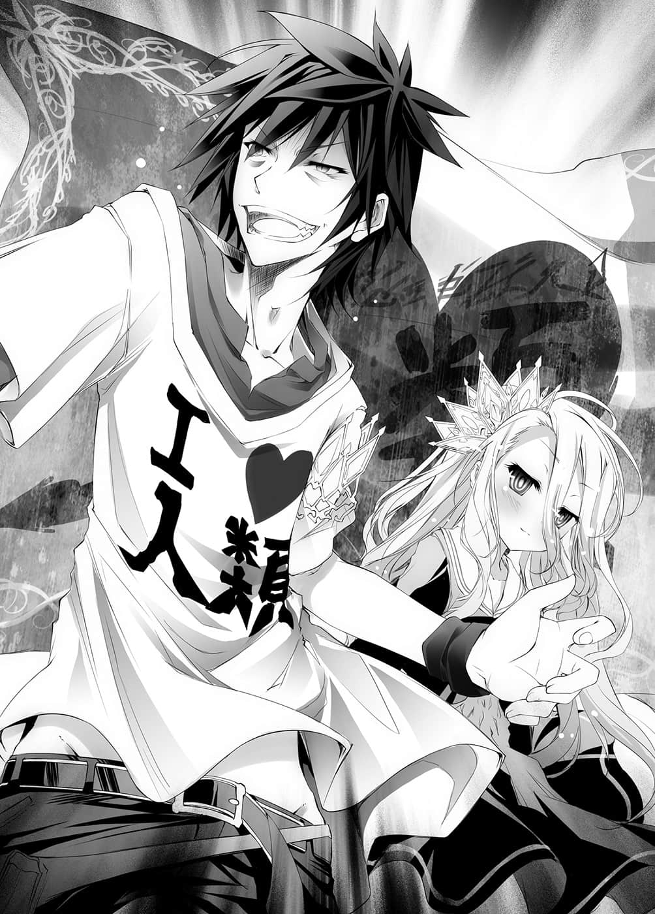

# 第四章 国王

> 来源：https://www.linovelib.com/novel/9/2045.html

哭喊着笨蛋、白痴的克拉米。

——我绝对不会认同，绝对要拆穿你们——！

直到最后都哭闹不休的克拉米，有如逃走一般离开了。

「真受不了……人类自己看轻人类还象话吗……」

空感到伤脑筋的这句话，让城内再度笼罩在喝采之中。

——无可挑剔的胜利。

看在任何人的眼中都毫无疑问，这场胜利让人们看到，身为人类之王将带来的希望。

大厅内笼罩在震耳欲聋的欢呼声中，手持王冠的高官老人，朝这里走了过来。

「那么——是空大人对吗？」

「是啊。」

「可以请您就任艾尔奇亚新国王吗？」

但是听到那句话，空却是明确地回答：

「不行。」

然后他将白一把抱了过来，笑着说道：

「我们两人凑在一起才是『空白』——所以国王是我们两个人。」

那是在西洋棋对战中也曾说过的话。

于是观众的呼声更加高昂——庆祝新国王与小女王的诞生。

——然而……

「——很遗憾，那是办不到的。」

「——咦？」

白用手臂擦去泪水，眼中已经没有眼泪。

两人则是一口答应。

「……我说你啊……差不多该认输了吧。」

甚至能看穿森精种的作弊，得到人类最强称号的两人。

这不幸的事实当然不会有人知道，原本在城内等待加冕仪式的人们也早就回家——然后再度集合、回家，就这样不断反覆，每过一天，人数也跟着减少。

「啥？呃、为什么？」

「……唉，呃、那么按照责任分工来说，这应该是我的工作吧？」

身为喜爱游戏的兄妹，两人理所当然地，进行过两人的对战。

「……嗯。」

「……那样一来，哥就会……不要白了。」

不眠不休，地上散乱着反覆对战过无数游戏的痕迹，只见在大厅的中央，一对兄妹双手撑地趴在地上。

城内的工作人员，在大厅里睡倒了一地——勉强还保持意识，手里拿着王冠的高官与史蒂芙两人，也早就开始出现幻觉了。

以两战连续胜利为条件而开始的无数游戏……

看到她的视线，空的表情也为之一变。

而是长年宿敌的眼神，在彼此的气势之下，两人交会的视线，看起来甚至快要迸出火花……

他说了一句话……

「……但是国王是……哥……白是附属品，如果……只有一个人能当……」

只见空一副伤脑筋的模样思考了一下，搔了搔头，皱起眉头……说道：

日后被称为「恶梦的三日」，受到吟游诗人传颂的激战就此落幕。

因此这里就割爱不提了吧……

而他们对战的战绩是——

「……没问题。」

——不幸的是，别说是在场众人，就连在两人『原本的世界』，都没有人知道成为都市传说的『 空白』——里面两人的战绩。

「——很好，哥哥也绝对不认同你当国王。」

三天的时光流逝。

「……咦？」

「好啊，可以啊。」

「喂！等等！等一下等一下！我怎么可能那样！我和白是两人一组不是吗！只是名义上我当国王而已，哪有不要白什么的——」

那条规则是规定集团——也就是国家、种族间的纠纷，要决定出代表出赛。

嘴里吐出笨蛋哥哥也不过如此的台词，空与白面对面对峙。

——就这样……

「……哥才是……快放弃吧。」

「——规则没有明言必须是『一人』吧？」

身为高官的老人时而露出阴森的笑容，然后又恢复正常表情，就这样不断重复。

——然后……

空重新审视记下的【十条盟约】，同时一边说道：

为了说明那股异样感，空取出手机。

「——————————什么？」

感情稀薄的妹妹眼神中，透露出明确的战意。

被这一句话从幻觉世界带回的高官与史蒂芙有了反应。

「……国王是——白。」

从刘海可以隐约看到如红宝石般红色眼眸的少女，那也就是——

要打断他们也需要相当勇气吧。

「——我说啊……为什么王非得要一个人才行？」

——好了，接下来要比什么游戏呢……正当空意识模糊的头脑思考着这种事情的时候，忽地涌起一个疑问，让他停下了手。

两人共有名义的『 空白』不算……

「妹妹啊，我可不会手下留情喔，今天我一定要把你彻底打败。」

「咦？白？」

两人面对面，视线交会在一起。

但，由于太过漫长……

「呃～那个、妹妹啊，这是怎么回事呢？」

「像你这样倾国的美少女怎么能当国王。你太坦率了，很可能会被来历不明的小白脸给骗了——哥哥可不准你当国王。」

「……呜。」

空不禁怀疑自己的耳朵，反问了一句，然而白却是哭丧着脸说道：

大厅嘈杂了起来，空与白看了看着彼此。

「——啥？」

「喂喂……我的妹妹啊，你竟然也会说笑，真是难得，天上要下长枪雨了吗？」

白瞪着哥哥，发出宣战布告——

终于来到——５００战１５８胜１５８败１８４和。

他们的眼神既不像感情要好的兄妹，也不是两人一组的玩家『 空白』。

他与平时相同，表现出嘻皮笑脸的言行举止。

他们的视线都没有移开，彼此做出宣战布告。

确认过重新读过一遍的那句话，与自己的想法没有矛盾。

「……不行，我绝对……不让哥当国王——」

３５２６７４４战１１７００８０胜１１７００８０败１１８６５８４和——

「十条盟约规定要推派『全权代理者』，所以不能两个人当。」

空有如咀嚼一般，又好似审视一般，把那条规则念了出来。

空无视一旁目瞪口呆的观众，自己狼狈不已。

——但是，有个人物不保持沉默，举手打断了高官的话。

————…………

然而，与甚至能窥见溺爱之情的话语相反，他的眼神并没有笑意。

「……哥才是……觉悟吧……我今天是认真的。」

「『十条盟约』第七条，集团间的纠纷应指定全权代理人……」

史蒂芙也喊着「啊，蝴蝶～」，露出呆滞的笑容，伸手向虚空抓去。

「呃、那个……那么就由两位重新进行最终决战，这样可以吗？」

——是这样没错，不过……

「「「「————」」」」

但是声音中蕴含的感情，却是明显的敌意。

「……哥当上国王……就能建后宫。」

……直到今天，两人都不曾连胜，也不曾连败过。

「那么就重新来——嗯哼，在此要为空大人进行第二〇五代艾尔奇亚国王的加冕仪式——有异议者请提出！否则就请保持沉默——」

长长的白发。

于是空放下微微呻吟一声的妹妹，重新面向高官。

高官好似很过意不去地确认道。

「……我有异议。」

听到高官的话，欢呼声倏然而止。

---

■ ■ ■

……——

「……空，真的这样就好吗？」

「可以啦。自古以来，王身上穿着光鲜亮丽的服装，往往都是为了隐藏内在的肤浅，为了让自己看来很伟大的自我满足。所谓的王，应该是人民的表率，同时也是目标才对——人民的敬爱是要靠行动去争取的。」

「……那是……歪理……」

「唔嗯，老实说是因为这样的打扮最习惯啦。」

「喔……好吧，我知道了，但是头发仪容至少要整理一下。」

艾尔奇亚首都——城前大广场。

一走出城堡的阳台，就看到一座仿佛是威尼斯圣马可教堂广场的开阔广场。

如今，那广场上挤满了无数的人群。

到底有几万——几十万的人聚集在这里呢？

为了聆听新国王的致词，就连由广场延伸出的道路上都站满了人。

那象征着对被称为愚王的前代国王感到失望。

象征被逼至绝望的深渊，人类种却仍期盼一丝希望。

象征在一对从正面击败森精种的间谍——击败森精种魔法的兄妹身上，看到了那一丝希望。

全人类充满期待的视线，全都集中在城堡的阳台——

只见两条人影步出。

那是一对男女。

一个穿着写有『Ｉ❤人类』的Ｔ恤与牛仔裤……

眼睛下方还有黑眼圈的黑发青年。

以及如雪般的白色长发和雪白肌肤……

两人的王冠分别说明了他们是国王与女王。

青年将女用的王冠强行扭曲，如臂章一般套在手臂上……

他伸出那只仿佛连天空也能掌握的强劲手掌，遮住地平线。

但是他以让人感觉不需要那种机器的毅然声音，强而有力地呐喊：

「——请各位回答我，为什么你们要垂头丧气？」

……因此人们以其步履做为路标。

确认过妹妹露出开心的微笑，轻轻点了头，空于是开始最后的演说。

这时似乎有人领悟到了什么。

「强者模仿弱者使用的武器，是发挥不出真正本领的！因为弱者武器的本质是——由于软弱到卑躬屈膝所形成的胆小！」

「不管是在哪个时代，哪个世界，强者磨练的是利牙，弱者磨练的是智慧！我们为何会被逼到如今的地步？——那是因为『十条盟约』拔掉了强者的利牙，让他们学会磨练智慧，除此之外没有别的原因！」

「现在这个瞬间！我们艾尔奇亚——对全世界所有国家发出宣战布告！」

「原本应是我们弱者专利的智略、战略、战术、为了生存的力量！强者都已经得到了！我们的武器被强者夺走，然后用同样的武器和强者对战——所以才造成如今的惨状！」

「承认吧！我们是最弱的种族！」

阳台的栏杆上装有扩音器。

——是先王的失策——因为不会使用魔法。

少女也用男用的王冠束起长发，将刘海往上撩起——

等待众人各自回答后，空继续说道：

……只谈论绝望者是悲观主义者。

他大大地张开双臂，有如兴奋不已的小孩般纯粹。

既像怒吼，也像胜利欢呼的叫声，是对坛上两人的期待而发出呢？

「人类种我们不会使用魔法，甚至也无法察觉——但是由于胆小的关系，我们有逃离魔法的智慧，也有看穿魔法的智慧！我们没有超常感觉，但是因为胆小的关系，我们拥有从『学习』与『经验』产生，甚至能达到预知未来的智慧！」

……就这样……

聚集在此的群众，笼罩在失望、绝望、不安的情绪下。

「你们已经痛苦够了吧？已经过剩地卑躬屈膝了吧？已经厌烦尝遍辛酸了吧……已经够了吧？让你们久等了，各位人类种的同胞们！」

……仿佛抢先在民众疑问之前回答。

「因为胆小，所以磨练眼、耳与思考，『学习』如何生存，那就是我们人类种人！」

「——没错……我们没有任何改变啊！」

——那么为什么？

……即使在绝望的深渊，即使在黑暗之中。

欢呼——不，咆哮令广场、令天也为之震撼。

「我重复第三次！我们是弱者！无论是哪个时代，我们一直以来都是咬破自恃强者而怠惰之人的咽喉——值得骄傲的『弱者』！」

被问到这唐突的问题，大众都感到困惑。

看着那样的景象，空与妹妹视线相交。

……只谈论希望者是乐观主义者。

「我再重复一次，我们是弱者。没错，如今是——就如同过去也是——」

天真烂漫却又露出傲慢的笑容，空——新的『人类之王』说道：

没错，这是每个人都知道的明确事实，而且也感到疑问。

每个听众都面面相觑。

……（点头）。

但是既是身经百战的策士，同时也像战士般狂妄。

「……」

然后——用力握紧。

以这几天在史蒂芙的图书馆里阅读的历史为根据……

从这一身打扮可以如实想像得到，换衣服时史蒂芙所发出的悲鸣。

好似体会到妹妹的想法，哥哥脸上已不见紧张神情，他大声地向众人说道。

「我们两人在此宣言！将会以弱者的身份活着，像个弱者一样战斗，而且像个弱者一样消灭强者！过去如此——今后也将会是如此！」

强烈否定的声音震撼了空气，而且震撼了群众。

紧握拳头，毫不掩饰感情的空放声大喊：

「因为先王失败了吗？因为我们是第十六位种族吗？因为我们不会使用魔法？因为是最劣等的种族吗？因为我们的命运就是该无助地灭亡吗！？——不对！」

……从绝望中让众人看到希望。

「我们能战斗并生存下来，是因为我们是〈弱者〉！」

「过去，在远古众神的大战时，众神、魔族——森精种、兽人种，多种族的争斗中，我们也曾战斗，而且存活了下来！过去这个大陆全土甚至都是由人类的国家所占领，那是为什么！」

原本高举拳头，慷慨激昂的空，如今却是语气一转，以宁静的语气倾诉。

就像平时那样——今后也一样。

「自豪吧！我们正是人类种最弱的——我们正是最匮乏之人！正因为生来什么也没有——因此我们能成为任何事物——以身为最弱种族为傲吧！」

「我与我妹妹在此宣言，加冕成为第二〇五代艾尔奇亚国王、女王。」

但——

空向群众提出疑问。

「我们人类种……在奉行『十条盟约』，没有战争的这个世界里，屡战屡败，只剩下这最后的国家、最后的都市——这是为什么！」

「……哥在紧张，真稀奇。」

……『王』诞生了。

「我们不像森精种会使用各式各样的魔法，没有兽人种的身体能力，也不像天翼种那样长寿——过去曾支配这个大陆的我们，有为了战斗而强化吗？——肯定不是!!」

而空等待那份领悟传递开来，然后再度高声呐喊。

还是——被逼入绝境的人们，反抗的灵魂呐喊呢？

「历史会不断重演——吞噬肥大强者之人不是别人！」

绝望的状况经过整理，广场上鸦雀无声。

「——少啰嗦，你也知道我们彼此都有群众恐惧症吧？平常我是压抑着而已。」

「——来吧，开始游戏吧！」

「因为我们是擅长暴力的种族吗！是为战斗特化的种族吗！？」

「——敬爱的国民——不，各位〈人类种同胞〉！」

……唯有能够点燃希望篝火之人，方能吸引大众。

「啊……嗯，嗯～～呃～大家好。」

白在不被民众看到的角度下，轻轻握住哥哥的手。

看到那过于轻松的服装，国民纷纷看傻了眼，而面对着那群国民，青年——也就是空高声说道：

空夹杂着叹息，环视他们说道：

不发一语，仿佛在说：那现在也压抑吧。

红色眼睛宛如宝石一般的水手服少女。

「点起反击的狼烟！夺回我们的国界！」

---

■ ■ ■

两人在仿佛地面也要破裂的巨大呼声欢送下退场。

出来迎接的史蒂芙立刻前来质问：

「你、你——你这个人！怎么说出那种话啦！？」

「唔哇～你在慌张什么呀，史蒂芙，真吓人～」

「……史蒂芙，好噁心……」

对于陷入狂乱，呼天喊地的史蒂芙，兄妹俩毫不讲理地退避三舍。

但是史蒂芙管不了那么多。

「这教人怎么能平静下来啊！？才刚执行完加冕仪式，什么内政都还没有做，现在的艾尔奇亚根本还没准备好要和其他国家抗衡吧！你打算毁灭这个国家吗！？」

史蒂芙抱着头，诅咒相信这对诈欺师兄妹的自己的愚蠢。

不过差不多也该习惯了吧……

空以非常熟练的动作叹了一口气说道：

「唉……我说你啊——我不是告诉你要学会怀疑人吗？」

「——咦？」

史蒂芙瞬间停下动作，注视着空。

「森精种们——爱尔文・加尔得吗？他们利用克拉米，甚至还派人协助，想要夺取这个国家，你觉得他们会认为，自己是被不会使用魔法的普通人类，从正面击破的吗？」

「——什、什么意思？」

「你忘了吗？我们被认为是『受到他国支援的人类』喔。至少支援克拉米的人会这么报告吧，而且其他国家大概也会这么想。」

妹妹有如补充哥哥的话一般，继续说道：

「……世界会认为……是某个国家的间谍，支配了艾尔奇亚……」

他打开行事历程式，在『成为国王』的项目打勾。

也就是说，尽管发动攻势是极为不利的事，却还向全世界发出宣战布告。

只见空转身离去，白跟在他后面。

由于在发呆时被搭话，她忍不住拉高了声音。

从正面打败魔法……

「可是却不晓得是哪一国。既不知是哪一国的间谍，也不知是哪一国傀儡的国家，却突然向全世界发出宣战布告，这么一来他们会这么想吧——『把艾尔奇亚当作傀儡支配的某人，有发动攻势的意图』。」

这两人真的——

特地对绝望的状况进行整理后，说出口的感想竟然是『太棒了』——？

在这个世界，受到挑战的一方有决定游戏内容的权利。

史蒂芬妮・多拉最终也找不出任何讨厌的理由。

「——咦？」

被独自抛下的史蒂芙，动作慌张地追赶上去。

「就是说啊～♪」

『十条盟约』以后，尽管其战斗能力实质上遭到封印，但是活用长久的寿命与高魔法适性，在飘浮于天空的巨大幻想种——『阿邦特・赫伊姆』的背上，建造了名符其实的天空都市，以那里做为唯一的领土，并不参加争夺国土之赌。

书上是这么写的——天翼种……

「……太棒了。」

「————咦？」

——事情发展至此……

自己一天到底要吃惊几次呢？史蒂芙在双重意义下惊呼出声。

「呃、那、那个，你是认真的吗！？」

暗夜之中，在月光与昏暗的灯火照亮下，看得到书名是——【十六种族的生态】。

「——从狭小的游戏房间，进化到破旅馆、史蒂拉的宅邸，然后国王寝室吗？」

「……刻意发出宣战布告。」

「『空白』只能是第一名，不管是夺取国土之赌，还是其他什么事，既然要玩游戏，目标就『只有顶点』——这就是我们的规则。」

甚至宣言要夺回领土。

「就是这么回事，好了。」

「各国一定会想，出现某个国家或种族，得到甚至能击败森精种的王牌，因而心生警戒吧？」

「妹妹啊。」

说不定……

还是说——

史蒂芬妮・多拉发现自己仍是太过小看这对兄妹了。

连鰤鱼㊟也不如的出人头地速度，空露出苦笑，手上拿的是一本书。

「……特别是……对我们来说。」

「『最终目标』——总之就先征服世界吧☆」

「其实根本不用考虑，答案是『ＮＯ』——舍弃这么快乐的世界，回到原来世界一点好处也没有。」

床铺非常地宽大，让人怀疑到底打算几个人一起睡呢，而趴在床上的就是艾尔奇亚国王。

「——是、是？」

「——什么——！？」

——艾尔奇亚王国，首都艾尔奇亚，在中央区域的最重要地区……

史蒂芙完全不明白那是什么意思，而空转身面向她。

该不会……

兄妹俩笑着如此说道，史蒂芙则是惊讶得说不出话来。

（译注：在日本代表出人头地的一种鱼。）

「『十条盟约』第五条，受挑战方有权决定游戏的内容。接受宣战布告的所有国家都会有所警戒，为了确定我们的身份……或是找出不存在的背后国家而采取行动吧。就在全世界努力刺探我们的时候，我们也刺探回去，趁他们不注意的时候，巩固自己的地盘。」

在过去大战时，被创造出来做为众神的尖兵，飞翔于天空的战斗种族。

挽回祖父的名誉……

另外，考虑到对方击败爱尔文・加尔得间谍的事实——

是因为受到空的演说鼓动，一时产生了侵略性吗？

胸口像是被勒紧一般——不过她已经不感到厌恶。

「我们是人类，人类种唯一的国家是这个艾尔奇亚。为了防止它消失，总之我把目标订在坐上王座，不过——」

妹妹与哥哥，两人视线交会，愉快地笑了出来。

空拍了一下手掌。

「……（点头）」

「好了，关于刚才的问题，史蒂芙。」

「……嗯。」

然后输入新的预定目标，也就是——

「那、那么……夺回领土云云……是假的吗？」

事实上那道背影就让人感觉他办得到。

——能够成为拯救人类的『救世主』？

「————啊。」

「敌人会使用魔法，使用超能力，而我们不会。情况压倒性地不利，处于压倒性的劣势，剩下的领土只剩一个都市，状况非常绝望。不过赌上『 空白』之名，绝对不容许任何一次失败——你认为如何？」

「——史蒂芙，我和妹妹讨论考虑过——要不要回原来的世界。」

「为了让全世界陷入疑心猜忌。」

而那道背影——

史蒂芙以看着异世界的——未知事物般的眼神，注视着两人间的应对。

空的意思就是跳过夺回国界——夺回大陆——直接来到征服世界。

也就是艾尔奇亚王城的国王寝室。

---

■ ■ ■

拯救心爱的国家——艾尔奇亚……

「夺回国界的那个宣言，老实说那是骗人的。」

直到数日前都还只是个尼特族游戏废人的男人——空（十八岁处男）。

目光停留在第一页，空一个人在沉思。

缺乏表情的妹妹脸上，浮现孩子般的笑容，她回答一句话：

竟然觉得颇为遗憾，连史蒂芙自己也感到惊讶。

注视着空离去的背影，史蒂芙的心跳加快。

「——天翼种……吗？感觉可以拉拢他们成为同伴呢……」

「但是却什么也不做♪」

「……所以。」

空说着从口袋取出手机。

哥哥得意地笑着说完，转身离去，史蒂芙对着他的背影追问：

哥哥点头继续说下去。

不过，或许是因为寿命长久的关系吧，他们拥有强烈的求知欲，只为了从全世界的种族收集『知识』——也就是书本而进行游戏。

「他们可能会有关于魔法的知识，而且我们也有『异世界的知识』做为诱饵。」

只要设法与那个种族接触，或许就能找到对抗魔法的办法了。

——叩、叩。

正在进行这样的思考时，突然响起小声的敲门声。

空有一种似曾相识的感觉，好像数日前似乎也发生过类似的事情，空一边想着一边应门。

「来了来了，是哪位？」

「我是史蒂芬妮・多拉……请问我可以进去吗？」

「——啊？请进。」

推开国王寝室沉重的房门，史蒂芙恭敬地走了进来，空对她说道：

「话说你那语气和态度是怎么回事？像平常那样进来就好了啊。」

「不……那个、冷静想一想，空——陛下现在是艾尔奇亚的国王——」

「啊～啊～听了好痒！」

空大叫打断史蒂芙的话。

「又痒又麻烦！你就照以前那样叫我就好了，那么有什么事呢？」

在尚未发明电灯的艾尔奇亚……

照亮国王寝室的只有昏暗的烛火吊灯，以及月光而已。

在那淡淡的光线照明下，看不见表情的史蒂芙，只是伫立在房间的中央。

「那个——空你是……」

「嗯。」

「……我是重点翻译……」

只要回想起旅馆那件事——就该知道空不可能一个人。

而为了要让两人明白，于是白坦白地说明。

「呃……也就是说，因为已经没用处了，你想要我解除那个【盟约】是吗？」

只要是健全的男子，想要被那样的美少女喜欢，也是相当自然的事吧。

空是抗议她的指谪太过直言不讳了。

「只剩下这个了——」

果然……至少就这个场合，那是无可撼动的事实。

「你只有在情况不利时才会变回小孩……」

「……这就是……史蒂芙的……『存在意义』。」

是这样单纯的疑问，于是白一边操作手机，一边回答她。

「————什么！」

看到白也在同一个房间，史蒂芙赶紧放下裙子，往后面退了几步。

「配菜……？那是什么？」

只见她原本羞红的脸转为苍白，然后低下头颤抖。

「……哥不要……刚才的照片……？」

她现在指出一个不能忽略的问题喔。

缓缓握起拳头——上下挥动。

——也就是说，谁都可以。

虽然尝试询问自己的心，但说到对史蒂芙是否有恋爱的感情——

——那是……不安。

然后她往床铺走了过来，表情看起来很不安，却又满脸通红。

「咦——啊……」

「——白，我可没有想得那么龌龊喔？」

「……哥要史蒂芙……爱上他……的理由。」

史蒂芙一脸不甚明白的表情——顺道一提，连空也一样。

那也就是——

——不愧是空，即使游戏方面超一流，在那方面还是十八岁处男。

——那是史蒂芙帮白洗头发，两人入浴镜头的影片。

「……白，十一岁……太难的事，我不懂。」

原来如此……即使客观看来，史蒂芙也是相当标致的美少女。

史蒂芙登时羞得满脸通红，而白更进一步……

史蒂芙大叫着冲出房间——而空只能呆呆地目送她离去。

实际上——恋爱感情与性欲有什么不同呢？

「……自慰时……想像的东西……包含照片、影像……在从事自慰行为时利用……那些事情就称为『配菜』……」

「我、我希望你——告诉我……为、为什么、那个、你不是像令妹说的——要我『成为所有物』，而是要求『爱上你』呢……？」

只不过两人的含意不同。

随着闪光灯一起传来一道声音。

————等一下，空・十八岁处男。

「……这个。」

而史蒂芙则是——

见到史蒂芙还不了解，白面无表情地……

「差～～劲～～～～透顶啊啊啊！」

但是——让她爱上我，然后我想怎样呢？

空考虑着，该老实说出来吗？

「……还有七年……」

……咦？

——————而且连妹妹的裸体，他都拿来做那种事吗！？

「白小姐……被十一岁的妹妹那样说，哥哥颇受打击喔。」

然后，白看起来漠不关心地回到床边，再度开始读书，空则问道：

——据说女性在精神方面较为早熟……

——不过她在是理所当然的事，自己应该想到的。

发出疑问之声的是史蒂芙与空两人。

「那个——你要我爱上你……那个、是对我有那种感情吗？」

啪嚓！

「不、不是，不是那样子！」

她掀起裙子，有如恳求般地说道：

从云层的缝隙间，一瞬间月光增强了亮度，照亮了史蒂芙的表情。

不，那未必吧。

不——说起来……

——一见钟情？

「自慰……行为？」

「……代替……为处男的极限……烦恼的哥哥——由白来说明。」

（咦——？恋爱的感情是怎么样的感情呢？）

「……哥对原本的世界……只有一件留恋的事。」

「啊，对不起，导演。我收下了。」

「咿、咿呀啊啊啊啊！」

不过——

「空如今已经是艾尔奇亚的国王——我已经、那个……」

——就这样，空来到不受女孩欢迎男的极限。

——等等。

「……呃……」

「「————什么？」」

只见从床铺里侧钻出来的——是一手拿着手机的白。

「……这个世界没有——『配菜』。」

「我看是过度翻译吧……而且刚才那是洗澡时的影片吧？你不是说『这个违规』，不准我看吗？你——该不会是故意让史蒂芙讨厌我吧？」

————他要的只是发泄性欲的对象。

然而无视哥哥的抗议，白将刚才拍摄的照片——史蒂芙掀起裙子露出内裤的照片，拿给她看。

那是因为心有邪念。

就这样，空开始做起对十八岁处男而言太过困难的哲学思考。

「……那是……那个……」

「如、如果是那样的话……那个、我——能进贡的已经……」

用手机播放影片给她看。

而白——没有血缘关系的妹妹，以空听不见的小音量，喃喃说道：

是因为空的低俗愿望，也就是纯属失误。

见他完全猜错，史蒂芙急忙订正他。

「——咦？」

然而，这时她却问出更意料之外的问题。

「为了让我进贡，所以才命令我『爱上你』的吧。」

————…………

「啊啊啊啊真是的～～～～！」

另一方面，史蒂芙怒气冲冲地走在城堡的走廊上。

并不是为了自己被称为性幻想对象……

而是对被那样说而感到受伤的自己火大而吼叫。

「啊啊，真是的，果然这种感情是错觉，是盟约的错——是诅咒啊！」

——但是史蒂芙没有发现……

「那种猴子！萝莉控！我不可能喜欢上他！果然是盟约的关系！」

——空提出『解除盟约』，也就是说——

提出再次进行游戏，命令『别爱上我』这个解决方案。

她完全无视这个事实，甚至已经忘了那件事。

而那也代表——
