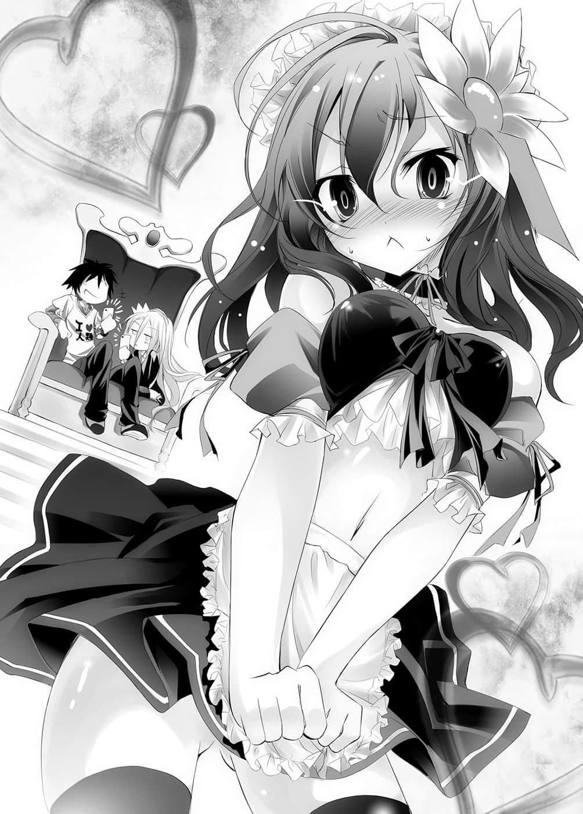

# 终章

> 来源：https://www.linovelib.com/novel/9/2046.html

——艾尔奇亚王城的谒见大厅。

只有一张王座，却有两个人坐在上面，正在用ＤＳＰ玩游戏。

黑发，将女性用王冠套在手臂上，穿着『Ｉ❤人类』Ｔ恤与牛仔裤的青年。

白色的肌肤与长发，以男性用王冠束起头发，红眼睛与黑水手服的少女。

没什么好隐瞒的——他们就是这个国家的国王——空，与女王——白，就是这两人。

「所以说，都已经裸装打了，不用陷阱卡怪了吧？」

「……效率优先。」

「要效率，裸装就没意义了啊，用实力打啦，拼实力。」

「……那样只是多花时间而已，不好玩。」

「你那样说还玩什么……不然换别的游戏吧。」

他们带了大量的游戏来到这个世界……

但那全都是他们玩到破关的游戏。

也就是说，能不能消磨时间都很难讲。

他们之所以要这样消磨时间是有理由的，理由就是——

「我、我换好衣服了……」

一听到声音，两人毫不犹豫地让ＤＳＰ进入休眠，取出手机。

只见出现的是面貌气质高雅，红头发的美少女，只不过——

她身上穿着布料不会过多——却也不到触法范围、暴露程度较多的女仆装。

史蒂芬妮・多拉……她是先王的血脉，原本是王族——现在则是……

史蒂芙满脸通红地出现，但是空却说道：

「是——我国的粮食现在处于极为严重的状况。」

「【向盟约宣誓】」

「……那露胸。」

「……要叫她脱吗？」

全部听完之后，空点了点头。

在集合于大议堂的各大臣面前。

「可是我觉得就算让她穿上性感惹火的服装，拍成影片，但是没办法发泄的话，只会一直累积下去……」

「把农田统一，照顺序进行轮种：小麦等冬谷→芜菁、甜菜等根叶类→大麦、黑麦等夏谷→苜蓿等具有回覆地力性质的牧草。谷类的产量虽然会因此减少，但根叶类和豆类植物的产量会增加，特别是导入芜菁等的栽培，将可解决饲料不足的问题。在冬季也可饲养家畜，靠着家畜的堆肥与牧草进行地力回复，这样也能废除休耕地。」

「——遵、遵命。」

「那么各位，请铭记我等肩负着人类的命运，来猜拳吧——我出剪刀，全员出布，请故意输给我，证明你们的忠诚。另外，若是小看我们兄妹的观察力和记忆力，不接受假赛而拒绝契约的人，建议今天内就立刻退出。」

——空以一副不可思议的表情说：为什么这种程度的事一直都没有人想到。

只因为一句『那样哥会高兴』，史蒂芙就知道无法违抗白说的话了。

「——您说的是？」

白说着理所当然的事，而空也接着说道：

「啊啊，这是二次元图片那种，明显没穿的演出啊。」

但是他打断各种报告，首先说道：

「——确、确实。不过导演，那样就会变成即使全裸，只要有贴ＯＫ绷就ＯＫ了。」

「……白……不介意，请便。」

高声向注视这里的大臣们说道：

「是啊，导演，又不能像二次元那样停止动作，而且也不会有那种巧合。」

空双手遮脸，满脸通红。

「……听到衣服摩擦的声音……我就醒来了。」

「另外，实行这个方案的重点就在于，必须将集中的劳动力与分散的耕地，集中到特定区域。以结果来说，可能会造成中、小农家失业，不过粮食的生产会增加四倍以上。请最优先进行。」

「你——平常都是醒着的吗！？」

「有件事我要说在前头。」

「嗯？不，等一下等一下，我可是有挑你睡着的时间喔！」

「……嗯……可是不够呢。」

「对银行发行国债，让他们购买——但，关于这件事就交给经济大臣办理。」

「……白和哥是国王……国王……身份了不起。」

她自虐地仰望着天花板。

接着他说明农业型态、管理方法、税金等的分配。

——像这样，事先牵制假装输掉而违抗盟约的人后，空高声地——

没错——这个世界就是游戏决定一切——甚至连国界也是。

「各位都知道，现在人类种正处于绝境。既然要发动攻势，那就没有余裕注意背后，在此为了断绝后顾之忧——我们来猜拳吧。」

「赌注是『今后，禁止一切虚伪报告，以及选择性、随意性传达情报等视为说谎的行为。』……请你们【向盟约宣誓】进行游戏，然后故意输给我，进行契约。」

「那面积小的泳装也违规……？」

他摊开手伸到头上。

耳朵很利的白听到他的话说道：

「……白会娶你，没关系。」

「讨厌——！我嫁不出去了——！」

妹妹拍着他的肩膀安慰道。

「对，游戏，这个世界国王的工作。」

「我把握住了……你就实行我现在要告诉你的事。」

「嗯？有暴露到会脸红的程度吗？」

「哥哥可没有暴露的嗜好喔。」

「嗯～史蒂芙，可以请你适当地脱一脱吗？别看到乳头和馅就好了。」

另一方面，史蒂芙颤抖着肩膀叫道，而且接着愤愤不平地说：

他侃侃而谈，就好像理所当然一样。

「……是。」

「你嫁不出去的话，那被迫打扮成这样的我该怎么办啊！」

「嗯……交接完毕了吗？」

「……那么首先请农业大臣报告——」

就这样——订立了契约。

「预、预算要怎么办呢？」

---

■ ■ ■

「……我不看……没问题……在家也一直是那么做。」

环视全员的脸，空——人类之王重新嘱咐。

「接下来，必须补偿这个政策所造成的失业。经济大臣、工业大臣，请报告——」

「【——向盟约宣誓】！」

「你们是在玩游戏吧！？」

说着空把白放到旁边，从王座站起来。

「我们也是三天没睡喔，再两天应该都还游刃有余吧。」

她宛如是爱的奴隶——不，应该只是两人的玩具吧。

「是啊，就在刚刚，被你们叫来之前！」

游戏玩得强是当王的条件，玩游戏也可以称为是在锻炼。

「唔……」

「那么——可以帮我把各大臣找来吗？」

「然・后・呢——」

空与白登上讲台。

对于提出令在场每个人都难以置信的划时代方案的王，在场众人只能瞠目结舌。

「话说你们把加冕手续、交接作业交给我一个人做，让我忙到三天没睡，结果还为了这种事把我叫来，你们的身份很了不起嘛！」

——将背部靠在王座的椅背上，空小声地说道：

——没错，如今两位王正在摸索十八禁的底线。

「不、不要特地说出来可以吗！？」

这是将记述在盟约里的『绝对遵守』规则，以假赛的方式，反过来利用。

「……唔……普遍级好难。」

「关于农产——我们要导入轮种式农业。」

不只如此——

「我就是在等那个，玩文明帝国我也是一口气把内政做完的那种类型。」

「……没问题……想说可能会遇到这种事——有贴ＯＫ绷了。」

「唔……唔……？不……咦？我觉得应该算违规喔？」

「……没让她……穿内衣裤……」

「别说馅啊啊啊啊啊啊啊啊！」

「哎呀～只要玩游戏就能胜任工作，这里真是天国啊。」

像这样，连结果可能发生的问题都指了出来。

「胜任不了啦！内政也要确实做啊！」

「ＮＯ，没有穿的话，那样会违规的。」

猜拳就在契约宣誓下进行。

空就像是发现了理想乡香格里拉一般，一脸幸福地说道，却听到史蒂芙大叫。

史蒂芙如此叫道。

————…………

就这样……

王陆续提出各种问题的根本改革方法。

仅仅四个小时的会议结束时……

连大臣们都已经纷纷谈论他是『人类史上最佳的贤王』了。

……空把玩着手边的平板电脑说道：

「哎呀～像个笨蛋一样把找猜谜游戏资料用的专门书籍，事先输入进去真是做对了。」

平板电脑里——装有超过四万册的专业书籍。

数学、化学、天文学、物理学、工学与医学，从历史书到战略书。

甚至还把某维基老师的全部资料抽出、保存——也就是说，二十一世纪初人类拥有的大部分知识都在里面了。

「……哥，果然奸诈……那是外挂。」

总是半睁着眼的白如此指谪，但是空却皱起眉头。

「在有魔法那种官方外挂的世界里，我只不过是多少传入一些异世界的技术而已，这种程度请别称呼是外挂好吗？而且安定内政是当务之急吧。」

……话虽如此，若是导入太多未来技术Over Technology，也可能发生意料之外的矛盾。

虽然老实说，空很想早点让『电机工程』传入就是了……

「只要能制造出相机和麦克风，大概就能够对付一些魔法了说。」

现状只有两支收不到讯号的手机，实在令人难以安心。

果然还是要找到与天翼种连系的方法——

——这时，仍穿着一身女仆装的史蒂芙，静静地来到大议堂。

也就是——白与空让她换上后就没再管的那服装。

「呵呵……真有趣，为什么你会这么想？」

「那么特图——你以前从没输过吧？」

特图仍是维持表面上的笑容问道。

「在各种游戏都一定会攻占顶点，甚至化成都市传说的游戏玩家的传闻。」

「讨厌啦，不是自称，我是千真万确的神啊。」

叩、叩的脚步声响起，有个少年走了进来。

「……（点头）」

「还记得我说的话吗……我说〈这是一切都以游戏决定的世界〉。」

「……原来如此。就连唯一神的宝座，都是以游戏决定啊。」

甚至序列第一位的神灵种与幻想种，都要与之开战。

在场全员都冻结了。

「啊，好啦好啦，对不起，那你快去换衣服。真是的，我们国家的品性会被怀疑的。」

他们彼此看着对方的脸，笑了出来。

神好似很愉快，又很有兴趣地看着空与白说道。

——眼前这位是唯一神——『特图』。

「——『特图』……那就是我的名字，请多指教，『 空白』。」

「嗯？」

空与白、史蒂芙，以及大臣们齐聚的大议堂里。

在场全员看到这情景，心情都像心脏被捏住一般。

空与白就像这样轻松地与他谈笑。

少年特图报上名字的瞬间，空间的气氛改变了。

然而，不等史蒂芙带路，大议堂内就响起了一道声音。

「叫我特图就可以了，什么事？」

「多谢你的赞美♪」

「啊哈哈哈，你们好像过得很快乐嘛。」

「我说神啊，你还笑得出来吗？」

「正因为如此，我料定你们一定会来获得挑战我的权利。」

「知道我们而把我们带到这个世界来，那就代表你知道——〈无论任何游戏都要站在顶点〉是我们的信条吧？」

——除了一副佩服模样的白，其余在场的人类都说不出话来。

众人闻言都一副充满疑问的表情。

但是，三人似乎并没有特别在意他们。

「……神啊，我再问你一次，你还笑得出来吗？」

听到这一句话……

「——神啊。」

「那就好。好了……总之人类种的存亡危机，总算成功避开了呢。」

大臣们神色苍白，史蒂芙则是身体颤抖，好像随时要晕倒一样。

「啊哈哈……不过不要误会，我基本上也是旁观主义，我不会偏心特定的种族——只不过我承认，这次是掺杂了点私人感情啦。」

只要他一个心情不好，某个世界就会消失，甚至也拥有重新创造世界的权限。

然而神特图本人却是一脸笑容，完全不介意的样子。

「如果可以换衣服，请你们跟我说啊！呜哇啊啊啊啊！」

空与白，兄妹两人似乎同时理解了某一件事。

「……空——不对，陛、陛下……有客人。」

「我的世界如何呢？你们还喜欢吗？」

他的长相空与白都有印象。

「偶然离我们最近的城市，偶然是人类最后的国家，又偶然要举行国王选拔赛……你总不会说这一切全属偶然吧？」

但是神却是亲切地回答。

————神输了？

那代表——世界最大国——序列第七位的森精种固然不用提……

「是啊，当然知道。」

「你该不会忘记你已经输给我们一次了？」

白与空，除了两人之外，其他人全都毛孔撑开，汗如雨下。

「游戏之神——第一次输掉，为此非常非常不甘心，所以才把我们叫来这个世界——为了〈下次用这里的规则〉赢我们，我有说错吗？」

「是啊，你的品味很好呢。真想让我们那边的旁观主义者神明大人好好向你学习。」

神笑着如此说道，而空则是大胆地对他说：

——而这次在场全员都怀疑自己的耳朵是否听错。

即是——压制并支配【十六种族】的意思……

——空回答：是啊。明白了神那句话的意图，空于是抢先说出口。

但是特图只是轻声一笑。

少年——神特图好似颇为不满，又好似很无聊地踢着地板说道：

「会被怀疑的是你的脑袋啦！」

西洋棋一侧的棋子是——十六个，也就是说——

「呵呵，我想你们应该已经十分了解了，这个世界的〈游戏〉，和你们世界的网路西洋棋可是不同次元喔？确实我曾经在『普通的西洋棋』上输给你们兄妹俩——正因为如此，我才把你们叫到这里来，不过……下次我可不会输啰？」

「——什么——！」

「你的脑筋转得很快呢，这样的适应性实在看不出才刚从异世界来呢。」

「是啊，就如你所愿。」

「就是那样。但是难得我以为可以『赌上神的宝座』来一场胜负，结果已经几千年都没事做，害我无聊死了。之后我在异世界闲晃时，听说了你们『 空白』的传闻。」

他就是那时——从电脑里伸出手——将两人带到这个世界来的——

空万夫莫敌地说出这句话，而神只是心情愉快地对他说：

——————输给在这里的普通人类？

听到史蒂芙哭泣尖叫的声音，空塞住耳朵，向她挥手。

「因为我们也很了解那种心情，『 空白』不会败北——但是我们以彼此为对手，却是互相输了无数次了。」

然后神同样报以大胆的笑容说道：

那是神名所拥有的影响力吗？

特图开心地笑着回答道：

而唯一的特图则愉快地笑道：

「……称霸全种族就是向你——也就是『向神挑战的权利』吗？」

少年哈哈哈的搔着头，如此说道。

「这么说来我一直没有报上名字喔——」

「——你穿着那身衣服去接待客人吗？真是勇者啊。」

他们不可能会认错……

「正确答案♪我特地设定【十六种族】，就是为此啊。」

特图笑得更开心了。

十六种族——地平线另一端的西洋棋盘——住在那里的神。

「……嗨，这不是自称是神的人吗？怎么了？」

那已经不是征服世界那种等级的事了。

忽然间——在空的脑中，一切都串连在一起了。

「……史蒂芙，好厉害。」

「……但是不允许赢了就跑。」

「而那样的结果，使得天生就是天才的妹妹，进化成游戏本身了。」

「……是哥卑鄙的手段……愈来愈强。」

「喂，别说那是卑鄙的手段，心理战也是游戏吧？」

「……作弊就是卑鄙。」

「没被发现就好了！这世界不也一样吗！？」

听到这对兄妹的对谈……

特图愉快地大笑，除了兄妹以外，全员都不禁缩着身子。

「啊哈哈哈哈，对，果然叫你们来是正确的。没错，不允许赢了就跑，下次会是我赢——我叫你们来就是为了那样的理由。让你们失望了吗？」

「不会啊！还好不是拯救人类这种高尚的理由，让我安心多了。那么你今天就是为了说这种事，特地降临这里的吗？还真是个很闲的神啊。」

「不，我来是想向你们道谢。」

「你们——人类种虽说是间接，却也打败了爱尔文・加尔得，正如同你们的预测，世界陷入疑心猜忌之中——东部联合似乎对你们拿出来用的『手机』很有兴趣，在意你们是哪国派来的间谍，在意到晚上都睡不着觉。不知为什么，同样充满好奇心的阿邦特・赫伊姆，好像也对击败爱尔文・加尔得的技术充满兴趣；而爱尔文・加尔得也急于找出，拥有打败他们技术的国家。如果被知道，他们被你们从正面不靠作弊就突破——哈哈，他们很可能会解剖你们呢。」

像这样，亲切地提供情报的特图，让空感到讶异。

「你不是说不会偏心特定的种族吗？」

「是啊，所以这是谢礼。为了感谢你们为这枯燥乏味的世界，重新取回了活力，所以我提供情报做为答谢。这是最初也是最后，你们要好好活用喔。」

特图如此笑着，然后并不回头，直接退了一步。

「好了，我若是一直待在这里，看来大家都会喘不过气来呢，我差不多也该告辞了。拜拜♪」

眼看神就要离去，空与白叫住了祂。

「喂，特图。」

「嗯？」

「……还想再和他……玩游戏。」

他跨上中央的桌子，张开双臂说道：

——在各种游戏的排行榜上树立了不倒的纪录，囊括所有第一名的游戏玩家。

然后这次三人齐声说道：

「呼……真是个有趣的神。」

——姑且先用固定台词。

「来吧——开始游戏吧。目标是打倒神♪」

——您听过这样的传说吗？

「……谢谢你，神。」

仿佛终于被允许呼吸一般，众人一口气吐出空气。

——『很久很久以前——』

空超然地跳至台上。

「是啊，我知道啦——」

——将舞台移至名为『迪司博德』的世界后，又继续下去。

「啊～啊～吵死人了！别一起说话啦！」

——好了，在那个世界中断后，演变成神话的故事……

——那位玩家在某一天，突然消失了踪影。

——加速的『都市传说』——终于演变成『神话』。

「……哥。」

——同时也是形式之美的这个句子做为开头吧。

——好了，现在就开始说起最新的神话吧。

「「「……不久后再见——下次是在西洋棋盘上。」」」

「那、那、那位是——唯、唯、唯一神大人吗！？」

「王、王啊！您真的打败了神吗？」

「不，重要的是东部联合若有动作，那就不妙了，现在的我们——」

——之后，特图有如融入空气般，消失不见了。

面对在场全员……

「应该先注意爱尔文・加尔得吧！他们若是以王和女王个人为目标——」

「感谢你让我们重生，确实——这里才是我们应该待的世界。」
