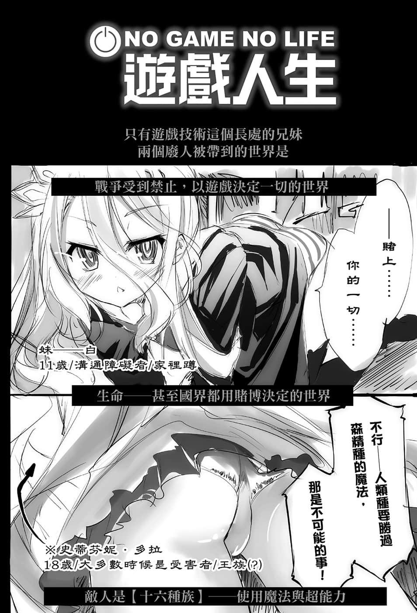
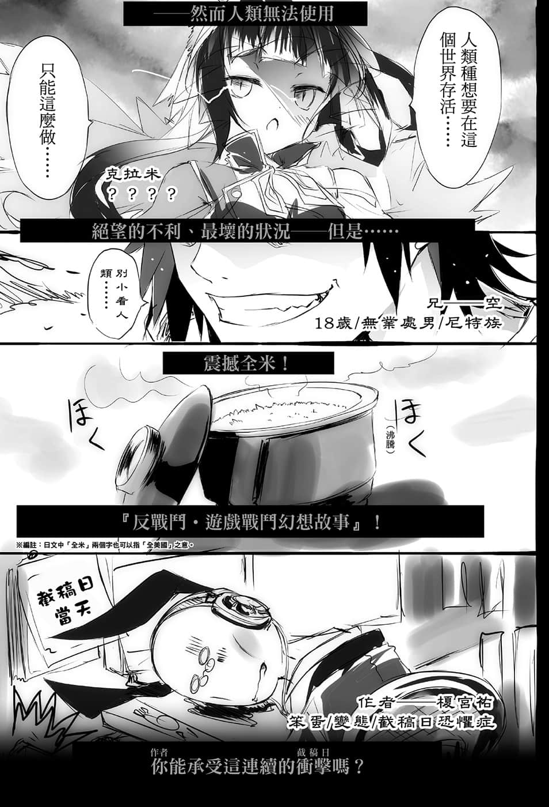

# 后记

> 来源：https://www.linovelib.com/novel/9/2047.html

嗯～～就是这个啊！

我早就想写一次〈后记〉看看了！

大家好，由于我平常都是在〈画插画的一方〉，早就想写写看这个作者方的后记，今天终于实现了——我是作者兼插画的榎宫佑。

呃～我的本业是漫画家，啊，是的，嗯，如今是……暂停连载……

因为我罹患了麻烦的疾病，所以负担较大的漫画执笔就休息了。

而且多亏《天魔黑兔》的关系，比起身为漫画家，我身为插画家的知名度似乎还比较高……最后甚至连小说都轧上一脚，我的本业究竟是……？好、好吧，我『也』画漫画啦！

然后这本《NO GAME NO LIFE 游戏人生》就是我小说的出道作。

本来是为用在漫画而写的原作。

而且不是我自己画，而是提供——也就是我以原作者的身份写的。

原本预定要担任作画的老师是希望——

「我喜欢幻想作品，但是讨厌战斗！」

我很清楚画战斗漫画有多麻烦辛苦，因此为了成全他的愿望！

我想到「那干脆就设定为〈不能〉战斗的幻想世界！」

于是我把除了睡觉和工作的时间之外，奉献了一切的「游戏」给组合进来！

『就连国界都以游戏决定的世界——争夺国土之赌！』

就像这样用逆向思考，再加入个人兴趣后创作而成。

不过很可惜，那样的企划并没有实现就是了。

由于心想总有一天要让它实现，所以我就把大纲和设定书留了下来。

之后由于难缠的身体不适，漫画的工作不得不休笔。

而在医院又闲得没事做而且又不能带游戏进去，这就是——

工作用。

——这是假的吧？我可是病人耶。

那么——就用这种方式宣传如何呢！

说到这个，在除夕的漫画同人展前一天那种忙到不可开交的日子，竟然打电话向我确认行程，我会随口敷衍也是很正常的事啊！

「榎宫老师，榎宫老师。」

「咦？我只是拜托您『作者和插画是同一人，而且又是漫画家的前例可说几乎没有，所以请您利用这点进行宣传』哦？」

（译注：源自于游戏『幻境神界El Shaddai』。）

前一页我也说到，我因为〈身体的关系〉，暂时回到母国。

在地球的里侧一边进行治疗，却又被两家出版社催稿，这是什么样的状况啊？

「……那件事能不能当作没发生过 呢？」

唔嗯。

「我可没有明说喔？」

……咦？这个梗不老吧，还可以的，别放弃。

嗯？什么事呢？责任编辑的Ｓ属性编辑。

应该说，现在——我人在巴西。

「那个……现在好像收讯微弱，我有点听不清——」

好了……到这里应该可以了吧？

喔，对了。

——很好，既然向大人 报了一箭之仇！

不是你叫我画的吗！

——神说……你不能在这里休笔死掉。㊟

这次同月发售的镜贵也老师著作……

「不，那个、那是榎宫老师的错——」

……呼，好了，当我还在写这篇后记的现在。

姑且不论责任编辑Ｓ编辑有多么Ｓ。

应该说这篇《NO GAME NO LIFE 游戏人生》的本文与插画，还有前述的天魔黑兔新书的插画，几乎都是在这里——巴西完成的。

「这些大量的器材是？」

就当是如果热卖到漫画化，我会自己来画的旗子，笑着原谅我吧——

或许我该更强调史蒂芬妮的憎恶也说不定☆

「不，其实我算起来是Ｍ——我向您确认过富士见和我们的行程表吧？」

治病。

不过有可能是足以媲美好莱坞电影的预告诈欺喔？

一切都还没有结束。

所以从后记开始读起的读者，就算为了确认真伪也好，希望您能一读♪

——巨大行李箱塞满装有液晶平板电脑和个人电脑的捆包。

延・长・期・限❤

责任编辑的个性，一瞬间看起来和主角们重迭了。

呼，不愧是镜贵也老师的前任责编凯萨琳的继任者……那绝对是奇袭吧。

希望下集能够与各位再见，那么就再会啰！

那边的工作我也超用心画的，请务必捧场！

「不，您那么说我也……」

《天魔黑兔》第十集「在校庭微笑的魔女（暂译）』我也担任了插画！

——咦？啊，是的，什么事呢？责任编辑的Ｓ编辑。

我可不记得我有答应啊！

「——呃，请问您在说哪件事？」

至于读到最后的读者——呃、嗯，这个嘛。

「虽然您这么说，可是榎宫老师。」

就是要趁我处于心神丧失的状态……

「让我帮您找漫画化的出版社吧？榎宫老师也有身为漫画家的资历——」

……不难想像在海关势必会有一番折腾吧。

啊哈哈，对不起，关于那件事由于电话太小声，我听不见。

「这次都是我责任编辑Ｓ的失误，给您添了麻烦，甚至还全部放给身为作者的榎宫老师解决，请原谅小的所犯下的滔天大错。」

「航程的目的是？」

——本篇大概就是像这样的感觉（逼真）。

——那句话除了『要我画漫画』之外，还看得出其他意图吗？

「啊，对了，榎宫老师，第二集的原稿何时会好？咦？榎宫老师，喂喂～」

你要是敢在校正时删掉这边，我会发在twitter喔 ？❤

「话说您不是说『因为身体不适无法画漫画，所以想写负担较小的小说』，结果在书末又画了那篇漫画，您到底想怎样呢？」

「有人是看后记决定是否要买，所以你就好好宣传吧」说过这样的话。

不是吧，在我为了调整页数，将本文缩减了八页，却在回到日本当天才跟我说「忘记换算黑白插画的十页了」的人是谁啊？

所、所以就这样，卧病在床的这段期间，我对大纲进行大幅修正，改成给小说使用最好的样子，然后就以这样的方式——啊，这么说来，责任编辑他——
