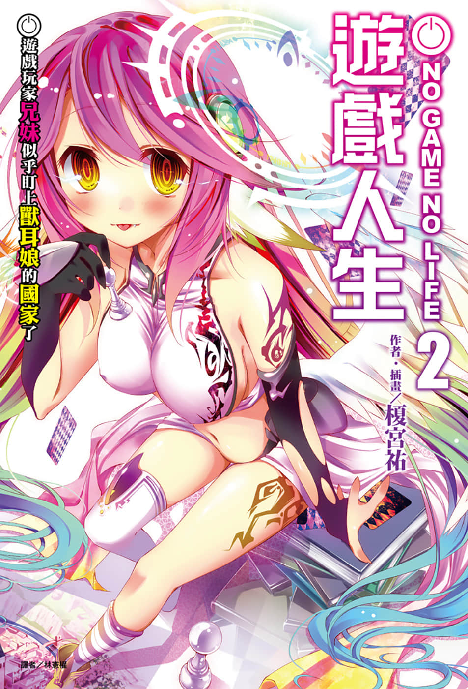
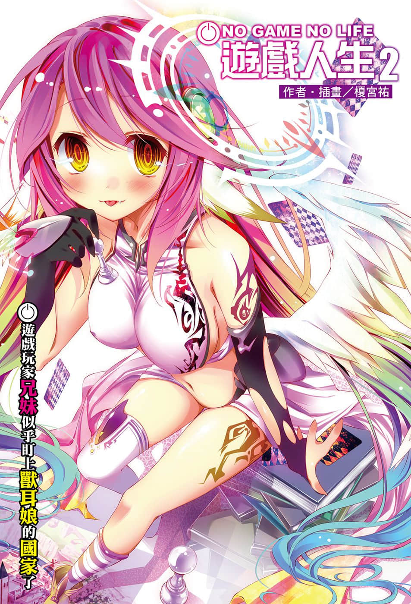
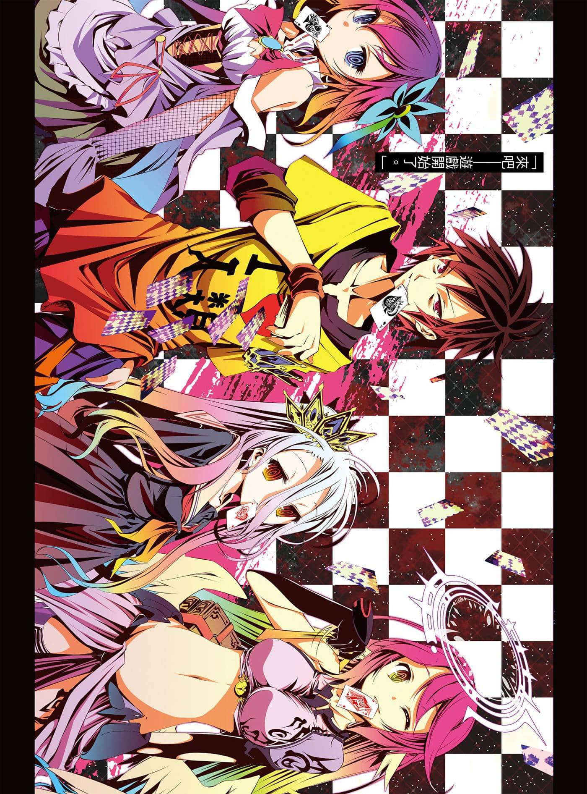
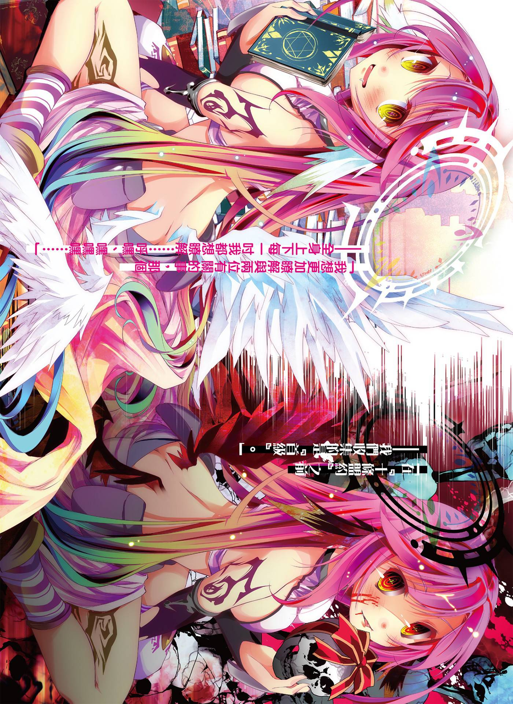

# 插图

> 来源：https://www.linovelib.com/novel/9/118062.html

台版 转自 深夜读书会

作者：榎宫祐

插画：榎宫祐

译者：林宪权

图源：深夜读书会

录入：深夜读书会

深夜读书会：ritdon.com

仅供个人学习交流使用，禁作商业用途

下载后请在24小时内删除，深夜读书会不负担任何责任

请尊重翻译、扫图、录入、校对的辛勤劳动，转载请保留信息

————————————————

【内容简介】

人类VS.兽耳

开发后宫新属性！？迈向称霸世界第一站！

尼特族兼家里蹲，但是在网路上却是被奉为都市传说的天才玩家兄妹——空与白。两人被自称为『神』的少年召唤至『一切都以游戏决定的世界』，眨眼间就登上人类种的王座，靠着异世界的知识巩固内政，并且已锁定下一个猎物。

『东部联合』——世界第三位的大国，兽人种……也就是兽耳少女的国度。

「好，就是那个国家，那个乐园是属于我的，我要去征服兽耳娘啰！就是现在！Now！」

「面对能够读心的对手，要如何进行游戏啊！冷静一点啊！！」

终于开始与异种族之间的游戏——！！ 『最新的神话』之人气幻想小说第二集。

【作者简介】

榎宫祐

看到书店摆放出我的书，我就会胃痛，所以在发售日前后，我就不会出家门。大家或许会想说，这家伙活得真自由啊。其实我要做的事情意外地多，每天都累得跟狗一样，害怕截稿日这个词，甚至不敢写在月历上，我的行程表很不妙啊。

奔驰在时代最前端而视力恶化的作者。

【绘者简介】

榎宫祐

冷静想想，其实不管是不是发售前后，我都不会出门，所以胃痛什么的与我无关。朋友说那些事情都是你自己擅自加入行程的，竟然还敢说累得像狗，实在是滥用自由啊。另外，我认为就是因为不在月历上标注截稿日，所以行程表才会不妙的啊。

