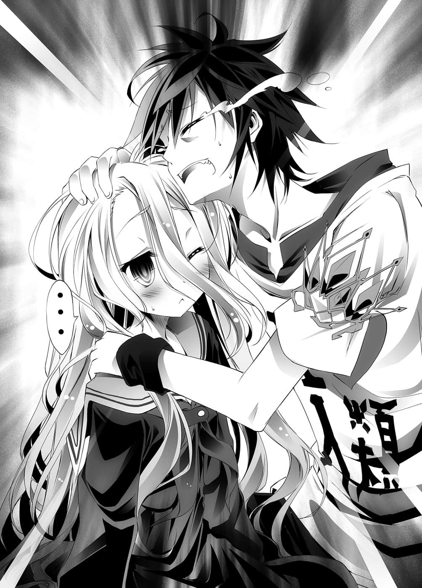
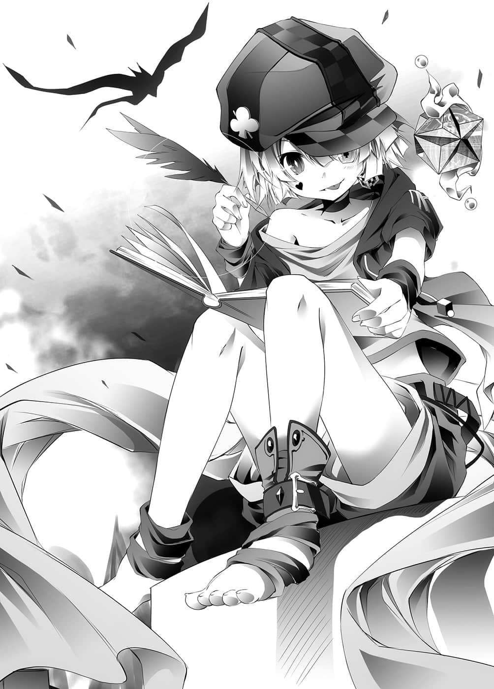

# 序章

> 来源：https://www.linovelib.com/novel/9/2049.html

在ＲＰＧ游戏中，遇到打不开的门时。

您是否这么想过呢？

如果能用魔法轰破这扇门就好了。

但那是办不到的事，何故？

因为那就是『规则』。

——游戏与现实不同。

有些人会说出这种话，就当你无法区分似的。

但是那些人可曾想过，两者到底有何不同呢？

一个是现实，一个不是现实，对他们来说，大概就只是这种程度的差别吧。

那么，我倒是很想跟他们讨论一下，运动是现实还是游戏呢，不过没有那个必要。

因为游戏与现实有一个最根本的差别。

那即是——『规则的绝对性』。

刚才所举的例子也一样，如果我们无视规则，单纯站在现实角度 来思考的话——

其实不用跟他客气，直接破门而入就好了。

世界面临危机，开门需要某把下落不明的钥匙？

假如持有钥匙就能将门内之物据为己有，那么即使被控诉毁损器物，应该也能胜诉吧。

反过来说，若是连打倒魔王的魔法也无法破坏那扇门时，就别管门，破坏墙壁闯进去吧？

更有甚者，干脆用那扇坚固得超出寻常的『门』为盾牌挑战魔王，也是一种方法吧？

我们可以不拔出插在岩石里的传说之剑，只要敲碎岩石就可以了。

然而为什么我们不那样做呢？

只有单调的机械声以及两人点击滑鼠的声音在房间内响起。

「所以我让你们重生了。」

在那样的房间里，光线映照出的是，两张不带感情的脸孔。

然后——

以十六进位构筑而成的虚拟空间——就是『他们』全部的世界。

过去与现在，虚构与现实。

明明没有将军，却得意洋洋，一副他赢了比赛的嘴脸。

如今在这个星球上，『距离』这种概念已不复存在。

有一位天真无邪却素昧平生的少年，异样地伫立在那里微笑着。

——游戏和现实不同？

这些角色的共通处就是，世界以他们为中心运转。

——『这里真的是我们应该待的地方吗？』

涌向无数封闭的小世界社群。

所有的记忆变得混浊。

一人是黑发黑瞳的青年。

呸！现实怎能和游戏相提并论。

有时又是魔法使、特殊精锐部队队员、杀手。

然而有一道声音，回答了他内心的疑问。

——人们说，世界变得无远弗届。

「没错，你是对的。」

青年叹了一口气。

现实之中——并没有『胜利条件Ｅｎｄｉｎｇ』。

---

■ ■ ■

没错——这个就是『现实』。

以及无数不属于这里的另一个世界游戏。

时而扮演世界最大工会的主席。

以及揭示出『明确的过关条件』。

无数的ＰＣ与游戏机，使狭小的房间变得更为狭窄。

电子情报网带给人们的是，足不出户也能知天下事的技术。

既没有满足特定条件就能决定的胜负，世界也不会因打倒某人而获得和平。

表面覆盖了一层光纤网路的世界……地球。

连接在那些机器上无数的接线与摇杆占据了地面，使得房间内甚至毫无立身之处。

庞大资讯所产生的不是无限的连结，而是正好相反。

即便处于世界的里侧，也能像在身边般连接在一起。

面对八台23吋宽荧幕的电脑显示器。

两人的耳机甚至独占了『自己世界』的声音。

画面忙碌地动作着，房间内则一片寂静。

与外界隔绝，更加细分后，稀薄的个人世界意识形态。

但是一旦移动视线，目光所及却是往常的风景。

过多的资讯成为『剧毒』，人们因此逃入个人偏好资讯的狭小世界。

两人更不可能永远过着幸福快乐的生活。

然而，如果每个人都这么玩那个游戏呢？

——说到这里，您应该已经明白了吧？

因此，在游戏里，规则拥有『共同遵守的绝对性』。

这对兄妹无论在任何游戏中都保持『不败』的纪录。

因此，人们依照各自的见解，擅自设定『胜利条件』，任意创造附加的规则。

对于如此高谈阔论的人，我想这么回答他——

——不，真的没见过他吗？

像这些设定好的『最终目的Ｅｎｄｉｎｇ』，若是无视规则去达成，那就不好玩了。

那是如今正与世界某处的不知名玩家展开激烈厮杀的一对兄妹。

好了，那么我们来想像一下吧。

就这样，他进一步思考。

原本包装着那些生活物资的空箱，占去原来宽敞的空间，使房间显得狭小无比。

拥有更多财富者获胜，过得更轻松的人获胜，或者在意胜负的人就是输家……

一人是白发红瞳的少女。

「这里不是你们该待的地方，所以……」

由于太过专注，有时会产生仿佛进入那个世界的错觉。

……如何？是不是很想揍对方一拳呢？

——但是他们却认为，世界变得极端狭小了。

当你在下将棋的时候，对方突然随自己的喜欢，不照规则移动棋子。

八台23吋宽荧幕的电脑显示器。

自从那里成为他全部的世界后，究竟已经过了多久呢？

只要连接上网际网路，就能以每秒绕行星球七圈半的速度传递讯息。

赤道直径一万三千公里的小行星。

那里就是他们全部的世界。

——他们两人认为世界缩小了。

毫无根据，只是漫无目的地想着。

正是如此。

他们时而成为挺身拯救国家的勇者们。

在他们所属的『小世界游戏界』里，他们和游戏中一样，是有如英雄般的存在。

视线的前方，只见在他们见惯的世界中。

以将棋而言就是将死对方，足球就是由进球多的一方取胜，而ＲＰＧ则是打倒最终魔王。

因为那样就不有趣了 。

然而它却招致了，超越个人认知极限的资讯海啸。

他有一种陌生的感觉，这里真的是自己的房间吗？

只要滑鼠一点，一切生活所需就能送货到府。

显示器冰冷的光芒闪烁明灭，照耀着的那个地方就是……

在荧幕内的小世界里，兄妹俩几乎已成为都市传说。

正当他的记忆交错之时，少年在他开口之前便接着说道：

接着，青年徜徉在一如往常涌现的不协调感中。

没错，所谓的规则，就是为了使达成『最终目的Ｅｎｄｉｎｇ』的过程有趣而设定的。

冰冷、安静、狭窄，社会废物所待的……被隔绝的狭小世界。

不，说得更正确一点，应该是荧幕的里侧。

两人的眼睛窥视着荧幕内的『另一世界』。

在那些世界里，他们不再是被锁在八坪大监狱中的社会废物。

无论幸与不幸，富贵或贫贱，终将以『死亡结局』收尾，绝无例外。

在真实感被剥夺的世界中，逐渐混沌的认知里。

突然想起的是一如往常的念头。

「…………啊啊，这是梦啊。」

然后正如所有的『梦』一般。

在无法确定何时会结束的状况下，他的意识即将清醒……

---

■ ■ ■

艾尔奇亚王国的首都——艾尔奇亚。

在争夺国土之赌上屡战屡败，如今这个都市已是人类种最后的堡垒。

而在那座都市的王城里，一位少女正步履蹒跚地走在长廊上。

史蒂芬妮・多拉。

她是先王的孙女，是个拥有红色头发和蓝眼珠，出身高贵的少女。

——虽是这么说。

她眼睛下方的黑眼圈，以及沉重脚步所透露出浓厚的疲惫之色，使得她原本的气质也为之失色。

她面露诡异的笑容，手上拿着扑克牌，摇摇晃晃地走向『王』的寝室，那模样就像是……鬼魂。

「呵、呵呵呵……今天就是天谴之日。」

一夜通宵之后，意识仿佛快要被初升的旭日切断一般。

史蒂芬妮——通称史蒂芙，露出危险的笑容。

「——空，你起来了吧！已经早上了喔！」

硿硿、硿硿。

史蒂芙手上拿着扑克牌，以脚代手敲门，直呼『王』的名讳。

但是……

「是的，我是孤伶伶一个人，我失去了活下去的意义，这一定是因为我的出生本身就是个错误，在您退出房间后，我会静静地上吊了断自己，现在就请您——」

但是史蒂芙曾经看过这幅光景，她朝室内环视一遍。

「女、女仆的屋子？你是指位于外城的『小屋』吗！？那是木造的耶！？」

「——空，你在闹着玩是吗？」

「啊～真是的！我自己进去了哦！」

空得意地如此说道，白则是低低举起手。

「呵呵，我亲爱的妹妹！哥哥非常清楚你在意的事！！」

「啥、啥啊！？」

「……对、不起……是我睡相太差……对、对不、起……！」

妹妹则是以冰冷的眼神回应，那眼神似乎不只是因为刚睡醒的缘故。

「那我看这么办吧，史蒂芙，从今天起，这里就是你的房间了。」

房间中回应的声音，不是『王』的声音。

「所以你就空出女仆使用的屋子里的一个房间给我们吧。至于床就是把床垫铺在地板上。」

这时空忽然说道：

他的口气仿佛是在说：你以为哥哥不知道你在想什么吗？

哥哥泪流满面地用脸颊磨蹭着妹妹——『白』。

「不，抱歉，是我太过分，让你想像那种世界末日的情景，我真是个狠心的哥哥。」

史蒂芙完全跟不上话题，空不理她，继续热烈地演说。

「……你……你……你啊——」

——像这样，抱着头缩在床上，不停道歉的『王』。

「……地点……选哪？」

只见如雪一般白晰的少女，缓缓地从床边爬起。

「那、那张床的价值可是能养活一个家庭耶！」

空伸手一指，指向窗外——城堡的中庭。

有棉被会更好。空甚至提出这样的要求。

「那、那、那可是王室的床喔！？你知道那张床的历史有多么不凡——」

然而或许是想像了那样的情景，空的话还没说完，白的眼眶已经开始泛泪了。

「如何？白，这就是我们梦想中的家！不觉得这个主意很棒吗！？」

看到声音的主人，史蒂芙叹了一口气说道：

就这样，刚才还像只刚初生的羚羊般，颤抖着不停道歉的男人。

「好！所以就是这样，史蒂芙。」

「看吧！你明白哥哥的心情了吧！」

「咦？啊、是、是的。」

看到妹妹诚心诚意地哽咽道歉，哥哥摸着她的头安慰道：

反正他一定是在里面玩游戏——不，应该说除了游戏之外，他也没别的事可做。

「啊啊～～～太好了啊啊啊啊！妹妹啊！你真是的！就因为你恶劣的睡相，哥哥差点就要上吊了耶，你要怎么负责啊！」

「所以都是这张床的错！史蒂芙，立刻把这张床处理掉，换铺棉被！」

让她以踢破门的气势——不。

「什——！……这、这里可是『国王的寝室』耶！」

一名白发少女，垂地长发上还留着刚睡醒的翘发。

这个『国王』仿佛呼吸般地轻松说出令人无言的诡辩。

已经习惯了他们，一直在旁边看着两兄妹耍宝的史蒂芙。

「……赞成……」

可是该在的人却不在，史蒂芙疑问道：

「那就卖掉那张床援助一个家庭吧，世上就此多了一个幸福的家庭，这是一件美事啊。」

事情发展得太快，史蒂芙不由得瞠目结舌。

「……咦？空，你一个人吗？」

『不是，我再认真不过了。』

「啊，果然没错，电脑里也有日本建筑的专门书籍。」

「咦……？」

事实上，史蒂芙真的踢开了门，进入国王寝室后，她看见的是——

「什么嘛，白不是也在吗？你在做什么啊？」

看到白毫不犹豫地点头赞同，史蒂芙心想——这怎么可能！

『请尽速离开房门，千万不可擅自进入房内。』

「……呜……嗯……」

「我是国王对吧？只要是我睡的地方，就算是一间狗屋，那里也是『国王的寝室』。」

「好，我们就在城内建造一个『家』吧！」

「那么今晚白睡着之后，我就躲进衣橱里！当你起床时发现我不在——」

「对不起真的很对不起我不是在闹着玩只是现在真的不方便我真的没有恶意真的很对不起对不起！」

这时却猛一转身，傲慢自大地对史蒂芙宣言：

『国王』——『空』，连珠炮似地说了一大串，却有个有气无力的声音对他发出谴责。

看到史蒂芙的反应，空似乎有了其他的想法。

房间内几乎被书本淹没，充斥了无数的游戏，甚至找不到立足之处。

「……哥……你太夸张了……」

那副模样之可怜，足以引人落泪，他甚至害怕得发抖。

「——咦？」

史蒂芙一瞬间无法理解他的话，迟了数秒后才有了反应。

一见到她的身影，空立刻抱住了她，仿佛听不见世上的任何声音。

大概是睡觉时滚落床下了吧。

听到史蒂芙这么一指谪，空惊讶地往『白』的方向望去。

没想到矛头突然转向自己，让她慌张地发出了奇妙的叫声。

「……（点头点头）」

「……哥……？你好吵……」

空双手一拍，好似想到什么好主意地说道：

「拥有优越的通风性、吸水性、气温调节性、耐震性、耐风性，对家里蹲而言可谓是豪华的城堡，只要小心用火，没有比日本住宅更优越的建筑——」

嗯哼，空清了清喉咙，开始发表演说。

那是一道异常『平缓』，缺少抑扬顿挫的女性合成语音。

『哔～！您要找的人物目前不在。』

「不知道，就算是处于睡着的状态，但白会离开我都是床的不对，这床是倾斜的吧？」

「……什么？」

「什么！？你竟然不明白哥哥的心情！？」

空猛地起身，动作夸张地大叫：

「嗯？这句话我可不能当作没听见了，你看不起木造房屋吗？」

「那个地方也靠近女仆们所住的外城，送餐不会有问题，距离城堡的厨房也近，我们可以和以前一样闭门不出！那里有适度的绿意，通风又好，却很少有人经过！而且得力于城墙的遮蔽，早晨的阳光照不进来！还有哪个地段比这里更好呢！」

他取来放在窗边正在用太阳能充电器充电的平板电脑。

「——什么？」

说到这里，空似乎想到一件事。

「…………呜……呜……呜……」

对于他那副暴君的模样，史蒂芙气得说不出话来。

「啊，对了，这个房间是前国王——也就是史蒂芙的爷爷的遗物吧？」

睡眠不足所造成的焦躁仿佛推波助澜般。

「帮我延请擅长木造建筑的工匠前来，嗯，我想想看喔，因为大概会用到这个世界所未知的建筑工法，所以我需要数位最顶尖的工匠，另外还需要二十位工作人员，至于木材的种类，我想只要说明一下，应该就可以交给那些专家去选择了吧。」

——好了，为各位介绍得晚了。

这就是『人类种』最后的国家，艾尔奇亚的国王与女王——空与白。

这对兄妹整天足不出户，一天到晚只顾着玩游戏和看书，尽是提出刁难人的要求。

——简直就是『暴君』。

「～～～～～～～～空！我要和你『一决胜负』！！」

对于这两个暴君的行为，她似乎终于忍无可忍了。

史蒂芙紧握手中的扑克牌，狠狠地瞪着空向他宣战。

没错，她今天一定要『制裁』这两个暴君。

然而——

「——……哦？」

一听到『决胜负』这个词，空立刻收去感情，露出锐利的眼神。

尽管这一瞬间的变化，史蒂芙已经看过很多次了，却仍不禁战栗。

先前颤抖哀怜的男人，变成轻浮的傻哥哥。

然后，因为这一个关键词，他立刻又换了一张脸孔。

那是有如机械般冷静，令人产生一种错觉，好像心底已被他看透，不论做任何事都逃不出他手掌心的脸孔。

又有如战王一般，大胆不羁的赌徒脸孔。

——但是，那还不算什么。

他的眼神一望过来，史蒂芙就感到脸颊发热，心跳加速。

史蒂芙过去曾经同样地向空挑战，然后输得一败涂地，而这就是当时所欠下的『债』，如今仍然有效的证明。

空只能叹气，白甚至已经完全不感兴趣了。

不管有任何理由，皆不能破坏这个绝对不变的法则规则。

……对空如此宣言道。

「哦～明知如此，你还要向我挑战？」

在毫无规则的世界里，那是由两人所决定，只属于两人的绝对不变的规则。

「……但是……我拒绝……」

「哼、哼哼……呵呵呵……呵呵呵呵呵，你、你的口气真大啊！」

她要以百忙之中彻夜练习的作弊技巧取得胜利。

「什么——！？妹、妹妹啊，你要妨碍哥哥的现充之路吗！？」

然而这时却有个意外的人出声制止。

正如您所见，现在无关她的意志，史蒂芙被『强迫爱上他』了，那么这就表示——

…………

但是史蒂芙仿佛早就在等他问这句话一般，自信满满地开口说道：

（呵呵呵呵……敢小看我，准备接受报应吧！）

空已经完全一副获胜的模样，但是史蒂芙在内心告诫自己，要冷静下来。

「咦、那、那个……」

「欸～！可恶！史蒂芙！！」

「你的意思是要对我提出【向盟约宣誓】的游戏挑战吗？」

兄妹各自发出意义不同的两声叹息，不管是哪一边的意思，史蒂芙都不明了，一时之间显得狼狈不堪。

但是空却闪耀着兴奋的眼神叫道：

「对、对喔——既然『十条盟约』是必须绝对遵守的规则，所以那种事也可以办到吗！？」

——也就是说，只要别被发现，用了也没关系！

「欸？咦？为什么！？这场胜负我可是有胜算的哦！！」

二十一点是由庄家负责洗牌。

是的，空与白——也就是『 空白』是不允许失败的。

——没错，过去他们赌赛之际，空宛如诈骗一般要求史蒂芙『爱上他』。

「竟、竟敢这么瞧不起我……你、你等着看吧！【向盟约宣誓】！」

空双手合十向史蒂芙乞求，发自真心叫道：

「这、这家伙——！」

「……即使那样……也不行……」

「——……唉～～……」

「怎么这样……可是认真玩游戏，我就不可能输给史蒂芙啊！？」

遵从『十条盟约』进行绝对必须遵守规则的游戏。

「——现……充？那是什么？」

见到他这么积极，史蒂芙也感到困惑，不知该如何应对。

史蒂芙在内心笑歪了嘴。

「……哥……不可以……输给白以外的人……」

——比赛已经开始了。

「你、你不是命令我，要我『爱上你』吗……既然如此——」

那是两人在从前的世界所订下的约定——

「哎、哎～呀，人类最强的游戏王不敢答应和我这个小女子比擅长领域之外的游戏吗？」

空感动地仰望天空，所谓的一语惊醒梦中人，大概就是这副模样吧。

「欸！？」

输赢纯粹取决于运气上？她可一点也不想和空比运气。

「好啦好啦……我也【向盟约宣誓】。」

「意思近似健全的人，来，我们来赌吧，来玩游戏吧，我会输给你的！」

「呵呵呵……如果我赢的话——」

空苦笑之后，露出了睥睨的笑容。

——然而史蒂芙不知道。

「空你就要当个健全的人！」

——那是由神所订下，这个世界必须绝对遵守的盟约。

白低喃出她所记忆的盟约文。

「美梦总是虚幻……吗？该怎么说呢，不过史蒂芙你也别气馁，下次再〇〇××吧。」

这是她经过一番演练，绞尽脑汁想出来做为对策的台词。

「咦、咦……？」

「怎、怎么可以！玫瑰色的现充生活就在眼前了说！我、我说白啊，那不如就由你来要求吧，对手是你那就没问题了吧，比方说西洋棋，反正我就算用尽全力也赢不了你啊。」

「……『十条盟约』第五条……被挑战的一方……有权选择游戏内容。」

「……『 空白』不允许……失败……」

「……呼～……」

「好啦……随便怎样都可以啦……唉……」

『十条盟约』第八条，游戏中若有不正当行为，一旦败露即视同败北。

然而看到史蒂芙尖起嗓子，生硬地像是在朗诵台词的模样。

「唔呃——！」

然而却只得到寂静的回应。

听到一连串欺人太甚的言语，史蒂芙脸颊抽动地笑了出来。

这代表赌注为何也会成为心理博弈的要素。

——没错，冷静下来，这反而是『可乘之机』。

「原来如此，对于心理较量你是有备而来的啊——那么『赌注』是什么？」

国王的寝室里鸦雀无声。

史蒂芙对着两人叫道：

空出乎意料地对这个赌注产生兴趣，他兴奋地抓着史蒂芙追问，史蒂芙红着脸移开视线。

原本史蒂芙是期待这样的回答。

『原来如此，来这套啊』、『真是戳到我的痛处了啊』。

但是空一脸绝望，好似从天堂掉落地狱说道：

史蒂芙气得脸颊抽搐，兄妹俩无视于她的存在，自顾自地争吵。

史蒂芙伸手一指。

「我要和你比的就是——『二十一点』！」

她既没有换牌，也无法证明她动过手脚。

只见空眺望着窗外，脸颊流下一道闪闪的泪光。

「没、没错，就是那样。」

这个事实似乎让她先前的气势减弱几分。

「什么——！？」

「啊，这么说来我忘了说我的赌注——」

「对、对喔，没想到有这个盲点啊——！！」

不过他又突然回过神来大叫：

「由我做庄家！空当闲家！这样空就不能作弊了，就算作弊，一旦我揭穿就能获胜！如果输赢纯粹取决于运气上，那就跟实力无关了呀！」

那么只要在洗牌时，『不露痕迹地』排列纸牌顺序，就能获胜。

这是向『十条盟约』发誓，宣誓绝对愿赌服输的誓言。

史蒂芙红着脸，移开视线，不过空还是向她确认。

空玩着指甲，就连胜利后的台词也说得很随便，史蒂芙更是气炸了。

「那、那么！请你变更要求，把健全的人改成——『现充』吧！」

「是、是！？」

「我只好赌你提出能够胜过我的游戏了！虽然那种可能性只有万分之一——不，应该只存在于虚数系的那一端吧，不过我拜托你了，史蒂芙！！成全我这比量子还渺小的希望吧！！」

空为了维持心理上的优势如此说道，史蒂芙则说出了事先准备好的台词。

就算她做到那种地步。

在这种条件下，想要胜过空是不可能的……

---

■ ■ ■

——地平线的另一端。

竖立着巨大得令人失去距离感的西洋棋子，仿佛连高耸的山脉与之相比，都像土丘一般。

而在国王棋子的顶端，只见一名少年坐在边缘，双脚前后摇摆着。

少年愉快地吹着口哨，手上拿着一支羽毛笔和一本『空白的书』。

「嗯……开头可真难写啊～」

看来他似乎在构思自己所撰写的故事的开头。

终于他好似想到了什么，开始振笔疾书。

「——很久很久以前，有个禁止使用各种武力的世界，订下所有纠纷全部以游戏解决的绝对规则……嗯，大概就这样吧。」

少年点点头，满意地说道。他坐在高耸入云的棋子上，眺望着杳渺的远方。

「……『最初的棋子』该有动作了吧……」

少年名叫特图。

是这个世界——凡事皆以游戏决定的世界『迪司博德』的创造主。

同时也是在过去的诸神大战中，登上唯一神的宝座，被称为『游戏之神』的存在。

而这位唯一的神正露出遥思恋人的眼神，注视着远方。

【——问，那是否示意人类即将灭亡？】

突然从虚空中降下一道傲慢的话声。

【——或，你终于要采取行动了？】

听到那个声音，特图微感不快，但是脸上的笑容依然不减。

「啊，对了，后续——」

特图的双眼捕捉到人类种最后的都市——艾尔奇亚。

不过，特图身为唯一神，所以能轻易得知对方的身份，但是他却不感兴趣。

「……你们真的很无趣啊。」

对方是能够偷窥唯一神特图，而且尽管话语不完整，却能千里传音的存在。

但是他的视线，宛如一个要去游乐园的小孩在玄关等待父母出门，就连五分钟也等不及。

【——问，在人类种新王诞生前，曾经观测到事象变动，那是否可视为你有意参战？】

但是对于他的提问，特图却仿佛感到很无聊地抱怨道：

也就是最新一篇的神话序章——

「我不偏袒任何一方，你们不去体会这句话的意义，那就继续那些无聊的游戏吧。」

——如今不断编织着的仍只是故事。

对于自虚空中传来的声音，他丝毫不放在眼里。

尽管对唯一神而言，数百年也只是眨眼间的时光。

「有一天，两名异世界的游戏玩家被召唤至这个世界，来到【十六种族】名列最后的人类种的国度，两人协助处于绝境的人类种的最后国家——艾尔奇亚，抵挡其他种族的侵略，成为国王和女王——一切就从这时开始……句点♪」

然后他噗哧一笑，那笑容就好似在巨大的失落中，却同时抱持着莫大的希望。

呼的一声，确认从虚空中传来的声音气息消失后，特图自言自语道：

神执笔所勾勒的是未来众神的诗篇。

接着，特图神色一转，露出仿佛等不及要与恋人重逢似地笑容说道：

最终将会成为吟游诗人们所传唱的壮阔史诗。

大概是想到故事的后续要如何发展了吧，特图转动羽毛笔说道。

「我的忍耐快到极限了唷～让我等太久的话——我会过去玩哦？」

「你偷听我自言自语？这可不是值得夸奖的嗜好呢。」

神得意地扬起嘴角，这么说道。

「『他们』会来到我的面前——你们是无法阻止的。」

「可别让我等太久了哦，『 空白』。」

叩叩叩，他用脚跟敲打着坐着的棋子边缘。

毋庸置疑地，对方是位阶序列第一的神灵种——而且是神灵种中拥有特殊力量的一尊神。
