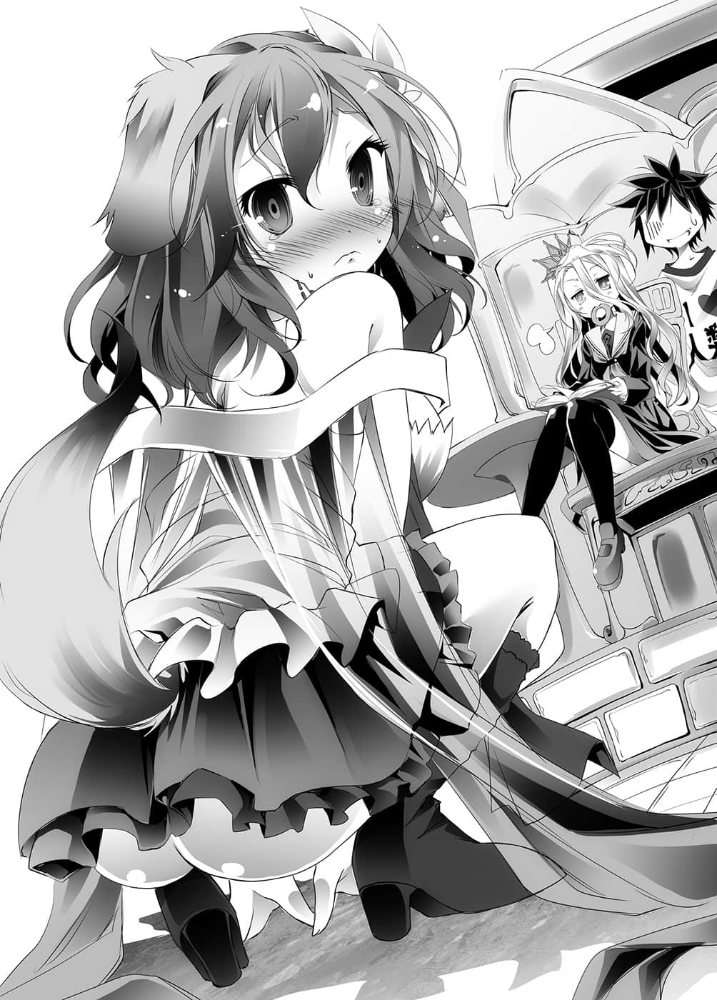

# 第一章 布局

> 来源：https://www.linovelib.com/novel/9/2050.html

人类种的国家——艾尔奇亚王国，位于首都艾尔奇亚东区的六号地区。

豪华绚丽的豪宅大厅里，有五个人围着一张桌子而坐，另外还有数人在一旁观看。

围着桌子而坐的其中一人，是剪了一头杂乱黑发，眼眶之下还有黑眼圈，穿着印有『Ｉ❤人类』字样的Ｔ恤、牛仔裤和运动鞋的青年。

第二个则是坐在那名青年的膝上——留着一头如雪一般的白色长发，拥有让人联想到红宝石的红却毫无表情的眼眸，身穿黑色水手服的娇小少女。

青年的手臂上像臂章一般套着一顶女性用的王冠。

而少女也将一顶男性用的王冠当成发夹，束住过长的头发。

向各位介绍，这对兄妹就是「人类种」最后的国家——艾尔奇亚的两位『国王』。

哥哥——空，十八岁、处男、阿宅、沟通障碍、尼特族、游戏废人。

妹妹——白，十一岁、没朋友、沟通障碍、家里蹲、游戏废人。

…………人类完蛋了。

【完】

只听到这里的话，相信任何人都会这么想吧。

不过，这两人——不是这个世界的人。

他们在过去的世界，曾经在超过两百八十种游戏的游戏排名上，立下不败的纪录。

他们在各种游戏的排行榜顶点，留下空白栏位做为名字，从未尝过败绩。

由于那离奇的技术，与谜一般的身份，因此被当作都市传说一般的游戏玩家。

通称——『 空白』，这就是他们的真实身份。

这里是遵循古老的『十条盟约』，禁止战争的世界『迪司博德』。

在这个一切以游戏决定，连国界也不例外的世界，【十六种族】借由人类无法使用和察觉的魔法，不断地在赌局上作弊，终于将人类种逼到走投无路的地步。

就连最后的都市也将在森精种间谍的谋略下，成为受操控的傀儡政权的时候。

「为什么我揉你的胸——我明白了！我不说就是了！」

♟【第八条】游戏中若有不正当行为，一旦败露即视同败北。

这位大约十七、八岁的少女就是——史蒂芬妮・多拉，通称史蒂芙。

更何况这个世界在未有『十条盟约』以前，其实也一样吧。

「……我实在不想对肩负人类种未来的人说这种话，不过……」

「什么——我、我知道啦，我对你说明就是了！」

「……我确认一下，你不是在对我进行公开羞辱play吧？」

♟【第五条】受挑战方有权决定游戏的内容。

「……那又怎样？」

就这样，一副想睡模样的空抬起头，他所注视之处是围绕着桌子的另外三个人。

「——我、我说你啊！别因为我是处男就小看我哦！？我可是知道的哦！男孩子裤子口袋里的怪物，在女孩子的秘密花园里进进出出，然后世界就颠倒过来了！！」

「说的也是，如果禁止所有的伤害行为，那医疗行为也不行了吧。」

空反而要佩服她的幻想力了。

「——能够想到那种事，我看你的脑袋才有问题吧？」

喂，虽说是幻想世界，这也太扯了吧？

「没错，就是那样。」

在桌子之外，有个站在空他们身边的人，以冰冷的眼神回答道：

「很简单，构成侵害权利、带有恶意的行动——会被取消。」

「喂，我很正常啊！」

「唔嗯……好，我明白了，那么我再问一次，为什么传宗接代会ＯＫ呢？」

「因为我们明确了解，怎样的行为是侵权行为。」

「……彼此同意就是……『让渡』……也就是……」

「欸～！你还不懂吗？这个世界不是有『十条盟约』吗？」

♟【第九条】以神之名宣布，以上各条皆为绝对不变的规则。

「……我可以请问为什么要现在问这个问题吗？」

「……没有人会想看三个大叔的裸体……我们就比到这里了好吗？」

一肩担起人类种希望的两人——哥哥空手里拿着牌，终于开口了！！

空、白以及三名大贵族，他们正在打一场赌上全部财产的扑克。

「——你的脑袋终于不正常了吗？」

「哦，那是为何？」

没有任何超能力、也没有魔法的两人，只靠着人类本身的力量，从正面击败敌人，名符其实得到人类最强的称号，登上了国王的宝座。

——由于空几乎是处于无意识的状态下在玩牌，所以差点就忘了这件事。

『十条盟约』

确实，这两人毫无疑问是废人。

看来他的这个提问是认真的，虽然史蒂芙理解了这一点，但还是难免要确认一下——

「什么疑问？」

「不是啦，不是说禁止伤害行为吗？那样要怎么『传宗接代』呢？」

所谓的全部财产正如字面上的意思，土地、资产、权利固然不用提，甚至还包括了妻子、小孩和家人，这一切在短短两个小时内就被一扫而空，三人输得只剩下一件内裤而已。

但是，若只限定这个世界——兄妹俩甚至能够成为人类的救世主。

「……可是这样又产生另一个疑问了。」

…………人类果然还是完蛋了吧。

……说不定就算没有规则，世界还是会运转。

「因为太闲了，我忽然想到这个问题，不过这也是个相当严重的问题吧？」

也就是身上只有一件内裤的贵族——有小小鲔鱼肚的三名中年大叔。

「……在你们那个世界，人类是从蛋里孵出来的吗？」

但是回答的人不是史蒂芙，而是坐在他膝上洗牌的白。

从那身衣着、打扮、举止，在在显示出她出身良好。

……所以这个问题并不适合在众目睽睽之下谈论。

没错，这三人此刻全部的财产都被空与白赢个精光，沦落成三名前贵族了。

而如今则是——连那样的权限都能以游戏决定的世界啊。

…………

「啊，只要是互相许可的行为，就不构成『侵权行为』了啊。」

♟【第七条】集团间的纠纷应指定全权代理人。

「所以自从订下『十条盟约』之后，大部分的法律都变得徒具形式，在法律得以执行的时点，若非那个行为本来就遵守盟约，就是在彼此同意、过失之下所造成。」

「正常人问出那种话才叫异常啊！」

那是得到唯一神的宝座后，特图所制订的属于这个世界的绝对法则。

而周围则有一群人，用好似看着可怜人一般的眼神，在一旁观望着他们。

——拥有只要他喜欢，甚至连世界法则都能改变的权限。

嗯、嗯哼，史蒂芙清了清喉咙。

不过，她立刻订正：不，我刚才的那句话并不正确。

「算了，之后我再去问能够说明的人吧，真是没用的女人。」

——就这样，空打着哈欠，洗着白手上的牌说道：

「哦……这个世界的神明还真是无所不能啊。」

他不由得再度体认到，这真是相当严谨的盟约，听到空如此自言自语，于是史蒂芙说：

史蒂芙注意着旁人的目光，悄悄在空的耳边问道：

即使规则充满矛盾与缺陷也一样。

【第十条】大家一起和平地玩吧。

受到坐在膝上十一岁的妹妹指谪，无女友经历＝年龄的国王，像个小孩似地耍赖。

如果对方是白，他就算无意识地同意也不奇怪。

在公众场合，你敢再说下去的话——史蒂芙这样的视线如针刺般射来，空赶紧闭嘴。

「世界既然能正常运转，当然存在着严密的规则啊。」

空记得以前白曾经踢过他的背部，这下他总算明白了。

♟【第四条】在不违反〈三〉的情况下，游戏内容、赌注皆不限制。

「因为那样听起来好像你先前都是正常的了。」

「唯一神大人无所不能，那不是理所当然的事吗！」

「我们原本的世界可不是那样……」

对于具有知性的【十六种族】，下达禁止一切战争行为的盟约，盟约的内容即是——

「——欸，那是什么意思？脑中的想法会被即时查阅吗？」

♟【第一条】这个世界禁止一切杀伤、战争与掠夺。

♟【第二条】所有的纠纷一律以游戏胜负解决。

在没有H-game的世界里，竟然有那种H-game的想法。

她，红发蓝眼，身穿拥有一堆褶边，看起来就像是幻想世界中才会出现的衣服。

♟【第六条】举凡〈向盟约宣誓〉的打赌绝对要遵守。

「史蒂芙，我问你哦，小婴儿是从哪里生出来的啊？」

所以史蒂芙才会很无言，以冰冷的眼神这么问道。

「……哥，那种说法……反而……像是处男。」

没错，空他们『来自异世界』这件事是秘密。

「不过这个话题非常有意思，刚好可以消磨时间。」

……——啥？

「处男不像处男要像什么啊！？」

♟【第三条】游戏需赌上双方判断对等的赌注。

「总、总之，那样的行为，基本上也算是伤害行为吧！？至少第一次是！！既然有『十条盟约』存在，那么这个世界的人类又是怎样繁殖的啊！」

「你刚才清楚地说出消磨时间了对吧！？」

确实，看在任何人的眼里，这两人都是社会的脱节者。

身为前艾尔奇亚国王的孙女，系出名门的千金小姐回答道：

「说、说什么傻话——这样我们不就什么也不剩了吗！」

「这里允许这种蛮横的事情发生吗！」

「若是不把输的赢回来，我们可是连衣服都没得穿了耶！开什么玩笑啊！」

然而对于他们的抱怨，空只是打着哈欠当作耳边风，说道：

「……答应赌局的人是你们吧，再说我本来也没打算做到这种地步，是你们自己要把家人和衣服也当作赌注的吧……另外附带一提——」

三名贵族——不，三名前贵族仍想抗议，被空的眼神一扫，不由得缩起身子。

「你们三人联手出千我都刻意视而不见了，你们该感谢我吧。」

「……葫芦……结束……」

白说着掀开手牌。

这意味着贵族们最后的堡垒——内裤也输掉了。

就这样——

农业改革反对派的三名带头贵族输得一文不名。

由他们煽动引起的游行也就此平息。

---

■ ■ ■

首都艾尔奇亚的中央大道。

这是条连接都市东西南北与城堡的干线道路，同时也是艾尔奇亚最热闹的街道。

将反对空推行农业改革的贵族们的内裤也赢走之后，一行人走在回程的路上。

「不、不管怎么说，那样做也太狠了吧……」

走在马车与行人川流不息的归途上，史蒂芙如此抱怨道。

「你也不必叫对方把家人都交出来吧！？」

「是对方自己要赌的呀，会把妻子小孩放上赌桌的人才有问题吧？」

尽管心中怀疑，空仍然喊出这个难以承认的事实。

「不，可是——你是史蒂芙耶！？」

「………………咦？什么？」

看来他们所指示的改革方案，大致上都能够毫无问题地导入。

尽管对成功确保的酪农面积略感不满，但是只要运作起来，就足以供应人口成长的需求。

「你身体不舒服吗！？抱、抱歉，我都没注意到，还带着你到处走动，我马上带你去看医生——」

身为前艾尔奇亚国王的孙女，出身名门的少女。

啪的一声，史蒂芙立刻趴在路面上，悔恨地大叫：

「咦、啊啊，不怎么办啊。」

史蒂芙气得肩膀颤抖，空则是对她大叫：

「虽然觉得不太可能……不过史蒂芙该不会你其实……不是笨蛋！？」

「什么怎么办？」

「反而是我们已经即位一个月了，这才只是第一次游行，倒是令我意外。」

然后他辛苦地咽下唾液，道出难以置信的事实：

系在项圈上的绳子则握在白的手上。

「所以说！那根本是黑道做法啊！」

被命令服从这个超随便的要求。

「那个、空……无法阻止这次示威游行是我的责任，这种事还得劳烦你们，我感到很抱歉，可是这种做法是会留下祸根的。」

这次的目的是要排除阻碍农业改革的贵族。

「刚才你不是说明过了吗？因为那就是这个世界的规则呀。」

被她牵着走在市中心的大街上。

来到这个世界已经一个月，两人几乎没有步出过城堡。

实际上，他们只在一个月前，进行过这样一段对话——

没错，今天早上赌二十一点，被空杀得大败的史蒂芙……

为了折断这种麻烦的旗子，他们才把事情全部丢给史蒂芙和大臣们。

空打断侃侃而谈的史蒂芙，将手贴在她的额头上。

走在她身后的空，紧紧牵着白的手如此回答道。

或许是事到如今怒气又升起来了吧，史蒂芙如此叫道，而空与白则心想：

财产就交给国家管理就好了吧，空如此说道。

「不过这里人也太多了吧……白，你千万不要放开手喔？」

「说要走路回去的人不是空吗？」

他们就是借此回避繁琐的政务。

「把我变成这副模样的人，还敢说这种话！？」

在『农业改革』『工业改革』『金融改革』等项目上，打勾示意达成。

两人战战兢兢地注意周围的视线，低着头如此说道。

——『十条盟约』第六条，绝对要遵守向盟约宣誓的赌博。

「因、因为我们有点事情要办啊……没想到这里的人这么多……」

「我是史蒂芙没错，有什么问题吗！？」

贵族的叛变、工会的勾结，这些都是在策略模拟游戏中常有的烦人事件。

「那、那个……我再怎么说也是以第一名的成绩，从国内最高学府毕业的喔，你这话是什么意思！！」

没想到第一次出场却是在一个月后，反抗倒是出乎意外地少啊——

『那今天一天，你就当只狗吧。』

「那么你打算怎么办？」

「……你压制过他们？」

同时就业问题也多少得到改善——确认过这些数据，空启动行事历软体。

「别介意，恐怖支配虽然会衍生出麻烦事，不过一、两次是不会有问题的。」

进行大规模的农业、工业改革，总是会牵扯到利益问题。

「……史蒂芙，握手……」

「……史蒂芙，趴下……」

她如今穿戴着项圈，以及如狗一般的耳朵与尾巴。

把他们剥得精光，单纯只是为了削弱他们的权力。

于是她就以那种打扮，大摇大摆地走在艾尔奇亚的中央大道上。

「我感觉你好像把史蒂芙当成是蔑称了，这是我多心了吗！？是我太多心了吗！？」

「唔、唔……为什么无法反抗啦！」

他仿佛是个亲眼目睹真正幽灵的物理学者，因为理论遭到推翻，嘴里喃喃念道：怎么会有这种事？

空勉强打起精神回应道。

「不对不对，慢着慢着，等一下等一下，该不会……」

「难、难道就没有正常点的要求吗！？」

白伸出手这么说道。

——这和以前也没什么差别吧。

「是啊，这个嘛……因为我先前压制过他们。」

只见史蒂芙伸出前脚——更正，是伸出右手，放在白的手上。

如果他们继续这种做法，那么就跟某个红色大清洗的独裁者没什么两样了。

史蒂芙比想像中还要努力虽然有点出乎意外。

另外也必须补充一点，刚才在那间豪宅里，她也一直是这样的打扮。

「呜～～～～！为什么我赢不了啊！」

空与白利用从异世界带来的知识，不断地尝试重建国家。

当然，路上行人莫不将目光停伫在她身上，以仿佛看到奇珍异物的眼神望着她。

不过，空重新检视将大臣们报告书上的国家资料利用应用程式制成的图表。

「他们的家人就遵照本人的意愿去做，如果他们有那种度量，能够原谅自己被当成赌注的话，他们自己就会回到那些人身边去。至于其他的资产嘛，就交给史蒂芙和大臣们处理了。」

「你头脑好的话就不会是现在这副模样了吧！？」

——史蒂芬妮・多拉。

不过来到这个世界仅仅一个月的空和白，有可能会因为不熟悉的文化，而招致政策上的重大失败。

但是空对史蒂芙的抗议却充耳不闻，他取出手机。

为了避免发生那种事，他们只对政策做出指示，实行方面则交给大臣们进行。

而受过王族教育的史蒂芙则充当他们之间沟通的桥梁。

空闭上眼睛摇了摇头。

看到两人鬼鬼祟祟地紧紧握住彼此的手，史蒂芙不禁叹了一口气。

「由我们制定政策和方针，至于执行则交给史蒂芙和众大臣，如果这样还有人不满，那就把那个人带到我们面前来，我们会让他输得光溜溜，再把他赶出城去——我是这样说的吧？」

对于宅在家又有沟通障碍的两人而言，行走在正午的大道上只是一种折磨。

「我们在王家直辖地进行大规模实验所得到的资料，我将其中的利益分享给属于我方派阀的大贵族们，再以此为饵，逐步分化中小诸侯们的领头羊……可惜还是有反对的大贵族存在，而今天那三人就是反对派的首领人物，所以不会再有下次了。我希望你们别太刺激那些贵族，慎重行事——嗯？怎么了？」

「……好像没有发烧，史蒂芙，你怎么了？竟然说出这种好像很聪明的话！」

「其实多数贵族一开始都反对空所提出的农业改革，所幸多拉家的威望，对欧鲁欧家和比尔德家还管用，所以我请他们协助我居中协调。」

听到她这个问题，空抚胸松了一口气。

「不，可是——你也稍微看看自己现在的模样吧！？」

空一副惊慌失措的模样。

——以上只是表面的理由。

「……那个、喂，你会不会太失礼了呀？」

「啊，你果然还是没搞懂啊……太好了，你还是往常的史蒂芙。」

「……哥、哥……你才是呢……」

「就是从那三人身上搜刮来的东西啊。」

「……不过，这只能救一时之急而已……」

就算他们再怎么运用异世界的知识，最根本的资源和国土仍然不足。

农业改革需要半年时间，成果始能显现出来。

即便想要使用先进的未来技术，国内却根本没有那种原料。

「果然——只有『取回领土』一途吧。」

那也就是代表——

他们终于要采取行动，夺回国境了。

然而——要进攻哪里呢……

「…………」

或许是猜测到默然不语的空心中的想法，白也同样静默地陷入沉思。

而套着项圈走在前方的史蒂芙也必然地沉默下来。

——可是周围的视线实在难以忍受。

「空、空啊，周、周围的视线很刺人耶，你至少说些话——」

听到史蒂芙的抗议，空察觉到一股违和感。

「……嗯？大家的视线好像很奇怪呢。」

「你教我打扮成这副模样，那是当然的反应吧！？」

「不，不是那样……感觉他们的眼神中似乎含着畏惧？」

对于望向史蒂芙的视线，空察觉到微妙的感觉。

没错，那不是嘲笑在路上角色扮演之人的眼神——

真要说的话，他们好像是以奇异的目光看着空一行人……

「我、我知道了，我知道了，我告诉你啦……是『Card Counting（算牌）』。」

「……史蒂芙其实……很喜欢这个样子吧？」

直到刚才还握在白手上的绳子垂落在地上，原本应该在那里的两人，已不见踪影。

「啊，史蒂芙，你去哪里了？我们可是找了你很久耶？」

不过吃甜甜圈的嘴巴却没停下。

「哎、哎呀……因为白被浓郁的香味吸引走，我又不可能放开白的手，本来想说白应该握着绳子——可是当我发现时，史蒂芙已经不见了……」

——【十六种族】位阶序列第十四位的『兽人种』。

「求求你！这是我一生的请求！请让我揍你一拳吧！！算我求你了！！」

「…………情报……」

然而，更令人担忧的是——

空吞了一口唾液，有如确认一般地问道：

「……史蒂芙，我要求你迅速回答我的问题。」

——没错，这就是他们方才在沉思的事。

……但是却没有回应。

「Card……欸，什么呀？」

「……真美味……」

空仿佛找寻什么似地，朝四周张望，同时一边大喊：

「……………………咦？」

图书馆前的咖啡厅里，空与白正一手拿书，享用着甜甜圈和红茶。

「怎、怎么——怎么可能啊！你们当我是傻瓜吗！？」

「白，你那边情况如何？」

命令她这么做的罪魁祸首，竟然对她感到害怕，面对如此蛮横无理的事，史蒂芙要如何发泄心中的愤怒才好呢。

当白指出时至今日仍无法发动攻势的理由时，空不由得沉默不语。

——……咦？

「你们的神经啦啊啊啊啊啊啊啊啊啊啊啊啊啊啊啊啊啊啊啊啊啊啊啊啊啊！」

「……？那样能算出什么呢？」

「在粮食不足之下，店家仍靠着巧思创意弥补……但粮食存量还是令人不放心啊。」

「艾尔奇亚的国王带着打扮成兽人种模样的人，大家当然会有这样反应。」

他们喝着咖啡厅的红茶，甜甜圈则是在距离中央大道一段路的广场上，跟在那里摆摊的店家买来的。

「……这是什么意思？也就是说『东部联合』这个国家——」

——……什么？

「等一下！你说史蒂芙戴着狗耳和尾巴的打扮是——『兽人种』……？」

她劝谏突然说要和世界第三大国开战的『疯狂国王』。

「——有、问、题、的、是——」

「啥？什、什么问题？」

「艾尔奇亚的国王让人做这种事，任谁也——」

以世界第三大国『东部联合』为最大领土的种族。

空瞬间将截至目前为止获得的所有情报，在脑中重新播放一遍。

「你先告诉我，我赌输的理由！！不然我无法接受这种事！！」

他自称的完美计划，便轻而易举地瓦解了。

但是他们从那里的摊贩，感受不到原本的热闹气氛。

「……嗯，还是……没有收获……」

大叫着出现的人是，肩膀上下起伏、不住喘气的史蒂芙（狗）。

「唔嗯……你不要求解除命令，而是要求说明啊。」

「唔、唔唔……果然这个问题不解决，根本无从下手啊……！」

「Card Counting，简单的说就是将牌数值化，再加以计算。比如说，２～６看做是１，十点牌就是负１，而７～９则是０。」

「东部联合在哪里！？那里吗！？我要直接闯进去，快叫马车过来！！」

「呜——唔啊……！」

「啊是什么意思？该不会你们单纯只是忘记我了！？给人家套上项圈，打扮成狗的模样，就这样抛弃在大街上不管，结果理由不是要欺负或作弄我，纯粹只是忘记吗！？」

「欸～！闭嘴！可以得到国土和兽耳娘耶！你竟敢对我这个紧密结合个人欲望和国家利益的完美计划唱反调，阻挠我的霸业，你以为你是谁啊！？」

---

■ ■ ■

从资料上看来，换成在空他们原本的世界，这已经是会发生暴动和掠夺的状况了。

…………

「他们的女性人口，充满着外貌和人类的女孩子差不多，不过有兽耳、尾巴还有肉掌和胡子，那样可爱到破表的动物是吗？这个世界存在着那种有如乐园一般的国家——你是这个意思吗？」

可是这阵沉默对史蒂芙来说也不好受。

像狗一样被命令『坐下』的史蒂芙，指着空大叫道：

从艾尔奇亚中央大道，穿越错综复杂的巷道后，来到一间图书馆。

「……虽然不能理解你为何要限定女孩子，不过——」

在吃吃的窃笑声中，一阵冷风呼呼吹过。

史蒂芙说道：与其说有，倒不如说……

「对啊，不过白也没有恶意，你就原谅她吧。」

「……史蒂芙，原谅我吧。……坐下。」

从加冕仪式时对世界宣战，至今已经过了一个月。

「被命令坐下，还要我感受你们『道歉』的诚意，这算是暴力吧！？」

但是失控的空，却只是因为牵着他的手的妹妹，小声说了一句：

被她一脸凶神恶煞的面容所压倒，空向她坦白道：

她有如恳求般，抓着空的脚哀求。

……——

白竖起拇指，一边吃着甜甜圈，一边对她下命令，而空也跟着说道：

史蒂芙泪眼汪汪地叫道。

「喂，你突然说什么傻话啊！现在就连国内都还没安定下来呢！」

「兽人种的女性几乎全员都是这个样子。」

「果然是那样啊，真是的，到底是怎么回事？这个国家是不是有问题啊。」

那可以说就是现今艾尔奇亚情势的写照。

那就是名为『东部联合』的——理想国度吗？

史蒂芙从未像今天这么强烈诅咒禁止暴力的唯一神特图。

「好！就是那个国家！那个乐园是属于我的！我要去征服兽耳娘！现在！ＮＯＷ！」

空宛如拔刀一般地取出手机，启动行事历软体！

「——咦？欸、我……被抛下了吗？」

关于他们的情报很少，只知道他们拥有极为优越的身体性能和五感，甚至能够读心，拥有被称为第六感的感觉能力。

然而空完全听不进去。

「不是！不是那一段！」

固然，冲动起来的空令人烦恼。

「啊、啊，空，告诉我今天早上的二十一点，我为什么会输——」

空与白再度默然不语，沉默再次降临。

然而，她在否定前有一瞬间的迟疑，空和白当然不可能漏看。

小贩们的表情也看得出来并不乐观。

史蒂芙受不了沉默而改变话题。

输入『兽耳娘王朝，征服中』，史蒂芙见状对空说道：

史蒂芙回头一看。

「唔哇！我还以为那种人只有在H-game里才存在呢……」

「等等，你刚才说什么？」

「所谓的兽人种——他们有像现在的史蒂芙这样，拥有兽耳和尾巴的女孩子吗？」

史蒂芙似乎仍摸不着头绪，空斩钉截铁地对她断言：

「可以算出下一张会是什么牌。」

「——什么？」

史蒂芙不禁怀疑，那是魔法之类的法术吗？于是空轻松地向她说明。

「那是从场上已出现的牌，预测牌堆中所剩下的牌，利用数学分析出下一张会出现何种牌的机率。只要知道下一张是什么牌，那就不会输了吧？」

「——哦、哦～……」

对史蒂芙而言，将『数学』用在游戏上，这件事本身就很令人惊奇了吧。

她甚至忘记自己就是因为那样而被打败，现在正处于被命令『坐下』的状态，只是一味地对这个方法感到佩服。

她取出笔记本，打算将自己理解到了的事实写下来。

——在她动笔纪录时，忽然发现一件事。

「等、等一下！！那不就是作弊吗！？」

对于她的指谪，空好整以暇地立刻反驳：

「聪明地玩游戏如果算作弊，那么在西洋棋中预测对手的下一步也是作弊啰？」

「那、那是……」

——但是算牌在空原本的世界，也被归类为作弊就是了。

这件事空却不提，而是对她说道：

「所谓的作弊，应该是像你那样蓄意的洗牌追踪（Shuffle Tracking）吧？」

————咦？

「——你、你发现了呀！？」

空面露苦笑，表情就像在说：我怎么可能没发现。

白半睁着眼，兴味索然地回答道。

若问他们『到底认真到什么地步』。

史蒂芬妮被玷污了。

被迫打扮成狗的模样，甚至连内裤都被夺去公开示众的史蒂芙。

「呵呵，没关系呀，那么要开始啰，赌赛内容是——！！」

「什、什么！？」

父亲、母亲、祖父大人……

然而问出这种问题的空，其实才是让白心情不快的原因。

「正合我意！【向盟约宣誓】！」

「我们比——下一个从转角出现的人是男是女！」

盟约是绝对的——无论任何人也无法违抗其强制力。

『十条盟约』第六条，举凡『向盟约宣誓』的打赌绝对要遵守。

答案只有一个『认真到不能再认真的地步』。

「你……你是认真的吗？早上才刚输呢，赌注是什么？」

「……没有……」

然而白却丝毫不理会，从她手上接过内裤。

「……哥，游戏内容……」

「史蒂芙的……内裤，我要没收……」

不过白这么毫不留情，让空感觉到不寻常，他不禁问道：

——但是，事关游戏，那种问题对空与白两人来说，根本是愚蠢的问题。

——那么，如果真的是纯粹靠运气的赌局呢？

不过史蒂芙认为没问题。

然而，这个打赌已经向盟约宣誓过了。

「我、我说白啊，这样实在令人产生罪恶感——或者该说看得连我都郁闷起来了耶。」

——作弊被看穿，还反过来被利用。

「我对白使用这一招，被看穿过好多次了，也多亏你用这一招，让我算牌容易多了。」

她面无表情地，将食指贴在嘴边，侧着头装做不懂的样子。

「你、你们会不会太幼稚了啊！？」

其实空内心是想输的，因此他只能唉声叹气地这么说道。

但是空却反过来将计就计地打败了她，这让趴在地上的史蒂芙泪湿了地面。

史蒂芙在脱下内裤的同时发出抗议。

史蒂芙应该看不见的吧。

史蒂芙以『趴下』的姿势抬起头，充满挑战意味地叫道。

「——你以为绕过那个转角的人，都是没有任何目的地在散步吗？」

「我、我说白啊，今天的你下手好像毫不留情，该不会是你心情不佳？」

不过，史蒂芙的脑中突然闪过一个念头。

「……胜利。」

「在这里喝茶的时候，我一直观察着经过这条路的行人及其间隔，白则比对我的观察结果，代入这个区域各时间密集人口的男女比、就业率和业务内容，从那些人通过这里的目的，分析出男女比例。」

「很好，来比吧（一口答应）。」

听到这个赌赛内容，白瞬间思考了一下，然后回答道：

太、太可怕了，真是可怕的孩子——白！

「……呵呵呵……空！我们再比一次！！」

看到史蒂芙充满斗志的模样，空却是深深叹了一口气，以怜悯的眼神看着史蒂芙。

看到呵呵笑的史蒂芙，空面部抽动地说道：

「……史蒂芙输的话……要听白……一个命令。」

史蒂芙手指一伸，指向街道的转角。

结果——

纯粹比运气的话，是与实力无关的。

「——欸！？」

赌注的内容瞬间让他的同情心灰飞烟灭了。

「白！！难道你以为哥哥有万分之一的机率会输史蒂芙吗！？嗯～～～～！？」

不用说也知道是史蒂芙惨败。

「……白……十一岁……还是小孩……所以不懂。」

只不过是猜测从转角出现的人物性别，这对兄妹竟然如此认真！

她的模样飘荡着一股哀愁，让空忍不住觉得「还是别和她比，放她一马吧」。

对于她的胜利手势，史蒂芙终于感觉到敌意的存在……不过比起那个——

「等、等一下啊，妹妹！这样不会很不妙吗！？」

——另一方面。

说着她更将史蒂芙的内裤往头上一套。

「……猜十次，猜对次数多的人……获胜，【向盟约宣誓】。」

就在他们做着这种事情的时候，路上行人的视线纷纷集中在头上套着内裤的少女身上，结果造成史蒂芙的内裤公开在众人的目光之下……

看不见在人类种最强的游戏玩家之一，那看似无表情的眼眸里，正明确地燃烧着火焰。

白不愉快地重新看起书来，似乎只有这位十一岁的少女，是唯一发觉这件事的人。

但是对此感到惊慌失措的反而是空。

「为、为什么——为什么、为什么啊啊啊！？」

「……你期待……亿分、兆分之一的机率。」

出现在眼前的是四脚着地，像狗一样坐在地上，满脸通红，没穿内裤的史蒂芙。

而是货真价实的『人类种最强的游戏玩家』。

「和早上一样——『让空变成现充』！」

「咿——！等等，请、请换一个要求吧！」

「什么——你想装成是小孩子天真无邪的游戏！？装小孩的时机也太精妙了吧！」

不愧是兄妹，不，任谁也看得出来吧，空的想法完全被白看穿了。

取得胜利的白，依照约定陈述她的要求。

「……白也参加……以『 空白』的身份……接受挑战。」

「呵、呵呵……没关系的……自从输给空的那一天起，我就已经放弃我的贞操了……」

——只靠着记忆的资料和心算就办到这种事，白比出了胜利手势。

那样不就有可能获胜了？

因为胜率总是５比５！

原本依照『十条盟约』，空只要指出她作弊就好了说。

结果是……『９比１』。

「太、太奇怪了！比赛运气竟然胜率能到９成，你们到底做了什么！？」

——…………

对命令她『爱上我』的空，史蒂芙的反抗不是『解除命令』，而是要求空『变成健全的人』。那所代表的意义……只要稍微想一下，应该就能明白的。

「……就是这样……」

真心想输给她的空，好似打心底感到遗憾似地对她解说。

——那表示史蒂芙的对手不是其中之一。

「……咦？」

「……呼……」

史蒂芙从『坐下』自然而然地转变成『趴下』的姿势，整个人俯卧在地上。

——该怎么形容呢。

「……没问题……」

虽不知道是什么没问题，不过头上套着内裤的白如此说道。

不过，趴在地上、按着裙子，泪湿了地面的史蒂芙，这时突然灵光一闪。

不对劲——这世上不可能没有完全取决于运气的赌局。

（没错，刚才的打赌……虽说只有一次，但是空他们也有猜错的呀！）

这也就是说——预测终究只是预测。

正因为有可能猜错，所以白才指定『猜十次』。

那么——！

「空、空！再、再再比一次！！」

或许是因为没有内裤无法起身的缘故，史蒂芙结结巴巴地要求道。

「好、好是好啦……你真的没问题吗？」

史蒂芙已经被命令扮成狗，连内裤都被夺走了。

在这种情况下，若是『继续加注』的话，那不就彻底变成十八禁了吗？

但是史蒂芙却坚决地说道：

「没关系！！为了破解你们两人的招数，一时的失败根本不算什么！！」

——不知为何。

总觉得现在看来，艾尔奇亚之所会被逼到如此绝境，由此可见一斑。

「……这、这样啊，那么赌注相同，这次要玩怎样的游戏？」

「猜那只鸟几秒后会飞走，时间接近者获胜——这次是一次定输赢！！」

只见史蒂芙手指之处。

也就是说，若是想与能运使『超能力』的其他种族在游戏上争胜——

「——什么嘛，难道你以为我们窝在房间里一个月都只是在玩吗？」

史蒂芙是这么想的，然而出乎她意料之外，空竟然爽快答应了。

史蒂芙绞尽脑汁回答了这个答案。

「即、即使如此，不采取行动情况也不会改变啊！」

然后空叹了一口气说道：

「但是关于兽人种，就我们掌握的有限情报，只知道敌人会使用第六感。」

出乎她的意料，空竟然答应打赌，虽然史蒂芙有一瞬间感到困惑，不过——

他全力丢出手中的石子，从鸽子的身侧飞过。

然而——人类种握有的其他种族的情报实在太少了。

「这一个月，我们翻遍这个国家所有的书籍，可是关于其他种族——也就是别国的情报太少了，根本找不到任何破绽。真是的，这个国家是不是有问题啊……」

「咦？啊，【向盟约宣誓】……那、那我猜——三十秒！」

对于这个过于偏离感觉的意见，史蒂芙不禁皱起眉头。

…………咦？

但是受挑战方却完全掌握了我方的特性，也就是说——

接着——

「如果他们能读心，那么虚张声势就不管用了，也无法对他们使用心理战。」

「假设我们要进攻兽耳王国——更正，是东部联合。」

「明白了吗？也就是说，这就是游戏取胜的诀窍，也是你玩二十一点输给我的理由。顺便一提，这也是人类种不断惨败的理由——」

头上套着内裤的白宣判胜利，目光甚至没有离开书本。

「……咦？」

「咦？可、可是……」

「……咦？」

只不过是看不见的变数所带来，无法预测的必然的别名罢了。

「……欸，扑克牌有52张，所以是52分之１对吧？」

然而——

然而那就是重点，空继续说道：

「那么我猜——三秒。」

「咦、那个……你这话是什么意思？」

「咕咕～」

空他们之所以抱怨图书馆的藏书，就是针对这个事实。

「……好……哥获胜。」

房子的屋顶上停着一只害鸟——一只鸽子。

那就是人类种三百万条人命，全都担负在这对兄妹的肩上。

真、真幼稚——不管怎么说，这对兄妹也太幼稚了吧！？

「规则、前提、赌注、心理状态、能力值、时机、身体状况……这无数的『看不见的变数』，让游戏的胜败在开始前就结束了，并没有什么偶然。」

可见那意义是多么地沉重。

恐怕不会答应这个打赌吧。

即使如此，祖父仍然采取了攻势。空的话就像彻底否定了祖父的行为般，让史蒂芙无法不反驳，她苦涩地说道：

「好啊，我让你先猜，【向盟约宣誓】——好了，几秒呢？」

「可、可是！」

「举个例子来说吧……你试着想像盖起来的扑克牌。」

真的只有一瞬间。

「那张扑克牌是『黑桃Ａ』的机率有多少？」

「至少必须掌握『敌人的情报』，否则根本无法比赛。」

那么不管它早飞晚飞，最容易出现近似值的就是中间值。

虽说是间接战胜森精种，但他们无疑是人类种最强的玩家。

而那两人竟然说出——『卡关』两字。

【十六种族】位阶序列第十六位的人类种，既没有特殊能力，也不会魔法。

所谓的偶然——

未能事先掌握情报就贸然挑战结果『必败』。

「——这个世界没有什么运气。」

空看起来还不死心。

鸽子受到惊吓——啪啪啪地拍动翅膀飞走了。

当然，情报被人知道将对自己不利，因此各种族想必都秘而不宣吧。

——一瞬间。

空这么说着，不愉快地阖起书本。

卡……关？

话一说完，空挥臂将石头丢了出去。

「——同时也是我们『卡关』的理由。」

我方不知道对手的游戏内容，也不知道他们的能力。

与史蒂芙输给空的理由完全相同——必输无疑。

在初期状态下，双方看得见——『看不见的变数』完全不同。

空眼睛注视著书本，灵巧地继续着对话。

「所以我们不知道该如何进攻，在找不到任何破绽的情况下，就这样过了一个月。」

——没有运气？

空的表情中出现了「焦躁」之色，让史蒂芙不禁为之冻结。

「游戏规则如果设定得不够严密，就会发生这种情况。」

「我说你啊……只要一步错就全盘皆输了啊。」

史蒂芙猛然向她抗议：

但是，即使如此，也未免太贫乏了。

「什——」

「——什么！？」

「是、是啊……听说他们能够读心……」

算了，没关系。空这么说完，然后继续往下讲。

「喂，等一下啊！！那样不是耍诈吗！？」

正如史蒂芙所言，她的语气没有丝毫犹豫。

然而空却一副理所当然的表情。

由于他们平常丝毫没有表现出那样的态度，所以让人忘记一个事实。

空一脸苦涩的表情，咂舌一声说道：

——那只鸽子不太可能在那里停留一分钟以上。

但是坐回椅子上，重新开始读书的空却严肃地说道：

不过，那也没关系，只要能因此找出两人的破绽——！

「全新的扑克牌初期的顺序，在某种程度上是固定的。也就是说，不含鬼牌，从盒子里拿出来的牌，在维持覆盖的状态下，直接从最下面一张开始发的话，那张『必定』是黑桃Ａ。」

那是——史蒂芙正想反驳。

「一般来说是那样没错，但如果是刚从盒子里拿出的全新扑克牌，最下面的第一张呢？」

空无甚感慨的一句话，却含有足以令史蒂芙趴在地上的沉重压力。

「毫不怀疑，我就是那么想的。」

「没错，我并没有说是从盒子里拿出的全新扑克牌——也就是你并不知道，对吧？」

「你并没有设定不能以人为的方式让鸽子飞走的规则吧？」

「就是这个啊，只要知道的话，『１‧９２％』就会变成『１００％』，所以不知道的人只能抱怨运气太差，知道的人则必然不断取得胜利。」

「——别忘了，人类种就是被逼迫到那样的地步了。」

（对于不容许失败的『空白』来说，一次定输赢的比拼运气——他们会如何对应呢！）

但是空好似没在听她说话，只是玩弄着手上的石头说道：

史蒂芙终于理解到这一点，感受到令人站身不住的沉重压力。

——自己所走的一步，会造成数百万条性命殒落 。

若是背负如此沉重的压力——只是这么一想，史蒂芙就不禁倒抽一口凉气，然后看着伸了个懒腰，操作着行事历软体的空。

「——唯一看得到的突破口却缺少『钥匙』，真是的，这是怎么搞的啊。」

没错，背负着沉重压力还能若无其事，到底神经是怎么长的呢？

史蒂芙有种不寒而栗的感觉。

——……这时。

突然出现的影子，有如黑夜般笼罩了周围一带。

「……怎么回事？为什么突然变成……晚上——」

空移动视线看去——不禁惊讶得睁大了双眼。

就连白也圆睁平常半开的双眼，衔在口中的甜甜圈不自觉地掉落地上。

往正上方移动的视线，看到的不是原先的晴空。

而是仿佛像从地壳挖掘出来的——一块巨大岩盘飘浮在空中 。

「那、那是什么啊……？」

——太惊人了，原来拉普达㊟真的存在啊。

（编注：出自〈天空之城〉。）

空的脑中不自觉地响起这样的台词。

那看起来宽度比某动画中的标的更长，而且怎么看都像是一座飘浮在空中的巨大岛屿。

——这么说来。

记忆中刚来到这个世界的时候，也曾经从天际看见过飘浮在空中的岛屿。

原来如此，拥有那么多个人藏书的史蒂芙，原来真的受过完善的教育，不过……在这个一切以游戏决定的世界里——

对于赌注已经有限的人类种而言。

「——这个世界难道没有侵害日照权或领空权那种东西吗——欸！？『幻想种』？」

「……哥……你又作弊了。」

原本看起来只像个岩盘的岛屿，上面还附着鱼鳍。

所以说艾尔奇亚的情报才会那么少，这就难怪了呀❤

不过大概有相同的心情吧，眼睛半开的妹妹在一旁扶住了他。

订下『十条盟约』之后，他们的战斗能力实质上已被封印。

——话虽如此。

空气喘吁吁把一连串想说的话说完。

「——你说什么？」

生在现代的日本或许难以相信，不过十五世纪欧洲的识字率——据说还不足10％，而空他们从数据上得知，艾尔奇亚大概也差不多是那种程度，再加上没有大量生产纸张的技术，因此制作手抄本需要庞大的预算——

「呃……五年前，国内最大的图书馆『国立艾尔奇亚大图书馆』，出现了一只天翼种，她把所有的藏书连同图书馆一起赢走了……就是这样。」

空勉力支撑着，催促史蒂芙继续说下去。

「『要求的对等代价』是什么！？」

但是空不听她解释。

听到她这么说，空仔细一看。

说得含蓄一点，那是『傻瓜才会做的事情』。

「你说那是知性生物！？跟那种玩意儿要怎么玩游戏——不，在那之前，能够跟它沟通吗！？如果说『拉普达是存在的』倒也罢了，说出『拉普达会说话』这种话，我看连巴〇都会对他老爸报以怜悯的眼神呢。」

空猛然抓着头，然后指着史蒂芙叫道：

若没有知识——也就是『情报』，就不可能与他国对抗。

「……那、那是那个……因为预算关系……」

史蒂芙斩钉截铁地说道。

他们是以空等人拥有的『异世界知识』为饵，所能钓到的稀少对象。

然而，这个世界的人类种并没有飞行技术。

因此，空这个问题只是再度确认而已，而史蒂芙则点头称是。

「——啊，空是第一次看到那个吧。」

没错，关于天翼种的——游戏内容已经知道了。

——【十六种族】。

而拿那个做为赌注，以战争来比喻的话，等于自己抛弃了剑与盾。

……原来如此，看来在这个世界，这是习以为常的光景。

「我记得文献上记载，依照传统天翼种玩的游戏只有一种对吧？」

「因为不要说是它了，就连对住在那上面的『天翼种』，人类都已经没有胜算了。」

感到惊讶的只有空和白，路上似乎没有一个人在意。

——空顿时感到轻微的晕眩。

将新的行程输入手机后，空深深叹了一口气。

「……果然拉拢天翼种才是上策，可是没办法跟他们取得联系吧。」

空滑动手指，将行程输入行事历。

看到空他们茫然地仰望着天空沉思，史蒂芙终于想到：

「抱歉，白，不过没有这些东西反而奇怪呀。」

「那是『阿邦特・赫伊姆』——是幻想种之一。」

「就是『大量造纸』与『活版印刷』的设计图啦……」

既没有进入『天空都市』的技术，也没有与他们联络的方法。

「——好吧，算了，史蒂芙。」

要亮出这张人类种——空他们所拥有的唯一王牌，现在还不是时候。

「你们到底是怎么被人把知识夺得一点也不剩啊！！难道不会留下副本吗！？」

空不自觉地脱口说出忽然涌现的疑问：

「咦？你们如果要找天翼种，这附近就有一个喔。」

「那么下一个目标终于确定了。」

「结果打赌输了，知识反而被夺走啊啊啊啊！？」

为了得到兽耳娘王国——更正，为了能够与他国对抗，空他们无论如何都需要情报——也就是『天翼种的知识』。

「预算！？这跟预算有什么关系——！！」

因此他们并没有参与以国界为赌注的『争夺国土之赌』，不过由于其强烈的求知欲，他们会从全世界各个种族那里收集知识，也就是书本，所以有许多个体是以个人身份进行游戏。

「呃、那个、我听说如果赢、赢的话，『那名天翼种就加入我方』！」

「……虽然不懂你后半部在说什么，但是，那是办不到的啦。」

「天翼种——啊、啊啊『天空都市阿邦特・赫伊姆』……原来就是那个啊。」

「什、什么事？」

是的，条件是不错，错的是——

「你们竟然把知识拿上了赌桌，你们的脑袋有问题吗！？那可是你们唯一的武器耶！？」

那是神所指定适用『十条盟约』的十六种知性生物。

——原来如此♪

「——咦？啊，对、对喔。」

——原来如此，打算拉拢比人类拥有更多知识的种族啊。

「……史蒂芙，晚点我会把翻译成人类语的笔记交给你，上面的交代作最优先处理。」

话虽如此，公开空他们的『异世界知识』，以吸引他们过来，这种方法也不行。

然而，半睁双眼、头上套着内裤的白，则是不高兴地批判那种行为。

也是来到这个世界后，空最先盯上的种族。

「不，等一下等一下！我们翻遍城内和国内图书馆的书籍，根本没有那样的情报啊！？」

「……哥……艾尔奇亚的……造纸技术和……识字率……」

「不会读写要怎么和别人玩游戏啊，人类真的想赢吗？」

空深深叹了一口气，然后站了起来，史蒂芙问道：

见到空不明所以，头上仍然套着内裤的白说道：

过去大战时的战斗种族，由神所创造，用来杀神的尖兵。

但是空指着上空——不，指着拉普达（假定）大叫：

那正是空他们准备做的事情，同时也是个不错的条件。

「啊，好……那是什么样的笔记？」

空再度仰望通过上方离去的拉普达。

「那、那是祖父大人拿去赌的——他、他一定有什么深远的想法……」

目送着幻想种『阿邦特・赫伊姆』离开。

由于太过惊讶，所以刚才忘了这件事，不过他想起以前读过的书籍里，记述着这样的内容：

「……告、告诉我详情。」

如果说那是巨大的鲸鱼——感觉似乎……也无不可。

但是他们拥有等同永恒的生命，高度的魔法适性，以真正的天空都市做为唯一的领土。

然后她也效法空他们，将视线往上移。

…………————

「与其说是待在这里，倒不如说是……霸占着不肯走吧。」

看着空烦恼地自言自语，史蒂芙惊讶地说道：

「懂得六国和十八国语言的你们才是异常啊！」

就连经过的路人也因为空的大叫而惊讶停步，而被他这么吼的史蒂芙则结结巴巴地说道：

空大叫道：

——【十六种族】位阶序列第六位——『天翼种』。

「那是一定的吧，因为就是天翼种将他看上的书，一本不留地全部从艾尔奇亚赢走了。」

「开什么玩笑！要和外国人玩游戏，六国语言是最低限度的必修科目啊！」

「……这个世界未免太无奇不有了吧……照这个情况『过度先进的那个』也……」

「是的，【十六种族】位阶序列『第二位』，那就是其中一只。」

「事不宜迟，现在去的话，晚上应该就能回来了吧。史蒂芙，准备马车。」

「咦？什么？」

话一说完，空再度确认输入手机里的目标。

——『讨回人类种的知识』。

「……不，这个大概也办得到吧，追加上去好了。」

空说着又在手机上输入：

「嗯～『获得一位天翼种』……这样应该就可以了吧。」

——刚刚史蒂芙才说过。

那个『不可能赢得了』的种族。

位阶序列第六位——杀神的种族。

空却那么轻松地说出『获得一位』。

史蒂芙茫然地看着空的背影，而空没有理会她，牵着白的手向前迈步。
