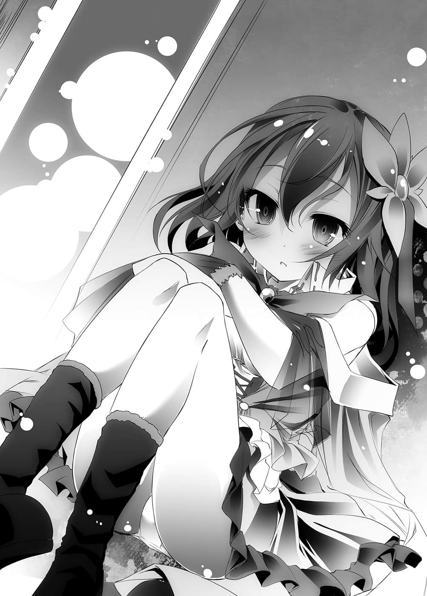

# 第三章 弃子

> 来源：https://www.linovelib.com/novel/9/2052.html

距离艾尔奇亚少许路程的郊外，那里是国立艾尔奇亚大图书馆。

虽然从吉普莉尔手上取回，不过那个地方如今仍在她管辖之下。

史蒂芙现在在那间图书馆、状似吉普莉尔自行建造的厨房里。

然而她的表情疲惫不堪，看得出并没有好好睡一觉。

「……与其这样，还不如让他们一直窝在国王寝室还比较好……」

取回图书馆后，空与白不再窝在国王寝室里，而是窝在图书馆里闭门不出。

史蒂芙要处理内政，又要远道前来图书馆报告，他们甚至叫她端茶送水。

「为什么我非做到这种地步不可……我可不是端茶水的女佣哦！」

但是在满口抱怨的史蒂芙脑海中。

她想起与吉普莉尔对战后的那幅场景。

『谢谢你，史蒂芙。』

——（胸口一紧）……

「所以说那是被植入的感情呀！我只是被他利用而已！！」

史蒂芙这么叫着，然后进行几乎已成为例行公事的用头撞墙作业。

突然一道声音叫住她。

「哎呀，小多，你工作辛苦了。」

「可以请你不要叫我小多吗！？话说你是什么时候到那里来的！？」

连开门的声音都没听见，吉普莉尔仿佛一开始就伫立在那里。

「主人有话要我转达。」

「什么？那个、我的问题……」

「很遗憾，主人，那恐怕是不可能的事。」

「所需的调理器具都在那边的柜子里，餐具在那边，材料和调味料则是在上面的柜子，茶具组在这边。烤炉是阿邦特・赫伊姆制的，所以我把使用方法用人类语整理在这里了，那么请自由使用。」

「呵呵呵，这次可是很完美喔。」

她的语气中感觉似乎有牵制的意味，会是自己多心了吗？

——这个国王不行了。

她慌慌张张地，想要用毫无说服力的话语掩饰过去，但是吉普莉尔却只是面露微笑。

「呃……要先把握住东西放在哪里吧……」

「是的，不过比起外表，性能面的差异更大。请不要因为他们名叫兽人种，就以为他们的身体性能只和野兽差不多。因部族和个体不同，他们拥有逼近物理极限的性能，甚至能够读取思考，这都是那超出常轨的性能之故。另外，被称为『血坏』的个体甚至——」

「遵命，东部联合是个内情相当复杂的国家。」

「啊，好的……你辛苦——咦？」

心想：如果依照那似曾相识的感觉，打开门后，里面会是空无一人……

「好、好吧……反正可以使用砂糖的话，我也有想吃的甜点，做一人份和全员的份，其实花费的工夫也差不了多少。对，没错，这是顺便，我只是顺便做的而已。」

史蒂芙这么说着，然后开始在吉普莉尔的厨房里翻找。

「咦、啊，好的……感谢您这么费心。」

「…………——（偷瞄）」

此时脑海再度闪过吉普莉尔战后的光景。

空一脸认真地对这一点提出疑问，而吉普莉尔回答：

「没、没错！而且是用作弊一样的诈欺方式！很难相信会有这种人吧！？」

因此，长年以来，重复着内战与停战，是个缺乏统一性的小国群岛。

「这上面抄写着在我藏书的食谱里，主人有兴趣的甜点——」

虽然可通称为兽人种，但是由于他们身体特征的差异，事实上存在着无数的部族。

史蒂芙朝放在桌上、空感兴趣的甜点食谱偷瞄一眼。

然后吉普莉尔笑嘻嘻地看着自己，史蒂芙发现这些她全都看穿了。

「兽耳女孩们是我的，好了，要如何攻灭东部联合呢！」

「所、以、说——！」

「……竟然要求『爱上我』，不愧是主人，真是有趣的要求呢。」

「这幅光景感觉似曾相识呢。」

东部联合——位阶序列第十四位『兽人种』的国家。

为了吾主……这句话让史蒂芙有些在意。

「不好意思，在你锻炼额头时打扰你。」

「喂！那不是间接命令我，要我做美味的甜点吗！到底要把我使唤到什么程度才甘心啊！！比起那种事，我更希望休息啊！！」

——『做得很好呢，史蒂芙，谢啦。』

吉普莉尔对人类种的感情很陌生，不过在知识上，她知道恋爱感情的性质。

「关于即将被我征服的兽耳少女王国——『东部联合』，请你解说一下好吗？」

——也就是说，她现在所说的这些，全部都是对空的感情。

「这、这这这是一般论啦，一般论！我、我并没有那种经验——」

「关于这个。」

「那么——吉普莉尔参谋。」

男人以严肃无比的表情，向吉普莉尔询问。

史蒂芙额头涂上软膏，绑着绷带。

门外的吉普莉尔看着这幅景象。

另一方面，吉普莉尔仍是一副充满兴趣的样子。

吉普莉尔不经意地清楚说出对主人——也就是对空的『爱』。

吉普莉尔再次无声无息地从背后出现。

不见了。

忽然，她想到自己的初恋是——被强制喜欢上的空。

「这是为了我自己！！对，那么我就来做个美味到连自己也惊讶的甜点吧！！」

「不是——这是……」

不过史蒂芙摇摇头。

结果，幸好那里并非似曾相识的那幅光景。

「你说身体特征的差异……是指有猫耳或狐耳这种事吗？」

……眼前这个男人，实在令人不愿相信，人类种的命运是托付在他身上。

「欸——红色……呀啊啊是血啊啊啊！？唔嗯……」

「啊，那我就收下了❤谢谢——啊！」

那、那么能做的甜点种类也会大幅增——

「唔嗯，好了，我大概明白了——那么……」

「我听主人说过了，听说是主人命令你『爱上他』是吗？」

就在视线移开的瞬间……她到哪里去了？

「是吗，那么话已经传到，我失陪了。」

「这、这个嘛……就是看到他和其他人要好时，胸口就会感到苦闷，没在一起时会感到不安，就是那种……——咦？」

「欸？是、是那样吗？」

「欸～『吉普莉尔的厨房里似乎有砂糖、奶油等许多东西，那些好像都是属于我的，所以你可以自由使用，想做什么就做什么』——以上。」

史蒂芙意气风发，取回砂糖和奶油后的自己，不再有死角！

「我就说不是了啊啊啊！」

「……如果爱上是一瞬间的事，那么冷却也是一瞬间的事——小多并没有被命令『持续爱着他』，那么为何会出现恒久性的影响呢？呵呵，真是令人感兴趣啊。」

---

■ ■ ■

史蒂芙有些畏惧地说道。

——可以使用砂糖和奶油？

吉普莉尔取出纸条。

硿！硿！硿！

「是的，因为我们是除非必要，否则不会繁衍后代的种族，只要有对主人的爱就已经足够。对人类种的恋爱感情这种细微的心理变化，我的理解只在口耳相传的程度而已。」

史蒂芙被自己的血吓晕，看来距离甜点完成，还需要一些时间。

史蒂芙抓住为自己行动正当化的借口，连珠炮似地为自己辩解。

她晕倒后重新振作，完成了四人份的甜点，如今她正端着沉重的甜点走在路上。

「咦？啊……呃、你说的爱……是主仆之爱吧？」

她又瞬间消失了。

完全看不出，那是她一心为了想得到空的赞美而做。她就这样前往图书馆里侧的房间。

「……咦？」

她轻轻一笑，再度如溶入虚空般地消失了。

史蒂芙的脸变得比番茄还红。

然而，在短短半世纪的期间内，却突然出现被称为『巫女』的人物，平定、合并各个小国，如今已攀升至世界第三位的大国，是一个巨大的海洋国家。

「我无法分出两者间的区别，一般的爱又是怎样的爱呢？」

他抚摸着自己的头——只有台词改变。

史蒂芙的双手按在桌上。

然后碰碰碰的，用头撞击桌面。

取而代之的是——

意外地，浇他冷水的人，竟是称呼空为主人，表示绝对服从他的吉普莉尔。

「咿呀！？」

吉普莉尔的眼神就像是看著有趣的事物一般，史蒂芙红着脸，慌慌张张地摇着手。

然而，她的模样却像是看到比那更有趣的事物。

「不会，一切都是为了吾主，那么失陪了。」

——但是双手拿着东西，开不了门。

「是吗？我对人类种的恋爱感情不甚了解，非常抱歉。」

「什——吉普莉尔，你以为我为什么招揽你这个有识之士加入！？完全是为了满足我个人欲望和国家利益的完美计划——也就是为了抚摸兽耳少女的说，结果这是怎么回事！」

他的自私自利和公私不分，可说到了令人感到爽快的地步，然而吉普莉尔却回答：

「很抱歉，可是——即便是主人们，我想应该也无法胜过东部联合。」

听到这句话，空和在一旁读书的白眯起双眼，瞪着吉普莉尔。

「哦……你的意思是『 空白』会输吗？」

「不，我的话有语病，我的意思是，我无法满足您的期待。」

这是因为——

「我曾一度向东部联合挑战——却输给了他们。」

……什么……？

「……真的假的？欸，比文字接龙吗？」

「不，因为提出挑战的是我。」

……有哪个游戏，能够打败这个规格外的泛用人型决战兵器呢……？

「所以，我们比的可能是对方指定的游戏。」

——可能？

「附加一点，森精种们——爱尔文・加尔得过去五十年间，也曾对东部联合进行过四次正式的『国家对战』，而且每一次——都是以失败作收。」

吉普莉尔的语气，就像是在述说着不想承认，却又不得不承认的事实。

不过，那些暂时先摆一边。

空要解开那些话所代表的意思，以及吉普莉尔断定不可能的理由。

「我想该不会……」

如果真是那样——那么她说的确实没错。

「……在这个世界，对『受挑战的一方』压倒性有利对吧？」

「……半个世纪急速扩大的……国家……只守不攻……很奇怪。」

毫无事前情报就去向那种对手挑战，确实是自杀行为。

从这个条件所带来的结果，白推测东部联合所采取的战略态势。

「今天天气晴朗，或许可以看得很清楚——」

「白，所以你才会明明头脑比哥哥好，战略游戏却输给哥哥啊。这样做没有好处吧？」

但是空指谪她。

「……哥的……游戏风格……很讨厌。」

……说到这里，吉普莉尔笑了出来。

没错，就如爱尔文・加尔得企图对这个国家艾尔奇亚做的事。

故意露出破绽，引诱对方来袭，再反过来击败对方，这样做好处更大吧。

如果拥有连森精种、天翼种都不是对手的『必胜之策』，为何要贯彻只守不攻的策略呢？

「各位，请抓着我。」

游戏内容不明，心理战也不管用的话，根本无从拟订对策。

不过，确实没错，白也承认自己的推测错误。

就连面对只是间接借助他们力量的人克拉米，若是事先没有情报，也必败无疑。

「……那被视为人类史上最大的谜团……」

吉普莉尔面不改色地回答自己做了瞬间移动。

耳边响起玻璃破碎的声音，空同时间闭上了双眼——

（——啊，这个情况发展很不妙呀。）

——不过，仍是感觉不对劲。

「……嗯……」

这就类似空的世界里的『核威慑理论』。

「可是消除一切记忆的话——就没人会来挑战了吧？」

「您问我做了什么……只不过是空间转移而已。」

能够指定自己有优势的游戏，当然比较有利。

「咦？什么？哪一国？」

——现在空与白遭遇这个世界最大的疑问。

史蒂芙叹了口气说道。

「我想亲眼目睹会比较快，当然，小多也一起来吧♪」

「既然如此，这样又浮现另一个疑问了。」

……原来如此，拥有优越的五感与第六感，甚至会读心的种族，他们不惜消除记忆，也要隐匿游戏内容。

「——这个星球为何能维持原状？」

只有吉普莉尔和白有所反应。

对于空这个疑问，吉普莉尔以苦笑回答。

「应该只是没有人把人类种放在眼里吧？」

「只要是在视线范围内，可以去任何地方；如果在视线范围外的话，那么只要是到访过一次的场所，便可以无限次数。」

——我好像飘浮在距离地面一千公尺高的地方，景观很不错吧？

空泪眼汪汪地抱住白。

「是的，因此我怀疑——有高位种族涉入其中。」

「所以你就向他们挑战，结果反而被打败。」

「天翼种主要是以龙精种、巨人种和神灵种为对手，真怀念天翼种出动五十人终于狩猎了龙，以及两百人一起向神挑战，却反而被击败的那段日子。」

对方既然是绝对无法胜过的对手，自然不会有人找他挑战。

「抓着你？」

空心想……原来如此，难怪她神出鬼没，能够出现在任何地点。

但是，这个世界的居民们异口同声都是同一个答案。

「不，有的……只有一个国家。」

身体能力能够达到物理极限的兽人种，有如犯规的森精种，还有像吉普莉尔这样毫无道理的生命体，既然是与他们发生『战争』，那就表示人类种应该能够与之战斗啰？

没想到她竟然会瞬间移动，虽是难以理解的事实，不过这样就想得通了。

「——白，在古早的大战中，人类种是如何生存下来的啊？」

也就是森精种，他们有多么难缠，空他们在国王选拔战时，已经亲身体验过了。

「爱尔文・加尔得输了？……而且多达四次？」

「不愧是主人，因为这个缘故，所以游戏的内容完全不明。」

……她说这个以极超新星爆炸攻击才终于死去、可以瞬间移动又可以在空中飞的种族，曾和出动了两百人也无法打倒的家伙战斗过。

即使事先布下多重防卫线才向它挑战，却仍陷入苦战。

「……只守不攻……？」

——没错。

更何况是对只拥有谋略、智略为武器的人类种，他们甚至可以说是天敌。

吉普莉尔以非常甜美的笑容回答道。

「东部联合要求的代价是……『对游戏内容丧失记忆』吧？」

吉普莉尔若无其事般继续刚才的话题，却被空喊停。

「…………天知道……？」

「请不要放开手哦——那么失礼了。」

「没、没错吧？」

吉普莉尔恭敬地低头说道：

——然而，那样一来就有数点可疑了。

这样就无法刺探游戏内容，也不能输了之后再研拟对策。

「如果是那样的话，那我就想知道背后是谁在操控，因为压抑不住这样的好奇心——」

再度睁开眼睛，空所目睹的光景是……咦？是错觉吗？

而且他们是现在世界最大的国家，东部联合能够与之抗衡，那就代表——

「等一下等一下，吉普莉尔，在那之前先说明——你刚才做了什么！？」

「……真是丢脸。」

「不过，事实上，最近十年对东部联合挑战的国家——」

转眼间就被带到超高度的空中，空要求她说明这个情况。

——这意味着现状要获胜是不可能的。

就在吉普莉尔说出这句话的瞬间。

『十条盟约』第五条，受挑战方有权决定游戏内容。

「欸！？」

原来如此，这样就明白吉普莉尔断定不可能打败对方的理由了。

白大概是读过吉普莉尔的书才知道的吧，但那却是空所不知道的情报。

史蒂芙察觉到危机，于是静静地准备离开房间。

不知何时靠过来的，史蒂芙的肩膀被吉普莉尔抓住，不由得发出惊叫声。

「……你的空间转移能够做到怎样的程度？」

「那正是唯一神不战而胜就被决定为唯一神的理由。」

「哥哥绞尽脑汁，拼命想出来的战略，却被你说讨厌，哥哥会很沮丧哦！？」

爱尔文・加尔得。

空与白依言抓住吉普莉尔的衣服。

果然很奇怪，正当兄妹俩侧着头百思不解的时候，吉普莉尔开口说道：

然而吉普莉尔却一副惊讶的神色。

东部联合可能已成为某大势力的傀儡政府，而那个势力甚至具有打败森精种的实力。

………………………………原来没有维持住原状啊。

「别说那些了，请看那边。」

吉普莉尔仿佛要挥去苦涩的记忆一般，笑咪咪地指着前方。

从上空看得很清楚，那是艾尔奇亚国境的附近。

在国境线的内侧，也就是艾尔奇亚的领土内，一栋庄严的巨塔耸立在远处。

没错，庄严的塔。

——明显不是人类种建造得出的建筑物——倒不如说……

「……呃，那座高楼建筑是什么？」

没错，那是一栋宛如美国帝国大厦的建筑。

「……好大。」

连白也瞠目结舌。

之所以能够勉强不失去距离感，是因为下方并排而建，貌似人类种的街道，与那栋大厦形成落差的缘故。

「请小多说明一下如何？」

我就知道会这样，史蒂芙垂下肩膀说道：

「……那是东部联合的——『驻艾尔奇亚大使馆』。」

「…………哦，大使馆。」

在空冷冷的注视下，史蒂芙别过头去。

「正、正确来说——那是我国的『前』王宫遗址。」

「……………………我说啊。」

空更加冷冽地注视着史蒂芙的脸。

「…………欸～咿！——我知道了啦，我试试看啦！」

从刚才他口中发出的只有叹气。

她猛然抬起头，放声叫道：

唉～～～～…………

于是空抓了抓头说道：

吉普莉尔就是为了让空看这些，所以才会飞到上空来。

「真是对不起，您有高处恐惧症吗？」

只怕她是看着食谱。

他终于发现摆在桌上，史蒂芙端来的茶和茶点。

空指着帝国大厦（暂定）说道。

肩膀颤抖，但却无法反驳的史蒂芙，眼眶泛泪地奔跑离去。

空用手指按着眉头，史蒂芙则已经说不出话来了。

「……吉普莉尔，送我回图书馆吧。」

而在他膝上的固定位置，白忧心地看着空。

「等、等一下，你们是什么意思？你们说本来艾尔奇亚——国土是现在的两倍？」

啪的一声，她用力往空坐的桌子拍了一下。

日前他也吃过史蒂芙可口的手工甜点，但是味道却不及这个。

听到吉普莉尔笑着这么说，空不禁睁大双眼，怀疑自己是否听错。

就连平常语调缺乏高低起伏的白都雀跃不已，空也不情愿地吃了一块。

「唔唔……」

「……真美味……♪」

白与吉普莉尔点头肯定。

「……发起挑战的是……艾尔奇亚……」

只见白注视着空，而吉普莉尔只是闭着双眼，等待主人的命令。

「——把一半的国土当赌注，有勇无谋地硬冲送掉，你教我要怎么为他辩护啊？」

「啊！他真的是你的祖父呢……相信『运气』那种东西，以为乱枪打鸟，总有一天会获胜吗？……对手可是『国家』喔……他难道连这层意思也不明白吗？」

「～～～～！够了！！」

白抢在空前面，拿起点心吃了起来。

「我原本以为先王是白痴，这样看来应该是酗酒之类的吧……」

「为、为什么用那种眼神看着我！」

「………」

但是，空大大～～～～地叹了一口气。

全权代理者，也就是接受他人性命之托，是以那些人的性命为担保来进行游戏。

或许心里也是千头万绪吧，空完全进入忧郁状态。

「主人，您忘了吗？这十年来，唯一向东部联合挑战的国家……」

「最初是那边的山，接下来是那边的平原，下一个……最终则是赌上当时位于国土中心的王城——然后就变成现在这样。」

「不是，是因为在这里连想抱着头都办不到，我需要地板。」

「……看到那样的景象，你要我说什么呢……」

刚才激愤的心情已经平复。

---

■ ■ ■

但是史蒂芙肩膀颤抖，低着头，以好不容易才挤出的声音说道：

或许是一开口就停不下来了吧，空沮丧地抱怨。

「……这十年来……先王……输给东部联合……八次。」

诸如稀有金属等，一定需要很多群岛国家所无法供给的资源吧。

空抱着头，盘腿坐在桌子上。

「这是什么意思？就连爱尔文・加尔得都挑战并输了四次的对手，人类种却赌上国土的一半，挑战了八次是吗？喂喂，那怎么可能，别开玩笑了——」

然后吉普莉尔回答空：

「你、你从刚才就很失礼耶！！」

「正确说来——国界另一边的土地全部都被他们夺走了。」

然而听到他这么说，史蒂芙勃然大怒。

眺望着她的背影，白说道：

香甜不腻，甜味在口中扩散。

——忽然，无意间。

可是他却向严阵以待的对手挑战了八次——

嗯的一声，空开始思考。

妹妹毫无慈悲的一句话。

添加了个人的创意，在厨房搏斗了一番吧。空不禁想像她那副模样。

「——啥？」

虽然白叹息回应，然而空仍是摇头。

「不不，等一下哦，你说那座大楼当时位于国土中心？」

对于这个问题，白摇摇头。

海洋国家的困境就在于没有铁矿石矿，也就是缺乏海洋以外的资源。

史蒂芙把头再往后转，想逃避空的视线。

「但是他的头脑很清醒，不至于背负着人类种数百万的人命，还能不当一回事！他和空你们不同，是个拥有常识判断、人格健全的人喔！」

「那样的面积，能够培植多少的酪农业和工业？如果不是史蒂芙的祖父像上次那些白痴贵族那样，赌到剩一件裤子的话，国土会是现在的两倍大哦？」

那就是国家对战——『争夺国土之赌』。

「……哥……没事吧……？」

「……然后输了……」

「人家的『大使馆』比你位在首都的王宫还豪华，这样人类种还有什么立场呢……」

空与白已经无言，而吉普莉尔则像是看着小狗般，露出了温和的笑容。

以那栋大楼的建筑样式看来，他们拥有相当先进的文明。

「难道还有比『喝醉酒』更善意的解释吗？」

而妹妹则对那样的哥哥，说明她所记忆的情报。

「祖父大人确实……游戏很弱……」

所以他们会转往大陆寻求那些资源是合情合理之事，可是——

虽然空不忍让妹妹担心，但是他却不得不说。

然而对于那位人格健全者所带来的现状。

「屡、屡战屡败的祖父大人，那个、把王、王宫拿去当赌注了。」

那是种族、国家倾尽所有的智慧，使尽一切策略所进行的『国家总体战』。

……什么……？

「…………可恶，很好吃耶……」

「可是发起挑战的是东部联合吧？为什么要答应啊？」

「以前空不也说过祖父大人的决定是正确的！！」

空指着窗外，刚才目睹『被夺走的领土』的方向。

「那、那是——！！」

「……哥……说得太过分了……」

艾尔奇亚王城的旧国王寝室。

回到图书馆。

「那么为什么王城会被东部联合夺走呢？」

——没错，个人的游戏与『国家对战』，两者是不同次元的事。

「……是啊，对不起，白，我只是有点绝望而已。」

「毫无计策地浪费掉一半的领土叫做『具有常识、人格健全』的话，那我宁愿当个人格异常者。」

---

■ ■ ■

「八……这、这个嘛，东部联合的意图我能明白，拥有那样的技术水准，又是『海洋国家』——」

空真的收下开始在中庭建设的独栋房子，而这个房间则变成史蒂芙的寝室。

身体埋在那张名符其实的国王尺寸的巨大床上。

史蒂芙发出啜泣，口中喃喃抱怨着。

「骗子……你不是说过要证明祖父大人是正确的吗……！」

史蒂芙俯卧在床上，泪湿了抱在怀中的枕头。

「祖父大人……才不是愚王！」

她握着平常带在身上，片刻不离身的钥匙，缅怀祖父的形影。

————…………

『爷爷，这是什么钥匙呢？』

『喔、喔～！史蒂芬妮啊，不可以碰那个东西哦。』

『为什么？这是哪里的钥匙呢？』

『这是爷爷重要之物收藏地的钥匙呀。』

『重要之物？啊，爸爸说过。』

『说爷爷在收集「不能给别人看的书」。』

『不、不是不是，史蒂芬妮啊！是别的事情啦！』

『这、这个是——希望之钥。』

『希望……？那是什么？』

『呵呵……总有一天，我会把这个交给史蒂芬妮保管。』

『真的吗！？』

『是啊……但是史蒂芬妮，你听仔细了。』

那也就是说。

「——我没有要帮他辩护的意思，就是觉得不对劲。」

这是绝对不可能的事。

反正空他们一定和往常一样，在里面的房间吧。

国立艾尔奇亚大图书馆。

不，不是那种问题啦。

这么决定之后，她静悄悄地接近房间，只见房门开了一条细缝。

全部都是从先王手上搜刮走的。

虽然已经进去过好几次了，但是史蒂芙却下意识地，蹑手蹑脚地走进去。

她悄悄从门缝窥视，空、白以及吉普莉尔都在里面。

房间内的时钟滴答滴答作响，让哭红了眼睛的她更为清醒。

白在空的膝上，埋在书本里睡着了，吉普莉尔为她盖上毛毯，然后说道：

尽管对于彼此思考的歧异感到困惑，史蒂芙仍然反刍吉普莉尔说的话。

不过人类种空似乎就未必了。

空表情不变地回答。

空这么说完，手指了指地图。

然而那里也一样，现在虽然经过东部联合进行整地后，已经成为一片平原。

然而，更重要的一点，空拍着地图说道：

「这个石炭矿山是第三次，同样是人类还无法掌握的资源。然后，第四次、第五次、第六次……直到第八次赌上城堡之前，先王——一次也没有赌上有价值的东西。」

——她要我现在回去空那里吗？

「东部联合的大陆领土——原本都是艾尔奇亚的领土吧？」

史蒂芙说着用毛毯蒙住头。

「你、你你做什么啊！？这、这是违法入侵喔！？」

「您是为了小多而想『找出』不对劲……是这样吧？」

但是他只是心不在焉地应声，手仍然翻著书页，盯着地图，动作没有停下。

但是，如果是那样，先王又为何挑战？而且还挑战了八次。

「这个嘛……有几点很奇怪。」

吉普莉尔露出苦笑，而空则以一副非他所愿的模样叫道。

「然而，相对于此，先王一贯的要求始终锁定『东部联合的一座沿岸都市』。」

至今她还不知道这是哪里的钥匙，但是这把钥匙她片刻不离身。

吉普莉尔目光一瞥，似乎已经发现了史蒂芙，史蒂芙吓得赶紧躲起来。

---

■ ■ ■

「只是为了征服我的兽耳王国，必须记取前人的教训，所以查了一遍记录而已！」

吉普莉尔这么嘲笑道。

「是啊，那样想才正常。事实上，这十年来，向东部联合挑战的只有先王艾尔奇亚。」

「接着，是这个大平原。这里是东部联合的大规模农场，也是粮食要地……这是先王第二次赌的地方。」

门后的史蒂芙不禁吸了一口气。

「……啊啊真是的～～！」

在一切全由游戏决定的这个世界，就连『贸易』也是以游戏决定的话，那么对于贯彻防卫战的东部联合而言，可说处于危机状态。

「……您是说东部联合所需要的资源，全部都是先王交给他们的？」

「主人，您差不多该休息了……」

是因为吉普莉尔说的那句话的关系吗？还是刚才想起那件事，其实是有意义的呢？

「之前先确实地扩张领土，之后就彻底防卫，这个目的如何呢？」

只是行一个礼，自顾自地继续说道：

吉普莉尔忽然从虚空中出现，凑近枕边看着她。

空丝毫没有察觉，似乎不甚愉快地回答：

「首先，是这里。这里似乎是藏有名为阿尔玛钛特这种金属的矿山……这是先王第一次赌的地方。」

依照吉普莉尔的书籍记载，『阿尔玛钛特』的融点是三千度。

不过比试当时却是『湿地』——也就是说，同样是无价值的土地。

——没错，东部联合拥有的大陆领土。

「小多，可以打扰一下吗？」

从领悟死期将近的祖父手上接过这把钥匙已有两年。

「被逼入绝境的——其实是东部联合才对。」

史蒂芙一惊之下跳起来大叫：

啪的一声，史蒂芙掀起毛毯，起身下床。

唐突地想起祖父说过的话、侮辱祖父的那个男人。

……果然天翼种在思考逻辑上也和人类种不同吧。

「就结果来说是那样啦，但是问题是在那之前，东部联合在大陆上并没有领土吧？」

『总有一天，你要把那个交给，你打从心底相信能托付人类种的人。』

「——……！」

「今天早上也曾说过，东部联合——为何要消除记忆？」

拥有那种建筑技术的大国，能够利用融点三千度资源的先进文明。

「我认为不管怎么调查，想替先王辩护都是不可能的。」

忽然想起十几年前的往事。

——要她把钥匙交给空，交给那个男人，交给侮辱祖父的那个男人。

为什么现在会想起这件事呢？

但是吉普莉尔并没有听她的意见。

「我也是那么想才抱着头烦恼呀。不过这样很奇怪。」

「我只是有点事想告知你，请不要在意。」

「八次——背负数百万性命，『拥有常识判断的人』，不会冲动得挑战那么多次。」

「为了主人，我判断那样比较好，所以才擅自到这里来，至于要怎么做，那是你的自由。」

如果是那么先进的文明——大陆资源就『不可或缺』。

发现空似乎听进了自己的意见。

————…………

「这个嘛，反正人类种的头脑就是那样啰♪」

「……开什么玩笑，刚刚才发生那种事，我怎么可能原谅他！」

那样会成为抑制力，导致没有人来挑战，好处很少。

这样擅自告知之后，吉普莉尔再次溶入虚空中消失了踪影。

「那么所谓的不对劲是——？」

吉普莉尔脸上仍愉快地笑着，空则还是板着脸孔回答：

听到他的提问，吉普莉尔手撑着下颚，试着认真进行检讨。

那是现今人类种无法加工的金属——也就是说，那是没有价值的矿山。

「——啥？现在回去吗？你以为现在几点——」

「嗯……再一下子……」

「咿啊啊啊啊啊！」

如果说那就是东部联合的企图，那么他们可以说已经达成目的了。

……无论她再怎么消除气息，也不可能不被天翼种发现。

「所以我试着调查过东部联合的大陆领土。」

「我建议你现在回图书馆去。」

原来如此，那样确实能增加海洋资源，也能得到技术，是很好的条件。

不过，如果被逼入绝境的是东部联合的话，应该可以要求更高的代价才对。

为何重复了八次之多？

刻意下小注，交出对人类种而言没有价值的土地。

「应该是有什么意图才对……」

为何——东部联合要实行会成为缺点的消除记忆。

为何——爱尔文・加尔得挑战了四次。

为何——……不，等一下，不对。

「为何……先王在第八次停下了？」

试着反向思考。

不是挑战了几次，而是为何挑战到那个次数就停止。

第八次，也就是说，在赌上王城之前，赌的都是无价值的东西。

其实七次或九次也可以吧？

为什么是八次——？

想到这里的空。

归纳出一个假设。

「如果先王——没有失去记忆的话？」

空取出地图，将图面对照自己汇整的资料。

盯视着过去数年的国境线，空仿佛在确认自己的灵光一闪般，忙碌地反覆思考。

那虽然还只是充满漏洞的假说，不过却有检讨的价值。

能够办到那种事的人……要如何称呼呢？

空摸了摸地板，示意吉普莉尔坐到他旁边。吉普莉尔听从他的指示。

对于我低劣的想像丝毫不放在眼里，轻而易举地跨越过去。

他的表情与先前充满失意与绝望的男人——判若两人。

一发现同样的方法赢不了，他便早早找寻自己的道路。

「你可能认为我和白是异世界的人，和这个世界的人类种不一样，不过我们原本的世界也同样，都是无比低俗又愚笨的生物——包括我在内。」

这样的男人……怎么可以信任呢。

十岁的小孩就能理解三岁小孩话中的本质，并且虚心接受。

因此人可以无限地聪明，也可以无限地愚蠢——那么——

——原本那个被光纤覆盖的世界。

空苦笑一声，却以充满决心的语气说道：

听到空不屑地这么说道，史蒂芙紧紧握住钥匙。

——果然，不能把祖父的钥匙托付给空。

「根据……就是——这家伙。」

为何……只是使他得知人类有多么的愚蠢。

「正因人类如你所感觉到的渺小、愚昧，因而产生名为学习的一种甚至能够触及神的可能性，而她将人类的那种可能性、希望、幻想，全部体现在她小小的身体上……这种人就叫做『天才』。」

他疏忽了他当时也才仅仅十岁的事实。

这次空注视着平板电脑里整理过的资料。

空轻抚着幼小的妹妹，苦笑着说道。

「可是人类种的行动，并非都像主人那样深谋远虑。」

——没错，就像刚好绕了一圈。

「……人类是如粪土一样的生物，就算换了个世界，也不会有任何改变。」

「答案很简单——因为我根本不相信『人类』。」

然后思考着要如何才能像对方那样。

他哈哈哈发出苦笑。

「初次与白相遇的那一天——是八年前的事了。」

「——成为那个『天才』的新『哥哥』，我……」

「只要蠢到极限，我或许也可以追上聪明到极限的妹妹吧？」

这么说着轻抚着妹妹的哥哥。

「——嗯，咦？为什么突然说这个？」

吉普莉尔战战兢兢，好似很难开口似地说道：

「你知道的，因为我是个笨蛋嘛。」

「当时年仅三岁的孩子，听到我名字的第一句话，你猜她说了什么？」

——正如同自己相信白一样。

但是，她听到空接下来说出的话。

吉普莉尔和房间外的史蒂芙，同时怀疑自己是否听错了。

史蒂芙这么想着，正准备离开门边，然而——

——正如同不相信自己一样。

「但是我相信人类的『可能性』。」

空说这句话的语气，没有自虐或愤怒，反而像是发烧一般，得意地笑着说道。

却温柔地轻抚着膝上的妹妹的头。

看到吉普莉尔沉默不语，空仿佛猜到她的心思一般。

……正是如此。

——空的这句话留住了她。

被压缩到极限的世界，借由无比的睿智与智慧创造出的文明。

而是空与白这种打破各种常识的两名未知存在。

温柔的哥哥，像是注视着光明一般，眯着双眼看着希望与憧憬……胸口微微起伏的白色少女。

然而空却不当一回事。

「世界上真的有这种人。」

「痴心妄想地怀抱憧憬。所以我决定相信，即使这么没用的我，只要拼死命地去理解，就算不能到达天才的境界——至少也能接近吧。」

——他大概没发觉吧。

「人类有无限的可能性，只不过正向和负向都是无限。」

而空仿佛为她解说一般，笑着说道：

那是在委婉地劝阻想要勉强替先王的愚蠢行径找出正当性的空，为了不让他步入错误的推测，身为仆人所能说出口的，最大极限的谏言。

对于绞尽脑汁思考的空。

甚至还产生『尊敬』之情。

「不过，有的人就是那么深谋远虑，而且大多数的时候，那些人——都不被理解。」

然而……那些技术带来了庞大的情报洪流。

空带着自嘲的语气如此说道，他的脸上……只有浓浓的绝望而已。

可是吉普莉尔决定追随的，并不是人类种这种低等生物。

「像这种渺小、无力又低俗的人类种，不管在肉体或精神上，看在天翼种的眼里都只不过是低等动物的『这个世界的人类』，你为何能够相信他们呢——这就是你想说的话吧？」

而最大的漏洞有两个：

问她为什么办得到那种事。

空这么说着。

『……真的……「空空的」……』

白枕在空的膝上，发出微微的呼吸声。空摸着白的头如此说道。

然后——

突如其来的问题，让空停止思考，看着吉普莉尔。

「主人，主人在『分类上』确实是人类种。」

「——不，没有那种……」

「年仅三岁就能运用多种语言的小孩，听到『空』这个名字，看到只是笑着迎合他人脸色的我，初见面就看穿我的演技，用双关语骂我呢——很好笑吧？」

「理解他们就是我的『义务』。」

「我感动得心跳加速，内心兴奋不已——心想原来『天才』真的存在啊。」

不管先王做出何等愚蠢的行为，反正把它当成人类种的行动理解就行了。

「如果人类都是像我这样无能的家伙，我早就绝望得上吊自杀了。」

她却一脸认真地回答我：为什么办不到呢？

先王是如何回避消除记忆的？

——吉普莉尔无法理解那句话的意思，不由得皱起眉头。

「咦？」

端坐在他身旁的吉普莉尔，充满兴趣地观察着他。

空与白，自己的两位主人在分类上确实是人类种。

「…………」

「所以我擅长分辨同族笨蛋。真的，世界上到处都是同族笨蛋——我都厌烦了呢。」

「可是……白不一样。」

「所以我不相信『人类』。」

自称是笨蛋的他，大概没有发觉吧。

「不过——我相信『人类的可能性』。」

这是不容许怀疑主人的吉普莉尔一点小小的提醒。

宛如回忆昨日发生的事一般，空的眼角露出怀念的笑容。

将庞大的情报装进小脑袋瓜里，精疲力尽地熟睡的妹妹。

一个自己望尘莫及，眼中所见的世界也完全不同，压倒性的人类。

「吉普莉尔，你可以老实说出来。」

「——原来如此，笨蛋与天才只有一纸之隔——真是深奥的一句话呢。」

见到空仰望着天花板，吉普莉尔的视线也跟着往上移。

从图书馆的天窗向外窥视，眯起眼睛看着清新的夜空繁星，空开口说道：

「我们原本的世界里——人类可以在天空飞行，往返于星辰之间。」

「——老实说……难以置信呢。」

「是啊，每个人都是这么想的，就连人类自己也是。」

但是就是有一群人相信那种梦想。

正因为生来没有翅膀，所以才更加向往，仰望那遥远的天际。

于是人终于靠着自己的手，做出铁的翅膀，展翅飞上天空。

然后想要飞得更快、更高，甚至飞出星球。

因为生来一无所有，所以才会憧憬向往——然后往『彼方』迈进。

——自己没有的话，去寻找就好了。

——如果找遍各处仍然没有，那么自己制造就好了。

——即使如此仍不可得，那就前往世界的尽头探寻。

生来一无所有。

这个事实正是高洁的弱者——『一无所有之人人类』可能性的证明。

「人类里真的找得到，并不是像我这种只会模仿的猴子，而是无与伦比的天才。」

而不去理解他们是一种罪过。

因为天才的话语——对他们本人来说太过理所当然，所以无法对人说明。

「所以理解他们的话，就是我们凡人的义务。」

——不不。

「——……」

把祖父遗留的钥匙托付给他真的好吗？

「……十八禁的物品……色情商品……」

「……什么——？」

「对吧？哎呀，你真是给了我一把好钥匙呢，史蒂芙，我正愁在这个世界没东西可供发泄呢。」

……就是这句话。

「白，我们原本世界的统计，九成男人会偷藏的东西是什么？」

「再看向左边的书柜，格子的间隔有些微的不均等，房间右边的书柜明明是均等的说。」

「——不会错的，那是色情书刊。」

「书柜动了起来～」

见到空他们退开床边一段距离，史蒂芙赶紧奔了过去。

「好了好了，随即很不可思议地，在窗帘后方的墙壁上，有一块砖不自然地隆起对吧？……喔，这个很重呢，上次我和白两人拼命推好不容易才打开，大概是保养不良吧，吉普莉尔，拜托你了。」

——里面出现四个数字转盘。

史蒂芙、吉普莉尔和空在一旁呆呆地看着。

他和祖父一点也不像，但是正因为如此。

动作停止的书柜之后——

隆隆隆的声音响起。

「——就是这样。」

既温柔又温暖，无论何时都相信他人的男人背影。

---

■ ■ ■

史蒂芙已经说不出话来，于是决定默默地趴在床上。

「然后就像戏里常演的——」

「都、都说那是另一件事了！」

叽的一声，史蒂芙打开门，对着微笑着的吉普莉尔，以及一脸惊讶的空。

躲在门外，偷听他们对话的史蒂芙。

「把这个换算成０与１的话，就是01、00、11、10。把这个当成二进位来看，分别是１、０、３、２，这个房间里超过一千页的书，也只有大百科了。」

「附有锁孔的门登场，这就是那里的钥匙吧？」

如果是托付给他……托付给空的话，祖父也会认同吧。

他将烛台向左边倾斜三次。

听他这么一说，史蒂芙与吉普莉尔一看。

「是、是啊……确、确实如此。」

空将烛台往右倾斜一次。

那么简单就破解了先王拼命想出的机关——

听空这么一说，吉普莉尔轻轻一用力。

「可是，主人，如果不知道那是哪里的钥匙……」

喀喳一声响起。

「……（点头）」

——确实隐隐有凹痕。

「色情书刊百分之百都藏在自己的房间，也就是这里，没有问题，不，应该说——」

「怎、怎么可能会是那样啊！这种情况怎么会有那种发展啦！」

史蒂芙、空、白、吉普莉尔四人聚集在那里。

空的语气平淡，没有添加任何情感，只是平淡地逐步解谜。

「但是明明不平均，却清楚地分成大与小两种格子。」

「然后我退后仔细看了看那张床，结果真的有些微倾斜，而床尾的板子上刻着的装饰是天秤，那是往左倾斜的天秤，左边比较重，所以机关是在左侧。」

简直像是在表演快速的戏法，她拍了拍手，往下一步前进。

「所以我不是说了，就是白掉下床的那一天啊。」

史蒂芙把她所记得的一切全盘托出，说明了关于钥匙的来历之后。

空把史蒂芙给他的钥匙拿在手上把玩，轻松地说道。

——『交给打从心底相信能托付人类种的人……』

吉普莉尔只是闭上双眼，手上生出幻想的光源，照亮空的手边。

看到他们那么若无其事，就连吉普莉尔也惊讶不已，这时候史蒂芙叫道：

比任何人都相信人类可能性的空。

「因为他听到你父亲的话好像焦急了一下呀。」

果然挑错人选了，史蒂芙不禁强烈地懊悔着。

隔天……在如今已是史蒂芙寝室的国王寝室。

没错，实在太过轻松。

正因为如此——

两人互相拍了一下手，白转动转盘。

「好了，大百科１０３２页的第一个名词是人类语的『灯台』。说到灯台的话，一般是指烛台、挂灯、或是某种照明器具吧。」

「你、你你是什么时候发现的！？」

听到那句话，史蒂芙猛然从床上抬起头来。

空这么笑着，目光再度回到地图上。

脑海中闪过被当成愚王，受人轻蔑，但是却温暖宽大的祖父背影。

「吉普莉尔相信主人相信的事物，既然主人说要相信人类种，那么不论何处，我都会跟随着您，仅仅如此而已。」

那么地轻而易举。

随即，烛台被卸了下来……

连史蒂芙自己也不明白这样做的意义，不过——

「那么接下来是白解开的，所以交棒。」

史蒂芙只是——下定决心说道：

就在数日前，空害怕得不停发抖的时候吧，史蒂芙心想。

「……『灯台』、『港』……人类语的书写体……对线条交错的次数……进行因数分解。」

「首先要从『相信』开始啊，对先王也一样。」

「最后有箭头往右指向关连项目，６０５页的『港』，也就是说——」

得到的第一句回应——

空朝房间墙壁的烛台走去。

「我有东西想交给你。」

空的手指从上方依序指著书柜的横列。

空从书柜抽出大百科，将其翻开。

「另外，那个词语的正中央，有被像是没沾墨的笔画过的痕迹吧？」

「啊，是，遵命。」

「……空。」

「如果是暗室的话，我已经找到了，这就是那里的钥匙吧。」

既冷酷又唯利是图，总是怀疑着他人的男人。

「那也就是指，房间左边，正中央的烛台。再来是那个词语，有三条箭头连向左边的惯用例句，所以——」

「首先——我说过床是斜的吧？就是在白掉下床的时候。」

「……刚好……四位数……答案『２６４２』……」

会夸奖史蒂芙……『你选了一个好人选』吧。

史蒂芙喊着等一下。

「……那不就是我被命令扮狗，与吉普莉尔进行游戏的那一天吗？」

「是啊，你记得很清楚嘛。」

「那种心理创伤！想忘也忘不了啊！重要的是——！」

——那一天，在空起床后害怕得发抖时，史蒂芙来访。

比赛二十一点，史蒂芙输了。

之后，为了贵族的事外出——然后前往图书馆。

「你们哪里有时间发现这个啊——！？」

「史蒂芙为了贵族的事来找我们的时候，我们不是回来过一个小时左右吗？」

若无其事地说出，只花一个小时就解开了。

这样的机关——史蒂芙一直在意的谜团。

对他们来说却像是闲暇时的消遣。

史蒂芙不禁哑然无语，但是空对他们所做的事甚至没有自觉。

「不过，因为没找到钥匙，所以上次到这里就卡住了。」

「可、可是，主人，那种程度的门，就算没有钥匙——」

「是啊，拿根发夹打开也可以啦，不过解谜游戏，作弊就不好玩了吧？」

空笑着说道，而白也频频点头表示同意。

没错，对他们来说，这只是游戏……

只见空的脸颊一垮，嘿嘿嘿笑了出来。

「好了，我们就去看看，费尽这般心思藏起来的珍藏书吧。啊，白由我来遮住眼睛。」

不过，就算不消除记忆，东部联合也不可能答应他对别人提起。

「什、什么？」

自己的行为可能加速灭亡的来到吧。

那是他的推测——却接近确信。

为了托付必胜的一击，堆积而成的耻辱与败北的生涯。

有勇无谋地挑战，轻易地被打败，只为了揭开对方招数的男人——他的一切。

空哑然无语地呆立在原地，一旁看着的白和吉普莉尔也因理解了文章的意思，而一时说不出话来。

「怎么可能！那是怎么办到的！」

「…………嗯。」

他滑动手指，毫不犹豫地输入这样一句：

「——『把下任国王加冕给人类最强的赌徒』……吗？」

他下了一个赌注。

——再这样下去，不久的将来人类将会灭亡。

「先王……没有失去记忆。」

赌序列最下位的人类中，将会出现压倒其他种族之人。

他明知那场国王选拔战，隐含了他国能够介入的缺陷，却仍如此下令。

感觉自己似乎触及到主人相信之物的一鳞半爪。

「吉普莉尔……有个笨蛋富豪来到赌场，如果要赢走他全部的财产，你会怎么做？」

只为了揭露以东部联合为首的敌人招数，被蔑称为稀世愚王的男人。

但是他明知如此，仍以败北为前提发动攻势，从头至尾扮演着愚蠢之人的角色。

这个条件——并不包括死后……

「……史蒂芙。」

空回想起为了揭露空他们的招数，甚至连内裤都赌上的史蒂芙。

穷尽一生之力，与他国进行无数的比试。

『我非贤王。』

吉普莉尔睁大了双眼，似乎发觉了。

但是，众人都感受到了吧，与清幽不同，反而充塞一股庄严肃穆的气氛。

和东部联合的八次比试也包含在内。

他的内心怀抱怎样的觉悟，以及坚决地相信『再起之王』——对人类种的信赖呢。

或许还没有理解整个状况吧，听到空严肃的语气，史蒂芙只感到困惑。

「吉普莉尔，就是有这种人啊——如何？不觉得很兴奋吗？」

空取出手机，启动行事历软体。

持续扮演傻瓜的角色，只为揭穿对手的招数。

因为这个纪录只对能正面击败他国干涉之人有所助益。

这就是他以人类之身，尽其理解之能的记录——

空小心翼翼地翻页，只见文章还有后续。

「——使他以为那是能够赢的赌局，让他不断地……挑……战……」

不管是直到刚刚仍一口咬定是色情书刊的空，还是其他人。

「我已经说不是色情书刊了啊！？」

不知何故。

那里是一间没有窗户的书斋。

——写在上面的是被骂为愚王的男人。

「……」

只见出现的文章，以强而有力的字迹，写了这样一句话：

让人感到这里不是随意可以进入，因此每一个人都停下脚步。

空往下看着自己Ｔ恤上所写的『Ｉ❤人类』，开口说道：

空将史蒂芙交给他的钥匙插入锁孔，转动。

相信几乎等于零，却不等于零的可能性，他赌上名誉、名声、荣耀……以及自己的生涯。

受到他托付的『再起之王』——兄妹俩不由得呆立原地。

「……或许是那样没错。」

「时间本来就既公平又不公平，你再忍耐七年吧。」

————…………

随着高级的金属锁发出嘎嘎声响，门就这样打开了。

目光停留在中央书桌上一本摊开的书上。

他恐怕——早就知道了吧。

那是一间满布灰尘的书斋，里面摆放着塞满书的木制书柜，情致高雅的小摆饰，以及桌子与椅子。

他寻求的是即使如此仍能——以『人类的身份』度过难关，成功获得加冕的游戏玩家。

他轻轻地抚过覆盖着一层灰尘而无法阅读的书页。

吉普莉尔发出疑问，就连自己也无法回避，先王却回避了东部联合的记忆消除吗？

因为这本书上满满的记录着正面比试是赢不了的结论。

「……唔……不公平……」

吉普莉尔为了修正自己的认知，闭上双眼点头肯定。

『反而将以稀世愚王之名遗留后世吧。然而为了并非是我的再起之王，在此执笔记述，只愿我浅薄悲惨的挣扎，能成为次任国王的助力。』

「提出了『有生之年不会告诉任何人』这个条件吧……」

『非为人类种最后的王——而是为再起之王，留下此书。』

「先王是在试探，而且试了八次，故意把无价值的土地送给对方——然后只为了取回。」

因此，他恐怕是——

记录了被消除记忆的游戏内容，这正是不像森精种那样能使用魔法的人类，所能采取的唯一手段。

被本国国民与他国国民骂为傻瓜。

——『目标・并吞东部联合』。

——果然是这样。

一行人——同时倒抽了一口气。

空满怀感慨地念出先王的遗言，白也理解了话中的意图，而倒抽一口气。

不过，空心里有谱。

「……你的祖父……不，『先王』……不愧是你的祖父。」

空咽了一口唾液，缓缓穿过书斋的门。
