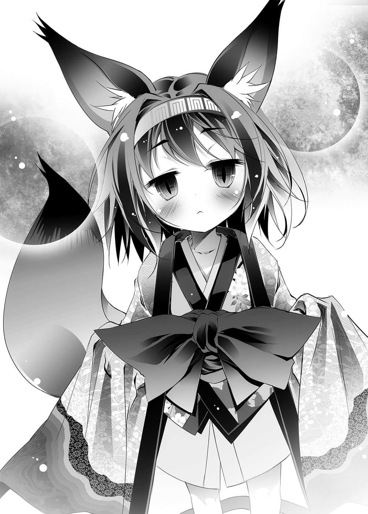
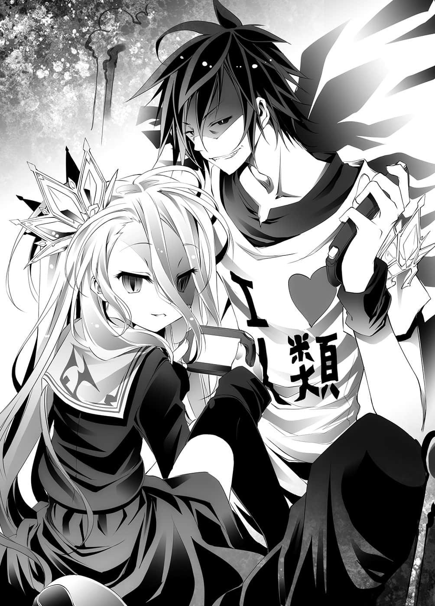

# 第四章 将死

> 来源：https://www.linovelib.com/novel/9/2053.html

大使馆——更正，本来是艾尔奇亚城的帝国大厦（暂订）。

自下方仰望着建筑物，白说了一句：

「……脖子好痛。」

「真是的，没事盖这么巨大……话说人类种应该没有这种建筑技术吧？」

空按着脖子抱怨道，而吉普莉尔好似没有兴趣，平淡地回答道：

「当然，这是在被夺走之后，东部联合不断改建的结果。」

「嗯……」空答应了一声。

「……虽然几乎可以确信……但还是闯闯看吧。」

「……？你在说什么？——不，与其说那个。」

史蒂芙有些生气地指着地面说道：

「可以让我请问一下，我们为什么到这里来吗？」

这时与她同样，没有听到任何说明就被带来的白与吉普莉尔，也有如赞同史蒂芙的话一般望向了空。

「没什么，只是想见一见可爱的『兽耳娘』。」

空对于她的问题含糊以对，然后就大摇大摆地前进，史蒂芙赶紧拦阻。

「喂，等一下啊，这里虽在艾尔奇亚国内，却是大使馆哦！！」

「我知道啊，也知道这里原本是我们的王城呀。」

「唔唔、所、所以说——这、这是侵犯领土喔！」

「你说谁侵犯领土？我可是事先预约了喔。」

「咦？那种事——」

史蒂芙正想说不可能，却被他打断。

史蒂芙一副精疲力尽的样子，一被带到状似会客室的大厅里，她就毫不犹豫地坐下。

听到史蒂芙这番讽刺的言语，或许真的感到意外吧，伊野窥视着史蒂芙的眼睛，然后说道：

「这个世界不会太剑拔弩张了吧？还有秃毛猴是指我们吗？」

「而得知我们筑城，东部联合又好似讽刺我们一般，陆续大规模改建……在建筑技术上，艾尔奇亚也无法与东部联合比较，所以、那个、总之发生了许多事情。」

在多达八十个的按钮之中，按下六十，电梯随即往上攀升。

「这样还敢自称是大国，真是令人无言哪。算了，该说终究只不过是兽人种罢吧。」

伊野打断史蒂芙的质疑，接着如此解释，史蒂芙听了只好闭嘴。

「你既然知道那就太好了，快点带路吧。」

而被那读心的眼眸一看，史蒂芙瞬间不由得畏缩了一下，但仍勇敢地说道：

「恐怕是被人擅自处理掉了吧。这种应对是不被允许的，我一定会揪出下达这种失礼指示之人及其关系者——给予严格的处罚，请各位多多包涵。」

他们进入大楼里，穿越入口大厅，搭上电梯。

虽然不知史蒂芙为何如此惊讶，不过空回答道：

「因为今天早上这个老爷爷，看着人在图书馆阳台的我啊。」

——咦？

「哈哈哈，因为我们和只会杀戮没有其他能力，只得隐居起来的贵人们不同啊，真是见笑了啊。」

只见巨大建筑物的门打开，一个人影出现了。

「——什么？你们真的寄出书信……」

空与白兄妹俩同时想着同样的事。

不是那样的。

空如此发着牢骚，而吉普莉尔则刻意接起他的话尾。

无视惊讶不已的史蒂芙，伊野说道：

「……我说史蒂芙啊。」

伊野这么说完，手按着额头，叹了一口气。

史蒂芙面露苦涩地叹了一口气。

关于第二个问题——史蒂芙摇摇头，这个不用回答也知道吧。

「——欢迎光临，艾尔奇亚的国王・空陛下、女王・白陛下。」

「当、当然啊！从我祖父那一代起，不管我们送来多少关于贸易和外交方面的书信，你们从来没有一次回信呀，你可别说你不知情哦！」

「话说回来，史蒂芙，那件事是？」

言外之意是，别再用那种杂技般的方法了。

「对吧——老爷爷？」

就像这样——伊野抢先道出他们的来意。

更何况——

---

■ ■ ■

「什——！……骗人——」

仿佛有一对能看透一切的双眼在窥视脑中一般——

他脸上浮现愤怒与羞耻。

「你们是来拜访驻艾尔奇亚东部联合大使——『初濑伊纲』的吧。」

那就是，这个世界武力被禁是理所当然的事。

「由于序列第十四位的兽人种，本来就对序列第十六位的人类种过度藐视，因此事情就更麻烦了——主人的书籍里有这样一句话吧。」

「……真是抱歉，今后请直接寄送给我初濑伊野。」

他只是这么说着，邀请一行人进入大楼里。

「兽人种的序列、寿命、身体性能、知识、智慧……全都逊于天翼种，是只能趴在地下的卑微存在，那就让我们鄙视为数稀少的，所能鄙视的对象吧♪」

这次则是由吉普莉尔回应，而彼此脸上的笑容丝毫未变。

而对此有所反应的人，意外地竟是史蒂芙。

书信没有送到，所以才以为对方不会答应会面吧，空这么问道。

回想起书中内容，吉普莉尔不禁笑了出来，然后说道：

「我就比手画脚跟他说『我现在过去』，而这个老爷爷也答应了。所以，我说过我预约了呀。」

「哈哈哈，不愧是和秃毛猴混在一起的缺陷品大人，说出来的话就是不一样呢。」

「呵呵呵，武力一被禁止就马上自大了起来，小孩子还真是有精神呢❤」

众人走出充满杀伐之气的电梯，抵达六十楼。

「形容得很贴切，我完全有同感，更何况是从第六位序位的大人口中说出，更是令人汗颜啊。」

「如果可以的话，下次可以循正规手续前来拜访吗？」

「呵呵呵。」

「大使馆比王城还要豪华壮观的话，会影响到国家的威信，所以艾尔奇亚又建了新的城堡。」

…………————

伊野微微闭起双眼。

「这叫做——『五十步笑百步』。」

……不不，那样还是很奇怪，史蒂芙这么说。

然后兽人种那可以看穿人们心思的双眼，向众人望了过来。

「咦？奇怪？你、你是怎么取得联系的！？」

一副恭敬有礼的模样，老人——初濑伊野如此说道。

「啊～这是我最不擅应付的麻烦事啊……」

「是啊，兽人种的眼力也很好吧，我真是吓了一跳呢。」

「哈哈哈。」

那是一名有着迈入老年的白发、狼一般的兽耳和粗尾巴，身穿裤裤的——兽人种，他走下入口的阶梯，来到与四人同样的高度后，深深地低头行礼。

「初次见面，我是东部联合驻艾尔奇亚外交次使——初濑伊野。」

——看来他好像真的不知情。

「是啊，对目光狭隘的杂种狗而言，我说的话一定令你大开眼界了吧。」

在空说出这句话的同时。

或许是读取了史蒂芙的心思，知道她并没有说谎，伊野吃了一惊。

——不对。

听到吉普莉尔毫无忌惮地出言讽刺，伊野微露锐利的目光。

那对眼睛——对了，简直就像空一样，不对，更在空之上。

「呵呵，你别勉强装老成了，可以坦白说出心里话呀。」

然而伊野却完全不提这一点，只是一副一切尽在掌握中的模样，平静地做出应对。

「你还真敢说呢，东部联合从来没有回应过正规的手续呀！」

兽人种的话，倒还能够理解，问题是——

但是对于他的眼睛，空丝毫不放在心上，在原地正面承受他的视线。

「……我大概猜得到你想说什么，说吧。」

「欸！？这、这是什么？地板在动！？」

「——这边请。」

伊野从空身上看出了什么呢？

「……是城堡被夺走之后，又被他们改建之事。」

「唔嗯，就是现今的城堡吧？」

史蒂芙瞬间倒抽一口气。

「那么飘在空中，只是埋没在书堆里的古董，应该就是四十步啰？」

「……若是论冲动好战，他们是【十六种族】最上位的两种族啊。」

「争斗了将近永恒的时间，却突然被禁止战争，余恨未消也属正常……」

「如您所知，在那件事之后，有许多人对艾尔奇亚怀抱过度的敌意……自从与前国王进行最后一次游戏以来，我不曾听过有书信送来……」

伊野听了哈哈大笑。

然而伊野接着说道：

---

■ ■ ■

「等、等一下啊，这里距离那栋图书馆有三十公里远喔！？」

空是如何看到他的？

「累、累死人了……」

这一点空也完全有同感，不过他只是环视着周围。

「……那么我去请初濑伊纲过来，请各位稍待片刻。」

伊野行了一个礼，然后往室内走去。目送他离开后，史蒂芙也仿效四处张望的空，环视房间一遍。

「……不过，话说回来，这里真是豪华呢，让人深切感受到文明力的差距。」

这个房间是以大理石，以及一眼就看得出是稀少资源的材质所造。

皮革制的沙发，沙发里甚至还有弹簧。

不过空所寻找的并不是那种东西。

「话说回来，主人，您是如何与兽人种取得联系的呢？」

「……吉普莉尔，你没发现都没有人提起这件事吗？」

「非常抱歉，我和能够读人心的兽人种不同，总是感到很在意。」

空顿时理解了。

看到『未知』吊在眼前的吉普莉尔。

就等于是看到『红萝卜』吊在眼前的马。

「…………你看。」

空用食指抵着嘴唇，取出的东西是——手机。

那貌似透过光学变焦，再搭配高解析度化的应用程式，将焦距扩大到极限后所拍下的影片。

画面上勉强映出一个看似老人的轮廓。

——也就是说，就是这么回事。

其实空并非真的看得见伊野的形貌。

兄妹各自惊讶地说道，立刻后退拉开了距离。

两人早已经在准确地抚摸着少女的头和尾巴。

——他们是什么时候移动的？

「了解，得斯。请多指教，空、白。」

新的疑问又接着出现。

「是啊，我知道。」

伊纲坐在沙发上，表情恍惚地眺望着天花板，伊野则是额头阵阵抽搐。

「……不过小伊有……落差萌……加一百分。」

喀喳一声，伊野开门回来了。

伊纲就像一只想让人抚摸的猫，双眼微闭，将头伸了出来。

「只是因为你们他〇的突然摸我，我吓了一跳而已，得斯。我又没说我讨厌，得斯。」

「……请别在意，我孙女来到艾尔奇亚才一年，还不太会说人类语——另外……」

说穿了就是——空只是在唬人而已。

……——

不过——

「你会读人心思对吧，这样不用说也知道吧。」

对于这个问题，空却露出得意的笑容。

「好可——」

正当吉普莉尔思索着这个问题的时候。

「——老头，那不是人类语的问题，根本是你的影响啊。」

原来如此，这可真是令人感兴趣呢……吉普莉尔如此说道。

「……啊，并不是语尾加上『得斯』，说话就比较有礼貌哦？」

「啊，那我也要。」

「……我讨厌这个爷爷……减一千分。」

「——伊纲，讨厌的话可以拒绝，没关系的哦！」

即便以吉普莉尔的视力，也无法捕捉到空与白的动作。

伊纲像猫一般面无表情，却闭着眼睛这么要求，不过空说道：

「喂！他〇的秃猴子，别以为老子对你们礼貌，你们就可以拿翘。他〇的胆敢用你们的脏手碰我可爱的孙女，小心我宰了你们——」

「为什么，得斯？」

白躲在空的身后，瞪着伊野说道：

「那么可以别叫我们秃毛猴吗？」

「颗颗颗……对于精通任天狗㊟的妹妹，和精通触摸系H-game的我而言，看到反应后准确地抚摸，这种事根本轻而易举，你可别小看游戏玩家的巧手哦，老爷爷。」

「那么差不多可以请死猴子们告知来此所为何事了吗？」

而桌子的另一边，以空为首的四人，则是与他们面对面坐着。

「……！？是那样吗，得斯！？」

「……老爷爷，别因为孙女对你的待遇输给我们就生气呀，太不成熟了。」

「别说那种话啊，那会变得更空虚吧！？」

「他〇的乱摸啥啊，得斯。」

「他〇的快点继续啦，得斯。」

这么说来，这个世界无法做他人讨厌的事。

「……主人，您知道『那个』是什么吗？」

「——咦？」

——随即他再度恢复礼仪端正的笑容。

「这里是外交场合，是交换口头与书面约定的地方，这个道理对猴子来说太难了吗？」

「他〇的别随便停下啦，得斯。」

抚摸抚摸抚摸……

「……请多指教……」

对此空则是冷眼看着他说道：

「呃～啊～可以吗？」

「这位就是东部联合驻艾尔奇亚大使——初濑伊纲。」

看到白的手在抚摸，伊野脸上的表情就像强忍怒气般，静静地说道：

吉普莉尔手指所指的是——电视。

这么介绍之后，走进门来的是——

「……哥，那个。」

而且书简无法送达之事，主人原先似乎也不知情——

『罪恶王者！㊟』

虽然和空他们所知的电视，外型大不相同，然而不管怎么看——那就是电视。

（译注：漫画ＪＯＪＯ的奇妙冒险第五部中，最后的敌人首领迪亚波罗的替身，拥有类似时间跳跃的能力。）

然后白抚摸一副很想要人抚摸的伊纲。

（对方是能够读人心思的兽人种，为什么要做那种唬人的把戏？）

也就是说，在能够抚摸她的时点，就等于伊纲已经许可了。

「因为叫名字我们会比较高兴啊。我叫空，她是我妹妹白，请多指教。」

只不过是偶然相机拍摄的方向，有一个人影似乎在看着自己，于是他假设那个人看得到自己，而对那人比手画脚了一番。

「呃……什么？」

「——嗯，这样就得到明确的证据了……」

伊野的表情忽然一变。

史蒂芙忘记立场，好可爱三个字差点忍不住脱口而出，但是她话还来不及说完。

「……实物……我们都……没摸过就是了。」

「——让各位久等了。」

「……可爱度……减……五十分。」

「什么明确的证据呢？」

「爷爷……技术差，爪子很痛，得斯。」

「——伊纲，你都不肯给爷爷摸，秃猴子就可以吗！」

对于那样的两人，兽人种女孩——伊纲则是以可爱的声音回应：

「……戳戳……毛绒绒……摸摸……呵呵呵呵呵呵呵……」

「呼呼呼，兽耳的可爱幼女啊，陪大哥哥一起玩吧，大哥哥不是可疑的人啦。」

「希望各位能够节制，不要做出上述的行动。」

「嗯？我不明白您说什么。」

一个黑眼、黑发、鲍伯头，有着像耳廓狐一般又长又大的兽耳与尾巴，并且穿着腰间系着大缎带的和服——不管怎么看年龄都只有个位数的小女孩。

「明明是秃毛猴，技术却很棒呢，得斯。他〇的继续，得斯。」

（编注：由任天堂发行的虚拟宠物游戏软体。）

---

■ ■ ■

听到伊纲回答得毫不迟疑，伊野沮丧不已，空则是笑着说道：

她的动作与表情不一致，不过空似乎马上就明白了。

「没关系，这样很舒服呀，继续，得斯。」

抚摸抚摸抚摸……

没错，那正是空刚才在找的东西。

「晚点再说，兽人种的耳朵很好，反正他们一定也正在听——你说对吗？老爷爷。」

就在伊野的笑容出现裂痕的时候，吉普莉尔更是以甜美的笑容说道：

「主人，兽人种的精神有如自卑感的集合体，就像玻璃做的一样，脆弱又容易受伤，请您别太刺激他们好吗？不然实在太可怜了。」

伊野保持笑容也差不多快到极限了。

正当他考虑要不要干脆忘掉一切束缚，把这些家伙轰出去的时候，他窥视到空的眼睛。

——霎时，伊野竟不自觉地感到一阵寒意窜过背脊。

一瞬之前那个胡闹、玩世不恭的男人已经消失无踪。

在那里的是一个自信满满，甚至到了傲慢不逊的地步，心中进行着无数算计，如假包换的——『一族之王』。

「我的要求很单纯——初濑伊野。」

空露出自信无比的笑容，以认真的眼神如此说道。

「把令孙女的内裤给我，我会把史蒂芙的内裤给你。」

「——什么！？」

「喂！死猴子，你不要太过分了喔！？」

突然成为话题焦点的史蒂芙，几乎和伊野同时叫了出来。

然而空却是一副惊讶的表情。

「咦？史蒂芙的你不满意？吉普莉尔的比较好吗？」

「只要是主人的命令，我很荣幸。」

空这么说的同时，吉普莉尔已开始脱着内裤。

只见伊野手按额头，好像在忍耐着什么似的，挤出声音说道：

「喂，猴子，如果你是来闹的话就回——」

「欸，白的可不行哦，竟然想要十一岁小孩的内裤，老爷爷，那可是有病哦。还是说——你、你要我的吗！？呃、这个就有点……即使是宽容的我也会怕怕的喔……」

「不过这时又产生两个疑问，第一是，为什么爱尔文・加尔得输掉了？然后，重要的是这个——为何他们再也不发动攻势了？」

「东部联合的游戏我全都明白了，因此『消除我的记忆』这件事的重要性，你是不会疏忽的啊。」

那只是空的推测，伊野仍坚持以这样的方式应对。

如果故意输给爱尔文・加尔得，那么游戏的内容就会曝光——因而失去必胜的特性。

「不打算说出真正的来意……吗，原来如此，虽然那种说法宛如你看穿了我的想法，但是如果你真的能够读心，那你应该会答应以内裤为赌注的游戏。因为比起内裤，胜利后的附带结果，也就是——」

「……为了……由输掉的结果……破解必胜游戏……？」

「…………您真是想像力丰富呢。」

「由于记忆被消除，所以仍然不了解游戏的内容，不过他们推测那是能够使魔法无效的游戏，于是第二次便和外部的人联手，从外面施加魔法，然而即使如此仍是输了；到了第三次，他们应该是用某种方法，查出游戏的内容了吧。」

「半个世纪前，东部联合急速发展出高超的技术力……可是高度文明是有其困难之处的。」

他秉持着坚定不移的自信，仅仅说了一句话。

「我说老爷爷，真的不行吗？我可是准你用伊纲的内裤了事哦？」

这时候该说是最有勇气，或者是出于好奇心，吉普莉尔向他问道：

「在此祝贺位阶序列第十四位的『兽人种』之国『东部联合』，恭喜贵国获选为我等『征服世界』的霸道上，荣耀无比的『头号牺牲者』。在这场『国家对战』中，我方对贵国的要求是——」

「伤脑筋啊～『我们除了诱敌进攻以外，没有其他招数』了，可是如果胜过世界最大的国家，那么就再也没有人会来挑战内容不明的必胜游戏了，但是又不能输给对方——为什么呢？」

「那么既然已经『确定』了，我就如你所愿，来谈谈我们真正的来意吧。」

或许是头痛了起来吧，伊野手按着额头。

「不愧是白，你明白了吗？没错——这样『东部联合就没步了』。」

「就这样，他们做好万全准备，进行第四次挑战——但还是输掉了。我说的对吧？老爷爷。」

「你这家伙——既然你不打算说出真正的来意，那就给我回——」

「咦？你们还不懂吗？」

空竖起手指继续说下去。

「不好意思，老爷爷——『将军』了。」

抱持输掉几次的觉悟进行『试探』，那也是容易的事。

而在于，为何停止挑战了，这一点上。

「——但是，如果是前者，只要揭露出来就算获胜。这也就是说，『后者』才是正确答案。」

空往沙发——充满弹力的沙发上躺坐下去。

「来，我们依照顺序来解谜吧，【问题１】为何要消除关于必胜游戏的记忆？」

消除关于游戏的一切记忆。

空只好懒洋洋地说道：

那确实是让对方无从采取对策的最强手段——至少看起来是这样。

听到这句话，吉普莉尔蓦然醒悟，伊野则仍是一贯的面无表情。

那真是超出常轨，出神入化般的推理能力——

然后空弯下一根手指。

「在位阶序列第十六位，人类种之国『艾尔奇亚』的全权代理者，空与白的名下。」

——听到那句话，除了空与白之外，其他人全都瞠目结舌。

吉普莉尔熟悉的所有情报，片断地证明、解释了空的推理。

——为何东部联合会纳入与『诱敌进攻战略』相互矛盾的要求呢？

空笑嘻嘻地竖起手指头说道：

空笑嘻嘻地露出意味深长的笑容。

「主、主人，请问您这话是什么意思呢？」

那是因为他们有必要那么做，甚至不惜承受那个条件所带来的坏处。

伊野只能贯彻面无表情而已。

先前一直沉思的白，这时出声了。

——没错，问题不是他们曾经挑战过。

空从他的表情中，看出了细微的动摇，于是空笑着竖起两根手指。

吉普莉尔——位阶序列第六位天翼种的背脊，顿时不寒而栗。

「那么，我就来为大家和自称会读心术的老爷爷说明吧。」

空的笑容中敌意尽露，他超然地宣布：

没错——爱尔文・加尔得与艾尔奇亚不同，他们是大国。

「…………」

「——『你们在大陆上的一切』。」

伊野身体一震，那是人类肉眼极难分辨的反应，但是对空而言，那样已经非常足够。

「——老爷爷，不好意思，在你假装能读人心思的时候打断你，不过你穿帮了哦。」

「啊，我方的赌注一样是史蒂芙的内裤哦。」

好奇怪哦～这真是不可思议呢～空仿佛念台词般叨念着，然后笑了出来，他继续说道：

「什、什么！？」

「好了，接下来是【问题２】，为何爱尔文・加尔得挑战了四次？」

——空随即像个赌赢一生一世赌局的赌徒，露出格外嘲讽的笑容。

白回答了这个问题。

然而以为能在虚张声势上胜过空——这才是最大的错误。

伊野已经快要火山爆发，空却仍继续说着：

然而除了空与白之外，似乎没有人明白那句话的意思。

空说这句话时的瞳孔、心跳声、甚至血液的流动声，这一切都告诉他，眼前的男人对自己的话拥有十足的确信。

「……因为不消除……就不再是必胜。」

因为那个要求——实在太超出常轨了。

空笑了出来，脸上挂着确信的笑容说道：

「解开这个不可思议之谜的钥匙——就在刚才，老爷爷，你给了我那把钥匙。」

「……啊……」

空说着翘起脚，换了一个姿势。

在这个输掉的结果就说明了一切的游戏上，这个情报实在太过巨大，让人无法忽视。

东部联合所保有的大陆全部领土与——史蒂芬妮・多拉的内裤对赌？

没有一个人明白那句话的意思。

就连吉普莉尔都不禁要怀疑眼前男人的精神是否正常的时候，空又再次开口。

「若是你刚才用伊纲的内裤了事就好的说，真是可惜啊，老爷爷。」

「然而，就连那么做也会有漏洞。」

「即使消除记忆——无论如何还是会留下输掉的『结果』。」

不管是伊野，甚至是先前一直发呆的伊纲，两人都脸色大变。

「不过这样一来就很不可思议了，知道是什么游戏，却不懂为何输掉了游戏。」

「或者是——知道那是什么游戏，可是最后仍不懂为何输掉。」

「可能性有两个，他们理解到那在原理上是必败的游戏。」

「这个房间里的电视和刚才的电梯、沙发，这些近代技术样样都需要大陆的资源才能成立。正如字面意思，大陆资源就是近代技术的生命线。然而东部联合是从岛国发迹，明明无论如何都必须得到大陆的资源——但是『在那之前』爱尔文・加尔得就发动攻势了。」

「输过一次之后，爱尔文・加尔得想必推测那是『无法使用魔法的游戏』吧，因为说到森精种会输的理由，最先会被怀疑的就是这个吧。」

真是的，能够使用魔法这种官方外挂，真是太令人羡慕了，空不禁这么说道。

因为——

空握起白的手，高举着开始宣誓。

他露出讽刺般的笑容，注视着伊野的双眼。

注视着自称能够读心的兽人种的双眼说道：

「【问题３】——为何要撒谎说自己能读心？」

「……因为不会读心……」

白即刻回答，空点了点头。

「而撒谎代表的就是，其中有被知道会很困扰的事吧？」

「好了，答案快出来啰？【问题４】什么是原理上应该赢得了，可是却赢不了的游戏？」

空一副很愉快的样子。

「——来，我给大家提示！」

他仿佛在享受猜谜游戏般，刻意装模作样地说道：

「天翼种、森精种、人类种，对付这些性质全然不同的种族都必胜，只能在防卫战使用，不消除记忆不行，不会读心、属于技术优秀种族的必胜游戏，这是什么游戏！？」

白偷瞄了旁边的电视一眼，然后回答道：

「……可以随意作弊的……『电子游戏』……」

这个答案史蒂芙和吉普莉尔似乎都无法理解。

那也难怪，因为在这个世界里，电视游戏这种概念大概只存在于东部联合吧。

正因如此——他们才需要消除记忆来隐匿。

正因如此才会是必胜的游戏。

——只要自己来当主办者，举行电子游戏的话……

就可以外挂用到饱，想做什么就做什么，而且被玩家发现作弊的风险——

——完全没有。

先王的意图是——

伊野该采取的手段早已决定，这时候——

他勉强恢复平静——不，应该说装出平静的模样回答：

仿佛在等待伊野的思考到那里一般，空露出得意的笑容说道：

对方的推测一点不差，伊野无话可说。

——连一次都没有。

——被说中了。

「好了，你已经了解事态了吧，老爷爷。」

为了向神挑战的条件——收集十六颗棋子，也就是为了称霸全种族的——『人类种的棋子』。

和过去同样，只会再添一次必胜的战绩——但是。

史蒂芙终于理解到事态严重。

「如果您的幻想是正确的，那不就表示——『爱尔文・加尔得在那种情况下仍然输了吗』？」

就连活了六千年的吉普莉尔，也是第一次亲眼看到『种的棋子』。

空如此说道，他的语气不是讽刺，而是发自真心的赞赏之情。

然而，空抢在伊野的思考之前，就像个以将猎物逼入绝境为乐的猎人，冷酷地说道：

没错——那与空的得意本领完全相同。

空注视着伊野的双眼，仿佛要抓他的语病似的，露出了坏心眼的笑容，打出保留已久的王牌。

——在『过去的世界』里。

「——这步棋你有读到吗？老爷爷。」

这就和优秀的诈欺师自称是通灵者，原理相同。

「没错，你们不会读心之事——我打从一开始就知道了。为什么呢？」

「你们之所以吹牛说自己能读心，这是为了给战败后所残留的疑问——『为何输了？』一个理由，不让战败者继续追究。其实，你们只能看穿谎言，而——不会读心。」

「我方赌上人类种的全部——『种的棋子』。」

但是伊野那样的想法，空却宛如——没错，宛如读心一般地回答道：

而那也就等于——灭亡的意思。

——这么一来就演变成，争夺一种族的棋子，以及更广阔的大陆领土的赌局了。

「没错，你已经明白了吧。从先王能够把事情告知我们的时点，即可证明你们没有看穿先王的意图——不能读取他的心思。」

——难道先王他？

——在场没有一个人看过。

——这是怎么回事？

向拥有必胜游戏的东部联合挑战，并且取得主导权。

那就表示这个男人——真的掌握了游戏一切的内容。

空就这样笑着，毫不畏惧地，注视据说能读心的兽人种——伊野的眼眸。

「老爷爷，我是如何在图书馆与你沟通的——如果你真的能读人心的话，你就不应该假装明白一切，而是必须坦率地感到惊讶才对。」

空却苦笑着回答他：

当空说出这句话的瞬间。

看着笑嘻嘻的空，伊野流下一道冷汗。

「这个问题——老爷爷，我就交给你吧，你心里有数吧。」

伊野在勉力恢复平静之中，感觉全身的血好似逐渐流失一般。

没错——那么。

空的眼前出现一个仿佛以光做成发出淡淡光芒的棋子。

然而，他并没有表现在脸上，只是被疑问所侵蚀。

如果真是那样——

东部联合也只是以外挂用到饱的游戏应战而已。

「因为我们——不是这个世界的人类。」

空不怀好意地笑着，装模作样地继续说道：

但是——伊野。

以合乎逻辑的推理将他逼得无路可走，这个状况——究竟是怎么回事？

因为赌上『种的棋子』进行的游戏，在『十条盟约』之后的长久时光中。

「把一切当成只是我的预测——也就是你只有不答应比试，选择『逃避』。」

好了，终于到最后的问题了——空如此说道。

她正要大叫：你认真的吗？却立刻被吉普莉尔捂住嘴巴，按在地上。

空最初——在察觉伊野不会读心术之前。

「【问题５】为何先王接连输了八次？」

「…………」

而他们则凭藉卓越的五感，从心跳声、血液流动声来判断。

万一输了的话，等于必须永远臣服之故。

空『没有任何不安的反应』。

先王是唯一没有被消除记忆，与东部联合之进行游戏，遭夺得大陆领土的对手。

「——你、你认真——唔唔！？」

空是从表情、举止、声音看穿谎言。

是的，那就是……在这个连神的宝座也以游戏决定的世界里。

剩下最后的都市，甚至赌上『种的棋子』，即将失去一切的最下等种族。

「玩这种游戏的话，即使有魔法也毫无意义……哎呀，不愧是技术大国，很了不起对吧？」

「真是伤脑筋啊。你们无论如何必须消除我的记忆，但是如果你拿大陆领土跟我赌史蒂芙的内裤，用这样的赌注玩游戏的话，那就表示你承认我是对的。」

这只能认为，他打从一开始就排除了被读心的危险性。

人类种的棋子——是『国王』。

「——……！」

然而，如果真如空的推测。

就在伊野的脑中只想着这件事的时候，空有如讽刺般继续说道：

若是他把此事泄漏出去，东部联合就————

「你觉得很不可思议吧，老爷爷，我打从一开始就没有虚张声势的反应。」

但是，我方和他约定的条件是，不可告知任何人。为何会——

「我只能说你的幻想力真了不起，不过空陛下，您是不是疏忽了一件事？」

「——先王这个『有生之年不告诉任何人』的盟约——并不包含死后。」

问题不在那里，问题是——！

——不，不对。

那是当然的吧。

因为那意味着赌上种的全权利。

这个答案白、史蒂芙、吉普莉尔都知道，因此——

空大胆地说道。

——确实，东部联合被迫处于必须接受挑战的状况。

即使内心焦虑，伊野仍倚恃着不可动摇的唯一事实，挺身应战。

——「你以为我会让你有路可逃吗？」——

「这样就算你逃避，也等于向世界宣传我是正确的了。」

「好了，我又将军——不，这样就是『将死』了。」

也就是嚷嚷着伊纲的内裤云云，进行那番胡闹的对答时。

自己心虚的表情是否完全隐藏了呢？

他们在超过两百八十种游戏上未尝败绩，甚至被流传为都市传说的游戏玩家。

在无数有关他们的传闻中，有这样的一段叙述——伊野无法读取。

——即使使用外挂、辅助工具也无法胜过他们……

「…………」

伊野反射性地，想要断定他是说谎。

然而不管是空的任何动作、声音，都没有显示说谎的反应。

如果他所说的话是『谎言』，那就意味着这个男人，可以在不透露任何反应下说谎。

如果他所说的话是『事实』，那就如这个男人所说，自己暴露了无法读心的事实。

「…………！」

不管是哪一种——伊野都无言以对。

空的笑容像是在说：没错，那样就可以了。

「我来的时候，你以为我和先王一样，是鸭子背着葱自己送上门过来的吧？」

但是——

「……不好意思，这次轮到你们被吃了——兽人种。」

从说出这种话的人类之王的心跳声中，除了『确信』以外，感受不到任何反应，伊野只能倒抽一口气。

「好了。」

——空站了起来，其他人也急忙跟着起身。

「就这样，不过大陆全部领土这种赌注，我也不觉得是你一个人能决定的事，所以看你是要和本国确认还是怎样，比试的日期另外再通知我就行了。」

啊，对了对了——空再附加一句。

「不用我说你应该也知道，赌上『种的棋子』的游戏，人类种全员都有观战权，为此你们要准备好场所和设备哦。另外我方要以四人应战，你们没有拒绝的权利，那么就拜托啰♪」

「为、为、为什么不先说一声就做出那种事！！」

然而，即使如此——空的行动还是太过不负责任了。

不过吉普莉尔对同样的『未知』，则是充满憧憬、羡慕和兴趣。

——空嘻皮笑脸地回答：

「你、你们把人命当成什么了……」

史蒂芙看到他们这样，只感到背上不寒而栗。

史蒂芙怒骂空他们，这种光景也发生过好几遍了。

「那么你就是敌人了吧，得斯。」

——经历过去大战之人的沉重话语，让史蒂芙哑口无言。

吉普莉尔自己也曾是天翼种的全权代理之一。

听到空这么说，伊纲仍是以锐利的眼神瞪着他。

「责任？什么责任？」

只要使用间接的方式，掠夺、支配、杀人也是轻而易举。

这个男人、不，这对兄妹只是在玩。

「再见，伊纲，下次我们来玩游戏吧～？」

「不愧是我的主人，我的君主……这才是统领我们的人——」

然而她已经不像方才那样亲近人。

他们毫不犹豫地操作电梯的按钮，门逐渐关闭。

但是吉普莉尔仍继续说下去。

---

■ ■ ■

「把人类种三百万条性命放上赌桌，封住敌人的退路。」

身负守护某种事物的责任——处于备战状态的野兽眼神。

这次史蒂芙真的无言了。

「……虽然不是很懂，得斯。不过——」

只不过这次和先前有明确的不同，她的眼神带着真正的轻蔑与失望。

兄妹就像这样轻松地，挥挥手离去，而吉普莉尔也抬起被捂着嘴、不停挣扎的史蒂芙，追在兄妹之后离去。

而且并不是没有计划和策略，而是为了使『必胜』两字成为确信。

「那么小多我问你吧。」

「输了的话，人类也结束了，哪里还有什么责任呢？」

「不、不……不是那样——！可是！」

她用如冰一般，不带任何感情的眼神看着史蒂芙，斩钉截铁地说道：

空天真无邪地如此笑道，坐在他膝上的白则摇晃着双脚，脸上露出微笑。

——只要是为了胜利，就算是大众的性命也可以放上赌桌。

「看、看、看你们做了什么好事啊啊啊啊啊啊啊啊啊啊啊啊啊啊啊啊啊啊啊啊啊啊啊啊啊啊啊啊啊啊啊啊啊啊啊啊啊啊啊啊啊啊啊啊啊啊啊啊啊啊啊啊啊啊啊啊啊～～～～～～！！」

「你说如果输了要如何负责，但是反过来，如果主人他们获胜，大陆领土内的所有兽人将会失去工作，土地、资产、权利被剥夺，然后流落街头，也有可能会死亡。那些责任你也要主人负责吗？还是那是他们输家的责任？」

「不管是现实还是游戏，终究只是『互相残杀』——又有怎么样的责任呢？」

正确、真正的意思，就如字面上的意思——他们疯了。

也是人类种至今所受到的对待。

至少、至少该想办法征求国民的同意吧？

「所谓的全权代理者就是那样的存在。」

不——反而浮现出愉快的笑容。

其实不管是人类种还是东部联合，他们根本不放在眼里。

「镇定一点啦，史蒂芙……这可是游戏哦？」

眼神中透露出明确的『敌意』，娇小的兽人种少女如低吼般说道。

「输了的话就带着三百万人类一起游戏结束，赢了的话，国土一次就倍增，东部联合的兽耳娘全部到手——这么好玩的游戏可是很少有哦，不觉得很兴奋吗？」

他们认为这个世界本身只不过是游戏——！！

不过，意外地——『空』发出了否定的声音。

————疯了。

「比起那些，史蒂芙——你不觉得很快乐吗？」

反过来说，也只是那样而已。

绝望、失望、恐惧——无数的感情翻搅着史蒂芙的心。

对于他们的疯狂，比起轻蔑，她甚至感到恐怖，甚至想逃，史蒂芙泫然欲泣地抱怨道：

一回到城里，史蒂芙就如此大叫，空则是捂住耳朵。

「你、你在说什么啊！这种不负责任的——」

「……我不会输给你们，得斯。」

「说了你会反对吧？」

「打架？没那种事，只是游戏而已。」

她的双眼中隐藏着，背负着某种责任，打量『敌人』的眼神。

空睁大双眼说道，言下之意仿佛在说——有什么问题吗？

「抱歉，不过伊纲会输，这是毫无疑问的。『 空白』没有败北。」

——禁止武力的世界。

史蒂芙对空他们抱持的是对『未知』的恐惧。

「空和白——是来找伊纲……打架的吗，得斯？」

——就是这句话，让史蒂芙的疑惑转变为确信。

「即使战争被禁止，世界至今仍然持续着杀人与被杀。」

空轻松自在地如此说道，然后向仍坐在对面的伊纲挥挥手。

这对兄妹不该用『异常』、『脱离常轨』这种委婉的字眼来形容。

「……拜拜……小伊，再见啰……」

相信这个男人——是个错误。

「当、当然啊！你、你知道你自己做了什么事吗！？」

那种事、那种事太奇怪了——史蒂芙如此说道，但是——

「啥？不，没有人会死啊，我说过是游戏了吧？」

「……（点头点头）……♪」

看着四人走出会客室的背影。

史蒂夫惊讶得差点说不出话，不过她仍勉强挤出话来。

这就是『十条盟约』，而且——

他仿佛对那种事完全没兴趣似的。

可是——听到空的回答：

「你、你、你啊，输掉的时候，打算怎么负责！？」

（——把祖父大人的遗志托付给这种人是个错误——！）

然而吉普莉尔，对于那样的空和白，她反而怀着敬意景仰，她说道：

空坐在王座上，一边与白进行ＤＳＰ连线对战，一边这么说道。史蒂芙猛然向他抗议。

……她无法反驳。

做那种事却不负任何责任。

「小多的意思是不要那么做，而让人类种就这样灭亡啰？」

「我看不起你们……我还以为你们不管采取多么荒唐无稽的行动，都是为了人类好而行动，我真是错了——！」

看到吉普莉尔罕见地露出认真的眼神，史蒂芙不禁有些退缩。

「——─那、那是……」

然而空却有如对比，甚至以带着『亲切』的眼神回应她。

初濑伊野与初濑伊纲两人只能目送着门关上……

「——咦？」

「什么？」

「啊？」

「……嗯……？」

感觉话好像没对上。

就在每个人都讶异地睁大了眼的时候。

忽然，空终于理解了吧，他开口说道：

「啊……好了好了，我终于明白了，原来是这么回事啊。」

一直感觉到不对劲，空终于找到原因了。

「我就觉得奇怪，这个世界明明是以游戏决定一切，结果却莫名的情势紧张，原来你们——和我们原来世界的那些人是同样想法啊……真令人惊讶。」

「……啊啊～」

或许同样也一直很在意吧，白也是一副想通了的表情，点了点头。

「原来如此，难怪『这个世界游戏』没有人能破关——难怪神会闲到把我们叫来。」

然而，或许是把问题想通而满足了吧。

空的视线又回到手边的游戏机，暧昧地回答道：

「放心吧，我们会依照宣言征服世界，而且是整个征服、原原本本、一点不剩。」

然后空像是想起一件事。

「对了，还有，史蒂芙啊。」

「咦……什、什么事？」

「你问我们输了的话要怎么办，我就认真地回答你吧。」

——但是，由于太超过理解范围，史蒂芙还是无法相信他。

没有刚才那种嘻皮笑脸的模样。

空如此笃定地说道。

吉普莉尔与史蒂芙只能——面面相觑。

以及从提示无法导出答案的两人。

剩下无数的提示。

「……正确来说，还需要一片拼图，不过——那片拼图很快也会来的。」

——能够理解的人只有妹妹。

「和东部联合的游戏已经结束，他们已经不可能胜过我们了。」

在那之前就边玩游戏边等就好了。

空说着回去和妹妹继续玩游戏。

空以认真的眼神，注视着史蒂芙的眼睛说道：

「——我们不可能会输，我说过『将死』了吧？」
