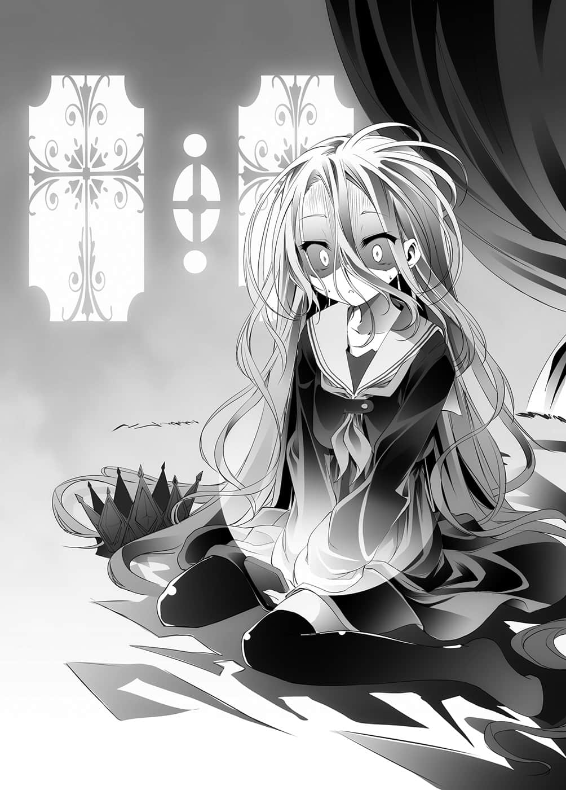

# 伪结局

> 来源：https://www.linovelib.com/novel/9/2054.html

……勇闯东部联合大使馆，发表宣战布告后——过了一周。

空赌上『人类种的棋子』，这个传闻迅速地传开。

国王选拔战之际，空击败森精种的间谍。

从他也击破天翼种的事实，怀疑「空才是别国间谍」的情势逐渐攀升。

加上本来就对空心怀反感的贵族们煽动之下，发生了示威游行。

艾尔奇亚王城被人墙所包围，接连数日怒骂之声不止。

——就这样，拖着疲惫的脚步，出现在王座大厅的史蒂芙说道：

「空……我已经无法再压抑他们了……」

对于空的猜疑，也在大臣之间蔓延开来。

其中甚至有大臣参加那场游行。

「原本追随我们的贵族们也因为这次事件，表示无法再拥护……大臣们开始联合杯葛，事实上，艾尔奇亚如今已是无政府状态了……」

史蒂芙也同样对空感到不信任。

即使如此，史蒂芙仍然四处奔走，拼命想要收拾局面。

或许是已经无计可施了吧，史蒂芙瘫坐在地上向空报告。

「辛苦你了，史蒂芙，不过与东部联合的游戏结束后，一切就会解决了。」

空依然坐在王座上，和白在玩游戏。

他慰劳史蒂芙，同时苦笑着说道：

「我们是别国的间谍？太迟了啦，在击破森精种的间谍时就该怀疑了。」

——就像这样。

宛如在嘲笑国民的空，史蒂芙还是无法抹去对他的不信任感。

就算示威游行，在这个世界也毫无意义。

白不安地呼唤哥哥。

大概门本来就没有确实关上吧。

从窗户照入的阳光直透眼睑。

「我在等待。」

「白，你听清楚了。」

「——喂、咦？怎、怎么了呀，白！？」

空平淡地接连说出不明何意的话语。

她眼睛下方的黑眼圈，以及沉重脚步所透露出浓厚的疲惫之色，使得她原本的气质也为之失色。

「——主人，这是……」

史蒂芬妮・多拉。

涌现一种非常不好的预感。

…………————

接着自己也站起来，空朝周围看了一圈。

这句话有一半是讽刺，有一半是真心要求空说明。

像这样，空不知是在对谁发着牢骚。

硿硿、硿硿。

见到她的模样实在太不对劲，于是慌张地把扑克牌丢在地上，奔到白的身边。

——虽是这么说。

「在那之前，我希望有一片『拼图』先过来啊——话说这也太慢了吧……」

……——

「……你打算怎么办？外面都已经发生示威游行了。」

而仿佛回应她的叫声一般，空一个微笑，抚摸着妹妹的头说道：

只是因为她的敲门，门就自然地开启——

但是……

可是他视线所看之处，一个人也没有。

闭着眼睛摸索的手，却没抓到应该在那里的手臂，只是挥了个空。

她面露诡异的笑容，手上拿着扑克牌，摇摇晃晃地走向『王』的寝室，那模样就像是……鬼魂。

得到的回答却非常简洁。

而在那座都市的王城里，一位少女正步履蹒跚地走在长廊上。

应该总是在那里的人却是——……

直到刚才还口口声声嚷着天谴的史蒂芙。

「……白也相信。」

她是先王的孙女，是个拥有红色头发和蓝眼珠，出身高贵的少女。

「我知道，终于肯来了啊，不会让我等太久了吗？」

……白、史蒂芙、吉普莉尔，然后……

「……那么我可以请教一下，空这一个礼拜都在做什么吗？」

空笑着对那个说道：

「嗯～不是，那样会很困扰，我希望他们再等一下。」

她一如往常地，抓住哥哥的手臂，再一次入睡——

然而史蒂芙看不见——而且就连白也看不见的存在，却在和空交谈。

忠于想要再睡的欲望，白一个翻身，想要再次进入梦乡。

「……嗯……唔……」

不过在那里的是——

「……唔……？」

史蒂芬妮——通称史蒂芙，露出危险的笑容。

「是啊，我知道你的来意，当然，随时都可以。」

「我相信你。」

「不怎么办，随他们去吧。」

空大胆地瞪着只有空看得见的『那个』。

「白，我们不是少年漫画的主角。」

---

■ ■ ■

吉普莉尔大概只感觉到某种气息吧。

在争夺国土之赌上屡战屡败，如今这个都市已是人类种最后的堡垒。

「哥……哥，你在哪……是白不好……白不会再……掉下床……所以你出来啦……呜呜……」

「——白，你起来了吧！已经早上了喔！」

然后——

「白，我们是因约定而结合。」

——空说着将膝上的白轻轻举起，让她站在地上。

「——好了，开始游戏吧？」

——忽然，侍立在身侧的吉普莉尔有了反应。

做出这般令人难以理解的回答后，空又继续说道：

「咦？奇怪……该不会已经起来了吧……？」

深深吐了一口气后，空面向白说道：

又是——从床上掉下来了吗？

——只有这样。

「……你是说等待东部联合回复接受挑战吗？」

总觉得——

史蒂芙手上拿着扑克牌，以脚代手敲门，直呼『王』的名讳。

如果对空他们的决定不服——唯有夺取他们全权代理者的权限。

但是在吉普莉尔要说什么之前，空就伸手打断她的话说道：

「……嗯？」

「白，我们总是在开始游戏前就获胜。」

但是她拒绝清醒，意识依然在酣睡之中。

一夜通宵之后，意识仿佛快要被初升的旭日切断一般。

「……哥……？」

也就是说，他们就只有那种程度的觉悟而已。

「白，我们两人总是缺一不可。」

不过半梦半醒的头脑，想起已经不是睡在国王寝室的床上了。

————…………

抱着膝盖，只是不断颤抖，泪流不止的白。

艾尔奇亚王国的首都——艾尔奇亚。

她为了确认哥哥的身影，抓住他的手，万分不愿地睁开惺忪的睡眼——

对于立即回答的白，空却只是报以笑容。

史蒂芙往王的寝室窥视。

「呵、呵呵呵……今天就是天谴之日。」

——然而却没有人来挑战。

「——我们这就去取得，为了并吞东部联合的最后一片拼图吧。」

——空如此说道，众人顺着他的视线望去。

「怎、怎么了？你的身体不舒服吗？」

但是她仿佛听不见史蒂芙的声音。

只是一边哭，一边不停地嚷着：

「哥……哥……出来……不要让白一个人……」

听到她这么哭嚷，史蒂芙似乎真的很担心地说道：

「那、那个……你说的哥是谁呢？把、把那个人带来就好了吗？」

————

白的耳朵终于听到史蒂芙的声音。

史蒂芙在说什么呢？

自己的哥哥只有一个吧。

她将手机拿在手上，打开通讯录，但是——

「……骗人……」

——怎么可能？

白的手机里只有登录哥哥一个人的号码。

可是。

为什么——

为什么手机显示的是——『登录数「０」』。

「……这不可能……骗人……骗人、骗人……」

本来已经雪白的肌肤，看起来更加失去了血色。

史蒂芬妮感觉到事态不寻常，拼命呼唤着她。

只要睡醒过来，哥哥仍一如往常睡在旁边。

可能性１：有某种力量将哥哥的『存在』，从这个世界消除了。

白慌慌张张地确认手机的日期。

然而问过之后所得到的答案。

但是她仍怀着最后的希望，向史蒂芙询问——至今一直没有说出的名字。

白瞬间回溯影像记忆，确认掌上型游戏机、平板电脑、手机，复数的终端显示上都是指着19，没有错，那一天是19日。

然而，她仿佛已经完全看不到史蒂芙的存在。

白只是祈求着这个愿望，而放任眼前逐渐转暗的感觉。

手机的通讯录没有。

可能性２：自己终于『发疯』了。

「……骗人……这种事……绝对是骗人的……」

——白，晕了过去。

然而不论哪一个可能性是正确答案。

邮件和历史记录上也没留下任何痕迹。

这只是一场恶梦。

哥哥和自己在王座玩游戏是——19日。

——因为她预料会听见，绝对不愿听到的答案。

——证明哥哥的证据完全没有。

——没有任何哥哥的踪迹。

记忆里——完全空白。

——……没有。

「白、白！喂，你没事吧！？你怎么了啦！！」

——21日。

——也就是昨天自己做了什么？

——她绝对不愿听到的答案。

白将状况做一个整理。

「……空？那是名字吧？是谁呢？」

——哥哥不在身边。

然后对她说一句——『早安』。

白的记忆能够将五年前看过的书，只凭记忆就倒背如流。

可能性３：又或者自己从一开始就发疯——『现在是恢复正常了』。

对白而言，那都不是能够让她承受眼前逐渐转暗的答案。

「……史蒂芙……哥……『空』在……哪里……？」

——啊啊。

白声音颤抖着，有如挤出一丝气力般开口了。

这简直就像——整整睡了一天似的，一切都中断了。

——但愿。

却一如预料。

白猛然打开手机的历史信件、从游戏帐号找到信箱地址，甚至找遍图片资料夹内的资料夹，但是……没有。

从这里可以导出的可能性有三个。

那么20日。

