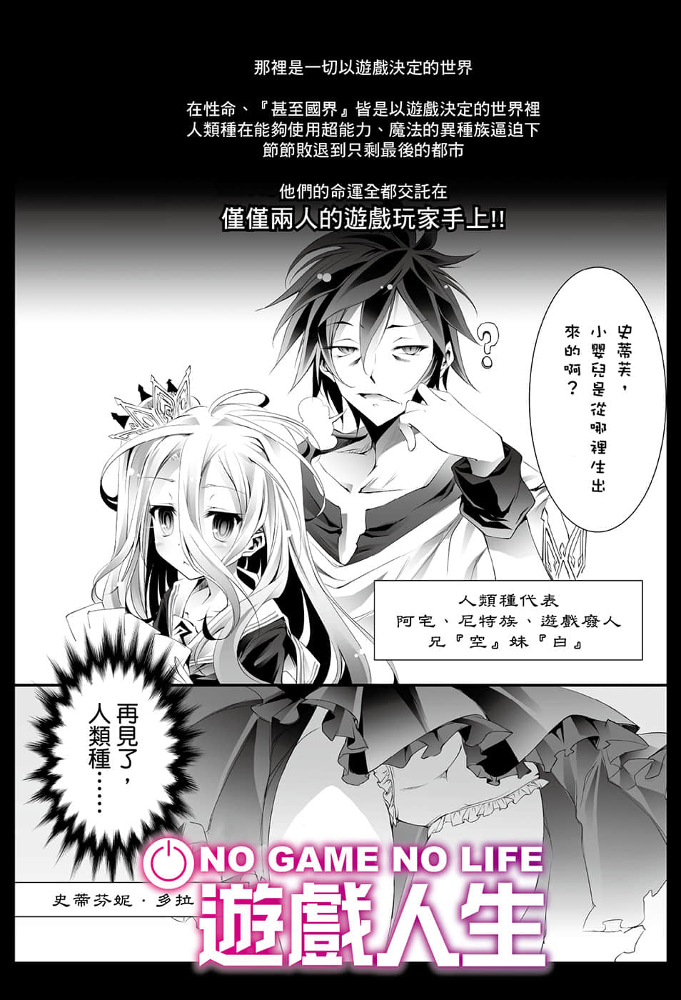
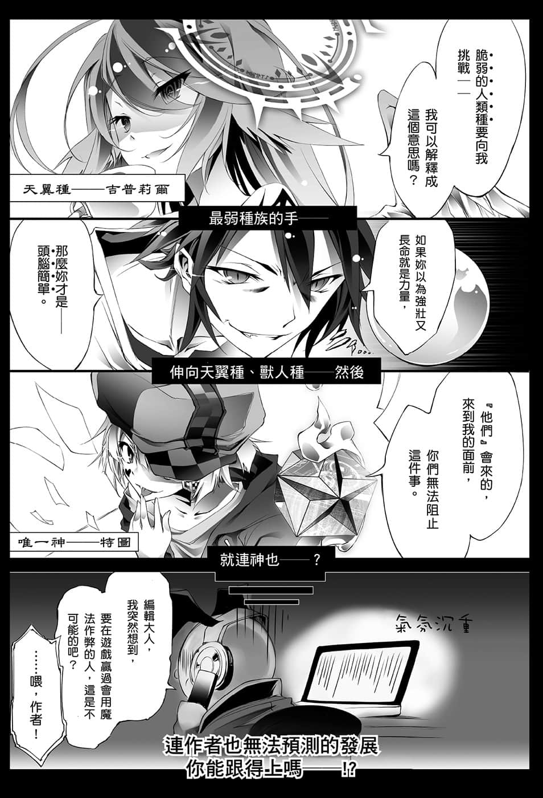

# 后记

> 来源：https://www.linovelib.com/novel/9/2055.html

大家好，好久不见，我是作者兼插画榎宫佑。

——总、总算顺利撑到第二集发售了，真是可喜可贺。

过去曾经有数本我负责漫画或插画的作品，摆放在书店里贩售。不过做为一个轻小说作家，我还完全是个新人。所以在全部写完、交稿之后，直到听说将要上市贩售时，才终于涌现了真实感，然后瞬间紧张得开始胃痛，忍不住想逃进上古〇轴Ｖ里，拼命对武器附加魔法，冲进遗迹收集书本，过着和游戏主旨不同，如字面意思一般，享受着另一个世界的生活！

当编辑打电话来，把我拉回现实之时，我的书已经发售了！

多亏如此，我华丽地成功无视压力了。

「那个……就算是说谎也好，这时应该说你是为第二集原稿在逃避现实吧。」

哎呀！这位不是负责我的Ｓ编辑吗！

『咦？我没有告知你宣传品的截稿日期吗？』

你不是在截稿日前夕突然对我说出这种话，才第二集就已成为惯例的责编超Ｓ编辑吗！

哎呀～真是的，这次你要怎么给我交代啊——

「不是啦，其实我也觉得本文还没交就向你讨插画不太好。」

……对不起。

「话说榎宫老师，可以请你不要第二集原稿都完成了，才说要『全部重写』好吗？」

……对不、起。

「还有别因为你往返于巴西和日本，就在认真地探讨关于国境与贸易的哲学之后，说一句『啊，算了』，然后就爽朗地重新改编已经交出的原稿……」

……对不起，我不该出生在世上……

呃、那个，我们打起精神重新来过吧！

这一集其实本来预定是第一集里的内容。

第一集整集的内容是『第一章』，这一集是『第二章』，然后第三集是『第三章』——

不知为何，我手边竟有写着这种意义不明内容的初期底稿！

「…………」

那、那个，因为怎么都没时间……所以那个……

于是空的话语开始实体化。

而且每当空『吃肉』的时候就想起这个印象，那也——不过这个可以用吗？

问题可大了！每当有足球比赛，整个城市都会晃动哦！！

因此，为了把握住在巴西，是否能如先前一样执笔，对生活会产生何种程度的不便，我住的不是亲戚家，而是出租公寓。

「榎宫老师～！您的住址、电话还有长相都在我掌握中哦～呵呵呵呵呵……」

「我相信您会想办法的♪」

呃、那个、读到这里的读者，下一集也请多指教！

这为了后来的冲刺而加速的第二集，若是能带给您些许乐趣，那是我的荣幸！

……咦？不，那个、插画还没画好——

被他截住了！

……不过……咦？

「啊、啊啊……抱歉，好像是受我脑中的印象影响？」

「……您原本是打算出一本九百页的书吗？」

「哎呀，榎宫老师，您要上哪去呢？」

「这是——为什么说『肉』，出来的会是金发的性感少女呢！？」

——结论：不行，在巴西我无法工作。

呃、那个、只有分镜是我分的，作画是那个……我老婆她……画的。

其实我也很喜欢足球！

「……好吧，那就选个简单的——『肉』。」

（译注：一般日语接龙说出ん结尾的字就算落败，而『弹』的最后一个音就是ん。）

你是鬼吧！！

「榎宫老师，我看就用这个方式漫画化吧，由你们夫妻合作❤」

那、那个……我那时不知道小说一本该放入的文字量，或者说是不知该如何分配……

——本来是有这样一段的。

「不不，若是榎宫老师一个人的话，那负担一定很重，不过如果是这样的话——」

不、不管怎么说，下一集，空他们为了征服世界所需的『最低限度的手牌』就齐全了。

我说过我是因为健康的因素，漫画才会休刊吧！？

「话说回来，榎宫老师，差不多该是那个篇幅了。」

这这、这样您觉得如何呢？

话说回来，这次的内容有一半以上，是在巴西执笔的。

因为这次是进行『实体化接龙』。

但是无言地对我施加压力，要我加入后记漫画的可是编、编辑您哦！？

「……哥，印象……」

这一集就如同空所说，已经将要『将死』了。

「……咦？那不是你的母国吗？有什么问题吗——」

但是那样连日连夜的大吵大闹，我没办法集中精神，也睡不着觉，更重要的是！！

编辑大人，您这样看着原稿是怎么了吗？

……好了，因为还有篇幅，这边就来介绍本文未用的题材。

「不，也不是那种问题啦。」

「……感觉真不愧是巴西才会有的插曲呢……」

就看在这个份上，请原谅——嗯？

相对于脸上挂着灿烂笑容的吉普莉尔，白则是目光冰冷。

是的，没错，若是承认『创作物实体化』，那么说出『时空振爆弹㊟』的话，宇宙就不妙了啊，所以我只好流着泪把这段删掉了。啊，不过语尾是「ん」耶。

这个————不是我画的。

所以不管是从后记开始看的读者，还是已经读完本文的读者，您们就试着预测一下空的想法如何——啊，可是被猜中我会觉得很沮丧，所以还是请别……预测比较好……

不，那个，我先声明一下，我本来以为负担会比漫画少，所以才写轻小说的，可是冷静想想，插画和校对都要自己来的话，结果又会变成赶稿地狱——

老爸！我都说截稿日快到了，别每当进球就抓住我的手跳舞——

「……？为什么一副胆战心惊的样子？」

啊，我还要赶飞机，差不多该逃——不对，先失陪了！

我想您一定会说我过得太自由了！

因为我内人也算是同业……她以『柊ましろ』的笔名从事插画的工作。

「…………是地震之类的吗？」

「————什么？」

欢呼声还有烟火，而且每当进球的时候，整栋房子的居民就会大吼大叫！

说起来，追根究底呀！

我在上一集也写过，因为生病的缘故，所以我必须回巴西数年。

那么期待与各位再会，我现在要先逃了！

「不行哦？（微笑）」

「不过您不是赶上了吗？（微笑）」

「那个……该说那样会很糟糕吗……」
