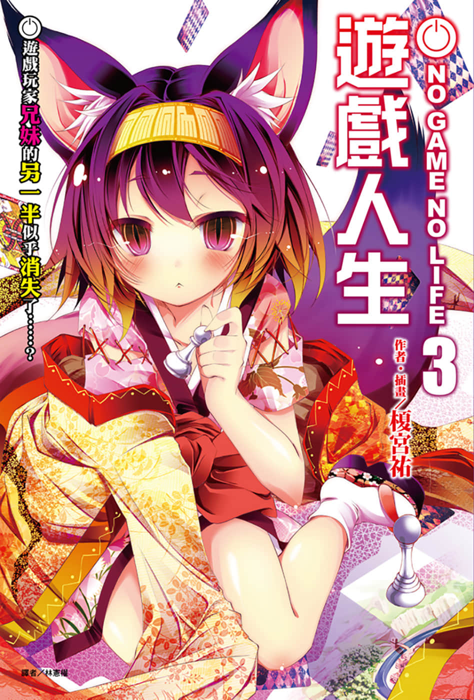
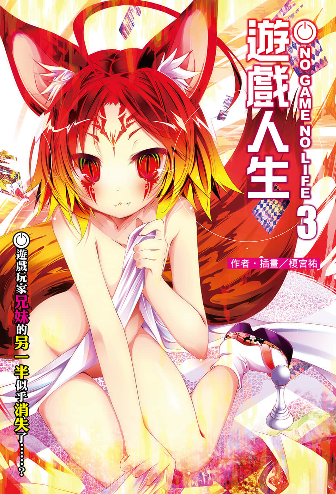
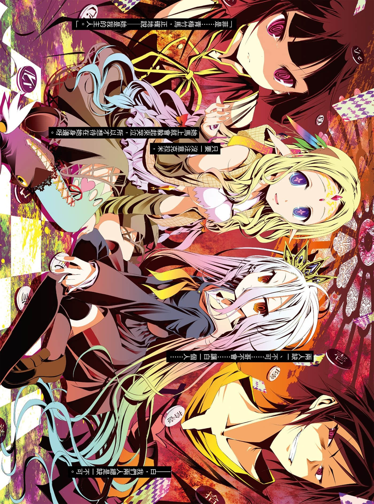
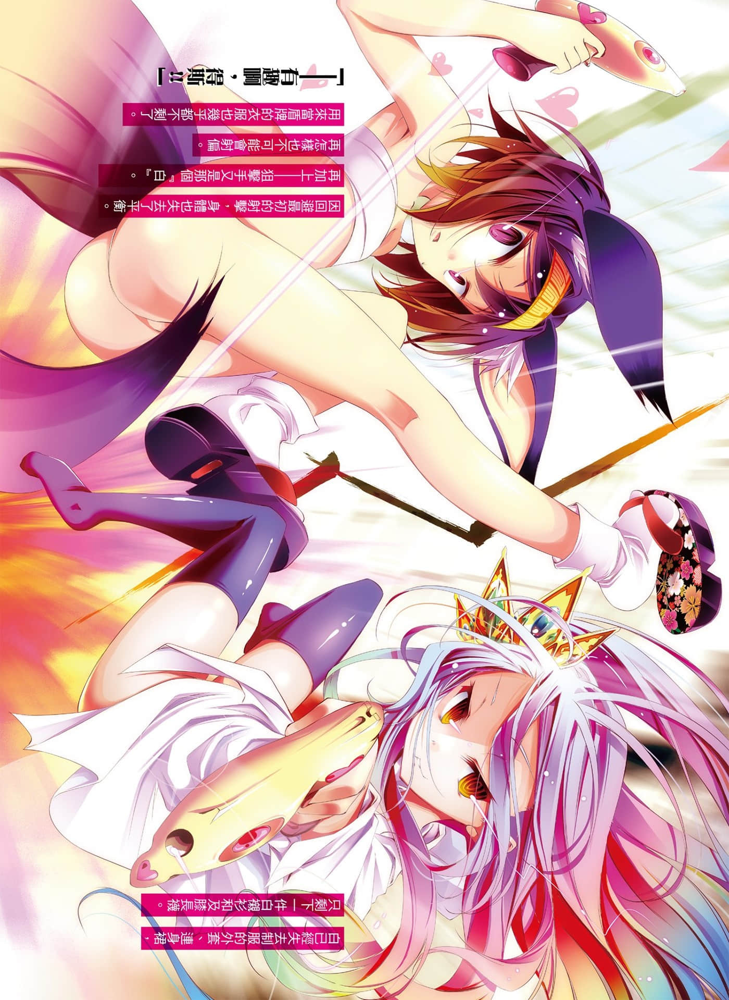
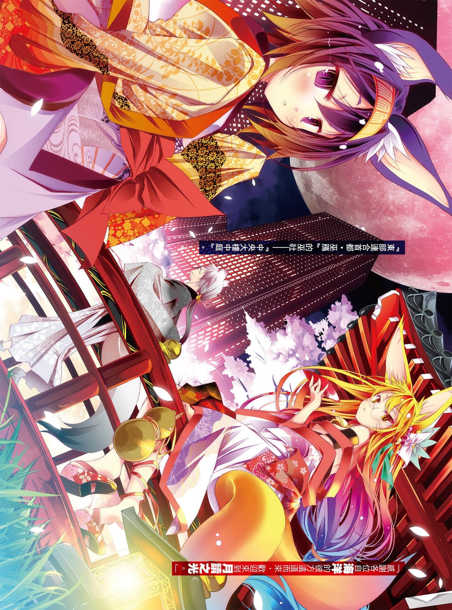
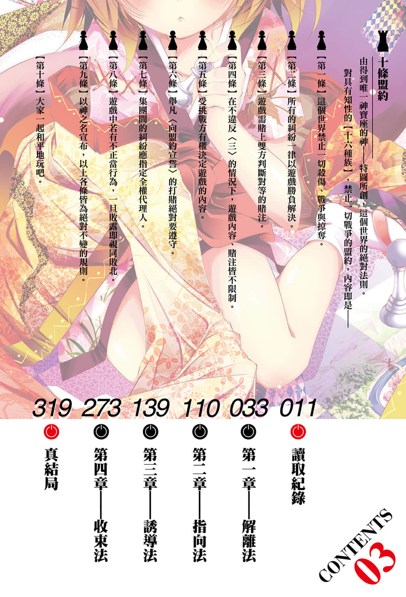

# 插图

> 来源：https://www.linovelib.com/novel/9/118063.html

台版 转自 深夜读书会

作者：榎宫祐

插画：榎宫祐

译者：林宪权

图源：深夜读书会

录入：深夜读书会

深夜读书会：ritdon.com

仅供个人学习交流使用，禁作商业用途

下载后请在24小时内删除，深夜读书会不负担任何责任

请尊重翻译、扫图、录入、校对的辛勤劳动，转载请保留信息

————————————————

【内容简介】

面对空的莫名消失，

孤军奋战的女王将如何守护人类！？

在一切都以游戏决定的世界【迪司博德】——成为人类种之王后，异世界出身的天才游戏玩家兄妹——空与白，向世界第三位的大国『东部连合』，挑起赌上大陆全部领土与『人类种全部权利』的起死回生游戏。但，空却随即在留下神秘语句后消失了——……缺一不可的游戏玩家『空白』就这样被拆散了。

消失的空有何意图，被留下的白，以及人类种的命运将会如何！兽耳王国（乐园）的去向又会是——！？

「我说过了吧，已经『将死』了，你们……早就无路可走了。」

剧情迈入对兽人种的决战——如履薄冰的谋略将要收网，大人气异世界幻想小说第三集！

【作者简介】

榎宫祐

写了这种书名的轻小说，我最近却是NO GAME。

【绘者简介】

因此本文交稿之后，我就要打电动打个过瘾！

榎宫祐

「悠闲（？）地在复健中。」

而且NO TIME，就快要NO LIFE了。

最近玩过的游戏是dishonored（冤罪杀机）、CODBO2（决胜时刻：黑色行动2）、以及刺客教条3。本文还没写好就不能画插画，这也是没有办法的事吧。为什么本文不快点写好呢，真是谜啊。

