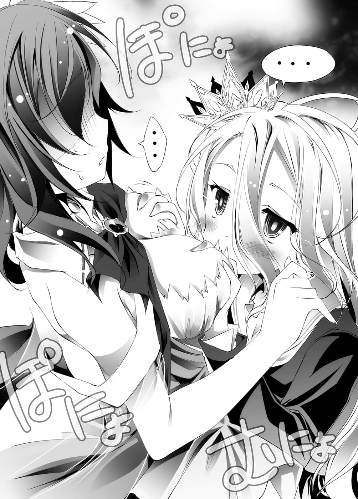
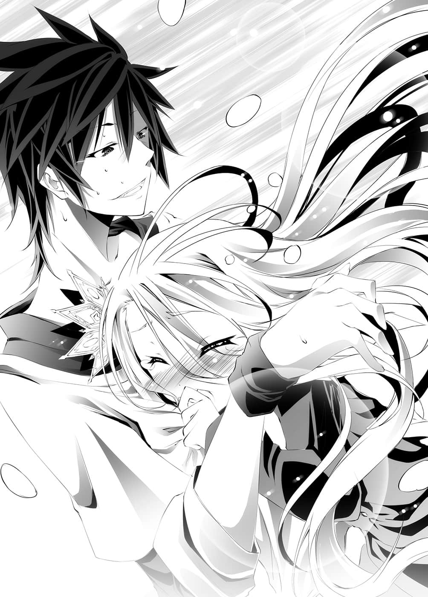

# 第一章 解离法

> 来源：https://www.linovelib.com/novel/9/2058.html

〔剩余——三步〕

——没有意识，没有记忆，也没有五感。

甚至不会想到要问这里是哪里，自己是谁。

在没有任何实感，就连自己的定义都已暧昧不清的状态下，还有什么好问的呢？

什么也问不出口，没有提问的前提，连自己该问什么都不知道。

微小的意识几乎等于无，但是那样的意识，却没有任何根据，只是虚弱且坚定地主张着「这样就好」。

只要这样等待着胜利就可以了，这样的主张勉强让自己微弱的意识保持清醒。

——胜利？什么胜利？

————不知道，什么也……不知道。

---

■ ■ ■

「……情况如何？」

在王的寝室门前，史蒂芙向吉普莉尔如此询问。

然而吉普莉尔却再次摇头叹息。

「——没有进展，主人拒绝让我进入，完全不肯听我说话。」

「还是一样只是叫着『空』这个名字吗？」

「是啊……你那边如何呢？」

「我在城内逢人便问，大家的答案都一样——」

「不知道空这个人物，艾尔奇亚的王只有主人一个——这样吗？」

「对……这是怎么回事呢？」

「我才想问呢」吉普莉尔又叹了一口气。

「合理推论应该是主人的记忆被窜改了。」

隔着门板感受到白消沉的心情，史蒂芙和吉普莉尔面面相觑。

有谁能够证明白的『精神正常』呢。

「为、为了让我进贡呀，之后发现这个失误，白还扼腕不已啊。」

平板电脑完全没有反应了。

「就、就说是白了啊！」

想到『空』这个存在对自己来说是多么方便，这个可能性——这个白最不能接受的可能性，带着强烈的说服力开始浮现。

尽管她企图用这样的理由说服自己，但是白也很清楚——那是可以推翻的。

「与东部联合这场赌上人类种未来的棋子——人类种全部权利——的比赛近在眼前，在这个时间点如果主人丧失行动能力，获得最大利益的人是谁呢？」

怎么可以认同，一旦认同，自己的一切就前提开始——

史蒂芙嘴角抽搐着回答，同时下一段讯息也传来了。

史蒂芙叙述完的同时，下一段讯息立即传来。

听到这样的报告，白感到眼前再次逐渐转为黑暗。

「……呃、上面写了什么？」

「是主人的平板电脑呢。」

只见一个薄薄的板子，从门下的缝隙推了出来。

哥哥会在独缺自己一人的情况下进行游戏吗？

不过对于这个问题，史蒂芙和吉普莉尔的见解相同，两人分别做出回答。

（……不可能……不能是那样……）

「呃～我们比赛猜拳，你用言语激我，利用心理战，目的是希望双方平手，但是重要的是『要求的内容』，我被要求在平手的情形下答应不具体的要求，我说那样是诈欺，但你却不由分说地叫我『爱上你』。」

她咬紧牙根，勉强没有失去意识，然后开始思考。

……下一段讯息迟迟没有传来。

应该是不可能的，那种事应该是办不到的。

写着『得到全员同意的赌注』。

东部联合借由要求消除关于游戏的记忆，长年隐蔽游戏的内容。

「原来如此，您希望进行类似笔谈的『密语交谈』是吗？」

「……主人，请恕我直言，记忆的所有权归持有者所有，即便那位叫做『空』的人进行游戏，失去的也只会是自己的记忆，要消除别人的记忆是不可能的。」

然而，吉普莉尔看着白传来的讯息纪录。

只听到波的一声，上面显示了新的讯息。

在门里侧的白，手上拿着手机，头埋在膝上，答不出话来。

（——那种事……我不认同……我无法认同！）

「——不行啊……我们所拥有的情报，完全不足以说明这个情况。」

这当然也包括『是否接受赌局』。

而且是有可能招致如此严重状况的游戏，况且还输掉了——

但是反驳的讯息马上传了过来。

吉普莉尔仿佛是要让自己冷静般说道。

「主人没有理由接受这种赌局。」

「——『５：为何不是要求成为自己的人，而是『爱上我』？』」

「——这么一来，问题就变成为何只有主人没有失去记忆了。」

「——『４：详细说明你是怎么输的？』」

大家的记忆一定会有相左之处才对，因为——

比起输掉游戏，被植入虚假的记忆——假设、假设真是那样好了。

这个世界有『盟约』也有『魔法』，不用具体地窜改记忆，比如说，『将所有的记忆分割成两份』，这种事或许是有可能的。

——『６：揭穿东部联合游戏内容的人是谁？』

大约过了数分钟吧，然而这次传来的不是问题，而是断言。

「欸，啊，是，辛苦你了……不，没什么事啦。」

虽然状况本身让人摸不着头绪，可是一股凌驾于状况外的异样感，令两人困惑不已。

「对，这就意味着主人——输了。」

『十条盟约』——受挑战方有权决定游戏的内容。

……讯息再度中断。

不，应该说那是更接近『恳求』，无法窥见自信的讯息。

看到那样的讯息，吉普莉尔说道：

「——『６：揭穿东部联合游戏内容的人是谁？』」

「……白，虽然很难启齿，不过派出去探听消息的人已经回来了。据报因为『白擅自赌上人类种的棋子』，群众仍在持续示威游行，尽管无法向城外的人打听，但是游行队伍口中所怒骂的对象——并没有『空』这个名字。」

史蒂芙和吉普莉尔只能默默地继续等待，两人站在国王寝室前无计可施。

——这件事很不对劲。

「这个与我的记忆一致。」

白宛如在说服自己一般，拼命地摇头否定。

——确实，游戏内容被揭穿的东部联合，在正式比赛前为了让白一蹶不振，于是私底下秘密向她挑战，消除了她的记忆——照理来说，他们会有这种做法是很自然的事。

门外微微听得见史蒂芙的声音。

吉普莉尔从地下捡起平板，与史蒂芙两人一起看着画面。

——不，更严密地说，在这个没有任何证据显示哥哥存在的状况下——

「这次又写了什么？」

『大家的记忆被消除了。』

吉普莉尔并不知道操作方法，不过马上又响起波的一声。

「没错，这东西……要怎么回复——」

「不就是……白吗？」

——或许是听见她们的谈话了吧。

「……如果犯人是东部联合，他们最想消除的应该是揭穿游戏内容的记忆才是。」

这次隔了一段时间，下一段讯息才传送过来。

很快地，下一道讯息传来了。

「是白和祖父大人的遗物。」

「上面写着……『３：十一岁的同性要求你爱上她吗？』」

「这种事连我也知道——犯人是东部联合吗！？」

既然是东部联合主动挑战，那实在想不到有什理由要接受……

「这、这是怎么回事呢？该怎么办才好啊！」

「原来如此，口头回答就可以了是吗——『２：要求史蒂芙爱上他的人物是？』」

「写着——『１：和吉普莉尔对战的人物名叫？』」

「这是主人原来那个世界的语言——写着『问题』两个字。」

——如果不是那样，那就表示自己的记忆全是虚假的。

主人从异世界带来了庞大的知识。

「呃、呃～……所、所以我不是一直骂你变态、魔鬼吗……」

「……我们将事情做个整理，试着思考看看吧。」

然而『这个世界有谁』，连自己本来那个世界的记忆，都能加以虚拟呢？

这个可能性即是——

白突然变得茫然若失，只是叫着『空』这个来历不明的人物。

「……？这是那个……」

由于这个秘密被揭穿，东部联合才不得不答应赌局，更何况——

——这些她早就心知肚明。

空这个人，是白为了迎合自己而创造出的虚构存在。

考虑到白的状况，史蒂芙知道这个回答不能马虎。

应该有才对。

即便吉普莉尔也尚未完全掌握，不过她能了解白的意图。

低头一看，仍然是完全看不懂的文字，于是史蒂芙如此问道。

「那不就是——」

为了尽可能想起当时的情形，她用手指按着额头，拼命地回想。

吉普莉尔摇摇头，脸上带着浓厚的苦恼神情，叹了一口气。

从房间中传来白宛如要吐血般的呜咽声。

对于主人持续叫着哥哥——空这个男人——的情况，吉普莉尔被迫采取了行动。

——怀疑主人，这种事完全不予考虑。

如果主人说乌鸦是白色的，那么将三千世界的乌鸦全数染白就是自己的职责。

因此，如果主人说『空』这个人存在，那么他就一定存在。

然而从门另一边传来的声音——

「……难、难道不能想想办法吗！？再这样下去，白会支撑不住的！」

足以令史蒂芙焦躁地抓着门如此大叫。

——身为【十六种族】序列第六位的天翼种，拥有庞大精灵——魔力的战斗种族。

由于本身就是由神 『完成的魔法』，因此无法使用复杂的魔法。

更何况她也不具备复杂的感情，足以完全理解人类种的微妙心理变化。

「……看来是那样没错。」

——即使不使用魔法也知道，主人的精神已濒临崩溃边缘，这是再清楚不过的事。

怀疑主人是绝不允许、罪该万死的事，可是——

「——主人，我们来玩个游戏吧。」

「……咦？」

听到吉普莉尔这么说，史蒂芙——以及门后的白有了反应。

「和我【向盟约宣誓】进行游戏——虽然这个要求无比失礼，不过可以请您输给我吗？」

——呜咽声没有停止。

即便忘记一切也绝不能输，只有这个核心想法推动着自己。

哥哥的记忆就是她『活下去的理由』，封印了哥哥的记忆，她还能做什么呢？

想起那一日，自己只上了一天的学就哭着回家时，哥哥对自己所说的话。

一切皆暧昧不明；然而，即使如此……

「那么他制造出这样的状况应该是有理由的吧？」

本来她应该查清盟约的内容，采取行动使之无效化。

只要那样做就会轻易败北，一切将会被封印。

这种事——太残忍了！

吉普莉尔和白都宛如时间停止般，睁大了眼，僵住不动。

……不对，别去想，那种事不重要！

恐怕史蒂芙和吉普莉尔一样，感觉到相同的违和感吧。

「……主人，为什么……您要获胜呢？」

吉普莉尔深深一鞠躬，然后回应道：

在几近发狂的情况下，挥除掉疯狂的想法——或者任由自己陷入疯狂，将含在口中的棋子，下在棋盘上。

没错——……绝不会输。

唯独这件事，就算罪该万死也必须避免。

她只是隐约地想要安慰白——只为了这个想法才脱口而出。

白泪湿脸颊，拉扯着毯子，回想着关于哥哥的记忆。

第一次让自己确实感觉自己还活着的人。

以往温和的笑容已经一丝不存，吉普莉尔所发出的『杀意』，宛如带有质量的尖刺，让史蒂芙吓得几乎腿软，但是她还是不安地想要安抚吉普莉尔。

（必定要活生生砍下其头颅，将之斩成肉酱。）

不过让我们慢慢来吧，试着思考出能让白飞上天空的翅膀……

史蒂芙的发言并没有任何逻辑。

因为这种事——

用口代替消失的手含住棋子。

只见吉普莉尔闭上双眼，静静问道：

---

■ ■ ■

只要强烈地希望自己能飞，难道就能长出翅膀吗？我想应该不是吧。

——却颠覆了前提，为事情带来一线曙光。

当自己从自入学式后再也没去过的学校回来后，只是抱住自己，陪着一同哭泣的人；对于一个人就什么事也办不到的自己，只是温柔地牵引着自己的人。

没错，很简单，只要这时金将被吃就输了。

该改变的不是自己，而是为了飞行而采取的手段吧？

……那是吉普莉尔不惜以死赎罪的提案。

「啊，不，所以说不是那样——我的意思是～」

自己初次穿上制服时，称赞自己可爱的人。

与哥哥一同度过的所有记忆——全都会消失。

在场只有史蒂芙一个人，丝毫没有这个自觉。

假如这是别人植入的记忆，那么自己真是输了一场残酷的比赛。

只听见细如蚊鸣的声音，夹杂在呜咽声中，传入吉普莉尔的耳中。

〔剩余——四步〕

提案遭到拒绝，如今吉普莉尔也无话可说了。

（——……！）

---

■ ■ ■

同时在白思考之前——她的手已先有了动作。

「——我会要求『封印关于空的一切记忆』。」

——然而她的发言……

如果是白的话，很容易就能获胜……同样地，也是很容易就能败北的游戏。

这就是一切的解答，别怀疑这残余的些微感觉。

然而声音中所带有的魄力，却足以令吉普莉尔和史蒂芙从门前退后一步。

别去思考意义，不需要意义，因为我们没有败北两字。

「对白而言，空是确实存在过的吧？那个、从他不在白会变成这样，可以知道他毫无疑问地——确实存在过。」

不知是谁的手触碰肩膀——感受着这只小手的体温。

听到吉普莉尔的发言，史蒂芙惊讶得睁大了双眼。

没错——这是让人连笑都笑不出来，轻易就能将死自己的必胜一步。

在昏暗封闭的房内，声音中甚至夹杂着呕吐声。

「那、那个……虽然我不是很清楚……」

那个可能是虚假的哥哥的记忆，他所说过的话，在白的脑海中闪过。

可是若是做那种旷日费时的事，不用说也看得出，白在那之前就会崩溃。

所以只能创造，只能构思出让现在的自己飞上天空的方法。

——武力被『十条盟约』所禁止……那又怎样？

——那是纯粹按照正常规则进行的将棋。

对白而言，那是她绝不可能输的，两人零和有限确定完全情报竞赛。

白从手机进行远端操作开启的是——将棋软体。

澎的一声，轻快的声音响起，只见吉普莉尔手上平板电脑的应用程式启动了。

那股朦胧不清的违和感告诉她，不该摒弃白的主张，但是——

哥哥……比任何人都重要的哥哥，白和他相处的时间——

我以舌头读取写在棋子上的数字，然后选出棋子。

你可能会想说，我自己都不会飞了，到底在胡说什么——

——谁不会输？

「……【向……盟约……宣誓】。」

吉普莉尔默默低着头，然而旁边的史蒂芙却战战兢兢地开口了。

「如、如果是被盟约消除了记忆，就无法说明这样的状况——」

「……哥……不要……与其要我忘记哥——还不如死掉比较好！！」

因此——只要她想输，她就能够确实地输掉。

之后，不管要怎么处罚她怀疑主人之罪，她都乐意接受。

暂且将记忆封印，让主人心情平静下来，之后再找出犯人，必定——

「……因为『 空白』……没有……败北两字！」

「吉、吉普莉尔，你、你冷静一点——」

「谢谢您，主人……【向盟约宣誓】。」

听到她撕裂喉咙般的声音，吉普莉尔和史蒂芙只有抽了一口气。

——白啊，有人说人是能够改变的，真是那样吗？

虽然我是个没用的哥哥，我也会和你一起思考的。

吉普莉尔也明白她的视线代表什么意思。

「在这样下去，主人会——坏掉的。」

——没有记忆，连自己是谁也不知道。

在这一步棋之后——将轻易地化为虚无。

——忘记这个，要怎么活下去呢？

手已经没有知觉，听到的声音也不知道是谁的声音。

吉普莉尔询问她的想法，回应的声音却虚弱无比。

然而吉普莉尔散发出的气息，不容许她再继续说下去。

只要找出犯人，用游戏打败对方，取得对方的『杀害许可』，再亲手杀掉他就好了。

但是感觉得出白在揣测吉普莉尔的意图——于是吉普莉尔回答：

自己究竟是谁，为何会在这里，为何在进行游戏。

听到史蒂芙接下来说出的话，两人这次真的倒抽了一口气。

「——会不会游戏还没有结束呢？」

吉普莉尔圆睁著有如玻璃珠般的大眼。

或许是不明白她视线所代表的含意吧，史蒂芙结结巴巴地继续说道：

「所、所以说——有没有可能记忆被窜改，并不是『盟约』造成，而是游戏本身所带来的影响呢？就如白所说，只有我们的记忆被窜改的话，会不会是那个……叫做空的人在得到我们同意的情况下进行游戏，而游戏还……没有结束……这样……」

史蒂芙缺乏自信，愈说愈小声，但是听到她的推测，白抬起泪湿的脸庞。

「——你、你有什么根据……证明那样的想法……」

听到她太过无视间接证据，跳跃式的一般假说，吉普莉尔的声音就像勉强挤出来似地。

「根、根据……可、可是——我就是觉得『不对劲』啊。」

没错，她没有任何根据——正因为如此。

史蒂芙才会不加思索地提出全凭感觉的理由。

「那个人会『输』——这绝对有问题啊。」

那个人——这个词没有言明是白或空，吉普莉尔听了一时无语。

——史蒂芙的假说充满漏洞。

不论是不靠『盟约』就能造成这种大规模异变的方法……

还是从他们的记忆中消除特定人物，却独漏全权代理者——白的意志，这些都不明所以。

但是如果史蒂芙的假说正确，一个比那些更令人在意的疑问就能得到解答，这也是不争的事实。

亦即——艾尔奇亚的王、人类种的王、自己的主人，击败过神，降伏天翼种，甚至即将并吞东部联合的人……竟然会输？对于原先存有这样想法所感到的『违和感』。

如果史蒂芙的假说属实，这个难以理解的状况，并不是出于敌人的意图。

而是为了胜利所创造出的状况呢——？

但是，哥哥有留下明确的线索，以及决定性的判断材料。

话一说完，吉普莉尔就像凭空消失一般……

——没错，『 空白』绝不会输。

空以含有浓厚自暴自弃的笑声继续说道：

——哥哥的思考方式，能犹如呼吸一般轻易编织出如嘲笑前提般的对战风格。

（……打从一开始——就在这里！）

「所以，他不会从没有所有权、代理权的人们记忆中消失——那么只要向其他种族探问！」

颜色如红宝石般湿润的眼眸，平常都只是半睁状态。

而且要说到有什么方法能不借『盟约』力量就做到那种事，就更令人不解了。但即使如此——

白以锐利的眼神瞪着国王寝室，她的眼中——已经没有泪水。

哥哥相信自己，托付给自己的这个「状况」——必须让它结束才行。

……但是，这个时候，白的心已经不在那里了。

（……完成品——哪里还要成长！）

那么自己也参加了那个游戏——不，既然游戏还没结束，那就是仍在参加中。

「……哥……不可能——输……」

不过她压抑情绪，因为现在不是自责的时候。

——白，我们两人总是缺一不可。

「可以拜托你一件事吗？我的手……已经没感觉了啊……哈哈。」

「剩余——五步」

失去一切竟然这么恐怖，事前我根本不可能想像得到。

「——白，你还在吧？」

她跪在门前、低下头。

我感觉那个气息似乎在强忍某种情绪，点了三次头。

我感觉到点头的气息，虽然意识、身体、记忆都已经残破不堪，但是我还能勉强认出，点头的气息是来自于白。

而与哥哥有关的最后记忆，有几句意向不明的话语浮现脑海。

为什么——这种事自己竟然没发觉，白不禁猛抓头发。

感觉着急速上升的体温，白开始审视自己拥有的所有记忆。

头脑呼应命令，呼喊着需要更多氧气，白小小的心脏肆无忌惮地大声回应。

那就是——这远远超出了我的想像。

虽然听见无数的声音——但那些是谁的声音？这里是哪里？这些我都已经想不起来。

哥哥说过——『总是在游戏开始前就获胜』。

将全部关于空的记忆，有如附字幕的电影一般，一字一句，一举手一投足，一丝不漏地全部找出。

然后——他将口中含着的棋子，放置在棋盘上。

……我是……空，年纪……忘记了。

哥哥说过——『我们是因约定而结合』。

哥哥说过——『我们不是少年漫画的主角』。

至于他为什么那样做——这就必须追踪哥哥的思考才能得知了，可是……

——只不过是消失了一点记忆而已。

那么这个状况全在预料之中，表示这是故意为之。

这么简单的答案——也就是空、哥哥——哥他——

吉普莉尔摇摇头，然后说道：

「哪里都行，可以请你握住我还分辨得出的地方吗——为了让我不会发疯。」

因为『现在』是哥哥所设计安排的状况，所以一定留下了提示。

白瞪视着虚空，心跳速度仍在持续上升中。

这个情况如果是少年漫画，那么就是在替白的成长插旗。

即便失去大部分的记忆，我仍明白了一件事。

为什么——自己会在应该已经是史蒂芙寝室的这里醒来呢？

「……我怎么能够……怀疑哥呢！」

「确实，即便使用『盟约』也不可能将特定物体、个人曾经存在于这个世界的事实，从全世界的记忆和纪录中整个消除。不过，假如——」

（——我真是……笨蛋！怎么会这么笨呢！）

「白，你在吗？」

哥哥说过——『两人缺一不可』。

白悔恨地咬着牙，这大概就是自己不及哥哥的理由吧。

「对，我现在马上使用空间转移，前往东部联合大使馆进行确认——还有就是……」

---

■ ■ ■

视觉被夺走已经过了很久，手脚也没感觉了。

她会变成即使没有空也能独立——但是哥哥明确地『否定』那样的发展。

——就算想到烧坏也没关系——接收到全力运转的意志，白的头脑做出回应。

她将沉重的身躯从床上拔起，站起来朝房间的中央爬过去。

期待空——哥哥的存在，为了把那样的期待转变为确切的证据，白必须找出『根据』。

听到那句话，空苦笑一声，然后向她恳求。

「名叫空的人是主人的哥哥，这也就是说，假如他以『人类种的全权代理者』的身份接受赌局，那么从人类种的记忆中『消失』就有可能办到了，从他的所有物我的记忆中消失也一样。」

「……两人缺一、不可……哥不会……让白一个人……」

那么——这件事自己是同意了，哥哥相信自己，而自己也相信哥哥，同意他制造出这个令人发疯的状况。

目光来回扫视，连一粒灰尘也不肯放过，同时头脑加速思考。

这么惊慌失措，身为『哥哥引以为傲的妹妹』，怎么有脸见哥哥呢。

（……哥确实……存在的话，为什么要……制造出这个状况……）

——把所有的情报做个整理吧。

意思是他们……合两人才算是一人，两人一起才是完成品。

空气吹入因质量转移而产生的空间，仅留下一阵微风，消失了踪影。

这时她睁大那对眼睛，环视整个房间。

触碰到那片段的可能性，原本冻结的思考开始急速活化。

「……以主人『们』败北做为思考的前提，这是多么难以饶恕的愚蠢行为，之后我愿意为此接受任何处罚——恳请您再给我一点时间。」

没问题，我还记得。

被单独留下的史蒂芙不知该如何应对，总之她对着门后问道：

如果相信史蒂芙的假说，这个状况就是哥哥一手策划。

感觉到肩头被用力握住，空微感放心，呼地吐了一口气。

---

■ ■ ■

再度感觉到点头的气息，只有这个气息支撑着现在的自己。

「白……我大概就快……那样一来——」

——那会是需要相当严苛的条件才能成立的假设。

听到吉普莉尔这么说，好似一言惊醒梦中人，史蒂芙说道：

少年漫画的主角——他们会成长。

为什么没有怀疑？为什么一开始没有发现！

然后小声传来——我知道……

白甚至感觉自己永远无法到达他那样的程度，却要判读出他的谋略——？

……引以为傲的妹妹是——白，十一岁，是个拥有漂亮白发和红色眼眸的小美人。

「啊、呃……白、白……你还好吧？」

——哥哥存在的这个明确的可能性。

「如果是那样——有个方法可以确认。」

……不可能，白完全不觉得自己做得到。

小脑袋开始发出阵痛，然而白无视痛楚，内心仍然继续喝令。

再想！给我更用力地想——！

想出创造这个状况的必要性为何。

哥哥说过——『我们去取得最后的拼图吧』。

为了取得能让与东部联合的比赛更为有利的拼图碎片，哥哥答应了这场赌局——

（……那么——敌人……是谁？）

在与哥哥最后相处的记忆中，哥哥留下谜一般的话语。

那时，坐在王座上的哥哥所见到、谈话的对象是——谁？不管重新审视记忆几遍，对方始终——『看不见』。为什么会看不见？为什么使用魔法消去踪影，只让哥哥看得见——那么吉普莉尔应该更——记忆中的——有什么——只有——所以——

（……再想……再想再想，再用力想！！）

白的脉搏、思考不停加速——甚至加速到墙上挂着的时钟也停止动作。

——这样的程度还无法追溯哥哥的思考。

哥哥的行动总是含有两层三层——有时甚至十层二十层的意义。

他用自己无法想像的方法，仿佛从结果倒推般构思出战术。

要追溯那样的创造力、颠覆前提的思考方法，想走捷径是办不到的。

（那么……白只能……用白的方式……拼命去做！）

体温更加攀升，脑袋痛得就像被老虎钳夹住一样，汗水不停流出。

——那是极没效率，但是却可称为暴力性的强行思考法。

残留的记忆、构筑状况的要素、线索、候补的解答、判断材料。

加起来总共有几千几万种可能性，在脑中模拟那些可能性所产生的几亿几兆种状况。

——对全部的状况，逐个进行筛检，是有如电脑般的暴力推理法。

「……我……没事……」

在这种恐怖之下，难道还以为自己的精神能保持正常——

仿佛运转过度的齿轮弹飞一般——白失去了意识。

我在心中如此告诉自己，用力咬着牙，让颤抖停止。

却仅仅因为这两句话，轻而易举地融化消退。

视线移动没看到哥哥时，白差点要将史蒂芙推开，不过她的思考勉强制止了自己。

——这种自己逐渐消失的恐怖感是照预定进行？

另一方面，吉普莉尔不自然地与白保持距离，她的语气感觉有所觉悟。

虽然不知怎么回事，不过她似乎理解了。

似乎没有失误……一切都进行得很顺利。

现在——对，正在进行游戏，现在是输了，而且是为了胜利而输。

---

■ ■ ■

『早就知道会这样了，事情一如预定进行，这样就可以了。』

「……克拉……米……！」

名字记得是……克拉米・杰尔。

一道似乎是少女的声音，尖锐地向我问道。

「……很好，那我就如你所愿，把你的一切全部夺走。」

「————！？」

为了含住下一个棋子——缓慢地张开口。

一阵难以言喻的恶寒，好似全身冻结快要破碎般的感觉袭来。

「……你『不是任何国家的奸细』——是啊，这个我已经理解了。」

自己失去的东西会转移给对战的敌手。

我是……空，是白的哥哥，然后………………然后什么？

没错——因为这就是那样的游戏。

……大概吧。

「何必问呢？只要连同答案从我这里夺走就行了吧？」

那样的一个人，如果得知哥哥要赌上人类种的棋子会如何呢？

来确认一下吧……我是空。

「——原来如此，你的目的就是要让我夺走你的记忆吧。」

即便是被夺走而变得稀薄的五感也能感受到，自己忍受不住恐惧，牙齿因颤抖而喀喀作响。

「——这……这是什么！？」

「……对不起……」

听到吉普莉尔和史蒂芙担心地呼唤自己，白的意识再度浮现。

史蒂芙如此喊叫。

「白！！你没事吧！？」

「嗯，什么？」

「没有呀？我这样下是会赢的啊。」

白抱着疼痛的头，汗湿的身体想要坐起，却被史蒂芙制止。

喀的一声，克拉米在盘上下了一子。

这里是哪里？我从哪里来？原本身在何处？

这就是一切，只要知道这个就足够了，没有任何问题。

「……哥……」

——哥哥在这个房间里。

那么就——没什么好怕的。

向这边喊话的就是刚才发出悲鸣的————谁啊？

「……在国王选拔战……曾经对战过的……人……」

然后——当秒针发出第二次声响时……

——……

从那个声音，将对方下的棋步在脑中化为影像——空静静地浮现笑容。

「——再这样下去你会输掉，存在会被夺走，就连曾经存在过的事实都会消失哦，在那之后你到底有何图谋？」

因为那才是这个游戏的真正目的。

没错——这就是那样的游戏。

「你、你究竟是……什么啊！？」

但是少女继续说道：

对白而言感觉就像过了数小时，她的脑海中出现一个人——解答浮现出来了。

「哪里没事了！你突然不吭声又突然倒下——你知道我有多担心吗！！」

只听到脑中的某处大喊：

「……！」

——好了，再做一次确认吧。

脱口说出与哥哥对战之人的名字，感觉到所有的线索全都连结在一起的同时。

但是冰冷刺骨，绝对零度的寒气——

——原来如此，看情形来到这个世界后的记忆似乎已经『被夺走了』。

……这我就不能告诉你了。

看来重要性果然如我期待。

——没问题，还想得起来……『还是属于我的』。

……——

为了人类种——甚至不惜利用爱尔文・加尔得的人。

克拉米发出僵硬、不，发出近似悲鸣的叫声，整个人僵住了。

能够如此确信的证据已经变得太过稀薄，若问我有何根据，我也无法断言。

「……白在这里……」

既然我没有来到这个世界后的记忆，那就是在克拉米那里了。

我已经失去视觉，所以看不见她的模样，不过——我听过她的声音。

——看来自己是晕倒了，白在史蒂芙的怀中，想要确认状况——

白发现她的眼睛有点红，于是小声地向她道歉。

白的哥哥，十八岁，处男、沟通障碍、游戏废人。

「……你是什么意思？」

如果那个记忆『被夺走的话』——一切就结束了。

〔剩余——八步〕

自己逐渐变得不再是自己——那是难以形容的『恐怖』。

---

■ ■ ■

来自异世界————慢着……

她是森精种之国——爱尔文・加尔得的内奸，也是这个游戏的对战敌手。

「主人！？」

开什么玩笑，如果这种恐怖是早就计算好的话，那自己就太不知天高地厚了！

「——对……没错。」

由于对那个人的记忆实在太过片段，不管是他的长相、身材还是声音，白都想不起来，是极为模糊的印象。

——东部联合战、必胜的拼图、接受森精种援助的——监视者。

好，看来还能发出声音。

——同时自己心中也有某个东西消失了。

我是……空，引以为傲的妹妹——白的哥哥。

「少装蒜了，你这样下——是故意要输吧？」

我是谁？

与神比赛游戏获胜后，和妹妹一起来到这里……之后呢？

但是，接下来才是问题——这个游戏的目的是什么？

能将之变为可能的白的小脑袋，好似快要破裂一般，开始渗出痛楚的汗水。

在看不见的状态下，我只能依据棋盘上传来的声音下棋。

「主人，我有事情要向您报告，关于前去确认空——主人的结果……」

吉普莉尔准备报告在东部联合大使馆确认的结果——

「……不用了……」

却被白的这句话打断。

「……哥……存在……」

「——是的，正如您所说，我愿接受任何处罚——」

在东部联合大使馆——向初濑伊野探问的结果，明白确认了『空』的存在。

对于自己怀疑主人们的主张，怀疑主人们的败北——

「……那……我命令你。」

「是，请您尽管吩咐。」

如果要她当场自尽，吉普莉尔会毫不犹豫那样做。

然而白却以温和的声音回应，只不过声音显得颇为急迫。

「……帮我……找到哥……」

听到这句话，吉普莉尔宛如蒙受神的启示般拜领命令。

然后仿佛表示自己真的没事了似地，白轻柔地挣脱史蒂芙的手，站了起来。

尽管脚步不稳，不过白的眼神恢复正常，目光注视着两人问道：

「——你们……『昨天』……做了什么事？」

有如知道会得到怎样的答案一般，与其说是询问，倒不如说是确认。

只见史蒂芙和吉普莉尔看看彼此，然后回答道：

「昨天——我忙着应付游行群众，之后在一旁看着白在王座上玩游戏。」

「……吉普莉尔……你做得出来吗？消除记忆的游戏……」

对手是序列第七位的森精种，哥哥不可能没预测会有魔法介入。

「怎、怎么可能兴奋！如果兴奋了，身为人可就很有问题了耶！」

不会有错，哥哥对吉普莉尔应该是这么说的：

史蒂芙被十一岁少女的气势压倒，声音沙哑地吞了口唾液，认真地回应她。

「……哥是用……吉普莉尔做的游戏……进行比赛。」

甚至知道对方是克拉米，或者该说是森精种——爱尔文・加尔得。

「……如果和森精种合作呢？」

没错，位阶序列第六位，甚至能够构筑出虚拟世界的天翼种——吉普莉尔。

那双手正揉着自己的——

白只是点点头，侧着头向她问道：

但是，白并不会发觉——接下来有好几天，史蒂芙将会因此感到非常烦恼。

——这样就确认了确实存在着一段从全员脑中消失的记忆。

「主人有昨天……不，有前天晚上的记忆吗？」

「————…………」

她忽然思索了一下，曾经对哥哥以外的人说过这句话吗？

「————啊……」

哥哥猜测只要赌上『人类种的棋子』，克拉米——爱尔文・加尔得一定会主动接触……哥哥应该就是用那种方式引出克拉米，想要拉拢她成为自己的人。

但是白的表情丝毫不变，手也没停下。

史蒂芙内心挣扎：『对十一岁的女孩子感到心动，应该不是异常吧。』

但是吉普莉尔却似乎过意不去地说道：

——哥哥早就知道对方会找上门。

「……谢礼。」

可是先前才犯下怀疑主人的滔天大罪，如今在白的目光注视之下，她又如何能虚张声势呢。

才刚发誓协助的吉普莉尔，头脑全力运转后回答道，白点头回应。

「……那我可以请问我为什么被揉胸部吗？」

然而见到白的眼眸紧紧注视着她，吉普莉尔认真地思考后回答：

「那么——游戏是从前天夜晚进行至昨天，您是这个意思吗？」

「……如果不是史蒂芙……我就不会想到……所以——」

「——我的游戏吗？」

「像这种会带来如此巨大事象变动的术式，所需要的精灵量远远超出森精种的极限，所以最终启动游戏的人应该是我吧。如果术式被动了手脚，我在那时候就会发觉。」

「可以。」

——结论是没有。

亏自己还那么担心……史蒂芙露出那样的表情，沮丧地问道，白则是回答：

「如果是像实体化文字接龙那种虚拟世界的话……可是因为这里是现实世界……」

但是还不够，白表示还差了一个关键。

「……没感到兴奋吗……？」

「什么谢礼啊！我被揉胸有什么好处……」

「……在揉……史蒂芙的……胸部……」

「那么主人……您的意思是，状况您全都掌握了吗？」

剩下的问题只有一个，却是最关键的部分，那就是——『游戏内容』。

但是在盟约实行前，记忆就被窜改，这不管怎么看都是魔法的介入。

「——虽然要视森精种的术者而定……不过并非不可能吧，操纵力量的绝对值以序列第六位的天翼种居于上风，但是在编织复杂术式方面……第七位的森精种则要——高明许多。」

「……嗯。」

所以白才会这么不习惯，这么笨拙地移开视线，红着脸——

「……变更问题……当天晚上……你们在……哪里？」

——然而听到她们的回答，白带着确信断言「不对」。

「……你能保证……那个游戏……无法作弊？」

然而白接下来的话，打断了史蒂芙。

白并没有特别在意，毫不犹豫地点头承认。

「……因为已经知道……哥哥是存在的……」

「……明明受到『爱上我』的命令……却不兴奋吗？」

白那样的表情与话语，令史蒂芙说不出话来。

「主人，那个……这件事不需要确认吧。」

「……那是……『前天』……十九日……」

也就是说，要求自己爱上他的人是空……史蒂芙也想通了。

「……再来只剩……一个问题。」

她打从心底厌恶地说道，对吉普莉尔而言，那种事她想都没想过吧。

「……谢、谢你……史蒂芙……」

「……没有，所以……那样就好。」

会是森精种准备的游戏吗？——不对。

「白小姐有的『记忆』我们没有，我们有的『记忆』白小姐没有，因此造成了混乱——但是如果有全员都失去的记忆，那事情就另当别论了。」

「——什么？」

「是、是的，你尽管开口。」

「……再来……史蒂芙……我要向你确认。」

——没错，这样就剩下——

听她这么一问，史蒂芙和吉普莉尔开始探索记忆，但是……

平常要吉普莉尔自承不及其他种族，是绝对不可能的事。

然而那句话正符合白的心意，她放开手。

——她花了数秒钟才把握了状况。

……确实，如果利用『盟约』要求爱上她的人是白，那史蒂芙应该会有所感觉才是。

「…………那、那个……你在做什么？」

「合、合作——！？您是说跟住在森林里的那群乡巴佬合作吗！？」

然而白担心的事，吉普莉尔却毫不犹豫地断言。

被这么问到，吉普莉尔开始思考。

看到白瞪着大眼，露出至今从没见过的认真表情。

「这就证明了参加游戏的人是我们所有人，而且玩家所能影响的范围遍及人类种全体——那他的身份除了全权代理者之外，没有别人。」

那便代表——

「……嗯。」

「那个、那是什么意思？」

如果不是史蒂芙弄错或是产生幻觉，那么现在在视界里的是表情极为认真严肃的白，以及白的一双小手。

如果现在主人命令她做出那样的游戏的话……？

不过这在白的思考中已几乎有了答案。

不会错的，他是以拥有力量，可以阻止森精种利用魔法作弊的游戏应战。

两人再度面面相觑，但是白紧接着追问：

完全想不起来，看到白一脸理所当然的表情，吉普莉尔向她问道：

「比如说——由我提供实体化文字接龙盘的核心，森精种的术者编纂术式……那样的话，或许是有可能编织出这种规模的事象变动魔法的吧。」

然后——白接下来要说的那句话……

能够做到那种事的人——我方只有一个人。

她又搓又揉地继续摸着。

不理会抱头烦恼的史蒂芙，吉普莉尔静静问道：

然而史蒂芙还是不明白吧，她侧着头表示不解，吉普莉尔对她解释：

史蒂芙仍然不明所以的样子，不过，是的，那也就是说——

「对，我也在旁边。」

「——……那、那个、我该做什么反应才好呢？」

「……绝对？」

「是的，这一连串事件若是以魔法进行，那么所需要的力量，在体感上我绝对会察觉。」

然后吉普莉尔环视周遭一遍。

「老实说——那力量可比拟大战时我对森精种首都施展的『天击』。」

她轻描淡写像是在谈论琐事一般继续往下说：

「记忆中，那时我打算一击将首都不留痕迹地毁灭殆尽，而森精种为了抵御我的攻击，动员了三千名术者连接精灵回廊，牺牲了精神和性命，仍然无法完全挡下。」

事到如今白对吉普莉尔做的事也不感到惊讶，只是继续思考。

但是史蒂芙就忍不住对眼前的决战兵器吐槽。

「你……你到底在做什么呀！？」

「森精种的魔法技术在大战后变得非常发达，不过能控制的绝对值依然不变，如果这个事象变动是由魔法造成，而且是出于主人们的指示的话，那么启动的人一定是我，作弊绝对逃不过我的眼睛。」

吉普莉尔依然轻描淡写，斩钉截铁地继续说道。

——也就是说，答案果然从一开始就在这个房间里。

在这个散落着无数游戏的房间中，应该有个『棋盘』才是。

这个尚未结束的游戏的——游戏盘。

可是不管看了多少遍，都找不到类似的物品，那么——

「……吉普莉尔……这个房间……应该有……魔法的反应……」

哥哥在这个房间——但是却无法认知他的存在。

那么游戏盘本体可能也在『白的认知之外』。

「……消失的一天半……『游戏中的记忆』……那么游戏也会……无法认知……」

不过就算被排除于认知之外，既然游戏仍在进行中，那么应该正使用着魔法——

「……夺取对方的搭档是吧。」

不过，即使如此，还是有问题，也就是——

「……可是很抱歉，我最多只能感受到那边展开了一个妨碍认知的力场，正如主人的推测，如果那个森精种的术式，是使用我所提供的游戏盘为核心，那么想要突破那道认知妨碍——应该是不可能的事。」

没错，这是魔法。

「我也确认过了，请您放心，主人。」

「ＹＥＳ，因为如果不那样做，即使能够消除我的存在，你也不能对白怎样吧。」

也就是五感、肉体本身，或是有关游戏的记忆消失等等。

「哈哈，真有趣的玩笑，不过我怎么可能那样想呢。」

「用那种规则玩游戏，精、精神正常吗！？」

为什么看不见游戏盘，却看得见棋子呢？白回答吉普莉尔这个疑问：

空点点头，继续说道：

「那么——物理上『无法继续』的话该怎么办呢？」

这句话让白和史蒂芙忍不住展开笑颜。

忽地，白在史蒂芙跌倒的地方发现了某物。

即使无法认知却「仍在那里」——能够触碰到。

空说着隔着桌子，坐在克拉米对面的椅子上。

对于浮现出近似疯狂笑容的空——克拉米冷静地以冰冷的眼神应对。

但即便拥有吉普莉尔所提供的庞大力量，也无法让结果永远持续下去。

「我们想揭穿你的真实身份和幕后黑手，你则是想尽可能揭露我和爱尔文・加尔得的各种手法。也就是说，这是一个彼此利益一致的游戏。」

「恕、恕我直言，主人……」

「……将记忆或……存在……分割成棋子……互相争夺的……游戏。」

「……不知道哪个棋子被吃会失去什么——不觉得很刺激吗？」

「——好了，让我们把规则复习一遍吧。」

尚未使用却能够认知的棋子。

〔最初的一步前〕

她头上的光圈激烈转动，甚至让人产生房间在摇晃的错觉——

白咬着指甲呻吟一声。

一切线索在白的脑中连成一线。

「啊，有一点和平常的黑白棋不同，那就是不能跳过不下，就算没有可以夹吃对手的地方也有义务下子。后半到了那样的局面，如果不得不下数值小的棋子的话，那会如何呢……你们应该明白吧？」

正面与背面分成黑色与白色，空将刻有数字的棋子拿在手上，一边把玩一边继续解说。

克拉米听了嗤笑道：

「第一是『游戏结果的永久确定』——确定抹消、交换、保有的彼此让渡过的存在痕迹，除此之外还可以要求一件事。」

「总之，我们就保留双方可以在决胜后变更要求的权利吧。」

首先，空竖起一根手指说道：

另一方面，别的盒子里也有刻着精灵数字的相同棋子。

「……因为……尚未使用。」

也就是克拉米赢了的话，就能得到失去空的记忆的白——人类种的全权代理者。

他对自己背后的白、史蒂芙、吉普莉尔，以及克拉米背后的森精种少女说道：

这句话所代表的意义，令史蒂芙背上不禁窜起一股寒意。

「——但是，游戏结束后一切就恢复原状……那样很无聊对吧？」

「但是，既然是夺取彼此的『一切』，那么也可能发生同伴们失去所有『关于自己的记忆』的情况，到时就真的『无法继续』了。一旦游戏结束，就由剩下棋子较多的一方获胜。」

这句话指出了克拉米的目的——篡夺人类种的全权代理。

「同样地，我也无法得到那边的森精种，所以第二个要求就是——」

「另外，重要度的设定会遵从游戏的魔法，反映出在自己深层心理中的优先顺序。也就是说，哪个棋子掌管什么概念，连自己也不知道。」

现场产生的压力，让应该完全无法察觉魔法的白和史蒂芙几乎趴倒在地上。

---

■ ■ ■

吉普莉尔并没有感觉到那里有魔法的气息。

看穿克拉米内心企图要将空的存在整个消除，空露出奸笑。

「游戏是将『构成自己的概念』切割成三十二个棋子的——『黑白棋』。」

但是如果游戏规则如白所预料的话，那么果然——

一道冷汗流下，白终于——明白了哥哥的意图。

规则恐怕是——

空说明得很轻松，但是这非比寻常的规则，令人不禁紧张得猛吞口水。

没错——如果白的推测正确，那毫无疑问是个疯狂的游戏。

然而——她绝不能再怀疑主人，吉普莉尔展开羽翼，睁大琥珀色的眼眸。

而空获胜的话，就能得到一名爱尔文・加尔得的顶尖术士。

然而克拉米毫无惧怕的样子，而是尖锐地指出规则的漏洞。

「……也就是说，那才是『真正的要求』对吧？」

他看起来一副很快乐的模样，但——

但是吉普莉尔却指着房间的一隅——

「胜利的判定需要客观性，所以是由棋盘本身进行判断，这样没错吧？」

「……小多，在空无一物的地方你也能跌倒，你不需要再增加自己的负面特色了吧。」

「……哥果然……太厉害了……」

「即使无法认知，却仍在那里，也就是说就算触碰到也没有自觉吗？」

「……！」

听到这句话，白与吉普莉尔同时领悟。

那是因为吉普莉尔在操纵着数量无与伦比的精灵——魔法之源。

「棋子上刻有数字，愈接近一的就愈重要，比如说记忆、人格、肉体，大概就是那些吧？除此之外就只是普通的黑白棋。将对方的棋子翻面——互相争夺对方的『存在』。」

记忆被夺走，被排除于认知之外的游戏——还没结束的游戏。

「没错，我就是那样编造术式的。」

吉普莉尔对白的自言自语有所反应，而史蒂芙则是慢了一拍。

完全看不见，甚至摸到也无法认知的游戏盘就在这里。

克拉米推测他的意图，接着说道：

「……你以为我会同情你，留下你的存在吗？」

——只差一步，答案已经近在眼前了说——

白点头回应吉普莉尔的话，然后向前走去。

「……咦？跌倒？我吗？」

「……唔。」

「——『人格』被夺走，若是输掉的话——哈哈，一定会很有趣吧。」

「在、在这附近吗？我调查看看有没有什么东西。」

那是装在小盒子里，上面刻有大写汉字数字，正反两面分别是黑色与白色的棋子。

「为了让游戏的结果能够『固定』——我们就规定『两项』赌注。」

「由搭档……以我来说就是白和那边的两人代打，你则是那边的森精种，因此在场全部的人都是参加者——全员一起『向盟约宣誓』开始游戏。」

克拉米的伙伴，那位森精种少女，与吉普莉尔交互点头确认。

「咿！什……什么啊。」

「——找到了。」

要猜出那些是什么棋子，其实极为简单。

由空所构想，吉普莉尔提供动力源，森精种少女编织出的游戏。

吉普莉尔的眼光，强力否定最令人担忧的可能性——『没有被动手脚』。

「……黑白棋的……棋子。」

「答案正确，胜者将会取回自己的一切——而败者则一切都不会恢复。」

史蒂芙视线看着地上，往吉普莉尔所指的地方走去——但是突然间，她的脚似乎绊到什么东西，史蒂芙动作夸张地跌了一交，脸朝地面撞了下去。

然而史蒂芙却站了起来，惊讶地睁大眼睛看向这里。

「……我调查看看。」

「这是怎么一回事呢？这就是游戏的棋子吗？」

空同样笑着回答，一口推翻她的质疑，然后注视着克拉米的双眼说道：

「如果我不在了，就算使用盟约约束，白大概也等同废人了。而关于你的搭档，对我来说也有同样的可能。也就是说，为了不是『保有』——也可以是『自杀』或『改变人格』，所以才必须事先约定可以变更盟约——对吧？」

除了白与空之外，在场全员的背上都窜过一股寒意。

「简单说——这是一场赌上彼此存在与搭档生杀大权的争夺战。」

没错——包含搭档在内『不是全赢就是全输』。

太疯狂了——这么想的人大概不只有史蒂芙吧。

被当成赌注的白，不知道是根本没考虑到哥哥败北的可能，还是听过策略的全部内容，理解了哥哥在做什么——她只是半睁着双眼。

「直到陷入无法继续的最后一步，也就是直到存在全部被夺走为止——在这样的规则下，好了——各位做好心理准备，可以开始游戏了吗？」

空故意俏皮地说着，环视了众人一遍，在场所有人的目光都集中在空的身上。

空是想出这个疯狂的游戏、设定规则的人。

面对这样的男人，克拉米勉强保持平静，开始思考。

没错，这是——空所想出的游戏。

规则乍看之下是公平的——正因如此，克拉米也只能怀疑游戏本身了。

因为这是对方设下的游戏，不可能不对自己有利。

是规则有漏洞，或者——克拉米将视线转向搭档的少女。

但是少女只是微微摇了摇头。

意思是——什么也看不出，无法掌握对方的真意，不过游戏并没有被动手脚。

编织出游戏术式的森精种少女表示，她无法在游戏上动手脚；不过，相反地，若说吉普莉尔动了手脚，那也是不可能的事。

「……好吧。」

那么除了在游戏中挖出他真正的意图之外，没有其他选择了。

（……然后这就是……第二个……同时也是……最大的……理由。）

两人的视线擦出火花，但是空却是一副兴趣缺缺的模样。

「我相信你。」

白顿时眼眶一热，不过她强行忍住，继续思考。

---

■ ■ ■

「认清自己的身份吧，如果不是你们在空中张设飞行妨碍魔法，我还不把你们放在眼里呢，这是你们自作自受。我可是因为那个妨碍魔法而坠落，肿了一个包耶，就算不小心把你们全部杀光，又有什么错呢？」

正因为可能是一步错就全盘皆输的棋子，所以才会保留下来。

「痛——！」

「……你说过要协助我的吧？」

「……好了，真的超过一天了。」

不过哥哥故意下输，并且为了让白能获胜所可能下的棋步……

白将刻着【参】的正反黑白的棋子拿在手上。

以及不知是否丝毫没有隐瞒之意，从发间露出森精种特有长耳朵的，一名森精种少女。

哥哥讨厌阳光，所以首先可以断定他不会坐在窗边。

将这些全部推测分析——仅用三步棋反败为胜。

这个现在看不见，甚至无法认知的棋局。

双方剩下的棋子数字都很小——也就是重要性很高吧。

「很抱歉，只不过是汲取精灵回廊原潮流的东西，看来似乎让只有耳朵长的人误认为是炸弹了呢，下次我会贴上『低能注意』的标签再交给她。」

「……嗯？」

白、吉普莉尔还有史蒂芙，三人突然头痛欲裂，纷纷用手按住了头。

——哥哥为什么会让自己落单呢？她原本对此感到疑惑。

那么意义是——白闭目思考。

空把话题带向一直没有报上姓名的森精种少女。

「这种精灵使用法，有如要破坏精灵回廊的炸弹似的，你的脑袋是不是有问题啊。」

空如此冷淡地拒绝，克拉米对森精种的少女说道：

白将写着【参】的棋子白色面朝上，用手指夹住。

戴着黑色面纱的黑发少女，克拉米。

「——就是这样，吉普莉尔，你做得出来吗？」

「够了，你们都闭上嘴巴安静工作吧！都快要超过一天了耶！！」

原本无法认知的黑白棋盘现出原貌，啪答啪答的声音响起，黑色的盘面也逐渐染白。

随后……

主人指定的是简直精神不正常的游戏内容，不过吉普莉尔回答：

听到空所指定的游戏规则，白不安地抬头望着哥哥。

而克拉米也同样冷眼看着自己的搭档。

有如呼应白所落的一子般，脑中出现杂音。

「好痛……怎、怎么回事！」

————〔二十日・白天〕…………

「是吗？那我不接受赛局，请你们快点回去好吗？」

白瞪着看不见、用手触摸也无法认知的盘面。

那是因为宽广的场所会带给白孤独感，所以哥哥总是为白挡住宽广的空间。

「白，我们两人总是缺一不可。」

那里毫无疑问是原本白和哥哥在玩游戏的王座大厅。

哥哥如此说道，他的视线前方有两名少女。

于是白、史蒂芙、吉普莉尔与空。

「因为一想到某位天翼种在大战时，对我们射出的一击导致多少人牺牲就……平常总是一副高高在上的样子，竟然发出『天击』这种攻击，真是有够幼稚。」

白带着确信，将手往下一挥——铿一声，一道听不见的声音，在三人的耳中响起。

然后，为了逆转，哥哥可能选择的所有位置分布。

「是啊，我知道你们来此的目的，我当然随时都可以。」

因为既然他将最后的棋局托付给『白』——那他当然是持白棋。

「你们啊……到底要跟谁才能和平相处啊？」

而对方看到之后，完全中了哥哥的计谋，被诱导而下的棋步……

---

■ ■ ■

以及克拉米、精灵少女，众人轻轻把手向上举起——宣誓。

「……一副好像早就知道我们会来的口气呢——那么当然……」

「白，你听清楚了。」

将吉普莉尔实体化的文字接龙盘『核心』拿在手上，森精种少女开口抱怨：

「啊啊，终于来了啊，会不会让我等太久了呢？」

但是设定这个规则的是——被挑战的一方，也就是哥哥。

「——很抱歉，我做不到，那么大规模的游戏改造——」

故意将记忆托付给对方，暂时屈居败势的目的是——

这件事……只有自己能够办到！

——被忘掉的话还好。

自己仅仅因为哥哥从身旁消失，就甚至一度怀疑哥哥的存在。

哥哥做的这些事，如果由白执行……白不觉得自己的精神能够保持正常。

她瞪着空无一物的空间——不，瞪着虽然看不见却存在的棋盘。

然后——原先失去一天半的记忆——逆流了回来——

哥哥是『白色还是黑色』，这个问题也不需要犹豫。

「我没有要你一个人做，你就跟克拉米带来的那个森精种一起做，好吗？」

既没有开始的记忆，也不知道盘面的经过如何。

棋盘的确是看不见，不过——

————〔十九日・夜晚〕…………

空冷眼看着吉普莉尔。

「当然呀，可是要我跟那个恶魔合作……呜呜……我答应就是了。」

——忘掉哥哥的话——白确信自己的精神会无法保持正常。

想像了一下，白露出悲伤的笑容，做出这个结论。

那就表示这个游戏的进行，甚至他的消失，都是有意义的。

「那么就快一点，我必须在你交出人类种的棋子前，让你消失才行。」

不过，在得知答案之后，那可以说是理所当然的做法。

哥哥不管是睡觉或并排而坐的时候，都会刻意选择能让白坐在墙边的位置。

「……哥。」

————〔十九日・傍晚〕…………

「……要我和天翼种合作吗？请容我在此婉拒哦～❤」

『——【向盟约宣誓】！』

这个恐怕是将存在乃至于记忆切割成三十二颗的争夺黑白棋。

虽然看不见棋盘，不过哥哥的习惯、哥哥的动作、哥哥的关心，与哥哥有关的全部记忆，将哥哥坐的椅子位置，甚至为白留下的位置，都有如看得见一般，完全暴露出来。

————〔十九日・白天〕…………

「真是巧呢，我也敬谢不敏哦～❤」

（……这里……哥哥在……这里……）

对于克拉米之言，空笑着回答：

首先，第一个理由极为单纯。

「……那种事……白……做不到啊……」

她心想不管空的意图为何都无所谓，这边可是有森精种的力量撑腰啊。

即使是空无一物的空间，但是白确信，她感觉得到哥哥的位置。

「真、真对不起，都是因为这个长耳朵好几次让回路差点失控的关系。」

「每、每当你用蛮力压抑失控时，我都得重新编纂术式耶～！」

空叹了口气，用手撑着脸颊说道：

「算了，嗯哼——那么我就重新说明一下规则吧。」

「……哥。」

「白，你为哥哥担心，哥哥是很高兴啦，不过你放心。你应该明白的吧？」

「白，我们是因『约定』而结合。」

「白，我们总是在游戏开始前就获胜。」

「——我们这就去取得为了并吞东部联合的最后一片拼图吧。」

「……嗯。」

白点头答应，空温柔地摸了摸她的头说道：

「——好了，开始游戏吧？」

————〔二十日・夜晚〕…………

「…………！」

白的右手用力握住空的肩膀。

她的左手却更用力地握紧，使得指甲刺破了皮肤，流出血来。

对于眼前逐渐被夺去记忆、手、脚、五感的哥哥，白只能眼睁睁地看着。

——这就是她对哥哥的信任。

哥哥说他相信白，而白也以信任回报哥哥。

现在只有忍耐。

由于白笑着下的第二步。

那是全面封锁克拉米一方的棋步，空在失去视觉的情况下所安排的一步棋。

「还能怎么办！」

「……这种计策……谁也……猜不到啊……哥……真厉害。」

——然而，游戏却始终没有结束的迹象。

重要度高的棋子将会被无作为地放置——会踌躇也是理所当然的。

看起来踌躇不定、犹豫不决……

哥哥设计的这个游戏，从白的手机，以及人类种和吉普莉尔的记忆中消失。

——因此她甚至怀抱着对敌人的同情说道：

忽地，克拉米看到空剩下的三颗棋子。

怎么可能有那种事——但是，这样一来，没有夺取到那段记忆的理由也就说得通了。

然而，即使如此，白也没有提示空的真意为何的记忆。

「你还剩下三颗棋，没想到与真正目的有关的记忆，竟然是构成你的存在的首要候补，真是令人惊讶啊……不过你到底打算怎样——我这一步下去。」

明明已经几乎夺走了空所有的记忆，但他真正的目的却依然不明。

不过盘面上明显是黑棋——克拉米占了压倒性的优势。

「我想起来了，虽说是游戏的规则，但是我竟然会忘记主人。」

仿佛对判断游戏仍然『能够继续』的游戏盘感到生气般，克拉米如此说道。

——黑白棋，它属于两人零和有限确定完全情报游戏。

为了使游戏获胜的策略顺位更高吗？

——不，可能那样的记忆，打从一开始就不存在。

但是几乎夺取了他全部记忆的克拉米，在他的记忆里，确实感觉到在虚空中看见，空似乎微微露出了胜利的笑容——这让她的脚无法克制地颤抖了。

……只见虚空中，似乎有某种存在，自行放下黑棋。

一般来说，因为谁也不知道，构成自己的概念中最高顺位者是什么。

这些就是构成空这个人物超出自己之上的要素。

仿佛呼应她这句话一般，空的身影忽地从眼前消失。

因为那个骗局，是在毫无作弊的情况下成立的作弊。

【贰】——对白绝对的信赖。

「大概就结束啰。」

白微微一笑，注视着现出形貌的棋盘。

不管是自己手上这颗写着【贰】的棋子所掌管的『概念』，还是哥哥的真意。

只见黑色的棋子摇摇晃晃……不安地摆放在逐渐染白的盘面上。

有可能失去哥哥的要素——哥哥本身和败北的可能性比自己重要——不言自明。

虽说在同意游戏进行的原理上，那也是无可奈何的事情。

——这个游戏能够反映人的下意识，决定出棋子的重要性。

白则是拼命地忍住眼中即将满溢而出的泪水。

因为如果立场颠倒过来——白能断定自己也是那样。

「克拉米，要怎么办呢？」

——没错。

上面写着壹、贰、参，是构成自己最重要的棋子。

因为如果那段记忆被夺走，那计策就全盘失败了。

如果打算以正常的手段获胜，那空只要交给白代下就行了。

没错——正如空所设定的规则，这个游戏不能跳过不下。

而【壹】则是——

没错，空确实设计了『骗局』。

但是自己竟然怀疑主人，企图消除他的存在，吉普莉尔对自己的无能沮丧不已。

克拉米拿着棋子说道，克拉米的状态也绝对称不上毫发无伤。

而见到两位主人的决心，吉普莉尔也无话可说。

缺少哥哥的自己就不再是自己。

「……除了哥和白以外……」

正如克拉米所怀疑，这个游戏从一开始就设计得对空有利。

---

■ ■ ■

就连制作游戏的当事人，即便使用森精种的魔法——也无法看出端倪。

「我的记忆也处于被消除的状态——只能等了吧！」

同样取回大半失落记忆的史蒂芙，大声地问道。

————…………

她只能睁大双眼，看着他们的一举一动。

刚才轻易地溃败消失的那个男人。

它的模式比将棋或西洋棋更为单纯，也确立了明确的必胜法。

【参】——游戏胜利的方法。

「可、可是空为什么会消失呢？那是故意的吧！？」

空的记忆——在脑中闪过，令克拉米露出痛苦的表情说道：

代下——也就是白下的仅仅一子。

这是因为在身为参加者的她们身上，包含参加过这个游戏的记忆已经消失了吧。

然而——没有人能知道那是怎样的理论。

「克拉米……情况不太对劲喔。」

虽然他交出许多令人心情郁闷的记忆，但是那又如何——

结果她还是猜不透空真正的意图。

有数段记忆已经不存在于在场全员的脑中，她也自觉到有相当多的记忆被夺走了。

「……白个人的一切……」

如果说要强行结束这个游戏，大概只有那个天翼种做得到吧。

「这是怎么回事？你不是说没有被动手脚吗？」

「……什么嘛，那个男人到底做了什么——！」

「这、这不会有错的！术式可是由我组合的喔！」

从这一点能推测出——剩下的三颗棋子所代表的意义，那就是——

理解这个道理的空，打从一开始就确信自己会消失，然后靠着白的代下逆转——那样的骗局，就算可以猜到，但是要叫人如何应对呢？

棋子再次翻面，将近过半的盘面瞬间染成白色。

游戏盘应该要做出胜利宣告了才是。

「……这样就没人代打了，而空也消失，『无法继续』——是我赢了吧。」

啪的一声，克拉米一子落下。

不过，没有问题——因为现在的白已经『明白』了。

而直到刚才仍表露出感情，在一旁观战的三人，这时却如人偶般，眼神黯淡无光，好似没有意识一样。

「那这是怎么回事——难道这样还不算『无法继续』吗！？」

只见克拉米和森精种少女——以及哥哥的身影开始隐约浮现，吉普莉尔和史蒂芙都睁大了双眼。

之所以没那么做，却仍选择用黑白棋决胜负，很可能——是为了让白便于判读。

……对哥哥的战略佩服得五体投地，白拿起写着【贰】的棋子。

「——好了，差不多要结束了。」

「……你的记忆相当令人感兴趣，但是我到现在还是不明白你的意图。」

为什么能说得这么肯定，答案很简单。

也就是说，这就是——哥哥设计的『骗局』的真相。

白已经完全明白了。

「——等一下，既然在这个时点存在就已经消失，那这三个究竟是什么？」

白认为，哥哥并没有把他的真意告诉自己吧。

她们对克拉米和游戏盘有如视而不见，摇摇晃晃地走出房间。

接着，只有白一个人，就这样走向床铺，静静地坠入梦乡。

那凄惨的模样，让史蒂芙虽然犹豫着不敢阻止游戏，只是大概是不忍看下去了吧，她用手覆盖住脸，发出泫然欲泣的声音。

该不会——该不会比起『自己的存在』。

「……好了，哥……」

然后就像是等待已久般。

「……回来吧——！」

写着【壹】的棋子落在盘面上，空的身影清晰地回到白的眼前。

——从仅仅以四子之差获胜的盘面，响起了『胜者：空』的语音。

同时白也朝着被叫到名字的胜利者扑了过去。

空的第一句话是——

「很好，白，你揍我吧，我已经做好觉悟——」

然而毫不犹豫地扑进空怀中的白，则是比他的话语稍微快了一些。

泪流满面的白，埋首在哥哥的胸前，只是说着：

「……对不起……对不起……我应该——更早一点……！」

跟不上状况的吉普莉尔和史蒂芙，只是呆呆地愣在原地。

不过，这时从意外的地方传来叫声。

「克拉米！克拉米～！你听到我在叫你吗！？」

将视线移往声音的方向，只见……

森精种少女表情急切地不停呼唤着克拉米，而克拉米——

史蒂芙忍不住捂着嘴倒抽一口气。

克拉米就像是一具空壳——不，说白一点，就像是尸体一样，软弱无力地瘫在椅子上。

……空是如何获胜的，史蒂芙仍不明白。

然而，空所设计的这个游戏一旦落败，结果将是……

空对惊愕的众人一笑，克拉米则悻悻然地说：

得到那样结论的森精种少女，只能这么说道：

他不用盟约束缚，只对自己要求一件事——在适当的时机窜改记忆……

「——好吧，我就答应你了，很有趣不是吗——你的『计划』。」

普通的人类真的击败神、降伏天翼种——但是，比起这些事。

之后摇了她的身体好几次，克拉米才终于清醒过来似地。

「那个男人——空为什么没事，我只是无法理解那个理由，想得出神了而已。」

「说的也是，我会稍微挑选一下手段，老实说——这次实在超出我的想像了。」

空、白、克拉米三人，一齐深深吸了一口气。

「原来如此……我就坦率地说了吧——我们『彻底输了』。」

扭曲。损坏。然而却将他们连结在一起，宛如本来就是如此设计般，完全地合而为一。

「——好了，我『们』赢了，现在就来做第一个要求吧。」

「那边的森精种——『菲尔』，我要得到窜改你一个记忆的权利。不是以强迫的手段，而是以现在彼此已经借由游戏互相了解的关系，克拉米应该明白我的意思吧？」

「好、好险啊……就算有吉普莉尔的『核心』，这个要求也差点超出极限啊……」

「为什么——经历『这种经验』你还能保持正常！？」

没错，依照盟约，必须答应的要求——『还剩一个』。

超出常轨的信赖关系？——不对。

听到他这句话，森精种少女悲鸣似地向他哀求：

「不————不要啊啊啊啊啊啊啊啊！！」

——原理上不可能实现的契约就无法遵守。

那已经是存在的前提了。

史蒂芙和吉普莉尔慌张地奔过来，不过空用手制止她们，然后对白说道：

没错——这是经过【向盟约宣誓】，在彼此同意下进行的游戏。

依照盟约，从空那里夺来的大量记忆固定了下来。

「……嗯……哥是白引以为傲的……哥……」

「……如果我输了，白提出同样的恳求，你们会答应吗？」

「……是啊，我明白——你是要我们做双重间谍吧？」

不是比喻也不是夸饰，这两人真的是——缺一不可。

可能是指那件事，或许说不定——是连白也不知道的事情。

「……嗯，准备完毕……随时都可以。」

「对吧～？你可以夸奖我是你引以为傲的哥哥哦？」

当那些记忆在脑海中闪过，克拉米面露恐惧的表情大叫：

「……哥……好厉害……」

「……主人，这样的游戏，下次请容许身为仆人的我阻止您。」

看到这个情况，最冷汗直流的人，意外地——竟然是空。

「唔嗯——你那么坦率地夸奖我，哥哥会不好意思耶……喔！」

克拉米这样的喊叫是以什么为根据呢？

而克拉米也握住森精种少女——菲尔的手。

森精种少女全神戒备，但是知道空的意图的克拉米，说了句「没事的」，制止了她。

可是见到克拉米即使清醒过来，眼睛仍然注视着虚空，少女奔了过去。

「是啊……嗯，我没事……反而是……」

仿佛紧绷的线断了一般，猛烈的疲劳侵袭而来，空连同抱着他的白一起倒在地上。

「只不过——」抚着埋在胸前哭泣的白的头，空说道：

——这个游戏实在令人费解，史蒂芙内心充满恐惧地看着空。

她失去了什么呢？——或者说除了肉体以外，全部都失去了呢？

「我、我知道这个要求很自私！可、可是设定能够变更要求的也是你啊！我、我可以任你处置——只求你别让克拉米……别让克拉米变成这样——！」

如果最后就连空在游戏中的心境，她都夺了过去的话，那么她应该也看到了吧。

虽然空的记忆已经固定在克拉米的身上，但她却无法不怀疑那样的记忆。

因为这两人——如果没有相遇的话——

看到空那个样子，吉普莉尔静静地走上前。

——不像。在场全员一齐摇头回答。

「——超出你的想像？那是我的台词啊！」

可以称为克拉米的人物或人格都已经——不存在了。

克拉米无法理解，不过因为接触过空的过去，所以克拉米知道，在意外的情况下知道了。

这句话让众人一齐发出相同的声音。

不过白将头紧紧埋在空的胸前，双手用力抱紧他。

将他人排入『构筑自己要素』的首位，那不叫『信赖』。

「等等——不管要我做什么我都愿意！只求你——别让克拉米这个样子！！」

「你早就料到只要把记忆托付给我，就可以不使用盟约，拉拢我成为同伴吧，我真是被看扁了呢。」

「不好意思，菲……我也要拜托你一下。」

接触到空他们的『过去』，她实在忍不住要说出这句话。

「——咳哈！——呼……呼……」

「——咦……？」

考虑到那些将足以影响东部联合战——甚至是今后的一切——

这个游戏若非亲眼目睹，否则实在无法想像结果会如此悲惨。

不过唯一对那一切心里有数的空，也意外地向众人问道：

也就是为了实行空的要求，即便耗尽那个游戏盘的魔力值，也差点不足填补。

但是她却好似一个被有趣恶作剧作弄的小孩，脸上露出了笑容。

「我否决，考虑到今后可能面临的对手，像这种程度的险路，有得走就不错了。」

「克拉米！克拉米！你没事吧！？你知道自己是谁吗！？」

空开玩笑似地说道。

「欸、啊，好，你尽管说没关系喔！」

吉普莉尔和史蒂芙依然愣在原地。

同时，克拉米仿佛想起要呼吸一般，恢复了意识。

「要求一，固定彼此掠夺的所有记忆，以及——归还夺取的一切。」

但是空却用失去一切温度的眼神回应她。

「……好了，第二个要求。」

正如空所说，站在相同立场的话，她应该会嗤之以鼻吧……然而——

少女拼命地呼喊，然而克拉米的眼神却仍茫然空虚。

唯一有别于她们，只有白想通那些话所代表的意义，睁大了双眼脱口说道：

只见克拉米叹口气，点了点头。

看到她的样子，菲尔终于理解了。

（这、这种游戏到底需要怎样的神经，才能以『落后为前提』来进行呀！？）

而对于那样的结果，空拥着仍然哭个不停的白，无情地开口了。

「——白……差不多可以了吧？」

「咦？我看起来像正常吗？」

空的意图——共享全部的记忆、偷窥克拉米的记忆、记忆的固定。

——克拉米抱住自己颤抖的肩膀，宛如做了恶梦般地看着空。

『命运』——对那样廉价的词语而言实在太过沉重，可是除此之外也没有别的词语可以形容那样的记忆。

但是空却露出恶魔般的残虐笑容，有如刽子手挥下刀子一般。

「不～行♪我要提出预定的要求，所以——」

目睹只要走错一步……空的下场很有可能就是……史蒂芙不禁双脚发抖。

——瞬间，由于盟约的实行，吉普莉尔与森精种少女制作的游戏盘发出了爆炸声。

「唔喔喔超～可怕啊啊啊我真的再也不做这种事了啊啊啊对不起白～～！」

「呜呜～……呜呜……呜呜……」

「哇啊～～～～～～～～～～～～真是的————那个男人到底是什么人啦～～～～」

三人无视一旁愣住的众人。

仿佛小孩一般，泣诉着真心话，一个劲儿地嚎啕大哭，直到精疲力尽睡着为止——
