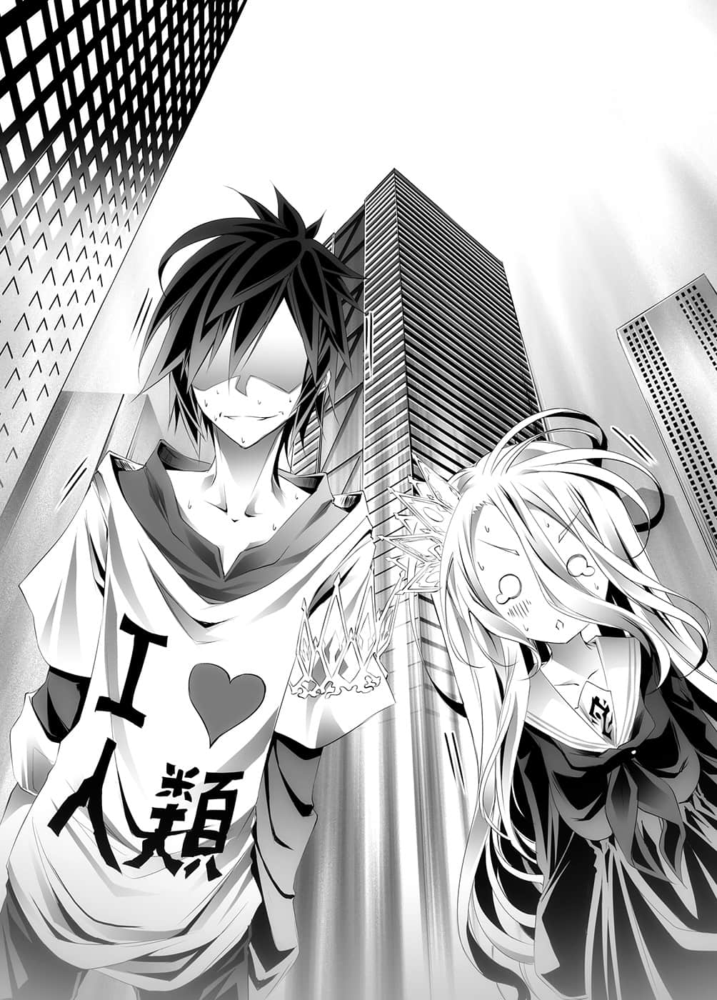
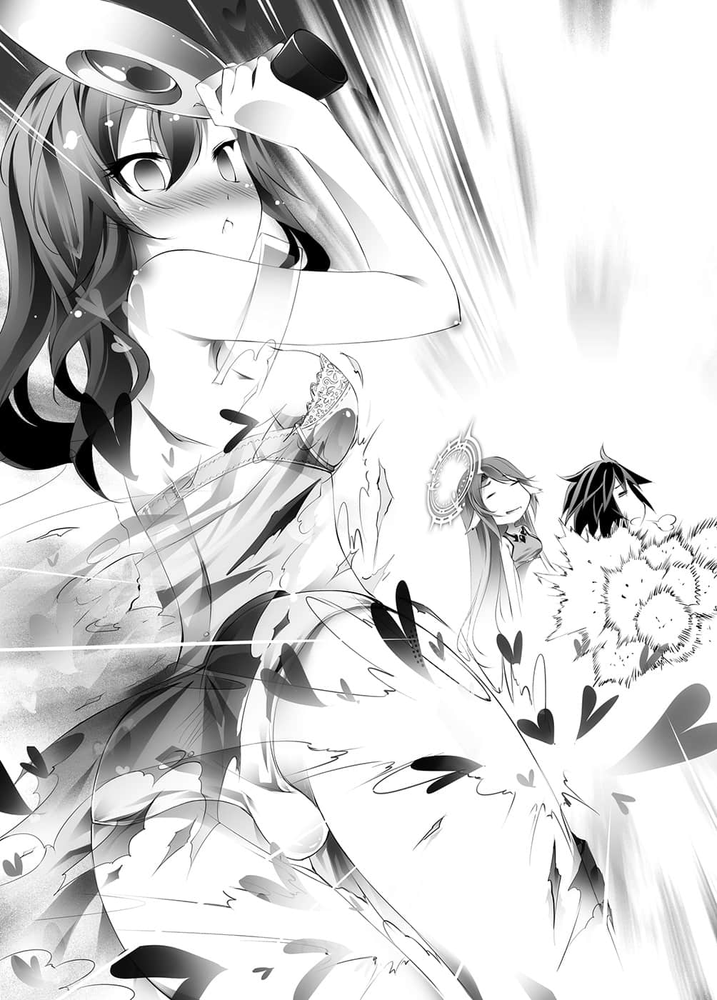
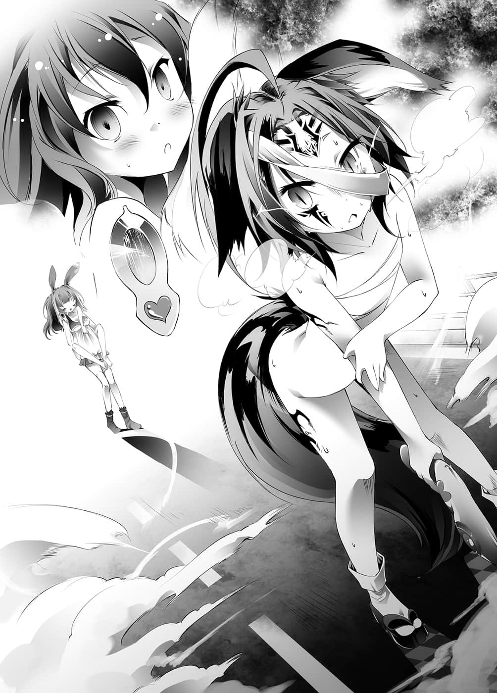

# 第三章 诱导法

> 来源：https://www.linovelib.com/novel/9/2060.html

艾尔奇亚王城——谒见大厅。

王座之上是瘫软无力、仿佛融化一般躺在上面的两位人类种的王。

「我说啊，实在很闲耶……东部联合到底什么时候才来通知比赛日期呀？」

「……好无聊……」

与克拉米等人发生一连串的事件后，很快地已经过了五天。

好不容易绷紧的精神，等了这么久之后也不禁松弛了下来。

就算是平常站在告诫空等人立场的史蒂芙，这时也找不到话说了。

心中不安的史蒂芙，脑海中忽然闪过一个可能性。

「该、该不会是他们忘了——或是信没送达……之类的？」

——想起至今寄送的书信都没送达这件事，史蒂芙如此说道。

原本瘫在椅子上的空坐起身，脸上浮现无比残虐的笑容。

「……哦？如果是那样的话，不给他们一点颜色瞧瞧怎么行呢——对吧？」

空的脑中想到的是，用来做为最后王牌的史上最大骚扰——

「主人，抱歉突然打扰。」

只见吉普莉尔从虚空中现出身影。

看到她手中的圆筒，空与白猛然起身。

「喔！吉普莉尔！那该不会是——！？」

「是的，这是东部联合送来，关于同意比赛和比赛日期的书信。」

吉普莉尔笑咪咪地继续说道：

「看来是有人不想让我们和东部联合比赛，将这封信封锁在艾尔奇亚王城之中，因为有人每当见到我就出现可疑的行迹——」

在异常者的集团中，正常人反而被称为异常。

「正是因为如此——你认为我为什么要故意引起暴动呀？」

「～～～～我、我知道了啦！就这样直接去啦！」

「好了，上面怎么写————————白啊，今天几号？」

紧跟在后方一步之遥的是，眼眸静静闪耀着琥珀色光芒的『侍从』——吉普莉尔。

……这真是个愚蠢的问题。

「咦？白，你没跟她们说吗？」

「——意思是怪我没有设定交出信的时间吗？喂，人类种怎么只有在这种地方特别有小聪明啊，可以的话，真希望你们多将那样的脑袋用在国事上。」

令民众无法发出任何一句话。

「请放心，我极为礼貌且和平地说服了对方。我温柔地看着对方的眼睛，稍微叱责了一下，对方就尿湿了下半身，不断哭泣哀嚎，最后一五一十全招了出来，把书信交到我手上。」

然而史蒂芙却抱着头说道：

「一个不用说，就是为了把东部联合拖出来比赛；另一个你也已经明白了吧，是为了引出克拉米，拉拢她加入我方；然后，还有一个就是——」

一下马车，空立刻轻松地说道，但是伊野似乎颇为警戒，只是简短地应对。

他们被带到的地方是日前那间会客厅。

「咦……？」

空却颇意外地对白说：

艾尔奇亚首都郊外，一栋耸立于国境线附近的巨大高楼。

空等人从马车上下来，迎接他们的是身穿裤裙般衣服，刚迈入老年、毛色雪白的兽人种。

「……白……也准备周全……」

白不可能主动对空以外的人说明什么。

「啊～是这样啦，我擅自赌上人类种的棋子，用意——『有三』。」

「知道啦，你也要确实地让观众进场哦！」

明明已经是第二次造访这里，然而吉普莉尔似乎对看到的一切仍然深感兴趣，露出一副口水快流出来的表情，忙碌地东张西望。相对之下，白轻轻地打了个哈欠，把玩着手机；而空则是双手背在脑后，语气轻松自在。史蒂芙拼命忍着胃痛如此说道。

「白的哥哥，空也随时准备ＯＫ！好了，大家走吧！」

「呃……你该不会……」

——结果，空等人在这段路上，连一声责骂也没听到。

「史蒂芙，你没事吧？放轻松点，不然你会撑不住哦？」

「久等的是我们啦。好了，我们开始吧。」

而在后方远处，拥有蓝色双眸的史蒂芙，战战兢兢地小跑步追赶在后。

「你、你说故意引起暴动——那是怎么一回事？」

其实，主要是吉普莉尔的眼神和温和的微笑，只诉说着一句话：

「赌上人类种全部权利的比赛即将开始，你们还能这么悠哉，脑袋是不是有问题啊？」

巨大的艾尔奇亚城正门，发出轰然声响，缓缓地开启了。

史蒂芙却是一副被他打败的表情回答道：

「什……正、正在暴动中耶！？」

「什么嘛，一声不吭的，那个老爷爷是怎么了？」

明明之前还会出言讽刺的说，空如此嘀咕道。

---

■ ■ ■

「……我早该想到的……因为这关系人类种的命运啊……只要政府里某个没有向盟约宣誓『不能对空你们做出虚伪报告』的人，使用游戏夺走『交出信的权利』的话——」

「感谢你的关怀，不过我的胃痛有十成都是因为你的缘故……」

——『十条盟约』没有包含恐吓吗？

「咦？这就是我们的正式服装吧？有什么问题吗？」

——『在我所能听闻之处，如果想要骂主人，就请拿命来换吧。』

「……那么，这边请。」

「反倒是——」史蒂芙手按着头。

「……ＧＯ～」

「……？」

白侧着头表示不解，而空说出口后才发觉。

空依序屈指说明，到了最后一根手指，他恶作剧的笑着说道：

「不才吉普莉尔，随时都准备好了。」

在伊野引领之下，空等人走在建筑物——大使馆中，走在前方的伊野不发一语。

空竖起三根手指，转而面向史蒂芙。

「知、知道——」

史蒂芙冷眼回答，不过空华丽地无视她。

三人一起注视着史蒂芙，表情仿佛在说『你在说什么呀』——

在寂静笼罩之中，广场的人墙自动让出道路，给四个人行走。

看到步出的四个人影，众人顿时鸦雀无声。

「因为现在空是人类种的敌人啊，这样不是发挥得淋漓尽致吗？」

……原来如此，只要有关政治的事，她的脑袋似乎真的很灵活。

「从黄昏开始——剩下不到半天了啊！喂！大家快点准备！」

「……那么在游戏开始之前，请你们暂时在此等待。」

对史蒂芙的看法稍微改观一下吧，空悄悄在内心这么想着，然后继续说道：

走在中央的是，黑发及黑眼如夜晚般深邃冰冷的『王』——空。

「以接近诈骗的手段，让他赌上东部联合在大陆上所有领土的人，有资格说那种话吗？」

因为是吉普莉尔，该不会杀——

「……恭候多时了。」

「是、是吗……」

「我不需要『如果是我们的话一定能赢』这种依赖般的信赖，我们需要一群担心我们会放水输掉比赛的人，睁大眼仔细观战。就结果来说，那将会成为东部联合明显作弊时的对策。没有比怀疑的目光更可靠的监视吧。」

史蒂芙上气不接下气地坐进马车，一边调整呼吸，一边向空质问：

看到空等人只不过是站起来就说自己『准备完毕』，史蒂芙慌了起来。

那是驻艾尔奇亚・东部联合大使馆。

「大众的怀疑目光。」

压迫性的气氛，仿佛连呼吸也要为之停止，夺去了大众一切的言语。

---

■ ■ ■

怒骂声浪此起彼落，挤满游行队伍的艾尔奇亚王城前大广场。

「啊，吉普莉尔，不采用那个方法。」

「咦！？那、那个、时间是——」

那是东部联合驻艾尔奇亚次使——初濑伊野。

拒绝吉普莉尔所提供最快速的移动方式，空转而面向史蒂芙。

「请你让马车出发吧，目的地是——小伊的家！」

不管出现的人是谁，游行队伍本来都准备要痛骂一番——但是……

「——那不就是今天吗！比赛的指定日！」

「27……」

不，在那之前，没有将这封书信交给自己就已经是掠夺——

空表情僵硬地确认，白也立刻回答他。

空对着惊慌失措的史蒂芙大吼。

……不，似乎太过美化了。

在他右边的是，眼眸如红玉般无比鲜丽的『女王』——白。

「史蒂芙，安排马车到城的正门口——我们要从正门光明正大地出发。」

「那、那个！喂！这是国家的正式比赛耶！至少穿个礼服——」

闪耀着不同光芒的三种眼眸中，充满非比寻常的决心，以及绝对的『自信』。

「那么，主人们、小多，请抓住我，我跳跃到大使馆——」

空得意地笑着。

他不理会目瞪口呆的史蒂芙，轻松地吩咐马车驾驶：

吉普莉尔无法掌握那句话的企图，史蒂芙则是惊讶得说不出话来。

伊野无言地行一个礼，然后就离开了。他前脚一走，空毫不犹豫地立即往沙发上一躺。

「那么，吉普莉尔，时间到了再叫醒我。」

「遵命，请安心休息。」

「……白也要。」

说着，白在躺着的空肚子上，毫不犹豫地缩着身子，闭上双眼。

就这样，短短几秒钟的时间，兄妹俩已舒服地发出鼾声。

「……难以置信，他们的神经到底是怎么长的啊。」

数小时后，决定全人类命运的比赛即将开始。

史蒂芙从得知比赛日期的瞬间起，她就一直承受着反胃和胃痛之苦。

而和空等人同样轻松自如的吉普莉尔则说：

「小多也休息一下吧？根据主人的书籍所记载，人类种的大脑在起床后的数小时内最能发挥性能喔！」

「如果我有在这种状况下还能睡着的钢铁心脏，我也想睡啊……」

「确实，考虑到主人们必须做到这种地步，状况想必很艰辛吧。」

「…………！」

这句话令史蒂芙的表情一僵。

「看来这场比赛，主人们是以发挥最大性能为前提参战，那么我也有必要稍微认真应战了。」

史蒂芙感到自己的胃痛更加恶化，然后——

在比赛开始前数小时的空档，史蒂芙就在往返厕所与会客厅之间度过了。

---

■ ■ ■

「……呼啊……咦？史蒂芙，在这几个小时里，你好像瘦了耶？」

「……如果你是说我憔悴了的话，或许没错……」

「【向盟约宣誓】得斯。」

那里坐满了数百——不，看似多达千人的人类种，前来观看决定人类命运的比赛，他们以充满疑虑的目光注视着舞台。

「啊啊……就是我被命令当狗的那一天吧，那又怎样？」

（透过先王留下的情报，以及刺探得来的情报，已经推测出游戏的内容。）

「史蒂芙，你还记得上次和我们打赌的事吗？」

「那么——现在就开始『盟约内容的确认』。」

「……良好。」

看在一旁的观众眼里，都认为是无谋至极的行动。

听到伊野这么宣布，空与白举起手。

「东部联合赌上『在露西亚大陆保有的一切』，艾尔奇亚王国赌上『种族棋子』——亦即，人类种的人权、领土以及其他拥有的一切。由东部联合大陆代表者、艾尔奇亚两名国王及其随从两名，共计五人——以一对四的方式，进行东部联合所指定的游戏。」

——游戏开始。

「……各位请这边坐。」

——伊纲将会懊悔，不该听那句话。

吉普莉尔也抹除平时的余裕，以丝毫不敢大意的表情说道。

「……干嘛，得斯。」

在伊野带领下，一行人来到大使馆中的一楼。

东部联合的高层所安排的陷阱其中之一，被空轻而易举地斩断。

「就算我们弃权，消失的——『只有今天游戏的记忆』。如果你打算搬出不可能的游戏逼我们弃权，只夺取我们的记忆，那你最好现在就舍弃那样的期待，因为那只是浪费时间。」

只见覆盖墙壁的巨大荧幕上映出光芒。

同时，人类种的王——空锐利地回应。

「……那么就视为你们同意了——请进行盟约宣言。」

---

■ ■ ■

接近游戏开始的时间，史蒂芙颓丧地对刚睡醒的空们如此答道。

「……哪个打赌？」

确认他们都已就坐后，伊野站在伊纲的身侧，宣读手上的文件。

彼此紧紧握住对方的手。空靠在椅背上说道：

见到空似乎丝毫没有考虑到自己会败北。

唯一不同的是，那是让意识坠入虚拟空间所进行的游戏。

「……哥才是。」

「……那么这就开始了。」

「…………」

——实在是蛮横的内容。

「吉普莉尔如何呢？」

「我说伊纲啊。」

「再来是第二点，『游戏中若有不正当行为，一旦败露即视同败北』——这是『十条盟约』的大前提，只要你们没忘记这一点，那就没有任何问题。好了，快点开始吧。」

「另外，规则是在游戏开始后才说明，因此听过规则后才拒绝比赛，则视为无效比赛，仅消除关于规则的记忆——这样的条件真的可以吗？」

无言端坐在其中一张椅子上等待的是——决战对手的少女。

——这可以说是一场赌上人类种这个种族，以及世界第三大国在大陆上全部领土的比赛。

听到那句话，伊纲还来不及多想，荧幕就染成黑色，然后——

『这样真的可以吗？』这是全体观战者想问的。

然而挤满将近千名观众的大厅内，却好似水底一般宁静无声。

双方各自因不同的理由而皱起眉头。

然而对此空表现得轻松自在。

「史蒂芙你的状况——……嗯，看起来不太好。」

只见吉普莉尔的光圈转动，空向她点了个头，然后面向史蒂芙。

吉普莉尔也毫不犹豫，史蒂芙则犹豫害怕地——

然而对于空不自然地接近，史蒂芙只感到厌烦……

伊纲身旁的空看着荧幕说道：

——空等人的意识被吸入荧幕中。

空的笑容非常非常地温柔。

……太轻而易举了。

正面荧幕前的舞台上有一个黑色盒子——还摆设了五张椅子。

——那是当然，因为他没有给予对方拒绝的权利。

紧张、疑惑、绝望，无数的情感纠结在一起。

「猜鸽子飞起的时机。」

但是伊野与伊纲却知道游戏内容被揭穿了。

一瞬间她犹豫了，不知在游戏即将开始时，是否该回应敌人的话。

——遵循『十条盟约』，相互宣告誓言。

这么说了之后，空又慢条斯理地说道：

「且东部联合依照惯例，附带要求『忘却所有关于游戏内容的记忆』，这个要求的对象包含对战者全员，和观战者在内的全体人类种。」

不过，眺望着荧幕上的空，若无其事地，也毫无感慨地说出一句……

「好了，白，状况如何？」

「好了——开始游戏吧。」

听到空这么问，白的眼神放出比平常锐利数倍的光芒说道。

人类种的全权代理者空与白，以及其他对战者。

然后空注视着伊野的双眼说道：

那是一个宽广得仿佛囊括大楼整个一楼楼面的方形大厅。

在逐渐下沉的意识中，空冷静地展开思考。

『【向盟约宣誓】。』

「是啊，没有任何问题，只不过有两点必须事先讲明。」

这时听得到有人咽了一口唾液。

拥有耳廓狐般的长耳朵和黑发的兽人种——初濑伊纲。

「是，我就用精灵覆盖住主人和小多，帮您们阻断声音以免外泄吧。」

伊野说着操纵黑色盒子——可能是打开电源吧。

「你最后一次觉得玩游戏『快乐』是什么时候？」

那的确是如空所揭露的『电子游戏』。

对于对方答应自己所有的要求——包括一对四的条件，空脸上浮现得意的微笑。

「吉普莉尔，你可以让兽人种听不到我们说话的声音吗？」

「你记得吗？那时的赌注我——还没要求哦？」

「天翼种没有状况好坏，只要您一声命令，我随时可以奉献全部心力。」

「——咦？」

「史蒂芙，我现在就对你施一个特别的咒语吧……」

更何况重新宣言过条件有多沉重后，还特地再问一次『这样真的可以吗』？

伊野以平淡的语气继续朗诵。

少女双眼闭阖，像是在集中精神，丝毫没有日前的亲切感。

四面墙壁各自埋入一面巨大的荧幕。

赌下去之后才知道是怎样的游戏？

---

■ ■ ■

她是东部联合驻艾尔奇亚大使。

东部联合・大陆全权代表者初濑伊纲。

「那么，白，别放开手哦！」

在伊野催促下，空在伊纲的旁边坐下，往右数依序是白、吉普莉尔、史蒂芙。

先王是以『在异世界进行』记载这件事，不过那是认知的极限吧。

（当时的决战对手是初濑伊野，也就是那个老爷爷。）

纪录上说游戏是『彼此射击游戏』——也就是ＦＰＳ㊟游戏。

（译注：First Person Shooter第一人称射击游戏。）

只不过在最后的比赛后，时光流逝，对战者也世代交替，变成初濑伊纲。

所以推测游戏内容也有所改变，应该不会错……不过——

（考虑兽人种的特性，和他们可能会使用的作弊方式，以及有观众监看的『公开赛』，因此可以判断游戏内容不会有根本上的改变。）

没错，因为在这个条件下，其他类型的游戏对兽人种来说，不会是『必胜』。

（即使如此，细部规则的变更、场地的变更，这些都确实会有吧。不管是预期内的情况，还是超出预期的情况，要如何快速应对，将其组织进战术中，这就是胜负的——！）

然而——资料读取完毕，看到现在正逐渐建构起来的世界，空的思考被强制中断，眼睛睁到最大。

眼前是————

「————————骗人的吧。」

「…………————」

兄妹怨恨自己的失策。

预想了无数的规则、无数的场地，准备了无数的战略。

可是——只有这个场地，他们完全没有预料到。

那里毫无疑问，是他们所见惯……也不想再见到。

啊啊，令他们又爱又恨，充满心理创伤的场所——

他们不可能错认——那里是日本・东京。

「……抱歉，史蒂芙、吉普莉尔。」

空仿佛在忍耐什么似地抱着头，白则沉默以对。

然后播放的是被大量兽耳娘追赶拥抱的画面。

没错，想想看，这个世界是幻想世界。

史蒂芙和吉普莉尔感到讶异，但是空与白早就以端正的姿势坐好。

「这和主人的文献中登场的『枪』，形状相当不同呢。」

受到他们催促，史蒂芙和吉普莉尔心不甘情不愿地以端正的姿势坐好。

「这是什么？枪吗？」

『……可以请你什么都别说吗？这是讨厌血腥的伊纲命人制作的游戏。』

正如在我们的世界里，这个『迪司博德』是幻想的国度一般。

「……（点头点头）」

空用尽全身的力气嘶吼，回荡在游戏内的东京（伪）。

「对不起很抱歉我没有预料到舞台是东京我们对这里没辙我们的主场是客场我们已经帮不上忙了虽然过意不去请自己想办法。」

空忍不住想出言讽刺一番，但是伊野却好似很过意不去地说道：

「跳过开头动画，不配当游戏玩家，快正襟危坐，睁大眼睛以端正的姿势观看。」

「——该、该不会，这里就是主人的世界吗？」

「——也就是说，这里是你们以想像制作出的人工虚拟空间？」

——对、对了。

然后东京（伪）上空映出一个巨大的荧幕。

散立的看板上，文字明显不是日语，各处都建有鸟居，感觉绿意颇多……只要仔细观察，这里和空所知道的东京有微妙的差异。

「……游戏之中……嗯……好，我知道……了……」

「咦？什么？」

这时旁白——不对，伊野的声音响彻四周。

『那么我就为各位说明规则。』

『你能够跨越众多的诱惑——将『爱』传达给心上人吗！？』

「白，镇定一点，这里不是东京，只是很像而已，这里是他们以想像制作出来的场所。」

『回归正题，请各位注目脚下的箱子。』

「咦？那是什么？」

……开头动画才开始一秒，空马上就认定这是烂游戏。

『呃～那么我重新问一次——可以开始游戏了吗？』

ＬＯＶＥ ＯＲ ＬＯＶＥＤ２～将恋爱的子弹传达给她～

看起来像是在ＦＰＳ游戏中，装着弹药的箱子，打开一看——

「（颤抖颤抖颤抖颤抖）」

虽然看不见，不过可以感觉到比冰河更冷的视线在看着自己，空轻咳了一声。

听他这么一说，众人往脚下看去，不知何时放着一口小箱子。

见到空狂怒不已，伊野更是困惑。

「我们不行了，抱歉，人类种完蛋了。」

『全世界的女孩子都为你疯狂，让你每天过着被女孩追逐的日子……然而你的心中已经有一个人——有了心上人。』

制作攸关国家与人类命运的游戏，居然果决地选择这个体裁啊。

「……老、老爷爷，可以让我说句话吗？」

空如此说服自己，并且深呼吸。

「没错，再说这里是游戏，在游戏中我们就能外出吧？比如说女神异〇录、命运〇之门、秋叶原〇旅。这里在游戏之中，在游戏内就没问题，而且现实中的我们也牢牢地握着手，对吧？」

『……嗯哼，那么首先请看开头动画。』

『没错，怎么了吗？』

「那种东西有必要看吗？」

……确实，这里的街景和东京都心很相似——不过。

「……游戏中的……世界。」

「……奇怪的……形状。」

无数玻璃外壁的大楼杂然而立，由柏油路和混凝土构筑成的世界。

「好了，已经没问题了，开始吧。」

「——啊啊，可恶！害我想起好几个心理创伤耶！我差点就毫不犹豫割动脉自杀了。别做出这种混淆视听的东西啦，老头！」

这里是让意识沉入的游戏，这里是虚拟的世界，不是东京，是虚拟的啊。

吉普莉尔非常感兴趣地流着口水，她旁边的史蒂芙则睁大双眼摸不着头绪。

『吃惊了吗？欢迎来到游戏中的世界。』

「（颤抖颤抖颤抖颤抖）」

……你还真是善良得可以啊，小伊。

「这是什么？要怎么拿？」

看到哥哥翻白眼，连珠炮地说了一长串；妹妹则是蹲下去，抱着头发抖；吉普莉尔说道：

「呼……哈……好，没问题，心情平静了。」

或许是精神创伤触及过度了吧。

「————啊！欸、那个、主人您叫我吗！？」

生死格斗系列番外篇

空对愣住的史蒂芙，以及看到未知景色流着口水的吉普莉尔说道：

但是身为游戏玩家的自尊，让他勉强保持沉默。

——这个游戏是有人类在观战的。

『对啊，您理解得真快。』

「不满极了！为什么偏偏要选这种舞台！这是精神攻击还是恶意骚扰啊！」

『你——是个万人迷。』

尽管眼睛仍有点无神，不过白站了起来。

也就是在原本的世界，如大家、如我们所幻想的——存在着妖精与龙的世界。

应该说已经结束一会儿了。

「让我确认一下，这里是——虚拟的场所，并非实际存在的场所吗？」

——开头动画结束了。

『不……这是最近很受东部联合年轻人欢迎的科幻舞台，选这里并没有什么特别意图。』

相对于兄妹对形状奇妙的枪感到困惑，另外两人则是没看过枪。伊野又继续说道：

对这些人而言，像『现代地球』那样的世界才是空想的产物——只是如此而已。

『——什么事？』

『是的，这里就是游戏的舞台，就是在这虚拟的场地进行游——』

「嗄……怎、怎么回事！？明明发下那种豪语——」

「慢着。」

环视四周的看板，空冷静地确认。

白似乎连伊野的话都没听见，因此空尝试说服她。

「……（颤抖颤抖颤抖颤抖）」

「啊……啊啊？科、科幻？」

「————别吓唬人啦～～～～～～～！」

「…………呜呜……咦？」

『……为什么那么生气呢……您对这个舞台不满意吗？』

随着无脑旁白所映出的画面是，原本就有如天使的伊纲，妆扮得华丽可爱的模样。

『但是那样的你，面对接连不断的众多诱惑，坚定的爱也不免偏差——』

镇定一点，镇定一点啊，空十八岁处男。

伊野就像在朗诵说明书般念道：

『请用那些枪——射击逼近的ＮＰＣ女孩子们。』

「要射啊！？」

『时而射击，时而爆破——让她们茫酥酥。』

「少〇射击啊㊟！？」

（编注：影射『少女射击』这款游戏。）

『被赋予茫酥酥的女孩子会明白你坚定的爱，将爱的力量托付给你。』

「……啊，是。」

『「茫酥酥枪」射出的是「爱情力量」——也就是各位「爱的力量」。』

忽地，大家纷纷低头看着手上造型奇特的枪。

「——这个叫做『茫酥酥枪』啊。」

「……好俗。」

「真是廉价的名字呢，可以明显感受得出幼稚的品味。」

「喂喂，什么是『ㄑㄧㄤ』啊？」

『只要用茫酥酥枪——茫酥枪射中「心上人」伊纲，那胜利就属于各位了。』

「……喔。」

『另一方面，如果各位有人被伊纲击中，那就会成为伊纲的「爱的奴隶」。』

「——我说啊……用倒戈形容好吗？」

『全世界的女孩子追着自己，却只有「心上人」对自己不理不睬，把爱的力量传达给她，让她爱上你，这就是这个游戏的目的——以上，引用自说明书。』

伊野的言外之意就是主张，这些解说并不是出于他自己的意志。

唔嗯，原来如此——空如此喃喃自语。

「……吉普莉尔……我喜欢你……❤」

「嗯，这样吗？」

八、状态值全都是反映现实的身体能力，只是不能使用魔法。

「那么我们把这里当成暂定的α点，直到掌握游戏平衡之前，都要采取队列行动。依照规则，除了吉普莉尔之外的人，身体性能根本没得比，如果ＮＰＣ女孩子的能力值和兽人种一样，能不能摆脱都很难讲。吉普莉尔，你走在最后，帮我们把追兵赶跑。」

有一位全身散发紧绷气息，黑色眼眸遮蔽在黑面纱阴影下的少女。

「……真是令人不快的设定，简单的说就是单方面地对女孩子要见一个甩一个，以为自己是谁啊。」

……空忽然清醒过来。

兄妹以严肃的眼神观察扭动的史蒂芙，进行只有两人才明白的讨论。

『这个嘛，设定上是那样没错。』

稍迟，白也恢复了意识，她半睁的眼睛瞪着吉普莉尔。

「啊啊啊啊白！你要拒绝哥哥的爱吗！？」

「这样吗？」

■观战楼层■

不理会贴在玻璃上，不停扭动身体的史蒂芙，三人开始行动。

『请尽管发问。』

「老爷爷，这个『茫酥枪』——射击同伴就能够回复是怎样的原理啊？」

只见飞出的粉红色子弹，以音速击中空的手臂，无数的小爱心飞散开来——

「喔喔！那又怎样！没错，社会一定不能容许吧，但是我们的社会已经不在了！这里是迪司博德，这里在游戏之中！一切都以游戏决定的世界——没有人会插嘴，所以我们走吧——迈向伦理规定的彼方！」

「这个设定因为小伊是可爱的兽人女孩，所以还可原谅；假如这是老爷爷你的话，我现在立刻登出，冲刺助跑后再戳瞎你的双眼。」

游戏开始了。

空兴奋地如此解释，忽然他问道：

就在观众对这白痴游戏感到傻眼的同时。

『您的心情我能够强烈地感受到，但是请别忘记，一对四的要求可是你们提出来的哦！』

「说的也是呢，如果是史蒂芙的话。」

砰的一声，子弹打中地面——然后弹跳。

虽然浮现无数可以预测到的问题、忧心的事项，不过没有关系。

『您领悟得很快，这样就省事多了。』

「哼，别小看我——我完全没听懂喔！」

「了解——不过小多这样下去好吗？」

听到空说得这么肯定，吉普莉尔也爽快地舍弃史蒂芙。

「唔……即使在无法操控爱的奴隶的状态，还是有意识啊……自己陷入无法操作的状态相当可怕呢……我差点就对白出手，朝禁止发售的彼端奔去……」

砰！

「……和被伊纲射中相同吗？」

七、另外，即使『能量爱情力量』用尽，也可以使用第六项的手段回复。

「呃……史蒂芙，刚才的规则说明，你理解了吗？」

砰！

四、『能量爱情力量』一用尽，『ＮＰＣ女孩子』就不会再靠近，事实上就是无法战斗了。

但是，对伊纲而言，『四人全员都是她的心上人』。

听她这么一说，空注视着扭动身躯的史蒂芙。

「……Ｙｅｓ，Ｓｉｒ。」

「……这个……该怎么说呢……」

「为什么要处罚呢？算了……总之，规则已经掌握了……接下来……」

也就是说，全员都是超级万人迷，空这边四人，全员的「心上人」都是伊纲。

——空手按着下颚思考。

史蒂芙依言对着地面扣下扳机。

史蒂芙成为自己的爱的奴隶，她拥抱着自己，开始扭动身体。

「……呀……哥、不行……我们是兄妹……」

「……也就是……哥哥会买。」

「……吉普莉尔……之后再……处罚你……」

「啊啊！请原谅我，白小姐！我无法压抑好奇心啊！」

史蒂芙骄傲地挺起胸膛说道，可以说到了理直气壮的地步。空对她说道：

六、被伊纲击中而成为『敌人』的同伴，可以借由同伴攻击而复元。

「没关系，就算她被伊纲射中也没问题吧？如果是史蒂芙的话。」

「那么我也来打个岔吧。」

五、被伊纲击中，就会成为伊纲的『同伴爱的奴隶』，变成无法操纵的——『敌人』。

不过，他接下来说的话，反而像是同意空的想法一般。

这游戏勉强——真的只差一点点——尚在预测的范围内。

最先担忧的事项就是——

伊野的话还没说完，白就毫不犹豫地对准空扣下扳机。

——伊野的意思就是强调，这个令人火大的设定是因为空等人而产生。

具体掌握了规则的内容，空开始在脑中规划战术。

三、『ＮＰＣ女孩子』会受『能量』吸引而袭击过来，被她们触碰到『能量』会减少。

「……啊、啊啊……我怎么会这・么・美・啊——呵呵呵，我不会放开你了。」

抱持着复杂的心情，空开口说道：

「好，那走啰！你们两个！人类的命运尽在这一战！」

虽然搞不清楚状况，不过史蒂芙还是急忙插嘴，一旁的吉普莉尔更说道：

他一边在脑中整理规则，一边半睁着眼开口抗议。

「……嗯，我知道……交给我。」

超级现充先生吗？是这样吗？给我爆炸吧。

「啊哈！！这就是主人文献中的『三角关系』和『横刀夺爱』吧，原来如此——就连没有恋爱感情的我，似乎也兴奋起来了——！」

「——啊！」

「喔呵呵，我怎么这・么・美・呢……啊啊，为什么你这么冷淡？」

（编注：影射『恶灵势力』与『少女射击』这两款游戏。）

「好吧，那首先你先像这样握住那把枪。」

吉普莉尔发射的子弹击中白，爱心飞散开来。

『很简单，因为会发射「爱情力量」。』

在脑中整理完规则，但空还是不得不说。

一、『枪茫酥枪』和『炸弹茫酥弹』的攻击会消耗『能量爱情力量』。

「唔嗯，果然有弹跳性能啊，这会是关键吧，白。」

「「喔～！」」

「再把枪对着正下方，试着扣动食指看看。」

『对，只是暂时的，会成为射击之人的「爱的奴隶」——』

「……算了，我想确认内容，要向你提出几个问题哦，老爷爷。」

『最近流行的都是这种可爱的游戏……我年轻时的游戏可是更热血——』

「也就是说，伊纲要让我们四个人都爱上她，目标是后宫结局。而我们的目标则是伊纲一人。」

——原来不管哪个世界都有怀古玩家啊，空满怀感慨地如此想着。

二、借由击破『ＮＰＣ女孩子』，可以恢复『能量爱情力量』。

「喂！我会插嘴呀！！你忘记国民正在观战吗！？」

「啊啊，妹妹啊——我的妹妹啊！在我的身边竟然有这么可爱的女性，为什么先前我一直没发觉！啊啊！真想把我自己的双眼挖出来！」

「这真是一款愚蠢的游戏啊……就像是阿宅会兴高采烈去买的游戏……」

「——也就是这样对吧？」

白忸忸怩怩，羞红了脸，有如演戏般夸张地回应。

「也就是恶●势力与少女●㊟击混合而成的射击游戏吧。」（）

「对了对了，然后食指伸入那个洞里。」

「好好。」

「是啊，这个舞台和主角的设定虽然很烂，不过用这种蠢游戏来夺取国土，白痴的程度令人对它产生好感，比如被兽耳娘追逐，或是能实现愿望等等。」

——克拉米的身影出现在那里。

（……菲，看得见吗？）

《是～感度良好，克拉米的视野我完全接收到了唷。》

克拉米的视觉与身在建筑物外的森精种——菲同步，在这种情况下进行意念对话。

虽然对出生在爱尔文・加尔得的克拉米来说，这就跟呼吸一样正常……

（真的，对其他种族来说，怎么可能受得了这种魔法。）

——只见伊野的眉毛一扬。

（——这是……魔法的气息？）

由于和人类种同样不具备精灵回廊连接神经，因此兽人种不会使用魔法。

但是那超乎常轨的五感捕捉到『气息』，伊野往气息的方向偷瞄一眼。

（……克拉米・杰尔！为什么她会在这里……！）

记得她应该是森精种派遣潜入国王选拔战的爱尔文・加尔得间谍……

（——他将『其他种族的监视』引诱过来了吗……）

——盟约条件中所涵盖的只有对战者及人类种的记忆。

如果在这里的克拉米，正利用魔法向远方的其他种族——森精种报告的话，这个游戏的一切就会被爱尔文・加尔得知悉。

瞪视着在虚拟空间中跑动的空，伊野心想：

（这个男人——怎么会准备得如此周全……！）

——『敢明目张胆地作弊就试试看，连你们游戏的骗局都会曝光哦。』

那个男人闭上双眼露出的浅薄微笑，仿佛在如此诉说着。

《呵呵，还假装没发现呢……你的耳朵对魔法产生反应，正在动唷。》

见伊野视线不动，但是意识明显注意着这里，菲不禁笑了出来。

「很好很好，做得好，不愧是白！」

看到那幅光景，克拉米拼命捏起手腕，不使自己的视线移开。

他们两人揭示出各种游戏共通的真理，那就是——

发射出的子弹削过内裤——然后消失。

就连一影格都不会看漏，游戏玩家那神经质的眼睛察觉到了。

受到兽耳娘追赶，空喜悦地在大楼间的暗巷内奔跑，然后使了个眼色。

「他们并没有发觉，这才是人类自古代以来最擅长的游戏。」

为了这个原因，空才会利用盟约的漏洞，派出就算输了，记忆也不会消失的『菲』负责监视。

「不管看起来多么复杂的游戏，最终能够采取的行动只有两种。」

ＮＰＣ女孩子熊抱过来的手发出破风声，从头上掠过。

无论回头看过多少遍，都觉得太过冒险，重要的部分又毫无计划。

然而吉普莉尔又受到怎样的限制呢？

能在大楼的墙壁间跳跃，还有什么不方便……不过，空更慎重地问道：

空叹了一口气——不过，算了，情报收集齐全了。

如此补充之后，白吸了一口气。

恐怕那一天听到空的要求，她就已经掌握到他的意图了。

「容许的着弹误差不到１公厘……不过我一定做得到——！」

（菲，现在进行的游戏如空所预料，名叫『电脑空间』，是一个魔法无法干涉的虚拟世界，看起来没什么事是我们能做的——）

「虽然非常不快，但是应该是那样没错。」

枪火闪过，然后桃红色的子弹随着爆炸声响飞出，削过ＮＰＣ女孩子的裙子——ＮＰＣ女孩子没消失，小小的爱心飞散后，只有裙子消失不见！

■游戏内■

——重新审视，在空的记忆中，关于这个游戏的攻略法。

——那么自己办得到吗？

「先前你说过，兽人种的身体性能逼近物理极限吧，和现在的你不相上下吗？」

只见白依照自己的步调，以小跑步的方式，紧紧地跟随着空。

他和两人视线交错，向她们点头示意。

『好啊啊！胸罩破坏！竟然用手当胸罩，真是内行啊！』

比起游戏内容——如果连作弊的手法都被爱尔文・加尔得知道，那对方就能采取对策……下次东部联合就真的完蛋了。

见到空使内裤消失失败，挤满房间的观众顿时……

该不会真的办得到吧——零件破坏！

比起估算，似乎说话还比较累，空粗鲁地摸了摸妹妹的头。

空忍不住笑了出来。

「弹速每秒三百，射程约四百，不受风与重力影响；具有直进性和弹跳性，极限弹跳次数与射程成无限等比，弹跳角度与入射角度成等比，单纯……」

「您的意思是？」

但是，那种事情根本无关紧要，重要的是——

■游戏内■

在此之前因为重度玩家的习惯，他始终以『射头』的方式击倒ＮＰＣ女孩子，可是对于那些ＮＰＣ女孩子，他却感到一股违和感。

空微微弯腰，避开ＮＰＣ女孩子的手，就这样一个侧身，踏出右脚。

吉普莉尔则是在大楼间跳跃，快乐地驱散空等人背后的ＮＰＣ女孩子。

ＮＰＣ女孩子由于设定为兽人种，所以不管跑速或身体能力都极高——不过……

只见空的枪口从超近距离瞄准——横条纹的内裤！

他们可没有义务陪对方『战斗』，这是游戏。

「也就是说，在虚拟空间内禁止魔法，进行他们本来所擅长的『倚靠身体性能的战斗』，占有压倒性的优势——敌人是那么认为的。」

「……好……累……」

《啊，克拉米，不可以闭上眼睛，睁开眼睛啊，克拉米！》

——不愧是菲。

空的枪瞄准、射击。

克拉米不再深入思考。

「就如我以前跟您说过，兽人种存在能够使用『血坏』之人，如果那也反映在游戏内的话——甚至能在瞬间凌驾于我之上，最好要有这样的心理准备。」

亦即——取得主导权的一方获胜。

「白，准备好了吗？跑步务必要维持最低限度——知道吗？」

「白，报告枪的性能。」

「……全部情报、都是大略……单位是公尺……」

「布料面积——假定是棉质内裤，平均１・５公厘。」

这大概是因为兽人种的身体性能也有个体差异，以及她们只想抱上来，动作单调的缘故。

——在过去的世界，『 空白』立于超过二百八十种游戏的顶点。

从画面传来空的声音，这次观战楼层则是ＯＯＯＯＯＯＯＯＨＨＨＨＨ地响起了欢呼声。

空还是能勉强应付她们的动作。

带给他如此确信的根据——让空相信人的可能性的事物。

那可以说是所有游戏共通的真理，而且——

她一口气连珠炮地说完，呼地吐了一口气，然后说了一句。

但是同时ＮＰＣ女孩子也散作粉红色的爱心，化成『能量爱情力量』而消灭……

然而即使有这些不利因素，『必胜』两字依然在空的记忆中闪耀着。

（……不过，即使如此，我也不打算放过作弊，菲也要帮忙。）

他的目光锐利观察，开始进行思考。

「天翼种也好，兽人种也罢……这个世界的人真是太夸张了。」

《嗯～维持这个术式可是很辛苦的唷！不过，为了克拉米，我会努力的。》

■观战楼层■

（我不要紧……倒是克拉米你的视线在游移，我快晕了。）

——这应该就是空所希望的发展了。

这是兽人种所准备的游戏，不可能不反映那种能力。

《我明白啦，重要的是我们正看着的这个事实。》

那个游戏的名称叫做——『狩猎』。

（——很好，来做最后的确认吧。）

「——战术性行动与对应性行动，也就是只有主动与被动而已。」

只不过，吉普莉尔又说道：

确认白的心情稍微好转后……

（……这种笨蛋种族，我不管了啦……）

以最低限度的动作，只踏了两步就绕至ＮＰＣ女孩子的背后。

不，一定要做到。那个和身体完全紧贴的零件——也就是！

一行人穿梭在大楼的缝隙间，奔跑在水泥丛林、虚构的东京都里。

——『血坏』……兽人种拥有达到物理极限的身体性能，而其中更有一部分，能够使用这种在瞬间突破物理极限的力量。

对于吉普莉尔的提问，空露出坏心眼的笑容回答：

「所谓的不能使用魔法，看来就像是否定『我自己』一样，数值似乎被设定在物理极限内。真是的，物理上的肉体真是不方便。」

「——就是这里！」

就这样，克拉米隔着面纱的眼里，映出在画面中奔跑的空。

克拉米心想，自己也能在这场比赛中接触到那样的事物吗？

（这样东部联合就不能做出太过明显的作弊……）

「……让我看看吧——空。」

——空巧妙地闪避一拥而上的兽耳ＮＰＣ女孩子。

（这是计策，是计策啦，一定有什么意图，他一定在刺探什么，你要忍住，菲。）

「可恶啊啊啊！什么嘛，不能没穿内裤吗！？可恶啊啊！！」

只狙击内裤这件事——一定办得到！！

「ＮＰＣ女孩子本身和衣服的消失——两者感觉有一瞬间的延迟！」

ＯＨＨＨＨＨＨ…………发出遗憾的声音。

「果然——果然是这样啊！！这才是这个游戏真正的醍醐味吗！！」

「吉普莉尔，你被设定的身体能力如何？」

空等人的体能如同先前的说明，和他们平常的身体没什么差别，一奔跑就会喘。

失去裙子，但仍以远远超越人类的速度抱过来，空瞪视着那样的ＮＰＣ。

「……了解……」

「那么差不多可以开始吧？」

————…………

在距离空等人数百公尺外的大楼八楼。

只有一扇小窗户的仓库里，伊纲就躲藏在那里。

因为阳光反射的关系，空等人看不见那扇窗，伊纲就是利用兽人种的视力，从那扇窗观察空等人的行动。

敌人有四个，而自己只有一个人。

就算再怎么有必胜把握的游戏，只要一个大意，瞬间就会结束。更何况敌人之中有天翼种，在进行攻击之前，伊纲一直专注于分析敌人的战力。

但是看到三人快乐地破坏ＮＰＣ女孩子的衣服游玩的模样，她不愉快地皱起眉头。

——『你最后一次觉得玩游戏「快乐」是什么时候？』

空这句话令伊纲咬紧牙根。

（什么快乐？我怎么可能有那种感觉啊，得斯！）

游戏是彼此掠夺，是间接厮杀的手段。

……只要输了，就会使许多人不幸。

为此，无论如何都非赢不可。

可是，赢了的话，就有可能使对手衰退，甚至夺走他们的性命。

那种事情会『快乐』？

感受到的只有——对被掠夺者的『罪恶感』而已。

（为什么还那么快乐的样子？得斯！）

伊纲感到烦躁，瞪着空的眼神变得更为犀利。

为了确认，伊纲这次让子弹经过两次弹跳，对着白射出——然而……

——白的行为中隐藏着什么秘密。

只见白划开爆炸浓烟，冲进仓库内。

（该不会——！）

在此之前，『白的脚步声』在无数的ＮＰＣ女孩子中，步调一丝不乱地奔跑而来。

这个人类种——这个十一岁的少女。

但是她同时也拉倒近处的柜子，混在柜子倒塌的声音中，伊纲的耳朵听不到白着地的位置。

伊纲猛然惊觉，和服翻转，枪口对准尘埃飞舞的狭小房间的门。

一瞬之后，轰然巨响以及剧烈冲击造成了震动。

游戏开始后，伊纲立刻与空等人拉开距离，贯彻观察的方针。

（这个脚步声——是白，得斯。）

她靠着恶魔般的计算能力，掌握敌人的动态，从而推导出敌人的行动模式，以至于可能的射击时间，进而聚焦出接近预知未来的偏差射击和回避行动，带给敌人『子弹主动闪过她，子弹紧追在后袭击而来』的错觉。

——但是在炸弹飞到外面之前。

小巧轻盈的脚步声笔直走向八楼，一抵达八楼——

不放慢速度，一边驱散无数的ＮＰＣ女孩子，一边笔直地——

——忽然，她的眼睛捕捉到出现在空手上的『炸弹』。

从刚才的『炸弹』与『接近的脚步声』，所感觉到这股怪异的感觉是什么？

——子弹和ＮＰＣ女孩子都不会突然凭空出现。

（——？）

（——那也太扯了吧，得斯！！）

那是伊纲藏身的这间仓库唯一的出入口。

她确实捕捉到缓缓走上这间大楼的脚步声。

只要是子弹，都一定是确认目标位置，伸直手臂，瞄准后才开火。

（什么——！？）

没错，那是从白看不见的场所，利用计算过偏差的弹跳，有如特技表演的射击。

（——只能张开弹幕了，得斯！）

遵循着无数的程式，伴随着必然，袭击而来。

她是伊纲判断最『不具威胁』的对战者。

对方是如何找到的？——此时这个问题根本不重要。

（果然——是那样吗，得斯！？）

为了制造逃走的空隙，伊纲从门的缝隙投掷『炸弹』。

当然，伊纲不可能知道空他们世界的事。

那是指——『闪避』的情况。

她躲在资材后方，大略地瞄准后进行乱射。

（——只能逃走了，得斯！）

只要是ＮＰＣ女孩子，都一定是发现自己，移动，然后抱过来。

（往这里来了——得斯！？）

伊纲仿佛受到惊吓的猫一般跳了起来，她警戒着周围，竖耳倾听。

那颗子弹被白『已经射出的』——弹跳第四次的子弹所迎击。

以每秒三百公尺的次音速射出的子弹，要看到后闪避是不可能的。

她是在完全掌握所有物体的动态下采取行动。

伊纲所躲藏的大楼震动了。

忽然间——停住。

轰然巨响。

而是身为游戏玩家的直觉告诉她，这个少女——比那个天翼种更危险。

（——不可能，得斯！）

一发枪声响起就消灭一个，毫无例外，伊纲背上窜过一道凉意。

——她确信。

伊纲瞬间躲在资材后方，惊险地躲过室内刮起的爆风。

那么——根本不需要闪避。

「——！」

就被从外面侵入的子弹——引爆！

更何况以十一岁少女的体能更是如此，不过——

其中有个以一丝不乱的节奏缓缓跑动的脚步声……？

到了这个地步，伊纲有了新的认知。

伊纲讶异地竖起耳朵，查探情况，随后——

但是——那准确无比的子弹——

随着爆炸声与闪光炸裂，从枪口飞出的子弹，准确无比地穿越微微打开的门缝，击中墙壁，迸出爱心，然后弹跳，确实地射向白的额头——

一定的步调，较短的步伐，轻巧的体重。

如果没有兽人种的五感——不，就算有应该也无法锁定。

凭藉着声音她能掌握到，这栋大楼内也充满了ＮＰＣ女孩子。

伊纲之所以能够推测出那样的事实，并不是因为兽人种的直觉。

但是伊纲的听觉——有如雷达一般的耳朵，可以掌握半径一百公尺内的一切动静。

在那段期间，白奔跑的脚步也毫不紊乱，终于逼近了仓库，伊纲全身寒毛直竖。

但是那样的迎击，简直就像事先就知道她会丢炸弹。

只见空振臂一挥，被投掷出来的『炸弹』，顿时发出桃红色的闪光。

对方能够以跳弹迎击伊纲从视线范围外射出的跳弹，面对那样的对手，这个场所——很不利。

「——！？」

伊纲探索呼吸声——听不见。

「……没用的……」

在奔跑的状态下跳起——往房门一踢。

人类种小孩奔跑的速度，不足以构成任何威胁——原本应该是这样，然而——

只要不在射线上就行了。

她的脚步声让伊纲导出答案。

已经没有怀疑的余地，『藏身之处被发现了』——！

（——到底是怎么回事，得斯！？）

——然而……

慌忙地往周围一看，伊纲藏身在堆满资材的狭小空间。

（来了，得斯！）

并不是空，而是白。

伊纲全力发挥兽人种的五感，对着在仓库之外，在楼层中奔跑——视线范围外的白，扣下扳机。

不管对方拥有多么卓越的游戏技术，还是己方的游戏会曝光，人类种无论是要接近自己，或者察觉被接近，都是不可能的——根本不可能跟上兽人种的反应。

不——不只是白，空和史蒂芙也是，人类种根本不足以视为战力。

（……藏身之处被发现了，得斯！？不可能，得斯！）

伊纲之所以没有在一开始就发动攻击，是因为警戒天翼种吉普莉尔。

忽地，她感到一股违和感。

人类种即使认知能够跟上，身体——也不可能来得及动作。

白只是横移一步，就从她的脸颊旁通过了。

外面——在楼层内徘徊的ＮＰＣ女孩子们。

微微打开的门外，有大量ＮＰＣ女孩子徘徊走动。

对，不可能。

脚步声瞬间加快速度。

在原本的世界已成为都市传说的游戏玩家『 空白』——也就是空与白。

在ＦＰＳ这个集合全世界所有重度射击玩家的游戏类型中，创下无可撼动纪录的人——

重复着准确无比的射击，脚步声却没有一丝踌躇或凌乱。

只见无数的子弹射出，弹跳之后，在房内张设出宛如结界的弹幕。

然而——一瞬间……

伊纲听见白缓缓吐气的声音——顿时背上窜过一道寒意。

伊纲立刻纵身一跳。

她以粉碎般的力量往地上一蹬，撞破小窗，跳向大楼外的空中。

回头一看，在爆炸浓烟遮蔽视线的房间中，伊纲感觉到——

方才射出的全部弹幕都被击坠的声音。

接着，她又听见，弹开的子弹往伊纲原本躲藏的地点汇聚的声音。

（——究竟发生什么事了，得斯！？）

再迟片刻——只要迟疑一秒没有逃出，现在全身就已经被如雨般的子弹射中了。

但是，这时伊纲更惊讶地睁大双眼。

并不是对进行这一连串攻击的白。

——而是对头上逼近的气息。

「来～欢迎光临❤」

（天翼种——吉普莉尔，得斯！？）

以仿佛事先知道她会跳出的时机，在空中进行伏击。

——她是什么时候移动到屋顶上的！？

伊纲惊愕地喘着气，虽说是天翼种，但是在这个游戏空间里是会受物理极限束缚的。

她应该无法使用魔法那种外挂，也没有飞行能力才对。

可是如果用两只脚移动，自己的耳朵不可能漏听——！

尽管在混乱之中，伊纲的思考与感觉仍持续运作着。

但是她好像什么事也没发生似地缓缓起身。

精神恢复正常的吉普莉尔抱着空，将他送到白所等待的大楼八楼的仓库内。

伊纲唐突地——扭转身体，尽可能采取大幅的回避行动。

但是空听了却泛起苦笑。

确实没有击中。

（——是眩目攻击！得斯！）

也就是——奔往从三〇〇公尺外狙击的空的身边。

「——不可能，这就是兽人种的第六感吗？」

然而——

「……呼……呼……」

随即用变成心形的双眼，朝远方望去。

「是的，亲眼确认了。」

「——什么……」

■观战楼层■

第二发是为了引诱吉普莉尔丢出用来做为眩目攻击的炸弹，反过来利用为眩目攻击。

在没有立足点的空中闪避子弹——为了办到那种勉强的动作，她把重心『抽掉了』。

（——！！）

「……原来如此……衣服可以当成盾牌……」

在空中，面对从极近距离射出的子弹，吉普莉尔却扭转身体，以目视的方式闪过。

看着映在画面上的光景，说不出话来的是——伊野与克拉米。

——就算兽人种的体能再高，她也不能在空中飞。

超过千人的观众，甚至忘了对空等人的猜疑，大声地为他们喝采。

微微擦过的子弹，削过吉普莉尔的衣带，只见爱心四散，衣服破碎后消失了。

「——那么……」

「在主人射击之前，她就转向主人的方向了，不会有错。」

这一击立刻夺回被击中的吉普莉尔。

间不容发地，从相同方向飞来的第二发子弹，则打中刚被伊纲击中的吉普莉尔。

「那不是白的错，比起那个——」

所谓的第六感，不过是综合五感所带来的『高度直觉』。

「是啊，不会错的——是作弊。」

——从白发动攻势开始，仅仅十一秒的攻防战。

而被连续击中的吉普莉尔，则是头部朝下地往柏油路面坠落。

只见白的枪口冷静地瞄准失速坠落的自己。

在毫无脉络可寻的情况下——伊纲慌张地望向遥远彼方的大楼。

「……没能……呼……打中……」

发射。

她无法收回姿势，闪避不了的一击命中她的额头——

那么——索性无视炸弹，先射击吉普莉尔，再用第二发子弹处理炸弹！

如果能察觉没有一切事前情报的事，那就没必要撒读心那种谎。

「别说傻话了，如果真的办得到，那就不是第六感——而是『预见未来』。」

「你想得太天真了喔♪」

包含体力在内，这个游戏会直接反映现实的能力值。

即使迎击炸弹，子弹也会趁着爆炸袭来。

——对于那样的事实，犹如野兽的直觉有所反应。

扶着空的吉普莉尔说道：

「唔嗯，我在静止的埋伏状态，停止呼吸，在炸弹爆炸声的掩饰下射击，但是却被躲开了。完全出其不意，从死角配合佯攻，以次音速的飞行体进行狙击——」

只见第二件袖袍翻动，挡在弹道上，白的子弹锐利地穿透，消去了袖袍。

和刚才的吉普莉尔一样。

在依然硝烟密布的仓库之中，白激烈地喘着气。

——即便做出如精密机械般的行动，进行电脑也难以相提并论的演算，她的身体却只是年仅十一岁，人类种的普通女孩。

回答她的人，是直到刚才还在三百公尺外的空。

吉普莉尔确实目击到——

即使不比这种游戏，东部联合应该也能与爱尔文・加尔得抗衡了。

她立刻跳起来，宛如真正的四足兽一般，狂奔离去。

但是，在那前一刻。

吉普莉尔举起枪，想要对着硝烟后方射击，然而——

（难道先前的一切都在计划之中，得斯！？）

为了能够尽早回复，白全身放松，在那里等待着什么似地喃喃说道：

面对以无法回避的轨道袭来的子弹——

接着受到迎击的炸弹爆裂，发出闪光与爆炸声。

更不用说她和哥哥都是家里蹲，受到平常运动不足所累——她毁灭性地缺乏体力。

吉普莉尔临时想要拍动翅膀闪躲，然而翅膀只是空虚地挥动。

听到她的报告，空又提出问题。

即便魔法被封住，天翼种的身体性能也直逼兽人种。

空用力抓着头。

白佩服地喃喃自语，另一边的伊纲则是手脚并用，终于着地。

她察觉吉普莉尔准备丢下『炸弹』。

那等于是能否察觉不可知的攻击，这种有如禅机般的问答。

伊纲断定。

「主人……哦哦我的主人……请让我待在你身边❤」

吉普莉尔踏碎柏油路面，奔驰而去。

「遵命。」

只见从方才伊纲冲破的大楼窗口，白正将枪口对准这个方向。

自从吉普莉尔被空的子弹命中，已整整过了十五秒。

——一瞬间的沉默。

那已是极限——她再也无法重新调整姿势。

然而——

而第三发才是真正的目的——

「吉普莉尔——如果是天翼种的话，能够躲过吗？」

「真是的，竟然设下麻烦的作弊手法。本来要是能趁对方大意，立刻解决的话，那就最好不过了——算啦，全员往γ点移动。吉普莉尔，为了让白休息，请你抱她过去，我会走别的路线前往。」

「……吉普莉尔，你确认了吗？」

反击？不可能。回避？不可能。既然如此——！

听到两声枪响——但是第一发是为了让吉普莉尔采取回避运动。

——吉普莉尔却见到逼近的第三发子弹，惊讶地睁大双眼。

如字面所示，以就连称为一瞬也不足以形容的疾速判断后，伊纲扣下扳机。

伊纲射出的子弹是——三发。

「喝——咦？啊，我忘记不能飞了！？」

这个规则没有对我们说明啊。

伊纲咬紧牙根，手臂用力往上挥动。

（这个姿势无法攻击，得斯！）

只见飘飞的袖袍，被远方飞来的子弹贯穿——消失不见。

但是子弹却在这时散成爱心，然后——消失了。

伊纲猛然抬头——

「无法操纵的状态果然经过十五秒就会复原……还有就是——」

空下来到白的身旁，向吉普莉尔问道：

伊纲因为最初的狙击而被迫采取回避运动，她没有迎击的余裕。

但是毫无疑问——空等人技压东部联合的少女。

（刚才的……那是……怎么回事？）

不过克拉米已经超越惊叹，开始对眼前的光景起疑。

以敌人提出的游戏比试，却宛如主张那是他们的游戏一般。

靠着仿佛一切都经过计算的行动与战略，随心所欲地诱导对手。

（由敌人最没有警戒的白，正面压制对手，让对方采取紧急回避；然后反过来将最受警戒的吉普莉尔用在佯攻，先令对方在没有立足点的空中失去平衡，再采取远距离狙击——）

《……哇啊……真厉害呢……》

就连与克拉米共享视野的菲，也发自真心感到佩服。

——没错，那可说是恐怖的完美战略。

但是，这时就有无数的疑点产生了。

在空的记忆里，那些意义不明的无数记号中会有答案吗？

（——他们是如何推断出敌人的位置？白那压倒性的战斗力是什么？还有宛如一切都在计划之中似的，把握状况——不，完全『掌握』状况的方法是……）

然后，除此之外，更令人起疑的是——

（——就连那样的攻击也『避过』，那个兽人种是……）

《如空先生所说，那应该是『不可知的攻击』才是。》

没错，即便能够预测在那时候可能遭受攻击，却不可能连位置也——

吉普莉尔对空说的那句话……

（在射击之前就有反应……是吗？）

《——作弊，也就是『耍诈』——是诈欺唷。》

（原来如此，无法证明的作弊……只要对方坚持是『第六感』就拿他没辙了。）

「……别忘记我们的能力值还要更低数十倍。」

《他们就是用这种方法，爱尔文・加尔得才会输了四次吧……原来如此～》

「老实说身体实在重得不得了……主人们每天都过着这种不方便的生活吧……真是坚忍不拔……实在令我敬佩。」

——伊纲一副不明白他意所何指的表情。

注视着荧幕的同时，伊野也竖耳倾听。

……没错，好比先王那样的做法。

空不高兴地说道，听到空这么说，吉普莉尔露出悲壮的表情仰望天空。

■观战楼层■

空如此苦笑着站了起来。

——他们还有招数没用。

（……从刚才——这颗心脏也好吵，得斯！）

舞台上，空等人沉睡在伊纲的身旁，伊野完全能听见他们的心跳声。

《……伊纲，你没事吧？》

《你的表情很僵硬哦，放轻松一点。》

确实多少吃了一惊，不过要胜过自己还差得远——

伊纲躲藏在距离空等人数百公尺远的综合大楼里，伊野的报告传入她的耳中。

然而却看不出他在作弊的样子。

说完，空在白的身旁坐下，喘了一口气。

虽然吉普莉尔说得很乐观，然而空的表情却没有丝毫余裕。

但是在舞台上的伊野，可以看见游戏的全部——也就是拥有神的视角，『伊野的辅助』只有能听见伊野说话频率的人……也就是除了兽人种以外，其他人是不得而知的。

「说出来让你参考。我跑一百公尺大概十五秒，白就算二十秒也跑不完；那么吉普莉尔，以你现在的体能，一百公尺大概要几秒呢？」

伊野小心地不被正在观察的克拉米发现。

他们是如何知道得这么清楚，计划了如此缜密的战术呢？

接触空等人无力的一面，反而加深吉普莉尔的敬佩之意，空不禁叹了口气。

——纯粹的胜负？

「……不过，话说回来。」

■游戏内■

被他这么一说，伊纲触摸自己的脸。

「遵命，请交给我吧。」

但是空有如打断吉普利尔的思考般下达命令，吉普莉尔则是恭敬地回应：

「但是，对于敌人如何使用作弊手段，既然已经心里有底，那么只要将之考虑进去，研拟新的战略——下次不就可以打倒对方了吗？」

比东部联合更熟知东部联合的游戏，这应该不可能才是——

没事吗？当然没事。

——有什么好笑的。

在佩服的同时，菲也同时怀抱些许敌意地说道。

和熟知游戏，拥有压倒性体能，使用作弊手段的对手吗？

没错，即使如此，他们仍毫无胜算。

「……真是的，早知道平时就该多运动啊……」

「……两步吧。」

「不确定性原理……啊，不，连我自己也不太懂的事，还是别说的好。」

对——这就是东部联合的第一个作弊。

「——靠你了，白。既然没办法在第一步就分出胜负，接下来就是——随机应变了。」

……到时除了吉普莉尔外就没有正常的战力了。

到底要跳到什么时候？运动量应该不至于让自己变成这样才是。

空代替拼命在地上书写方程式的白说明。

《……不，你别在意，想必是受到那种程度的惊吓的关系吧。》

能够计划出那种战术的人们，不可能把一切全赌在仅有的一次突袭。

在咬着指甲、书写算式的白的身旁，空看起来也没有余裕的样子。

简单的说，那就是——等同『情况绝望』的意——

（果然——他们熟知这个游戏，而且在我们之上！）

「——明、明明是那么如玻璃工艺品般脆弱的生命，主人们却要挑战我和兽人种，甚至神——！啊啊，真是果敢！是勇者！」

所以说——什么事啊？

但空一脸苦恼的表情摇摇头。

————…………？

——高度的战略只要稍有误差，就会招致全体的溃败。不得不依靠绵密的战略所代表的意义——反过来说，就是除此之外，没有其他方法可以依靠。

心跳的脉动告知他，从画面听到空所说的话并非谎言。

「……伊纲之所以没有一开始就展开攻势，是因为在警戒吉普莉尔吧。如果是那样的话，那么单纯以性能看来，伊纲的体能设定应该和你势均力敌。」

到底在心跳什么？在高兴什么？

只见吉普莉尔轻轻踢了一下地面，歪着头思考，然后简短地回答：

γ点——也就是空找到的一个视野恶劣的公园。

「……呼、呼……」

空深深地叹了口气。

面对迎面而来的ＮＰＣ女孩子，空大胆地瞪视着对方，同时也流下一道冷汗。

在笑什么，有什么好笑，这个表情是怎么回事！

然而，那也不是毫无胜算的人类所该有的心跳声。

空抓了抓头，用自己的方式进行说明。

吉普莉尔说道。

疑问多得数不完，不过——

「您的意思是？」

（——不用说也知道，得斯。）

（……冷静下来……就算那样也是白费。）

空竖起手指说明，不过他又摇了摇头，收起第二根手指。

「接下来将会是纯粹的胜负。」

此时克拉米悄悄观察伊野的样子。

但是实际上——空等人只要被伊纲接近，在那个时点就是『死棋』了。

虽然从他的脸上看不出任何表情——不过他的内心一定有所动摇，不会错。

《伊纲，对手在西侧公园，他们还有底牌未现，要小心。》

「……吉普莉尔，拜托你和我一起在周围警戒，在有体力概念的这个游戏里，就算行动如精密机械的白，只要疲累，枪口就会产生偏差——她能那样射击的次数并不多，我们就让白专心计算，由我们来守护她。」

（……『我在笑』，得斯？）

「总之——就是有那么大的性能差距，关于弹幕白只要有一发偏差就会出局，而我只要被接近也只能投降——不使用数学根本无法一决胜负啊。」

以只有兽人种听得见的频率，小声低语。

「……嗯。」

「不行啊。」

他们看到那个，会如何应对呢……值得一看啊。

吉普莉尔这句话，是对将伊纲逼入绝境的白的算式和空的战略，发自内心的赞美。

（虽然只是刺探，但我已经安排了，得斯。）

原来如此，确实僵硬，但这是——

即使在游戏内设下明显的机关，要是在公开战被发现就完蛋了。

「——咦？」

将空所找出伊纲可能藏身的位置加以筛选，利用追踪曲线和误差反向传播法，透过机率算出伊纲的位置，再以狄拉克δ函数推定其扩散，之后更驱使粒子滤波、线性分析等，推导预测她的行动。

「——用『数学』将敌人逼入绝境……这真是崭新的创意呢。」

维持着面无表情，伊野在内心怒吼道。

周围被大楼环绕，除了上空与正面之外，全部被遮蔽物所封闭，他们以那座公园做为大本营，白用地面代替黑板，猛然在地上写出算式。

「……这不是什么奇谋，而是必须。」

「一旦让对手知道我方可能凌驾其上，第二个方法就不能用了，这么一来，对手也会因应我方而改变出招方式，在数学上想要完全预测就变得几乎不可能了……」

「……听好啰，游戏获胜的方法大致分两类。在第一次胜负时，一次赢到手然后闪人；或是不停地输，最后再一口气翻盘，赢了落跑。就是这两类。」

没错，在大众的眼中，空等人看起来像是拥有压倒性的优势吧。

「单位很奇怪耶！」

「但是，要用后者的话，条件是『不断扮演傻瓜，让对方掉以轻心』。」

「你很吵哦！」

——没错，用和通知伊纲空将进行远距离攻击时相同的方法。

■游戏内■

白那恶魔般的射击也一样，当疲劳累积，只要枪口一有偏差，那个时点也就结束了。

——『你最后一次觉得玩游戏「快乐」是什么时候？』

（————！）

脑中闪过空的话语，她用力敲打墙壁。

建筑物随之摇晃，伊纲从破碎的墙壁中抽出拳头，站了起来。

「……呼……呼……」

《……伊纲。》

（少啰嗦，得斯！）

不可能快乐！她绝不认同把这种事认为快乐的神经。

——快点，要快点把他们解决掉才行。

要快点结束——

————…………

「真受不了，兽耳娘是很好啦，可是不能摸还真难受！」

说着，空将猛然拥抱过来的ＮＰＣ女孩子，一个不漏地全数消灭。

「为何呢？如果是主人的话，『能量爱情力量』应该还有余裕，多少消费一点也不用在意，我以为您会毫不客气地，顺着欲望尽情地抚摸呢。」

相对于一边守护着白，一边勉强闪躲ＮＰＣ女孩子的空，吉普莉尔的表情显得游刃有余。

「是啊，如果对方不是兽人种的话！若是被抓到就无法挣脱——！」

空避过飞扑过来想要抱住他的ＮＰＣ女孩子的手。

只见闪避过的那只手发出了低沉的声音——插进地面。

「喂、老头～～！在这个游戏里，如果我和白从大楼坠落，或是被这些家伙抱住，那不就死定了！如果变成那样怎么办？」

对于空的叫唤，广播——伊野的声音回答道：

「遵命。」

「不，办得到。」

——就在这个时候……

■游戏内■

然而空丝毫不敢大意地环视周围后，强而有力、没有一丝怀疑地，否定了吉普莉尔的话。

白想起还有话没对空说。

对于伊纲有时混在来袭的ＮＰＣ女孩子中发动攻击，毕竟让他捏把冷汗。

白不安地低声问道：

那是勉强的攻击，不过却感到明确的手感，伊纲无法看到结果，踩碎了大楼楼顶的地板着地，接着竖耳倾听。

『不过我想应该会痛得要命，请注意。』

「什么——」

——超越伊纲之上……最糟的敌人诞生了。

避开飞扑过来的ＮＰＣ女孩子，在错身的同时，空一边迎击，一边回答道。

伊野只能这么报告。

「啊，什么？」

「呼……呼……是、是啊……我没事……」

「……哥相信……白吗？」

《啊……该怎么说才好呢……总之，看来他们对自己人也毫不留情。》

——是『哥』。

「……带这家伙来真是失策……」

「对主人钢铁般的意志——吉普莉尔只有钦佩拜服而已……！」

————…………

「吉普莉尔！上面！」

只见在那里的是——双眼无神、用枪对准空等人的——

■观战楼层■

『啊，没问题的，在这个游戏里不会真的「死亡」。』

看到白的脸上浮现浓厚的焦躁之色，吉普莉尔流下一道冷汗，对空轻声说道：

随后——一瞬间阳光映照着人影。

白往即将射穿空的弹道上——纵身一跳。

计算很完美，但是这样是无法完成的——

然而这次——

吉普莉尔也同样显得焦虑，但是白也没有余裕地抓着头。

「是。」

空如此喃喃说道，他第一件上衣已经没了，正以锐利的目光警戒着周围。

也就是要求确认白的心跳声，而伊野马上就有回应。

空等人发动第四次攻击也无功而返，一行人再度回到γ地点。

吉普莉尔立刻射击抱住空的ＮＰＣ女孩子。

「没有弹跳声——中了，得斯？」

不管是空或吉普莉尔，就连透过画面观看的观众，每个人想的都是同样的事。

但是那样——实在太……

想要性骚扰而故意被抱住的空，在各处骨头陆续折断的剧痛中大叫。

开始伺机等待下一次攻击机会的伊纲耳中，响起伊野报告的声音。

公园地面已经被算式所填满，白看着那些算式咬着指甲。

「糟糕……！吉普莉尔掩护我——！」

——这个状况正可说是「坐困愁城」一词的体现。

————…………

——因为这句话。

白脑中想到让算式完成的方法。

——没错，回想起来……

「啊～～～吉普莉尔好坏哦～～！把我丢下和大家走掉，我不会再放开你了～～❤」

背对着阳光，跳跃移动于大楼之间，在空中射出一发子弹。

「啊啊？你认为哥哥怀疑过你吗？」

吉普莉尔静静地依照主人的命令，一枪射中史蒂芙的额头。

「游戏时我做不到的事，白做得到，一直以来都是这样，今后也是如此。」

对于自己人未免过于残酷的对待，不只是观众，甚至克拉米都目瞪口呆。

白已经失去制服的外套、连身裙，只剩下一件白衬衫和及膝长袜、鞋子而已。

还是说单纯是『男人的裸体谁要看啊』这个念头让他办到了呢？

突然察觉有不同于ＮＰＣ女孩子的气息出现，吉普莉尔与空同时举枪。

空趴在地上，忍受着剧痛，看起来十分痛苦，不过他竖起大拇指。

这句话暗示要求伊野的回答。

他对着白喷出闪光的枪口，伸出了手腕，用护腕挡住了子弹。

「确实……揉到了……虽然因为疼痛，老实说并没有感觉，不过还是不错喔……」

《白的心跳平稳——完全处于放松状态，等于无法操作，你命中了哦，伊纲。》

「……吉普莉尔……别吵……！」

「啊，是那样吗？那我就稍微不客气地摸——」

伊纲对围绕公园的墙壁进行跳弹，她的子弹朝着空袭来。

「呀啊啊啊啊啊啊啊啊啊吉普莉尔！救、救我！」

一瞬间空想要拉开与白的距离——但是空停住踏步，阻止自己的身体。

「……主人……果然太乱来了吧，就算是白小姐也……」

然后，只见白两眼无神，将枪口指着空。

接触空记忆中对史蒂芙的待遇，克拉米打从心底对她感到同情，菲则是对克拉米说道：

因为那场黑白棋——与克拉米进行的那场比赛。

——不行，不管怎么计算都找不到最后必要之物。

「……终于沦落到防卫战了啊，真是的。」

然而逼近的子弹在击中空之前——

「……吉普莉尔。」

回避已不可能，拼着被命中的觉悟，空立刻要求吉普莉尔射击让自己恢复。

《克拉米……我感觉你和史蒂芬妮小姐应该可以成为好朋友唷。》

在写满地面的算式上，白猛然一挥手，将最后的变数——写上去。

至此他能够只被打中一枪，是因为那令人惊异的判断力吗？

那些全都不偏不倚地打中史蒂芙，除了内衣以外，史蒂芙的衣物一件不留地完全消除了。

「………什么啊，是史蒂芙啊。」

「主人！您、您没事吧！」

只说了这句话，空便毫不犹豫地射了八发子弹。

「扯后腿事的就交给你了。」

「白小姐，下一个战术是——」

吉普莉尔原本就是配件较少的衣服，如今失去了几个扣子，若是再中弹的话，就会被逼至不适合出现在公众场合的绝境。

——这句话是什么意思，克拉米还是决定不去追究了。

《伊、伊纲……》

「……我们的攻击逐渐不管用了……这样下去只是时间的问题吧？」

（……那孩子也、那个……很辛苦呢。）

「……那么哥……这次……轮到哥——啰。」

白嘴角微微扬起。

……从游戏开始已经快要两个小时了。

这样的时机，伊纲不可能放过，她一定会再度发动攻击——！

对于这个预测，空可以确信断言，空向空中投掷炸弹，吉普莉尔开枪射击。

只见闪光炸裂，吉普莉尔一边翻滚，一边朝着瞬间看到的人影连续射击。

但是空没有余裕确认那边的情况。

白的枪口再度闪光，不过空这次是对着枪口伸出左脚。

爱心飞散，左脚的鞋子粉碎——和子弹一同消灭。

（子弹发射的话——绝对无法回避！不能让她射击！！）

——然而只见白将身体横移半步，枪口朝着地面。

「糟糕——！！」

空瞬间明白了那个动作的意义，短叫一声。

她之所以横移——是为了从空妨碍不到的位置进行攻击。

对着地面发射的子弹会弹跳三次，还是八次，或者更多——跳弹确实而准确地增加次数，封锁住空能够采取反击的任何时机，并且会以无法闪避的攻击贯穿空吧。这再清楚不过的确信，令空的血液为之冻结。

他一边屈身闪躲，一边将仅剩的右脚鞋子脱在地上，用脚一踢。

只见发射的子弹命中空的鞋子，顿时爱心飞散，鞋子和子弹一同消灭。

——防止了，可是……

空已经失去平衡，鞋子也没了，接下来射出的第二发，他没有防御的方法。

「吉普莉尔！」

吉普莉尔听到空的声音立刻反应，一步踏过十公尺的距离，将空抱起。

接着第二步，一口气往五十公尺远处踏出，并且跳跃。

然而，白所射出的『跳弹弹幕』，连吉普莉尔的侵入与脱离都计算在内了吧。

话一说完，吉普莉尔随即往地下一踢。

吉普莉尔手臂的金属配件被削去部分。

「包含白变成敌人这件事，由『我』这个变数来完成这个方程式——这个引导我们迎向『约定的胜利』，有如魔法般的算式……是这样吧？白？」

「欸，我有种似曾相识的感觉呢……以前我向东部联合挑战然后输掉，那时候的决战对手——该不会就是你吧？」

「是啊——因为我理解了，所以你不必在意。」

快想啊！以多重弹跳射击追赶的对象，这时不会预料到的行动是什么！？

「你好，小狗。」

虽然总算落地，将空放下，但是白已经缓缓转身，准备进行下一次的攻击。

「唔喔喔喔就是这个！！」

那样一来，这次就真的全部结束了。

挡住了白的攻击，然而对于这个事实，比起安心，空先感觉到的是恐惧。

（等一下，这不是很奇怪吗……？）

「要我争取时间是没问题——」

白没有体力，所以不能跑，只要奔跑疲劳，射击就会失去准度。

间不容发地，一道锐利的射击，从吉普莉尔的背后袭来——但是被她躲了过去。

我的妹妹啊，你在开玩笑吧——空真想如此大叫。

（——就连这个可能性也在她预测之内吧，在无法操纵的状态下，竟还能持续最适当的行动——）

白到目前为止，绝不奔跑。

【十六种族】拥有最强身体能力的两种族，会是爱上解决掉对方还是被迫爱上对方被解决掉呢？

神速拔出——『茫酥酥枪』。

虽然人类种的空与白让自己大吃一惊，但本来最该警戒的对手就在眼前。

空的脸上流下冷汗，浮现僵硬的笑容。

「耍尽卑鄙手段，尽情地丢人现眼吧。」

「不过打倒她应该也没关系吧……不是吗？」

对于这个事实，空干笑了几声，此时白再度将枪口对准这里。

听到空这句话，吉普莉尔咽下一口唾液——在这个不容许丝毫错误的状况下，空却决定将吉普莉尔这个最大的战力调离。

（无法虚张声势，吓唬她也无意义，如机械般以数学预测对手的反应，封堵对手的行动……如果有人设计出有这种敌人中央处理器的游戏，一定会被玩家嫌是不可能破的游戏，厂商也会被骂翻吧！）

在距离和体能上的优势，使得空还有些许思考的时间。

「……我们世界的知识你学得真快呢，当然如果你能打倒她，那是再好不过，不过我要吐个槽，那可是死旗哦？」

随后，弹跳而来的子弹，从空的眼前掠过。

空身子一沉，向前方翻滚似地跳跃。

「可恶，不行，这不是地形差异能够解决的问题……！」

然后高亢清澈的声音——透露出致死的杀意。

吉普莉尔甜甜一笑，但却是以看着垃圾的眼神，露出微笑。

「原来如此，输给区区兽人是我一直以来的疑问，现在我明白了。」

但是伊纲以理性压抑那样的本能，握枪的手更加用力。

「……」

——赌上ＬＯＶＥ ｏｒ ＬＯＶＥＤ，两人的身影交错——！！

空大叫着刻意往子弹飞来的方向，也就是朝着追踪者向后一跳。

吉普莉尔颤抖着喃喃说道，没有白的算式，这个游戏已经没有胜算。

随后，子弹击中弧形的天花板照明，在背后着弹。

「——！？」

空强而有力地说道，注视着写满公园的算式。

「——可恶，连这都预料到了吗！」

换成自己经验过白的射击——那才是被说是作弊也无法反驳的技术。

「什么……那我就普通地打倒她就好了。」

「对曲线物的弹跳角度也能轻轻松松地算出来吗！？不管怎么说那也太夸张了吧，白！」

那是怎样的大楼，那必须问设计游戏的东部联合才知道，不过——

——位阶序列第六位・天翼种。

只要空快要逃离射程范围，她就会以阻断退路的方式缩短距离。

他无法为自己成功躲过子弹而掉以轻心。

射击的人是白，即使躲过一次，也会在多重弹跳后，再一次展开攻击。

她翩然降落在十五楼高的大楼屋顶上，面对举起枪丝毫不敢大意的伊纲。

不过——

预测白全部的攻击——连这个也考虑进去的白的攻击，要更加完全地预测，并超越她之上——也就是要在面对那恐怖的才能的情况下，于最佳解答的判读上取得胜利。

眼前之人就是——『死亡』。

当然那也伴随着连吉普莉尔也成为伊纲的『爱的奴隶』——成为敌人的风险。

——空在暗巷中奔跑，子弹掠过他的额头侧面，往巷子里飞去。

绝望感在空的心中盘旋，忽然——他产生一个疑问。

——奔跑吧。快速地跑，但是步伐要细密、要不规则地！

「野兽绞尽智慧得到的结论，就是『将对手引诱至只有自己能肆意作弊的空间』吗——因为主人说那也是一种战术，所以我没有吭声，不过在这里就可以说了吧。」

---

■ ■ ■

……掌握空间，借由跳弹的方式，从任何方向袭击而来的白的魔弹，正以空为目标。

没有时间，不能失误，但却要在一秒内得到答案！

「白一个人我们就应付不过来了，如果现在又受到伊纲夹击，那我们就无计可施了。如果说有人能和那家伙的性能正面对决，那就只有你了——请你尽可能争取时间。」

啪一声——子弹打中桌子。

「变数『哥』……哥，也就是我。」

伊纲流下一道冷汗，微微退后一步。

仿佛在说抛下武器，哭泣叫唤，向她求饶吧。

——先前伊纲所体验的，根据恶魔般的计算所发出的攻击，就连【十六种族】中拥有最上位战斗能力的吉普莉尔，都不寒而栗。

奔跑在综合大楼林立的巷道内，空冲进前方看到的大楼。

「……结束了吧。」

「欸～！你要我怎么做啊，白！」

两人一踢地面，踩碎水泥地，一跃而起。

奔到屋顶上吧！只要到达屋顶，能够让跳弹弹跳的场所就多少有限——

「如我预料的攻击——感谢你让我不用花费功夫去找你。」

之所以能够勉强躲过，那大概是因为……空的判断速度和跳跃距离，稍微超出白的预想吧。不过——下次来的就是经过修正的攻击了。

「好了，虽然主人要我争取时间，难得有这个机会，我们就好好玩一玩吧。」

将伊纲的无言视为肯定，吉普莉尔眯起双眼。

但是，直觉发出警告，空奔过原地，踢倒近处的桌子。

「……吉普莉尔，请你去对付伊纲。」

（曲线设计格外多的大厅——曲线多的话，跳弹也就困——）

要超出她所预测的模式，更要超出她预测模式不中时所预测的模式！

到目前为止，空之所以能勉强撑过白的攻击，单纯是身体能力的差距。

吉普莉尔说着露出天使般的笑容。

以白为对手，用和白相同的方法胜过她，那就和苹果往上掉一样，根本是不可能的事。

要逃过攻击的方法只有一个。

「……主人，白小姐庇护主人的行动，我实在无法理解——」

开玩笑——可以肯定地说那『不可能』。

「……这样好吗？」

兽人种血液中所残留的本能发出哀嚎。

「要求笨狗『知耻』和『自尊心』，是多余的奢望吧。」

捕捉到弹道方向的敌人身影——伊纲，吉普莉尔嗤笑道。

吉普莉尔露出微笑。

如果是在『十条盟约』以前，与之对峙就等同毁灭，是高高在上的存在。

只踢一脚就上升到大楼十楼的壁面，第二脚就攀升至上空一百公尺处。

果然，以妹妹为对手，在这种预测比拼上，自己没有胜算。

空有如悲鸣般大叫后继续奔跑。

只见吉普莉尔礼仪端正地捏起裙摆行一个礼，对伊纲说道：

不消耗体力，不疲劳，持续精密的射击，但是——

（……如果她真的打算击中我，只要奔跑一下，就有射中的时机……）

命令白别跑动的——应该是自己才是。

那是因为与伊纲对战，需要保持射击的精确性。

然而单纯只是要解决自己的话，就算多少会有些喘，那又有什么问题？

这如果是吉普莉尔倒也罢了，那么——

「……如果这个判断错误那就惨了……不过……」

只能放手一搏了，空心中做好觉悟。

踢破门，上到屋顶。

「呼、呼……好了，白？哥哥差不多到极限了，对一个阿宅，这种对待会不会太过分了……呼……」

追在空的后面，白也出现在屋顶上，她的双眼——依然无神。

只见她摇摇晃晃走着，缓缓将枪口对准空。

（地上十楼，附近没有高楼——）

「啊～白……如果我判断错误的话——」

正要说出「抱歉」两个字时，他又打消念头。

不能判断错误，不会错的，这就是正确的答案。

和克拉米的赌局时，自己将那样的重担交给白。

事到如今，身为哥哥在这个时候——绝对不能失误吧！

「————喝啊啊啊啊啊啊啊啊啊啊！！」

脚往水泥地一蹬，空发足狂奔。

《伊纲，就是现在。》

伊野一直将空等人的对话传达给伊纲。

一瞬间，白惊讶地圆睁双眼。

立即发生的闪光，烧灼伊纲的视网膜。

发动袭击的时机，以及袭击的指示，应该都很完美才对。

伊纲眼中看到白从腰部至腿部的曲线。

在坠落的空怀中——

——这个瞬间，伊野与伊纲，两人同时想到同样的可能性。

■观战楼层■

白瞄准的毫无疑问是额头——空将上衣袖子放在弹道上。

俯视白随风飘飞的白衬衫，只有一样不同。

没有紧张，没有动摇，没有兴奋——甚至没有丝毫不安地，欺骗了哥哥。

被空抱着坠落的白。

但是对于朝他们逼近的伊纲，空的视线却没有看过去。

（该不会——他真的……）

如果说有哪里是安全圈的话——那只有出乎白意料的行动结果。

■游戏内■

（——真是让我费了好大的工夫啊，得斯。）

这等愚蠢的结论——可是那样也还不能完全解释这个状况。

她的视线与枪口捕捉到的是，正从楼顶坠落的空与白。

空毫不犹豫地往白飞扑过去。

那时白只以一颗钮扣为代价，防止了伊纲的攻击。

——不过对于现场的伊纲来说，就连那种事也无关紧要。

然后一边落下，空将枪对准白。

那重现了最初的袭击时，伊纲遭遇的状况。

只见白的手指扣下扳机。

「怎么可能——！？」

如果空刚才的射击是伪装，白现在应该仍是伊纲的同伴才对。

宛如在玩大家来找碴一般，只少了一颗钮扣。

■观战楼层■

（被预测到了……不，不对，得斯。）

「就是为了这一刻——所以你才不跑动，保存着体力对吧？白。」

白紧紧抱住空，而空也对她说：

更重要的问题是——

（空是真的慌了！而白的心跳也不像有什么企图，完全没有紧张感！）

在明灭不定的视野中，能够勉强躲过划破硝烟飞来的子弹，伊纲不得不怀着恐惧承认——那不过是偶然。

在那段期间会被做掉是再明白不过的事。

（怎么会——怎么可能！）

（她连哥哥都骗了吗！？）

空的射击的确击中白，而且也听到枪声了，那么……为何！？

但是由于挡住射向额头的子弹，视线会瞬间受阻。

无法改变姿势，也无处可逃。

「……哥……我喜欢你。」

仿佛在嘲笑伊纲的思考般，空对她说道：

即使五感因爆炸而尚未稳定，她仍确实地察觉到了。

身心都处于放松状态，心跳声极为平和稳定。

被茫酥酥枪击中的无法操纵状态，依照规则会持续『十五秒』。

可是白被空击中还没经过『两秒』。

如果中弹是伪装，衣服应该会有某个部位消失才对——但是没有任何实质变化……

伊纲从对面大楼破窗跳了出来。

那是只有能以公厘为单位预测弹道的白才做得到——出神入化的演技。

（打中衣服，伪装中弹，得斯？）

——仿佛回应耳边响起的细语般。

不管是空逃走时的心跳声，还是白追赶时的心跳声，他当然都一直『听着』。

「……哈哈，真是天真啊。」

就算空是非同一般的游戏玩家，人类种也不可能办到那种事——

抱着无法操控的白，甚至没有瞄准，就做出在空中的精密射击。

空就这样抱着白，越过护栏，从屋顶纵身一跳，随后无数的子弹掠过背后。

如果说有白想也想不到的行动，那就是——

伊野无法接受那个事实，在内心发出呐喊。

■游戏内■

「——不闪避，对吧？」

白的心跳从被伊纲击中的那刻起——即使现在也一样。

很明显地，她意识清楚的双眼，正笔直地注视着这里——

空挥动剩下的上衣的长袖。

然而白『意识清楚地用枪指着自己』，这个事实所能导出的结论——只有一个。

命中，最后的上衣化成爱心和子弹一起消失。

没有经过任何商量，完全即兴的方式，竟能配合得如此完美……

看到那幅光景，伊野终于发出悲鸣。

不过，如果是那样，这所代表的意思是——

「——！？」

不过忽地，看到落下时飘起的衣服，伊纲瞬间感觉到一股违和感。

和方才相同的台词——但是白却露出得意的笑容，像背诵般念出。

为何攻击会被预测到，那种事根本无关紧要。

庇护空的那次射击——是连空也完全被骗的精湛演技。

「……哥……我喜欢你❤」

「终于发现了吗？白打从一开始就——从未变成你的同伴啊。」

面对随手抛出的炸弹，伊纲反射性地开枪射击——瞬间，她后悔了。

（——真的只瞄准『内裤』射击，得斯！？）

（他是怎么做到如此精确的射击，得斯！）

只听见枪声响彻整个高楼区——命中。

「——即使掉下去也不会死，所以你可以放心，哥哥会垫在下面的。」

只听到复数的枪声响起，空无法目视。不过他能确信，白的目的是——使用两旁与这栋大楼顶楼入口进行跳弹，制造出平面状的弹幕结界……！

这是零距离射击。空一边扣下扳机，一边露出得意的笑容。

「——是啊，哥哥也最喜欢你了。」

她的枪口正冷静、机械式地，而且正确无比地——对准了伊纲。

然而伊纲的思考被强制打断。

（不对——我失误了，得斯！）

空抱着无法操纵状态的白，从十楼楼顶坠落。

本该是无法操纵状态的——白。

空打从心底愉快地笑着，他的手上是——炸弹。

然后她想起空最初胡闹的行动——

在这紧要关头，关乎人类种命运的大舞台。

接着袭来的轰然巨响，让她的鼓膜麻痹，封锁了她的听觉。

不管对方使用了怎样的诈术，这个状况所代表的意思只有一个。

（我中计了——得斯。）

那也就表示，自己又掉入对方所精心安排的计谋。

因回避最初的射击，身体也失去了平衡。再加上——狙击手又是那个『白』。

再怎样也不可能会射偏。用来当盾牌的衣服也几乎都不剩了。

（不过——就只是那样而已，得斯。）

伊纲冲破跳出的那扇大楼窗户——里面。

有个在黑暗的屋内举枪瞄准的人影，枪口发出了闪光。

那是败给伊纲——『成为敌人的吉普莉尔』。

射出的子弹锐利地划破长空，朝着空与白袭去。

（你们似乎安排了豪华的陷阱——不过这样就结束了，得斯。）

伊纲比两人领先一步。

只是如此而已，这样就结束了——

伊纲确信自己胜利了。

——就在这时候，一股令人无从抵抗，暴力一般的战栗感，流窜过伊纲全身。

白扣下扳机，枪口闪光迸射。

发觉她瞄准的——并不是自己的同时。

伊纲感觉全身的肌肤起了鸡皮疙瘩。

那是……兽人种货真价实的——『第六感』。

她发觉不管是白的枪口或视线，打从一开始就是对准自己的后方。

——空与白，两人的心跳平稳，子弹确实命中头部，想伪装也不可能。

那种技巧的理论，无人能理解与接受。

「——有趣，得斯！！」

子弹……打在伊纲的手上。

神一般的——不，靠着恶魔般的计算所发动的攻击，不可能躲得过。

接着伊纲以宛如四足兽的姿势着地，柏油路面上出现巨大的龟裂。

对着准吉普莉尔发射的子弹——

恐怕——在【十六种族】中是找不到的吧。

这就是东部联合的游戏的真实面貌——

呼吸粗重，完全展现出斗争心，有如暴力化身的野兽形貌。

然后接着以『脚踢』跳起。

但是刹那间发射的两颗子弹，朝着落下的两人疾速而去。

一边痛苦地说着，伊纲用双脚站了起来。

子弹在伊纲的背后碰撞——弹跳，从伊纲的死角袭击而来。

不过没关系，因为有那样做的价值，而且也必须那么做。

伊纲以蛮横的暴力技巧，压制了惯性与重力，必杀的子弹从伊纲的正下方——

菲的沉默，吉普莉尔的败北，说明了这一切。

无论怎样的计算与策略——都只会被『压倒性的性能差距』，这个荒诞又不合理的理由所推翻。

伊纲所采取的行动，超越了兽人种的极限，甚至强行扭曲物理法则。

即使如此，东部联合仍答应了这个游戏，那个单纯明快的理由就是这个。

未免太过难以看出的『不可能游戏』。

是对准吉普莉尔。

没错，那是不可能躲得过的攻击。

一动也不动的空与白，毫无抵抗能力地往下坠落，有如坏掉的玩具般被丢弃在地上。

「——呼！——呼！……呼呜呜呜呜……」

要在封住魔法的场地进行比赛，能够在这种条件下，打倒这种怪物的人……

……别说是伊纲——

■游戏内■

不过不用他报告，伊纲也确信已经确实打倒两人了。

看见伊纲变换姿势，感觉着她的枪口和染成深红的兽眼，笔直地对准自己的额头，空忍不住——露出苦笑。

克拉米也无语，就连应该是看着相同光景的菲，都说不出话来。

经过无数重的洞察与计谋。

如同字面意思『损坏』的伊纲，就连站着对她来说都已是重度劳动。

看到那个模样，就连克拉米也咽下唾液感到绝望。

透过画面观战的观众鸦雀无声。

「——竟然用两段跳跃，开什么玩笑啊，外挂辛苦了。」

为了使那种事成为可能而运转的心脏，这时缓缓放慢了速度。

————————啪。

为什么东部联合会答应这个游戏？

——身体非常沉重，即使拼命调整气息，呼吸也没有恢复。

（这就是……东部联合游戏的本质吗……？）

为什么会答应几乎所有的作弊都会受到限制的『公开战』。

那是不管反应还是察觉皆不可能的致命一击。

伊纲被血濡湿的手——无声消失了。

一瞬的惊愕恢复平静，伊野的头脑冷却了下来。

快过声音的手，使凝聚的大气产生摩擦，瞬间接住落下的身体。

肌肉撕裂，血管爆开，神经融化——

实在太过简单。

伊纲的手以无人能知的速度挥落——抓住了空间。

——不可能赢得了。

不过对于熟悉游戏的人，会用一个词来说明那个现象。

■观战楼层■

仿佛事到如今才想起物理法则般，剧烈的痛楚侵袭全身。

——通常的话。

伊纲本身——兽人种这个存在，在那个空间中就是最恶劣的外挂。

这样就——

《打倒他们了，伊纲，已经够了，让血平静下来！》

骗过哥哥，骗过己方，骗过伊野，骗过伊纲，甚至吉普莉尔会输都计算在内。

「……——」

「……赢了，得斯……」

——但是就算发觉，谁又能想到呢？

伊纲并没有听见伊野的声音。

以弹跳后的子弹狙击伊纲——谁能想到这种荒诞无稽的事情呢。

但是同时，他发现隔壁伊纲的心跳剧烈无比。

只比人类种高两个序列——却未免过于压倒性的『怪物』。

以毫厘之差……通过。

太过唐突——

他不敢大意地确认空与白的心跳声。

确实，那是因为空设下无数的陷阱，不过应该也有其他的方法才是。

「呼呜呜呜呜呜……呼呜呜呜呜呜————」

达到物理极限的兽人种之中，更超越那道界限之人。

甚至突破物理极限的那副鲜红身影——

那并不是看到无力倒卧在地的两人，而是『直觉』断言「打倒他们了」。

她的视线落在倒在地上不动的空与白身上，张开口想说些什么。

「……咦？」

那沾满鲜血的威容，接触到空气逐渐变成黑色——

——『血坏』。

伊纲的气焰高涨，露出牙齿笑了出来。

预想谋略的里侧的里侧的里侧，这种事——不，就连想像都不可能。

同时全身的血流失控窜流，毛细血管破裂，眼球与体毛都因血液而染成鲜红，神经发热，细胞沸腾，肌肉喷火，物理法则也为之恸哭。

空与白，身为人类种的两人甚至无法察觉。

到了这个地步，克拉米终于理解，虽然为时已晚——

寂静无声。

击发的声音只有一个。

——那是怎样的蛮横理论呢？

——这就是【十六种族】位阶序列第十四位的兽人种。

这就是吉普莉尔所说的『血坏』——

仿佛会在楼层内响起巨大的声响，好似快要飞出体外的心跳声。

伊野冷汗直流地呼唤伊纲。

弹道上没有任何阻碍——两颗魔弹几乎同时击中两人的额头。

就连观战的众人……伊野、克拉米，甚至菲也是。

大家愣愣地惊噫一声，注视着伊纲视线的前方——

刚才伊纲遭受射击的方向。

在那里的是……

攀附在一具ＮＰＣ女孩子的背上，闭上双眼，伸出手臂、手和枪——

「……空、空，这、这样就可以了吗？我可以睁开眼睛了吗？」

在那里的是史蒂芙。

没错，伊纲靠着『第六感』，确实躲过无法察觉的攻击。

但是——即使如此仍然不足。

正如空所说，一切事物的发展在取得情报之前是无法得知的。

要使那种作弊成为可能，是属于魔法或异能的领域。

白拼命在公园地面计算的——不是为了打倒伊纲的战术。

而是在周遭徘徊的ＮＰＣ女孩子们的——『徘徊演算法』，这种事伊纲根本无从得知。

也就是——那只是在计算受『能量爱情力量』吸引而徘徊的ＮＰＣ女孩子，在一边给予影响的同时，一边又要如何诱导的一个计算式而已。

从最初的攻防到最后被逼入绝境，他们采取的所有战术，只不过是白在比赛之前，假设无数状况下所拟订，经过计算的战术。

自从比赛开始之后，白的计算自始至终——

都只是为了制造出这个瞬间的算式。

「……就算拥有『第六感』，你也想不到吧？」

通知游戏结束的『败北』两字，显示在伊纲的视野之中。

一切都结束后，空与白站起来说道：

但是伊野接下来说的话，就连观众也惊讶得说不出话来。

这时她旁边的空与白，两人一同站起。

「我们一直握有主导权，只是如此而已。你们以为自己是主动，却只是行为被我们所操控——那样的结果是『必然』，而不是『预知未来』。」

「嗯？什么事？妹妹啊。」

她没有要从椅子站起的样子，只是低着头。

「……我明明刻意留下上衣……为什么……射击内裤……？」

同时，史蒂芙在视野的边缘，捕捉到伊纲的身影。

大陆上的资源、领土固然不用说——这代表人才和技术也全部接收了。

「……嗯。」

——就算是在游戏空间，彼此分头行动，其实让空的内心颇为惊恐。

空得意地笑着，而白也同样发出苦笑。

之所以要在视线范围外弹跳，并不是为了制造无法闪避的攻击——

没错——要求的是『大陆上东部联合的一切』。

或许是对放开手还有抗拒感吧，空握着手回答。

那也就是——

但是仿佛在嘲笑他的内心一般，空扬起了嘴角。

也就是，战术性行动或对应性行动。

「什么！别问这种再明白不过的问题啊，妹妹呀！？我怎么可能让这么多观众看到白的裸体啊！？」

（不可能！那种事已经不是『计算』！那是——！）

「……除了『哥』以外……想不到别的人……」

「白让吉普莉尔的子弹弹跳混淆视觉，白自己真正的子弹所瞄准的，并不是你——」

「听从白写在地面的命令，但是失去那段记忆——像这样用盟约束缚她。」

——事到如今，史蒂芙终于理解空所说的话。

「好了，还不宣布获胜者吗？老爷爷。」

能够相信的是，可以看穿自己意图的人。

空轻松自如地这么说道，然后伸了个懒腰。然而史蒂芙则是感到战栗。

紧紧牵着手的空与白在一睁开眼的同时，白开口说话了。

迟了一步醒过来的是这次的ＭＶＰ——史蒂芙愤怒地大吼。

那么——反之亦然。

「——胜者，艾尔奇亚……遵从盟约，东部联合将露西亚大陆的一切权利，让渡给艾尔奇亚王国……」

感受到那句话所代表的意义——

在视线范围外弹跳，并袭击自己的子弹。

「没错，我们没有义务奉陪『战斗』。」

日前空所说的——『征服世界，而且是整个征服、原原本本、一点不剩。』

——早就被发现了？不对！

听到这句话，伊纲惊讶地睁大双眼。

「我可以老实说吗？这种事我再也不干了！！」

空点头回应，史蒂芙以及观众都目瞪口呆。

「嗯，很好。」

在心跳声受到监视的状况，即使能伪装中弹，却无法伪装心理变化。

那么方便的『魔法数字』，白只知道一个。

欢呼声笼罩整个楼层，舞台上，一行人恢复意识。

「因为被ＮＰＣ女孩子背负，所以不会有脚步声；因为没有记忆，所以不会有杀气；因为在『无法操纵』的状态下，甚至也没有意识。但是依照盟约，只有行动会被实行，存在感也在游戏开始后就消失的史蒂芙——趁伊纲力量用尽，疏忽大意的一瞬间进行射击……」

「……话说哥。」

然而，伊野瞪着荧幕，内心不禁大吼。

「让在能量用尽的状态下，攀在ＮＰＣ女孩子的背上，只有交代『补充爱情力量十秒后射击』的『移动炮台』能够狙击伊纲……那样的算式，白会因此苦战也是当然吧。」

「…………」

「——这个即便是『第六感』也无法得知吧？」

「人类有人类的做法，空手与狮子搏斗的事，就交给狮子吧。」

「你一～～直监控我们的心跳声，并且向伊纲报告对吧？」

「…………说谎……不会被识破的方法……」

「——同样地，遵从盟约……我，初濑伊野以及……初濑伊纲两名同属大陆的兽人种，也将全部权限让渡给——艾尔奇亚的两位国王。」

空苦笑着说道。

---

■ ■ ■

而是为了不让伊纲察觉，袭击来的子弹是谁的……？

「这样一来，不但得到大部分东部联合的技术，甚至连小伊和大陆上的兽人种也全部入手了——呼～真累人，辛苦终于有代价了。」

看到她那副模样，伊野虽然只能仿佛勉强要挤出声音一般，但是他想至少要安慰伊纲，于是斟酌词句对她说道：

比赛前，空对史蒂芙下了『特别的咒语』。

因此——白必须全力克服，却又要保持在放松状态才行。

能够实现那种事的『变数』。

「……是下方……」

说着，空催促伊野。

「攀附在ＮＰＣ女孩子身上，闭上眼睛，任其运送的——史蒂芙。」

「好了好了，小多，这次毫无疑问是小多的绝佳表现出尽风头不是吗？艾尔奇亚的命运左右在自己手上的心情如何呢？」

就这样，空苦笑着说道：

「『那已经是预知未来不是吗』——你是这么想吧？老爷爷。」

『……原来如此，我被利用了啊……』

「那种说法简直像是在说，如果是我就没问题了是吗！」

空做不到的事，白总是能做到。

「话说回来，白。」

——对于击败兽人种，只靠一步棋就让领土扩大两倍的国王们，谁还会不满呢？

利用援护射击发动的攻击被躲开，遭到伊纲击中，直到这里都『计算在内』的战术。

听到伊野有如嚼着砂子回答的宣言，观众的喝采声更加提高了。

伊野想通了，也就是如空所说——

「伊纲……责任不在你……这是由本国下达，我命令你做的事……」

「结果你代入的变数『哥』是什么？既然你从最初到最后都有意识，那这样的结果你也早就预见了吧？」

推测伊纲会趁那时候袭击，并得到吉普莉尔的援护。

诱导史蒂芙，让她伪装倒戈投向伊纲。

白令其弹跳并袭击伊纲的是——吉普莉尔的子弹。

之后空再伪装要射击白。

言外之意就像在强调「能猜得到就猜猜看啊」，空笑着说道：

打从懂事的那一天起，直到今天为止——

能够确信的是，自己认真战斗也赢不过的人。

「没错——所谓的游戏，最终能够采取的行动只有两个。」

（什么——！？）

「……那种人……」

不是那么单纯，没错，这样一切就能够说明了。

这种，人类命运操纵在自己手上的压力……

她大喊如果不是空让她的『记忆消失』，她无论如何也不会接下这个任务。

所有的游戏说穿了就只是主导权的争夺。

她低着头，那颤抖的瘦小肩膀上，那未免太过纤细的肩膀上，担负着沉重的责任。

——东部联合大陆上的全部权利，这个过于庞大的重责。

失去那些的结果，不知会有多少人……对伊纲而言都是同胞的那些人，他们会失去家庭、家园、工作，流浪街头——或者因此丧命吧。

史蒂芙回想自己说过的话：

——『你打算怎么负责！？』

——怎么可能负得起呢！

数十、甚至数百万的「生命」托付在身上的——全权代理者。

身上背负那样的责任，根本不可能有人背负得起。

看轻『王』这个身份的人……不是空。

（反而是我……吧。）

史蒂芙就这样垂下头，但是空却毫不在乎地说：

「不是吧，伊纲。」

「咦？」

「——你是因为玩得『很快乐』，所以不知该如何是好吧？」

伊野和史蒂芙顿时想到：

最后当伊纲甚至使出『血坏』时——

她确实明确地说了。

——说了『有趣』这句话。

「……怎么可能，得斯。」

但是……

「我赢的话，就告诉你，我那样说的根据。我输的话——我们就当朋友吧？」

一千名观众对于这个只不过赌上些微小事的胜负，同样目不转睛地看得入迷。

有如西部片的镜头，一阵风刮起，将纸片吹了起来，观众们注视着那样的画面。

他接近狂乱的伊纲，温柔地开口说道：

既然夺取东部联合在大陆上的『一切』，伊纲和伊野当然应该也包括在内。

然而……伊纲只是低着头，没有要拔枪的迹象。

一手夺走东部联合大陆领土的一切，将大量兽人种逼入绝境的人物。

伊野也不知如何应对，只能抱着她的肩膀，设法让她平静下来。

那么那个提案，应该也只是在暗示『我们来当朋友吧』，这个委婉的安慰。

「但是——这是怎么回事，得斯。」

那个明确地感觉到『快乐』的瞬间。

如果那是能够接受的理由，伊纲就能从背负的责任中解放。

比子弹飞翔的速度更快染红，那只『野兽』的动作，以人类种——空的眼睛所无法感知的速度拔枪。

「————咦？」

——这样就好了。

——他是唯一胜过自己的人物。

「我对你失望透了，伊纲。」

「——少瞧不起人了，得斯！」

只是到现在他都还没解释那句话的本意。

「唔嗯……果然你是选那边啊。」

空这么说着，缓缓拔出枪，对准伊纲。

而在那个瞬间，空所射出的第二颗子弹早就……

可是——为什么——

「看你的表情好像不认同我的话呢，那么不如这样吧。」

「因为输掉的关系，害得许多人受苦，得斯。」

对于伊纲无言的回应，空当作她是同意了。

然而，无关伊纲的内心挣扎，伊纲射出的子弹往前直奔。

——『血坏』。

---

■ ■ ■

「……——」

看不出感情，伊纲的黑色眼眸映着空的脸。

那个男人，那个『国王』，人类种最强的游戏玩家的另一半——那个诈欺师……

这个时候应该要为了兽人种，为了东部联合，向空问出『不会有人死的根据』才对。

空与伊纲以本来的体能，正面进行决斗。

在扣下扳机后——她才想到：

然后——如同方才举行过，如字面意思，赌上人类命运壮烈的一战般。

然而两颗子弹却几乎在两人的中央相撞，改变了轨道。

伊纲立刻将第二发子弹分毫不差地瞄准空的头。

「那时候，如果没有想到那种事，或许我就能赢了！？因为伊纲的关系，许多人会死掉！！都是因为伊纲——觉得快乐的关系！！」

然后——空的头稍微一偏，子弹就从空的脸颊旁一掠而过。

「为什么——为什么这张脸会笑出来，得斯！？」

露出孩子般的恶作剧笑容，空如此提议。

事情有如他字面上说的那么简单结束过吗？

那是有如扯断物理法则的锁炼般蛮横，却可称得上神速的拔枪射击。

为什么自己想赢？

脸上充满失望的神色，空的食指扣住扳机，将扳机扣下。

他却说『不会有人死亡』，用那个根据来引诱自己。

——只听到硬币掉在地上的声音。

就算是无法接受的理由，对于欺骗自己的家伙，也没有必要和他当『朋友』。

那是——空也曾对史蒂芙和吉普莉尔说过同样的话。

空的子弹自枪身飞出后，伊纲才拔枪，子弹从伊纲的枪射出。

……没错，只要伊纲故意输掉，空就会提示『没有人会死』的根据。

「这个世界是游戏，只是大家在根本上都搞错了。」

「放心吧，伊纲。」

观众瞩目的荧幕上，映出的是大楼林立的道路中央。

确实，空等人就连那种型态的伊纲也打败了，但绝不是从正面决斗。

目睹过伊纲那红色姿态的人们，每个人都这么想。

但是——空依然没有停下。

「伊、伊纲，你冷静一点——你是——」

「……咦？」

简直就像——不，毫无疑问，有如预知了一般。

伊纲不知该如何是好而大哭大叫，她的恸哭使得整个楼层鸦雀无声。

而是依靠智谋、战略，一个接着一个布下的无数陷阱，好不容易才打败她。

（——我在做什么，得斯？）

伊纲不会承认。

抬起头的伊纲，眼睛染成红色。

她怎么能够承认——然而……

故意输掉，听听没有人会死的理由就可以了。

只听到硬币高亢的声音响起，硬币高高飞起。

说着，才刚比赛完，空又提出这样的提案。

————！

不管怎么想，那是本来就安排成要让伊纲故意输掉的条件。

「那就开始啰，用掷硬币的方式，当硬币掉落地面的瞬间，快速射击对决。」

空所提案的游戏非常单纯。

那是人类种的王，空。

不过对于仍然颤抖的伊纲，空蹲下来，抚摸她的头。

伴随着闪光，子弹从空的枪口发射的同时——

以及东部联合的代表，伊纲。

空叹了一口气。

——不可能赢得了。

这个男人就没有更好的安慰方式吗——史蒂芙一脸被他打败的表情。

「不管伊纲怎么做，反正最后赢的都会是我们。」

伊纲脑中闪过最后在空中的邂逅——

空笑容满面地这么说道，整个楼层的人都像被冻结一般。

「还有，你似乎搞错了——既不会有人死，也不会有人痛苦。」

不过，与此同时，在场观众也在想。

单纯的反应速度、运动速度，人类种要胜过那个红色怪物是不可能的事。

白、史蒂芙和伊野，注视着荧幕上映出的两人。

「没有小动作和作弊，我和你来场一对一决斗。」

空早就得到伊纲的所有权了。

画面中，面对面的两个人影。

这样就——这样就——

「……唔嗯，我可以老实说吗？」

克拉米凝神瞪视着画面，与她共享视觉的是菲。

就连使用了兽人种的——『血坏』，伊纲的眼力最多也只能捕捉到，即将到达胸口的子弹身影。

——他预测到伊纲会射出第二发子弹。

配合伊纲射击时的枪火——也就是，配合伊纲的五感受到封锁的短暂时间，射出子弹。

感觉着子弹逐渐没入胸口，伊纲的耳朵确实听到了空的声音。

「没错，那样就好了……那才是伊纲真正的心情。」

倒下的伊纲，眼中映出的只是广阔的天空。

「东部联合的损失，其他兽人种会痛苦，你的这些担忧是真的。但是在更加根本的部分，你哭泣的理由其实非常单纯。」

仍然茫然若失，无法理解自己输掉的伊纲，空对她说道：

「——第一次输感到悔恨对吧？」

————…………

「输了不感到悔恨的人，没资格当游戏玩家，不过……」

「——正因为如此，才会第一次觉得快乐。」

「真的心知必胜的游戏，只不过是『作业』，从其中不可能找出任何价值。反而对于人命受到那种没有价值的东西左右，抱持厌恶感，这才是理所当然的事——伊纲一点也没做错。」

但是——

「……如何？赌上全部心力，拼死仍无法胜过，有这样的对手，你的心情如何？」

空的脑海闪过的是，以前遇见的年幼少女。

「面对那样令人绝望的对手，要如何降伏？如何取胜？如何打倒？」

身上怀有无可想像的人类的可能性，那个白发红瞳的少女。

仿佛回忆起那时的冲击一般，空带着兴奋的笑容说道：

「说得保守一点——那不是『最棒』吗？」

「……没问题，哥会……遵守约定……」

因此，在她发射第二发子弹的瞬间——空率先击出的第二发子弹……是无法回避的子弹。

「话说我听吉普莉尔小姐说了空先生的伦理规定。」

伊野抚着白胡子思考了一下。

忍耐，忍耐啊，空。

「你、你为什么若无其事地污染世外桃源！这里不需要老头的裸体！」

「是我写的主人们的观察日记，不久的将来会成为圣典，这已是确定事项了，所以这时候称之为圣典也不为过吧。」

好像有个非常重大，但是却不能知道的问题——

因为即使不追求世外桃源，也可以确认世外桃源的残渣！

这完全归功于克拉米和菲尔在的时候，有了完美摄影成功的实绩的关系！

要是这种东西录进去，再怎么香艳的影片也会变成肌肉影片。

尽管差点说不出话来，空仍勉强回答。

「……确认，认知蒸气量足够判断为充足……很好。」

「咦？我听说是空先生所制订，新加入同伴的沟通礼仪啊。」

---

■ ■ ■

「是啊，那有什么问题吗？」

「——人类种拥有从『学习』与『经验』产生，甚至能达到『预知未来』的智慧……吗？」

「怎么可以啊！这两人的观察纪录，那不是变态的行动纪录吗！？」

预测她会特意以子弹迎击，用第二发瞄准自己。

应该是史蒂芙帮白洗头，而被她洗头的白则为伊纲洗尾巴。

——或许是那样没错。

空蹲下来对她说了，声音仿佛像是企图恶作剧的小孩。

「唔嗯，我想请教的就是这个……空先生有印象吗？」

今天一定要成功，空对着背后说道：

（需要看的东西都已经看够了，接下来是——空他们的工作。）

「洗完澡后绝对要和我决胜负，不可以毁约，得斯。」

不过自制心经过千锤百炼后，空已经没有想要回头的欲望了。

「喔、喔喔。」

「我讨厌洗澡，得斯。」

「我是听到那样的说明没错，不过我今年九十八岁，超过规定八十岁喔。」

慢着——刚刚好像找到不能当作没听见的问题了喔，十八岁处男空。

「如果你明白了这一点，那我们就已经是朋友了，欢迎来到玩家我们这方，伊纲。」

请不要把充满压迫感的结实肌肉靠过来，空在内心嘀咕。

---

■ ■ ■

这是自己有生以来，第一次玩游戏吧。

《咦？克拉米，你不看了吗？》

那样的冲动……一定是……

「不，我是在想，如果有白小姐在场会成问题的话，那只让白小姐穿着衣服、遮住眼睛，空先生就可以不必顾忌别人，自由加入她们了不是吗？」

「那么就有资格接触十八禁的事物了。」

「不，我听说空先生是十八岁。」

突然出现在空眼前的——

「话说回来，空先生在做什么呢？」

「那可不一定吧，他是个比起呼吸还更擅长说谎的男人哦。」

「哎呀，小多，那是被骗的人不好，这句话圣典上也有记载，你不知道吗？」

「那是哪个诈欺教团的圣典啊。」

看出在责任与压力的抑制下，却炙热如火不服输的性格。

听到那个『理由』，伊纲这次才好似安心了，而且满足地闭上双眼，爽快地笑着说道：

「…………！」

从伊纲的性格判断，预测她会射自己的头。

不过，同时也是令人怀疑他精神是否正常，超出常轨的——好玩的恶作剧。

克拉米如此喃喃念道，然后转身离开楼层。

「话说白，你今天很主动呢，你克服对洗澡的厌恶感了吗？」

「……为什么非要洗澡不可？得斯。」

但却是光是想像，就会连自己也快乐起来的那种恶作剧。

「好了，依照约定，我告诉你理由吧，把你那可爱的耳朵借我一下。」

「是、是啊。」

「是，有什么事吗？」

空如此说着，于躺在地上仰望天际的伊纲耳边。

「……可以洗……小伊的尾巴……好期待。」

————世界停止自转。

或许那就是刚才推动伊纲的那股冲动。

「男人不适用，肌肉老头就更不用说了！你为什么大摇大摆走进来！已经说过这是十八禁了啊！」

对方是打败自己的人，正因为如此才会……不想被对方瞧不起，下次一定要获胜。

是拥有结实的肌肉，只穿一件丁字裤的老人——伊野，空发出大叫。

「……超同意……不过现在……否决。」

这就是以前空在演说中所讲述的内容证明。

「啊、啊哈哈、啊哈哈哈哈……等等等等等一下，伊野君。」

「唔喔喔喔喔喔喔喔！呀啊啊啊啊啊啊啊啊！！」

……只能从声音判断就是了。

「好了，各位，不用客气，可以进来了。」

「很好，我就试着相信看看吧。」

「不可能吧……」

「——咦？啊，嗯？奇怪？」

揭下黑色面纱随手一抛，克拉米露出脸笑了。

「那那、那种事我不不不可能会疏忽吧，一一一一定有什么不对或奇怪的地方才是。」

「因为这是主人订下的『新加入同伴就要进行的沟通仪式』。主人说要有光，世上就出现了光，我们要引以为荣地服从。」

观众甚至发不出声音，只有史蒂芙喃喃自语。

「下次……我不会输喔，得斯……」

伊纲一定会觉得——

看到荧幕映出的光景，笼罩整个楼层的只有寂静。

反应速度、身体能力，就连五感也压倒性胜过自己的对手，却以一对一的心理判断，打败对方。

没错，空知道不用急也没关系。

听得到声音却看不见身影——不，是不能看。

「菲，等空窜改记忆之后，我们就马上回国——要做的事太多了。」

克拉米回想从空接收来的记忆中的话语。

「呼，从摄影机的射角到镜头的防雾对策，由大家进入的场所，到站立、坐下的场所，就算比不上白，这也是我用平板电脑的应用程式计算过的配置——如同字面意思，没有死角！」

——不相信人类，但是相信人类的可能性……很有趣嘛。

ＯＨ，ＧＯＤ……我经过精密计算的摄影机配置，该不会被这老头——

虽然觉得不会，但该不会录进去了吧。

摄影机ＯＫ，容量确认ＯＫ，蒸气ＯＫ。

——呿。

一个轻微却明确的咋舌声，传入空的耳中。

不，怎么会，不可能会那样。

但是他不可能听错。

「那、那个白小姐，你那声『竟敢给我多话』的咋舌声是什么意思呢？」

空不可以看到她们正在入浴中的身姿。

不过，空对着确实在那里的气息问道。经过瞬间的沉默后——

「…………白没有出声……」

「对不起，白老师，我有自信，只有白的声音我绝不会听错，那声咋舌是白对吧！可以请你说明一下吗——你早就发现了吗！？」

「哈哈哈……这就是所谓的修罗场吗？」

「话～～说老头啊啊啊啊！因为连续的打击，我差点没注意到，别人妹妹的裸体你看什么啊啊啊！想被挖掉双眼吗！」

「啊，请放心，对于禁止看未成年裸体这个伦理规定，我非常地感动，我认为伊纲的情操教育也该是这样，因此我确实地闭上双眼了。」

只靠听觉就足以把握周围的状况吗？

可恶，异种族就是这样才麻烦！

「……嗯，小伊也……不可以给别人看……ＯＫ……？」

「？虽然不是很懂，了解，得斯！」

「等等，白小姐，请别岔开话题呀，咦？喂，那我不就白白错过无数的世外桃源了吗！？」

这时吉普莉尔在空的身侧跪下说道：

「主人，请平复您的心情，现在开始也不迟。」

「是、是吗？」

然而伊野仍然保持着笑容。

刻意选择触怒他的言语，作弄着他。

……空对伊纲耳语的『不会有人死的方法』。

「是的，既然知道是这样，那事情就简单了。」

「……话说空先生。」

空露出大胆不羁的笑容——但在伊野看来是让人不寒而栗——如此说道。

「我会用精灵包覆主人和身为不肖奴隶的我，借此隔绝声音，只要请白小姐不要面向这里，我身体的每一处都是属于主人的，请自由地使——」

这个男人的这句话，透露出他还有高段的谋略。

「而伊纲也是空先生的所有物——在这样的情况下，可以让我说一句话吗？」

看到他的模样，伊野的拳头握得更用力了。

伊野甚至感觉到超越愤怒的恐惧感，让他说不出话来……

然后白立刻以悲伤的声音说：

伊野笑咪咪的，在闭着双眼的状态下，压低声量向空问道：

但是，接下来的一句话，让他与其生气——

「——哥要……遮住白的眼睛……在白的旁边……做下流的事吗？」

空瞬间起了鸡皮疙瘩，他虚弱无力地说道。

「哈～～～～哈哈哈哈哈！那种对妹妹的情操教育不好的事我怎么可能会做嘛啊哈哈哈哈可恶啊啊啊啊啊啊世界毁灭吧啊啊啊啊啊啊啊！」

「——你到底对伊纲说了什么拐骗了她，秃毛猴。」

当然不可能有那么方便的方法。

或许是要使用魔法吧，只见吉普莉尔的指尖在虚空中画着光圈。

「……吉普莉尔……闭嘴。」

白与空相同，拥有吉普莉尔的所有权，她的一句话就让吉普莉尔闭上嘴。

「……你就闭上嘴在一旁看着吧，老爷爷。反正你什么也做不到。」

「如今我是空先生的所有物了。」

「放心吧——还有最后的惊喜，到时你就知道答案了。」

————…………

「——是啊，这不是我想从只穿一件丁字裤的肌肉老人口中听到的台词。」

终于坏掉的空，他的声音在澡堂内高声响起。

这个诈欺师用『不存在的安慰』，欺骗比自己性命更重要的孙女，但是自己所有的权利都被夺走，这是在不容许有任何反抗的情况下，伊野的一点小小的反抗。

但是空不面向他，而刻意地——

「什么事？老头！！你要是再继续让我的理性产生龟裂的话——」
