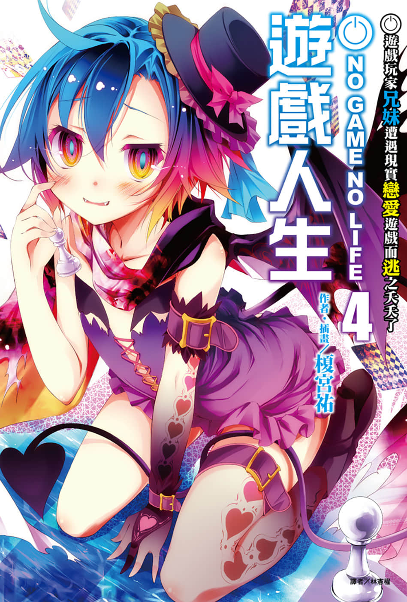
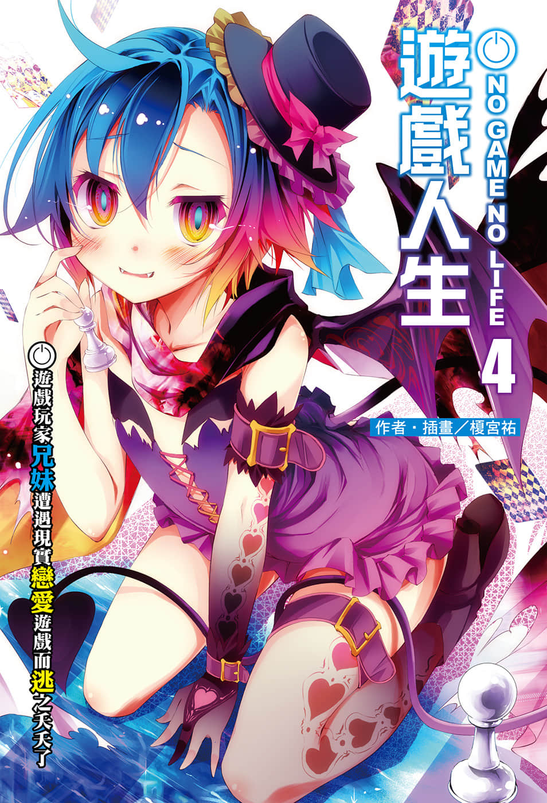
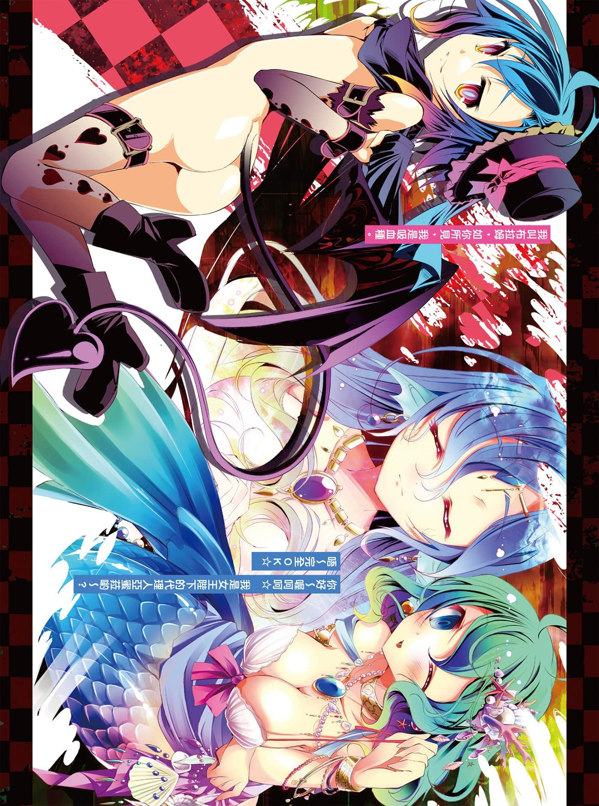
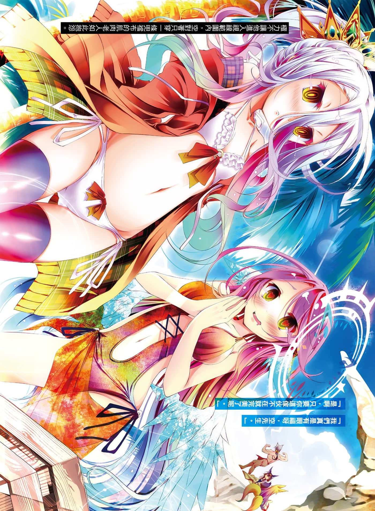
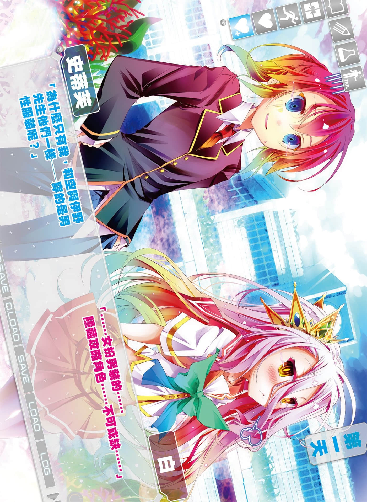
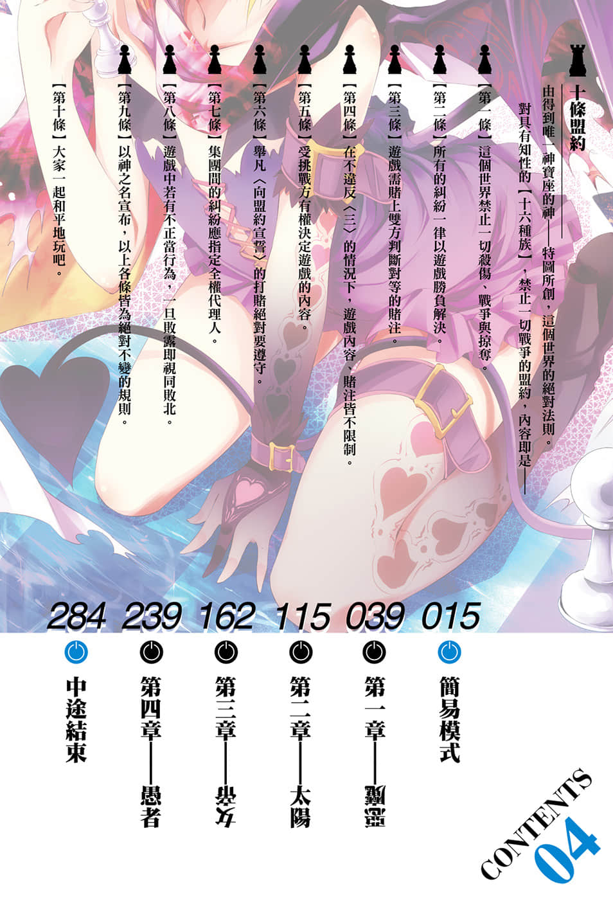

# 插图

> 来源：https://www.linovelib.com/novel/9/118064.html

台版 转自 深夜读书会

作者：榎宫祐

插画：榎宫祐

译者：林宪权

图源：深夜读书会

录入：深夜读书会

深夜读书会：ritdon.com

仅供个人学习交流使用，禁作商业用途

下载后请在24小时内删除，深夜读书会不负担任何责任

请尊重翻译、扫图、录入、校对的辛勤劳动，转载请保留信息

————————————————

【内容简介】

无敌兄妹首尝败绩！？

面对从未征服的游戏，两人将如何扭转劣势！？

在一切都以游戏决定的世界【迪司博德】——面对能够驱使魔法或超能力的众多敌人却连战连胜，至今仍保持不败的最强游戏玩家兄妹『空白』，其实也有『两个』他们仍未能成功全破的游戏……

此时有一位人物前来拜访在东部联合享受悠闲假期的两人，她就是吸血种的少女・布拉姆。空与白虽然拯救了种族的危机，但是她所提出的游戏内容正是两人尚未破关的游戏之一「现实恋爱游戏」——以碧蓝的大海为舞台，恋爱的花朵将要绽放了吗！

这次要走轻松路线，炙手可热的异世界幻想小说，愉快的第四集……？

【作者简介】

榎宫祐

No Music No（略）

【绘者简介】

自从内人作画的漫画版开始后，本来想说反正不是我画，正以为事不关己的时候，没想到漫画用的故事架构必须大幅修正，意外地耗费资源，真的忙到没时间……在那样的情况下要全破极地战嚎3实在太困难了。（焦躁）

榎宫祐

自从内人作画的漫画版开始后，本来想说反正不是我画，正以为事不关己的时候，没想到还被拉去划分镜稿、草图和帮忙赶稿。为了当她的助手，怎么看都没时间……话说回来，胧村正的死狂模式我全破了，追加内容还没要出吗？（认真）

