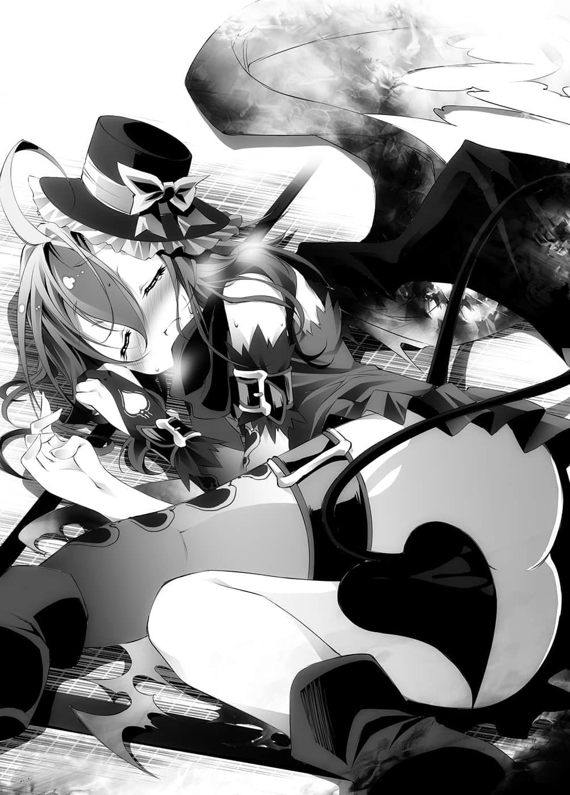
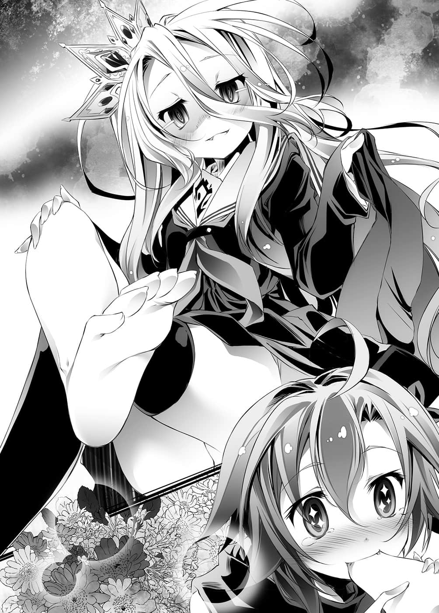

# 简易模式

> 来源：https://www.linovelib.com/novel/9/2066.html

兽人种的国家——东部联合。其首都『巫雁㊟』的郊外。

（编注：原文在第三集时为『巫雁』，但此集有所更改，为尊重原著，统一改为『巫雁』。）

有一座前东部联合驻艾尔奇亚大使——初濑伊纲的宅邸。

类似茶室建筑的一栋木造房屋里，飘散着新制榻榻米薰香的房间内。

在非常适合以草木皆静来形容的寂静暗夜中，只见一道人影晃动着。

「……白，你醒着吗？」

人影自被窝悄悄爬起，对着旁边轻声问道。

……没有回答。

旁边只有安稳的呼吸声传来。

确认了这个事实，人影点了个头，鬼鬼祟祟地开始行动。

尽管匆匆忙忙，他仍屏住气息，不发出一点声响，摸索着枕头边。

然后手一抓到目标中的物品，立刻一声不响地移动至房间角落。

「确认右边没人，左边没人，除了白以外，大家都不在。」

人影口中如此念念有词，操作着手上的东西，只见那个人的面容在黑暗中浮现。

那是一名黑眼黑发，眼窝下还浮现黑眼圈，使得面相显得更加难看的青年。

他是空，十八岁，人类种最后的国家艾尔奇亚，两位国王中的其中一位。

只见那位国王小心地警戒着四周，左手捧着平板电脑，右手拿着面纸盒，轻声细语地宣言道：

「现在——正是我排出累积已久的毒素时刻！！」

——真是个变态。

见到『国王』那种模样，国民大概也会「ＯＨ……」地悲伤哭泣吧。

所以该怎么说呢。

——『让我赐予你不老与强大的黑夜之力吧』。

——『超脱死亡者』、『不死王』、『暗夜的支配者』……

「伊纲也听爷爷说，吸血种大概已经死在路边了吧，得斯。」

这时空「啊」的一声，嘴角不住抽搐。

「咦？是那样吗？也就是说吸血种——没有对方允许就不能吸血吗？」

房间里昏昏暗暗——即便如此，那欠缺存在感的人影仍让人觉得太过不自然。

「咦？奇怪，不都是这样演的吗？」

对于那样的男人，指责他只是个变态，这样合理吗？

——啊啊，没错，女生们啊，你们尽管轻蔑他没关系。

一声悲鸣——却有三个人做出反应。

「……我、我不行了……拜托……请救救我……」

正如她所说，她的声音虚弱嘶哑，简直就快死了，然而——

她从被窝中爬出来，念出她记住的情报：

……这么一来，空也明白为什么她的脸色会如此憔悴了，这时吉普莉尔也点头说道：

如果这条规则适用于空所认知的『吸血鬼』，那也就是说——

一个十八岁处男能够忍耐到今日，只要想到那钢铁般的意志，怎不令人热泪盈眶呢！

「有人胆敢冒犯主人吗？要砍吗？要砍下贼人的脑袋吗！？」

那样高洁的志气——不是『爱』是什么呢？

吉普莉尔笑容可掬地断言道：

「通常那样是有百害而无一利。」

看到她痛骂一名奄奄一息的少女，就连空也不禁感到可怕。

就在各拥不同意图的三道声音响起之中——

不过，这么一来，空反而感到疑惑了。

年纪还小的妹妹就不用说了。

「哎呀——」

无法使用这种口号劝说，只是个带有疾病的种族。

「想骂我变态的人尽管骂吧，我已经濒临极限——不对，这是崇高的行为啊！！」

听到背后传来的声音，空发出有如女孩子般的悲鸣，吓得跌在榻榻米上。

虽然空也想设法救她……

「然而……十条盟约……」

「会吸血鬼化吗……这倒是没什么稀奇。」

当空指着某个方向这么大叫时，全员好像终于发现了异状一般，视线往他所指的方向集中。

然后白又继续说道：

那已经足以称之为——『爱』了，不是吗？

原来如此，那么对于他们尚未灭绝而感到惊讶，也是当然的反应吧。

在指尖点起魔法光源照亮房间的吉普莉尔，不愉快地歪起了嘴唇。

他为了保护周围众多的少女而克制自己的冲动——

不过伊纲轻巧无声地从天花板上跳了下来，她也歪着头感到疑惑。

只见有个人影，仿佛融入暗夜一般，静静地坐在那里。

那已经足以令人肃然起敬了不是吗？

——『十条盟约』。

「唔……还有其他人在不是吗，得斯？伊纲也要一起睡，得斯。」

「话～～说你是谁啊！竟敢偷窥他人贤者般的行为！」

在虚空中现身，头上浮现抽象光环的天翼种少女——吉普莉尔。

「吸血种是从血液或体液吸取『灵魂』，将吸取的灵魂和自己的灵魂混合，借此促使自己成长——增强自己的力量，而被咬到的人也会产生灵魂的混合——感染上『特殊疾病』。」

「……怎么有那么无可救药的吸血鬼。」

虽说以人类而言，她看起来就像是十五、六岁的少女，不过原来那就是『吸血鬼』。

空倒在榻榻米上，一边重新穿好裤子，一边受不了地大叫：

听她这么一说，空等人再次将视线移向那个『人影』。

「吸、吸血种？」

「另外容我再补充一点，主人，被吸血种咬到的话——」

奄奄一息的少女，无言地肯定了空的这个答案。

其中一条——『这个世界禁止一切杀伤、战争与掠夺』。

但是，请先等一下。

然后就在他连拉链也拉上的时候——

「拜……拜托你……我、我快死了……给我『灵魂』……」

她的模样就和空与白所知道的一样，完全是出现在一般创作故事中的吸血鬼造型。

——他们为什么还没灭绝呢？

「……咦？」

话虽如此，但是看着她在眼前死去，良心也非常过意不去。

也就是说，他们是本来应该已经灭亡的种族——？

也就是说——

从天花板里侧探出头，一头黑发带着兽耳的兽人种女童——初濑伊纲。

怀着如此悲壮的觉悟，他——空将手伸至裤裆——

「这个世界没有『隐私权』的概念吗！？我遭受严重的侵害了吧！！」

那是唯一神特图所制定，在『这个世界迪司博德』绝对奉行的盟约。

他——空在那一连串激烈的战斗中，与无数的女性——不仅限于人类，还有天翼种、森精种、兽人种——有过好几次的接触，她们在游戏中或洗澡时也曾数度裸露肌肤，但是每一次空都只能转过头，一个人玩沙。而平板电脑和智慧型手机里，所记录的那世外桃源残渣的动画，却因为妹妹总是陪伴身边，至今他一次也没看过……

「……嗄？不，没有那种事。」

——她憔悴的脸色，衰弱无比的声音，将恐怖的印象全然抵销了。

看到空有所困惑，白出言相助。

正如无数的异名所示，他们是受人畏惧的种族——不过，就这名少女的情况来说……

可是各位男生们，你们应该能够体会吧！

听了都快忍不住为他们落泪了，空转身面对『吸血种』少女，感叹地如此说道。

「吉、吉普莉尔言词还是这么辛辣呢。」

「真可惜——」吉普莉尔语带讥讽地接着笑说：

「……【十六种族】……位阶序列『十二位』……『吸血种』……」

「我还以为谁有那么大的本领呢，能够接近主人还不被我发现——原来是『吸血种』啊。」

「……吸取其他【十六种族】的血——灵魂……得以延续生命的……种族。」

应该没有……吧？

一头蓝色短发，灿烂地闪烁着妖异光辉的紫色瞳眸，白色的牙齿，背上有着宛如蝙蝠般的小翅膀。

爬起来不再装睡，一头纯白长发，冷冷地睁着红色眼眸的妹妹——白。

少女有如乞求一般，气息紊乱地以虚弱的声音，向正在沉思的空求救。

他在如此短暂的时间里，登上被逼至穷途末路的人类种的王座，与妹妹一同经历无数死斗——制伏能够利用魔法、异能作弊的其他种族，夺回人类种的国土，如今甚至发展至并吞世界第三大国的地步。

袭击对手、张口咬人——伤害对方、夺取血液的种族就会——

「……哥……要做就安静做……」

但是伊纲却只是用字遣词不当而已，她并没有恶意。

「我还以为你们终于有效活用那样的才能，却已经无声无息地灭亡了呢，真是遗憾之至。」

吉普莉尔的尖酸言词，纯粹是她毫不留情的真心话。

「那、那个……不、不好意思……」

「呀啊啊啊啊啊啊啊啊啊啊啊啊啊啊啊啊啊啊啊啊啊啊啊啊！」

他与妹妹一起，被从异世界召唤至这个『一切以游戏决定的世界迪司博德』，至今已有两个多月。

……有人能反对吗——不，没有！

他一直无处发泄啊——！

如此一来，除了想成为吸血鬼的家伙以外，是不可能同意让他们吸血的——

在光线照耀下终于现出身影的，是一身黑色装扮，仿佛将黑夜穿在身上的少女。

「……不，都听说提供灵魂会染上『疾病』了，鬼才会答应呢，你是白痴吗？去死吧。」

「你们还是老样子，在隐密幻惑——在偷偷摸摸、逃避躲藏方面，拥有耀眼的才能呢……」

但是会变成一个有病的处男，那可就有点难以答应了——空烦恼地搔着头，然而——

「啊，主人，是我没有说明清楚，只要没被咬到的话就不会『生病』。」

——嗯？

「虽然不透过啃咬，从牙齿吸血产生『灵魂混合』，吸血种就无法成长；不过如果只是要维持生命——『直接经由口服摄取』对方的体液，也足以应急了。」

「……意思是？」

「仅次于血液，『灵魂』浓度高，又不经啃咬就能摄取的体液，那也就是——」

——听到吉普莉尔接下来说出的词语，空所采取的行动是——

「精液——

「小姐你没事吧！！我马上救你，绝不会让你死掉！！」

在场全员——白自然不用提。

就连兽人种、天翼种的眼力——最多也只能捕捉到他的残像。

——态度转变之快，就连用一瞬也不足以形容。

空抱着吸血种的少女移动到房间角落，小心翼翼地让她躺在房间角落——

他深深地点头认同。

「原来如此，你不是『吸血鬼』，而是『淫魔』啊！」

那当然不会灭亡吧。

谁会让那样的种族灭亡啊——！

空在内心发出这样的呐喊，并且着手准备解开裤腰带，然而……

「……精液是什么，得斯？」

「……哥……十八禁剧情……ＮＧ……」

空的脑子瞬间沸腾，让他毫不犹豫地喊出这个蹦出来的『替代方案』。

吸血种少女仿佛美食漫画中享用着至高料理的角色一般，背景像是开满了花朵似地，一边舔着妹妹的脚，一边美味美味地不停称赞。

「……人工呼吸是……崇高的行为……」

「……是我的错觉吗？总觉得你们是绕着圈子说我们『顽固』、『自我感觉良好』、『性格扭曲』、『孤僻』，而且还是『处男和处女』耶！」

两道视线同时仰望着空，一副口水都快流出来的表情。

将自己的意识置之于圣母峰顶的空，向吉普莉尔这么问道。

（……不是吧，不是那样的吧！！）

「吉、吉普莉尔！你的体液——」

「那当然是因为像主人们这样——拥有强韧、强烈，极为稀少，独特又高洁的灵魂之人，就算找遍这个世界也不多见的关系吧。」

然而空却疲惫地回应她们俩的视线。

白已慢慢地脱下袜子，将脚伸至吸血种少女的眼前。

「——————对、对了～～！还有『汗』呀啊啊！！」

她令人不寒而栗的毒舌，令空也不禁有些害怕，不过吉普莉尔仍继续说道：

————…………

「——咦？为什么？」

既不是十八禁，也很健全吧，而且是货真价实的救命行为。

空急忙全力运转脑细胞，想要加以反驳，不过——

应该绞尽脑汁，跨越重重阻碍的那个时刻——不就是现在吗！！

——露出不愧于女王之名的嗜虐笑容。

「……白，请你想像穿着衣服在河中溺水的人吧。」

但她却趴在地上，对序列第十六位的少女的——脚的味道赞不绝口。

然后就这样好似迫不及待地扑过去，一口含住白的脚——

毅然决然地迎上妹妹冰冷的眼神。

「妹妹啊，虽然我早就发现你有隐藏的Ｓ属性，但是你这么毫不犹豫，哥哥可是有点受到打击哦……」

就这样，白朝躺在哥哥脚下的吸血种少女走去。

「我想应该没有问题才是，虽然灵魂含量少了许多，不过要用来救命应该是足够的吧？」

（——不对，女孩子间的亲吻应该没关系吧？）

「………………不是……」

空慌忙地制止，白却是冷眼地抓着他的语病反驳。

——空如此回忆往事之后。

看起来似乎感到很无聊的伊纲，半睁着双眼的白，以及——

「等、等一下，白！那样……有点不对啊！哥哥可不认同喔！」

不论何时，你都是靠着这副头脑，对抗着各种困难而活了下来的啊！

……众人冷眼注视着这幅光景，心里想着：

——我即是反抗者Rebellion！

对于吉普莉尔的评论，原本只是在一旁观看的伊纲也用力地点头赞同。

不过，另一方面，几乎已经化成尸骸的吸血种少女突然动了一下。

「我说啊，在场没有正常人了吗？」

——完美无缺的理论就此完成！

人类种的女王『白』。

「……嗯、那让白来……」

她用鼻子嗅了几下，突然睁大双眼跳了起来。

顺便一提，其实空——对于百合也不排斥，但是……

——这是为什么？

——【十六种族】位阶序列第十二位的『吸血种』。

「没没没、没有其他办法了啊！只能试试看了吧！」

未满十八岁的两名孩童的视线看了过来，这也就是说……

「这样健全吗……？」

「…………空，空……我可以咬一口看看吗，得斯？」

空没有深思就做下这个结论，然后急忙朝四周张望。

「怎么会呢——那不就代表您拥有『未知的灵魂』吗？没有比这更伟大的事了吧……老实说，我也想尝尝看味道呢，呼嘿嘿～」

白说着用指尖撩起秀发，脸庞朝少女靠了过去——

一瞬间脑中浮现这个疑问，不过空马上摇了摇头。

「欸……不过如果是主人们的灵魂，那应该是很美味吧？」

「……吉普莉尔啊，吸血种是变态吗？」

而吉普莉尔稍微思考了一下，随即露出怜悯可怜种族的笑容。

「对吧，那是为什么呢？因为那是助人，是救助人命，是崇高的行为啊！！」

然后将自己的脸靠近少女的脸——

空脸颊抽动，垂头丧气地坐倒在地。

空仰望天空，眼泪都快飙出来了。

——这确实不是十八禁。

「主人的命令我不敢不从——能够自由吸血的蚊子，都还比他们强上数分，即便是要亲吻那种可悲的缺陷生物——不过如果您希望救她性命的话，那我并不建议这么做。」

虽说排名远在第六位的天翼种与第七位的森精种之下，却是在第十四位兽人种之上的种族。

伊纲还年幼，白也不行，这时候史蒂芙不在真是令人懊悔——

空紧紧地一咬牙。

「汗、汗水也是『体液』喔！怎样！吉普莉尔！？」

「……那还是……让白来……」

「我给予她体液的话，她极有可能会蒸发，因为『灵魂』的质量和浓度都差太多了。」

就在空采取行动之前——

（——总觉得不想看到白做那种事。）

「……趴在地上……舔吧。」

「实行适当的人工呼吸，脱下夺去对方体温已湿透的衣服，为那个人取暖……那样是十八禁吗？」

「……哥有资格说……那种话吗？」

白轻轻的一句话，马上就让完美无缺的理论（笑）结束了不到一秒的寿命，空不由得僵在原地。

十八岁处男的空啊，你难道又要像往常一样，在这里伫足不前了吗？

「……又来了，又是这样啊。」

「——这、这是什么！好美味，太美味了！」

「……如果体液就可以的话……那『唾液』也可以吗……？」

「……空与白的灵魂……没有受污染的味道，我并不讨厌，得斯。」

这位天翼种大人就是这么……凡事都超出规格呢！

「……这就很难说了，汗水中含有的灵魂量微乎其微……」

空夸张地点头认同自己，以清澈无比的真挚眼神，看着躺在房间角落的少女——她似乎真的憔悴衰弱，连话也说不出来的样子。

「是啊，对我们人类而言，确实会觉得那样不合常理，不过这无疑是救助人命，是崇高的行为！因此哥哥只好不得已地抛弃羞耻心，委身配合其他种族的文化，救助对方的性命！！所以可以请你向后转吗～～！？」

——『脸红心跳的事件』宣告强制结束。

「……嗯。」

背对着无数的世外桃源，一个人玩沙——难道今后都要一直这样下去了吗？

但是却又感觉好像有什么地方非常地不对劲。

「不行！舌吻对于小孩子的教育不好！否决！！」

——有常识的人们史蒂芙们不在的伊纲家中，静静响起了白的吐槽。

——高高在上，【十六种族】位阶序列第六位的大人。

恢复气力，肌肤似乎变得更光亮的吸血种少女说道：

「呼……实在非常美味……感谢招待。」

「……呜呜……湿湿的……要洗掉才行……呜呜……洗澡好麻烦……」

与双手合掌，露出恍惚表情的少女形成对比，白似乎颇感后悔——不过，这先姑且不论。

终于可以向她问问题了，空看着那名少女。

「——搞了半天你到底是谁呢？」

「啊，是我太晚自我介绍了，我名叫『布拉姆』，正如您所见，我是吸血种。」

抬头挺胸，正襟危坐，少女——布拉姆以一脸严肃的表情继续说道：

「我今天来是、呃……有事情想拜托您。」

只见她吞吞吐吐地取出像是小抄的东西。

嗯哼一声，清了清喉咙。

然后缓缓地三指并拢鞠躬，以仿佛在念剧本似的笨拙口吻说道：

「初、初次见面就让您见笑了，还请见谅……降伏天翼种与东部联合的人类种，艾尔奇亚的国王，空陛下与白陛下——请救救我们的种族！」

……听到那句话，空似乎全都理解了。

「啊～可以用精液取代血液，要活下去需要对方许可——然后又向我们求救。」

综合这些状况——试着想像一下那样的设定吧。

——如何呢？想像到了吗？

空立即做出判断，他脸上浮现爽朗的笑容……

「那种设定要搬去Ｈ－ＧＡＭＥ别的地方啦，再见，回去的路上要小心喔。」

「怎么这样啊啊啊啊啊请等一下啊啊啊啊啊啊！」

障碍太多了。

---

■ ■ ■

……不过也正因为如此，她深知那样的道路有多么地艰苦。

在这个一切都以游戏决定的世界，理论上是有可能实现的吧。

巫女将饮尽的酒杯放在栏杆上，手指把玩着种族棋子，抬头仰望天空。

那样的自己，曾几何时——竟变得这么保守了呢？『巫女』自嘲地这么想着，将酒倒入杯中。

那是唯一神特图在设定这个世界——『十条盟约』之际，分配给各种族的棋子。

不过——

少女拥有状似狐狸的兽耳与长发，以及两条同是金黄色的尾巴。

唯有【十六种族】的各全权代理者才能使其显现，闪闪发光，仿佛用光辉编织而成的棋子。

「算了，我就再观察看看吧——呵呵呵。」

如今『他们』却自信满满地，谈论那个已经结束的梦想的后续——甚至是比后续更遥远的将来——那个自己已经放弃的全新故事。

念出『十条盟约』的第十条，巫女将酒杯一口饮尽。

所谓的多民族国那个家，单单是出身、思想、文化不同，就会产生无数的问题。

想到打算跨越种族，联合种族的棋子，挑战唯一神的那两个人，她的嘴角微扬。

如果有可能办到的话，那么在那个同时就已经……

提出那个荒唐无稽梦想的『棋子』，是否真的能够跳脱『棋盘』呢？

「大家一起和平地玩吧……是吗？」

在自己神社的中庭里，站在跨越池塘的红色小桥上，隔着栏杆眺望映在水面的月亮——她心里想着。

「对远处的花朵看得出神，可是会被脚下的石头绊倒喔。」

——过去曾经试图挑战，然后放弃了的梦想。

跨越种族藩篱这种事，即便只有两个种族——人类种和兽人种，就已经是极为困难了。

他们能够达成实现那种状况的条件吗——

分裂成无数部族的兽人种，也曾经持续内乱数千年之久。

空却要跨越种族的隔阂，实现那样的概念，那无疑是荒唐无稽的尝试。

她是东部联合——兽人种的全权代理者——『巫女』。

但是谈论梦想——需要资格。

——超越种族的携手作战。

『巫女』举掌伸向天空，只见她的手掌光辉耀眼——『兽人种的棋子』随之出现。

——过去，自己高揭统一兽人种的梦想，并且达成这项伟业。

「……交给那些人真的好吗？」

——想到那棋子真正的意义。

而『巫女』赌上一切——甚至连自己的本名都忘记，最后才终于统合成东部联合。

——内心盼望着『那一刻』将在不久之后到来。

要对他们公开所有的手牌……也要先等确认过他们有资格之后，再做不迟。

不过那终究只是在理论上罢了。

……不由分说地一口拒绝了这个十八禁种族。

而那即是——『多种族国家』。

空所提出的为了『将这个世界破关』的远大计划。

只是要做梦的话，任谁都办得到。

就连身为同一个种族，想要他们为了同一个目的统一起来，都难如登天。

巫女讽刺地嘲笑那个过去让自己放弃梦想的存在。

更何况是多达十六种族的多种族国家——以寻常的手段绝不可能达成。
