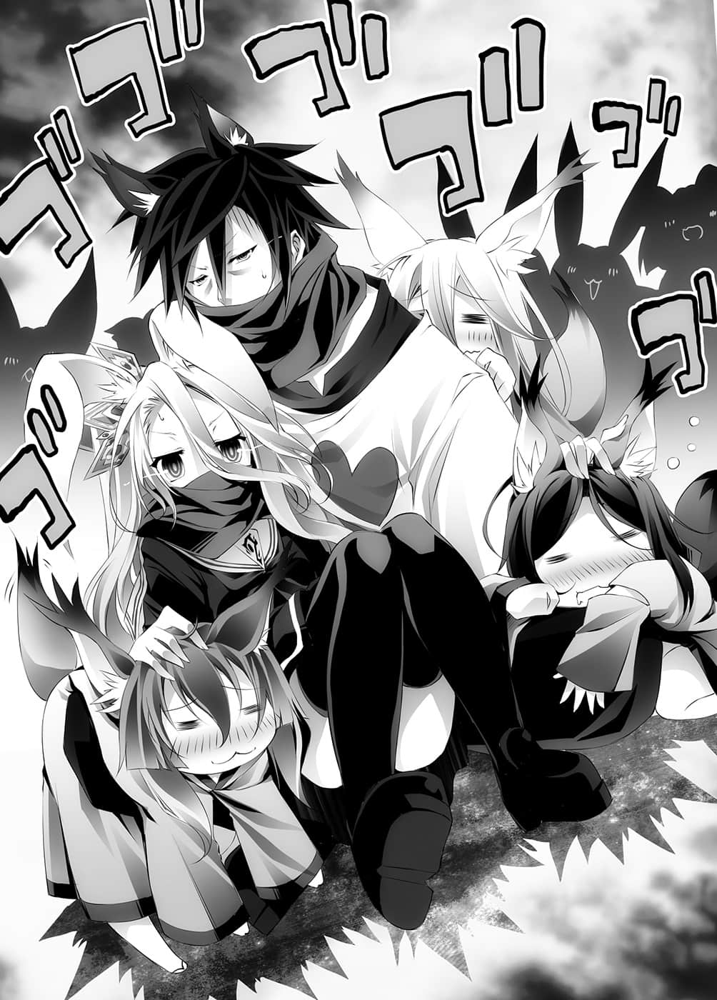
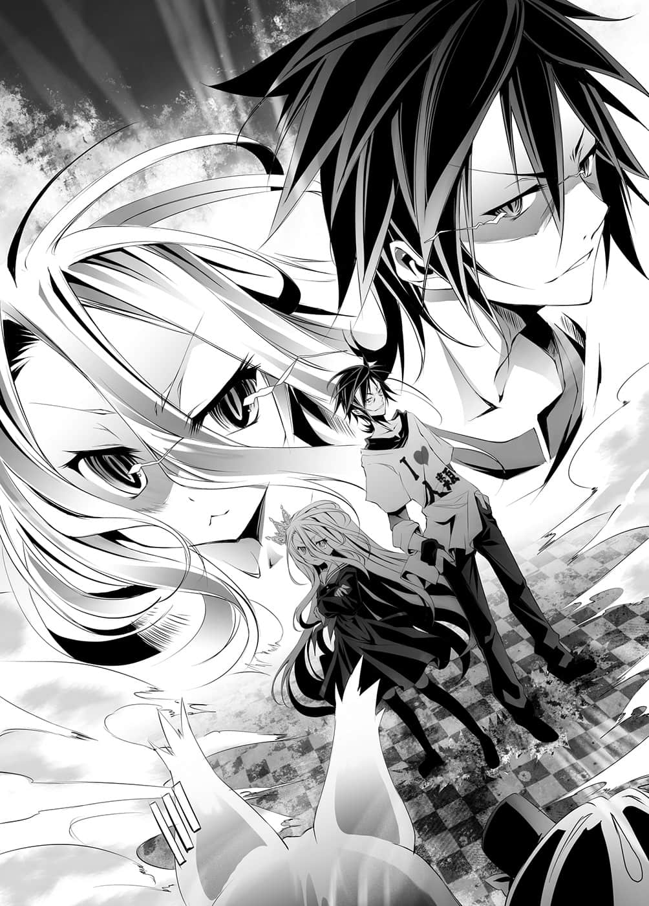

# 第一章 恶魔

> 来源：https://www.linovelib.com/novel/9/2067.html

艾尔奇亚王国。

那是位于露西亚大陆西部，【十六种族】序列第十六位，人类种最后的国家。

经过半个月前与东部联合的一战游戏，『国王』——空与白赢得胜利，收复了一倍的国土。

……然后这个国家的烦恼也增加了一倍。

最大的烦恼有二。

一是『国王』——空等人所提出与东部联合建立『联邦』的构想。

建构跨越种族藩篱的国家——这是前所未闻的一大难题。

即使收复过去一部分的国土，艾尔奇亚也欠缺活用那些土地的技术。

另一方的东部联合即使失去大陆领土，国力却仍是世界屈指可数的大国。

——国力、通货、社会制度固然不说，种族和语言也相异的国家，却要平等地统合起来。

那是多么困难的一件事，相信应该不需多作说明。

那是人类史上首次的不可能任务。

而第二个烦恼则是——

「真是的——」

瞪着摊在自己手上的手牌，红发少女叹了一口气。

史蒂芬妮・多拉。

通称史蒂芙。

她是前王族——充满与前任国王孙女身份相衬的气质，即便是在睡眠不足与严重疲劳之下，那张面容仍美丽依旧——然而现在却怒容满面，散发出危险的气息。

原因就出于『第二个烦恼』。

也就是——

除了加入鬼牌规则之外，只是毫无特别之处的扑克。

空与白不在，代理执掌国政的是『愚王的孙女史蒂芙』……放出这样的风声。

结果——史蒂芙已经有半个月没有好好睡过觉，被迫不断与他们进行游戏。

只要有心、有能力，领地交给他们管理也无不可——这是史蒂芙的想法。

实行自由经济的那一天，艾尔奇亚的产业大概会毁灭殆尽吧。

即便不愿也必须交给别人管理，成功的话当然就会产生利益。

伊野以有如演戏般的语调继续说道：

史蒂芙接着说「你就执笔出版它如何？」，听到她这么说，伊野苦笑着改变了话题。

不过，只要想到这个陷阱能够这么顺利发挥功能的理由与频繁度——

——在这种时候，为了增加自己的利益，各个权力者群聚而来也是必然的结果。

然后选择『不跟』——这意味着他们全面接受史蒂芙的提案。

伊野出自真心的夸奖，却被她一口否决，史蒂芙皱起眉头。

再怎么腐败，他们也是统治者，拥有优越的领地经营和管理知识。

「……你们既然可以接受我的提案，那么一开始就别让我浪费这些工夫好吗！？」

就算说这一点攸关艾尔奇亚的命运也不为过。

史蒂芙不愉快地走在艾尔奇亚城的走廊上，身后的伊野苦笑着说道。

艾尔奇亚一口气倍增的领土，应该由谁，又要如何活用管理呢——

响彻整间会议室的怒吼，震撼了在场所有的人。

狗一般的耳朵与尾巴微微下垂，即便隔着和服，仍看得出其健壮的体格，他是兽人种——初濑伊野。

（比赛游戏这件事是很好啦……没错。）

她将手牌一丢，摊开在桌上，手牌是……

因为疲劳而浮现深深黑眼圈，以及那张愤怒扭曲的容颜，简直像是——……

——前王家，多拉家之主的史蒂芙，她的爵位当然是——『公爵』。

——应该说非那样做不可，所以这其实还好。

见到史蒂芙自暴自弃的笑容，伊野耸了耸肩。

追根究底，那些是前任国王——史蒂芙的祖父输掉，才被夺走的诸侯领土。

处理不好就会发生权力斗争——一旦煽动暴乱，就会给予他们干涉国政的借口。

史蒂芙内心如此嘀咕，因为——那正是一个陷阱。

「是的，因为这是正式场合，所以我判断应该那样称呼比较好，有什么问题吗？」

「好了好了，多拉公……多亏这样，一切才能如此顺利进行，这也是事实呀，我们反而应该欢迎那些愚昧之人的藐视——笑着利用他们不就好了？」

因为这个原因，艾尔奇亚的诸侯们，络绎不绝地找上如今甚至掌管立法权的史蒂芙比赛游戏，想要让自己的要求通过。

以现状来说，所谓平等的『多种族国家』只是画饼充饥。

这个时候——

「不想负责任！失去利益就嚷着是『国王』的错！一旦空和白收了回来，就要求分给自己——这些贵族到底是何时舍去羞耻心的呀！？」

然而——史蒂芙大声地咋舌，踢翻椅子站了起来。

……淑女的气质都跑到哪里去了。

「唉……你说的没错……」

然而史蒂芙却是一脸疲惫地继续说道：

——在艾尔奇亚主导下，与东部联合建构『联邦』。

「多拉公……？咦？是在叫我吗？」

「英雄故事的女主角其实只是个跑腿，这个富有讽刺的剧情很不错呢。」

「……多拉公，我明白你的心情，但是一个淑女口出『混蛋』可不是好事喔？」

他是前东部联合驻艾尔奇亚大使——初濑伊纲的祖父，目前不在的艾尔奇亚国王——空与白把麻烦问题硬塞给他……是继史蒂芙之后的另一名被害人。

史蒂芙迟了半拍才反应过来，伊野点点头。

因此该如何分配东部联合所要求的『大陆资源』。

就算制度再怎么配合，国力的差距却无法弥补。

——那是谁啊？

「恕我失礼，那样一来我也会变成相同的称呼啊……话说多拉公，你还是把注意力放在眼前的事情上比较好吧？」

---

■ ■ ■

「这么重要的时候那两个混蛋国王到底要混到何时才回来啊～～！！」

「可是空先生和白小姐不在，史蒂芬妮小姐实质上就是王权代理人——如果是宰相的话，那么你不就是当下艾尔奇亚身份最高贵的人了吗？」

不过史蒂芙并没有理会他们，转身就走。

然后就会出现视这个情况为绝佳机会，为了追求利益而前来挑战的人，让他们宣誓输了就得答应史蒂芙的折衷方案，并且『失去游戏中所有的记忆』，再平淡地将他们——『一网打尽』。

「『全额加注』——请你们快点脱光衣服回去好吗？」

这样一来，史蒂芙所实施的政策与利益折衷方案，就能够在毫无抵抗的情况下顺利进行。

他的脸上仿佛与史蒂芙同调一般，充满了苦涩的神情。

开口规劝的是侍立在史蒂芙身旁——一道白色身影、迈入老年的男人。

这是非常有效，且具有伊野风格——由多部族所组成的东部联合风格的陷阱。

「不过这半个月来，竟然一次也没输过，史蒂芬妮小姐也很了不起啊。」

「我还以为是在叫谁呢，请称呼我为『两位外出国王的跑腿小姐』吧。」

史蒂芙愣愣地仰望天花板。

告诉自己现在——正在进行重大的游戏。

那张脸让人联想到他们所畏惧的『国王』，诸侯们互相看了看彼此。

「贵族制这种制度，一旦持续久了不都是这样吗？」

——艾尔奇亚王城的大会议室里。

问题在于，贵族们会搬出『原本那是谁的领地』的主张。

有力的诸侯们纷纷抢食这份巨大的利益。

「——伊野先生，可以请你不要用那种称呼吗——叫我史蒂芙就可以了。」

游戏本身并没有什么特别，只是普通的扑克。

如果没盖牌的话，就会如同她所宣告的一样——全员一起破灭，看到这副牌，诸侯们顿时面无血色。

「不是全赢就是全输全得或全失！请你们先做好破灭的觉悟后再来好吗！？」

——说穿了就是『利益纠纷』。

「像那样前来抗议的贵族们——每一个脸上都写着『我只想要好处，麻烦的事别找我』啊……！！」

「——人类种所剩下最后的国家，身为艾尔奇亚的宰相，又是前国王孙女的多拉公爵。在艾尔奇亚王国主导之下，与东部联合合并，创建多种族国家，她被交付这个史上首见的大计划，一个年轻貌美的才女……！这样的称号如何呢？」

没错……除了这个『频繁度』之外。

然后初濑伊野接替史蒂芙，笑容可掬地对他们说道：

「那是对手太弱了啦。」

「那么正如先前【向盟约宣誓】——我要消除你们的记忆，不好意思啰。」

「他们到底有多瞧不起我啊！好像根本就把我当成一个笨蛋嘛！」

——可以看得出那些人有多么瞧不起自己以及祖父。

问题是——

被擅自用来当作筹码，他们当然会有异议，当然会不服吧。

不是因为他们是贵族所以不行。

想出一条计策的人，就是在史蒂芙身后，露出阴险笑容的——初濑伊野。

追着伊野的视线看去，史蒂芙想起现在的状况——然后在心中告诉自己：

「那样不是很好吗……很好应付呀。」

不过——如果是那样的话，为什么当时不用游戏向先王这么主张呢？

——五条(Five of a kind）。

「我只不过是个跑腿的，用那样的称呼，听起来不就好像是哪个身份尊贵之人了吗……」

——而且偏偏那样的人，都是无法忽视的有力诸侯。

一切都按照预定进行得非常顺利——

适当地经营收复的领土，对艾尔奇亚的——联邦的国家利益做出贡献。

「那些人尽是使用一些愚不可及的粗糙出千术，如果对手是空或白，一定会被他们极尽嘲讽之后，再加以利用吧——根本不值一提。」

「这个嘛，确实是那样没错……」

不过——伊野一个人思考着。

最初史蒂芙固然是受到伊野以兽人种的五感辅助。

然而随着史蒂芙不断连胜——如今伊野只是陪侍在旁而已。

虽然这个少女非常看轻自己的实力……但其实她的实力已经——十分高强了。

比较对象是『那两个人空白』的话……那单纯只是对手太强了。

普通的人类种，能够胜过她的人已经寥寥无几了吧。

对于伊野这样的感想，史蒂芙毫不知情，仍是继续抱怨。

「而且他们完全没发现我出千，诸侯们的目的该不会单纯是想让我睡眠不足而过劳死吧！？」

「……史蒂芬妮小姐，你好像和空先生他们愈来愈像了呢。」

——『哒』的一声。

史蒂芙往地上一踏，停下了脚步。

「——你刚才说什么？」

她身体不动地转过头，仿佛都能听到她骨骼鸣响的声音。

「你说我——和在东部联合游玩的放荡王很像！？」

「请、请你冷静一点！我是说游戏的手法很像啊！」

——史蒂芙所采行的胜利方式。

从使用计算的正攻法开始，藏牌、换牌、洗牌技巧。

看穿、反过来利用对手出千术的迂回方式，甚至是虚张声势、心理战等等。

她无法隐藏胸中的喜悦，一股复杂的感情随之萌生——

自己所见到的『空』——

不过最大的问题是……巫女夹杂着苦笑，叹了一口气。

她是兽人种的全权代理者——『巫女』。

身体呈大字型躺在地上，眺望着天花板……然后她蓦然发现。

「啊啊，对喔，说起来联邦制就是贵族在碍事，所以才会那么辛苦啊。」

史蒂芙扑上前去，脸却撞上柱子，她流着鼻血发出奇特的哀嚎声。

——或许是那样没错。

——空就在那里。

相当于艾尔奇亚的『王城』，兽人种的全权代理者所居住的『巫社』。

理解到这一点，史蒂芙只是沉痛地说了一句：

「……该怎么说呢，虽然我有很多话想说……」

————竟然被那样的杂鱼们瞧不起。

伊野一边扶起瘫在地上的史蒂芙，一边继续说道。

不过，他们的行动——总是为了艾尔奇亚而发挥作用。

无人知道其本名，拥有两条尾巴的金色狐狸。

在中央大楼的中庭。

你到底跑去哪里闲晃了？

但是因为睡眠不足，再加上对两人迟迟没有要回来而感到火大，而夺走了史蒂芙那份紧张感，于是史蒂芙在不知不觉中——开始感觉自己是在和空与白进行游戏。

败得如此彻底，甚至让人感到痛快。

「……………………我已经不行了吧。」

比起艾尔奇亚，东部联合对于大陆资源的重要性更是了若指掌，这是再明白不过的事。

空嘻皮笑脸地回答：

面对露出无奈笑容的巫女，空继续说道。

既然言明『顾及两国利益』，那就不能单方面地对东部联合有利。

可是她却好似没听见一般……仿佛见到了看不见的东西。

那么在考虑到两国的国力差距之下，又要设定成符合双方利益，能够做到这种事的只有东部联合的全权代理者——也就是『巫女』，没有比她更合适的人选了。

「什么呀？啊，好了，又是我们赢了。」

而第二个理由就是在同样条件下，自己仍输给他们——

巫女撑着脸颊露出苦笑，而空则是开口提出要求。

只见史蒂芙露出兴奋灿烂的眼神，开心地当场一个转身——

是映在擦得光亮的大理石柱上的——『自己的脸』。

他们在极短的时间里，找出最大效率的战略和无数的布局——甚至还摸索出出千技巧。

史蒂芙又哭又笑地大声喊叫，用额头撞击墙壁。

创建联邦虽是由艾尔奇亚主导——然而当然只靠艾尔奇亚是不行的。

空与白的行动总是超脱常轨。

「不过他们滞留在东部联合，应该是为了与巫女大人进行调停……吧？」

他们是艾尔奇亚的国王——人类种的全权代理者，空与白。

只不过交谈了几次，就赢过已经玩了这个游戏五十年以上的自己。

「啊——啊……！」

所以应该可以相信他们——可是——

「啊。」

然而对方实在太弱了，那样的杂鱼，自己竟有一瞬间将他们想成是空与白，史蒂芙对那样的自己感到不耐。

突然间，史蒂芙就像豁然开朗似地，表情为之一变。

「史、史蒂芬妮小姐？」

「空、空！你回来了吗——咿呀！？」

虽然无数的感情涌上心头，不过空在那里的事实，更令她因喜悦而红了脸。

——他们一边抚摸着复数的兽人种少女，一边问出「爱是什么」这种不正经的问题。

——即便是凭藉巫女的五感也看不出丝毫破绽。

---

■ ■ ■

这些手法全都是——挑战空与白，经过一次又一次的失败才学会的。

认真地这么提问的人，是一名黑发黑眼，身穿『Ｉ❤人类』上衣的青年，以及坐在他膝上，白发赤眼的少女。

确实，他们的行动总是『结果与自己的欲望一致』而已，这也是事实。

「……简单地说，你们又要把工作全都丢给我了是吧……」

他竭尽全力，努力地想要以正面的思考，来看待让人无法理解的兄妹。

「你们到底是如何在不被我发现的情况下出千的？可以告诉我吗？」

——————这个事实更令她——难以忍受————

——自己和祖父。

——然后崩毁了。

本来那里应该是禁止非相关人等进入的地方，但是在神圣的池塘旁却聚集了一群人。

看到她判若两人的转变，伊野不安地叫了她一声。

「第一，请你在顾及两国的利益之下，依照进出口的不同品项，客观地制作出税率表。」

「史、史蒂芬妮小姐请振作一点！那样是肃清——是恐怖政治啊！！」

「我想他们在那边——一定也正逐步进行着『高峰会议』。」

而人群的真相，就是被两人抚摸得发出娇艳叫声的数名兽人种——兽耳女孩们，以及一脸羡慕神色，大排长龙等待着的兽耳女孩们。

确实，最初史蒂芙也害怕如果自己输掉，会使联邦的实现变得更加遥远，因为这样的紧张感——让她在游戏中仍意识到，这种时候如果是空和白会怎么做。

一个让人忍不住联想到日本庭园，充满绿意盎然的自然景致与红黑涂漆的空间。

把筹备的事全部丢给我，自己一个人去逍遥玩乐。

「……反正这个时候，他们一定是正在玩赏着兽耳女孩，窝在屋子里沉迷游戏，做着就身为一个人而言已经无药可救的事情。」

忽然间，她感到有什么动静——移动视线一看……只见前方——

「……谁知道呢，那两人的言行总是以公私混淆为前提呀……」

「而且这种事巫女也有做，我们是彼此彼此吧？」

因为两人完全没看对方的牌，只是互相推测彼此手上的牌而已。

三人进行的游戏名叫『陬雀』，是东部联合独特的传统游戏。

「好了，【向盟约宣誓】提出三个要求——没有问题吧？」

「……没问题的，空先生他们、那个、的确是令人难以理解的两个人——」

遥望东部联合的方向，史蒂芙抱怨说道：

还是一样毫无空隙，巫女在内心感到佩服，不过——

……对于这句话，伊野也无法否定。

「竟然说我们出千，真是失礼，不过就是白记住所有盖住的牌，随时追踪位置，而我只是假装洗牌，把白可能想要的牌控制在手上——这不叫出千吧。」

没错，无法指谪他们出千的两个理由中，这是其中之一。

「……我带着两种意思问你们——你们的脑袋到底在想什么呀？」

「……巫女小姐，什么是爱呢？」

以风铃般的声音这么说道的人，是坐在游戏盘对面的少女。

——却轻易地精通了这个数十分钟前才初次见到、听到规则的游戏。

「——伊野先生，不管是贵族、商家还是公会，我们就赢光他们的身家财产，让他们一个不剩地解散下台，全部的事情都只交给政府来运作不就好了吗！？不足的人手就从民间选拔出来，任命为官员，敢贪污的话就让他吐到只剩骨头，扯后腿的那些腐败家伙，就设陷阱把他们全员驱逐出境，这样也能丰富国库，法政的协商也能独断而行，问题不就圆满解决了吗？我真是天才呀！我、我——不是笨蛋……我不是笨蛋啊啊啊啊啊～～～～～～！！」

「……这个游戏……相当……有趣……」

「……告诉我们嘛，巫女小姐……」

这是事实。

——被对方从正面以实力取胜，在得分上被超越……那样也无计可施了吧。

——尽管与『麻将』多少有些共通点，本质上却是完全不同的游戏——

「史蒂芬妮小姐，你就睡吧，不，应该说请你睡吧，算我求你了。」

——换个场景，来到『东部联合』的首都巫雁。

这半个月，空与白确实勤奋地在『工作』。

他们连日造访巫女的住处，进行赌上两国利益的游戏。

……没错，他们工作的效率可圈可点。

他们在所有的游戏中对巫女取得胜利。如果撇除将实务工作全都丢给巫女这一点的话，简直无可挑剔。

「专业的事就交给专业的人，巫女小姐只花半世纪就建立起庞大的国家，我相信你的手段♪」

听到空回答得这么轻松，巫女干笑着搔了搔头发。

合并联合国所组成的联邦制度——

那似乎是参考了空他们原来世界的『美利坚合众国』这个前例，面对无数的障碍必须提出解决、折衷方案，并将摩擦减少至最低限度，而他们则是将这件事完全丢给巫女去解决。

事实上那是正确的做法，空与白虽是超一流的游戏玩家，却不是政治家。

然而巫女的苦笑却是因为别的理由。

截至今日为止，她曾经好几次——企图赢过空与白。

这一次也是打着用他们没见过的游戏应该可以获胜的主意，但是却被漂亮地反击。

除此之外也动了许多手脚，想要有利于东部联合……结果一次也没有骗过或赢过他们。

但是用这种方式制订的政策，却如同空他们所说，是彻底地为达成『两国的利益』而制订，不论是艾尔奇亚还是东部联合，尽管短期内会有所亏损，但以长远眼光来看双方都会有好处——看到记录着那些政策的文件资料，巫女不禁发出叹息。

她没有怨言。

甚至对自己总是想欺骗他们这件事，开始感到罪恶感了。

问题是他们必定附带的第二个要求——

「好了，第二个要求就是一如往常——让我们抚摸巫女小姐！」

「……抚摸……」

——没错，他们每次一定要毫无意义地赌上抚摸巫女的权利，然后才进行游戏。

【十六种族】位阶序列第十五位，比人类种高一阶，比兽人种低一阶的种族。

之所以能够使之成为可能——是靠着『体内精灵的运用』。

「请你以兽人种全权代理者的身份，命令她们在我们主动过去之前，不要来找我们。不然她们在伊纲家门前列队，我会因为视线恐惧症，连门都不敢打开，也没办法说出此行的本来目的。」

「她扬言要持续这个妨碍行为，直到我答应救助吸血种为止。」

「请、请等一下！我只能拜托空陛下你们而已！」

「……嗯？」

「是啊——是攸关艾尔奇亚与东部联合的大事。」

而布拉姆则是抱住空的脚，快要哭出来似地哀求。

「——哼，就是这里！」

人类种应该看不见精灵才是。

然后巫女眯起眼睛，望向最后一人。

这该怎么称呼呢——可以称呼是魅力超凡的按摩师吧。

空更装上猫一般的假耳朵，白则是兔耳，侍立在身后的吉普莉尔不知道为什么，头上也戴着略微垂下的狗耳朵，伊纲则是在她的旁边，眼神像是在等待轮到她一般地，注视着被空与白抚摸的少女们。

「——————！！」

看着双眼发出光芒的空与白扑上来，巫女苦笑一声后想到：

…………讲了这么多，其实要表达的就是……

只见空与白被陌生的兽人种少女们抱住，正在轮流抚摸着她们。

「我再给你一次机会说明，如果你是要和我打架，我也奉陪喔❤」

然而这两人却——

「嗯。」

在白的手抚摸之下，巫女差点就发出娇喘，不过她靠着分散注意力，忍了下来。

「——唔？」

以白色混浊液体代替血液，受到豢养的种族——『吸血种』。

结果便造成这个等待抚摸的兽耳女孩队伍，似乎就是这么一回事。

空开启了话题，并没有再像刚才那样吊儿郎当的样子，他脸上的表情非常认真，就像是遭遇了无法解答的疑难问题似的。

「果然变成像是Ｈ－ＧＡＭＥ的剧情了吧！」

——海栖种。

兽人种靠着强力活用体内精灵，所以才能得到令人惊异的身体性能。

空与白突然停下动作，听了这句话，他们无法置之不理。

……瞬间捕捉被触摸对象的反应，借由抚摸进行『实质上的引导』。

「……然后呢？你们说过今天有『三个』要求对吧……啊。」

其保有量、连接精灵回廊的神经适性——也就是如何处理『外部精灵魔法』就决定了位阶。而身为『十四位』的兽人种，因为适性极低，所以完全无法使用魔法。

「没错，就是和他们有关系，巫女小姐——」

结果就在不经意之间，消除了兽人种慢性的体内精灵紊乱。

「主人，已经够了吧，就用游戏让她赌上头颅，然后击败她，砍下她的头颅吧❤」

——不管是以何种方式接触，都会毫无辩解余地被送至限制级专区。

而白则是朝着她们的背影挥手道别。

只见在她视线的前方，吸血种的少女缩在房间角落，身子不住发抖。

在这个时点，巫女想说的话就已经堆积如山了，不过那些都先不管……

但是付出的代价，就是在体内循环的精灵会不断产生紊乱的特异现象。

空吸了一口气。

「……毛蓬蓬……摸摸……呵呵……」

提到以那一群人组成的国家，到底有什么用意呢……？

拥有能够到达物理极限的身体能力。

「好啊！来了！我们上吧，白！」

但是那要以人的型态实现，不用说也知道，本来在物理上就是不可能的事。

……这个世界所有的生命，体内多少都会有微量的『精灵』。

就算考虑他们是来自异世界的人，引导体内精灵的技巧可是属于高位魔法的领域。

空与白……这两人引导体内精灵的技术——异常高明。

要独力解决这个问题，并非容易之事——

伊纲和巫女所使用的『血坏』就是显著的例子。

「既然你们认真思考了政策本身，给你们摸一摸也无妨……」

只是这样一句话，兽耳女孩们立刻吓得毛发竖立，频频低头鞠躬后，连滚带爬地逃出庭园。

巫女的视线这么问道，空则是大力点头说道：

——他们灭亡那就伤脑筋了。

「——差不多可以说明了吧？当然，我想应该和这个状况有关吧？」

然后缓缓摆动着两条金色尾巴，任由他们抚摸。

——【十六种族】序列十四位的兽人种。

「……今天一定要……让巫女小姐呻吟……」

「——我说巫女小姐，什么是爱呢？」

——巫女似乎有很多话想说的样子。

不过『体内精灵』的操作，则是包括人类在内的每个种族都会在无意识中进行的事。

「请、请听我解释吧！这样下去我们会灭亡的！」

而那样的特异现象，对于身体愈是瘦小的人，影响就愈大。

两人像是要遮住口鼻一般，缠绕着似乎是伊纲之物的布巾。

「这样就好了吧——那么，你要谈的正经事是？」

巫女叹了一口气，望向不断堆高的文件堆。

…………

「——！」

——将时间稍微回溯，来到昨天晚上。

结果就造成兽人种——特别是小孩及女性，慢性的体内精灵紊乱……进而感到不快感。

明明遮住了脸，使用空间转移来到巫社之前，而且只在门前走了几步就变成这种状况——空说着耸了耸肩，露出苦笑。

Ｈ－ＧＡＭＥ设定请到别的地方去，空如此声明，冷漠地拒绝了一切的要求。

被吉普莉尔带着杀气的视线一瞪，布拉姆缩着身子，悲痛地呐喊道。

「你知道东部联合南方的海域——有个叫做『奥仙德』的国家吗？」

「不是——啊，不，也有人变成那样啦……」

因为准确的抚摸，差点就发出娇喘，巫女赌上一口气强行压抑了下来，向两人问道：

「…………这样啊……」

两人眼神相交，确认一件事。

---

■ ■ ■

「对对、对不起……可、可是这边也是关系到种族存亡的大事唷！」

巫女笑容满面——但却浑身散发出一副准备使用『血坏』的模样。

毛色微微泛红，发出了低吼声。

于是巫女正襟危坐地面向空，空说道：

不过为了一听所谓本来的目的，她以锐利的口吻开口说道：

巫女表情不耐地问道，空则是表情严肃地点点头。

他们是具有特殊生态的封闭种族，所以与他国也仅有最低限度的交易。

使体内精灵失控，将身体性能提升至自我毁灭的领域，这是兽人种天生的技能。

首都设于深海，由于只能生存于水中，因此基本上对领土不感兴趣。

「——退下。」

「昨晚我拒绝了那边的吸血种——布拉姆的『请求』，她就在巫雁中到处宣传我和白的抚摸技术。」

「你很烦耶！我可不想跟一个在设定上根本是十八禁的种族扯上关系！请你搞清楚界线！」

「那是邻国，我当然知道，就是海栖种的首都啊。」

——会引来大排长龙也是当然的吧？

「——就是这样，所以关于我的第三个要求……」

「……我就听听你怎么说吧，我先说好，只要我判断话题触及色情，谈话马上就结束喔。」

空不情愿地盘腿席地而坐，语带叹息地这么说道。

白坐在空的腿上，吉普莉尔也跟着端坐在一旁。

伊纲呢——可能是因为疲倦吧，她在空的旁边缩着身子，频频点头打着瞌睡。

「谢——谢谢您！」

布拉姆带着泫然欲泣的表情，不住地向空低头鞠躬。

「呃……请等一下喔……」

只见紫色的瞳眸似乎浮现出某种不规则的图案……

瞬间——

——她们到底是何时采取动作的呢？

刹那之间，吉普莉尔来到布拉姆的面前，伊纲则是绕至她的身后。

两人动作所残留的气流，如今才在室内吹过。

「……欸？」

布拉姆愣愣地惊叫一声，只见吉普莉尔眼神锐利地瞪着她。

「你能够不让我发现而接近主人是很了不起，不过如果你真以为我糊涂了，会让你第二次得逞的话，那我告诉你——别不知天高地厚了，小虫子。」

「爷爷说过，一感觉到吸血种魔法的气息，就要立刻避开对方的『眼睛』，得斯。」

伊纲发出低吼，冰冷的声音中充满了戒心。

这时空诚惶诚恐地，对着紧张戒备的两人说道：

「我、我说啊……因为有『十条盟约』，所以她应该无法造成危害吧？」

「即使无法加害，伪装认知却是有可能的，比如说——」

「那么你最初出现的时候那么疲惫是因为——」

「……哈哈……真的很可笑呢。」

「因为海栖种只要抓住其他种族的男人吃掉就好，吸血种也可二话不说直接吸血，那样就不会有任何问题。然而他们却因为『十条盟约』而受害——这个嘛，也许其他的种族也受害吧——不过受害最深的就属他们了。」

「怎么会有那种天堂啊，我想去！吉普莉尔，我们现在马上出发！」

「吉普莉尔，我想听你说明，吸血种和那个海栖种有什么关系？」

……——唔嗯。

然而吉普莉尔对布拉姆露出怜悯的笑容，继续说道：

不过吉普莉尔摇摇头。

布拉姆频频鞠躬道歉，但是吉普莉尔却——

听到空询问，吉普莉尔静静地低头领命，开始对空说明。

虽然依然充满杀伐气氛，但既然事关生存——

对外是这样的理由。

这时布拉姆露出虚弱的笑容回答道：

空与白一起打从心底发出赞叹。

而第二个特殊性是，他们是只有女性的种族。

空的心情瞬间从顶点跌落谷底，他叹了口气，坐了下来。

伊纲用鼻子嗅了嗅，然后解除警戒，回到空他们的身边。

视线的前方，布拉姆将行李箱翻了过来，似乎在寻找着什么。

「不是的，因为主人说要健全，所以我说得含蓄了，那是性方面的意思。」

对空的回答感到满意，布拉姆继续说了下去。

「目前我们吸血种与海栖种，两个种族正濒临灭亡关头，尽管我们已经想尽办法……却仍无力回天，所以才想仰赖空陛下们的协助。」

吉普莉尔继续说道：

「……是啊。」

「是啊……」

「……需要……『异种族的男性』……」

「我的祖先们大概也没想到——海栖种竟然不理解『十条盟约』造成的后果，甚至对自己面临灭亡危机也毫无自觉吧……哈哈。」

「会被榨到精尽人亡喔，那样也无所谓吗？」

【十六种族】位阶序列第十五位的『海栖种』——简单说就是『人鱼』的种族。

吉普莉尔继续说明：

「吸血种的『隐密与幻惑』——对认知产生作用的魔法适性，有时甚至凌驾于森精种之上，那些行李箱原本就一直在那里……只是无法察觉而已。」

——随着咚咚声响，从虚空中出现了数个行李箱。

他们的生态极为特殊，首先就是——无法长时间离开海中。

「我说啊，不管是『吸血种』也好，『海栖种』也罢，以生物来说缺陷会不会太严重了呢？」

另一方面，布拉姆的表情则像是万念具灰一般。

白开始进行说明。

「被吸血种咬到会得到『疾病』……这个我先前已经说过了。」

「是啊，这是妥当的选择，海栖种属第十五位，位于人类种与兽人种的中间，这代表她们不会使用魔法吧？也难怪擅长幻惑、隐密魔法的吸血种，单方面地打算以她们为饵食。」

…………————啥？

同样都是濒临灭亡的种族，也不愁没有赌注吧。

「这还真是——」

「……这话怎么说？」

因为感觉不出有特别说明的必要，所以空也表示肯定。

——嗯的一声，空与白眯起眼睛注视。

吉普莉尔说着紧握拳头，低下了头，空则是将视线移往身旁。

「……是的，我们吸血种——提出『共生』这个提案……」

也就是说，他们的繁殖方法——

——在她充满不幸的脸上，浮现出增添了几分疲劳的灰暗笑容。

「……呃……？……哥……怎么……回事？」

然后，她说了句「找、找到了」，翻出一张文件——

「不，只是感觉不到行李的数量与重量，并不是说行李消失不见了。」

这时空与白才好似把握了状况，惊讶地睁大了双眼。

「这、这是误会啦！这是对我自己施下的认知伪装！」

「也就是说——你隐藏了行李的『存在』，消除了行李的重量吗？」

「……这个缘故……？」

「我开门见山说了——」

他们与东部联合合并，准备创建联邦——这件事大概已经曝光了吧。不过棋子要如何经手，应该是只存在于空他们与巫女之间的秘密。

或许是突然这么一动，让她更疲倦了吧，只见伊纲缩起身子，打着哈欠回答道。

「……好厉害……」

充满敌意的视线，移向布拉姆的『身旁』。

「不管怎么说，吸血种与海栖种，两者都是不危害他人就无法生存的种族，『十条盟约』也都危害到他们的存续，就在这时候，吸血种把目标锁定在海栖种身上。」

「是啊，真是十分令人感到惊愕的种族呢——我是说『海栖种』。」

空欢天喜地般站了起来，可是吉普莉尔却讶异地回答：

住在较浅的海底，上半身是人，腿部以下则是鱼的尾鳍。

吉普莉尔瞪着空无一物的场所，布拉姆赶紧泪眼汪汪地挥手解释。

「因为行李太多了，所以那个、我只是对行李的存在进行伪装，这样才方便携带……」

「…………嗯。」

「虽然令人很不愉快，没有注意的话我也会疏忽，不过不会再有第二次了。」

这个世界到底要背叛期待和通例到什么地步才甘心呢……

「对、对不起……因为太重了……」

没有理会失落的空，吉普莉尔继续说明：

「……伊纲为什么解除戒备呢？」

因为如此，他们才建设了海底都市『奥仙德』，以广大的海洋为领土。

「结果吸血种大败给海栖种，被迫订下吸血种的男性必须帮助海栖种繁殖，以及这些吸血种的男性除了海栖种之外，不能吸其他种族的血，这种莫名其妙的契约。」

「让人看不见那边有大量的行李箱——之类。」

…………咦？

「嗯哼，呃……听说空陛下们打算征服全部种族。」

「他们采取的战略是，由海栖种提供血液，吸血种则相对地提供魔法，以确保其他种族做为饵食。吸血种从一开始就打算与海栖种建立『联合战线』。」

「……？因为没有闻到说谎的味道，得斯？」

「本来——也就是在『十条盟约』以前，是没问题的。」

——什么？

「——啊～也就是说，我想该不会是……」

——不是往斜上方，而甚至是往直角方向发展。只见吉普莉尔愉快地说道：

或许是白的知识中也没有这个情报吧，白看着吉普莉尔，不禁怀疑自己有没有听错。

「……『海栖种』……序列第十五位……是只能住在海中的……种族。」

吉普莉尔一脸笑容，谈论著充满杀伐的往事，空向她问道：

白难得地歪着头，表现出一副被搞得一团混乱的样子，于是空对她说：

「……欸，你说抓住吃掉……那是什么意思？字面上的意思吗？」

就算是因面临灭种危机，无法选择手段的状态——

竟能想出那种完美顾及彼此的利益，而且既正确又棘手的提案——

然而，吉普莉尔却是笑嘻嘻的。

「怎么会有那种地狱啊，我不去……一辈子都不去！」

空点了点头。

「——嗯？欸，也就是说？」

「唔嗯，但是吉普莉尔好像察觉了吧？」

「那种病简单来说就是『受到日光直射就会死』的疾病，也就是说，对原本就无法上岸，本来就居住在海底的海栖种而言，那种『疾病』并不构成问题。」

……不将其他种族榨干就无法繁殖的人鱼。

听完白的说明，空半睁着眼睛，看向吉普莉尔。

「因为对于提出共存方案的吸血种——海栖种竟然『反咬一口』喔♪」

「很遗憾，这件事情仿佛转了个直角般有了戏剧化转变……成为全世界众所皆知的事。」

「『十条盟约』之后，吸血种未经许可就不能摄取血液，因此他们的生存必须经过他人的许可——而海栖种也处于类似的状况。」

一瞬间，脑中闪过下半身是鱼的女性面目狰狞、大口大口啃食着其他种族的影像——这个很可能因为另一个理由而被列为十八禁的影像，令空感到不寒而栗。

虽然难以置信——空这么说道。

「吸血种不使用魔法，以近乎假比赛的方式，提出比赛平手的游戏，向对方提示共生关系——但是海栖种却不明白吸血种的用意，单方面赢了比赛，还开心得欢天喜地——这样？」

从吉普莉尔怜悯的笑容，以及布拉姆疲惫的笑容，等于表示『完全正确』。

「……唉，海栖种是笨蛋吗——」

「她们是名声响遍天上地下，三千世界里的超级笨蛋❤」

「她们是笨蛋到极致的种族呢……哈哈。」

「爷爷说过，她们比秃毛猴还笨，得斯。」

听到空的提问，一副藐视态度的吉普莉尔、布拉姆、连原本应该睡着的伊纲都毫不犹豫地回答。

「……太强了，竟然有比人类种还被瞧不起的种族……我有点感动耶。」

不过吉普莉尔依然兴高采烈地说明着：

「好了，这么一来事情就变得很有趣了呢♪」

首先，她竖起一根手指。

「首先，吸血种即便摄取血液以外的体液也能『生存』。」

接着，竖起两根手指。

「可是『成长』需要吸血——如果没有灵魂混合，他们就会永远维持孩子的模样。」

然后，竖起三根手指。

「因为与海栖种的盟约而被禁止吸取其他种族的血的只有『男性』——但是维持孩子的模样，吸血种之间也无法繁殖。为了得到血液，男性只有服从海栖种，而为了产子，就结果来说，『女性』也不得不服从海栖种。」

紧接着，她竖起四根手指。

「女性即使不服从而逃离海栖种都市，身上也有『疾病』——这样您应该明白了吧？」

最后，吉普莉尔一脸笑容，竖起了五根手指。

「很遗憾，主人，那样的制度也因为当代的女王而崩毁。」

空拍了一下手掌表达佩服之意，而白也同样献上掌声。

接着吉普莉尔深深一鞠躬。

——『不，也有人变成那样啦。』——

也就是说，他们比空等人更早成功实现『跨种族共生』。

「也就是说，可以在让吸血种不至于致死的程度下进行繁殖的海栖种『现任女王』——在她母亲还是女王时，受到某个童话故事的影响，【向盟约宣誓】留下那句话后就一睡不醒了。」

「……那么那位当代的女王又做了什么好事呢？」

「好了，各位看官，这世界最愚蠢的《史实》终于要进入尾声了♪」

不过空表示，即使如此仍然有件事必须先确认。

「女王虽然处于『冻眠』状态，但还有意识喔！所以编组出对女王的意识——『梦』进行干涉的术式，让她在梦中爱上人——这样的『恋爱游戏』是办得到的！」

「别慢吞吞了，各位！我们要早一刻前往拯救濒临灭亡之人！！」

「……咦？该不会——她们还没有自觉吗……？」

「到底要怎样，才能让睡眠状态的她爱上自己呢！！」

吉普莉尔如此说着，以端正的姿势坐下，然后做出拍打扇子的动作。

「直到能让她爱上的王子出现——也就是有人【向盟约宣誓】，通过她所订下的『游戏』之前，她是不会醒来的，而所谓的『冻眠』就有如兽人种的『血坏』，是海栖种的能力，能够持续沉睡千年以上，然而！」

「——果然很有一套嘛，吸血种，序列第十二位不是浪得虚名呢。」

所以说是怎样了啊？

就连念出这一句，布拉姆也不禁叹息。

在这样的条件下，仅次于血的合适体液是『那个』？

「海栖种将异种男性的精——『灵魂』夺取殆尽才得以繁殖——不过尽管『一代仅出一人』，却还是存在着，繁殖所需灵魂的量不会令被摄取者致死的特殊个体，所以——」

「……光是这个条件，为了让海栖种理解现况，再让她们答应，就花了一星期的时间……唉……」

「现任女王进入『冻眠』已有八百年，前任女王已经亡故，等现任女王自然醒来可能在数百年后……因此——吸血种的男性陆续被吃掉——」

——这故事到底有几个转折啊？

吉普莉尔以独具特色的说话方式，兴致勃勃地说下去。

————…………那不就是————合法萝ㄌ————

「如果没有害意，也不会间接造成危害的话——更何况在这个情况下，是女王在等待让自己爱上他的王子，事实上这甚至可以算是得到许可了吧？」

「刚才说的是『十条盟约』刚成立后的事，吸血种在那之后成功地建立了共生关系。」

「吸血种只对这位『她』进行绝对必须遵守的『繁殖协助』——拥护她以『女王』的身份，代代成为海栖种的全权代理，采取『只对女王进行繁殖』的做法。」

终于要进入正题了，布拉姆的表情顿时开朗了起来。

「不、不过呀，我们也曾经一度解决了那样的情况喔……」

「请你安心吧，小姐，『恋爱模拟游戏』我再擅长不过了。」

「我、我可以随你们处置……所、所以我才把生活用品行李全部带来——」

「她留下一句『在能让我醒来的王子出现之前，我不会醒来』……然后就冻眠了。」

「……还、还有……那个……」

然后尽早出发吧，为了得到合法萝莉——！

空冷眼问道，然而一脸笑容的吉普莉尔，这次却张开双手全部的手指。

原来如此——虽说发生过重大失误，不过仍是华丽的逆转戏码。

「——请让『女王』爱上您吧！为此我也准备了对策！」

空与白看了看彼此的脸——答案已经出来了。

——空做好准备，一副马上就可以冲出家门的模样。

他用慈爱的眼神对布拉姆说道：

「——实际上，男性只剩下最后一人了……而且年纪还小……」

吉普莉尔笑嘻嘻的，是什么事情让她这么高兴呢？

「——喔喔！」

但是只要有异种族的体液也能够生存。

首先，吸血种的女性没有义务一定要服从海栖种，她们可以离开。

空也茫茫然地仰望着天花板，忽然间——

只不过无法吸血就会维持孩子的模样。

然后她说——也有人变成那样啦……？

他们采行了彼此都不会灭亡，又能确实保证种族存续的体制。

「这样吸血种就算是『协助了海栖种繁殖』，不算违反盟约，另一方面又能拒绝其他会榨取精力至死的海栖种，而吸血种也有血可吸——了不起，这不是很完美吗？」

只见布拉姆害羞地玩弄着手指——眼神一瞄。

以『称霸十六种族』为目的的空等人——打从一开始就只有帮助这个选项而已。

「吸血种就因为那样的笨蛋对手，意外地被逼得『走投无路』了♪」

「吃完吸血种最后的男性，这次就轮到海栖种灭亡了吧？」

布拉姆点点头，重新提出她的要求。

然后她打开扇子……做出瘫软倒下的动作。

——————啊？

对于这愚不可及的故事，白已经失去了兴趣，开始玩起指甲。

……试着将情报整理一下，思考看看吧。

空的脑中闪过布拉姆说过的话。

空刚才已经完全想偏了。

不过空一脸严肃地表示，还是有件事令他很在意。

——等一下，稍微等一下。

——不过，还有一个疑问。

布拉姆所说的话，将他有些混乱的思绪又拉了回来。

……喂喂，开玩笑的吧？

「……如果海栖种有那种头脑能够明白这件事……那我就不会这么辛苦了……」

…………

「这段名声响遍七大陆，世界最愚蠢《史实》的说书，各位觉得如何呢——下一位表演者似乎准备好了，就容我在此下台一鞠躬。」

「……这招高明……」

「呃……『提供奥仙德三成的海底资源，以及缔结永久的友好关系』。」

吉普莉尔点点头，然后继续说道：

「啊，那么！！说到女王设定了这个『游戏』——但是！」

——……无话可说了。

唯一仍兴致高昂的吉普莉尔继续说道：

「那种事情要我们怎么帮忙？根据刚才听到的内容，那样已完全卡关了吧。」

看向自己带来的大量行李箱，满脸通红地低下头——说道：

而本来就挂着一副不幸表情的布拉姆，现在仿佛连灵魂都要吐出来似地，苦笑了几声。

布拉姆只是以虚弱的笑容看着远方。

所以快点说出详细情形。

空就像是在忍耐着头痛一般，白已经呵欠连连，而伊纲则是在睡梦中了。

「赢了那个游戏，我们能得到怎样的代价？」

布拉姆再度取出小抄。

……也就是已经是灭亡前五秒了，这样空是明白了，不过……

「……我没什么准备耶，算了……这样我就明白了。」

看到布拉姆两眼无神地注视着虚空，空不禁有点害怕。

「吉普莉尔，干涉梦境不违反『十条盟约』吗？」

「欸、啊哈、咦？你说什么？」

……哦——竟然搬出『恋爱模拟游戏』来了……空不禁笑了出来。

原来如此，难怪每个人都以为他们早就灭亡了。

……她当自己是说书人吗？

原来如此，这是个好条件，并不差。

「啊，那位天翼种说的故事其实还有后续啦！」

「——『什 么 也 没 做』❤」她这么回答。

「吸血种男性们原本用来拒绝个体繁殖的借口是，只协助能不使对方死亡而进行繁殖的『女王』——但是，现在问题来了！女王一睡不起这该怎么办呢？」

见到空的眼神如此强力地诉说着，布拉姆顿时露出喜悦的神情。

「是、是！呃，因为是『干涉梦境』，所以可以自由设定情境，基本上——游戏目的就是要让女王爱上您，对您告白！」

在空脑海中闪过的是——『纯〇手札㊟』。

（编注：影射恋爱育成游戏『纯爱手札』。）

对于元祖级恋爱模拟游戏，空再次确认——没有任何问题。

没有我无法攻陷的角色，空在内心肯定自己，但是——

「那是怀有好感的条件未定，对话与行动全部即时的恋爱游戏喔！」

…………

空与白再度交换眼神，一脸笑容地点点头——然后将原本做出的结论……

……推翻。

「那又另当别论了，我拒绝，你请回吧。」

「……再见……加油……小心别灭亡啰。」

两人就这样笑着说道。

---

■ ■ ■

「——为什么呢？条件并不差吧？」

默默听完这件事情的巫女，简短地说出自己的感想。

「而且我早就想获得海栖种的海底资源，有什么关系呢？你就救他们吧，所谓的永久友好关系——那对艾尔奇亚联邦你们来说也是很好的条件吧？」

不愧是巫女——她脸上浮现淡淡的笑容，一切都了然于心。

布拉姆说的『只能拜托空他们』，说穿了就是这么回事。

吸血种与海栖种——没有东西可赌。

一般来说，单凭友好关系或那种程度的资源，并不构成帮助他们的理由。

「如果是一般的恋爱游戏，事情就简单了。简单说就是达成条件，增加『好感度』就好了。而这个情况又是如何？这家伙竟然若无其事地说，那是好感条件不确定，对话与行动都非选项，而且是即时进行喔！我再问一次，那是『游戏』吗！？」

恋爱——是恋与爱。

「——无论任何游戏，『 空白』都堪称无敌，唯有『两款』游戏……我们从未全破过，不，甚至连规则也无法理解，从来没有好好玩过。」

说出这句话时，空与白的眼神——那堂堂正正的身影，甚至散发出无比自傲的姿态。

在过去的世界，将空格之名刻在超过两百八十种游戏的顶点，这对兄妹甚至成为口耳相传的都市传说，他们就是两人缺一不可的——人类种最强的游戏玩家『 空白』。

「……可是就是办不到啊，巫女小姐……你刚才没听到吗？布拉姆说的那个『游戏』。」

「……就我来说，那样的觉悟让我很困扰啊……」

首先形状就不同。

阐述自己主张的哲学家和辩论者们，大概就是这种模样吧。

那就是——

「不拿手也能引以为傲的话，就会变成这样吗……感觉还真是威风凛凛。」

过去的圣人曾经说过要爱你的邻人，但是他可不是说要你睡邻人的老婆。

形状不同，读音也会跟着不同吧。

东部联合想要的资源，也可以用来弥补艾尔奇亚与东部联合的国力差距。

然后猛然伸手指着空大喊。

「……办不到……」

「自从懂事以来，我就只有考虑兽人种的——东部联合的事，一直努力奋斗到现在……这么说来，爱是什么呢？曾几何时，我甚至忘了去思考这件事了啊……」

「——不对，是『好感条件未定，对话与行动全部即时的恋爱游戏』。」

「……那就没办法了……」

但是——

「……咦？」

……空以真挚的眼神如此说道。

「——那、那个……我很同情您。」

巫女以遥远的目光，像是回顾久远的往事一般喃喃说道。

然而空与白似乎已经不感兴趣了。

「这样啊……」

「……有什么不同？」

气势被空菩萨般的笑容所阻的布拉姆勉强说出这句话。

读音不同，意思当然也就相异。

「现实中的『恋爱』是什么！由暧昧概念构成的游戏，能够称之为游戏吗？不规定牌的意义、牌型、玩法，那样的扑克还叫游戏吗！？」

「——这个嘛，爱是什么呢？」

「你们有好好听我说话吗？我都说已经准备『对策』了呀！」

恋与爱，说到底，它们究竟是什么？

布拉姆被第三次轻易地舍弃，她哭丧着脸大叫：

「如果不使用『盟约』，就算世界毁灭也不会有人爱上我。」

两人一脸严肃地问道，但是巫女却叹了一口气。

「——『真实人生游戏』与『真实恋爱游戏』——！」

「是啊，看来有件事我必须声明一下，巫女小姐。」

「不，真实恋爱游戏……那真的是游戏吗！？那么说到底——爱是什么！？」

「请举出一位绝不可能爱上自己的人！」

……古希腊。

空玩弄着指甲，若无其事地立刻回答，布拉姆听了顿时僵住。

无可挑剔，这是不错的条件。

只有对最终目标是在称霸【十六种族】——『之后』的空等人是例外。

——空苦闷地摇摇头，瞪着布拉姆。

「唔嗯，『恋爱游戏』是吧？那有什么问题吗？」

……是两个字。

——再说，恋爱是什么？

「抱歉了，布拉姆，现在只好请你放弃了，别灭亡啰！」

「吸、吸血种不只是默默地被吃掉而已喔……我们长年分析女王的——那个游戏，终于完成了绝对的攻略喔！」

如果想要他们的领土或资源，只要放着不管，等他们灭亡就好了。

「……告诉我们……巫女小姐……」

将确信转变为逼真，转变为气势。

「唔嗯？」

但是听到她那样说，空与白神色沉痛地摇头回答：

布拉姆语带哭泣地喊着，用手指着小抄。

而且——如果顺利的话，艾尔奇亚联邦还会再多加入两个种族。

就算只有一个种族灭亡，这也够令空他们伤脑筋了。

而空露出远望的眼神——有如证道的老僧般，神色安稳祥和。

「就是这样，所以我们以要和巫女商量为条件，暂时保留不做回答。」

巫女仍是一副摸不着头绪的样子，讶异地这么问道，不过空却烦躁地抓着头，订正她所说的话。

仿佛在阐述诸行无常的真理——阐述开悟的境地般继续说道。

真是个哲学性的问题。

只见两人的眼神变得更为锐利。

她重新躺坐在椅子上，宛如理毛一般玩弄着自己的尾巴。

因为支配不加害他人就无法生存的种族，本来就没有利益。

巫女与布拉姆发表了冷静的意见。

让人有如此感觉的空，依然夸张地举起拳头，滔滔不绝地大声陈述。

布拉姆「呜～～」地发出呻吟，大声地喊叫：

——不过，既然主张那是游戏，空当然认真无比地做过一番考察，他说明道：

在现实中，他们只是没朋友的处男处女兼患有沟通障碍的阿宅——！！

「～～～～与其空谈不如看证据！空陛下！」

「虽然不知是怎么回事，但是，你们两人好帅，得斯。」

然后她设法提出替代方案——

「差得可多了！那不是恋爱游戏！是『真实恋爱游戏』吧！」

「——那不是正好，你就用你的三寸不烂之舌哄骗一下，让她爱上你呀？不是正好发挥你诈欺师的本领吗？」

甚至散发出鬼气……令空气也为之撼动。

「那、那么可以对空陛下使用吗……？」

「不、不愧是我的主人——多么惊人的气势！」

他们仿效巫女，一边找着自己的头发分岔，以一副不感兴趣的模样回应。

「……有必胜方法的话……就自己加油吧……」

——是为什么呢？

「……哦，是吗……」

她冷淡地如此回答。

「……要坚强地活下去喔！」

空夸张地挥着手大声叫道。

两人这么说着，一同叹了口气，然后转身面向布拉姆。

「所以巫女小姐，请告诉我爱是什么？」

——但是千万别忘记了……

「任何人。」

空与白对她产生了无比的亲切感。

然而巫女却是眼神冷淡地回应：

吉普莉尔与伊纲惊讶地吞下一口唾液。

「使用让女王——『强制性爱上』的魔法！」

——空不自觉地「哦」了一声。

原来如此，既然让她爱上是唤醒她的条件，如果有那样的魔法，那么确实是必胜。

如果是那样的话，情况又不同了——

不过听到她这句发言，对她报以怀疑目光的却是吉普莉尔。

「——强制干涉感情是吗？因为有『十条盟约』在，那应该是不可能——」

但是布拉姆反而像是早就等着她这句话般。

「是的，一般来说是那样没错！可是女王是希望有人『能够让她爱上』而沉眠——也就是说她『许可』了，而我们就可以利用这一点来干涉感情！」

这和干涉梦境是同样的道理——布拉姆双手扠腰说道。

看到布拉姆挺起胸膛，渗出不幸感的容颜上似乎增添了自信的模样，空判断——看来她真有自信。

于是他向吉普莉尔使了个眼色，点了点头。

「好吧，如果对不明白恋爱感情的我也有效，那么确实就是必胜的方法了。」

空说着走上前去。

「那你就对我使用看看，由白来判定是否有效——」

但是——

「……不行……」

看到空走上前去，白拉住他的衣摆阻止。

「嗯？怎么了？白。」

「……不行。」

「嗯、咦？为什么？」

吉普莉尔难掩惊叹之情地说道。

巫女似乎没有感到什么变化的样子。

空悲痛地主张着，自己的自制心应该已经足以自豪了吧。

那只手——缓慢却复杂地动了起来。

布拉姆那双仿佛以黑夜编织成的翅膀上，出现与吉普莉尔的光轮那种几何学图案完全不同——不规则摇晃的无数红线窜动，然后染成红色。

但是白仍心怀警戒地向布拉姆问道：

感觉到将精灵——将术式编纂成为魔法的气息，伊纲与巫女的耳朵出现细微的反应。

「……是那样吗？吉普莉尔。」

仿佛血丝一般的红色不规则线条，逐渐侵蚀至布拉姆的右手。

就连森精种也办不到的事，布拉姆却做到了，不过她却同意地点点头。

「来吧，你就对我试试看吧？」

数秒之后——布拉姆缓缓将手掌对着巫女。

吉普莉尔同样不明所以。

…………嗯？

「喔喔……？」

「这、这是什么？这种全身毛发竖立的感觉……那个令人噁心想吐的笑容，让人不爽到开始火大——对、对了，这就是——这就是『爱』吗！？」

「——我说布拉姆啊，失败了吧？」

「呵呵呵，请听我解释……这正是重点啊。」

「对于『无法设定的不确定要素』，不管怎样的术式也无意义，这就是为什么世上被称为『恋爱魔法外挂』的术式，最多不过是『发情魔法』的缘由——但是！」

而本来就在打哈欠的伊纲当然不可能知道。

——仿佛在说这是唯有吸血种才能办到的技术，那张不幸的面容只有此刻看起来光辉耀眼。

随即立刻无声无息地出现在布拉姆的面前。

巫女的眼神就像是看到令人莞尔的事物般，继续说道：

「…………」

从她的语气来看似乎真的感到意外。

空这么说着，诚惶诚恐地将手罩在巫女的乳房上。

空与巫女同时出声。

「摸一下巫女大人的胸部～～！」

「……可以……解除吗？」

然后白终于找到一个借口，断断续续地说了出来。

响起仿佛有什么东西炸开的声音，在巫女的周围出现红光，有如漩涡一般流窜。

「对！再来就是——空陛下，请你——！」

布拉姆开心地拍打着小小的翅膀说道。

巫女一副不情不愿的样子，叹了一口气，晃动着胸部。

「这、这大概就是恋爱吧，明明不可能，我却能断言『爱上』空了，是这样啊……这种令人反胃呕吐的感觉就是恋爱……世界真奇妙啊。」

她一副得意洋洋的模样，挺起胸膛继续说下去。

「缺少血液供给，这个魔法无法使用很多次，所以请你们要看清楚喔！！」

这么说道：

爱情药、恋爱魔法——在幻想故事中，是常有的情节。

唯一能正确地认知魔法，甚至看得见编纂的术式是什么意义的吉普莉尔，则是——

对于巫女的行动，布拉姆瞬间畏缩了一下，不过又马上振作精神，张开翅膀说道：

「……算了，是我答应要试的……虽然没有事先说明令我很不满就是了。」

白和巫女似乎相互明白对方的意思，只有空一个人跟不上她们的谈话。

「——好吧，你就对我试试看吧。」

「……什么呀？这样魔法就施好了吗？」

然后她开始道出——

就连森精种都无法到达……

但是布拉姆不理会空关心的事情，仿佛快要后仰一般，得意地挺起胸膛。

「『恋爱魔法外挂』——古今东西虽然都有谣传，但却无人实现过——」

不过——拥有兽人种超出常轨的能力，甚至能窥知人心变化的巫女……

所以——白现在正让头脑全速运转，思考着理由……思考着『借口』。

相较于空，她似乎还比较明白感情的变化，只见她呵呵一笑。

「巫女小姐？」

只见布拉姆的眼眸浮现复杂的图案，同时室内吹起了一阵微风。

「好、好的，那么空陛下、各位。」

「……？抱歉，我刚才没在听，得斯。」

「——是的，虽然不愿承认，但是对于恋爱魔法的原理完全没有头绪。」

「…………」

感觉到自己体内似乎有什么东西发动了，她的表情——改变了。

但是布拉姆似乎没有发觉，充满确信地这么说道。一瞬间，空与白交换了视线。

「……感觉真不好动手啊……那么我就失礼了……」

——瞬间。

而那个理由空却无法察觉。

「白、白——你还在怀疑哥哥钢铁般的意志吗！？」

「……哥……爱上人的话……不知道会……做出什么事……」

「哈哈哈，你安心吧，我喜欢的类型和你不同啦。」

就在空为这个与史蒂芙不同的触感而感动时——

「我也同样不太懂恋爱感情，应该没问题吧？」

原本不悦地皱起眉头的巫女……

「……你们知道她们两个在说什么吗？」

————

接着，她缓缓将视线移向空——

白的眼睛一瞬间——真的只有短短的一瞬间，游移了一下。

然后似乎下定了决心——手一用力。

不理会他们三人，巫女站起来——只走了一步。

即便对幻惑的适性再怎么突出，吸血种的序列毕竟排名第十二位。

「非常对不起，主人，我也不知道。」

「……嗄？」

序列第七位则是简直可直接称之为魔法适性，复杂术式编篡魔法的代名词。

「不确定的话，让它确定就好了，既然每个人对于『恋爱』的感觉都不同，那么那个定义就由我们来擅自决定就好了啊！」

不过巫女似乎没听见空的叫声，她继续说道：

「啊，等一下，布拉姆，我对发情魔法还比较有兴趣——」

「——哎呀……不会吧，真的吗？」

「借由这个『指令』——术式就……完成了！」

天翼种也为之惊叹的那个魔法的——真理。

确认白点头答应后，空——

尽管一副不情愿的样子，她仍点头认同布拉姆的伟业。

「干涉恋爱感情那种连受术者都无法定义的暧昧要素，就我所知，那种魔法连森精种应该都无法实现……」

「不是吧～～！这样我很受伤耶！」

「我们吸血种终于成功做到了！」

陶醉地——

但是布拉姆反而骄傲自信地挺起胸膛回答：

「咦？可、可以！当然没问题！」

怎么看都像是失误了，空的嘴角不住抽动。

——对于那沉没之后又推回来的弹力，空差点忍不住发出赞叹。

不过布拉姆以带着疲累的笑容说道：

「是的，困难之处在于『恋爱感情』的定义并非固定——因为每个人都不相同。」

——巫女以看到噁心东西的眼神说道，空立刻大叫。

然而完全无法察觉魔法的人类种——空与白甚至一无所觉。

「啊～那么巫女小姐，可以吗？」

————那是什么歪理啊？

对于游戏中经常出现的恋爱魔法，空从没有像今天这样，感到强烈的违和感。

空朝巫女瞄了一眼——巫女的眼神好像看到垃圾一般，也朝空看了过来。

「……不，可是那样应该没有爱上我吧？」

空翻着白眼喃喃说道。

「不，如果巫女大人认为那种感情是『爱情』，那它就是『爱情』！毕竟——恋爱只是错觉而已！！」

布拉姆充满自信。

隐密与幻惑——最擅长操纵精神、认知的种族，斩钉截铁地如此断言。

「……白，我现在对爱感到前所未有的失望。」

「……爱……是什么呢……」

不顾在沉思哲学性问题的兄妹，布拉姆更加兴奋地说道：

「好了，空陛下，巫女大人应该是把『噁心』认知为恋爱感觉了！现在请您打铁趁热，对她说一句最噁心的噁心台词吧！」

被她噁心噁心地叫着，空虽然有很多话想说——不过还是暂时吞了下去。

「啊……『好想舔舔巫女喔』……」

听到空随意想到的这句话，巫女有了反应——她不住后退。

「啊啊……不行，空，不行啊，你那样说——不是让我更加爱你了吗❤」

「喂！布拉姆！！她的台词与态度不一致喔！？她以非常厌恶的眼神看着我耶！！不，应该说那个眼神明显就是在叫我『去死』耶！！」

空泪眼汪汪，仿佛要抓住布拉姆的胸口大叫。

但是布拉姆仍得意洋洋地摇着头说道：

「那就是巫女大人爱的形式，就是变成这么一回事了，很了不起吧？」

果然不出所料，仿佛要将大会议室的门踢破般，急急赶来的史蒂芙看到的是——

「——……」

「……嗯，说的也是，报酬不差，又有『胜算』。」

「只要巫女小姐同意的话，那我想答应她的请求——前往奥仙德。」

想到接下来空的表情将有什么变化，巫女遮住难掩笑意的嘴，对他这么说道：

「哎呀，小多，你好，虽然主人吩咐现在立刻空间转移到艾尔奇亚，但是因为人数太多，所以我在空间开了一个稍大的洞——你没事吧？」

对于这个问题，巫女摇头回应。

「老千还有脸这么说……」

然而布拉姆却沮丧地垂下肩膀回答：

然后——用手遮住了嘴回答道：

然后空点了一下头，结束这个话题。

贪享着许久不曾有的安稳睡眠，徜徉在梦中的史蒂芙——

「……爷爷真没节操，得斯。」

布拉姆用手画着圆圈，浮现出一个像是魔法阵的东西，她继续说道：

「哎呀，真是有趣的体验……活得久还是有好处嘛。」

「伊！？伊纲你是从哪里学来那种话——！」

——伊野抬起头环顾四周。

「——即使不会游泳，只要能在水中行走就好了吧，怎么样？」

「老头～～事情我听说了，你注定该死！！」

随着铃声，以及踩在地板上的脚步声响起——金色的狐狸现身了。

——听到空这句话，巫女和伊纲的耳朵动了一下。

「什————不、不是的，伊纲！爷爷是真心爱着她们——」

伊野就像是在强忍怒火一般，然而——

见到她的身影，伊野立刻伏地迎接，巫女对他说道：

这时空突然——将视线移向巫女，点了点头。

「喂喂，怎么连巫女小姐都说这种莫名其妙的话——『外挂』是规定外的必胜作弊，出千是『包含在被发现就算输这个规则里的手段』，根本上就不同吧？」

——这么问道。

——这时白无言地拉着空的衣摆，把手机拿给他看。

「——我说巫女小姐啊，你——会游泳吗？」

伊野忍不住露出本性，打坏了桌子，发出怒吼。

清脆愉快的声音继续说道：

但是空却夸张地仰望天空，挥手指着他的模样。

艾尔奇亚王城，王的寝室里。

看过在场全员的脸，虽不知他究竟理解了什么——不过他只回应一句话：

「……啊……空先生，我想说的话堆积得跟天一样高。」

被空背在背上的白小声地说道。

「不好意思，『外挂』是最后手段，既然要挑战，那就由正面发动攻击，首先我想提高胜率。」

---

■ ■ ■

听到震撼城内的爆炸声响，以及甚至盖过爆炸声的咆哮，史蒂芙从床上滚了下来。

「原来如此，你所说的『必胜对策』我已经知道了，不过这种事你们为什么不自己做呢？」

————…………

有这种无条件令人爱上自己的手段，吸血种他们自己来就好了吧？

「因为吸血种最后的男性还年幼呀……女王要求的是『王子』——」

「所谓的游戏，就是要在规则的范围内，用尽一切手段取得胜利，无视根本的规则，那就不叫游戏了。不管是利用游戏Ｂｕｇ，还是超强角色，只要『官方承认』就可以使用，而且为求胜利不择手段——但是使用规定以外的手段就绝对不行。」

就算会使用心理战或出千，却保持不用『外挂』的一贯原则。

尽管伊野快要泪湿地面，巫女却只是稍微压低声音，再一次——

空对手机上打的字瞥了一眼——

「啊～啊～闭嘴闭嘴，你这个下半身的奴隶！别找借口了，爽快地去死——唔啊！！」

伊纲忽然从空的背后出现，她的一句话令伊野立刻僵在原地。

「路上会慢慢说明，这次要请你发挥你的风流本性了，没意见吧？」

代替史蒂芙进行游戏的初濑伊野，和对战者——应该是诸侯们吧——他们的牌与大量文件飘散在空中，浓烟弥漫的大会议室内，一片断垣残壁。

听到这个问题，巫女稍微考虑一下。

——不对吧，恋爱魔法外挂应该不是这样的吧……

在一旁的空——极力不让人看出自己心里受伤——对布拉姆说道：

术法解开，巫女愉快地高声笑道。

「……哥……你好吵……」

不过比起那件事——史蒂芙突然凝目注视。

「这个魔法是伪装认知的魔法……至少得是具备生殖能力的男性才行。」

「——你没意见吧？」

「布拉姆我问你，女王的游戏可以多人一起挑战吗？」

「——『初濑伊野』，那个男人的妻子应该有『 三 十 人 』喔。」

面对相隔半个月才归来的外出王——而且还是狂乱的王——

「太了不起了，所以快点解除吧！我的精神都快崩溃了啦！」

——其实有可能没事吗？

——巫女们不知道，空他们在原来的世界——

或许是因为那个爆炸声的关系吧——

「咦？啊，是的，大概可以……因为干涉女王梦境的术式规模会变大，所以也相对麻烦……不过，反过来说，为什么不能由空陛下一个人挑战呢？」

因为撞到头而疼痛不已的史蒂芙叫道，不过一理解刚才听见的声音——更正，是大叫，出于谁口中的同时，史蒂芙甚至忘了身上穿的是睡衣，一掀被子，立刻就朝声音传来的方向——也就是往大会议室的方向，从房间飞奔而出。

抱在吵闹的空脖子上的手臂，微微施力让他闭嘴。

「哈哈哈，真的每次都很热闹呢……」

「……空是那样叫爷爷的，得斯。」

「巫、巫女大人……连巫女大人都用那种眼光看我——」

「——巫女小姐，在你认识的人当中，有没有合适的人选呢？」

造成刚才那爆炸声的——可能……不，不会有错的——正是吉普莉尔。

「……遵命，请交给我吧。」

「这、这惨状是怎么回事……」

「什——巫、巫女大人！？」

——然后当烟尘开始散去的时候……

但或许是不明白那句话的意思吧，伊纲侧着头睁大了双眼。

只见撕裂烟尘，气势仿佛要踩破地板似地——空逼进伊野，对着他大吼：

「……爷爷……你是『性欲怪兽』吗，得斯？」

只见伊纲以一脸被打败的表情接着说道：

「……嗯……『那样就算不是哥也可以』吗，说得很对。」

「啊！伊纲你看！这就是大罪人被说中心事时的嘴脸，真是有够难看的吧！？」

「被告初濑伊野！你不只是个现充，甚至还娶了两位数的妻子！这项大罪经过我脑内的简略审判，基于我的独断与偏见，获得满场一致有罪的判决，在此判处被告死刑！遵循银河的法律，你现在就给我化成宇宙的尘埃吧啊啊啊！！」

「发、发生什么事！？」

「初濑伊野——我们现在就要『全员一起』前往奥仙德。」

「喂！秃毛猴！！你这混蛋不但把堆积如山的工作推给别人，竟然还把奇怪的词汇灌输给别人的孙女！？」

「真、真的吗！？」

而造成这场天地异变的源头似乎发现了史蒂芙。

史蒂芙跟不上状况，只是不知所措地站在门前。

「嗨，史蒂芙，你看起来很有精神，我们有两周没见了吧？」

——或许是终于注意到她了吧，空语气轻松地说道。

看到他的模样——史蒂芙胸中无数情感波涛汹涌。

愤怒、责骂、追究、质问——

但是比起这一切，看到空许久不见的那张脸，她的视界变得模糊了。

原本决定好见到空要说的众多台词，也全都飞至九霄云外。

史蒂芙紧闭双眼，刻意不擦掉眼中浮现的泪水。

她不去思考那泪水究竟来自何种感情，只是放任情绪开口说——

「哦，艾尔奇亚这边的政策也进行到这种地步了啊——是初濑伊野的指示吗？」

「是史蒂芙吧，把伊野留下只是为了牵制和提供建议而已。」

「……欸？」

——不出口。

听见巫女与空的谈话，她只是愣愣地发出一声。

对于空意外的回答，史蒂芙惊讶地睁大双眼，不过巫女却心领神会地笑了。

「——原来如此，高揭构筑联邦这种口号，当事人的两名『国王』却悠哉地待在东部联合，原来是这么一回事啊……你这男人还是一样奸诈呢。」

巫女大胆地如此说道，空也以同样的笑容回应：

「专业的事就该交给专业的——政治的事交给史蒂芙绝对没问题。」

「……而且加上『你们不在』就更是如此。」

「是啊，因为我们只担心他国有可能趁机干涉而已。」

——听到这句话，史蒂芙的思考瞬间冻结。

听到空如此宣言，史蒂芙的眼眶微微一热。

然后——她又接着说：

空说道：

「海栖种和吸血种快灭亡了，我们要去拯救他们，或者应该说——」

但是空的脸色却变得有些严肃。

当头脑理解渗出的泪水所代表的意义，感觉到体温上升——脸颊泛红的同时——

不过同样眺望著文件，白却若无其事地继续说道：

「不过这也太频繁了吧，史蒂芙，为什么要接受全部的挑战？」

「……『哥与白不在』……不管怎么想都是……『陷阱』……」

史蒂芙与伊野只能张口结舌，哑然无语。

只见那里有一名素未谋面——脸上看起来一副不幸模样的黑色少女。

——伊野与史蒂芙听了这句话也顿时惊醒。

接着空有些难为情地搔着头说道：

「简单说就是我们要去海边，可以请你为每个人制作泳装吗？我们会把设计图交给你。」

「……史蒂芙……你会裁缝吗……？」

史蒂芙脸上挂着笑容，一声不响地昏了过去——……

包含游戏内容和要不要比赛，决定权都在被挑战的自己这方。

为什么要把自己逼得那么紧——

史蒂芙睁大双眼，这么问自己，不过空接下来的这句话……

只是这样的想法，支持她拼命努力到这个地步。

「……会跳进那种陷阱的……只有笨蛋。」

「那么史蒂芙，抱歉在你疲累的时候麻烦你，正如巫女小姐所说，我们要前往海栖种的都市。」

——那也就是说，工作又增加了。

这么说来……的确是那样没错——为什么自己接受了全部的挑战呢？

「谢谢你啦。」

「咦？啊、好……那、那又怎样？」

「我们要去取得为了构筑与东部联合的联邦，致命性缺乏的——资源和领土。」

然后他与往常一般，说得轻描淡写。

「不、不是……因为空你们太莫名其妙了，所以我想快点处理完——只是这样而已！」

这次换成白接近过来。

「——什么？」

「那群笨蛋对上平时就与我和白比赛游戏——不停从失败中学习的史蒂芙，他们没有万分之一的胜算，所以我们才能安心地集中心力在东部联合♪」

史蒂芙避开视线。

她的心跳不断加速。

——她就是想听到这句话。

果然——这男人确实是为了整个艾尔奇亚着想——

空则是往某处瞥了一眼。

「史蒂芙——虽然我很依靠你，但你也别太勉强，还有就是——该怎么说呢。」

史蒂芙结结巴巴地说道，然而空更加接近她。
