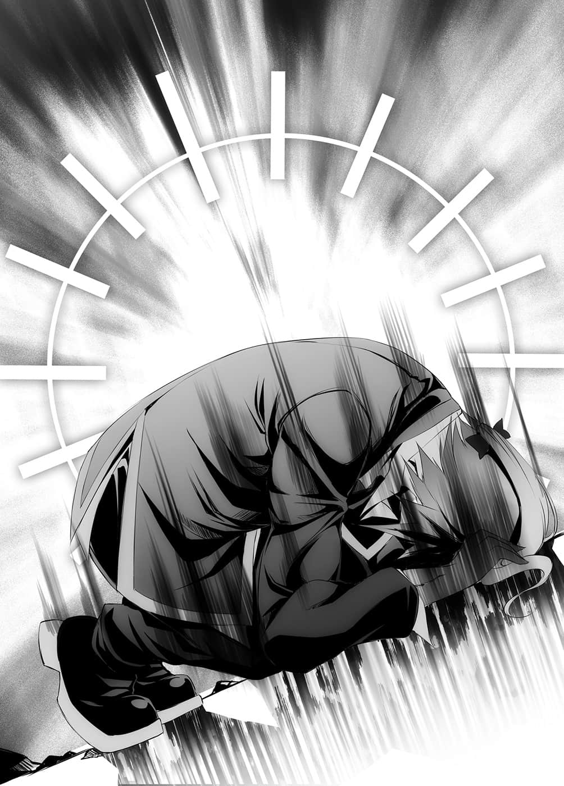

# 第三章 N帝

> 来源：https://www.linovelib.com/novel/9/2069.html

——『奥仙德』……海栖种与吸血种共生的海底都市。

几乎没有与他国贸易，是一个自给自足的封闭国家。

由于位于海底，因此也无法以寻常手段到达。

正因如此，这里有一群以非比寻常的手段前来的人们。

吉普莉尔劈开大海，空间移转所到之处，是一座能眺望奥仙德全域的高台。

深度约两百公尺，那样的海水被推开又再回流的话——

「就会变成这样吧……」

在空身后哀叹的巫女，她的视线注视之处——是吉普莉尔打造的空气膜的另一侧。

只见海底的沙土与岩石，就像是果汁机似地被卷起，激烈地翻搅着……

即使吉普莉尔的魔法再怎么暴力，由于『盟约』的限制，她无法行使武力。

如果盟约顺利发挥作用的话，应该就不会造成任何人的损害才是……

「……这个真的不会命中都市，或者打到别人吧？」

「不、不会，『十条盟约』是绝对的，没问题啦，可能、一定不会有问题。」

空这样说服自己，只见潮流平静了下来，沙土沉淀，海水开始变得澄澈。

「——哦，这还真不得了呢。」

「……好美……」

见到眼下雄伟辽阔的都市，空与白道出各自的感想。

与空想像有如童话般纯朴的印象相反，实际上那是一座宏伟的『都市』。

无数似乎是由海底石头堆砌营造的建筑并立。

闪耀着珍珠色的石墙上，有如壁砖一般，贴上了削薄的珊瑚和贝壳，创造出鲜艳亮丽的色彩。或许是利用了水中的浮力吧，地上所不可能建造的复杂拱形，和倒圆锥状建筑也非常醒目——这时空忽然说道：

自称是亚蜜菈的『这个人』，如果她本人的话可信——可怕的是那似乎是真的——统领现在的海栖种，实质上的全权代理者就是她了。

「……空先生，亏你能那样明快地拒绝呢。」

「……原来如此，那就是海栖种吗？很好，谢天谢地和想像中的一样。」

「这里是吉普莉尔制造的空气中，那边则是水中——声音无法传达吧。」

「咦、咦……？」

在空背后的伊野一个不小心，竟然体温上升，差点就变成色眯眯的模样——

（编注：美国小说家霍华德・菲利普・洛夫克拉夫特所创造的克苏鲁神话中一个邪恶存在。象征「水」。）

一点也不开心——想着这种无关紧要的事，空点头附和。

还是第一次被女孩说是帅哥……但是为什么呢？

亚蜜菈扭动身子诱惑着空。

亚蜜菈在前引导，空等人从高台下来，往奥仙德的方向前进。

果然还是被空间转移的声音震撼了耳朵，伊野痉挛地问道。

……空找不到该对她说什么话，将视线往后移去。

听到吉普莉尔与巫女眼神锐利的低语，空也冷笑道：

只见从都市里冲出无数的影子，急迫地朝着这里过来。

一进入奥仙德，他们立刻受到热烈的欢呼迎接。

「大～家～好，呵呵呵☆我是女王陛下的代理人亚蜜菈哟～！完全ＯＫ～☆」

「即使是在这样的海底，两位的传闻也传到这里来了喔～☆拯救人类种的奇迹国王，光听起来就是帅哥了，长相也符合亚蜜菈的喜好～！！对吧☆」

「——空先生……你这是……什么意思……？」

但是对于那样的伊野，空却冷眼回应，他有如唾弃般说道：

「……是吗……那么拜托你带路啰。」

空等人目瞪口呆，然而亚蜜菈却持续地在水中忙碌地游动。

「什么嘛，被人笨蛋笨蛋地叫，但这不是很美的都市吗？」

吉普莉尔解除空气墙后，马上有一名海栖种过来。

「先让我们见『女王』，要招待等到叫醒女王之后再说。」

「谢谢你们特地前来，真的很感谢你们喔～☆啊～～～～真是的，要传达这样的心情只有亲吻了吧～！呜呼呼☆对吧！？」

如果是人鱼的话，那样也算正式装扮吧，但是内在就——

「就是啊……我去跟她们说明，顺便去吸一些血，我会用那个力量为大家施加在水中呼吸的魔法，在那之后就请解除这个空气墙吧……」

看到空明确的推辞，伊野不禁怀疑起自己的耳朵。

「对了～我们准备了酒宴呵呵☆要吃饭呢？还是・我・呢❤」

看到她那个样子，史蒂芙侧着头感到不解，空则是立刻找到解答。

「因为建造和管理这个的都是吸血种啦……啊哈哈……」

「我照你的要求，伊纲和巫女看来都没事吧，你要向吉普莉尔道谢哦！」

「……啊，是吗？」

巫女和伊纲拥有的五感，明白空所说的话完全是谎言，她们半睁着眼闭上了嘴。

如果出来的是克苏鲁那类的生物深潜者㊟的话，空就准备翻桌了，这下他能放心了。

「好～☆那么我们就游泳到城里吧～走这边这边～呜呼呼～❤」

「……哥，大概是……那个。」

「不，在海中我们兽人种的五感也会受限制，因此无法把握空先生的真意……不过受到那么有魅力的女性诱惑，您竟然能毫不踌躇，空先生，该不会您有超乎想像的自制力——」

「嗄？」

她们的动作感觉不到固定的韵律。

「你、你们看，那么多人慌慌张张……果然是生气了啦。」

那模样正是与童话中一模一样的——『人鱼』。

话一说完，布拉姆立刻小跑步冲刺，冲破空气膜，游入水中。

「咦？」

三个没常识的人，一同侧着头感到疑问。

「啊哈☆声音也好帅！！亚蜜菈湿答答了～啊，因为是在海中嘛～呜呼呼☆」

胸部仅缠着少量的布条，另一方面，颈部与手上则有过剩的装饰品。

「…………哥，这是感谢与欢迎的……舞蹈。」

发光的水母，受到蓝光照耀，色彩缤纷的鱼群，以及优雅地到处游动的人鱼们——

只听到伊野从背后在空的耳边说话。

在海底的话，阳光应该只有蓝光能到达才是，而回答这个疑问的是白。

巫女依序看向空与白还有吉普莉尔，然后深深叹了一口气。

只见她挥动双手，嘴巴一开一闭地动着。

「——似乎是那样……你、你看吧，史蒂芙，我就说没问题吧！」

终于，其中身上装饰得最华美的海栖种游上前来——

史蒂芙惊讶地圆睁双眼。

「……海栖种吗，她们是真的笨蛋吗？还是说——」

那幅幻想般的光景，任谁的目光也会受到吸引，那个可能是——

空总算吞下这个率直的感想。

---

■ ■ ■

绿色的丰厚头发，仿佛透明的雪白肌肤，明亮的蓝色大眼。

「……不，你的好意我心领了……」

白指着漂在海中，无数会发光的水母和海藻——那是活用自然的『街灯』。

是笨蛋。

留下哑然无语的伊野，空抱着白漂向城市——

光辉亮丽的珊瑚与珍珠饰品，在柔滑的雪白肌肤上，不停地随着波浪摇晃。

「——你们啊，没常识也该有个限度吧……」

「真是胸襟宽宏得比海还要深的人们呢……」

「劈、劈开大海过来，这怎么想都会被当成充满敌意吧！！接下来，你们打算怎么请对方带我们去女王身边啊！」

数量稀少的有常识的人们——史蒂芙仿佛为巫女代辩似地大声说道：

「怪了，这只食肉目犬科亚属有什么不服吗？」

「……哈哈，谢谢您的称赞……」

「就算是关乎种族命运的救助者一行人……」

看见来到空气膜前方的海栖种们，史蒂芙不安地说道，随后——

剩下的兽人种——伊野仍是捂着耳朵，痛苦呻吟着。

海栖种们轻飘飘地翻转身子游泳，展现闪亮耀眼的鳞片。

「……嗯……」

而亚蜜菈对于那样的态度也不介意，仍然一脸笑容地继续说道：

「……嗯？为什么不是一片蓝色？」

不过亚蜜菈也没有特别在意的样子。

「是对方请我们来的，迟迟不来迎接的也是他们，在这个攸关存亡、分秒必争的状况下，我们可是急忙赶过来的耶。想到吉普莉尔的辛劳，她们应该用感谢与欢迎的舞蹈出来迎接，这样才是道理吧？」

「……有什么……问题吗？」

而——

全身穿戴着珊瑚装饰，却不会令人感到低俗。

「……啊～那是没问题啦，不过可以让我说一句话吗？」

不过听到布拉姆这么说，众人往她所指的方向看去。

「哎呀，如同传闻一样认真的人呢☆不过那样子对亚蜜菈来说可能会更喜欢喔啊哈☆」

这已经不是说不说敬语的问题，虽然勉强是人类语，但每个地方都很奇怪。

空无言地望向布拉姆，布拉姆则是静静地回应他的眼神，悲伤地摇摇头。

——原来如此，难怪城市本身在发光。

「老爷爷你饥不择食啊，就算我是处男，那种等级你要我有什么感觉……走吧，白。」

——带有鱼鳞的下半身是鱼的尾鳍，上半身则是人型的女性们。

眺望着她的背影。

除了相当于耳朵的部分长着鳍以外，她们与人类种并没有多大差别。

回答的是苦笑中带着放弃与自虐的布拉姆。

「……啊～关于这点不用担心啦……你们看。」

吉普莉尔、伊纲和史蒂芙好奇地张望四周，巫女则是一派从容的模样。

---

■ ■ ■

「——被以那样的攻击来撬开都市的大门，却还这么欢迎？」

不管是哪一个海栖种，脸上都挂着愉快的笑容，跳舞、诱惑，演奏着五音不全的音乐。

语言——应该没有说人类语的必要了吧，虽然听不懂，却能感受到她们的欢迎之意。

在那样快乐嘻闹的海栖种之间，随处可见貌似吸血种的少女们的身影。

不过她们的表情与海栖种形成对比，和布拉姆则是大同小异。

那是可怜……疲劳的笑容，欢迎空等人的表情也诉说着『远道而来辛苦了』。

——海栖种提供安定的血液，吸血种协助女王繁殖。

在女王沉睡之前毫无问题的共生关系，如今已是风中残烛——然而——

「我说啊，这些人都到即将灭亡的关头了，为何还能这么开朗活泼。」

没错——姑且不论吸血种，海栖种完全没有一点悲怆感。

「——所以我不是说了吗……她们根本没有理解到这一点啦。」

布拉姆以疲倦的微笑回答，而吉普莉尔替她补充说道：

「因为海栖种愚蠢的程度已经到了传说的境界，在各种族的言语中都被当成『笨蛋』的同义语，并用来做为指称『海栖种』的惯用句，甚至还有被当成动词使用的例子。」

在亚蜜菈引领下，空一行人在海底走着。

——海中步行。

这不知是在游泳还是走路，白对这种暧昧的感觉感到困惑，空则是抱着她前进。

伊野与伊纲、巫女——该说他们不愧是兽人种吧。

很快就掌握在这种状况行动的技巧，蹦蹦跳跳地悠然前进。

吉普莉尔在水中也同样是『用飞的』。

「——倒不如说，比起这种世界公认的笨蛋种族，人类种更在其下吗？」

确实，在场最不适应海中行动的明显是空和白。

在哑然无语的众人身后，布拉姆和亚蜜菈正在交头接耳。

只见她恭敬地低下头，将光圈移到头的后方，收起羽翼——

「……你才要冷静一点，她没有美到值得大惊小怪的程度吧？」

她的容貌确实称得上美丽。

「提到交配让我想到，吉普莉尔，海栖种是和异种族的男人产子吧？」

不过算了——不管怎么说。

——又是灵魂吗？

「…………你真是辛苦了……」

不过空可以明确地断言——『不同』。

——莱拉・罗蕾莱，沉睡在冰棺内的人鱼公主。

这是只对主人展现的忠诚姿势，吉普莉尔握住双手，仿佛祈祷般说道：

「是啊……你说不是『生物』而是『生命』吧。」

——但是众人似乎都没发觉她们离开的样子。

「为各位介绍——这位就是海栖种的女王……莱拉・罗蕾莱陛下。」

「你、你们两人精神正常吗！？这、这位女性不是美女，那谁会是美女！？」

甚至也没有伊纲那纯洁无垢的可爱，更不用说是——

「「什么～～～！？」」

「因为我们是同舟共济啦……请求空陛下们协助的方案和方法——甚至想出干涉女王梦境的也是吸血种……因为她们没有劳动的概念，最擅长的就是交配而已，哈哈……唉……」

——空他们来到这个世界的时日尚短，不过在幻想世界常见的所谓半精灵那样的——『混血』，他们却不曾听闻。

「不不……亚蜜菈大人在会说人类语的这一点上，已经算是很好的了……」

听到布拉姆说的话，亚蜜菈瞬间露出困扰的神情，但是她仍回答道：

仿佛接替一般响起的高亢声音，空抬起头一看。

「亚、亚蜜菈大人……关于请他们唤醒女王陛下的事……空陛下他们说，希望由在这里的全员一起挑战游戏……这样没问题吧？」

「嗯嗯。」亚蜜菈点点头。

「多、多么美的女性啊……」

不，那是个美丽透明看似水晶的……冰块。

但那些微的阳光也好似不需要一般——在正下方发出光芒的玉座上，有一个耀眼夺目散发出存在感的巨大水晶——

「……我也……不太明白……」

在高挑的天花板上嵌入彩绘玻璃，将到达海底的阳光引入房间。

与巫女在月光下所显露出的，那种近乎神圣的妖艳美貌迥异。

「是的，就是那样没错。」

只是注视着女王沉眠的冰块。

「就如同吸血种从血液取得一般灵魂，海栖种是借交配得到灵魂进行『变质』，创造出自己的复制，因为比通常的『生物』繁殖更没效率，所以对方才会被榨干。」

「我应该跟您说过天翼种不是『生物』。」

对于侧着头表示不解的两人，众人目瞪口呆。

「那些人只会吃、睡、做爱、游玩，除此之外什么也不会……鱼明明含有会让人变聪明的成分，但是鱼本身的头脑却很笨……很不可思议吧？」

女王的房间相当宽敞，使用的是粉红色的天幕与绒毯。

「就是因为那样，所以混血——要生出继承相异种族性质的孩子是不可能的。」

雪白的身体装饰着耀眼的黄金，自大腿以下则转变成鲜艳的鳞片。

「因此灵魂是不定形的，只要摄取对方部分灵魂，与我的灵魂合成的话，就可以生出定形那方的孩子——虽然类似生殖，不过要跨越种族，生下对方的孩子，在理论上还是可能的。」

空发现吉普莉尔一直注视着自己。

「————…………」

「好的，没问题☆不过布拉姆那边没问题吗？」

「是……那、那么我去做进入女王梦境术式的准备……」

实际上对于那艳丽的模样，伊野固然不用说，吉普莉尔、巫女，甚至伊纲也一样。

「——吉普莉尔，我的脸上沾到了什么吗？」

空一脸受不了她的表情，背后伊野静静地拍着空的肩膀。

「到～～～～～～达啰～～！」

「……也是啦，实质上的全权代理都那副德性了。」

吉普莉尔笑容满面地说着，而布拉姆则带着虚弱的笑容继续说道：

「那也是正常的。」吉普莉尔断言道。

目睹那幅光景，众人都说不出话来。

亚蜜菈伸出手，缓缓地推开门——

墙壁上放出淡淡光芒的海藻，像是装饰一般，编织成规则的图纹，照亮着房间。

「只要您说一句为我生孩子，不才吉普莉尔随时愿为主人生——」

海浪般的蓝色长发垂落在年轻晶莹的脸上。

「让各位久等了！这里就是女王的房间喔～♪」

包覆在光与黄金中的『女王』在冰棺之中，在双壳贝的玉座上静静闭目着。

白锐利的一句话，强制性地让吉普莉尔闭上嘴。

「ＯＫ☆那我去为唤醒女王做准备啰～☆既然要大家一起使用魔法，那也需要血吧～呜呼呼☆亚蜜菈会去召集其他的人来，布拉姆拜托你啰☆」

比如说，她的美和吉普莉尔那种令艺术品也为之失色的美不同。

那些鳞片反射着照在房间的光，看起来七彩斑斓。

「不，我现在讨好你有什么用啊……」

史蒂芙好似忘了自己也是女性一般，热情地赞美道。

「因为不存在，十六种族的外貌虽有相似之处，灵魂却完全不同。」

——只见光芒流泻而出。

「是的，生出来的纯粹就是『海栖种』。」

「可是海栖种是和异种族交配对吧？那样难道不是海栖种的混血吗？」

那大概是像染色体一样的东西吧，空这样说服自己，然后继续问道：

那样算很好——空以同情的眼神望向布拉姆。

「……？哥……？」

「——我还是没搞懂你想说什么。」

「……果然凶恶啊。」

「……吉普莉尔……闭嘴……」

「是那样吗？就文献记载——据说是『有如升天的快乐』。」

「嗯……？她有那么美吗？白？」

「在遇见主人们之前，我会回答『是』——不过这么说比较适切吧，她们只是拥有特殊的性质，所以序列才高了一级，是个头脑极差的种族。」

对于史蒂芙的抗议，空只是不耐烦地皱着眉头说道。

「明明使用的是两种灵魂也一样？」

在空他们原本的世界尚未得到证实的『灵魂』，在这个世界似乎是常识。

在被带路的这段期间，空忽地提出一个在脑中闪过的疑问。

「是的……所、所以我想要大约三十个人协助编纂术式。」

「十六种族没有跨越种族的『混血』吗？」

「……那、那么明显地奉承我，我也不会高兴喔！？」

他重新将视线移向女王。

行了一个礼之后，便与亚蜜菈一同退出房间。

他们只是茫然地，目光深深地受到吸引，但是——

——果然这个世界没有感情要好的种族……空一副遥望远方的眼神。

「——完全不能相提并论，不，应该说史蒂芙还在她之上吧？」

空看着身旁——侧着头感到疑问的妹妹，空可以坚决断言。

此时亚蜜菈庄严肃穆地——至少她努力想装出来——向众人宣告：

空沉吟了一下，心想——大概就是因为不可分，所以特图才设定为『十六种族』吧。

对于空的视线，布拉姆的表情就像是接受了命运安排似地笑着说道：

「真的如字面上的意思升天了啊……而且是『有去无回』。」

在亚蜜菈引领之下，他们进入在奥仙德中一栋特别高耸的建筑。

——冰块中睡着一位美女。

「空先生………………不，没关系，不要紧的。」

然后他以亲切的声音说道：

「你不必烦恼——阳痿是能够治好的，下次我介绍你吃甲鱼火锅——」

「绝对不是那样，少破坏我的名誉！」

空指着冰块大叫。

「你们冷静点好吗！！当然我不是说她丑，只不过在巫女小姐、吉普莉尔、伊纲和白齐聚一堂下，她值得那么大惊小怪吗？我可是如字面上的意思，在场每个都是超规格的美女喔！！」

史蒂芙和伊野仍用怜悯的目光看着空，不过——

听到空说的话，只有吉普莉尔和巫女回过神来。

「不、不愧是主人……那就是我先前所说，海栖种所拥有的『特性』。」

「——啊？」

巫女与吉普莉尔将视线从冰块移开，接着吉普莉尔继续说道：

「海栖种没有优越的肉体与魔法，即使如此她们仍能生存下来的最大理由，也是唯一的武器，正是那个……也就是——」

吉普莉尔吸了一口气。

「只要是在海中——她们就有『吸引一切的魅力』。」

「海栖种是受大海眷顾的种族——她们住在海里，不能离开大海的理由，是因为体内保有大量的精灵……『水精』，水精会『吸引』所有的精灵。」

「……啊啊……」

「啊，原来是这么一回事。」

原来如此，空与白点点头，似乎终于想通了疑点。

在『十条盟约』以前，海栖种是以吃掉其他种族的男人来进行繁殖。

既没有优越的力量，也没有魔法，又不能离开大海，那么她们是如何生存下来的呢？

「我知道，有布拉姆的恋爱魔法外挂，而且即使输了也可以向亚蜜菈取回——你想这么说对吧？放心吧。」

「呜呜……对不起……」

「那、那种事——可是万一魔法失效该怎么办呢！？」

「可是……为什么对主人们不适用呢？」

————…………

「不，那种口头约定——」

也就是那个人的财产、身份、人权、生命——如同字面意思的赌上一切吗？

「正～确～答～案！啊～真不想把你让给女王，由我收下不行吗？」

不理会吵吵闹闹的亚蜜菈，空说道：

「是、是的……不、不过……」

「只要有人让女王爱上他，唤醒女王的话就是『胜利』，被甩掉的话就是『失败』——败者将会脱离游戏，支付赌上的『一切』——照这样向盟约宣誓就好了吧？」

亚蜜菈哈哈大笑地点头附和，不过——

「请进行宣言！」

——史蒂芙内心觉得不对劲。

——也就是说——

「是啊，你以前说过，这个世界所有生物体内都有精灵，但是我和白却没有。」

最初相遇的时候，为了证明他们出身于异世界，曾经让她确认过体内的精灵。

除了自己以外，在场每个人似乎都没感到任何疑问，对此均默不吭声。

空露出无所畏惧的笑容。

「那、那种事太奇怪了——」

「不过，这只人鱼——她所保有的精灵量可说是『特例』。」

「『想要我的爱就展现出舍弃一切的觉悟！』……是这样吧？」

「这一点就交给我亚蜜菈吧～」

布拉姆随即开始说明游戏规则。

史蒂芙仍无法拭去莫名的违和感，不过——

「好，没有问题——我们开始游戏吧。」

——她依然大声质疑。

「濒临危机的分明是她们，我们是来援助的，为什么要背负那种风险！」

按部就班编组着术式的布拉姆，一边说明一边问道：

但是没有注意到的史蒂芙仍无法认同。

不过话题一转——

但是史蒂芙再度环视周围。

然而空仍一口打断她。

然后脸上仍是挂着轻松的笑容。

……赌上一切？

（什、什么呀……？这是怎么回事啊？）

「那不是魅惑魔法之类的吧？」

「那么——当各位赌上一切后，请『向盟约宣誓』再触碰冰块……之后我和台阶下的吸血种会展开术式，用魔法带领各位进入女王陛下的梦中……为了施展『恋爱魔法外挂』，我也会和各位同行……」

「嗄？欸、你在说什么呀？」

空的语气冷静平淡。

「有那种必要吗？我们是接受请求前来协助的耶！！」

「当然有问题啊，你在说什么呀！？」

「拥有这样的阵容、条件，我们输的可能性是零，快点开始吧。」

「不会单纯是空先生身为男人却不举吗？」

亚蜜菈态度明确地说道：

布拉姆接下来要说的话，由空接着说道：

「咦？有什么问题吗？」

「我们被请来是要——通过『女王的游戏』，叫醒她对吧？」

看到他那么冷静，史蒂芙回过头，环视众人。

吉普莉尔瞥了女王一眼，再度移开视线。

这就能解释她们为何能伴随鱼群游泳，不用魔法也能承受深海的水压。

吉普莉尔念念有词，兴趣似乎又回到空与白的身上，眼神兴奋地看着两人。

可是空仍然轻松地回应。

「『十条盟约』第三条，游戏需赌上双方判断对等的赌注——女王是【向盟约宣誓】进入睡眠，既然『游戏』设定是要让自己爱上对方，那么当然会设定要得到女王的爱所需的『赌金』——对吧？」

只有空注意到，这时巫女和白微微露出浅笑。

只见亚蜜菈一脸困扰地用手指抵着脸颊，而布拉姆只是拼命道歉。

空看向布拉姆和亚蜜菈，以开玩笑的语气说道：

不管是空还是白——巫女、吉普莉尔、伊野，甚至伊纲，全都一副理所当然的表情。

只有亚蜜菈一个人喋喋不休地对空赞不绝口。

「反正我们有让女王确实爱上的魔法，不会有问题吧。」

那个进入女王梦境的术式准备好了吗？

空一副了然于心地打断她说道：

史蒂芙听了哑口无言，其他人的脸上则是一副被打败的表情。

只要提到恋爱游戏，就不作他想的游戏。

「冷静一点，史蒂芙，没搞懂的人是你。」

——但是一旁的伊野则说：

「对对，不愧是帅哥，不只是长相，连脑袋也帅呢！」

两人立刻走近女王沉眠的冰块。

——这时候亚蜜菈和布拉姆吵闹地回来了。

「让各位久等了～～～！」

对于无法避开那样的影响，吉普莉尔不快地说道。

但是史蒂芙却感觉那笑容有点古怪，空说道：

「欸欸～～布拉姆，你没有说明就把人带来了吗？」

总觉得哪里不对劲，这种高风险的条件，为何到现在才突然提出来？

然而打断她们的是——

亚蜜菈——若无其事地说道：

这不像平常的空，竟然会答应这么可疑的游戏——

那就是——『迷惑』对方，引诱过来就好了。

如果是对精灵产生作用的磁力，那么对空他们无效也是当然的吧，不过——

「那么现在马上就用布拉姆她们的魔法，请你们进入女王陛下的梦中啰。」

「你给我闭嘴，老头，你只是忠实于下半身吧，我可是理性的集合体。」

「……嗯……？吉普莉尔说过……我们没有……精灵。」

「是、是的！这个我可以保证，包在我身上！」

「不，只要有灵魂的话，就一定会有精灵才对。主人们所拥有的单纯是我所不知道，或者无法检测出的精灵而已——可是，那样一来，不受影响的理由又是——怪了。」

听她这么说，空开始想像。

「因为是梦境，所以情境可以自由设定……就由——空陛下代表设定对吧？我会反映空陛下的想像，构筑女王陛下的梦境……不管是怎样的情境——胜利条件只有一个。」

「就算游戏可以进行，收取赌注的女王陛下却仍在睡眠中，因此她的持有物由我管理！就算魔法失败，我也会原原本本奉还，这样就没有风险了♪」

史蒂芙望向空，为何空对这件事不感到怀疑呢？

「对，单纯是精灵的流动——就像是作用在精灵上的磁力一般，就只是种族的特性……本来并不是特别值得留意的事，但是——」

「好、好的——那么空陛下，请您开始想像情境，然后——」

打破沉默，提出质疑的是史蒂芙。

「布拉姆说过，干涉感情和梦本来依照『十条盟约』来说是不可能的，是因为女王同意所以才有可能办到——但是她的同意纯粹只是在游戏中。」

但是亚蜜菈却讶异地问道：

而同样应该知情的——巫女也搔着头，一脸无奈的表情。

「要唤醒女王的人，请【向盟约宣誓】赌上一切，再触碰水晶～」

吉普莉尔感到奇怪。

「不先开始『女王的游戏』，一连串的术式就无法使用，当然就无法唤醒女王，而要得到和女王进行游戏的权利，女王要求的『赌注』是——」

『——【向盟约宣誓】！』

空、白、史蒂芙、吉普莉尔、巫女、伊野、伊纲以及布拉姆。

全员一齐念出这句话的同时，意识瞬间染成空白。

---

◇◇◇

---

◆◆◆

---

◇◇◇

——之后白色的视界马上变换成蓝色。

仿佛从梦中醒过来似地，意识朦胧地浮上。

弛缓的身体各处，血液开始流通，感觉恢复，然后——

「啊噗噗噗噗噗！？」

……溺水了。

在大海的正中央，空与白、伊纲、伊野，就连巫女也正受到波浪的翻弄。

只闻到烧焦般的海潮味，感受到一股贯穿鼻腔深处的痛楚。

就在冷静的思虑即将飞向远处的时候——众人的脑中开始播放起别的影像。

『——正如同有开始就会有结束——』

过度闪亮的特效，有如星辰洒落的音效。

感觉像在念台词的旁白，平淡地接着说。

『有邂逅也会有别离——』

「现在不是悠哉地播放开头动画的时候吧！？」

空拼命将头伸出海面，愤怒地大吼。

「有哪个世界的『纯〇手札㊟』是从溺水开始的啦？心动不起来啊！」

（译注：恋爱游戏『纯爱手札』的日文原名，直译是心动回忆。）

不，心脏确实是剧烈地在跳动。

「……因为肌肉鼓起而紧绷的制服啊……我晚上会做恶梦吧。」

（编注：《我的朋友很少》中，女主角三日月夜空给游戏中的角色取的名字。）

原本在海中溺水的『状况情境构成』，就像书本翻页一般被替换。

——或许是掺杂了女王的印象吧，那是比空想像的还要略微暴露的水手服。

「……唔，这衣服穿起来很闷啊。」

「说的也是……话说创建东部联合的人是巫女小姐吧？」

(编注：纯爱手札秘技，在名字栏输入こなみまん，所有数值都会从573开始，不过也包括负面数值。）

尽管是在海底，却看得见蓝天，波光粼粼的海面有云层在流动。

景色的转变结束，这次换成空他们开始出现变化。

起伏不定的地形经过整顿，原本满是岩石与珊瑚的海底出现了『校舍』。

空这么说着，将视线从地狱伊野移往天堂乐园那一方——也就是女性成员们。

「官方秘技符合游戏规定啊，而且用了那种技巧，只要做了什么行动，马上就会得到精神官能症，第一年都要用来休息，错过所有的事件……那个技巧也有它的副作用喔㊟！」

「——啊，啊，术式构筑完毕，我现在就反映情境构成！」

——然后她脸上浮现危险的微笑，以清脆动人的声音说道：

不过在她旁边的巫女们——兽人种全体烦躁地——同意吉普莉尔的说法。

「……既然能够反映到这种地步，那么一开始就别让我们落海啊。」

看到让自己坠入情网，唤醒自己的那个人，竟然有如照片诈欺般是不同人物——那么她会再度沉眠吧。

而在她周围的是穿着同样制服的伊纲、吉普莉尔，以及巫女——

那没关系，重要的是——

「哈哈……奥仙德没有学校这种东西……那些人要学什么呢。」

似乎同样成功潜入游戏内梦中的布拉姆这么说道。

——女王纯粹是期盼『王子』的出现而沉眠。

看到那个一如记忆，宛如『纯〇手札』的画面，空却抱怨：

在一眨眼的时间里就重新构筑出，名为『海底学校』的虚构舞台。

——那就和恋爱模拟游戏的状态画面一模一样。

「布拉姆～～！我妹妹已经快放弃求生了啦，快一点～～！」

宛如将扑克牌一张张地翻面，一项项地，最适合游戏运作的变更逐渐增加，梦中世界变得能够容许『不合理』的设定。

眺望着那奇妙的风景，在空身旁——

（编注：日文中573和こなみ谐音。)

「空陛下的想像是哪里的知识呢？那种东西我从来没见过。」

白因为差点溺毙而恐惧颤抖，空抱住她，忿忿不平地抱怨。

两只尾巴摇晃着顶起的裙子下，露出的美腿是那么地耀眼夺目，不过——

「……真、真……真惊险……」

撩起长长的金发，身上与白相同，穿着鲜艳水手服的巫女说道。

潜入梦中完毕的全体人员，嘴里一边咒骂，一边逐渐恢复平静。

在周围来回游动的热带鱼们，逐渐变化成没有名字的一般学生ＮＰＣ。

「我教你一件好事吧？人类种秃毛猴。兽人种——特别是『血坏』个体，老化很迟缓喔。」

「因为这些都只会反映在玩家身上……在构筑情境的时候，纯粹是为了磨合空陛下的想像和女王陛下的记忆，花费了一番工夫的缘故，倒是——」

（编注：原文是こなみまん，科乐美（ＫＯＮＡＭＩ）是日本著名电子游戏软体制作商。）

站在旁边的白，不是平常一身黑的制服——而是色彩鲜艳的女生制服。

「请问……那样做有什么意义吗……？」

巫女的耳朵动了一下。

「你先前也说过从懂事时起这种话，伊纲是八岁，她也懂事了，东部联合以五十年半世纪的时间急速成长——即使不换算整合东部联合所花费的时间，最少也有五十八岁——」

「——呼……我才要教巫女小姐一件好事呢。」

当然，空的想像需要与女王的知识加以磨合，然而——

「啊，对、对不起……因为将空陛下的印象与女王陛下的印象混合，构筑成舞台情境需要一些时间……请再等我一下……」

「……巫女小姐的水手服装扮啊，是很棒没错啦……」

布拉姆忽然讶异地说道：

「……？这是什么？」

「那是ＵＩUser Interface……『指令选择画面』。」

「最令我震惊的是女王陛下竟然知道『学校』……是在书中读到的吗？」

「啊，是的，由于术式还在构筑中……所以只要空陛下想像就能变更。」

首先——无数的图示亮起，映入视界之中。

仔细想想，这也是理所当然的事。

「名字可以改的话，请把我的名字设定成『科〇美人㊟』。」

对于妹妹半睁双眼做出的指谪，空摇晃着手指笑着否定。

「难道没有人教过你，询问女性年龄是很失礼的事吗？」

「只不过，外貌、年龄和性别是无法变更的……请您注意。」

「你敢叫我『阿姨』的话，知道会有什么下场吧❤」

在他们这样交谈的时候——术式反映出空的想像，空等人的外观因此有了改变。

在蓝色透明的海中，空吐了『一口气』，擦拭『额上的汗水』。

史蒂芙想要触摸视界中的图示，手却挥了个空，空对史蒂芙说道：

「只要学会游泳不就好了……」

「让主人们濒临危机的『大海』——看来有必要整个排除呢。」

「……我还是……讨厌海……」

「……哥……我的人生……很幸福……」

布拉姆不知道空他们来自异世界，对他们想像的出处感到好奇——不过空无视她。

那是以奥仙德风格的建筑样式所建造的『高中』——

空的装扮只是在平常『Ｉ❤人类』的Ｔ恤之上，多穿了一件制服外套。

察觉空视线的含意，布拉姆露出疲累的笑容，带着苦笑告诉他。

「……没错，什么大海嘛，是谁造出这种奇怪的积水啊？」

「……巫女小姐，你几岁了啊？」

但是空可不想用『心动』来形容濒临生命危机时的心跳。

「——主人，您没事吧！？」

到了这里，似乎唯一泰然自若的史蒂芙，半睁着双眼说道。

「游戏刚开始就立刻迎接死亡结局，那种特殊剧情请别用在这里好吗？」

『舞台』由海上转移到海底，呼吸这个多余的『设定』消失了。

「……哥，全能力……五百七十三起跳是作弊……㊟」

听到吉普莉尔强烈的呼唤，空恢复意识——不知不觉脚下已是地面。

「再说海好臭……要是海能只留下鱼，自己消失就好了。」

「你有什么意见吗？」

「……那白要取……『星〇笨努没㊟』这个名字……」

同样身穿男生制服——九十八岁肌肉突出的老头在一旁说道。

即使能够干涉女王的梦境，这个世界也不可能有空他们世界的『学园作品』。

巫女打断空精准的推理，以令人眩目的笑容说道。

——空、白、史蒂芙、吉普莉尔、巫女、伊野以及伊纲。

「话说只要反映玩家的想像，设定就能轻易变更是吧？」

他们各自脚踏在地上，眼前的『状况情境构成』正在逐渐构筑中。

只见白带着幸福的笑容闭上双眼，空抱着她大声地喊道。

「我难得同意吉普莉尔小姐，海这种东西让它干涸就好了吧。」

——瞬间。

布拉姆又继续补充道：

然而空正面承受她的笑容，并且回答道：

「外表就是一切！巫女小姐虽然因为动作和语调的关系，给人较为年长的感觉，但是外表最多不过是二十岁的美少女——那么实际年龄就只不过是装饰而已，这是人类种的常识。」

「……那是你的常识。」

尽管听到史蒂芙这样说，空依然漂亮地无视她，指着旁边。

「再说这里也有个『超过六千岁』的人，所以没什么好在意的吧？」

「啊，主人，正确来说，我是『六千四百零七岁』喔。」

原本很稀奇地看着自己服装的吉普莉尔，这时笑着回答道。

她的上衣被腰上的翅膀抬起，隐隐露出肚脐，以下省略。

另一方面——

「……话说回来，我可以问个问题吗？」

「嗯——什么问题？史蒂芙。」

「为什么只有我和空与伊野先生一样——穿的是男性服装呢？」

——没错。

白、吉普莉尔、巫女和伊纲。

她们全员都穿着女生水手服，却只有史蒂芙——穿着和空与伊野相同的男生制服。

空深深地点头，道出他的深谋远虑。

「好问题——这就叫『欲射将，先射马』。」

「……什么？」

空表情严肃地这么说道，全员的目光都注视着他。

「——首先，我没有让全员都穿男装的理由有『二』。」

众人进行确认，马上就找到了那个图案。

「接着是我让史蒂芙女扮男装的理由——史蒂芙沟通能力强，能够成为情报通。」

对于同样冷眼吐槽的布拉姆，空明确地如此断言，继续说道：

「抱歉，妹妹啊，我对你的好感度已经到顶点了，事到如今再上升也——」

「那个……显示的指令中，我想应该有两个爱心图案才是。」

枯燥的旁白结束，这次则播放出流行音乐。

「你的『恋爱魔法』——外挂指令对吧，ＯＫ，我已经掌握状况了……好了。」

那是在排列了数个图示的面板左侧最下方。

方才脑中播出的劣作宣传影片，伴随着轻快的背景音乐播放出来。

听到这似曾听闻的语句，空半睁着眼抱怨道：

态度出乎自然，对自己的容貌毫无自觉，但是文武双全，甚至拥有顾家贤慧的特性。

■『第一天』■

——听到她的歌声，全员一齐倒抽了一口气。

「那么主人，恕我僭越，就由我来——」

「我希望有个拥有好雄君㊟的情报力、交友力的男性友人，做为我的同伴——不过……」

不过在那之前，因为女王太过性感，完全不适合穿水手服。

——唐突地，众人的视界中出现『第一天』的字样。

听到布拉姆的说明，空却是侧着头感到疑惑。

「第二点——是考虑到或许有女王本来就『对男人没兴趣』这个陷阱存在。」

「呃、我想眼前应该显示了数个『指令』，使用那个可以进行某种程度的行动选择……比如说赠送礼物之类。」

「即使您那样说我也……海中没有树木呀……」

空与白眺望着荧幕，一脸兴味索然的表情。

……空与白除外。

空忍不住想揍他，看到没人缘的人世界的敌人——现充型男的模样，空再度叹了一口气。

包裹着丰满肢体的鲜艳制服，随着海水而摇摆不定，更加衬托出女王的性感魅力，从短短的裙子下伸出的鱼鳞尾巴，就连拍水的模样都令人感到艳丽无比。

制服打扮的女王——莱拉仿佛跳舞一般，静静地游在巨大的红珊瑚下。

空正在抱怨的时候，白迅速地递给他某个东西。

——那是女王。

「那个爱心是告白指令……要如何告白是各位的自由，不过选择这个，『被甩掉』的话，就会被视为『败北』……然后标有＋的爱心就是——」

空转而面向史蒂芙，深深叹了一口气。

旁白平淡地进行解说。

---

■ ■ ■

「……指令……礼物……哥，好感度，上升了吗？」

伴随着布拉姆的宣言，只见巨大的荧幕投影在空中。

——红发再加上端正的容貌。

「我很期待你引以为傲的恋爱技巧哦，初濑伊野。」

（编注：指『纯爱手札』一代中的角色「伊集院丽」。）

「……话说，不必叫老爷爷，干脆叫史蒂芙去搭讪还比较快吧？」

史蒂芙与伊野发出赞叹的声音。

在旁白解说下，映出校舍和教室的照片后，场景移至中庭，镜头以略微仰角的方式，映出一株无数枝干呈放射状延伸的巨大深红色珊瑚。

「嗯哼，那么就重新播放开头动画——然后我会投入女王陛下的意识。」

女王的眼神似乎带着忧愁，她好似殷切期盼着什么似地，朝着空中伸出手——

姑且不论歌声本身——

「虽说每个人的喜好不同……但是要我攻略那个人吗？」

虽然空与白已司空见惯，不过布拉姆还是为其他人说明。

「那么老爷爷，既然你和三十位老婆结婚，那睡过的人数一定在那之上吧？你就用那个加〇鹰㊟也自叹不如的技巧，快快攻陷女王，去得到她的芳心吧。」

「哎呀……！」

但是不管怎么说，『传说中的珊瑚下』这也太夸张了吧？

不过空无视她，竖起第二根手指继续道：

「第一，因为要攻略女主角的话，我希望有她的友人——女性的协助。」

「……这与其说是好雄，倒不如说……变成伊集院㊟了啊……」

「Ｌａ————♪」

空虽然这么想，然而无关他的内心想法，开头动画仍持续播放。

粉红色背景的『传说中的珊瑚』下，映出一位蓝色长发随波摇曳的人鱼。

「……我说啊，如果是传说之树那也就算了，传说中的珊瑚究竟是什么啊……？」

她的歌声优美，能够使听者的灵魂感受到有如吸食毒品的快感。

——话说珊瑚那种东西，在近处看会很噁心吧。

「……毫不犹豫地说出人渣发言呢。」

「我都开始觉得或许是我们的品味有问题了……」

那就宛如三十岁的女生（笑）扮演女高中生的状态——

普通的爱心图案，以及与之并列，上面有着『＋』记号的爱心图案。

只见到身影就能迷惑任何人的女王。

伊野皱起眉头，但是紧接着——

钟声中和樱花飞舞的坡道也还算可以。

「——什么？我不太明白耶……」

——过了一会儿。

然而在她的眼眸深处，甚至能够窥见深深的温柔与坚忍不拔的性格——这样一位好青年。

拥有社交力，也有行动力，加上——带着坚强意志的碧蓝眼眸。

白的眼神像是带着某种期待问道，空则对她苦笑着说道：

「……我有说过女王要求的是具有生殖能力的男性吧……？」

空早早就理解了系统，转身面对伊野。

『海立光辉高中……这里有个只要在传说中的珊瑚下告白，就能得到「真实的爱」——』

「……伊集院？那是谁啊？」

在古木之下告白，这可以理解。

「你的说法实在令人感到不快……」

「……哥。」

空竖起一根手指说道。

吉普莉尔也跟着送礼。

——坦白说。

外表看来就是上流阶级的俊秀青年——男装的史蒂芙，侧着头感到不解。

不过依照空的直觉，他判断交友力以史蒂芙较优。

流行歌曲和影片，与煽情的姿势和忧愁的表情完全不搭调。

（编注：指『纯爱手札』一代中的角色「早乙女好雄」。）

（编注：指『纯爱手札』一代。）

布拉姆一边将视线从他们的身上移开，一边继续说明。

提不起劲啊……空小小地叹了口气。

「说是那么说，但这是真实恋爱游戏对吧？应该没有隐藏的好感度参数……」

巫女代表目光冰冷的大家，说出这样的感想。

（编注：指日本有名ＡＶ男优加藤鹰。）

「什么？不，要我向女性搭讪——而且那个……我、我对空——」

唱起歌来。

「……啊，术式似乎构筑完毕了。」

「没有足以信赖的根据。」

「……是初代梗㊟……不用在意……」

如果单纯就政治力而言，巫女也可以列入候补。

「哦，这真是……不愧是美女，就连歌声都与众不同。」

「……爷爷加油，得斯。」

「是！只要是巫女大人的命令……！」

对于两人的声援，伊野恭敬地回应，然后转而面向空。

「……不过空先生，我从刚才就一直静静地听着你说的话，什么射将先射马，什么协助者，什么情报通的，真是令人难以理解啊。」

「……什么？」

空皱起眉头说道，而伊野则是耸耸肩，继续道：

「……空先生该不会以为无视女性的兴趣嗜好，硬逼对方接受自己的喜好——甚至扮演对方所希望的形象，那样就会『恋爱』吧？」

……说穿了，空就是这么想。

「或者应该说，至少『恋爱游戏』是那样。」

看到空回答不出来，伊野以认真的眼神看着他。

「呼……原来如此，那样的话交给我才是上策，就如同精通格斗游戏也无法成为格斗家，就算精通恋爱游戏，还是无法谈现实的恋爱吧。」

——虽然他说的没错，但不知为何，想到那份自信是源自于睡过众多女性的实绩，空就感到莫名火大。

「空先生知道您为何是处男——没人缘、沟通障碍、无药可救的男人吗？」

「……老头，小心我叫吉普莉尔把你转移到宇宙的彼端喔。」

尽管空对他露出凶恶的眼神，但伊野毫不畏惧。

「有人说『恋爱是心理较量』——那样的话，为什么空先生办不到？」

「………………唔？」

——如果是『心理较量』。

那么远远在自己伊野之上的空，应该办得到吧。

伊野所谈论的道理，背后隐含对空实力全面的肯定，听到这番话，空说不出话来。

「不过，说的也是，如果真的有心理较量的话，只有一个，也就是——」

对着数名ＮＰＣ围绕之下的那个背影，伊野大声叫道：

——伊野心想，说不定——

「我不放！我不放手！我想让你知道我胸口的心跳，我胯下的火热！我的身体虽然年老卑微，但就算赌上性命，我也一定会满足你的！！」

「「——————————啥？」」

一瞬间，伊野甚至忘了游戏。

——无言了。

「「咦——！？」」

「不要啊啊啊啊啊啊！？」

原来如此，站在这位女性的面前，一般的年轻人一定连想开口都办不到吧。

手指无意间碰到胸部时的角度，随波摇曳的头发所造成的阴影——

仅只是那样，伊野就感觉自己的心脏像是被一把抓住般。

自从沉睡以来，女王梦境遭到干涉，受到无数次告白。

「请等一下！」

————…………

「不、不给对方退缩时间的下跪磕头攻势吗——！？」

——那就是……

用那对在原本的世界空看到不想再看的眼神——伊野说道：

即使是持续甩掉各种男人的女王，遇到像这种单刀直入的告白，大概也是绝无仅有吧，她慌慌张张地想要逃往校舍。

女王露出甜甜的微笑。

（怎么可能有效！？我也敬谢不敏啊！！）

「咿……」

「喔喔，请原谅我，海之女王啊！但这都是你太美的错！自从第一眼见到你的瞬间，我想抱住你、贯穿你的这股冲动一直满溢而出，无法停止！请您一定要体谅我这燃烧般的心情！」

有如祈祷般，双掌往天空高举，然后猛烈地打在地上。

——爱。

他咬紧牙根，眼神贯注气力。

伊野不疾不徐，郑重地双膝跪地。

如果说世上存在绝对零度以下的温度，那正是此刻在观战的空等人的气氛。

将惊愕的空等人抛在后方——

——就是要亲自赢到手。

「自从第一眼见到你的瞬间，我的心就有如岩浆般滚烫不已，请看！我的宝剑宛如钢铁一般坚硬挺拔——！！」

「哎呀——什么话呢？」

但是——！

「不要，喂，放开我！我说放开我啦！」

（紧握）

——爱上她没关系，或者应该说，不爱上她不行。

堂堂正正的——

真想抛下一切不管——他受到这样的诱惑。

「那个老爷爷是用那种方法娶到三十位妻子的吗……？」

爱并不是心理较量——没错，爱是战斗。

或者是全员的声音吗？

女王抽了一口气，花容失色地不住往后退。

空感到战栗不已。

「…………不，可是……」

——所谓的爱。

她就是拥有那样的美，有如暴力一般的光辉。

那是空熟知的——眼神。

伊野以锐利的眼神注视着空。

奔跑的脚步甚至伴随着轰然声响，伊野的视线只注视着一点。

双眼强而有力地瞪着女性——那并不是威吓，而是无言的宣战布告。

——他不是游刃有余，他已经毫无余裕。

——原点就是野兽亮出獠牙的行为。

那样的事物，他都认为是难以言喻的至宝……！

——下跪磕头。

不过伊野则是……以笑容回应。

——果然在他眼中的并不是藐视的神色。

——那是谁的声音呢？

「你是说我吗……？」

那几乎是犯罪——不，眼前上演的是完全的变态行为。

「拜托你！请和我共度热情的一晚好吗————！」

「『先下手为强』。」

难道说这就是娶了三十位老婆的男人的必胜策略吗！？

那就是现在正要走进校门的女王——莱拉。

『笑』这个行为本来就是攻击性的表现。

——就连这只字片语，都有如天籁。

海蓝宝石般的淡蓝眼眸，捕捉到伊野的身影——回答道：

他仿佛在战场报上名号的骑士一般，听到那宏亮的声音，女王缓缓转身。

「活在重重谎言之上的诈欺师所说出的话语，并没有能将心意传达给对方的力量喔！」

隔着一段距离眺望的空，这时战战兢兢地询问巫女：

女王的眼神、女王的声音、女王的表情、雪白的玉颈。

就在周围气氛降至绝对零度之中，伊野热烈的下跪磕头攻势，仍以绝佳的状况持续着。

过去的挑战者都是被女王的美貌所吞没，以至于连爱的告白都办不到吧。

眼前美女的一字一语，一颦一笑，在在都融化他的灵魂。

「咦？不、那个、等等……那个……」

「原来如此，爱情形式各自不同，但……最终都只在『把心意传达给对方』，然后——」

伊野肌肉结实的手，抓住女王的手臂，将她拉住。

「………！当然！」

「那位美丽的小姐！恳请你稍等一下！」

毫不犹豫地选择『告白指令』——伊野向前奔出。

空等人固然不用说，就连女王也惊讶地目瞪口呆，但是伊野却毫不理会地继续告白！

把兽人种的身体能力发挥得淋漓尽致，伊野以猛烈的速度发动突击。

「不是啦，那种方式该不会对兽人种的女性……」

「不要，喂，你放手——！」

然而伊野却更加提高声量，强势推销……！

「拜托你！拜托你！请和我交合！请和我火热地交合！」

不是讽刺，不是厌恶，不是怜悯，也不是轻蔑。

「……不，我不知道呀，为什么看着我？」

——但是不可以被吞没，必须吞没对方才行……！

将贴在地上的双手双膝并拢，将额头连同头盖骨深深地往下压……！

「美丽的小姐啊，请原谅我突然叫住你，如果方便的话——我想请你听我说几句话。」

没错，那是——『不信任』的眼神。

不过伊野摇头告诫自己不行，他将力量灌注丹田。

说出这句话的伊野，目光望向自己的操作画面。

无懈可击。

随着悲鸣声响起，女王好不容易挣脱伊野的手。

然后就这样一个转身，分开人群，拍打尾巴消失在校舍之中。

「请等一下，女王啊！女王啊啊啊啊！！」

啊啊……啊啊……——

啊……——

……啊——

伊野悲痛的叫声，在蔚蓝的海中高亢回荡——然后消失无声。

被抛下的伊野垂头丧气，在原地一动也不动。

——看到他那个样子，每个人的胸中都抱持着失望这个词语。

「……已经不行了吧？」

「…………」

——听到空这么说，没有一个人反驳。

「……不、不过那样还不算被甩掉对吧？」

伊野虽是以下跪磕头的方式求爱，不过女王也没有正式拒绝他。

因此，就系统而言，游戏——梦境应该还会继续……

对于空的确认，布拉姆有些犹豫地回道：

「……在那之前，应该说那样的行动是否能视为告白，我想这才是问题吧……」

听到布拉姆这么说，空点点头，说道：

「——那么，总之我们就来正常地玩吧，选择指令……『离校』。」

「——咦？」

「啊，真的呢，奥仙德通信——我竟然在恋爱游戏上落后巫女小姐……」

巫女使用『邀请约会』指令——对象是空。

这些事情全部被省略，只有实行过的记忆，暧昧地残留在脑中。

「……嗯，我也想……看看。」

「咦？那是什么？你是在哪看到的呀？」

——放学时，被白拉着衣袖，抬头一看——

伊野还在校门前下跪磕头。

「这种东西你是怎么调查的啊？」

忸忸怩怩，双手指尖互相戳弄，史蒂芙（设定上是男的）这么问道。

然而史蒂芙却是睁大双眼，然后轻松地回答：

「呵呵呵……那么如何呢？对于樱珊瑚是什么，你没有兴趣吗？」

「……是那样的吗……？」

回过神来——空已经和白一起走在上学途中。

「……『一起回家……要是被人谣传……会很害羞。』……」

「……这是什么？」

「欸、等……我话还没——谁、谁来救救我啊啊啊啊啊啊————！？」

——上学时，在校门前看到女王和史蒂芙，发生事件了吗？

「反正都要去，也邀其他人一起去吧，伊纲、吉普莉尔、史蒂芙——布拉姆也要去吗？」

不过空和她甚至还不认识，因此无视于她，前往教室。

「——那、那个，话说回来，刚才那样、那个……『好感度』上升了吗？」

「哎呀，抱歉，不小心就……那、那我就拿来参考了，辛苦你了。」

空忍不住想考虑改跑伊纲的攻略路线，不过还是勉强克制住了。

「喂，你少在那边装熟！来，史蒂芙大人，这边请——」

————呿！

「史蒂芙大人！我们一起上学吧！」

一醒来，日期与『上学』指令已经显示在眼前。

「早安……因为我们在这游戏中也是『兄妹设定』，所以从早上就在一起了。」

简直是惊人的沟通能力。

「……初期……除了固定事件之外……全部无视……专注提升能力……」

他再度咋舌一声，就这样抛下她前往学校。

「喔……？」

■『第五天』■

就这样，空与白和ＮＰＣ们一起上学的时候，后面有人叫住了空。

伊野还在校门前下跪磕头。

虽然史蒂芙说是粗略，但空所看到的是从联络方式到兴趣，网罗数十名角色的『资料』。

「这和『社交界』相同啦，只要接近数名跟班，从兴趣、咒骂、中伤，甚至到男女关系，都可以知道得一清二楚。而且和现实不同，就算谈一些私密话题，似乎也不会有后遗症。」

「……回家事件……？」

看到史蒂芙被一群女学生拖走的模样，空半睁着双眼。

「那、那个……各位为什么放着女王不管呢……？」

「好啊，我去，白也可以吧？」

上学途中突然被叫住，巫女主动提出。

「……哥，那个。」

那是似乎同样要回家的女王。

（编注：纯爱手札一代藤崎诗织的台词。）

巫女问的这句话，却没有人回答……

「咦？这可是学校耶？太麻烦了啦，明天再开始努力吧。」

「主人，『兴趣』指令中有『做便当』，我会做了带过去。」

「…………你就那样被追到天涯海角吧。」

「不，刚才的礼物指令——「「「「史蒂芙大人♪」」」」——呀啊！？」

慌慌张张地回头一看，只见眼中浮现爱心的少女们，争先恐后地逼近而来。

虽说发挥出原本期待的作用，但对她高超的沟通能力，比起感谢之情，空最先感到火大。

伊纲对空使用『礼物』指令。

「……啥？」

「……点头点头。」

一到达教室——设定是同年级生吧——穿着女性制服的布拉姆朝空走过来。

空与白以认真的表情齐声主张，然而布拉姆却是一脸困扰的表情。

只有史蒂芙加入学生会，不知为何，她眼神怨恨地看着空。

但是伊纲却流着口水，盯着鲭鱼罐头看，内心似乎激烈挣扎的样子。

「妹妹啊，可以别再说那句台词㊟吗？」

「我对这个春天限定的『樱珊瑚公园』有兴趣，要不要一起去？」

「——啊，空，早、早安。」

突然，背后传来娇媚的声音，史蒂芙悲鸣一声趴倒在地。

「这不是你擅自设定的吗……」

「……早安，话说你那身打扮还用女人的说话方式，有点噁心耶。」

空也举起单手，回应她的问候，然后皱起眉头这么说道：

■『第二天』■

抵达学校后，伊野仍在下跪磕头。

「为什么！？为什么我刚才被啧了一声！？」

她似乎是看着ＵＩUser Interface念，但是这个情报空却是初次听闻。

空重新打起精神慰劳她。

「是女王在这个游戏中的个人资料和联络方式，另外……可能扮演她朋友的角色的资料，我也粗略调查了一遍。」

今天是选择社团的日子，全员一致选择回家社。

众人瞠目结舌，空则是侧着头。

顺便一提也是同年级生的设定。

史蒂芙眯细双眼，露出凶恶的眼神，她从书包中取出厚厚一迭纸，将那些纸塞给空。

回头一看，史蒂芙（男装）站在那里。

「……哥，早安……」

「因为到达攻略角色所要求的能力值后再发动攻势，那样才能轻松赚取好感度。」

十八岁与十一岁的同年级生——这可以勉强解释是连续跳级的结果。

空圆睁着双眼，翻阅着收下的资料。

「……那个、各位真的没有忘记游戏的主旨吧……？」

■『第四天』■

「什么呀，你没发现吗？右下角有个像是小书本的记号吧。」

「……你们为什么指定这个舞台呀？」

「我想也是，算了，太麻烦了，回家吧。」

——入学第二天就有这样的情报量。

■『第三天』■

连好雄君也要自叹不如的迅速行动力，空半带着诧异问道：

选择指令后，视界立刻切换。

「——咦？你已经调查过了吗！？」

至此为止的过程——吃早餐，换上制服，走出家门。

献上的是鲭鱼罐头。

——年轻时的记忆甦醒。

对方是青梅竹马，想说若无其事地邀她一起回家，却听到那句台词。

「现在回想起来，我对别人不信任，可能就是从那时开始的。」

布拉姆似乎慌张地在说什么，不过空只说着「好啦好啦很好笑」，当成耳边风。

伊野还在校门前下跪磕头。

■『第十天』■

为了下个月要举办的运动会而开会。

因为那样会变成由吉普莉尔一个人表演，所以众人一致决定，到校后立刻选择离校指令。

就在走出校门的时候，空终于尝试使用『约会指令』。

——对象是巫女。

「啊～那个、要不要大家一起『去购物』呢？」

「为什么像在念稿？」

「不，这只是惯例而已啦。」

「话说没有要买的东西却去购物，那样有什么好玩吗？」

「……好像有举办……美食展……」

「好，我们走吧，应该有酒吧？啊，伊纲也要去吗？」

「只要有鱼或肉当然要去，得斯。」

「啊，我当然也一起同行，主人。」

原本打算也邀史蒂芙，但或许是学生会的活动忙碌吧，放学时没看到她的身影。

——虽然花光『金钱』，不过全员都享受到相当不错的美食。

受到曙光照耀的校门前，有一座憔悴消瘦，沾附着藤壶，与地面化为一体的石像。

不，他的那副模样就是最好的雄辩，而且是大声地诉说着一句话。

他——伊野不伪装自己，不畏羞耻，掏出自己的心交给对方。

「…………！」

她的视线通过空的身侧，注视着圣像——不，注视着伊野。

「……比起那个，你们真的忘记游戏的主旨了吧？」

有如遮蔽朝阳一般——一道影子落在那座圣像上。

■『第三十五天』■

与那个男人相比，自己又如何呢。

——明天去学校看看吧。

「……失望……」

如果是那样的话——自己无法理解恋爱，那也就不奇怪了。

不过——忽地。

「太小了——我是多么地渺小啊。」

那个老人完全体现出自己的话。

然后她轻轻地用双手包住伊野的双颊。

白失望地垂下肩膀，空则代替她询问。

■『第二十天』■

——然后——伊野、还在、校门前、下跪磕头……——

有如石像一般，一动也不动。

「因为没有裤裙和草鞋啊，这个看上去虽然是便宜货，不过方便活动，穿起来很轻松啊。你们才是呢，去健行穿西装和礼服不奇怪吗？」

布拉姆却是遥望远方，悲伤地叹了一口气。

■『第四十天』■

但是女王仍逐渐接近伊野。

那是和大叔居家服没什么两样的服装，但是巫女耸了耸肩。

「是吗……原来这就是……这就是『爱』啊……」

事已至此，仍是不停地诉说着。

久违地到校一看，众人惊讶地抽了一口气。

……男人从游戏开始的那天起，每天对着从自己眼前无言通过的女王——

——最初退避三舍的空等人……这时已无话可说。

——天空染上一片曙光。

空只能回答不能。

差不多变成像暑假日记后半一样了。

空对她控诉游戏应该好好除错。

这个庄严肃穆，甚至散发出神圣感的纪念碑是——

（编注：纯爱手札中的设定，于好感度低于一定数值时会出现。）

让 我 上 吧————！！

空仿佛领悟到什么似地，说得都快感动落泪了，白却立刻反驳他。

「……绝对……不是……」

但是为什么炸弹标记会——装在男的（设定上）身上呢？

——不会吧？

只不过是为了区区的——他不得不这么想——『恋爱』，自己能跪在地上四十天吗？

之后的行动就很迅速了。

■『第十五天』■

「咦？因为出现服装选择，我就选了最接近平时的服装了。」

「……该、该不会是……老爷爷吧？」

■『第三十九天』■

对于那威风凛凛的身影，空不得不秉持身为男人的敬意承认——

没什么事。

确实——毋庸置疑地比任何人都——像个男子汉。

没什么，略。

「——各位，说起来为什么非去学校不可呢？」

那就是——

——而是爱的证明。

在远处观看的巫女，忍不住这么自言自语。

说出一句话：

脸上浮现比世上任何财宝都更美的笑容。

■『第三十天』■

……附带一提，根据认真上学的史蒂芙所说，伊野果然还是……以下略。

伊野不知怎么样了，差不多开始在意起来了……

想要询问发生什么事，午休去找史蒂芙，结果——

随即发现，不知为何校内流传着『空伤害了史蒂芙（男）』的谣言。

久违的一时兴起，空尝试认真地去上学。

大家开始订定计划，准备玩遍能够抵达范围内的约会地点。

就在那个瞬间……仿佛终于想起自己是生物一般，石像动了起来。

■『第二十五天』■

「这是怎么一回事？」

没什么事。

「……本来就是……那种游戏……」

「……骗人的——不会吧……？」

伊野还——以下略。

顺着优雅地游在水中，似乎是前来上学的那个人影看去——

一见到空，史蒂芙立刻露出凶恶的表情逃走了。

——大家差不多都玩腻了。

准时出现的巫女，穿的是运动服配上凉鞋，这种过于可悲的服装。

原来如此……恋爱并不是心理较量。

「吉普莉尔又是为什么穿泳装过来，可以告诉我吗？」

接着——她用那闻者皆会入迷的声音——

在那里的是——女王。

空摇摇晃晃地朝那座石像——不，朝那个男子汉走过去，身子颤抖不已。

难道还有比这更真诚的爱吗——不，没有！

听到空这么一说，众人终于发现一个事实。

女王的双手温柔地扶着伊野的双颊，抬起他的脸，宛如受到引导般，伊野的头抬了起来。

藤壶、地面、沾附在上面的岩石开始剥落。

背后甚至发出光芒的那副模样……

「喂，布拉姆，这个游戏的系统设计有瑕疵喔。」

空与白精心打扮，穿上礼服，来到等待集合的场所，然而——

即使什么也没做也会自动多出『炸弹』标记㊟，是啦，游戏本来就是这样设计的。

「……巫女小姐……请容我问一下，为什么你是那身打扮？」

只是持续下跪磕头。

「……我们是不可能的。」

——就是说啊～……

全员的心声重迭在一起。

「——呜……」

但是伊野咬着牙心想，不能就这样结束。

确实——自己的爱被拒绝了。

完全粉碎，化为尘埃了。

然而——事已至此，那也没办法了——！

为了达成巫女的托付——伊野从ＵＩUser Interface选择指令。

——那个标有『＋』的爱心图示。

也就是——布拉姆的『恋爱魔法外挂』指令。

然后——

「——恕我失礼了，女王啊！唔嗯～～～～！！」

他用宛如相扑力士般的强劲力量。

——结结实实地揉了女王的胸部。

没错——为了完成布拉姆的『术式』，他实行了那个指令。

「————欸！？」

瞬间，女王的周围卷起红色的光，女王惊讶地睁大了双眼。

——同时。

「——啊、唔——！」

布拉姆一边趁乱把伊野数落得一文不值，一边一脸疲惫地这么说道。

————…………

——就这样，初濑伊野的高中生活落幕了。

那个男人用冷酷异常的声音，只说了一句话：

就在巫女露出淡淡的微笑时，一旁的空跪在地上，捶打地面，依然激动不已。

——仍维持揉着女王胸部姿势的男人——初濑伊野化成灰烬。

——因为……

然后——

「再一次？——为什么？」

——这时候，必定会出现这种软弱的退场台词，然而伊野却——

「伊野……？伊野，喂，等一下啊！骗人的吧！？」

「——不，空先生……是我的爱不够，爱是没有罪的。」

不，正确来说是有那样的错觉。

也不是嘻皮笑脸、听着布拉姆请求的轻浮男人。

不过——……

「请、请冷静一点……这、这只是极端的例子而已啦……伊野大人我会请亚蜜菈大人归还，只要空陛下再一次正常地游戏——」

「这是怎么回事！那不是必胜的方法吗！？那个男人——连自己的美学都抛弃了！！为了你们甚至还使用了『外挂』，为什么……为什么——女王不让他上呢！！」

「成、成功了——这样就可以了——！」

在那里的——不是先前的空。

他还是说道——

不知道的只有好死不死——

「……咦、咦～～？」

她仍慌张地安抚空。

伊野并不是死了，也不是消失不见。

——这不止是冷场而已。

「老头——不……初濑伊野，我一直误会你了。」

无视于一个人演得热烈的空，其他众人的眼神显得冷淡。

「——咦……？」

「——不、不不不，就算要爱也不是这样，这不可能啦，对不起！！」

「这是怎么回事——…………！！」

——点头赞同。

但是，即使伊野已经快要化成灰消失——

既不是刚才情绪激昂、呼天抢地的男人。

偏偏挑上他们——空与白——这对兄妹——

在那里的是——布拉姆所不认识的别人。

——可是即使如此，空还是非说不可。

——布拉姆的这句话也很有道理。

说完这句话——由于『被甩掉』的缘故，伊野即将被夺去全部的权利，脱离游戏。

对于他们的突然改变——布拉姆退后了一步。

——在一片鸦雀无声中，空仰望天空。

空吼叫一般地向她们喊道。

见到三人点头，史蒂芙吓得退后一步。

这么说着——

以不带任何温度的眼神，男人轻巧地站了起来，白也跟随在后。

他只是被带出梦境——回到游戏之外而已。

如果能够再重新来过，下次绝不会留下悔恨——

她的脸色染成朱红——就连空等人也明显看得出她心跳加速。

或许是力量全被夺走了吧，只见黑色翅膀瞬间染成血色，她随即坐倒在地。

女王拍动尾鳍，飞也似地——朝校舍离去。

但是空却像是失去无可取代的战友一般，激动得全身颤抖。

带着幸福的笑容，坚决地否定那样的台词，从空的怀中——消失了。

「初濑伊野……你这个男人怎么会这么地——呜！」

空抱着伊野的肩膀大喊，但是伊野的身体却无视于他，从游戏内逐渐消失。

要爱上那种人，还不如爱上石头还比较有可能。

「呼……我没有一丝悔恨……如果有下次，我还是会同样，再一次——」

「……啊、啊啊……」

「开什么玩笑！还有比他更像『男人』的人吗——你们说对吗？白、巫女小姐、吉普莉尔！」

烧成白色的——不，他的毛一开始就是白色的——燃烧成雪白的灰烬了。

「……我们……已经赢了……」

巫女脑中浮现以前布拉姆说过的话。

但是不管过程如何，这样女王就『恋爱』了。

往空的脸看过去——

……

男子汉的泪水沾湿脸颊。

只见介面上显示出『初濑伊野・败北』的文字。

那个男人燃烧殆尽了。

空的脑中响起这样的背景音乐。

布拉姆带着确信。

不——白也是……布拉姆所不知道——拥有绝对零度之眼的少女。

他从燃烧殆尽的灰色，逐渐转变成透明色，然后——

布拉姆她——

看似发生许多事，却只有下跪磕头的高中生活。

空摇摇晃晃地走过去。

心脏被捏碎了。

布拉姆眼中浮现复杂的图纹，发出痛苦的声音。

桀傲不逊地，露出浅浅的微笑……

然而在校门前，即使破碎，即使燃烧殆尽——

……悲～伤～的～……——

也就是说游戏结束了。

被叫到名字的三人只是——

——就这样，她明确地甩了伊野。

然而史蒂芙、吉普莉尔、巫女还有伊纲……她们都知道。

怜悯『落入陷阱的猎物』，拥有一对猎人眼神的男人。

另一方面，布拉姆尽管被空愤怒的气势所压倒——

「——……！？」

但是女王就这样被伊野揉着胸部，发出虚弱的声音。

布拉姆并不了解那两人。

空声音颤抖着，找寻适当的言词。

对着同样眼神冷淡的布拉姆，空却好似要吐血一般地叫道。

「你是个真正的——伟大男人，只是对那个女人……对于那个没有眼光的女人来说，你太过伟大了……」

「这、这样一来，不管伊野大人是个多么令人反感地以下半身为最优先的人，也不管女王会因此而抱持怎样的感情……女王都会将那种感情——认知为『爱』！」

找不到该对他说什么话才好。

——空也在内心嘀咕，这还真是个恶劣的魔法。

「——不、不是啦……那个、他那个样子就算再高明的魔法也办不到吧……？」

与他们为敌的布拉姆等人而已。

那是让敌人无路可逃的策略完成时才会出现。

——『最凶恶的敌人』——『 空白』。

「——已经够了吧，巫女小姐、吉普莉尔。」

对于轻巧地回头，视线看向后方询问的空。

「是啊，玩够了，已经可以了。」

「我已经确认过了，随时都准备好了——只等您一声令下。」

看到两人点头答应，空以不带感慨的声音说道：

「动手吧，吉普莉尔。」

「——遵命。」

吉普莉尔就这样行一个礼，张开了翅膀。

——仅仅只是那样。

集合吸血种数十人所组成的术式——干涉女王梦境的『魔法游戏』。

宛如吹蒲公英一般，轻易就被消除——景色顿时破碎。
