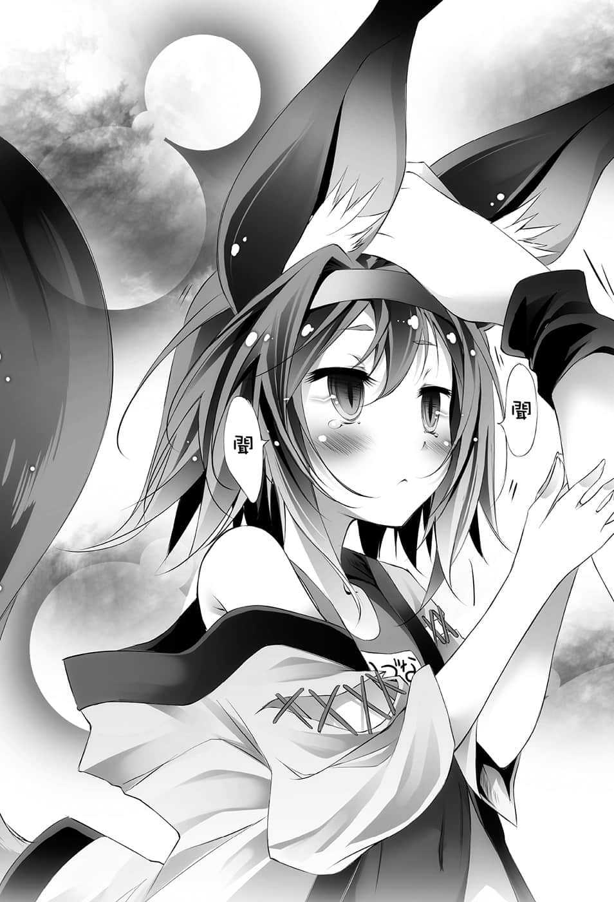

# 第四章 愚者

> 来源：https://www.linovelib.com/novel/9/2070.html

空间爆炸了。

在外界观战梦境的亚蜜菈，只感觉到那样的冲击。

「……咦？」

——见到破坏梦境世界，醒过来的众人，布拉姆和亚蜜菈惊讶得目瞪口呆。

她们之所以诧异，并不是因为布拉姆等数十人，在接受血的供给下所编纂的术式，仅仅因吉普莉尔的意志就轻易粉粹——的这个事实。

而是因为起来之后，空所说的话。

「——好了，将军，我们赢了。」

「……欸、那个，亚蜜菈有点搞不清楚状况耶～☆」

亚蜜菈笑容僵硬地说道。

但是白与空有如若无其事，简洁地告诉她：

「……这游戏没有设定……『不能储存中断』……」

「没有约定在全员被甩之前不能离开游戏，所以我们『中断』游戏也不会有任何问题吧……【盟约】必须严密地约定才行喔！」

空不耐烦地这么回答之后，对着醒来的众人说道：

「好了，吉普莉尔，已经可以了，把空气恢复吧。」

「——遵命。」

只见吉普莉尔若无其事地，瞬间用指尖画出魔法的轨迹。

——突然间，一阵暴风吹袭着女王的房间。

霎时水被推挤开来，在女王房间内——空气扩散开来。

「……咦……？」

布拉姆与亚蜜菈完全愣住，吉普莉尔浅浅一笑。

「如果是『油炸豆皮』就好了——是吗？」

「很敏锐嘛，吸血种——不再扮演可怜的跑腿角色被害者了吗？」

迎接他的视线，恭敬地跪在空的面前，吉普莉尔如此回答。

随着吉普莉尔的空间转移，只留下亚蜜菈和伊野，全员传送离去。

「因为……对伊野出手会有什么后果——你很清楚对吧？」

然后……听到接下来这句话，这次她明确地整个人僵住了。

而在稍微更远处——布拉姆也不发一语。

但是在他的笑容上——刘海造成的阴影和锐利无比的眼神。

不理会惊讶的巫女，空与白笑了出来。

她们不可思议地相互看着彼此。

众人回到海边。

空无言地进行这样的确认，不过吉普莉尔笑着回答：

——听到这句话，亚蜜菈的表情明显出现动摇。

「咦～？伊野大人～『还在这边』喔～！这么早回去没关系吗～❤」

「是，主人，我这边也是那样没错。」

在潮水声与火堆上的火花爆裂声中，空等人快乐地说道：

空努力不让人察觉自己心中的受伤，而将视线移开。

「失礼了……我只是把来的时候所带来，压缩成泡状的空气恢复成原状而已。」

史蒂芙和伊纲似乎没理解状况的样子。

「……热带鱼……可以吃吗……？」

吉普莉尔张开羽翼，光轮旋转中，众人急忙触碰吉普莉尔。

可是，空却轻松地说道：

「————咦？」

「喔，白，差不多快烤熟了吧？」

看到空的反应，巫女开心地笑了。

巫女一口喝干酒杯，吃着鱼，空接着她的话说下去。

看到亚蜜菈睁大了双眼，空有如嘲讽般地笑了。

空瞥了史蒂芙一眼，一边啃着烤好的鱼，一边说道：

先前一直假装保持平静的巫女，露出痛苦的表情。

在亚蜜菈身侧，伊野倒在地上不动，众人视线集中在他身上。

而在那和乐融融的光景退后一步的地方——

「那种事我也早就察觉了啦——……可恶。」

「——你为什么知道我最爱吃的食物？我有说过吗？」

「再来就是空的套问——对女王设定的『赌注』附和也是说谎——啊～还有……」

但或许是不打算再说明下去了吧，空拍了一下手掌，转身离开。

然后空转过身去。

那张脸足以让人感觉被猛兽所瞪视，空这么说道：

空以笑容回应她，最后——转而面向白。

如果她们以为那样的举动，不会被空看出『说中心事』的话——那也未免太——

「……真是爱使唤人啊……算了，好啦。」

在她旁边的是低头不语的伊纲。

「那边的海栖种——她一点也不想要唤醒女王喔。」

「噗哈——！……刚好用来当工作完后喝酒时的下酒菜……如果是——」

然而完全不需任何交谈——

「咦？咦？那个、怎、怎么一回事呀？」

听到那句话，布拉姆与亚蜜菈，两人的眼神略微游移了一下。

「她说你是她喜欢的类型，是帅哥什么的，那些也全都是谎言。」

「在我面前装笨蛋——小看人也要有个限度啊，外行人。」

——然后——这次轮到布拉姆整个人僵住了。

不过她仍靠着意志，盘腿坐倒在地，用手撑着脸颊笑了。

由于是连同大量海水一起空间转移，因此空等人就在海边烘烤带过来的鱼。

太阳早已下山，只有红色的月亮与无数的繁星——以及火堆照亮的沙滩。

迎接她的——空的浅笑，令布拉姆背上窜过一道寒气。

「这么长时间，用血肉之躯承受二十气压的水压……就算使用『血坏』也很难受呀。」

——有没有伪装的可能呢？

「……嗯……全部……记住了……」

——众人利用吉普莉尔的空间转移，从奥仙德回到海边。

伊纲的视线，不安地来回在伊野与空等人身上——

「————咳哈——！……呼……呼……哈哈。」

同样慌张奔跑过来的布拉姆——

「——我说吸血种和海栖种你们这些家伙，你们真以为能把我们当成『饲料』吗？」

看到亚蜜菈与布拉姆的反应，她似乎心情愉快，在痛苦地笑了一声后。

然后——仿佛瞧不起亚蜜菈与布拉姆一般。

「咦？那个！请、请等等我！」

然后依旧露出那张嘻皮笑脸的笑容。

「布拉姆所编纂的术式，正确、确实地为了使女王爱上他人而正常发动。」

「……你们以为在海中就能封住我的五感吗？」

——在巫女的脸上看得出……

「什、什么啊……这是怎么一回事呀？」

她似乎很痛苦地，却带着最大的嘲笑，以扭曲的表情笑了出来。

——这时亚蜜菈出声了。

「——毫无疑问有正常运作，而女王也确实受到了影响。」

似乎无法理解这一切的史蒂芙，心有疑问地大叫。

布拉姆、亚蜜菈，以及——史蒂芙露出一脸不明所以的表情。

对于能呼吸到长时间没呼吸到的空气，她肩膀上下起伏地笑了。

---

■ ■ ■

但是空似乎没有要理会她们的意思，他就像戴上面具一般，毫无感情地继续说道：

巫女打从心底想着『还好他们是自己人』，露出浅笑回答。

——仅仅这一句话，白就回应了哥哥所有的要求。

「请不用担心，您就是为此特地让巫女大人实际亲身体验一遍的吧？」

「——我兽人种『全权代理最强』之名可不是浪得虚名哦。」

巫女对空露出温柔的眼神继续说道：

在水被推开、弹开，产生出空气的大房间之中。

——接着她爽快地揭开谜底。

「——我们还会再来的，海栖种，小看『我们』的代价——很昂贵喔！」

「这是名叫『烈立铁』的海水鱼，听说味道还不错喔。」

「好了，要回去啰，吉普莉尔，我们回到海滩吧。」

——在此之前，除了梦中以外不发一语。

由于从过度痛苦得到解放的反动，巫女眼看就要倒下。

只见一瞬间，从体内挥发出的血之蒸气，自染红的全身冒出。

「是啊，没关系。」

「——不过『有那种程度的水压，血液就不会排出体外』——即便使用『血坏』也不会残留痕迹，所以才能不被发现，尽情听取她们的心跳声——辛苦你了，巫女小姐，请告诉我结论。」

「…………？」

似乎对各人的答案感到满意，空点了点头。

「遵命。」

「没什么——布拉姆想要陷害我们，如此而已。」

——就像在回答圆睁着双眼，望向布拉姆的史蒂芙一般，空开口说道：

「你想问我是从什么时候发觉的——是吗？布拉姆。」

……不，对着低着头的布拉姆——空有如嘲笑般继续说道。

看到布拉姆战战兢兢地抬起头，他苦笑之后，若无其事地说：

「是『从一开始』啦——你说的话彻头彻尾都很奇怪。」

有如仿效空一般，白、巫女、吉普莉尔也发出嗤笑。

——原来如此，吸血种与海栖种是共生关系。

由于女王进入沉眠，使得那样的关系崩坏而濒临灭亡。

对于吉普莉尔说的话，那时布拉姆没有反驳——不过……

空就像是听到无聊的笑话般，苦笑着说道：

「『因为创造出能够确实唤醒的魔法，所以请救救我们』——哈哈，根本不可能啊。」

「……咦？为、为什么呢？」

只有史蒂芙一个人跟不上状况，但是空却感到不可思议地，将串着烤鱼的竹签递过去——

「谎称有必胜对策，骗我们去玩不可能过关的游戏，让我们输个精光，这种方法赚更多吧？你不吃吗？」

「————…………」

对于脸上挂着笑容，说出这种残酷想法的空，史蒂芙的脸颊忍不住抽动。

「——话虽如此，还是有令我『挂心』的事。」

空一边吃着烤鱼，一边继续说道：

「因为我看不出布拉姆有在说谎，在同一个房间的伊纲，似乎也判读不出她有说谎的反应——啊，对了，伊纲，你不吃鱼吗？」

——在只有火堆的火光与红色月亮，以及星光照耀之中。

巫女笑着说道。

「我是为了套出需要的情报，所以才否定你。为了道歉，我就解答史蒂芙所感到的不协调感为何吧。」

「『我们的种族』如果不是说谎——也就是她想要我们救吸血种。」

「——因为她只要说了那句话就会变成『说谎』……对吧？」

白依照手机『原本世界』的标准时刻——将时间序列，甚至腔调都『完全记忆』。她将空所说过的话，等同于『重播』一般，正确地说出，众人听了都睁大了眼。

「为什么明明有恋爱魔法，还要请求我们援助呢？」

但是却被强迫赌上一切，买了自己的马票——被强迫『也』参加第二个游戏。

最初行动的是巫女。

资源提供、友好条约、布拉姆的人身自由——每一个都不像是女王设定的赌注。

那也就是说——

「赛马是让马匹赛跑，预测哪一匹胜出的『游戏』……不过它的根本纯粹是马匹赛跑——也就是『骑手竞赛的游戏』对吧？」

「……『赢了那个游戏，我们能得到怎样的代价？』……」

然而空却夸张地，仿佛沉思一般地——

若无其事地说出惊人之语，吃着鱼的空，毫不在乎地继续说道：

空没有理会把眼睛圆睁成玻璃珠一样的史蒂芙。

「——欸、咦？」

一边回想与布拉姆最初相遇的夜晚，空一边递出竹签说道。

终于，史蒂芙到达违和感的『本质』了。

「好了，这样判断材料就都齐全了吧？」

————她一次也没提到！？

「你在我们到达海底——到达你以为能封住巫女小姐和伊纲的五感的场所之前，一直都避免提及这件事，『亚蜜菈说不会有风险』只是这样一句话，为何你说不出口？」

「所以她是真的有必胜的魔法——那么为什么要请求我们救援呢？」

他将原本在手上把玩的一根竹签——投向坐在海滩的布拉姆，插在她身旁的地上。

「没错——就是『这里』，没有说谎——但『也不存在真实』。」

仿佛像是回应这么说的空一般。

她微微一笑，回答了这个疑问。

吉普莉尔所射出的竹签伴随着冲击波，命中空的第二根竹签——将之击碎。

「没错，所以为了保险起见，我也把她带去巫女那里——但她还是没说谎。」

「好了，这时候『问题』来了……为何她不能提及游戏的双重性呢？」

「——为什么要避免提及与游戏的双重性有关的事情呢？」

这次则是『重播』布拉姆说过的话，听到白的回应，空露出苦笑。

四对神秘的眼眸，各自发出独特的光芒。

「——而听到我这么说，布拉姆又是怎么说的？」

那么，女王【向盟约宣誓】进入睡眠的游戏。

「……ＵＴＣ世界协调时间6／20 04：28……布拉姆……『请救救我们的种族！』……」

然而空仿佛看穿了史蒂芙的思考一般……

「赛马是——『以骑手的游戏为材料所进行的赌博游戏』——是双重的游戏。」

空露出坏心眼的笑容看向布拉姆。

——空将视线移往膝下的白，而白回应空说道：

空回答之后，接下来行动的是吉普莉尔。

宛如录音机般，正确地念出一字一句——

「——做好心理准备了吗？布拉姆。」

「骑手们我们为了追求女王的爱而进行赛跑恋爱游戏。」

「……欸、不、不是女王的爱……让女王醒来吗？」

「那么，假如这是赛马的话，骑手们我们的——比赛的『奖金』到哪去了？」

「……『呃……提供奥仙德三成的海底资源，以及缔结永久的友好关系……还、还有……那个……我、我可以随你们处置』……」

空点了点头，如此一来那所代表的意思是——空朝白使了个眼色。

「这个『游戏』啊——就好像是『赛马』。」

但是，脸上挂着阴森地晃动着的笑容，空继续说道：

往总计插着三根竹签的海滩看去，空告诉布拉姆。

「也就是——只——救吸血种——那么，该怎么做呢？」

「但是就算没有说谎——也不代表那是真实。」

「可是布拉姆在那里展现的竟然——『真的是能确实爱上人的魔法』。」

还好这个世界也有赛马，空内心点头庆幸。

然而——

「疑问，有三个。结论，只有一个。」

空一边望着布拉姆，一边玩弄手上的竹签说道：

只见在稍远的地方，伊纲微微地摇头拒绝。

「这一连串的游戏有两个面向，可是当空提及『游戏获胜的利益』，那边的吸血种的回答却刻意避开了双重性，她并没有说谎。」

——摇头说「问题不在那里」。

「……ＵＴＣ世界协调时间6／20 22：43……『布拉姆』……」

空用原本在手上把玩的竹签指向史蒂芙。

巫女苦笑一声，用手把玩着吃完鱼后的竹签。

如果依照空举的例子，我方就是进行赛跑的骑手。

史蒂芙那时感到只能以『不对劲』来形容的不协调感，那是——

「史蒂芙，对于将『一切』赌在他们的游戏上这件事，你不是提出抗议吗？」

「对，她没有说谎——而『那才是问题所在』。」

巫女射出的竹签发出破风之声，命中空的第一根竹签，将之击成两半。

「是、是啊……因为我们是受到请求前去助人的耶？」

被这么一说的时候，巫女听见布拉姆的心跳声有『被说中心事』的声音，她微微一笑。

「赛、赛马？赌马匹赛跑的那个吗？」

「因为不能说谎。」

「简而言之，那、那意思是，她并没有说谎不是吗？」

若吉普莉尔处于警戒之中，伪装谎言的那类魔法就会被她看穿。

意思不就是她是真的想要空他们的救助吗——？

「……ＵＴＣ世界协调时间6／20 22：42……『哥』……」

「另一方面，亚蜜菈和布拉姆所提出的资源提供、友好条约，纯粹是对『女王醒来』这个马票的『奖金』——赛跑和赛马赌博明明是两个独立的游戏，我们却被迫既是以马的身份，也是以赌客的身份参加游戏——当然会有违和感。」

说得明白一点，那就是——

「没错，你是正确的。」

她面无表情，平淡地——

「…………不要，得斯。」

他一边逐步将鱼放在火上烘烤。

用有如啮齿类般的小口咬着鱼，白技巧地将布拉姆——最初的台词『播放』出来。

一根——又一根地，空以同样的方式投掷竹签。

判断相互对等的『赌注』——支付给胜利骑手——

接着坐在对面喝酒的巫女也——闭上双眼摇头。

——在火光照耀之下，空看起来似乎很愉快。

那么在兽人种最强的『巫女』面前，只要说谎就会确确实实地败露，空是这么估算的。

这时在空的背后，忙碌地处理鱼，将鱼刺成串，沾上调味料的吉普莉尔，将抹上盐巴、串过竹签的鱼递给空，一边说道：

听到史蒂芙这么问，空手上玩弄着竹签回答道：

「——能让女王爱上他的话，女王就会爱他？为了爱上的王子而醒来？——这根本语无伦次，而且只有女王单方面得利吧？献给『相互对等』的胜利者的赌金在哪里？」

……史蒂芙倒抽了一口气，心想原来如此。

——关于那个赏金——

「因为布拉姆不能说谎。」

空回答之后，最后行动的是在空膝上的白。

「……归根究柢……为什么——只要说了谎……就不行呢？」

白所射出的竹签画出弧线，命中空的第三根竹签的中心……将其连接起来。

「因为只要说谎——就会败露。」

——没错。

「如果这是『赛马』，那么不可忘记——赌的马是各自不同。」

海栖种赌的是——女王。

吸血种赌的是——空等人。

两个游戏，两种企图。

综合以上所有的推论。

没错，结论——『只有一个』。

「海栖种打算利用『沉睡女王游戏』，把『人类种变成饵食』。」

「什么————！」

惊讶的只有史蒂芙一人。

海栖种就如同空最初所说。

谎称是必胜的游戏，将空等人——人类种的全权代理者引诱进游戏。

企图得到新的『繁殖材料』——人类种，借此回避种族的危机。

但是——

「吸血种更是利用这个计划，背叛海栖种——企图『解放吸血种』。」

「让女王恋爱的是你的魔法，而不是我们，所以你就能独赢了。」

——包含种族棋子在内，正如字面的意思，意味着『得到一切』。

——……只听到嘎嘎声响。

然后空的表情一转，他收敛笑容，以严肃的表情说道：

「——咦？」

「而是亚蜜菈笃定我们『绝不可能』唤醒女王。」

而且自己几乎什么都不做，交给别人去辛苦，自己只接收成果。

「女王醒来的条件——『不是让她爱上人』。」

原本会答应这个条件的就只有空他们而已。

「在游戏开始之前都『不说谎』是不可能的，因为必须让我们因盟约赌上『一切』，而要拆穿你的谎言，巫女小姐必须在——不受你的可疑魔法影响的状态下。」

没错，因为那样一来，一切就都合理了。

空甚至收起嘲笑般的笑容。

同时请吉普莉尔前往远洋，确认奥仙德的位置。

为何——伊野无法攻略游戏呢——

但是空仍在伤口洒盐。

「到这里为止，我在去海边之前就已经推理出来了。」

那正可说是理想的获胜方式，不过——

现在对于那个『赌博』，只要满足胜利条件——就是海栖种的全部。

「虽然海栖种与吸血种赌的马各自不同——可是别忘了？对方让我们赌上所有，买了自己的马票，参加赛马与赌博——所以我们也握有马票。」

没错——布拉姆要让女王恋爱，真的打算唤醒她。

他蹲下来，来到与坐倒的布拉姆同样的视线高度，然后小声地，直接了当地说道：

请巫女小姐和吉普莉尔假装嬉戏，检验能否利用水压伪装『血坏』。

『血坏』的疲劳则是由白抚摸巫女小姐到夜晚，等待她回复。

空的声音有如确认一般，却又有如开玩笑似地说道。

空是发自真心，不带讽刺地鼓掌称赞。

然而空似乎并不在意，只是一边确认鱼烤得如何。

那是布拉姆紧咬牙根的声音，然而空仍继续说道：

「————那就是『骗过你们全员，由我们取得胜利』的马票。」

——那是指谁，空就刻意不说了。

那么————

但是——就像是要求暂停一般，空举起了手。

由软弱所生出的——胆小。

「来吧，让我们回想一下吧，女王游戏获胜时的『奖金』是什么？」

「但是……毕竟没有确切的证据，所以我才决定前往奥仙德。」

弱者——体现了这个词语的男人，危险不安地逼近布拉姆。

——没错。

连一直完全瞧不起的海栖种都骗过了她，布拉姆坐倒在沙滩上。

「你所看不起的海栖种——把你的背叛都计算在内了。」

——然后空嘴角一扬。

但是既然空他们识破所有阴谋，中断游戏，那布拉姆就无计可施了。

——就连布拉姆也参加游戏的理由都轻松看穿，空继续说下去。

——布拉姆脸色苍白。

创造出不论事情如何发展，自己都能够得利的状况。

但是现在不同。

一对冰冷的琥珀色眼眸，吉普莉尔露出嘲笑。

「强者的天敌是弱者，但是弱者的天敌却不是强者——而是更弱者。」

现任女王在进入睡眠当时，她还不是女王——意即还不是『全权代理者』。

「那是让布拉姆——让吸血种判断只要得到，就能得到解放的『赌注』吗？」

「——嗄？」

……

制造出布拉姆若要为我们施加水中呼吸魔法，需要补充海栖种鲜血的状况，逼使你离开我们；而吉普莉尔则趁那段时间，将带去的空气压缩、保存；然后吉普莉尔对巫女小姐施加妨碍措施，使你的水中呼吸魔法失效；在即使身处海底也能全力活用兽人种五感的状况下，与亚蜜菈会面。

一对妖艳的黄金眼眸，巫女脸上浮现浅笑。

因为弱者所根据的是到了自卑地步的——

「……——！」

「————……啊！」

然后——在月光之下，异样锐利的四对眼睛开始论述。

…………————

在水中能呼吸也能谈话的魔法——

强者使用弱者的智慧武器，也发挥不出真正的价值。

布拉姆的魔法正常发动了。

「有兽人种在场就不能说谎，但是因为有两种企图，所以也不能说出真相。」

用极尽挖苦的声音说道：

「哎呀，你很了不起，布拉姆，那是符合弱者的优秀作战方式，不愧是因『十条盟约』而一口气失去力量的种族会有的智慧。毕竟即使亚蜜菈的阴谋得逞，人类种成为『饵食』，吸血种还是能够延命，因为就算真的能够唤醒女王——」

然而，不理会战栗的史蒂芙，空再度苦笑。

「难得的海边，所以我们当然要好好享受一下——也就是说……」

「你没发觉吗？这次的问题不是你的阴谋败露；也不是隐瞒关于女王游戏获胜时真正的『奖金』，企图解放吸血种这件事；甚至也不是——你拥有绝对确信的魔法无法唤醒女王这件事。」

——没错。

不等待很可能是陷阱的『迎接船』，使用吉普莉尔的空间转移前往。

然后，空对布拉姆露出最残酷的笑容。

「女王赌的是——『自己的全部』……我说对了吧？」

然而即使如此，女王仍然没有醒来。

他一口气有如连珠炮一般——把剩下的谜底全部解答。

布拉姆倒抽了一口气。

——就是这样，你察觉了吗？」

「好了——将军。」

「……关系海栖种的存亡……能够取回吸血种权利的东西……」

——意思就像在说『好戏现在才开始』。

一对毫无感动的红宝石眼眸，白浮现出同情的微笑。

——布拉姆垂下头，史蒂芙则是倒抽了一口气。

而且术者是已经确定是『敌人』的布拉姆，她骗过五感的可能性很高。

——不管是布拉姆还是史蒂芙，都惊讶得说不出话来。

「把你带到大热天的海边，让你衰弱。

轻松地说出令史蒂芙怀疑自己耳朵的话。

然而亚蜜菈——却不是如此。

「自觉是笨蛋的笨蛋——比自以为聪明的笨蛋更为难缠喔。」

「亚蜜菈原本就知道那一点，不然就算你再怎么怂恿，她也不会给你『让你真的叫醒女王的机会』，因为那对海栖种而言是致命伤——这下你明白了吧？」

「符合弱者的战略，了不起的策略，不过——那终究只是徒具其形而已。」

「你疏忽了一点喔！」

还是一样，只有史蒂芙不发一语，说不出话来。

「那是足以让亚蜜菈——让海栖种比起唤醒女王，宁愿选择维持现状的赌注吗？」

空好似很愉快地对着布拉姆笑道，他移动视线。

吉普莉尔也断言，对女王毫无疑问起了作用。

各人依照顺序说道，而一对黑曜石眼眸的空则是面无表情——做出结论。

「话说在前头，我这个人是不会恭维别人的，我是打心底认为——真是了不起的战略。」

在揭开所有的谜底后，空说道：

原本低下头的布拉姆抬起头来。

这么一来，海栖种为了生存下去，只能吃掉吸血种『秘藏的最后男性』。

既然已经确定吸血种背叛，那么海栖种就更会那么做吧。

——这样一来，首先是吸血种『死棋』。

然而吸血种灭亡后，就轮到海栖种灭亡了。

海栖种——有必要找出能够取得繁殖许可的对象。

可是她们为了繁殖要求的是『性命』，这样当然不会有人答应。

——如此一来，海栖种也会跟着『死棋』。

想要延命，只有无条件投降所导致的——『家畜化』。

「布拉姆，你知道游戏最终极的获胜方式是什么吗？」

那是令人不寒而栗——有如恶魔般的笑容。

「——是『不战而胜』。就算不赢得女王的游戏，我们也赢了。」

然后是把布拉姆拉进地狱底端的——笑容。

「想用『弱者的战法』胜过人类种，你们的资历差太多了——菜鸟初学者们。」

——一步。

仅仅一步棋，就将两种族的生杀大权掌握在手中的男人。

他阴森恐怖地这么笑着说道。

---

■ ■ ■

「好了，你们应该明白概要了吧，话说……」

空一副坐立不安的样子。

仔细一看，坐在他膝上的白也似乎忸忸怩怩的——

「咦？主人，怎么了吗？」

只有潮水声与火堆中跳跃的火花爆裂声。

只有这个疑问尚未解决，史蒂芙大声地叫道。

「什么也不做。只是那样就能得到两个种族——很划算的买卖吧？」

——好吗？史蒂芙这句话还没说完，但是隔了一段距离坐在地上的伊纲，抱着双膝，像是在忍耐着什么的样子，让史蒂芙说不下去了。

「您就是用这种使孩子哭泣的方式，建立起东部联合的是吧——太不象话了。」

（那我也随时会被舍弃吧——谁能相信那种人呢！！）

终于跟上状况的史蒂芙追问道。

布拉姆利用那个计划，企图解放吸血种，这也已经理解。

……史蒂芙无法反驳。

——东部联合的这种做法——不是从现在才开始。

为了利益，就连那样的人都能轻易地舍弃的话——！

——泪如雨下。

只花了短短半世纪就将他们统合起来，推动东部联合成为大国的那种手段——

空他们和巫女商量好——得到让两种族『死棋』的一步棋。

在空他们不在的艾尔奇亚，唯一支撑史蒂芙的兽人种——初濑伊野。

「好了，再来只要等她们无条件投降吧。我累了，要先一步回去了。」

「——厕、厕所在哪里？」

白泪眼汪汪地表示，而巫女则是开怀地笑道：

紧咬着牙，像是吐气一般。

即使努力地尽可能不使任何人受到损失，但完全平等那种事，毕竟是不可能的。

但是，史蒂芙——反而感觉到头脑的热血逐渐消退。

事实上，就连面对艾尔奇亚的诸侯们也是那样。

——就把伊野当成弃子——！

兽人种——拥有超出常轨的五感，那时全员已沟通完毕。

——为了多数而割舍少数——已是司空见惯的事。

「——即使如此，你还是感到悲伤不是吗？」

在月光映照下更显妖艳——她露出如同妖怪般的阴森笑容说道：

「除此之外还有怎样的厕所啊！」

史蒂芙的脑中闪过在海边的一幕。

——对了，伊纲对这样的状况不可能认同。

「我不希望爷爷死掉……可是只要伊纲一个人忍耐就好了吧，那样一来——那、那样一来！就会有更多人……得救吧，得、斯——」

——兽人种过去曾经分裂成多数的部族，持续着纷争。

「……不管是爷爷的心跳还是气味，永远都是好声音和好味道，得斯。」

自己的祖父被牺牲掉了，念在伊纲的份上，巫女也——

伊纲用颤抖的声音提出那个疑问。

这种不言自明的道理，巫女不可能不懂——

即使在黑暗中，从伊纲的声音也能知道她正流着大颗的泪珠。

要那样一个小孩，要一个年仅八岁的少女，比她不想比的游戏，甚至对快乐的事物抱持罪恶感，让她背负大陆领土这个沉重的负担。这个事实让史蒂芙领悟到：

应该是讨厌给伊野抚摸的伊纲，却毫不犹豫地——朝伊野走去。

将那些全部看穿，空他们更超越在她们之上，这个也能认同。

————…………

现在甚至不是那样吐槽的时候了，空站起来。

「哦？」

「……因为空说过——没有人会死，没有人会痛苦、得斯！……然而、然而为什么——伊纲会痛苦，得斯？伊纲很奇怪吗，得斯……！？」

巫女就这样仰望着月亮，惋惜地说道。

——原来如此，海栖种想要把人类种变成饵食，这个已经知道了。

不知情的只有史蒂芙一个人，但是——

也就是说——把这件事归纳起来。

——吉普莉尔姑且不论，巫女小姐是『生物』吧——

映出了隔了一段距离，坐在那里的伊纲。

空与白吵吵闹闹地奔跑离去。

然而伊纲颤抖的声音。

「……哥、哥……白、白也……」

为了这个目的，只为了这个目的，竟然这么轻易地。

金色的——如同字面意思的『怪物』，尽管巫女那猛禽类的眼神令史蒂芙差点脚软。

太听话，太纯粹，太聪明——太乖了。

海边的闹剧之后——在决定要给空还是伊野理毛的时候。

一副足以使刚才紧迫的气氛瓦解的可怜表情，空这么问道。

远离火堆，只有月光和星光的照耀，看不见伊纲的表情。

「初濑伊野，他毫无疑问是个干练的人才，是从东部联合初期就支持着我的男人，更不用说若是要他为了东部联合的利益而死，他也会回答『遵命』的男人——这样贵重的人才实在不能说是廉价——不过他在最后也达成巨大的战果，是个无可挑剔的男人啊。」

巫女一副疲惫的样子，她站了起来，转身准备离去。

但是——

「……爷爷早有觉悟了，得斯……」

不管是对东部联合，还是对艾尔奇亚——对史蒂芙来说，他应该都不是廉价的人才，更何况为了多种族的合并，一方的种族出现牺牲者——那将会产生难以估计的不良影响。

巫女表示『没有』那种外交选择，史蒂芙终于全都理解了。

伊纲打从最初就接受这个结果了。

「欸～这里是海滩，至少应该会有『海滨茶屋』吧！在哪里啊！」

然而巫女却正面迎接她的视线，回应她：

海栖种还握有『初濑伊野』这张牌。

带着哭声的话语——即便是在黑漆漆的海边，也如实揭露出她的表情。

（不管是空他们还是巫女小姐，打从一开始就没打算救任何一个人——！）

「为了多数而牺牲少数——那甚至不是必要之恶，而是『必然』。如果想要顾及到每个人——那每个人都只会主张自己的愿望，政策要怎么推行呢……小丫头。」

「我、我们——不，我是去厕所，白是去摘花喔！」

然后空突然指着周围所有的人大叫。

空突然抱起白，然后发足奔跑。

之后只剩下宁静无声的海边。

但是，即使如此——史蒂芙仍在环顾周围，用尽力气挤出声音。

「……那种事……我不认同。」

然而——回过头来的巫女。

「喂、等一下啊！伊野先生该怎么办呀！」

…………

史蒂芙感觉自己似乎窥见一鳞半爪了，她对着巫女——甚至带着轻蔑指责道。

「我没有悲伤——我只是……有些事情不懂，得斯。」

初濑伊纲——这个孩子太过年幼。

「伊、伊纲觉得那样——」

「您说厕所……就是人类种进行排泄的房间——」

「美女是不会做那种事的，虽然不明白你们的心情，不过在附近找个地方解决就好了吧？」

「话说你们这些人到底生了怎样的膀胱啊！一整天在海边，潜入海底，夜晚回到海滩，还吃了鱼，这样一般来说当然到达极限了吧！」

——她明白……那将会是最后一次。

「……哥、哥——不、不要……摇晃……」

在如此激昂的史蒂芙视界里。

虽说只有短短两星期，一起游戏，一起为重建艾尔奇亚而奋斗的他，对艾尔奇亚联邦的构筑尽了偌大的心力，如果没有他，可能还连个谱都没有。

虽然因为天色昏暗而看不清楚——却听得到伊纲的声音。

史蒂芙握紧拳头，这次则是吉普莉尔对她展开追击。

或许是无法理解史蒂芙的主张吧，她的表情像是纯粹感到疑问。

「小多还有什么不满吗？只牺牲一个人，就能拯救两个快要灭亡的种族；也可因此壮大艾尔奇亚的国力，与东部联合建立联邦又向前接近一步——这样你还有什么好要求的呢？」

——史蒂芙仍是无法反驳。

「该不会——」吉普莉尔继续说道。

「你以为没有牺牲和不满，就有可能征服世界——不，退一步说，就有可能夺回艾尔奇亚的国境吗？」

「……………………！」

「还是说你只是单纯地——」

吉普莉尔以更加挑衅的笑容说道：

「仅限于周遭的人，不希望他们受苦——真是自私自利到极点呢❤」

史蒂芙紧咬着牙——她很清楚。

只牺牲一个人，可以得到两个种族。

拯救如果放着不管就会灭亡的两种族。

如果说对牺牲伊野一人会感到不值得的话，那——

「——那又怎样……！」

史蒂芙毅然决然地开口了。

视界中看到颤抖的伊纲，她有如豁出去似地——大叫。

「自私也好，自利也好，喜欢怎么叫随便你，即使如此，只有一件事我能够断言！那就是用这种方法想合并全种族——那是不可能的事！！」

——她并没有什么理论性的根据。

巫女和吉普莉尔说的话很正确，毫无疑问的那恐怕是比较实际的做法。

众人说不出话来，然而不知道刚才那番谈话的空，只是平静地继续说道：

仔细地窥视布拉姆的反应——然后摇摇头，她没有说谎。

「……为什么你能那样断言？」史蒂芙问道。

「可、可是关于伊野先生，巫女小姐说『什么都不做』喔——」

空开玩笑地这么说道，史蒂芙则在稍远处看着这一幕。

---

■ ■ ■

听到空的回答带着明确的『否定』。

空目光锐利地看着布拉姆说道：

「……是、是的……」

然而在史蒂芙瞪向她之前，吉普莉尔表情严肃地说道：

「……嗯，我相信，得斯。」

「啥～？你说这什么话呀，史蒂芙你这家伙。」

就连『十条盟约』也变得不值一提——那两个字就意味着绝对遵守的誓言。

「对不起，小多，我玩笑开得有点过分了。」

「那样危险的事实，当时只要有亚蜜菈程度的人在，就会进行隐蔽——而终极的隐蔽法是？」

但是——

「不使用布拉姆的魔法，只要我们真的唤醒女王，那吸血种和海栖种都不会灭亡；也可以用那个为条件，要她们释放伊野，这样事情就圆满解决了吧——再说那个游戏只是『中断』而已，『放弃』违反我的信条，所以我们要再战——」

但是，即使如此，不知为何史蒂芙就是能确信『不是那样』。

「啊……这气氛是怎么回事？」

伊纲不知道也是没办法的事。

但是那个手段——吉普莉尔继续说道：

「……哥绝对……不会破坏约定……」

「主人们毫无疑问会改变这个世界吧。」

——没错，也就是说。

不过——空将手放在伊纲的头上，强而有力地抚摸着，然后笑着说道：

「好，我被相信了，得斯。」

不安的眼神这次则是移向白——迎接她的是『确信』。

「海栖种不会使用魔法，而吸血种会使用——如果有人知道的话，早就败露了，亚蜜菈大概也只知道——『不是让女王爱上人的游戏』。」

想用正攻法合并全种族——那是不可能办到的事吧——

「那才叫——『并肩作战』对吧？」

……不是演技，似乎真的是伊野的价值仿佛股价爆涨似地，空如此断言道。

但是——听到令人感到寒意的觉悟，以及接下来的话语，史蒂芙倒抽了一口气。

在她旁边的是吉普莉尔。

因为接下来是——空他们要『全部得到手』。

「何况——我说过会再来吧？亚蜜菈不能对伊野出手，因为那是让我们重启游戏的唯一手牌，如果对伊野出手，那她们就真的只剩下『家畜化』一途了。」

那是……只有白知道的事。

两人强而有力地——提出这不知是可靠还是丢脸的主张。

不过——

然后——擦了擦湿润的眼睛说道：

眼睛红肿的伊纲，仍以带着不安的眼神，抬头望着空与白。

「咦？你说没有人知道……那是怎么回事？」

…………————咦？

「我很清楚了，牺牲伊野先生一人得到两种族——那根本只是『恐吓』……我看错你了！用那种方法亏你还有脸说什么全种族合并！！」

就必须找出除了沉睡的女王本人外，谁也不知道的条件。

哥哥——空——说出『约定』两字的时候。

「……那、那个……空，你不是——要舍弃伊野先生吗？」

「我大概猜得到——没有人知道那个条件……对吧？」

「那是当然的啊，我一定会把老爷爷夺回来——我和你『约定』。」

原以为已找出条件的布拉姆，带着叹息如此说道。

「——啥？」

「我也不能让活着的文化遗产伊纲悲伤，而且伊野——那个男人中的男人，我怎么可能舍弃他呢……史蒂芙，会累也是没办法的事，不过要睡昏头也得先起床喔！」

——嗯哼一声，清了清喉咙，「回到原来的话题吧。」空这么说道——

「巫女小姐连续使用可能要以付出生命为代价的力量『血坏』，甚至还提供重要的部下给我们——这次轮到我们要拼死拼活了——如同字面上的意思，要赌上性命放手一搏。」

而且——史蒂芙的视线如针一般刺过来。

「……没人知道真实的话……就不会……被任何人知道……」

那就是——名为『胜利条件』的游戏。

对于那只强而有力抚摸着头的手——伊纲闻了闻味道。

只见有个娇小的人影，从愣在原地的史蒂芙身旁通过。

她们两人说的都很有道理，是正当的正攻法。

没错，巫女——什么都不做就可以了。

不过看到兄妹两人如此断言——史蒂芙战战兢兢地问道：

不理会愣住的众人，空用手扶着下颚继续说道：

史蒂芙朝伊纲偷瞄一眼。

听到空答得如此干脆，史蒂芙的眼睛睁得更圆了。

「……嗯……！」

「女王的沉眠是在她还不是女王的时候……可是以她的立场，迟早会成为女王吧……那样的人，如果说要把自己的全部权利给你……你会怎么做？」

空与白不知道伊纲哭泣的原委。

「才不久呢，我是去上小号啦！！算、算了，虽然不太明白，不过尿意也解决了。」

「因为我很好奇你会有什么反应，忍不住就……不过小多是对的。」

直到刚才还在哭泣的伊纲，或许是对空所说的话感到在意，她抬起头注视。

空轻松地宣布，白轻松地点头附和。

空与白点了点头，继续说下去：

——表情像是在吐舌头一样，好奇心中毒者这么说道。

看到史蒂芙声色具厉，但是空搔搔头，困扰地询问白。

擦过手，空与白带着祥和平静的表情回来。

「欸、那个、白，我为什么被骂啊？」

「那我们就重新——为了唤醒女王，我们要展开行动啰。」

几乎等于是不可能破关的游戏，可以说极为困难。

要克服女王的游戏……

不过对于如同预料的回答，空点了点头。

「问题是『女王要怎样才会醒来』。」

为什么——大概是因为——那就是『道理』吧。

「……什么？」

「……小伊……相信哥……」

听到白这么断言，伊纲再度抬头看着空。

然而史蒂芙又说道：

——可是，归根究柢。

「简单说你是选择逃避吧？」

然而迎接他们的却是离去的巫女，以及沉重的气氛。

「……你们打算去救爷爷，得斯？」

「……太久了的……关系……？」

就连名字被直接当成骂人的话，她也不在意了。

「只要真相不是『真实恋爱游戏』——『空白』就不会败北！」

「那是当然的啊，巫女小姐让我们用伊野来『印证』，剩下是我们的工作。」

「因为任何既知的手段都不可能办到。」

「………………」

——那么关于查明唤醒女王条件的方法——

空接下来说的话，史蒂芙只是心不在焉地听着。

……那时候，听到巫女和吉普莉尔说的话——她觉得『不对』。

找寻觉得不对的理由的史蒂芙——见到眼前的两人，终于理解了。

空……白……他们两个人……

不会使用任何正当手段。

『道理』那种东西，他们嗤之以鼻。

『常识』那种东西，他们一刀两断。

那两人说过——要不死一人、不流一滴血，称霸全种族。

那种像梦一样——不切实际的事情，不可能有道理存在。

——但是他们的背影，却让人感觉他们『办得到』。

那一日——加冕仪式的那一天——史蒂芙似乎看到了。

她可能和站在身旁的吉普莉尔看到了相同的东西——

——理解到自己预感到这个世界的未来，她的胸中激荡不已。

「啊～对了，史蒂芙，你刚才说了我不能当做没听见的话。」

「咦？」

愣愣地听着的史蒂芙，听到空说的话而回过神来。

「牺牲伊野一人得到两种族——首先牺牲伊野这是错的，还有——」

然后她再度听到令自己愣住的话语。

…………————咦？

「不是两个种族——是『三』个种族喔♪」

…………
