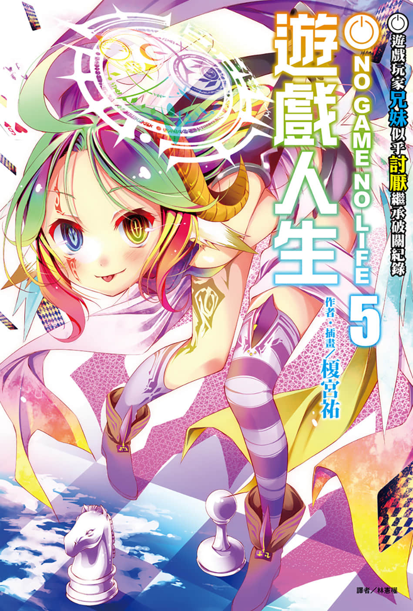
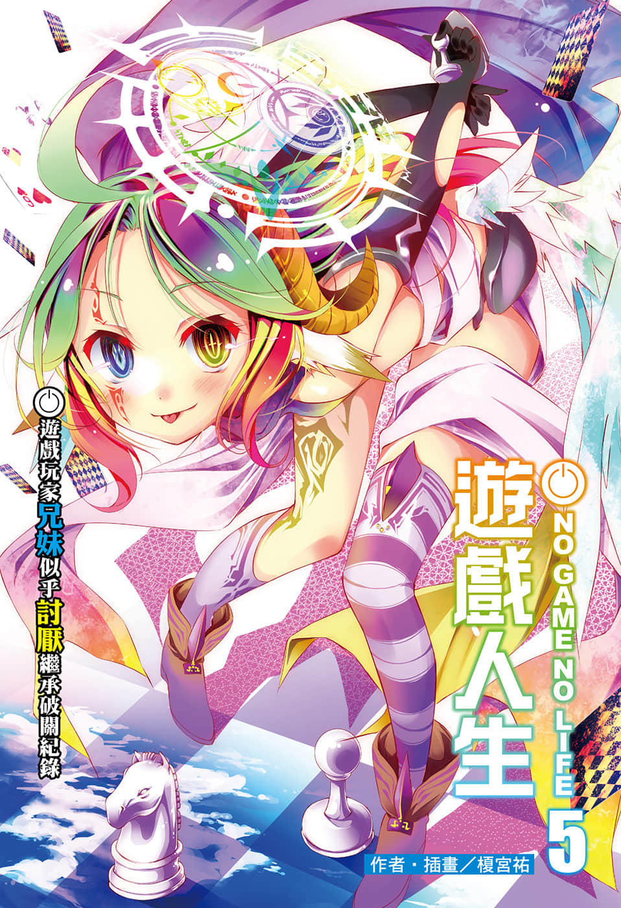
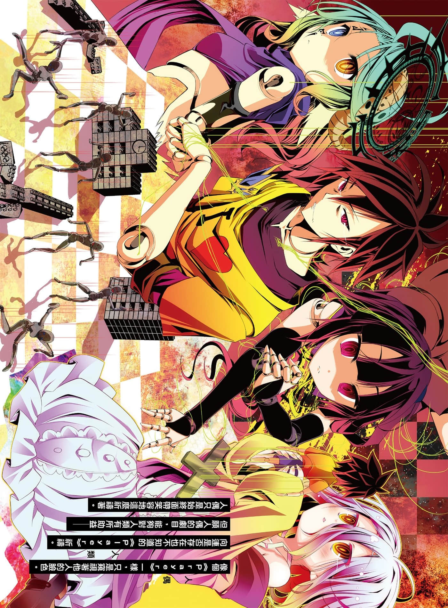
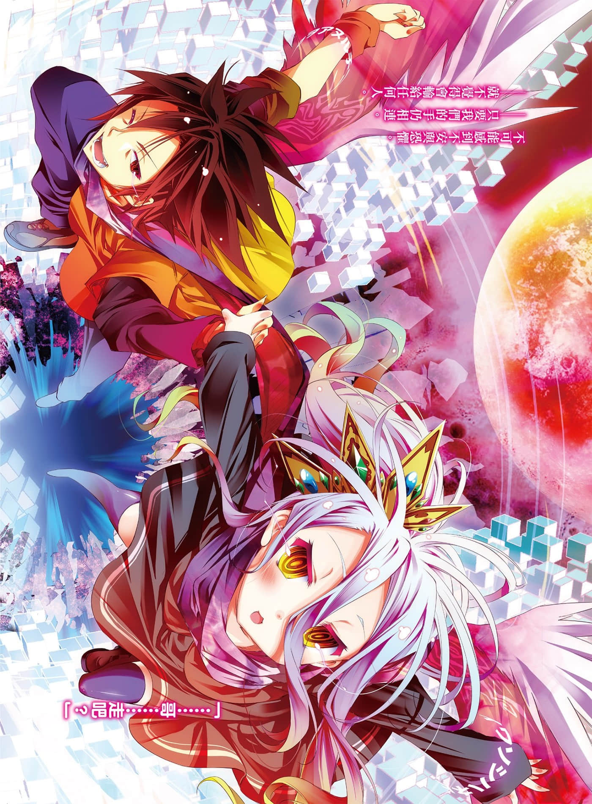
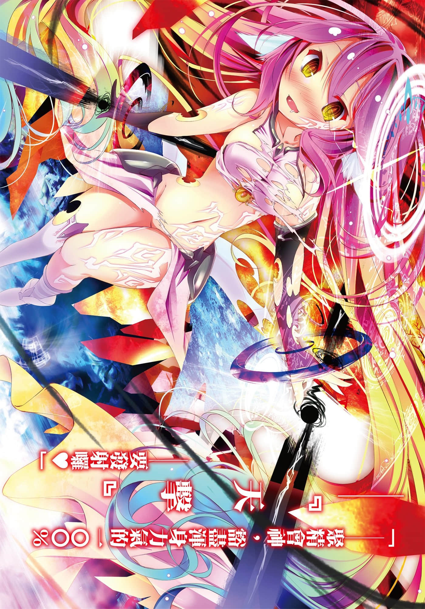
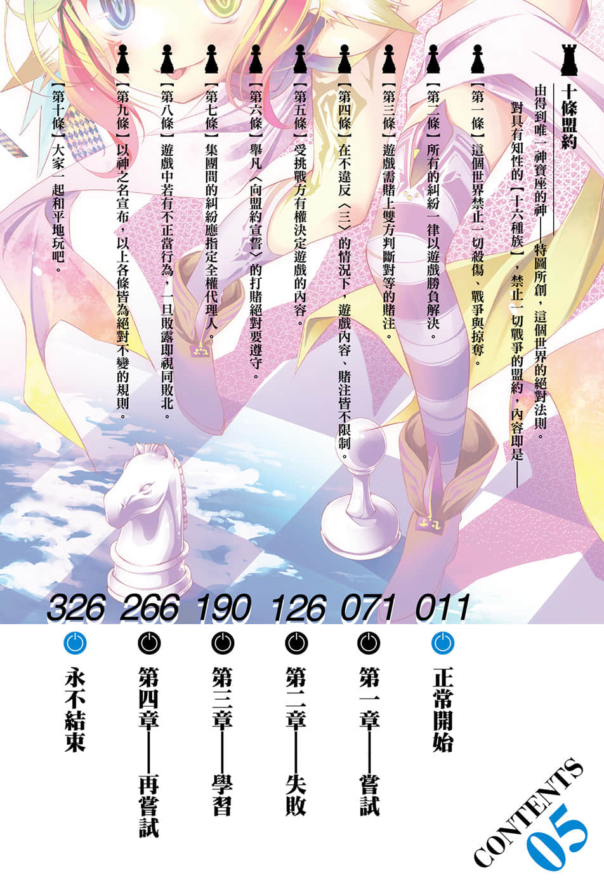

# 插图

> 来源：https://www.linovelib.com/novel/9/118065.html

台版 转自 深夜读书会

作者：榎宫祐

插画：榎宫祐

译者：林宪权

图源：深夜读书会

录入：深夜读书会

深夜读书会：ritdon.com

仅供个人学习交流使用，禁作商业用途

下载后请在24小时内删除，深夜读书会不负担任何责任

请尊重翻译、扫图、录入、校对的辛勤劳动，转载请保留信息

————————————————

【内容简介】

征战空中都市！！

空与白能否降伏『杀神种族』！？

在一切都以游戏决定的世界【迪司博德】——地球出身，成为人类种之王的最强游戏玩家兄妹空与白，在躲过吸血种与海栖种的『真实恋爱游戏』之后，为了发掘真正的攻略法，他们前往天翼种的故乡，空中都市『阿邦特・赫伊姆』！

但是序列第六位，狂澜怒涛的『杀神种族』绝非泛泛之辈——！

携手压制天空与海洋的游戏玩家，能否一举降伏三种族呢！？

「以『我最强』状态玩游戏，结果输一次就认定是烂游戏？给我从『我最弱』状态重新开始！」人气鼎沸的异世界幻想小说，谎言、欺骗与阴谋交织，战斗接二连三的第五集！！

【作者简介】

榎宫祐

太好了呢〇惠，截稿日增加了！

就算没有悟道，我似乎也能涅槃了呢。

和导演两人处在「别以为死了就能轻松♪」这样充满欢乐的职场，

「知道这是什么的人是我的心灵之友」

榎宫祐

我是榎宫。现在正在制作动画中！

【绘者简介】

我是榎宫。本作决定要动画化了！

我今天也努力画着画。

