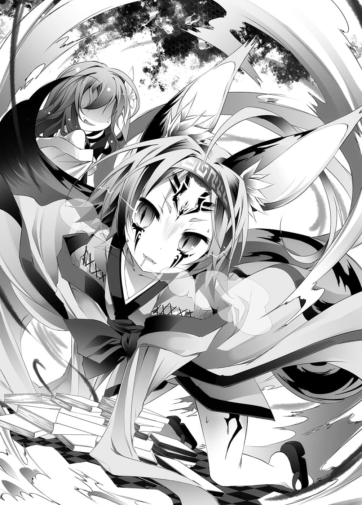
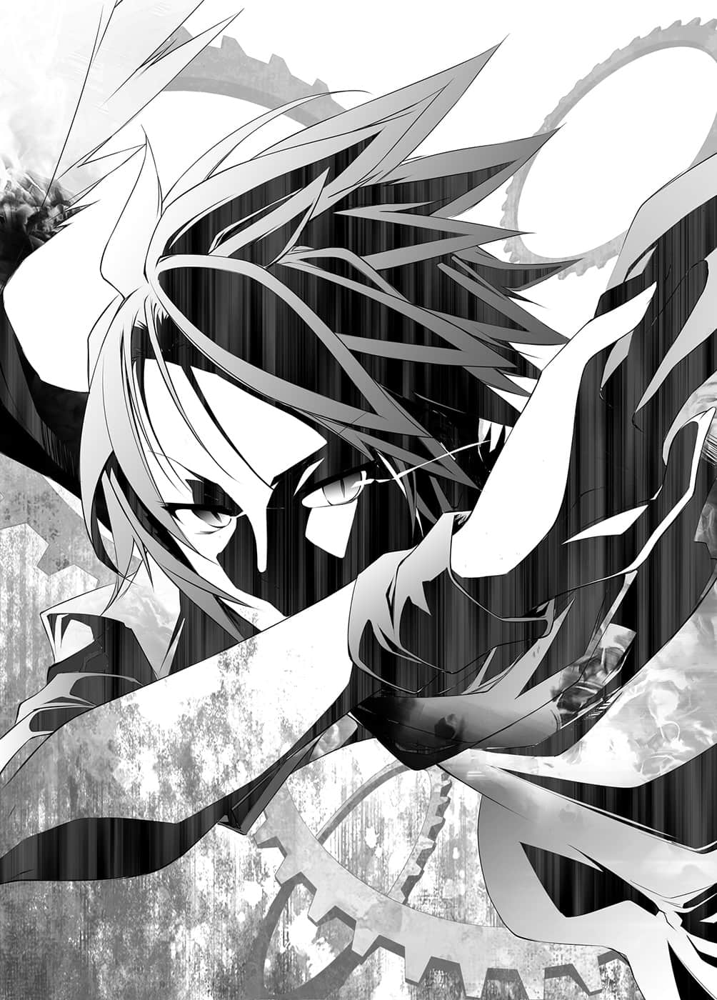

# 第二章 失败

> 来源：https://www.linovelib.com/novel/9/2076.html

同一时刻——在艾尔奇亚王城，先王的书斋。

「…………蒂公……史蒂公，我饿了喔，得斯。」

被人摇晃着，史蒂芙的意识缓缓甦醒。

原本流着口水，伏在桌上的她，此时猛然起身环视四周。

「——咦！？咦？奇怪，我什么时候睡着的！？」

「吃完饭后你就一头撞在桌子上了，得斯。我还以为你死掉了，得斯。」

——原来如此，看来自己似乎是在用完餐、填饱肚子的同时——『昏倒』了。

「现、现在几点了……？」

史蒂芙将披在背上的外衣——似乎是伊纲帮自己披上的——折迭好，茫然地问道。

随即听到咕噜咕噜～～的可爱声音回应。

只见伊纲手按着肚子，以真挚的眼神仰望着史蒂芙说道：

「吃过饭后过了整整六小时，得斯。」

「……真、真是可靠的时钟呢。」

最后用餐是在半夜两点的时候吧——所以现在已经是早上了吗？

这个书斋没有窗户，朝阳照不进来，不过差不多是街上开始热闹起来的时候了。

「史蒂公，史蒂公，吃饭，得斯。」

伊纲拉了拉史蒂芙的衣服主张要吃饭，史蒂芙回答：

「啊……好，说得也是呢……那我来做早餐吧……咦？」

忽地，史蒂芙发现伊纲原本坐的地方，堆起了一个书堆。

「伊纲，那是什么？」

再来就剩下——！

「那两人读过这本书……？」

就算是『真材实料』，也不可能不劳而获。

「我说过要学了吧，得斯。所以我学会了，得斯。」

空果断地宣言要前往阿邦特・赫伊姆，得到三个种族。

——伊纲以一副理所当然的表情，说出这个令人摸不着头绪的答案。

心中想着那个让人摸不清真意的笑容，只要是为了好奇心与主人，什么事都做得出来，荒唐乱来的她。

因为那是——和空等人目前身处之地有关的书。

至于他要采取的手段——一如往常地——史蒂芙完全没有听说。她打开书本一看。

不理会惊讶地圆睁着眼的史蒂芙，伊纲一脸疑惑的表情，嗅了嗅书的味道。

没错，现在重要的不是天翼种，而是海栖种的情报——史蒂芙重新打起精神。

「……等、等一下呀，能够知道得那么清楚吗？」

「现在要吃饭吧，得斯。」

『失去主人的活兵器……只是空虚徘徊的行尸走肉。』

史蒂芙念出以祖父——先王的字迹所写的书名。

未读和已读的书会混在一起——正当她要悲怆地哭泣倒下的时候——

伊纲嗅了一嗅，回答道：

『天翼种——她们收集知识并非为了兴趣。』

祖父记述中的吉普莉尔，与自己所见到的吉普莉尔，两者的印象截然不同。

史蒂芙阅读着和这个房间所有的书相同，由祖父亲笔所写的内容。

『天翼种——远古的大战中，「战神阿尔特休」所创造的杀神种族——』

「……那、那是我要问的吧？你到底怎么了呀。」

总之，先做餐点，然后——当她正要走出书斋的时候——

只见书本纷纷从她的手所支撑的那个书架上掉落。

「……？伊纲，你是以什么样的顺序在读书呀？」

——从奥仙德返回后的那个沙滩上。

——世界充满了光明。

——一阵风吹过。

「……？不是，得斯。这里的书全部都只夹杂着同一个老头的味道，得斯。」

「你、你知道那个人是什么时候碰过这本书的吗？」

『她们活着的理由，不，断定她们活着的根据何在？』

————瞬间，史蒂芙朦胧的思绪中，就像点亮了一盏灯。

但是……

说起来，空他们自从去奥仙德之后，应该就没有来过这里——那么——！？

这样的违和感，令史蒂芙翻了几页后就不自觉地停手，陷入了沉思。

「不，我不是那个意思——为什么会在那里呢？」

不是史蒂芙她们的味道，也不是空与白的味道。

也就是说，那是关于吉普莉尔的考察，明明应该是那样……但是……

「咦？啊，对、对喔。」

看到伊纲那么逞强，史蒂芙对她露出微笑。

不会吧——史蒂芙睁大了双眼。

「——咦？可是伊纲不是看不懂人类语……！？」

忽地，史蒂芙对书堆上的书的标题感到兴趣，于是拿起来一看。

「……手指不够，得斯。」

伊纲侧着头回答道。

「……气味微弱，得斯。不过如果超努力的话……大概办得到，得斯。」

那样的认知已是极限，那是史蒂芙无法做出反应的速度。

伊纲一觉也没睡，拼命努力地——学会人类语，读完这么多书。

史蒂芙将身子前倾追问，但伊纲却以一副伤脑筋的表情屈指计算，然后回答：

「……当然是因为我读过了，得斯。」

伊纲想要屈指算数，却露出了困惑的表情。

只靠着那本书，她就在自己昏睡的期间学会了人类语，还读完那么大量的书——？

看到她非但瞬间就学会，而且已经读完比自己还多的书，史蒂芙不由得感到寒毛竖立。

——游戏以外一窍不通，反过来说，只要是游戏的话——

『那是她们为了活下去——不，为了不死而采取的行动。』

史蒂芙的脑中，浮现那个令人难以理解的人物。

……空与白两人是在读过这本书的情况下，前往阿邦特・赫伊姆。

「这是鱼的味道，得斯……？不对，得斯……啊！」

一个月前——那也就是说，是他们在东部联合战之前读的——

因为空与白的关系，让她常常忘记一个事实，事到如今史蒂芙又想了起来。

「史蒂公不知道吗，得斯？有留下气味喔，得斯。」

「……？不是书吗，得斯。」

「……咦？……吃、吃了五顿饭，所以……呃～……得斯？」

「你能够找出在那段时间前后书写的书吗？」

「史蒂公，现在不是读那本书的时候吧，得斯。」

「为、为什么爷爷的书会有海栖种的气味！？」

那是针对先王——祖父所目睹的天翼种所做的记述。

空要伊纲帮忙的真意，她选定空与白读过的书的理由，以及——证明了在十年以前，祖父曾与海栖种有过接触！

「……伊纲，你最后一次睡觉是什么时候的事？」

然后她不感兴趣地将书随手抛开说道：

——为什么呢？

她的眼睛下方隐隐浮现黑眼圈，看得出已有一段时间没睡了。

史蒂芙交给她兽人语和人类语对照的游戏本——兽人语的教材。

「……对不起，伊纲，只有我一个人睡觉。」

「啊……」

为何她要选定空与白读过的书——不，问题更在于——

——仔细一想，那也是理所当然的。

「史蒂公没关系，得斯。杂鱼就该像个杂鱼，累了就睡，得斯。」

——她以『 空白』为对手，演出只有毫厘之差的胜负，其实力毫无疑问是真材实料。

「是空或白……或者是我们！？」

初濑伊纲，这个小孩子，这个比白更年幼的兽人种少女。

看到伊纲圆滚滚的大眼炯炯有神地说道。

「上面有空与白的味道，得斯。两人大约在一个月前读过，得斯。」

他们两人究竟有何想法——

刚才对于读书的顺序，伊纲的回答是依有好味道的顺序阅读。

「谁知道，得斯。是海栖种碰过，或者有谁用碰过海栖种的手，摸过这本书，得斯。」

「…………难怪会和空与白那么亲近。」

这时，咕噜咕噜～～～～的声音再度响起。

只见伊纲用鼻子闻了闻，微微侧着头说道：

「——『主人亡故的兵器，天翼种』……为什么看这本书？」

她发觉堆在地上的书，似乎是依照某种意图而从各处被抽出来的。

那种异种族的常识谁知道啊，尽管她在内心如此大叫，不过这样——谜团就全部解开了。

只见伊纲从门口瞬间移动到房间角落，她的嘴里——叼着一本书。

——不过那也等于断言了，那是十年以前的气味。

「我是依照有好味道的顺序选择，得斯。」

史蒂芙苦笑一声，准备把书放回书架时——或许是过劳吧，她突然感到一阵晕眩。

在永无休止的作业中找到一丝希望，史蒂芙拍了一下自己的脸颊，鼓舞自己。

「……？这是什么，得斯？」

「这是海栖种的味道，得斯。这不能吃呀，得斯。」

这样一来，必须找寻的范围就一口气缩小了！

「真是的～～你有那种方便的力量应该早点使用啊啊啊不过谢谢你啊啊啊终于看到地狱的出口了——」

史蒂芙感动不已，抱住伊纲，不断抚摸着她，但是伊纲却猛然向后一跳。

「——呼呜呜呜呜！！」

仿佛随时要咬上来一般，毛发竖立，对史蒂芙发出威吓。

「咦？那、那个……对、对不起，我做了什么令你不快的事吗？」

「……史蒂公，你抚摸的技术太差了，得斯！」

见到伊纲仍未解除警戒态势，史蒂芙慌张地往四周张望。

她看到的是——

「啊，对、对了，这、这个给你，请原谅我好吗？」

「——那是什么，得斯？」

「是、是我做给自己吃的饼干，你、你看。」

史蒂夫自己先吃一个给她看，证明那是安全的——然后战战兢兢地递出饼干。

伊纲看到她递出的饼干，用鼻子闻了几下。

「…………还不错，得斯。不过我现在想吃饭，得斯。吃鱼，得斯。」

——她一口咬住饼干，心情一下子就好转了。

只见伊纲摇摆着大尾巴，像只仓鼠似地，开始啃起饼干。

「啊，那、那么我去做饭！烤鱼、煮鱼、生鱼料理……你喜欢哪一——」

「全部，得斯。」

「欸？」

「……咦？奇、奇怪？」

但是自从失去主人后，已经过了六千余年——天翼种为何仍然存在？

「对、对方可是天翼种喔！就算借用我的力量，那个、两位也从来没有飞行过……要和天翼种比赛速度是绝对办不到的啦……」

在充满精神地回答的同时，伊纲站了起来。

只要她们拿出真本事——别说是音速，甚至连用极超音速飞行都有可能。

但是吉普莉尔因为与空他们相遇——她有了明确的改变。

在输给空他们之前，吉普莉尔——即使因感觉有哪里不对而采取行动，基本上还是和阿兹莉尔没什么不同。

看到她的样子，吉普莉尔对她露出些许失望的眼神。

……

——为了不让空与白两人知道，她们以天翼语确认过的事。

她脸上是阿兹莉尔从未见过，充满兴奋热血的表情。

即使鬼捉人并非由速度决定胜负，但毕竟乌龟跟马赛跑是不可能赢的。

浮现在虚空中的影像——空与白的身影。

「——『全天翼种的自杀命令权』……有何不可呢？」

尽管为了操控翅膀而在苦战之中，空回答的语气仍是一派轻松。

「…………」

「了解，得斯！」

---

■ ■ ■

「……那个、为什么你们要让我做出一人一只——各自操纵一边的翅膀呢？」

要取胜实在——不太——？

「阿兹莉尔前辈，你应该也知道才对，我们——天翼种有个根本上的误解。」

只要稍有差错，似乎就会翻转坠落的模样，看起来非常危险。

不过，问题不在那里，阿兹莉尔在内心撇开那个理由继续说道：

即使如此，参加者之所以感到紧张，那是因为『期待』。

看到他们那个样子，化成围巾的布拉姆在内心叹息。

——天翼种，就算不使用空间转移，她们的存在本身就是超脱物理的种族。

忽地想到这迟来的疑问，布拉姆向他们问道。

————就不觉得会输给任何人。

史蒂芙选择的是『拖延战术』……

——努力到挑战物理极限，用力量强行征服了物理极限……

阿兹莉尔用手撑着脸颊，抬头仰望着虚空。

「如果小吉的《答案》是被人以盟约植入的答案——」

看到伊纲用一脸认真的表情猛流口水，史蒂芙——

在方才的楼层，为了遵守空的条件——等待五分钟的百名天翼种，也看着同样的方向。

正如字面上的意思，兄妹转眼间就将她编出的翅膀，逐渐变成自己的翅膀。

原本那么想的布拉姆，这时感到一股违和感。

他们的速度逐渐增加，吹拂围巾——吹拂布拉姆的风势愈来愈强。

好了，看到出口了！当史蒂芙急忙准备奔出书斋的时候，在她背后——

反过来说，只要那样做就确定会胜利，两人牵着的手就像是这么诉说着。

「话是那样说没错啦……但是就算那样……」

「……哥……要这样……再一点……」

——只要我们的手仍相连。

空壳的兵器——只是物体——只是人偶的——天翼种。

仿佛再度告诫一般，阿兹莉尔脸上浮现依然像是戴着面具的笑容，对吉普莉尔说道：

空等人在那样的景色中，摇摇摆摆，笨拙地飞行——不，飘浮着。

「那、那个……我们真的赢得了吗……？」

「～～好吧！反正也得到了可靠的伙伴，我会尽我的努力，做出所有我知道的鱼料理！！在那段期间，请你把祖父在这本书前后所写的书全找出来好吗！？」

——那样的眼神深深侵蚀着阿兹莉尔。

——『全翼代理』——『十八翼议会』议长阿兹莉尔……

---

■ ■ ■

——史蒂芙之所以会知道那是伊纲超越音速的声音，是因为——

「什么？」

然而——擅自离开，却又唐突回来的吉普莉尔——她有了明确的改变。

「当然——因为不那样做，我们的胜利就不确定。」

漫长的期间，为了找寻那个《答案》，她们与阿邦特・赫伊姆一同徘徊至今。

不是全权代理者的阿兹莉尔所拥有的唯一特权……

不知不觉间，空与白拍打翅膀飞行的姿势安定了下来。

「——呼呼、呼呼——找完了，得斯——！鱼还没好吗？得斯！」

「我会使用『特权』——你明白这句话的意思吧？」

「全部，得斯。」

「……可、可以请你帮忙我出外买菜吗？」

然而在场唯一没有理解这一点的人，似乎只有阿兹莉尔。

对于那样的预感，众人只是充满期待。

她们是做为兵器而被创造的种族，对于拥有永恒生命的种族而言，死亡甚至是荣誉。

他们望着彼此笑了出来。

未知必须颠覆，这其中并不存在感慨，真要说的话——那是必须消灭的『敌人』。

看到伊纲血脉贲张，流着口水像是紧盯眼前猎物般的眼神——

那是在六千余年前所约定，基于众人同意之下的权利。

身为主人讨灭神的道具，原本只是那样就够了。

——笼罩在暗夜中的阿邦特・赫伊姆的上空。

有爆炸声传了开来。

「……你知道就好喵……」

——不过，在输给空与白的那一天，那样的想法改变了。

这时窜过众人的情感并非恐惧——原本天翼种对死亡的恐惧就很稀薄。

只有方块本身发出的淡淡光芒和月光，映照着无数方块杂乱林立的景色。

「现在别和我说话，会分散我的注意力！」

原来如此，伊纲正如她的宣言，非常地努力。

只是那样的差别，不过——

……超努力的话……大概办得到。

「…………」

不管怎么说，靠那么生涩的飞行技巧——

她简直就像……没错——就像已经找到《答案》一般。

「那原本就是阿兹莉尔前辈，在找出失去主人的天翼种的存在意义之前，为了禁止自杀而收回的权利，所以如果你判断我们没有存在意义——那你尽管请便。」

——有什么要开始，或者有什么会结束。

心脏发出低沉的怒吼，好似快要弹出体外似地快速跳动。手上拿着将近十本的书，肩膀上下起伏喘着气——因施展『血坏』而全身染红的伊纲，向她报告及催促的关系。

「……小吉，阿尔特休大人托付的最后使命——如果说有谁能找到《答案》，我认为就只有『最终号个体』的小吉而已喵。」

「我们花费数千、数万年时间所堆积起来的知识，却悉数被出生仅十几年程度的主人们所颠覆，这所代表的意义、价值——前辈，你并不明白。」

虽然布拉姆并没看过她们全速飞行，但从她们的性质来看却很容易想像。

对于那个『敌人』，吉普莉尔大概比其他个体更为好战吧。

将未知转变为已知——只对这件事感到有意义。

「是，不过——明知故问是迟钝之人才会做的事喔！前辈。」

——空他们并不知道。

「放心吧，鬼捉人这个游戏，跑得快固然有利——但并非必胜。」

——那是有理由的就是了。

连接两人，成为他们翅膀的布拉姆，看着他们的样子喃喃说道：

听到这句话，仰望着虚空中影像的天翼种所有人，皆弥漫出一股紧张气氛。

听到吉普莉尔语气轻松地这么说，阿兹莉尔的眼神一敛。

就记忆所及，就连面对阿尔特休，她也不曾露出那样的表情。吉普莉尔说道：

「那是一种令人心焦的感觉，比将未知转为已知更加炽热。那就是将已知转变为未知，就是那样的处世方式，让我以自己的意志决定追随主人们——和盟约之类的无关。」

对于吉普莉尔这样的说明，阿兹莉尔只能保持沉默。

因为老实说，她完全不懂那是什么意思。

将已知转变为未知？——那种事不是只会让人感到恐惧吗？

——不过……

或许是受到吉普莉尔的言论感化吧……

听到她所说的话，等不及要开始行动的百位天翼种，眼神中泛起兴奋之色——翅膀发出颤抖。

——阿兹莉尔完全不懂那是为什么，她再度用手撑着脸颊。

至少那并不是《答案》。

就这样，她望向映在虚空中——生涩地飞行的两人。

「我知道阿兹莉尔前辈比任何人都忧心天翼种的未来，可是——」

「…………」

视线稍微一瞥，只见吉普莉尔以毅然决然的神情，仿佛带着恳求一般地说道：

「你长久以来追寻的答案，并不在你所想像的地方。」

---

■ ■ ■

「咿～……咿～……我、我已经到了极限……太难受了，我要放弃了……」

「喂，还不到三分钟耶！超人〇霸王㊟都比你有毅力哦！？」

（编注：暗指一部特摄电视影集『超人力霸王』。）

布拉姆围巾早早便开始嚷嚷着要放弃，空则对她言词激励。

「我和天翼种那种怪物不同！对抗重力的困难度是你们两人所无法想像的喔！！更何况我还要把翅膀借给你们——你们饶了我吧——」

「没问题，我们是命运共同体，如果我在中途没力，下场顶多也只是一起死而已。」

转写后的全部文字及其持有者，甚至连在哪个位置，白都全部记在脑中。

各自在翅膀的根部和左侧腹——复写的文字被人摸了一下，两人各自发出娇柔的叫声。

布拉姆在内心如此呐喊，然而空与白却冷静地回头看着后方——

那是连围在空脖子上的布拉姆也要大叫的瞬间加速。

方块之间所形成的狭小暗道和缝隙……

——布拉姆所伪装的这条围巾……

能达到时速两百公里就已经是万幸，而另一边的天翼种则是对物理法则不屑一顾的存在。

布拉姆没有出声，在心里这么思索，接着内心暗道：但是——

可是——不管再怎么驱使布拉姆所编出的翅膀，他们还是无法超越物理的极限。

——在天翼种出发之后，只剩下两个人的楼层。

短短一瞬的邂逅，就连围在两人脖子上的布拉姆也无法理解发生何事。

「欸？因为只要这样做，空陛下的脖子我就可以舔到饱……咻呼呼～美味啊美味。」

「喂，这在我们的眼中是有翅膀的围巾，但是实际上又如何呢？」

（这是利用落下的加速，拉开与追兵的距离……吧。）

在幻惑魔法的另一边，布拉姆惊讶地瞪大了双眼，空则是对她说道：

不出所料，五分钟的让步她们根本不当一回事，两名天翼种已经逼近而来。

「还有，这比想像中还累……一旦灵魂供给中断的话，大概不出几秒钟我就会死了。」

——她们的背后。

「……文字，一、三……」

（……真是了不起……不过那样的话——）

两人的手接近空与白——但却抓了个空。

吉普莉尔与阿兹莉尔并肩看着空中投影的情况。

确实，空与白以惊人的速度掌握了翅膀的操控方式。

吉普莉尔也不否定，天翼种这个种族——往往有靠蛮力取胜的倾向。

坠落速度加上翅膀的力量，他们无止尽地加速，强风迎面而来——

「ｂａｒｒｅｌ ｒｏｌｌ——闪避比自己快速的直线飞翔体，这是基本技巧吧？」

「转向，回收呢？」

「欸嘿嘿～我第一个～！」

对翅膀的操纵还不习惯，就算熟练也达不到天翼种那样的速度，那么——

只见阿邦特・赫伊姆的夜空划过闪闪泪光的轨迹。

「……哥，笑话好冷，吵死了，而且……很无聊……」

「一白三我，要上啰！」

「为了你们两位体液，我不可能会放弃！！ ——来，我们继续吧！！」

迟了一瞬，后续追来的其它两人也追丢空与白的身影，兀自朝着四周张望。

——没错，感到追兵来到背后，空与白将她们吸引至极近的距离，再略微改变航向，为了让逼近的四人之中——持有文字的两人追在前头，他们微微转向。

咦？布拉姆才刚发出疑问的声音，空与白已略微改变了航向。

「没有队列的四人。」

那是对『自己在物理上的存在』施加伪装，让人看起来像围巾般连结着空与白。

脖子被舔的触感，让空的背脊窜过讨厌的感觉。

「咿呀啊啊啊！」

五分钟过去了——听到白的通知，空的眼神一敛。

——瞬间。

就有无法解释的地方了，吉普莉尔的内心也抱持疑问。

不过布拉姆则是语带不满地反驳：

「唔哇！我现在马上就想把这条围巾拿下来了！」

就在空开始考虑要不要在冲动之下，不顾后果地把这条围巾丢了的同时——

「气氛都被你破坏了啦！！」

穿梭于缝隙之间——通过阿邦特・赫伊姆的街道——飞向相连的方块。

「既然操纵不了翅膀，那么停下来就好了，对于无视航空力学的天翼种而言——区区固定翼战斗机的空战机动……」

空与白正有如『穿梭缝隙间』一般，在阿邦特・赫伊姆的城市里飞行。

不过空想起如果那终究只是『伪装』，也就是说是『幻惑魔法』的话，实际上那还是布拉姆本人。

「……嗯，了解……」

——说着这一段布拉姆完全不了解其中意义的对话，他们在一瞬间商量完毕——

「「————咦、咦！？」」

「……就算她们知道……也没在意过……」

（这、这样马上就会被追上了啊啊啊该怎么办才好呀！？）

「哈哈，这画面根本就是变态飞行嘛！」

所以才能出神入化地做到方才的回避与文字回收——但是，更令她惊愕的是，他们对这座城市了若指掌，仿佛自家的后院般飞来飞去。对于那样的两位主人，吉普莉尔难掩惊愕之情。

「汗水的话，我已经流很多了，我的汗水可以任由你舔！」

布拉姆说出这样像长～～篇大论的主张。

「……当然。」

「「呀啊！！」」

这短短一句话甚至也让布拉姆感到压力，于是她闭上了嘴。

「……一翅膀根部『ナna』……三左侧腹『アa』。」

他们依然缺乏速度，但是追兵在这种情况下，速度太快反而会被他们摆脱。

「我事先声明，同时展开复数术式，那是森精种的专利喔！将自己伪装成飞天围巾这种魔法道具，让两人能依照自己意志飞行的魔法，可是非常非～～～～常值得嘉奖喔！！」

两人露出睥睨的笑容，手上则如同白的宣言——『ナna』与『アa』的文字在转动着。

「收下了！」

「……该不会——您记得所有拥有文字的人吧！？」

围巾的两端依空和白的意志动作，发挥出翅膀的功能。

——捉住。两人有如理所当然般的宣言，让布拉姆惊讶地睁大双眼。

「……咦？那个……刚才的是……！？」

「什么呀，布拉姆，你还在小看我引以为傲的妹妹吗？」

「……风险这么大，亏你还能不在乎地答应呢。」

「……哥，时间。」

和天翼种玩鬼捉人，却宛如在主张他们才是鬼似地。

「那么我们就先捉住那些人，对方也不是省油的灯，空战机动不会每次都管用。」

「我只是说说而已，有必要说成那样吗！！」

就连能否容一人通过都不确定的缝隙，飞翔中的两人都能精密地穿越潜入，追兵若是速度太快——一个不小心就会瞬间撞上方块，被他们摆脱。

后方出现气息，才刚出发的天翼种们，已经快追上他们了。

没抓到空与白两人，无法理解他们何以瞬间从视界中消失，两人同时发出疑问的声音。就在此时——

听到她这句话，空苦笑着说道：

「不管怎样……白，我们迫切需要的文字——你应该知道吧？」

「舔舔……啊啊，好幸福❤——啊，什么？呃～我现在的状态刚好是抱住空陛下的脖子，舔着您的脖子……还有用脚勾住白陛下的脖子。」

---

■ ■ ■

那是当然的，这个时候空与白早就顺着螺旋的轨迹，飞向相连的方块。

「——好，布拉姆，我们的性命就交给你了，你可别在中途没力喔！」

就在即将冲撞地面——阿邦特・赫伊姆的背之前，他们切换成水平飞行。

「我们不需要那种觉悟！！要走啰！」

方块复杂重迭的阿邦特・赫伊姆，在仅有微光与月亮映照的黑暗之中，他们有如穿过针孔一般，飞过方块之间所形成的些许缝隙。

然后在快被抓到的瞬间，将翅膀张开，仅仅只是——往斜前方横向翻转。

在吉普莉尔胸中来去的情感——很快地转变成『惊愕』一念。

这么说之后，空与白立刻同时用力地拍打翅膀——一口气降低高度。

——两个『文字』已经分别在他们手上了。

也就是说在这个时间，为了追捕空等人，晚出发的天翼种们即将开始行动了。

结果，行进方向维持不变，空与白因描绘出螺旋而减速。另一方面，天翼种则由于速度太快，相对地在她们看来空与白就像消失在视界中般——换句话说，她们单纯只是『冲过头』。

终于理解这个事实的布拉姆，一时说不出话来。

但是，即使如此，她们仍能『配合行动』。如果做不到，那她们也不配称为『兵器』了。

既然『速度』不管用，她们就会切换成『包围』战略——然而——

「欸欸！？欸、为什么——！？」

天翼种少女发出悲鸣，她们埋伏在空等人飞入的缝隙前，只有一个出口的地方——那两人却从完全意想不到的地方飞了出来。

没错，空与白悉数躲过了她们的包围网。

他们看到地图的时间只有短短一瞬，仅仅那么短暂的时间，就已对这座城市阿邦特・赫伊姆的一切了若指掌了吗？

——不可能。如果是主人之一——白，是有可能在那几秒内记住地图。

然而这座城市是由复杂堆迭的立体高低物构筑而成，只靠地图，不可能掌握城市的缝隙和暗道，那么他们又是如何办到的——

就这样，终于连一直仔细观察的吉普莉尔，也比任何人都更怀疑起自己所推论出的解释。

---

■ ■ ■

（……欸？开、开玩笑的吧？）

——空与白紧紧相握的手——布拉姆看到他们的手指正细密地动着。

布拉姆从刚才就一直在拼命忍住悲鸣，对于两人穿越难以置信的狭窄洞穴或缝隙的方法论——其实说是谬论也不为过——这个事实让布拉姆惊讶得说不出话来。

也就是说，恐怕、大概、虽然难以相信——应该就是这么一回事。

白沿着记忆的街道飞行，确认方块的大小均等。

再来利用心算，解开方块堆迭的规律性，找出高低差所产生的细微缝隙。

而这个情报她并不是用言语，而是动手指传达给空知道。

然后空再构筑能够摆脱、欺骗、引导、瞒骗对手的路线做为回应。

——布拉姆除了哑口无言外还能怎样呢？

对于布拉姆而言，不，恐怕对任何人而言，那都完全超出理解了吧。

借由手指动作进行沟通，但那甚至不是『这边』或『那边』这种程度的情报。

「唔唔唔～～～～别想逃——」

「「——……咦？」」

有如翅膀——也就是布拉姆——折断般急速回旋，两人飞入狭窄的洞里——

将手牵起——两人组成的一对翅膀。

「「呀嗯！」」

——被逼到走投无路的究竟是哪一方呢——

以他们自己为中心，在左右的空间开洞，将之连接在一起，回避天翼种们的夹击。

只见原本在两人手上的两个字移动、结合——发出闪光。

然后留下八人份的娇柔叫声，空与白再度飞入方块的缝隙中。

空向白伸出手——他确信白能够确实地明白自己的意图，将【言灵】托付给她。

「……哥，过得去吗？」

「——嗯！」

也就是说，当他们出到下一个宽阔的空间，瞬间来袭的天翼种会有——十二人。

布拉姆无言地开始回想。

「「——『洞（アa・ナna）』！」」

「……哥！？」

——瞬间。

两人宛如理所当然般，互相确认环绕在手上，各自回收的四个发光的文字。

「是啊，不过我们想要的文字还没凑齐——」

「サsa・トto・オo・スsu——怎样啊，白，我全部回收到了喔！」

「……カka・マma・ヌnu・クku……这样就八个字了……」

——空立即做下决定，他没有时间重新恢复姿势。

——『左右四、四拉』……拉了——然后发动攻势？

出到宽广的空间——在逼近而来的十二名天翼种面前，空的身体失去了平衡，因为那样的离心力——

左右八人的天翼种，以猛烈的速度逼近，但是——如果是那样的话——

通过空与白，分别从相反侧出现。

「……呼……呼！」

「唔喔啊啊啊啊！？」

借此在错身而过的瞬间，只针对持有文字的五人出手，原本是这样的安排——

将【言灵】的启动托付给白，空则在那段期间重新恢复姿势，进行反转。

从洞里出来，当然就会是背对着空他们——回收『文字』——不过比起那些……

「好痛！」

「……文字五，凑齐……可是危险。」

——赶上了，白露出松了一口气的表情。

空仿佛没什么大不了地承认，看到手腕上如数珠般相连的文字，空得意地往上方看去。

的确没错，他们对于飞行这个动作，还没有完全习惯。

「咕——喔喔喔！」

「……呃、那个……刚才那是……」

「回收，从上方，拉十二人——一切都在预料之内，别大惊小怪。」

等在那里的则是左右各四人的天翼种——正如她们所说，这是完全的夹击。

当一边的翅膀，以更有效率的方式，掌握布拉姆所编出的翅膀，斩断重力的时候。

目睹到难以置信的景象，才令布拉姆更是惊愕无比。

空与白用空着的手两人合掌，组合【言灵】。

趁十二名天翼种冲撞无形之壁，动作停下来的瞬间，两人穿过天翼种之间——

白向空看去，按照预定——这时应该要向上急速回旋。

千钧一发之际躲过魔掌，两人往无形之壁的下方落下——就在即将冲撞地面的距离拍打翅膀——再度飞入狭小的缝隙……这才总算脱离危机。

就在快要被甩开的时候，白拍打翅膀支撑，拼命地保持平衡。

「——！终于追到让他们走投无路了！」

空甚至连冷汗都流出来了，他拍打翅膀，同时白也配合——！

两人的飞行方式也还残留生涩之感——正因为如此。

「……了解！左白哥右，左肩右翅左肘腰！」

仅仅一次的振翅，没有产生偏差，将彼此的学习传达给对方，相互砥砺进步。

看到那幅光景，布拉姆的背脊感到不寒而栗，这两人——比想像中更——

——以惊人的速度，无止尽地进步。

「还有什么，就是『洞』啊，会对触碰到的人产生作用的【言灵】——就是这个游戏的规则吧。」

「……所以……我们『对空间』……开了一个洞。」

——布拉姆也跟着他将视线往上移。

白则是握住空的手，让文字移动，然后将放出闪光的文字，往虚空中抛去——

在宽度大约一人的狭小通道里，空一边纵向飞行，一边笑了出来。

「左右四、四拉。」

白来不及将持有文字的个体传达给空知道。

从牵起的手的感触，读取对方的意图，各自拥有一边翅膀的两名人类种，既没有一丝的紊乱，也没有踌躇，仿佛握着的手就是神经一般，拍打着双翼飞行。

「危险也要做——！要发动攻势啰！！」

「别想得逞！！」

「啊哇哇哇哇这下要怎么办啊啊！」

仿佛受到炮击的防空洞一般，巨大的声音响起，天翼种们激烈撞上无形的墙壁。

——布拉姆战战兢兢地向他们询问。

即使如此也不够，她又加上双脚——甚至使用翅膀，好不容易才回收了文字。

两人说着暗号般的对话，但此时空终于笑着以正常的言语回应。

「——『不准通过（トto・オo・サsa・ヌnu）』……！」

「……该不会，你们只引诱持有文字的人过来吧！？」

才刚说完——

另一边的翅膀则是在要被甩掉之前，掌握对方的动作，配合著跟上对方。

「采取夹击，配合我的时机！！」

突然被布拉姆舔了脖子，空的身体失去了平衡。

啪哒啪哒的——不，不是那么轻柔的声音。

「咿啊啊啊啊！！」

空与白不小心——在布拉姆看来是这样——来到宽广的通路。

「回收、上拉、十二？」

——『不准通过』。不惜使用四个字做出的墙壁，不会让敌人通过。

「……左サsa・トto・オo・スsu右カka・マma・ヌnu・クku缺一。」

然而对此空却大胆不羁地笑了——

对着伸出手掌的空与白飞扑而来，左右各四人的天翼种——

……随即四、五、八——十二名天翼种，以可怕的速度朝这里冲了过来。

「呀啊！」

但问题是——！

——这个时候，先前一直保持沉默的两人开口了。

空与白以高速飞行穿越的是，勉强能容一人通行的缝隙。

白的翅膀险些被抓到，但这次则是空拍打翅膀，让重心偏移。

面对从左右袭来，总计八人的天翼种，两人——手掌分别对着左右，大喊道：

「要上啰，白！！」

只见白伸出手，然后——

但是差点坠落的空，却没有余裕捕捉逼近而来的天翼种的身影。

「可恶，白——交给你了！」

「……嗯！」

「是啊，没问——题啊啊啊啊啊啊啊——！？」

但这时布拉姆的脑中闪过空他们说过的话。

「————白，上啊啊啊！」

一说出这个词，逼近而来的十二道人影，眼看就要接触到空和白，随后——

空肩膀起伏喘着气，好不容易调整好呼吸，白正要出声关心空，但是——

「那、那个……两位没事吧？」

——却被招致这个危机的犯人布拉姆抢先发问了。

空咬着围巾，嘴里含糊地大吼。

「——布拉姆～～～～！你这家伙想要一起死吗！？」

「对对对不起，因为那个急速回旋，我的嘴离开空陛下——我也说过一旦供给中断，几秒钟内就会死掉了啊！！那当然，要死就一起死，大家结伴下地狱喔！！」

——这家伙竟然说出这种话，胆子可真大呢。

这时白也压抑狂跳的心脏——看着手上的文字说道：

「……哥……ソso・ワwa・ケke・ユyu・ラra……到手——这样一来……」

「是啊，总算凑齐了。」

『ラra・ユyu・スsu・マma・クku・ケke・ソso・カka・ワwa』——想到从这些字能做出的【言灵】，两人笑了。

他们视线交会、相互点头的同时——大大地拍打翅膀。

原本只是穿梭在方块间飞行的两人，现在一口气——往高空攀升。

「——啊，找到了！」

「唔……他们又改变战略了吗？」

马上就被发现。不过对于空和白的现身，追兵们也警戒着他们的行动。

对方不走直线，而是有如包围一般，一齐环绕着轨道逼近。

——大概谁也没有想到吧。

因为连布拉姆也没预料到。

在朝他们围攻而来的天翼种们面前，两人手贴在一起，组合出【言灵】。

「……哈，有趣。」

客场作战要有会发生意料之外状况的觉悟——才刚这么想就遇到这种事！

---

■ ■ ■

从游戏开始，从得到翅膀后，短短不到十五分钟的时间。

空不为人知地暗自说道，很好——这样游戏才有玩的价值！

——阿兹莉尔还是一脸不明白的表情。

对于没有发现这一点的这个失误，空与白——不，白咬着指甲，感到非常懊恼。

「管它肿不肿！冷汗我已经流了一身，你就舔背上啊！」

大约四头身㊟的小吉普莉尔出现对他说明。

「……为什么喵？只要记起来就不需要了吧？」

吉普莉尔叹了一口气，她似乎下定了决心说道：

——看到她那个样子，吉普莉尔静静地对她说：

「那家伙……？是在说谁呀？」

「是啊，我知道，既然要玩，当然还是想回收全部文字，完美地破关，而且——」

「所以如果在想读的时候不能读，那就很讨厌了——你不懂吗？」

哭声一下子转变成欢喜的声音，空对布拉姆咋舌一声，将视线移向背后。

连布拉姆和在旁观战的吉普莉尔也惊讶得说不出话来。

那么就将风险降至最低——最好是一次就收集多个文字。

……方才的余裕不知到哪儿去了，空猛然大叫，只见他头上——澎的一声……

「…………」

吉普莉尔低着头，苦口婆心地对她说明——但是……

不管再怎么警戒风险，想要完全防范是不可能的事。

「不是，那是因为——我喜欢反覆读同一本书。」

「那我换个说法啦，我没听说可以用远距离道具！我们没有吗？布拉姆！！」

——这是阿兹莉尔第一次听说，她露出不可思议的表情。

吉普莉尔的主张固然不说，她更不明白的是——

——无法回应妹妹的期待，这比任何事都刺痛她的心。

吉普莉尔脑中浮现这样的词语。

「那、那个，您在做什么——咿呀啊啊啊！？」

空认同白所说，表情严肃地说道：

攻击对方的规则……言语的漏洞，看破这一点明明是能将对话一字一句记忆下来的自己的职责。

「——『加速（力ka・ソso・クku）』——！！」

声音的墙壁被抛在遥远的彼方，飞翔的空与白——已经无人能追上。

「————那个和现在有什么关系喵？」

「……不懂什么喵？」

这正是刚才空在思考的『预料之外的事态』，对此空早了一瞬作出对应。

只是向布拉姆借来的，人类种两人一对的翅膀。

空与白握着彼此的手，疾驰在夜空中，虽然空这么说道，但——

「——可恶——太晚发现了！」

吉普莉尔似乎感到很耀眼地注视着他们——但是……

而是些许的期待被无情地背叛，随着每一次的背叛而逐渐沮丧的失望眼神。

「什么喵……我哪里错了喵……！」

「……嗯！」

她确信这是本来真正意义的『比翼鸟』。

「——我也已经决定好要用来反击那家伙的【言灵】了。」

然后不只是追兵。

「别强人所难了！二重术式是森精种的专利，再说若是我再使用魔法，我真的会枯竭而死喔！！空陛下的脖子也被我舔到快肿起来了！！」

「——呿～～！？」

原来如此，如果是以【言灵】产生的加速，那就可以让想像实体化了。

---

■ ■ ■

————以直线距离，从正面摆脱天翼种的追击，这种事有谁预想得到呢？

……吉普莉尔看着她的眼神——非常地难过。

那眼神既不是轻蔑，也不是嘲笑。

「这样只要别疏忽大意，我们就不会被抓到了吧。」

雌雄各有一只眼睛和一只翅膀，总是合成一体飞行，一种并不实际存在的生物。

「——一旦记住，那就结束了。」

加速、速度、光速——两人自游戏开始之前，就是以形成那一类的【言灵】为目的。不然的话，面对配合空等人的行动而变更战略——也就是面对懂得『对应』与『学习』的对手，他们将无法逃过一个小时。为此他们才以低速在方块间飞行，专注于引诱和回收——当吉普莉尔理解了这一点，她仿佛看见光一般眯起了双眼。

那样可做为保险，也就是说增加【言灵】，万一发生预料之外的事态也——这时望着背后的空——眼中突然映出一道光。

——在三个文字消失之前，让文字触碰自己，随即喊道：

——比翼连理。

靠速度拉开距离固然很好——但为了回收『文字』就必须接近，而那样总是伴随着被抓到的风险，更何况对方是天翼种。再说——空带着告诫自己的心情，在内心喃喃自语：

「那难道不是『飞弹』吗！」

「即使是读过一次的书，当知道得更多之后，重新再读也会有新的发现。」

……

——可没说『禁止魔法』——！

两人有如跳舞一般地翻转、飞翔，他们的笑声——传遍阿邦特・赫伊姆。

他把自己当成钟摆往下荡去——维持着原本的航向，偏移『轴心』，顺着弧形翻转。

阿邦特・赫伊姆的上空，银色的轨迹划过暗夜的天空。

但是——这个词汇也令她感觉有些不同，她独自摇了摇头。

——只留下将声音抛却在遥远彼方的冲击波。

「不，那个没有杀伤力，只是用来拘束对方，将之拉至自己身边的魔法，并没有破坏力，目的是在拘捕。所以和主人们的世界的『飞弹』不同——」

看到吉普莉尔喋喋不休，空抓着头吼道：

「吉普莉～～～～尔！！那是什么！我没听说啊！可以攻击吗！？」

自己所目睹的不是用在比喻时的比翼连理。

（……那样的一对生物，现在正快乐地在那里飞行呢。）

「哈哈！这还真好玩！」

「不，主人，那不是攻击，那是追踪式的『拘捕魔法』。」

——因为那代表两人相信天翼种的这个事实。

「……应该要预料到的……！」

「…………」

「……可是，『文字』的……回收……」

——刹那间的判断，对于哥哥难以置信的回避动作，白正要给予赞赏，但是早她一步——

（编注：头身是身高与头部的比例，几头身代表身高为头高的几倍。）

所以他们才能消除物理上的翅膀所能发挥的速度极限。

布拉姆这么问道，不过空没回应，只是转向背后。

——视【言灵】不同，有可能只靠【言灵】就获胜，这规则太过有利了。

「是啊，我就知道你会那样说，所以我以前才没有说出口……」

「前辈，为什么我会反对《共有法》，你知道是什么理由吗？」

对方确实有说『禁止空间转移』——但是……

「……咦？」

「真的可以吗！？开动了～！啊啊～嗯❤」

「……因为小吉个性一板一眼，不喜欢别人碰你的书喵？」

——别忘了，这个游戏是意料之外的游戏——是完全的客场作战。

眺望着他们，似乎感到枯燥乏味的阿兹莉尔，果然还是没有理解那样的意义。

白看到那道光，发出疑问的声音，但是——

只见一道闪光贯穿偏移前的『轴心』，打断了布拉姆的话。

空抚摸着懊悔的白的头说道：

「无法事先做准备的胜负本来就是这样，事到如今后悔也没用，现在更重要的是——」

「……嗯。」

——情报不齐全的突发性游戏，发生无法预期的事态是理所当然的。

即使如此还是会赢——如何快速应对掌握，那才是『 空白』的真本事——没时间懊悔了！

「——吉普莉尔，那个能射几发？」

「我想想喔……视个体不同会有差异，不过大概是六发左右吧？」

「——虽然棘手，不过只有六发的话，对方就不会浪费子弹了吧，既然如此——」

「啊，不是的，主人。」

这时看着后方的空的眼中，见到有复数的影子降落在方块上——那是天翼种。

只见她们举起手掌——夜空顿时有如白昼。

「是『一次能击发的数量是六发左右』，并没有次数限制喔！」

「即使只有一瞬间，我竟然期待你们这群怪物会有『有限性』，我真是笨蛋！」

「……哥，过来——！」

不过这次是白的反应比较快，她用力地拍打翅膀。

空也即刻抛下迷你吉普莉尔，没有回答地配合白，一起加速。

只见『拘捕光』画出复杂的轨道逼近——不过如果和吉普莉尔说的一样，那是追踪式的话——

「……嗯！」

白用力地一拍翅膀，空从握着的手，明白了她的意图，于是也跟着配合。

无数的光逼近而来，就连使用加速【言灵】的空等人，也无法摆脱那些光的追捕。

『拘捕光』毫无疑问会以多重且伴随时间差的方式，连续追踪袭来。

「——白！！」

————阿邦特・赫伊姆整个水平『回转』。

（编注：奥地利物理学家都卜勒所发现的物理现象。）

——超越天翼种，甚至连空等人也摆脱不掉的那个速度。

空咬紧牙根，仿佛快要烧灼般地转动着脑袋，仅仅六个字，而且是难以使用的文字。

「拜托你了，白！！」

不管布拉姆的惨叫声，白变换动作，取消原本的急上升。

白不自觉地说出最先想到的词语，然后连忙加以否定。

果不其然——

毫无疑问会有大量天翼种在出口埋伏。

『——转动阿邦特・赫伊姆』……

瞬间——在空的心中，仿佛齿轮相互咬合般，复数的事件开始搭在一起。

「什么～～！？」

「嗯啊啊啊呀啊啊啊啊！」

——只剩【言灵】了，但是手边的文字是——『ラra・ユyu・スsu・マma・ケke・ワwa』。

不过，对于这个预料中的光景，空毫不畏惧地让三个字从手腕上消失，形成【言灵】。

「——……哥……白已经……」

要如何用这些文字抵挡。防壁、盾、反射、回避——全都缺少字母。

「……输（マma・ケke）……！不对……哥，对不起——」

但是在有如板野马戏团㊟般的连续空战机动后，白也流着冷汗，不住地喘气。

如果不是照心中设想的位置为中心转动，那么就会变成光从另一个方向过来而已。

——产生反转，位置互相交替。

而且——同样一身冷汗的空内心思索——窜出这个缝隙后……

在数秒之内，必须想到一个词语，能够回避或者抵挡将要来袭的无数道光——！

不只是布拉姆，连放出『拘捕光』的天翼种所有人——不，甚至是在上空看着的人，在远处观看的吉普莉尔也发出叫声。

就算是白，要完全回避也不可能，更何况布拉姆应该也真的到达极限了。

那就是——击出光的天翼种已经降落地面。

从这个情况逆转的【言灵】——逆转……不对。

「为什么要闪避呢——这不是绝佳的机会吗！！白，上升。」

在逼近的光线之中，空攀住出口处的方块。

空在被『拘捕光』射击时，瞬间看到的光景……

然而面对仍然持续逼近的光，这次则是拍打翅膀急速回旋。

「——不愧是白，哥哥引以为傲的妹妹。」

从水平飞行倾斜四十五度，往斜上方翻转，将速度转变为高度，向上爬升——『拘捕光』大概具备一定距离就会发动的近接信管㊟吧——因为上升的关系而速度稍减造成『拘捕光』接近，登时背后闪光大作——『拘捕光』引爆。

「我受不了啦，我要退出这个游戏，再这样下去我的身体撑不住啦！！」

然后脱离通路，射击出现在正逼近而来的这些光的天翼种们也一样。

他们维持高速飞行，沿着通路往上飞——然后脱离通路。

（能够逆转这个情况的方法——逆转的方法——！）

她不反转，而是再一次拍动翅膀，加速上升，远离在背后引爆的闪光。

「呀啊啊啊啊啊！」

——没错，而且这次她们一定会将刚才的回避机动计算进去。

为了维持刚才的机动，对翅膀——布拉姆造成极大的负担了吗。

——如吉普莉尔所说，就像近接信管一般，在极近距离引爆的拘捕魔法。

——受到拘捕的大量天翼种被拉至空等人的眼前。

——没错，既然是『追踪式』，那只要加以『诱导』就可以了。

出于那样的责任感，让她即使在演出这么精湛的技术后，仍然一副过意不去的样子。

将夜晚染成白色的光之雨倾盆而下。

（编注：是一种依据与目标之距离而决定引爆的雷管。）

虽说没有杀伤力，但也是天翼种的魔法。

将组成的『言灵』全力往地上砸了下去——然后大喊。

空这么笑着说道，只有白看见他嘴角的抽搐。

使用与方才完全相同的机动操纵，不过这次是急下降，往斜下方将高度变换为速度。对于再度在背后引爆的无数闪光，以同样的要领脱离，就这样靠争取到的速度——

「……咦？」

听到空的自言自语，白讶异地回应。

升到上空就会遭到『拘捕光』狙击，但是听到空说的话，发出悲鸣的只有布拉姆一人。

「——『回转（マma・ワwa・スsu）』——！！」

——然而实际上，那才是最有可能成为现实的【言灵】。

借由螺旋飞行，有如绕圈子一般，躲过陆续在极近距离爆炸的闪光。

哥哥间不容发地叫了自己，而白立刻明白哥哥的意图，向他回应道：

然而当光逼进至背后的瞬间——『急上升方向变换（Chandelle）』。

「……呼……呼……」

就连高分贝的惨叫声也伴随着都卜勒效应㊟，站在场地——地上的人们——也就是发射『拘捕光』的天翼种与空、白两人的位置。

白振翅上升——哥哥既然做出了那样的结论，那就不需要其他的根据了。

将整个场地阿邦特・赫伊姆水平回转会如何？

「——逆转想法……那才是我的工作吧——！」

没错——『拘捕光』就和吉普莉尔的说明一样。

为了完全回避而计算出光的轨迹，这的确是白负责的部分——

——一瞬间的延迟，然后——

然后当那道光即将发射时，空所见到的景象——当这些事件咬合在一起时，空笑了出来。

（编注：日本动画家板野一郎在《超时空要塞》中的著名事迹而得此称号。）

——躲过了。但是安心还没多久，光又陆续逼进，白将全部的光吸引过来，然后切换。

「「「呀啊啊啊啊啊啊啊啊！！」」」

一旁的布拉姆因担心这两件事而发出悲鸣。

缝隙入口附近发出无数的爆炸声与闪光。

她的脸上仿佛写着，对于没察觉到规则没有禁止魔法之事，她要洗刷污名。

空一边在狭窄的通路纵向飞翔，一边摸了摸妹妹的头，称赞了她一句，然而——

「就连发射的本人也无法回避，突然就来到眼前喔！」

空焦虑地在内心咒骂！距离通过这个狭窄的通路，剩下没几秒了。

空与白纵向并排，飞入一个方块的狭小缝隙中——随即——

「哇呀啊啊！」

不管哪一个，都是在文字游戏中难以使用的文字——！

「……了解。」

「「「啊啊啊啊啊啊啊——！？」」」

空中的人事物——在空中移动的『拘捕光』和天翼种们会维持原样。

维持着翅膀状态的布拉姆发出悲鸣，在超高速的状态下，令翅膀完全停止。

「啊哇哇哇哇哇哇啊啊呀啊啊啊啊啊啊啊！！」

「等、等一下、咿～～！！」

那么——空与白往下朝自己的手腕看去。

——拘捕对方，将之拉回至发射源头的魔法，如果对反转后的位置产生作用的话！

「……文字二十五……！」

没有一人例外——所有人都站在方块之上。

空的笑容是在惊险赌博后获胜的表情——不过如果『拘捕光』如吉普莉尔的说明一样——

从天翼种至今的应变能力看来，空实在不觉得她们会放过这个空隙。

一旦被抓到，游戏就结束了，为了查出唤醒女王的条件所需要的情报收集手段也会——

那压力足以让她这样喊叫，从她带泪的语气中可以察觉出，她已濒临极限。

——她们不降落地面就无法射击，那么——没有必要闪躲。

不由分说地无视任何法则，霎时——

——没错，这完全依照空希望的最低限度——而且是仅仅只能冒一次的风险。

从被拉过来的『三十八名』天翼种身上——取得二十五个字。

タta・ホho・シsi・テte・キki・メme・ヤya・ルru・エe・イi・モmo・ツtsu・へhe・レre・ヨyo・ヨne・セse・ニni・フhu・ノno・ムmu・ンn・ウu・リri・コko——不过……

「……可、可是——哥！」

白困惑地叫道。

——令人惊异的结果，三十八名天翼种以多采多姿的姿势被拉了过来。

但是在不知道拘束时间的条件下，知道文字位置的人只有白而已。

在短时间内，要从二十五人身上回收文字，只靠一人实在——不过空马上一脸笑容地——

「首先是为了顾虑分级制度！『蒸气（ユyu・ゲge）』——！！」

只见蒸气爆发性地扩散开来，笼罩住被拉过来的全体天翼种。

然后是——空笑垮了脸颊，紧接着使用【言灵】。

向前方的所有人泼洒过去——不顾一旁察觉哥哥意图，半睁着双眼的白。

同时，空与白用力拍打翅膀，以高速飞出——然后——

「——万事具备后就是——『裸（ラra）』啊啊！！」

因『拘捕光』而以多采多姿的姿势被拘束在一起的天翼种们……

——她们身上的衣服一齐消失，这样一来空也能把握文字的位置了。

空脸上带着非常——愉悦的笑容——闭上双眼说道：

「啊啊，我看得见啊，白，看得见许多东西喔！！」

「…………哥左半边，白……右边。」

「啊啊！交给我吧，我的妹妹！唔喔喔！怒吼吧，我的左手！」

空刻意面对从前方逼近的天翼种，迅速准备好相机，构筑【言灵】。

「哇啊啊啊～～她们毫不害羞地全裸突击过来了！！」

回答得毫不犹豫。

对于无法理解的自己，阿兹莉尔似乎感到焦躁不已，而吉普莉尔则是静静对她说道：

「呼——终于成功亲眼看见世外桃源了……真是令人赞叹，只可惜现在是晚上，不知道照相机是否有确实拍到呢？」

吉普莉尔的眼中甚至快浮现泪珠了，她的声音有如勉强挤出似地这么说道。

「呀啊！」

「——『揉胸（ムmu・ネne・モmo・メme）』——」……这么喊道。

只见穿着衣服的天翼种，开始对全裸的天翼种揉胸，绊住她们的脚步。

那个头盖骨就是为了庆祝她的功绩，阿兹莉尔刻意配置在那里的——装饰品，而且——

——……什么事让她们那么愉快？

「那么——我为什么会执着于单独讨伐，你知道吗？」

天翼种应该没有那种感情才对。

……那是发生在遥远的过去，那段令人怀念的美好时光——她们还有未来的时候。

「……没有字。」

「一百一十六次，喵。」

「你要这样命令大家自杀吗？要让她们因为你一个人的关系而死去吗？」

「啊嗯！」

「——……」

但是眺望着投影在虚空中的那幅景象，阿兹莉尔似乎仍然无法理解。

白依然语气冰冷地吐槽，但是布拉姆察觉从背后逼近的气息叫道：

看到阿兹莉尔脸上挂着毫无虚假的笑容谈论往事，略微低着头的吉普莉尔问道：

经过这样商讨后，天翼种们开始飞舞，不知为什么——

白不满地回答，背后是摆脱拘捕魔法光溜溜的数人，前方也有三人逼近。

可是阿兹莉尔仍是不明白，她不懂到底是什么？是什么？是什么……！

阿兹莉尔会这样什么也不懂地背叛主人们的期待——！

对于只是皱着眉头的阿兹莉尔，吉普莉尔不知是第几次叹息了。

听到吉普莉尔的话中透出浓浓的焦虑，阿兹莉尔仍不明白。

「遵命！！」

——空确实地回收了十二字，白回收了十三字。

阿兹莉尔回顾过去笑了出来——那张笑容没有阴霾，也没有演技。

「那个行动有三个崇高目的：文字的回收；让她们对裸体飞行心生抗拒，借此阻止追击；然后接下来才是最重要的——」

——如果说眼神的温度能产生物理作用，那整个行星大概会笼罩在台风之中吧。

而且她不是害怕自己的死——而是担心那些孩子吗？

她们脸上挂着的都只是纯粹的——笑容。

「……我已经无言到快要对空陛下感到尊敬了……」

同样地，单独讨伐幻想种的也唯有吉普莉尔一人。

——笼罩现场的只是二十五人娇柔之声的合唱。

「——……」

---

■ ■ ■

——巨人种、龙精种以及幻想种——各自讨伐了一只。

（编注：知名游戏，曾动画化。）

「绕过去包夹！以十字炮火射击拘捕魔法！只要让他们消耗文字，我们就有机会！」

「最后被制造出的个体，仅仅两百四十五次讨伐就有如此战果，而且生还……我怎么可能忘记。」

此外，空更享受了不必要的身体碰触，发出令人噁心的声音，而白对此则直截了当开骂。

空说着停了一拍——以严肃无比的表情……

————…………

不过幸好——

「……哥，『蒸气』和『裸』……足足浪费……三个字……」

——……什么事让她们那么愉快？

「——该怎么说呢，动作真是快得让我只能拜服呢。」

之后再度加速，空与白高高地飞上天空。

——拜托你，请你醒悟吧。

「……前辈，你为什么就是不懂呢……」

「看到主人们的脸，看到那些孩子们的脸，你还是什么也不懂吗？如果因为你一个人的愚钝，而封闭了那些孩子们的可能，让这六千年白费的话——」

为何能够带着那样的笑容，追赶无法胜过的对手？

——在空中飞舞的两位主人，看起来是那么地神采飞扬，那么地愉快，甚至连遇到惊险时也能笑着面对。

「……哥真是秒差距㊟的噁心……」

「真是的，看吧，果然被躲掉了呀。」

妹妹露出仿佛甚至连原子也要进行零点运动的低温视线；而哥哥则展现就连磁场也会蒸发般的高温视线。

判断出是十字炮火，空与白再度翻转翅膀下降，一如所料地完全躲过。

单独达成讨伐龙精种，不管在那之后还是在那之前，都只有吉普莉尔一人。

「幻想种，协同讨伐三只——单独讨伐一只，喵。」

「巨人种，协同讨伐十九只，单独讨伐一只；龙精种，协同讨伐三只，单独讨伐一只——」

……这样下去主人们会胜利——但只是那样并没有意义。

「……那些几乎都是单独讨伐所造成的喵……」

哥哥被妹妹骂是大约三・二六光年的噁心而难过，不过白仍然没停止。

————…………

——为何天翼种会恐惧死亡？

「喂喂，妹妹啊，别开玩笑了，哪有浪费？怎么可能。」

虽然很想继续听那样的合唱，但是空与白瞬间通过，将她们抛诸在后。

——坚决笃定地说道：

吉普莉尔单独讨伐了三只上位种族。

她低下头，仿佛看着远处——一个不是这里的地方——以遥望过去的眼神笑了。

空以一脸美国人也自叹不如的夸张笑容，向白反驳道：

「——那是命运石之门㊟的选择。」

「我被用天文学单位骂了呢！？哥哥明明非常努力耶！！」

「这样这些人就会帮我们绊住追兵了吧……呼……」

（译注：秒差距（英文Parsec，缩写pc）是天文学上一种长度单位。）

「欸欸～？可是那样还是会被躲过啦。」

同时拍打翅膀反转，然后用自己的翅膀遮住白的眼睛，转动照相机。

「让这六千年白费的人——就是你喔！！」

「…………我全都记得喵，可爱妹妹的功劳，我全部都记得。」

——坐镇在都市郊外巨木下的龙精种的首级，不是别人，就是吉普莉尔的战果。

「呵呵呵，你可以再多夸奖我几句喔，布拉姆！呵呵呵。」

「唔唔～追不上啦！！」

不过她铩羽而归的次数却高达其二十九倍。

接着与白两人华丽地躲过三人伸来的手——将【言灵】打了过去。

「……哥，天翼种……没有羞耻心……吉普莉尔也是那样。」

吉普莉尔总是濒死回来，让她担心不已。

那代表着什么——为什么她还是不懂呢，吉普莉尔紧咬着牙。

「……那么，我受到需要修复术式治疗的那种程度的损伤次数，你还记得吗？」

「什么～！？这个我真是没想到！！ ……前面也来了啊，白？」

「先试试看，不行的话再想别的方法就好了，要上了喔！」

「……是哥的欲望之门……才对……」

「呵呵，那就从上下方同时狙击！大家散开，配合信号同时发射！」

「前辈，你记得我的战果吗？」

——这是最后的提示，吉普莉尔的语气中带着强烈的这种含意问道。

她毅然决然的声音中，带着期待和害怕被背叛的情绪。

但是……阿兹莉尔却只能摇头。

「……老实说，小吉的行动我无法理解，说起来——」

「是的，说起来那本来是无法战胜的对手。」

——没错，本来她们就无法单独战胜上位种的对手。

因为天翼种在制造时，没有被赋予那样的性能。

——这是最后了，如果这样还不能明白——

「所以——我尝试否定那样的常识。」

————…………

「……我不懂，喵，到底为什么喵？小吉到底在他们身上看到什么喵？」

「…………」

吉普莉尔已经无话可回。

——仿佛在说，她已经不抱任何期待了。

只要自己明白，其他人不可能不明白——那样的期待逐渐粉碎。

那对阿兹莉尔而言是难以忍受的心痛，然而——

「……小吉，小吉你是特别的喵……」

「…………？」

「小吉不知道，不过阿尔特休大人给予小吉『特别的能力』，所以小吉明白的事情，并不代表其他人也会明白喵。」

「…………」

「……你就是那样利用我——当做自己极限的借口吧。」

她反刍从主人那里学到的事情，然后依照从他们那里所学到的去做。

吉普莉尔只是保持沉默，而阿兹莉尔则像是倾诉般地说道：

阿兹莉尔低着头，拳头不住颤抖。

——拜托谁能告诉我。

——我们到底是为何而生？

————就这样，说出像是主人会选择的用词。

瞬间——天地鸣动。

「————————！！」

「……算了喵。」

（主人，到最后还是要仰赖您，请原谅吉普莉尔的无能。）

「没有从其中学到任何东西，那不是学到的人特别——而是你的怠惰。」

「我也想知道《答案》，我也不想结束！！那样的话，这六千年又算什么呢！？可是我不明白——我已经到了极限，没办法再对自己说谎了喵！！」

她告诉自己，装好表情，声音别颤抖，视线别游移。

——但她刻意用冰冷的声音，好似无情般地推开她。

——第一号个体，阿兹莉尔。

其中并没有哭泣这个机能，但或许是在场只有她们两人吧……

阿兹莉尔恳求般地喊叫，她初次吐露的真心话，似乎带有潮湿的感觉。

……她突然想到，自己几度濒临死亡，却从未这么紧张过。

（即使如此还是请让我相信，主人们说过相信的事物。）

——吉普莉尔实在还不习惯。

……——忽然……

……

「不管是你还是我，残存下来的人全都战败了，以败者的身份苟活了六千年。」

她强行制伏构成身体的所有精灵，加以掌握控制。

吉普莉尔装出她所能想像出的——最鄙视的表情。

身为最初被制造出的天翼种，她是阿尔特休为了追求『完全』所造。

吉普莉尔也握住拳头。

——为何苟活？

吉普莉尔无言地看着她。

阿兹莉尔的脸上失去表情，只响起微弱而疲惫的声音。

六千四百零七年的生涯，这是她第一次——说了谎话。

不是办不办得到，而是必须去做——这就是自己学到的吧。

「对于那样『昏庸懦弱』的你，我打从心底感到轻蔑——阿兹莉尔废物。」

——要找到什么才能证明我们活过呢——请告诉我吧。

——自己办得到吗？那样的不安在脑海中闪过，但是她摇头否定。

——为了找寻什么而生？

她决定要来个豪赌——那也就是……

她在内心这么说着，带着最后的期待——然后……
