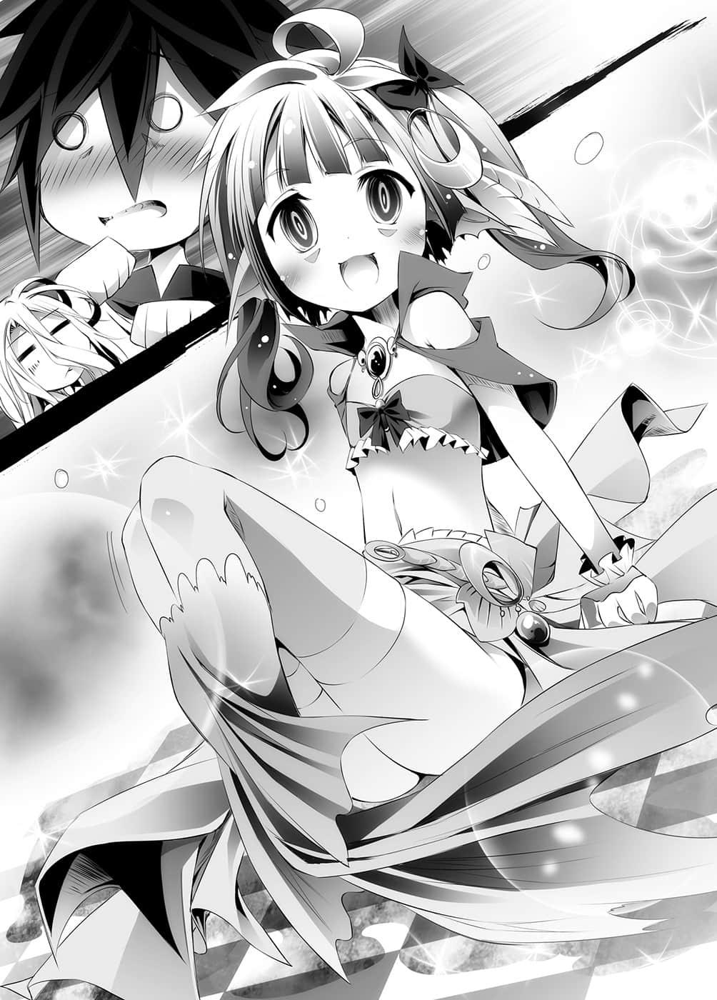
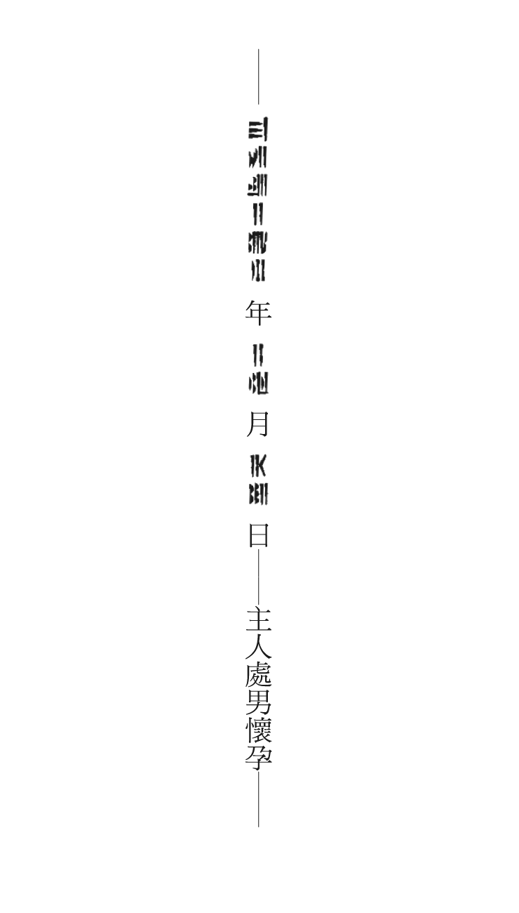

# 永不结束

> 来源：https://www.linovelib.com/novel/9/2079.html

「……史蒂芙啊，爱是什么呢？」

「——又是那个话题吗？不是已经结束——」

「我好像生了个女儿。」

「………………嗄？」

……史蒂芙告诉自己要冷静下来。

依然为国务而忙碌的史蒂芙办公室里，空、白以及吉普莉尔突然出现。

然后空间不容发地开口第一句话就是这个。

……嗯，原来如此。

即使冷静下来，仍然什么也不明白。

「……你的精神正常吗？」

——这时旁边的吉普莉尔为她说明。

「海栖种是多产的种族——更何况是女王，只要主人的数根毛发就能生子了吧，所以只要女王没有睡着，你可以知道她们是多么安泰的种族了。」

然而史蒂芙忍耐着头痛说道：

「——不，不是那种问题啦……欸？女儿？」

「不过虽说是女儿，但因为她是海栖种，所以无法从海里出来吧？只能由我去看她，因此我才烦恼着该不该去——说不定这就是父爱吧？」

——史蒂芙目睹了奇迹。

——处男似乎萌生父爱了。

「……没必要……去……」

「不，那可是我的女儿喔！？」

「正确地说，那是女王将从主人的头发取得的微量灵魂，经过合成创造出有如女王莱拉的复制品般的存在……不过那是海栖种的『繁殖』就是了。」

「克拉米，你最近即使输了也不会不甘心了呢？」

那么——只要找出非正常的获胜方法就好了。

「是啊，正是谬论——不过我倒是出乎意料地喜欢这个谬论。」

——因为赋予人偶自己生命的人，远远在那个极限之上。

「问题是——太快了。」

——「已经到了极限」、「只是这种程度」，这种话打死也说不出口。

「……克拉米，你早就知道这件事了吗？」

被这么一问，脑中闪过的是——他所看到的世界，在那里——

菲尔无言到极点，甚至感到佩服了，而克拉米苦笑一声，也点头表示同意。

然后她半信半疑地说出那个情报。

——原来如此，那就值得吃惊了吧，克拉米笑着说道。

菲尔悲伤地说：情报没有和我分享吗？但是克拉米笑了出来。

离开尼尔巴连府邸，并肩走在暂时无法回来的道路上，菲开口问道：

「好了，菲，我们走吧，我想暂时是回不来了——」

只不过单纯地——

「不管是我还是空，我们既不是超人，也不是天才，不过我们没有必要是天才。」

「————爸……爸……？」

——没有争吵的样子。

从与空比赛存在黑白棋的那天起，大约半个月的时间里，那样的记事本已经超过五十本。

「…………」

菲尔这么说着，然后触摸额上的魂石。

---

■ ■ ■

「主人们的圣经真的成为神话的日子……看来是不远了呢。」

这样一来，继兽人种之后，海栖种、吸血种，终于连天翼种也臣服于人类种了。

正当空要冲出去抱住她的时候，白一拳打在他的身上。

「…………」

「对，验证失败的理由，思考对策，再做好准备，进行挑战——再次失败。」

海栖种的少女开口第一句话就说道：

看到展现她那种觉悟的记事本堆——菲尔内心为克拉米的成长感到高兴。

没有做不到的事。

「啊啊啊啊，我的女儿啊，没错，我就是爸呜呃啊！」

「空先生他们拉拢奥仙德——海栖种与吸血种加入艾尔奇亚联邦了。」

「——啊，克拉米，有情报密告进来了，稍微暂停一下。」

——森精种和地精种等主要国家将不再静观其变，而是正式采取警戒了吧。

那本记事本记载着，可以预料却没有预料到的模式和对策。

忽地，『他』的论调浮现脑中，克拉米苦笑着说道：

「我想说的是你太逞强了啦……」

与菲尔玩游戏的克拉米叹了一口气，取出记事本。

「奇怪，海栖种应该不能从海中出来才对。」

「……克拉米，对克拉米来说，空先生是怎样的人呢？」

在短期间内，合并一个大国和一个上位种族。

——因为对自己说谎，就等于是否定人类妹妹。

「史蒂芙！快拿水槽来！啊，中庭里有水池吧！那个也可以吗！？」

「——就是不说谎啦，绝对不对自己说谎，所以他无法说谎。」

「菲，你知道所有事物都共通的——达成目的的方法吗？」

阿兹莉尔——还有阿邦特・赫伊姆也即将改变。

「就是事先预测、预想，准备周全后，挑战——然后失败。」

吉普莉尔静静地点头肯定，在圣经——空与白的观察日记上附加一句。

而且是以自己的两名主人为中心——

世界和万物都缓慢地，但是确实地，转变成『十条盟约』以后——不，甚至以前都无法变成的——某种样貌。

「我们无限次的失败，将会照亮后继之人的脚步——成为走在黑暗中的灯火。」

「……菲，怎么了吗？紧急事态？」

那里有人类种、天翼种、兽人种，而且——甚至还有海栖种与吸血种。

空与白以可怕的速度，达成不可能的任务，菲尔对此感到困惑，不过——

「……什么？」

「……对，就是说啊。」

「……空、空，有个小小的海栖种来了，得斯。」

就在一团混乱的时候，伊纲出现了。

「啊，不是啦……只是因为是个难以置信的情报……」

「克拉米，这么说来你以前说过的——『还有一个』是什么呢？」

「……怎么可能会甘心，所以我才这么做啊。」

克拉米生着闷气这么主张，她所记录的是自己的败因。

对他来说就是——白的灯火，对自己来说就是菲的灯火，先王无止尽的败北也是一样。

虽然菲尔已经有了自己的答案，不过她仍然提问。

他们终于要开始对艾尔奇亚发动攻势了吧——不过——没有问题。

——口中叼着一条大鱼——不，叼着一名海栖种少女。

「……又是我输了。」

「……比预料中快了一点呢，我们赶紧收拾行李吧。」

克拉米这么苦笑着，不过听到那个情报——菲尔惊讶地睁大双眼。

菲尔看起来一副早就知道的样子，只是为了确认而问的菲尔笑了。

——那种事情值得大惊小怪吗？克拉米笑着说道，不过菲尔又继续说：

「勉强赶上了呢，我们强行赶进度也算有代价了吧。」

「那个叫布拉姆的家伙也来了，得斯。」

「呵呵，如果真的成功的话，那将会是颠覆世界的大事件呢，不容错过呀。」

「……要失败吗？」

「不是啦，菲，我说了是预料吧？他们的战略是『随机应变』呀。」

忽地，菲尔询问克拉米，对于那个带给她如此影响的人，她有什么看法。

不过就连那个竞赛都可以超越世代，托付给下一代人——这就是人类种弱者。

——本来人类种与森精种比赛使用魔法的游戏，在正常情况下是不可能获胜的。

尽管这么说，略带苦笑的菲尔也开始收拾行李，然后——

「想要成为天才才是重要的事。」

——爱尔文・加尔得首都，尼尔巴连府邸。

眺望着吵杂的办公室，吉普莉尔一个人静静地思考。

最后一定会成为——全人类种、全种族的灯火——

「而且阿邦特・赫伊姆『十八翼议会』也决议——加盟艾尔奇亚联邦了喔。」

——只是要合并全种族的话，那也只是时间早晚的问题而已。

「什么都好！可以请你们到外面去解决吗！？或者可以请你们工作吗！！」

但是继东部联合之后，连阿邦特・赫伊姆都合并的话，那情况就另当别论了。

——空只感到一阵电流窜过。

……把窃听他国的『精灵回廊情报传达网』称为密告，真是别出心裁的讽刺。

——没错，太快了——如果只是海栖种和吸血种奥仙德程度的话，大概会被无视吧。

做不到只是还没能做到而已——剩下的就是和寿命时间竞赛。

「啊啊……是吸血种的魔法吗……可是如果不快点放进水里，她会死掉喔！」

「这个过程——只要无限次重复下去，这世上就没有什么事是做不到的。」

「……真是惊人的谬论……」

「他是想要成为玩家的人啦，拒绝只是当个人偶的人。」

——然后，没错，真要说的话就是——克拉米继续说道：

「有朝一日我们要超越的人——吧？」

听到克拉米充满自信地如此断言，菲尔笑着牵起她的手。

---

■ ■ ■

东部联合首都『巫雁』——巫社。

月光之下，黄金狐少女和迈入老年的白色兽人——巫女和初濑伊野面对着面。

坐在跨越庭园水池的桥栏上，拿在巫女手上的是——兽人种的棋子。

——手里把玩着『士兵』形状，发出淡淡幽光的棋子，巫女说道：

「……玩家……这个字在人类语中，听说有两种意思呢。」

也就是——『ｐｌａｙｅｒ挑战之人』——或者是『ｐｒａｙｅｒ祈祷之人』。

遵照自己的意志，向前迈进——开拓未知，挑战未来之人。

将意志托付他人，闭上双眼——背对未知，托付未来之人。

「初濑伊野，说实话，那时我依判断应该对你见死不救。」

这句话不含歉意，因为她没有那样的资格，巫女毅然地对伊野说道：

「那样一来，你一个人的牺牲就可以造成吸血种、海栖种的衰败，在没有风险的情况下掌握他们。」

「……是的，我完全明白。」

——伊野无法理解空这个男人的理由正是因此。

为何自己会被救呢？

初濑伊野充分理解巫女的意图，也有在那里丧命的觉悟。

正因为如此他才不明白——无法理解空这个男人。

这么一来——为何他对原本的世界毫无留恋，这就令人感到兴趣了，那很可能是——

没有根据，真要举出一个依据，只能说那是兽人种的直觉，或者该说是基于经验的直觉吧。

——实在是太过无聊的游戏，太过无聊的结果。

——不过……

为什么像空那么擅长心理战的人，却无法谈现实的恋爱，那是因为——

他无法对自己说谎。

伊野心想，恐怕有没说出来的理由吧——然而……

「不过身为玩家，不喜欢不战而胜也是原因之一吧。」

「……他和初濑伊纲做了『约定』，说要救你啊。」

「——那个游戏确实是赢了，不过那是不必要的游戏。」

最坏的情况——布拉姆的阴谋得逞，人类种也有可能遭受无可挽回的损害。

——唯有这件事，就算和全世界为敌，他也绝对无法认同。

既然无法对自己说谎——对不喜欢的女人，他就说不出喜欢两字。

区区的棋子——能够飞出盘上，成为玩家。

但是——不知为何，她能确信。

「如果他能对自己说谎，一定会成为一个很容易了解的坏蛋吧。」

听到那句话，巫女笑了，她将兽人种的棋子——将那个仿佛用光编成的士兵……

伊野垂下头来，不过巫女却笑着说「也是啊」，然后继续说道：

「…………」

「——如果你能够再次重拾梦想的话，如果你愿意再让我做一次梦的话。」

用手指往空中一弹。

「总括而言，因为白痴游戏，人类种差点变成吸血种的饵食，虽然空他们将计就计，反将一军……但既然是将计就计，他们也心知会有多大的风险吧。」

这实在出乎伊野意料之外——就为了那种事，连种族存亡都赌进去吗——？

「所以……我也做好觉悟了——初濑伊野。」

「——那个人虽是骗子、诈欺师——不过他不说谎，不，是无法说谎。」

巫女却是以铃声般的笑声回答：

巫女自信地笑了，她的脸上——有伊野长年未见的神情。

对于不认同他唯一喜欢的少女的世界——他无法认同吧。

「……老实说，我不知道。」

如果——巫女继续说道：

「——空，你就让我看看吧，我未能看见的，梦想的后续。」

对于空来到这个世界之前的事，巫女一无所知。

但是只要一步走错，不管是东部联合或者艾尔奇亚，都可能受到重大打击。

「初濑伊野，对于空那个男人，你怎么看？」

不过想必过得很辛苦吧，重新在近处观察空与白，让她有了这个想法。

那个曾经一度梦想，然后中途挫败的梦想的尽头——那个永无止境的梦——

「那是不必要的风险，即使如此，那些人仍然挑战游戏。」

「就连我也放弃了你，那个男人却没有对你见死不救，贯彻自己信念的男人——你有没有想要相信看看呢？」

被这么问到，伊野垂下头，恭敬地回答：
