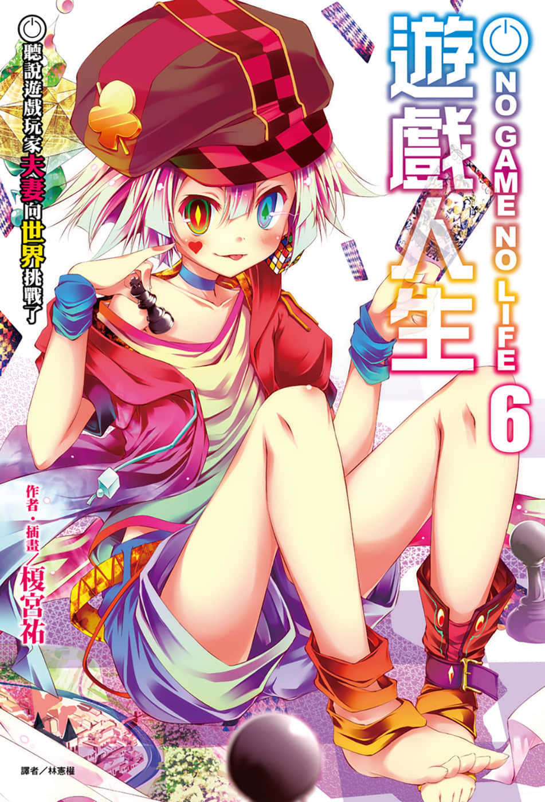
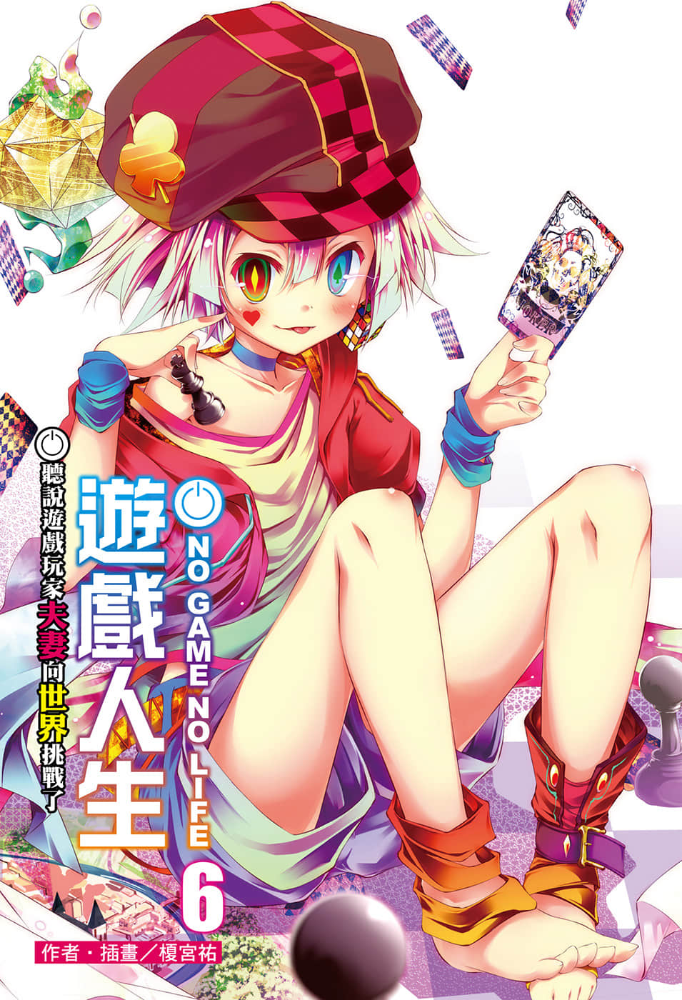
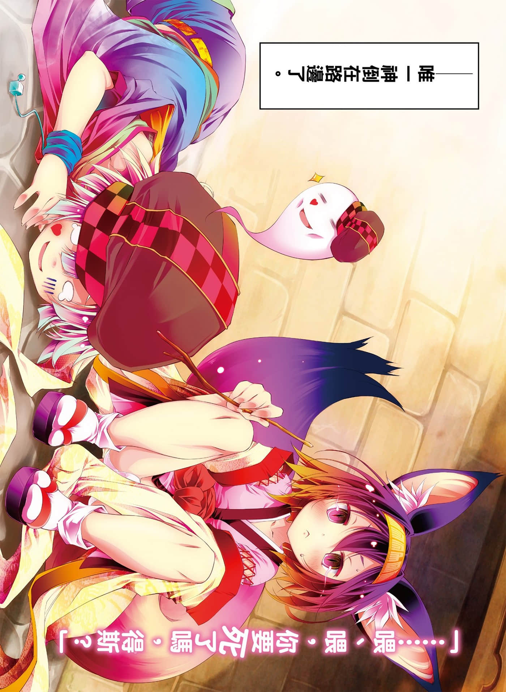
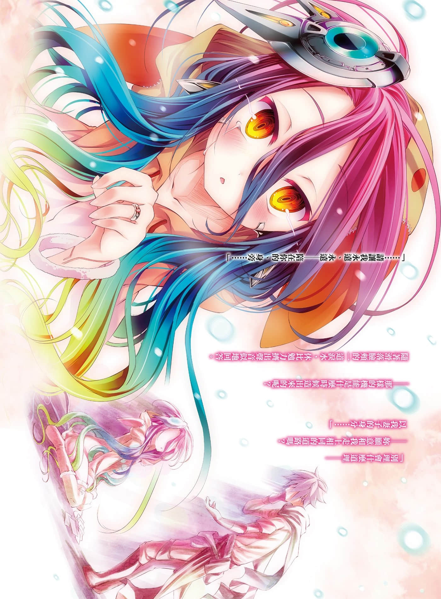
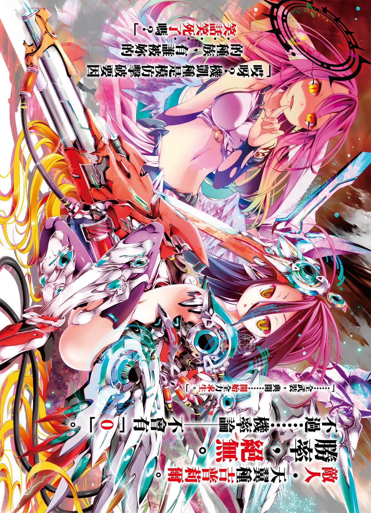
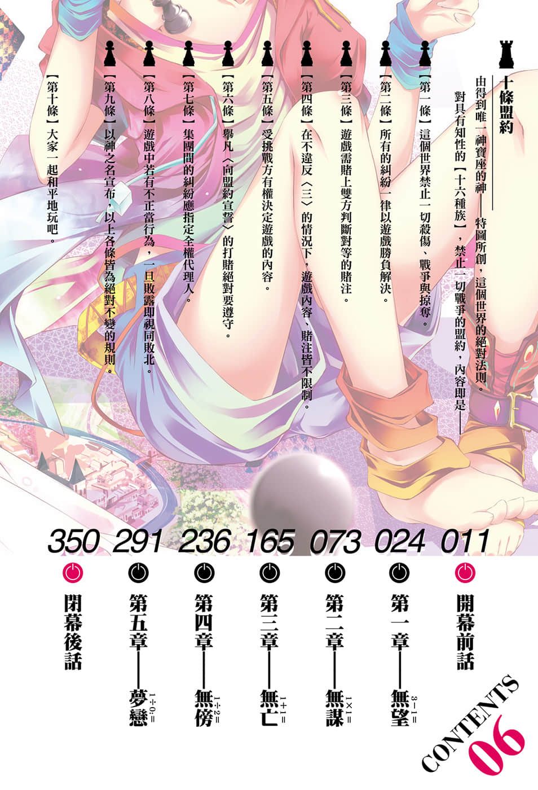

# 插图

> 来源：https://www.linovelib.com/novel/9/118066.html

台版 转载 深夜读书会

作者：榎宫祐

插画：榎宫祐

译者：林宪权

图源：深夜读书会

录入：深夜读书会

深夜读书会：ritdon.com

仅供个人学习交流使用，禁作商业用途

下载后请在24小时内删除，深夜读书会不负担任何责任

请尊重翻译、扫图、录入、校对的辛勤劳动，转载请保留信息

————————————————

【内容简介】

创世的『唯一神』……

将揭露六千年前不为人知的大战真相！

一切都以游戏决定的世界【迪司博德】——的创造者唯一神特图，在艾尔奇亚的小巷里，悄悄地……因饥饿而倒在路上。受到伊纲的施舍而得以存活的特图，道出了「六千年之前的故事」——将劈天裂地的『大战』断定为『游戏』，向世界挑战的男人，以及陪伴在他身旁的少女。

「——哪，我们再来玩游戏吧……下次，我一定会赢的……」

不留存于记忆和纪录中，即使如此，只有『我』仍记得的故事——

通往『最新神话』的『最初神话』——超人气异世界幻想故事的第六集！！

【作者简介】

榎宫祐

【绘者简介】

我要借这个场合，向各位美术组的工作人员们致上无比的谢意。

如果叫我画阿邦特‧赫伊姆的话，我会死，不，我要逃走──不要啊，放开我！！那种东西以我的画力不【消音】。

拜启，各位美术组的工作人员们，你们太努力了。

我是榎宫。我正早一步看着完成后的动画。

榎宫祐

我是榎宫。在本书出版时，本作的动画也在播出了，多亏了动画固定了视觉印象，让我更容易想像情景，要写成文章也就轻松了。

