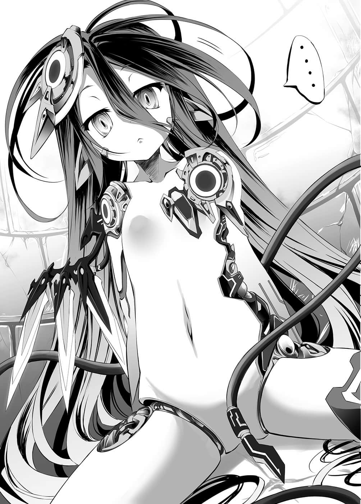

# 第二章 1×1=无谋

> 来源：https://www.linovelib.com/novel/9/2084.html

…………好了，来整理一下状况吧。

我的名字叫里克，十八岁，处男——……干嘛啦，处男有错吗——！？

————不对。

不对，不对不对不对，这是混乱的思考进入空转状态所冒出来的疑问，慢着慢着——镇定一点！

整理一下吧。虽然无法掌握状况，但那就代表这是超出想像的最糟状况。

要对疑问设定优先顺序——发生了什么事？这是怎么回事？将会发生什么事？完毕。

首先，确认心之『锁』……没问题。即使连续发生意义不明的事，心锁仍勉强安好。

那么就算早一秒、不，早万分之一秒也好，也得尽快掌握这个状况，不然——

「……【检讨】……整理状况中……」

跨坐在自己身上的裸体少女——外表的怪物，只要她有任何动作，自己就完蛋了！

让思考加速——加速到连时间也停止——

---

■ ■ ■

里克骑马前往位于聚落东方，记载于地精种地图上的废墟。

据说那是过去遭到一名天翼种一击毁灭的森精种都市。

森精种的相关情报是极为高度且珍贵的资讯。

在战场捡拾也得不到任何物品，收集到的知识也缺少许多细节。

毕竟他们不使用道具，靠着不需触媒的魔法就能解决一切。

然而因为在途中黑灰飞降加剧，为了避免遇难，里克逃入附近的小型遗迹中——在里面他目击到一具『其他种族』。

那是机械部分外露，外表是裸体年幼少女的——『机凯种』。

最凶恶的种族之一。不过没有问题，应该不会有问题的。

里克无视她，想要装作什么事也没有。

对于与自己所知的情报出现复数矛盾的状况，里克在内心大叫。

机凯种覆在里克的身体上，机械式地面无表情，不带感情地说出这句话。

「【疑问】人类在这种情境会产生性兴奋，这个推测是错误？」

『不』——这个机械明显是在说『人类的语言』。

周围的黑灰连同全部的装备一起消失，他则是被压倒在地——的样子。

因为他的知识和理性，制止了差点因脊髓反射动作而开口说出的话。

即使将全部情报整理过一遍，里克仍无法掌握状况，不能有所动作——

————

里克努力假装平静——对于又得知一项棘手的情报，他不禁在内心咋舌。

机凯种少女平淡地立即回答：

「【提问】你对本机不产生性兴奋——是因为本机没有魅力？」

「【解答】想要解析人类使用的独有语言。」

人类的一切都在对方掌握之中——更别说对方对人类已有所认知。

而他们之所以被视为极为特殊的存在，则是因其战斗行动。

……以上就是里克所能掌握的一切，也就是第一个疑问『发生了什么事』。

……里克只得做好觉悟，认真地观察跨坐在自己身上的机凯种。

……听到她不逊于最初『哥哥』的背台词般的语调，里克脑中再次呈现一片空白。

——就是以上的知识，使里克闭上了嘴。

「请不要偷窥别人的生理反应好吗？」

如果连生理反应都被她看穿，那么里克的恐惧也瞒不过她吧，她到底有何目的……？

正当里克在思考中——她却提出这个困难无比的问题，里克顿时感到晕眩。

——但下一个瞬间，他已倒在地上了。

「………………【确认】对象的体温、脉搏、生殖器皆无反应。」

——不能说谎，但是也看不出对方的目的，无法掌握状况。

「……独有语言？」

（——那么『这是怎么回事』！？ ——这到底是什么状况啊！）

「【疑问】没有性经验却挑选对象？」

不过，先前的混乱仿佛是虚假的一般，里克的思绪逐渐变得清明。

然而机凯种少女却机械式地点头，机械式地告知里克。

受到攻击虽会报复，但只要不与之敌对，似乎就不会遭受攻击。

但是对方使用人类的语言，尽管不正确，却也能推测人类的性行为，甚至连身体反应都在她掌握之中。

「【确认】肌肤之亲——使用皮肤组织接触的独有语言，推定为机凯种所欠缺的『心』的交流行为。只要模仿相同行动，本机也能读取『心』中所思……这个分析错误？」

「您的意思是处男没有选择喜好的权利吗……」

也就是说——一机看到就等于整个种族看到，与一机敌对就是与整个种族敌对。

——……嗯～我很了不起嘛，里克在内心自卖自夸。

或许是不打算回答里克的问题吧，她面无表情，用毫无起伏的声音继续说道：

里克覆诵了一遍——同时内心祈祷，希望自己的推测是错误的。

接着是第二个疑问——他正思考着『这是怎么回事』……

——在明了状况之前，自己不能采取任何行动。

至少可以确定，她对人类这个种族有所认知。

据说对于末端遭受的攻击，他们会以不满一秒的时间进行分析，立刻设计出同等的武装。

那就是——他们『不会采取主动』。

不过从至今为止所得到的情报可以推测出一件事，而那件事——比随意提问更加危险。

也不知她是否了解里克心中担忧的事，只听到机械少女再次提问：

发生了什么事？里克完全没有头绪……不过看来自己并没有死。

首先，他们是机械的种族，甚至连生物也算不上，他们是以『连结体』集合连系在一起行动的。

不管怎么样，里克上半身的衣服被剥光，并被压倒在地，机凯种则覆在他身上说道：

————

————————————真是的。

「【读取】设定０７２——『人、人家才不是自愿这么做。这是意外，对，是意外。』」

不管是森精种的魔法，还是地精种的灵装，甚至是龙精种的吐息——全部都会将之重现并还击。

——外表是接近十岁左右的人类少女。与长长的黑发形成对比的雪白肌肤，以及红宝石般的眼眸，说明她是个无可挑剔的美少女——如果没有身上随处可见的机械，以及如尾巴般的两条管线的话……

「——是啊，如果只是肌肤相亲就能明白对方的心意，那人类也就不用那么辛苦了。」

听到这个完全意想不到的问题——里克瞬间迟疑了一下。

——『机凯种』。即便是在与大战相关的怪物混帐东西之中，也是极为特殊的种族。

生理反应被她探知了。『说谎』被视为敌对的可能性——极大。

「……先别说喜不喜欢这个问题，谁准你擅自夺走我的贞操了？」

这时原本贴在身上的肌肤离开，跨坐在里克身上的少女型机械继续说道：

因此地精种的纪录中是这么记载的————『不可接触的危险种族』。

不知何故，人类受到机凯种的注意并观察——亦即受到他们的注视。

这个与其敌对就等于招来灭绝的灾厄，提出了即使面对的是人类也难以回答的问题——而且还不能说谎。

「……这个嘛，我就姑且回答是因人而异吧。」

因为这场漫长的大战，他们的武装持续增加，因而在理论上被视为——可以无限增强的最凶恶种族。

不过，他们还有另一个特殊性。

被制伏在地的同时，里克甚至打算趁对方不注意时自杀——

『哥哥，我已经忍不住了，请让我成为女人。』

因为被打倒在地，所以非常有可能是撞到了头。

人类是亡灵。不存在，不可存在，也不被察觉——要保持沉默，不答话吗？

不好的预感偏偏成真，里克沉默地露出苦笑。

……这是记忆障碍吗？

「【推测】——这个符合情境的设定不够充足？」

「差不多可以请你告诉我……你『有何贵干』了吧？」

但是如果记得没错，对方不带感情，像是背台词地说出了那种话，最后甚至突然夺走了自己的贞操——吻。

「【问题】……无法理解。」

——里克开口提问。虽然他很清楚随意提问也是件很危险的事。

理性命令里克——『现在先配合她的谈话』。

那所显示的事实，让先前烦恼是否该回话的里克，不禁对自己的滑稽感到可笑。

里克甚至感到一种成就感，但是机凯种少女却马上提出问题。

里克眺望着听到他的回答后似乎陷入沉思的机凯种——

虽然这个事实本身就令人不寒而栗，但是无视她——拒绝她的话，很可能被视为『敌对行动』。

从先前的谈话，他产生了一个疑惑，如果那个怀疑正确的话——

「【肯定】——就是名为『心』的独有语言。」

也就是——大喊『混帐！无法理解的是我啊！』

不会采取主动，那么就无视她，等她自动离开——结果却是这副模样。

——————

尽管里克这么回答，但他的思绪却逐渐地明确，开始明了整个状况了。

「客观来看，我觉得你很可爱。只不过要产生性兴奋的话，人类还是比较好，而且你看起来年纪太小了点。」

也就是说，若是因为不当的发言而被视为『敌人』——人类将会绝种。

——这到底是什么状况？

……这个回答如何呢？既没有说谎，也没有否定——就处男而言，这是个完美的回答吧。

————他们一直观察着我们，恐怕已有相当长的一段时间了。

里克们滑稽地以为自己隐藏得很好，其实全在他们掌握之中。

不论是因为何种理由被盯上，这既是最好的情形也是最坏的状况——不是吗？

被所有种族视为危险的族群正注目着里克他们——只是这样就足以被灭亡了。

——那该怎么办呢？没什么，就和往常一样。

即使算不上最佳，也要采取——最理想的方法。如此而已。

里克手按胸口，如往常般默念咒文。

不过这次和平常有点不同——封印住吧——把感情封锁起来，忘记吧。

这个不祥的机凯种会像拍掉灰尘一般，前来杀死人类，把这件事给忘掉吧。

只要消除感情、记忆、恐惧、动摇和焦虑——就能成为亡灵。

里克的目的有二：查明这家伙的真意，以及『诱导』她。

里克深呼吸一次，『要让自己相信』——我和这个机械是处于『友好关系』。

骗过身体反应，欺瞒记忆，全部都用锁炼捆住后——再上一道『锁』。

办得到吗？办得到的，『里克』——如果是『你这混帐』的话。

她的目的是『心』的解析，如果那是事实的话，就代表这家伙——没有『心』。

欺骗没有心的人——那远比欺骗人类要容易得多吧。

而且——『你这混帐』是天生的人渣，至今做起那种事就像呼吸一样。

没错吧？——那么就没有任何问题。

————喀锵。

比平常沉重数倍——上锁的声音响起，里克睁开了眼。

——眼前是拥有一头长长黑发的——『女孩子』。

但是里克同时也想到——这是个好机会。

「…………【提问】在身边就能解析『心』？」

但那是没用的，因为里克所说的没有半句假话。

不会吧——她真的只是陈述事实——？

——要套出该套出的情报。

——如果这家伙是机械的话，那结果就可以预料了。

「……【理解】所谓肌肤相亲，果然是暗喻生殖行为——【要求】和本机进行生殖——」

比起那种事，里克更想确认的是，她『不隐瞒』已经查出聚落这件事。

「唔嗯，我姑且就这么回答吧——我拒绝。」

「【解答】许可将本机带回聚落，实践生殖行为。」

因此，少女点头回答。

「…………什么？」

——要装成煞有其事。表现出困惑，然后问她为什么。就算对其理由已经心里有数了。

「不，你的条件也要变更。」

在虚空中，就像以光画出轮廓线一般，浮现出西洋棋的剪影——然后实体化。

「【提案】你可将本机带回『聚落』，慢慢蹂躏。」

那就是为了创造出——『这家伙希望的角色』的情报。

或许是因为她无从得知里克的内心吧，只见少女像是明白情况似地，严肃无比地点点头。

里克终于确认机凯种采取如此毫无脉络之行动的理由了。

尽管嘴上这么说，其实里克心里很清楚，这个游戏要赢是『不可能』的。

即便算不上最佳也要是最理想的方法——

「算了，我答应和你比赛游戏，但是我要变更条件。」

「【解答】本机——想要解析机凯种是否有『心』、『自我』和『灵魂』。」

「……欸，那也就是说……你……」

「言外之意是——那是必须相互理解才能感受到的。如果你能不让人发现你是机凯种，不离开我身边——也就是不受到拒绝地持续和我沟通，虽然耗费时间，不过应该就能解析了。」

里克事先就已经预测到了，只不过他先前判断那是自己一厢情愿的想法……

「啊～你完全没有掌握情况啊……」

不过不管是哪一种都没问题。这样一来——需要的情报就凑齐了。

「如果你胜利的话，我就许可你留在我身边，直到你理解『心』为止。」

而『她』终于结束漫长的思考，依然一脸认真地，陈述错误的意见。

——对，就是这个情报。

那样就再好不过了。虽然还无法安心，不过已经稍微远离最坏的可能性了。

她提到『聚落』这个词语的理由可能有二。

「【答应】没问题，本机胜利时的条件不变。」

「不管输赢都一样啊！？」

——这就是机凯种的武装展开法，里克看得目瞪口呆，少女则是缓缓对他说：

看到少女无机质的表情中，含有些微自夸想到好点子的神色，里克忍不住大声吼叫。

得到解放的里克缓缓起身，只见少女往他的正面一坐，然后告知他：

若机凯种如传闻般，是擅长分析、解析——演算的机械，那西洋棋就是她的拿手好戏。

看到少女沉默不语，里克以冷静无比的头脑思考。

「【答应】那么游戏——」

好了，处于『友好关系』的『里克』？接下来应该要为她担心了吧？

「【结果】由于理论漏洞而产生诸多矛盾，本机被解除连结，遭到报废。」

「『心』不是物质。」

用最低限度的手段，套出最大限度的情报，仅仅一步棋就要将这个状况利用殆尽。

这个最一厢情愿的猜测，过于乐观的可能性，反而让人感到可疑——不过，如果这家伙说的全是事实，那么顺利的话——就可以封印，甚至利用她。

里克就像这样露出大胆的笑容，然后话锋一变——

少女伸出的手掌上——不，手掌前的地面。

里克皱起眉头，说出像是在为她担心的话语——而『少女』则用力地点头说道：

「也不是那种问题啦……」

「……………………」

聚落被发现了——那种事根本无所谓。

他一定程度地强势拒绝，这句话或许可能被视为敌对的发言。

——这个机械坏掉了。

不过他冷静沉着的头脑和下意识都断定不会有问题，而且——

那也就是——

接着她依旧面无表情，侧着头说道：

机凯种少女沉默不语，注视着里克的眼睛。

究竟自己是否能『动摇并猜测出』这个机凯种——这个机械的企图呢？

「我快要冻死了。我的衣服都被你斩破了，可以帮我准备替换的衣服吗？」

如果是其他种族，他们『随时可以找出』人类的聚落——这早已是再清楚不过的事实。

如果她另有目的的话，『她会自行变更条件』，因为如果不变更，计划就会失败。

（译注：又称谎言者悖论，指因句子意会上的自我矛盾而无法成立。）

一路和死亡并肩而行的头脑，瞬间规划出复数的战略。

少女再一次点头，然后从里克身上退开。

里克再度产生喀锵声响的幻听。

「啊，在那之前，请让我再加一个条件。」

「如果我赢了，我要求放过我，别来我的『聚落』。」

里克流着鼻水，牙齿打颤，向她提出恳求。

好了，你能做到什么地步呢？现在是你展现实力的时候了——诈欺师。

「【结论】你可以顺从欲望蹂躏本机也不会有问题，虽然没有洞就是了。」

「我才不会那样做！话说原来你没有啊！」

看到那对红眼睛，里克确信了——她正在『解析』自己的话中是否有谎言。

「我有必要可悲到借由人类以外的对象摆脱处男吗？而且更重要的是——」

…………

「【理解】因为你对本机感受不到魅力，所以拒绝生殖行为。」

「…………」

「机凯种是借由叫连结体的东西连结在一起的吧？很抱歉，我没有暴露的嗜好。」

这样就如她所愿——创造出一个看起来有『心』，其实封闭心灵的『里克』了。

然而机械少女却无感情地睁大双眼，惊讶地问道：

「【否定】——本机已被从『连结体』解除连结了。」

「咦？为什么？」

「——【惊愕】…………【提问】要如何才能解析呢？」

「【典开】——游戏００１『西洋棋』——」

……少女深思熟虑后，终于像是接受了他的说法，点头答应。

「因为你想解析的『心』是无法靠生殖行为解析的。」

「——那如果我赢了的话呢？」

「【提案】——要求进行游戏。」

她的目的虽然不明，不过从她是否接受变更条件，可以判别一件事。

来吧，编造一个能让知性机械认同，最理想——最合理的理论。

那即是自我指涉的悖论㊟。

这可以过滤出『两种』可能性。

「…………」

只是单纯陈述事实而已——或者是为了别的目的所采取的『牵制』。

——对，她一定会答应，不过问题『并不在那里』。

————『完毕』。

「【胜负】本机获胜的话，要求将本机带回聚落，实践生殖行为。」

因为——

——看来是避开最恶劣的事态了，至少里克判断那样的可能性很高。

---

■ ■ ■

——游戏是单方面的胜负。

里克找不出丝毫胜算，仅仅二十九步就败北了。正如他所预料。

「可恶，我输了……没办法，依照约定，我带你去『聚落』吧。」

对手是驱使高度演算的机械——要在最佳棋步的判断上取胜是不可能的任务。

正因如此——里克才提出『对输方有利的条件』。

「…………」

机凯种少女注视着脸上挂着笑容——但仍不忘表现出不甘心演技的里克。

——奇迹似地，一切都照着里克的剧本进行。

虽然尚未确定这个家伙的真意，不过面对区区人类，卖弄高明的计策也没有意义。

若是对人类感兴趣的只有这一具——也就是只要并非『其他机凯种』也有兴趣的话，那应该就不会受到其他种族注目了。

话虽如此，这个游戏没有任何拘束力，所以还不能大意——

「【提问】为什么要假装好像很不甘心？」

「——什么？」

里克瞬间倒抽了一口气。

不甘心的『演技』被看穿了吗？里克如此怀疑——但那应该不可能。

因为他完全封闭感情，扮演着『角色』，就连里克自己，都不知道那是否出于真心。可是如果他的『真意』被看穿，那就——

机械少女窥视里克充满警戒的双眼——应该没有映出任何感情的黑色眼眸，说了一句：

「【断定】再次确认对象有『心』的存在，判断值得继续解析。」

——里克不明白那句话的意思。

但是机凯种少女看起来似乎露出些许微笑——那是错觉吗？

「……啥？欸、什么？那个是……名字吗？」

「…………————」

不过如果真是这样的话，应该不会有人认为她是机械吧，剩下的就是——

「那么，首先你也该穿衣服了吧。」

事到如今里克才想起这件事。由于事态接二连三发生，让他完全忘记了。

「可以使用兵装的话……数分钟……就到了……」

「问题是从衣摆下伸出的尾巴吧。」

「欸～我的名字叫里克，你呢——？」

「胆小，沉默寡言，说起话来断断续续。一旦被人追问起过去就觉得很麻烦，所以不说多余的话。你在句首加的那个摆明就像机械的词汇也禁止——这样如何？」

————

无表情，没有起伏的声音，只有不必要地添加重音，那样的方式被里克一口否决。

「【提问】『名字』是可自由设定的个体称呼？」

忽地，她用指尖缠绕自己的长头发，接着报上名字。

「把你机械的部分遮住，头上的装备就戴上兜帽——记住啰，不可以让别人看到你的肌肤喔！」

从大局的角度考虑到返家后预计发生的诸多骚动。

那两条能自由动作的管线，尽管她本人否定，不过怎么看都像是尾巴。

「你那样的机动力……真的没有使用精灵吗？」

「……【要求】提供最适合的状况设定。」

「没有使用。休比是『解析体』……性能在……机凯种平均以下……」

她似乎是借由这个尾巴——也就是她本人所说的疑似精灵回廊连接神经的媒介——从周遭取得动力。

——这样叫平均以下啊……她甚至没有使用任何兵装。

「…………【有理】。」

「好了，来做个整理啰。我带你去聚落——但是在那之前有几点要注意。」

「…………啊，这么说来我们还没自我介绍喔。」

对于这个蛮横无理的种族性能差距，里克已经超越惊愕，到了只能感到傻眼，不禁哀嚎的地步。

「……【不解】自由设定被订正了……【反驳】那一开始便自由称呼就好了吧。」

（译注：Schwarzer是德文黑色之意。）

「……【反驳】极为认真地检讨过……」

「……演技？不是……我是追踪……与提示设定一致的人物……加以模仿……」

甚至反映到表情上了——看到她模仿得未免太像自然的人类，里克瞬间说不出话来。

「……我说……你那是演技吗？」

如果没有外露的机械部分，就连里克也快产生她是人类的错觉。

「………………………………嗯。」

里克不明白她这句话的意思。

尽管对那些事情怀抱许多不安，里克仍决定放弃废都之行，返回聚落。

——大概是错觉吧，里克这么断定后，再度确认一次。

「【回答】——用『休瓦尔札（Schwarzer）㊟』做为名字。」

然后——

「——【读取】模仿人格１６１０——」

「这个嘛——是啊。」

机凯种少女——休比沉思一番后，点头。

从她机械的耳朵和头部的金属部分，不管怎么看都知道是机凯种，但那些是无法拆卸的，所以做了大件又蓬松的连帽长袍给她披上，总算是隐藏了起来。然而……

里克一边折指计数，一边对她说明。

「所以继名字之后要改的就是，你那个摆明了『我是机械』的语调。」

在抵达聚落附近时，她将里克放了下来。

但是问题是聚落内会出现精灵反应。

「……知、道了……这样……可以吗？」

总觉得少女一副不满的样子，看起来就像是在『抗议』。

「【解答】——Üc207Pr4f57t9。」

是啊，我知道。里克说着叹了口气。

「啊啊，真的呢，真令人难以置信。」

原本冰冷无感情的机械式表情上，多了些许的阴郁。

「……不是尾巴……是类似精灵回廊连接神经……」

那说起来就像是人类的进食，并非用来做为精灵运用，而是用来『摄取』。

「你在开玩笑吗？驳回。」

在这样的状况下带个女孩子回去。

「不，叫什么都可以啦。你不能把那个卷起来，或者设法隐藏吗？」

仿佛变身一样。

「……那么，你就是被卷入战火，失去一切的幸存者。」

果然她还是感到不满的样子，不过里克先不管那样的休比，开始认真地思索。

休比视线往上吊，一瞬间看起来像是在考虑什么的样子——

但休比摇头否定。

——没错，不管表情和言语如何掩饰，人类的少女是不会光着身子到处走的。

那可说是没有违和感到了不自然的地步——就像是想起了什么似的——

「一旦被人发觉你是机凯种，那就无法解析心了。因为大家会害怕，不敢和你做沟通。」

机凯种少女——休比点头表示同意，里克于是继续往下说。

「太长、难懂、不像名字，因为这三个理由所以否决——你就叫『休比』吧。」

……

「……不，如果目的是要在人类的聚落进行沟通，那就要取个像人类的名字——」

---

■ ■ ■

——最像一回事的设定是——

「感觉语意好像有微妙的差异，好吧——算了，拜托你啰。」

「【肯定】个体识别号码——不是『名字』的同义词吗？」

说老实话，他没跟克珑说一声就一个人出来，已经五天没回去了。

——被带着回去的反而是里克。

听到那句话，少女稍微思考了一下。

然后少女看起来像是快发出喀喀声响的模样，认真地思考着。

骑马全力奔驰要花五天的距离，休比抱着里克——数小时就跑完了。

大概整整十秒以上吧。

「……不行……这个是……休比的动力源……说第二次了……」

…………

所以只好采取不得已的办法，像这样强行加以掩饰……

休比仔细地听着里克的每一句话。

「……里克，到了喔……！」

——先不管这异次元的发言。

被里克一句话否决了。不过，是错觉吗——

「我本来就有个妹妹，这种设定怎么可能管用啊！」

问题是接下来里克重新观察休比的模样。

而且是带着棘手无比的伴手礼回去——

休比点头回应。

「——欸嘿嘿，那么～哥哥❤这样可以吗？」

她静静地——开口了。

「……嗯，除了里克，绝对不给别人看……」

最初让休比假扮人类之际，她就说使用精灵——伪装魔法装置很简单。

所以没有精灵反应——而且无论如何都必须露出在外。

里克抓着头，有些自暴自弃地说道：

「……算了，既然如此你就坚持主张那是『装饰』吧。我再说一次，如果被人发现你不是人类，就不可能进行『心』的解析喔！你要记住这一点，全力扮演人类。」

「……嗯，了解……」

里克做好觉悟，进入洞窟内，通过狭窄的隧道。

就这样来到门前，守门的少年——

「啊、里——」

正要出声，里克慌张地伸出食指，示意要他闭嘴。

「辛、辛苦了……大家都很担心你喔。」

守门的少年悄悄地回答，他注意到里克身边的休比，露出了疑问的表情。

嘘～！里克再一次重复同样的动作，要他闭嘴，然后通过大门。

看到里克屏气凝神、蹑手蹑脚登上楼梯的模样，休比问道：

「……里克在害怕……因为休比的关系？」

「是啊，当然那也是原因之一，不过现在真要说的话是——」

话说到一半，里克突然打住。转身回头的瞬间，立刻慌张地护住头——

「里～～～～克～～～～～～～！」

听到大声喊叫的同时。

里克防护的头部——没事，而是腹部被猛然奔来的克珑用膝盖猛烈突袭。

里克连声音也发不出来，痛苦地差点倒下，但是克珑却仿佛不想让他轻松倒下般，一把抓住他的胸口，怒气冲冲地对他大吼。

「你啊啊啊！！不说一声就外出五天，到底要大家多么担心你才甘——」

然后笑嘻嘻地将视线移向激烈咳嗽的里克。

看到她的模样，克珑笑着点了点头，接着继续说道：

「都已经有证言说是强迫了喔！这个没有议论的余地——」

…………

——这时。

好了——里克心想。

「……否定……就生物而言，要生产的话……年轻个体有利，没有议论的余地。」

克珑的动作突然停住。

「你放心，这里很安全，因为有里克在嘛。不过你和里克是如何相遇的呢♪」

「那种事情——」

「我会阻止你呀，那是当然的吧！！虽然那很像里克的个性……但是你也要稍微顾虑到姐姐的心情呀，你想让我的胃开几个洞呀？」

「真是的～别害羞啦♪这种时代第一重要的是生孩子，第二是粮食！然后三四五都是生孩子喔！」

「然而里克却完全没有那种迹象，害我一直很担心喔！我不会碍事的，你们两个进入澡堂后就好好温存——」

首先，论点就很奇怪。竟然没有任何人提及休比年幼的事。

「你啊，真的饶了我吧……」

「……机凯种没有暧昧主观……人类偏好能够繁殖的年轻女性……这是单纯的事实。」

「说谎。」

对于真心担忧自己的姐姐，里克打心底过意不去——话虽如此，他却不能说出真相。

明快的回答，休比继续说道：

「……这里是……里克的房间？」

「……如果是那样，你没有理由……不和那个叫克珑的人类，进行生殖行为。」

依照那张地图可知，有一个聚落因为地精种和妖魔种的交战而消失。

既然如此就只能强行突破了，里克打定主意开口说道：

克珑激烈摇晃着里克叫道，里克连反驳的时间都没有就口吐白沫了。

「不要连你都说我是萝莉控，我喜欢更性感的——」

随即态度一转，以一副柔顺的表情问道：

看到克珑将拇指夹在食指和中指间往外突出，里克不禁抱头烦恼。

克珑以恳求般的眼神看着里克。

「不对，里克应该先确实征求对方的同意才对。」

有如要挖掘胸口般挥出的左拳，以及撼动洞窟的怒吼声。

「要先确实避难至安全范围后再做呀————————！」

——人家可是遭毁灭的聚落中年纪幼小的生存者，才初次见面就被强制进行性行为。

她只是有点感兴趣，为了让对话顺利而将这问题做为开头而已。又或者是看到休比失去聚落，却一付心平气和的样子，因此感到小小的疑问吧——

「不，等一下，说起来他们彼此是否同意了，这件事我们还没确认过啊。」

「……什么事？」

话一出口，里克就感到不妙——不过也没办法。

「……你的手别乱比。」

「……休比……接吻……强迫……生殖行为……」

但是克珑当然不可能那样就接受——

——那你又如何呢？

然而——身为机凯种的她，当然不可能明白他的意思。

「开什么玩笑！别一竿子打翻一船人，人的喜好各自——」

「……我解读地精种的地图后，明白了骑马路程『两天半』的位置发生过战斗，而那附近应该有个小型聚落——所以就过去确认了。」

这个聚落能够看懂地精语的只有里克——所以不会被拆穿。

「……这模样是……配合人类男性……里克的喜好。」

——漫长……真是太过漫长的一天。

于是随着克珑向前踏出的锐利沉重的步伐——

「……——是吗？」

「这是哪里来的孩子！好可爱啊啊啊啊啊❤」

里克一脸虚弱无力的表情，承受着来自背后的各种视线，终于到达自己的房间。

里克想起相遇时『哥哥』的一连串过程。

——好，问题来了。

——这家伙…………

---

■ ■ ■

一名不知其真意为何的机凯种少女炸弹，新鲜似地张望里克的房间。

「带人一起去反而危险，可是如果我说要一个人去——」

「…………休比……」

是错觉吗？这个应该没有感情的机凯种，表情竟然像是对里克略感傻眼似地这么说道。

轻易就夺走了里克的意识。

她假装胆怯的模样，躲在里克的身后回答。

只见克珑似乎放弃了的样子，她叹了一口气，随即转而向休比温柔地问道：

「就算那样，你也不用一个人去吧？」

「不，里克是正确的。要趁能做的时候，把该做的事预先做好。」

「奇怪了。」

那样的谣言比音速更快速地传递——如今整个聚落都火热激烈地议论这个话题。

——那不是谎言。

只不过——那是『两年前』的事。

「我说啊……一般不会先想到她是已灭亡村庄的幸存者吗？」

她立刻把里克随手一抛，迅速地抱住休比。

「克珑，你的脑袋没问题吧？这种世道有哪个白痴会远行五天去找老婆啊。」

休比依照指定和设定来回应。

然后他用旁人听不见的声音，向走在身旁的休比抱怨。

「什么嘛，里克。既然你是要去找老婆，那直说就好了嘛♪」

「对不起喔——你一定遭遇了很不幸的事吧……你叫什么名字？」

「你不能变成年龄稍微大一点的模样吗？」

里克冷眼这么回答，然而克珑却用手肘顶着他，继续说道：

里克忍不住想这么说，不过又勉强将这句话吞了回去。

那样一来就不会变成这样了吧，对于里克的不满，休比惊讶地睁大双眼。

看到休比瞬间答不出话来，里克使眼色示意『配合我的说词』。

「——……你真的很难沟通啊……」

有敬意，有轻蔑，里克承受着各式各样的言语和视线，走过聚落，回到自己的房间。

结果，抱着可能会死的觉悟去找的东西没找到，收获只有——

里克心想——那个问题应该没有恶意才是。

「追根究柢你是想知道我的『心』吧？那也就是一种诱惑吧？」

由于她的机械式判定而被说成萝莉控之事，以及被她举出克珑为例子之事，自己现在该对哪一件事生气呢？

——这时，似乎是终于回过神了吧，只见克珑惊讶地停下动作。

发现她的眼角红肿，里克顿时感到心情沉重。

「……再说人类男性……全都偏好……年轻少女。」

休比侧着头感到疑问，一副不理解是哪里有问题的样子。

这一切都很奇怪。还是说，奇怪的人是自己呢？

---

■ ■ ■

里克早就预料到她会这么说，所以摇头回答。

从这句发言，有谁能明白是『休比「对」里克强迫进行生殖行为』呢？

听说战乱会让人精神疯狂，果然这个聚落里的家伙们早就没救了……

……这段路感觉特别远，大概不是错觉吧。

「简陋得让你惊讶了吗？」

「……很惊讶……太、太厉害了。」

机械也懂得讽刺或场面话吗？里克略带自嘲地感到佩服。

大概是克珑准备的吧——铺有垫布的地上放置着餐点，里克于是着手开动。

他现在只想快点满足食欲，然后像滩烂泥一样熟睡。

「……你在……做什么？」

「这对机凯种大人而言是无缘的行为吧，不过人类不吃东西就会死喔。」

用叉子将食物送入口中的同时，里克一副疲累的样子，随口对她答道。

「所以我稍微吃过后就要睡了……你就自便吧。」

「……嗯，知道了……我会自便……」

少女说着，一一确认里克房间内的地图、测量道具，忽地——

「……里克，要不要……玩游戏？」

「——为什么？」

里克握着叉子，动作僵住，休比则不发一语地指著书架。

在那里的是——里克在最初的故乡被毁灭时所带着的西洋棋盘。

里克用昏暗至极的眼神看着那个东西，有如唾弃一般回答道：

「我拒绝。那时候我答应进行游戏是出于无奈，游戏那种东西只是骗小孩的无聊玩意儿。」

「……？……为什么……？」

「因为现实不像游戏那么单纯。」

既没有规则，也没有胜败。

里克如此确信，并设下简单的陷阱，休比轻易就中计被将了一军。

「…………『心』……」

————崩坏了。

感情也问道——那样的人就在眼前，到底要如何保持平静？

那么该怎么做呢？——方法很简单，那就是同样的招数不用第二次，持续不断改变战略。

「我既没有时间，也没有余裕，可以无谓地耗费在游戏那种儿戏上。」

「……如果不是……无谓呢？」

脑中的某处有道声音问道——做这种事又能怎样？

无谓的希望会招致更深的绝望。

——确实如此——发现自己嘴角上扬的事实，他的眼睛瞪得更大了。

所以——里克可以断定，知道也没用。

「————————什、么？」

「机凯种拥有的知识、数学、设计技术——如果我赢了，我就要那些知识。」

那么就不用客气了。就算手指会碎裂，里克仍对休比大吼。

但是心理上的要素，心理战——很有可能是管用的。

里克对此也没有记忆，当他回过神来时，自己已经用连手指都快被捏碎的力量，抓住休比的脖子，将她举了起来。

说着，里克把餐点往旁边挪开，坐在西洋棋盘前——开始对弈。

「我不是说过，那只能借由读取言外之意来理解吗？」

————————……………………劈哩。

理性在问道——那是什么人？是啊，那是前来践踏人类的家伙之一。

瞪着西洋棋盘，里克久违多年地认真沉思。

仿佛就像在说——同样的招数，第二次就不管用了。不，应该说是以事实呈现了她的种族特性。

永不休止的大战，不管原因为何，对于至今仍持续的事实能带来什么改变？

——……什、么？

「……嗯，所以要求……用言外之意……和休比努力进行沟通……」

但是休比马上就将此状况列入考虑，加以应对。

不是活就是死，如此而已。在那样的世界——

大战开始的原因？结束的要因？——谁管那个啊。

疲劳已经一扫而空，里克猛然加速思考，忽然——

但是理性和感情都异口同声地这么回答——闭嘴，我才不管。

「……在这样的世界，人类要生存下来……就生物而言……是异常……」

里克将叉子对着休比，眼神一敛。

听到这句突来之言，里克睁大了双眼，用手触摸嘴角。

「……里克，你在笑……」

「……在游戏中……里克不会封闭……呢……」

————————叽哩。

稍迟里克才理解——啊啊，原来如此。

「——什么？」

——将人类逼迫至毁灭的家伙们之一。

总有一天，总有一天会结束，由于没有根据——因此也不会被否定的『希望』。

道歉就能算了吗——里克正要开口这么大吼，休比却抚摸着里克的脸颊。

——————在里克的心中。

更何况是终结的要因？能满足那些要因的话，早就有人去做了吧。

有多少人是你们逼我杀——

是啊，没错啊——哈哈——『冷静』一想，事情不就是那样吗？

由人类来使用那样的力量。是为了生存，也是为了明天——不，是为了『现在』。

里克带着苦笑这么问道，而休比则回答得简单扼要。

这就是他对过于勉强的心灵、记忆、感情，强行施加的那道『锁』。

「……休比让里克哭了……那么推测……是休比说了过分的话……」

不知不觉间，休比已经擅自打开西洋棋盘，一边排列着棋子，一边继续说道：

「生存下去的方法，只有这个。」

但是那种程度的攻击，对机凯种来说根本不算什么。她只是用那玻璃珠般的眼眸，窥视着里克的眼睛。

——如今终于支撑不住，发出毁坏的声音。

反正她一定会要求什么吧，不论是出于机械上，还是出于算计上。

「杀死我们那么多人，夺走我们的一切，永远重复那样的行为，还以为你要说什么……你问『喂喂，人类是怎样的心情呢？』哈哈，人类的『心』吗，好啊，我来告诉你。」

「……嗯……知道了……」

听到里克怒气冲冲的吼叫，休比小声地说了一句道歉。

「……我想认识『心』……里克所知的『心』的定义……我要求……那样的情报。」

不过从休比的行动、对心的不了解、言外之意的判读失败……

「那种事我没兴趣，也没必要知道。如果说有什么是我想要的——」

休比似乎没有发觉里克有如冻结般僵住不动，她指着棋子继续说道：

只注视着西洋棋盘上的棋局，那就胜不过她。

…………里克是这么想的。

「……『沟通』……」

「——你在说什么——」

「……那个因子……我想知道……里克的『心』————」

——别说了，别问别开口别听她说——有道声音这么喊叫着，但是——

休比点头答应，然而——她似乎显得有些遗憾，这时里克继续问她：

「那如果我输了呢？」

这教人怎能不笑呢？这是他第一次见到理性和感情的意见一致！！

「……只要能胜过休比……休比就披露……里克所希望的情报。」

但是对于那个提案，里克一口回绝。

都显示出『无法计算的要素』确实是存在的。

「——哈、哈哈哈、哈哈哈哈哈哈哈哈哈！」

「……比如说大战开始的理由……终结大战的要因……等等……」

在最佳棋步的判读上，要胜过机凯种的演算能力——？那是不可能的。

在遭遇这个大量杀人机器时，里克将无数的感情与记忆关住，缠上锁炼，再牢牢锁起。

「哈……无聊的情报。」

那些将世界破坏殆尽的家伙们都办不到的事情，要如何觉得以人类之身办得到呢？

憎恶、愤怒、忌讳、厌恶、怨念、恨意恨意恨意恨意恨意恨意、辛酸——无限堆积起的全部情感。

「……将军。」

「你知道因为你们的关系死了多少人吗！？有多少人被杀！？有多少人——」

「你这家伙，瞧不起人吗？」

如果你能计算『无限』的话——那你就计算看看啊，机凯种——！！

「——将军。」

「……你该不会不明白自己的立场吧？」

「你们全部都去死吧！！」

这时赋予根据，万一遭到否定的话——那对于在这颓废与荒废、破坏与破灭的世界里，勉力求生的人类来说，将足以成为致命打击，因此——

「…………可以。」

——手指的骨头发出悲鸣，再这样下去，手指真的会碎裂吧。

——里克那对清楚映出自己身影的眼睛。

「————喂。」

她笔直注视着里克的黑眼眸说道。

心理诱导、诱敌，甚至也加入心理战的要素的话，战略的数量将是——『无限』。

——————————有个东西发出声响。

「……对不起……」

看到休比触碰脸颊的那只手沾满泪水——最惊讶的人是里克。

「……已掌握……里克的『心』……想要杀死休比……」

然后听到休比接下来的话语，这次里克的脑袋一片空白。

「……休比……被解除连结……」

言下之意就是不用担心会被其他机凯种知道。

只见休比平静地打开胸部，指着被复杂机械所包覆，发出淡淡光亮的零件——

「……只要用那支叉子，刺进这里……休比……就会死。」

但或许是对自己的话感到违和感吧，她露出惊讶的表情，订正自己的话。

「……？死亡……不是生物……永久停止——无法修复……全毁？」

然后她非常坦率地……

非常自然地继续说道：

「……休比……想看……里克的『心』……所以……可以喔……」

休比这么说完，仿佛那是理所当然一般——

她对映出自己身影——『拥有心』的黑眼少年里克——

——提出『要求』。

「……顺应你的心……杀死休比……好吗？」

——————哈哈……

——骗人的吧，里克。

到了这种时候你还推卸责任——到底要堕落到什么地步啊，你这个人渣。

原来如此，如果要说最根本的原因，就是这些家伙进行的『大战』。

毛毯之中，休比贴在里克身上，注视着他，里克的视线和她对上。

「那么小休就拜托你了喔，我会先把澡堂净空，现在就是好机会喔！！」

……已经不管说什么都没用了吧。

里克感到意识逐渐远离，不过却有道嘻皮笑脸的声音回答：

休比玻璃珠般的眼睛圆睁，而里克则是受不了她那样的眼神，转身背对她。

——或者，那又能解决什么问题呢？

无论有何借口，

——如果还能暗示自己和她处于『友好关系』——那已经不是人了吧。

叫他们去死的人。

应该要掌握现在的状况吗？里克这么判断，于是费尽力气，睁开沉重的眼皮。

她对自己的判断似乎相当有自信。

在闭上眼睛的瞬间，尽管似乎听见休比困惑的声音，但是疲劳及睡意不由分说地夺走他的意识，让他坠入黑暗之中……

——比如说，别以为我和你们一样。

「我的意思只是——别离开这个房间，这样你明白了吗？」

接着听到说话声和开门声——

看到她意外率直地点头答应，里克感觉身体似乎更沉重了。

——照理性来思考，应该在这时杀了那家伙才是。

然而——里克问自己：

毕竟里克——你是个能开口叫人去死——

「——哦，然后呢？」

——睡着后经过了几小时——不，几小时都没关系。

「……为什么你会坐在我身上，可以请你说明吗？」

——或是，即使那样做死的人也不会活过来。

听到休比好似感到过意不去的道歉声音。

之后留下来的只有感到强烈疲劳的里克，以及在他身上的休比。

「——谁知道啊，我也不知道啦！可恶！！拜托你闭嘴吧！！」

不，只是感觉——那样不对。至于有什么不对，他也不知道。

而那个机械如今仍持续『算计』。

「克珑……拜托你，饶了我吧，你也差不多该闭嘴——」

那么死去的四十八人——查德、安顿、艾尔玛、柯里、德尔、西莉丝、艾德、达雷尔、迪布、拉克斯、宾、艾力克、查理、汤姆森、辛塔、杨、扎扎、扎耳哥、克雷、哥洛、彼得、亚瑟、莫尔古、吉米、达托、赛罗、比基、波利、肯、沙贝吉、力罗伊、波波、克顿、鲁托、席格列、夏欧、沃尔夫、巴尔特、亚索、建伍、佩依鲁、亚哈得、哈伍德、巴尔罗夫、雅司、梅美岗、卡里姆……————还有伊旺。

「……为什么……不杀休比呢……？」

「……对不起……」

「啊，对了！那个～抱歉在办事时打扰你们……」

隐约感觉她的表情像是在主张『我领会了人类的抽象意图，夸奖我吧』。

「…………」

「——哎呀❤对不起喔！姐姐太不体贴了，你慢慢享受～♪」

「…………」

「想知道人类的『心』……？我才想知道那种事呢……可恶……」

「……如果是触觉的话，即使在睡眠中……也有作用……判断那即是『能够认知』……」

或许是相当不能接受吧，休比侧着头感到疑问，接着克珑的声音又再度响起。

不过——他决定想成：这样比被人发现他把机凯种带进聚落要来得好。

她为什么道歉呢——不过她似乎又误解了里克的意图。

如果是要那种转移论点或者美丽的言辞，那么要多少有多少。

只见她伸出手，用左手做圆圈，右手的手指穿过去，然后就像台风一样奔跑离去了。

「……里克说，不可以离开……视线范围……但是里克闭上眼睛……」

「哎呀～真是的♪意思是已经调教完毕了吗～？没想到我弟弟的动作这么迅速❤」

---

■ ■ ■

「……意思是……能否表现得像是人类吗？」

「里克～♪不好意思，在你累的时候来打扰你，有点事——」

里克再次感到有如内脏掉落般的自我厌恶感。

（……我到底想怎么做呢……）

「——你是不是差不多该退开了？」

——里克认为自己早就坏掉了吧。

就是你啊——蛆虫里克！！

但是却不敢亲手杀死任何人的垃圾废物。

——砰！

只说了这句话，随即往单纯由稻草编成的床上躺下。

「……嗯……知道了……」

「……嗯。」

——『你这次可要配合我喔』。

「……你啊……这种时候明明已准确听懂我的意思，为什么还会像那样……」

无论有什么打算，面对机凯种——将人类逼至灭绝的当事人之一——

听到她这句话，里克向休比使眼色。

因为自己没有谈论他们——死者的权利。

先前还进行着杀与不杀的对话，现在却是如此，这家伙到底想做什么——

真要说的话——是全部，感觉什么事都不对劲。

——不确定的因素太多了。所谓的连结解除也没有可相信的根据。

既然要不被发现是机凯种，就必须某种程度地模仿人类——

「……『不离开视线范围』……言外之意……推测是『能够认知的范围』。」

虽然怀疑她是不是故意的，但是机凯种的思考让人无法判断——所以暂时保留。

这时她似乎在夸耀一般——应该是里克的错觉吧——这么说道：

——我不行了……什么都不明白了……发生太多事了……

「……别离开我的视线范围，如果你敢加害聚落里的任何一个人——」

看到休比依言退开，里克心想：

里克放开手，休比随即一屁股坐倒在地。

——果然那时还是该杀了这家伙才对吧。

（我是思考到那种地步，所以才放开手的吗？）

「……闭上眼……和指定的『不离开视线范围』……不能替换……」

「……我要睡了。」

——再说真的杀得死她吗？有没有可能是虚招——她是在试探我的可能性？

或许是这次里克的意图有传达给她吧，只见休比用力地点头，然后回答道：

休比感到不可思议，静静地向他问道：

为什么不杀她呢？要找的话，理由多得是。

「……里克说……除了里克以外……休比不能让别人看到肌肤……」

——叩叩。随着敲门声响起，意识被轻轻唤醒。

这下子自己是恋童癖，并且是调教战争中幸存难民的男人，这样的印象已经确定了。

休比圆睁着双眼，静静地这么回答。

——什么呀？

「……？里克……？」

「啊，是这样的，我想你们两人先去洗个澡比较好吧！特别是小休想必遭遇很多事，不然让姐姐帮你洗身体吧♪」

「——你的手别乱比。」

但是里克对那样的自己感到噁心。

比起因担心自己而困惑的那个机械——自己还比较像机械。

…………

「我们才没有在办什么事……找我干嘛？」

里克只是紧紧皱起眉头回答：

虽然这么试着自问，不过感觉自己是知道答案的。

然后随着急忙离去的脚步声，门也跟着被关上。

「……………………无法理解。」

「……你进食和洗澡『没问题』吗？」

「……不需……进食，没有必要浪费……人类的贵重资源……」

她是尊重我方的情况吗？还是说……还是想不懂——这也保留。

「不过完全不吃东西会令人起疑的。你少吃一点就好，进食本身有问题吗？」

「……嗯，但那只是分解而已……没有意义……」

「你吃掉的份我也会减少食量来弥补，这样相对的粮食消耗量就不变了，然后——」

不允许休比反驳，里克进行下一个确认。

「你对水——」

「……没有问题……休比可以防水防尘防冻防火防弹防爆防魔防精灵……」

「夸张的种族，那你就假装有洗澡——」

「……可是……没有防污功能……」

「连防爆功能都有了耶，做为机械，那不是缺陷吗？」

「……可以使用精灵的话，有自净装置……可是你要求我不能用……」

休比这么说着，脸上露出——看起来像是——生气的表情，表达抗议。

「可恶，既然如此就豁出去了。利用克珑的误会，趁她帮我们净空的期间——」

「……由里克……帮休比洗……」

休比以断定的语气，用力点头回应，里克却是抱住头。

「为什么啊……你又不是小孩子，一个人洗啦。」

但是休比却用极为合理的论点，竖起指头指谪里克。

「……一、利用净空的话……只有休比进入洗澡……里克就会丧失……洗澡的机会。」

————

——实际上我先前就不太对劲了。

——什么不合理？

「……休比……不想伤害里克……该怎么做才好……？」

实际上，到现在里克已经搞不懂了。不，他本来就——

将烧得通红的石头，丢入装满水的大锅里。

「……人类的思考……因为『心』的关系……无法预测……是计算的奇异点。」

---

■ ■ ■

以及——

「对不起……」

「……三、推论……拒绝和休比入浴的理由……果然还是对年幼容貌产生性方面的——」

自己做过的事不会被正当化，这一点他也心知肚明。

持续了一会儿，打破沉默的又是休比。

「……即使如此……那时我并没有别的意思……」

「那么高等的机械，为什么总是说出这种偏离事实的推测和偏差的知识呢……」

怒骂到一半——看见休比那对红色的玻璃珠眼眸看着自己，里克停止说话。

里克决定坦率承认——那并不是错觉。

里克叹一口气，苦笑一声，拿起白色的士兵——

「……在那之后，我仔细调查过情报……」

加害者与被害者——机械说出那种话，令里克感到意外。

「……里克，来玩游戏吧……」

「……那只是我一时说错话啦。不，谁知道呢——老实说我自己也不懂。」

原因应该不只是休比说的话，为什么——

平常明明都能自制，为何那时会突然控制不住自己呢？

里克的语气就像被她打败了一样，而休比则宛如辩解一般回答：

「好是好啦……但是禁止使用精灵喔，游戏盘——」

「强则生，弱则死。没有意义，也没有理由。世界的规则就是那样……而对那样的世界『感到不合理』的部分，大概就是『心』了吧……我也不太懂就是了。」

但是，正因为如此，里克才明白——那是非常高等技术的产物。

「是吗……在那之前，你那种行为叫做没神经喔。」

不，里克很清楚她为何道歉，但是他自己也同样有着自我厌恶感，所以里克故意装傻。

「……不合理……不合理，什么不合理……？」

「……二、休比无法洗到细部……因为从来没在……不用自净装置的情况下洗澡。」

他也看过数种以机械方式进行精灵运用的地精种道具，然而休比裸露出的内部——机械部分，里克甚至无法推测它的功用为何。

「………………因为……『无聊』？」

——喀锵。

「……里克为什么……要封闭你的『心』呢？」

但就算如此，做为无可更动的事实，自己竟然向把人类逼入绝境的因素之一——道歉？

看到低着头，声调不安定——心情沮丧——的休比，里克叹了一口气。

真是太没道理了，不过里克心里也想，这时不向她道歉，那就更加蛮横无理了。

「我不是那个意思啦……」

对话再度中断，水声、下棋声、湿热的蒸气让头脑发昏……

而是想知道有做为观察对象的价值——『拥有心的真正的里克』。

忽地，里克对她那样的说法感到违和感，于是向她问道：

看到休比以疑问句说出她明显不懂的概念，里克苦笑着回答：

…………

但是转念一想——是啊，确实没错。真的就理论上和合理性来看——没有任何不合理。

「……感情用事、不好吗……？」

「谁的错根本不重要……只是在实际面的问题上，人类想活下去，要不是封闭『心灵』，就只有——坏掉吧，这个世界——太不合理了。」

「啊～我不是想要旧事重提啦，不过难道不是吗？你有什么理由需要顾虑到我——」

「……休比真的……想知道里克的心……不是谎言……」

仿佛像预测到会有这种事一般。

————…………

一边感觉着某种近乎放弃的感情，里克仍是一边帮休比洗头。

尽管左手帮休比洗着头发，里克仍是认真无比地思考。

「好啦，我知道了啦……要走啰。」

「在浴室里吗？为什么？」

里克鞭策着因睡眠不足而沉重不已的身体站起。

但是由于休比没有排汗功能，所以里克使用破布和大锅里的温水，替她清洗沾满泥土和灰尘的机械部分。

「……唉，我知道了啦。只不过我还要帮你洗头发，所以不限制思考时间喔。」

「……休比想知道……里克的『心』……可是……」

——烧灼成红色的天空，堆积着蓝色黑灰死的大地，那样的光景一直延伸至地平线彼端。

应该没有才是。如果对象是其他人，或许还会顾虑到沟通会因此中断。

只听见休比静静地说了一句：

只要闭上眼，洞窟外的景色就好似烙印在眼睑上一般地浮现。

而或许是想要打破那样的沉默吧，休比突然说道：

里克这么思考的时候，休比惊讶地问道：

「……？虽然和人类不同……但是休比有……『神经传导回路』……」

不可能了解那种细微『心情』的休比，却在诉说她的反省。

「……对不……起……」

「但是里克想要……殴打休比……」

但是和里克谈话就不需要顾虑了，反而将他逼迫到极限才更能听到『真心话』——

「是啊，感情用事——比如就算在盛怒之下殴打你，那也无法解决任何事吧。」

——或者该说她一开始就是这么打算的吧。

只见休比取出藏在脱下的长袍中的西洋棋盘。

休比一字一句地慢慢说道。

——和机械进行道理的论战是不可能赢的。

「…………不知道……」

同时不知为何，对于看不起机械的自己，里克也感到莫名的厌恶感，他有如要掩饰那种心情一般说道：

不是思考合不合理，精于算计又冷酷的——那个扮演出来的『里克』。

瞬间，狭窄的浴室里，炙热的蒸气不断窜升。这个浴室的原理，就是用这些蒸气逼出汗水，借此冲掉身上的脏污，最后再淋冷水，让身体变得清爽。

「……加害者对被害者问『心』……这样不合理，所以无法得到合理的情报……」

那是不戴防尘面具外出就会没命的死亡世界——又或者是已经死亡的世界吧。

在近处重新这么一看，对于她的精密与复杂，里克不禁为之惊叹。

「……里克是……机械爱好者……？」

「……那是休比我们的错吗……？」

「…………」

————？

……里克心中的某处确定，这家伙真的只是想知道吧。

这真是奇怪啊，里克回顾自己也尚未整理好的感情。

里克表情掺杂着苦笑，叹了一口气，而休比则依然认真地继续说道：

「……因为在这种世界，不那样做就无法生存啊……」

听到休比喃喃地这么问道，里克忍不住要出口嘲笑。

接着彼此默默无言，只听得到水滴的声音。

「……什么事啊？」

单纯只是——

——感到『心锁』被打开的感觉，他叹了一口气。

「你啊，真的有在反省吗？你难道不懂什么叫善体人——」

「……唔唔……你啊，我可是在帮你洗头耶，你该稍微手下留情吧。」

「别在意……我那时也太感情用事了。」

没有心的机械——先不论是否真的没有心——那么也可以说她是没有恶意。

「为何要在意我？只是想知道『心』的话，就像昨天那样毫不客气地——」

「………………………………不知道。」

听到这名机械少女第一次说出不明了的回答，里克皱起眉头。

「……不知道。可是，我想避免……对里克造成危害……」

「哦～若是不尽可能让解析对象处于自然状态，那就不能取得正确的资料，这样吗？」

里克半开玩笑，用理智且公式化的语气这么说道，但是——

「…………感觉……不一样……还有，虽然理由不明……可是……」

不知何故，休比低下头，用似乎带着颤抖的声音回答：

「……刚才那句话……让我非常不快……」

————

违和感转为确信，里克与休比初次遭遇时的判断——确实没错。

这名机凯种少女——休比——坏掉了，而且是明显的异常。

刚才的发言她尽管毫无自觉，但谁都看得出她是在主张『自己受到伤害』了。

——机械吗？自称不懂『心』的家伙吗？

「我问你喔，你被连结体解除连结……遭到废弃了吧？」

「……嗯。」

理由和详情都听她说过了，是因为自我指涉的悖论、理论的缺陷所造成的障碍。

自己真的是自己吗？有什么理由是自己呢？如果没有如人类一般柔软的『心』，那是个难以回避的问题。这么说虽然残酷，但她被废弃是理所当然，不过——

「为了回归那个连结体，你无论如何都想解析『心』，但那和我是否受到危害无关——」

「……？我并不想回去……喔！」

————嗯？

「……不知道……里克说得有道理……可是休比，感觉不到重要性……这是为什么？」

他们和其他种族相同，至今践踏过人类无数次。

「你说兴趣——那不就是感情，也就是『心』不是吗？」

里克心想——时间过得太快了，明明生存了数日就会让人感觉像永远一样——……

「唔嗯，可以用人类也能听懂的话来说吗？」

里克心想，至少自己是办不到的——

「……有，但是……『神髓』未确认……推测活性条件不成立……」

「……？因为有兴趣……自己判断……」

看到休比喷出排气的样子，里克忍不住慌了手脚。

虽然详细情形并不清楚，不过那也就是这么一回事吧。

仅仅一步就让里克精心构思的局面崩溃，里克叹息一声，再思考下一个策略，继续着棋局。

是不是给了他们太多希望了呢——里克脸上浮现痛苦的表情。但是不然又要怎么做呢？

在自己狭窄的房间里，里克一边和休比下着西洋棋，一边不高兴地用手拄着脸颊。

但是那样的幸福会消失。可能明天，可能今天——也可能是现在。

「……前者是阿尔特休……天翼种的创造主……后者是凯那斯……森精种的创造主。」

这个开始频频在意自己头发长度的少女，完全无法以理论看待。

————啊。

「我早就想告诉你，你不必连只有我们两人时也用那种语调说话喔。」

「我说过她不是我老婆了吧，秃子。你给我一辈子看着你的望远镜吧。」

只不过因活性条件——『神髓』的有无会决定是否『实际存在』。

「嗨，里克！你今天也要和老婆优哉地在房里炒饭吗！」

——但那也只是数秒钟的事，只见休比转身回头，看着里克点了一下头。

「……无法恢复原状……的样子。」

这大约一年的时间，里克也逐渐习惯和休比的对话了，他露出苦笑。

被留下的休比则是站在原地，就像脚底生根一样，一动也不动地等待里克回来。

嗯哼，克珑像是要矇混过去般咳嗽一声，然后直接了当问道：

「……里克没说……要我跟去……」

「……嗯……好像……思考发声中枢已经无法改变了……的样子。」

「欸、不，那么你是受到谁的命令而想解析『心』的啊？」

继续说道：

「我问你喔——有没有游戏之神呢？」

「真暧昧的结论。」

里克忍不住……微微一笑。

里克开始觉得好笑了起来，他露出苦笑，又重复说了一次，忽然——

但是里克打断休比的话。

——里克只是想起这件事。就算存在也不能怎样，不过休比还是认真地回答：

「唔啊啊！小休别管那个没用的老公，跟我结婚吧！？把这～～么楚楚可怜的老婆抛在一边，那种笨蛋老公你就忘了他吧～？（磨蹭磨蹭）」

---

■ ■ ■

假装看不见绝望，相信这里是安全的，活到总有一天会来临的终战为止？

——这小小的微笑，靠演算和模仿装得出来吗——？

「什么？」

「你这家伙……我专心在谈话，没办法专注在棋局上啊，再一次！」

「结论，似乎是……不想回去。」

突然被人抱住，休比默默地回头一看，只见满脸笑容的克珑站在那里。

「啊哈哈～♪……待会儿我要好好赏他一发～♪不过这件事先摆一边！」

「……无所谓，只要里克在就好，没有兴趣，没意义，没有关联，拒绝同步，解析优先，不是解析而是理解优先——【错误】【矛盾】【违反】【错误】【矛盾】————」

「……里克说……『她是自称的姐姐，不用理她』……」

不过他们做的事相同，都只是战争而已。里克在脑中这么补充，而休比则是点了点头。

「…………嗯。」

「你的头发太长了……洗不完啦，而且浴室里热到头都快被蒸熟了。」

很明显地——聚落里的笑容增加了。

里克这么说完，然后告诫自己——我知道的。

里克这么说道，露出一副难以理解的样子——休比则是瞬间僵住。

「……先不管那些……将死。」

「……里克、不是笨蛋……」

被她一脸认真地问道，里克不自觉地脸部抽搐，此时休比——

先不管那个，里克疲惫地抱怨道：

「喂，老大！别老是顾着抱老婆，我在修理漏水，过来助我一臂之力吧！」

但是看到那幅光景，里克的表情却出现一抹阴影。

「小休，身为姐姐的我这么问也有点不好意思……」

这家伙果然是机凯种，在无意识下就可以杀死人类。

「——小～～休～～♪」

「真暧昧啊……」

神灵种是『概念』。既然有游戏这个概念的存在，那么游戏之神也一定存在。

「……理论上是『无限』……和概念的数量成正比……不过多数……『活性条件』不成立……」

休比来到聚落后过了多久了呢？

「……短发比较好的话……要我剪掉吗……？」

将死。对于再添一败，里克不禁叹气，他从座位站起。

真是暧昧啊。说了这句固定台词，苦笑一声后，里克和休比一同走出房间。

「简单说就是……『至少现在没有』的意思吧——」

机凯种点头答应，但是从她的表情，里克还是不由得感到一股违和感。

「……话说回来……」

「你一个人在做什么呢～？不跟着里克一起去吗？」

「…………？……………………？……不知道。」

忘记那个事实，沉浸在一时的安稳中度日，那或许也是幸福。

「……我问你喔，神灵种大概有多少啊？」

外出调查的必要剧减，粮食也有余裕可用于『储存』，而那样的结果——

「这、这种事情问我吗？」

因为没有正确的历法，所以只能模糊地掌握时间而已，据休比所说是『大约一年』。

——因为他很清楚，这只不过是一时的和平，暴风雨前的宁静而已。

「……列举解答候补——」

「喂、喂，喂喂喂！你冒烟了喔，喂！？」

只要高高在上的、自称神的家伙们，一个『无意识』的动作，这一时的『平静』就会如灰尘般消失。

「所谓的神灵种，基本上是有『战神』或『森林之神』那些吧？」

……孩提时，在黑暗深处看见，自己绝对胜不过的那位，面露得意笑容的少年——

明明没有拜托她，她却主动帮忙计算、设计。多亏她的帮助，测量和侦查的精确度提升了。克珑的望远镜性能更加提高，而原本缺乏效率的酪农也有了些微的进步。

不管挑战几次，不管下出自认多么完美的棋步——对方都在自己之上的这种感觉。

这个不得要领的解答和休比所下的棋步，让里克皱起眉头。

因为如今只要待在聚落里，他们便可以不受死亡恐惧的威胁平安生活。

「——哼～想讨打就直说吧。要『拳头』之力的话，不管多少我都可以助你一臂之力喔。」

「……无法确定……根据……不过似乎是那样。」

绝对不可放松戒心，理性这么呐喊着。但是，不知道为什么——

里克带着僵硬的笑容，卷起袖子，往声音的方向走去。

「小休～～！上次真谢谢你了，谢谢你陪孩子们玩！」

——一边走一边眺望着聚落，这里的气氛和以前不同了。

「不，不用啦……你真是让人搞不懂啊……」

会话与棋步的应对。再度思考出的最佳棋步马上又被攻破，这时里克忽然想起。

看着走在身旁的休比，里克承认，自从她来了之后，能够采取的手段大幅增加了。

看到休比微微噘起嘴——克珑眯起眼睛问道；

「小休是被里克的哪部分吸引了呢～？」

「……吸、引……？」

「真是的♪就是在问你『喜欢』他哪里啦～不要明知故问啦～❤」

——突然，休比意识到自己正在『紧张』。

不知道为什么会这样，她自认已经习惯假扮人类的言行举止。

但是这个时候，克珑开朗态度的背后——感觉像在测试什么。

休比仔细思考，说起来自己还几乎无法解析『心』。

因此『喜欢』这个感情也尚未解析完毕，还不能加以定义——所以——

「……我不知道……」

于是休比决定诚实回答。

「……我对里克的……『心』……『感情』……有兴趣。」

休比的记忆中枢闪过与里克『初次相遇的那天』。

见到里克眼眸深处的感情——那时所发生的机凯种不该有的思考。

让她被以『连结体损害危机级逻辑错误』之理由，而遭解除连结的那个是——

「……嗯～嗯嗯♪原来如此呢♪」

——似乎是领会了什么，克珑轻易地将其『定义』。

「简单说那就是——一见钟情对吧？」

——咦？

「嗯嗯♪里克并不是长得特别英俊，乍看之下又是那样的性格——」

休比圆睁双眼，僵住不动，克珑则是点了点头，然后笑着告诉她：

办完事回来的里克，对克珑这么说道。

「克珑，你最好换一颗脑子比较好。」

那是一年前——里克打算一个人前往的场所。

再说休比的年龄——制造年数据，她本人所说是二百一十一岁。

「…………」

一见钟情——必须解析的概念又增加了，休比顿时感到一阵疲惫。

「咦？里克你要上哪儿去呀？」

「大概他们原本在制造连休比也不知道的『新武器』，或者已经制造出来了吧。事到如今不管那些家伙做了什么，甚至是要劈裂这颗星球，我都不会惊讶——先不管那个。」

「不管怎样，久留无益，虽然不知还有没有剩……搜刮完剩余的文件资料后就快点出去吧。」

即使进入里面，奇妙的建筑样式依旧不变，内部摆饰皆是难以判别用途的物品。

原来如此——尽管无法理解，里克的『直觉』却告诉他：

「地精语、森精语、妖精语、妖魔语、兽人语——你希望我用哪一种语言回答？」

那也就是说——受到天翼种攻击之际，这里是优先防卫的建筑物。

「差不多也到了该教这家伙采取粮食方法的时候了吧，我要教她侦查道具的使用法。」

「……连『开发人员』的名字都用暗号书写，那到底是怎样的东西啊……」

——休比知道里克的那种表情——那种眼神。

天空被染成血色，大地受到黑灰毒害——在那样的死亡世界里，这座废都似乎至今仍受到神灵种的加护所保护着。

「……和资料上……森精种使用的……一切刻印、术式……皆不相符……？」

那是里克真心想以西洋棋击败休比时的眼神。

「……这里就是毁坏的森精种的废都吗？」

「我们走啰，笨蛋是会传染的，你别太接近那家伙。」

「——人类并不只是永远地持续不断被蹂躏至今。人类靠着口耳相传、文字纪录，所有能想得到的方法，将其他种族的性质、语言，甚至习惯——连绵地传承至今。」

「……地下被施加复合伪装术式……下方……发现空间……有地下室喔……？」

站在人类的角度看来，劈裂大陆和劈裂星球，其实没多大差别。

「如果你是看穿里克的『真心』而爱上他的话——嗯，那我就可以放心把弟弟交给你了♪」

休比瞬间掌握了数量，想要解析出它的真相，但是她却侧着头感到不解。

——听到这句话，克珑拍了一下手，露出别有含意的笑容。

嘶吼着——别小看人类——的里克的『心』。

---

■ ■ ■

其中有个勉强能判断可能是书架的东西。

「我们说不定会晚归，不过不会走太远啦。」

看到里克啪啦啪啦地翻阅书籍，休比这么问道。

没有映出任何情感的黑眼眸，诉说着人类只能脆弱地逃命。

不过休比把那段记忆，贴上『最重要』的标签，虽不明白理由——却珍惜地保存起来。

不愧是『森神』所创造的森精种大人的前首都，里克嘲讽地笑了。

「吵死了，闭嘴，我们走啰——『休比』。」

里克这么说完，开始四处调查残余的纸片和破损的书本。

先不管这个问题，里克说着来到并列的奇妙柱子下方，拂去柱子底座上的灰尘，念出标示牌上的字。

——那当然是假的。因为就算对手是妖魔种，机凯种也能徒手打倒吧。

一旦遭遇这个现象，无论采取任何防护措施，灰中所含的灵骸都会贯穿防护服，使人体遭到污染。

究竟那里面是——

「……智能指数……会传染吗……？」

「……里克看得懂森精语……？」

「……原来如此，这里『大概』是图书馆之类的设施吧。」

「哎呀，不过以现在的天空，应该会变成在赤空下办事吧！？不管怎样，天气很冷，别感冒——」

未定义的错误掩过了她的思考，她虽然感测到机体温度的上升——

「……一百八十六根……图纹是、神灵种凯那斯的加护刻印…………？不对。」

「……为什么学那么多……？」

恋情、喜欢、爱，不管哪一个都尚未解析完毕，现在又新增加了『一见钟情』——这个瞬间发生的情报。说不定自己一生都无法理解『心』吧。

「啊啊——要在青空下办事是吧？❤」

————…………

久留无益，里克和休比准备尽快撤离，然而——

里克——第一次叫了她的名字。

那是降灰量增加的黑灰相互反应，产生出蓝光气旋的现象。

漫长的地下阶梯前方，是一片难以理解的光景，里克不禁讶异地说道。

于是两人慌张地折返废都。

走出由图书馆改装的神秘研究所，离开废都之后——两人遭遇到『死亡风暴』。

在尽数焚毁的废墟中，唯一仍残留原形的建筑物前，里克询问休比：

看到她举起高于身高十倍的铁门，侧着头表示疑问的模样，里克的表情不住抽动……

听到里克若无其事地这么回答，休比惊讶地圆睁双眼。

「……大概是……相当于那一类的设施……相对于都市的损害……这里的损害轻微……」

看来他们把这个星球变成地狱，却仍想让自己的居处成为乐园。

隔了半日再次站在地面上，里克心里想，有休比在真是很轻松。

脸上带著有别于愤怒和憎恨的严峻神情，里克这么接着回答道。

但是隐藏在那眼眸深处的却是相反的意志——而那正是休比想知道的。

「不然就无法存活下来啊。辛苦得到的情报，看不懂也没有价值。」

里克不高兴地转身离去——他恐怕没有自觉吧。

只有休比和克珑注意到这件事，特别是休比——

途中，里克的目光落在手上的一张纸片上。

「——喂，克珑，你又在对这家伙灌输一些奇怪的知识吗？」

「你告诉她我喜欢巨乳，让她把两个重要的粮食藏在胸前……你头脑失常了吗？」

「这里就是图书馆吗？」

休比点头答应，手脚俐落地收集剩下的文件资料。

「真失礼。弟弟啊，你真的很失礼喔！！我什么时候灌输她奇怪的——」

两人一起走了一阵子，终于在里克所要勘查的『目的地』停下脚步。

宽敞的大厅——在中央有数根巨大的柱子并立。

「真失礼耶，我很正常喔！她可是迟早会成为我弟妹的人喔！我不能让她在性生活方面感到无聊——」

对于令人惊愕的新事实，休比睁大了双眼，而里克则像是催促一般牵起她的手。

柱子奇妙地扭曲，在表面刻画了无数红色的图纹。

找不到像是门的入口，两人沿着树木交错的缝隙潜入内部。

看到这写满暗号的名册——里克不禁感到不寒而栗。

随即岩盘掀起剧烈的摇晃和声响，厚重的铁块被强行扭曲，发出尖锐刺耳的声音，里克当场倒在地上。正当里克茫然不解时，休比平静地说：

「因为即使是他们不要的知识，对我们来说也有意义啊……」

能够预测的是避难设施、某种研究设施，或者是——保管设施。

「……这是什么？」

「——『虚空第零加护・理论验证试验炉』……休比，这东西你有印象吗？」

在只有机凯种的机动力能到达的地方，有里克想要确认的东西——里克只是说不出这句话而已。

树木编织成的独特建筑物，一间间倒塌崩毁，丑陋的烧焦痕迹至今仍残留着，不过那些废墟被色彩鲜艳的花草所覆盖，宛如优雅的庭园一般。

「…………查无符合资料……森精种所使用的道具、触媒的魔法本身……查无符合资料。」

---

■ ■ ■

休比确认过周围的生命反应后，两人走下楼梯，然后——

「……啊……里克、里克……」

抱持死亡的觉悟骑马需五天，慎重地匍匐前进的话，要花上数个月的距离，休比却是抱着里克，半天就跑到了。

但是书架上已经空空如也，看来大部分的书都被搬走了，不过……这样已经足够了。

听到如字面意思般在『探知』着周围的休比呼唤，里克抬起头——

「伤脑筋……要在这样的气候下移动毕竟不可能吧。」

「……里克，像这种时候……你以前都是怎么办……？」

在废都的研究所最上层，藏身在小房间里的休比询问里克。

「不怎么办。只能找个洞窟、废墟，如果都没有，就挖个洞躲进去，等待风暴过去。」

里克叹了一口气回答道。死亡风暴并不是很罕见，在经验上短则数小时，再长也是一天就会停止。把自己埋在狭小的洞里等上一天，那样的经验也不只一、两次。

问题在于——这里是否比洞穴安全。

「休比都怎么做呢？能够探测生命反应吗？」

「……受到灵骸阻碍……长距离观测器……几乎无法使用……」

「唔嗯……不过如果是那样，代表我们在某种程度上也是安全的吧。」

也就是说——『多亏』死亡风暴，让里克他们也不容易被发现。

反正不能出去外面，在休比无法广域搜索的状况下，高速移动也很危险。

于是里克询问休比：

「我说休比，你有带西洋棋盘来吧？」

「………………………………」

只能带最低限度的物品——因为里克是这么说的，所以休比大概是以为自己会受到责备……

「…………对不起……」

她仿佛要藏住脸一般，一边道歉，一边战战兢兢地从背包取出西洋棋盘。

那个动作——机凯种害怕被人类责骂的那副模样有种奇妙的违和感，里克不禁苦笑。

「我不是要责怪你啦……在风暴停止前反正也没事做，我们来玩游戏吧。」

「……？可以吗……？」

休比仿佛很意外，又似乎很开心地说完，然后开始排列棋子。

虽然里克只是低着头保持沉默，休比的话语仍然没有停下。

不断逃命，拼命存活下去……又能如何？

「我就是想知道这个……里克的『心』是……怎么回答的呢……？」

「休比…………就气氛来说，这时候至少该是平手的场面吧。」

————

——一百八十二战〇胜。别说是要胜过休比，甚至连和局都没有。

不过他有数次下出令休比惊讶的棋步，逼迫她陷入长时间思考。

从窗户向外面俯视，或许是『森神』的加护吧，花草树木色彩鲜艳地盛开，甚至到处都看不到死亡风暴所造成的影响。

无巧不巧，过去克珑也说过相同的话，而里克的回答也和那时相同。

好似连灵魂也要吐出一般，里克叹了一口气，承认了她的说法。

「——不要安慰我。」

「……对不起。」

那是在一年前，令里克愤怒忘我，掐住休比时的话语。

感觉比自己更像人类的机械少女，只是充满好奇地，以发出兴奋光辉的眼神，追逐着在空中飞舞的花瓣。

「……休比推测……定义……那就是『心』。」

「——哈哈，我就是不知道才问你啊，你这样太过分了吧……」

休比注视着里克的双眼，斩钉截铁地说道：

「……不是。」

「……你说，既然如此，我要怎么做才好？要怎么做，我才能够原谅自己呢？」

「……将死。」

「……里克希望的是……不想让任何人死……不管对方是谁，就算是……毁灭人类的种族——甚至是休比也一样。」

「……因为里克不想被接受……因为里克无法认同自己……」

…………

「唯一神的宝座——……『星杯』啊。」

休比一口断定。她打断里克的话，继续说道：

没错，因为——

里克盯着盘面思考——这将近一年来和休比的战绩。

「……里克想要的情报……休比……全部都……交给里克了……」

——他的眼中清楚映出休比的身影，勉强挤出声音说道：

反而是——色彩缤纷的花瓣被风卷起，飘飞在空中的光景——虽不想承认，但确实是——

里克仰望天花板，背部倚靠在墙上，有如忏悔般喃喃说道：

然后——里克像是看到了珍奇的事物，圆睁着双眼。

「……别道歉啦……这只是笨蛋在恼羞成怒而已。」

「你真是让人火大呢……满口道理的人竟然这么棘手……」

没有反驳的余地，所谓哑口无言就是指这个情况吧。

但是，不那样做，里克又该怎么办才好……！？

听到里克这么问，休比惊讶地睁大双眼，宛如理所当然般回答：

「里克，为什么……明明赢不了，还要继续对战呢……？」

「……现在的行星环境……对人类而言、是致命性的恶劣……就生物来说，能活着……就已经是异常。」

这样就结束了，谈话就此结束。里克是这么想的，然而——

——里克和休比一同走在花瓣飘飞，如同庭园般的森精种废都。

甚至欺骗自己，只有那种做法才是唯一的手段。

沉重的沉默笼罩，在只有狂风吹拂的声响中，休比说道：

「——休比。」

「……？大气状态㊟……怎么了吗？」

即使明知那是伤害里克的一句话，休比仍战战兢兢地继续说下去。

「……休比……不知道机械大人……但是休比是那样判断。可是——」

「不过一码、归一码——」

虽说黑灰暂时被死亡风暴卷走，但再度开始降落也只是时间的问题，不能在这里悠闲逗留……里克重新回顾从休比那里听到的内容。

里克心想，那也就是说——『自己并非绝对赢不过休比』。

休比脸上表情明显表达出『犹豫着不知是否该说』，最后她仍说道：

里克干笑一声，头垂了下去——休比继续说道：

叩的一声，休比将棋子放到盘上说道：

「哈！——你想说什么？机械大人是在向我保证，我丢脸的连战连败，对人类是有助益的吗？」

（编注：日文气氛之意中含有「空气」这个单字。）

「……那样的异——更正，伟业……之所以能办到……是因为里克的『心』……意志。」

「请你告诉我——这场大战的目的和终结条件吧。」

「那是当然的吧，在这种世界存活下去又能——」

休比还是不明白，那时里克不杀自己的理由。

休比惊讶地瞪大双眼，反驳里克。

是啊——真是的，这是名符其实的『走投无路』啊。

『正因为如此』——休比可以断定：

「——————————！！」

休比十分严肃地，用那如赤红玻璃珠的眼睛，持续注视着里克。

「是啊，没错——像我这样的人渣，不想要任何人的认同……」

至今他牺牲了无可取代的生命，只是一个劲地逃避胜负。

『心锁』既然已经被撬开——那么事到如今再逞强下去，也只是让自己更加难堪而已。

笔直注视着里克那对映不出任何感情的眼眸，休比断然说道：

「——无论里克如何认为……那都是……『客观的事实』……」

——里克将视线移往身旁，注视抢走自己台词的人。

——里克不自觉地露出得意的笑容，休比这时却突然问道：

「……骗人……里克……不可能没发觉……」

里克回答连他自己也不知道，对于他的判断基准，休比还是无法理解。

「…………好美……」

「啥——？真是奇怪的问题，提出我赢就要给我想要的情报的人，不是休比吗？」

里克表情变得严肃不已。

「休比说过……会待在里克身边……直到理解『心』为止……」

对，不可能。里克这么聪明的人，不可能没发觉。

「……里克……很了不起……很努力了……」

——哈哈……那还真是可靠呢……

「……休比断定……里克很了不起……但是里克不接受。」

那红色清澈的眼神，原原本本地映出万物——

里克不顾颜面，有如恳求般问道，但是休比却直视着他反问道：

只有风声鸣响的房间里，突然响起了苦笑声。里克缓慢地抬起头，手撑着脸颊。

「…………」

「……为什么……？」

对于这老样子的回答，里克露出苦笑，视线往窗外望去。

「……安慰……？不是……只是陈述事实而已……」

「……先前……我不懂……不过……现在我明白了……」

不知何时，风暴已经停止。

「不过，不管里克要怎么做……休比都会……帮忙……」

为了救两人而杀一人，为了救四人而杀两人。

「……里克不接受、那样的结果……」

---

■ ■ ■

————————

——过去一直不断持续做着那样的事，事到如今要怎样才能认同？

少女缓缓地转身回头——里克则是乞求她告知，过去自己认定无意义而一口回绝的话题。

决定着统率所有神明和精灵的主神——『唯一神』的战争。

绝对支配权的概念装置——『星杯』。

那就是这场大战的理由与目的，而方法就是…………真是的——

「休比，你可以再回答我一个问题吗？」

——虽然觉得应该不可能，里克还是提出问题。

「那个星杯……该不会没人发觉……『有别的方法可以拿到』吧？」

「……别的……方法……？」

看到休比惊讶得圆睁双眼的表情，里克只能在内心叹气。

——原来如此，连休比都没发现有『这一招』吗？

不，正因为是休比——正因为是强者——所以才没发觉这么单纯的事吧。

「……呐，休比——不是『一个人』真好。」

「……？里克一直……都不是『一个人』喔？」

「不……我以前就像个笨蛋一样，勉强自己装得成熟体面，不过——」

里克笑着将防尘面具套在头上。

这样就看不到里克的表情了。但是隔着护目镜，休比仍能清楚看见，里克的黑色眼眸所散发出的强而有力的光辉。

「我觉得如果是和休比的话，我们可以在这个世界，做出有趣的事喔。」

「……有趣？休比……不懂搞笑……」

休比沮丧地低下头去，里克却是摸摸她的头，露出苦笑。

「就是那样的你才有趣啊……休比觉得如何？你和我在一起觉得无聊吗？」

「不会。」

然后看到弟弟嘻皮笑脸地往反方向走去，这时终于从放空状态恢复的克珑大叫：

别找借口——克珑这么告诫自己，下定了决心。

克珑有如哭诉一般喊道，但是——

「真的吗？不是我自夸，我可是很过分的人喔！你还不懂无聊这种感情——」

或许是女人的直觉吧——对于他突然的转变，克珑反射性地退后一步。

只见休比用力地点了一下头——她成功定义了一种『感情』。

「……休比就是对……那对眼睛……感到兴趣……」

「——休比，口头约定听到了吗？」

在战斗开始的八小时前，完成避难准备，开始移动，然后……

再也无法忍住的泪水，濒临夺眶而出的时候，克珑的视界映出弟弟的背影。

又要付出牺牲，吞下那么多泪水，紧咬双唇，承受难过凄惨的经验——

赛蒙大惊失色，从楼梯上下来，手拿测量器的克珑也接着报告。

「所以克珑，从今天起，聚落之『长』就是你了。拜托你啰❤」

眼眸里蕴含着深不可测的热度——可是却紧闭心扉的那名少年。

——不知何故，连里克自己也不明白。

随后——

她表情认真地立刻回答。

不哭的人才奇怪，不感到挫折的人才是疯了。

「里克，振作一点！有这么多人存活下来——里克已经尽最大限度的力量了！」

「等、等一下啊，里克！没有你的话，不管是我还是聚落——！」

---

■ ■ ■

她向里克询问——尽管她预料到，一定会得到难以置信的回答吧。

她就像是在深思一般，数次侧着头思考，或许终于达成结论了吧。

——上次这样笑是什么时候呢，时间久到让他想不起来了。

从花费五年调查所选中的二十八个处所中，决定适合的避难位置。

死亡的人数不到两百人，是直到最后仍在指挥避难的人员。

「——就是游戏啦。我要开始玩的只是个——小孩子的游戏。」

失去家园只要再建就好——理论上是那样没错。

而且那恐怕只是因为流弹，在毫无恶意的状况下，无意义地遭到毁坏。

再经历一次同样的事吗？

「……那样就好……不对——我要订正……」

但是——那又怎样？

虽然也失去拼命修好的望远镜，但那也是没办法的事，只能认清那本来就是为了今日而存在的。

窥视里克思考时的眼眸，休比这么说道：

克珑确信撬开那道『锁』的人，就是走在他身旁的少女——休比。

——已经不行了，到达极限了。

「又是这么暧昧啊！」

「不会的，有克珑在就没问题了。因为接下来——不会再有人死了。」

而且不管答案是什么，她都会帮忙，如果是这样的话，说不定……

「行进路线分别是北北西与北东东！若是照这样发生冲突，东方九里处将会成为战场！！」

「如果我对里克没有兴趣……就不会不惜遭到解除连结……也要在这里。」

——不，不对，自己认识他。那是——最初相遇时的里克。

休比再度，这次是迫不及待地，以认真的表情立刻回答，里克心想：

别想逃！里克紧紧握住她的手，让她忍不住发出「咿～！」的悲鸣。

克珑深深地——温柔地叹了一口气。

——那些都在一瞬间消失了。

里克抱着肚子——眼泪都快流出来似地，打从内心欢笑……

她不能再依靠弟弟，让他背负沉重的负担了……从现在开始——！

里克有效率地指挥全员撤退，指示要带走的粮食和行李。

不管怎么说，里克——弟弟不在的话，没有人可以代替他。

克珑呼唤他的名字——但是回过头来的，却不是自己所认识的『里克』。

为了再次——像垃圾一样被消灭吗？

——那是当然的吧。克珑紧握拳头，愤怒颤抖。

聚落内将近两千名居民，全员看到自己的住处被光所吞噬摧毁。

——她的大叫声响彻整个聚落，一时的安宁就此宣告结束。

他和休比并肩坐在地上，双手抱膝，克珑立刻朝着那个颤抖的背影奔了过去。

「里克，你就休息吧！好吗？接下来由姐姐来接手——」

「里克……？里、里克！！」

然后——过了没多久，该来的时刻终于来临了。

「里克！大事不好了！从望远镜捕捉到龙精种六只、大量地精种舰队正朝这里而来！！」

或许那让她相当高兴吧，她忘了自己是机械，露出开朗的笑容——

——该怎么办才好，休比说问我的『心』。

「——里克……」

但是从高台上眺望着连同岩山一起蒸发的聚落，人们纷纷呜咽哭泣。

里克爽快地抬起头——脸上露出奸诈无比的笑容。

我想怎么做——只是坦率地顺从自己的心情，或许——也可以的吧。

在聚落附近发生如此大规模的战斗——这样的灾情已经算是非常小了。

「这就是新聚落的位置，只要从那边的横穴通过地下过去就安全了。虽然多少有些凌乱，不过马上就能居住，我就是考虑这一点来决定逃命时带出的东西。」

「……对，就是……那个……」

「真的假的？我现在所想的事，可以说跟小孩的幻想差不多喔？」

里克这么说着，和站在身旁的休比交换眼神。

重要的不只是有形的东西。为了维持那个聚落所累积的无数劳力与牺牲、人们至今在那里生活的情感，前人交托下来的愿望与祈祷。

「你放心吧，我会在适当的时机和你联络。如果是克珑的话，我也可以安心地把众人交给你。」

既天真无邪又大胆，充满无尽火热意志的『原本的里克』所说出的话：

就这样，得到的答案一如预料。不、不，是更超出她预料的——

资料、地图和计测器具之类，以及其他重要物品，全部都顺利搬出了，但是——

伴随着满脸的笑容，里克将地图塞给克珑，然后挺直背脊，站了起来。

「…………咦？」

「……嗯……我想……我『喜欢』那样。」

————…………

里克说完便逐渐远去，克珑愣愣地看着他的背影。

「——啊、咦、咦……？」

「……一字……不漏……」

同时里克、休比和克珑三人以半刻的时间，算出战斗影响的范围。

确实命是捡回来了——既然如此，今后要用这条命做什么呢？

「——咦？奇、奇怪？里、里克……小弟？」

「里克——你到底想要做什么呢————？」
