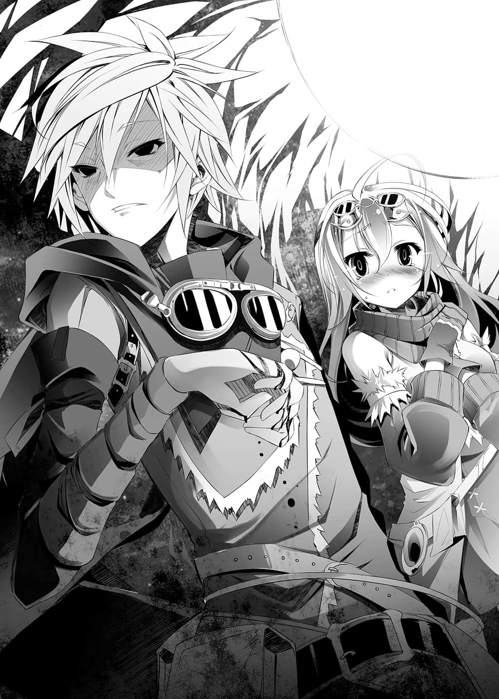

# 第一章 3－1=无望

> 来源：https://www.linovelib.com/novel/9/2083.html

——『太阳』这种东西，以前似乎是存在的。

传说是这么讲的——白色的火焰发出闪耀的光芒，天空则是清澄无比的蔚蓝。

据说诸神与其创造物所掀起的『大战』，使得大地化为焦土，灰烬遮蔽了苍穹。

灰烬冲击到天上流动的星辰之力——精灵回廊，发出了光芒，将天空染成红色。

而那样的红色，覆盖了仍然持续着互相残杀的每一块土地。

或者那是这个星球本身发出的悲鸣与流出的鲜血吧……

血色的天空上，只有——蓝色的灰飘然落下。

————…………

伊旺皱起眉头，仰望混浊的红色天空。

而在那段期间，发出蓝光的『黑灰』也如雪一般降落在荒野之上。

伊旺不经意地想起，以人类之身所能获得的知识。

据说那个蓝光是人类本来无法看见的精灵光辉。天空之所以看起来像染成了红色，是因为偏光还是什么的关系，原本精灵应该是苍白色云云……

至于没有精灵回廊连接神经的人类，为什么也能看见呢……听说那是因为与灰烬碰撞后毁坏的精灵，在死前所发出的最后光辉。

——『灵骸』。那对包含人类在内的绝大多数生物来说，是致死的剧毒。

裸露的躯体一旦触碰到，皮肤会被烧焦。入眼便会失明。误食的话会造成内脏溶化。

明明闪耀着蓝色光辉，却被称为『黑灰』，因为那东西就等于『死亡』。

（或许这东西其实是一种慈悲也说不定……）

头部罩着防尘面具，毛皮铠甲抵抗猛烈的寒流保护身体。只要把这些装备全部脱下，随处找个地方躺下——弥漫『黑灰死』的大地与风会让人得到睡着般的解脱感。

——真想休息。从早上一直工作到现在，手脚早就没感觉了，真想喝碗温暖的浓汤驱走这些灰，枕在老婆的胸口打盹——如果那样的愿望不能实现，那还不如……

面对如此的诱惑，伊旺身子一震，随即斩断那样的思绪。

或者是与战争无关的其他种族在附近徘徊。

见到里克缓慢地抬起头，亚雷又继续说道：

地精种只要手拿触媒说一句话——仅仅那样就能令数百名人类化为尘埃。

里克语气平静地说道。

不过亚雷将它拿在手上，用力扭转一下，盒子顿时发出七彩光芒。

没错，笑不出来。里克不带笑容地说道：

「这样总比被感应到精灵反应的怪物将聚落变成坑洞划得来。」

下一个瞬间，伊旺立刻如此告诫自己。

而且——也是为了来到这里。

四肢失去了知觉、挨饿不吃饭——这一切都是为了不被『敌人』发现，为了生存。

「这是——！」

「不行，『黑灰』太多，灵针盘只是受到『黑灰』精灵反应的影响在转而已。」

「——哈、哈哈！」

「……你想死就直说——我会成全你。」

那就是他们所要面对的对手，那就是他们为了生存而躲避的敌人。

——那就是现实，只能让人感到无言的，蛮横无理的现实。

---

■ ■ ■

灵针盘——那是由能够感应大型精灵反应的『辉石』，与普通的黑曜石接合而成的道具。

亚雷给两人看的是一个乍看之下像是小盒子的东西。

「亚雷，里克说的话——你该不会忘记我们的立场了吧？」

这时，从地面隐约传来沉重的震动。

「你记得嘛。复写地图太费工夫——这种死亡理由很没意义吧？」

「——知、知道了啦——我知道了，是我错了……！」

「伊旺、亚雷，你们分别将左半边和右半边的部分，与现存地图做比较和修正，我来复写战略与势力分布图。」

敛去表情，映不出光芒的眼眸中——带着黑色的杀意，里克低沉地说道。

「……不只是地图。」

伊旺与另一位同伴——亚雷无言地点头答应，然后潜入残骸内部。

然而亚雷似乎忽然想到一个点子而开口。

但是却也与『安全』相去甚远，因为或许会有自战场脱离的怪物出现。

里克的声音有如刀刃一般尖锐，喊了亚雷的名字。

「——『我们既不存在，也不能存在，因为不存在才不会被发觉』……」

亚雷苦笑着说道——伊旺则像是开玩笑似地，回答比自己年轻一辈的青年：

「……」

听到从背后响起的巨大欢呼声，伊旺抱着头，转过身来。

它可以感应诸神及其眷属——简单说就是那些『怪物』体内蕴含的庞大精灵量，指引出他们所在方向——那是里克与他姐姐所制造的道具，但却无法使用了。

「不会吧——是世界地图吗！？」

那是由数个方块复杂地组合在一起，就像是拼图一样的东西。

「这也是战略图和现在的势力分布图——虽然使用了暗号，不过地精语我也看得懂，难不倒我。」

「……亚雷，我只是休息了一下啦。毕竟我也老了啊。」

挥去累积的灰尘，暂且先坐下来，为自己能活着来到这里的幸运而窃喜——

——世界地图。虽然至今人类种们靠着收集来的资料和自己的测量，做出了某种程度的地图，但是此时射向空中的光所描绘出的线条——极为精密地区分出这世界的陆地与海洋。

只见在稍远的地方，亚雷正激动地露出兴奋的眼神，对着他大大地挥动右手。

「……抱歉。」

「亚雷。」

「——喂，伊旺，大丰收喔！！」

出生在这样的世界，怎能既没有活着的理由，也没有死去的理由就——

三个人中最年轻的『少年』——他的脸部被面具和护目镜遮住，看不出任何表情。

那是将与死去的人们缔结的誓言，特地公开宣誓——以表示答应。

——他们披着野兽的生皮，顺着岩石的阴暗处，四肢着地爬行而来。

话一说完，伊旺望向在前头的里克——『他们的领袖』。

（就算对方处于濒死状态，我们的性命也会马上结束吧。）

「那样比较正确吧？这样的大小不至于不便携带，也不必浪费纸张和时间——」

数周前，在这个区域发生了名为『小冲突』的天地异变，而那就是那场天地异变所留下的痕迹。

「可、可是你也不必那么生气吧……」

因此——

「快点过来，这家伙可不得了啊！」

听到同伴的低声呼唤，伊旺回过神来，眨了几下眼睛，望向身旁的两名同伴。

「如果你算老，那我们也差不多了吧？」

那个残骸的装甲上有个似乎能够进入的裂缝，他们躲进裂缝的阴影里。伊旺向里克问道：

因为已经远离战线，而他们所在之处是遭废弃的垃圾堆。

也就是说，只要掌握这个情报——很有可能就可以『推算出现在的战况』。

「……灵针盘反应如何？」

得到这无可挑剔的大收获，里克以冷静沉着的语气说道：

看到投影在虚空中的大型图画，就连伊旺也难掩惊喜地发出声音。

「但是，如果只是这种程度的话……」

时间紧迫，不过他们正确地测量、抄录地图。

也难怪亚雷会那么兴奋了——伊旺想到这里不禁面露笑容。

伊旺冷眼注视了亚雷一会儿，然后朝旁边的里克看去。

只见里克不发一语，缓缓举起一只手——比了一个割喉的动作。

他们平心静气，成为一粒微不足道的灰尘，甚至压抑呼吸和心跳声——即使如此，五感仍保持敏锐，就算是一粒灰尘也不放过，然后才开始调查这艘船。

「感谢你的忠告，那么——如果已经『休息』够了的话……就该走啰。」

那是地精种们所制造，能在天空航行的钢铁船——空中战舰的残骸。

「你心里要有所准备喔！有一天你的身体会突然无法像以前那样逞强——里克，你也一样。」

因为战争的关系，这个世界的地形无时无刻不在改变，这个东西确实很宝贵——

「——！」

三人从背包内取出纸、墨水和计测道具，开始作业。

听到这道命令，伊旺和亚雷难掩兴奋，齐声回答道。

「不行，倚靠精灵运作的东西，我们不能带回去。快点抄吧。」

这么一来，他们只能依靠自己的五感来搜索敌人。

「「向遗志宣誓！」」

隔着护目镜……只看得到有如黑暗一般，映不出任何倒影的眼眸。

里克一行人的目的，是从那里搜出能够使用的『资源』。

仅仅那样，原本兴奋不已的亚雷立刻肩头一颤，发出一声小小的呻吟。

一如所料，那里有一个巨大的陨石坑……以及坠落在中心的钢铁堆。

「——伊旺，你是被黑灰侵入脑部了吗？」

「对，而且这个可是最新版喔！」

被里克的怒容一吓，亚雷摇了摇头。

——相对来说这个地方危险性较低。

只要能推测出今后会发生纷争的地点，那就能估算出危险性相对较少的候补居住地点……！

「我说里克，不能把这个地图投影装置带回去吗？」

「抱……抱歉，总、总之你们过来看看这个。」

又或者，万一搭乘这艘战舰的地精种还活着——

伊旺点头答应，不发一语往山丘下看去。

「……我们要谨慎小心地前进喔。」

要对付拥有人类望尘莫及的超级感官能力的怪物们——这实在让人笑不出来。

亚雷小声地道歉。

伊旺内心咋舌一声。原来如此，也就是少了一道生命保障啊。

（……集中精神！）

伊旺插嘴说道，语气就像在劝导他，但是脸上的表情却是严肃的。而亚雷闻言紧张地咽下一口唾液。

那一瞬间，三人好像约好了一般，同时压低姿势，冲入阴暗处藏身。

---

■ ■ ■

——伊旺想要勉强压抑加快的心跳。

伊旺屏气凝神，缩着身子，望向同样隐藏身形的里克。

只见里克脱下手套，取出刀子，毫不犹豫地将食指指尖处削薄。

（……他还是一样呢……）

将露出的神经按压在地面，用指尖收集从地板传来的情报，另一只手则贴在耳后，凝神倾听。

不用考虑以目视确认的方法，因为探出头看根本是自杀的行为。

但是趴伏在地耳贴地面也不予考虑，因为要听地面以外的声音也要用到耳朵。

里克就是用那样再合理不过的手段，分析『敌人』无意间泄漏的情报。

即使只是震动和声音，视其程度和节奏也能推测出相当具体的资讯。

伊旺舔了一下防尘面具内侧的嘴唇，注视里克的手势。

（——……距离约五十公尺，两足步行，一只，笨重、迟缓——喂，骗人的吧？）

从里克的手势所表示出的步幅推测，『敌人』的身高有——『六公尺』。

拥有人类三倍以上的巨大身躯，动作迟缓——那也就代表，对方在寻找着什么……？

伊旺的背上冷汗直流。

随后，震耳欲聋的咆哮响彻四周。

（——可恶！是妖魔种！！）

不必等待里克的手势，伊旺已经确定。

那是由幻想种的突然变异体——『魔王』所创造出的魔物。

基本上是智能低下的怪物，可以说是多了半吊子智慧的野兽。

亚雷以颤抖的声音，对着伊旺的背影说道。

然后将颚下的束带放松，缓缓脱下防尘面具。

「——哈哈！」

「向遗志宣誓，交给我吧。」

「伊旺……！？」

因为他讨厌那样。唯独那样的结束方式，他绝不接受。

他也想设法逃过劫难，和老婆女儿一起感受过朴实的幸福之后再死。

因此这时只能采取一个行动。

在怪物的身后，可以看到与伊旺朝相反方向拼命奔逃的里克他们。

冰冷的外部空气轻抚肌肤，不可思议地纾缓了紧张。

「对不起。」

凭身上携带的武器——不，即使再怎么用心准备，也不存在任何人类能够杀死的妖魔种。

里克所思考的是要在哪里牺牲谁……应该只是如此而已。

「别介意，『为了守护同伴和家人』——做为死亡的理由，没有比这个更好的吧？」

他毫不移开视线，注视着伊旺，点头回答：

伊旺这么说着，将面具交给肩头颤抖的亚雷。

伊旺只是——不断重复这句话。

它们之所以不采取警戒和潜伏等野兽的本能行动，是因为没有那个必要。

——在这个残破疯狂的悲惨世界上，毫无意义地出生，恐惧颤抖地活着，找到微小的幸福后又被夺走，再遭到杀害。

缓缓回过头，看向这里的里克——接下来将会说出什么话。

「我们不能失去里克；亚雷，你也还年轻；这样该割舍谁就很明白了。」

既然要做，当然要交出最好的成绩对吧？毕竟……这是人生最后的一项工作。

正因如此，伊旺才忍不住向他道歉，因为是他让里克给予自己死亡的理由……

看着用颤抖的双手接过行李的亚雷，伊旺笑着安抚他：

都到了这个地步，自己仍不愿选择那样的幸福，伊旺打从心底对自己的想法感到肤浅。

「啊啊，我们真是过分啊……不过一切就拜托你了——可恶啊。」

看到那样的怪物目不斜视地袭击而来——伊旺不禁嘲笑它。

伊旺相信他比任何人都能——善加利用自己这条命，但是……

没错——一个人当诱饵，剩下的两个人则趁隙逃走，只有这个办法了。

但是伊旺却是背对着他，好似在掩饰难为情般，挥了挥手。

「亚雷，里克就拜托你了，你要连我的份一起努力……那么我先走一步了。」

里克一动也不动。

他将背上的行李交给亚雷，理所当然地走上前。

——和只剩下数分钟，视情况可能只剩数秒钟就能解脱的自己不同。

「我说伊旺，你……」

诱饵的战术成功，剩下就是尽可能拖久一点，绊住这只怪物。

没错——绝不可能办到。

在那样的极近距离遭遇妖魔种的话——打一开始就别无选择。

「——我命令你死在这里。」

「……可恶，混帐——混帐！」

他绝不要像那样既没有任何理由，也没有任何意义地死去。

「对不起，里克——老是把沉重的责任推给你。」

「那我走了，里克。我的家人——我的孩子就拜托你了。」

它们拥有可怕的力量，却让伊旺他们这样的『猎物』发现它的存在——正因为它们拥有半吊子的理性，所以也失去了潜行接近猎物的本能，更别说此刻会在这种场所走动的妖魔种，更是在妖魔种中最下等的种类。

「我很清楚那是多么沉重的责任——可是里克，除了你之外，我想不到有任何人可以依靠了。」

逃走——除此之外不必考虑其他选项。

——人类将会毫无反抗之力地惨遭灭绝。

就连注视着伊旺的时候，他的眼中——依然没有映出任何感情。

「啊啊、啊啊啊啊……！！」

（而且那样做也没有意义。）

因此——伊旺已经猜到了。

即使覆盖着黑色的兽毛，也看得出粗壮的肌肉。裂开至脸部一半的血盆大口中，排列着参差不齐的尖牙。

伊旺拍了拍有长久交情的友人肩膀，然后回过头，里克正沉默地看着他——伊旺注视护目镜下的黑色眼眸说道：

「好，交给我吧。」

（——不可能，这是再清楚不过的事。）

即便对方是多么低阶的妖魔种——人类只要被它们一碰就会变成肉块。

听到野兽的咆哮，伊旺保持速度，稍微回头一看。

---

■ ■ ■

伊旺当然不想死，因为在聚落还有可爱的老婆和引以为傲的女儿在等自己回去。

听到忽然脱口而出的这句话，里克讶异地问道：

里克告诉他。

不论是恐惧、踌躇、动摇，甚至连悲伤、痛苦的感情都没有。

伊旺与里克他们同时从隐蔽处冲出——却是往相反方向奔逃。

为了这个年纪比自己小的少年的命令，自己甚至能够舍命。

察觉到他存在的『敌人』，正冲散钢铁的残骸朝他而来。

自己大声奔跑吸引了怪物的注意力，使得它完全没有发现里克他们的行踪——

…………

「……为什么是你道歉？」

「可是——就算是那样……！」

因为那样而被高智能的『上位』妖魔种发觉，而认定人类对他们是『威胁』的话会如何？

因为有着那样一对昏暗眼神的人，在必要时，他大概连自己的性命都会不惜利用到残破不堪吧。

因为它们笨拙的知性很清楚地理解，自己是强者，靠自己的力量就能解决一切事情。

——『敌人』很巨大，正如里克的推测，那是足足有人类三倍以上的巨大身躯。

活在那种循环不已的世界，到底有何意义呢？

那个亲如弟弟的里克，今后将会面对无数更加艰辛、险恶、困难的问题。

只需在还活着的时候一个劲地往前奔跑即可——这是很简单的工作。

正因为如此——伊旺才能相信他。

「喂、喂……」

——没错，自己的职责到此结束了。

就算驱使智慧、战略和陷阱，成功讨伐一只妖魔种——那又有何意义？

「伊旺，这是命令。」

与被埋没在这片蓝色灰烬中，有如安眠一般地死去……又有多大的差别呢？

人类不被容许抵抗，只能是被猎杀的『猎物』。

很可能是食人魔或巨怪一类——那么伊旺他们人类的力量能够与之战斗吗？

里克他们压低姿势，小跑步奔离。伊旺则与他们不同，刻意发出响亮的声音全力冲刺。

可是那样的死法——

伊旺露出微笑。

伊旺感到好笑，于是放声大叫。他回头看向前方，加快速度往前跑。

——脑海闪过里克那如同黑暗一般的黑色眼眸。

「对不起。」

迎面吹来的风，带走了闷热的汗水和野兽生皮的气味，令人感到舒畅。

……『我们既不存在，也不能存在，因为不存在才不会被发觉』……

五十公尺——那样的距离人类八秒左右就能跑完。

「你也很清楚吧，亚雷。这时非得有一个人死不可。」

「对不起，对不起！但是拜托你原谅我——」

伊旺带着苦笑——毫不犹豫地答应。

如果三个人一起逃，最好的情况是被发现后全灭，最坏的情况则是被追踪至聚落——『敌人』有那种程度的智慧。

伊旺觉得自己很肤浅。

——回答了这个疑问的人就是那名少年，里克。

为了守护同伴、家人而活下去——为了迎接终战的某人而死。

太棒了，这个答案太完美了。自己的人生是有意义的，没有比这更有力的证据了。

那样的死法酷毙了吧？没错——试着大声喊出来吧。

「——我是为了守护同伴和家人而死啊啊啊啊——！！」

看吧——这理由不必对任何人、在任何地点、因任何事感到羞耻吧！？

空气中飘散着腐臭的气味，伊旺明白人类所无法抗衡的死亡即将逼近。

「哈哈！里克啊！这样的时代总有一天会结束吧——！」

没有人回答，不过他也不求回答。

——因为『总有一天』这种话，对伊旺来说太陌生了。

想要怀抱希望，这个世界却太过残酷。

想要沉浸在绝望之中，这个世界却太过严苛。

不管是过去还是未来，都与现在的人类无关，因为那些是人类无法触及之物。

人类所被允许的，只有在现在，在这一瞬间，拼了命地繁衍下去而已。

就算在一秒钟后，自己就会因为某个不知名物种的一时兴起而被消灭。

「啊啊啊……」

人类也只能像这样，拼命地不停奔跑而已。

「啊——啊啊啊啊啊啊啊啊啊——！」

只能一个劲地勇往直前。

发出叫声，告知对方自己在这里。

如果不那么想，如果不那样相信——现在他就会被这份沉重给压垮。

里克取下其中一盏油灯，从怀中拿出打火匣点火。

他们所前往的『聚落』，要在蓝灰飞降的荒野中不断前进，进入被雪封闭的森林更深处。

脑海中忽地闪过不知是谁说过的话——「没有不破晓的夜晚」。

被他这么一问，里克只是无言地仰望飘舞着蓝灰的红色天空。

---

■ ■ ■

那个场所如今是——容纳将近两千人的秘密基地。

一如往常，里克以平淡的口吻说道：

以在外面只要遭遇『敌人』就会没命的人类而言，这里还算得上是安全的生活据点。

不过，只要往内部前进，就会看到腐朽泰半的柱子，有数个老旧的油灯吊挂在那里。

「太久了～～～～！你这个弟弟，到底要让我多担心才甘愿啊！」

他们没有选择其他手段的余裕，而彻底执行那样规则的人——就是里克自己。

他们靠着洞窟深处涌出的泉水，确保了饮水资源，在能看得到天空的地方也饲养了家畜。

为了确认，里克触摸胸口。

里克靠近门边，用力地以一定的节拍敲门——然后等待。

亚雷沉重地开口说着，走上前来，却被里克用手制止。

「叫我姐姐。到底要我说几次啊，你这个家伙——」

靠着那昏暗的橘色亮光，两人向在洞窟深处所挖掘的隧道前进。

里克冷淡地这么说完，将背负的行李放在地面。

…………

克珑表情扭曲，就在这时候——从广场边传来一道声音：

判断没有追兵之后，两人开始行走。

在她发问之前，亚雷就已先回答她。

里克没有回答。

只见一名少女从人群中飞奔而来。

而同样想要挡在里克与侬娜之间的克珑，也被里克瞪了一眼。

——尽管那只是人类一厢情愿的想法。

她开朗的表情里隐约露出不安的神情。

在广场从事作业的居民们发现了他，视线纷纷向他聚拢了过来。

虽然身材娇小纤细，但明亮的秀发和蓝色的眼眸，即使是在这个洞窟里，也闪耀出生命的光辉。

「爸爸呢！？」

他所留下的事物，他所托付的事物，以及必须传递给下一代的事物——

……那就是这个时代——『大战』。

「……」

「……侬娜。」

但是里克的眼神仍是一片昏暗——映不出任何感情——有如亡灵一般——

不惜牺牲某个人，也要拯救留在聚落的全员，永远以这样的结果为优先。

这是一趟往返四天的路程。

---

■ ■ ■

通过门扉之后，洞窟里是一片开阔宽敞的空间。

「啊啊——————啊！」

「……我说里克啊，这样的时代总有一天……总有一天会结束吧……」

「里克……喂，里克！」

终于随着嘎嘎声响，门缓缓从内侧开启，披着毛皮披风的少年探出头来。

————没问题，上好锁了。

克珑毫不客气地拍着里克沾满尘埃的头，对他这么说道。

当然，如果入侵者是『其他种族』的话，这种东西有或没有根本没有差别——

如果倒在半途，也要将身上背负的责任托付给其他人。

因此即使称不上最佳，也必须持续采取效率最高的方法。

「伊旺他——你爸爸不会回来了。」

为此要牺牲一人以救两人，为了多数人而割舍掉少数人。

不能顾及个人的感情，个人是为了全体，全体更必须为了全体而行动。

从外面观之，那和一般的野兽巢穴没什么两样。

「爸爸！」

里克感觉胃就像在往下掉落一般。

侬娜拉着里克的衣服再次问道。

就这样，他们留意着预防野兽的陷阱，更加深入之后，随即见到由许多根坚固的原木所排列建造的外墙。这是为了阻挡越过陷阱，误闯进来的野狼或熊所建造的门。

少女奔至里克面前，第一句话就大喊：

人类只能那样做——

然后又有一道叫声消失了。

对于他的一切。

那对水亮的蓝色眼眸与她父亲非常相似——她是伊旺的女儿。

「……伊旺先生呢？」

自己已经在用过去式说明了。

「克珑，我不在的这段期间，有发生什么事吗？」

两个出入口之中，另一个出入口通往海岸的海湾处，可以取得盐和鱼类。

看到那名少女，亚雷短短地抽了一口气。

克珑接过里克的斗篷和诸多装备，同时对站在里克身后的亚雷说道，然后她发现缺少一个应该也要在场的人——

「欢迎回来，你们辛苦了。」

里克与亚雷只是点头回应，然后通过门扉。

里克默默地摇了摇头。

眺望带着朦胧蓝光的小碎片从空中飘落，静静地在地上逐渐累积——

全身沾满泥土与灰尘，抹杀微小的幸福，抛下同伴的尸体而去——直到有一天终战到来。

少女气喘吁吁地跑了过来，她一看到里克，脸上立刻绽放笑容大声喊道：

人类脆弱且无力，因此不能以「个人」为主，必须以「种族」做为考量基准。

里克登上由木材搭成的楼梯，踏入聚落之中。

当他毫不回头，全力逃入比较安全的森林中时，忽地——

「亚雷你也是，辛苦你了！」

「嗯，没事的，至少没发生严重到必须报告的事——话说你快点把那件肮脏的斗篷和生皮脱下，我要拿去洗了啦！」

里克回头一看，有个年幼的少女跌跌撞撞似地奔了过来。

「到时会有人继承我的。」

被称为克珑的少女撅起嘴，一边纠正他，一边用力点头。

靠着彻底的算计与合理性，人类才得以存活——不，得以逃避至今。

他逐渐无法清楚勾勒出记忆中那个男人的脸。令人难以忍受的丧失感，与对莫名原因产生的激烈厌恶感同时涌现。伊旺——生前是个比自己年长一辈的男人，勇敢、深思熟虑、热心助人。里克这一辈的人，没有一个人不曾受过他的帮助。即使如此，在他爱上他的老婆，与她结婚之前，仍是个相当内向怕羞的人——

守门人倒抽了一口气，随即像是忍耐某种情绪般，对着里克再次说道：

「…………！」

「啊啊啊啊啊啊啊啊啊啊啊啊啊啊啊啊啊啊啊啊啊啊啊啊啊啊啊啊！！」

这层厚实的岩壁也能在最低限度——承受因其他种族争斗所飞来的流弹。

「里克，爸爸在哪里？」

「是啊，会结束的。」

「我已经尽快赶回来了。」

「……如果你想问伊旺的话，他死了。」

「……辛苦了。」

位于锐利突起的岩山山麓下，某个隐蔽的洞窟里。

事到如今，他既不后悔，也不反省，但是——

前往聚落的脚步之所以沉重，并不完全是因为落在地上堆积起来的灰尘。

听到里克只是平淡地这么回答，亚雷默然不语。

眼角仍有泪迹的亚雷，粗暴地抓住里克的肩膀。

「你别那样把所有事情都往自己身上揽——会被压垮的！」

两人不知道。那和伊旺在最后的呐喊，是相同的疑问。

「你听我说，侬娜……」

————

少女睁大了双眼，好似无法理解他说的话。

但是见到里克在说完这句话之后就一句话也不说，少女脚步踉跄地离开里克。

她的眼角瞬间泛起斗大的泪珠，小小的双唇不住颤抖。

「——为什么——？」

「…………」

「爸爸说过他一定会回来，要我当个乖孩子等他回来喔！我有乖乖的——我明明遵守了约定——为什么爸爸不回来呢！？」

「……因为他死了。」

「骗子！！」

洞窟内响起侬娜的尖叫声。

「爸爸跟我约好了……说他一定会回来呀！」

是什么时候开始的呢？里克不经意地这么想到。

——即使听到这么悲痛的声音，我的心也无动于衷。

「伊旺他也想要遵守约定，可是我们遭遇妖魔种，他为了当诱饵而留下。」

「我才不管！为什么爸爸没回来呢！？」

——侬娜是正确的。里克心里这么想到。

不管是为了保护谁，为何而死，那种理由根本与她无关。

因为最喜欢的爸爸没有回来——这个事实是不会改变的。

「爸爸明明说过人类会胜利！」

「当然会胜利，伊旺就是为此而全力奋战着。他保护了我们——就是为了要让大家获胜。」

里克则是叹了一口气，但也不违抗她，开始走起路来。

「哼哼，对我来说只是小事一桩啦！」

「喂，里克！那个破铜烂铁终于动了喔！」

「我擦擦身体就好——别浪费燃料。」

亚雷发出欢呼，里克则眉头一皱，声音低沉地说道：

「——是啊，没错。」

里克当然知道答案。他记得全员的长相，也叫得出他们的名字。

但是——那只是自我安慰而已。即使再怎么谨慎行事，只要他们想找，人类种很快就会被发现。

里克惊讶地圆睁着双眼，克珑则是炫耀似地挺起胸膛回应：

「是啊，只有我的一个失误。」

对不起——这句话反射性地就要脱口而出，但里克又把话吞了回去。

——骗人。

这时只要再加上今天带回的情报，他们的地图可信度将会大增。

那是在一年前——从类似地精种战车残骸的物体中所带回的超长距离望远镜。

最初从附近的地区开始，再来是大略的世界地图。

「——！真的吗！？那不是很不得了的收获吗！」

「是克珑研究出原理的啦……但还是老样子，完全不知道是怎么制造的。」

「可……可是相对的，应该也有什么收获吧？」

但赛蒙以开朗的语气说道：

房间中央有一张吃饭用的小桌子。里侧是制图桌，旁边有张简陋的床。

「——欢迎回来，你没事真是太好了……」

——里克进入自己狭小的房间，将门关上。

————喀锵一声——解开了『锁』。

两人离开工作间，在前往自己房间所在区域的途中，里克向克珑问道：

反覆更新危险区域、有望取得的资源情报，直到最近地图终于开始发挥功能。

——就像过去自己『出生的故乡』和『成长的故乡』，都是落得这样的下场。

能够推断出资源、据点的场所，就不会再不知情地误闯其他种族的战线。

「这样要察觉敌人的攻击也就轻松多了。只要能事前知道危险，也就来得及逃走了吧♪用途我们可以慢慢再考虑！好了，我们走吧！」

「派去进行其他调查的人呢？」

没有别人。这个房间离其他房间稍远，门板也很厚。

然后克珑像是刻意转移话题般，开口说道：

尖锐的呼唤和从身后伸出的手，阻止了少女接下来要说的话。

『一如往常的确认』结束之后，里克深吸一口气，触摸胸口——

他以拳头捶打用餐的桌子，痛骂自己。

她说了——『骗子』。

玛露妲——侬娜的母亲用沙哑的声音叫了里克的名字。

他横越广场，在内侧通路前进，随即一名年长的男性发现里克后叫道：

「不过只要有了这东西，派人出去侦查的必要性也就减少了——他们在天之灵应该会感到欣慰的吧！」

「那才不是胜利！如果是那样的胜利————」

「好了好了好了！那我去烧洗澡水，你们快点去洗澡！！」

他们既不埋怨，也不泣诉，甚至没有那样的念头，始终相信着这样的自己。

回收当时，它还是个从中折断，有如破铜烂铁一般的东西——这时里克问道：

——但是，为了这个地图，到底死了多少人？

听到那句话，克珑露出略微复杂的表情。

那是将洞穴的横洞挖宽所建造的工作间——里克看向安置在房间中央的圆筒。

是从什么时候开始的呢？里克不经意地这么想到。

她体恤般地遮住女儿的嘴，看着里克的脸。

真要说的话，连他们在何时、何地、为何而死，里克都记得一清二楚。

「里克……」

骨瘦如柴的年轻女人——侬娜的母亲，伊旺的妻子不知不觉间也来到了这里。

「你说动了……该不会是指那个望远镜吧？」

里克将油灯摆在制图桌上，打开行李，将得到的各项物品排列在桌上。

她微微点头作为招呼后，便抱着失去父亲的女儿，回到聚落之内。

是啊，那些当然很重要！是重大的收获，它们的有无甚至能够左右聚落的命运。

在赛蒙的引导下，里克登上楼梯。

「他们都平安归来了。去得最远的是里克你们，这次的结果接近完美喔♪」

侬娜那张小小的脸蛋因哭泣而扭曲。

「——侬娜！」

「……伊旺是个了不起的人。」

「——什么叫——没有白费啊——！你这个该死的伪善者！！」

「——这样啊。为了这东西死了两个人，必须有效利用才行。」

——没错，他是个好男人，而那个男人选择的妻子也是个好女人。

「坠落的地精种空中战舰里——发现了可能是最新的世界地图。」

里克知道克珑为了让这个望远镜还原，耗费了多少心力。

没有缺漏，没有污损——也就是说，伊旺的死并没有白费。

克珑捏着鼻子，转身离去，而里克则是叹息以对。

「没有使用精灵吧？」

「对，你放心，这就像是里克制造的望远镜的超改良版。简单说就是将圆盘镜片经过多重复杂组合而成，调整镜片的比率可是让我花了不少工夫喔！」

回收这东西的时候，克珑也在场。

「姐、姐、我！叫你去洗澡喔！老实说你们很臭呀！」

——没事的，没问题。

……里克深深吐了一口气，然后观望四周。

——『那还不如死的是里克』——阻止了这句话。

克珑似乎很了解里克的想法，她语气开朗地说道：

「……谢谢你，里克。」

「……嗯，但是你一定要去洗澡喔！因为真的很臭！」

「另外还有各阵营的势力分布图，以及用地精语书写的战略图，不过内容掺杂着暗号就是了。我要开始进行解读和精密检查——暂时让我一人独处吧。」

他将其中最有价值的三张——三人齐力描绘的地图重迭，用油灯照亮。

「里克！」

克珑激动地大声说道，而里克则对她点了点头。

看到她的眼中既没有怨恨也没有憎恶，里克不自觉地——再度触摸自己的胸口。

看不见她的身影之后，克珑有如祈祷般说道：

克珑看出这是超长距离望远镜，提议把它带回来，而里克也同意了。

玛露妲流着泪这么说道。

——自己变得能够若无其事地说出这种言不由衷的话。

不，即使是现在这个瞬间，单纯只是因为流弹飞来就使整座岩山粉碎，也是十分可能发生的事。

最新的世界地图、各阵营的势力分布图、地精种的战略图。

---

■ ■ ■

克珑像是在意气味传到身上似地，确认着自己衣服的气味说道。

里克说得面不改色，却也不是自嘲，而克珑则是语带犹豫地说道：

那原本就是挖掘洞窟而成的狭小房间，由于堆积了无数书籍和道具，而显得更为狭窄。

然后——在回程时遭遇兽人种，为了逃过危机而导致两人牺牲。

「啊～赛蒙，你真是多嘴！！别说出来啦！人家本来打算给里克一个惊喜的说！」

「——伊旺为了让我们逃走而担任诱饵。如果不那样做，我们已经全灭了。而且他相信顺利把这次的『收获』带回，就可以守护你和侬娜。」

「…………是啊……我回来了。」

突然，克珑用粗鲁的动作拥抱里克的身体，令他不自觉地失去平衡。

而那两人的女儿看穿了真相，是个聪明的女孩子。

因为她看着里克，清楚地说出了他的真面目——

「洗澡！」

再说他们本来就是为了制作地图而花费长达五年以上的时间，反覆进行有如走钢索的『调查』。

四十七人——不，又多了一个人，所以是四十八人。

——他们全都被里克命令『去死』。

其实并不全由里克直接告知，也有人是间接被转告。

但不管说的人是谁，命令背后都是里克的意志。

——一人要为全员牺牲，牺牲一人以救两人。

——如果会危及到别人，在那之前就要舍弃自己的性命。

定下那种规则。

在这个绝望的状况下，对众人揭示了挣扎到底的方法的——

不是别人，就是里克自己——但是——

「——继续这种事情……又能怎样呢……？」

为了两人而杀一人。

为了四人而杀两人。

那种事情不断累积至今，结果是四十八人。

付出那样的牺牲之后，如今聚落存活下来的人口有——将近两千人。

——来啊，里克，你回答啊。这个做法要持续到什么时候呢？

总有那么一天吧——你要持续到『为了一千零一人而杀九九九人』的那一天吗？

还是说——直到剩下『最后一人』为止呢？

「……哈——哈、哈哈哈哈哈哈————！」

到了这种惨状，怎么还有脸对失去父亲的少女说『人类会胜利』！

骗大家这是没有办法的事，是必要的牺牲，欺骗他们取得认同之后，拖着他们到处流亡！

你不哭吗？——是啊，如果哭泣能够改变什么的话。

就连克珑都能确信，他们真的会堕落为无意义且无价值的生物。

到底要堕落到什么地步才甘心——！你这混帐————

「使用一切手段，逃避躲藏，苟延残喘——直到有一天将会有人看到终战为止。」

四十八名死者——全部都是在『远征』时丧命。

——十三岁的小孩。

只是单纯卷入流弹或余波，那就代表着聚落、都市、文明的灭亡。

「呼……呼、呼……」

克珑背靠着墙，低着头，她全都听见了。

更别说是村里如果被其他种族发现的话，那就会有多达数百、数千名的人类轻易死亡。

「…………」

身为心灰意冷的两千人集团的领导者，必要时得选择最佳选项的指导者。

如果是增加至两千人的聚落，一般光是为了解决粮食问题而『割舍』，每年的死者就是那个数字的倍数了。

克珑认为那样的人数——少得难以置信。

故乡两度遭到不合理的毁灭，他的话语在洞窟内沉重地回响。

……永无休止。

——因为『心』不认同没有意义就死去。

——在门外。

却不忘给人带来希望，拥有钢铁心肠的『大人』——『里克』完成了。

「没错，我们不存在——不是等于，而是我们要『那么做』。」

当人们悲叹不已的时候，那时十三岁的孩子却无视他们，放眼向洞窟看去，说出一句话：

在那样的世界，却能够保持精神正常的这个事实——还能称得上是正常的吗？

既然什么也做不到，至少为了后起之人的可能性而努力吧。

然后——看到眼前的惨状，沾满鲜血的桌子破碎四散，他不禁叹了口气。

只要走出聚落一步，那就等于死神的镰刀已经架在脖子上。

里克闭上双眼，手按着胸口——想像那种影像。

能像那样让心变得像钢铁一样的男人——在这种世界里，只有里克一个人。

---

■ ■ ■

年仅十八岁的少年——这是本来还算是孩子的年龄。但是聚落里两千人的命运和选择，却全部托付在他身上，这个现状——不管怎么想都不对。

——所以大家相信里克。

捡到里克，原本是克珑故乡的聚落，因为天翼种和龙精种的交战而消失。

——因为若没有死亡的理由就不能死。

时代停滞，而更加凶猛的暴力，则是让染满『黑灰死』的天地化为焦土——人类是无力的存在。

他并不感到痛楚——仿佛感觉也和冰冷的心一起冻结了。

就连野生动物，一旦不小心遭遇，等待着的就是死亡。

若是失去他——那么面对迟早来临的死亡，他们就会变成只能恐惧颤抖的『猎物』。

恢复一如往常，符合众人所需，如同伪装一般，精于算计又冷酷的模样。

——对于那些家伙而言，我们就等于不存在一样。

天空封闭，地面裂开，没有白天和夜晚，染成血色的世界。

然后就连自己也依靠那样的谎言，在心中上锁，想要说服自己。

敲碎木材的拳头上，只见尖锐的木片深深刺入，鲜血流了出来。

那么够了吧？——是啊，当然够了，混帐家伙。

打够了吗？——是啊，怎么可能够呢？

「这里的位置很便利呢，可以用来当下一个聚落。」

但是克珑什么也没说，只能像这样——在门外听着而已。

「我们既不存在，也不能存在，因为不存在才不会被发觉——我们要成为亡灵。」

——比起眼泪那种崇高的东西，沾满鲜血的双手还比较合适吧。

克珑认为如果真有地狱，那就是这里吧——但是，即使如此，人类仍然活着。

背负倒下之人的遗志，剩下之人的意志，却仍能勇往直前——

——『永远』持续的大战。

你难道不知耻吗？还是你把羞耻心给忘了？

…………

那是非常正确的论调，让人想不到是从绝望之中发出的哀叹，而少年则是眉毛动也不动一下地回答：

那个弟弟需要这个仪式，不然……他一定会崩毁的。

那是连历史都称不上的，一段口耳相传的悲惨事迹。

沉重的声音响起，扣上『锁』——这样就完成了。

他的眼神就像真正的亡灵，但是却给予失去生存意义的人们——生存的理由和死亡的意义。

诸神及其眷属——以至于『其他种族』，人类只要被目击到，就会即刻毁灭。

——五年前。

「向遗志宣誓，可以跟着我走的人——那就跟上吧。」

那并不是比喻。因为就连大战是何时开始的，都已经没有人知道了。

至今每当人类兴起能称得上是文明的时代，就会像杂草一样遭到消灭——

---

■ ■ ■

而那段口述历史，只是平淡地将『永远』这个事实教给后代。

这是整理心情的时间。为了让里克的心接受牺牲伊旺——杀死伊旺的事实，这是必要的仪式。

恢复冷静的思考——对自己的心问道：

既然什么也做不到，至少就继承倒下之人的遗志而努力吧。

……等回过神来才发现，桌子被打坏了。

永无休止、永无休止、永无休止、永无休止的——死亡与破坏的连续。

——所以大家都把性命寄托在他肩上。

——那又能怎样！

只听到怒吼声响起。

那是比洞窟的黑暗更深沉的黑色眼眸。

「……木材也不是便宜的资源啊……啊～可恶……该怎么办呢？」

在短短数小时前才刚被夺去一切的人们面前，他理所当然似地说出『下一个』。

涌上头脑的热血瞬间冷却下来。

——喀锵一声。

在这五年间的死亡人数是——四十八人。

对一个人渣、败类、骗子来说，那样还比较合适。

——真噁心。对自己所涌起的近乎疯狂的憎恶，烧灼着喉咙。

永无休止，永无休止。

里克年仅十三岁时，接受托付成为超过千人的聚落之长，至今已有五年。

——或者，他早就已经崩毁了也说不定……

大人们不是死亡，就是因绝望而崩溃，他们哭泣呜咽地抵达洞窟。

---

■ ■ ■

然后少年说明了那样的手段。

共通的历法已丧失，就连时间的流动也已失去意义。

然而——没有别人了。

自己没有流泪的权利，要流——还不如流血。

「……这下子要找借口也难了吧——不，等一下。把这些当成柴烧，那样既可湮灭证据，又能够填补资源，那不就是一石二鸟吗？用餐就坐在地上吃就好了——」

里克一边拔掉扎在手上的木片，一边发着牢骚。

维持了五年之久，却仅仅只有四十八人牺牲，这毫无疑问是里克的功劳。

里克封闭心灵，让头脑冷静，再缓缓睁开双眼。

……每次都是这样。她之所以会答应让里克一人独处，也是因为这个原因。

可是里克不明白。即使他明白，命令别人送死的责任也重重压在他身上。

但是——大家有时会忘记，然后每当想起又会感到自责，而向里克感谢或道歉。

玛露妲的道谢也一样——也就是说她也想起了那件事。

——想起死神的镰刀同样也架在里克的脖子上。

以及他的脖子——攸关他们两千人的性命这件事。

————…………

见到里克从房间出来，克珑极力装作没看到他拳头的伤，对他说道：

「里克好了不起……你很努力，姐姐可以保证喔……」

「——别安慰我了，我要去洗澡了。」

看到眼神依旧黯淡无光的里克——克珑忍不住拥抱他。

已经到了极限。在这样的世界里，要他一直扮演维持两千人精神正常的希望之火——那是不可能的。再这样下去弟弟他……里克他会崩毁的……！

「我说克珑啊——」

「……要叫我克洛妮呀……什么事？」

「这样的时代——什么时候才会结束呢？」

过去有人说过——『没有不会停的雨』、『没有不破晓的夜晚』。

但是有哪个人类最后会看到蓝色的灰尘停止降落呢？

会有人看到被烟尘封闭的天空另一端的太阳吗？

没错，总有一天会结束——应该不会是永远才对，可是……

由人类的主观看来，这场战争让人只能感到……将会永远持续下去。

---

■ ■ ■

「所以他们问道，要到什么时候——欸，啊哇哇哇哇！？怎、怎怎怎么了吗！？」

一边玩着游戏，一边以怀念的眼神说着故事的特图，这时发出慌张的悲鸣。

「就算把耳朵垂下也没用——机凯种对着里克射击的是『伪典・森空摄』，那是重现森精种魔法的武器——是可以发出无数的真空刀刃，将一切撕裂的武装！」

「——！！那种事伊纲才————……！」

如果在小孩的认知中感觉那是『理所当然』——那才是异常吧。

「……伊旺死掉了，得斯。」

「对、对对对不起！这故事太黑暗了是吗！！」

伊纲有生以来第一次……有想要揍人的冲动。

「你知道——机凯种吗♪」

「我听不见，听不见，得斯！！」

「对，他死了。人类种——如果不是有『十条盟约』，只要妖魔种轻轻一碰，不——」

「里克少年的斗篷和道具连同黑灰一起被轰飞，全都被切成碎片，飘散在空中——」

「啊～～～～啊～～～～听不见，得斯。我听不见喔，得斯。」

「咿～啊啊啊啊啊啊啊啊！！」

「不过太过阴暗的故事也很无聊～♪那部分我们就跳过去吧☆」

实际上，就算对其他种族说出这个故事，他们也只会回答『那是当然的吧』。

「……【十六种族】位阶序列十……机凯种、得斯……别看不起人，得斯。」

那可以说是正确又正常，同时蛮横又不合理。

「然后——她对被切割得四分五裂的里克——」

「……那是不对的，得斯……绝对很奇怪，得斯……」

……

「吻了一下，说道『哥哥，我已经忍不住了，请让我成为女人』☆」

她理解那和自己过去，在游戏中对艾尔奇亚做的事没什么不同。

「——『别对他们出手，真的很危险』，得斯。」

特图露出满脸的笑容，不断摸着她的头——

「咦～？我是说『太阴暗的故事』很无聊，要跳过而已呀？」

伊纲泪如雨下，特图一边向她道歉，一边也想到：

只见伊纲身子一颤，就像猫一样跳了起来，瞬间与特图拉开距离。

因为在那之后，即使已经过了六千年以上，每个种族却仍彼此鄙视着对方。

「……爷爷说过，得斯。因为只要是他们遇过的攻击、战略，第二次就不管用了，大战时能办到……是叫『杀神』吗……这件事的，只有天翼种和机凯种，得斯。所以——」

「没错，机凯种……存在本身、种族本身就是机械的种族。那是遥远的太古时期，『不活性化』的神灵种——就连机凯种本身也忘了这件事的，旧神灵种所创的种族……」

「好了，说到那个机凯种——某一天，里克遭遇了其中一具——」

特图微微降低语调，继续说道：

对了，记得爷爷是这么说的，伊纲继续说道：

听到刚才的故事，她能够坦率地流泪，那样的感性——是很珍贵的。

「喵啊啊啊啊啊～～～～～啊啊啊啊啊啊啊！！」

为了一扫低沉的气氛，特图一边为伊纲擦着泪水，一边这么说道。

而能够说出那是悲伤、残酷的故事，这名少女是个——『观念正确的孩子』。

「太、太狡猾了，得斯……你打算用残酷的故事弄哭伊纲，借此得到胜利，得斯。」

伊纲吸了吸鼻子，特图则是摸着她的头，同时灵巧地继续游戏，然后说道：

「——对了对了，遇见那个最凶恶的机凯种，里克少年突然遭受攻击。而且以人类的知觉，根本无法对那样的速度做出反应。」

「咦，我只有说斗篷和道具都被切成碎片喔！里克本人毫发无☆伤❤」

「完美答案～～！！我再摸摸你的头喔～！」

「你、你你说过不说残酷的故事吧，得斯！」

「了不起☆你很用功呢～好乖好乖。」

「对——你说得没错，那时的世界就是疯了。」

「对不起喔，不过那是真实的故事喔……这就是『大战』时的世界。」

没错……她无法断言自己『不会做』。这个少女真的很率直，而且聪明。

不会做——看到她这句话说到一半又吞了回去，特图仍是对她感到佩服。

「不、不是被切成碎片了吗，得斯？」

「只要兽人种轻轻一咬，就会轻易死掉……他们是这个星球上最脆弱的生物。」

在那样的认知下，她仍『正确地』感觉那是蛮横无理，是不对的事。

…………？
