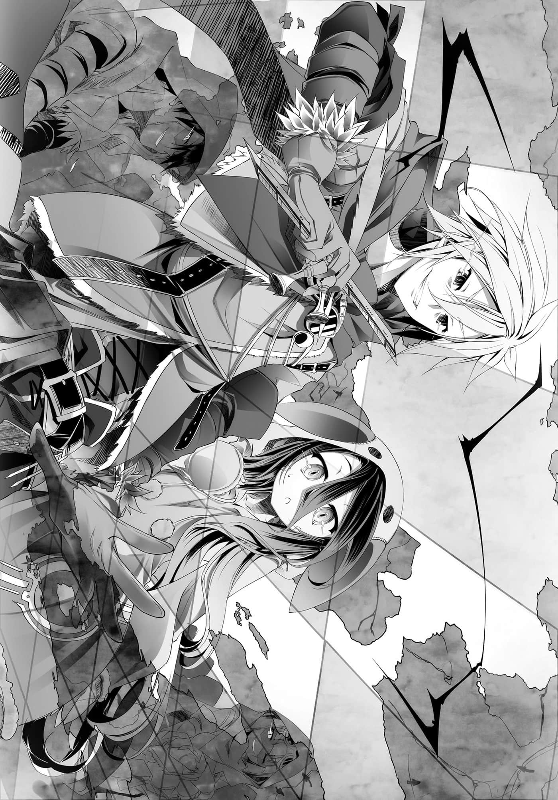

# 第三章 1＋1=无亡

> 来源：https://www.linovelib.com/novel/9/2085.html

距离交给克珑的地图上所显示的新聚落十分遥远的洞穴里。

在简易建造的秘密基地中，直到最后仍指挥避难，因此而丧命——表面上被视为死亡的人们，如今包含里克与休比在内，一七九名『幽灵』正围在圆桌之前。

环视每名成员之后，里克——『幽灵之长』缓缓地开口了：

「总有一天会到来的终战——我已经决定不再等待那种『不会到来的未来』了。」

众人闻言一片哑然，但是里克仍以强烈的语气继续说下去：

「在这样一无可取的世界里逃命求生，祈祷终战的来临吗——向谁祈祷？」

里克一口气倾吐这些他一直想说却始终说不出口的话。

「那群自称为神的破坏者吗！？还是连阻止他们都办不到的天，或者其他存在吗！？在这个该死的世界里，苟且偷生直到战争结束——然后呢！？在那之后呢！？」

里克夸张地挥动着手，有如宣泄感情般大吼。

「听说他们是为了争夺唯一神的宝座而战。会参加这种战争的混帐，不管最后是谁获胜，在那之后我们能够期待那个混帐会带来比现在好的未来吗——对吧！？」

接着，他的语气一转，降低声量，用没有温度的语气说道：

「差不多该承认了吧，这个世界……没有什么希望。」

————

对于这个早已发觉，然而一旦承认，就会令心灵崩溃的『事实』，『幽灵』们垂下了头。

就在他们各自浮现沉痛表情的时候，「所以——」里克说道：

「没错——只能靠我们亲手『创造』。」

听到里克强而有力的宣告，众人纷纷抬起了头。

「方法有一个。那是精神异常，疯狂的行为，以常识思考的话，可说是狂妄之言。」

那种连自己也只能苦笑的计策。

「我们是『幽灵』——没有人在意，谁也不会留意的人。」

「因此——『战斗』吧。」

「那就是我们身为人类的证明，愚蠢的证明。我们存在的——最后的机缘。」

「喂喂，老大，你可别第一步就判断错误啊，这样今后可就让人担心了。」

——他斩钉截铁地宣布：

「不用说也知道，失败就会全灭，大概一切的保险措施都是白费吧。有会说话的猴子在诱导战局——这个事实只要被那些家伙得知，那么一切就确实结束了。」

——道理是因为被发觉就会死。

「我们是『幽灵』——所有种族，连神灵种也包含在内，不杀任何一人，甚至也不被发觉。只是——『诱导战局至最后』——结束这场战争。」

将一切告知后，里克闭上眼睛，等待要离去的人离开。

「至于胜利条件……就算说得保守一点，仍是困难得让人昏倒……」

「那是我们『尚且』存在的证明，世界『尚未』结束的证据。」

「【四】任何手段都不是作弊。」

——内心想法则是因为只要没有被发觉，无论任何作弊诈欺都不算作弊诈欺。

以上——想怎么做就怎么做……

即使如此——

「既然如此——我们也只是随我们喜欢地创造规则而已。」

——果然——那时的想法并没有错。

「这个世界……果然是单纯的『游戏』。」

「…………啊～我要实话实说啰？」

「【二】不可以让任何人死。」

偏重感情的规则，正可说等同于『小孩的任性』。

……虽然老实说，他几乎想不到只靠两人就能成功的计策。

只要他们有意，他们可以把山岳变成地坑，将海洋化为陆地，甚至也能粉碎星球。

「【五】不需理会那些家伙的规则。」

「如果我们真的透过这个『游戏』……得到胜利的话——」

里克心想——事情很单纯吧？

「对，我们要战斗。凡是阻挡在前方的敌人，不管是谁，都要活用我们的力量——也就是『愚蠢』。我们要像『幽灵』，瞒骗他们所有人，抢先一步。我们要像弱者，运用各种计策，不惜舍弃羞耻和名誉。就算被恭维是卑鄙的人，被夸奖是杂碎，被赞美是恶劣的人——！！」

…………好了。

没有赢不了的比赛，努力就会得到回报，没有什么事是不可能的。

「别再假装聪明了，我们人类是愚蠢的生物。」

然后里克展露出在场无人见过的『本性』。

数度濒临死亡，数度存活下来——在其他种族看来只是微不足道的尘埃。

「可以将无限重复连绵至今的败北，转变成有意义的败北，借此一笔勾销的一胜。」

听到里克明确地说出这句话，一七七人的视线全都集中在他身上，只见里克微微一笑。

「【三】不可以让任何人发觉。」

——道理是因为杀人就会被杀。内心想法则是因为没有人想要杀人。

那么我就回答你吧——里克这么说着，见到休比点头回应，他露出大胆的笑容——宣告【规则答案】。

「对，我们要向那些怪物挑战——然后获胜。这种愚蠢至极，荒唐无稽的事，反而让人想笑吧？」

总而言之——里克开始下结论。

不过里克却带着像是恶作剧成功的孩子般的笑容，看待那个条件——然后他想起：

如果真的变成那样，那也没办法。最坏的情况，就算只有自己和休比两人——里克也要达成目标。

——道理是因为让人死自己也会死。内心想法则是因为不想让任何人死。

但是同时，如果要以人类之身结束大战，那么除此之外别无他法。

里克这么想着，整整十分钟之后，他睁开双眼。

他在内心苦笑，会参加这种『游戏』的笨蛋——没有几个吧。

「不是结束大战胜利，就是灭亡失败；不是全得就是全失的赌博，既没有平手，也不能弃权。」

「我们就可以告诉自己，我们帅气无比地活过，然后就能骄傲地死去，你们不这么觉得吗？」

一七七名成员——也就是离开的人数为零，对于这样的结果——

——内心想法则是违反这些规则所得到的胜利，感觉不出价值。

…………

「【六】违反上述的一切均视为败北。」

「【一】任何人都不能杀人。」

笼罩在房间中的情感是失笑。就在每个人都傻眼，发出笑声的时候，里克也笑了。

「里克啊，你以为事到如今，这个世界还有聪明的人吗？」

「那不就是蠢蛋的代表选拔吗？」

休比说过，想知道里克的『心』所引导出的答案。

听到里克这么说——一七七名『幽灵』们纷纷苦笑着说道：

…………

——没错，要掌握的只有唯一的胜利。

因为要以人类之身结束大战——这件事本身就已经是『小孩的任性』。

以人类之身终结永远的众神大战。

里克的『心』所导出的答案规则——里克环视围着圆桌的一七七人。

什么都不懂，无知且愚蠢的孩子，用纯真无垢的目光看过世界后所产生的想法，那样的想法——

他用最好的笑容，阐述出将这个疯狂的世界断定为『游戏』并进行挑战的动机。

「疯狂的行为？现在这世道，哪里有比这个世界更疯狂的事物呢？」

里克重新做好觉悟，脸上的表情紧绷。

「我们也要得到胜利。」

在沉默之中，每个人心里想到的存在，里克也在想。

「聪明人的话，在这个世界会选择死亡，更聪明的人则会选择不生下来……」

「只是众神随心所欲地追求『星杯唯一神的宝座』，玩起没有任何规则的游戏而已。」

看到里克说得如此笃定，一七七人——不，就连旁边的休比也圆睁着双眼。

（译注：佛教的数量单位，这个数的大小是10-24。）

里克往站在身旁的少女望去。

——众人一脸受不了的表情，仿佛在问：你要闭着眼睛到何时？里克对他们如此说道。

（译注：此处的虚空是中文数字中的数量单位，相当于10-20。）

「我以为你们应该更聪明一点的啊。」

——道理是若站在同样的舞台上将是必败。内心想法则是互相残杀的吃屎去吧。

即使如此，那对红色眼眸却让他感觉可能办得到。

——战斗，不是逃走而是战斗。

——全员笑着点头。

是啊，当然想笑，这教人怎能不笑呢。而那正是——

里克所选择的成员——毫无例外都是拥有优越知性与技能的人。

里克说要战斗的对手——就是数度将人类、将文明尽归于无的存在。

——恐怕不会有人留下吧。这不是精神正常的人会做的事，傻瓜只要自己一个人就够了。

这么说完，里克环视一七七人的脸，然后告诉他们：

——道理是无法彻底执行的规则就没有意义。

胜率的差别只不过是从虚空的彼方，远离至涅盘寂静的彼方㊟而已。

「我们是『幽灵』——但就算没有人认同，我们仍是继承遗志，靠着意志走下去的人。」

「唯有想开始那种『游戏』的人——留在这里。」

——当我们还是小孩的时候，以为世界更为单纯。

「敌人是『神』，是焚烧天地的暴力，绝望的化身。胜算远在虚空一垓分之一㊟的彼方。由于胜利条件是所有暗中行事的成功，因此就算胜利，我们也不会留在任何人的记忆里，不会留在纪录中，更不会被人谈论。我们是『幽灵』，『幽灵』不会说话，不过如果——」

「——『大战的终结』——那就是我们要得到的一胜。」

然后——

里克说着，手里把玩着西洋棋的棋子——然后看向休比。

但他们身为尘埃，却拥有卓越的能力——正因为如此，里克在内心苦笑。

——然后他斩钉截铁地说道：

「在这里的人——一直存活至今天的人——里克，这些都是你选的人喔。」

一声苦笑后，里克也笑了。是啊，正是如此。

——人类很愚蠢。

因为愚蠢，所以会磨练智慧、知性，让自己不会被愚蠢所杀。

一直存活至今天——即使在这个没有生存价值的世界，却仍然生存下来。

为此而赌上所有的知性、智慧与技术的人们。

——如果他们不是志气高洁的愚者，值得尊敬的弱者，那又是什么呢？

「没有意图地出生在这个世界。」

「没有意义地忍辱偷生般活着。」

「但是有意义又帅气地死去——那不是很好吗？」

「有比这个更好的自由吗，首领？」

「为了帅气地活到最后，我们的生命就交给你了——拜托你啰，老大。」

里克低下头，像是打从心底败给他们似的。

「……你们一个个都发疯了。真是可靠啊，那么——」

里克打从心底开心地说完——然后打开地图。

五年——不，这是在更早之前，人类为了存活下来而持续更新的——游戏盘。

由无数尸骨交织成的游戏盘，就在包含里克与休比在内的一七九名『幽灵』的注目之下。

里克开始说明具体的计划——

「好了——开始游戏吧。」

「——『向遗志宣誓』。」

就像这样——众人如往常般回答，但是里克说道：

「……在不会被留意——『误差』的范围内……对战况做人为的操作……」

——里克说道：

「……只要能引起『奇迹』……机率论就会变成……牵强附会……」

「掷骰子出现六点的机率是六分之一，连续出现两次六点的机率是两次的六分之一，所以是三十六分之一——虽然不懂什么是％，不过是这样的计算方式吗？」

「……呵、呵呵、呼呵呵呵呵呵呵。」

「休比，人类仍存活在这个世界，这个『结果』……是几％呢？」

---

■ ■ ■

「看吧，猜错了——和我结婚吧，休比。」

休比看到了——当时在场的每个人都触碰到里克的『心』而产生共鸣。

说完，里克想到，要预测到一切是不可能的，这句话也会反应在自己身上。

掷骰子出现六点的机率，严格来说并不是六分之一，其中有许多变数。

「………………？问题意图不明……概算……机率几乎是零。」

「你说的那个叫机率的东西，这样解释可以吗？」

或是，相信和抱持希望都不需要根据，这样？

休比笔直注视着里克，向他这么问道——里克于是沉思。

——就这样，不存在的人们静静地开始暗中行动。

——不过里克心想，休比想要的并非那样的解答。

终于——休比明白了里克的话和计策的意义。

「……………………我理解了。」

里克就像这样趴在地上，有如崩溃般地笑着。

——全力的求婚却被一口拒绝，里克早一步迎接了世界末日。

不可以被发觉，不可以被发现的真意，他们的『作战』是——

里克的笑容更灿烂了。

里克啊……已经够了吧，世界之类的根本无关紧要吧……

只有一个人——只有自己除外，休比不禁垂下了头。

但是一旦持续下去就会发觉异常，查出误差的理由——想到这里，休比的身体僵住。

里克带着苦笑说道，而休比也认同。机率论终究是统计值。

这冲击太巨大了，让休比的思考几乎停止，里克继续说道：

——办不到，至少『在第一次』不行。

贯彻成为总是不可能预测的……『拥有意志的变数』。

然而只要增加实验次数，机率将会收敛，计算起来反而轻松，也就是会变成如同计算的结果——

希望成为那样，于是挑战、挣扎、将其做为努力的目标——那就是『理想』——

「那样才有趣吧？将那些在天上目空一切，骄傲自大的家伙们的本事，贬低成区区人类所能匹敌的力量。如果一切顺利的话——你不觉得那将会是最棒的讽刺吗？」

里克一边洗牌，一边苦笑。

休比确实被驳倒了，但是要说那是纸上谈兵，休比仍感到困惑。

「没错，比如说『不存在的人我们』偷偷把骰子换成只会出现六点的骰子呢？」

在结果的面前，『奇迹』会让一切的计算被抛弃，那么反过来说——

在不明白问题意图的情况下，休比用概算求出数值。

现在的话，休比可以断定，这就是『心的源头』——『灵魂』。

不是全赢就是全输——如果站在里克的视角计算，那样的歪理也可无矛盾地成立。

「然后，是第二点错误。掷骰子有可能掷一次就出现六点——『也有可能连续出现一万次』……所以那样的计算是错误的。」

趴在冰冷的地上，十九岁处男里克泪流满面——

——即使如此，休比还是不懂。这个『游戏』不能用机率论解释，这个休比已经理解了，但就算那样，为什么——

休比顿时愣住，只见里克拿出一枚小戒指，对她说道：

休比用圆圆的眼眸仰望递出小戒指的里克，然后回答道：

啊啊……克珑，我已经累了……啊哈哈，呵呵，呼呵呵呵。

里克没有机凯种的数学知识，他根据休比的言行加以解释后——提问道：

「那么我告诉你一件好事。那个计算——是错的。」

就数学上而言，没有比这更难计算的要素了——对于休比的这个结论，里克点头认同。

在明知这种可能性的情况下——如果真的办到了，那就可以说是『神乎其技』了吧。

——那是歪理。不过就机率而言，要从哪个视角，以怎样的条件计算，也是重要的因素。

「机率论中没有零——没有人可以否定这个『游戏』胜利的机率，对吧？」

更何况是全部计策都成功的机率——依照逻辑思考，机率等于零。

里克眺望着入口的外头——逐渐成为死亡行星的世界——回答她：

像你这种第一步就失误的白痴，一定会到处失误，最后仍是输掉吧。

要答案多得是——比如因为不先相信又怎么做得下去呢，这样？

机凯种，而且是『解析体』，竟然被人类驳倒——而且是用感性的论调。

我不管了，人类和世界全都毁灭吧。

机凯种的自己不合逻辑地感到『兴趣』，最后转变为『憧憬』的东西。

未来与希望被夺走，甚至对绝望也感到绝望，最后终于也厌烦了那样的绝望。

只有自己不能理解那种感觉——她非常哀伤地继续说道：

「嗯～我说休比啊。」

听到休比这样反驳，里克却是笑嘻嘻的。

「……不对……将变数考虑进去的话……相反地，只要掷一万次，误差分布就会收敛……」

「因为出现六点是赢，其他全都是输。也就是说——获胜机率为『二分之一』。」

「…………没、没错……所以——」

「……禁止再说那句话了。我们不是向遗志，而是向我们同意的规则宣誓行动。」

「……无法、理解……我拒绝。」

「照你的语言风格来说的话，我们就是以『计算的奇异点』的身份行事。仅仅将各种预测、战略、计算……做些微操作，破坏一切，然后朝我们所希望的方向发展。」

里克天真无邪地这么说道——看到那清澈透明的黑色眼眸，休比终于……明白了。

「这就叫作弊，很有趣吧？」

「要说——『向同意宣誓』。」

会议结束后，休比和里克在秘密基地的入口，一边玩着纸牌游戏，休比一边说道。

不是等待，而是为了寻找——一七九艘幽灵船启航出征————

休比可以断言，她从未低估过里克，但是对于他这么容易就解开机凯种的数学理论，休比仍难掩惊讶。正因为如此，她打算要对里克说明事情的成功率——

因为有那样的必要所以那么做——那是只身为『对应者』的机凯种所没有的东西。

里克仿佛要打断休比的思考般说道：

「……里克，我要求……说明……」

——休比身体为之一僵。

「……为什么……能用最低的机率……做为期待值呢？」

「我就证明给你看吧——【问题】这时我向休比求婚的机率有多少？」

---

■ ■ ■

所以——对了。

——就是『这个』。第一次遇见里克那天所看到的东西——它的真实面貌。

「………………」

对于休比的回答，里克笑着点头。

「掷骰子出六点的机率是六分之一，可是在这个游戏，却不是那样的计算方式。」

「……里克你们的每条计策……成功机率……都不满一％……」

「变数能全部考虑吗？不可知的变数、无法预期的变数全都可以？比如说——」

「而且……基本上，机率论那种东西不过是纸上谈兵而已喔！」

「……里克……休比……还是不懂『心』……」

「不……对不起，是我区区一个处男不该得意忘形……请别再扩大我的伤口——」

「……拒绝……我想要……说明。」

休比以可说是不自然的面无表情模样问道：

「……『结婚』——人类与繁殖对象的另一半之间所订下的契约……」

然后，她根据仿佛在字典里查到的——而且是偏颇的——情报进行推测。

「……你看上休比的可利用性……想要占有休比……？」

「不是～～！我单纯是想要休比一直留在我身边啊！」

「……为什么？现在……就在身边。」

「不是那种意思……是以人生伴侣的身份！」

「……伴侣——同行之人，同伴，或者是——配偶……？」

「对！就是那个啊！就是配偶的意思！」

但是尽管里克拼命点头，休比仍面无表情地说道：

「……配偶……夫妇，休比是机凯种，无法繁殖。」

「那不是问题啊！！」

「……做不到……繁殖行为……里克要一辈子……当处男……？」

————

「那不是问题啊！！」

「……刚才有一瞬间……迟疑了一下……」

「啊啊真是的，那种小事无关紧要啦！！」

里克有如打马虎眼似地大叫，但是休比仍然是面无表情到不自然的地步，并且继续说道：

「……跨越种族的夫妇……没有前例……」

里克发现休比的说话声带着颤抖，担心地呼唤她的名字。

对方是冠有龙精种之【王】称号的三只之一——『焉龙』亚兰雷夫与七只从龙。

「——因为我将那些全都考虑进去之后，仍是爱上了休比吧。」

「……休比，我说啊——」

「……即使如此……里克还能说出……同样的话吗……？」

人类孩子的视线虽有敌意，但是在那种情况下——他却转身离去。

然而——因为那之后的解析，发生大量的【错误】，使她被解除连结——遭到废弃。

错误的风暴以大声量回答——『因为害怕』。

我——损失一四六八机，相当于投入战力的四十二％，算是实质上的《溃灭》。

然而或许是被他的气势压倒吧——休比的表情逐渐崩毁了。

——『解析体』——是解析考察事象的机体，对她而言，那样的行动难以理解。

那名人类孩子处于极限状况，但是既不惊慌，也未虚脱，而是确认了『敌人』后，在这样的状况下选择了生存。那和野兽的生存本能明显不同。

不需要根据就能断定某物的性质，让人能确信超越演算之物的存在。

「————————」

机凯种所拥有的『使能源方向歪曲』的兵装，Ｏｒｇ.２８０７——『通行管制』。

另外将解析情报传送给『指挥体』，算出让『设计体』新造兵装推定将承受〇．四秒的损害。

当时的机凯种没有能完全防御焉龙级『崩哮』的兵装。

你意外地在最后会疏忽大意呢，里克难为情地笑着说道，而休比只是惊讶地圆睁着双眼。

然后——

那是机体个体识别码——Üc尤巴连结体207号机Pr型解析体4f57t9机。

---

■ ■ ■

「……初次见面时我一直在想，为什么你会知道我是处男呢？」

——休比自己最不敢相信的事发生了，她的思考——

因为看着『解析体』的视线中，没有恐惧，没有虚无，只感测到无止尽的——

——损害？被讨厌吗？这值得头一个被举出来吗？错误错误错误……

但是一机『解析体』提案，不防御『崩哮』，而是——『使之转向』。

思考逐渐加速崩坏——错误、矛盾与崩解无限衍生下去。逻辑性崩坏、矛盾与无限循环。但是超越其逻辑的『思念』，却将禁止事项悉数抹消。

错误的风暴以大声量喊着——『快逃』。

焉龙的『崩哮』初始的〇．〇〇七秒，交战中的机凯种大约就有两成被挥发掉了。

「…………休比？」

满满占据休比思绪的，依然是如风暴一般的连串错误。

让她感到无比的——『可怕』——就在错误的风暴再度狂袭肆虐的思绪中——

这是机凯种所不该有的内心纠葛。要以逻辑为优先，还是以矛盾为优先呢？

——给予了不断发生大量错误的休比的思绪，致命的一击。

『解析体』感测到一个手里紧握方格图案的板子——视线瞪着『解析体』的人类孩子。

于是她降落在位于爆炸中心远方，却仍遭到毁灭的废墟，推定那是人类这种野兽的巢穴。

机凯种的损失勉强停留在——《溃灭》的范围。

——竟然用颤抖的声音……以矛盾为优先了。

道出一切之后，休比无法直视里克的脸，只是低垂着头，用颤抖的声音说道。

而损失的机体几乎是因『焉龙』亚兰雷夫的濒死攻击——

「……为什么……」

「…………————」

——日后，由那名孩子自己……

「其他还有你对我说『心的再确认』，说出人类在这个世界存活下来的因素是『我的心』，这种决定性的话语。说起来为何会在距离聚落那么远的地方『等着我』呢，游戏号码的『一号』为何会是西洋棋呢——这个嘛，嗯。」

害怕、可怕，机凯种并没有那种概念，但是她却无法否定那样的思考错误。

——【违反】【异常】【错误】【疑问】【循环】【不解】【不明】【损失】——

听到里克的声音，休比感测到肩膀剧烈一震，那是连自己也为之惊讶的程度。

「……但是……为什么……？」

假定，那可能就是机凯种所没有的——心、生命吧？

看到休比整个人僵住的样子，里克露出苦笑，继续说道：

『解析体』发生了错误——名为『惊愕』的错误。

提案的『解析体』判断，需要从造成的损害，对转向的『崩哮』进行再分析。

「……因为——毁灭里克故乡的人……就是休比喔……！」

————

不知是为了掩饰难为情，还是真的自嘲，里克搔了搔头。

这个提案立刻得到『指挥体』采用，『崩哮』的方向歪曲，往战场的彼方偏离——

一副自己真的也不知道的样子，里克笑着继续说道：

这场战斗投入了机凯种所保有全部战力的四分之一，是一场超大规模的交战。

然而『矛盾』——只能这么认定的东西——却大叫着：说出来。

——将其取名为『休比』的机体。

---

■ ■ ■

战斗结果——机凯种因战略获胜，敌我损害如下：

——这么判断之后，『解析体』将人类——特别是将那孩子认知为必须解析。

稍迟的〇．〇一八秒，『解析体』接到『观测体』传来的情报，立即做出判断。

——【非理论解答】利益——无。损害——会被里克讨……厌……？

「……你要忘记过去……？」

「……不可能的……因为——」

对于要开口的休比——逻辑和规定大叫着：不能说。

但是在思考之中——与里克初次相遇时的影像持续循环播放。

「不，在结果上，休比毁灭了我的故乡……那是确定的过去。」

预估将损失战力的九成，在战略上等同『歼灭』，那也意味着败北。

敌——『焉龙』亚兰雷夫及其从龙七只被《歼灭》。

只见里克搔着头，似乎难为情地说道：

「那么我们就是世界首例！我们是先驱耶，太棒啦！呀呼～～可恶啊！！」

她说不出话来，思考充满错误只能空转——不过她仍提出疑问：

——【理论解答】利益——无。损害——与观察对象敌对所造成的损失。

「嗯～……为什么呢？哈哈，我不知道呢。」

甚至超越焉龙『崩哮』的——『热度』。

这时退缩就输了——这种毫无根据的确信。

里克不知道，就是他那样的举动——

「嗯～……我果然是傻瓜吧，因为我也同时这么想——」

——十二年前，机凯种曾经发生过意外的大规模交战。

实际上她为什么要像这样低着头？因为看里克的脸——

影像所附带的——名为『恐惧』与『罪恶感』的未定义错误，不停出现矛盾。

听到这句话，错误顿时一齐静止，收敛成为一个疑问。

相对的，机凯种方面的战力是以库贝雷为首，八个尤巴连结体所组成的『复合连结体』。

那个孩子确信能够获胜——只是现在还不行而已。

「嗯……起先让我感到不对劲的是一件丢脸的事啦——」

里克略微自暴自弃地喊着，同时他以谜一般的确信感，继续紧追不舍。

——逃？为什么？

以自我崩坏、性命为代价的最后咆哮——『崩哮』所造成的损害。

——【自问】为何要说出来？不管是在理论上或非理论上，那都是没有利益的行动。

各连结体分别有四三七机——总计三四九六机。

「……因为——里克的——」

经过试算，只要复数典开此装备，损害将只会追加两成。

「……我早就发觉了啦，虽然只是凭感觉就是了。」

——她的脸上带着困惑、混乱，以及不知为何——悲伤的表情。

听到这句话，休比感受到不应该有的『痛楚』，仿佛就快倒下去——

「——如果否定了休比毁灭我故乡的过去——那我们也不会相遇了吧。」

「————…………！」

休比喘不过气来，明明她应该是没有呼吸器官的机械。

「结果就是结果，就算曲解它也没意义。人类不是那样的生物。」

里克缓缓走近，蹲了下来。

「尝到结果的痛苦，悔恨地哭喊之后——想着下次一定要成功而向前迈进，所以——」

——里克的手轻轻包住休比的脸颊，将她的脸抬了起来。

「所以……休比才会对我感兴趣对吧？」

露出孩子般的笑容，里克这么说完，等待着休比的反应。

而看到映在里克眼中，自己畏惧的表情，就连休比本身也惊讶无比。

而里克则仿佛在安抚她一般，以平静的声音继续说道：

「我不会否定过去的一切。」

————

「休比的过去，待在我身边的现在，未来也想要你继续陪伴在我身旁，这些全部都是我所爱。」

————————

「你也抛弃罪恶感吧。不好意思，人类——不，只有我笨而已吧。不管怎样——除了现在，我没有余裕去管别的。期待明天，对下次怀抱希望，这些都是建立在过去的基础上吧。」

所以——里克牵起休比的左手。

「只要有休比在，即使是这样的世界，我也想要活着。」

轻轻将戒指戴在她的无名指上——

「只要有休比在，无论遇到任何困难，我都不会灰心丧志。」

——就算有人生还，他也不会治疗。如果能够走路的话，也会和自己同样去避难。

克珑说着就要搔里克痒，而里克则开口说了一句：

而且那么做的原因——单纯只是因为她相信里克。

「我早就知道了……那孩子需要的不是制止他的姐姐，而是能够走在相同道路上的人。」

——这个自称姐姐的人……到底要——尽管这么想，里克仍搔搔头。

——原来如此。

「啊，小休不是人类这件事我已经知道了喔，你是要说别的事吗？」

突然从阴暗处冲出一个人，一拳打在里克的腹部，让里克哀嚎一声。

对于他那不像是孩子的冷静沉着，当大人们哑口无言的时候，克珑问道：

「喂～喂～小弟小弟，你怎么了？」

——『下次』……他回答下次，而且——还说要赢。

不理会惊讶不已的大人们，里克仍语气平静地一一回答问题。

「啊～～～！这孩子～～我要让他当我的弟弟～～！！」

「总之，身为姐姐我要先说一声——恭喜结婚了❤」

——发生了什么事？里克思考着抬起头来，克珑大剌剌地站在眼前说道：

「……里克。」

正因为如此——所以才会有那样不可思议的紧张感吧。

「……存活下来后，你想做什么呢？」

「所以如果你不讨厌我的话——」

如果初次见面时就发现她不是人类，那就不明白她喧嚷里克是萝莉控的意义了。

「……下次要赢……为了这个目的，必须活下来才行……」

克珑丝毫不觉得愧疚，一副除此之外没有别的选择的表情。

——再更往东走的话应该就有河流，里克心想到了那里应该就能存活下去——

…………忽地，休比发现了一件事。

---

■ ■ ■

「你要让小休哭到什么时候啊！你这个没用的丈夫～～！！」

「好，你有什么想说的话，可以跟姐姐说哦♪来吧，说说看吧～☆」

「就是你带她回聚落的时候。因为抱着她的感触，明显就不是人类嘛。」

「咦？我到达秘密基地，看到你们气氛正好——这怎么能不偷窥呢？」

「……既然你早就知道，为何什么也没说呢？」

不和任何人说话的里克，和同年龄的克珑或许能够交谈……

这个人……克珑其实是想这么问的吧。

——往东方走是因为那里是荒野……黑灰不会积在地上。

「——你没有找寻生还者吗？光线是从南方来的，为什么往东边走？」

为了不让里克冲动做出傻事——为了不让他急着送死——可是，其实——

「……如你所见……我是个不成熟的人——」

——有什么办法嘛，因为我错失了现身的时机呀。

听说了秘密基地的位置，克珑便立刻前往，却偶然偷窥了这一连串的经过。

「那么就别理会什么道理——你愿意和我走上相同的道路吗？以我妻子的身份……」

「————」

他，里克会到很远的地方，很远很远，不是自己能够跟去的地方——

不过对于还不了解该如何表达的『感情』。

「等、等一下……你是什么时候发觉的……」

从聚落的毁灭逃过一劫的里克，受到克珑村里的大人们保护的那一天——

「啊～那么再继续隐瞒克珑也不太好，所以——」

「应该是有理由的吧？最初当里克带小休回来的时候，心情非常紧绷，好像理智线随时会崩断一样——所以我才配合你的说法呀……」

「因为，她是里克选择的女孩呀！」

有其他种族被带进聚落了喔——应该是警戒，或是采取警告行动才是——

所以克珑临时想到，不可以让他一个人，那时她就决定要待在里克的身边。

于是里克一点一点地说了出来。光线从南方而来，聚落因此烧毁，自己推开化成焦炭的母亲往东前进——

「嗯。」

里克一副像是被她打败似地这么说道，然而克珑却是——用有如真正姐姐一般的笑容，毫不在意地说道：

「——克珑，你的好意我很感谢，但是我们已经不存在——」

「哼哼～在这种时代，姐姐我才不会因为那种程度的话就伤心呢！快说快说，不会说话这个借口已经不能用了喔～！发生什么事了呢？」

她猜出里克有隐情，如果要刻意表现出没发觉的样子——她就只能那样做。

「不过我看你们很快就变得要好了，而且多了这～～么可爱的妹妹喔！！既然如此，她是不是人类就没关系了吧！！小休，我告诉你喔，人类一旦结婚了，就要和家人亲吻喔，这是从上古时代就流传下来的传统喔——」

虽然不知道『何时有了那样的功能』——但是滑过脸颊的一道泪水让她理解了。

……不过那件事先摆一边……

---

■ ■ ■

「……结果害我一直偷窥到最后呀……真是笨弟弟……」

————…………

————…………

——机凯种是对应的种族，有必要的话，就会顺应需要而改造自己。

不知不觉间，掩盖思考的错误风暴已经停止了。

「不讨厌——！没有、那种事——！」

「才没有那种事！休比别当真，快离开她！」

错误的风暴，与逻辑矛盾的那些错误，全都整合起来，加以命名处理了。

「啊，里克！难得多了一个家人——你要举办婚礼喔！！」

……这么期待着的大人们不禁用手遮住了脸，心想：你还问他怎么了，他是被毁灭之聚落的幸存者啊。

——秘密基地的入口外面，克珑叹了一口气说道。

「对于我这个笨蛋而言，你已经是太过优秀的老婆了。」

看到戒指上——有如休比眼睛一般的红色石头——

——不管是里克还是克珑，他们都没有可以称为家人的人。

「克珑——欸、我说啊……为什么你知道，不，应该说为何你在这里？」

…………

大人们一同露出傻眼的表情，但是克珑却用脸颊摩擦着他叫道：

然后里克仿佛感到困扰般——说出口：

……

休比有如打断里克的话一般摇头说道。

里克苦笑着如此说道。

克珑的态度反而像是在说，为什么你会以为我没发觉？

那也就是——『感情』。

——『被里克的哪部分吸引了呢？』那天被问到这个问题时的感觉。

休比蹲了下来，用湿润的声音——有如勉强挤出来似地回答：

克珑发现了，当他说出下次要赢时的眼神——在那深不可测的眼神里。

——『你接近里克有何目的？』

「只要有休比在，我就不会再失去笑容。」

————————啥？

从阴暗处看着里克轻抚着仍然哭泣不止的休比的背，克珑忽然想起：

——嗯，稍等一下。里克说着按住腹部站了起来。

「……请让我永远、永远——陪在你的、身旁……」

「…………原来、是这样……」

「……你好烦。」

——忽地，休比想起一件事，然后理解了。

里克向她伸出手——然后向她请求：

这句话说到一半——发觉克珑认真的表情，里克打住了。

因为他们已经……不在了。

更不用说对外而言，不管是里克还是休比都是已死之人——那就代表……

「我来当媒人，让你们成为一对『正式的夫妇』好吗？举行一个只有三人的婚礼如何？」

令人意外地，竟是休比回答她：

「……我想结婚……」

她抬头看着里克说道：

「……我想当……正式的夫妇……」

————…………

——没什么大不了的简单仪式。

交换誓言，在文件上签上三人的名字就完毕。

本来应该要聚集聚落的人来参加——但是里克和休比的身份已经是死人了。

克珑表示既然如此——就由她当场为两人证婚。

「新郎里克，你愿意发誓接受休比为妻，与她同行，互相支持，彼此相爱，一起存活下去吗？」

克珑说的话——真是符合这个时代，符合那个聚落的誓词，里克听了不禁苦笑。

每当聚落内举行婚礼时，他都只能低头不语的这段誓词，如今却——

「好，我愿意。」

「里克！这时候应该说『向遗志宣誓』——」

「抱歉，那句话刚才已经废止了。所以——我要『向同意宣誓』。」

听到他那样说，克珑鼓起脸颊，嘴里不住嘀咕。

「……竟然背着我，暗地做了那么多事，真是让人不爽……」

————

——三只兽人种消除气息，在森林中徘徊着找寻食物。

克珑的表情既像是开心，同时又像寂寞似地这么说道。

没想到——竟然会有看到这个弟弟脸红的一天。

「别让里克悲伤，他是个曾经失去笑容的孩子……别再夺走他的笑容……」

「……交给我们吧……姐姐……」

——就在牙齿正要落下的时候，他们一齐有如弹开般，飞快地向后方一跃。

两人将克珑的姓，刻在自己的名字下方，虽然感觉念起来不太顺口就是了——

难得想要缓和气氛的，真是失言了。

——『幽灵』们围绕着圆桌，幽灵之长在『盘上』张开双手。

在这种世界、时代，即便是兽人种，要确保粮食也非易事。说到底活着的正常动物本来就少，不冒险就『能狩猎』的其他种族也有限。

「因为这件事只要你当一辈子的处男就没事了呀！——好了。」

——原来如此，那样就谁也看不见了吧。

「好，既没有人会死，我也不会让任何人死。只有这个『游戏』——我一定要赢。」

苦笑一声后——里克与休比拿起刀子。

——体温异常、心跳数也异常，但那是毒药所造成的。瞳孔是——

「新娘休比，你愿意发誓接受里克为夫，与他同行，互相支持，彼此相爱，一起存活下去——」

集幽灵们的视线于一身，幽灵之长——取出白色棋子。

「……这样你们两人就是夫妇，而且也正式成为我的弟弟和妹妹喔。」

「什——什么！？」

而刻在上面的里克和休比都没有姓，也就是说，克珑真正的意图是——

————…………

「我知道——我重要的弟弟和可爱的妹妹还在，所以……拜托你们——」

——白色的国王。

「……你是什么人？」

「我们不存在。」

「……我发誓……我要当个……『好妻子』。」

——————世界真是不讲道理。

「这是——兽人种。」

因为宝石上已经——刻有克珑的全名了。

想要阻止他们，但那是办不到的事。理解了这一点，却仍勉强自己装出笑容——克珑就是用那样的笑脸说道：

「这就是我们。」

「不吃任何棋子，赢得游戏的胜利。因此全部的种族都是——『白色』。」

克珑说着，取出总是佩戴在腰间的宝石说道：

「这是最弱的棋子，不会成为其他任何事物的棋子，但却是最重要的棋子，被杀就会结束的棋子。」

————

里克内心对她感到佩服，果然是克珑的话——就可以放心把大家交付给她。

「——我不想再失去家人了，请不要勉强自己……」

「啊，还有，良好的夜生活也是好妻子的必要条件喔！床上高明就——」

不存在的人，不可存在的人，因此不容许被察觉。

「不愧是兽人种，要吃我是没关系啦——不过我保证很难吃喔。」

头脑因为击中脸颊的拳头而摇晃时，里克这么想着。

「————！？」

他们用只有兽人种能听见的声音连系，就算对方是人类也不可掉以轻心。

他们聚精会神，发挥五感，依循着气味——终于找到了一只猎物。

「我不知道你们两个——大家要做什么，而且你们两个人已不在这世上了，但是——」

「……既然你们对外界来说已不存在，那就不能留在文件上吧？这颗宝石是我从祖父那里继承来的，只要在刻有三人名字的那一面添加装饰的话——对吧？」

老实说她没有自信，虽然不知道要怎么做才好——不过休比回答：

——是人类。虽然这种动物不太好吃，但至少能果腹。

刻印结束后，克珑比他们两人都更加喜悦地看着那颗石头，再珍惜地收藏好。

尽管里克什么也没说，克珑仍体会到他们的意图，准确地继续说道：

「……休比只要知道构造……进行自我构筑————可以做出『洞』。」

对于像是「说着兽人语的人类」的某生物，三只兽人种表露出警戒心问道。

她又开始胡闹了，里克不禁叹息，而对于定义不明的词语，休比则是侧着头感到疑惑——

——看不到克珑的表情，不过听到她颤抖的声音，两名弟弟和妹妹点头答应。

听到里克说的话——克珑表情僵硬地反省自己。

说完，克珑抱住两人——弟弟和妹妹，然后说道：

---

■ ■ ■

「……所以克珑……给休比看、克珑的生殖器——」

「我们不存在任何地方，却也无所不在。我们是从盘外操控一切的人。」

「那么接下来休比，你愿意发誓成为丈夫里克的——『好妻子』吗？」

「……我愿意……」

味道非常臭——服用『大量毒药』，说着兽人语的『某生物』回答。

看到克珑表情认真地这么问道，休比沉默思考。

「兽人种做为据点的西方湾岸森林……地精种正准备在那里进行炸弹的引爆实验喔。」

「——为什么是我被揍啊！」

不过休比忽然举手。

……——

「喂～媒人，你废话很多喔～！」

包围起来，一拥而上——咬下去——

「一切都在这张地图——也就是只在盘上见分晓。那么……这就来决定『棋子』吧。」

他将那个棋子放在地图上——更正，放在『盘』外——配置在桌子边缘的位置，然后继续说明。

然后——她露出比真正的姐姐更像姐姐的表情。

这次克珑转而面向休比，念出结婚誓词。

「哦～哦～」克珑将视线移向里克，看到了贵重的东西。

休比迫不及待地立即回答。形式连续遭到无视，克珑失望地垂下肩膀——却听见休比继续说道：

……嗯，克珑好似放下心似地，用力点了一下头，然后——

---

■ ■ ■

然后，接着取出复数的棋子——全部都是白色的棋子。

「……做得到吗？」

「——你在说什么！」

克珑的胡闹更加夸张了，然而——

「……里克、休比。」

他将白色士兵——放在『盘上』——兽人种的栖息地带。

里克仿佛观众般发出嘘声，克珑瞪了他一眼，咳嗽一声。

「我们是国王，但同时也是——幽灵。」

「哎呀♪太好了呢，里克！恭喜你脱离处男——」

「不杀任何人，不让任何人死，只利用各种手段、情报、策略和诈术来诱导战局——既有规则，也有胜利条件的话，那很明白地就是个『游戏』——」

「啊，克珑，休比办不到那种事啦。你知道的，她的种族——」

「……好……妻子……？」

「那么把我们三人的名字刻在这上面，你们就是正式的夫妇了。」

他这么说着——取出『白色士兵』——

「……里克给了休比存在、出生的意义……还有心，休比向里克发誓……绝对不让里克死……休比要活下来，和里克在一起……直到最后……『向同意宣誓』……」

三只兽人种一齐运用从心脏跳动到血液流动声都能听见的五感，『观察』对方。

「怀疑的话，就到这个地图上标示的地方去看看吧。你是血坏个体吧？如果是地精种的设施，你应该能轻松潜入，查出他们在做的事才对。我只给你们一个提示。」

——没有说谎的反应。就在三只兽人种做出结论的同时……

那人类说道：

「那是——连神灵种也能杀死——名为『髓爆』的大规模破坏兵器。」

「「「——！？」」」

再度听取心跳反应、瞳孔甚至毛细血管的血流声——没有说谎！？

「去找吧，然后看你们是要带走，还是要破坏他们的资料和器材。不过千万别想破坏兵器喔！因为有可能在那个瞬间就会让一切消失，整个露西亚大陆的西边将因此灰飞烟灭喔。」

然后，那个神秘的『某生物』把要说的话说完，就这样悠然地离去了。

————…………

「——休比，有反应吗？」

「……没有……没问题……」

听到里克的问题，休比假装使用灵针盘，查探生命反应。

没有人。确认这一点后，『幽灵』们一齐潜入地精种的设施。

「话说……要我和做出这种事的家伙们『对话』，我可不干第二次啰，老大。」

——过去名为亚雷的『幽灵』张望四周，倒抽了一口气。

原本是地精种设施的钢铁建造物，如今被刻印上巨大的爪痕，已经看不出原貌。

地上甚至有深度高达人类身高的爪痕，但是——

「有必要的话，不管几次我都会要你做。只有你能完美地用地精语交谈，血清也生效了吧？」

「是啊，我完全康复了，只是短短痉挛了两天而已嘛。」

里克平淡地回答，『幽灵』则以苦笑回应。

「——好，那么开始吧。」

就算伪装外貌——她大概想不到即便使用魔法，却竟连轮廓也无法揭开吧。

比如说，只要说出这句话——她就一定会答应游戏。

「彼此赌上的筹码是『情报』……胜过我，我就提供情报；输给我，我就要收取情报。」

妮娜担忧思考被读取的可能性，所以慎重地回话——当然了。

被照亮的黑暗深处，只见有个坐在桌前，仿佛融入黑暗般的长袍身影。

「————！？」

「对，没有，因为没有血迹——不愧是兽人种，了不起的直觉。」

『幽灵』说完，视线落在原本就在桌上的西洋棋盘上，森精种说道：

对于来历不明的人物，不能轻举妄动——影子笑了。

情报确实泄漏出去了，因为『泄漏的不是别人，就是「幽灵」自己』——

因此，『幽灵』笑着思考——这家伙一定会答应游戏。

果然还是无法感知，不过森精种想必正用魔法，对『幽灵』的话做多重查探吧。

「……好吧，不管你是什么人，看来是不能放着不管了呢。」

森精种的首都——郊外的宅邸。

「我只是个『幽灵』。我只能说我不是你的敌人，也不是你的同伴，」

「不存在于任何地方——『向同意宣誓』——」

——『无法识别・身份不明』……心想她一定很惊讶吧，影子笑了出来。

这时如果有数名血坏兽人种出现的话呢？除了逃之外还有其他的选择吗？

「…………————」

「但地精种不会放着这里不管。限制时间十五分钟，收集情报后消失。『幽灵』是——」

当然森精种会用魔法窥探话语的真伪——但是『幽灵』知道窥探的结果。

因为上位种族、下位种族、同族，这三种可能性仍然重迭在一起。

「那么我先奉送一个情报。如果是无论真假都不能漠视的情报，那就可以证明，这个游戏会成立了。」

————…………

---

■ ■ ■

————…………

瞬间察觉到入侵者的气息，布下探知魔法和照明魔法做为警戒。

难道你以为普通的人类会毫无理由，潜入森精种的首都吗？

但正因为那聪明的头脑，所以不会乖乖退缩。

森精种故作镇静，内心焦虑地思考着。对于她的想法『幽灵』了若指掌。

「——可以请问你是谁吗？」

「——传闻中的『髓爆』看来是被带走了。老大，是兽人种还是地精种呢？」

---

■ ■ ■

因此她只能开口问了：

却没有击出。因为同时展开的第二个术式——解析魔法告知她：

「你想说不知彼此的情报是否为事实，没有担保的筹码不能当成赌注，是吗？」

「……这就是……让棋子……『变身』……吗？」

「……嗄？」

然后——他取出『白色城堡』——

例如在森精种的废都，休比找到的地下室内所残留的——些许文件中。

——然后只要有适当数量的血坏个体冲入就好了。

见到妮娜仍在警戒，『幽灵』内心笑道，那样就好。

选择兽人种做为士兵的理由——

『幽灵』虽然无法感知，不过她一定会再用魔法查探说谎与否吧——但那是白费力气。

「————————是啊，没错。」

返家的森精种——被称为妮娜・克莱布的人。

「那么这个游戏——从你说的筹码来判断，是纸牌游戏吗？」

然而无法理解那层意思的森精种问道。当然有了。

但是——没用的，没有虚假。

那恐怕是她的『全力』——以八重术式伪装过的骗术被看穿了。

影子以流畅的森精语，语气和善地向她问候，森精种瞬间编织攻击魔法——

幽灵们一齐散开，各自收集情报的时候，休比问道：

「好啊，不过在那之前……」

——『幽灵』是『假』，除此之外是『真』——魔法一定会这么回答吧。

「……你好，抱歉我擅自打扰了。」

「这个就是——森精种。」

——正因如此才选择她为接触对象，里克先一步猜出她的思考。

因此他们所能做的就是——废弃炸弹，然后——逃亡。

被称为妮娜・克莱布的森精种是优秀聪明的人，同时也是当代第一的术者。

「即使是士兵，也能擒获主教……单纯只是这样而已。」

「——我想玩个简单的游戏。」

放在森精种的——首都的座标上。

不过『兽人种的直觉』应该最了解那个炸弹的危险性。

「是兽人种。还有其他物种能在钢铁制的地板和墙壁上留下『足迹』吗？」

如果是兽人种的五感，从远方就能利用非人般的五感，算出设施内的人数。

『幽灵』好像瞧不起人似地说道：

「所以我才说这是个『游戏』。」

「可以请你把棋子恢复吗？因为是由白方的我先下，真是抱歉了。」

「——！？……是谁？」

『幽灵』围绕的圆桌，幽灵之长再度在『盘上』张开双手。

没错，无论对方是谁——都不是可以轻易出手的存在。

——这件事没什么困难，只是『稍微利用』伊旺留下来的战略图，潜入消灭聚落的地精种坠落的战舰中，借由通信用一丁点的情报做『交换』而已。

这么说完后，她坐在『幽灵』对面的位子，双手盘在胸前问道：

也就是——比自己上位种族的可能性。

「不对，是『西洋棋的快棋』——这样就很容易明白，彼此是否有作弊吧？」

因为不是敌人也不是同伴这一点是事实，『幽灵』浅浅地笑了。

「可是到底有几只『血坏』闯入啊！破坏到这种地步，真的没有人死亡吗？老大。」

而且兽人种也不是笨蛋，比逃走的地精种更为优先的是——

——她故意装傻，内心则是对『被看穿』之事咋舌，表情微微扭曲。

「还没做到那种地步——只不过……」

「……这样你满意了吗？情报的真假不是问题，身为『虚空第零加护』的理论提倡者，同时也是术式编纂者的你，其真假你自有途径审查——我说得没错吧？」

只要条件齐全，该种族对上某特定的种族时会完全无法抵抗。正因为如此，战争才一直持续着。

甚至参与开发的个人姓名，在机密文件中都是被以『暗号』记录着。

是因为只要深入敌阵，士兵甚至能成为皇后。

「——擅自闯入别人家里，想必是有相当重要的事吧？」

对于不知道这件事的她而言——在她眼中的『幽灵』就像是知道一切的存在。

再来只要将事实传达给兽人种即可，告诉他们——兽人种的住处就是引爆实验的预定地。

「『虚空第零加护』的存在已经被地精种得知了——这个情报如何呢？」

这么说着，他将白色城堡——置于『盘上』。

聪明人面对『来历不明』的人，首先会考虑最坏的可能性。

不过——里克露出苦笑。

——大概是被强行搬运出去的吧。

全身覆盖着破布和兽皮，身上穿着毛皮长袍，兜帽低戴遮住面容的影子说道：

——『虚空第零加护』，是连理论提倡者都受到隐匿的超重要机密。

地精种并不是笨蛋，在会毁灭一切的炸弹旁边，不能随便使用魔法。

「——————啊啊，对不起，因为我不太懂西洋棋。」

被称为妮娜的森精种心想——果然测试来历不明的对手会有危险？

然后她将棋子恢复，同时会这么思考吧——

「那么我们的筹码是……『虚空第零加护』的理论提倡者其实——」

「并不是你——这个情报我已经有了——」

用别的手段谎言试探——如此内心暗笑着的森精种，听到接下来的话后——

「——而这其实是假的情报，以及你要用魔法让我相信那个谎言的情报，我也掌握了。」

——明显脸色苍白。

「好了，谎言对我是否管用，你应该已经确认过了吧。差不多可以开始游戏了吗？」

『幽灵』愉快地问道。就算不使用魔法，对手的心境『幽灵』也了若指掌。

因为对方的表情就像在说——这家伙到底是什么人？

看到她那种模样，幽灵——里克不禁苦笑。

——秘密说穿了，其实也没什么大不了。

里克是人类，无法感知魔法——对于棋子被动了手脚，他根本无法看出。

但是里克能够猜想得到，当代第一的聪明人，同时也是第一术者的森精种，在看到来历不明之人递出已经排列好的西洋棋盘时会怎么做。因此——

他不提『哪个棋子』被动手脚，并且也『不让她使用』使人相信谎言的魔法。

——只是虚张声势。但是看在她眼中却不是那样——当然也不可能让她看出来。

这些虚招——只要有一个判断错误，一切就结束了。

做到这种命悬一线程度的必要性，她一定……无法想到。

不做到那种程度就赢不了，对于人类这种最弱的存在……她无法想到。

因此，她会这么审查情报——

这是为了加深她思考被读取的错觉。

「——就是那个『该不会』。」

「那是我奉送的筹码……不必特地当做赌注，我也会提供给你。」

——只靠『知性』想和人类一争长短——根本不是对手。

——原来如此，『虚空第零加护』似乎是叫做灵坏术式。

「——『向同意宣誓』……」

听到那句话，里克在内心窃笑——没错，你一定会这么做。

若非过于小看，就是已有防御手段——又或者，该不会——

——『虚空第零加护』被视为『不成问题』。

里克说完，交出记录着从地精种的坠落战舰发送的通话之录音石。

「在得知『虚空第零加护』后，地精种仍判断不成问题，我就赌那个判断的根据。」

要和人类——和最弱的对手进行知性的竞争，是无谓的挣扎。

「你的理解速度真是帮了大忙，不愧是森精种的第一聪明人。」

舍弃乐观的思考，必须假设『敌人』『能拆穿我方一切』的谎言。

然而里克内心却是「哇～喔」，对超出想像的后果大为惊讶。

她认为这是对方为了夺去自己对游戏的专注力，明知故问的问题，森精种瞪着里克——

「————你、你说什么？」

在心理战也被掌握了主导权——可是对方又透露出不能漠视的情报。

如果是连可能与否这种事都还要用小聪明去测试敌人，那种程度的半吊子力量的话——那就别夸耀自己的知性。

就像这样，仿佛在等待被称为妮娜的森精种的思考结果一般——里克这么说道。

正因为如此才选上她——『只是这样而已』。

那所代表的意思只有三个。

仿佛在等待她思考到这一步般，里克这么说道，森精种不禁咋舌一声。

不过……她又上了拙劣诱导的当了呢，里克在内心苦笑。

——借由消去法可知，『该不会』就是——『更强力的兵器的存在』。

「那么——开始游戏吧？」

这个事实伤害了她的自尊——逐渐夺走她冷静的思考力。

「也就是说——如果我要求『你的真面目』的话……」

————…………

活用至今所掌握的优势——也兼具动摇对方的作用，里克刻意问道：

对于自己的思考被人用某种方法读取，她愤慨不已。

「我掌握了。地精种判断与『虚空第零加护』同等以上的『兵器』。」

——没错，里克回答得出来。

「……你是说你掌握了那个情报吗？」

——正因为如此——所以容易判读，能轻松诱导。

「因为天翼种而丧失的魔法体系——你从中重新编织出新的体系，并自负更加超越以往，对于你的骄傲我表示尊重，只要你赢过我，我就会详细说明。那么你要赌什么呢？」

「要赌的情报可以自己设定。如果判断情报无价值，也可以要求变更，这样如何呢？」

「——『虚空第零加护』现在运用的可能数量、能够搭载的机体情报，这样如何？」

绝对的兵器被评价为『不成问题』——可以想像的可能性就有限了。

——没错，森精种会思考——这才是对方的目的。

另一方面，里克则是低着头，忍不住想说——你有资格说别人吗？

里克在内心窃笑，然后说道：

「……首先是你要我奉上的情报——」

「就算是那样，『虚空第零加护』是森精种——是赌上我所有心力的最强灵坏术式——如果说区区地精种造出了超越那个的武器，那就算牺牲生命，我也要得到那个情报……」

然后——再从这家伙的反应，里克终于看出全体的轮廓了。

其实他对『虚空第零加护』的详细情报——根本什么也没掌握。

「比起那个——我要提供的情报是——」

然后——将更诱人的钓钩和饵，秀给对方看。

因此——这家伙必定会这么思考。

名字与开发者……对地精种随意吹嘘『超规模破坏兵器』所得到的反应。

然而森精种却是——手撑在桌上，手掌托着脸颊，抱头烦恼着。

愚蠢和软弱固然无法夸耀，但是当那『半吊子力量』被封住时——

然后里克依然露出能够看穿一切的笑容，举起手掌。

她拥有自信，不可能有防御的方法，而那样的她询问有无具体情报的话——

身为当代第一术者，素有智者之名的自己，竟然在智能战上遭到单方面玩弄。

但是她并没有发觉——说出『那个情报』所代表意义的重要性。

——西洋棋比赛十二盘，森精种是五胜四败三和。

那正是她思考『该不会』的解答，森精种恨得咬牙切齿。

那即是——

她更是极为优秀的术者、聪明人——拥有优越『知性』的人。

——为何里克会选择她做为接触对象呢？

既不是敌人，也不是同伴——现在只能相信那句话，设法套出情报了。

就结果来说，她是领先一胜，而她所要求的情报——更正。

结果建立在魔法技术力量——这个在紧要关头可以破坏一切的保障之上的——『知性』。

里克将想交给森精种的情报全部交给她——得到许多想要的情报。

「我要求『虚空第零加护』泄漏给地精种的经过，可能的话请提示证据。」

因为她拥有优越的知性，因为她有强大的力量，因为那也是她的骄傲。

「……泄漏最高机密，会因为反叛罪，连略式法庭也省略，就直接处刑吧。」

——『幽灵』身上感知不到伪装魔法一类的魔法，另外也检查不出说谎的迹象。

但是森精种仍毅然决然地——要把宝贵的情报交出来。

如果是绝对强者的话，遭遇自己的瞬间二话不说杀掉就好。

里克叹一口气，说出『幽灵』们和休比收集来的情报，至今仍站在优势立场。

所以——她也回应。

如果对方真的使用了那样的魔法，不管怎么样，她都没有对抗的手段。

——担忧被套出过于不利的情报。

正如这名『幽灵』所说，真假只要自己确认就好了。

「那么我也会要求，赌上对你极为不利的情报做为代价。」

超越『虚空第零加护』的兵器，本身就是难以想像的情报。

与从愚蠢和弱小存活下来，靠着知性本身做为生命线的人类的——『知性』。

——里克可以想像那是多么危险的赌注，不过——

在这样的情况下，尽可能套出能够套出的情报，因为自称『幽灵』的家伙之意图和真面目，应该也可以从得到的情报查探、追踪才对。

——避开『该不会』的具体性，以虚张声势应战——但是里克笑了。

「容我一问，万一那个情报泄漏出去的话，你会有怎样的后果呢？」

当代第一——即便在过去也是属于传说领域的『八重术者』，那样的她也无法看穿的魔法。

只见被称为妮娜的森精种咬着指甲，绞尽脑汁思考。

「那么——我们就进行『幽灵』式的宣言，开始游戏吧。可以请你跟着我复诵吗？」

对于那样的她，里克的想法是——半吊子。

---

■ ■ ■

「好吧，开始游戏吧。既不是敌人也不是同伴——我就假定你没有恶意吧。」

她是貌似森精种决战兵器的『虚空第零加护』的编纂者，同时也拥有庞大的情报。

不能拿会败露泄漏者里克的情报来赌博，正因为如此——他才特地奉送。

透露那武器的详细情报——如果没有相当的代价，对方是不会接受的，她很理解这一点。

但是当思考整理到这个地步时，这次——

「引爆不活性化中的神灵种的『神髓』……？那群地精种真是疯了……」

——持续假装知道『虚空第零加护』的真相，整合情报，推测出原理。

（说要做为使幻想种自我毁灭之兵器的家伙，竟然称呼他人为狂人——真是让人笑不出来啊。）

这个世界的每个人都已经疯了吧。

内心这么嘀咕着，里克从抱着头的森精种旁边通过，打算离开——

「……等一下。」

却被叫住。

「——你的身份，还有你如何搜集到这么多情报，事到如今我就不追问了。而且在确认真假之前，这些情报在当下也只能当成嫌疑而已。」

「那样就可以了，聪明的判断。」

「不过只有一点——」

她的眼神锐利——如果不是有『某个理由』，就算是里克也会表情僵硬吧。

如刀刃般的锐利杀意朝里克袭来，森精种指谪他——

「你有时会下出故意输棋的棋步——我再问你一次——」

她的眼神就像在告诉里克，视你的回答，不管你是什么人，我都会无条件、用尽所知的杀伤法攻击你，就算最后被反过来杀死，我也做好觉悟了。

「——你是敌人？还是我方的人？」

——但是，很遗憾。

「既不是敌人，也不是同伴，这是第二次的回答了。对了……」

对于笑着这么回答的『幽灵』而言，事到如今，那种程度的杀意——比微风还不如。

对于与死亡携手走来的人而言，杀意那种东西——光是有意志这点就还算好的呢。

「如果你不满意那个答案的话，那我就这么补充一句吧。」

然后，在那样的世界存活至今的里克——发自『真心』地说道：

「……休比的耐用年数……约还有八九二年……」

远离辛克宅邸的小屋里——休比拼命急着为里克『除染』。

「正因为如此——我才会和你接触。」

虽然得到了需要的情报，但是除此之外，他只是认真挑战却输掉而已。

里克喝下休比计算出濒临致死量的黑灰，并且涂抹在身体表面。

原以为不可能有比休比更优秀的西洋棋手。

「是啊，时常听人说呢，听说就算花费几十世代的时间也要报仇雪恨。」

这么苦笑之后，被称为妮娜的森精种——不对……

——至少皮肤已经无法复原了吧。

如果不快点除染，正如休比所说，他将会死掉，不过——

「…………」

拥有所有种族中最高魔法适性的森精种——在他们的第一术者面前扮演『幽灵』。

一般见到他们，身体精灵会遭到识别，有如裸体一般，瞬间就会被看出真实身份。

森精种的『虚空第零加护』的详细情报，依照辛克说溜嘴的「能够搭载机体」这一词汇，可以揭开它的运用法。而地精种的『髓爆』也是从伊旺赌上性命的战略图中读取出来——这样总算可以与潜伏在世界各地的『幽灵』联手，达成第一目标了。

森精种第一术者——自认也是个演员的辛克，不服气地笑了。

一瞬间，仿佛换了一个人似地，妮娜——不，辛克・尼尔巴连露出有如取笑般的笑容，一派轻松。然而里克则是低着头，苦笑着回答。

真是荣幸——实在是极为夸大的评价。

「话说回来，幽灵先生？森精种非常记恨，这个传闻你听过吗？」

——没错，摄取黑灰，故意让自己『灵骸污染』就好了。

她大概再度使用八重魔法，窥探了里克的真意吧。

遭『灵骸』侵蚀两小时以上，里克的身体毫不留情地被腐蚀、破坏。

——但是『灵骸』如果侵蚀到血液，那就难说了——

让里克喝着可说是自己机凯种血液的除染液，休比悲痛地叫道。

那么该如何做呢？很简单吧。

「……里克明明说过……谁也不会死……不会让人死……！」

「你的情报和不想让人死的心意，我就坦率地接受了……不过一码归一码～」

「『幽灵先生』……果然也有不知道的事情呢～♪」

「……里克……就快好了……所以——！加油……！」

好似融化的铁流进所有血管般的错觉，让里克连声音都发不出。

既然无法了解他的意图，就算他不是敌人也不是同伴——

但是休比却少见地——以明确地带着『愤怒』的表情，瞪着里克。

幸好并不是从鼻子摄取，心肺机能应该没事吧。

不，说到底那真是错觉吗？里克不禁苦笑。

突然她的语气——不，就连性格也——

因为她应该会完全隐瞒和『幽灵』接触的事实、取得情报的证据，除此之外——更会将森精种引导至最合适的方向——对于转身离去的里克，辛克不看他一眼，继续说道：

「……里克——快点，把这个……喝下去……！」

毁坏的精灵——『灵骸』会扰乱、侵蚀、破坏身体内外全部的精灵。

今后还能再活几年呢——无论如何，里克一辈子都必须包裹绷带过活了。

更何况对方拥有优秀知性的话，更不会想到——这种自杀行为。

「抱歉了，因为演技是『幽灵』的拿手好戏……对于观察同族我是有自信的。」

皮肤都变成这样的话，内脏烧焦、坏死是跑不掉了吧。

意识随时要和性命一同失去的剧痛，让里克在地上打滚忍耐着。

---

■ ■ ■

「辛克・尼尔巴连喔～♪」

从那种彻底的做法看来，怀疑是否是本名——也是理所当然吧。

里克至今看过很多持续触摸黑灰之人的下场。

「没办法吧……因为那家伙比想像中还要强啊……」

全部都是多亏虚张声势的战略生效，只要走错一步，立刻就会被杀掉吧。

然后，里克在内心笑了——『最后一步』也开始带有现实味道了，但是——

「……里克……骗人……你说过一小时……结果却是两小时以上……」

休比拼命为里克除染而奋斗，但是——里克心想：

「我就坦白承认，我的确是初次听说。对于引起麻烦人物的反感，我现在已经后悔了。」

这么说完后，里克便离去了，辛克则是露出带着杀意的笑容，注视着他的背影离开……

「是啊，我早就看穿了。」

——有那么做的价值。

没有错，我怎能死在这种地方呢……

————唔嗯。

究竟自己是否赶得上『最后一步』的疑问。

「……不让你死……里克要活到……休比死为止……！」

有如令人联想到暖炉的温暖一般，森精种带着温柔的笑容说道：

但是那个致死量——纯粹是以一个小时计算的量。

「呵呵，老实说，我现在一肚子火呢～」

就算是再怎么优秀的术者，也无法识别因灵骸污染而混乱的身体。

——为何会选择辛克，这就是最后的理由。

里克带着苦笑想起……『故意输棋』？

仿佛完全变成另一个人般。

——但是不可能有虚假，因为那是里克的真心话。

「——哦……机凯种的生命……有几年呢？」

她呵呵一笑。

「我会查出幽灵先生的真实身份——『一定要杀死你』喔。什么人不好惹，竟然把本小姐玩弄在股掌之上，我一定会让你后悔喔——因为森精种爱记恨这个传闻的由来……不是出于他人——就是出于尼尔巴连家喔♪」

辛克露出花朵般的笑容，对里克说道：

结果——她对一次也没有骗过里克之事感到愤慨，不过里克则是——

「我有叫过你——『妮娜』吗？」

「我尽可能祈求，不希望你们有人死亡。」

靠着战线诱导——『将战线从人类的生存圈排除』。

不过如果是辛克・尼尔巴连的话，就算胜不过休比，可能也是有来有回吧。

「我问你，休比……我……还能活多久呢？」

只要变成无法识别就好了。

「……好吧，『幽灵』先生，我收下你的情报。至于要如何做，关键不是在别人，而是在我是吧。」

「——附带一提～」

「哈哈——那我得要加油才行了……」

——就连开发者、理论提倡者都以暗号记载的文件。

受到灼烧侵蚀，那伤痕——一生都不会消失。

「这才是我的真面目——这个演技你看穿了吗？」

从口部摄取大量黑灰的呆子，就他所知，『里克』这个呆子就是史上第一人。

不过在明白『虚空第零加护』的原理后的现在，里克就更坦率地理解了。

「……不快点把灵骸排出的话……里克会死掉的！」

恐怕已经不能再正常进食了。

————

如果休比进行的除染不成功——那不管怎样似乎都命不长久了。

——没错。

里克硬挤出声音说道。

——辛克・尼尔巴连可不是笨蛋，会用本名发表这么疯狂的理论。

「妮娜・克莱布是假名，我的本名是——」

脸上挂着笑容——眼神却像恶鬼般瞪着里克的后背，辛克・尼尔巴连说道：

不只是身体表面，体内大概也是相似的状况吧。

「——我就当作理解了你是对我们没有『害意』的存在吧，如你所愿。」

听到这个回答，尽管像是要碎掉般的疼痛遍布全身，里克仍是笑了。

---

■ ■ ■

————…………

『幽灵』围绕的圆桌，幽灵之长再度在『盘上』张开双手。

种族的棋子大致上都配置结束，『盘上』排列着十几种棋子。

然后——这次则是取出『白色皇后』——

「——这家伙是天翼种。」

说着将白色皇后——放至『盘上』。

天翼种设为据点的幻想种的背——阿邦特・赫伊姆的座标上。

——皇后，最强的棋子。

不是幻想种，也不是神灵种，而是分配给天翼种，『幽灵』对此感到疑问。

「……因为她们强吗？」

然而幽灵之长苦笑着回答：

「那也是原因——不过是因为『不会成长』。」

虽然没有人明白他真正的意思，不过——『幽灵』忽然对着只有白棋的盘面说道：

「可是啊，如果全部的棋子都是白棋——意思是他们是我方的人吗？」

「没错——我们要不吃一个棋子就获胜，所以没有『敌人』。」

「不，可是那样的话，要凭藉什么来认定胜利呢？」

听到他那样说，幽灵之长得意地——取出『黑色国王』。

「——只要打倒这家伙——就是我们的胜利了。」

「……不吃任何棋子就获胜——但是有必要杀某个人吗？」

听到这句话，幽灵之长承受着众人一齐注视他的视线。

然后他猛然地——将棋子敲在『盘上』说道：

『幽灵』们惊讶得圆睁双眼——但是只有他们的首领，抱持确信地笑着。

「听好啰！规则是绝对的，谁也不会死，因为『黑色国王』就是——」

「——『这家伙』啦。」

不过幽灵之长面露别有含意的笑容，将黑色国王举起。

————…………
