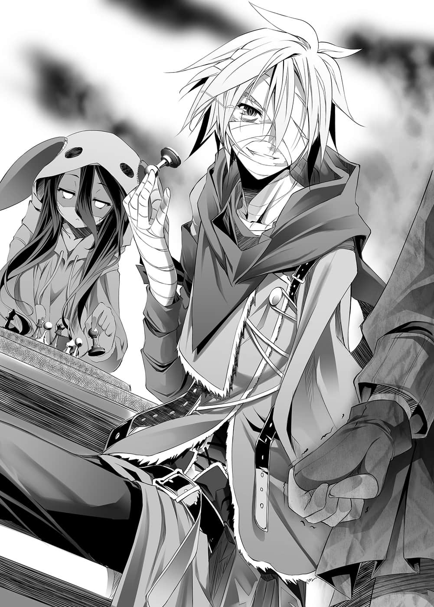
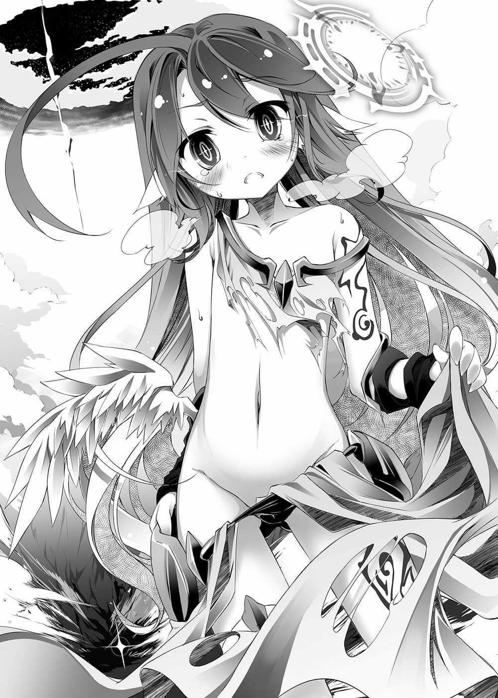

# 第四章 1÷2=无傍

> 来源：https://www.linovelib.com/novel/9/2086.html

——分散在世界各地的『幽灵』们，已经持续暗中活跃将近一年之久。

里克今天也眺望着秘密基地的战略图，与休比面对面地下着西洋棋……

一如预料，森精种拉拢了妖精种，和能与地精种航空舰队对抗的龙精种之间的契约数也增加了，将地精种视为共通假想敌的『森精种同盟』可说坚若盘石。

另一方面，地精种除了关系良好的巨人种之外，也拉拢了多数的幻想种，这是由于幽灵流出森精种制造出『杀幻想种武器』情报的结果，于是紧密坚固的『地精种同盟』就此诞生。

可是不能忘记还有个最强势力，那就是在相邻的大陆，拥有天翼种的阿尔特休阵营。

彼此藏有必杀兵器的两个同盟，面对眼前最大的威胁阿尔特休，只好暂收武器，握手缔结为『联合』。而对于『联合』，即便是最强神也不能轻易出手，战况于是演变为胶着状态。

妖魔种指望坐收渔利而移动，兽人种则是警戒着『髓爆』，移居至西方群岛。

世界处于一触即发的状态，为了警戒演变成世界末日，他们只能彼此对峙了——！！

——以上就是耍小聪明的强者呆子们，汲汲营营所堆砌起的盘面现状。

于是露西亚大陆滑稽地变成只有人类『看家』的情况。

准备进行顺利，做法各有巧妙，这个一个世代的大胜负——只剩下最后一步了。

————…………

「休比啊，以前我问过你，有没有游戏之神对吧？」

「……对……」

「概念是满足『活性条件』就会成为神灵种……那活性条件是什么呢？」

「……获得『神髓』……思念、祈祷的强度……无法严密定义……自然发生……？」

以前发问的时候，她是回答因为没有『神髓』所以不存在——

「其实我见过游戏之神——我这样说你相信吗？」

「……里克相信的话……休比也相信……」

一边认真下着棋子，休比一边继续说道：

那是当然的吧——所谓的唯一神，也就是支配包含神灵种在内的一切之力量。

里克慵懒地说完，触摸地图——盘面，然后以一副受不了的表情告诉她：

「克珑，我刚才有说神灵种是从哪里诞生的吗？」

「放心吧，克珑。再过不久，人类就可以不必恐惧死亡，能够到处居住了。」

「……将死……」

「——如果神有十个人的话，只要杀掉九个人，自己就是唯一神了——对吧？」

克珑翻阅着资料，报告现在的聚落——不，『人类』的状况。

因灵骸造成的皮肤灼伤还是无法痊愈，全身皮肤虽然受到污染，但也只是那样而已。

即使把主要的神灵种全杀光，要是又诞生出新的神灵种，并且超越自己的话，那就困扰了。

听到克珑有如恳求般的声音，里克没有办法，只好重新整理自己的身体状态。

里克的眼神就像是在说明一件打心底觉得无意义的事，他有如唾弃一般说道：

「……记得是唯一神的宝座对吧？」

满身疮痍。如同文字所示，正如字面意思的满身疮痍。

「那么至少你要告诉我吧……」

「好啦好啦，我已经听够了。话说是里克叫我来的吧……我可以报告了吗？」

所以唯一神的宝座——只要用『星杯』支配的话，那『唯一神』就诞生了。

「……那件事……先摆一边……」

「就算不做那种事，也可以令『星杯』显现的啊。」

「一切都很顺利，只要我和休比走到最后一步——我们就赢了。」

接下来是内脏……多亏休比，内脏好不容易才免于坏死的命运——没什么问题。

「诱导其他种族——甚至是神灵种，让他们从露西亚大陆消失，即使是现在我仍难以置信，我真的觉得很了不起——可是要让大战结束？再怎么样我也无法相信啊！！」

克珑这么说着，低下头，肩膀不住颤抖。

——克珑客气地出现，里克则是——

「——以『十』的力量，要做出『十一』以上的力量……对吧？」

克珑忍耐着，努力不将情绪表现在态度上——但是看到里克的模样，她再也忍不住了。

自从那之后，虽然已经无法再吃象样的餐点了，不过喝汤还是不成问题。

「唔啊～好想让别人听刚才的台词，让我炫耀我的老婆啊啊啊啊！！」

当里克和休比视线相对的时候，低着头的克珑，眼泪一滴滴地落在地上。

里克苦笑着抱住头，休比则是轻轻一笑。

「喔，你来得刚好，克珑，我跟你说哦，刚才——」

「…………」

「既然如此——！」

克珑脸上浮现泪水大叫，但是里克苦笑着回答：

「对，精灵回廊、万物的源流、万象的潮流，也都是从这个星球诞生的。」

「但是诞生得太多了。『星杯』是神灵种们为了将神——也就是能行使种族创造等级之魔法的存在，限定在一人身上而设定的『概念装置』。」

「不愧是克珑，答案正确。没错，就是这么令人傻眼的蠢事。」

「虽然难以相信——不过正如里克所说的，已经没有再接到其他种族的目击报告了。」

「——非常大不了！你啊——！」

————

但是『星杯』是——创出能够完全支配十人力量的力量。

——还没，单纯只是还没。

「————咦？」

她的脸色有些红润，那并不是错觉，休比语带犹豫地说道：

「……然后我们利用狼烟和斥候，探索露西亚北部，结果发现许多聚落。但是就算想与他们会合，合计也会到达接近八千人的人数，以现在的聚落无法收容——」

破坏其他神灵种的『神髓』，吸取在破坏之际产生的力量。

基本上，如果力量不足，是不可能的。

假设神灵种有十人，十人全员合力也只会有十人份的力量。

「你现在的状态让人不敢相信还活着喔！！以那样的身体出远门，会死掉的喔！！」

「可是神灵种要做出掌握全神灵种力量的『装置』是不可能的——对吧？」

「呃～抱歉，在听的人还比较难为情的对话中打扰，姐姐可以进去吗？」

「所以——只要这样做就好了。」

「……至今还没有一个人死亡就是奇迹了，可是大家都已经满身疮痍。」

「众神是为了追求什么而战——这个你知道吧？」

首先是——全身缠满绷带。

「还有就是……少了一只手，视力减退——应该说单目失明吧，没什么大不了。」

专注在与休比下的西洋棋上，里克这么回答，而克珑听了拳头不住颤抖。

「他……他们是笨蛋吗——他们是因为那种理由，发动这样的战争吗——！？」

「…………」

果然灵骸多少还是到达了血液里吧，骨头和呼吸器也有所损伤，不过那是轻伤罢了。

「……克珑，如果不信任你——如果不是你，我也不会把大家交给你。」

「这就是这场无聊至极的『大战』的真相。」

————…………

里克唐突地提起这件事，克珑反应慢了一瞬，然后回答道：

不知道理由的克珑，听到里克笑着说「我想也是」，她皱起眉头继续说道：

「——我求求你，里克，别再开玩笑了，你要认真为自己的身体着想——！」

总共一七九名的幽灵船团，确实还没有人死亡。

不理会惊讶得睁大双眼的克珑，里克将『黑色国王』放在手掌上玩弄。

——『除了生命以外』的一切——所以里克有如恳求般地说道：

克珑想要反驳，却被里克如冰一般的声音所打断。

「克珑……注意你的用词，那样说对笨蛋太失礼了，因为啊——」

「————那是当然的吧，因为那代表——」

借由那种做法，使自己的力量增幅——得到足以使『星杯』显现的力量。

「神灵种——是从星球中诞生出来的。」

「没错，唯一神的宝座——具体来说似乎就是叫做『星杯』的东西。」

——受到期望、祈祷，得到『神髓』而诞生——休比是这么说的。

没错，那一天，休比所说的话，归纳起来就是这么一回事。

克珑愤怒得肩头颤抖，有如唾弃一般地大叫，而在旁边——

仿佛补充里克的话一般，休比接着说道：

——终于能够原谅自己——这么说到一半，他又把话吞了回去。

「……里克，你别开玩笑了……你知道自己的状况吗……？」

「…………」

————啊啊啊啊啊可恶啊！

然而，毕竟神灵种只要受到祈愿，就会有相应的数量诞生。

说起在森精种的废都，听休比说过的事，里克站了起来。

…………

「——星球对吧？」

「其他『幽灵』也是类似状态，或者更严重。」

「我不会死啦，我还必须再活八九一年呢。」

仅仅只是为了一个诱导而舍弃左手，也有人为了瞒过妖魔种而吃死尸肉，甚至有人刻意被吸血种咬，借此来诱导对方——能利用的全都利用了。

明明是刚刚才听到的情报，但是克珑瞬间就理解了，以直接的表现说出。

「如果你要我当成没看见，那就告诉我！还是说——我就那么不被弟弟妹妹信赖吗！？」

「只要再一步就好了，克珑。请你当作没看见吧——如此一来大战就会结束，我就——」

「——我说游戏之神啊……你就不能让我赢个一次吗……」

运用毒药、灵骸感染、丧失四肢——『幽灵』们为了欺瞒其他种族，采取了各种手段。

「……里克将休比的预测……全部颠覆了……里克说有的话就有……如果里克说天空不是红色，那就不是红色的……休比不会再怀疑……」

「……被创造物……种族……神灵种的『神髓』……都是通过精灵回廊被创造出来。」

「对……也就是说——」

里克叹了一口气，回忆起想到这个方法的那一天——在森精种的废都听休比说明的那一天。

从休比那里听说了众神战争的元凶和『星杯』的事情，最先想到的事。

实在太过理所当然，为什么会没有人发觉呢？

里克说出连休比也为之惊讶，十分不言自明的结论。

「照一般逻辑来想的话，比起这颗星球的全神灵种——『星球本身起源』的『力量』应该更在其上吧。」

见到克珑惊讶地睁大双眼的样子——「所以说……」里克说道。

里克拿起『黑色国王』，走向地图——游戏盘。

将其配置在正中央，将他们这些『幽灵』的——胜利条件——

也就是——『最后一步棋』，清楚明白地说出口。

「——只要破坏游戏盘星球，『星杯』就会显现。」

——……

不理会目瞪口呆的克珑，里克与休比指着地板，继续说道：

「只要贯穿这颗星球的核心——精灵回廊的源潮流，放出的力量将会超越全神灵种的力量。」

「……显现是、十的负四十六次方秒……破坏，力量放出，显现后马上……」

「立刻——拿到『星杯』，重新构筑星球的话……」

里克与休比齐声对至今仍哑然无声的克珑说道：

「「……将死。」」

「可、可是，贯穿星球的力量要从哪里——」

「阿尔特休阵营和『联合』——他们不会让战况胶着。」

里克在克珑面前逞强，实际上的状态却全都如同克珑的指谪。

克珑再度目瞪口呆。

「…………可是……」

——意味着『决战世界末日』——那样的想像让克珑脸色苍白，里克却说道：

「目的是『星杯』——互相残杀的他们，近期之内一定会开战。」

——长久不曾使用的言语回路，休比勉强以演技的方式，这么开口说道。

——那是在永久的大战中，规模前所未有的战斗——

大概还睡不着吧，里克叫了休比一声。

天翼种——最终号个体『吉普莉尔』……

经由里克和休比——引以为傲的弟弟与妹妹——以及仅仅未满两百人之手。

「要让他们自己动手吗！？不是要让战况胶着——让所有势力的全面冲突才是你们的目的！？」

「……稍微休息一下……就没问题了……里克的话……一天就够了。」

而且——不杀死任何一个人，为了这个目的，只为了制造出这样的状况。

像这样露出自信笑容的里克——已经连呼吸都很辛苦了。

「……所以克珑，再给我一点时间，请你当作没看见吧。然后，人类就拜托你了。」

「…………对不起……里克……我马上回来。」

————所以——

里克还要再活八九一年，只要得到『星杯』，那就会成为单纯的事实。

「那么再拜托你一件事。今天我会睡觉，努力恢复身体——可以请你握着我的手吗？」

——不会吧、不会吧、不会吧、不会吧！？

——『幽灵』们赌上生命以外的全部收集而来，在那里所使用的兵器情报。

现在——放开了他的手。

「……里克现在躺着……扯不到后腿。」

——二十四个设置完毕，再设置八个『通行管制』就结束了。

「哎呀？到处晃着——竟然让我遇到意想不到的收获了呢♪」

即使如此，她知道——自己该做的事。就是不能让里克死掉。

然而，只有休比发觉——

---

■ ■ ■

「休比……抱歉，我扯后腿了。」

里克躺在床上痛苦挣扎，休比则在一旁照料。

「不过那样的火力——不会朝向任何人。」

不能回应里克那句话，让她感到非常心焦。

（……没问题……还剩八个……配置后马上就回去……里克，等我……）

即使如此，只是被休比握着手，里克就能安稳地入睡。

「……是啊……那么明天再去配置，今天就专心调养。」

——里克一声苦笑，但是就连那样都让他全身剧痛。

克珑大声叫道，不过里克却似乎很愉快地，微微浮现笑容。

「谢谢你来见我……还有……」

休比重新断定——没有带里克来是正确的。

然后里克露出最讽刺的笑容——用看起来甚至感到凶暴的笑容说道：

人类的话，无法起床是当然的——不，本来他还能起来就是异常了。

如果是在事情完成之后的话，她已经做好任由里克责骂的觉悟。

即使如此，万一被发现时，里克在的话，他当场丧命的机率非常高。

那样的均衡，只有不出手这个选项才会发挥效果。

「……里克……你还不能起来……」

只见反射光线的头发和琥珀色的眼眸，光所编织成的羽翼，以及天翼种的证明——几何学般的光圈。

————

失去皮肤、内脏、眼睛、手，却仍桀骜不逊地笑着的弟弟，克珑看到他的模样，肩膀不禁颤抖。不杀任何一人就结束战争——就为了那种事，不惜让自己变成这种模样——

「……嗯。」

「他们用他们自己的力量贯穿星球，破坏精灵回廊，而显现出来的『星杯』，则由我们夺走，这样就是——『胜利』。正因为没有人会死，所以结束后我想问那些神——」

没想到会有这么一天，需这样命令身为机凯种的自己——要镇定。

将全部数值化，经过计算后，依照休比所说，汇聚力量所需的『通行管制』是——三十二个。

「……不行……现在马上就要前去进行『通行管制』的配置才行……」

「……嗯，我会一直握着你，你就安心……休息吧……里克。」

「『喂喂，你们现在的心情怎样呀？』——这样。」

……灵骸侵蚀造成多么强烈的剧痛在折磨着里克呢。

「休比。」

「在我们准备的『决战舞台』，有我和休比设置的『通行管制』——用使力量的指向性弯曲的装置，将所有的力量朝向『正下方』——对，就像是望远镜的镜片一样。」

资料对照——压抑告知自己最坏情况的心情，休比表情平静地看向她。

「……没问题……里克的预测没错，不会马上开始攻击……」

那是为了能忍耐痛楚，这个意思休比早就知道了。

「——你好，废铁。今天一个人出来散步吗？」

但是对于『爱』这个感情——她还无法定义。

——尽管即便只是将灵骸涂抹在皮肤上造成的污染灼伤，原本就会招致相当的后遗症了。

「我真的很爱你……今后……也……」

她秘密行动的地方，是拥有现今世界最大力量的势力聚集处，正可说是『决战之地』。

「是啊……不过即使只是目前这个地步，也是没有休比就走不到的吧。」

「……谢谢你，如果没有休比在，是办不到这种事的。」

——所以，里克闭上眼睛说道。

——忽然头上传来声音，休比回头一看。

---

■ ■ ■

「【疑问】——天翼种找机凯种有何事？」

但是吉普莉尔却毫不在意地继续说道：

对机凯种而言，攻击是一种禁忌。要表现得只是个机械，只是个反击者——

——真的，这场永远的大战真的即将结束了。

或许是开始打起瞌睡了吧，里克的呼吸转为和缓，喃喃地说道：

克珑注意到视界内——挂在墙壁上的势力分布图。

她已经好几次感知到一旦被发现就会『死棋』的对手，也每次都彻底地躲藏起来。

「……还没……结束。」

她绝对不能让里克死掉，还剩八个——搜寻下一个座标——

「——咦？」

更何况连内脏都摄取进灵骸的里克，就算进食也无法得到足够的营养。

对于众神和其创造物，即使心里甚至想杀死他们——不，反而该说那样才是正常的吧。

里克虽然这么苦笑，不过——

——休比心想：休比——『喜欢』里克。

---

■ ■ ■

如今的休比同时也明白——那是牵制她，希望她不要一个人去。

「……嗯。」

相互保证毁灭——只要一方出手，就会造成两方毁灭所产生的胶着状态。

——我家老婆还是没变，总是若无其事地说出艰难无理的要求。

克珑终于从茫然自失的状态恢复，这么说完之后……

「对♪因为机凯种的首级，如今已是和龙精种并列的【稀有度５】喔♪」

吉普莉尔好像很困扰地扭动着身体，但仍继续说道：

「毕竟在击破『焉龙』之后，对机凯种出手是禁忌，就算在阿邦特・赫伊姆内，这也是统一的见解，稀有度更是因此不断上涨，如今已经是白金级的首级了！」

「【警告】断定为正当的认知。如果要与本机敌对，本机也将实行相应的应对。」

但是听到那句话，吉普莉尔扬起嘴角回答：

「——只靠『解析体』一机——是吗♪」

————————焦急的神情应该没有表现在脸上吧。

休比只担心这一点，而吉普莉尔则是自顾自地继续说下去。

「我确认过了，半径一百公里内没有机凯种的反应♪这么一来，以连结体为单位行动的机凯种，为何会单独出现呢？真是非常令人感兴趣呢♪而且——」

然后——脸上带着恶魔般的笑容，吉普莉尔继续说道：

「如果是『单独』的话，也就不能使用你们擅长的『模仿应对』。我判断这是得到稀有度超高的高～～价首级的好机会，你觉得如何呢？❤」

休比再度在心中想着——这是最糟糕的状况。

偏偏是被所有种族中最超脱常理的种族——甚至是在那之中更加超脱常识的最强个体发现，休比只能承认，真的就像里克所说，机率论毫无意义。

——第一张抽的牌，竟然偏偏是『鬼牌』。

「那么——我要砍下你的头了，请不要动哦。毕竟抵抗也没用，这样彼此都可以省下一番工夫嘛♪反正机凯种也没有『死』的概念——」

「…………我拒绝……」

「…………什么？是我听错了吗？」

——『死』——听到这个字，休比反射性地开口了。

里克所制定的【规则二】不可以让任何人死——自己绝不能死。

更何况『死』让休比联想到——再也无法见到里克的恐惧——让她拒绝了那个要求。

过去机凯种与之交战——夺走里克的故乡，对休比而言是忌讳的兵器。

她实在太不了解，眼前这个『超乎常理的种族中更加无常识者』。

只见吉普莉尔将手伸入空间——强行用蛮力拉开，将头探了过来。

然而休比完全没想过那样就能打倒对手。

立即判断——『速战速决』——除此之外没有胜算，休比做出这个结论。

「——哎呀？你要上哪儿去呢？」

「……最终劝告……」

靠着速战速决取得胜利，胜利条件只有一个——『逃亡』。

休比以等同瞬间移动的速度动作，但是——

——只要跳跃至不可能探知的距离，即便是吉普莉尔也无法追过来。

——『全方交差』——大多数生物都会因冲击和高度灵骸污染而死灭，但是吉普莉尔却是厌恶地捂着口，以有如拂去灰尘般的动作，切断了休比的防壁。

只不过『一方通行』能够跳跃的距离最多一百公里——同样的距离内，吉普莉尔说过没有机凯种的反应，所以无法预测她所能探知的极限距离。在跳跃后的地点再度迎击——

见到逼近而来的光芒，吉普莉尔瞪大了双眼，然后被光所灼烧——

与确认命中完全同时，休比启动最后的武装。

——只是那样的力量，规模就足以让小型都市消失了——

「好，请便，随你自由，结果是不会改变的喔♪」

强行将已被休比敲碎的空间再度——『撕裂』的事实，让休比定义了未知的感情，从原本的射击姿势，一屁股坐倒在地。

「……恳求你……希望你放我一马……」

「——『全方交差』——！」

破碎的空间破洞单向通行地包覆休比的身体，然后缓缓地关闭。

「呜嘿、呜嘿嘿嘿嘿～～连续的决斗，大家一定很羡慕吧！！」

「哎呀？机凯种是解析、模仿击破要因的种族——」

即便是龙精种，受到直接命中也不可能没事，那是足以改变星球的力量。

典开的全部武装，一齐将超高浓缩的精灵，以粒子的型态射出。

「你想从我手中逃走的话，不应该用长距离跳跃，应该要借着光与粉尘的掩护，移动到我的『视界外』，再进行跳跃才对啊……啊，还是说你该不会是——」

「真是给别人添麻烦……散播灵骸的兵器，真是不环保的机械呢……」

『全方交差』起动的同时，她再度以『制速违反』拉开距离，瞄准吉普莉尔。

所以——

另外，我方没有机凯种的最大武器「连结体」——支援机不在。

————休比的思考停止了。

---

■ ■ ■

交涉——如果是里克的话，一定能说服她吧，不该放开他的手的——但是——

一如预测，休比在内心如此断定。就算是天翼种，身为战神所编组的魔法，阻碍魔法的灵骸对天翼种来说，也会成为阻碍实体化维持的要因——！

「【读取】代码１６７３Ｂ７４３Ｅ１Ｆ２５５脚本Ｅ起动——【典开】——」

那样的个体，以自我崩坏为代价所放出的『崩哮』——就算只有四十三％——

「……你太小看我了呢……区区一个废铁……♪」

「有谁被你的笑话笑死了吗？真是非常特别呢❤」

「……我不想死……我不能死……即使如此你还是要杀的话——」

注视将光编成的剑实体化，似乎随时都会斩过来的吉普莉尔。

给予超高浓缩精灵指向性，使其挥发，借此得到超加速，挥发的精灵会喷出大量的蓝色『灵骸』，到处散播着污染——却又能轻易突破物理的防壁。

吉普莉尔惊讶得圆睁着双眼，休比继续说道：

做为应付天翼种或森精种所进行的空间转移对策，这是机凯种所设计的『空间破碎器』。

天翼种本身就是阿尔特休所编组出的一种魔法。

被那种攻击『直接命中』——竟然『毫发无伤』——

——但是休比没有发觉，她做了最坏的选择。

——考察敌我战力。

在破碎空间关闭前的——〇．〇〇〇〇四六秒——未满刹那的时间。

「——以为刚才的攻击能够对我造成损伤呢？」

有如嘲笑一般，有如玩弄一般——吉普莉尔挥落足以劈山裂石的光之刃。

——机率论没有『〇』。

休比在内心向里克道歉，地图又需要修正了。

见到吉普莉尔流着口水——发出致命的杀气，休比知道自己『失败』了。

「——『制速违反』——！」

「……你该不会以为这种程度就可以摆脱我吧？」

——机凯种单体要击破天翼种，原本就几乎不可能。

但是对于休比的宣战布告，吉普莉尔——带着就连神也嘲笑的表情回答：

使之『挥发』——瞬间，休比从吉普莉尔的视界消失了。

我——机凯种『解析体』，力量不满战斗力特化机体『战斗体』的三十二％。

休比在内心再度解答她的问题。

敌——天翼种吉普莉尔，战力未知数——假定是天翼种平均值的倍数。

正常生物——比如说只要触碰到，即使是森精种也会立即死亡的高浓度精灵粒子——

——我当然不可能那样认为。

能够使用的武装，由于处于连结解除状态，全二七四五一种之中，只有四七种。

切断蓝光冲击膜后，另一头却不见休比的身影，让吉普莉尔感到困惑。

那是天文学数字程度的低机率——就算发生奇迹成功击破，那种结果也违反了里克设定的【规则】。

休比一字一句……用毅然决然的语气说道。

「——赌上全部武装……战力、战术、战略……开始全力求生。」

靠着空间转移，吉普莉尔让距离本身跳跃，绕至休比的前头，嘲笑她。

——怎么可能——会有那种事————！

面对逼近而来，无法防御的光刃，休比将方才产生加速的超高浓缩精灵挥发——也就是说，将超越物理的力量，无指向性地挥发——成为『攻势防壁』。

「——『一方通行』——！」

但是即使在龙精种之中，焉龙也是包含在上位三只的【王】之一。

——『伪典・焉龙哮』的一击在命中吉普莉尔的同时——改变了地形。

瞬间，冲击与能量有如挖掘大地一般扩散。

重现焉龙的『崩哮』，休比拥有的最大火力，捕捉到吉普莉尔。

不可能，不可能不可能怎么可能——！

污秽世界的灵骸风暴从背后喷出——炮口喷出光芒。

确实，『伪典・焉龙哮』并不能完全重现亚兰雷夫『崩哮』的威力，四十三・七％的重现——这是『设计体』的报告。

「…………————」

因此称为防护魔法的自我维持术式——随时都是展开状态。

「不过你竟然让我展开了防护魔法，这一点值得赞许。」

算出胜率——绝无，但是——里克的话从思绪中闪过。

————

「……本机受到解除连结……废弃机……做为机凯种……没有价值。」

从地狱传来的声音，就像戴着笑容面具的脸——

「——【典开】——【伪典・焉龙哮】——！」

——定义——这是『恶梦』。

——听到吉普莉尔说的话，休比怀疑自己的听觉装置是否异常了。

那就是本来不能运用魔法的种族机凯种所驱使，机械式强横的『魔法』使用法。

典开所有能同时展开的武装——休比宣言道：

——我当然不可能那样认为。

蓝色的爆炸光芒在挖掘地壳的瞬间蒸发，红色气化的大地，引起小规模的地壳海啸，高达数千度的超高热土砂，瞬间被送上平流层……

「不过这种程度你以为能对我————————咦？」

大量杀死超高浓缩精灵，转化为灵骸——张开蓝色球状的粒子膜。

「什么……害怕死亡的机械！？而且机凯种竟然恳求！？除此之外还被解除连结——也就是说是个缺陷品吗！？这这这已经不止是【稀有度５】的价值了喔！！」

然而休比在内心回答她的问题。

「……我不想死……我不能……死……」

正因为如此，休比才计算出用『伪典・焉龙哮』可以贯穿。可是这个天翼种，不——

再定义——这个个体已经不该再算在『天翼种』的范畴。

这个『例外』——吉普莉尔。

竟然『怀疑』创造主所形成的防护——展开了更加强力的防护。

那不是天翼种的行动。不可能，这个个体——已经无法预测——

「为了把首级带回去，刚才我一直『尽全力』手下留情——不过我改变主意了。」

————

这个『例外』刚才说什么？她说她一直手下留情？

「虽然不知道你是否有称得上脑的部分……」

那个『例外』对着目瞪口呆的休比，宛如捏起裙子行礼一样，优雅地捏着衣带，露出有如铃铛般，有如天使般，却又像是恶魔般的表情。

「你好像太过得意忘形了，我来让你稍微冷却一下吧——永远地冷却。」

——接下来认知到的事，就是右手被消灭了。

---

■ ■ ■

——订正，那种说法也不正确。

解析体——机凯种中特别对认知性能做强化的机体，却在完全无法认知的情况下，只是确认到『右手消失』这个损害报告就已经是极限了。

连对方对自己做了什么都无法掌握，就被夺走了战斗力，不过——

「……哎呀，我是瞄准身体的呀——是我手滑了吗？」

这就是里克——人类说的『直觉』吗？

事后她才自觉，刚才无视逻辑，瞬间采取的回避行动，让她辛苦地躲过『严重损害』的结果。

「…………为什么呢？我有种奇妙的心情……」

休比自是无从得知，吉普莉尔却有一种奇妙的确信感。

思及里克，这是最差劲的手段。

【贵机很矛盾，有缺陷，即使如此仍然运作着。那是异常，违反规定。】

这个事实让思考回路产生有如冰冻一般的错觉——但是更重要的是——

死亡的脚步声接近，休比仍有如咆哮一般地通信。

——瞬间，原本解除的连结——她感觉到与连结体再次连接了。

…………————

除此之外，休比想不到抵销自己的失误，让里克『获胜』的方法。

抬起头，映在视界内的是逼近的死亡——吉普莉尔，以及——

【……我知道。】

里克——丈夫——他的同伴，那些『幽灵』们。

从他的回答，休比感到有效果了，休比心想——他一定会明白的。

无法认同。她绝对——不能认同。

那是当然的——因为是『心』的同步。

【拒绝申请驳回！强烈申请资料同步传送至『全连结体指挥爱因兹希』！『解析体』对爱因兹希的任何报告，尤巴・爱因㊟，贵机应该没有拒绝传送的权力！】

【再度申请！『心』的解析完毕，没有时间——请准许『同步』——准许再连结！】

怀着甚至带有质量的杀意说出的这句话——休比听了也能理解。

『这是只属于休比的感情』呀——！那样的感情——！

休比摇摇头，即使如此，现在那是必要的——自己是那样决定的吧。

【……其实我并不想交给任何人！……这份感情……是属于休比的。】

机凯种所拥有的——二七四五一个武装的典开网路被解除了。

机率论不存在『〇』，休比相信里克，赌上涅盘寂静的胜率与之交战、企图逃走。

【——状况把握，Üc207Pr4f57t9——准许无限制使用机凯种拥有的全部武装。】

那么——

单机与之对峙，却仍在运作的事实，让全机都有异常警报大响的感觉。

【判断贵机『符合特例』，资料同步——开始。】

尤巴・爱因不懂，全毁和死亡在概念上有什么差异，不过——

（……我不想死……我好害怕死掉喔……里克。）

——这种时候，如果是人类的话——如果是有灵魂的生命，应该会这么说吧。

「……这份思念、心……生为机械……得到的生命，这一切全部——」

将机凯种拥有的全部武装、全部火力、全部装置，同时典开至极限。

「我有不好的预感，差不多该让你像个铁屑一样，无声无息地埋在地下了。」

【……你就不能说……『不准死』吗……？】

——即使如此——她还是需要『胜利』。

再也见不到里克了。

将不可能变为可能，这无可争辩的事实。

「——【全 典 开】——！」

休比苦笑着回答。

但是休比『焦躁』地有如喊叫一般，仍然持续通信。

【Üc207Pr4f57t9，贵机处于永久性解除连结处分状态，申请驳回。】

因为那个异常正是——名为『惊愕』的一种感情。

他们焚烧皮肤，灼烧内脏，赌上一切追求的——那唯一的胜利。

【使用各种武装、火力战斗，在同步完毕之前禁止『全毁』。】

她为何单独行动呢？到底是以何种方式撑过自己的攻击呢——

【Üc207Pr4f57t9，贵机果然损坏了。】

——赌在这二五一秒——！！

本来身为机凯种的感觉——连结体。复数结合为一的群体、思考。

但是事情到了这个地步，已经不是机率论如何的问题了。

——那么要怎么做？

【…………咦？】

即使如此——这是招致必败状况的自己——唯一能找出的胜利道路——

这么说着，吉普莉尔也——张开有如放射出光芒的巨大羽翼——笑了出来。

【个体识别号码Üc207Pr4f57t9——向『Ü连结体第一指挥体』申请再连结。】

吉普莉尔——眼神诉说着下次不会偏离，并再度压缩光芒中。

应该是理性集合体的休比，明确地承认：

脑海闪过里克的脸，休比悲伤地笑了——这是『游戏』。

——我喜欢里克，不想和里克分开，里克给了我满满的『心异常』。

这么一想，休比摇了摇头，想通了。

——令人感觉像是永远的短暂间隔后——通信有了回应。

休比反驳连结体的『指挥体』——最后甚至驳倒对方——却没有回应。

——最后休比想到一个『手段』。

再连结之后，如今休比所属的尤巴连结体全机都把握了状况。

从这个状况——要『胜利』应该怎么做——她以仿佛时间也已静止的速度思考。

(译注：爱因是德文的数字１。)

事隔数年——与包含自己在内的四三七机共有感觉——那种感触回来了。

里克给她满满的思念、心情、感情、记忆。

【判断贵机是贵重的样本资料。】

如今那种感觉——脑里的一切被人毫不客气地偷窥的感觉，让她感到非常不舒服。

（…………竟然因为休比犯的错……而『败北』……）

——没有回应。

我本来决定绝不交给任何人，因为——『人家会害羞』嘛……

【因此——】

展开由只为了杀害与破坏而制造的道具，所交织成愚蠢的——巨大的钢铁羽翼。

【————】

在限制时间内还活着就是胜利，死了就是败北。这是里克……最讨厌的『游戏』。

不是吗？照逻辑思考，即便除却对手是『例外』这件事，『解析体』单机能够和天翼种战斗，这个状况本身——就是不可能吧？

——《距离同步结束尚余——四分十一秒》的文字。

【同步结束之前『不准死』，这是命令，不容许拒绝，完毕。】

【另外，同步完毕之前，会造成贵机损坏的相关行动皆——】

——正在对峙的敌人，是天翼种最强个体——吉普莉尔。

四分十一秒，也就是二五一秒，要在死亡化身的吉普莉尔的攻击下生存下去。

「——哎呀，你是想讽刺我吗？……很好❤」

天翼种『例外个体』吉普莉尔，她的战斗力仍是未知数。

「所以……你别啰里啰嗦的！把这份思念——继承下去啦！！」

仿佛要被自我厌恶感压垮的最坏的想法。

对于那样的反应，让休比期待同步完毕而笑了出来。

虽然非常好奇——但吉普莉尔用休比也明白的低沉声音说道：

是不是有什么地方搞错了呢？无论是怎样的资料，同步也从未花费超过三秒以上——

禁止——正准备这样接下去的通信，把握住现状——停下了话。

比起任何武装、兵器、情报，都要来得更加——更加更加『沉重』。

以这个『例外』为对手——不管是要逃走，甚至是生存，就算驱使任何逻辑、谬论，那都已是不可能的事。原因无他，因为就连命名为『直觉』的非逻辑思考也都这么断定。

【——尤巴・爱因……不对，订正……你这个顽固家伙！】

『通信』——呼叫过去对自己进行废弃处分的机凯种『连结体』。

——因为除此之外，没有别的方法了。

——然而这就是现实。从里克那里得到的『心』所展现出的——

【……这个我、也很清楚。】

休比甚至忘了自己是在通信，发出声音喊了出来。

——但是——即使如此，休比挥去那样的思考。

【……我现在说……我要交出去！这个意义你还不懂吗……笨蛋！！】

——平凡的机凯种，而且是一机『解析体』，竟然撑过自己的攻击。

即使使用机凯种的全部武装，仍然断定不可能单独击破。

可能生存之界限时间——无法推定。

——不过休比点点头，没有问题。

「——【构筑】……对未知用战斗演算——起动。」

休比这么说着，构筑出来的东西，可以感受到连结体正因异常而呻吟。

休比心想——有什么好吃惊？敌人是未知的话，那就连预想不到的一切也一起预想就好了。

不要想去理解，不要想去计算，相信感觉而行动——只是如此而已。

从眼前的『死亡』存活二五一秒。

逻辑问道——办得到吗？

感情回答——那还用说？

人类在更恶劣的条件——存活了接近永远的时间。

事到如今，不过是四分或五分钟，根本不算什么——！！

「……『休比』……」

「什么？」

「还没有……报上名字……」

——那就是『我』……是里克给我的，万分宝贵的——名字我。

吉普莉尔瞬间诧异了一下，随即微微点头示意，回应她。

「是吗？我是吉普莉尔，请多指教，然后——」

「再见了。」

---

■ ■ ■

站在天地异变肆虐过的大地上。

休比想——为什么会变成这样呢？

呼唤对方无法听见的丈夫的名字。

因为她想起来，有一句一次都没有说出口的话。

无法完全闪躲吉普莉尔的攻击，右腹部消失了。

——别站在对方的舞台，绝对别把主导权交给对方。

如果是里克的话，大概——不，绝对能够连这个天翼种吉普莉尔都骗过，成功回避战斗——休比能够确信。

然而——满身疮痍的休比只是看着显示在视界内的数字而已。

左手的——无名指上——

——不过她也知道里克无法拒绝。

她确实已经不能动，这样动作就被完全封住了。

那样的自大招致了这个结果——果然里克是正确的。

「————？」

不是机凯种的兵器使用的浓缩精灵可比。

休比露出悔恨、悲伤的表情。

连结体的机凯种们已经无法理解，只是连连呼喊『异常』。

明知那样对里克来说是多么痛苦的事。

既无法反应，也无法感知，在吉普莉尔狂风暴雨的攻势中——休比勉强地站立着。

声音输出器早已损坏，声音也发不出来。

吉普莉尔再度射出光波，这次眼看就要命中左手。

她保住了那只微微发光的戒指……

【同、步……完、毕。】

——『例外』吉普莉尔——果然还是无法抗衡……

无法反应的攻击，事先预测就好。连预测也不能的话，加以诱导就好——

逼近而来的吉普莉尔的天击，感觉非常地缓慢。

休比以难以置信的反应速度典开『通行管制』，偏移的光波没打中左手——而是贯穿了胸部。

————

休比的动作超越极限，关节处电浆化，发出白光而融解。

【Üc207Pr4f57t9更正——『「遗志体」休比』……】

——让对方警戒，让对方产生错觉，以为自己是不能大意的对手。

就这样在千钧一发之际闪躲、挡格、抵消——吉普莉尔超越惊叹，愤怒得身子颤抖。

或许是受到头上卷动的庞大力量影响吧，夹杂着杂音——通信如此告知。

【再来就交给『我们』，准许你休息——祝你有个好梦。】

听到了吉普莉尔的说话声，但是休比则是心不在焉地问道——

如今——因为她明确地了解那句话的意思了。

不过将『禁止进入』的全部输出集中在『半径十二公厘』的话——应该就能护住。

感知到思考的异常加速——这就是人类所说的跑马灯吧。

——《七十二秒》

不过光是噗通一声——其声音本身就产生宛如攻击一般的精灵胎动。

区区机凯种的一机『解析体』，却无法破坏，吉普莉尔怒火中烧地喃喃说道。

没什么，原因很单纯。

发光的精灵——在吉普莉尔的双手，出现摇晃不已的不定形『长枪』。

他不可能听见，即使如此休比还是非说不可。

她驱使机凯种的全部武装，以及向人类学到的一切，拼死地挣扎着。

和里克牵着手时，明明就连一小时也感觉像一瞬间——

他说过要我永远待在他的身边，自己就算一秒钟也不该离开里克的……

（……里克……休比……没有里克……果然还是什么也办不到……）

加速的思考立刻提示了答案。

「——总算犯了像是失误的失误了……真是耗费我一番工夫呢。」

里克给她的『心』，宣告着不合理且不讲理的绝对力量正在降落。

——别预测对手，只要加以诱导，结果自然就能预料——

——然而自己却认为一个人也可以设置『通行管制』，不需要让里克遭遇危险。

「您是必须在这里确实排除的『威胁』——我认同您值得称为『敌人』。」

——『天击』降落之中，休比望向吉普莉尔的脸——然后笑了。

但是，移动视线，休比露出微笑。

看到她的样子，吉普莉尔感觉到什么了呢——休比自然不可能知道。

（……里克……现在一秒……感觉就像永远……）

——都无法当一个——『好妻子』……

——《五十一秒》

「……是这样吗——对于称呼你铁屑之事，我要向你『道歉』。」

原本显示在视界内的数字——如今显示着《同步完毕》。

明明自己也十分清楚他无法拒绝。

不知不觉间——回过神来。

——这个『游戏』——是休比胜利了……

（……里克……为什么呢……）

「……失误……？……什么失误？」

从大气、星球，强制榨取的精灵——逐渐压缩浓缩凝缩。

「……休比……终于懂了……」

机凯种也有『天击』的模仿兵器，休比也不是第一次目击。

画出复杂巨大的光圈，吉普莉尔张开双手说道——

「……里克……里克……」

受到直接命中——这副身体和思考在毫秒后，都将从这个世上消失——

（……对不起……里克……即使这样，我还是留下……最后一步了……）

——要防御那个『天击』是不可能的。

对于她表情的违和感，吉普莉尔皱起眉头，不过休比无视吉普莉尔，发出最后的声音。

正如吉普莉尔的宣言，自己将会变成沉默的铁屑……那是无法颠覆的事实。

为什么要放开里克的手呢，明明决定不再怀疑他了。

——即使如此——

「……下次……一定不会再离开你了……」

那与资料上、知识上的『天击』——等级实在相差太多。

「——！？【典开】——『通行管制』！」

……只有里克送她的这枚戒指……

「…………我不能死——我还……不能死……啊——！」

她知道里克绝对不会认同。

「——【典开】——『禁止进入』————！！」

——对不起，克珑姐姐——休比——直到最后——

「……休比能遇见里克——真的……很幸福……」

休比毫无反抗之力地躺在地上，在她头上的高空——

——《二十四秒》

没有怀疑的余地，天翼种将体内所有构造，全部变质为精灵回廊连接神经，从精灵回廊的源潮流汲取力量击出——如文字所示，这是天翼种最大最强的一击。

…………但是为什么呢？

——……啊啊。

然而吉普莉尔的天击——漩涡般卷动的力量。

——让对方轻忽大意，让对方理解自己是微不足道的对手。

————『天击』——

「…………区区人偶，竟敢耍弄我到这种地步——好大的胆子。」

「……我真的……好爱你……哦——————─…………

---

■ ■ ■

在山峰——甚至在覆盖粉尘的天空都开出了一个洞的『天击』停止了。

「……呼……呼……………啊——！」

力量使用过度，由于精灵的不足而无法维持形状——变成年幼孩童的模样。

吉普莉尔看着已经不留痕迹的『敌人』原本所在之处，气喘吁吁地降落。

「……啊啊～……真是……这样一点也划不来呀……」

——本来是因为想要单独行动的机凯种的首级，而开始的战斗。

由于对方那特异的行动方式，让自己对首级的欲望更加强烈——最后还使出『天击』。

吉普莉尔叹气，她自己也觉得意义不明——本能告知那个机械是该消灭的『敌人』。

但是恢复冷静后一看——又如何呢？

「……没得到首级，零件也全部灰飞烟灭，而且自己还变成这副模样……」

这么说完，看着缩小成年幼孩童模样的自己，吉普莉尔深深叹了一口气。

什么也没得到，失去全部的力量，最少五年无法正常行动——这就是结果。

「唉……只有向阿兹莉尔前辈报告，有一个奇妙的机凯种吧——即便是那个头脑简单的笨蛋，要是能体会我之所以使出『天击』的意义就好了……」

但是——再度看着像孩子般缩小版的自己，吉普莉尔沉痛地喃喃说道：

「用这副模样站在前辈面前……她一定不会放开我吧……」

小小的天翼种，疲惫不堪地拍打着翅膀，飞向天空的彼端。

——没有发现，那小小的，实在太过微小的银色戒指的光辉——……

---

■ ■ ■

游戏结束，休比死了。

接到『幽灵』的通知，里克装出坚强的模样，回到房间就已是极限。

少年绝对不会回答，但里克仍然刻意询问。

——如果阿尔特休阵营先发动攻击，那会是如何呢？

如果有人看到的话，只会认为他终于疯了。里克对着虚空，对着坐在对面的少年——游戏之神大声怒吼。

所以那样的结果会是阿尔特休阵营与『联合』——双方毁灭。

更不用说失去的是休比——

「为什么赢不了呢……！」

竟然把妻子——休比称为道具，胆子够大，我很欣赏。

没错，在违反的时点，这个游戏就已结束——他又输了。

「赌上人类的一切！失去了休比！只不过换得十年短暂虚假的和平，那样值得称为胜利！？在那之后呢！？又是恐惧死亡的世界啊！你还没睡醒吗！！那样甚至连平手都算不上——天秤的另一边怎样都不划算啊！」

「……什、么？」

「喂，你在那里吧，虽然不知道你是谁，回答我啊——算我求你了…………」

就算被怀疑精神不正常，但是的确看得到那也没办法——果然那里就像以前一样，有一名面露得意笑容的少年——休比说她相信的游戏之神。

也就是说，阿尔特休阵营先发动攻击的话，这场战争就没有『胜利』。

——没有回答。

但是这『原本就一如预料』——其中一方一定会先发动攻击。

——他漠然地整理状况。

「——『意志者』里克。」

————…………

里克将身体靠在椅背上，全身力量放松，就这样……像是睡着一般……

「…………」

一边下着棋，一边看着正面的空位。

「拜托你了……一次，就连让我胜利一次都不行吗？既然如此——」

快要坠落的意识——连同灵魂也要坠落的时候，就在千钧一发之际有人叫住了他。

「…………」

听到令人怀念，却是不曾听过——有点像是机械的声音，里克缓慢地转头看去。

「——我是来达成『遗志体』休比所托付的遗志。」

是啊，没错……既然休比死了，那就可以了吧？

让所有种族彼此警戒，『阿尔特休阵营』对抗『其他』——的构造是成功了。

——十年的和平，这样不是足够了吗？算是很好的结果了不是吗？

然后刀锋一转，这次会是地精种和森精种相互攻击——直到彼此灭亡为止。

「我缺少了什么呢……告诉我吧——！喂，你在吧！？」

『……不让你死……里克要活到……休比死为止……』

机械的身体——不是休比的——机凯种。

如果休比在，即使在这样的世界也能活下去。

一七九名『幽灵』赌上他们的一切，舍弃了性命以外的全部——而且，还失去休比，所得到的成果，就算乐观估计，最多也仅仅十年的胶着。

——以普通人类之身，面对神这个对手，让他们停止战争十年喔！

「喂……为什么赢不了呢……」

里克苦笑着认同——是啊，没错，全身好痛。

他是从哪里进来的？从何时开始站在那里的呢？一个黑色，如影子般穿着长袍的人站在那个地方。

但是如今却找不出任何意义，里克只是用一身伤疲的身体大叫。

——不过『联合』是被这样误导的，实际情况并非如此。

「……我没有名字，但就照我被他人所称呼的那样——叫我『全连结指挥体爱因兹希』吧。」

因为不用问也知道，从长袍的缝隙露出的部分，如实诉说着他的来历。

——【规则六】违反上述的一切均视为败北。

——如果是『联合』发动攻击，在『森精种同盟』和『地精种同盟』找到使彼此的『王牌』——『虚空第零加护』和『髓爆』无效化的手段之前，战况将会胶着。

里克接过他递来之物——顿时整个人愣住。

那是谁的声音呢？或者是自己内心在找借口吧？

里克失望沮丧，疯狂大叫之后，有如倒下一般，将身体靠在椅背上，然后眺望战略图。

……

——休比所憧憬，帮他打开的『心』。

里克仍茫然若失，机凯种的男人——爱因兹希平淡地告知。

「既然如此为什么——要给人类我『心』呢！！」

估计再长也是十年以内将会开始全面攻击，阿尔特休阵营将会是败方吧。

「——……你在说笑吗？」

「虽然不知是哪里的神创造了人类！如果要在这种世界一直输一直输不断地输，一味地持续被杀和失去的话——那么为什么要有心呢？回答我啊啊！！」

结果一次也赢不了的人生——我已经累了。

不管是哪个都没关系，里克仿佛撕裂喉咙般——怒吼。

少年不回答，只是——敛起笑容，似乎是低下了头。

那是小小的金属圈。尽管脏污、扭曲——但毫无疑问是休比的戒指——

阿尔特休的『神击』——规模足以诱发全部势力的所有火力。

——这样不是够了吗？已经非常足够了吧，反而可以说做得太好了。

「——『意志者』里克尚未败北。」

——忽然，里克想起休比所说的话。

这次则变成阿尔特休阵营占优势——因为他们有『神击』。不过『联合』也不会采取被『神击』一击全灭的阵形，而且力量耗尽的阿尔特休会有一时性的衰弱——到时将会变成以阿邦特・赫伊姆的力量战斗，而那就是『联合』的目的。

——是啊，没错，我承认——我又输了。

「…………你是谁？」

休比和克珑都不在身边，游戏也结束了。

只有寂静回应，直到刚才还看得见的少年也不在了——

那么——已经没有逞强的必要了吧。

……却被他抢先了。机凯种的男人——爱因兹希这么说着，将手伸了出来。

————瞬间，里克举起拳头，想要往他的脸上揍去。

管你是机凯种还是什么，我才不管，只有这个家伙——！！

「——『意志者』规定的『规则』并未包含不认同道具损失之意。」

他拖着摇摇晃晃的身体，仿佛恳求一般大叫——

受到灵骸污染的皮肤，不间断地传来剧痛，他已经记不起最后一次熟睡是在何时。即使只是喝水，喉咙也有如在灼烧。狭小的视界则是一旦松懈，就会这样永远闭上。

就像遥远的过去，自己还是孩子时做的事情一般，玩着绝对赢不了的游戏——

——不是问『什么人』。

「……哈哈，我真的不行了吧……」

有什么事吗——里克警戒着正想这么问……

「原本以为这次一定可以赢了……和休比两人——和大家一起的话，我想就能够赢了。」

即便阿邦特・赫伊姆是强力的幻想种，『虚空第零加护』是杀幻想种专用，『髓爆』是杀神灵种专用，一旦阿尔特休阵营先发动攻击，阿尔特休就不会胜利。

打从一开始他也没有期待着回答，本来就是残破不堪的身体了。

——『十年』，对，就是『十年』。

和休比说话，看到她的脸，握着她的手，这样的剧痛也能忘记。

————你不觉得那已经值得称为『胜利』——

忽地，里克似乎听到有人在说话的声音。

——【规则二】不可以让任何人死。

最长——『十年』……战争就会停止。

坐在对面是空位的桌子旁，一个人下着与休比玩过无数次的西洋棋。

就这样高举握紧的拳头——手中的感触，却让他的身体为之冻结。

爱因兹希说过，那是受托付的遗志。

托付给里克的戒指，有如雄辩般诉说着遗志的内容。

——『就那样想吧』，只要那样想——

「只要那样想——因休比的失败而输掉的事实就会消失？」

……………………别开玩笑了。

说完这句话后，里克只是低着头，这时爱因兹希告诉他。

「——传话『将军……里克……剩下就拜托了——』——以上。」

「……只有那样吗？」

「——————————是的。」

里克苦笑着移动视线，忽地又看到坐在空位上的少年。

少年的嘴动了——『游戏还没结束喔』——

「哈哈……太过分了，休比……这种对待实在太过分了……」

干笑着仰望天花板，里克像在忍受着什么似地喃喃说道。

——啊啊，我果然还是讨厌『心』啦，休比。

你为什么会憧憬这种东西呢……

……偏偏把这种任务托付给我吗——

差点就要这么抱怨出声，里克勉强吞了下去。

然后紧握戒指——咏唱长久以来已忘记的咒文。

如果那就是休比的『遗志』……休比发自『心』中的愿望。

所以里克刻意——将休比为他破坏的那道锁。

最后再一次——紧紧地锁上。

身为丈夫只有相信她并且回应了吧……就算那会痛苦得令人崩溃。

————、——喀锵。

——因为托付那个愿望的休比，应该感到更甚于自己的自我厌恶感。

如果休比说过，那就是唯一挽回这个劣势的方法——
