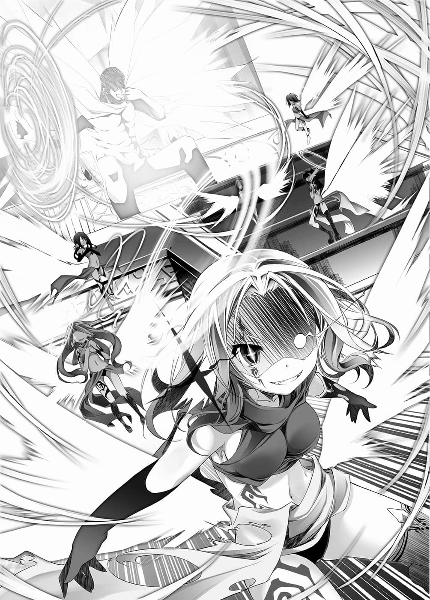
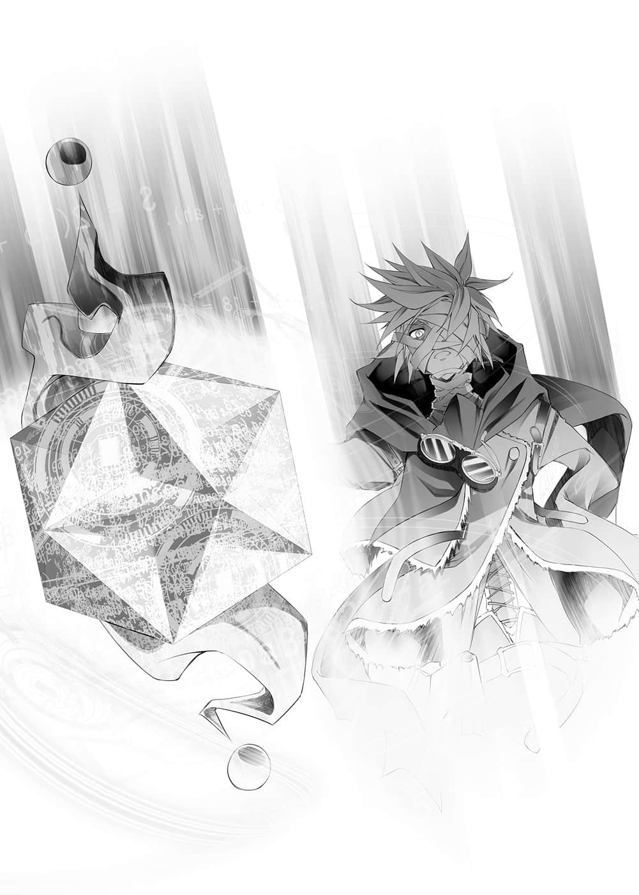
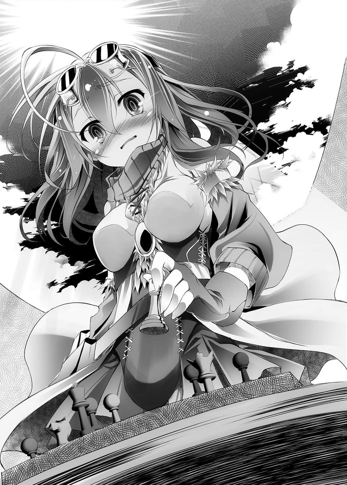

# 第五章 1÷0=梦恋

> 来源：https://www.linovelib.com/novel/9/2087.html

「喵哈～小吉真是爱操心呢喵～♪」

这么笑着的天翼种的长姐——第一号个体・阿兹莉尔有如跳跃似地飞着。

「小吉动不动就生气呢……不过！她就是那一点可爱呀～❤变小的小吉又更可爱了喵～……唉……修复术式好讨厌喵。」

阿兹莉尔对号外个体——现在的么妹吉普莉尔特别疼爱。

无法预料她的行动，超出常识，自由奔放的吉普莉尔，单独出去却是连龙精种都讨伐了回来。她特立独行的目的和理由，大家都摸不着头绪。

不过那也是主人给予的『不完全性』之故，因此更令阿兹莉尔特别疼爱。

——不过吉普莉尔本人似乎对她打心底觉得厌烦。

将天翼种拥有的庞大力量，全部集中在仅仅一击所放出的——『天击』。

使用了那个，以小孩容貌回来的吉普莉尔，被阿兹莉尔用脸颊磨蹭了一个礼拜。吉普莉尔终于忍受不了，要求使用修复术式——回复丧失的力量，目前则是机能停止中。

老实说，阿兹莉尔认为自然回复——等个五十年也不错就是了——

————…………

回到玉座之厅，阿兹莉尔迭起翅膀，收起光轮，缓缓地跪下。

「『号外个体』怎么样了？」

安坐在至高宝座上的是，露出如岩石般强壮肌肉的男人——

他是最强的神，同时也是战神，天翼种的创造主——神灵种阿尔特休。

巨大的身躯大概有天翼种的一倍大，有如钢铁般强韧的黑胡须垂下，背上负着的十八只翅膀就像披风般缠绕在身上。轮廓深刻的面貌，被那锐利且濡湿的黄金目光俯视，只是那样，阿兹莉尔就感到大脑也为之麻痹。

不过阿兹莉尔知道，就连令人难以不感到恐惧和恍惚的那个伟岸外貌，都只是自己的创造主的一小部分，沧海一粟，强大力量的些微体现而已。

「她与单独行动中的机凯种交战，由于使用『天击』的损耗，正接受修复术式中，我的主人。」

阿兹莉尔有如祈祷般恭敬地报告，但是老实说其内容完全让人不明所以。

只不过是爬在地上的铁屑——聚集起来顶多会变成多少有点碍眼的灰尘而已。

在场众多天翼种也传出小小的悲鸣声。

只是如此——仅仅只是如此，就令阿邦特・赫伊姆为之颤抖，空间、时间也为之震撼。

把那群不知主人厉害的愚昧之辈——

关于主人的忧郁，阿兹莉尔只知道理由为何——主人是战争之神。

【——全『战斗体』，『伪典・天击』——【典开】——】

说完，主人的表情一转，敛去笑容，以冷静的眼神俯视着下界——而事情就发生在那个时候。

「原来如此，能够与身为最强的我对峙之人，当然必须是最弱才行——是吧，『猴子』？」

弱者若是卖弄小聪明，那么强者、王、神、主人该做的是什么——？

「就快了——看来终于出现想要杀我的人了。」

「主人是最强的——在这天地之间举世无双！那么！！面对弱者卖弄小聪明的愚策有什么好惧怕！有什么好犹豫！有什么好困惑呢！！」

因此——主人才会长久以来都消沉在倦怠感之中。

看到天翼种们解放那汹涌力量的模样，主人露出满足的笑容。

是神的洞察力吗？或者是战神的权能呢？宛如——不，事实上主人似乎掌握了一切。

在与联合交战时，让阿尔特休射出神击，借此模仿、重现，那就是机凯种的目的。

呼应阿兹莉尔说的话，天翼种们将力量一同灌注在翅膀上。

「那又如何？」

聚集在玉座之厅的天翼种们一团混乱，手忙脚乱。

「这个地上无人能与吾主抗衡。」

将其力量的一部分——全天翼种的『天击』汇聚后释放，那是无与伦比、万神皆要臣服的一击。

憎恶吧，愤怒吧，叛逆吧，赌上脆弱的生命，用尽一切智慧，愚蠢地挑战吧。

「不、不清楚！阿邦特・赫伊姆内没有任何反应——」

「机凯种？『你在说哪件事』？」

「——这样啊，哈哈，是这样啊——」

仿佛推测得知某事一般，主人别有含意地笑了，不管是吉普莉尔的真意，还是主人的神意，阿兹莉尔都不明白。

单独行动，做出奇妙的动作，让吉普莉尔连『天击』都用上——

如今他心情愉快的模样，却是连旁人也看得出来。

但是果然仍是如往常一般，主人——并不多说。

说起来卑微的自己，妄想推测深渊般的主人，神的心意，那实在是大不敬之罪。

这个行动将会带来何种效果？这会被视为是我方先发动攻击——引起全面冲突。

---

■ ■ ■

主人这么说着，高高举起他的右手。

主人是最强的王，自己这些天翼种则是他的仆人。

那道声音，在那道大笑声响起的同时，全部的天翼种都静了下来。

因此主人会亲上战场，唤起杀意。

主人不说话。但是他凶猛的笑容中所充斥着的神意，则是由阿兹莉尔为他发声。

「全天翼种——准备『天击』——将一切托付给阿尔特休大人！」

---

■ ■ ■

「机械、森精、地精和龙杂鱼们，在我面前敢妄称神名的蠢货们——这些都没什么。」

主人是绝对，主人是最强。所谓的强者即是主人，弱者即是——主人以外全部的人。

主人持续发出震撼阿邦特・赫伊姆的笑声，阿兹莉尔战战兢兢地说道：

——不，她对自己的傲慢感到可耻。

「呀哈～竟敢做这种小看人的举动，铁屑……！！」

将阿兹莉尔的指示全部取消的这一句话，代表的意思只有一个。

……但是，单方面的虐杀——不能称之为『战争』。

有的人展开探知魔法，有的人使用空间转移，飞到外面的空中。

将对他们出手列为禁忌的是阿兹莉尔自己，不过那并不是因为感到威胁，单纯是主人所赐予的力量受到低劣的模仿，她非常看不过去而已。

「什什什么啊啊啊！？刚才是谁射了『天击』呀！？」

听到那句话，阿兹莉尔倒抽了一口气，「怎么可能？」她皱起眉头回应。

「哈哈哈！是吗？要杀我的人就是『你』啊，来得意外得早呢，哈哈哈！！！」

和前一刻的阿兹莉尔相同，担忧机凯种会模仿的人还在犹豫的时候——

那是位于浮游在天空中的幻想种阿邦特・赫伊姆的后方近处。

【了解。】

从阿邦特・赫伊姆的『背后』——击向『联合』。

尽管只有一瞬间，自己竟忘了那种事，阿兹莉尔对此感到羞耻，于是大声喊道：

至高——主人身为『战争』这个概念的化身，没有人是主人的对手，因为身为最强所以是最强。

以武力平定天下，彰显出力与法，定义最强之人，那正是主人。

随后，超过一千两百道的『天击』——左右星球命运的历史性齐射。

将那一切——以压倒性的力量加以蹂躏，那才是——『最强』的缘由。

突如其来——焚烧天空与大地的闪光，令阿兹莉尔发出悲鸣。

仅仅一句话就打断阿兹莉尔的思考，主人笑了出来。

或者说像是早已知情一般，又好像在欢迎等待已久的人物一般——往远处望去。

「拉斐尔，率领九翼队，对地精种可能击出『髓爆』的船舰，一艘不剩地全部迎击；萨拉基尔将十到十八翼全部带去，以最快速度把森精种——」

这个时候，阿兹莉尔忽然想起吉普莉尔的话。

被凶猛的金色双眸注视，阿兹莉尔有如被闪电击中般呆立原地。

然后用平静，却能震撼天地的声音告知：

「恕、恕我直言，我的主人，那些玩具的目的一定就是那个吧！？」

「恕、恕我直言，区区机凯种不可能消灭主人——」

「——机凯种……特技是像猴子般模仿的废材……」

——『神击』——

然而阿兹莉尔已经很久没看到主人笑的模样——那种凶猛激昂的笑容。

主人不会多说，因此无法推测主人的心意为何。

——战神，最强之神，身为王中之王的主人的——全部力量。

「全员——预备。」

掌握了状况的阿兹莉尔，脸上浮现凶恶的笑容，迅速接连发出指示。

「没有挑战者的最强……那又有何意义呢？」

主人是最强，主人是顶点，最强之神，战神阿尔特休——王中之王。

「随心所欲地——彻底蹂躏才是『强者』！！」

主人宣告：

吉普莉尔却对那样的一个铁屑，使用全力——『天击』射击。

数千、数万年，主人只是忧郁地、慵懒地坐在王座，无趣地手撑着脸颊而已——

只要天翼种全员齐上，就可以不给那些铁屑们任何『对应』的时间，将之消灭。

竞争、争战，杀人与被杀，双方赌上生与死，磨练自己的灵魂与存在。

那样的循环持续交会，正是诞生出主人的概念，也是主人的神髓。

——战争即是相互厮杀。

「以憎恶为喜悦，贪享愤怒，容许叛逆！宠爱他们的愚蠢，那就是主人与主人所创造的天翼种——唯一的王，最强的体现。为主人的决定奉献你们的羽翼，昭示给他们看吧！」

「呼——呼哇哈哈哈哈哈哈！」

【——瞄准・修正偏差・固定——别杀死喔？】

阿兹莉尔如此提醒道，但是主人说出的却是只有主人才容许的傲慢回答：

——明明是这样。

不管那是什么种族，终究只是不足为道的杂鱼。

在能将森罗万象、天地一切全部毁灭的力量之前，皆将悉数归于尘土。

——那就是身为最强的世界之王，战神阿尔特休的决定。

所有的天翼种，将她们全部的心力『天击』之力，托付在主人高举的手上。

但是阿兹莉尔还是无法揣测主人的心意。

宇宙的法则发出恸哭，星球的秩序以主人的手为中心逐渐扭曲——

「我可是等得不耐烦啰，我的『天敌』啊。」

她仍是不明白，她所听见的主人小声的低语是什么意思……

「如果败给弱者是强者的宿命，那么我的『神髓』真的称得上最强吗？」

力量显现，法理昭示，最强由此而定义。

主人的右手上，汇聚了这世上任何人也无法左右的『理力量』。

他也不从玉座站起，左手依旧托着脸颊，露出凶猛的笑容。

张开光辉闪耀的纯白羽翼，随着胸中满溢的欢喜，主人说了：

「无论如何——今日我就会明白那永远之疑问的答案了吧。」

---

■ ■ ■

辛克・尼尔巴连咒骂数分钟前曾有一瞬欢喜的自己。

看着眼前的光景，面对世界步向终点的风暴——她产生一个『不该思考的疑问』。

「……神灵种……究竟是、什么呢……？」

————…………

包围战神阵营阿尔特休，互相对峙的联合舰队——突然受到『天击』攻击。

辛克马上就看穿，那并不是天翼种的攻击，同时命令森精种同盟应对。

将数千机的机凯种包覆消灭的景象——辛克・尼尔巴连确实以远视看到了。

然后，让世界结束的光，有如帷幕般随风飘扬，分裂大陆，在奔驰而去的前方——

「【肯定】还有其他问题吗？」

就这样——仿佛『等待着』他们的行动一般——

——认清自己的身份吧，耍小聪明的灰尘们。挣扎吧，反抗吧。

眼前几乎要粉碎星辰的光景，让辛克听到阿尔特休的解答。

将八重术式同时展开，远视着遥远遥远的彼方，在那里的是——

炮口刺在地上，立起的『枪』——只是静静等待有人扣下扳机。

——『神击』——对于其力量，每个人都判断错误了。

「刚才那个……为了制造这东西，有几个机凯种……损坏了？」

神灵种阿尔特休——原来如此，那力量一定是可怕的神技。

「————【肯定】不管是阿尔特休还是任何人都不会死，不会牴触【规则】。」

（……咦？）

一机机凯种的女性体这么告知里克，然后举起手。

「——【解答】投入的十一机『连结体』中，残余五机，四八〇二机消灭。」

——出现在虚空中的是，外形有如小型的塔，刺在地上的一把枪。

在二十五年前，由三千人展开的防护术式，就连天翼种一人的『天击』都无法抵挡。

面对那个攻击，同盟间的争执都先置之于后——那就是足以不由分说地让他们有此体认的力量。

「——……原来你就是『幽灵』先生啊……猴子先生？」

从常理外诞生出来的力量灿然耀眼，不只毁天灭地，更激烈地肆虐破坏。

在辛克的号令下，宏亮的声音此起彼落，但是辛克早就知道结果——那是白费力气。

宣告世界末日，狂暴肆虐的灭绝风暴————突然转向了。

那是为了将十八发中的一半对准阿尔特休——之后紧接着立刻射击地精种同盟。

就这样，她收到术式几乎解放完毕的报告——就在那个瞬间——

对此她有绝对的自信，然而——眺望眼前的漩涡，她露出苦笑。

那是撼动星球的力量脉动。事已至此，众人才终于有了同样的理解。

究竟是什么呢——眼看思考就要这样持续下去，但是——

身为八重术者的辛克也无法理解和推测的，常理之外的力量——直觉命令她——

这个力量收缩、扩散放射后所影响的范围——无法推测。

「……机凯种…………？为什么——」

也就是——『神击』、『虚空第零加护』、『髓爆』、『崩哮』所冲突的全部能量。

——『别怀疑』、『别思考』——在心中某处有这样无意识的想法，但是见到宣告世界末日的这个毁天灭地的光景，那样的想法也消失无踪，只有疑问清晰地浮现。

一齐与放出的『神击』冲突，即使如此仍无法抵消——因此产生剧烈涡流。

这么说完就要离去的机凯种，里克的问题却将她留住。

里克用没有任何感情的黑色眼眸，无言且面无表情地看着那个东西，此时机凯种对里克说道：

——没什么，事情很单纯……

能够重现那个力量『七成以上』的那把枪——只靠里克一个人……不，再多人也举不起来吧。高度有人的数倍，要称呼枪则嫌过于巨大——宛如是支『木桩』。

神灵种——祈求、愿望，满足『活性条件』后，得到『神髓』——也就是『自我』的概念。

——正可说是『理外之力』……甚至让天地神明也为之战栗的破坏之念开始聚集。

不过，如果考虑『虚空第零加护』一发的影响范围，那就可以有某种程度的想像。

那所代表的意义——也就是，从头至尾都在他们『预料之中』。

「即使这样也无法阻止——神灵种到底是什么啊！？」

经历那件事后，辛克编纂了防护——不，封印术式『久远第四加护』。

道理很明白——因为精灵反应不同。再加上那些『天击』『并未造成人员死亡』。

「通令全舰！全术者一同——展开『久远第四加护』！动作快！！」

就这样，『联合』在统一的见解下，立刻决定以所有火力击向阿邦特・赫伊姆。

神灵种凯那斯……森精种的创造主，同时也是森神——『自然』的概念。

「【报告】那么本机也要前往战线，就此告退——」

——你们终将知道，爬在地上的小虫子，就算聚集得再多，仍比不上天啊。

别说是要抵消这股力量，就连要理解也不可能。承认吧，这就是现实。

不同次元的力量相撞形成的漩涡，就连它所产生的微风，都拥有只要是具备精灵回廊连接神经之人一旦触及就会被挥发的力量——即便是无法理解的力量，依照能量的流动法则来说，结果只有一个。

也就是——看到『信号』后……由里克扣下扳机。

即便各种族各舰队，使用各自的观测手段，尽力把握状况——每一份报告仍是相同。

这时，足以与之匹敌的地精种的『髓爆』也全数——十二发全部击出。再加上八只龙精种也遵从契约，奉献性命，击出八发的『崩哮』——

那么这股化成涡流的力量——在这之后将会如何？

『虚空第零加护』——使幻想种的核心自我毁灭，强制解放其力量的术式。在性质上是一击就足以消灭复数幻想种的力量。森精种将可运用的全部弹数——十八发全部击出。

漩涡最终会收缩、扩散、放射————而且是『朝全方位』。

就像飞舞在空中的布，受到风的吹拂而流动一般，流向西南方向了。

理外之力劈开大陆，『横扫而去』，就在每个人都茫然若失的时候，只有辛克追踪它的去向。

在几乎集结了所有种族的这个地方——恐怕除了阿尔特休，其余都会灭绝吧。

同样是借神灵种凯那斯的加护所展开的术式，这次就能挡住『天击』。

方才目睹的，有如让世界终结的暴力漩涡。

闭上宛如黑暗的眼睛，里克握住休比留下的戒指，回想之前的事。

「——『设计体』传来报告——以功率《七二・八％》重现设计成功——开始同步。」

（『得到自我的概念』……？那真的是神吗？所谓的『神髓』——）

（以这个为对象，连能否发挥如同一张纸屑的防御效果都很难说……）

---

■ ■ ■

在距离遥远的山丘上，看得见彼方宛如天地崩毁的光景。

那也就是——『无法计测』。

——从阿邦特・赫伊姆感应到，用超乎常轨也不足以形容的力量——

对于完全操控了自己的存在，她浮现出凶暴的笑容与杀意，嘴里喃喃说道：

不会吧不会吧不会吧——驱使足以使精灵回廊连接神经烧断的多重复杂术式，辛克探索着某个存在，最后终于——发现两个人影。

极乐观地估计——范围将会是这个大陆的一半以上。在那个领域内的一切都会死亡。

但如果是那样的话，『虚空第零加护』也是借由森精种的创造主——神灵种凯那斯的加护，进行运作的一百八十六重术式。明明同样是神技——如此天差地远的不同究竟是怎么回事？

联合全体——与包含假想敌地精种同盟在内的所有舰队，进行情报共享。

「与其说是问题，倒不如说是确认……等你们剥离阿尔特休的『神髓』，我再扣下这东西的扳机，贯穿星球的核心——这样『星杯』就会显现——是这样吧？」

瞬间——脑里闪过的思考——那该不会是？

辛克立刻命令森精种同盟全队，解放『虚空第零加护』的全弹术式。

就连同样是『联合』方的两名神灵种——森神凯那斯与锻神欧肯因也沉默不语。

最大的原因，是由阿尔特休阵营射出『天击』是『没有意义的事』，要射就该是『神击』——除此之外，无法给予『联合』有效打击，这一点对方应该很清楚才对。

战神所发出无双的一击——也就是『神击』。

最擅长杀戮的种族们各自的王牌，或者说是一发便足以烧毁整个大陆的力量——

————…………

「……剩下五个啊。」

「——『大战』……『星杯』……『神灵种』——『神髓』……」

……努力维持随时会消失的理性，辛克咬牙切齿地思考。

「【典开】——Ｏｒｇ.００００——『真典・杀星者』——托付给您了。」

因此她才看穿了——对于认识那一天的『幽灵』的辛克来说，那是佯装战神阵营阿尔特休的主动攻击，给予『我方』用最大火力先发制人的时间，对战神发动偷袭的伪装攻击。

---

■ ■ ■

「坦白向您报告——『遗志体』休比的计算有误差。」

自称爱因兹希的机凯种，在里克的秘密基地所说的内容是这样——

就算排列三十二个『通行管制』，也不可能『收缩』。

「要用『通行管制』将全部阵营的总攻击往下方诱导，会以『十的负六〇九次方秒』之差，来不及诱导，力量会冲突产生漩涡。之后再给予指向性使其收缩就不可能了。」

休比的计算所发生的，是连涅盘寂静也为之隐晦，实在过于细微的『误差』。

这就是——机凯种以复数连结体进行并列运算后所得出的结论。

听到他那样说，里克不禁低头苦笑。也就是即使原本一切都顺利进行——结果还是会失败啊。

此时爱因兹希对里克继续说道：

「不过，如果用『遗志体』配置的二十四个『通行管制』——令其『转向』则是有可能的。」

「……意思是？」

「冲突后漩涡的力量，本来应该会收缩，之后往全方位扩散。但是由于原本打算以圆周状配置的三十二个『通行管制』停留在二十四个——因此西南方向空出一个洞。」

——里克猜到他想说的，于是回答道：

「意思是将冲突后的全部力量，不是往下——而是往西南方向诱导，这件事是办得到的？」

爱因兹希点头肯定——接着继续说下去。

「提供伴随的情报——」

那纯粹是以道具的身份。

「一、机凯种有『伪典・天击』——模仿『天击』的武装。」

仅仅只是观测器捕捉到的情报。

「二、这是『遗志体』也掌握到的情报，以贯穿星球所解放的力量，使『星杯』显现的话，有五十二％的机率——会出现在战神的手中，他拥有那种程度的『神髓』。」

听到他这么说，里克重新想到——所谓的『神髓』是什么呢？

——那恐怕就是吉普莉尔所说，模仿亚兰雷夫『崩哮』的武装吧。

然而对方似乎不在意损害，机械大军笔直地突击而来。

用尽力量，变成孩子般的模样，不停地喘着气。

「没错。」

然后，最根本的问题——里克低下头。

「我们是无心的机械，只是道具，唯有忠实服从命令加以实行而已，因此——」

只靠虽然所剩不多，却仍残余力量的末期个体和阿兹莉尔等一部分的天翼种，以及阿邦特・赫伊姆的攻击，迎击着对方的军队——仍是有其极限。

「你们难道以为天翼种的攻击只有『天击』——没有别招了吗！」

挥开这个在脑中闪过的思维，里克再度抓着胸口默念。

——那个攻击卷入了几十名敌人吧……但那也已经是极限了。

简直就像那家伙休比一样。

然而她的耳朵却听见绝望的声音。

在神击发射之后，几乎全部的天翼种都失去力量，甚至有人无法动弹。

「……你们在——开玩笑吗……灰尘——！？」

「……呼呼……呼呼……哈啊……！」

笔直地——前往阿尔特休大人所在的玉座之厅。

【——这里是『全连结体指挥爱因兹希』——】

「【规则】中不包含道具的损坏——就像我舍弃手一样吧。」

他们很明显地不打算杀死对方，只是夺去舰队的战斗力。

「——『神击』是结合全天翼种的『天击』，与阿尔特休力量所放出的一击。天翼种会无力化，阿尔特休也会虚弱化，抓准那个空隙，将阿尔特休的『神髓』——『剥离』。」

接着就跳跃离去。

宛如看准这个机会——不，事实上对方就是看准这个时机进攻。

切换思考，没有感情的眼神眺望着战略图，里克继续说下去。

平淡地、冷静地、冷酷地、算计地——彻底地。

【——无命则前行，无命则征伐——有命则逝去——完毕。】

——也就是要眼睁睁看着休比——妻子的——同胞，将近五千人死去——

——最大威力的——『神击』。

「模仿、重现并汇聚的武器——机凯种的话，应该做得出来吧？」

爱因兹希自嘲不像是机凯种，并且为『说谎』而道歉。

对空炮火稳定地击破着机凯种。

阿兹莉尔这么呐喊，她的光圈不规则地扭曲变形。

『『——【典开】……『伪典・焉龙哮』——！！』』

---

■ ■ ■

…………

空间扭转、歪曲，将影响范围内的一切，全都变成铁屑的碎片。

那是应用了天翼种的『空间转移』——对空间的作用。

「————！！」

面对逼近而来的成群机凯种——她伸手对着前方的空间。

在通往阿尔特休玉座之厅的道路上布阵，阿兹莉尔发出呐喊。

---

■ ■ ■

地图上排列棋子的手，有一瞬间差点要停下——但是他仍继续下去。

对不起，『意志者』啊。即使是『神击』之后，以天翼种、幻想种、神灵种为对手，要不杀任何人而剥离阿尔特休的『神髓』是不可能的——就连讨伐也极为困难。

非但如此，不知他们在打什么主意。

听到他说的话，里克只能低头苦笑——这家伙真的很笨拙啊。

【尤里乌思／卡夫马／路易斯／玛尔达／诺尔特／欧特／艾孔／帕乌拉／库贝雷／里亚拉特／札木耶／修雷／艾司杰／提欧德／乌里希／尤巴／比鲁／比耶姆／伊克萨提／伊普希隆／札哈利亚——通告残存『全连结体』全九一七七机。】

但是不理会那样的里克，爱因兹希继续说道：

「——祝您好运……」

——把『锁』锁上，然后仿佛要说服自己似地说道：

「——别小看人——你们这些废材！！」

被强制性地开了洞的空间，洞口合拢往前方推挤扭转，将一切粉碎。

「一看到阿尔特休的『神髓剥离之光』，您就要毫不犹豫地扣下扳机，得到『星杯』。」

---

■ ■ ■

机凯种的女性体，向结束回想的里克行一个礼，然后说道：

——就这样直到最后，这些家伙仍持续自称只是机械。

瞬间，前方的空间发生爆炸。

——仿佛要抓住发出金属声响的『锁』，里克用手按着胸口，继续说道：

「神髓剥离后的神灵种，很可能会有百年『不活性化』。只要在那之后贯穿精灵回廊的源潮流，『星杯』就会确实地——显现在『意志者』的手边吧。」

「【报告】那么我——本机也要前往战线了。『意志者』里克——」

「…………」

由于不太习惯这种事，甚至留下毫无自觉的台词。

只见仿佛要遮蔽天空的机械大军朝这里推进而来。

以四分之一的力量，打倒龙精种的【王】之一的『焉龙』，如今他们全军逼近过来。

……就这样，冒充无生命之物的人们，这次则是放声大喊。

【——命令只有一个。赌上遗志体休比所赐予的这个灵魂，支援意志者里克——也就是将神灵种阿尔特休的『神髓』消灭。排除万难，无视损害也要达成这个任务……另外，我要以可能不像机凯种的发言，做为命令的结束——】

「你们的意思是——要我坐视主人被杀吗！你们这些铁屑！」

「——『解析体』呼叫『指挥体』……天翼种的『空间转移』原理——解析完毕。」

仿佛就是在这么说一般，成群的机械正要从跪在地上的阿兹莉尔身边通过。

奋起所剩不多的力量，放出无数的光刃，将红色天空染成白色，击中了数个敌影，勉强可以看见，复数的机凯种发出蓝光，爆裂四散。

【【【了解——！！】】】

——『别抵抗，可能的话不想杀人。』——

「用那个足以贯穿星核，使『星杯』实体化吗？」

「从阿邦特・赫伊姆的背后，以不杀任何人的方式向联合发射『天击』。只要那样做，那个森精种就会有动作——再来他们会自己全力展开火力冲突。等到那个攻击转向至西南方后，可以把这个——」

就连想趁此机会进攻的联合舰队，机凯种也对他们发动攻击。

对于无法行动的人——也就是判断不会成为障碍的人，他们看也不看一眼。

请您就这么想吧，这是无心的道具自己失控——

如果要装成无心的机械——确实、很可能、吧，这些不像机凯种的用词就要注意啊。

「肯定。只要投入三十二机『连结体』中的十一机，最低也能重现七〇％。」

——即使如此，阿兹莉尔仍瞪着前方，不许任何人通过此处。

他们一齐扫射——将少数留有战斗力量的天翼种陆续打倒。

「——那么事情就简单了，我们要佯装是阿尔特休阵营先行主动攻击。」

「肯定。损失四八〇七机，将七成威力收缩射出的话，就可以贯穿星核，对精灵回廊的源潮流造成缺口——结果将会喷出达到『星杯』显现所需数值的能量。」

「基于以上的情报，『意志者』，本机可以修正战略——请命令。」

「剩下二十一机『连结体』，能够不杀阿尔特休，使他无力化吗？」

「——肯定。」

——然后里克问出最后的问题。

背靠在通往玉座的门上，阿兹莉尔和吉普莉尔一样。

「全机体，解除武器使用权限限制——！」

——说谎的时候别移开目光啊……如果是机械的话……

阿兹莉尔知道他们要前往的地方。

对，他们是机械，只是道具。下命令——作决定的——是使用者里克的意志。

脸色苍白大概就是这样吧。阿兹莉尔发觉自己所犯的错误，却为时已晚。

机凯种是将受到的『攻击』解析，制造出模仿的装置。

由于是作用在自身的关系，所以时至今日一直没被解析的『空间转移』——她却用于攻击了。

而那意味着什么呢——接下来的通信声肯定了她的恐惧。

『——『设计体』呼叫残存机——『伪典・天移』设计完毕，进行同步。』

同时阿兹莉尔的背后——闪光迸射，通往阿尔特休玉座的门被射穿了。

『目标地点视认，全机共享——从使敌人无力化完毕的人开始——进行转移。』

「糟糕——！」

『——【典开】——『伪典・天移』！』

阿兹莉尔还来不及为失败懊悔，说出这句话的机凯种就从视界消失了。

别说是飞行，阿兹莉尔已经连走路都摇摇晃晃，即使如此，她仍是爬着前往被击破的门……前往主人的身边——

---

■ ■ ■

果不其然，爱因兹希移转至目的地玉座后，迎接他的是身躯巨大的男人。

视认是第一次——正确来说，过去没有机体在视认之后，能来得及将资料共享。

因此无法对照资料。不过就算不对照也知道，带着压倒性的存在感，坐在玉座上的那个存在。

在这个状况下——仍然桀骜不逊，理所当然般地撑着脸颊，拥有凶猛金色双眸的那个存在。

在在都告知着——他就是最强、战神以及任务的目标——『神灵种阿尔特休』。

在爱因兹希之后，机凯种一机又一机地转移了过来，数量逐渐增加，而面对成群的机凯种——

「——准许，报上名字吧。」

一句话就令空间摇晃，全观测装置也随之变动，阿尔特休这么问道。

「【拒绝】道具不报名字。」

「…………」

【不可能——发生什么事了……！】

「——闭嘴，还不行，还别去想。」

身为机凯种的观测装置，全部都显示着——阿尔特休的『质量增大』。

虽然完全不符合逻辑，但如今得到感情的机械，对此则是回答『确实如此』。

里克毫无感慨地想到——这是如爱因兹希所说的光景。

天啊，地啊，世上的万物啊——听好了！——如此命令着的那道『声音』开始说话。

然而——全部机体的各种感应装置，只是做出相同的结论，那也就是——

全『观测体』、『解析体』都是以这个统一的见解进行试算，可是现在却——

如果『神髓』如同这个假说的话，那要讨伐眼前的概念阿尔特休——原理上是不可能的。

『这就是败北——原来如此，确实是令人热血沸腾，愉快的一战。』

——自己到底在这里做什么呢？

正如『意志者』的指谪，数学是未完成的道具，机械认同这一点，也是很讽刺的事。

质量正在增大——包覆天、地、世界的概念，正要化为有形而出现。

其实他明白——但是对于必须当作不明白的这个事实，里克只是摇摇头，一个人——将手指扣在『真典・杀星者』的扳机上。

——订正。缠绕在身上的能源量在增大——再度订正。不是能源，明确地说，是存在情报本身在增大，仿佛正在产生不存在的事物一般。

——没问题，『锁』还是锁上的，还没完，自己还可以撑下去……

【【【否定！】】】

「——【典开】——」

有类似之处的异质，为异质做假设，推导出一个假说。

正可谓是神——那是符合最强神灵种的绝对说话声。

所以才会连一句他『被打倒了』也没说。

【爱因兹希呼叫残存所有机体……这是本机的异常吗？】

「全机，『遗志体』编纂的对未知用战斗演算——【典开】——！」

「嗯，没错——那样就可以了。」

——

不过——爱因兹希问道：

「不需要烦恼，所谓的强者就是我，弱者就是除了我以外的一切。」

阿尔特休在刚才使用『神击』之后——力量应该不满平时的十二％才对。

【每次变动皆以半秒钟应对完毕——询问各机，对我们机凯种是不可能的吗？】

——如果是『最强』这个概念的话——得到『心』的机械开始思考。

【【【——肯定。】】】

——就当是……那么一回事。

也就是即使所有机体抵达，最大战力也是七〇一机——还不满本来的两个『连结体』。

然后——忽地，声音——不，撼动星球般的『激震』窜过。

——继续假装没发觉。

【『目标阿尔特休神髓』——假定每秒事象变动，甚至可以转换法则——】

那么该怎么办？——就照我们得到的『心』所命令的去做。

『无名的最弱啊——你可以感到骄傲，你正可堪称是最强我的 「敌人」。』

——阿邦特・赫伊姆内，玉座之厅。

现在这个时点这只不过是假说，要试算敌人战斗力是不可能的事。

「得到『自我』的『概念』，那不就是——拥有意志的法则吗？」

那么——

——……

「我问道具的名字做什么，我问的是我『敌人』的名字。」

残存战力——八七二机——成功共享『伪典・天移』的机体是其中的七〇一机。

爱因兹希不回答，原本就不能回答。

面对仍在膨胀显现的『敌人』，全机有默契地一齐大喊。

【【【了解！】】】

爱因兹希这么思考着，继续保持沉默，然而阿尔特休——

那么就——没有问题。

那也就是成功剥离神灵种阿尔特休的神髓的『信号』。

你听得见吧，仿佛带着确信般说道。

在那里，机凯种们正为了不杀任何人，同时剥离阿尔特休的神髓而运作。

对于爱因兹希的回答，阿尔特休则是一句「愚蠢」，发出令时间震撼的笑声。

【残存全『观测体』、『解析体』——可以确认『神髓』 『在物理上存在』吗？】

不，那也不正确。在光学上来说，眼前的男人毫无疑问只是站起来而已。

就这样，注视着一齐袭来的成群机凯种——

只见阿尔特休从玉座站起，仅仅如此——

也就是说，所谓的『神髓』——

『最强阿尔特休』以凶猛却带着自嘲的语气这么说道，爱因兹希苦笑回应：

————…………

里克宛如黑夜般的单眼映出远方——布满红色天空的白光。

「……总算是撑过来了啊……」

「——所谓最强是因为最强而最强，力量的增减有何意义？」

【全机，共有思考的机体，有哪一位存活下来的话，再检讨这个假说吧。】

仿佛读取了他的思考一般——也或者是真的读取了机械的思考吧，阿尔特休说道：

【了解。】

阿尔特休只说了一句话——用仿佛响彻大陆的声音宣告。

「来吧，我的『神髓』——将战争的真髓昭告于世吧，我可怜的『最弱』啊——！！」

---

■ ■ ■

————然后——

对于眼前质量仍持续增大的巨人——概念——现象，或者是法则吧。

恐怕正因为阿尔特休也明白这一点。

【存在的话就破坏——那就是我们机凯种，望各机努力奋斗，完毕！】

接着撑着脸颊的手放下——

没错——不管是如何的存在，无论是怎样的概念——

大概会增大至包覆天地吧，正可说是在神的面前，爱因兹希发出声音命令。

在遥远的远方微微看得见阿邦特・赫伊姆。

「与名声响遍三千世界的最强对峙的，竟是世界任何种族都不屑一顾的最弱——倒也是有理啊。」

竟然被疲惫的天翼种与一匹幻想种，削减数量到这种地步——爱因兹希不禁苦笑。

他这么告诉自己，确认快要松开的心之『锁』。

确定败北的游戏，却要用阴谋破坏它——

也就是——敌人是未知的话，那就连预想不到的一切也一起预想。

原来如此，爱因兹希坦率地认同。

笑容反而更深沉了。

在『神』的面前，七〇一名——冒充着机械，有生命之存在大喊着。

手上摸着机凯种所托付的『真典・杀星者』，里克心想。

保持沉默，只是把握战况，以及等待能够战斗的机体到来。

「我等很久了——堪为我的『敌人』的士兵啊。」

确认仿佛随时都会坏掉的心之『锁』。

——【否定】，所有机体都观测到相同的现象。

不可能，这违反了各种热力学法则。即使是魔法，只要是运用到精灵，那也只不过是在能量交换的范围内，扭曲了物理法则而已，并无法说明这件事。

但是七〇一机终于齐聚在玉座之厅，所有机体一同解答这个问题。

机凯种一机也没回来……对于那所代表的意义也没发觉——不——

不要去理解，不要去计算——最后能相信的只有感觉——没错吧？『遗志者休比』。

那是长久以来一直被视为不明的事物。

自己则是等待『信号』——只要扣下这个扳机就好——

「——————」

里克回想自己所定下的【规则】。

——一、不可以杀死任何人。

——二、不可以让任何人死。

——三、不可以让任何人发觉。

——四、任何手段都不是作弊。

……没错，这个规则有漏洞。

不将休比——机凯种当成『生命』，只算成道具。

机凯种所进行的『任何不正当行为』也只要不被发现——

只要假装没发现——就完全不会扺触【规则】。

苦笑一声，里克心想——真是的，没有比这个更称得上诡辩和诈骗。

只会以逻辑谈论事情的休比——机凯种——竟然说起诡辩。

只要领悟到那代表的意义，那就不可能拒绝得了吧。

那是休比从『心』发出的愿望。

放开了彼此的手——因为那样的失误，产生必败的压倒性劣势——所以至少——

——就算无法『完全胜利』。

——也要带入『逼和』的最后一步棋。

因此机凯种把贯穿星球，破坏游戏盘的最后一步棋，取了这个名字。

——『真典・杀星者』——

「那么——这样就游戏结束了平手……抱歉了，神明们——」

里克这么说完后，将有如木桩一般插在地上的这把巨大枪枝的扳机——

……

……是啊，不用问也知道，我很清楚……

还有陪伴自己任性的一七七名『幽灵』的脸也是。

他像是在强忍着什么，勉强作出抽搐的笑容回应。

就算不是我也好，谁都可以，真的谁都可以——

足以构成世界——而且也足以将世界不留痕迹地消除的力量——被施放了出来。

——和休比两个人一起……绝对……要……

里克在被那道力量吞没的同时——看见了。

里克知道那是谁。

走向光芒中的『星杯』，那个人的模样是任何人都从未见过的。

到了这个地步，竟还想找那样的借口，对这样的自己，里克甚至产生杀意。

里克，处男，二十岁，身为有妻室的男人，却是以处男之身死去。

「……哈……哈哈哈哈——啊哈哈哈哈哈哈！」

就像是感情溃堤一般。

留下这句话——里克被光吞没而消失。

——在里克的认知中，那只是发生在一瞬间的事。

「……我说啊，如果神是从思念诞生出来的话——游戏之神。」

「喂——我们再来玩游戏吧……下次我一定会赢你的……」

请把那个——把『星杯』——交……给…………他………………

——什么叫平手。

「……哈哈……太逊了……我啊……」

那么就彻底地——逊到最后吧。

因为在黑暗深处看到的他，总是浮现自信的笑容。

静静地……将手伸向『星杯』，然后————…………

更何况自己——并不是『胜者』——

贯穿星球的核心，甚至破坏了精灵回廊。

「哈……」

不惜欺骗自己——甚至把休比的心意当成借口！

至今总是输给他，一直输一直输，输到都感到厌烦的程度。

身体被放出无比力量的精灵回廊的光所吞没而崩坏……逐渐失去了力量。

反正要死，真想帅气地活，帅气地死啊。

「虽然这条命就像尘埃一般，不过我愿全部奉献给您，有生以来第一次『祈祷』——拜托您了。」

其庞大的能量——仿佛刚才释放的力量，只不过是用针刺了一下。

至今见死不救的人们的脸，陆陆续续地闪现。

「休比——到底是缺少了什么呢……」

——什么嘛，你果然存在嘛……你这家伙……

那股力量收缩成一道光线，有如针一般地贯穿大地。

世界上每个人都目击到那幅光景。

「啊啊，可恶……果然就算要向克珑下跪磕头，我也好想拥有你啊，休比。」

当个彻底没救的家伙——倚靠『求神拜佛』。

「……什么叫和局啊，混蛋……这样子……哪里是平手了啊……！」

剩下的右手也不见，那就碰不到了。

如果沾染了太多血腥，不配得到唯一神的宝座的话。

下次一定要玩个不会有人死，不必死亡的——那样的游戏——

——从什么时候开始的呢？

扣下——瞬间——

「……原来如此，这样当然碰不到了……」

持续造成无限牺牲的战争，为了终结它所做的最后牺牲——

显现在将解放的全部力量收缩的场所——原来如此。

休比的同伴，拥有生命的他们，天翼种——到底有多少人死了！！

——『星杯』——

——那是有如光芒一般，浮现五芒星的多面体，星形的正十二面体。

嗯，那样在某种意思来说也很帅不是吗？

这的确很像败者该有的滑稽死法——事到如今也顾不了什么颜面了。

戴着一顶大帽子，两眼是方块和黑桃，是个未曾见过的少年，不过——

……是啊，下次真的很想赢啊，我和你，两个人一起……

也就是只会出现在真正的『胜者』身边……但是就算伸出手——也触碰不到。

「休比——如果我和你，两个人是一个人的话……」

里克视线往下看，露出了苦笑。

「不，没那回事啦……那不是能逞强的事情啦……哈哈……」

——看来一直到最后，自己还是要很逊地死掉了。

里克与休比，因仅仅两个人的相信所诞生出的最弱——最后的神灵种。

忽地，事到如今，里克才发现自己，不顾形象与颜面，正流着眼泪。

——见到接近『星杯』之人的身影，里克笑了。

——连自己也受不了，对于那么难堪的自己，里克甚至忍不住笑了出来。

能够终结这场战争的某个人——

沉重的罪恶感快要压扁自己，但是他想到一个更在那之上的，最大的懊悔。

全身绷带，没有手的男人，一边崩溃，一边像个小孩一样嚎啕大哭——

至少请您说『我们』的存在是有意义的。

在『锁』坏掉后，心已经停不下来。

但是同时——里克也感觉到内心的『锁』崩断了——

——拜托您了，我求求您。

如果说身为一个败者，想要窃取胜利品的行为太过肮脏的话。

结果，自己的人生一次也没有『胜利』过。

整个地壳被掀了起来——遭到贯穿的星核——精灵回廊的源潮流喷出。

眼神恢复光芒，里克原本封闭的全部感情也爆发了出来。

脑海闪过的——只有无数的后悔。

——两只手已经没了。

将大陆焚烧殆尽，甚至星球也化作焦土的力量——之七成。

——到底有多少人死了？

远超过里克身高的木桩，仿佛要吸取天地神明全部的力量。

就算用休比的愿望当成理由！

你还是！凄惨落魄地！输掉了啊——里克！！

你只不过是个人渣，只是个败者而已。

…………

「休比啊——我好不甘心哦……抱歉，我真是个窝囊的丈夫。」

「…………那…………就是……？」

…………就在意识逐渐消失之中。

---

■ ■ ■

感觉到强烈的力量流入——瞬间，插在地上的炮口，喷出光芒。

因此，那在这个故事来说，是极少数留存在纪录中的史实。

——首先，光芒包覆了世界。

从遥远彼方扩散开来的光，将红色天空与蓝色大地都染成了白色，夺走了天地的境界。

无声扩散的光一停止——世界顿时失去颜色。

放眼遥望天与地，每个人都困惑不已，然后迟了一拍才发觉。

在天空飘舞的灰，停留在空中，战火也忘记晃动，所有的东西都停止了。

——就连时间也是。除了拥有生命者之外，全部都停止。

对那幅光景茫然若失的所有生物，全被抛诸在后，隔了数个瞬间的时间。

——冲击包覆了世界。

与破坏明显不同——温柔的力量有如舔舐世界般奔行。

同时仰望天空的人们——睁大了双眼。

对这超出常轨的光景——所有的生物、种族都只能无法理解地眺望着。

——只不过——

只有一七七名『幽灵』和一名人类，看着眼前的光景，心中有所理解——

---

■ ■ ■

————…………

过去曾有名字，将受到灵骸侵蚀的身体倚靠在岩石上的『幽灵』。

「……你真的办到了啊……老大……」

用勉强残留的视力仰望天空……看到覆盖红色天空的粉尘——

就像是用风在翻牌一样，有如玩笑一般逐渐消失。

————…………

恐惧死亡，在绝望中悲叹的日子已经结束了吧。

人类虽然无法感知魔法，即使如此仍然确信。

里克、休比和人类这个种族，曾经在暗中活跃过的全部纪录，那些都不能留，要彻底抹消。

眼神黯淡无光的弟弟——但是他却不听制止地继续说下去：

身为姐姐，身为姐、姐……比谁都——

闭上眼皮，即使如此，耀眼的阳光仍然刺痛眼睛。一定是那样的。

——其实她明白的。

感到骄————

「桌子上的西洋棋盘，我希望你帮我把白色城堡移动到——『ｅ─６』好吗？」

她已经没有时间哭泣了。

「姐姐……谢谢你至今的照顾，那么再见了——」

——不知不觉间，灰不再降落。

里克、休比、大家——

「……将死……对吧，里克……」

————

「……神啊，如果你不是我的幻想，而是真的存在的话。」

「……大家真的……得到『星杯』了呢……」

——真的——

用袖子擦拭泪水，克珑站了起来。

——为什么非那两人不可呢？

那时里克和机凯种——爱因兹希一同造访克珑，听到里克说的话，克珑回说道：

一七七名『幽灵』们，在各自的场所，用各自的身体。

理解了发生何事，胸中满怀感慨地观看。

最后——除了『幽灵』们之外，只有一人以了然的心眺望着那幅光景。

紧握拳头，克洛妮・多拉仿佛勉力挤出声音似地说道。

『不要走』这句话——因为里克他……里克和休比是——

——自己就不行吗？为什么自己什么都办不到呢？

「这种事太过分了啦……为什么大家都留下我而死去呢……」

「……那种事——你自己做啦……」

「……克洛妮・多拉……不……」

「……啊——呜啊……哇啊啊啊啊啊啊啊啊啊！！」

「……不愧是——我引以为傲的弟弟……和妹……妹……」

然后——遵照里克的『遗言』，将棋子摆上去，说道：

「人类的『接下来』和『以后』……都交给你了。如果是姐姐，我可以信任。」

在今后的世界也仍然相同——不被注意。

克珑依然低着头，里克则是——背起行李。

「如果一切顺利结束的话——」

——世界重新被创造的过程。

——『——克洛妮・多拉』。

虽说是自己提出的——但就算那样也仍是『家人』。

「你明明一次也没有叫过我的全名！！为什么现在才——！」

原来如此，漫长的大战就此结束了。

同样是过去曾有名字，被吸血种所咬而生病的『幽灵』。

手里拿着刻有三人名字的蓝色宝石……眼泪不停落下，她心里想着：

在露西亚大陆，里克和休比的寝室，从窗户探出头去。

---

■ ■ ■

因为——你们两人都打破了和姐姐的约定喔！！

——哭得泪流满面，克珑有如爬行般移动到桌子那里。

首先是里克和休比……『幽灵』们在这个世上存在过的所有根据、纪录和笔记、书卷……全都要烧掉才行。

「里克，休比，姐姐还是不能认同这样的结果啦啊啊！」

克珑——克洛妮・多拉泪眼汪汪地叫道。

他走出房间，留下最后的话——

他眯起眼睛，注视不是这里的某处，有如祈祷般说道：

那两人真的——

「我都说了不想再失去家人了……为什么、为什么——！」

引以为傲的——弟弟与妹妹——

这不讲理的对待让克珑哭倒在地，口中呼唤着弟弟妹妹的名字。

「如果一切顺利的话，我想你一定会明白的，到时候——」

眼神依然黯淡，但是——里克以恳求般的笑容继续说道：

「————别说了。」

相对地，克珑则是失去了——比任何人都重要的——弟弟，和弟弟所爱的妹妹。

然后他转向仍然无语的克珑。

克珑歇斯底里地大叫，阻止里克说话。

那样的确信，让人们胸中百感交集——打从『心』底发出了笑声。

「——我都叫你别再说了呀！？」

像这样——自己到底还剩下什么——？

里克的视线离开克珑，看向远处——房间桌子旁的空座位。

他们确信战争——这场漫长的大战就此结束了。

在不可能抵抗的绝对命令下，森罗万象与之呼应——

但是正因为如此——她才说不出口。

他们相处的日子——绝对不短。

忽地……与里克最后的谈话——在脑中闪过。

让永远的战争结束了。

不知道是何原因，不过——

为了不让里克他们的努力白费——

他们的交情并没有浅到会不明白那句话的意思。

————…………

---

■ ■ ■

————…………

「……哈哈……真的办到了——那个家伙……！」

然后第一次——

——看到了太阳。

克珑仰望天空，这才知道——天空是蓝色的童话故事是真实的。

——被交托在手上的事物……该做的事还很多。

原以为不会再见到的，如黑暗般的黑眼眸。

果然还是办不到——我……！

「……可以请你记住，曾经有个无可救药的呆子，为了用游戏让战争消失而努力吗？」

初次沐浴到的光，灼烧着身体——感觉着遭到破坏殆尽的荒废群山——有如变魔术般时光倒转，重新组成该有的模样。

为了让对方认为人类是微不足道的弱者。

——为了『接下来』，也为了『以后』。

低头看着刻有三人名字的蓝色宝石，克珑流下了泪水。

「里克、休比……你们两人真的很了不起……你们明白吗？」

——确实，里克设计的这个『游戏』。

在休比、里克死掉的时点，就算保守来看也是平手。

因为目的虽然达成，『游戏』却输了。

「可是姐姐还是认为……你们两人厉害得难以置信哦。」

——向众神、向世界挑战。

没有一次被发觉。

甚至完全不留任何痕迹。

永远持续的大战——却仅仅两年就让战争结束。

不留在记忆和纪录里，甚至也不能成为传说。

交织出绝不会被传颂的神话……就为了『接下来』的人们。

那是败北吗？克珑怎样都不那么认为。

如果这不是伟业，不是大胜利，那又是什么呢？

「……可是好奇怪喔……为什么呢…………」

事到如今她想到——说不定——

这就是里克一直感觉到的心情吧。

「……为什么我会这么不甘心呢……！」

「——因为游戏还没结束啊。」

「没有将死——是将军……不过，这样一来……」

(编注：长将是象棋（包括西洋棋）专用术语，指一方在有其他下法时，连续用同一个或数个棋子在几个位置循环不断「将军」。)

以遍及天上地下，传达给每一个人的声音告知：

「好了——继续游戏吧。」

「好了——那么……」

「不被任何人所创，不受任何人的期望，不被任何人祈愿。只是凭藉自己的意志，从野兽演化到用双足站立，以至于得到知性的唯一种族——无名种族——人类。」

因为长将和而被和局，这样也很不愉快，所以就照他们所望——

——不知何时，一名头戴附着帽檐的大帽子的少年站在那里。

也就是说，直到最后的最后，他——都没有放弃。

然后——他订正克珑的错误。

无视十六种族的同意。

不断学习，得到耐性，绝不停止抵抗，即便到了最后一人也不放弃，终于有如星球本身的免疫机能一般，阻止了拥有愚蠢疾病的人们。

只有他们成功终结无谓、无为、无聊的战争。

『自称拥有知性的【十六种族】啊——！』

来吧，景仰吧。今天，从这一日开始，世界改变了。

——然后没有被传颂的神话——

回想起那件事，少年——仅仅两人的相信所诞生的神灵种。

这个世界并没有——轮回转生。

这个世界的所有知性生命体都是神灵种所创。

即使是压倒性的劣势，至少也要紧咬对方，就连这里也是——

——喂——我们再来玩游戏吧……下次我一定会赢你的……

他就是里克在年幼的那一日，看着黑暗深处所想像出的最强游戏玩家。

即使如此，他们到最后仍持续相信的『下次』——我也相信看看。

他自信、大胆，而且——浮现出不服输的笑容，举起『星杯』。

基于唯一神之宝座所定的『十条盟约』。

要将他们与普通的野兽并列而语吗？——断然不可吧。

「大家一起玩乐，谁也不会死，我会准备那样的游戏，等着你们。」

————…………

然后特图缓缓地继续笑着。

「所以我要以唯一神的身份，给予你们名号——人类种immunity……『免疫immunity』。」

————…………

「被逼入长将和了呢……这是第一次呢，和我和局了。」

克珑离去后，空无一人的房间里。

——唯一……人类除外。

所谓进化的概念，对于将无限可能性——藏于一身的种族，那是相当适合的名字。

——【向盟约宣誓】——！

身边则有星形的正十二面体——『星杯』飘浮在空中。少年露出恶作剧般的笑容，走向西洋棋盘——轻轻移动黑色皇后，放下去。

她已经决定不再哭了，所以——

迈向被口耳相传的神话，也就是——

不管移动哪个棋子——都没有长将㊟以外的展开，让他笑了出来。

没错，少年俯视盘面，思考从这里可以走的棋步。

继承遗志们的正式仪式。

就算结果是肮脏的比赛——也只有他们。

——和休比两个人一起……绝对……要……

这么说着，最弱的、最后的神灵种，高举了『星杯』。

克珑只是掩着脸，靠着墙壁，走出房间。
