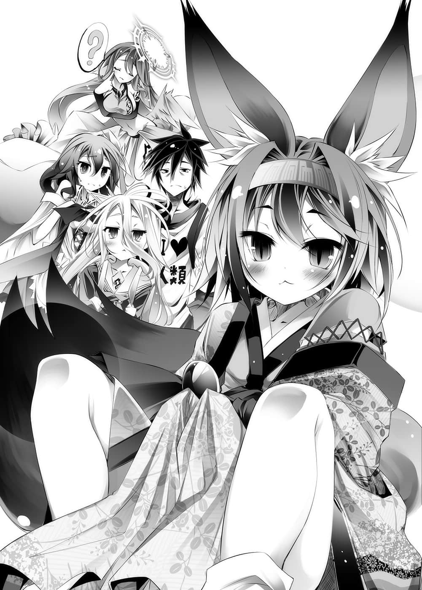

# 开幕后话

> 来源：https://www.linovelib.com/novel/9/2088.html

不知不觉间，夕阳西斜，红色阳光射入艾尔奇亚的小巷里。

带著有些怀念的眼神，特图说完之后，伊纲开口第一句话是：

「……那个故事哪里是说谎，哪里是真的，得斯？」

——她半眯着眼，『断定』有谎言。

依谎言的内容，我可不会放过你喔。伊纲泛着泪水瞪视，特图则是笑了。

「咦？为什么你觉得有说谎呢？」

「里克和休比……有一点像空和白。别小看我，得斯。」

她擤着鼻涕，即使不用兽人种的超人感觉，这种程度她还明白。

顺便一提——伊纲的眼神也在主张，我也知道你在『开我玩笑』。

「啊哈哈☆果然敏锐呢～嗯嗯♪当然多少有些润饰啊，因为——」

——就这样，说到太阳西斜，持续游戏的这段期间，特图一次也没让伊纲赢过。他以孩子般的表情——

「因为真的全部都说出来的话，那就不是『不被讲述的神话』了吧☆」

和成熟最无关的存在——他正是以小孩子的笑容说道。

「……你这家伙，果然让人很不爽，得斯。」

伊纲冷眼瞪着那样的特图。不过——

「……不过你抚摸技巧很好，原谅你，得斯。」

被他乖～乖～地抚摸，伊纲舒服得鸣响喉咙，轻易地改变态度。

而抚摸着那样的伊纲，特图表情一转，以仿佛慈爱之神的眼神想着。

这孩子，初濑伊纲她幼小且——『愚蠢』。

——『正因为如此』……她聪明、伶俐，观察敏锐。

世界即使看起来复杂且无头绪，不过其本质说不定意外地总是——

然后，就连吉普莉尔都以『很有可能』为开头才念了出来。

「你胸前的石头是从哪里拿到的，得斯？」

——『克洛妮・多拉』

「……？你在说哪件事呀，得斯？」

————…………

——唯一神在这里做什么呢，对于这个理所当然的疑问，特图露出困扰的表情——

哎呀呀，特图愉快地笑了——

「……？这是谁呀？史蒂芙，是你的亲戚吗？」

「因为得到在那之上的收获，『初濑伊纲』，我也等你来喔☆」

虽说最后是迫不得已的肮脏比赛。

「——这可真是相当古老的文字呢，是在人类语统一之前的……欸～」

「喔，那么我差不多该走了，和你说话很快乐喔♪」

「……那个……对不起，得斯。」

因为那两人在『 空白』放弃的游戏——

伊纲不记得有报上名字，被他这么一叫，伊纲睁大双眼，露出惊讶的表情。

或许还是要声明一下吧，这么大叫之后，史蒂芙慎重地拿给她看。

「话说你是来干嘛的呀，得斯？」

「请别说得好像是我偷来的好吗！？」

「咿呀啊啊啊啊啊啊啊传家宝！传家宝啊啊啊啊啊！」

而伊纲依然半睁着眼看着他回答道：

瞬间——特图消失在虚空中，不过——

黑发的青年与形成对比的纯白少女——空与白一找到伊纲——

「伊纲虽然是小孩——但不是笨蛋，得斯。」

年幼虽是愚蠢，但正因为不会受到半吊子的理解这种错觉所局限——所以聪明。

「空与白会和其他种族同心协力——绝对会赢，得斯。」

「……不是人类语……吉普莉尔……你看得懂吗？」

「——对，正如你所说，我很清楚喔♪」

史蒂芙缓慢小心地交给她，并且这么叮嘱道，伊纲用力点头接过，然后——

忽然，伊纲的目光停在史蒂芙胸前的——蓝宝石胸针上。

「喂喂，史蒂公。」

事到如今，伊纲忽然冷静地这么问道。

「虽、虽然不知道你为什么生气……吉普莉尔，这个你看得懂吗？」

一如孩子的感性所捕捉到的模样吧。

稍迟出现的红发少女——史蒂芙也同样满身大汗地奔了过来。

特图这么说着，让『星杯』发出光芒——

事到如今才发觉，伊纲尾巴膨胀，小巷里只有她的低吼声响起……

有如理所当然般，白叫出不在场之人的名字——

「……对我来说，那实在非常地耀眼夺目，甚至让我想要相信他们呢♪」

想到特图说的那个故事，伊纲带着复杂的心情向两人道歉，将头低了下去。

——啪叽！

那两人确实像『 空白』——不过只是『有一点』而已。

就像那两人所感觉的那样——

回过神来才发现，伊纲已经不再鸣响喉咙，而是以游戏玩家的眼神看着特图。

「啊，在这里。真是的，你跑到哪去了啊，伊纲，我们很担心你喔！」

「嘿嘿☆——被发现了吗？」

伊纲毛发竖立，瞪着吉普莉尔，不过没人明白她说的话是什么意思。

「……那个家伙，被他赢了就跑了，得斯……！」

对伊纲说的话——『有一点像』——特图打从心里佩服。

「…………仔细一想，都是这家伙的错不是吗，得斯……！」

---

■ ■ ■

往被装饰覆盖的里侧看去，伊纲微微一笑。

不过——即使如此……

「是是是❤受到呼唤就会飞出来的就是我吉普莉尔。我精通七百种以上的言语及古语，请问主人有什么事找我呢？」

「嗯～其实我本来是想来激励『 空白』他们一下——不过没问题啦☆」

「……明知故问…………？小伊，怎么了吗……？」

如同他们的宣言，前来打败自己呢？

兽人种不可能会有什么『万一』，两人却似乎是真心为她担心——

能在最后让她吓了一跳，特图满足地浮现恶作剧般的笑容——

「这是祖父送给我的，听说是多拉家代代相传的传家宝喔。」

但是——让他想创造这个【迪司博德世界】的两人。

——坚强许多。

当特图正出神这么思考的时候，忽然——伊纲开口了。

——像这样，听到远处传来的声音，特图比伊纲更早反应，起身站了起来。

「啊，好……好是好，你可别弄坏——」

「……不过，你别想赢了就跑，得斯。」

因为不管是逼和还是长将和。

「真是的，伊纲这样不行喔，一个人到处乱跑，世上也有像这样的可疑人物喔！！」

无论是当事人或他人皆认同的『可疑的两人』，以超越音速的速度抱住伊纲，对她摸来摸去。

「……？这是什么？文字吗？」

「让我看一下，得斯。」

「……小伊……迷路了吗？」

「伊纲，不可以一个人到处晃哦！世上也是有可疑人物的喔。」

「喂～～～～！伊纲～你在哪里～？」

都是从几乎必败的劣势——仍不放弃的情况下所采取的反击。

——『休比・多拉』

向没有规则的世界这个游戏——挑战——然后战成平手。

「————欸欸，好啦，我已经习惯了，什么事？」

对于鸣响着喉咙、抬头仰望的伊纲，特图只是以笑容回应。

看到她那个样子，空与白同时窥视伊纲的手上——

「看仔细了，只是把装饰部分拆下而已吧……不过伊纲也真是的，怎么突然这样？」

对于突然出现的吉普莉尔，伊纲猛然瞪着她，对她发出低吼声。

——特图说着亮出『星杯』——唯一神愉快地笑了。

伴随着惨叫，史蒂芙口吐白沫地倒了下去，空扶着她，半睁着眼说道：

但是本来——所谓的逼和就是那么一回事。

还是说……意外地——……？哈哈☆

「……对，比如像哥一样的……或者像白一样的……」

空与白——『 空白』是……如他们所愿的——两人才是一人。

没错，特图确实对自己所知的事实加以润饰。

史蒂芙这么说者，用手指着空与白，伊纲也打算向史蒂芙道歉，于是将视线往上——

「……小伊……你在哪里……？」

——『里克・多拉』

「——啊！找到伊纲了吗！？呼……太好了。」

究竟他们是否能到达那两人所无法到达的境界呢？

因为那两人比空和白……比『 空白』——

被这么问到，史蒂芙骄傲地，同时带着尊敬的语气说道：

「克洛妮・多拉……她是艾尔奇亚建国的女王。生涯没有人见过她哭泣的模样，充满知性与笑容——引导『大战』终结后的人类种才女……是多拉家的骄傲。」

「——什么！你是建国者的直系吗！？大战是六千多年前的事了吧！？」

「……史蒂芙……原本是超级千金小姐……？」

「请不要用过去式来说好吗！？」

史蒂芙侧着头，看着胸针。

「不过……真奇怪呢……另外两人的名字我不记得有见过呢……」

「……虽然听过这名字，但是那个并不是人类种……是巧合吧♪」

听到吉普莉尔的发言，伊纲又对她发出低吼，不，比起那个——空提出他的疑问。

「伊纲，为什么你会发觉藏在装饰之下，连物品主人史蒂芙都不知道的文字呢？」

听到空的询问，白、史蒂芙、吉普莉尔的视线都聚集在伊纲身上——

不过伊纲只是微微一笑，什么也不回答，慎重地将装饰复原。

他只对自己说那个故事，应该有什么理由才是。

身为兽人种的——不……伊纲的直觉这么告诉她。

————…………

——空重新往众人的脸上看去。

「好了，全员行李都带了吗？白？」

「……ＯＫ……」

「吉普莉尔——没看到你的行李耶……」

「没问题，我把空间压缩之后，收在怀中了❤」

神灵种认为只有他们才是『参加者Ｐｌａｙｅｒ』，其他全都是『平凡的棋子Ｐｒａｙｅｒ』。

「有、有……虽然不愿意，不过我在……等日落后我就出去。」

「特图创造的这个世界——是『神灵种收集其他种族棋子的游戏』。」

「我过去曾一度梦想……并且结束的梦的『后续』——」

史上第三次的『杀神』——将神不杀而收服——

但是空打断她的话——接着说道：

并不是要说给谁听，只是玩弄着扑克牌，对着虚空自言自语。

毕竟是过去『永远地』战争的家伙们。

经他们这么一说，没有发觉这个理所当然之事的史蒂芙，孤单地走在白的后方。

「那么——我们走吧？」

宛如嘲笑那些存在意象上的神明们，空继续说道。

---

■ ■ ■

「这么一来，神灵种一定会这么想吧？」

「……阿宅尼特，处男兼没朋友，比我们还不如的……没用生物。」

「那样的想法完全猜错了～～」

「世界这种东西，真的很单纯啊……就如同他感觉到的一样。」

————…………

走在空身旁的白，断断续续地接上空的话。

——没错，Ｐｌａｙｅｒ挑战者和Ｐｒａｙｅｒ祈祷者的差别。

没错，归根究柢……与空牵着手走着的白微微一笑。

「空，白，还有大家——我的最后一步棋，托付给你们了——」

而吉普莉尔对空与白——主人们的慧眼，露出感佩的微笑。

不是巫女的『存在』睁开眼睛，这么问道。

「没错，神灵种没有指定『全权代理人』，『神灵种的棋子』是——『无法取得』的。」

「好啦，好啦，我有带着啦，很大的行李……」

「「【十六种族】位阶序列・第一位——神灵种，古老～～的神。」」

大气、云、地面发出悲鸣，概念的显现覆盖世界——话语开始传出。

眼神一敛——空对着眼前的人物，只是像在确认般地说道。

空想像——他们就是这么以为，所以才妄自尊大地待在天上吧。

沙一声，一行人停下脚步。

他叹了一口气，特图——身为唯一神游戏创造者——

——地平线的彼端，回到黑色国王的顶端上，特图眺望着地上说话。

空嘴角扬起，话中带刺地说道：

但是这么一来就有一个问题产生了。

「对～……因为归根究柢喔……！」

——『十条盟约』第七条「集团间的纠纷应指定全权代理人」——

「对，毕竟如果是神灵种的全权代理人的话——」

自以为是，装得一副了不起的模样，目中无人的家伙们。

「那是什么四次元口袋啊……呃～伊纲呢？」

对于搞错规则，糟蹋了整个世界游戏平衡的存在。

红色的月亮下，空带着众人，一边走一边谈话。

接着表情一转，眼中闪耀着兴奋的光芒，特图摆动双脚，用带着热度的声音说道：

「把无聊的家伙拉下来，到这里来吧！！」

走在他身旁，月光下状况绝佳的吸血种少女——更正，少年笑着说道：

「咦？空——不等『那两人』吗？」

「如果是你们的话——应该办得到吧。我期待你们，我相信你们喔，所以快一点——」

「最先被拉下来的果然是『你』吗……真是不幸呢☆」

「……种族棋子……不取得也、没关系的话……事情就另当别论……」

「没必要给神灵种决定，对吧？」

---

■ ■ ■

「这边的行李太大了……史蒂芙？」

「好了——快点开始游戏吧。说明白一点——你们太碍事啦，神灵种。」

而是住在那个世界上的无聊家伙们——特图是这么想的。

「老大不小了还要靠人和星球养，明明是寄生的身份，还自以为了不起的家伙。」

东部联合首都・巫雁——巫社中央大楼的庭园。

所以——

「『没有结束』——好，我会证明给你看，放心交给『我们』吧。」

——一定就像孩提时候，每个人所想的那样。

——东部联合，兽人种全权代理者。

就在每个人都受其权能与气势，以及压倒性的存在感压迫的同时，然而——

他脸上浮现明显含有恶意的笑容，像小孩般带着不怀好意的眼神注视着虚空说道：

「——『某某神』的巫女小姐？」

月光照亮的庭池上，架着一座红色的桥。坐在桥的栏杆上，鸣响着铃声。

而且——可以想像也有种族想到同样的事，因而死心降伏在其麾下吧。

然后空与白，脸上浮现自信的笑容看过众人一遍——

「——你们知道我是谁，竟仍敢呼唤我，定命之人啊。」

「很好，大家都到齐了。」

---

■ ■ ■

把世界变得复杂的家伙们，对——无聊的家伙们。

「关于这个世界——当我听说『十条盟约』和【十六种族】后，就一直思考着。」

在连吉普莉尔也不禁倒抽一口气的力量漩涡中，最后巫女问道：

只见以巫女为中心，风开始如漩涡卷动，云则受吹拂而流动。

好似对他的回答满意了一般，『巫女』闭上眼睛，然后——

空这么说着，踩着脚步声跟在他后方的伊纲，一副还听不太懂的模样。

「——神髓显现、神将意通——神格设定……『底边』。」

「当地集合——最坏的情况，让他们中途参加就好了吧，就是这样……」

「……不组成集团……比如神灵种的……种族棋子……要怎么取得？」

摇摆着两条金色尾巴——『巫女』妖艳地笑了。

十六种族——以及所有种族各自被分配到的『种族棋子』。

「嗯，没问题，得斯。」

「难得我创造出的单纯世界游戏，却糟蹋麻烦了它的家伙们——如果是你们，应该办得到吧。」

「——但、是、很、不、幸。」

似乎对猛烈吹拂的狂风感到厌烦一般，空与白这么说道。也就是说——

把它弄得麻烦、复杂的不是世界。

收集齐全就拥有对唯一神特图的挑战权，这就是这个世界，这个『游戏』。

「那是秘密武器，你要好好保管喔！——喂，布拉姆在哪里！」
