# ZERO 特典 漫画＆小说

> 来源：https://www.linovelib.com/novel/9/169798.html

网译版 转自 轻之国度

作者：榎宫祐

插画：榎宫祐

译者：SEtils

图源：龙魂

校对：名瀬なぎさ Levin（LKID：Maruka）

润色：名瀬なぎさ Levin（LKID：Maruka）

修图/嵌字：SEtils hollow SF1999

轻之国度 www.lightnovel.us

仅供个人学习交流使用，禁做商业用途

下载后请在24小时内删除，LK不负挡任何责任

请尊重翻译、扫图、录入、校对的辛苦劳动，转载请保留信息

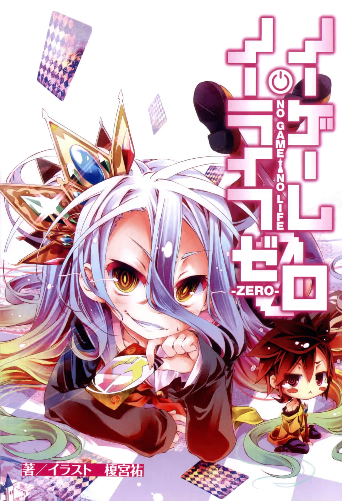

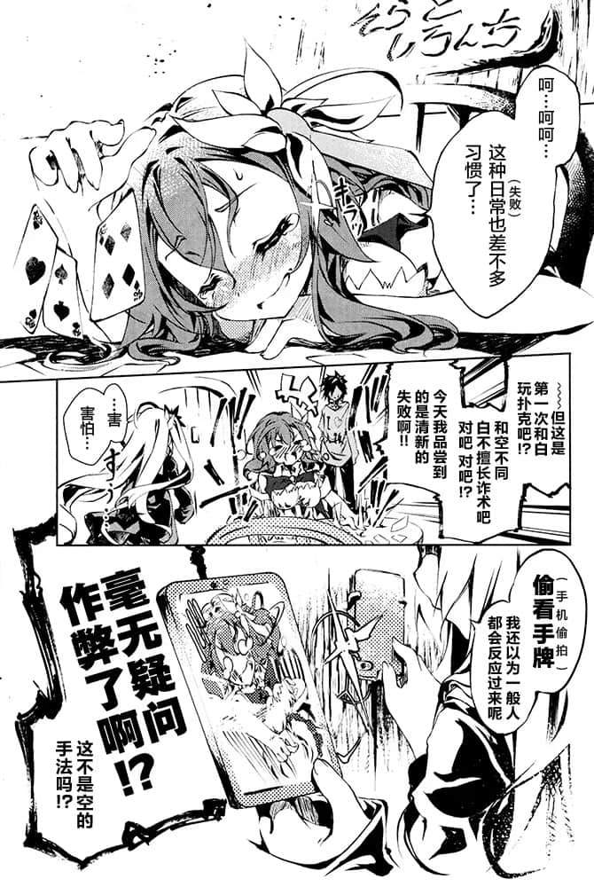

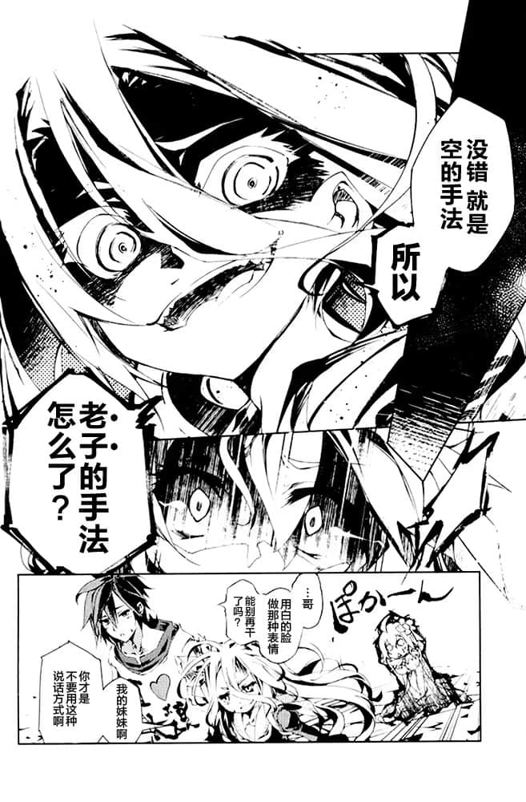

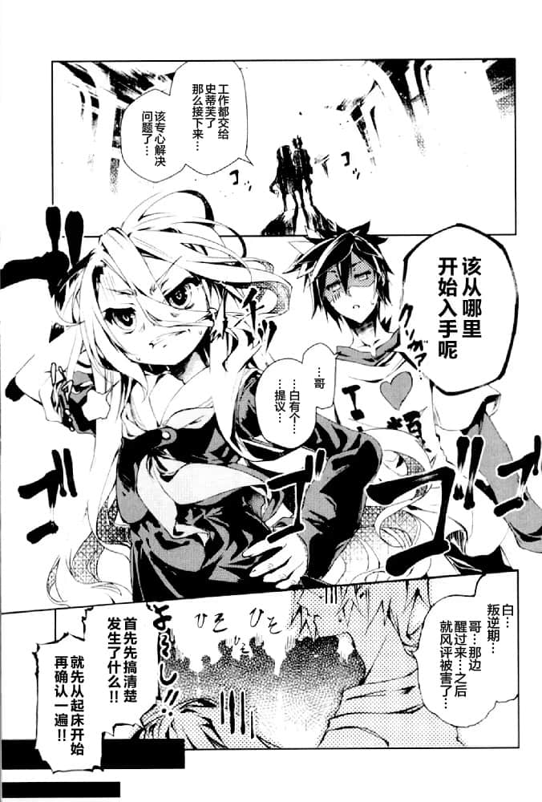

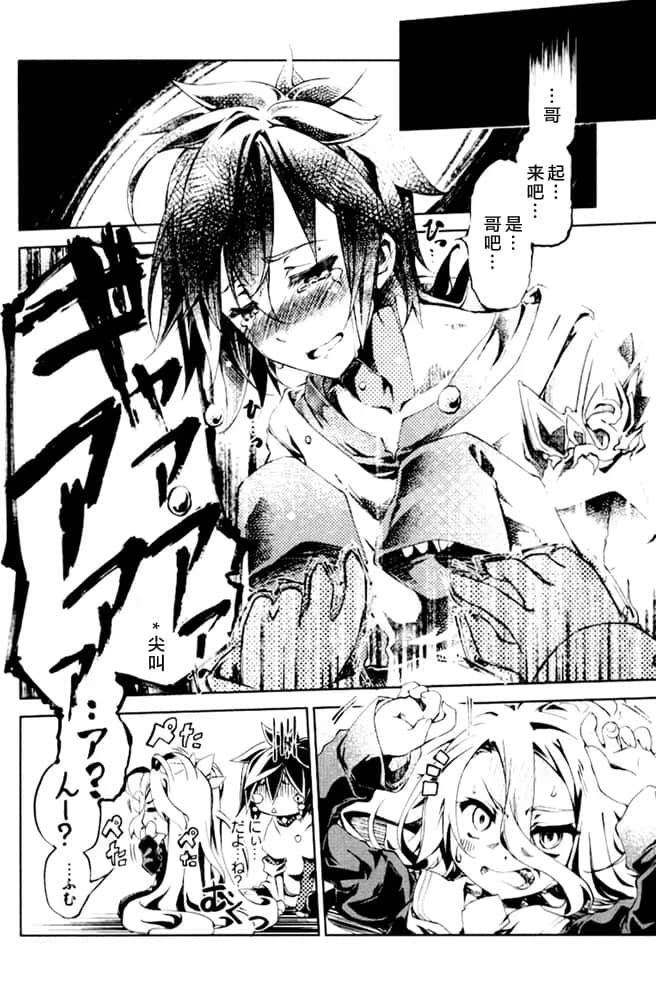

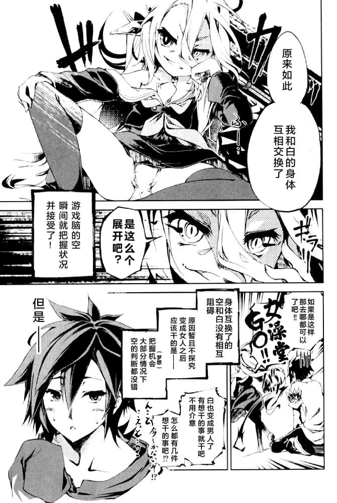

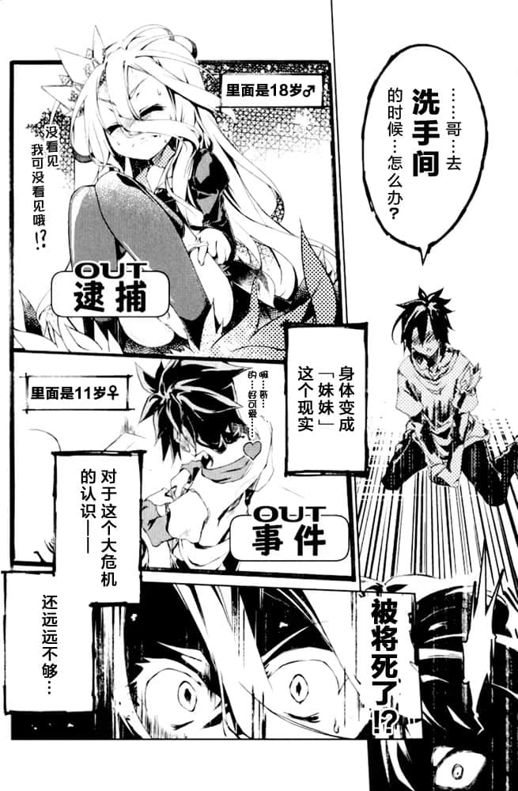

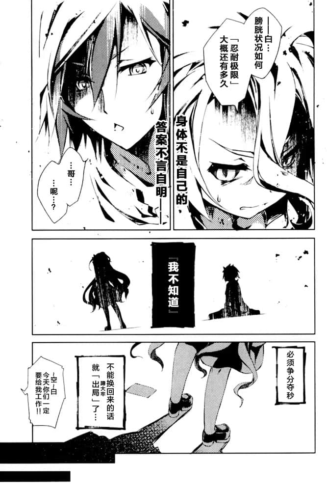

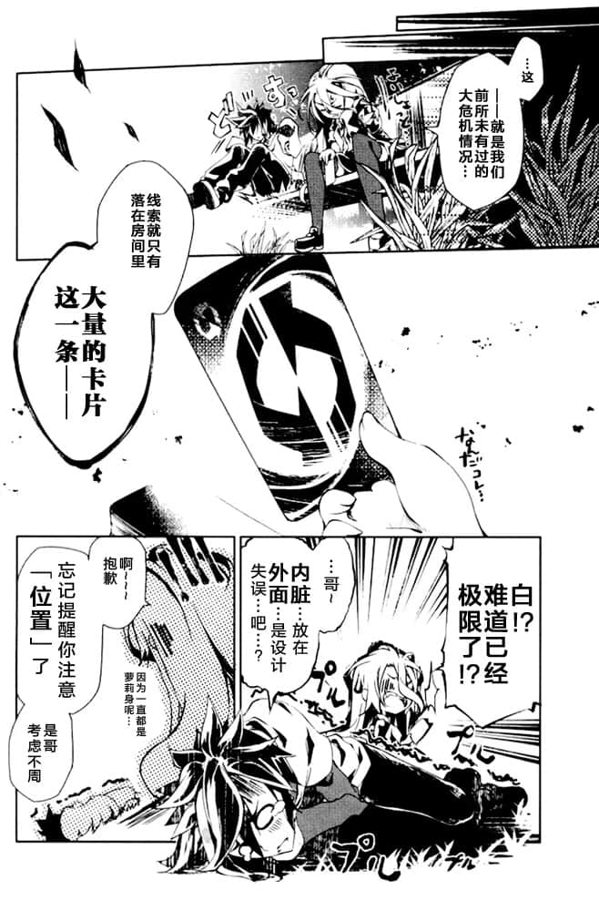

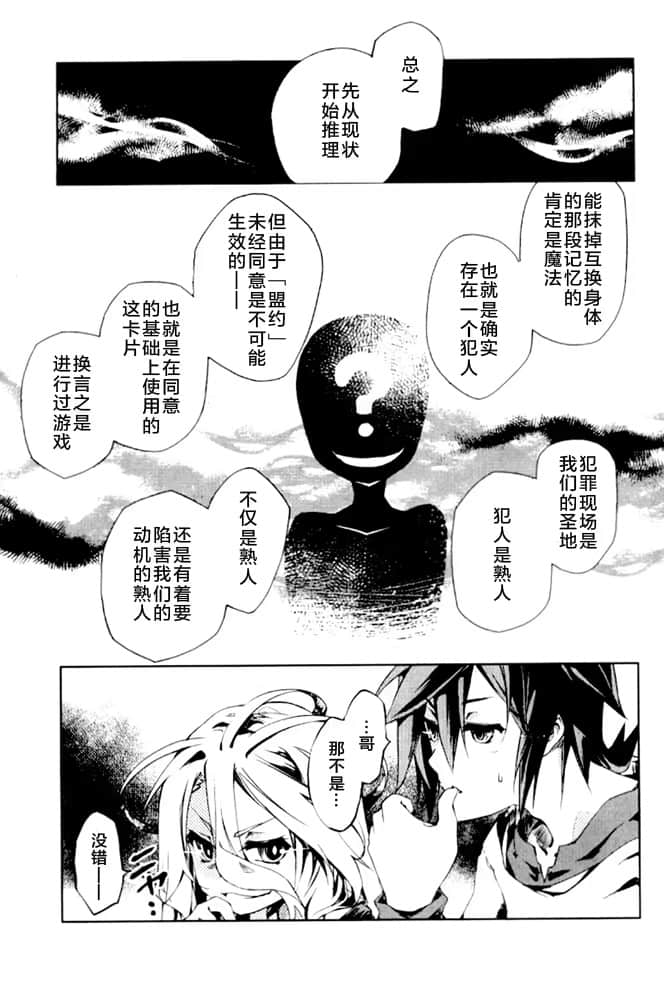

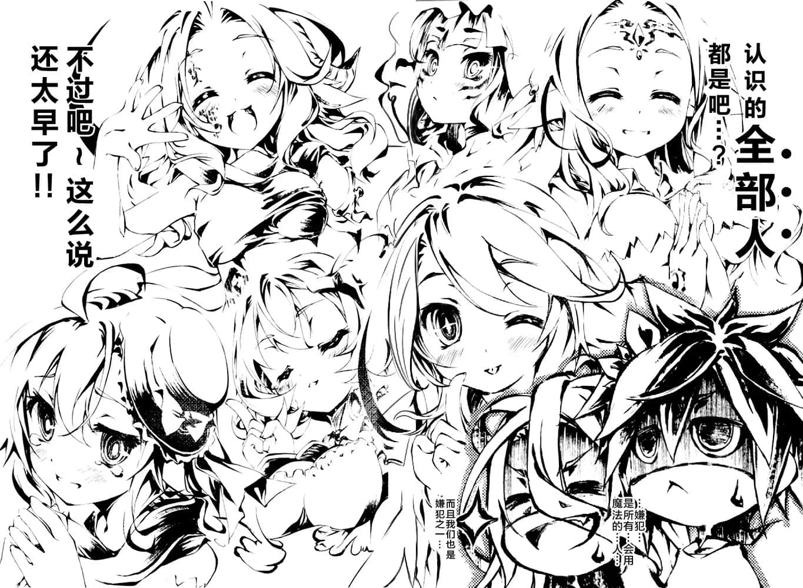

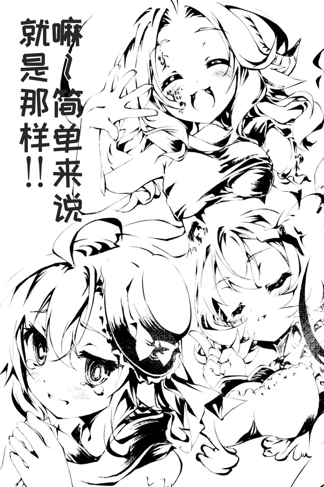

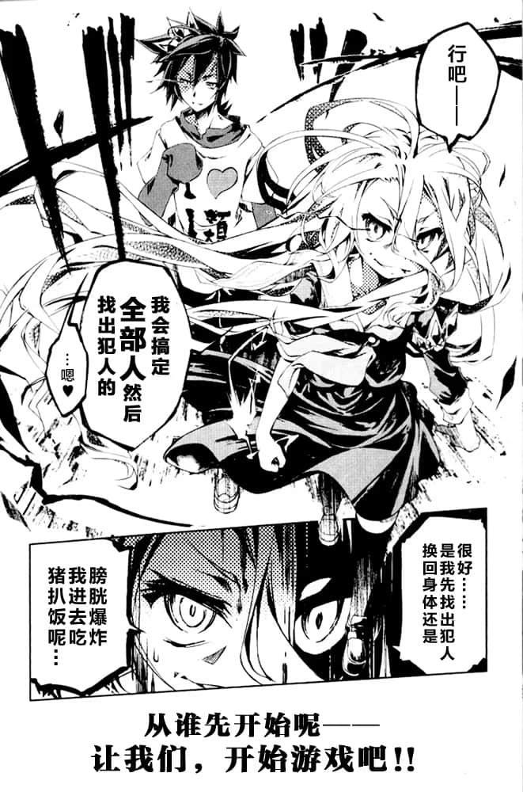

——总之就是这样。

空和白无言地一齐点头，吸了一大口气。

第一个应该被逮捕的嫌疑人——早已决定好了。

如果两人一起召唤也不出现，就会被自动落实「犯人」的身份的人。

假如出现了，那么无需动手，只要一句『趴下』就会趴下的人。

于是两人高声喊出「一直以来都是事件元凶」的人名字，也就是——

「吉普莉尔——！！！！！」

「好~来了来了！只要一声令下，从火中到女孩子的裙中！二十四小时待机，满意度永远排第一的就是我吉普——呀啊！？」

「——啥？不是……这是我一个人的问题……可恶——！！」

「——嗯，是的……对不起啊……」

问题已经不是时Time间限制Limit——而是『已经走投无路了』的可能性——！！

面对不安地订正着、呈现为自己的姿态的妹妹，空垂着头回答道。

「——所以吉普莉尔只会是友，或是敌人。现在证明了她是友方。」注*（因为吉普莉尔已成为了空白的所有物）

比谁都困惑的吉普莉尔悲伤地向空白询问道。

对于踩到了自己的长发而大摔了一跤的空，白战战兢兢地说道。

尽管吉普莉尔擅自做出了觉悟，但空的意识早已飞去了遥远的彼方。

「……白。吉普莉尔不知道我们互相交换了——吉普莉尔是『无罪』的。」

「真的非常对不起……居然有这种程度的敌人，都是因为我不够强……」

如果碰到了不确定位置的「某处」，那就是直接逮捕警告了！？

——虽然不是很明白，但有干劲是件好事。

面对坐在地上托着腮的白发少女——空的发问，听了情况说明的吉普莉尔非常可惜地流着泪摇头回答道。

被《白》骑在身上揉着欧派的吉普莉尔则一边发出甘甜的娇喘，一边开始谜样的自供。

相当自然地从虚空中传出吉普莉尔的开场白。

面对来自白和吉普莉尔不解的视线，空站直身子继续说道。

而在旁边跨坐在前嫌疑人身上的犯罪者——《白》不满道。

」能够模仿灵魂移动的人不是有吗。吸血种不就能做到吗？」

---

■■■

没错——终于对「那方面」产生兴趣的空带着白一起袭击了吉普莉尔，而且吉普莉尔激动得流出泪水的，这副相当错乱和糟糕的画面——

从刚才坐在这里的时候开始。

「……坦白……从宽……虽然没有……证据！」

「没错……我也参加了游戏，还『协助制作了』——这种程度的高位魔法。而且，能够制造出现在这种状况的敌人——『犯人』也并不局限在熟人范围——」

和空想到的不安相比，那些都不过是细枝末节。

——首先，白的胖次——

——不对！不止如此——这不早已经出局了吗！？

——完全没在听吉普莉尔的话。

再说了，当初就是为了确认这一点才第一个叫出吉普莉尔。

「对了，下一个下一个！该审问下一个嫌犯了！！」

陷入了白的身体的「哪个」地方。

这条胖次陷进去了。

「那个？虽然不是很明白……但好像要推迟使用小女子了吗……？」

「再说了，需要动用如此大量精灵的术式，我闻所未闻。」

只是，由于《白》的飞扑把她压倒在了地面上，后半段变成了罕见的悲鸣——然后，

「没这回事，主人。转移 『灵魂』的『容器』 这种魔法属于神的领域。」

「但问题出在——从这些卡片中可以确认到我的精灵这一点。」

《白》尝试着从吉普莉尔身上爬起，俯视自己的——空的身体，奇怪地歪了歪头。

现在，空和白是身体互换的状态，这点有必要进行强调。

点了点头——刚才谈到了哪里来着的——

「另外，游戏开始的时点应该是昨天晚上——『但是我也没有这份记忆』。」

「主人……您如此宽宏大量我真是感激不尽。我保证一定会挽回这次的失态——」

在霎时，僵在原地。

「吉普莉尔，我就直接问了。『交换身体』这样的魔法是谁都可以用的吗？」

——那种东西怎么都好！！

《空》呻吟般地说道。

「啊~主人终于要使用小女子，能得到这份奖励真是十分感激！还是在白大人面前玩警察犯人惩罚play，请问是认哪个罪比较好呢！？」

胖次陷——进——了——股——间，这样一个大问题！

空拿着吉普莉尔给的三十张卡片，凝视着上面表示着「正在发动中」的术式，陷入了沉思。

「……哥……是我们的……是『 』空白的，问题……」

「……但是……哥……嫌疑人……一口气增加了……哦？」

因此推倒了吉普莉尔并且揉着她的两个大白馒头的《白》，如果从旁人的视线看起来就像——

「那么！！下一个要拘捕的嫌犯就是能够解析这个卡片的那家伙！！」

下一个嫌疑人是——普拉姆，但用普通的方法对付他是没用的。既然这样的话——

「请，请恕我僭越——如果要说能做到『移动灵魂』的话——「

「……姆嗯……？」

进一步深思的空停止托腮，想要放下的手——

「……？那……哥……还在埋头苦恼……些什么……？」

对，这完全是自己的个人问题，而且是个极为严重的问题，那就是——

在理解了这个事实的瞬间就已经——

——十之盟约【五】，受挑战的一方有权决定游戏内容。

「啊~♥ 没错！！我认罪，我什么都认~小女子就是犯人的说？」

——等一下。是不是哪里不对？

「以会使用魔法的人为对手时， 『 』空白会同意进行游戏的可能性有两个。」

面对自己从未有过的难题，空俯视自己现在的——属于白的身体，陷入沉思。

「……不，不行！！这样思考下去只是徒增危险啊——！！这种时候不管才是正确选项SAFE！！」

……用这副身体，把手伸进裙子里……真的能得到许可吗？

可以去弄出来吗……？——吗！

空为了在白面前蒙混过关大叫了出来，但是，白的另一种视线又向他投了过来。

这是——空焦躁地不自觉地扭起身子，发出了呻吟。

面对不知在对什么做道歉的吉普莉尔，空摇了摇头，又扭起了身子。

是啊，这怎么说也是「白的身体」。对白来说这也是个严重的问题吧。

空一边佩服妹妹，一边否定了她的说法。

想起逼近的尿意Time Limit，空站了起来。

……由于现在没有画面了，我们重申一次吧。

「快说！赶紧给我坦白！虽然没有证据，但你这家伙就是犯人吧！？」

……是啊……

空和白会选择独自迎战手里有着人类种无从得知底牌的对手吗？——不可能。

「白……你这家伙留这么头长发到底是怎么生活的——不对，犯人就是熟人这个结论不变。」

——等一下等一下！这可不只是『不对』这种程度的问题！！

把恍然大悟的吉普莉尔放到一边，空继续深思。（注：原文为眼中掉落了鳞片指恍然大悟。出自新约·使徒行传九章，「顿时，扫罗眼里好像有鳞片脱落一般，视力立刻恢复正常。他便马上接受了洗礼」）

吉普莉尔继续述说着自己的想法，但空已经没在听了。

自己的思考得出的唯一一个推测，让人冷汗直冒。

「不妙——」

面对向魔法解析水平在吉普莉尔之上的术者发起挑战、自己能否获胜的这个问题表示疑惑的视线，

空——有着红宝石般眼睛的少女，

邪恶地歪起嘴，混杂着苦笑回答道——即，

---

■■■

「呜……克拉米～……人家已经被玷污了……再也嫁不出去了～只能让克拉米娶我了~……」

「哈！？菲尔你在说什——空！！你这家伙还是一如既往的下流！！」

没错……「轻松取胜」，正如空的苦笑一般。

菲尔和克拉米两人一同对如此简单就输了的事实感到悲叹。

只要空摸到菲尔的胸，就要回答关于卡片所知道的一切。

以这样的赌约向盟约进行宣誓后——「白的姿态」的空用手戳了下菲尔的胸，好了赢了！以上！

空就这样无赖地，轻松把胜利收入囊中——

「不爽！我也……本来我是能做更多这样那样的事啊！！」

「为什么性骚扰的你反而在哭啊！？肆意妄为也有个限度吧！？」

菲尔对白完全没有警戒心。本来的话是要顺从自己欲望对那对下流的南半球干各种各样的事的！

但由于逼近的尿意Time Limit，空只好压住自己的本性，选择迅速取得胜利。

再说这正是由于不知道空和白交换了才带来的胜利——因此是无罪。

「没时间了，关于卡片你们知道些什么快给我全部说出来，混蛋！！」

空一边流下血泪，一边诅咒无法享受「交换身体」所带来的福利的命运并催促着解析。

「……哥……摸吉普莉尔的……时候，也是……」

这时，传来白不高兴的声音——不对，正确的说应该是「空的声音」。

「……现在……对菲尔的……欲求，在身体上……反应出来了……「

「……喂，在我的常识看来，掌控身体活动的应该是『大脑』吧……？」

所以现在处于『醉了』状况的空的脑子——

然后……已经黄昏，在此时的艾尔奇亚王城走廊里。

白娇小的身体……在扑空那么多次之后，比空更早地来到极限膀胱了。

「谁管啊！去跟造成这种状况的犯人说去啊！！」

「……白……什——么……都没明白，的说……」

——关于什么东西，如何反应了变成这样我们还是不谈了吧恩。

「……哥，那样……的话，死的……是白的……身体吧……？」

空和白现在正处于「遥控」对方身体的状态下。

伴随涌上的徒劳感和失落感……感觉已经快要一了百了了。

「白」垂下视线，以冰冷的语气囔囔——「盘问」道。

对于菲尔浅显易懂的解释，空用《白》的身体点了点头。

「啊……如果只是『身体和意识不同步』～的话就很简单了呢~」

为了体谅因为是妹妹的身体，空至今为止都凭借钢铁般的意志撑了过来——但是。

也就是说——空和白其实并没有交换身体。

为了体谅妹妹的身体，如果继续忍耐，就会影膀响到胱健康炎——

对于无法理解的事物的应对方法就是直爽地停止思考。

然后在克拉米对此反应之前，更早的是——

空还是没有理解，但是白却弯起了嘴角。

白只是呆呆地——用空的脸做出与其完全不相符的可爱表情。

「那『空的身体』为什么会在看完自己妹妹的胸之后发出一声——『嗯♥』啊！？」

目前，空和白是处在交换身体的状态下。所以刚才的行为——在第三者看来其实是这样的。

然后白抱起由于盟约而昏倒的空走向洗手间。

……可恶。果然是比不过白，空懊恨地笑着。

「……【向盟约起誓】……输了就要昏过去……哥……你就故意输掉……」

「——请……杀了我……」

「——白……？是明白了什么吗！？」

两人的脸色已比黄昏还要昏暗，脸上还浮现出对即将来临的终焉（时间限制）生无可恋般的笑容。

虽然说天塌下来当被盖——但一想到不久之后就要用妹妹的身体来尿裤子的现实。

「啊，是的。当然大脑也在掌控身体。只因为『灵魂』是直接控制『容器身体』的，所以『灵魂』的优先度更高——大脑的记忆同步是不是有一定延迟呢？」

持着悲壮的觉悟——笑着说出了「杀了我」。

只有失去意识的——白的身体留了下来••••••••！

就这样空和宣言的一样出了『石头』，而白则自然地以『布』赢得猜拳。

——原来如此？也就是说——其实没什么问题•••••••！

「鬼知道啊啊啊！！我说白！！你刚才不是明白了些什么吗！？」

「给我等一下！！这个身体本来就是白自己的啊！白看自己的身体完全没问题吧！？」

就算是自己脱下内裤去解手——那不是很普通的事吗！？

「……哥……只要是，女的……谁都可以……这样反应吗——」

「………………！」

「白……在哥哥我犯下无法挽回的大罪之前，请一定……」

……

结果到了最后，并非『卡片』，而是从『空』和『白』两人的话语中推导出了结论——

空嚎叫着，朝着奥仙德飞越了空间——

想起已经不是考虑这些的时候，大吼着双方同时出拳——

……好了。现在让我们不厌其烦地再次强调一遍。

——已经把能想到的人都审了一遍，而收获则是——零。

但是这并不能成为找到「犯人」的线索，因此空内心越发焦躁了——

「菲尔！！快拍下来报警！！这个犯罪者正在干劲十足地偷看幼女欧派！！」

只是产生了对方的身体是「自己的身体」这样一个「错觉」——换而言之。

——原来如此。

---

■■■

「好好好了都别管这些！下一个嫌疑人——是能够操作认知的普拉姆！走，吉普莉尔！！」

对于妹妹深思后似乎得出了什么结论的样子，空期待地问道。

空已经完全没有空闲去管越来越逼近的尿意Time Limit了！

空甚至已经觉得白搞错了重点，已经完全丧失了思考能力。

「将『灵魂』收发的信号～转发到别的的『容器』～也就是说，两人只交换了认知••••••，让『灵魂』『远程操控』对方的『容器身体』~♥」

与那张脸(空的脸)十分般配的是——上面浮现出扭曲而狰狞的笑容——

——游戏……？

白对自己的身体做任何事……都不存在问题吧？

在大家都点头表示理解了的同时，空突然向吉普莉尔发问。

「……然后你这家伙也扭扭捏捏的，但一想到里面是空你就觉得好恶心，别这样了。」

「那么就晕到发出信号为止！我会出石头，【向盟约起誓】——！！」

只说出了一句话。

要是空昏倒了，那会怎样？

就仿佛是在确认着什么重要的事情一般。

空抢在前面补充道：『只针对美少女才会这样』。

——那么白究竟注意到了什么呢？

听到白接下来的话语，空仿佛看到了亮光一样眯起了眼睛，思考着。

「……哥……你，还好……吧……？」

内心是处男的美少女回过头，夕阳洒在脸庞上。

「哈哈……抱歉，白……哥哥，我，看来就到此为止了……」

踏着无力的步伐的白色少女——空，其隔壁则是黑色的青年——白。

就这样和克拉米说起相声，意识到逼近的尿意Time Limit后，空也发抖了起来。

「……哈？」

为了从紧追不舍的克拉米的指责下逃离出来，空询问白的意图——但是，

空虚地回响着两个沉重地并排脚步声。

听到白的话语后，空以空虚的目光看向她。

——憋尿时候的人的判断力，就和喝了酒差不多。

一直在解析卡片的菲尔发出了声。

「是在说心跳吗！？还是说血压上升了！？或者不自觉得变得色眯眯这样！？如果是这样的话我的回答是『No』。要说为什么的话，因为我对克拉米无法起反应！！」

「喂，比起那个……空你现在萌袖内八地站着怪恶心的，能别这样了吗？」（注：萌え袖，指将袖子盖过手掌，只露出手指部分的着装状态）

——对啊，白果然是真物。天才啊……！！

「……哥……来……猜拳，吧？」

——缓缓地、

那不就犹如大自然一般，完全合法、绝对ok不是吗！！

---

■■■

随后白满足地点了点头，发出了小小的一声「嗯」。

「吵死了，不是说了快要没时间了懂吗！？这边可是已经拼尽全力了啊！！」

啪地一下拉开空的衣领，盯着里面的胸部看了几秒。

——『 计 画 通••• 』

在旁人看来这就是一个拐走幼女的一副人渣空相男人的白，思索着。

确实，自己也没有昨晚游戏的记忆。

因此具体的游戏内容依旧是不明瞭的……但是，

现在这个状况——「白计划着什么」是无可置疑的。

「如果……是平常的哥哥的话，……那应该会注意到的吧……真是……对不起……？」

白看着在自己怀里沉睡着用着自己身体的哥哥，以及其脸上辛苦忍耐的表情——表达了歉意。

如那张痛苦的脸所展示的一样，憋尿是如此痛苦——以至于使空几乎没有了判断力。

如果是平常的哥哥的话，谁是『犯人』这个谜题肯定在「一瞬」之间就会被破解了。

对。『犯人』。如果要说谁能够造成这个状况的话——

「……但是……被骗的一方……才有错，对吧……♥」

白吐出小舌头，如果没有那份尿意，可能自己的《计划》就失败了吧。

就算没有记忆，就算不知道具体的游戏内容，

只从现状就可以推导出来，白将自己的《计划》整理、列举了出来。

——菲尔说过『为了让灵魂能远程控制身体而进行意识交换』。

与白的意图相反，由哥哥的身体产生的各种反应都证明「现在身体依旧是正常的」。

——而吉普莉尔说过『由于灵魂优先级高，大脑中的记忆同步会有延迟』。

就算在空和白互相交换期间——也依然在发出「大脑还在正常运作中」的信号。

因此，白以空的身体所看的所摸的——包括吉普莉尔的欧派触感在内全部的全部感官记忆

——就算恢复原状，这些记忆也会残留在空的大脑里。

……甚至都算不上是事件……只是昨晚一时想到的，单纯的『余兴玩乐』罢了——

就连这样抱怨的余裕都没有，白向洗手间飞奔而去。

「也就是说……再无聊不过的是……『犯人』就是『我们自己••••』……」

想着这应该是生离死别了，吉普莉尔将刚才被打断的所谓的错误，在心中继续——

而且，凭这看到胸就会有反应的身体，还有其他各种各样的反应（注：性冲动）都应会残留在记忆中……！

不，再说了——

结果那天晚上。灵光一闪——想起了之前揭发菲尔的思路。

然而——为什么会没有注意到这件事呢。

空留下了对"这种立刻就会招来报复的真相"的保密指令之后，飞奔进厕所里。

——而自己犯下的罪，正是破坏了这个天衣无缝的计划。

「主人！！是变回去了吗——咦，主、主人！？」

对着白的身体，无论是看，还是摸，还是稍微——摸得更过分一点也没问题的不是？

吉普莉尔的下一个玩家也不是空——而是白。

「……？不对……奇怪啊……这样的话为什么我的记忆也没了？」

「——为什么，白大人也需要失去记忆呢……」

那样的天翼种竟然由于感受到杀气而缩成一团，能够俯视她的——另一位主人。

然后——空说过「白对自己的身体做任何事都没有问题」……

当然，最初设定的交换对象并不是空和白，而是「吉普莉尔和空」。

只有经过『 』空白同意才能开始的——使用了能够取胜的魔法的游戏。

---

■■■

只是，眩晕感突然袭来——紧接着，

『消除记忆』应该只消除自己以外的人的记忆啊——空歪头。

把空从限制级事件中解救出来的恩人，却只是正坐着摇了摇头。

换句话说，这全部，都是白策划好的——

——虽然是「用空的身体干的」那些事，但在里面的却是白啊！！

不停地互换身体，对失去记忆的人以假规则骗她用卡牌。

但是既然要玩那肯定要通过游戏啊。白向着手机上的UNO——

——『交 换』……让某个玩家和自己进行交换的卡片。

和红宝石的眼瞳的给人印象相反，白脸上挂着的是冰山般的无表情，让人仿佛在面对避无可避的死亡。

——一方面地对所有人都『你就是犯人吗』如此般审问了一遍，结果犯人其实是自己。

在空怀中目睹一切的白——在此之前感受到的是——回到自己身体后，不可名状的尿意。

那是——吉普莉尔去拿宵夜，白处在昏昏欲睡的状态的时候。

就算是——啊啊就算做那种事.

「我『竟然蠢到这个程度』……真是抱歉，还有帮大忙了，吉普莉尔。」

——即将要在这样一个能带来完美且无敌未来的《计划》上落下决定一笔的白——

以及比那还要更无意义、愚蠢的——自己的『罪行愚行』，

——『消除记忆』……直到有任意一人将卡片全部出完为止，将除自己以外的人的今晚的记忆封印的卡片。（注*UNO有人将卡片全部出完即为胜者）

「……哥……我好了……哟？」

「…………嗯」

没错……虽然说是空自己使用了卡片。

「啊，对了，吉普莉尔！！这得保密懂吗！？因为不管怎么想都太蠢了！！」

直截了当地说就是，顺着性子做出了『真·改造UNO』，然后想要试玩一下……。

在洗手间外等着白的空抱头呻吟。

「那个，不是的。主人，你搞错了——」

那么……就算是白脱下白的身体的内裤，当然完全没问题的不是？

如果要说谁能简单地达成这个条件的话——那么最先应该怀疑的，应该是自己。

「……就是我犯了个巨大的失误……哈哈……」

记忆恢复后觉察到——这种无比老套的事件『犯人结局』，

——白，完全没想到会有今天（棒读）。

面对祈求带去冥土特产的吉普莉尔，白威严的点下头说道：『说来看看』。

……嗯？

随后被叫来的吉普莉尔深深敬佩空的想法，立马就编纂出了术式。

抱着头，审视自己的罪行的空突然发现——

在只有亲密的人才能进入的这间，空与白的房间。

结果空和白在吉普莉尔的协助下，做出了游戏……也就是。

大叫着突然出现的吉普莉尔抱住正在倒下的空的身体。

一个面露邪恶笑容，正准备对昏迷着的幼女出手的现行犯——

——空把『记忆消除』和『交 换』两张牌——同时打了出去。

那么——空作证所说的睡着了——那自然是假睡。

然后——作为「下一个玩家」的吉普莉尔就在外面失去了记忆。

但是空的失误已经严重到不能算是事故了，而是『自爆』——

「……呵，呵呵呵……哥，你要……负责,哦？」

——昨晚的空，和往常一样和白用手机玩着UNO，一边进行着日常的思考。

吉普莉尔微妙地笑着点头，毕恭毕敬地目送空远去的背影。

提议做成游戏的，和提议制作『消除记忆』卡牌的都是白。

吉普莉尔，你真的——非常不会看气氛——！！

终于理解到自己究竟有多愚蠢的空向救吉普世主莉尔深深地低下了头。

确信马上到来的将是极刑的吉普莉尔，发出了最后的疑问。

就这样玩的很起兴的时候——

吉普莉尔维持正坐转过身来面向『她』——对，也就是。

没错。也就是……有没有什么办法能变成女性呢——！！

要对白的身体，做this这样 and和 that那样的事情，也是没有问题的！！不是！？

---

■■■

看着低下头的吉普莉尔，空开始回想这如此无聊的事件——不，

而空的意识被白的身体所牵引，也跟着进入梦乡。（注*睡眠时身体和意识同时处于最低机能状态，白进入到空的没有在睡眠的身体时，因为没有意识指挥，身体会自动进入睡眠状态，而空进入白的身体时，因身体机能都处在最低水平线，因此会遭到庞大的睡意。）

虽然好像偶尔会有『全初始化』被打出。

但白的喜讯盖住了吉普莉尔发言，空听到急忙站了起来。

但是不管怎么说，只要吉普莉尔将卡牌重叠在一起，然后洗牌了，记忆就能恢复。

——确实，就是因为存在这样的设事计不周故，游戏的试玩才是必须的。

「哪里……我只不过是解析放在了一起的卡牌——应当更早尝试才是。」

但白偷偷地使用了『消除记忆』——暂时把卡片藏起来后装睡。

另外还有『顺序逆转』，『全初始化』等等……用到共计三十张卡牌的游戏……嘛。

睡着了的白没能注意到和空交换了，在没有记忆的情况下继续熟睡。

「——『上路』前，能否容许小女子问一个问题，就当作是对小女子的恩赦呢。」

——空虽然说了犯人是『我们』，但严格来说这并不正确。

恢复了之后！那份视觉，触觉——都会残留在哥的记忆里……

甚至更进一步，就是脱掉衣服——也没有问题的不是？

如果只是单纯忽略了自己的『罪行愚行』的话那还好——

让吉普莉尔去拿夜宵的是——白。

「…………盯…………」

虽说自己能傻成这样是意料之外，但是这罪行愚行确实是夸张的『事故』。

大概是早已推断出如果对睡着了的对手使用『交换』卡片，那么自己也会睡着吧。

早已看惯了白那在看傻子一样的表情，也成为了通往空妄想中的乐园伊甸的门票——

——冷静下来后，才发现自己差一点就目击到白的秘密各种方面。

——…………

就这样，失去了记忆的空以为白已经睡着，于是自己也睡了过去。

然后白——用空的手，将『消除记忆』和『交换』一同打出。

如此推理的吉普莉尔正是在疑惑其中的用意——

「……要骗过……哥……不先……骗过，自己……是不行的」

——二分之一的概率。

在记忆丧失的情况下，也存在着空与吉普莉尔交换的可能性。

白如此回答道，而瞳孔中寄存的觉悟是如此强烈。

——果然是极刑判决呢。

全盘接受了的吉普莉尔如同被眩目般眯起了眼睛，微笑着——

「……但，也……没问题……如果……吉普莉尔，能……保密的话。」

但取代判决是，白洗了牌，仿佛在说，

——游戏还没结束。

只要哥还没注意到真相——那就还有机会。

面对准备好在空回来后重新开始游戏的白，吉普莉尔则想到——

还会要，再经历一遍审问各位的流程吧。

「——如您所愿。」

想来想去还是觉得——「【循环】真是太可怕了」。

吉普莉尔在内心停止碎碎念，因为，不存在点头之外的第二个选择——
