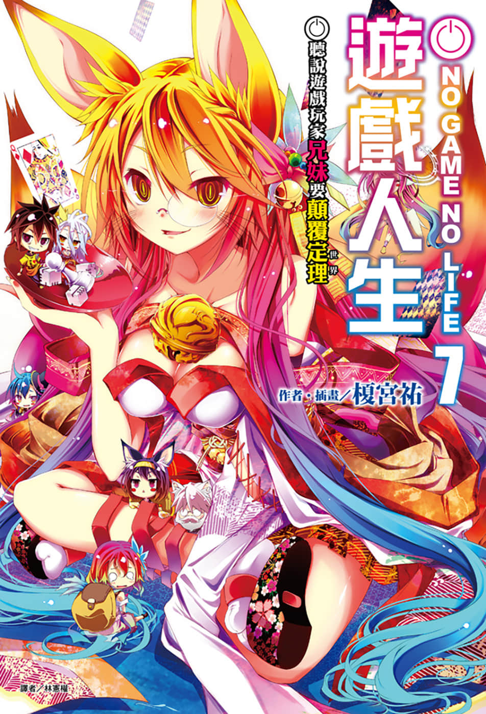
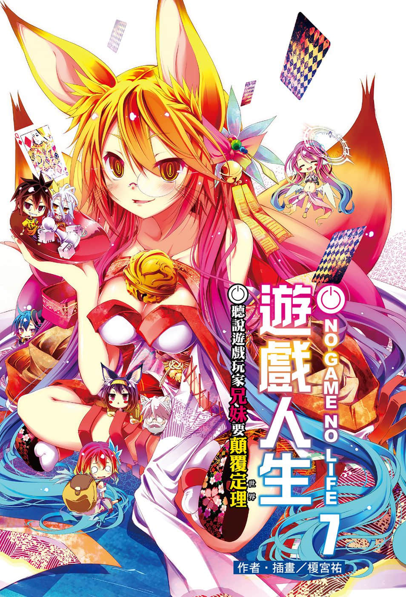
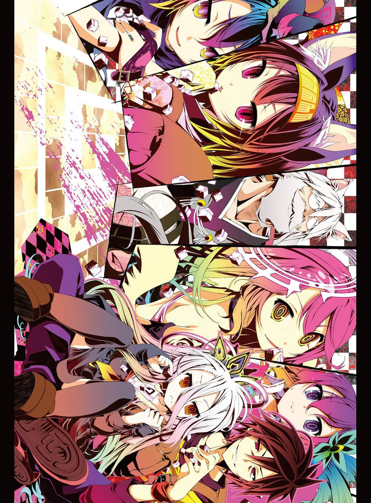
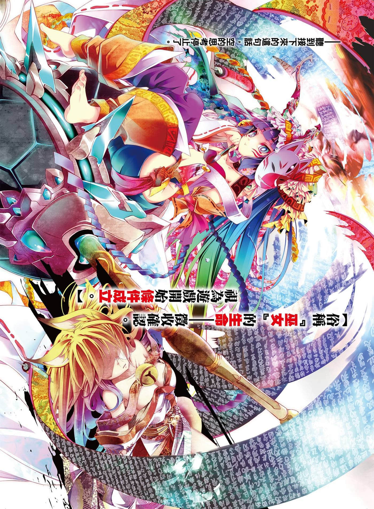
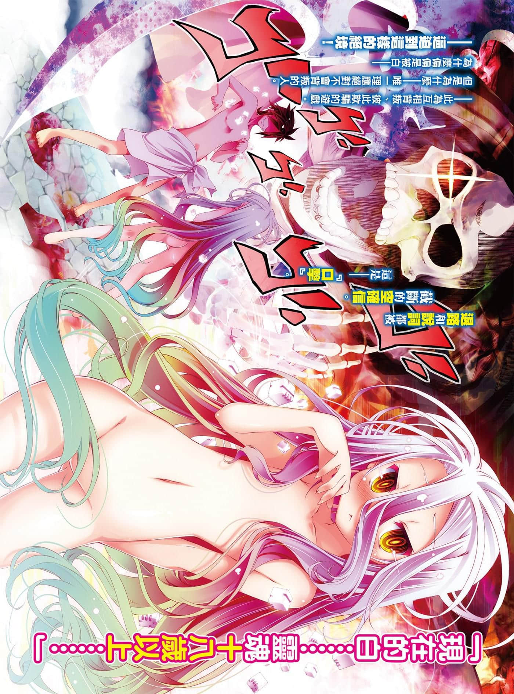
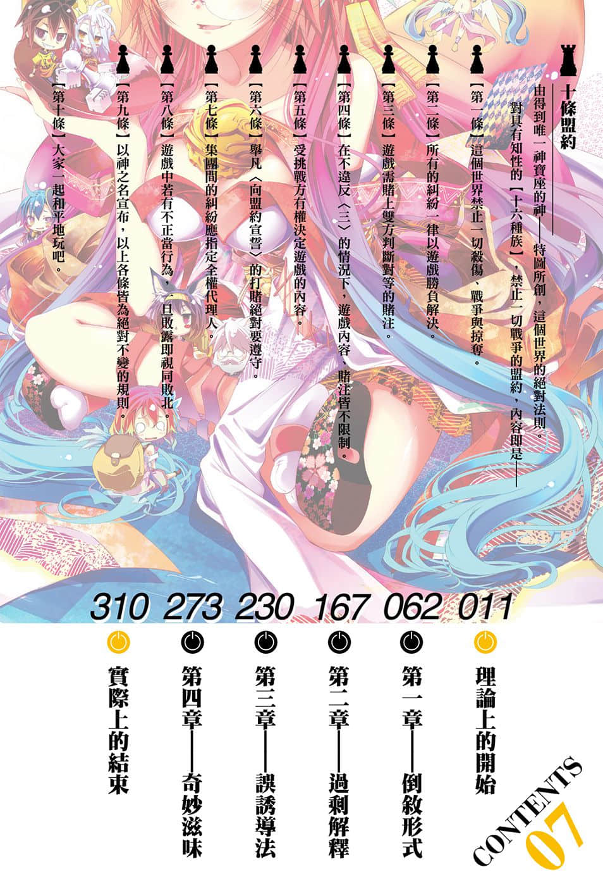

# 插图

> 来源：https://www.linovelib.com/novel/9/118067.html

台版 转自 深夜读书会

作者：榎宫祐

插画：榎宫祐

译者：林宪权

图源：深夜读书会

录入：深夜读书会

深夜读书会：ritdon.com

仅供个人学习交流使用，禁作商业用途

下载后请在24小时内删除，深夜读书会不负担任何责任

请尊重翻译、扫图、录入、校对的辛勤劳动，转载请保留信息

————————————————

【内容简介】

——『来吧，开始游戏吧。』

『最新神话』的超人气异世界幻想故事！

悠久大战终结后，【迪司博德】改变成为一切都以游戏决定的世界——但是，即使手段从暴力换成游戏，胜者蹂躏败者、不断制造牺牲仍是世界的『定理』。年幼时的巫女嗤笑……「根本什么也没改变」。

——不过，假使互相背叛、隐瞒、欺骗的人们，却也能够信任彼此的话。借由赌上性命的骰子，甚至能打破位阶序列第一位・神灵种的双六的话……

「届时我就相信能够改变——世界确实已经变成能够改变的世界！！」

承继『古老神话』的『最新神话』——超人气异世界幻想故事的第七集！！

【作者简介】

榎宫祐

【绘者简介】

我是榎宫！为了收拾家中，我正因要如何处理家中最大的不健全物──也就是『我』而困扰！这算可燃吧？还是不可燃呢？打电话给清洁队的话，他们愿意回收吗！？

榎宫祐

好久不见，我是榎宫。睽违一年的新书，让大家久等了。这一年经过动画之类，在公私两方面的连续变革，其中最大的改变就是我成为一个孩子的爸了──为了矫正以往的坏习惯，成为不耻于社会的大人，我正为收拾充满不健全物品的家中而忙碌。

