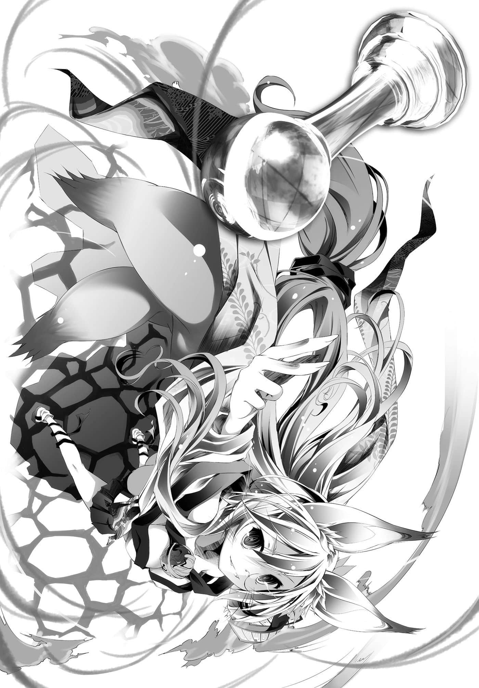

# 理论上的开始

> 来源：https://www.linovelib.com/novel/9/2099.html

——试着想像看看吧。

你现在正在进行某个网路对战的ＦＰＳ游戏。

你所站立的地方，可以将制作精细的舞台眺望得一览无遗。

那是在一座小山丘上，能够将激烈枪战中的喽啰们尽收眼底，那是多么风雅的景色。

看着眼前的景象，你不禁发出『人多得就像垃圾一样啊』的感想，手上则握有一把——『狙击枪』。

对于枪械不熟悉，或是不知道用法的人也请放心。

正如字面上的意思——那是用来『狙击』的『枪』。

只要翻翻字典即可查到，狙击的解释就是『自远处瞄准射击』。

如果是用来扫射并『冲锋』的『枪』，就会写成『冲锋枪』。

因此无论怎么想，那都是用来从远距离瞄准并射击的枪。

——没错，这是用来单方面狙击你眼下那群喽啰的枪。

来吧！既然已经确认完毕，那就悠然地躲藏起来，把枪架好！

来吧！看着瞄准器里的视界，轻松打爆二、三十个人头吧！

然后相信，你马上就会听到响亮如雷的热烈鼓掌为你喝采着！！

——诸如『去死吧芋虫㊟！』或『不长眼的菜鸟』等等……

（译注：原文为「芋砂」，指在ＦＰＳ游戏中狙击手趴着等待敌人上门的样子，引申为躲起来不主动攻击的消极行为。）

各式各样，如梦幻一般，热烈的怒骂言语。

——发生什么事了？用狙击枪狙击，结果挨骂了——就是这样。

不明白为什么吗？觉得没有道理吗？

真巧，当时天真无邪的少年，也和你有同样的感想。

——这时，突破青年布下的陷阱与狙击，上级者强者的短刀已然逼近……

六十年前——在将来被称为『东部联合』的某个边境山丘上。

是在说与其和别人携手合作——不如击倒对方较为有利。

……诸如此类，如此这般。

——就这样，在那一天，那一个瞬间。

——你这个大骗子。

——说起来所谓的『定理』，本来就是弱者为了胜过强者所构思的手段——『战略』。

打出了下面的讯息——『了不起，你真是帅毙了！』。

已经不必再为暴力而惧怕、痛苦了。

少女强行压抑因痛楚而发出悲鸣的身体，站了起来。

——随意反抗那样的常识，轻率地挑战定理，结果会如何呢？答案……就是这样。

——『十条盟约』说，不可未经许可掠夺、侵犯、杀害。

少女终于理解到那样的绝望，不过——她笑了。

身着一身染血的破烂衣服，少女仿佛乞求答案般落下泪来。

——那是谎言。

——当每个人都想占便宜得到乐趣，就会自然而然形成……那就是『定理』。

与其将力量用在支配弱者——不如用在保护上面才是有利的『定理』。

——为什么我还会受伤，恐惧暴力，为伤痛而苦呢。

就这样，少女就连生杀大权都被夺走，全身是血地倒在无名的山丘上。

就算兽人种被其他种族的人压榨，只要是不同部族，他们便总是幸灾乐祸。

——这个世界改变了。

如果战争消失了，那么为什么兽人种我们仍持续这样的内乱游戏！？

而是在说就算欺骗、谋取、威胁——不管使用任何手段——

若是正常成长的人，或许会认同那样的——『定理歪理』。

如果不必再为暴力惧怕受苦——那么为什么——

高耸直达天际，影子照落地面，从这个星球任何一个地方都能仰望的巨大西洋棋子。

强则生，弱则亡；胜则全得，败则全失。

仿佛布景般映出朱红之月，将暗夜一扫而空的天空——其尽头。

娇小的金色狐少女，眼神沮丧地仰望天空，心里这么想着。

过去因为激烈的怒骂而落泪的少年——如今他已成为青年。

那样的『定理』一定会被找到——不，她一定会找到那样的『定理』——

---

■ ■ ■

兽人种以那样的『定理理论』进行『内战游戏』，已经持续六千年以上了。

原来如此，贯彻龟点等待再施以狙击，确实是有效的战术。

就像现在这样——看着瞬间击破自己的对手，青年翻白眼笑着。

但那并不表示要保护弱者，更不允许软弱。

无论是对是错，败者就连发言的权利都没有。

——应该会有那么一个才对。

他们以尾巴或耳朵的形状、角的有无、毛色的不同，各自聚集成群，彼此嘲弄。

——没错，那个唯一神煞有其事地揭示的『十条盟约规则』。

正如下西洋棋，只是不断地乱下挑衅对手，并不违反规则一般。

今天这个时候，他也是手里拿着枪，在游戏内穿梭纵横……同时心里想到：

身为一个人，礼仪、礼节是很重要的，绝对不可以对尸体开枪。

在游戏上，那就等同于绝对不可侵犯的常识。关于这一点——

那是在游戏设计与规则上，经过最合理修改后的『最佳战法』。

与其亲手击倒对方——不如携手合作才较为有利的『定理』。

但是如果每个人都抱持那种想法，彻底采取龟点狙击的方式——游戏就不成立了。

呸一声吐了口口水后，他今天也手持狙击枪，布下地雷与无人自动机枪。

——那么我就要将那样的『定理理论』打破。

——每一种游戏都有『定理』。

据说位于那个棋子顶端的神，在早于六千年前高揭『十条盟约』，向世界宣扬——

在意识朦胧中，她瞪着巨大的棋子——终于理解了。

带来那样的规则，竟然还敢大言不惭地说——世界改变了？

而且那些全部只不过是——注定被打破的规则。

正如踢足球，只是在我方人员之间不停地传球，并不违反规则一般。

但是少女混浊的黄金眼眸中却这么想着：

他心想——既然如此，为何要实装狙击枪？

——那是错误的，兽人种之间应该停止仇视，彼此互助合作。

随意违反定理，当然会受到抨击，当然会遭到唾弃吧——！？

——每一种游戏都有『定理』。

但既然是与人对战，就会存在潜规则——只要违反就会惹人非议。

在诽谤中伤的声浪中，陆续转换据点，充满精神地四处奔驰，笑嘻嘻地继续龟点狙击。

要先让对方同意之后，再进行殴打、掠夺、侵犯、杀害——只是如此而已。

即使那个『破解定理的方法』也注定会被破解——不过那样就可以了。

——再说所谓的『定理』。

只不过是那种程度而已，游戏就无法成立——那样的中级者『定理撒娇行为』他才不管呢。

那是谎言，一切的一切都是弥天大谎——！

什么也没有改变……只不过是为了互相残杀争夺，而多出一道手续而已。

但是青年却是个走到哪里都丢人现眼的典型废人家里蹲尼特玩家——他的成长过程造就了这样的他。

『弱者棋子没资格说话』——却被如此渺小的恶意所践踏。

倾尽谋略与恶毒手段，成为能主宰他人权利的——全权代理者支配者。

就连这个恶毒得令人作呕，名为必然的『定理理论』也没有例外。

只不过是有个人违反了『定理』，然后受到理所当然的批判——如此而已。

口中说着：怎会这样……宛如垂死一般趴在键盘上流泪。

每个人都不只是受人支配的弱者棋子。

原来如此，『定理理论』是——只要追求自己的利益最佳，自然就会形成互相支配的局面。

那是在游戏设计与规则上，经过最合理修改后的『最佳战法』。

在一切都以游戏决定的世界里，那就等同于绝对不可侵犯的常识。

每个人都是自己的全权代理者棋手，才会有利的『定理』。

她要颠覆这个恶劣的常识——创造出『破解定理的方法』。

与其将力量用在保护弱者——不如用在支配上面才是有利。

——但是，很遗憾，这件事没有丝毫的不合理。

…………呃～我说到哪儿了？对了！所谓的『定理』！

年幼——却聪慧的少女，依照她的感性，常识性地提出这样的异议。

大战结束，战争消失了，权利受到保障。

不管几次，在持续破解了无限次『定理』的最后——

——随意反抗那样的常识，轻率地挑战定理，结果会如何呢？答案……就是这样。

如果权利受到保障，那么为什么金色狐我们要被夺走一切！？

如果讨厌那样——那就不要当弱者棋子，就成为强者棋手吧。

本来就是弱者为了胜过强者所构思的手段——『战略』，而且——！

只不过全都是注定被打破的规则！

少女瞪视着那个瞧不起自己的『定理』——招致那个必然的制定者，她做出一个决定。

如果随意反抗就会导向败亡是『定理』——那么就狡猾地反抗吧。

比欺骗、谋取、威胁更为阴险，更为卑鄙，更为彻底，更无比恶毒的手段！

——无论使用任何手段，她都要傲慢地，做到连自称改变了世界的唯一神骗子也没做到的事。

她要靠着他们，用自己的力量——改变世界。

她的胸中就是怀抱着那样荒唐无稽，只有小孩才能被容许的——永无止境的梦想。

很久很久以前，在一座无名的山丘上，一间无名的神社下，没有名字的黄金狐少女。

她梦想着——即使任由那个位于棋子顶端的存在，使用所有规则内所认可的一切。

她仍能嗤笑着，得到能够颠覆任何『定理』的手段，也就是——

————果断进行了前所未闻的『大诈术』。

就这样，将持续了六千两百余年的内乱，从根底加以蹂躏的——『风暴』产生了。

不管是愤怒还是憎恨，隔阂还是芥蒂，一场不由分说的风暴，将那些全部席卷而去。

从争夺不休的人们身上夺走一切，甚至连争执的余地都不留下，在风暴过去后，此时——

——一个『国家』诞生了。

那个国家体现了过去少女的梦想——荒唐无稽的理想其中的一部分。

短短半个世纪就成为世上屈指可数，鼎鼎有名的大国，那个国家名为——东部联合。

……那个幼小的黄金狐已经不在。

如今她被称为『巫女』，成为所有兽人种敬畏的存在。

而她幼时所布局的『诈术』，如今则是——

「好了——那么差不多该开始游戏了吧，碍事的神明大人？」

远古以武力互相残杀，如今仍以别的手段游戏彼此争夺怨恨的人们。

「这证明你是个连神也会想冲上前痛揍的人……了不起。」

只有这个『定理』——无法颠覆。

各自背负巨大的重担，年龄、种族、性别也不统一的人们。

---

■ ■ ■

巫女因此而感到绝望与失望，不过——

——借由巫女之口说话的人，并不是巫女。

「……哥，不要紧……你没说什么……特别的话。」

「……空真厉害，得斯……」

「死猴子……你难道得了只要有一瞬的严肃就会死的疾病吗……？」

弱者棋子再怎么挣扎也绝不可能跳脱棋盘之外。

「还没有请教你的名字耶？」

就为了颠覆——建立在唯一神制定的秩序下，等同于绝对正义的『定理』。

不说别的，少女年幼时所施行的『诈术』，就证明了这一点。

面对卷起气流的神威，他只是受不了强风似地用手挡着，笑着继续说道：

对于那样的事实，巫女甚至感到爱怜，在意识上露出苦笑。

「干脆别比游戏了，用言语的暴力杀死神如何？如果是空陛下的话，有可能办得到哦。」

她曾表露过如此『不愉快』的感情吗？更何况——

对空来说，他说这些话或许像呼吸一样自然吧，竟连触怒神的自觉都没有——神对渺小人类种一句不经意的话感到愤怒。

——『挑战者Ｐｌａｙｅｒ』与『祈祷者Ｐｒａｙｅｒ』。

他不是向神灵种，而是对着被困住的巫女低头说话。

不过同时巫女也心想——现在的她大概无法理解这些人吧。

「欸、欸欸欸！？三、三号史蒂芬妮・多拉因为不想死，所以坚决拒绝——」

他们是胆敢向神挑战，做出这种有勇无谋举动的一群令人怜爱的傻瓜。

『无法避免死亡的生命有限之人啊，为何汝等如此愚蠢地急欲寻死，吾实在难以理解。』

——但是过去那个少女已经不在那里了。

非但是东部联合，范围甚至笼罩艾尔奇亚的力量，风暴的根源。

——过去无名的金色狐少女所怀抱的梦想。

那样的压迫感，如果不是有『十条盟约』，恐怕就已经让在场所有人都消灭了吧。

「……欸、等等——我说了什么特别让她愤怒的话吗？」

或许是因为太过愤怒，又或许是专注在创造的工程上吧。

「不、不愧是主人！竟然打算『气死』神，多么地深谋远虑——！！」

——不是以区区一颗棋子祈祷者的身份，而是对等的对手挑战者。

寄宿在幼时巫女身上的诈术——『神髓』。

在那里的是，就连过去的少女也想像不到的光景。

「……二号白，十一岁……没有闲工夫等待下次……机会……」

神灵种语气平淡地，要求他们亲口宣誓导致自己毁灭的宣言，不过——

「虽然他们是一群完全无法信任的家伙——不过正因为如此，请交给我们吧。」

尽管内心困惑，兽人种少女初濑伊纲正要配合著接话时——

「五号～一向有如空气一般的布拉姆，我很识相地任由情势发展……」

他打断正准备举手宣布游戏开始的众人——提出问题。

这个世界不管走到哪里，都是强者Ｐｌａｙｅｒ以弱者Ｐｒａｙｅｒ为棋，尽兴游玩的棋盘。

「因为……哥……光是呼吸……就能让人狂怒。」

对于这样的事实——巫女忍不住笑了出来。『神髓』寄宿在这身体里已有半世纪以上。

透过如今已成为傀儡的巫女之身，统辖那股意志力量者开口了。

他的妹妹白——或许是放弃抵抗强风了吧，只是任由白色长发纷乱飘飞，半睁着眼回答。

更何况全员虽然各有不同想法，但目的却一样——

神的不悦，令在场所有人——就连天翼种吉普莉尔也不禁动摇。

「咦？对于一个即将惨败的对手，记住他的名字应该是最低限度的礼仪吧？」

身上寄宿着神灵种的巫女，透过朦胧的意识，看着站在眼前的那一群人。

天翼种少女吉普莉尔面露危险的笑容，打断史蒂芙的话，对神下达命令。

被称为神的『诈术』——卷起了纯粹且庞大的『力量』…………

『汝等的戏言吾确实听见了，那么就证明给吾看吧，不过——』

『——那么就宣誓吧，用汝等的话语，亲口在这无聊的游戏中，刻印下汝等的死亡吧。』

「点名！！一号空，十八岁处男！帅气回答是人生苦短！」

——『破解定理』……存在着明确的尽头。

——以上七名。

被宣告急欲寻死——以『神』为对手挑起胜负游戏的——七个人影。

「啊，在那之前可以问一个问题吗？」

做为珍贵的有常识的人物——人类种少女史蒂芙，泪眼汪汪地发出悲痛的叫唤。

不管是力量还是寿命，甚至存在方式都不同的种族代表们，如今齐聚一堂，共同欢笑。

「可以跟神灵种玩哦？若是错过这样的机会，那就不配当个游戏玩家了吧。」

「啊、我、我们绝对会揍——胜过那个一副臭屁模样的神明，得斯！」

毫不在乎地笑歪了嘴角，年轻的黑发人类种——空大喊着回答。

同时，在现在也快要中断的思考中，巫女——看见了。

朦胧的意识中，看到他们和乐融融地喧闹的样子，巫女暗自笑了出来。

神的支配一时放松，身体顺从巫女的意志，提出这个问题。

他那仿佛薄幸美少女的面容，有如放弃般，挂着干笑回答道，然后——

接着报上名字的是吸血种少女——更正，少年布拉姆。

『——知道名字又能如何，最底层的存在啊。』

就如同经过透彻研究的游戏，会如井字棋那样先下先赢一般。

「四号，空大人与白小姐的不肖奴隶吉普莉尔。比起那种事，对于只有我被排除在『生命有限』之外，我伤心到不小心要发出『天击』了——我命令你，给我更正那句话❤」

只见白竖起大拇指，笑着告诉愕然不已的空。

俯瞰耗费一生构筑的祖国——她心里想着：

巫女看见巫社——从那里扩展开的巫雁首都的摩天大楼，以及东部联合诸岛屿的众多都市……

于在场聚集的所有人面前。

过去无名的黄金狐所倒下的地方，那座无名的山丘、无名的神社。

在『挑战神灵种』这个疯狂愚蠢的行为下，还这么地和乐融融……

长大成人后的少女——巫女，有一天……发觉了。

伊纲也重新仿效祖父的动作，战意全开地说道。

这群与紧张感无缘，丝毫没有可靠的要素——

「——那么，真的好吗？」

——视点往下看去，意识回到巫社庭园。

持续破解无尽的『定理』——为了追求那个尽头而打造出的国家。

在如今东部联合的首都巫雁——被称为『巫社』的这个地方。

迈入老年的兽人种男子——初濑伊野按着她的头，一起跪了下来。

「我、我就说吧！！因为我并没有那个意思——」

空以仿佛与场面不合的轻松态度，语气慵懒地出声了。

人类种、天翼种、吸血种、兽人种——

那是力量笼罩巫社，不，遍及首都巫雁——甚至跨越大海。

——冲击令大气为之震撼。

借由已经等不及宣誓，开始创造出游戏盘的神的视线。

「……？六、六号，得斯？伊纲——欸！」

「请您放心，巫女大人。」

「——我的过失，那时所犯下的过错——你们愿意为我改正吗？」

巫女这么说着，缓缓将手伸向空中。

只见雪白的手臂一个翻转，光辉闪耀的『士兵』随即出现在手掌上。

那是货真价实的『种族棋子』——兽人种的棋子。

改正『那一日的错误』——清算自那一日起就一直累积的负债。

如果不那样做，自己就没有资格与他们一起和乐融融地欢笑。

不过，如果能做到那样的话，到了那个时候——

「那样的话……东部联合——兽人种将会与你们共进退。」

——但是对于不断苦恼挣扎的巫女……

「嗯……老实说我实在不明白，巫女小姐到底吃错什么药，为什么要这么严肃呢？」

被怀疑罹患一旦严肃就会死的疾病的男人——威风凛凛地说道。

「如果要改正的话，首先让我们先从你严肃的态度这个错误开始改正吧！！」

挑战等同天下万物的神灵种——空以这样的身份高喊『拒绝严肃』。

或许是不知道巫女的烦恼与挣扎——又或者是知情的吧。

兄妹俩宛如孩子般的眼神里，只是充满了期待。

「我们是如此地幸运，能够有机会以这样的阵容和神灵种进行游戏！！」

「……而且……如果要玩游戏……当然是我们获胜……因此——」

「理所当然地！极为自然且必然地！不管是东部联合还是神灵种，包含其他琐碎的东西，我们艾尔奇亚联邦将会全部得到！！不会多也不会少——这样的事实很浅显易懂吧？」

——他们的表情就像是充满感慨的孩子，不明白大人为什么想得那么复杂。

巫女的眼中已经不再映出的东西——确实地映现在他们的眼中。

——只是大家把它变得复杂了而已——？

就如这两人所说，世界真的就是那样单纯。

——『唯一神我主动』攀谈可是要回答哦♪

从虚空响彻四周的神灵种的声音，只是平淡地继续说道：

——世界一点也没有改变。

【——若事态是这样的结果，『星杯』应该已知。】

「因为你们的误解，糟蹋了这个游戏，所以我想看看你们失败后哭丧着脸的样子，这个『用意』如何☆」

对于特图的呼唤，自虚空响起的声音回答道。

仿佛受到扭曲的星球，忍不住要让天地听到它的悲鸣——

如果只是自己没看见只有孩子才看得见的那个世界的话？

因此那一日，所有目击到那个现象的人。

「决定谁最傻的游戏——『比赛愚蠢』的话，我们没有道理会败给神吧。」

届时世界将会再次改变吧——那个时候……好，我就承认吧。

照君所愿，如君期待，既简单又单纯，决定谁是最傻的傻瓜，这般浅显易懂的游戏——

如果研究透彻的游戏，会演变成如井字棋那样先下先赢的话——

对于过去创造天空，粉碎大地，定义万象的存在所感到的——惧怕已经告知答案。

——我要哭了哦！

所以——

世界确实已经改变——变成可以改变，能够改变的世界了——！！

当那个答案出来的时候，我就稍微——向你道歉吧。

能够行使那种违反常理的『奇迹』者，会是怎样的存在呢？

【——伪。自异界召唤那两人来此的人可是汝哦！明示汝之参战是何意图。】

长大成人后，不知何时已然梦醒，巫女心想——如今就再一次沉浸在那样的梦想中吧。

没错，虽说是神灵种，使用的力量也太过头了吧，对于特图这样的自言自语——不！

——我没什么企图，真要说的话只有期待而已……

——夜晚的黑暗被粉碎，白昼的亮光遭撕裂。

——当证明他们赢得这个游戏，胜过神灵种，胜过她的时候。

要向唯一神特图攀谈，即便以神灵种的力量也极为困难，不过——

众人也一同，宛如要突破这狭小的庭园般举手高喊——

于鲜血、灵魂、存在所刻印下，经过悠久时间仍未淡化的——恐惧已经做出回答。

——究竟你只是个骗子，还是我的头脑太笨。

力量成为波动，波动转变为物质形状，概念受到定义而出现。

身为神却不惜做出这种不必要的演出，他一边流着鼻水，一边——发牢骚。

巫女也感到好笑，然后她忽然想到。

那种既不逊，又荒诞，且不合理的力量，撼动了整个星球。

不管是『挑战者Ｐｌａｙｅｒ』还是『祈祷者Ｐｒａｙｅｒ』，都是取决于——自己想要成为哪一种存在。

如果这个世界游戏，是由神灵种进行种族棋子的争夺战，为了得到对唯一神的挑战权而战斗的话，那么唯一神自己『参战』到底有何用意——听到声音这么问，特图则是嘻皮笑脸地笑了。

——就只是那样单纯的『游戏』。

——另一方面，在世界尽头的巨大西洋棋的顶端。

借由模仿宇宙开辟，复制创造天地的神技——在空中诞生了大地。

这次就只是变成——从谁能取得先手的这个游戏开始而已。

听到伴随苦笑的这一句话，挑战神的傻瓜们各自露出笑容。

——世界上所有的人都目击到那个现象。

---

■ ■ ■

「……所以……我们……不可能会输……」

在遥远的过去，大战终结的那一日，提出盟约的他所说的话并不虚假。

歌颂无止尽的尽头之人，看到齐聚一堂的人们也传染了相同的热度。

那是一名神灵种在短暂的时间里，建构出的广大游戏盘——

「——哈哈☆我有点意外耶，没想到你还相当爱摆派头呢？」

一个单纯明快的理论武器，便推翻了巫女小聪明的绝望。

（……现在我还不会道歉……自称的唯一神……）

与回答时的稚气相反，那是特图毫无虚假的真心话——他是怀着期待的。

诞生于空中的大地连绵不绝，最后化成一道螺旋，卷起漩涡，筑起高塔，甚至仿佛要直达月球——形成一条天之回廊。

幼时看不见的那个『单纯的世界』——是否映在空与白的眼中呢？

在场蠢动不已、汇聚已久的神力登时溃堤。

「……虽然不想承认……但是看来我也上『年纪』了呢……」

祈祷着——啊啊，『神啊』——除此之外，别无他法……

除了一件事外，没有其他能做、该做的事，而那件事即是——

————【向盟约宣誓】————！

巫女将兽人种的棋子往上一抛，同时——空愉快地这么大叫。

「好了——让我们开始游戏吧——！！」

---

■ ■ ■

留下那样的期待与嘲讽，巫女的意识逐渐消失在强光的彼端。

规模扩张到覆盖东部联合以至艾尔奇亚全土，一个天空的大陆。

「——那么就拜托你们了。」

——不幸能理解发生何事的人，理性也会受挫，被迫感到战栗。

特图正抱着装满鼻涕卫生纸的垃圾桶，擤着晕红的鼻子……

【——问。此次事件是汝之作为吗——『星杯』的保有者啊。】

「对于无聊透顶的事，能够认真到何种程度，这就是那种较量谁比较傻的竞赛对吧？」

「别去想那些麻烦的事了，这个世界可是——『游戏』哦！」

漂浮在极东海面的岛屿上产生的力量所引起的——『再创造』。

特图不满地摆动双脚，目光注视的是——诞生在天上的新土地。

猛烈的力量如海啸般涌来，受到翻搅的意识中——巫女心想：

幼年时的少女因为这样的想法，进而怀抱亲手改变的梦想。

真正的『神』——统治这个世界一切的唯一神特图——

「我不站在任何一方——这句话要我说几次你才懂啊……哈啾！」

「……被人骗子骗子地叫，除此之外又风评受损，这样不会太过分了吗？」

两对寄宿着强烈意志的眼眸，愉快地这么诉说着。

响起的是依循『十条盟约』，开始绝对遵守游戏规则的宣誓呐喊。

——即使无法理解发生何事，靠着本能就足以颤抖了。

对于一直叫你骗子之事……我会轻轻吐个舌头，说一句『抱歉啦』——

特图蛮横地强迫回话，脸上却是不在乎的笑容，又将一张擤过鼻涕的卫生纸丢入垃圾桶。

不管是强者棋手还是弱者棋子，那都只是彼此挑战、被挑战后的——纯粹的结果论。

发生在转瞬间的再创造，不可思议地，就连在星星的里侧都目击到了。

「哈啾！哈啾！嘶……那不是我做的啊，我今天还真是常被叫到呢。」

棋子在头上高高飞起——仿佛要飞向在遥远天空、卷起风云的神灵种一般。空对着它——

遵从说出「世界已改变」之豪语的唯一神骗子所订下的规则，这样的宣言一出……

「……『想看我的脸，就看未来吧』……你就不能像这样把话说得浅显易懂吗……」

特图苦笑地这么说着，然后手掌伸向空中。

「我引以为傲的就是我与你们不同——我的品味高尚啊。」

浮现在他手上的是——唯一神的证明。

「我早决定好奉行不看未来剧透的主义，我和你们有这样的程度差别哦♪」

——『星杯』。

做为绝对支配权的概念装置，那是——容纳『全能之力』的容器。

存在于这个宇宙的力量，只不过是偶然从容器滴落的碎片程度而已。

对于能够任意操控那种力量的特图而言，本来不管是时间，甚或形而上的因果关系——都已经毫无意义。

创造与破坏，过去与未来，甚或观测与确定，他都能随心所欲。

要看神灵种哭丧着脸的未来——甚至创造那种未来都很容易——

「那样作弊有什么好玩的？你看过未来之后，难道有发生过什么好事吗？」

——尽管不到拥有『星杯』的特图那种程度。

如果是神灵种的话，也看得见某种程度的未来吧，特图有如讽刺般地笑了。

「——我只看过去。」

说完这句话后，特图消去垃圾桶，取出一本书与一支羽毛笔。

那本书是由神所收集、书写……仍然有大半是白纸。

「所以对于这场游戏的结果——对于后续的发展，我才会这么想知道记述，内心期待不已。」

拒绝全知的神所期待的未来。

那是记述神也无法得知的神话——尚未存在的故事。

究竟哪一个才是真实，或者——

也有人认为，世界奇怪复杂，因为永远无法明白，所以没有意义。

但是飘浮在眼前的她却是——『连那样的感觉都没有』。

「啊～嗯，冷嘲热讽和煽动，都纯粹只是、顺、便☆我找你的正题是——」

「你的名字就连『星杯』也不知道，告诉我吧！不然没办法写上去——」

「……呃～……？这里是哪里？这个女孩是谁？我又是在这里做什么呢？」

只见原本同样失去意识，倒卧在地的众人，一个个地开始清醒过来。

宛如体现他亲手创造的这个世界其本质一般——

「不是别人……创造出拥有心的机械那孩子的你，原来是长这个模样——」

将一切全部卷入，用最恶质、恶劣，如同小孩般的方法——

那个对任何事物都没兴趣的眼眸，就像是人造物一般，空虚地追逐着不是此处的某处。

『她』不可能会听信特图的话。

自从来到这个世界迪司博德以后，遇见的女人个个都是——美得没有底线。

关于在游移视线的前方——『有个非常可爱的女孩一事』。

——吉普莉尔、史蒂芙、布拉姆、伊纲、伊野。

他们一定会用——不惜强迫、连累他人、不由分说的方法。

在撼动天地而构筑出的巨大游戏盘的深处。

「…………嗯……哥……？……这里是哪里……？」

——『问题一』是非常重大的问题。

特图叹着气，羽毛笔在手中的书上挥洒。

——空小声地嗯了一声，然后重新环视四周。

古老神话那两人的意志，生出我，生出『星杯』，让我——改变世界。

视线向周围环视一遍，仅仅是那样的一瞥，他就看出——两个问题。

但是看到他们每个人都面带困惑地张望四周——空一改先前的认知。

若站在偶像旁必定会招来公开处刑的公主殿下；顶尖名模也要自惭形秽的天使；使自身的萝莉属性觉醒，甚至会觉醒到绝对会被逮捕，助长犯罪的兽耳幼女——每个都是这样的程度。

————醒来吧。

——这世界上只有这一位。

仰天猛烈反省的空，听见睡眼惺忪的一号白小姐的问题。

——在遥远过去的那一日，世界是真的改变了呀。

——这时他想到，不管是怎样的对战游戏，既然要观战，就应该声援吧。

在空脑内的三百人委员会，制定出了官方美少女排名的变动——也就是说。

特图认识寄宿在巫女身上的『神髓』——于眼前扭曲世界者。

他拉着白的手站起，望向眼前的『暂定二号小姐』。

……不过特图将接下来的话吞了回去，勉强地……试着露出笑容。

——是因为拒绝全知吧。

在那里既没有绝望，也没有对死亡的恐惧，只有茫然地——『放弃抵抗』而已。

这依然不是什么问题，空满不在乎地回应。

————噗滋！

简直就像洋娃娃——但是那巧夺天工的美貌，却半强制地令空移不开目光。

可是居住在世界的人们玩家，自己必须希望改变才行。

一个处男还敢胡吹什么……这样的训斥非常合理——但是！！

「大家加油吧♪我一直都是帮全员加油的嘛～啊哈哈☆」

「……我也很期待下次见面时，可以用名字称呼你哦！」

也有人认为，世界持续不断改变，即便是现在这个瞬间也在改变中。

将问题依重大性设定过优先顺序后，空以极为冷静的头脑，依序思考。

就连这个正题也是煽动，特图像是毫无这种自觉般笑着说道，对此神灵种的反应是——

——不管是过去还是现在，那些是人、机械、兽——还是神……

——就算不知道她是谁，然而她是什么存在却再清楚不过。

……………………

不知道暂定的二号小姐的名字，那就无法帮她排名了吧————！！

---

■ ■ ■

在空间留下刺耳的破裂声，通信就此切断了。

身为游戏之神的我拿着『星杯』，确实地——亲手改变了呀。

哈……对于自己优越的状况判断力，空自鸣得意地笑了。

【——汝是为了这样的『戏言』而呼唤吾吗？】

为了不错过通往最新神话的人物们的一举手一投足，特图只是注视着——

对于看腻美女的空而言，这是极为重大的问题。

反过来了吧——！一般该先思考这问题吧！！什么优越的状况判断力呀，白痴，这样子——

衷心期待能以过去式记述的那个瞬间，特图坐下来，盘起双腿。

「……唔哇……竟然拔线了……身为玩家那样做对吗？」

为喜爱的玩家加油也好，出人意料的黑马也不能错过。

好似对于每个人都怀疑的事实，极力主张并非虚假一般——独自思考着。

身上穿着虽与东部联合样式不同——却属东洋风的优雅服装，手拿着一支长年使用的笔。

有人认为，世界丝毫没有改变，也不可能改变。

将所有的人——逼迫至不得不改变的地步吧。

有人认为，世界很单纯，就连小孩也能理解。

将这个天地变为棋盘，法则变为规则，确实是……改变了。

缺女友的经历仍在更新之中！

因为他们每个人似乎都没有记忆了——不过……

空想到人在面临龙卷风或巨浪之类的自然力量时，大概就是这样的感觉吧。

可是即使改变天地，却仍存在着没有改变、不能改变的东西。

……极为暧昧随便地，替全部的人加油。

仿佛将身子从地面剥离般坐起，尚未从梦中醒来的眼睛四处游移——

特图低下头，仿佛回答所有问题一般。

背后无数的书卷如翅膀或薄纱一般展开，铁色的眼眸冰冷地俯视这里——不！

毕竟那是只要开口问就能解决的问题，那就是——

话虽如此，『问题二』并不是多大的问题。

——她的『神髓』不允许她听信。

…………

初次见到吉普莉尔时，感觉到的是宛如被大口径火炮对着，一种对死亡无情的恐惧。

——空深切地猛烈反省，他搞错了问题的优先度。

——到了那时候。这个棋盘上的世界游戏才会终于……在真正的意义上开始。

天地开辟以来最好玩的游戏，一定终于可以写上——开始了。

——我以前也曾经有过那样的时期啊。他发出这样的感慨，然后准备将眼前的少女，排在本委员会不动的『一号白』之后——就在这个时候，空发觉这关乎到后面一个问题，于是姑且决定思考另一个问题。

看来『问题二』即使问了也无法解决。

像这样——关于『对此没有任何记忆答案』的这件事。

她始终保持沉默，想要测度特图的真意，特图不由得苦笑。

「——你们会为我改变吧！？会颠覆『一切』，来到这里吧！！」

那是一名飘浮在虚空中，坐在约有一个人高的墨水壶上，单手撑着脸颊的——年幼少女。

要为谁声援呢——经过思索之后，唯一神很快地抬起头。

「——嗯～……虽然不知道，但这也没问题吧。」

特图这么说着，带着苦笑，指著书上空白的页面。

半梦半醒间听到这句尖锐的话语，空醒了过来。

但光是无谓地看惯这么多女性，事到如今，普通的美女已经无法令空感到狼狈了。

因为我无法，也不可以——连居住在世界游戏的存在玩家都改变。

全新神话他们的意志，这次会连玩家一切也改变。

就连要思考抵抗都不允许，如同体现一个自然的呼吸般的存在感，明确地给予了答案。

——这就是『神』。

那是十六种族的顶点，森罗万象的显现，位阶序列第一位——神灵种。

——不过，既然如此，事情就简单了吧，空夸张地大喊。

「这里是哪里？是游戏里！！我们在做什么？在进行游戏！！完毕！」

关于这里是哪里，这里就是原本知道的场所——没错，原本。

东部联合的巫社庭园——但是如今眼前却轻易地竖立了七扇门。

然后，往上一看，头上飘浮着宛如遮天蔽日的巨大大地。

——原来如此，空并不记得开始了那样的游戏。

但是却有为了挑战神灵种，从艾尔奇亚出发前的记忆。

那么他们与神灵种开始游戏，条件里有『剥夺记忆』吧——不管怎样，这都没有问题。

「我、我从来没小看过主人，但是我不曾像现在这样对主人感到畏惧——」

「……在神灵种面前，你竟然还能像没事一样……那样的心脏哪里买得到呀？」

空就像个对台风兴奋不已的孩子，各种声浪朝他传来，不过——空只是苦笑。

跨越绝望与恐惧，甚至对人类而言是无法理解的超越性存在——！

喔喔，多么地可怕啊……！！

——但是身为『人类』的空，简单来说——没有任何感觉。

面临龙卷风或巨浪等自然灾害时，地球出身的现代人会做什么事呢？

做为现代人的义务，应该会取出手机拍照上网分享吧。

就这样，空靠近暂定的二号小姐，企图从低角度拍摄推测为神明的她时——

所以那就如同神灵种所说——『生命』被征收了。

如果巫女的身体有呼吸，有脉搏的话——他们应该早就察觉了。

这么宣告之后，神灵种便随着巫女的尸骸消失了。

「…………哥。」

04: 『同行』的情况。在宣言之后，同行者只能前进代表者掷出的点数。

对于从背后呼唤的白的声音——空的心里却没有回话的余裕。

在彼此审视的视线交错中，空咬着指甲，再度自问。

【汝也该自知言语的重量——若汝是有此等智慧之人。】

16: 该神灵种在游戏『无法继续』时，有权利征收除领先者外全部参加者的一切。

——以兽人种的五感，在奔过去之前应该就知道了。

——原来如此，正如神灵种所说，这个游戏……似乎是『双六』。

只是飘在空中，便甚至令吉普莉尔也脸色苍白——以那样的神为对手。

08: 骰子保有者除非达成【课题】，或是时间经过七十二小时，否则无法从格子移动。

看到伊野与伊纲颤抖的背影，空拼命安抚快要混乱的思绪。

【『贰』，凭依——俗称『巫女』的生命——征收确认，视为游戏开始条件成立。】

没错，胸前——不知不觉间出现在全员胸前的十个白色正立方体。

她的眼神就像看着脚下的小石头，是一对既不关心，也没有感情的眼眸，不过——

11: 【课题】可依照内容，使那格的环境产生变化。

10: 各个【课题】将记述于立牌上，依不同顺序配置在盘上的格子内。

12b: 除了出题者以外不可能达成，或任何玩家皆不可能达成的指示。

不止空，对于灌进脑中的规则，能够立刻了解的人都是同样反应。

留下来的是空等七人、七扇门，以及——

06: 玩家在游戏开始时，有权力制作各五十个【课题】。

那瞬间看到的眼神，空……感觉似曾相识。

现场残留的困惑、疑惑，或者愤怒、焦躁，混浊地堆积起来。

00a: 游戏盘虽是现实的仿造，但在那里发生的事象，包含死亡在内，全部都是现实。

07: 【课题】可强制停在格子上的骰子保有者，听从任何指示。

那个眼神瞬间就消失了，只见神灵种用手中的笔指着天空。

（译注：掷骰前进的一种图版游戏。）

在困惑、疑惑与焦虑的情绪下，他们看向彼此的脸和——胸前。

12a: 限定某特定【课题】对象者的叙述。

——就这样轻易地……将那个『规定』，不由分说直接灌输进包含空在内的全员脑中。

然而不知她是否看出空内心的想法——或者根本无所谓吧。

伊野发出悲鸣，好似要踩碎地面般踏步飞奔过去，伊纲也追在他之后。

00b: ——骰子保有者中，有一名未被征收记忆的『背叛者』。

做为对手没有不足之处，空的内心充满期待，但是——

——沉默。

他们要向这个规格外的存在——神灵种挑战游戏。

但是这样的话——

——到底是怎么回事？

——听到接下来的这句话，空的思考停止了。

————这是怎么一回事？

13: 到达最终格终点的骰子保有者即为『胜者』，游戏视为结束。

——听到肯定推测的话语，只有空与白得意地笑了。

09: 借由达成【课题】，骰子保有者可以从出题者手上夺取一个骰子，但未达成也会被夺走一个。

被那过于压倒性的存在感所遮蔽。

仿佛要看透两人，或说是在两人体内的某种——『某人』一般。

「————？」

「——什么……！？巫、巫女大人——！？」

12: 但是包含以下在内的【课题】将全部视为无效。

——这到底是怎么回事……！！

————这究竟是怎么回事啊……这个情况——！

两人抱起瘫软不动的巫女，呼唤着她，但……

02: 骰子保有者可掷出保有的所有骰子，前进所掷出点数的格子数。

这才发现飘浮在半空的神灵种正下方……有个人影倒在白木造的阶梯上。

骰子每掷一次就会减少一粒，到达终点的人获胜——就是这么回事。

在头上扩展开的那个螺旋的大地游戏盘，投掷这个白色立方体骰子，走格子前进。

然而神灵种对动摇的众人——不，对这世界的一切都没有兴趣的样子。

那种条件怎么可能通过……是巫女自己希望的吗——还是说——

——冷静下来，记忆的话倒也罢了，巫女的生命是『开始的筹码』？

12d: 以人类语以外的言语书写的叙述。

那对眼眸确实捕捉到空与白的身影。

——那毫无疑问是……巫女的……『遗体』。

空虽然言词轻佻，但表情却充满无法掩饰的焦虑。

【……话语本来是创造之手。】

那个似曾相识的眼神与超越种——神灵种实在太不相衬，但——

【游戏开始条件『壹』，挑战者们过去二十四小时的记忆——征收确认。】

至今一直不发一语，眼神没有映出任何事物，只是动笔挥毫的神灵种。

14: 该神灵种对『胜者』有义务履行其权利所及范围的所有要求。

【要知道神的话语，对汝等这种底层存在太过奢侈了。】

03: 骰子掷出后，将以乱数决定点数，之后将会失去『一粒』使用过的骰子。

05: 超过两名的同行，使用后的骰子将会失去『总同行者数×伴随者』数量的骰子。

——不管怎么做——

【吾在终点等待，汝就毫无作为地花费注定的生命，在地上爬着——到达终点吧。】

神灵种对空轻佻的言语——以绝不改变的冰冷眼神回应。

她平淡地、无感情地、无机质地，只是如『确认』般地说道：

始终毫无感情地，以散发冰冷光辉的眼神，平淡地宣布——不！

「……别偷懒，开口说明啊……对身为神明的人来说有那么困难吗？」

12c: 叙述中对骰子保有者指定不依照掷骰点数的进退格数。

仿佛梦一场，又甚或从最初就不存在一般……转眼便消失得无影无踪。

而『开始的筹码』也就是二十四小时的记忆——状况就是如此。

15: 所有玩家失去骰子或是死亡，即视为『无法继续』，游戏就此结束。

——都会演变成玩家间互相残杀的游戏吧——！！

【好了……汝等所希望的『双六游戏㊟』——即刻起开始，宣布『规则』。】

01: 七名参加者，将会分得以自己『质量存在时间』依比例分割而成的十粒『骰子』。

空流着冷汗，细细地检查规则——不断不断地反覆检查……

确实，规则中有许多不协调感，这根本就很奇怪吧——！

「……哥……哥……回答我啦……」

这个游戏，若不抢夺他人的骰子，原理上是不可能到达终点。

如果一个人可以写五十格，全体的格数就是『三五〇』加『终点格』。

但是假如每次掷出骰子就会减少，那么即使持续掷出六点——最多也只有『三二四』。

更何况这是『囚徒困境㊟』的情况——除了互相争夺骰子之外，不会有其它结果。

（编注：是博弈论的非零和博弈中具代表性的例子，反映个人最佳选择并非团体最佳选择。）

没错，如果不夺取他人分成十等分的『生命骰子』就无法抵达终点。

——那么最根本的问题！

「………………哥，要是再无视白……不回话的话——」

——这应该是『以神灵种为对手的游戏』吧——明明如此！

为何神灵种会成为『游戏主持者』——

演变成让玩家彼此厮杀的局面——

「……白就……拉下内裤……掀起裙子。」

「唔哇住手哥哥在这里现在就回话！？」

——比起各种危机，空更优先应对这个紧急状态，那就是——

为了保护妹妹的贞操危机，空强制中断所有的思考，以几乎要卷起冲击波的气势，猛然回头——

「————————————啥？」

然后，看到被白拉下内裤的史蒂芙与——

这个游戏说穿了就是——

……等一下。

「全员将【课题】以空白的方式投入，然后全部的人各将九粒骰子，集中在一个人身上。」

「——————————————什么？」

「……啊啊，就是说啊～哥哥完全被你骗了呢，啊哈哈～这家伙～♪」

——空觉得自己是个笨蛋，也因此引以为傲。

不过，那位给他看见瞬间桃花源的伟大人物妹妹，不理会史蒂芙，面无表情地说：

她哭着这么主张，却遭到漠视，空依序向盯着自己的视线看去。

——即使有所失策，这个『盛大的误判』连空也思考过，不过——

如果是那样的话，那就非常抱歉了。

将当下的 光景 深深地 刻印在心中。

「……如果是……『平常的』哥哥……就不会有问题……」

「……欸、什么？一点都不可以吧！？会、会死吗！？」

「啊～那个啊，那并不是什么问题。」

不淘汰其他玩家就没有胜算。但——

理解事态后，史蒂芙愤怒地大叫，不过空仍是笑着继续说道：

这个游戏特地以『消除游戏前的记忆』为条件而开始。

可是这样的话，最多也只有『三二四』——绝对到不了终点。

「简单说就是『双六』啦，掷骰子，以终点为目标，在头顶上的那个棋盘前进。」

就像这样——终于理解状况后，空露出苦笑，转身面向史蒂芙。

「这样就会瞬间・诞生『持有六十四个骰子之人』！！掷一次最大值是『三八四』——搞不好有可能掷一次就抵达终点！没有人变成零，也没有人会死……你可以爱上我哦！」

「好好。」

空一脸笑容地否定那个推论，这么一来不只吉普莉尔，伊野、伊纲、布拉姆——不，就连白也讶异地皱起眉头。在这样的情况下，只有空一人苦笑。

「而只靠十个骰子绝对无法到达终点，所以解决之道唯有增加骰子。」

「然后这个骰子每掷一次就会减少一个。」

史蒂芙依然充满戒心，手按着裙子叫道。

非但如此，若论笨蛋的程度，他甚至自信无人能及。

吉普莉尔战战兢兢地提出的，正是——这个让人疑心生暗鬼的规定真正的用意。

抵达终点的格数，包含终点格在内一共『三五一』格。

「这时候——就使用【课题】，夺取他人的骰子——这样你懂了吧？」

头脑简单的程度依然值得信赖，且有实绩为证，不过现在那样的她反而令人觉得可靠，空露出笑容继续说道：

「——开什么玩笑啊——那种事我怎么可能认同！！」

「嗯嗯。」

即使有针一般犀利的视线从各方位射了过来，忘了状况的空依然心情大好，不过——

——规则没有禁止『让渡骰子』，那么——

那种像是某骗人游戏般超严肃的剧情发展，那种老套的『剧本理论』，该不会有人期待吧？

他正将桃花源反覆播放，处于前所未有的贤者时间里。空对那些视线浑然不觉。

虽说状况险峻，但那样的自己——到底吃错什么药——

她表示，在哥哥负责的范围内，自己——不必担心任何事。

欺骗全员，准备了某种计谋让自己能够获胜——是名符其实的『背叛者』。

史蒂芙整个人僵住，不过空依然笑嘻嘻地，用一如往常的态度继续说道：

「——我是不懂啦！真是抱歉哦！」

「…………为什么史蒂芙会在这里？」

「你不用隐藏真实的内心哦！因为『十条盟约』的关系，如果不是潜意识里许可、同意的话，内裤是脱不下来的……因此那是你所希望的事————」

——空在脑中连按『回忆』指令。

「如此对待我，竟然还问我『为什么在这里』？这已经是霸凌了吧！？」

恢复平常状态的空嘲笑道——事情才不可能发展成那样呢。

不管怎样，如果换成存在过的时间——也就是年龄归『零』的话会如何——相信您就明白了。

「……哥，冷静下来了……？」

「史蒂芙啊……你终于不再隐瞒你的暴露癖了吗？不，我可是一点也不介意哦！」

「……呃～……白，该不会是哥哥发现得——晚了？」

要把骰子集中给谁呢？——不，问题在那之前。

迟了一瞬悲鸣响起，史蒂芙慌张地按住裙子，重新穿上内裤。

空说完，从飘浮在胸前的白色正立方体中……捏起一个空白的骰子。

「没错吧？谁都不想死，我也不想死，所以——我们这样做。」

这件事——既然没有人自白……那么意图就很明显了。

那么视陷害全员的『背叛者』的记忆而定，就连胜利条件都有可能改变……！！

「嗄啊啊啊！？我、我是被白偷偷地擅自从背后脱下的耶！！」

掷出之后，应该就会随机浮现点数吧，而那个骰子——

————

听到空总结后的规则，一行人审视彼此的眼神顿时转为锐利。

————等一下等一下等一下！！ 话说……

以巫女的生命做为『开始的筹码』，这个大家都不可能认同的状况，照理说便已经不可能发生了。

莲花随着佛陀之声而盛开，空甚至用手结起手印——但他的动作顿时停住。

空说着自嘲地笑了，不过以笑容迎接他的白却丝毫不焦虑。

「————我现在头一次觉得真的爱上你也没关系……」

这是已经被用到烂的，明明只要互相合作就能胜利，可是却无法合作的剧本吗？

那种老套的手法理论谁管他——谁是背叛者？

揭发游戏——空因为自己在负责的范围内略逊一筹而沮丧，白则说：

「骰子数量剩下零的话就会死，或者说永眠升天过世往生——到这里还可以吗？」

从以这样的阵容参加的那一刻起，那种老套的戏码理论——早就先排除掉了。

白、吉普莉尔、伊纲、伊野——然后是布拉姆…………

这是以神灵种为对手进行的游戏，可是却——

没错，空领袖不可能没注意到这一点。

「可、可是主人……如果无法找出『背叛者』，那也不可能吧……」

「啊——啊啊啊啊啊啊！？突、突然对我做什么呀！」

顺从重力落下的裙子之间——那一瞬间奇迹般的缝隙。

规则所说的『质量存在时间』——正确地说就是『消灭』吧。

也就是说，『有某件事』只有『背叛者』才知道。

——竟然会这么严肃地思考。

「呃～……虽然觉得不必问也知道，对于规则，你——」

更何况打从出生以来，空只知道这种生存方式，根本对那样的手段嗤之以鼻。

——原来如此，有背叛者是吗？

00b：——骰子保有者中，有一名未被征收记忆的『背叛者』。

空毫不迟疑地在脑内按下Ｘ钮。

——『是谁都无所谓吧』。

「夺取他人的『生命骰子』——只有间接地互相残杀才能到达终点。」

「这个是年龄——也就是『生命』。」

为了互相窥探谁是背叛者而疑神疑鬼，破坏彼此之间的羁绊——大家一起步向灭亡。

「……没说……是白的……」

简单地说就是赌上寿命的游戏，但是用『寿命』的话，没有寿命的家伙吉普莉尔就会成为问题。

史蒂芙直觉地表达内心的想法，似乎真的很感动的样子，但是——

「……白也……不明白……状况……」

白说着握住空的手，她手掌的触感，让空认真地……反省了。

「麻烦死了，『背叛者』——就当作是我吧♪」

就像这样，空露出非常完美的笑容，草率地排除掉所有的可能。

…………

…………紧接着是比海还深的沉默。

那是无言、困惑、怀疑的沉默，不过空却将之解释为『不服』。

「咦？以这样的成员玩游戏，你们觉得我不会背叛吗！？那、那我就说出我的根据……」

——我现在开始想，你们等我一下。

这个自称背叛者的人，光明正大地宣告要想些歪理圆谎。

「也就是说，『背叛者』就是动了手脚，要瞒过所有的人，让自己一个人获胜对吧？」

空这么说后喘了口气，然后轮流指着在场众人。

「那么，首先伊纲是『清白』的，在彼此欺瞒的竞争上，她不可能赢过我和白。」

——伊纲耳朵一动，圆睁着大眼。

「老爷爷也是『清白』的，他不可能有胆量不惜利用巫女的生命也要赢过我们。」

——劈哩一声，伊野的眼镜出现裂痕，脸上血管浮出。

「布拉姆也是『清白』的，他输给我们输到体无完肤，不可能背负那样的风险。」

——只见布拉姆锐利地眯起眼睛，嘴角一歪露出冷笑。

「吉普莉尔也是『清白』的，只要我和白对她说一句『自己招出来』就结束了，更何况要骗过身为主人的本大爷胜出，这么大不敬的事情，她连想都不可能想吧～？」

——吉普莉尔吃惊地睁大双眼，接着露出危险的笑容。

「然后，你根本就不用提了，排除，丝毫不用考虑！证明结束！」

「喂！？只有对我的推论这么草率！？」

————可以打从心底认定，他们全员都会背叛，对吧？

众人朝着门后分别隔离的房间走去。

空停止舞台演员般夸张的动作——啊啊……

然后，当他们走出来的时候——空悠然地露出轻松的笑容。

比起某骗人游戏的严肃剧情发展，这样的方式还比较适合这个世界。

——因为如果是这样的成员，反正——

——或许是察觉到哥哥的意图吧，白也露出小小的微笑。

没错……这是『游戏』。

这个游戏非常单纯，背叛者——不管是谁都无妨。

「就是这样！明明是和神灵种进行游戏，却变成玩家自相残杀的矛盾解除了！现在已经证明这是相互合作的游戏——『只要相互信赖就能获胜的游戏』！所以放心地投入空白【课题】，将骰子交给敝人——啊，不，让我说得更郑重一点吧。」

用就连神也会爱上的笑容与甜美的声音。

「最后，我与白是『两人一组』——完毕，这样的说明你们满意了吗？」

有无数的事情，不需要记忆就能断言，比如说——

没错，那方式正是——

特图那家伙用豪华的演出，声称是空与白梦寐以求的理想国度——这个世界。

……听到空这么说，每个人各自前去填写【课题】。

「…………啊……」

——龟点狙击无视常识有什么不对？

「为了协助我获胜，仆人们，把你们的『性命骰子』全部交给我，做为信赖的证明吧❤」

十八岁的处男空，别说别人——他自己就不可能采取正当的手段。

一切以游戏决定的——『盘上的世界这个世界』。
