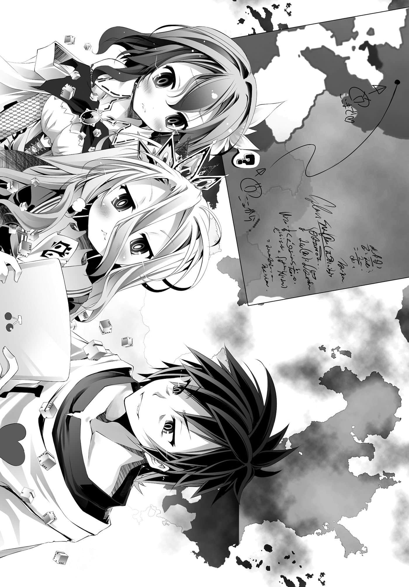
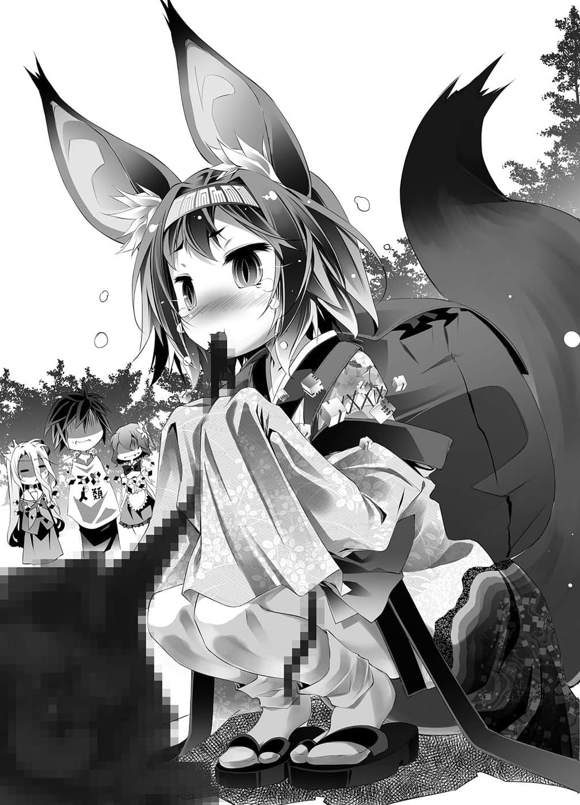
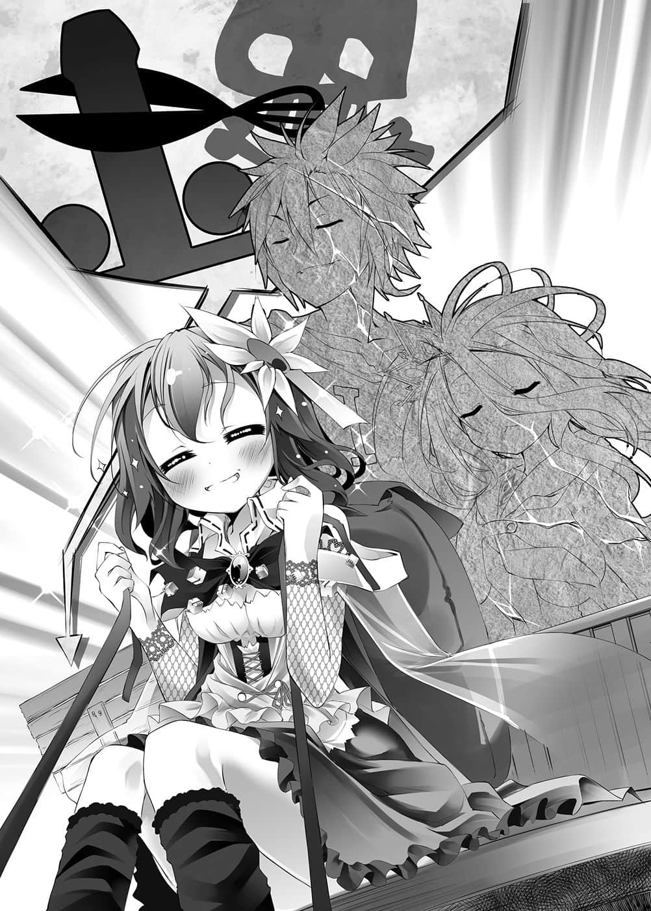

# 第一章 倒叙形式

> 来源：https://www.linovelib.com/novel/9/2100.html

——自从开始与神灵种进行游戏，如今已经过将近七小时。

而现在，空奔跑在暗夜中的小巷里——

——被钢筋水泥切割成四方形的夜空中没有星星。

敲打在柏油路上的是稀疏的小雨，以及急促的脚步声。

自己手上拿的是一把手枪，映入眼中的只有逼近的人影——『敌人』。

『————呿～～！』

一声咋舌，瞄准敌人，以机械式的思考扣下扳机。

击铁敲打雷管，弹匣内的炸药产生反应爆炸——手因冲击而颤抖。

从固态转变为超音速的气体，将枪身内的一切推出，使之加速——

——枪口喷出的铅撕裂大气，闪光照亮人影。

未满毫秒的过程，铅与光化为疾驰于黑夜的凶器。

以可怕的速度逼近的人影——袭向被闪光照出的娇小兽人种的身体。

——没错，是瞄准『身体』……不是『头』。

像这种来历不明的游戏，不能相信手枪这玩意儿的威力。不，即使是空所熟悉的原本世界的手枪，打在人体最坚固的头盖骨上，只要射入的角度有所偏差，子弹就会滑过骨头。

更别说『敌人』不是人类……是兽人种和更强力的怪物们。

空瞄准的是连结下颚与两胸之间的三角区域，不管打中何处都会夺去战斗力，若是逼近中心，就有可能对内脏造成致命的破坏——追求残酷且合理的杀害，射击出的子弹最后撕裂娇小的兽人种敌人，使她随着逼近的速度在路面滑行——变成一具尸体。

——杀死了，没错，杀掉她了。

这个游戏真是单纯，空说着阴沉地笑了。

——如果不知道谁是背叛者，那么是谁都无所谓了。

除了不可能背叛自己的人——除了妹妹之外……只要把全员都杀掉就好了。

即使如此，还是不能输——空就是赌着这样一口气存活至今。

——准星比思考更快地瞄准那个人。

绝望的台词——不过这种时候说这种台词，肯定是在插旗。

无数的脚步声从远处缓缓地逼近，慢慢地包围过来。

无法预测的剧情发展再好不过，但超展开就不行了。

再说那句台词是怎么回事——『我深信不移的人……明明只有你呀』？

【完】

空环视四周，一边警戒一边整理状况。

——那个自称天使的噁心怪物。

『一开始便这么做就好了……对吧，背叛者先生？』

迟了一拍，空明白了，子弹似乎是从红发少女背后飞来的，贯穿了他的腹部。

——在那里有游戏吗？『有』。

当然与神灵种的游戏——『双六』，也丝毫无关。

在那样的地图里，建筑物的高低差、复杂的巷弄、设置在各处的装饰物——

敬请期待空与白的下次作品。

没错，这是单纯的游戏，空躲藏起来，露出苦笑。

——『啊，这是不可能获胜的游戏。』……他们说了这句话。

然后彼此点了点头，爽快地忘了一切，躲进民宅里——打定主意要逃避现实游戏。

…………

而同样理所当然地投掷骰子后，空等人往『六十二』的数目前进，但是在前进一格，踏入第二格的时候，他们仰望天空，望向最近的民宅。

『——不是的……那是虚张声势……——』

妹妹这家伙是背叛者假货的伏笔，到底始于何时？在何处出现过？

——是啊，我到底是为了什么而努力的呢？

——好了，应该不用说也知道了吧。

……就这样，两人尝到初次的败果，『 空白』的故事到此完结。

——就这样，两人的人生画下了句点，进入后记。

看到红发少女的身影——空的准星不受控制地晃动了。

那是个白色的少女……在这场绝望的游戏中，为了找寻一同存活的对策，与红发少女同行的——妹妹。

空叹了一口气，躲进暗巷里，侧耳倾听四周的动静——以上就是整理之后的状况。

看着那样的画面，手里拿着遥控器的空，忍不住含泪呐喊。

白色少女——披着妹妹外皮的背叛者某种存在，缓缓朝这里走近。

脚步声在坚硬冰冷的柏油路上踏响，面对死亡的逼近，空终于——能够肯定一件事。

唯有那家伙——空实在不觉得拿她有办法。

只有一发枪响，接着冲击传来，但是尾声却缓慢降临——白色少女最后的声音，在黑暗中冰冷地……静静地响起。

毕竟『敌人』都是无法正面与之交战的怪物。

少女很可疑。与其说可疑，倒不如说，要找到不可疑之处还比较困难。

在躲藏的民宅中，他们发现了东部联合的『家用游戏机』。

身体不受控制，无法动弹，朦胧的视界捕捉到，贯穿自己的魔弹射手——

只见闪光再度照亮暗巷——毫不留情地闪了两、三次。

对于她激昂的呐喊，空想说「不是」……

『……再见了，哥……』

但是空的嘴巴却无视心中的想法，话语接连不断地说出口。

累积至今的计谋、战术、战略——到底是为了什么——！

映在画面上的既不是空与白，自然也不会是史蒂芙。

『……骗人……我深信不移的人……明明只有你呀——』

像这样——用嘲笑的目光，看着即将死去的哥哥的——某种存在。

不不，真的请等一下。

单单只为一个理由……『为了妹妹』。所以自己才忍受种种超级难度，努力到这个地步。

——她嘴唇停下，混浊的眼眸再也看不见任何事物。

「……哥……以处男之身死去……是怎样的心情？」

『我……做错了什么……我是为了什么而努力到这个地步……』

尽管白连连说那种行为『肮脏卑鄙』，但空仍不择手段存活到现在，然而——

『像你这种——到处杀害大家的人，如果你不是背叛者，那会是谁！？』

第一掷，骰子就减成八个——年龄减少十分之二，兄妹的四肢缩短了。

然而妹妹——不可能背叛的人却背叛了……那么答案就是——

——无声无息，只感到冲击传来。

听到这句恸哭的呼喊，红发少女倒抽了一口气，但——太迟了。

可是，如果那唯一的理由是假的的话，那自己的努力、辛苦究竟是……

虽然想要说话，但从口中满溢而出的却是血块。

……不理会茫然自失、张大了嘴思考停滞当机的空。

『那是……那个时候……不那样说就无法保护你和妹——』

这个红发少女的背叛在预料之内。

空带着一半无奈一半期待的心情思考，这时他的耳朵捕捉到踏入暗巷内的脚步声。

『要是能和妹妹会合的话……不，照这个情况，那也是不能期待的吧。』

已经有一半呈现漆黑的视界里，映入红发少女倒地的身影。

倚仗无数的地形优势，空解决掉大型兽人种、吸血鬼、小型兽人种等三人。

「喂，白，那句台词是骗人的吧！你是看哥哥不懂兽人语，所以随便说说的吧！！不要说出那么可怕的话，万一我不小心哭出来，你要怎么负责啊！？」

但对于和神灵种进行的游戏，他们好似已遗忘在前前世记忆的彼端。

————等一下。

---

■ ■ ■

——就这样，黑发青年失去了意识。

『在这样的包围之下，你是怎么……不，这些事以后再说，我妹妹和你在一起吗？找到对策——』

把有背叛嫌疑的所有人都排除——这么单纯的解答，就是这个游戏的剧本理论。

空向全员要求让渡骰子，然而众人写完【课题】走出门外后，却理所当然似地，不，非常理所当然地表示——『这张战帖，我接下了。』

『是你啊……真正的背叛者——打从一开始就是……「假货」……！！』

全部都是欺骗击杀——佯装成同伴，再从背后射杀；以谎言诱骗出来，再施以狙击。

——游戏一开始，就在空大肆宣言自己是『背叛者』之后。

——在与东部联合的游戏中曾见过的那种类似东京——却又有哪里不同的风景。

在以各自的话语、感情，表达出这样的意志后，他们便自行投掷骰子，自行出发前进。

——啊，这游戏是粪作。

『有……我找到对策了。』

——瞬间，有如天启一般，空一切都想通了。

『不准你用妹妹的模样、外表……用那样的眼神看我啊啊啊啊————！！』

那种事应该早点说啊，回收前才出现的伏笔，那根本就不叫伏笔吧！

单纯——但是却轻松超越极难，是超难等级炼狱的游戏。

空带着气愤赞同这句台词，这同时也是他在认定此为粪作之后仍持续质问的话语。

空发出呻吟，因开枪而烧得火红的枪口，微弱的红光映照出散发硝烟味的人影。

——有不玩的理由吗？『没有』。

仔细思考零秒，两人无言地启动游戏机，清爽地开始逃避现实。

不懂兽人语的空——暂定十四・四岁，把字幕显示调成ＯＮ。

枕在空盘起的腿上，玩着平板电脑的白——暂定八・八岁的她，负责念出字幕配音。

白表现丰富又带点即兴发挥地，翻译所有角色的台词。对于妹妹令人意外的演技能力，空心想——为什么平常说话不这样简洁明快呢？——怀着如此深刻的疑问，过了大约两小时——

空终于抛下遥控器，抓住游戏盒抱怨。

「本来我还期待东部联合也有『丧尸游戏』……结果这游戏真是烂透了啊。」

照白所说，游戏名称似乎是『ＬＩＶＩＮＧ ＯＲ ＤＥＡＤ３～沉默的代价～』……的样子。

听说这个游戏的续篇——外传是『ＬＯＶＥ ＯＲ ＬＯＶＥＤ』，也就是他们与伊纲比过的那个游戏。

本来因为那绝妙的品味而心怀期待，一玩之下却是这种惨况。

剧情设定如下——森精种进行死者复活魔法的大规模实验，但是很老套地彻底失败，失控的魔法产生出活死人什么的，然后扩散到世界什么的。

假装还活着的背叛者活死人，混入同伴之中什么的，就是这样高纯度的白痴游戏。

不过那也没关系，白痴游戏？我很喜欢啊，但是——

「到底是出于怎样的判断，竟然会让『长翅膀的肌肉兽人种丧尸』登场，脑袋是不是有问题啊？」

想起所有攻击都不管用，自称天使的噁心怪物，空就想呕吐。

没错——那是噁心的怪物。

因为那东西可是半裸的，不，几乎是全裸，只穿了一件丁字裤。

见微知著，那就是这样的西洋风高难度超展开粪作。即使如此，空还是忍了下来。

这都是为了唯一的良心！『妹妹角色』，拥有可爱兽耳的白色萝莉！

……结果却是这样——空忽然想起主角的台词。

——史蒂芬妮・多拉气喘吁吁地叫道。

——『啊，还有，如果没有人到达终点，除了领先者以外都会死，就这样❤』

「…………呃～……什么？」

「……哥，你这样硬拗……是要……拗到哪里去……？」

如果全员的骰子——六十四个都集中给空，他就会变成『一百一十五・二岁』——正常地衰老死亡。

「啊啊等一下等一下！可是不用说也知道那些话都是在鬼扯吧！？」

史蒂芙即使看出了也不知道该怎么办。

但是回答的却是巨大的声响与怒吼，以及——

「嗯～……不过那倒还好。嗯，仔细想想，那可是奖赏啊。」

听到白立即回答，史蒂芙摇晃着货车，大吵大闹。

「……解释什么？咦、该不会是……我宣告自己是背叛者的理由？那是——」

「——你在说什么？」

在那种时候，对着将分成十份的生命——骰子，其中的九粒交出的史蒂芙。

没错——就像书写【课题】之后，立刻就背叛的那些家伙一样。

「……只要可疑就全部杀死——为什么认为只有自己不会遭到背叛呢……」

「是你们说『除非拿杠杆来，不然我们不会动的㊟』，不是吗～！」

「——白，我做错了什么吗……」

画面之中，主角正将他的特权——即使插了再多死旗也会变成生存旗的不合理能力，发挥得淋漓尽致，正如老套情节般，在某处清醒过来。

就算没有看穿谎言的感官能力兽人种——但就连史蒂芙也看得出来，那正可说是一文不值的演技。

空愤怒地把盒子一丢，趴在榻榻米上怒吼道。

史蒂芙喘一口气，自虐地大叫。

05：超过两名的同行，使用后的骰子将会失去『总同行者数×伴随者』数量的骰子。

生命逐渐衰减，那是多么恐怖的经验呢，不过……

她说着这种肉麻的台词，把自己的九个骰子，交给了空。

既然这个游戏不管怎么做，每当前进『生命骰子』就会减少，那么……

他让头脑放空，再度想起那句台词。

那个情状与多娜多娜ＢＧＭ㊟很相配。

「被你们两人那样实验与恐吓，我的心情是如何！请用七个字回答！！」

「如果你是认真这么说的话，我会回答你、的、哦——！？」

「……『我干不下去了啦』……我想是这样……」

——『虽然不知道你们真正的想法，不过……』

…………哎呀？

那样的『常理理论』——应该是每个人都会有的想法吧。

——『你会后悔帮助敌人哦？』布拉姆诡异地说道。

——没错，一开始空与白就有『刻意不去触及的规则』，那规则就是——

——『……不要的话……也没关系……』

——『我……做错了什么』吗？

「好了，只要我像拉车的马那样拉车就好了吧。就像字面上『拉车的马』的意思！」

---

■ ■ ■

甚至在自己被杀时，她的眼神也好像看着垃圾——

「你背叛了我，还要我不能背叛！强制逼我同行，却抛下一切，『为什么躲在屋子里不出来』、是、这、样、对——吧！？」

——『能够挑战主人是我无上的光荣。』吉普莉尔恭敬地说道。

对于空与白讶异的回应，史蒂芙抓着头大吼。

——『是啊，那么——好了，我们要请你和我们「同行」哦。』

——而伊野则是回以一句『去死吧』……毫不矫饰，直接了当——

增加九粒骰子的时间而变成『三十四・二岁』的空，与白一起带着满脸笑容——灿烂到阴森恐怖的笑容，俯视着史蒂芙。

被史蒂芙这么一吼，空手摸着下颚，开始思考。

权衡之下，她恐惧颤抖，吞下悲怆的感情；即使如此，她仍做好觉悟——

「即使把骰子集中给空，你也无法与白个别行动吧～～！？会被那种饵钓到的蠢蛋，是啊是啊，就只有我了吧～～～～！！」

04：『同行』的情况。在宣言之后，同行者只能前进代表者一人掷出的点数。

——没错，空的『背叛者宣言』没有丝毫的真实可言。

「……嗯哼！……不、不过问题还是在剧情吧……」

也就是，对着只剩一粒骰子的年龄……退化至『一・八岁』的幼女史蒂芙。

——『我相信你们——不会让谁死掉或互相残杀。』

——『嗯，年龄的增减只会影响身体，保有十个以上的骰子年岁就会增长。』

更何况依这个游戏的设定，只要拥有十个以上的骰子，年龄就会依数量增长。

但是空对后续的发展已经失去兴趣，他转了一圈，仰望天花板。

然后就像挖土机铲土一样——如文字所述般，利用杠杆原理，让惊讶的两人坐上货车。

「我决定把骰子交给你，结果就在我这么做后！大家纷纷言词尖锐地发表背叛宣言！！」

「是啊，是啊，仔细想一想，当然是在鬼扯吧——！」

「来！我依照你们的希望，弄来『杠杆』了哦！！」

那是纯度一〇〇％，无浓缩还原添加物的——弥天大谎。

「我茫然地看着大家毫不犹豫地掷出自己的『生命骰子』前进离去——在那种时候！」

（编注：意第绪语歌曲，曾被翻译成包括日文在内的多国语言。）

就这样，史蒂芙不由分说地将货车推入室内，逼近空与白。

于是，史蒂芙毫不留情地，将窝在屋内不出来的两人搬上车出货了……

「然后呢！差不多也该给我一个合理的解释了吧！？」

空咋舌一声，不过同时——他也思考了『这个状况』。

「背叛者必遭背叛，这只是必然的结果吧……」

不过——正因如此。

「正、确、答、案～❤——我～～～～要生气了喔喔！？」

——『你就在这里孤独地待着，身上只有一个骰子——』

——不使用这个『同行』规则，两人就无法前进。

——『……那么哥……既然确认过……没问题了……』

——『……如果你想……等到大家都死掉……的话❤』

那是拉着货车冲破大门、闯入室内的红发少女。

「我做错了什么？错的是制造出这种游戏的工作人员的脑袋啊——！！」

空抗拒着眼前的光景，语气略带逃避。史蒂芙的呐喊仍持续着。

「是啊是啊，那是为了让笨蛋我上当对吧～？这个我已经明白了啦！」

空呈大字型趴在地上，看向画面。

竟然要七个字，这个题目相当困难呢——他这么说着。

见到现实中的妹妹，眼神就像看着垃圾一样，空咳了一声。

「喔喔！白！刚好七个字！！不愧是填字游戏高手！！」

——她脸色苍白，颤抖地把存在过的时间——『进行生命让渡』。

她胸前的骰子和空与白——两人同样是八个——年龄缩短至十四・四岁。

——第二格……空呈大字型，躺在史蒂芙所拖的货车上，被玩着平板电脑的妹妹当作床，两眼无神——愣愣地眺望着两小时前断定为『不可能获胜的游戏』的光景。这时史蒂芙对他大叫。

「就算我再怎么笨，你都已经演戏演得那么明显……你可别真以为我看不懂啊！！」

那与同伴之间互相争夺——间接性地自相残杀相比……哪一个比较好呢？

为了『妹妹角色』不断忍耐，结果那个妹妹却是『假货』的超展开剧情。

——『这个挑战，我接受了，得斯！』伊纲可爱地说道。

（译注：这句话是源自日本一句惯用语『即使拿杠杆来也搬不动』，用来比喻意志坚定无可动摇，结果史蒂芙真的拿杠杆来了。）

因此，从史蒂芙那骗来了『九粒』骰子，再加上白的『九粒』骰子后，空他们依照规则宣告同行，掷了二十八粒骰子——然后一人减少两粒，共计减少了六粒骰子。

「……别再生气了嘛……我不是把骰子确实还给你了吗……？」

再将骰子重新分配——把骰子还给她后，三人各自变成八粒骰子，不过——

「除非你说明怂恿大家互相背叛的理由！！不然我会一直闹下去哦！？」

从空的举动可以看出，空的目的是有一致性的——『拉拢史蒂芙』。

……以及——

————『帮助全员背叛』，除此之外没有别的可能。

对于空所说的互相残杀——为什么要刻意『诱发』这个本来想要回避的事态，史蒂芙持续地提出这个问题，空则是静静地——

「呀啊！？什、什么……呀？」

空将双手贴着史蒂芙的双颊，让她转向自己，凝视她的眼睛。

她忘了愤怒，不自觉地脸红起来，空以诚挚的眼神——告诉她。

「相信我，交给我吧，靠着爱、勇气与友情的力量，大家一定可以——胜利。」

————

「……你在等我吐槽吧？可以请你反省一下自己的过去吗？」

对于询问为何怂恿他人背叛说谎的人，空的回答是『相信我』。

面对如此矛盾的艰深问题，史蒂芙以冰点以下的冰冷眼神回应。

「什……为什么、为什么不相信我！？我是这么地纯洁，你是怀疑我什么！？」

「顺便我也希望你反省一下现在！？具体来说就是把我当成『拉车的马』的现在！！」

空动作夸张地垂头丧气，史蒂芙则是发动追击。

他双手贴着史蒂芙的双颊，真挚地向她诉说——说来确实很好听。

那么保持沉默这个选项——实际上并不存在。

『你觉得大家会信任我吗？』——以众人对自己的不信任为根据，断定大家不可能不互相背叛，史蒂芙听了仰天说道：

——『所有的谜团都解开了，犯人就是我们。』——就是这样。

如果要那些成员我们同意的话，那也是个方案吧？

「……先取得胜利……就只是如此……而已。」

特地用『消除游戏前的记忆』来开始游戏，在那之后才公开规则。

赌上爷爷之名，用浓眉大眼宣布。

【贰】若有一方自白，自白者可获得『无罪释放』，保持沉默者将会被处『十年徒刑』。

空再度仰躺在货车上，让白躺在他的胸前，然后笑了出来。

空一笑之后，语气夸张地、高亢地——自称・清纯地，做出宣言。

「因为只要相信彼此会背叛，就能得到『比「较佳」还要更好』的『最佳结果』♪」

「………………什么？」

空语带讽刺地补充说明，史蒂芙闻言一边推着车，一边回过头来。

「……囚徒困境……吗？」

「…………不过那也要能撑到目睹游戏的结局就是了……呵、呵呵……」

一切都在两人一手主导，策划出的计谋之内。

但是只要囚犯们追求自己的利益，就一定会变成——『五年徒刑』。

——不过如果背叛的话，就只有自己能够获胜。

史蒂芙就像是在说——除了『不信任』以外，找不到其他要素。

不过不管怎样，开始游戏的大前提是——『全员同意』。

——史蒂芙一反常态，『尖锐地指出问题的核心』。

「我们全员正是以互相背叛为前提开始游戏，而且——」

这个游戏存在许多不对劲之处，规则看起来很复杂——但是其实游戏很单纯。

——刑警向囚犯Ａ与囚犯Ｂ提出某个刑事上的司法协商。

「我们【向盟约宣誓】开始的游戏，是在确认过规则后才开始的，但是被消除的记忆——只有『背叛者』才有的记忆中的规则，与对我们说明的规则有差异。」

在游戏开始前就已经有人背叛，那么要彼此互信根本——『不可能没意义』。

——他强调了两次。

——那种前提不可能成立吧？

既然没有游戏前的记忆，那就不知道受挑战方是神灵种还是空他们。

「所以你才教大家背叛吗？那样不是正中『刑警』的下怀！」

空就像这样，轻松自如地回答道。

无关记忆的有无，这些迹象就说明了一切——空得意地笑了。

因为只要有一方背叛自白，背叛方将获得『无罪释放』，保密的人即是『十年徒刑』。

最坏也能避过『十年徒刑』，运气好的话就会是『无罪释放』吧。

如果规则是以『不可能的前提』而设——

——叩叩叩，货车再次行驶在草原的声音响起。

「全员都同意彼此互信合作就能胜利的游戏了吗？明明有我在耶！？在以巫女小姐的生命为代价的游戏中，全员相信爱、友情之类的而同意了吗？要是只有到达终点的人是胜利者的话，那便绝对会为了让『 空白』获胜而行动的——我也在耶！？嗯～～哼！？」

「这种布局，是嚣张地自以为只有背叛才是最佳选择的——『囚徒困境』啦。」

「既然前提不成立，那事情就简单了吧——？」

囚犯们只要相信彼此，坚不吐实，就能得到较佳的结果——『两年徒刑』。

不过空却张开双手，夸张地——歌唱道。

甚至言明未被消去记忆的人是『背叛者』——这不教人怀疑才困难。

——以下这个情况还比较有可能吧？

「——因此！清冽纯净！公正优雅！充满诚意的本人空，处男十八岁——因为骰子八粒暂定是十四・四岁！在此代表选手宣誓。」

身为有常识的人类史蒂芙，不能接受也是当然的，毕竟空的主张说明白了——

这个游戏是——不，这个游戏也完全彰显出空与白，人类种最强游戏玩家——『 空白』的信条与生存方式。

「对吧？所以这也就确定了『规则有假』。」

原来如此，既然彼此互信没有意义，那么除了互相背叛之外，没有其他的选择。

——没有比确定彼此『绝对会背叛』更值得信赖。

无论过去、未来，或者对手是谁，都无法撼动现在的事实，亦即——

「我们并没有同意自相残杀——事情只是如此而已。」

【壹】两人保持沉默的话，两人都会被判处『两年徒刑』。

——这就是被称之为困境的原因。

「无论是怎样的游戏，在开始之前——」

原来如此，要这样的成员互信合作——肯定不可能。

「……第二次……吗？」

「这在我们原本的世界是很有名的范例……简单说就是——」

那样的成员们会同意以巫女的死为代价，丧失记忆，进行相互合作的游戏——？

「宣誓，我等在此宣誓，将会堂堂正正，遵循游戏规则——背叛彼此。」

两人大胆不羁、傲慢地诉说的眼神，令史蒂芙肩头颤抖。看到史蒂芙那种反应——

这么说完之后，空与白露出阴森的奸诈笑容，继续说道：也就是说——

比起全员互相合作那种不可能又无聊的前提。

…………

【参】但是两人都自白的话，两人都会被处『五年徒刑』。

为了让她想通这个道理，空才会如此宣誓煽动。

他站起来，用有如戏剧般的夸张动作，挥动手臂，笑容满面地宣告，那就是——

「我才不认同那种事……那样就会自相残杀了……我不会同意的！！」

不过空仍以一副嘻皮笑脸的样子，再次坐回货车上，面带苦笑地回答。

「……有某种……第一次的说明……有，第二次没有的……项目。」

「那么就代表规则本身有虚假之处。」

史蒂芙无法反驳，但也无法接受，看到史蒂芙沉默不语，空的内心笑道：果然不出所料。

「不对，这是正中我们的下怀，因为在这个例题里，其实困境并不成立。」

再加上这个游戏，神灵种已经贴心地告知——有『背叛者』存在。

就连神也无法逃出那样的罗网——

只能赌另一人保持沉默的可能性，自己选择自白，这么一来——

就这个例题来说，等于是声明『不过已经有一个人自白了』。

「不过说实话——那种事根本无所谓。」

但实际上所谓的现在，却是强迫她转向后方，还让她拖着货车。

「我们同意相互背叛，甚至率先提案。」

只要有一个人不同意，那么规则就全部为『伪』，也就是说——

『十条盟约』第五条——受挑战方有权决定游戏的内容。

可是那样的话不就让『刑警』——神灵种称心如意了吗？

「这该怎么办呢……这句自我评价太有说服力了呀……」

看到史蒂芙自己似乎没有发觉，空笑着订正她。

然而，史蒂芙大概觉得所谓的『互相背叛才是正确解答』，在逻辑上太过跳跃了吧。

——不管谁是背叛者都没关系……不，正确来说，那样的成员在全员的一致同意下，开始进行游戏——然后空他们背上背着背包。

这时史蒂芙停下拉车的手，回头大叫：

不过——

——全员相互合作的话，只要有人获胜，就有可能全员一起得救。

「对，就是那个，那就是答案。」

——然后当全员都这么想时，全员一起失败的可能性便增加了……

「——全员都为了自己能获胜而准备了剧本……♪」

「…………白已经……不行了……我想……回家……」

————

——下一个瞬间，却见两人垂头丧气。

空与白狂妄锐利的眼神——无意识地移动了。

他们的目光捕捉到一直不愿直视的现实——也就是天上辽阔的『游戏盘』。

语气透露出转眼间对混浊人生感到的疲累后，两人躺平在货车上。

「……那、那个，如果要装帅的话，可以请你们坚持到底吗？」

史蒂芙忍不住全身虚脱，半睁着眼呻吟道，但是空却在内心断言：

他们不会因为失去全部骰子——失去生命而『死亡败北』。

也不会因为互相背叛、彼此争夺而失败。

不过——

「不管是互相背叛或自相残杀，那些都『不值一哂』……我们失败的原因在别的地方。」

空的眼神自暴自弃，把至今的一切都视为『不值一哂』。

但是不等史蒂芙追问，空立刻露出沉痛的表情——继续说道：

「……而且很不幸地，那才是可能性最高的——结果……」

空眺望广大无尽的『游戏盘』，说出那个结果。

那就是——

「——————『饿死』。」

——

————这是很急迫的问题。

这么一来就会不断持续下去……变成马拉松式的游戏。

不过乘客只有空与白。

现在白身高是一三一cm——步幅约〇・四八ｍ。

……啊啊……

——正处于成员彼此背叛之中。

没错，既离谱又巨大。

虽然数学不是空所负责的范围，不过不需要第二句话他就明白了。

那是即使搭乘号称艾尔奇亚最高速的远洋帆船，平均也要花费——半个月的距离。

不管是最〇幻想９的最后迷宫，还是神龙〇兵，或吉〇王国，什么都好㊟。

空没有意义的呐喊，正没有意义地不停回荡……没有意义地空虚地消失。

然后他望向重新面对绝望的白，以及现在被推入绝望中的史蒂芙。

这就是对空他们而言最蛮横无理——也是最现实，最有可能的结果败北。

（译注：Fast travel，快速旅行，在开放世界型的ＲＰＧ游戏中，仅限于曾经到过的场所，能够以省略移动过程的方式快速移动。）

发现史蒂芙似乎还没有会意过来，空像是早就料到似地，对她露出微笑。

——肚子饿就会死。

——失去骰子就会没命。

我就不避讳地这么说吧，那个问题就像问地鼠为何钻地一样愚蠢——

那距离几乎等于横越美洲，以日本来说就是绕行本州一周——不……？

「……呃～？那个……那是什么意思？」

看见的是神灵种所创造出，无比巨大的——『双六』游戏盘。

就算在游戏开始前已经确定胜利。

——啊啊啊、啊啊……

只见在那里的是『地上』——东部联合漂浮在海面上的各个岛屿。

听到空这么说，这次史蒂芙的眼神也黯淡无光了。

就像这样，脱口而出的感想，无论如何都不会是「好漂亮哦」——

搭乘木船，沿着印度尼西亚，横越太平洋，最后甚至到达新大陆。

「啊，各位乘客～请往左手边看去。」

——在以幻想世界为舞台的ＴＶ游戏里很常见吧。

「接下来，请往右手边看去——请问看见什么了？」

但是后代子孙早已失去原初人类的那种韧性。

「………………大得离谱的游戏盘呢……」

「没错～！考虑过以上的情况——好了！刚才你冲破民宅的门之后所提出的疑问——也就是『为什么躲在屋子里不出来』呢——如今时机成熟，我就告诉你答案吧！！」

「……这个游戏只要骰子剩下一个就无法再前进，也就是除非有人到达终点，或是全员的骰子只剩一个，甚至变成零——不然是不会结束的。」

就这样，空发出沙哑的笑声。

（编注：以上依序指「最终幻想IX」、「神龙奇兵」、「超时空之钥」中的吉尔王国。）

移转至下一格的期间，经过大约泡一碗面的时间后。

史蒂芙歪着头表示不解，空与白则对她露出满面笑容——但眼睛却是一副死鱼眼——

「……到终点的距离是『三五〇〇㎞』……要我们用自己的脚走，而且没有ＦＴ㊟。」

违反重力、飘浮在空中的岩块——在上面可以步行前进的场地。

在那样的条件下，居然还问『为什么躲在屋子里不出来』？

「……无知是幸福……真是意义深奥的……格言呢……」

「Ｙｅｓ，在这个大得离谱的游戏盘上，我们走了五个小时，现在位置是在哪里！？」

「这范围巨大宽广到毫无意义，太远了啦啊啊！走了五个小时才跨越一格，要走完骰子的数值——『六十二』，需要花费几天、几个月啊～！」

「这可是神灵种的、游戏哦，当然非比、寻常呀。」

——『……来到这里总共走了……二〇八三四步……』——

——『我做错了什么呢？』。

面对名符其实可以说是『神迹』的壮举，空却刻意要说：

更何况在文明的宠儿——阿宅游戏玩家身上那更是连渣滓都不存。

那正是空从平常就一直对这个特地在空中制造都市的幻想世界怀抱的疑问。

对于这个问题，史蒂芙的回答是闭门不出这件事，但——不是那样的。

以骰子的数值——『六十二』的格子为目标，走了五个小时。

精通政治、外交、贸易的史蒂芙不可能不知道。

告知了史蒂芙，他们为何忘掉一切，抛下全部责任，闭门不出的理由。

——正在向神挑战。

由此推算出一格的大小——竟有『大约十㎞』。

将那种与重力和法则作对的离谱岩块，扩大至一个城市的大小，声称那是『格子』；然后连接数百个岩石，画出螺旋状，朝宇宙延伸而去——您能够想像，要将其称之为『双六盘』，需要多大的胆量吗？

「……那与从艾尔奇亚的西端到巫雁岛几乎相同距离——这样说你就懂了吧？」

不需支撑便飘浮在空中的大地格子呈螺旋状，突破云层，延伸至高耸的天际。

「哈！！的确有这样的烂游戏厂商呢，误以为只要做出无比巨大华丽的地图，游戏就会好玩，把『力量』替换成『金钱』，结果做出来的就是超大作烂游戏这个吗！？」

就算把这些听起来似乎很可怕的句子罗列出来——

空不禁苦笑，他的脑海中忽然再度浮现，那个游戏中主角的台词。

空深深吸一口气。

终于横越一格，站在格子的分界线——大地的切线上。

那段路程当然没有整备好的道路，而且是在户外，要受风吹日晒，而且一旦骰子减少的话，就得用小孩的脚程步行。

原来如此，需要多大的力量才能做到这种事，实在无法想像，但——

听到推着货车的史蒂芙抱怨，空不禁嘲笑。

明明不需要与重力对抗，这不正是『无谓地浪费力量』吗？

——做出虚拟空间不就好了？

依照常识，人会落下，但由于超脱于常识，所以在此不会落下。

好了，假设把可以步行其上的岩石，缓缓地横倾九十度看看。

就在移动到『第二格』时，白气喘吁吁地——说了：

低劣的身体能力，随着时间流逝，会导致与游戏无关的要素——『自取灭亡』。

「说起来那么远的距离根本走不了吧！？我们可是血肉之躯哦！！就生物来说，必然会饥饿，也会疲劳。对人类而言，那样的距离在一般情况下，是会死人的啊！！」

——败北也会没命。

时间拖得愈长——除了不需饮食与睡眠的超常生物吉普莉尔以外，全员都会输掉。

——过去，人类曾经从非洲的南端，横越过广大的欧亚大陆。

「…………第二格吧。」

残酷的沉默，毫不留情地笼罩一切，但是……

——更糟糕的是，读取还不能省略。

「而且制造出这么大的场地，却只有『一条路径』，而且『读取超久』……这不就是伪装成开放世界的超级地雷作吗……」

——在左边，不在上也不在下，左边就是地上。

一格……在走了十公里的时点就已经濒临死亡——这就是现代人，就是现实。

空宛如游览车导游般伸出手，史蒂芙往他手指的方向看去。

那也要在能看到结局的情况吧？

格子与格子间的㎞数是以转移的方式移动，加上『终点格』不需横越，但即使去掉这些不算，这个呈螺旋状直达天际的游戏盘竟有——『三五〇』格，也就是——

是的，第二格——也就是『第二块岩石』。

为何！特地！非要让大地飘浮在空中不可呢！

这是大约两小时前——空与白断定『不可能过关』而躲入屋内前的事。

那么换一个说法你就懂了吧？

「呵、呵呵……我原本就感到有些怀疑了，没想到你真的没发觉啊……」

如果要对这个世界的居民说明，那应该这样比喻。

在这个被称为没有意义的宽广游戏空间里。

这句话实在太过真实——在这个鲜明的危机感之前——

其他的事全都变得『不值一哂』，空不禁要问：

——我到底做错什么，怎么会同意这样的规则呢？

---

■ ■ ■

——依然是在第二格。

自游戏开始经过九小时，那个地方……很安静。

在漫长持续的沉默中，只听得见鸟鸣声与风吹树木的窸窣声。

叩叩作响的车轮转动声如今也已经——听不见了。

在不由分说的现实之前，就连史蒂芙也停下拉车的脚步，蹲在地上。

重新面对现实，俯卧在货车上的空也丝毫不动，一副日暮西山的模样。

与恬静的景色相反，如果要为这幅光景作画题名的话，名称应该就是——『末日』。

不过拒绝让它在美术馆展示的微小声音，从空的胸前响起。

——那是在此之前，带着消耗电力的觉悟，一直不断操作着平板电脑的小小希望白。

「…………哥……计算结束……了……」

这么说完之后，她将耀眼的平板电脑画面拿给哥哥看——不过她脸上露出的是更闪耀光辉数倍的笑容。

——让兄长看到了比恒星更光芒四射的希望。

「——唔喔喔太好啦！！神灵种和特图都去吃屎吧！啊啊，不知道是谁说过的话——神总是在胸中——具体来说是在我的胸前啊！！」

「呀啊啊啊啊怎怎怎么了——啊！好、好痛唷！？」

空抱起妹妹，不，抱起女神，在货车上发出怪叫声。

随即货车倾斜，推车的扶手弹起，重重打在史蒂芙的脸上。

但是那样的『危害』，在得到『十条盟约』保障下，仅是意外造成的『过失』——因此！

入侵民宅、未经许可使用设备。

那是将这两格以及从螺旋状大地可以目视的格子，与地图对照后，由白推算出距离比、间隔，假设是三五〇格，全长三五〇〇㎞的情况下，从地上复制过来的这个游戏盘——从起点至终点的地图。

可以做为脚力奴役，饿了就吃掉——！！这就是限定马或牛的理由。

「听我说！拉车的马！我的意思是抓个『脚力』拉车啦！」

「哈——哈啾！好、好冷哦……这里好冷哦，菲！？」

「……这个东西……有那么不得了吗？」

「————唔、唔！……咦？奇怪？」

「那接下来要换谁来拉车呢！？你也用常识思考一下吧！！」

「……我说你啊，试着回顾一下我们至今的行动吧？」

听到极具常识的制止话语，超脱常识的体现者却笑着回答：

但是若从地上『截取』，这不只是侵害权利那么简单，而是违反『盟约』。

原来如此，即使是这样，三五〇〇㎞的路程还是没变。

更何况这里——『第二格』是旧东部联合・现今艾尔奇亚东南端领土的酪农地带。

那是森精种的魔法所编织出——用香气代替水，乘『香』漂浮的——花。

舰首有一个黑色的人影。

那艘船没有帆没有桨，连推进器的声音也没有，更没有识别船籍的旗帜。

「……白，白～……你不擦一下口水吗……？」

——就算是过失也要道歉吧，但对于身为常识相反词的两人，史蒂芙的表情也像是放弃了——

海风吹乱了她的黑发与黑色面纱，这名锐利瞪视着前方的黑色少女——

这个游戏盘从旧东部联合大陆领土——露西亚大陆中部往北北东方向延伸，削过不可侵犯领域，横跨爱尔文・加尔得的领土，然后一路直达艾尔奇亚领土。

——不过为了取得游戏的胜利，这也是没办法的事。

——要是犯下那样的错误——

甚至是——

……忽地，空看向左方游戏范围之外——从地表的海面望去，若有所思地说道：

「直到刚才我都是深信不疑，现在我对空的看法有点改观了。」

那是可以漂浮在花上、地上、海上，开花后会更加漂浮前进的漂浮花——『花航船』。

「你是在说我吧，是在说我对吧！？」

「办不到就伤脑筋了，而且在游戏中突然介入是种型式之美吧？」

「果然是我不是吗！你刚才说了拉车的马吧，我已经被你抓到了啊！！」

他们通过的『第一格』与现在所在的『第二格』——

跨越绝望出发吧——空这么喊着，抱着白从货车上跳下。

「——那么，要为人类种大人壮烈牺牲的产业动物是哪一只呢？」

史蒂芙看着两名捕食者的眼神，就好像看到恶魔一样——不过两人无视于她的反应。

反覆打着可爱的喷嚏。

「那么这就代表我们还有生存之道胜算——！！」

如果他们在原本的世界能发挥如此灵活的思考模式，或许就不会在家里蹲了吧。

「这就是这个游戏盘的地图——神灵种所『复制的地上部分』的图呀！」

空把吵闹的史蒂芙放一边，拿起堆在车上的东西，也就是——

「呜呜……那、那么菲尔，还需要多少时间呢？」

「嗯～照这个进度来看……可能还需要半个月以上哦～」

那有如遮蔽海面一般展开花瓣，乘风破浪的巨大花朵是——『船』。

——一切以游戏决定——在这个特图所说的理想国度里。

「克拉米？别耍帅了，进来船舱里吧～不然会感冒哦！」

「好了，白，目标是马或者牛——『捕捉』一头过来。」

金发的森精种少女菲尔・尼尔巴连，张开披肩抱住她。

在波涛汹涌的海上，无声优雅地前进的船，并不是只有这一朵。

……那大概没有说的那么简单，不过这句话空没有说出口。

流着鼻水，身体颤抖的黑发人类种少女——克拉米・杰尔。

「你仔细看看——没有山脉、海峡、沙漠喔！！而且这里是酪农地带喔！！」

「……哥，白喜欢马……不过，更喜欢牛……」

「我想也是这样呢～❤对于你，我还是维持原来的看法吧♪」

这个游戏的绝对条件，首先就是要活着……现在就是展现人类对生存执着的时刻……！

这个游戏盘里的事物，除了参加者之外——要杀要煮全都悉听尊便！

其中并没有以空他们的装备……『在物理上以血肉之躯无法越过』的地形！

——如果这个游戏盘大地是神灵种凭空创造出来的——那当然不可能有民宅。

「什么？这是已经『向盟约宣誓』开始的游戏吧？这种事怎么可能会有中途参加——」

它们排列出整齐划一的队伍，速度统一地在海面画出色彩缤纷的花之轨迹。

「你、你们要去偷吗！？那种事——不、不对，先不论善恶，因为『十条盟约』——」

「……你以为我是让人拉着货车走三五〇〇㎞的人吗？」

啪的一声，空与白甩动绳子，找寻『十条盟约』适用范围之外——也就是要做为十六种族的饵食，被剥夺『生存权利』的可怜牲畜——

即便对象是神灵种，『十条盟约』仍具有绝对效力，那么这里是——

见到史蒂芙似乎终于发觉了，空不禁苦笑。

「这里是神灵种从地上『复写』过来的舞台……这里所有的东西都是地上的『复制』，并不是谁的所有物——所以『十条盟约』才不适用。」

——相反地，这里有『盟约』适用外的生物——有鸟、树木，酪农地的话也会有牛或马。

「既然如此，我们就采取符合文明人的方法，用自己以外的脚力代步！！」

---

■ ■ ■

虽然很遗憾，过去人类的韧性已经连残渣都不剩了，不过——

「我说你啊……那样做的话，一般来说你会不支倒地吧……！」

「…………哈啾！」

但是在海面刻下花的轨迹前进——那异样明媚的光景，就是说明其所属为何的最佳证据。

黑发少女一边走下舰首，一边问道：

茫茫大海上绽开着一大朵花蕾。

——爱尔文・加尔得。

「……了解……遵命……！」

空漂亮地无视史蒂芙的抗议，将白扛在肩上，把平板电脑也拿给史蒂芙看。

从头到尾，形成长达数十公里的巨大舰队。

「所以说！首先要捕捉一头『脚力』，用绳子绑在车上拉车。」

——没错，依照白所推算出的地图。

由西向东，数之不尽的花航船正渡海而行。

看到可悲的凡夫俗子，竟然无法理解女神的神迹，空惊愕地叫道：

率领舰队的是一朵特别大的红玫瑰——一朵花航船。

要阿宅尼特族的两人，接受肉体劳动这件事，实在是情非得已。

空手上拿着绳子和铲子，脸上露出危险的笑容。

——因此，这里没有游戏参加者以外的十六种族——也就是没有『盟约』适用的对象。

「啊，原来你真的没有打算一直让我拉车呀……」

「这么说来，克拉米和菲尔什么时候会来这个游戏里会合呢？」

「……这是『世界地图』吗？这个红色的斜线是什么……？」

对于史蒂芙讶异的提问，空意味深长地，只是面露微笑——

「你可是『窃盗』了货车，甚至还破坏了门，那是『毁损器物』吧？」

「！……这样的距离本来不用一天就可以抵达的说……！」

「这是花航船哦！不管是聚集还是移动都很费时的呀。」

我知道——克拉米回答。

如果不是走海路，而是空路——使用森精种的主流交通方式的话，这个星球的任何地方都是『天涯若比邻』。

对那样的森精种爱尔文・加尔得而言，海上移动船这种东西，只不过是早就过时的古董品而已。

然而，现在这个龟速的古董品却是不可或缺的东西——克拉米不禁一声咋舌。

——自从与空等人个别行动开始，时间已经过数个月了。

那段期间持续不断裂解爱尔文・加尔得——如今已到了总清算的时刻。

森精种领内最大的海运贸易港——她们对在提尔诺古州建构势力的豪商巨贾、关系企业甚至州知事，挑起游戏，掌握弱点，替换首领，悄悄地进行渗透。

为了跳过元老院，推动整个州，她们甚至取得上下议院与商会过半数的同意票。

——一切都是为了这个时刻。

——为了那两人挑战神灵种的这个时机。

为了行动远超乎想像的兄妹俩，她们贯彻了强硬的行事作风。

为此也度过无数的危险难关——但是——

「……没赶上的话，全部的努力都会化成泡影——到时一切就——！」

「就会无可挽回……我知道啦，克拉米……」

克拉米焦躁地咬着指甲，菲尔将她抱在怀里安慰着。

——没错，这场游戏缺少她们将会无法结束——不。

克拉米紧咬嘴唇，瞪视飘浮在天空彼端的庞然大地——神灵种的游戏盘。

她们率领巨大的舰队，前往的目的地是在那下方的——东部联合。

没错，这样才是人类——

然而——『生存』本身就会侵害到别人的权利。

白立刻否决哥哥的提案。

——初次深切感受到『幻想世界』的真实，空流着泪叫道。

精灵之森——通称『不可侵犯的领域』，削过精灵种实质领土的地方。

逃避现实而失控的思考被拉回现实。

但是那个如同梦幻般脆弱的愿望——在数小时之前，脆弱地崩坏了。

「我说啊！！难不成这个世界其实走出城镇一步就是剑与魔法的世界吗！？吹嘘什么『以游戏决定一切的理想国度』，我要向ＪＡＲ〇㊟控告特图那家伙广告夸大不实喔！？」

不过……

「……哥，烧掉这里吧……？用高性能炸弹Ｃ6Ｎ12Ｈ6Ｏ12……每天轰炸这里吧？」

——第三十八格……游戏开始后四十二小时。

那么侵害的『权利』，同时也会伴随遭受侵害的『义务』不是吗？

「……嗄？那是什么意思？」

---

■ ■ ■

「……否决……」

将轻快行驶的马车声当成摇篮曲，陷入了深沉睡眠的两人，梦见了——

因此那样的矛盾便由盟约所决定——权利的保障只适用于知性生命体十六种族。

……目前的潮流，是用某种被选中的外挂能力与怪物战斗……对吧？

——用轰炸机发动地毯式轰炸，把这里夷为平地吧？

因此，盟约所回避的——矛盾，不是由武力，而是以智力游戏解决。

——先别急着赞美。

「……菲，你看得见那两人这会儿在做什么吗？」

即使如此，原本以为只要不是无法越过的地形就还有希望，但……

——『要吃可以，但被吃也不可埋怨哦！！』……

就这样，食用十六种族以外的权利受到保障——就连根源上的矛盾都得以解决。

（译注：日本广告审查机构。）

果然是天才——不愧是我引以为傲的妹妹。

——『十条盟约』。

在激烈摇晃的马车上，他忽然思考起自己现在到底在做什么。

——使用六重术式的自己，在现实的地平线内，没有看不见的事物。

空、白以及史蒂芙所搭乘的马车，奔驰在潮湿的高原上。

「————————他们到底在做什么呀？」

我们人类——不是用那种方式战斗的种族吧——！？

它禁止一切的杀伤、掠夺——也就是禁止『侵害权利』，保障权利。

「一般来说应该不会有这种怪物才对呀！这里是哪里啊啊啊！？」

这边可是孱弱的阿宅，宽松教育下的尼特族游戏玩家。

「……哥……哥，你要活下去……！」

不是吧，不是那样吧，肯定不是那样！

空——脑中思考着或许是最后一次的哲学问题，手里挥动、投掷火把，拼命地挣扎抵抗，想要保全性命。

原因就是听到史蒂芙的惊叫声，回头向后方一看便看到——『地狱』。

既没有遭遇过这种原始的杀意，也没有被当成食物追杀的经验。

根据白的地图显示，那里是复写了艾尔奇亚领域最东边与更东方的地上风景。

由于太过恐惧，空差点就无意识地放弃求生了，他呼吸紊乱地喘了口气。

她的语气与笑容变得更加傲慢——不过却显出理所当然的自信。

……没有人可以独自一人生存，大家都是在带给对方麻烦，彼此退让，互相侵害微小的权利，却仍相互扶持之下——终于『得以生存』。

不吃杀就无法生存——不侵害最大权利生命，就无法维持最小权利生命的矛盾。

所谓受到保障的『权利』，应该是对彼此都有效吧？

突破了被认为是不可能破关的游戏，开始舒适的旅程……

——冷静一点。

被带到幻想世界的异世界人——要如何存活下来呢？

面对逼近的死亡，空紧握着妹妹的手。

——突来一阵冲击。

对于两种无法兼顾的权利——『矛盾』的对立是无法避免的。

——追赶马匹，被狗追，辛苦击退之后，捕捉到马匹。

「……现、现在是在……不可侵犯的领域……『精灵之森』的……附近……！」

「呃～用棒子戳马——啊，被野狗发现了——哭着逃走了哦。」

「啊啊！空！有好消息！之所以会出现这种怪物，那是因为这里是『精灵之森』的近郊！只要通过这里就没事——啊！所以不要跳下马车啊！！」

对于她眼露不自然的光芒所提出的提案，空不禁感到战栗。

真要说的话——是在思考『哲学』，题目是……对了，是关于『权利』——

这么一来，之后的下场就是……成为『饵食』一条路……

即使是菲尔也看不见这个谜题的答案。

啊啊……真是深奥的道理啊，空不禁沉浸在感慨之中。

眼看与怪物们的距离逐渐缩短，应急的马车发出悲鸣，随时都有可能崩解。

空眺望远方，给自己插了这样的旗子。

但是，即使如此，只要伴随『生存』问题，根源上的矛盾仍然无法解决。

驱使史蒂芙的骑马技术，白的设计技能，以及空不可靠的木匠技术，总算勉强造出称得上是马车的东西时，时间已经过十八小时了。

——今后我们每天放火焚烧森林吧？

『自由与权利必伴随责任与义务』……这句口号，至今在原本的世界地球依然议论不休。

不受侵害的『权利』，同时也伴随不能侵害的『义务』吧？

短短『一句话』就足以形容——那就是！

「唔喔喔喔喔喔！喂，马车的速度不能再加快了吗！？」

是在和神灵种进行游戏？在野外求生？——都不是。

——好了，对于远方的谈话，空自然无从得知，不过——

历经足以写成一本书的辛苦之后，空与白将驾车工作交给史蒂芙，倒卧在货车之上。

那才是人类这种动物的战斗方式吧，空如此确信，但是——

在现代的日本，要过怎样的生活，才能培养出正面迎战这些怪物的气概呢？

「是～我当然看得见哦～♪」

但是……空朝逼近的怪物瞥了一眼——露出苦笑。

——外挂剑术？外挂魔法？或者是超能力？——都不是吧。

——她的意思是别提枪械那种小气的玩意儿。

螺旋的中心——缺少她们就无法结束的游戏正在进行中。

「……哥、哥……火……拿更多火来……」

「这可是应急制造的马车哦！！ 速度再加快的话，马车会翻覆的啊啊啊啊！」

……………………

「……白，回到故乡后……我要命人开发『狙击枪』的技术……」

「我『看见』了哦～不过他们『在做什么』我就有点看不懂。」

——从远处单方面地攻击，不给对方反击机会，卑鄙且确实地——制敌取命。

他们就这样被死神般的兽群追了『十二格』，然后现在——

就像这样——迟早会在某处来到再也不能退让的界线。

但是，在这个世界——则是更加单纯，且简单明白。

急驶的马车后方——是一群张牙舞爪的怪兽。

这个场地，只是在格子上前进就足以让人意志受挫。

听到克拉米这么问，菲尔眼睛的虹膜与额上的魂石，发出淡淡的光芒。

竟然会『触发遭遇怪物』，这种事可没听说过啊——！！

啊啊，这是多么了不起的『十条盟约』啊——！！

回到一只怪物挥来的利爪，将木造货车如奶油般撕裂的现实。

……嗯，看来情况真的不是开玩笑的了。

「抱歉，白……我好像搞砸了，似乎真的要『ＧＡＭＥ ＯＶＥＲ』了。」

这么说完后，空两眼无光，开始分析败因——进行总结算。

——我做错了什么吗？

是向神挑战这件事吗？还是对于生存这个让步判断错误呢？

或者说——身为处男还敢诞生在这世上这件事？

空露出干涩的笑容，陷入沮丧落寞的情绪中，不过白却突然问道：

「……哥，以处男之身死去……是怎样的心情……？」

「啊～……说得含蓄一点，我不甘心得要死啊……呵呵……」

啊啊……人类太软弱了。

接连不断的挫败，带着无比的悔恨，不肯死心地检讨败因。

即使如此，仍然坚信下一次会获胜，继续勇往直前——直到最后胜利到来的那一天。

空就像这样为反省和课题做了个总结，那就是——来世的首要目标就是脱离处男。

虽然还找不到方法……不过那就交给来世的自己烦恼吧，加油。

——空软弱无力地伸展四肢，为人生的总结算做结尾。

「哥……」

白跨在空的身上，轻声细语地说道。

在吹吐可及的距离，她仿佛在掩饰羞红的脸一般低下头去。

「……那么……反正都要死了……所以……」

…………

以那压倒性的身体能力……不太可能逊于空他们——马匹的移动速度。

空看到在怀中头昏眼花的白平安无事，接着确认自己的身体，就从失控的马车上跌落而言，这可以算是奇迹了吧——他得到几乎没有受伤的结论；然后向同样似乎没受什么伤的史蒂芙，提出这个——大概猜得出答案的疑问。

——这是周末的洋片剧场。

那就好比像是，吉普莉尔写『以自己的力量空间转移』。

「根本不知道那是什么意思，得斯！至少要遵守规则呀，得斯！！」

——同时用火烘烤着应该参加恶〇古堡演出的生物，爽朗地拒绝了。

有个四肢着地，歪着头，年纪幼小可爱，有着人类外形的野兽——

但是——真实的死亡就在眼前，不自觉头脑已混乱的空断定且确信。

或许是回想起来，怒气又回来了吧，只见伊纲站起来，带着威吓的口吻吼道：

脱离被捕食者的处境，空与白心想——人类真是现实的生物。

「……因为大型动物在『大战』中几乎都绝种了……接下来就如你所见——」

「狩、狩猎了就要全部吃完才行，得斯！……呜呜……」

发生什么事了——才刚想到这个疑问，空只是反射性地抱起白，然后坠落地面，顺势翻转……他在痛楚中抬头一看，只见眼前——

「喂！那边那两个～！这种时候你们在后面做什么啊————」

——从状况就看得出发生了何事。

于满布柔软腐植土的地面上，开出一个圆形的巨大坑洞。

原来如此——那些人……全都是——

「……没关系……小伊是救命……恩人……而且……」

——好了，处男空，卒年十八岁。

12b：除了出题者以外不可能达成，或任何玩家皆不可能达成的指示。

——『鲁多曼』。

理应会想要尽量多确保一些粮食吧，空这么问她。

「……伊纲呀，你为什么只猎杀一只呢？」

「狩猎超过需要的量是禁忌……是可耻的行为，得斯。」

既然都要托付给来世了，在死前当然会想做那种事吧！？

「因为人类种以外种族的……捕食、防卫或是迁怒等等——呃、那个……」

本来应该走在很前面的伊纲，听到这个问题，半睁着双眼发出低吼。

在中心瘫软不动的一只——毙命身亡的怪物身上。

伊纲停在空所写的【课题】——也就是『第三十八格这里』。

——数分钟前。

你一定会吵着出局要素齐全，甚至会对白说教，少女不可随便露出肌肤云云吧。

就在那个瞬间。

——她吃了一口。

「喂喂～……美丽的兽耳呀，你很失礼耶，真是失礼哦！白你来回答。」

「……话说，伊纲，为什么你还在这种地方呢？」

空对于好莱坞电影产生前所未有的共鸣，将手伸向眼前火热的肌肤。

恐怕是因为她所攻击的那个被称为『食物』的东西——已经不成原形。

对方是白，是妹妹，才十一岁——现在骰子减少两粒，暂定是八・八岁。

「……这、这是伊纲的食物，才不分给你，得斯！都、都是空不好，得斯！！」

「噗～～！？你、你这个家伙真是难吃得教人难以置信，得斯！？到底是吃什么长大的才会变成这种好像【哔——】的【哔——】一样的【哔——】味道呀，得斯！？」

接着一击——不，『一摸』——就让地面土壤翻起，变成一个坑洞。

就这样，史蒂芙用竹签串起切下的肉，围着火堆摆放烧烤。

---

■ ■ ■

如果她没有飙出把气氛全部破坏的怒骂，空等人真的会那样敬佩她。

「要我调理这个……说起来这到底是什么！？要、要怎么切——不，应该说这真的可以吃吗！？咿～！空！好像有蓝色的粘液冒出来啊啊啊！」

「……伊纲很生气，得斯……当然是因为空写的课题『请回答在勇者斗恶龙五的首轮游戏中，空在选择新娘时最初选择的项目为何？』的缘故，得斯！！」

老实说，看到她那个样子，空与白，甚至连史蒂芙都——感到羞耻。

对，规则确实是那么规定，但是——

白一个点头，然后在手机上——输入伊纲看不懂的解答。

不过她也说……如果无论如何都想要的话，也不是一定不能。

对于那些破坏家庭气氛的家伙们的行动、演出，空平时就一直感到疑问。

伊纲眼眶泛出大粒泪珠，表情扭曲地吃着，空等人为了对她的救命之恩表达感谢之情，从背包里取出调味料，让史蒂芙尽可能调理——

伊纲在猎物前正坐，空一边重新组装马车，一边询问她：

——只听见悲鸣声不断响起。

——除了自己以外，或者任何人皆不可能达成的课题为无效。

——处男啊！

食物链的顶点——『捕食者』就在眼前，会有那样的反应也是理所当然。

在被文明围绕的环境中成长，往往不小心就会忘记，进食就是摄取生命。

12：但是包含以下在内的【课题】将全部视为无效。

「……我说史蒂芙啊，你刚才说那种怪物应该不存在，可以告诉我理由吗？」

看到伊纲举棋不定的眼神，空与白面带微笑地竖起大拇指——

「我、我说……果然不管怎么看，那都不像可以吃的东西吧……」

……原来如此，空仰天说道。

所以那群怪物——四散逃窜，一下子就逃得一只也不剩。

所谓的『权利』，彼此都能享有的东西，同时也是义务。

「……哥，这个世界……对十六种族以外……并不亲切呢……」

——有个真正的怪物。

两声——爆炸声响起，货车弹飞，空等人被抛至空中。

「身为人类，要我们吃这个东西——等到我们快饿死了，再让我们思考一下吧，好吗？」

而只要经过七十二小时，就会被出题者空夺走一个骰子。

目前的所在地是『第三十八格』，距离起点将近三八〇㎞的位置。

「正、确、答、案！！白也知道——所以这个【课题】是有效的哦♪」

既然兽人种的嗅觉判断可以吃，应该就可以吃吧——不过空与白就敬谢不敏了……

伊纲胸前的骰子是九个——虽说年龄减少十分之一。

一名背着行李，摇晃着耳廓狐般的耳朵与大尾巴，身穿和服的幼女。

看到白解开衣服，露出雪白的肌肤，眼神火热而湿润——

——这是存活下来之人的自私心理吗？

对于先前还威胁到自己生命的生物，如今甚至产生怜悯的感情。

那时他心里只想着：你们就这样死掉算了吧。不过——如今空才领悟到，原来错的人是自己。

啊啊……空与白明白了原因，笑了出来。

在生死交关的极限状况中，那些现充们还有闲情逸致做爱做的事。

她当然回答不出来，所以正值『七十二小时滞留中』，事情就是这么一回事。

——与空他们相同，兽人种的伊纲也有饿死的危险。

初濑伊纲面向这里，表情不悦地半睁着双眼。

但是——没有盟约，那样的权利与义务是否能保障就很难说了。

「真、真的不会分给你们哦，得斯！伊、伊纲可是很生气哦，得斯！！」

伊纲这么说完之后——大概是东部联合式的礼仪吧，只见她规规矩矩地双拳并拢，为夺走的生命，深深地致上感谢的一鞠躬。

如果是平常的你，在这个情况下会怎么做——不用想就可以回答，什么都不做。

这行为不禁让人赞叹，这是多么懂得饮食礼貌的孩子，啊啊，真是圣人等等——

伊纲跨出的『一步』——震撼大地。

或者是『回答出自己的死亡年未来』等等，这个规则禁止了这些不可能的指示。

不过，相反地——那就表示最少只要有另一个人知道就有效。

「也就是说！？我写的其他【课题】——『请回答出三个能够干掉下令杀害帕图纳克斯㊟的贱人们的ＭＯＤ名称』、『请答出空为纪念十八岁，第一次怀着兴奋心情所买的地雷H-Game的名称』之类的！！没有异世界知识的话——不，就算有，除了我们以外，是否能答得出来也很难讲的这些指示也没问题！！这样你懂了吧～！？」

（译注：游戏「上古卷轴５」中的一只龙。）

空脸上挂着就算佛祖也会赏他一巴掌的表情，手舞足蹈地说明。

「……哥，超卑鄙……超帅的……」

「……太差劲了……伊纲会生气也是理所当然呀……」

尊敬的眼神与看着秽物的眼神同时射来。但——

「我是遵循着规则——肉烤好了，伊纲，希望味道有好一点。」

空笑着将肉串递给鼓着脸的伊纲——就在一瞬之间。

「……好了一点，得斯。从超难吃变成难吃了，得斯。」

伊纲吃着肉串，一改之前的态度，心情愉快地摇着尾巴。

「…………」

史蒂芙讶异地皱起眉头，空眼尖地发现，笑了出来。

——对于她内心感到的不可思议，空也心知肚明。

不管是不是依照规则，那样的【课题】都是过分的诈欺无误。

只要经过七十二小时，将会被空夺走的是骰子——也就是『生命』。

对于『杀死十分之一』自己的空，无论怎么看，伊纲都——救了他的命。

为何伊纲没有见死不救，心情还能够这么好呢？

为何就像空所暗示的一样，即使背叛也没有演变成自相残杀呢——？

「为、为什么呀，可是——」

接着三人毫不犹豫地跳上马车——驾着车急驶而去。

「哎呀……一点也不像史蒂芙……头脑灵活起来了呢。」

原来如此，他们至今是以掷骰的点数——『六十二』格为目标前进。

只要注意听——应该就能微微听见那样的气息。

12a：限定某特定【课题】对象者的叙述。

「……哈雷路亚……呼……」

「再三格就是第六十二格目的地了喔！！有别的危险——【课题】逼近了啊！」

史蒂芙对他们无言到极点，反而佩服地呻吟道。

07：【课题】可强制停在格子上的骰子保有者，听从任何指示。

「勉、勉强可以——不对，你们要把伊纲留在这里吗！？太危险了呀！！」

——两人持续警戒的模样，就像是哭着玩恐怖游戏的菜鸟玩家，对着不动的尸体仍持续害怕，始终不敢往前走的典型。

——或许是从他们的表情看到想要的答案了吧，只见伊纲一口吃掉所有的肉串，露出满脸的笑容。

或许是从规则察觉到这个危险性吧，史蒂芙颤抖着身子问道。

两人眯起眼睛，就连那讨厌的太阳，如今也是那么地惹人怜爱。

——与伊纲分手后走了二十一格，精灵之森的近郊似乎已经在遥远的后方。

甚至连格子移动，也设计成每次都会发生这种漫长的读取时间。

尽管对读取感到不耐烦，却好像也放弃了似地，空语气平淡地为她说明。

据说被称为——『星球的裂缝』，是这个世界最大的峡谷。

似乎，似乎，似乎似乎——！！

伊纲用『疑问句』，像是在确认什么——有如提问一般如此宣言。

「……与被怪物追杀相比，任何【课题】都是简单的任务吧……」

在那段期间，空与白仍轮流休息，持续站哨警戒，但是怪物并没有出现。

根据史蒂芙的情报，除了精灵之森以外，似乎没有怪物栖息。

---

■ ■ ■

——危险？【课题】吗？——空侧着头感到疑惑。

「我说过了吧，大家没有同意互相残杀，所以你不必担心，谁也不会写上死亡课题。」

——就像这样，尚未入睡的伊纲，向周围施加压力，露出了小小的微笑。

它们的目标当然不是睡着的老虎伊纲，目标不可能摆在捕食者身上。

「别说是游戏输赢了，多亏人家出手相救，我们才没有从人生退场，亏你们还能摆出一副高姿态……」

「是啊……真的是好危险呢——对我们而言。」

看到伊纲明显是要睡着等七十二小时经过，空与白也起身了。

无言瞪视着眼前扭曲的视界，仿佛就能看见视界边缘显示着『ＮＯＷ ＬＯＡＤＩＮＧ』的字样，以及『玩丢沙包的猴子』的幻视——空与白对此甚至抱持杀意，在内心嘀咕。

史蒂芙看到她的笑容——而且听出空的声音带着些微的颤抖。

「…………我、我差点也认同了，但那也一样危险吧！？因为——」

这想必有高度的强大力量在运作吧，但——

——空断定这个游戏是烂游戏的一个原因就是——『格子移动系统读取』。

但是这嘎嘎作响的杂音，怎么听都只觉得是『光碟转动声』。

「——————我们活下来了，白。」

「喂，慢着！？你们如行云流水般一下子就熟睡，这样我也会很困扰呀！！」

「……哥……我终于想起来了……这是……」

空这么说完后，史蒂芙脸上的表情顿时僵住。

大概是为了禁止用魔法之类的方式，在游戏内进行违规的移动或脱离吧。

「……伊纲只能得到，安慰奖……赢的人……是我们……」

——第五十九格……游戏开始七十八小时。

劈开星球的力量残渣——听着谷底至今仍轰然作响的雷鸣声，空思考着。

「我才不相信呢！！追兵呢！……没有——这是想让我大意吗！？是吗！？」

「原谅一切吧——愿天下众生皆能幸福……」

只要触碰到大地格子尽头，也就是ＴＶ游戏说的『看不见的墙壁』，就会转移到下一个大地格子。

所以无法回头，只能遵循点数往前进。

——『这是ＮＥＯ〇〇Ｏ㊟啊』。

12：但是包含以下在内的【课题】将全部视为无效。

依照白的地图，那里是复制距离艾尔奇亚国境东北端远方地表的地形格子。

说完这句话后，空与白两人彼此拥抱，扑倒在货车上。

——随后，仿佛打断史蒂芙的话一般，视界突然变暗。

「嗯呣嗯呣……我很快就会追过你们，得斯。走着瞧吧，得斯。」

或许是马车抵达第五十九格的尽头了吧，马车被充满黑雾的奇妙空间所吞噬。

——任何指示都可以强制。

「……我们就领受伊纲的好意——趁她还没睡着，快点逃离这里吧。」

不过对人类种而言，那是排在饥饿、过劳、捕食之后，次一级的危险吧……空这么说道。

「那我们也赶路吧，马车还可以用吗？」

——两人甚至在马车上，利用手机相机的缩放功能，持续与看不见的敌人作战。

这个游戏最大的危险……【课题】就是——彼此争夺『生命骰子』，间接性地互相残杀。

「……可、可以接着说下去了吗……？」

横跨海洋与两个大陆的那个蓝色裂缝，据说是大战末期——『决战』所留下的痕迹。

他们泪流不止，像是确认生存一般向彼此点头。

「这个游戏有许多不可思议的地方呢，其中之一就是【课题】这个规则。」

「……我明白两位的心情，可是已经过了一天半了喔？不用再警戒怪物了吧……」

「……白才不会上当……在哪里？你们躲在哪里……呢……？」

不眠不休地急驶，已经到达极限的——拉车的马与拉车的马史蒂芙，在途中也已休息过数次。

对于即使如此仍疑神疑鬼的两人，史蒂芙才会有些不耐烦地那样说道。

要狩猎的当然是假借虎威之人——

因强者伊纲登场而逃散的怪物们，正在等待伊纲就寝。

……啊啊，天空好蓝。

「如、如果【课题】上写——『去死』的话，就会死……吧？」

「啊～真巧呢，妹妹呀——这个读取迟缓度与声音，不会错的。」

不过空与白则是把剩下的肉串全部交给她，然后回应。

那是封杀了吉普莉尔的空间转移，另一方面又让参加者遵循规则、移动座标的力量。

不管是魔法或精灵，甚或空间等，对无法感知的一般人类空他们而言，都是超出理解外的东西。

没错，即使是下令舍弃性命的指示也无法拒绝，不过——

「……空、白，伊纲——不会输的，得斯……？」

「……白相信……哥的判断……」

「——白，你认为呢？我觉得或许可以相信已经安全了。」

说完之后，她咀嚼着肉串，抱着尾巴，蜷缩着身子。

（译注：指ＮＥＯＧＥＯ，由日本ＳＮＫ所生产的游戏主机。）

「…………嗯！谁怕谁，得斯！！」

看到两人不停啧舌，坐着不住摇晃身体，史蒂芙战战兢兢地问道。

对他们极端的转变感到困惑，史蒂芙一边操纵马车，一边指着前方大叫。

三人乘坐的马车，急急行驶在壮阔的断崖边。

没错，距最后一次看到怪物，已经过了三十六小时。

——嗯，那么得到结论。

只要停在那一格，某人写的【课题】就会发动——

「救了我们的恩情，我们已经回报了哦！可别期待得到让你获胜那种过分的报恩哦♪」

经过深思熟虑后，空一脸严肃地如此判断，白也频频点头表示赞同。

也就是他们似乎早就脱离危险地带，已经安全了。

「因为不能限定对象。写上无条件死亡的【课题】，万一自己踩到怎么办？」

「————————啊。」

听空满脸笑容地这么一说，或许是感到羞耻吧，史蒂芙低下头去，空则露出苦笑，在心里接着说——不仅如此。

的确，这个游戏是『双六』——无论如何，『只会有一人胜出』。

更不用说还另外规定，如果没有人到达终点，能够获救的『只有领先的玩家』。

如果依照常理思考——竞争对手少的话会比较好吧。

正如老套的准则一般，杀死其他所有的玩家，就是最确实的手段吧。

——那可就大错特错了，空不禁笑了。

因为杀掉其他玩家就等于——无法夺取骰子。

更不用说，既然不夺取骰子就无法到达终点——

「就算用【课题】指示对方立刻死亡，对方死了的话本身也就『达成课题』了吧，出题者会损失一个骰子，而且无法回收死亡之人剩下的骰子——那是与胜利背道而驰的失策。」

在规则上，【课题】这个规则不论是任何无理的要求都可以强制执行。

但是其实『若是想要获胜』——能写的内容就十分有限。

「只有自己能达成的指示无效——只能写在某种程度可能达成的【课题】的话，那么夺取骰子的机会就伴随被夺走的风险——如果要写『能够夺取却不会被夺取的指示』——」

——这时，或许是久到泡面都要烂掉的『格子移动资料读取』结束了吧。

「……最多就只能写出像那样的【课题】。」

视界开阔之后，空指着前方，微微一笑。

只见第六十格的起始座标——在依然持续的断崖绝壁边缘，竖立着一块牌子。

瞥过一眼上面写的字，史蒂芙喃喃说道：

「……这是什么呀？」

也因如此，他们绝不允许以别人的死或牺牲为前提的——『比败北还不如的胜利』。

因为只要没有第三者就不满足前提条件，是『没有人能达成的课题』。

「在被消去的记忆里，游戏开始之前！想像一下，我在确认规则后，大声吼出『开什么玩笑，那样吉普莉尔只要写上请做出空间转移，就根本不可能办到吧』这句话的模样！？」

不过史蒂芙却不满地喃喃说道：

——『 空白』没有败北两字。

要在七十二小时内，而且是强制性地要人数出——毛也是会重新长出的，所以根本不可能办到。

——『从格子的一端至另一端，用自己的脚来回走一百遍，得斯。』

不只是空，连白也轻易地接受了史蒂芙的反驳。

无论如何，空所指的那根立牌上是这么写的：

——不知为何，就连空也觉得——

全员同意是不可能的前提，因此规则中毫无疑问有虚伪不实之处——

「——反正最后还是我和白获胜啊♪」

就算不是因为骰子或课题的关系，他们也有可能轻易死去——不过就算是那样。

正如先前对伊纲的说明一般，只有同行的空白两人能提出——只有空白两人才办得到的题目。

——只要『想赢』，事实上就只能写这两种类型的内容而已。

「你们认为这个游戏是为了谁的利益，由谁开始，存在着什么样的意图——由谁掌握主导权呢？」

史蒂芙笑了出来，傲慢地露出爽朗的表情，她的脸上已经没有不安。

两人随着骰子增加至九个，四肢也稍微伸长了。

「……嗄？因为不那样做，游戏就不成立了吧……？」

「我说你啊，在此之前经过几十次的格子移动，你难道一次都没发觉吗？」

「虽然每个人都做得到，但若要在七十二小时以内完成，能做到的人就有限了——就是这样的【课题】。」

这么说来，神灵种没有那么做的原因是什么？

然而——一旦满足前提条件，那将会成为最高难度的【课题】吧。不过，不管怎么说——

空在马车之上，动作夸大地站了起来。

空是天生的诈欺师，白则是无条件相信他——不过唯有一件事，那是正因如此，史蒂芙也自负能够相信的事。那也就是游戏开始时，史蒂芙将骰子托付给空的理由。

「……在此之前的课题也……几乎都是那样的内容……」

「确实输掉就会死，非但如此，饥饿也会死，被可靠的怪物吃掉，又或者相反吃到有毒的东西也会死。以上，没有例外，立刻☆就会上天堂。」

…………嗯，说实话，确实是没有。

以兽人种的五感不合理的家伙们，或许可以立刻数出自己的体毛。

空心情愉快，却得意地继续说道：

「……哥……我们……大概会……下地狱……」

白举出她所记下来的几个课题。

白深深地点头赞同，那样才是哥哥，而史蒂芙则是吃惊地翻起白眼。

空与白的胸前——宛如凭空出现一般，各自增加了一个骰子。

「然后呢？为什么有必要让游戏成立？」

……小伊，你写的【课题】相当整人耶。

「……………………呵呵……是啊，你说得没错呢！」

不、不过……

……伊纲，你连书写也是这样的语调啊。空面带微笑地说道。

但是别说是那样的五感，就连尾巴都没有的人——具体来说就是空他们，那就只有把系在马车上的那匹马，全身包含尾巴在内的体毛，一根根全部数完再回答。

在猜谜节目上，参加者如果互相提出只有自己回答得出的问题，那会如何呢？

「在此之前有过任何一瞬的余裕，让我去在意那种破烂立牌吗！？」

「……………………什么～？」

这是吉普莉尔的课题吧——通常是『无效』的，不会有任何强制力。

原来如此，这是常识性的回答，空笑着说道。

那个【课题】规则，只限定空与白的话，实在太有利了。

…………

这游戏是由神灵种担任主办人，让参加者互相残杀的游戏——但如果不是那样呢？

看到空他们回答得始终不当一回事，史蒂芙脸色一沉——

「接着我会说『只有自己做得到的课题要禁止禁止再禁止』——想像得到那个画面吗！？」

对吉普莉尔是轻而易举，对伊野的话就要拼上老命，对其他人就是被绊住七十二小时。

暂定十六・二岁的空，与九・九岁的白一同窃笑着——然后宣布：

「就这样，我争取到仅限于我与白的有利规则，不过——」

「……可是，骰子剩下零就会死，那样的话……不就还是一样吗？」

「存在着不管怎么想都是由我所加入的规则……你们不觉得实在很有趣吗？」

考虑到这趟旅程野外求生，那样的『让步』也还太少了，不过那先姑且不论。

或者是像这样，提出只有特定人士才能在七十二小时内达成的指示。

……却好像才刚发生一样，历历在目地浮现在眼前。

——再说有尾巴的只有伊野、伊纲和布拉姆而已。

但是空却对以常识回答的史蒂芙，露出可掬的笑容——以非常识性的答案回应。

而且既要获胜就要『完全胜利』——除此之外绝不认同。

看到空的表情一下子转为严肃，史蒂芙狼狈地反问为什么。

——『由课题对象者以外的人提出游戏，两人以上的成员立刻向盟约宣誓开始游戏，并取得胜利。』

「我可以断言，只有自己办得到的【课题】无效，提出这个规则的人——是我♪」

「再一次回想看看吧？这个游戏是全员同意后才开始，其中——」

「…………什么……？」

那样的烂节目，第一集就会被腰斩，负责人会被迫负起责任并请辞吧。

——只是理所当然地获胜，在他们的剧本里——没有那样的剧情。

——……就在这个时候。

要不就像空与白那样，用只有最低人数答得出的问题，绊住对方七十二小时。

「所以无论如何，不管是哪种【课题】，『绊住对方七十二小时，夺走一个骰子』就是极限了。」

空说得毫无罪恶感——正因为如此，他的笑容更像恶魔的笑容。

他们将『自己的一切』放上赌桌，就代表是经过同意的。

她的意思是，只要互相争夺骰子，迟早会有人被逼到『死亡零』。

10：各个【课题】将记述于立牌上，依不同顺序配置在盘上的格子内。

空这么说着，手上把玩着骰子笑了。

那么最后依然是会命令别人死亡的自相残杀——史蒂芙的眼神中这么控诉着。

这也是伊纲的【课题】——教人七十二小时内走两千公里。

…………

……

因为经过七十二小时，所以踩中空的课题的伊纲有一个骰子转移给空了吧。

——『包含尾巴在内，数完全身的毛，回答出正确的数量，得斯。』

「——但是，即使如此，也不会变成自相残杀。」

因为就连他们两人也是顾着逃命和睡觉，能读完的只有几根立牌而已。

原来如此，只要规则含有超越意志的强制力，并且发挥了作用的话。

「好了，大家试着想像一下！？」

即使是兽人种也很辛苦吧……不过伊纲也没有必要达成自己的课题。

「在这个游戏中，若神灵种是『主办人』，意图是『让我们自相残杀』，那这种规则就太碍事了吧。不如让彼此提出无解的难题，甚至若没达成课题就立即死亡，这样不就好了吗？」

同样地，踩中白的课题的某人也因为时间到了，所以失去了一个骰子吧。

听到空这么高声喊道，众人一齐——试着想像那个画面。

「在此之前一直都有写有【课题】的立牌吧！？」

——那段应该已经被消除的记忆——

「这游戏还有另一个不可思议之处，禁止只有自己才能达成的【课题】——为什么要这样？」

「……快到第六十一格了，那是目的地的前一格，你就注意看看竖立的看板吧。」

——空转过头，避开令人难为情的视线，指向急速奔驰的马车前方。

对于史蒂芙与白挖苦他的温暖视线，空装作没有发觉。

「不信的话——连那是谁写的【课题】，我都可以一瞬间猜中给你看哦。」

空摆出帅气表情说完的同时。

持续行驶的马车，再度被已成惯例的黑雾笼罩。

从第六十格转移至第六十一格——他们不理会刺耳的杂音，等待视界放晴。

然后漫长的转移读取时间结束，在移动至格子的边界后，究竟是——

果然还是有刻上了文章——【课题】的老旧立牌，竖立在那里。

没错，那是一面写着这样一句话的立牌…………

——『面带笑容地拔掉那根玩意儿，爽朗地去死吧。』

——————————

……卡啦卡啦……叩啰叩啰……

断崖绝壁的边缘，朗朗晴空之下，只有马蹄与车轮声响着。

「空～我好像太累了呢～♪我看到完全否定你说的话的文字耶❤」

史蒂芙面露开朗的笑容，拒绝面对现实，有如歌唱一般问道，而在史蒂芙的背后是维持着帅气表情与温暖的眼神——宛如时间静止一般的空与白。

——好、好、好了好了。

好了好了好了，冷静下来来来。

冷静下来啊，差点又要成为享年十八岁的处男空，暂定十六・二岁！

呃～首先有件事该做吧，没错……就是如同宣告一般——

空他们看不见他的身影，但大概是兽人种的眼力捕捉到他们了吧。

「……空，空～这当然也在你预料之内……对吧？对吧？」

讶异的声音还残留着些许理性，伊野声称——思考的是『只有男人会死的课题』。

就连这响亮的提案——空也是哼一声，嗤之以鼻。

——然而空却不理会她们，仍是动作有如表演戏剧般夸大，但是回答他的呐喊的是——

伊野的【课题】全部都没有——主语、目的语、指示语。

他要不是真正的白痴，要不就是巫女的死造成的冲击太大了吧——不，两者皆是吧。

「但是我才不告诉你——！！！！拉完屎早点睡吧你！！！！」

「你要我说几次！我不是才刚说过那种事根本微不足道吗！？」

『怎么会……白小姐与史蒂芬妮小姐竟然也在一起……要目击男人一脸笑容拔掉那话儿死去的情形，两位一定很难受吧……但是！！这也是为了驱除害虫，甚至可说是为了世界和平！！这是不得已的牺牲，请两位谅解——』

「在下浅薄的智慧，要多少有多少，因此请详细说给我听吧，心灵之友啊——！！」

「…………哥、哥哥哥、你怎么了……？」

…………无声。

犯下这种愚蠢错误的家伙是东部联合的高官？……解雇他吧。

（译注：由日本网路乡民所选出的年度烂游戏大奖。）

『那、那么我们做个交易吧！我会介绍数名可爱的女孩子给你哦！』

无法指定对象——但是在杀死空的同时，也不能让伊纲死去。

一瞬间就猜中犯人，空震天价响地怒吼。

马车载着时间静止的白，与无神笑着的史蒂芙继续前进。

史蒂芙与白的表情就像看到幽灵一样，声音颤抖地喘息着。

『…………什么？』

————

「……老头，你应该知道就算我因为这样死掉，对你也只有坏处吧……？」

在以意义不明的咒骂为背景音乐前进的马车上。

但是并吞了东部联合，抚摸过多如繁星的兽耳女孩们，让她们站不起来的现在！

「喂，你们两位！？你们不告诉他对策吗！？万一有人踩到——」

才刚说立即死亡的【课题】是最远离胜利的失策。

——自己没有的话——从别的地方拿来就好了。

十八岁的空，虽然前路依然漫长——不过！他已不是用那种廉价的饵就会上钩的男人了。

但那些全部都是建立在——『全员都具有正常思考的情况下』。

白似乎也同样明白了——只见她用从包包中取出的袋子套在头上，两人一起点头——

不管怎样，他怒气冲冲，一定连脑袋的保险丝都烧断了吧。

『喔喔，真是好消息！空先生竟然停在我的【课题】——什、什么！？』

『什么呢？只要陷害我们，杀害巫女大人的「背叛者空先生」死去，这个游戏怎样都可以解决，这是不言自明的道理——能够履行臣下的义务，又能消灭世界的敌人……会有什么坏处？』

「…………这次是『在事件中读取』吗！？摆明是要竞逐ＫＯＴＹ了㊟吧！！」

「……老头……细数你的罪孽吧……除了出生在世上以外的罪孽……！」

然而空却温和地露出微笑，优雅地摇了摇头。

但是得到的回答却单纯明快。

「女性成员——若真是伊纲走到这【课题】，她就要带着笑容，拔掉随便一只动物的那话儿，爽朗地死去……就某种意义来说，那指示比拔掉自己的更残忍呢，真是令我叹服……」

直线距离似乎很近，犯人对着游戏盘让回答传出。

全都缺乏指定对象、时间的语句——所以没有强制力。

「没想到你竟然不惜『让孙女伊纲死亡』……真是忠臣的极致表现。」

——真是漏洞百出。

『有个同好会醉心于艾尔奇亚王空先生，自称是「想被空陛下抚摸会」，用一些意义不明的供述让东部联合感到困扰——』

只有寂静而已——不对。

只有不知人的心情的马车，持续行驶着，但却听见撕裂马车声的悲鸣响起——

毕竟，明明拥有能看穿谎言的五感，但对于连史蒂芙都看穿了的空的『背叛者宣言弥天大谎』——伊野竟然当真了——！

白发出四成左右出自真心的杀意，让史蒂芙吓得闭嘴，不过空则是——

不过——『没有问题』。

——就这样。

在听完伊野全部的自白后，空郑重地点了点头。

『我早就有所觉悟了，可是你竟然是经过——呿，真是韧命的蟑螂……』

那就和没有标明谁、在什么时间、把谁的、什么东西、做怎样处置的契约书相同。

简直就是外道与假面㊟——两人同时竖起中指，告诉伊野这个答案。

命令死亡是多么无意义，互相背叛的正当性，诸如此类……

——『那是骗他说出课题的谎言，那家伙的课题不会让任何人死亡。』

剩下唯一能思考的空，忍住头痛，有如挤出声音般呻吟道：

正如伊纲的课题是『包含尾巴』一般。

「……比起那种事，你没有忘记下一格就是【课题】格了吧？」

——不过如果是高价的饵，那又另当别论了。

恢复冷静，暗中捏了一把冷汗的空，兼具报复与算计地说道：

「——嗯，原来如此，我明白了。放心吧，我已经找到不让伊纲死的对策了。」

可以等待七十二小时，或者让一只雄蚊死掉就算达成，只会让伊野的骰子平白被夺而已。

…………

……这句课题无法限定任何对象。

持续行驶的马车横越第六十一格，不知不觉间已到了格子的尽头了吧。

『空、空先生，我该怎么办啊！？伊纲是无辜的，请施舍您的慈悲给伊纲！请将您平时就无意义地充足且奸诈狡猾的智慧借给我！请您务必将拯救伊纲的计策传授给我——！』

听到史蒂芙有如求助般地问道，但是空在内心的回答却是——这完全出乎意料。

…………

『哦、哦哦哦……！！空先生诞生在世上这个错误终于有了意义！哦哦，非常感谢你！！』

尽管白与史蒂芙鄙视——不，反该说是安心的视线集于空一身——

「你们两位冷静一点……男孩子这种生物可是每天都在成长的哦！」

空气呼呼地对不懂看场合的『格子移动系统读取』大吼，史蒂芙则是冷眼问道：

「空，你、你没事吧！？难道是落马撞到头了吗！？」

原来如此，如果是不久之前，这样的饵他一定零秒就上钩。

只有至今六十一次，如今已经成为惯例的黑暗与光碟转动声而已。

「死老头～～！！你听得见吧！这一定是你搞的鬼吧！你胡乱写什么啊！终于老年痴呆了吗！话说你就算不开口也只有下流梗吗！？你这只狗！」

「……好吧，你其他还写了什么痴呆【课题】，给我一五一十地全部招来！」

颤抖落泪的窝囊恳求，在天空回廊无谓地回荡着。

……卡啦卡啦……叩啰叩啰……

「哦哦，朋友啊，你太见外了！！我们是现在发誓成为好友的交情啊！！」

「我才没有停在这格，我只是经过！如果你自己停在这一格，你打算怎么办啊！？」

零秒便咬上鱼钩，态度一百八十度大转变的空热烈地说道。

（译注：这两句话分别是漫画「地狱甲子园」中，外道高中总教练的台词，以及「假面骑士Ｗ」中假面骑士的台词。「外道」在日语中有坏蛋、恶徒的意思。）

「……原、原来如此，真是了不起的觉悟，我比不上你啊。」

——漫长的沉默，听起来就像在说：有人是白痴。

『是～～！是～～～呜呜呜。』

「……竟敢企图拔掉……哥哥的……老头罪该万死……」

——对此的回答，从螺旋状的广大游戏盘的后方传来。

把一人份的【课题】全部套出来后，空笑着用人类语，在货车上刻下这样的字样。

因此，伊野才会写出利用『只有男性才拥有的东西』而死——他就是这么打算的吧。

「你不是才刚看到出乎意料地写着去死的课题吗！？」

——笑死人了，那些只是琐事而已。空这么嘲笑着说道。

负责搞笑的一个人就够了，再说伊野的【课题】也查明全都无效了。

不管是怎样的课题，最坏情况也只是被绊住七十二小时——也就是说他有极为充足的时间，详细询问关于『想被空陛下抚摸会』这个非常令人感兴趣的组织——！

就这样，气势凌人的空与其他两名成员所搭乘的马车，来到骰子掷出的『点数』格。

——『第六十二格目的地』的读取——更正，移动结束后，视界一开——

…………

…………………………呃～嗯。

「啊哈，啊哈哈～老爷爷～？详细告诉我想被我抚摸的那些女孩们是——」

「……哥……哥……！正视……现实——！」

——现实。空露出困扰的笑容。

引以为傲的妹妹，天才少女白有时会说出空所无法理解的奇妙话语。

而努力理解她所说的话就是身为哥哥的义务——不过每一次都令空伤透脑筋。

——他们原本应该是坐在马车上，然而却——

突然毫无脉络，被抛在高高的空中。

名符其实地，正往下方滚烫的熔岩，进行没绑绳索的高空弹跳。

这个毫无现实感的状况，就是白说的『现实』吗？

……哈哈哈，怎么会啊啊啊啊啊——

思考在空转，但是被朗诵出的【课题】却毫不留情地传入空的耳朵。

——【课题对象者立刻转移至空中，坠落至眼下的岩浆中燃烧。】

轰一声——史蒂芙的内裤（包着肉）化成小小的火团——这瞬间。

——据说人在面临死亡时会看见走马灯。

在沸腾的岩浆热度灼烧肌肤的感觉中，听着绝望与惊愕的对话交错。

——恐惧感少来碍事——！！

在水面激烈冒出的泡泡，翻译之后就是下面的意思。

只听见细微的声音，牵着自己的手没有颤抖，凝视自己的那对眼神里——丝毫不觉得自己会死。

「……哥……明明是处男……为什么有那种鉴别的……知识——」

——因为如果不是『燃烧』得比他们坠落速度更快的物品，那就大事不妙了。

让兽耳少女们站不起来，呼……地抽着烟的——老头。

——本来他应该要用消去法，推算能写出这个【课题】的人是谁。

「——噗哈！呼……呼……得、得救了……吗！？」

被夺走骰子反而有利——……

「咿呀啊啊啊啊啊啊！？」

白察觉空的意图，将手伸进史蒂芙的裙子里，一把脱下她的内裤。

那样的两人仿佛体现『薄命』一般，那比和纸更薄的生命，宛如千斤重锤，顺利地朝着水底沉没——

『别、别管我！只有我妹妹，无论如何一定要救白！！』

投下的内裤在接触到岩浆的同时——不，早在接触之前。

只见白从包包取出粮食肉干，用史蒂芙的内裤包住——

然后接下来的声音却是从身旁传来。

发出想被空抚摸的尖叫声，往空的身上抱过来的兽耳少女们。

就像这样——一副说着『不然就会死哦』的表情，句尾还附加爱心符号。

为了在一瞬之间，看穿不自然地缓缓逼近的死亡——看穿这熔岩的『涵义』。

脑超越极限而异常活化的现象。

空的理性终于追上直觉，渐渐整理出他那么『认定』的根据。

「……哥……」

然而——如果『不想取得胜利』的话。

「……欢迎回来，哥……不过很快……就要掰掰了……」

受到兽耳少女们争抢，满脸笑容地说着『你们大家和平相处啦』的自己。

在空加速的脑中，庞大的记忆来回穿梭。

仔细想想，写出任何人都能一瞬间达成的【课题】——只会有两种意图。

有如一滴水滴滴落一般。

肌肤感受到熔岩的热度，本能随时要发出悲鸣，但是空对着本能大喝一声。

薄薄的麻纤维，被从高达千度的岩浆表面窜起的热气卷入。

岩浆随着响起的声音消失，三人坠入取而代之出现的湖水水面。

摇晃的红色布条，随风飘扬的丁字裤……红色的——老——

在那短短一瞬间，史蒂芙被白拉下的那件内裤。

「哈哈哈，你真是笨蛋呢，那还不是一样只能回收一个骰子。话说回来，白，你来听听看哥哥精密的推理……这样会死吧！？」

空以紧迫的表情大吼，但是在史蒂芙反应之前——

身上穿着被肌肉撑得紧绷的制服下跪磕头，背后还光芒四射的——老头。

那个句子并没有连『掉落岩浆燃烧的物品』都完全限制——！！

听到一起在空中散步的史蒂芙，两眼无神地笑着这么说，空也用笑容回答。

——她的眼神确信哥哥不会让那种事发生，接着说出的话是——

为了回应牵着的手掌热度，以及凝视着自己的目光。

列举并验证背后的意图及破解方法，找出应对的手段才对，不过——

「死到临头还要性骚扰……直到最后都贯彻自己的作风，真是了不起——」

但是对于她这个问题，只有微微听见一点声音的空，露出得意的笑容，在内心回答。

——空认定那是『布拉姆的奸笑』，至于这个直觉的证明之后再说。

若非像伊野那样老痴呆的话，不然就是——

逼近的滚烫岩浆……看出浮现其上的『恶意』——

————『ＮＯ』。

空龇牙咧嘴，对史蒂芙这么问——不，只是在做确认。

——为什么非要史蒂芙的内裤不可？

在水里下沉的过程中，空想到最后的根据——布拉姆的意图，他不禁露出凶猛的笑容。

啵啵啵啵啵呸呸啵啵啵啵啵咕噜咕噜——！！

空在内心回答——就是因为是处男啊。

空的头脑已完全混乱，正闪过一连串的画面，不过——

——那样的景象在异常迟缓却能清楚目视的视野中。

摆出展现肌肉姿势，胸肌不停抖动的——老头。

因此空用他自己的方法解开问题，那也就是——

在游戏方面最强，游戏以外的方面就是最弱。

史蒂芙拍打着水，从水面探出头来。

——『别碍事，滚开』，下达如此的命令。

——不停连按『回忆』钮——深深刻印在心中的光景让他如此断言。

这个【课题】是让课题对象者转移至空中，让人必然地落下，不过——

「————你这家伙好大的胆子！！之后绝对要你好看！！」

距离岩浆只剩不到数秒，在那么短的时间内能办到那种事的人不是空，而是白。

脸上戴着不幸笑容的假面具，隐藏在面具后的则是纯粹的恶意——吸血种。

「把内裤给我。」

捏造的记忆与想消除的记忆，这颗脑袋到底要救自己脱离怎样的困境啊！！

（白痴啊啊啊啊谁要看这种跑马灯而死啊啊啊混帐老头啊～～～～啊！）

不管是膨胀度、皱褶的形状、缝合、甚至接缝处所使用的线——不会有错！！

只有那家伙，只有布拉姆——

——这个【课题】规则与文面相反，自由度非常低。

『……白……想和哥在一起……直到最后……』

——【课题视为达成】。

只有自己能做到的指示无效，但是如果要写得既能夺取骰子又不会被夺，只要还想取得胜利，那除了绊住对方七十二小时之外，没有其他的指示可写了。

「……冷静下来……」

「啊，原来如此♪空，空～？我果然不是笨蛋呢～」

空转身面对史蒂芙，以一本正经的表情——大叫。

「————嗄？」

——就像这样，连时间也为之停止。

（我等不了七十二小时，请快点把我的骰子夺走……这样吧？）

那是为了脱离困境，在搜索所有的知识与记忆。

想像布拉姆用那种看起来不幸，却又令人火大的笑容写出课题，空不禁苦笑。

「别说了——快点闭上嘴把那件易燃的内裤拿来————！！」

时间维持着静止状态，抚平如潮水般的思绪。

那个不说一句谎，成功引导、利用他们，最后甚至企图把他们当成饵食的少年。

「内裤啦，内裤！！内裤、短裤、女用内裤！！你的内裤是——用淡粉红色自然染料，麻制，厚度〇・八公厘，附有红色褶边缎带的内裤对吧！？」

由于力道太猛，史蒂芙被带得旋转起来——然而白没有余裕去管她。

「只要设计成无法达成就会死亡，那样就可以了吧——就像这个样子❤」

随即朝着逼近眼前的岩浆，全力丢了下去。

空咬紧牙根——然后在一瞬间得到解答。

---

■ ■ ■

「——白，我答应你……我不会再逃避现实了。」

「……嗯……嗯……哥，白也……不会再逃避了……」

靠着史蒂芙卖力的打捞作业，千辛万苦获救的两名落水者，彼此泪流满面地抱在一起，坚定地立下誓言要一同面对现实。

——我们要学会游泳。

「好啦，空！这次你又要找什么理由，解释你的判断错误呀！？」

尽管全身湿透，气喘吁吁，疲惫不堪，史蒂芙仍是猛然起身叫道。

她将溺水的空与白，甚至连沉入湖底的行李都打捞上岸——

即使如此却还能喊叫，对于她惊人的肺活量与用之不尽的体力，空甚至涌起尊敬之情。

——不过如果尊敬就能恢复体力，那就不用那么辛苦了。

「……不，这样就可以了……如我所料——」

「像是喷水池一样从口中喷出水，和妹妹一起颤抖哭喊，这样叫如你所料！？成为在水底装饰的人工鱼礁也是你事先预料到的！？你还真是为大自然着想啊～！？」

……或许是真的气炸了吧，她的指责比平时尖锐了数倍，不过——

空却是笑嘻嘻地——仰躺在地上吐着水，笑着说道：

「在淡水湖制造鱼礁做什么呀……要保护自然的话，应该在海——」

「我、不、是、说、那个啊！！这个惨状是怎么『如你所料』呀！！」

被史蒂芙用手指指着，空思考她说的『这个惨状』。

——仰躺的自己，白俯卧在身上，史蒂芙大呼小叫。

直到刚才还沉在湖底的行李——背包也被史蒂芙打捞起来。

背包里也几乎没事吧，因为本来就预设过『这种情况』，所以用的是上过蜡的防水背包。

空他们的智慧型手机、平板电脑类的物品，也都具备能在浴室使用的防水功能。

差点被伊野与布拉姆两人所杀，她说的『惨状』——就是指『这个状况』吧。

「『与神灵种比游戏』……我与白是无条件参加，吉普莉尔是跟随我们——因为好奇心才参加吧。事情若关系到巫女，伊野、伊纲也不会不管。史蒂芙或许也是跟随情势而参加吧。」

「……『不到终点却能获胜』……这就是布拉姆的……目的……」

「……哥，那只是……上传者失踪确定系列㊟……」

「也就是说，我与白只能『同行』，但是这个规则我与白以外的人使用就没什么意义。而且如果只有我与白倒也罢了，只要再增加一名同行者，立刻就会变得不利，胜算会降低，所以我们应该留下你离开——你想这么说吧？」

相对地可以掷的骰子增加，数值也会增加，停在【课题】格的次数也会减少。

不可能的前提——但是若同意有可能的前提而开始游戏。

不知还要掷多少次骰子，费尽多少辛劳，距离要前往的目标——还有『两百八十九格』要走。

三名以上同行的话只会变得更不利……谁使用都没有意义的规则。

「……即使你问我用哪张嘴，但遗憾的是我就只有一张嘴……」

但是再增加一人——瞬间消耗就会增至三倍。

（译注：影片上传网站的标签，用于本来定期上传系列影片的上传者，突然长时间停止更新影片。）

「是、是啊……」

——————什……么？

「争取到这个『同行』规则的人——肯定是我，那么——」

「抱、抱歉……老实说是我小看你了……第一次接触的游戏，你竟然想要『强制用最弱角色不练等级一个人踏上旅程』——！？你这家伙是专业的自虐狂吗！？」

说完之后，两人把玩着夺来——不，布拉姆故意让他们夺走的骰子。

——以上就是被称为『惨状』的现状，好了，这样有什么问题呢？

「……………………」

第一掷时史蒂芙就如同遭到恐吓，被强制『同行』，但是现在却露出疑问的表情。

白似乎终于追上哥哥的思考，开心地回答道：

「～～～～千里之行始于一步！！来吧，再一次把骰子集中给我，『同行』了！！」

史蒂芙不自觉退了几步，但空还是毫不在乎地，一边拧干湿漉漉的上衣，一边继续说道：

为了激励只要稍有放松就会挫折的心灵，空大声吼道。

最初从史蒂芙身上诈骗而来，用来恐吓她的骰子是『九粒』——但是带着史蒂芙『同行』的话，掷一次一人就要消耗两粒——总共消耗『六粒』。再加上如果无法达成【课题】，一人减少一粒——最坏的情况，掷一次九粒就会全部消耗完。

就如同第一掷一样——『同行』。

「这个游戏是在全员同意后才开始……这是不可能的前提。」

「…………是啊，呵呵，说得没错！那样的话——」

就算骰子增加，掷出的点数变大，但消耗也增加，结果反而是负面。

——史蒂芙说不出话来。

历尽千辛万苦，逃过死亡危机，现在所站立的地方竟然是这里——『第六十二格』。

那么布拉姆根本没有参加的理由、动机，甚至是道义。

空先前说过不会演变成自相残杀，现在却——

相信彼此之事，不背叛之事，互相残杀之事，以巫女的死为代价之事。

一个将近五十岁的——锐利低沉的得意笑声。

——这里是全体的六分之一……只是刚开始而已。

「这个『同行』规则……留下我走掉不是更有利吗……？」

——没错，不可能的前提。

——『 空白』没有败北两字。

听到史蒂芙既似懊悔，又如责备的声音，空这才发觉。

史蒂芙抓起飘浮在胸前的八粒骰子，准备交到空伸出的手上。

空指着因为布拉姆的——任何人都可以达成的【课题】而各自增加的一个骰子。

——忘记的话，要说多少次都可以。

更何况——

史蒂芙感到困惑，不过回答她的声音——

然后指着空与白——不，指着他们的背后，也就是『今后要走的路』。

「吸血种在这个游戏中比人类种更难以生存，毕竟场地是完全开阔的平地，阳光是致命因素，长期战的游戏，别说是吸血，就连要补充体液都不知上哪找。」

04：『同行』的情况。在宣言之后，同行者只能前进代表者掷出的点数。

「那家伙的目的是什么？用什么条件他才同意参加的呢——很简单吧，白？」

只能徒步前往的是，地平线依然遥远没有道路的荒野。

空与白维持着招牌表情，静默无言，只见他们的脸颊上……一道泪水静静滑落。

如同往常般轻松自如地——

但是她突然发现一件事，于是低下头问道：

老实说，空诅咒着在失去的记忆中——那个应该是同意了规则的自己。

「——那么，布拉姆是为什么参加这个游戏？」

三人『同行』的话，掷一次就会减少六粒骰子——不过那也无可奈何。

但是空眼神毫无动摇地断言道。

他们的征途皆是通往胜利两字，如同必然一般——

因为有『背叛者』的缘故，对其他人来说，就算两人同行也不会有利。

没错……规则有说，同行『超过两名』的情况，消耗会增加。

就这样，成员们各自将衣服拧干至最低限度——在他们的胸前。

这是骗人的吧。

「……现在问或许晚了……为什么你们要带我一起走呢？」

史蒂芙的脸上已经没有不安。

事情如同他们所宣言，一切都一如所料。

「——那么很遗憾，你『猜错』了……真可惜。」

「……今后该怎么办呢？顺便一提，我的内裤要怎么办呢？让我听听艾尔奇亚引以为傲的两位贤王所预想……能够让我的心不会受挫的剧本吧❤」

空把拧干的上衣再次穿回身上，露出奸诈的笑容说道。

这些不可能取得同意的各种条件——还有一个条件。

这还只是第一掷而已耶。

如果只有空与白『两人为止』，那么一人一粒，总计消耗两粒就够了。

——为何要强制史蒂芙同行呢？

——因为这个『同行』规则对空与白以外的人完全无意义。

「你、你们在说什么我听不懂呀！？不、不是那样……」

或许是终于发觉了吧，看到她对于不对劲之处战战兢兢的模样，空与白看看彼此……真的是太晚了吧，两人无语地相视一笑。

却是从白接过九粒，从史蒂芙接过八粒，保有『二十七粒』骰子的人。

然后因为达成【课题】，飘在三人胸前的骰子——各自增加了一粒。

因为课题的关系，景色瞬间被替换，众人甚至被转移至空中。

——就像这样，史蒂芙双眼无神，空虚地微笑着这么说。

「不管是吐出水还是吐出鱼，要我用这张嘴说几次都行——事情还是如我所料。」

「……如果只有空与白的话——骰子就只要消耗『两粒』不是吗？」

空这么说着站起来，面对宛如在指责而瞪视他的史蒂芙。

超过两名——是『超过』，不是『以上』，意思就是——不包含二。

难道就不能再稍微想想办法吗？就算只有移动手段也好——！！

布拉姆非但几乎不可能到达终点，而且甚至也没有参加的意义。

就像是想起差点忘记的事情一般，史蒂芙安心地绽开笑容。

直到之前还乘坐着的马和货车，都好似逃走了，消失得无影无踪。

留下『一粒』骰子给白与史蒂芙，剩下的骰子全部集中给空。

「不是在自相残杀了吗……你用哪张嘴敢说是如你所料……！」

05：超过两名的同行，使用后的骰子将会失去『总同行者数×伴随者』数量的骰子。

人类种最强的游戏玩家『 空白』，大胆狂傲地露出浅浅的笑容表示——

然而那规则对空与白却是必要的，所以空才会去争取吧。

如果那个规则——『只有空与白最多两人的话，不会有惩罚』，有这么好康的话，也就是说『这同时也是祢的意思吧』，神明大人？——

「照我的判断——反而是不同行就不会赢——所以你就『宣言』吧。」

空注视所谓的终点——这个广大游戏盘的遥远彼端。

空的话语有如刺激，又有如嘲讽一般，笑着对说要在那里等待的神灵种说道。

人类之身可以降伏神——过去已有数次证明，而对于他年纪增长的脸孔与声音，白和史蒂芙都不禁脸颊泛红。在空催促之下，握住空的手——做出宣言。

——『同行』。

听到这样的话语响起，空从胸前抓住『生命骰子』，往虚空弹去。

当全部的骰子在地面转动，数字显示出来时——就能够前进那个数字的格数。

代价是三人生命的——十分之二。

令存在的时间、年龄、生命消灭而向前进，『前方』——究竟会是何处？

空与白笑着，史蒂芙则是颤抖着，注视转动的生命所揭示的未来——……

---

■ ■ ■

——持续注视，过了三十分钟。

「虽然第一掷的时候我也问过相同的问题……你们在做什么？」

「第一掷的时候我也回答过同样的答案吧……这是『仪式』！！」

「……『乱数解析』……」

——紧张感那种东西，早已到遥远的地方旅行了。

对于抱着双腿，坐在地上的史蒂芙一・八岁所提出的问题，立即回答的人是空与白。

也就是——带着两名幼女，赤裸着上半身倒立的四十岁处男阿宅游戏玩家。

只要有警察经过，光是充满犯罪气息的情状证据，就足以让空从逮捕到起诉确定了。

那么——一个一个掷，只要改变条件掷出，就可以推算出参考值。

「这个掷骰的规则，大概是我们指定的。」

或许是放弃了吧，只见史蒂芙眺望着晴空，用拔来的草吹起草笛，却只听见有气无力的声音响起。

「是怎样的嗜好啊……如果为了乱数调整，我有必要全裸的话，那该怎么办啊！」

与三十分钟前相同——空只掷出『一粒』骰子这么说道。

那就只有由我方指定特定的疑似乱数列——乱数函数。

注视着滚动骰子朝上的面，不断快速浮现又消失的数字。

空依照指示，将脸埋在地面，再掷出一粒骰子。

「但是！假如是由白指定的话——那她肯定会以『某个条件』来指定！！」

拥有超常五感的伊纲与伊野，甚至吉普莉尔与布拉姆则是用魔法，当初是谁提出禁止用那些方法的我不清楚，不过——哥哥继续说明。

「掷出保有的所有骰子前进——不过，规则没写要全部同时掷吧？」

见到哥哥双眼半睁地这么问，白在内心回答——怎么可能。

如果要以『让神灵种也办不到』的方式禁止操作点数。

「不，那个……我希望你们说明得更详细一点。」

「……哥，接下来……后退一步……用背桥动作……掷骰。」

——谁都能办到才有鬼呢。

「虽然我早就知道了……不过你们两个真是可靠到令人厌烦的诈欺师啊。」

03：骰子掷出后，将以乱数决定点数，之后将会失去『一粒』使用过的骰子。

「——那个人确确实实地就在这里。」

「此外，若是说到『乱数』，甚至有人能够具体指定『乱数』。」

不过——

但是哥哥对史蒂芙也不用话语——而是继续将答案实际表演给她看。

——史蒂芙看见所有的骰子都是『六』的面朝上。

「用这种程度的技术操纵掷骰的点数……谁都办得到吧！」

那么『参考位址』也就是白能够完全记忆的『步数』与『经过时间』。

02：骰子保有者可掷出保有的所有骰子，前进所掷出点数的格子数。

「不过禁止操纵点数，将『乱数』这种暧昧不明的东西交给神灵种的话，骰子很有可能会受到操作，让谁也不能到达终点。那是无法证明的作弊，我们必败，所以我怎么可能会疏忽这一点。」

（编注：指游戏「复活邪神３」。）

而这就是我们动过手脚的根据，哥哥邪恶地笑着说道。

「带着两个幼女，全身赤裸的中年男子，那可是会被警察逮捕的啊！！」

「……？脱光，就好了呀……」

……已经太迟了吧，白在心里偷偷地这么想。

空遵从白的指示，做出背桥动作，再掷出一粒骰子，看起来好像很痛苦。

那是肯定被判有罪的怪异行径。

「……那么哥……接下来……下面也脱掉，退后一步……」

「……有……那是白的……嗜好……」

「我先前说过，只有自己能办到的课题无效、同行规则，这两条规则都是我添加进去的，不过——」

「——白，差不多该让我说一句了，你真的有可能用衣服的有无做为参考值吗？」

空的容貌一瞬间像是可靠的朴实大叔，但是这样看来就只不过是令人遗憾的哥哥而已。

如果是白所指定的『乱数』，那就是特征奇特癖好的——复〇邪神３㊟的乱数排序。

白露出像是得意的表情，比出胜利手势回应。

空保持着背桥的姿势——抛出自己平常就带在身上的二十粒骰子。

「……哥，接下来……脸埋入地面……掷骰……」

空将视线移向白说道：

如果开始条件是消除记忆的话，事实上这样就完成了谁也无法操作的乱数。

「……哥，接下来……火把弯下来，往左右挥动……掷骰。」

「……只要推算出……『参考值』……就能计算出……乱数调整……所希望的数值……」

白似乎听见史蒂芙的心声，不过实际上真的谁都能办到。
