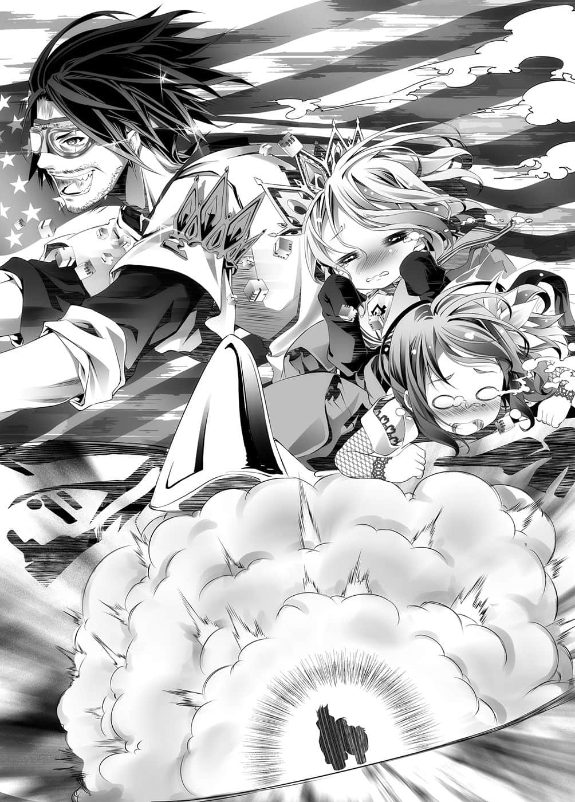
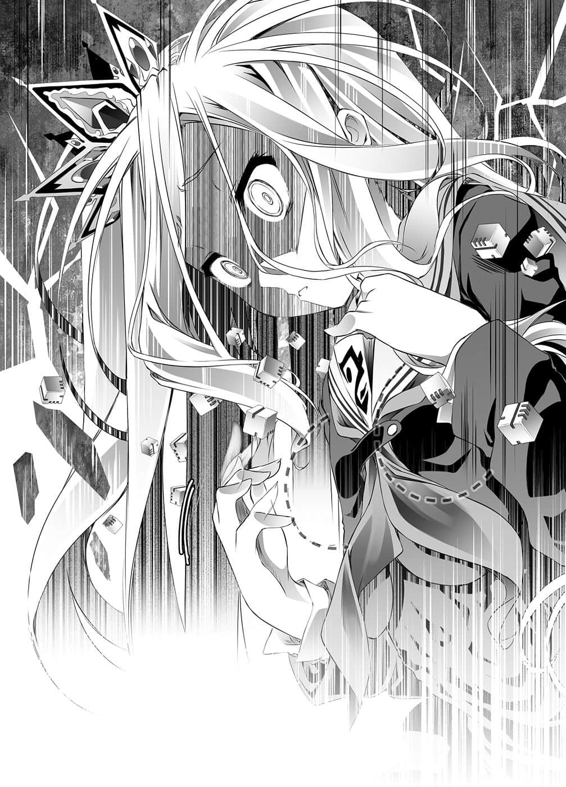

# 第二章 过剩解释

> 来源：https://www.linovelib.com/novel/9/2101.html

漂流在死亡的夹缝间，巫女——做着遥远的梦。

那是遥远地……死人永远无法触及的，遥远古老的记忆。

不被期望的少女，独自徘徊在永恒的时光中，终于进入睡眠——这样的一个梦……

————…………

少女初次认知到的是——在创造中蠢动的世界。

在创造与破坏都还不存在，创造要将创造全部覆盖般蠢动的天地间。

少女问道——『这里是哪里』和『我是谁』。

世界中尚无人可回应她，但是回答她的是——少女的『神髓』。

『神髓』回答——『这里是行星』和『你是神』。

然而少女接下来问的问题，『神髓』没有回答，只是永远沉默不语。

——『神是什么』——

长久的沉默，少女只是孤独地执笔，不停地提问，不停地记录。

持续等待有哪个存在能回答她一句话，最后降临的却只是战火。

对于粉碎星球相争的众神，少女欢喜地提问——得到没有意义的答案。

你是谁——我是神；神是什么——神就是神——…………

——少女不知道，不过漂流在记忆中的巫女知道。

因为那个星球还没有能问出『为什么』的——『自我』。

抱着膝盖，孤独的哲学家经过长久的追问后，在失意之下——进入永远的沉眠。

爱惜地怀抱着在悠久的尽头，终于得到的唯一答案——

【————没错，直到被汝唤醒为止。】

【不管是胜是败都无所谓——只有『结局』改变，『结论』还是没变。】

……说起来，能够及早得到马车，那就已经是奇迹般的幸运了。

————…………

『这个世界的规则就是「被骗是自己太笨」哦！』

在开阔的荒野上，只见杵在那里的三人，与同样杵在那里的——立牌。

找地方遮阳避雨，畏惧野生动物的空他们，只能放空思绪持续步行而已。

三人仍在第二掷——经过乱数解析仪式得到『五十八』，他们踩着游魂般的脚步走着格子。

隔着骑士护目镜，眼神充满疯狂的哥哥，开始说出莫名其妙的话语。

但是她的声音里，没有任何感慨、关心或好奇的情绪。

在巫女也共同享有的视界中——映出逼近而来的人们的样貌。

靠着踏上空与白课题的人，他们身上只有骰子数量顺利地增加，但——

「……哥、哥……骑慢……一点……！」

他划破狂风，切开大地——驾着哈雷机车，驶向时代的尽头。

只听见长年将『神髓』寄宿在自己体内的，那个少女神的声音。

就这样经过两周以上，粮食吃完，终于只剩下绝望——就在这个时候。

从融入绿色中的岩石群，来到泰半几乎变成沙漠的不毛荒地。

看来自己是名符其实『在神的手掌之上』——灵魂被神握住的样子。

——没问题的……应该，可能，大概……一定——

【——汝可是欺骗了神，认清自己的身份。】

依照白的地图所说，那是露西亚大陆爱尔文・加尔得领，掠过海威斯特州的平原。

什么也不冀望，什么也不期待，仿佛是在说一切皆无价值、无意义般——

但或许是不喜欢她的笑声吧。

『会改变的……不管是结局还是结论，连同你也是。』

不过——

因此，她刻意大胆地断言。

『是吗，不过死了就不能对话了吧？所以在变成露水之前就不算死吧。』

——第一百五十二格。

巫女看不见她神说这话时的表情。

巫女哈哈大笑，虽然她没有口也没有喉咙——甚至连身体也没有。

只见在螺旋状，以格子划分的大地上，参加者正各自前进中。

…………

通往神也不知道的可能性的尽头，受到神从高处注目的人们，现在——

也就是点数『五十八』所指示的第一百二十格……【课题】的格子。

这是神的断罪之言，如果没有『十条盟约』，光是那一句话就难逃被消灭的命运。但——

『我从来没有说过谎，不明白这一点，那就是你所能看到的极限。』

宛如代替回答似地，完全失去五感的巫女，视界突然打开了。

神灵种——超越种就连对时间，都用与自己不同的尺度看待。

【——竟然骗了吾两次。】

再说，在会被巫女欺骗的那刻起，那就证明神也有不知道的事情。

看来事情全都按照计划进行着——

空与白自身所写的语句之一被朗诵出来，那面立牌的旁边就是那个。

——简直就像……闹别扭的孩子一样。

「空、空——！？这是什么呀～～～～！？」

『我是欺骗背叛了你，第一次非我所愿，第二次是出于我的意愿，可是——』

「……哥……白……可以……达阵吗……」

听见响起的声音，在遥远漂流中的巫女意识浮现…………

『——你会输哦！』

每当失去辛苦制作的交通工具，心灵就不禁受到挫折——到后来。

「妹妹呀，别煞风景啦！你没听见吗，风在说——变成光吧啊啊啊！！」

视界忽然变暗——经过第一一九次的『格子移动系统读取』之后——他们抵达了目的地……

超越种的认知与理解所及的范围，毕竟也只是……『那种程度』而已。

巫女知道——不，其实她无法理解，只知道是那样。

游戏开始后十八天——粮食吃光了。

白想到——事情要回溯至数小时前……

没错，如果正如算计一般进行的话——

她欺骗、利用了神灵种——这一点她可以光明正大地承认，因为——

巫女甚至忘记自己从头到脚完全沉浸在死亡之内，愉快地笑了出来。

第三掷是『八十四』，目标是第二〇四格……

想要环视周围，巫女才发觉没有眼睛——不，是没有一切感觉。

---

■ ■ ■

把发出悲鸣的两名两岁儿童塞进边车，一个中年男子大吼道：

如果是『这孩子』的话就更是如此——巫女收敛笑意。

引擎的巨大声响冲击大气，他名符其实地在疾驰。

——所以没用的。

一如往常地，听起来没有温度，无感情无机质的声音。

『「怀疑与信任同义」。那个神也不知道、我也曾经一度放弃的——结局与结论，他们都会将之连同这个世界一起改变……牵引出那样未来的手——你不觉得很值得一见吗？』

「啊，粉红的大象在天上飞～……坐上那个很快就可以到了哦～♪」

语气中带着些许的寂寞，巫女刻意——如挑战般地告诉她。

就像这样，神的眼睛所捕捉到的光景。

只不过少女并没有那样的自觉，对此巫女不禁苦笑。

『……大、大概……一定……啊……我话或许说得太早了……』

在神使出力量的掌中，巫女真的『死亡』了吧——然而，受到这样的对待，巫女的态度仍是满不在乎。

她的眼睛能看遍无数分歧的未来，甚至跨越可能性的世界，而这个游戏的结局——或者连更之后的事，她甚至都已经视为是无数确定的事项了吧。

「讨厌啦……我要回家了，不，应该说完蛋啦～大家都要死啦，啊哈哈哈哈！」

在无光无声之中，听得见的只有在意识内响起的熟悉声音。

——【回答出这辆二轮车的制造商名称，答得出就可以带走！】

「哇哈哈哈人类的脚就是废物啦依赖道具才是王道啊啊啊！」

『什么嘛，你在闹别扭吗？那就代表游戏照预定进行了。』

【彼等所牵引的未来——原来如此，那就是汝称为『值得一见』的人吧。】

三人觉得——干脆用脚走还比较好，于是开始漫无目的地踏出自己的脚步。

————

——意识再度断绝，一瞬间她又死过了吧？

『别随便让人在生死之间往返啦，胆子会被吓破耶——虽然我也没有胆了吧？』

————…………

随即——一瞬之间，巫女的意识确实断绝了。

——就在她说出巫女『出卖了自己』的那个时点。

『我——那些人会把你也带去那个未来。』

【——否，只要吾放开手，汝之灵魂马上就会化为露水消失。】

失去那辆马车，他们寻找替代的脚力，最后就连自己制造的脚踏车也得使用——

但是长达五八〇㎞的荒郊野径，对于那些应急制作的交通工具实在太过险恶。

空高声呐喊——人类的可能性是存在于睿智而非肉体！

【诚然，都有神被凭依者骗过两次了——一切都有可能，一切无不可能。】

『……咦……？什么呀，我还活着吗？』

【从汝欺骗背叛——出卖神的时候起，汝所求解的极限就还是一样。】

附带边车，油料加满，引擎呼呼作响，大排气量的大型自动二轮车。

还是一样只有空与白——或者吉普莉尔也勉强能够解答的课题，那答案就是——

——『哈雷』。

再度掷骰，空露出目击到神迹的笑容，跨上哈雷机车——

「哈哈！！把课题一半以上用在『脚力』上总算有了代价啊，呼啸吧Ｖ型水冷ＤＯＨＣ进化引擎！！奔驰过螺旋的地平线，直到征服宇宙为止吧！！」

——然后他就变成这副德性了。

「……哥、哥，你有驾照吗……？」

为了分散强风打在脸上的恐惧，白问出答案再清楚不过的问题。

怎么可能有。别说是大型机车驾照，空连淑女车以外的驾驶经验都没有。

有沟通障碍的阿宅尼特族，根本也不会产生持有那种东西的动机。

「骑乘哈雷机车的驾照？哈，当然有——」

但是哥哥用拇指指着心脏，做出的回答却完全超出意料之外。

「火热的大叔魂！与美国精神！！确实就在这里心里啊！！」

「……哥，我们是日本人……连是否有大和魂，都很微妙的……阿宅。」

收集了白与史蒂芙的骰子后，处男空暂定四十三・二岁的呐喊是——

「……而且还『谎报年龄』……清醒过来呀……」

不管外表是几岁，内在都还是处男空确定十八岁，白是这么主张的，但——

「妹妹啊，你冷静一点……哥哥的心处在前所未有的涅盘境界，你听好了哦！」

见到哥哥面露佛陀般的笑容，又开始有话要说，白不安地点头答应。

这个毫无脉络的变化，正是一点也不好的证据。

这是早已有的觉悟，理所当然的报应，只是为了将要被剁碎的引以为傲的弟弟，伊野不禁流下一道泪水。

「知、知道了，我知道了啦！唔，飚车飙得正尽兴说……」

「接触到哈雷心，美国的精神也在我身上了——我已经是美国人了！！」

「问题！？不会有什么问题！怀着来自美国的爱高喊——Let it be（顺其自然）！！」

（……当务之急是……确保哥的食物和……哥能够熟睡的环境……）

「美国就是很好的例子，属于美国人的人种只有原本的住民——对吧？」

「是啊，那是我的疏忽，完完全全是我在搞乌龙没错。」

正是为了因应状况，精确地反覆调整骰子，他们才能够来到这里，不过——

状况绝佳的空，完全没想到那是蜡烛烧完之前的最后光辉。

在两掷之前，伊野停在某一格，然后响起的声音告知他。

他的愿望实现了——可爱的伊纲不会因为自己的愚蠢而死了。

那么接下来就是自己的工作。白在内心这么说着，开始进行思考——开始整理状况。

他祈祷过……有生以来第一次，就连对那个唯一神，伊野都诚心诚意，流着血泪向祂乞求。

——位于天上全能的死小孩啊，偶尔也做点好事吧。

掠过爱尔文・加尔得领海威斯特州最西端的地方。

他嘟起嘴，不情不愿地——将车身一倾斜。

至于史蒂芙则是——连同她的要求一起摒除在思考之外。

身上笼罩黑暗的红色气息，拥有四粒骰子的初濑伊野——暂定三十九・二岁。

……只有一个人例外，走累了有人背，要睡觉有人的胸膛可以躺。

「别想了！快点走吧！快点！快点！那里有花朵，有花朵啦！」

「…………啊。」

但是，空似乎有些感到疑问而皱起眉头。

——各人的骰子保有数与暂定年龄如下——

——怎么办……哥坏掉了……

因为提到『洗澡』这个关键字，自己白并没有表现出讨厌的样子，不过——

以史蒂芙的悲鸣做为喇叭声，机车往一座小森林驶去。

……哥哥会毁坏到这种地步，反而很正常。

——因此出生的国籍不是问题。

「白，那不是错觉啊，空已经不行了呀。」

因为有不管在哪里都可以让她熟睡的最佳携带寝具——『哥』，所以白除外。

看到哥哥一改佛陀般的微笑，以金刚力士的微笑发出呐喊，白心中确信。

对于每一次产生的负担都毫无怨言地一肩承受，那个人就是——哥哥。

这世上充满的只是恶意……必须要矫正才行。

「但不管是在美国出生的人，或者是移居的人，他们都以美国为傲。接触到他们的心，便能认识他们的心，那并不是取决于框线，而是在接触到人们所累积的文化时——那个人也会拥有那样的心。」

「……这种时候你还想着花，神经真粗啊……你要花做什么？吃吗？」

伊野非常愤怒，而且是前所未有的怒发冲天。

「呀啊啊啊这个交通工具只能这样转弯吗啊啊啊！？」

哥哥如行云流水般，使出从主角性听障（物理上）开始发病的性骚扰大招连技，但是白也如行云流水般视而不见，她从压扁史蒂芙的行李中取出平板电脑，然后开始思考。

她立刻查出计算式——不对，查出算计式，轻声地说道。

「……哥……披〇四是……英国……」

让白与史蒂芙变得幼小，当然不是为了哈雷的驾照大叔魂。

……从游戏开始至今已有十八天以上……正确地说是四百三十六小时又十八分。

白『两个』——二・二岁。

——伊野当初的算计是这样。

「是那样吗啊啊啊！那就没办法了呀啊啊啊啊啊！！」

「没 错 ！！」

对于白所说的话，被白与行李压在下方的史蒂芙，比空更迅速地全力反应。

「用出生的国家来区别人——你要说的是那么悲哀的话吗？」

就算不是怪物，野狗、虫、气候……足以令人类死亡的危险也到处都是。

——同时，不断祈祷孙女不会踏上自己课题的伊野，安心地哭了。

有个男人仿佛连那样的声音喇叭声也要追过一般，用四只脚在地上奔驰。

但是实现那个愿望的不是善意——而是『哈哈哈』的嘲笑声。

白将液晶荧幕所显示的地图扩大。

变小的话，所需要的粮食也能减少，走路时以体力为优先，会将骰子重新分配。

——黑暗的颜色，却是露出牙齿低吼的野兽，滚烫杀意的证明。

红色的蒸气是沸腾气化的滚烫血液——『血坏』的证明，不过——

「欸、你们说什么呀！？因为引擎和风声，我听不清楚啦，说大声一点！！」

白暂定二・二岁，与在边车中垫在行李之下的史蒂芙暂定一・八岁。

粮食吃尽，加上疲劳累积，更何况空他们几乎没有睡眠。

「如果你现在不立刻前往——我就要从车上跳下去了喔！！」

空隔着护目镜看向远方，仿佛随时要唱起歌来似地。

——同样是在第一百五十二格……巧合的是也在同一时刻。

反正本来就没内裤了，也没什么好羞耻的，就请她用这样的精神坚强地活下去吧——结论完毕。

——连刹那的犹豫也没有，对于哥哥一口回答的谎言，白甚至深受感动。

那样的结果就是，空严重损坏的程度，就好比因为是旗舰所以没被击沉的船舰。

「……是、是呀……那是个移民的国家，可是……」

伊野自然地闭上双眼——想要杀人，被杀也是很正常的。

——『把股间的东西剁碎，为了世界而死吧』这个自己写的【课题】——死亡。

——现在位置是第一百五十二格。

——也会有厕所吧。史蒂芙就差没说出这句话，白瞥了她一眼，也点头附和。

史蒂芙『一个』——一・八岁。

那也是当然的吧，白内心说道。

---

■ ■ ■

自称・美国人的嘴里如此嘟囔着，补充他的胆小心灵。

之所以白两个，史蒂芙一个，那是为了假如白的课题被偶然突破，骰子也不至于变成零。

「……白是美少女……美少女是……不上厕所的……」

「不是出生在日本就无法了解日本精神吗？感觉日本精神、尊重日本精神……难道若不是出生在地图上所画的日本的框线内，就无法做到那样吗？哥哥可不那么认为。」

首先该矫正的就是确实已经发觉，却还煽动不安的——那只猴子空。

于是他领悟到——这世上不会有人听进善意的祈祷。

「怎么可以顺其自然！！白、白应该明白吧，去摘花——」

「旅社！？旅社！有旅社好耶，我们已经连续两周以上没洗澡，一直都露宿野外的说！！」

他祈祷过……每隔一小时便趴在地上向巫女大人祈愿，身心受到忏悔与后悔的折磨。

「……哥……这里的东方二・四公里处……有一个小镇……那里有……『旅社』。」

尽管不愿意，不过白也完全对她因绝望沮丧而提出的那个意见有同感。

「而、而且——那个、有一个严重的问题差不多也要发生了吧……？」

——We are the world，We are the children㊟。

「而、而且又不是公共道路，跟地球的法律也无关，更没有警察取缔。」

骰子数——距离『目的地』剩余的格数，推算所需时间与所需油量——

她在现在座标的格子里，好不容易发现有『某个事物』而惊叫一声。

「……欸……可、可是哥……」

就这样，伊野接受一切的结果，等待死亡，不知等了数分钟还是数小时——他终于发觉。

自己的课题没有具体性，没有强制力……

一个华丽的甩尾过弯，使得边车浮起，卷起了沙尘。

在这漫长旅程中，就连可以安心休息的环境都很稀少——精神不出现异常才是异常。

（译注：歌曲We are the world，是一首1985年的慈善歌曲。）

空『二十四个』——四十三・二岁。

聪明的伊纲与自己不同，她一定会察觉这个游戏的真意，取得胜利吧。

那么自己只要确实地抹杀空，有机会再将骰子让渡给伊纲就好了。

但是——如今那样反而会有困扰，伊野消耗生命，朝着终点疾速奔驰。

只要到达终点，所有的要求都可以实现，那么——

——为了世界的胜利，他必须以『让空先生死亡』为目标而冲刺——！！

理性告诉他……那是自己自作自受。

想要杀死别人，却只有受到这种程度的报应，反而该说是太过宽大了。

为何人要争执——为了和平而争执，那不是本末倒置吗？

然而到了这个地步，事到如今假装聪明也没有意义。

为何争执？——因为愚蠢。

自己是作茧自缚还恼羞成怒的白痴，那就像白痴一样吼叫吧。

也就是——

「不在那张脸上揍一拳我不甘心啊，那只臭猴子！！」

这个和那个是两回事——！！

「欸～打扰一下——虽然我一点也不觉得打扰啦，请问是初濑伊野先生吗？」

……伊野抱定那样的决心，不惜削减生命，准备追过声音而奔行的时候。

悠然地与他并行的怪物——吉普莉尔突然开口询问。

「哈哈哈……鸟的脑袋就是健忘，这是没办法的事，可是就连鸟的视力都很好哦！」

就算外貌返老还童，这个游戏的男性兽人种也只有一个。

对于伊野这样的讽刺，那个鸟的脑袋吉普莉尔看著书——微微点头。

将『Ｎ点哥』诱导至指定座标这间屋子——确认。

然后他会这么判断——人手愈多愈好。

…………诱惑……

再会了，身体发育不良的白……

——抱歉，欺骗了你，不过这也是工作游戏啊……我要先走一步了，史蒂芙。

——没错，他一定会这么做，白点头答应，垂下头来。

「……？……那种事为什么要问我？」

「……………………Ｌ号……？」

从初期值的『十』，每增减一个，年龄就会增减十分之一。

（……掰掰，萝莉体型……掰掰，飞机场——！）

——重新检验结束，诱导函数方程式——证明可能。

但是现在就不同了……白嗤笑一声，在内心说道。

然后短短数秒，这次则像是逃离现实般——坠入梦乡。

不管是空还是史蒂芙，而且——当然白也一样。

这个骰子就是等分切割的年龄。

---

■ ■ ■

擅自进入别人家里搜索，空是在主张这个谜一般的特权吧。

「骗人的吧！？那么菲尔那对胸部的养分是从哪里来的！？就连牛都要摄取相对的脂肪才会变大吧！？比如说肉啊，肉啊，至少一定会有米吧！？」

「……为什么那家伙还在这里？」

空敏感地察觉到那个危险的气氛，在其视线前方——

「……难道是要我头脑稍微冷静一点——『去问他』吗？」

——要还给她几粒骰子呢？

在此之前，空准确、缜密地因应状况，调整骰子的数量。

她还特地告知伊野，她要去和空与白打招呼的理由是——？

「————唔喔喔喔喂！？白，那、那样很危险啊！！」

「空得到谜之草了——喂，又是这个啊，我不需要你这东西！！」

但是不顾气氛而响起的声音是——

从特效声可以知道，这就是勇者斗恶龙八的——『勇者』的特权。

——在第一百五十二格的东端，如白的地图所显示……有一个城镇。

「……哥，森精种是……素食主义……」

那个尽情畅用空间转移的怪物——不，在前进骰子所掷点数的格数这个规则上，就算那个能力被封印了，她还是能够悠然地跟随以接近音速奔驰的伊野，那样的家伙还在这里的理由是——？更何况——

白拖着脚步斟酌着距离——向她问道：

在急迫的饥饿之前，感叹与情感都无助于填饱肚子。

——『没事了，快滚吧』用副声道把话说完后，吉普莉尔便一脸笑容地飞走了。目送吉普莉尔离去的身影，伊野疑惑地喃喃自语：

就用那副身体完成第一公式——也就是，只要诱惑哥哥——！

称之为『建筑』也令人为之踌躇的独特洗练技术，用树木编织成的住宅或道路，优雅地融入森林，水母状的花在空中飘动，其所发出的淡淡光芒，充满光华灿烂的色彩。

就这样，保有两粒骰子的白，只要收下空交出的十四粒骰子，就会是——『十六粒』。

眼见垫脚架不安定地摇晃，好似随时会倒下，空急忙将白抱过来，对自己大吼。

善于判断状况的哥哥会想到白的意图——想要帮忙探索和补给。

相较于艾尔奇亚的——不，就算是与原本的世界比较，也是不同次元的文明。

在内心这么说完后，白在空的背后——露出与空一模一样的邪恶笑容。

——啵・啵・啪・啪・啪啦啦啦～♪

「——喂！让两岁儿童这么努力，你还有闲情逸致扮勇者斗恶龙，你是白痴吗！空暂定四十三岁！你就是因为这样，所以才会过了四十还是个处男！！」

这么脱口而出的人是骰子十粒——回到十八岁的——空。

「咿！？什、什么事～？白、白也想要我帮你洗衣服吗～？」

就这样，白在被空抱起的状况下，低下头——露出一抹笑容。

变动值转让的定数化成立条件——Ｎ点哥二十四，Ｓ点白二——确认可能。

「很抱歉……对于兽人种与兽类的区别，除了是两只脚走路还是四只脚走路之外，其他我就没有特别去注意过了，更不用说辨别性别什么的——啊，您看这样如何？只要您像那样永远用四只脚走路，那就可以一起归类为『兽类』，这样字典里也可以少一个项目了。」

他会这么想……必定会这么想。

明明是史蒂芙——却有充满梦想的胸部。

——发出『呜欸～～』的声音，裹着一条毛巾回来的史蒂芙一・八岁。

欢迎光临，魔鬼身材的白……！

一切都是为了一个，只要在这里排除史蒂芙就可以完成的『算式』——

悄悄在晾洗衣服的幼女，听到白的声音跳了起来，声音沙哑地笑了。

表现出一副过意不去的样子——直到这里都如计算一般，这是为了隐藏窃笑。

「嗯～那我十粒——十八岁的身体就没问题了。白，我把剩下的十四粒交给你哦！」

如果是游戏设计师的话，这景色无疑是发挥浑身美学品味的地方。

爱尔文・加尔得，海威斯特州郊外一个偏僻的乡下小镇的——片断。

从自助的特效声开始，如行云流水般接着的是将『谜之草』丢在地上的中年大叔叫声。

只见白迭了好几个脚架，站在上面手伸向柜子的高处。

「啊啊啊～……真是遗憾——算了，这先姑且不论❤」

还她八个变成十个——即使白回到原来的年龄，那原本也不是白能触及的高度。

领悟到无法掩饰过去，史蒂芙像是逃离白一般地倒在床上。

看到白将手伸向柜子，哥哥——空会……这么想。

「Ｓ啦！——不对、我、我不懂你在说什么————呜欸～～！！」

「不，我只是想去打个招呼……啊，请继续趴在地上吧♪」

指定座标这间屋子存在必要条件值浴室——确认。

明明是史蒂芙——却凹凸有致的魔鬼身材。

……三人原本就疲惫不堪，没有人有余裕理会景色如何。

排除浮动乱数史蒂芙一——确认。

「……我可以……发问吗……？」

（……来吧，哥——开始证明游戏吧……？）

天翼种那实在不像是她的用心又是怎么回事……可是——

同样对景色视而不见，侵入住宅的同时就四处奔走找寻什么，然后——

——面对这样的景色，任谁也会发出赞叹，伫立良久吧。

不过或许是觉得无所谓吧，那遗憾的表情也只有一瞬——只见她指着森林。

「………………………………………………奇怪？」

但是疲劳累积至顶点的现在，他直到这会儿才发觉忘记分配骰子，然后告诉白：

神所撷取复制，如幻想般的『森林』中，唯独不见居民——森精种的身影。

时机成熟，白接过骰子——笑了。

没错，因为白现在也是在小小的脑袋中，猛然地进行着某个计算。

成立条件，三点的变动值骰子变动——确认。

再往前一点已是地面格子中断处，这里是勉强反映在这个双六地图的『村落』的一部分。

那里只不过是爱尔文・加尔得的一处片断再片断的地方，不过——

听到吉普莉尔笑容满面地这么说，伊野忍不住停下脚步。

对于自己尚未理解的这个游戏的本质——伊野感到一股不协调感。

来到这里的理由，将哥哥诱导至这里的理由，甚至是让史蒂芙说出的话。

——定理证明条件，开始重新检验变数。

「那边有三个人类种的气息——其中两个是主人吧？」

随后，白的身体被光包覆——手脚急速成长延伸。

白看着安稳地熟睡的小史蒂芙——想像她本来的模样。

「……抱歉，白，我要是早点发现就好了——呃～……？」

对景色完全视而不见，空四十三・二岁将哈雷粗暴地停放在民宅外，进入屋内翻箱倒柜。

——默默地用两只脚站了起来，表示无言的拒绝。

但是用肮脏的中年大叔模样做那种事，名符其实就是『山贼』的闯空门行为——

「…………呃？……？……哥，这个……？」

然而困惑的人却是——怀疑是错觉，抬头看着哥哥的白。

视线的高度还是看习惯了的高度，这是错觉…………对吧？

白疑惑地侧着头，露出微笑，手往自己的胸前滑去。

……挥空，挥空，胸前空空如也……

「……哥，这是洗衣板哦？……这是，相当平坦的洗衣板哦！？」

只是抚摸到空气的触感，让白眼眸中的光采消失了。

计算——连同立足点一起崩坏的感觉，白也只能笑了。

「冷、冷冷冷、冷静一点，白！没、没问题的，你确实有成长啦！」

这是自这个游戏开始后——不，出生后最大的冲击。

白原本就白晰的脸，燃烧殆尽成灰色，哥哥赶紧安慰她。

「这是那个啦！就算骰子增加，也不保证每个人都会均等地长大！！」

直到刚才都还是肮脏中年的哥哥用谎言——不，尝试建构温柔的假说。

但是……白明白不是，她自虐地笑得更深了。

原来如此，正如哥哥所说，确实是有『成长』。

手脚有些许变长，婴儿肥的小腹也稍微缩了回去。

——话说让我们离题一下。

各位知道吗？即使持续不上学，日本的小学也不会『留级』。

所以打从入学以来一直没去上学的白，在文件上也是『小学五年级』。

但是——即使是以小学五年级来说，白也有自觉自己的发育很差，考虑到这样的情况，好了，这个所谓的『成长』，我们就大胆地这么评论吧。

诅咒背叛自己的世界。

——一定会大受打击吧。

「喔、喔喔……你要坚强啊！哥、哥哥无论白是怎样的模样都喜欢哦！」

没错，没有问题。

那是为了脱离困境，搜索所有的知识与记忆。

她用仿佛示范有精神的相反词那样的语气回答。

体型三围——胸围、腰围、臀围——平均值为『七十七．二：五十九．八七三：七十八．二三』。

如果哥不喜欢的话——

白诅咒背叛自己的一切。

（……掰掰……装满梦想的……胸部……不过——）

既然已经查明哥哥是萝莉控，那就没有任何问题——！！

「……哥……白……累了……去洗澡了……」

——忽然一道雷光闪过，拉住了逐渐下沉的意识。

其中哥哥特别喜爱的角色——总数八百七十四名的『老婆』。

他追赶脚步摇摇晃晃走向更衣室的妹妹，对她劝解。

虽不知道那是事实，还是只限于游戏内发生——但是！

「对对对！请人帮你洗背！清爽一下吧！？」

——没错，哥哥的话，他会那样说。

——据说人在面临死亡时会看见走马灯。

与白相遇之后的八年期间，哥哥或玩过，或读过，或看过听过的游戏乃至漫画、影片等所有的娱乐作品。一般游戏总计二万三千六百七十一款，H-game总计一千八百五十二款，漫画色情同人志总计八万五千七百四十三册，动画总计两千四百六十五部，真人化戏剧电影总计四千八百六十七系列。

————『结论』——！！

……胸中怀着那样悲壮的觉悟。

诅咒背叛自己的未来。

然而她却是充耳不闻，就这样时间过了数秒，白开始总结。

总觉得——这其中一定有什么——

——如果哥不想要胸部的话——

自己永远——无法变成凹凸有致的魔鬼身材。

「——妹妹啊，虽然完全搞不清楚状况，但哥哥觉得刚才好像受到很大的侮辱哦？」

「…………太好了……原来哥是……标准的……萝莉控……」

「……白……超没事的……超有精神……」

「……帮我……洗头发……」

十六粒就是十七．六岁——当初实在不该交给她这种数量。

空——哥哥的偏好，兴趣、性向、性癖，将这些全部以数学的方式推测计算出来。

白任凭脑内回路烧焦的感觉肆虐，猛然循着情报探询。

伴随记载在攻略本、设定集、说明书或杂志报导里的各种情报，也就是——年龄身高三围设定以及其他诸多情报！

一人也不漏地，在白的脑里，以附带影像照片语音的方式进行编排，逐一附加情报。

有条不紊地数据化、统计化、图表化，一一进行分析——！

「…………♪已经无所谓了……哥……白……累了……」

侮辱？没那回事，那才是救赎。

——年龄变成一・六倍后，她终于成为小学五年级生了。

她感觉到可以重整失败公式的——『灵光一闪』！！

永远无法变成装满梦想的胸部……

空丝毫不知她正空前绝后地在浪费自己的脑，甚至超越极限地过度使用，只是看到白气势逼人地瞪着地板的样子，空不禁战战兢兢地问道。

「那、那个啊，你就纾解一下疲劳吧？快点洗个澡——」

「我、我说白啊，就算从十七岁开始也还有成长的余地，打起精神，好吗？」

第一公式凄惨地崩溃了，不过——

——那么那种东西——！

不过那样正是代表！第二公式……以及定理的证明还是可能的——！

在白的梦想——在魔鬼身材的未来破碎之前，他一定会这么说。

「唔啊啊啊！？这、这次又怎么了！？」

————『列举』。

白紧握拳头，对于心在淌血装作没发现，然后大声呐喊。

……白无精打采地走着，空则追在她身后。

在那种时候，不慎交给她初期值以上的骰子——万一变成与自己理想不同的模样呢？

年龄——非人设定以身高平均年龄计算——平均值为『十二．三四四……岁』。

「……嗯……帮我洗背……」

没错，数字不会说谎……哥哥的偏好——如下。

怀着连同灵魂变成细沙，随风飘起的感觉，哥哥的声音听起来就像在远方的状况下——

你就是因为不懂那样的少女心，所以才不行啊——空悔恨地咬着牙。

偏偏不巧地，看到白主动走向浴室，空正在猛烈地反省自己。

设定——比自己年幼机率『六十一．一％』，妹妹率『四十八．四％』，巨乳率——仅有『三．二％』。

——原来如此，自己不管变成几岁，似乎都会是萝莉体型。

——白的头脑即使在全人类中，恐怕也是屈指可数的吧。

——没有……问题。

「——————————！？」

————『算出』。

……这件事对白而言是等同于死亡的绝望，在这时候先姑且不谈。

「等一下等一下等一下！喂！白！不要竖起大拇指，露出美好的笑容准备升天啊！！」

---

■ ■ ■

对于白的回应，空尽可能开朗地附和，跟着穿越更衣室。

——————————不要也罢——————！！

脑超越极限而异常活化的现象。

白十一岁……一粒骰子相当于一．一岁。

——宛如曙光划破夜晚一般，世界充满光明。

白小心地不被发现——擦去眼泪，站了起来。

白是孩童体型——因为她是小孩，所以那是理所当然——不过空知道她在意这一点。

接着情报的海啸涌入脑中，白用力往地板一踏，撑住自己的身体。

依身高排队是在前面第一个！没有这样的小学五年级生！！

白就像这样放弃一切，逐渐倒下，在她的脑海里——

白跪倒在地，仰天说道——未来还有希望。

在数学上、统计学上被断定为变态的哥哥，半睁着双眼低沉地说道，不过——

——细柔柔地，轻飘飘地。

——好好熟睡一觉，纾解疲劳之后，多少就会有精神了吧。

特别是在这种本来就严酷的游戏中过了十八天，任谁也会身心衰弱，这是理所当然的状况。

白故作平静，设法重启『计算』。

————『整理』。

「白、白，你要坚强一点！！这只是证明白是已经完成的美女呀！！」

「……呃～白小姐？这次又在做什么——」

「对对！像这种现在马上就想停止的大冒险，连续玩了两周以上，再怎么样也受不了吧！？」

然后到了……是浴室吧，虽然不太清楚森精种的建筑样式，不过这里冒着蒸气，没有屋顶，天花板开放，与其说是浴室，倒不如说是——温泉。

在此之前，空一直没有余裕去理会风景如何，不过这露天澡堂却令他胸中起了骚动。

如果能够忘记一切，在这个澡堂得到疗愈，可能真的一下子就能重新振作。

「……然后……趁白洗头发……的时候……」

空就像被浴池迷住了一样，呆站着不动，但是白却——

「……欲求不满的哥……袭向……白……」

……

…………嗯？

「……粗暴地……对待白……就像色情同人志一样……」

「…………」

「…………像色情同人志一样……？」

「不，那段沉默不是为了让你说第二遍哦！呃～？」

白始终背对着空。

「——为什么我也一起进来了？帮你洗头洗背的人——」

空这么说着，朝四周张望——但是在浴室里的只有——

「……帮我洗的人……是谁……？」

——一丝不挂，笑着回过身的白。

以及腰上围着一条毛巾，背上感觉像是有冰块滑过的——空。

事到如今空才发现他正和裸体的妹妹，两个人单独在浴室面对面的这个状况。

…………

（……什么啊！那对像是要我发觉的眼神是————！）

「……哥，自取灭亡……没有逃避的……借口了哦……！」

（……怎么回事？好像有种要发觉不该发觉的事情的感觉——而且——）

被低着头，全身赤裸的白抱着，空……不禁思考。

————变成『十八岁以上十八．五三三……岁』。

若说输给白——不会不甘心，就是在骗人了。不过那也是稀松平常的事，可是——

由于身高差距，腰部透过皮肤感觉到白的心跳。

在持续的极限状态中，疲劳、饥饿、野生动物与【课题】——总是带着死神的镰刀架在咽喉处的感觉。一直努力生存至今，可是现在却——

宛如莎士比亚剧的演员般，空暂定三．六岁欢喜地颤抖。

「咦？啊、呃……？」

「……哥……你那么……讨厌白吗？」

——但是那又如何？那只不过是『误差』吧？

过了十一岁生日，来到这个世界迪司博德——已经是十一岁又七个月。

——差点就被骗过去了。

「啊啊，竟然如此悲剧！人皆会犯错——我竟因为错误的判断，不小心变成未成年了，我的心因为远离一切的色情而坠落绝望的深渊，啊啊！神啊！您竟然连和女生一起洗澡的机会都夺走——我是那么地罪孽深重吗！？」

「不好意思，请问主人……空大人在——」

「……吉普莉尔……你真是太……不长眼了……绝不饶恕……！」

「可、可是外表没什么变——啊、不，再说你的内在是——」

——为什么彼此都是十八岁就非得一起洗澡不可！？

一步又一步——

因为孩童般的外貌吗？那么一生都要主张白是小孩吗——推翻。

——这个游戏自开始已经有十八天以上。

「即使到了十八岁，我们还是兄妹，一起洗澡什么的完全不自然到极点！！白也十八岁了的话，就自己一个人——」

然后终于——『壁咚』。

脚步声一步接着一步——

「……这样哥就只能……和白一起洗澡了……对吧♪」

——听到白低着头，说出那一句心灵受创的话语。

「……证明式作战……就像我计算的，一样哦！哥——」

当然，白的年龄不会刚好是十一岁。

——没有错，就只是『误差』。

对步步逼近的死神——更正，对步步逼近的妹妹，空用沙哑的声音拼命地试着反驳。

白的骰子不是一粒『一．一岁』——而是『一．一五八三三……岁』。

——邪念？

空似乎确实看见了——带着大镰刀露出邪恶笑容的死神。

——原来如此，空理解了。

「————呼……呼呼、哈哈哈哈哈哈！」

但为什么——唯一应该绝对不会背叛的人，为什么偏偏是被白——逼迫到这样的绝境！

因为白是小孩吗？自己已经接受彼此都十八岁的主张了——推翻。

——虽然不知道为什么，不过这是——

——这是互相背叛、彼此欺骗的游戏。

「……虽然……用魔鬼身材诱惑第一公式……失败了……」

没错，这还只是『将军』——不到『将死』的地步！

——危机状况。

正因为是兄妹，如果不讨厌的话，就应该不带邪念，大摇大摆和她一起——

「不、不不！感觉这样不行啊！比如法律呀条例呀某团体之类！？」

——但是后退的空，背部终于碰到墙壁。

心脏强劲、剧烈、如撞钟般的跳动，抬头望着自己的少女——

空终于感到那把镰刀割破脖子一层皮，眼前陷入黑暗。

「——不不不怎么可能哈哈哈，好了好了，你等一下啊。」

总之是从某个危机存活下来了，空向上天表达感谢，然而——

带着锐利的眼神出现，然后被让渡骰子的杀伐天使。

白用空自己说过的话为武器，准备将他逼得走投无路——

——逃过一劫了。

那种事情现在对空而言，极端地无关紧要，他有如舞动一般地高歌。

不管是退路还是说词都被截断，空确信。

就像这样，当死神的镰刀正要割断空的咽喉，就在那个瞬间——

白带着没有一丝恶意的笑容逼近一步，空就随着退后一步，他心里想着。

看到妹妹那样说话的身影——空听见了本能的呐喊。

致命地打乱各种算式的最恶劣因素——就是『误差』。

温和的声音透露愉悦之情，脸上浮现的浅浅微笑，因为羞耻而微微颤抖。

往下看见露出喜色的红宝石眼眸，空心里想。

「……哥，不对……哦！」

……好像有什么不对劲，空茫然地思考。

——好了，该怎么办？处男空，暂定现在都是十八岁。

因为是兄妹吗？推翻——就是被她那一句话推翻了——！

白用双手封锁住左右两边——但由于彼此的身高差距，所以是在腰部附近。

「……白的骰子……不是……一粒『一・一岁』哦……！」

逃走？逃避的借口？根本不需要那种东西！

……慢着，慢着慢着慢着——！？

退路借口被断……不——是自断退路，『被利用了』——！！

再说——

「……地球的法律……与我们无关……又没有警察取缔……哥，说过的……」

空带着能够瓦解将军局面的确信呐喊道，但是——

白一步步地逼近着——空确实听见她的笑容做出的回答。

这是——『口击』。

发现得实在太晚了，空终于理解到这一点。

——为什么呢？

——呼呼风声作响……令人起鸡皮疙瘩的杀气之风吹拂而过。

虽然不知是逃过什么劫就是了。

————糟糕了。

「唔喔喔喔吉普莉尔！！喂喂！？你的骰子竟然减少到两个了！！这是多么严重的事啊，来来，我的八个给你吧！你要是敢推辞，我可是不会放过你哦嗯啊啊！？」

——随后，表情似乎稍微变得柔和了一些，但是——

「呵呵，妹妹啊，仔细听好了，我接受彼此都是十八岁的这个主张——不过！」

如果那个误差将两个骰子的白，从『二．二岁』变成『二．三一六六……岁』。

那么就会让十六个骰子的白，从『十七．六岁』——

空慌慌张张地移开视线，冷汗如瀑布般流个不停。

空一步步地后退着——但是白就像是看透他的内心一般。

对于偏偏是在『心理战』上被打败，空感到立足点崩落——

脑海里灵光一闪——也就是那样的闪光，让空哈哈大笑。

——为什么白的笑容这么可怕——！？

——充满杀伐气氛的浴室里，杀伐的天使翩然降临。

或许是年龄骰子无论多少都不会影响外貌吧，不管怎样——

——听到这句话，仍然坚持『ＮＯ』的理由是什么？

在泛红的身体缓缓逼近的妹妹背后。

「白、白是十七岁吧！？你也考虑一下分级制度吧，要是这本书被禁卖，你怎么负责——」

「……哥说过……大叔魂……现在的白……灵魂是十八岁以上……」

仿佛从地狱的底部响起的声音，只见在娇小的人类种少女——白的背后。

如今不管是空还是吉普莉尔都能清清楚楚看见那个。

「啊，看来我会死呢……主人，我究竟犯下什么样的滔天大罪了呢？」

「……抱歉，我也不知道啊，不过好像真的是很严重的罪……」

甚至让天翼种也声音颤抖地细数自己的罪孽。

——似乎并没有逃过一劫，这已足以让空恐惧地翻白眼了。

面露邪恶笑容，带着大镰刀的死神，这次脸上显露杀意，用上肩投法将镰刀高举，准备投出。

————…………

空不知道，吉普莉尔更是无从得知。

对白而言，这正是千载难逢的机会，是一世一代的胜负。

她要让哥哥——意识到自己。

与哥哥相遇后的八年期间，从来没有比这次状况、条件、时机更为齐备。

可是却因为吉普莉尔的登场而搞砸。

再数小时，不，只要再有数分钟的时间——就能完成算式得到哥了说——！

但是就在白怒气沸腾的视界里——

——只见红色的布翩然飘飞……

「……唔，看到你们这么悠哉，愤怒和怨气也会消失啊。」

红色的布——那是直挺挺站在浴池里的年轻肌肉男，随风飘扬的丁字裤……！

啊啊，不管搬出怎样的大道理，自己都还是孩子啊——白心里这么想。

有如独立生物般抖动的肌肉——那是难以名状的奇怪景象。

————沉默。

那是让人难以想像，能够重新改写世界，制伏万物之理的力量，但是……

空拍打池水，放声大笑，他眺望头上——那壮阔的游戏盘。

---

■ ■ ■

「…………肌肉好可怕……呜呜呜肉……袭击过来了……」

「……………………原来是……这么回事吗……巫女大人。」

「——巫女小姐是在利用神灵种，而且当然是在游戏上胜出。」

虽然完全无法想像，不过应该是趋近于『无限』——可说是『神』才能办到。

但是对于伊野那句话，空才是打从心底感到意外——

他轻松地挥挥手，用下颚往史蒂芙的方向一比。

空心想——实在是可悲可叹，又难以饶恕。为什么那么想分出优劣呢？

空用像是看着打从心底尊敬之人的眼神，告诉伊野。

「……真令人意外啊。」

只是将其中一个种族整合团结起来，难道是容易的事吗？

空极力不直视浴池中的肉块，用低沉——但是缩回三・六岁的声音问道。

根据盟约，无法侵害权利是——彼此皆同。

这么一想，空他们也没有立场说别人，反而是——

随之露出灿烂的笑容回答：

不管是狗耳、猫耳还是兔耳——只要平等地……从心所欲去爱就好了嘛！

空强力主张是因为骰子减少，所以才会造成许多地方缩短。

——好像也有因为色盘肤色的误差就互相残杀的世界。

「因为彼此都有困难呀，我们会因为毫无生活能力，而无法存活下来吧。」

「我是在问你，让人看『颤动的肌肉』这种冲击影像，难道不算暴力吗！你还是一样听不懂反讽啊——还有别说我是小东西，这是因为年龄的关系哦！！」

「不过，我改变心意了，决定留到最后再杀。」

即使盟约禁止暴力——好比说，以全盛时期阿诺的身体，对，若是被某机器人说『我要终结你』，不害怕才是谎言吧。

没错，就和游戏内容一样——东部联合对外也隐藏了国家的详细历史。

——嗯？伊野视线往下移。

然后用爱包容世界……那样的至宝竟然相争，实在是不可饶恕至极。

「这不会有问题呀……只要不是归零，一和十都相同，而且——」

「没有人会害怕那样的小东西，你就顺从欲望而活如何？」

从咕噜咕噜的水声听来，吉普莉尔是被白踩在热水底下吧。

过去某位伟人说过——『天不在兽耳之上造兽耳㊟』——！

「花半个世纪就平定那样的纷争，甚至还得到对其他种族必胜的方法游戏，成为世界第三大国东部联合。」

…………

「那也没办法吧……因为白一直在生吉普莉尔的气呀……」

正绞尽脑汁思考要如何逃走的空，听到伊野唐突的问题，切换了思考方向。

从白那里收下六粒骰子的史蒂芙，正以十二．六岁的模样帮白洗发。

「我当然是来杀空先生的。」

「……把我从熟睡中打醒，教我『帮白洗头发』——这样就不是暴力吗？」

接下来要说的话当然是——『那是骗你的』。

「……亏你们能那样轻易地把骰子交给别人呢——那可是『生命』哦！」

「……看来我洗得太久了一点……差不多也该告辞了。」

对于来自各人的感慨、各种意图的沉默，空却是厌烦似地，挥了挥手。

「如果我们原本的世界有像巫女那样的人——或许有些战争就能避免了。」

「……空先生，对于东部联合的历史，你了解到什么程度？」

仿造大地，扭曲天理，在无尽的天空中创造螺旋大地——

如果说，观看不断侵蚀精神的Ｒ18噁心画面是十八岁的权利——以及义务的话。

——突来一句。

更何况——不管是哪个世界，要结束战争倒也罢了，要平定纷争的方法只有一个。

「——如果是『以神灵种的力量达成伟业』你就能认同……你是这个意思吗？」

不管是巫女要利用神灵种，还是神灵种要利用巫女，都必须取得对方同意，进行游戏，再『取得胜利』——之后才有可能办到。

「虽然你说历史……但东部联合你们几乎把所有的历史都隐藏起来了吧……」

就结果而言，两人的出现让空得救了，不过空询问他们的意图——

「以半世纪的时间平定区域纷争？那种伟业——如果向区区的神明祈祷就能办到——那如今我们原本的世界，战争早就消失得无影无踪了啦！」

「啊哈哈哈！什么嘛，老爷爷！原来你也说得出好笑的玩笑嘛！」

屏风的另一头，空虽然看不见，不过——

妹妹正是因为那样的暴力，内心受到创伤——

伊野带着怀疑、困惑……蕴含无数意涵地问道。

话虽如此——在此就不说是哪里了。

「看到我全盛期的肉体美而昏倒……罪过啊，又有人爱上我了吗？」

「意外什么？」

——不行，要被杀了——！！

——平定持续六千年以上，充满歧视与偏见，陷入因果泥淖的纷争容易吗？

……哦哦……也就是说『我会最后才杀你』啊。

「全裸站到众人面前，不算侵害权利——违反『十条盟约』吗？」

——大概是与『电子游戏开发的过程』有关吧。不管怎样——

能够办到这种事的力量，若以物理学的方式计算，会是怎样的数字呢？

——忽然。

简单说，就是以狗耳还是猫耳分裂成『派阀』，同族之间持续进行斗争。

「话说，你们为什么来到这里？特别是老头——大叔？总之就是你啦。」

（译注：这句话是在恶搞日本思想家福泽谕吉说过的『天不在人之上造人』。）

穿过屏风下方握着的白的手，可以感觉到微微的颤抖。

「喂，喂！！至少说得含蓄一点吧！不然我可是会哭的哦！！」

——原来如此，神灵种的力量到底有多强大，这个光景游戏就胜过一切雄辩。

想起年轻时的辛劳——打从心底厌烦的『太过受欢迎时期』，伊野浸泡在浴池之内。

漫长的沉默之后，或许是得到什么想法了吧——伊野随着视线垂下肩膀，露出苦笑。

对于那样以惊人一词也不足以形容的伟业，再多的感叹或赞美都不够。

就像这样，语气有如流水一般平缓，被吉普莉尔带来的史蒂芙想睡地抱怨道。

——『大战』终结后，由于身体的特征不同——

「如果说能够达成那种『交涉游戏』的『神玩家巫女小姐』，背后有神灵种帮忙的话，那么首先我会这么想——」

「所以就只有书上看到的知识而已。部族抗争持续了六千年以上的群岛——」

对于自己刚才的分级诈欺，面对这样的处罚实在太重，白不断自言自语地重复着。

同样从屏风的另一侧——有另一道声音传来。

「……白维持十一岁小孩的精神……就可以了……」

只见宛如横跨浴池一般，有一个简易制作的——屏风。

……照这个发展，视我的回答而定，或许可以回避死旗吧。

空战战兢兢地斟酌字句后回答道。

「……我说老头，你可以回答我心里刚刚忽然涌现的疑问吗？」

——那种力量全都是白费。

在这个世界，无论拥有多大的力量，都无法侵害权利。

原来如此，这个世界也有其他的知性生命体——十六种族。

感觉到屏风后的视线也往这里集中，空叹息着说道：

说完这句话后，白便当场昏倒了。

他像是掩饰难为情般改变话题。

「那真是谢天谢地，你那副肌肉的压迫感，让我难得泡个温泉都无法放松。」

空眺望伊野从浴池上岸离去的身影。

看来似乎是成功回避死旗了，空心中暗自松了一口气，但是——

「话说最后可以再问你一个问题吗？」

伊野突然回头说的这句话，让空的心脏剧烈地跳了一下。

不过伊野似乎毫无所知——但那是不可能的吧——伊野问道，不——

「保持记忆的『背叛者』——空先生，是你吧？」

——他如此断定。

在屏风的另一头，听得见史蒂芙抽了一口气的声音。

如果伊野之言正确，那么就可以解释，空为何能用『断定』语气说明这个游戏。

她大概是这么想的吧，空苦笑回应。

「哦哦～？你有什么根据说我是『背叛者』？」

「需要根据吗？」

但是伊野表示『不需要那种东西』，他眼神转为锐利，继续说道：

「如果统驭了全十六种族的唯一神特图说『有一人是背叛者』——那毫无疑问就是你了。」

「哈哈！很好，真是直接了当！很好的推理！」

——『你这家伙空的存在就是根据』。听到伊野这么说，空拍手笑了。

没错，这个游戏是全员经过同意才开始的。

——如果完全相信规则所写的话，那么代表那个所谓的『背叛者』——

在全员确认过规则的情况下，为了让自己一人能够免于消除记忆——

「看这情况，洗完澡后，我虽然抱着睡着的白来到寝室，却也体力不支倒在床上，听到白为了蠢动的肌肉痛苦呻吟的呓语而醒来——大概就是这样吧？」

「……吉普莉尔，你要往哪里去啊……」

听到要消除记忆，每个人最先考虑的危险一定是那个。

而且『 空白』的做法，无论何时都只有一个，那就是——

「——嗄！？不、不是——这不是教我既不能肯定也不能否定了吗！！有、有空的手臂程度，跟有没有经验无关，一般而言那会死掉吧！！」

记忆的保持……也就是『知道真正的胜利条件』。

有如理所当然般——不，她当然是在空的怀中。

屏风之后传来女性成员们一齐点头同意的气息，但——

只见气泡激烈地冒出——她还特地使用了魔法吧。

空抚摸白的头，思考是否该向特图抗议，教他做好自己的工作——

听到空这么问，吉普莉尔露出温和的笑容回答。

「…………那个、那个有我的手臂粗的家伙，那个是平时？还是战时？」

伊野似乎是来向空『提问』的，那么吉普莉尔呢——？

「不……因为主人没有盖毯子就睡了，要是感冒就大事不好了。」

——听到她们的回答，空刺眼似地眯起眼睛。

听到吉普莉尔直接对空脑中煞有其事地进行报告，空疲累地叹了一口气。

如果是那样的话，那就是令空无法振作的现实。面对空求助一般的眼神，吉普莉尔则回答：

不过造成疲劳最大的原因，将自己逼到绝境的人——也是白——

「——话说我也可以问一个问题吗？」

吉普莉尔从屏风上有如炮弹般坠落浴池——

「再加上骰子减少前——主人原本的尺寸也没什么好忧心的。」

「啊啊，主人请不要冲动！只要我重新构筑身体，变成小孩就可以了！！」

空战战兢兢地问道，伊野则没有停下离去的脚步，只是笑着说道：

——明明是到达终点者胜的规则，却谎称『到达终点者输』。

白的『命令』一下，立刻传来响亮的落水声。

他搔了搔头，自己似乎比想像的还要疲倦。

「我的话就会那么做……谁都会那样做——对吧？」

其中一定有『虚假』吧，不过……

「在动那种手脚之前，应该先设法解决『粮食』与『移动』的问题吧！！特别是，要不是得到『脚力哈雷』，别说是到达终点了，就连是否能活着到达五十二格后下一站我都很怀疑喔！？」

「什么问题？」

从第一次到第二次之间——并没有添加重大的虚假。

「……我感受到未曾有过的疏离感，该不会——」

白睡着了，再加上只要在黑暗中——！

——『两次的规则说明』。

——咕噜噜噜噜噜噜！

……太悲惨了，这种暴力能被容许吗？

「哈～重新活过来了……森精种的温泉有魔法效果，对美容和消除疲劳很有助益。」

然后狂妄但却友好地告诉他：

为何吉普莉尔会知道，在此先姑且不论，有会走路的图书馆——更正，有会飞天引起天地异变的图书馆挂保证，那空就可以多少有些自信了——

「既然要设陷阱，就要设——致命性的陷阱。」

「主人，我认为您不需要理会狗的胡言乱语。」

——当然。

「你那样就已经回答了！已经回答了吧！？」

为什么我在这种重要时刻——空一个人抱着头，惭愧地发出颤抖——

——空忽然醒来，向四周张望。

只有史蒂芙或许是决定放弃思考了。

「我不玩这个游戏了，我要中途退出，从创建角色重新开始——」

成功骗过全员——取得了全员的同意。

「…………原来如此，你说得没错……」

精灵的灯光，模糊照亮她胸前两粒骰子的光辉。

身为人类，面临接连不断的极限状况，疲劳到记忆空白也是很正常的吧。

「所以我趁着两位睡着，光着身子一起睡，帮主人取暖——」

「真、真的吗……？我、我没问题吗？」

大概是终于得到白的原谅了，吉普莉尔从屏风后探出头来说道。

看来就算是在梦中，她也在和尚未痊愈的创伤交战。

「……呜呜……肌肉……别过来……哥，救我……」

空将手肘撑在浴池边的岩石上，托着自己的脸颊，正面注视伊野的双眼。

「——啊～……超有说服力的呢……」

你也那样做了吧？——空的眼中这么说。

『啊哈～❤主人要用脚踢我——真令人兴奋！』

空接着说道：

洗完澡后，将骰子重新分配给史蒂芙与白——然后就没有记忆了。

「请放心，主人，我是新品，小多的知识也只是听来的而已——」

她像是逃避现实般，只是不断自言自语地称赞温泉——

该不会——其实没有经验的只有我一个人。

但空竟然说那是『小家子气的陷阱』，对于现场想询问空真意的气氛，空则是——苦笑。

————唔嗯。

「哎呀！主人对不起，吵醒您了吗？」

「……怎样都无所谓……老头……一切都很噁心……好可怕……抖抖。」

——是啊，把人生砍掉重来吧——空泪流不止。

---

■ ■ ■

背影已高声大笑着离去，空依旧朝着他大吼。

「……吉普莉尔，原谅收回……你给我沉到浴池里……细数你的罪孽吧……！」

在这样的条件下，能够作假的是什么——？不，在那之前——！！

「在主人们的世界不是也有这么一句话——『过犹不及』——无谓地大对女性而言也不会有什么好处哦♪」

「无论情势怎么变化都会是我们胜利的陷阱。」

「更进一步说，既然都做到那种『不可能』的事了，我不会才设那种小家子气的陷阱。」

那样就可以合法地享受许多感触的说——！

「可恶啊啊啊！为什么——为什么我还有闲情逸致睡觉——！？」

没错，那正是——

「……吉普莉尔……我原谅你了……你说了今年，最好的一句话……」

吉普莉尔也理所当然一般，坐在椅子上，在书本上写字。

「是，就我的记忆是温柔的尺寸——如果对象是小孩的话，反而可说是理想的尺寸❤」

那种惨痛的回忆，只有越过同一条死线的人才能产生共鸣，嫌疑澄清的空点头肯定。

——没错，那种程度的陷阱——离『必胜』还差得很远。

能够办到那么困难的事的人只有空，这是伊野赠与空的『赞美』，不过——

由于是得到『全员同意』，所以大幅度伪造规则……这种可能应该在事前就封堵了才是。

太好了——我不是一个人啊……

不是骰子两个——现在三・六岁的空，而是空本来的尺寸。

——不管是伊野，还是屏风之后的史蒂芙，就连吉普莉尔都疑惑地抽了一口气。

「感谢您为我说明，主人。」

「不，问题是你啊，老头我是知道——但吉普莉尔在这里做什么？」

——在与互相背叛、欺骗、夺取性命的游戏不甚相衬的和乐嬉闹声中——

伊野低下头，头也不回地离开——不过空从背后叫住他。

「我先说了吧，如果换成是我的话，在这种情况我第一个就会怀疑特图。」

「哈哈哈，我和空先生不同，我有为别人着想的心——无谓地伤害他人并不是我的兴趣，所以我拒绝回答，我就只这么回答你吧。」

「……我是来探望主人们……只是这样而已。」

只有微弱的灯光照亮着——名符其实带着阴影的笑容。

对于平静地这么说的吉普莉尔，空感到奇怪而向她望去，但是对于空的视线——

吉普莉尔没有停下写书的笔——那大概是日记吧——只是如往常一样，毫无脉络地突然提出问题。

「对于『转生』……主人有怎样的看法？」

「……？问我有什么看法，原来这个世界有轮回转生啊……真的是什么都有呢。」

——投胎转世，轮回转生。

原本的世界也有许多人相信，但是并没有得到证实。

那种异世界的常识，就算被问到看法，空也不知该如何回答。

「啊，不，这个世界并没有。」

——没有吗？空扫兴地半睁着眼看她。

但是吉普莉尔仍不停笔，淡淡地说道：

「……失去『容器』的『灵魂』会融入精灵回廊，意义也随之消失。」

淡淡地叙述着这个世界的——『死亡』。

「……就像『水』无法留在毁坏的『杯子』里，失去杯子的水会渗入大地，融入大气之中，然后回归星球……这个世界没有轮回转生，不过——」

吉普莉尔停下笔，神情凝重地面向空，继续说道。

——尽管那是无限趋近于零的可能性。

——尽管那是猴子无限地持续打字就会写小说的谬论。

「再度出生拥有『完全相同灵魂』的人——理论上是有可能的。」

——不知何时，被断定为常识的『灵魂』实际存在。

——或许这次是能够接受的答案吧。

那也只是生得和白一样的『不认识的某人』。

那对空和白而言——别人怎么想根本不重要。

「『因为是不同人』！不管我怎么想——首先人家就不会依靠我，也不会跟我亲近！」

「——妹妹啊，你是什么时候醒的？」

接着是确认，她脸上维持着意味深长的笑容，但是毅然决然地问道——

「……哥也……一定无法拒绝……」

吉普莉尔只是开玩笑地笑着说「不过收获比我想的要来得多」。

吉普莉尔这么说完后，转身拍打着翅膀，从窗户往夜空飞翔。

「……这场游戏——我可以获胜吗？」

「……白『转生复制』的话……还会再回哥的身边。」

这么说完之后，空的眼角泛出泪光——但或许这并不是能够接受的回答吧。

就算退一亿步，那样的转生复制发生了。

——『能获胜者』只有一人。

「打扰到两位休息了，我也差不多该告辞了，两位慢慢休息。」

吉普莉尔低下头，再次将写的书阖起，站了起来——

首先，从报告开始，吉普莉尔带著有些复杂的笑容说：

那样的存在比起完全相同ＤＮＡ自然发生的机率——还要低上许多吧？

吉普莉尔开心地抚摸着胸前的两粒骰子离去，空半睁着眼从背后问道，但——

那吉普莉尔自己应该也——得到主人们的许可，然后那么做了，而面对她确认的眼神——

「……『光着身子一起睡』……这样的词……出现的瞬间……」

空与白的胸前各有九粒——如果在别间房睡觉的史蒂芙是一粒——

「……那么更假设一个状况……假如白小姐出了什么事——」

这个空也不知道，不，就连吉普莉尔自己可能也不知道。

对于语带挑战地回答的两人，吉普莉尔深深一鞠躬——

和出现时同样，突然地消失了踪影，白看着她本来所站的地方，说出一句话。

这场游戏是玩家间互相背叛、彼此欺骗的游戏。

对于那种哲学性的问题——空并没有那么高尚的头脑。

白代替空面向吉普莉尔，小声地——如平常一般轻声细语地说道：

她还骰子的记忆呢？——没有。

「……转生什么的……白不认同……」

然而，说来理由本来就很白痴——为了逃避白而让渡给吉普莉尔。

「……白不知道……吉普莉尔想问什么……」

「……话说结果你还是没有回答，你是来做什么的。」

「我是来探望主人们的……真的就只是这样而已♪」

那时候空只有『像是ＤＮＡ那样的东西』如此暧昧的理解——

吉普莉尔默默低下头——就在这时候，白缓缓起身。

……那是难以想像的假定。

「……哥……超笨……超好骗……」

空说过为了让自己能够赢——每个人都会设下那样的陷阱。

——是别人，不是白的话——自己能够推开她吗？

不过白——自觉不懂人心细微的变化——正因为如此。

——空说到一半，猛然惊觉，打住了话语。

「……主人，这只是假设——假设『白小姐是某人的转生』的话，您怎么想——」

无论背后各自打着怎样的算盘，却只有一点不会动摇。

——她恐怕会疑惑，到底哪些部分是自己，又要如何区别哪些部分是他人呢？

「……哥……不是那样……」

「……无论转生几次……不管几次都会找出哥……去哥的身边。」

对于白指责都是空的错的声音，就算对方是自己人也没有反驳的余地。

——对于用魔法伪装骰子数量，把整整八粒骰子『借了就逃』的人，空发出谴责的呐喊。

红色的眼眸看着这里这么说道，空不禁自问。

「……很对不起，只有这次我要获胜，无论使用任何手段。」

————

「白只是白，不是过去的谁，就算是未来的谁，那也不是白。」

——她用湿润的双眼断言。

「……但是用白的模样……白的声音……白的装扮……」

这头白发，这淡淡的声音，用这对红色眼眸仰望着自己的模样。

「……吉普莉尔，真的会……处罚你哦……」

空只能抱膝痛哭——……

重点只在于——自己是怎么想的。

「完全相同灵魂的『转生体复制』来依靠主人，您会怎么想？」

她轻声细语地说，去他的机率和假定——但是又以不认同反驳的语气说：

「当然可以，不过同样地——我们也不会让你赢就是了。」

「不怎么想，那跟我无关，我也没有兴趣。」

「～～～～吉普莉～～尔！！特地跑来做宣战布告，竟然玩这种卑鄙的小手段！？」

「最后……各有一件事要向主人们『报告』和『确认』。」

——愿意亲近自己，与自己一同前行的白妹妹——又是如何呢？

只要反过来思考就好了——有着自己的模样，却不是自己的人在抚摸白。

——那么事情就简单了，白就像小孩子使小性子，闹别扭一般。

在沉默之中，空露出苦笑，原来如此，事情很单纯。

「哈哈哈，那样的前提就不成立了。」

「……为什么呢？」

「……简单说就是那样吧，偶然生出拥有相同ＤＮＡ的人复制是有可能的，是这个意思吗？」

你想让我哭就直说吧，空在内心这么抱怨。

「……不是白的别人……被哥抚摸着，露出幸福的……笑容……」

「……………………那种事……白绝对不认同……」

吉普莉尔凝重地询问——但是空毫不犹豫地回答。

「……哥，你交给吉普莉尔的……骰子呢？」

「咦？不，可是吉普莉尔刚才胸前是两粒骰子哦！她应该还给——」

「来这里是来对了——我度过一段无比幸福的时光。」

被浮现在昏暗中的红色眼眸气势震慑，空退了开来。

含有超越ＤＮＡ以上情报的灵魂，如果以完全相同的状态产生，原来如此，在某种意义上，或许也可以说是转生。

白明确地告诉吉普莉尔，不管她追求的答案是什么——那都不关白的事。
