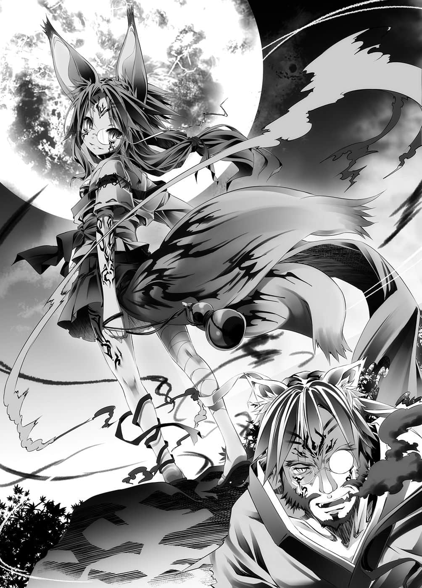
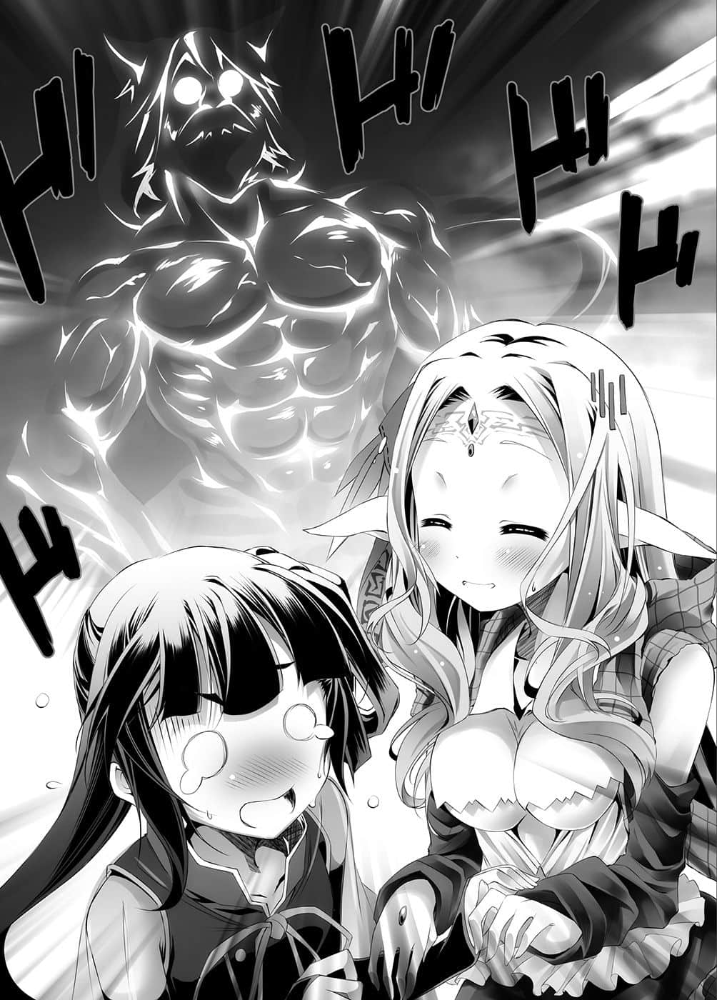

# 第三章 误诱导法

> 来源：https://www.linovelib.com/novel/9/2102.html

——第两百零四格——第五掷，骰子剩余数量——三粒。

初濑伊野看着自己返老还童，回到将近三十岁前时的，自己的手。

仿佛为他特别打造的红色月光映照的风景格子——这怀念的感觉令他苦笑。

没错……与她的相遇，正好就是这个季节的这种夜晚。

在甚至还没有东部联合这个名字的群岛上，遇见卷起的——那阵旋风她……

---

■ ■ ■

「真是美好的月夜呢，『初濑』……在这么舒适的夜晚，要不要和我来玩游戏呢？」

——远在半世纪以前的过去，红月照亮的夜空下。

个子娇小——但却比月光更暴力地将夜色染红，强大且拥有两只尾巴的红色狐狸。

蹂躏东洋的『旋风她』，以宛如铃声般的嗓音呼喊部族名，站在伊野的面前。

当时，伊野只不过是一岛之长，他也早已听说过那阵旋风她的传闻。

受迫害的金色狐部族的最后一人——『血坏』个体的少女。

她从最底端往上爬，最后终于压制了迫害自己的巫雁——

以压倒性的五感、思考速度、权谋术数离开巫雁，向兽人种居住的所有岛屿所有部族宣战。切断海路，断绝贸易，从内部崩解，招致自灭，让对方只能答应游戏——既无恩赦也无让步，制伏支配对方，成为吞没东洋的『旋风』——

在那阵旋风面前，伊野没有拒绝游戏的权利。

「……原本我以为我们忧虑现状的志向都是相同的……结果我真是看走眼了。」

他叹了一口气，双脚稳稳地踏在地上。

——伊野当初对旋风传闻怀有期待、希望、盼望。

心想：为兽人种之间互相反目的无尽泥淖划下句点的人出现了。

但是——

踏碎大地腾空跳起，渲染夜色的红增加为两个。

颠覆因为是其他部族，所以当作事不关己，甚至幸灾乐祸的『低劣理论』。

「——每个人都不是受人支配的棋子，没有任何人需要牺牲的『定理』。」

在巫社的庭园里，坐在栏杆上的金狐——喝着酒，忽然这么说道：

「别装了别装了……你因为『不能上想上的女人』而与部族冲突，因为想要聚集美女建造后宫，所以希望废止部族歧视——清楚直接，甚至可说动机纯粹了呢。」

「在持续破解无数遍的永久时光之后，应该有我所寻找的『定理』。」

她发觉那只不过是换人牺牲而已。

她对成为部下的伊野自称『巫女』，解除血坏的红——

但是巫女只是把那个力量当成『单纯的动力』使用，追求用暗号运作的装置。

对抗其他种族的技术也发展至『完全潜入型』，达到森精种也被击退的地步。

无可否认，各部族分裂，日复一日持续的派系斗争——这也是『定理理论』。

——伊野还是不明白她所说的话。

巫女所着眼的就是现今的『巫社』，从巫雁的神社流出的『力量』。

然后从那一日起，将近六十年的岁月流逝————…………

自己已经没有那一日做梦的资格，巫女弹了一下棋子。

「我做错了……一开始的第一步——那个作弊本身就是错误的吧。」

——那不是任何人刻意为之，只是令人作呕的『结果论』而已……然而……

「那么我就坦白说了——敢对我的女人出手，我就咬断你的咽喉哦，死小孩！」

同时她也聚集有识之士，以暂定政府的身份，启动国家研究计划。

兽人种的合并、统一，甚至连与其他种族的对抗——她都称之为『第一步』。

如同巫女的宣言，巫女面对多达四位数的岛屿，以及几乎同样数量的部族，处理以协议、交涉为名目的庞大难题——诸如法律、经济、执政权的分立等等——终日都在协调解决游戏那些问题中度过。

——唔嗯，也就是她掌握得一清二楚啊。

「恕我失礼——请收回刚才的发言。」

初濑伊野跪了下来，庄严地告知她，要将剩余的人生奉献给她。

为了多数而牺牲少数的事已经多不胜数，间接夺走的生命也不计其数。

美丽的旋风妖艳一笑，盘腿往地上一坐。

完成后的兽人种统一国家——『东部联合』，其首都巫雁。

那对眼睛凝望着遥远无比的彼方——

借由算式的转换，使得声音与影像的表现化为可能，是在二十年之后的事。

要颠覆这种悲惨的『定理理论』。

「那就赢过我吧，如此一来，对你的女人和地盘，我都不会再出手。」

——这个光辉亮丽的发达城市，在半世纪之前，有谁能想像得到呢。

「这样我就安心了，因为若你是除了美女外也毫不挑食的人，我也要担心我的贞操了。」

「……哦？」

「哇哈哈哈你还真敢说呢，说什么部族怎样的，你只是因为不能包养美女，所以愤而叛离而已，你这个用下半身思考的家伙！！」

「……到此已经过了半世纪以上……对吧，初濑伊野——」

对于期待、希望、盼望，然后让他失望的『旋风』，伊野这么说道。但是对于那样的伊野——

不过，现在回想起来……那就是『神灵种的力量』吧。

不过，相对地——旋风说道：

「……可是那样会招来『反破解定理』哦！」

「树立兽人种的统合政府——『东部联合』……这就是最初的『破解定理』。」

「只要您答应在立法之际，能够准许重婚的话，我就赌上全部生命协助您。」

「虽然像在夸耀，但没错，另外确实认清自己立场也是我夸耀之处，这个也请您更正。」

「输了就要成为我的部下。当然，你没有拒绝权，抱歉啦♪」

「恕我不能认同，巫女大人成就了兽人种的任何人都无法做到的『破解定理』——」

「美女贬抑自己是不被容许的事。」

巫女打断伊野的话，自虐地一笑，她用眼睛诉说着。

——那名让任何至宝也相形失色的金色狐少女，说出伊野所期待、希望及冀盼的——未来。

用这种程度力量制伏、支配、领导兽人种——在那之后——

「——————怪了，你是在说哪件事呢？」

——对耗费两百年寿命至剩下十几年所达成的那些事——事到如今才懊悔。

为了缓和部族的歧视，她采取了歧视其他种族的政策。

永远地不断破解定理，为了追求那样的目标，她心无旁骛地冲刺。

血液沸腾，咬碎常理枷锁的两只红色野兽——对峙的两者之一说道：

用力量统一兽人种——万一指定一人做为『全权代理者』。

就这样，靠『力量』的启动ＯＮ与切断ＯＦＦ来运作的自动盘程式——最初的电子游戏被制造出来了。

……光靠理想无法推动政事。

朝无止尽的梦想——甚至更遥远的尽头挑战的人。

拥有实在太过高洁的志向——使月亮也要为之失色的尊贵少女。

「…………………………你很受欢迎这件事似乎不假呢。」

血坏所带来的暴力五感、思考速度——以那种程度的力量。

「像这样耗费半世纪以上——我还是在这样的定理这里中……」

「在成为配得上巫女大人的男人之前，我不会向您搭讪的。」

「但是我也不知道该怎么做才好……」

因为无论力量的来历为何，轻易就会被其他种族干涉的力量是不具意义的。

——从那一日起，仿佛数世纪之久的动荡记忆半世纪开始了。

「所以——这里就是我梦想的『终点』。」

兽人种互相敌视的『定理理论』已经完全被打破。

「第一步——就是要崩解兽人种彼此斗争才有利的这个『定理』。」

——然后，伊野对自己的肤浅感到羞耻。

要统一种族，颠覆『定理理论』，靠力量是不够的——需要凌驾力量以上的东西。

血坏个体之间的游戏，旋风少女像是应付小孩般打败了自己——

对于吞没一切的旋风所提出的先见之明，伊野在叹服的同时——

颠覆其他种族以游戏支配、奴役部分兽人种的『惨状理论』。

「——你该不会认为『血坏』是自己的专利吧，更何况——」

寻求对抗其他种族的技术——毫无精灵、魔法干涉余地的游戏。

「哇哈哈哈！不愧是不认清部族与立场，向美女搭讪的男人啊！」

「我不能眼睁睁看着整个种族被『更强者』毁灭——！！」

「……在这条道路的前方，没有我追求的『没有牺牲』的定理……」

那个『力量』的真实来历，当时的伊野，不——当时无人知晓。

巫女把玩着光所编织成的士兵——兽人种的棋子，露出自嘲的笑容。

不可能产生出足以吞噬这么多岛屿的『谋略旋风』。

——当面对更强的力量时，一步就会使兽人种整个种族毁灭。

看到伊野放弃装体面，她哈哈大笑。

……旋风笑了。

看到一脸严肃地下跪的伊野，巫女玩笑般地笑着说道。

——伊野不明白那句话的意思。

但是在身旁陪伴了她半世纪以上的男人——

「制伏整个种族后——这次再以自治为饵交还给他们，建立『部族联合』。」

「……我——做错了什么呢……」

决意要为她高洁的目标奉献牺牲的伊野，笑着对她说：

「那个我也会破解回去——因为我已经想好对抗其他种族的方法了。」

在兽人种统一之后，等待着的是其他种族的致命一步——伊野如此告知。

「……您是心口不一，那样的表情欠缺说服力哦。」

「……是啊，那么——我就像个不服输的人，慎选词汇吧。」

——咬着嘴角，强颜欢笑的那副表情。

丝毫，完全，一点也不能接受的那副表情。

那副诉说着怎么可能甘心放弃的——游戏玩家的表情。

「该怎么做才好——在我找到答案之前，这场胜负暂且寄下了，这样说如何？」

——初次见到的那张笑容并没有哭泣。

也没有颤抖，如往常一般，超然且毅然决然的表情。

——伊野就这样……

——就当成是那么一回事了…………

---

■ ■ ■

「……来了吗……」

感受到气息，伊野闭上回顾过去的双眼。

缓缓地——睁开注视现在的双眼。

——第两百零四格。

伊野伫立在缅怀过去的地方，距离空他们泡汤的格子——五十二格。

空在浴室提到『下一次停下的格子』，伊野在那里静静迎接他所等待的人们。

「——哎呀？这个意思是……让你久等了，是吗？老爷爷？」

「……呜呜……不想再见第二次……老头……」

「我已经受不了了，这个游戏不能『弃权』吗？死掉就能轻松了吗！？」

见到分别表现得满不在乎，深恶痛绝，吵吵闹闹地出现的三人，伊野微微一笑。

「话说你为什么还那么镇定啦！？」

————三。

白她们翻找背包的动作，在他看来甚至像是静止的，在这种情况下——

同样用竹枪对着伊野——白像是恐惧着恶梦一般，身体发抖。

就和伊野写的其他【课题】一样，那是道粗心又愚蠢的课题。

「——我给你们一些优待吧。」

——对以『血坏』扭转常理的伊野而言，数五下的时间就像是数小时。

被爆风吹起的沙尘，遮蔽空他们的视线——

为了兽人种……为了多数的人，她会毫不犹豫地切割少数人。

那一日——她说自己做错了什么，说出了『不服输』的话语。

听到那句话，原本在发呆的史蒂芙大概也掌握了状况。

——虽说因为巫女死亡，且凶手是空而气昏了头，但仍然没有辩解的余地。

「……快点……把某个东西扯断，不然……哥会被杀掉……」

——他是绝对不可相信的人。

然而那明确地违反『十条盟约』。

————但因为能够达成，所以不是无效的【课题】。

正因如此，只要指定时间——写明『即刻自杀』的话——就会死。

————————那本来是完全没有意义的【课题】。

历经苦恼与苦涩的决定，她仍不屈不挠，不依靠别人，怀抱远大的志向，不过——

因为无法辩解。

「……嗯，所以只要我们三人『随便把一个东西扯断』，你就会被夺走三粒骰子，骰子变成零，光荣地『游戏结束』——你在等我们为你送行吗，老爷爷？」

「那种事你做得可多了吧！？不对，我不是问那个啦！因为——」

「空先生和大家……扯断某个『东西』的速度——」

——【为了世界把那东西扯断】。

正因如此，所以也能够间接地——互相夺取性命。

对于问道：可以杀死你吗？回答：可以——如果曾这么同意过的话，那么——

两人拿出从旅社带来的粮食，拼命地想要将之扯断，不过空无视她们，一个人平静地，只是疲累似地，一边叹着气一边看着伊野。

红色的野兽——身上笼罩着血雾，露出獠牙，那模样就是杀戮的代名词。

伊野虽然不了解那个男人空，但至少有件事他可以断言。

她就是用令人甚至感到畏惧的判断力、实行力，建立起东部联合——却又无法完全变成无情的人。

空领悟到，通过第两百零四格——空他们要停下的格子，看到课题的伊野，选择在那里『埋伏』的意图。他不理会惊讶得说不出话来的史蒂芙，傻眼地问道。

——因为从那一日，她忍住悔恨的眼泪，仍然拒绝屈服的那一天起。

明明决定要恐吓伊野，空却双目泛泪地大吼。

一同度过半世纪以上的时间，伊野非常了解巫女。

在巫社庭园里，坐在栏杆上的金狐就像那天一样，喝着酒对伊野说道：

————四。

「就连我都已经放弃了你，却有一个男人没有放弃，贯彻自己的信念——你愿意试着相信看看那种男人吗？」

——没错，就连谁要做什么都没有指定的【课题】。

——瞬间，大地动摇，大气爆炸。

伊野对着最先发觉，翻找着背包的白笑着说道：

不过——空会感到傻眼也是当然，伊野露出自嘲的笑容。

「——————！？」

「——喂，为什么——为什么伊野先生要杀死空呀！？」

——他知道。

「真是丢脸，为了确实地杀死空先生，我应该先冷静地深思熟虑才是。」

伊野从奥仙德——海栖种与吸血种设下的陷阱生还之后。

——或许是途中发生了什么事吧，空戴着草帽，手持竹枪，上气不接下气。

「是啊，我等很久了……怎么来得这么迟？」

身上只缠着破布的史蒂芙，趴在地上闹脾气——对着那样的三人。

但是伊野低下头，这么回答道。

07：【课题】可强制停在格子上的骰子保有者，听从任何指示。

「这样就明白了吧，即使是愚蠢的课题……而我也在这里的话——」

然而——

现在立刻把别的『东西』扯断——也就是『达成课题』的话，就能阻止伊野的杀戮行动。

「……因为那是白费力气，而且反正是来不及的。」

「初濑伊野，老实说，我判断是应该要对你见死不救。」

「从老爷爷的角度看来，我们达成课题后，死的就是他自己哦？彼此彼此吧。」

白被这么问到，疑惑地皱起眉头——但那也只是一瞬。

「——因为？因为什么？」

「欸～那个～……这是怎么回事呢？」

「与我数五下，扯断『空先生』的速度——哪一边比较快呢？」

被这么问到，伊野心想——『想都别想』——

摆出任谁也看得出来的——应战态势，伊野这么说道。

「空先生……不，这个问题问白小姐比较好吧？」

「——什么……！？」

「——【课题】的规则，白小姐字字句句都记得吧——？」

——这个游戏的【课题】有强制力。

没错——看到伊野自己的课题，空露出苦笑说道：

---

■ ■ ■

「别开玩笑了……有五百二十公里喔，正常来说哈雷也会油料耗尽啊……」

她和白一样翻找背包——不过有如悲鸣一般喊出疑问：

当他们再度睁开眼睛，在那里的是——

早知这样，也一并附上『燃料拖引车』就好了，空这么说道。

从她说要结束无止尽的梦想那一天起——

「哪有为什么，那家伙打从一开始就写下『去死』的课题，干劲十足到让我想求他饶了我呢……虽然我不觉得他会喜欢我，但我做了什么事，让他讨厌到这种地步？」

「——如果您愿意再次拾起梦想的话，我愿意。」

只见伊野放低重心，露出獠牙，伸出利爪。

——课题的文字被朗诵了出来。

「要你反省的点不是那里！是教你别写杀害宣言了，我要哭了哦！！」

没有指定时间，非但如此，连要扯断『什么』都没有具体言明。

「——也就办得到『我把空先生扯断』这件事了吧……」

——那就像是昨天才刚发生的事。

说出——胜负暂且寄下，不再正视梦想而露出僵硬的笑容。

白睁大眼睛，脸色变得更加苍白，立刻打开背包。

伊野从只是冷静地看着自己的男人视线中——看到了记忆的后续……

————五。

即使如此仍具有强制力的话，那就代表——那是因为全员都同意的缘故。

强制行动就是侵害自由意志权利。

——那样的笑容已经在她脸上消失了。

因为在初次见面的那一天，追求无止尽的尽头，令至宝也为之失色的笑容又回来了。

在找到答案之前，暂且保留胜负的她——找到答案了吧。

她在他们——在空他们身上……找到足以再次重拾梦想的答案某种存在。

一同度过半世纪以上的时间，伊野非常了解巫女。

——原来只是……他自以为了解…………

---

■ ■ ■

————零。

「——那么各位……再会了。」

向至今仍拼命想要扯断行李的一行人——告别。

无视张开口正要发出悲鸣的白与史蒂芙，伊野的脚——

「……我说老爷爷……不好意思，那是——————」

往地面踢下——瞬间。

空的话声中断，空间扭曲，时间炸裂开来。

强行以暴力制伏世界常理的『血坏』。

以将一百公尺转变为零公尺，零秒转变为一百秒的速度奔行。

在空、白与史蒂芙三人，各自维持三种表情停止的世界之中。

只有伊野——在唯有血坏个体才被容许的缝隙间飞翔。

踏出一步。

前近一步。

伸出一只手。

「要设陷阱就要设致命的陷阱，无论情势如何发展都会是自己胜利的陷阱，是吧？」

——如果伊野也那么做了——

——正确答案。空仿佛这么回答一般，露出苦笑，扯断手上的草。

被惯性和血坏都不容违抗的『盟约力量』制止——

无视僵在原地的白和史蒂芙，空悠哉地开始扯断食物草，伊野则是对他苦笑。

伊野打从心底感到厌烦，只是自虐地说道：

「……巫女大人一定也那样做了……对吧？」

「也就是说，你的目的是要把骰子托付给我们，让我们往前走——」

「一个……不，你有大约七个词是多余的，老头！」

——空安慰被算在一起责骂，但除了颜面以外并不反驳的白。

——相对于他，这个男人与他妹妹，像是看透一切般早就知情。

——伊野无法使用这个课题杀死空。

甚至她背后神灵种的存在，伊野既不知情，也丝毫没有发觉。

「空先生你们设下让你们自己获胜的陷阱……只要胜利的话——」

史蒂芙差点虚脱昏倒——不过空低吼般的声音让她勉强保持清醒。

但是有一人却没发觉，伊野强而有力地告诉她。

「…………！！」

「——我初濑伊野，无论何时都准备好杀死空先生哦！！」

「啊啊啊，白！不是的，这个家伙是在说哥哥啦！」

如果伊野自己也掌握这个情况——那么他这个行动的用意——

伊野微微一笑，将手放下——解除血坏。

只是在吓唬人——有一半是真的，不成熟的嫉妒推动着伊野。

但是伊野——一无所知。

「找我玩『文字游戏虚张声势』——对你来说负担太重了。」

「……至少有一个人会拒绝那种事发生吧，我预料到这点，所以才用这种方式激将，确保成果。」

——没错，她也与白一样——

空的话就会那样做。

…………

以巫女的性命为代价开始，这个理由伊野不可能同意——

「…………哥……白是……颜面遗憾缺憾的……人……？」

……没错，【课题规则】是因为同意性命的争夺而具有强制力，不过——

——年龄一岁、两岁地削减，身体逐渐退化。

「——欸、那、那么伊野先生本来就没有打算要杀空……是吗？」

「——相信你们会用卑鄙龌龊、可怕残忍、人格严重缺陷，不管在精神面还是颜面上都非常遗憾缺憾至极的人才想得出的方法——背叛欺骗全员，赢得胜利吧。」

如果是在那样的前提下，巫女问『要试着相信空吗』，那她的意图——

——原来如此，确实自己对巫女的事毫无所知。

「然后巫女大人一定会在那之上——让空先生们坠入陷阱吧。」

「史蒂芬妮小姐……请你不要太小看我。」

——看到胸前增加一粒骰子，史蒂芙倒抽了一口气。

……………………呼的一声。

「那只是单纯——没有投下任何赌注……对吧？」

——扮鬼脸吐舌头……

巫女面对的是什么？做错什么？为何而流泪？以及——

——空扯断最后的一件东西草——三人被视为达成课题后，伊野失去剩下的三粒骰子，在被光的漩涡吞没之中，他说道：

「…………啊……」

那么同意的『全员』之中——巫女也包含在其中……这是毋庸置疑的……

——在说出这句话的空的面前停住。

仅仅只是这样，就能让人类种的身体变为飞沫的力量。

数瞬之后——众人才像是终于想起时间是会流动的一般。

「那正是巫女大人的胜利。因为我确信是如此……除此之外别无可能。」

「……老爷爷，你不需要『那种属性』吧……」

手里拿着『已经扯断的食物草』——相对地。

——与巫女一同度过半世纪以上的时光。

「什么都被你看穿了吗——你就是这种地方惹人厌，臭猴子。」

——每个人都会那样做。

「……巫女大人是相信你们了吧，空先生与白小姐一定会比任何人都巧妙地——」

不过他还是有自己知道的事情，伊野就像在如此主张一般。

「既然杀不死——那么『吓唬』一下也不为过吧！」

而现在，孩童一般的倔强让伊野开口了。

就连『那一天的表情她』，她是因悲叹做错什么而梦碎也——一无所知。

『少女她』在面对什么？

没有全员的同意就无法成立，玩家间彼此背叛互相厮杀的游戏。

史蒂芙歪着头，视线像是这么问道，伊野则露出灿烂笑容——一半是真心，一半是骗人。

「喂，老头！！你给我向明知是虚张声势却仍然稍微尿湿的内裤道歉！！」

「没有指定就等于做什么都可以——那样的逻辑行不通啦。」

既然明知杀不死，为何还要虚张声势。

「什、什么……？」

——虽然声音沙哑颤抖，空仍全力露出逞强的笑容。

甚至有如不让大气察觉一般，撕裂无声而伸出的利爪——

别说是半世纪……打从初见面之前——他们就远比伊野清楚。

仍然缓缓扯断食物草的空，语带讽刺地——

「————————没用的……你要好好选择游戏类别啊。」

伊野则是对空露出苦笑，在逐渐消失之中……说出自己认为的答案。

——是什么让她再一次——面对梦想，绽放笑容的呢……

他将花费相当长的时间才想通的理由——刻意如挑衅般说出。

「咦……咦？奇怪，可是——」

伊野的举动所产生的一切——爆炸声、暴风、冲击波吹袭肆虐中——

晚一步才发觉的白，看到『手中的东西』——小声地惊叫一声。

「……唔，被发现了吗？跟恶魔比智慧是超出我能力的挑战吗？」

「傲娇肌肉男这种属性对谁有好处……既没有需求又噁心，请你别这样好吗？」

——在全员同意之下开始，如果巫女的命是游戏『开始的筹码』。

那样的体验已经历过数次，可是这次没有底限，会持续直到零岁——消灭为止。

他用与那副肌肉身体完全不相衬的动作回答。

就在只有史蒂芙还在困惑呻吟的情况中，伊野笑着说——仔细想想那是理所当然的事。

『巫女她』在烦恼什么？

空往史蒂芙与她『手上的东西』瞥了一眼后如此说道。

「我们三人都达成课题的话，你就会丧失全部的骰子——」

——骰子数量归零的话会如何呢？

那个『答案』每个人都将初次目睹。

其中史蒂芙手遮着口，在恐惧、同情等混乱的感情之下流泪。

「——你们要赢。巫女大人不惜以性命交换，除了她所希望的结局——其他我可不认同喔。」

伊野说——你们可别自大。宛如唾弃一般地命令你们。

我只是为了巫女大人的胜利，所以才协助你们获得胜利，在这里结束而已。

伊野面向空与白这么宣告。

但是——

「这用不着你说，你要保重，老爷爷——不，是小弟吧？」

「再见了，男孩……虽然非我所愿……晚安……」

——虽说这是出于伊野自己的希望。

但对于自己逼迫至死的人，两人竟嘻皮笑脸，脸色丝毫不变地回应。

史蒂芙甚至对两人感到阴森可怕，齿牙轻颤，而伊野则是——

「因为是最后了……可以请你们回答我一个问题吗？」

「……最后啊……既然如此那就视问题而定吧！」

——再过数秒大概就要消灭的伊野，只是漫无目的地问道：

「……为什么我——不行呢……」

即将死亡的现在，伊野仍不明白，巫女所看到的是什么。

「……带给巫女大人答案笑容的……为什么是你们呢……」

她不是从自己身上，而是在他们身上看出，取回笑容的因素。

「那就是——对方想做的事，全部别让他做；对方不想让我们做的事，就要彻底去做。」

这样一来胜利的要素就齐备了——两人一起露出得意的笑容。

那个无比灿烂，一如往常，就如他所知的那样。

「你还没发觉！？明明旗子插到都看不见地面了说！？如果是电视游戏的话，这时候就该骂『那么明显的伏笔到底要铺到什么时候』，开始准备寄信抱怨剧情了耶！！」

两人想起过去曾看过的探讨生命诞生的专题节目。

她的表情就像是看到了杀人狂，但是——

「我会在那个世界，和巫女大人一起，看两位落入巫女陷阱时的落魄模样。」

「……哥……快点说……」

生命皆是以『灵魂』注满『容器』，因为某些理由——破损受伤、损坏生病或寿终正寝，出现容器无法留住灵魂的状态，那个状态就称之为——『死亡』。

被妹妹抱怨，空在史蒂芙的耳边小声地说了几句话——

——随后响起仿佛要让天地都听见的叫声。

「你们就像伊野先生所说，去死一遍才是为了这个世界好啦啊啊啊啊！！」

只有它的名称与使命，仍未改变。

任谁看到都会想挥拳揍上去——没错。

……关于移动手段，空与白高举拳头，努力不去思考这个问题。

女性职员泪眼汪汪，张开颤抖的唇——

「欸——咦？该不会——」

——在逐渐消失的意识之中，伊野确实看见了。

「你们的脑袋哪里有问题吗！？你们杀了伊野先生喔——！？」

——不，那已经不是谣言了。

死者对人世的留恋，也就是『所谓的幽灵』，毫无例外全是错觉。

勉强挤出这句话的是发出呜咽声的史蒂芙。

「……我就收下你们的体贴吧……」

也就是——做为『外交机关』应付来自海上的人士——

那么——明明只要再前进一步，他就能够明白了。

---

■ ■ ■

「做为人格健全的人，你或许是第一流的——但是身为玩家你是三流的啊。」

——空说话的那个样子，就带着记忆中的笑容。

————

…………呃～……？

然而空与白只是玩弄着骰子，整理状况。

特别是这个世界『不存在幽灵』——是不言自明的事实。

在这个将质量存在时间——肉体年龄分割为骰子的游戏。

身为玩家的这两人『始终就不打算给他答案』。

「……你们两个……为什么……还能像没事一样呢？」

「……为什么记忆不会减少呢？」

「……哦～……」

只是留下『那样的人不存在』的空虚寂寥而已。

——虽说是受到诱导，但同样成了推手之一——史蒂芙感受到无比的罪恶感。

「虽然多了一些迂回曲折，不过伊野也顺利退场，骰子虽然没有余裕，但还是按照预定在进行呢♪」

——

然而看到空满不在乎，开玩笑地回应，史蒂芙甚至对他感到恐怖，不禁退了几步。

让伊野还有另一个人尽速退场——这个预定已达成了。

真是愚蠢的谣言。

现在那个幽灵，确确实实地出现在一名女性职员的眼前。

——好了，现在那里却谣传有幽灵出没。

「体贴？你在说哪件事啊？话说回来——最后我也可以问个问题吗？」

但是现在，在这个探题府里，那个谣言却被正经八百地谣传着。

——但是却有人喊停了。

「要我跟杀了人还能笑得出来的人同行，我才不干呢！！」

面对他人的死亡，仍然能够眉毛不皱一下的怪物到底拥有什么？

「性格扭曲的行为……白最喜欢……」

——东部联合首都巫雁，在首都的一隅，有一个名叫镇海探题府的机关。

「这还真是……会稍微造成心灵创伤的影像呢……」

「欸～偶尔就好了，可以请你也想起真的被当成杀害目标的空小弟我好吗？」

——要设陷阱的话就要设致命性的陷阱，空会那么做，任谁都会那么做——巫女也会那么做。

恢复冷静后的伊野，推测中了相当一部分。

「……之后……再告诉我们吧……♪」

空与白只是用难以言喻的——复杂的表情回答道。

听白这么说，空似乎终于发觉史蒂芙看着自己的眼神所代表的意义——

退化至少年、幼儿、胎儿，以至于细胞——然后——

「……哥，明确地告诉她……比较好……」

这样一来，剩下的问题——更正，从头至尾一直持续的问题，那也就是——

半透明地发出淡淡光芒的粗犷肌肉块——喔喔喔……那正是荧光肌肉！

战争结束，如今，不管是所在地，甚至是组织的架构都已经大大变动过，不过——

骰子数『零』定义的就是——否定存在过的事实。

「再见了，去到『你所希望的那个世界』的感想——」

——想做的事不让他做，彻底去做他不想要你去做的事。

没有容器的灵魂要保持形状，那是神之领域的魔法才办得到的。

---

■ ■ ■

「……白……讨厌那个景象……一想起来……睡觉又会梦见……」

——直到最后，还是一样的好性格。

舍弃嫉妒与悔恨，伊野有如乞求般追寻答案——

「我拒绝。」

一说是——看到粗犷的肌肉块穿透墙壁，这种非常噁心的光景。

「……老爷爷啊，游戏求胜的基本，同时也是奥义……」

一说是——在无人的房间里，听见『愤怒～～』的低吼声。

……

一说是——那个隐然发光的幽灵，正是世上最可怕的……荧光肌肉。

——被光所缠绕，无休止地退化。

所以——两人复杂的笑容变得更深奥——

「这个游戏，明明是互相争夺骰子——年龄生命的游戏。」

原来如此，到了这个地步，两人的笑容反而显得清爽——

「……剩下一百四十七格，掷一次消耗六个……骰子乱数解析，还剩两掷……♪」

空无一人的接待室里，一团肉块蹲在地上挣扎，发出意义不明的低吼声。

「……您——」

——被称为『初濑伊野』之人原本站立的地方。

那是在上古大战时，为了应对从海上来的灾厄所设立的『军事机关』。

「——好了！那么就再次集中骰子『同行吧』！！」

——就算是教育节目，播出『胎儿成长的回溯』妥当吗……

空与白看着在眼前展开的壮大光景，两人只感到虚脱。

勇敢地攀谈的对象——啊啊，那是——

「您是初濑外交长官……吗？」

「愤怒啊啊啊啊啊啊啊啊啊啊啊啊啊！！」

——该怎么说呢……那是初濑伊野。

任谁都不敢直视，世上阴森恐怖的怪异现象——荧光肌肉。

看出他真实身份的女性职员，心惊胆颤地再问了一次。

「初、初濑外交长官……的灵体？恕、恕我失礼，您、您还没死对吧？」

「唔咕、唔哼哼……是啊、是啊……不知是幸还是不幸，似乎是那样啊！！」

——没错，初濑伊野去了『他所希望的那个世界』——不，他回来了。

接受死亡，说了一堆肉麻台词的初濑伊野，在巫社醒来，成为空与白所期待的模样，也就是——

「——我这不是还活着吗啊啊啊啊啊啊啊啊啊！！」

他如此大叫，趴在地上抱着头，不断地打滚。

不——正确来说，恐怕也不是活着。

应该说，就常识而言伊野确实是死了——但是回想一下规则。

01：七名参加者，将会分得以自己『质量存在时间』依比例分割而成的十粒『骰子』。

质量存在时间——没错，那是质量存在过的时间。

——其中不包含没有质量的『灵魂』。

15：所有玩家失去骰子或是死亡，即视为『无法继续』，游戏就此结束。

16：该神灵种在游戏『无法继续』时，有权利征收除领先者外全部参加者的一切。

——失去骰子……归零——或是死亡。

——难道不是出于我方的意图吗？

从北到南，西方的海面被一个巨大船团所覆盖。

有如对照一般——一头黑发，胸围引人感到遗憾的人类种，眼眶泛泪地张望室内。

那位大人会牺牲自己吗？对于连那样的思考都办不到的蠢蛋自己，他亲切地告知了。

——『好吧，算了』，能够咏唱这个最强魔法的人才是强。

因为拥有海洋资源东部联合、大陆资源艾尔奇亚、海底资源奥仙德——存量也很充足，造成的经济影响是以年为单位的未来才会出现。

由神灵种所创造，飘浮在天空，无比巨大的——双六盘。

没错，那是由协定所决定，不属于任何国家的『公海』。

……所谓的不可解，就如同字面上的意思，是不可能理解之意。

从『容器』中解放出来的伊野，拥有仿佛使用『血坏』时的五感——甚至有种宛如水平线的深处都能『目视』的错觉，让他看到乘风破浪前进的物体。

尤其是摇头时，手臂——甚至连丰满的胸部也一起摇晃的习惯，最让我中意。

「——您、您知道这件事吗！？」

——菲尔・尼尔巴连。

听到她惊愕的叫声，伊野——秘书的事暂且保留——点头肯定。

那个情况在常识上已经明确『死亡』，但是在『规则』这个非常识情况则是——『游戏结束』生命才会被征收。

追求不需要牺牲任何人的『定理理论』的人——不是别人，就是巫女大人。

伊野一脸严肃，却厚着脸皮公私不分地挖角。

——应该…………大概，可能……一定？

「……等到事情平静下来，有没有意愿在我的秘书室工作呢？」

那个臭猴子——不，那个温柔的男人早已婉转地回答了。

「何止是惊吓……辞职、调职申请蜂拥而来——不、没什么！初濑外交长官平安无……事——？～～～～虽然不太明白，总之太好了！！」

那是难以言喻的——复杂表情……没错，事到如今他才明白，那是——

更何况对于东部联合的游戏，爱尔文・加尔得掌握的消息是错误的。

这正是空他们所设下，而且也是巫女大人要出奇制胜的陷阱。

他们早就发觉了，在这个游戏中即使失去骰子——

如果空他们和巫女大人丝毫没有打算输或死的话——

「……爱尔文・加尔得的船团在那里展开阵形……是吧？」

——『明明是争夺记忆的游戏，为什么记忆不会减少呢？』

有效利用灵体，穿过地面，在地下抱着膝盖的伊野，忽然想到——

知道——不，伊野是看到了。

「……哎呀～？竟然能够目睹幽灵，人生真是什么事都有可能发生呢～♪」

以为是将死之际而说了一大堆肉麻台词的伊野，心里想到——啊啊……现在的话我就明白了。

下一个瞬间，仿佛帘幕被切断般，出现了两名少女——她们各自出声说道：

————为什么？

但是，如果是那样——

神灵种设定那样的规则，有什么理由或意图吗？

——原来如此，自己是白痴，是笨蛋，自己正深切地感受到这一点。

——嗯，果然冷静，对情况的判断也很正确——深得我心。

「……呼，失礼了，我似乎惊吓到你们了啊……」

对自己的愚蠢怀抱若干郁闷的伊野，在已经完全无法对任何事有所确信的状况下。

「似乎是，但对方既没声明……那海域也不是联邦的领海，所以不知该如何应对……」

但是——这个状况是怎么回事——伊野仰望头上想到。

他摇摇晃晃地，耻辱地痛苦呻吟着……来到这个镇海探题府。

固执于理解，反而会衍生误解——所以面对那样不可解的事物时。

「巫女大人不就也没死了吗啊啊啊啊啊！！」

指示死亡的课题、自灭的死是『立刻死亡』，丧失骰子则只是『退场』。

原来如此，失去『质量存在时间』——也就是代表肉体年龄的骰子。

那种事根本无所谓——重要的是为何是现在？

这个状况反而是绝佳机会，东部联合的必胜无可动摇。

听到规格之外的荣升，要江千岁瞬间露出兴奋的神色——但是随即摇头。

单一国家爱尔文・加尔得对现在的东部联合——艾尔奇亚联邦进行海洋封锁，是无意义的举动。

冷静思考的话，应该就会发现了吧，假如『骰字数为零』等于『死亡』的话，那就不需要用或是来区分了，更何况说起来——！！

伊野回想在逐渐消失之际，空他们的表情和话语。

「现在探题府正发布第二种警戒态势，本日一〇〇二时，在霞乐海西方——」

——不用确认也知道那是哪里的船籍，船舰的造型就像是盛开在海上的花朵。

——那只有可能是『通往胜利的布局』——！！

「——你的姓名和职位是？」

『虽然不太明白总之没事』，对于像这样接受一切的坚强女性职员——

因此经济攻击——『构筑出不得不答应游戏的状况』无法成立。

那么大量的船舰，排列在东部联合与爱尔文・加尔得连结贸易的要冲，做出物理封锁的意图——那是属于灰色地带，却无比接近黑色的『经济攻击』，其他什么也不是。

一头金发飘逸、胸围丰满的森精种，微微圆睁着双眼，笑嘻嘻地说道。

00a：游戏盘虽是现实的仿造，但在那里发生的事象，包含死亡在内，全部都是现实。

就决定让她做我的个人秘书了，向各相关单位进行事前协调吧。

她有着与高阶级并不相衬的年轻相貌——兼具能力与美貌，面对幽灵能做出准确判断的冷静与洞察力，也有上前攀谈的胆量与决断力，顺便一提——不过这才是重点——以身高较矮的栗鼠族来说，她的胸部也很丰满，简直是波涛汹涌，具体来说正是『成熟的时候』——

「是、是！我是镇海探题府中，隶属于霞乐海的一等事务官要江千岁。」

「……那是海洋封锁——吧……？」

原来如此，这个类似幽灵的状态，是因为神灵种在维持灵魂吧。

原来如此，以彻底引人误会的方式说明的规则。

——也不会马上死去，这个规则上的诈欺，他们早就知道了——！

原来如此，即使骰子变成零，在游戏结束之前，生命不会被征收。

再说——设定『失去骰子立刻死亡』，对神灵种会有什么不方便吗？

因为骰子的争夺是——单纯的『容器』争夺。

「——规则里根本没有写『失去骰子会死亡』啊！！说失去骰子会死的——不就是那只秃毛猴吗啊啊啊！！」

「——！？是、是的！请务必——啊，不、不对，在那之前！」

空——或者是巫女大人的意图是——伊野思索背后的意义——就在这个时候……

那样的结果就是『身体』——『容器』消灭，只有『灵魂』，模样才会是透明的。

那么——退场就会变成类似幽灵的这个状况规则。

「因为可以应对的负责人不在而延宕的案件，如果是初濑外交长官的话——属下要向您报告！」

接待室的空气在毫无征兆下出现波动。

原来如此，只是争夺骰子就不会演变成互相残杀的游戏。

强忍住笑意的——怜悯的眼神……

——『因为你是笨蛋嘛』……

——伊野高声大吼，事情演变到了这个地步，他实在是无可救药的大笨蛋。

就这样让不幸拥有能感知灵魂的五感的兽人种引起了骚动——

「——！？菲、菲！？你是在跟谁讲话！？小时候你不是答应过，不会再这样吓我了吗！？」

退一百步，就算真有什么不方便，那只要把灵魂囚禁在某处不就好了？

如果这条规则并无虚假，那么除了丧失骰子以外的死，应该马上就会死。

虽然不知道前进的『原理』，但会造出那种船的国家只有一个——而且前进的『意图』也一样。

——伊野嗯一声，眯起眼睛，深深地点头。

只有骰子被夺而『退场』的情况，灵魂可以到处自由活动——这奇妙的状态规则。

那么这个奇妙的状况是——

——克拉米・杰尔。

虽是初次面对面，但伊野见过也听说过两人。

她们是与空白共谋，将东部联合游戏的错误情报传给爱尔文・加尔得的——『内应』。

「当然呀～今天是来工作，那种小孩子的举动我会收敛啦～♪」

菲尔仅只是弹了一下手指，伊野便察觉到精灵的气息——魔法的干涉。

为了无法认知灵体伊野的人类种克拉米，她施加了某种魔法吧——

「——咿、咿～！！看不见还比较好呀！这是什么呀，有够阴森恐怖！！」

——荧光肌肉，更正——光辉闪耀的『发光肌肉』于焉诞生。

「唔哇～『十条盟约』还真宽松呢～……竟然允许存在的暴力吗～」

「没没、没关系的，初濑大人！我、我认为您的身体很健壮——如、如果没发光的话！」

————一个个都是失礼的家伙。

伊野安抚受到没来由的侮辱而躁动的肌肉，然后说道：

「我应该要说——在此恭候已久了，是吗？」

退场而变成伪幽灵，这个状况规则的意图就是这个——！

制造出游戏进行中也会有『退场』的某人——能够与这两人见面的状况。

虽然伊野仍无法了解背后的真意，不过——！！

「——菲，我再确认一次，他不是鬼魂……吧？」

「是的～虽然拥有鬼魂看到也会长脚奔逃的外观，不过仍如同原先预定的一样～」

如同原先预定——这一句话肯定了伊野的推测，只见克拉米走上前。

「嗯哼，那么……你是东部联合的外交长官，初濑伊野先生没错吧？」

「那就省事多了，这个游戏可以接受中途参加——『突然介入』吧？」

——来自游戏盘外部的干涉就是『胜利』的布局——！

伊野勉强地说出这句话，克拉米却说「很难懂吗？」。

她微微一笑——简单易懂地……再说一次。

「而你是克拉米・杰尔小姐是吧？事情我已经听说了。」

……

「——这是宣战布告。把东部联合所有的东西交出来，懂了吗？」

「——您刚才……说什么？」

伊野对『抵达的援军』微笑，而克拉米也微笑回应。

…………

「我方要求东部联合的全部领土，以及在领土上的所有人才资材。」

「是吗，那么——开始游戏吧？」

——但是接下来这句话。
