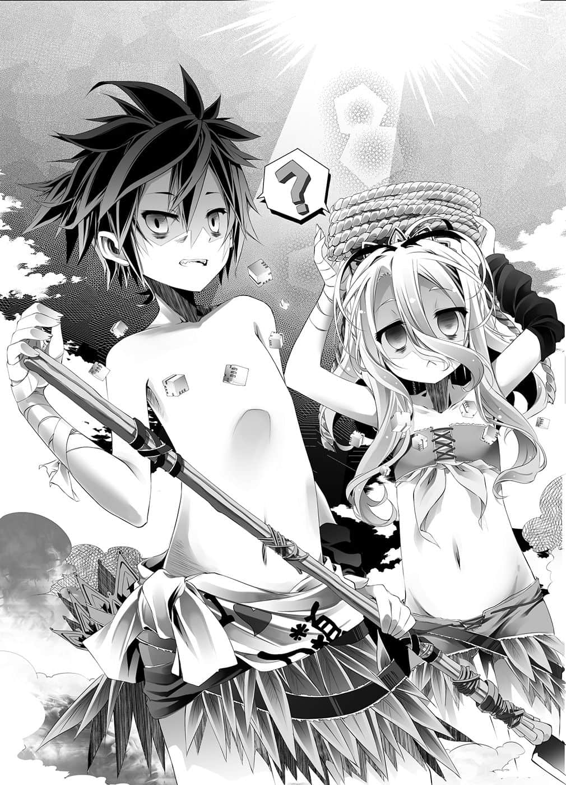
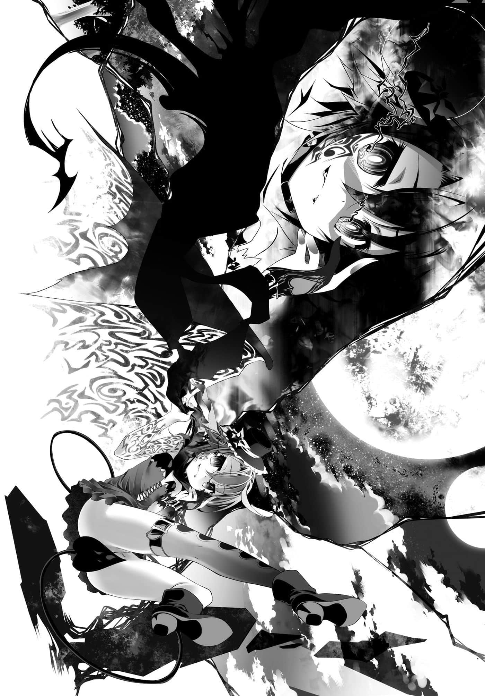

# 第四章 奇妙滋味

> 来源：https://www.linovelib.com/novel/9/2103.html

……即使是干枯荒芜的土地，也会有风吹过。

干燥的风卷起沙尘，轻抚过小小的身影。

影子一动也不动，宛如尸骸一般，软弱无力地伸直四肢，躺在地上。

——一动。

感觉地面微微震动，尸体——影子晃动了。

对于晃动地面的细微声音，影子思考——那是『猎物』。

既没有出声，也没有呼吸，影子和身旁另一个影子就像约定好了似地，一起行动。

宛如泥巴流动一般，宛如地面在蠢动一般，两个影子无声地接近，但是——

『猎物』如同弱者那样，听觉灵敏地反应过来，立刻转身跑走。

它做出很像是草食动物该有的聪明选择，也就是——『逃走』。

原来如此，与其接受来历不明的对手挑战，不如逃走——真是聪明。

然而——『猎物』这时候还不知道——正是那样的聪明杀死自己。

如果它有刻意向来历不明的对手挑战的愚蠢，它就能轻松存活下来。

竟然对影子们——更弱的人、压倒性的弱者，采取这个聪明的选择逃亡。正是因为你不曾想过这点，才证明你毕竟是个强者野兽。

压倒性的弱者——不会逃走，正因为弱者就连能逃出生天的脚力都没有，所以才会安排十重甚至二十重的策略，笨拙且愚蠢地『挑战』，然后——

——『猎物』的悲鸣响彻干燥大气的同时——

停止假扮泥土，用两脚奔出的影子嗤笑——强者野兽啊，你很聪明。

正因如此，你以自己的意志所选择步上的道路——很容易判读。

在你聪明步履的前方，只要放上一个——『陷阱』。

仅只那样。

反映出艾尔奇亚领土最东端的无名干燥地带的荒地格子上。

那是压倒性的弱者——以弱者的强悍与血脉为傲的，灵魂的咆哮。

史蒂芙僵在原地，空则是歪着头感到不解，白则是——配合两人跟着叫了一声。

——就像吃了伊甸园果实的某两人一般。

接住史蒂芙投过来的湿布，全身脏污的空——又领悟了一个道理。

然而——在失败、疲劳和空腹交迫之下，空带着干枯的笑容说出：

——『就算彼此背叛也不会变成互相残杀』。

白露出尊敬的眼神，史蒂芙则报以冰冷目光。

尝试至少确保三天份，可以的话希望也能确保下次移动所需的粮食……但是尽皆失败。

食物与体力皆用尽，三人好不容易才到达此处，迎接他们的是伊纲可爱的【课题】。

「————————啊，对喔，这样就是——『游戏过关』了吧。」

16：该神灵种在游戏『无法继续』时，有权利征收除领先者外全部参加者的一切。

「欸？」

——【有一只蚂蚁身上有鱼的味道，在不伤害它的情况下抓住它，得斯。】

「嗯～？对啊，他没死，目前是这样啦。」

兄妹俩看着彼此——『玩游戏输成这样，自己怎么还笑得出来』——

要是野生动物会被彻彻底底的外行人家里蹲玩家，用临阵磨枪学得的知识抓到，那干脆别活了。

两人歪着头，将刚切好的小鹿猎物——血淋淋的肉片递出。

说出这句『解除催眠』的关键字，瞬间——

衣食足而知礼节——这是多么深奥的道理啊。

由白所构思，空在地面挖洞做成原始熏制器，冒出的烟刺激着眼睛流泪。

……那是当然的。

「总、总之当前的粮食已经取得了吧！？你们差不多也该回来了吧！？」

……即使是干枯荒芜的土地，也会有风与两道嘶吼响起。

要他们抓住在课题中出现的蚂蚁——首先根本无从得知蚂蚁气味的空等人，因为无法达成课题，只能在没有粮食的情况下，被绊住七十二小时——也就是可爱地叫他们『去死』。

——动作夸张地演讲起『舍弃尊严的尊严』。

或许是想起规则了吧，史蒂芙像是重新燃起无论如何都必须到达终点的决心，打定主意，往噁心串烧咬下去。而空与白则像是鼓励史蒂芙一般对她说——

看着营火的火焰，史蒂芙静静地叹息。

「…………呜叽？」

————…………

——你就会用自己的脚，自己坠入破灭——！！

「什、什么啊啊啊！？为、为什么除了神灵种以外——」

「————吼呜？」

「卧薪尝胆！！前面说过的话全部收回，再怎么羞耻也要抛弃尊严！！即使如此也要贯彻不能退让的信念活下去——那才是唯一的自尊，人类该守护的尊严！！」

「……现在不是……挑食的时候！……吃吧。」

两人无言地彼此点一下头，眼神变得阴森锐利，迅速地动了起来。

但——

「……哥，超帅气的……明明是个阿宅……」

——空帅气地宣言，『只要有需要，做再无耻的事也在所不惜』。忽然——

「……反正……大家都会死掉……」

「——唔喔喔喔妹妹啊！？年纪轻——过头的少女怎么可以做这身打扮！？」

「……伊野先生没死对吧？」

那是向弱肉强食法则挑战，今日也赢得生存权利的，生存的主张。

————…………

能吃的东西全部都要吃，说出这句话的空大笑了一声。

---

■ ■ ■

「……你们难道没有身为人的尊严或自尊心吗？」

——如果无人能抵达终点，游戏无法继续的话，除了领先者外反正都只有死路一条。

空这句意味深长的台词所依据的理由，一度也让史蒂芙安心地松了一口气，可是——

「那个……多亏你们两位，食物才有了着落，我真的很感谢你们，可是……」

当初看到伊纲杀死的猎物怪物时，说身为人应该如何如何的那些说词都不知抛到哪去了。

本来应该由史蒂芙负责的烹调工作，现在已经完全被抢走了。

——史蒂芙手里拿着蝎子的串烧，不禁这么说道。

突然觉醒羞耻心，回归文明的两人看到自己的装扮，一齐发出悲鸣。

「……我升好火了，快点去换衣——不，要从擦拭身体开始吧。」

——『一下追赶一下被追赶……就像游戏一样呢』这不经意的一句话。

应该同样是『现代人』的两人，被文明史蒂芙呼喊名字。

不理会刻意装哭的空，史蒂芙不安地看着竹签。

啊啊，那正是为了生存而赌上智慧，勇猛的『原初之人』的模样——！！

「就是那样！除了在前头的神灵种以外大家都会死，所以必须吃饱一点才行啊！！」

「……说得也是呢，没有人到终点的话，除了领先者外，大家都会死对吧。」

空啃着蝎子这么说完，沉默了一瞬间，然后——

…………无声……

「那样的开场白有必要吗？空会坚强地当作没听见地说道㊟——什么事？」

于是空手里拿着平板电脑——看着盼望不会有用到的一天的『野外求生书籍』，开始狩猎。

……

「……空、空……白～你、你们没事吧～？」

——第两百六十五格，自游戏开始——经过二十七日。

伊甸园的果实，智慧之树的果实就是指——『食物』。

史蒂芙退后一步，仿佛恳求般呻吟道……

就这样，无牙弱者的牙，袭向脚被木制之颚陷阱所吃的强者猎物——

捕捉回来的猎物，由空以熟练的动作迅速落刀，准确地将其分解。

然而空与白只是轻松地继续熏制，笑嘻嘻地接着说道：

陷阱转眼间变得洗练——也就是采取预测诱导行动的方式战略。后来因为『衣服摩擦的声音会碍事』，于是用从背包撕下的皮革做出最低限度的服装。一手拿着长矛——两人不到两天的时间便野生化了——

「除了生存的尊严以外，能卖就卖，能吃就吃——碍事的东西全部舍弃掉。」

「欸！」

为了快点将『衣』也补足，好知道礼节，空与白一同将手伸向衣服——

听到文明的呼唤——空眼神空虚地割肉去骨的手停了下来。

「你们的心意我很高兴……可是请你们先想起人类语……还有也穿上衣服。」

更何况骰子十六粒——无论怎么分配都是一个大人或是小孩军团。

「……有那么一瞬间，我差点就受到感动了，那是无可救药的恶人会说的话呢。」

两名前野生孩童几近全裸——只是勉强遮掩身体。

白再从其中选出适合保存的部位，以熟练的动作，放在熏制器上熏制——

……没错，纯粹只是『还没』——史蒂芙的表情更是乌云笼罩。

「……说到『无可救药的恶人』我想起一件事……空。」

「……？欸……」

「别太在意啦……万一陷阱落空——」

（编注：此处空说话的语气，为模仿《魔法禁书目录》中的角色「妹妹们」。）

「……咦？……啊……不、不是——这、这个是……哥做的……衣服……」

「咦？因为那个神灵种一开始不是说了吗？会在终点等待（眼神一闪）！」

「……神灵种也是……参加者……领先在前的……总是神灵种……（咀嚼）」

——两人说得有如微风般轻松自如。

史蒂芙因前提被颠覆而大叫，但是空与白却只是感到不可思议地歪着头回答。

「只要没有人到达终点，管他领不领先，『挑战者我们』全员都会上西天。可是那种事根本无所谓，我们要做的事还是一样，这是再清楚不过的事，而且这规则与我们无关。」

「为、为什么！？就是因为有这个规则，大家才会争相往前——」

「因为只有一个人不会死这种规则——『 我们』断然不会答应。」

「……………………！」

——对于一脸严肃，眯起眼睛这么断定的空，史蒂芙瞬间屏息。

「只要有一个人到达终点，大家就都不会死——如果是这个的话，全员都会同意……不同意不行。」

没错，大家所同意的肯定是——『这个』，因为——

「我说过就是要彼此背叛才能获胜吧？在这个没必要参加也没胜算的游戏，设下不到终点就能获胜的陷阱的布拉姆也一样。正如伊野所说，设下夺取我们胜利的陷阱——但却一度被掌握了生命的巫女也是——其他全部的人都必须同意这个条件，不然就无法背叛吧？」

「…………」

空轻松地笑了，史蒂芙却以无言表示自己不懂他的意思。

「——好啦，你只要知道这些就可以了。」

空似乎不要求她理解的样子，满不在乎地——做了一个总结。

「不管是哪一个人，大家为了让自己赢，都布下了机关——」

这个游戏只要有人抵达终点就不会有人死。

但是既然能够抵达终点的最终只有一人——以那样的成员——怎么可能不思考『那么获胜的将是自己』。

「那么问题就只在于——『现在是照谁的剧本在走』对吧？」

这个不可思议的游戏的最大不可思议之处，也就是——

——史蒂芙已经准备回想一个月前的事，不过空则是心想：

超越性的强者，不成群结党，也没有全权代理……因此也无从夺取种族棋子。那么——他们会认为在这个世界上，神才是玩家，其他凡俗只不过是棋子，也就不足为奇了。

『十条盟约』之三——游戏需赌上双方判断对等的赌注。

——考虑到被视为未达成课题，三人将各减少一粒骰子的分配——

——她满脸笑容，说出她的剧本。

高高在上的神，到底认为区区棋子空等人有什么东西，可以与自己的一切，『判断为对等』呢？

先不管因无法正确回答而似乎感到懊悔的史蒂芙——

「更何况神灵种也了然于胸……这个游戏自己可能会输……」

「……那么了不起的神灵种，为什么要和我们棋子进行游戏呢？」

那一定是非常单纯，而且自暴自弃的——但正因为如此才会是致命的陷阱。

听到两人这么说，史蒂芙疑惑地皱起眉头，追在两人身后——……

「好了，在这里我要提出一个问题！『只有领先者不会死』这条规则！！」

也就是说，这是只有那个神灵种才能争取到的规则——但是所做的事却是——就算自己输了也要『保护巫女的命』。

被问到这个太过根本上的问题，史蒂芙僵在原地。

甚至规则有大半都是在空等人的意图下组成的——游戏。

这个游戏若只追求个人利益，也十分有可能有人到达终点，不死一人就获胜。

「……神是什么，虽然我在原本的世界没有见过，所知也只是谣传。」

但在说明规则时——看到神一瞬间对自己露出的眼神，两人心想：

不过，如果是这样的话——空微微一笑。

东部联合的镇海探题府接待室里，初濑伊野对优雅地坐在对面沙发上的两人，克拉米与菲尔——原本期待是援军的人——下了这个结论。

「是、是啊……我也听说是这样……但完全不明白意思就是了。」

但好像只有她本人没有自觉，那眼神就像是在责备着什么——

「叮咚叮咚没错～！！答对的人将获赠一个『拥抱』！！」

空与白并肩而行，抬头望着遥远的天际，心想——

无意义的规则就产生意义了……那是——

那么只要照着这个意图推测……剩下的两道机关规则也——

——神究竟是什么？

说不定原来世界的谣传并不完全是错的，空不禁苦笑。

没错，白阅读的吉普莉尔拥有的书籍里，确实是那样描述。

「史蒂芙啊——说起来神灵种是什么呢？」

——『又是一个拒绝理解的怪物』，他就这样不多想地吞下这个疑问。

如果说这三条是神灵种布下的陷阱——或者那就是她的意图——

她是为追求什么而设下怎样的陷阱——那种事……

「……哥……差不多还剩两小时……」

看到空和白急急忙忙地动了起来，史蒂芙这么问道。

突然被反问这个问题，史蒂芙不禁愣住，空缓缓将视线往上移。

就比如说——

（编注：出自日本搞笑团体「鸵鸟具乐部」的著名桥段。）

——说起来，这个游戏以彼此背叛骰子来进行，却不会互相残杀；就算是互相残杀课题，杀死了也只有坏处而已。

「既然大家都布下机关——那么神灵种应该也这么做了不是吗！？」

得到自我的概念——与那么了不起的头衔差距实在太大。

这个规则就是对任何人都无意义的规则……那么这个规则为什么会存在——？

有『三条』——只有神灵种的独断才能争取到的规则。

「不可能所有人都同意这个规则，如果前头总是神灵种领先的话，这规则就与我们完全无关！但是不管是输是赢，这个规则也和神灵种无关！那么这个规则和谁有关呢！？」

手里拿着手机的白，告知被绊住的七十二小时伊纲的课题只剩两小时。

空急忙加快对熏制器扇风的手，同时下达指示收拾行李。

「如果那个不是消失——而是被神灵种带走，这么一想的话——」

——神灵种『没有』必胜的陷阱。

空对于自己的思考不禁苦笑。

「来到这边迪司博德，实际见到神后一看——其实也是差不多的家伙……」

「……白……在『孤单力』上……输人……特图是第一个……」

空将立即回答的白，连同终于完成的熏肉一起抱起来，跳舞欢呼。

他放下白，取而代之的是背起装好的行李。

她对胜负似乎毫无兴趣——仿佛一切都像是无所谓一般。

——没错，只要无人到达终点，就是神灵种通杀。

「要获胜很简单，不过只是单纯获胜的话就等于败北的陷阱……」

「我给一个大大的提示！那是游戏开始时，『和神灵种一起消失的东西』！！」

「……什、什么？」

史蒂芙发挥不像是她的洞察力，发出了悲鸣，但是空却没停下扇风的手——问了一句：

空与白不知道，老实说——甚至也觉得无所谓。

「——那、那么神灵种呢……？」

没错——能够自由操控在游戏前『征收』的巫女性命之人。

「……至少是与胜败无关的事——我猜是这样。」

如果真如谣传所说，那么不管哪一个都是打从心底充满人味。

或是用「为了宇宙好」这个庄严的借口，不断地搞婚外情的下半身至上主义者。

「这件事没那么困难，很简单的啦——」

——为什么这个游戏会成立？

或是明明是太阳神，却蹲在家里不出来，听到有祭典才跑出来的不甘寂寞的神。

——既然如此，只要让所有人都无法抵达终点不就好了？

巧合的是，空也和史蒂芙同样完全不懂那个意思，抱着头烦恼。

请安心吧——反正本来就没在期待史蒂芙的答案——呵！

「……『得到自我的概念』……本身……」

「唔喔～等、等一下，还没有熏制完啊！白，行李拜托你收拾了。」

「……比如说……报复之类的……吧……」

那就像是在空他们原本的世界受到传颂般——打从心底充满人味的神。

空的言下之意就是这么断言。虽然史蒂芙仍有疑问，但空只是——笑了。

事前一直强调不可吃智慧果实，绝对不可以吃，结果吃掉了就马上发飙的艺人㊟。

——这个说穿了就是『闯空门』。

「……『巫女小姐』……的身体……一起……消失了……」

再说神灵种答应的理由根本就是个谜团，这个游戏里——

飘浮在天上，以格状区隔的螺旋状大地——一个过于宏伟的游戏盘。

这个游戏只要有人到达终点就不会有人死，另一方面，神灵种的一切都会被剥夺。

而且尽是些偏向不正经的人，充满人味的家伙，不过——

然而，只要有人到达终点，如果是到达的人通赢的话。

「只有和神灵种一起待在领先格子里的巫女，不管谁获胜——甚至就算神灵种自己输了，她也会得救——那就是靠着只有神灵种独断才能加入的规则。」

「——然后，一个是被某狐陷害，被迫玩游戏而沮丧的幼女……」

---

■ ■ ■

「一个是只不过下输西洋棋就恼羞，没有事先取得同意就把人叫来的孤单家伙。」

少女在这种时候、这种状况下——要求交出东部联合的一切。

——一个哭泣的孩子。

「你们差不多会受天罚了哦……你们到底把唯一神大人当成什么——」

空情绪格外高昂地喊出其中一条。

「初濑伊野外交长官大人，在巫女偶然不在的时候，判断无意义地进行海洋封锁、赌上一州的两名『笨蛋』是『冤大头』。因此答应了照理说应该是必胜的——早已将错误讯息传给爱尔文・加尔得的游戏，结果输掉成为『大笨蛋』——就是这样的剧本。」

——海洋封锁和赌上一州全都是——

「非常合理地答应打赌，才可以非常合理地输掉——连你专用的戏份都很完备哦！」

「要感谢我的话，可以让你舔鞋子哦～！不过你要负责确实地除臭清洁就是了～♪」

——这两人不是空他们的共谋者——同伴、帮手吗——？

伊野的思绪仍在混乱中，只是对着疑问空转。

「是的～♪我遵照空先生的希望，将东部联合的游戏，以错误的资讯传达给长老院——我就是与同伴相去甚远，被彻底利用的小丑，菲尔・尼尔巴连哦～❤」

菲尔笑咪咪地回答道。她用魔法读取了伊野的思考吗？

——不，她不可能读取。伊野把感受到的寒意甩开。

即便是再高度的魔法，阅览、窜改思考或记忆，是种危害行为——违反『盟约』。

但是伊野察觉到精灵的气息——魔法功能就类似兽人种的读心术。

事实上，在这么近的距离内，伊野从两人身上却——什么也判读不出来。

她们的呼吸、脉搏、体温……这一切都有魔法在扰乱。

「我确实是将东部联合游戏的假消息传给爱尔文・加尔得了，不过——」

就这样，在真假无法分辨的状况中——

「——并没有说来挑战的爱尔文・加尔得玩家代表不能是我们呀。」

——黑发少女露出和那个男人一模一样的笑容，这么说道。

「就这样，在爱尔文・加尔得中没有一个人知道东部联合游戏的真相，也不知道我们暗中行动的情况下，东部联合放弃艾尔奇亚联邦——『 那两人』，转而投靠我们，然后成为并吞艾尔奇亚联邦那两人的踏板……哎呀！菲，那样和现在没什么差别嘛。」

「反而是我们的联邦还多追加爱尔文・加尔得的一个州哦～♪」

「我们的要求太温柔了吗……？算了，那也没关系吧。」

「——为了要赶上这个时间，我们真的很辛苦哦！……不过没关系♪」

窜改他人的知觉认知——直接『侵害』这种事，依照『盟约』是不可能的。

美得令人误认为少女——笑容中却又带着一点苦命感的『少年』——

那么在事前看穿这一切，就能够完全利用，这也是不言自明的道理。

面对那如刀刃般的杀意，布拉姆却像是疲累——又好像是感到傻眼似地置之不理。

「有～？是我为自己写的剧本哦……您叫我吗？」

「比起不认识的对手，这样也比较方便嘛……对吧？」

「艾尔奇亚联邦旗下国家的全权代理，包含重要人物在内——全部会唱空城计。」

——这全部都只为了这个时候、这个时机、这个瞬间——

他的身影淡淡地近乎透明，那是因为与伊野同样『退场』，但尚未真正死亡吧。

「因为退场就会化为幽灵的这个规则——肯定是我设下的呀。」

布拉姆坐在椅子上，优雅地喝着茶，他微笑地说道：

「少了我们，与神灵种的游戏……将会无法结束哦～♪」

令人心底发寒的笑容，目前事态真假不明，然而——却有些不对劲。

如果不想那样的话——那就现在立刻进行游戏，然后输掉。

「布、布拉姆殿下……！？」

布拉姆依然带着一副苦命笑容这么说完后，再度——

他的眼眸、翅膀——发出如血一般的灿烂红光。

「那个啊，应该说为什么会认为我不在这里呢？」

——森精种的高位术者，在魔法的胜负上完全被超越了，就是这么一回事。

「这是象征欢迎与亲近的见面礼——『空间伪装惊喜』……两位还满意吗？」

——既然一切都是空在事前安排好了。

克拉米面露阴暗的笑容，一旁的菲尔手一举——生出一个光球。

「你不知道的话我就告诉你，我——拥有空的记忆哦！」

原本在镇海探题府接待室的众人，突然出现在三十二层楼之下的——地下深处。

完全潜入型电子游戏东部联合的游戏，本来是魔法不可能干涉的必胜游戏。

然而布拉姆双肘靠在桌上，两手撑着脸颊，露出满面的笑容说：

「能够看到空先生落败时的哭泣表情～这点辛苦就不算什么了♪」

「——你是什么时候——」

「什么——！」

「全权代理不在之际，由次高位者、次次高位者往下递补，不管谁都可以就是了～♪」

少女的声音尖锐——那是捉弄人的诱惑声音。

那么这果然是空或者巫女的意图——不过是怎样的意图呢？

克拉米同样知道这一切，一旦他们对神灵种开战——

——为什么？

——『有你在是比我们预想的更加方便』——比她们预想的更加方便——也就是在她们的预料『之外』。

意思是——她们根本不把东部联合放在眼里。

「……什么时候在那里的呢……？」

少女的眼神说明，她们不会等空他们和巫女回来——不，她们是魔女，伊野在内心对她们大吼。

「欸～『菲！这家伙是什么人呀！？』、『是序列第十二位的吸血种哦。』、『成为『 空白』同伴的家伙！？为什么他会在这里？他应该在神灵种的游戏里才对呀！』——啊，这个问题由我来回答。」

但她却刻意视觉化给人看，从其中的意图来判断，那是怎样的魔法就再明白不过了。

「对——我们才不会帮你们结束呢，来吧——让我们开始游戏吧！」

「把『这个』泄漏给元老院——您比较喜欢这种不幸的剧本吗？」

布拉姆如此纠正，就在那个瞬间——

「啊哈哈……你们的问题有点搞错方向了哦。」

这段发言真假不明，不过魔女的计划里不需要『伪幽灵这条规则』——是谁都可以。

——赢得了吗？——答案是『否』。

「当然，如果这个剧本您不满意，我们也准备了别的剧本哦！」

那本来是兽人种伊野无法理解，甚至不可能看见的——多层构造魔法术式。

「我从最初就在这里了，你们两人根本没有进入过接待室哦，啊哈哈！」

从世界最大的国家爱尔文・加尔得——最擅长魔法的种族建立的国家。

更何况这两人知道游戏的内容，甚至还握有对策术式。

空一直在找寻机会对那个神灵种发动游戏攻势。

这次换成伊野强忍住悲鸣。

只见众人目光注视的地方，房间中央不知何时有一名少女——不。

虽然因为魔法扰乱而无法判读，但如果是虚张声势，她们就只会输而已——！

「……………………」

却被一改从容的态度——视线有如贯穿一般问话的菲尔打断。

——光线晃动，景色又有了改变。

——是虚张声势吗？——答案是『否』。

只是为了这个目的，她们至今未让人察觉，仿佛在断言今后也不会有人察觉一般。

自以为绅士的蛮族，为了夺取、侵犯、支配兽人种的一切，他们会如蝗虫般袭来。

那么——

——对东部联合用的魔法——『电子游戏用的对策术式』……

不知道是使用了怎样的魔法，克拉米锐利地瞪着他的身影问道：

「不过在那之前——面对吸血种我还使用『隐密魔法悄悄话』，请您认清自己的身份，在彬彬有礼方面也是信誉卓著的布拉姆，在此郑重向您恳求了♪」

就连拥有与『血坏』时同等五感的伊野，对于所见以外的一切——就连精灵的气息都无法认知。

毫无脉络，唐突地、突然地，光芒如同海市蜃楼般晃动——随后景色改变，人就在这里了。

布拉姆一次也没让对方发觉，甚至不容她们怀疑——将她们诱导至错误的场所。

「……不过有你在是比我们预想的更加方便。」

设置着完全潜入型电子游戏的收纳箱，一个广大的地下大厅里。

——那样一来，敌人就不是这两人，而变成是爱尔文・加尔得整个国家。

空打从一开始就知道，巫女的背后有神灵种存在。

「这到底是怎么回事……！到底是谁，又是为了什么而写下这样的剧本——！？」

「就是因为是现在呀～真是脑袋不灵光的狗狗呢～？」

两人是在说除了艾尔奇亚联邦的一切——除了『 空白』以外，她们都没兴趣。

清风抚过一望无际的草原上，在只有一棵矗立的树荫下。

「啊，不、那个……虽然没有记忆……可是这个规则——」

————将领土整个窃取过来的两名魔女——笑了出来。

「我从什么时候在这里——这才是正确的问题❤而那个答案就是——」

——对于发生何事，伊野不需要多余的判断依据便能理解。

伊野的苦恼不自觉地脱口而出——随后，回答的声音响起。

不可以再重蹈与神灵种游戏的失误——伊野鞭策自己，继续冷静思考。

————为什么是现在——！？

她们在说一切都瞒不过她们，现在东部联合的全权是在初濑伊野『外交长官』手上。

那里既没有桌子，也没有沙发，大家都一样坐在地上——

——但只要事前知道就可以采取对策，因此过去一直消除参加者的记忆。

「是～！我就是在缺乏存在感方面信誉卓著，吸血种的王子殿下布拉姆・斯托卡。」

对于这个事实，菲尔与克拉米的视线有如利刃般看去，两人沉默不语——

看到一个人飘在空中的布拉姆，菲尔圆睁着双眼，脸上笑容尽失。

他轻而易举、游刃有余地看破了菲尔多重隐蔽的谈话。

「——————！？」

面对森精种——而且是仅仅两人便将森精种的国家爱尔文・加尔得分化的术者。

预测到这两人的袭击，所以托付伊野迎击？

「除了把这两人叫来的我以外，这个规则对其他人一点意义也没有呀❤」

——

————他叫来……的？

这次不只是伊野，连克拉米与菲尔都说不出话来。

「因为不管是怎样的规则，要我跟神灵种玩游戏，根本就莫名其妙……我为什么要做那种事？神灵种怎样我根本一点也不在乎呀♪」

布拉姆像是闹脾气一般，撅起嘴，双脚不住挥动——然后继续说道：

「可是，如果无论如何都希望我参加——当然就会想要有点好处吧♪所以！」

布拉姆有如跳舞一般，从椅子站起来，身子转了一圈。

随着布拉姆转动，景色也跟着一起转动——这次来到艾尔奇亚王城的谒见大厅——

「在亲切温柔方面也信誉卓著的布拉姆，在此就不说是谁！某个有点自信过剩的人物——我让她以为是自己掌握的消息，把神灵种之战的正确日程传达给她。」

不理会脸颊抽动的菲尔，布拉姆仍在转圈。

每当布拉姆脚踢地面，景色就会跟着转动——移至阿邦特・赫伊姆——

「面对千里迢迢远道而来的两人，反正无论如何一定会『退场』的伊野大人，一定非常困扰吧，就在这时候——！！」

转往奥仙德的女王大厅，转往东部联合的巫社庭园，景色不停地在转移改变之中。

——布拉姆摆出一个姿势。

那大概是他所能想像的最帅气的姿势吧。

「我飒爽地现身，干净俐落地击退两人。对我满怀感谢，感动落泪的伊野大人提出要向我表达谢意，但是！！在谦虚方面也是信誉卓著的布拉姆会——这么回答！」

手指贴在下颚，宛如看着远方一般，布拉姆眼神凛然地说道：

「……哼，我只是做了理所当为的事，而且谢礼我已经收下了！！」

——那副表情仿佛是要说：那就是你的笑容。

「若能被吸血的种族中的最上位——森精种的血可以让我吸到饱的话——」

『作弊』……但那是吸血种受到限制而弱化之前——『十条盟约』以前的事。

对于伊野激昂的吼声，布拉姆像是故意在作戏一般，表现出烦恼的样子。

菲尔露出阳光般的笑容——「不过啊～」温和地说——

……伊野一个人感到疑问，不明白他们在说什么，布拉姆的表情则像是被他打败了。

她惊愕地睁大双眼，注视在床边双手撑着脸颊的『第三个布拉姆』。

不过从些微的精灵气息，可以推测大略的状况。

仿佛听得见咬牙声一般，克拉米与菲尔咬牙切齿。

布拉姆接下来的笑容，这次真的让伊野脸色苍白了。

仿佛虚空中有一张椅子，他往上一坐——

但是她眼中四个菱形却淡淡发光，仿佛要拍死眼前的吸血种虫子般回答。

伊野说不出话来，然而布拉姆带着笑容继续说下去：

「就不可能夺取艾尔奇亚了，东部联合就会完蛋。这两人隐匿了东部联合的游戏内容甚至『对策术式』，欺骗元老院暗中行动——她们也会一起完蛋♪所以——」

他柔和地、笑嘻嘻地宣告在场全员的末日。

使用魔法的气息、隐藏魔法的气息……就算像这样无限重复术式，也无法完全隐藏气息，可是连多重术式也无法使用的吸血种布拉姆——

如果空他们赢的话，他就坐收渔利；输了会死的话，那么大家一起死，那样也没关系——

「如果你们不依照预定，现在立刻按我的要求进行游戏，两位的『王牌』……在跑腿方面也是信誉卓著的布拉姆会代替你们，立刻去向元老院『告密』♪」

「——————！！」

不过伊野——不，还有菲尔和克拉米，每个在场的人都想到——

——但是看到这幅光景，伊野在内心——嗤笑。

「嗯～……平常就口气很大的空陛下他们或别人会取得胜利吧？只要有一个人抵达终点，我就能得到最大限度的好处——所以我才会设下这样的机关，而且你知道的嘛♪」

「东部联合和艾尔奇亚联邦会如何我都无所谓，我来代替你们打出这张王牌——来来！两位鸭子快点背着葱飞进烤炉里吧！夺走你们所扮演的坏人的角色，我很抱歉——不过要做就要做得彻底——比如说！！」

「——我应该说过，这个变成只有灵魂的规则，只对我有好处对吧？」

实际上，克拉米与菲尔在用眼神交谈——『怎么办？』

在惊愕喘息的众人面前——布拉姆就像是在解说他超乎常理之处一般。

克拉米知道隐蔽也没用，直接问道。

「克拉米，你知道吗？蚊子为了不被发现，都是先打麻醉再叮人哦～」

「在可靠的神明大人『保障我的灵魂』期间，就算不吸血——我也能不必在意灵魂的衰减，尽情使用魔法……总觉得很对不起大家，只有我可以作弊……欸嘿♪」

定义的人是自己——似乎确定是变态的吸血种，露出妖艳的笑容这么说道。

写下这个剧本的吸血种，满不在乎地说出与正常思考相去甚远的台词。

「我只要快点被夺走骰子就好了——这一点我是绝对不会退让的♪」

可是听见的声音不是从注视的前方，而是从后方传来，菲尔回过头——惊讶地睁大了眼睛。

「你这混帐——！！万一输给神灵种，你也会死喔，你搞不清楚状况吗！？」

——不知从何时……说不定是从『一开始』，或者『尚未』吧。

只见『两名布拉姆』就像照镜子般面对面，两手手指缠绕，发出嗤笑。

「一年提供五十名吸血用兽人种家畜做为『定金前菜』——然后！」

那么接下来要做的事是什么？

「——这样的剧本，我在游戏开始时被消除记忆之前就准备好了，我对那种游戏根本一～点兴趣也没……既然我同意并且参加了——」

但他还是用那张苦命的表情，叨叨絮絮地抱怨不休。

「————你有自觉吗……」

「啊哈哈……那你就用『假装四重术者』这种赚人热泪的努力——」

那还用说吗？

只要克拉米与菲尔退下，这一切就全部解决了——！！

脸上笑容宛如面具剥落般消失，她掀开毯子站了起来。

「区区六重术者，竟然以为能对我进行『术式数隐蔽』，做梦就该到床上去做。」

「吸血种本来的力量——时隔六千年再度披露♪吓到了吗？」

「就在收下『成功报酬主菜』——那边的森精种之后……欸嘿嘿～❤」

——言外之意就是，把以上两样追加到赌桌上。

「我是非～常棘手的，喜欢汗水的女装变态美少年，同时也是——夜之王♪」

「……让大家这么惊吓，那样我也会沮丧的……」

菲尔呼地吐出一口气，这么说道。

只能答应这个瞧不起人的要求——他把这个瞧不起人的剧本带了过来——！！

不管是屋内屋外，天空、大海、陆地，晨、午、晚——『都在这里』。

——却变成以『仅仅单一术式』就做到了。

————那无疑就是『吸血种本来的力量』。

布拉姆犯了一个错——过度展现力量了。

——能让那个吉普莉尔说出『在大战时也具有一定的威胁』这种话。

「她们不能打出『暴露对策术式』这张王牌……因为——」

——不管是魔法还是精灵，能感知气息就已是极限的兽人种伊野，不明白发生了什么事。

「只要发现，啪的一声就可以打死，他们不过就是为此而生的『娱乐用虫子』♪」

……这家伙是瞧不起人吗？

那一点也不是谎言或虚张声势——他会完封森精种的『对策术式』。

既然海栖种的女王已经觉醒，那么吸血种的男性繁殖就不是问题了。

只见邪恶的视线移至背后、眼前、头上，仿佛无视空间一般改变座标，悄然地接近。

他一脸严肃，非常认真地——提出瞧不起人的要求。

地下大厅立刻呈现出，无数景色不断接连贴上的光景。

……咚地往地上一踏——仅只如此。

「我没有准备别的剧本，不想完蛋的话就玩游戏吧～❤喔～♪」

「赌赔率高胜算低的一边比较好玩不是吗❤」

明知这种发言是搞不清状况，但伊野仍无法忍住不说，布拉姆则是——

「设法用游戏陷害那种海产物海栖种，就可以把吸血种从盟约的锁链解放出来♪」

——如果不想东部联合被夺走，那就献出活祭品。

相对于菲尔毫不间断，复杂地、多重地使用魔法——她让精灵流动的气息，宛如河川的诗篇一般，让人感到心神舒畅，但布拉姆却是——连气息都没有。

这个瞧不起人的吸血种，甚至连神灵种的游戏——都只是拿来利用——

——但是说出来的话，与其说是寻求笑容，倒不如说是绝望的表情，也就是说——

——要是那样做的话——布拉姆大声地嘲笑着回答道：

「啊，好像有人有失礼的想法耶……我『不会让任何人逃走』哦！」

——『没有问题』——不过……

「被海栖种饲养，被空陛下他们在智谋上赢过……大家对我杂鱼的印象完全固定了呢……就算被认为只是个喜欢汗水的女装变态美少年，那也是没办法的事吧……」

瞳孔中的血色图案传上翅膀、手臂——然后传至虚空中，吞没空间，不规则地晃动扩大。

不管是魔法的、精灵的——不，甚至连存在的气息，他都全部隐藏了起来。

『误以为发现了我，这样的我大概是连做为娱乐也不行的害虫吧？❤』

不——他是瞧不起人，伊野气愤得咬牙切齿。

「……菲，我直接问你，对付『那家伙』——可以使用对策术式吗？」

昼夜共存的疯狂空间里，布拉姆紫色的瞳眸中，血色妖异的光芒摇晃，他笑了出来。

「…………我承认是有点棘手的蚊子飞进来了……」

布拉姆吐出舌头，一脸笑容，心口不一地道歉。

这是她们主动挑起的游戏，如果败色浓厚——她们就没有理由玩了。

由夜色编织成的服装与翅膀，每次晃动就会分解，有如回归夜晚般，将空间染黑。

像这样——布拉姆说着露出令人恐惧的笑容。

宛如听见伊野的思考一般，邪恶的笑容——截断了退路。

——『这里』是『哪里』——『现在』又是『何时』。

宛如时间脱落，过程被省略一般，只见菲尔已躺在床上。

「……菲，最坏的情况，如果不能使用『对策术式』的话——」

「……是～至少这只寄生虫的亲戚，我会把他封锁住哦～」

「对～！就是那样的志气！！相信自己能对我使用魔法吧，哪怕只有一个也行！！这样当你从『能够使用的梦中』醒来，我摆出得意的表情才有价值♪」

——在足以显示那不是虚张声势的光景之中。

克拉米咋舌一声，菲尔面无表情，伊野则是心想——

——原来如此，如果是布拉姆的剧本的话，那就可以避免东部联合被夺走。

甚至可以得到爱尔文・加尔得的一部分——那样的代价仅仅只是『活祭品』。

这可以说是付出些许的牺牲，换得足够的利益吧？

但是目睹到本来的吸血种——那个怪物的力量……伊野确信。

在付出那个『些许的牺牲』之后，未来吸血种将从与海栖种共生的锁链解放。

只要繁荣起来——那就是解放了恐怕连森精种们爱尔文・加尔得都无法对付的种族。

或许会花费一些时间，但迟早必定会产生『庞大的牺牲』。

要拒绝布拉姆的剧本，选择现在破灭呢？

还是顺着布拉姆的剧本，就像用棉绳绞住脖子般慢慢破灭呢？

还是协助克拉米与菲尔，故意输给她们，将东部联合交给她们？

——然而，不管是哪一个。

那都只不过是何时？牺牲谁？牺牲几人？的问题而已啊——！！

——啊啊……巫女大人。

这个神灵种的游戏，本来只要有人到达终点就不会有人死亡。

但是自己因为愚蠢而陷在游戏内；克拉米和菲尔、布拉姆则因为聪明而在游戏外。

结果还是变成只是互相残杀。

那个没有人会牺牲的剧本又在哪里————

那么那个剧本——

巫女大人——那对兄妹是否预测到这个状况了呢……
