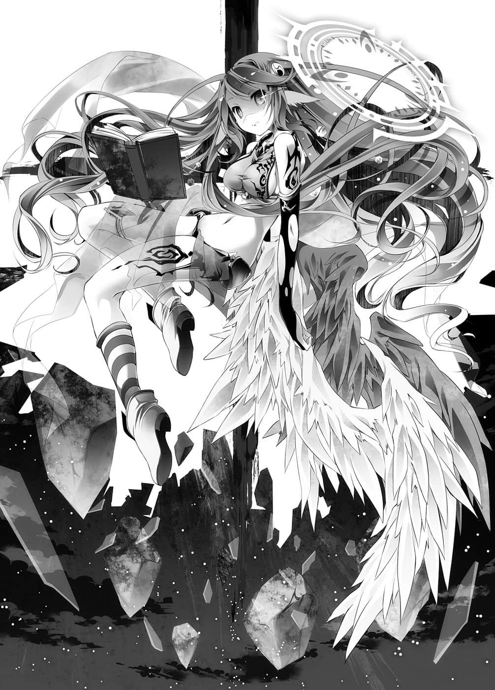

# 实际上的结束

> 来源：https://www.linovelib.com/novel/9/2104.html

几乎同一时刻。

空半茫然地，用快要冻结的头脑思考。

——这到底是谁写的剧本？

————数分钟前。

第五掷，第二百九十六格，各剩三粒骰子的空、白、史蒂芙。

用孩童的脚程，呈现半死不活的样貌，好不容易才到达，迎接三人的是——

「我在此恭候大驾，我主、吾王，我的主人啊……」

捏起衣带，恭敬地行了个礼——那是有着五粒骰子的吉普莉尔。

「你摸走我们的骰子，跟踪我们，还说恭候大驾？应该说是你绕到我们前面才对吧！」

然而这样讽刺回应的空，他的表情——不，白和史蒂芙的表情都很僵硬。

他将视线移向刻在立牌【课题】上的文字。

在路上曾经看过数次的【课题】——一字一句都没有改变。

就在尽可能不想停留的那个格子上，响起了朗读的声音——

——【由课题对象者以外的人提出游戏，两人以上的成员立刻向盟约宣誓开始游戏，并取得胜利。】

那是先前最为警戒，这个游戏难度最高的——【课题】。

一定要『同行』，两人以上就会成为课题对象——对空与白以外的对象无效的【课题】。

再者，也因为对象者以外——第三者吉普莉尔不存在，导致前提不成立，仍是无效的【课题】。

那么，吉普莉尔是将夺取其他骰子的机会全部舍弃，即便或许不会成真，仍孤注一掷地赌上「空与白可能会停在自己的【课题】上」这个可能性，一路尾随在后。

响起的【课题】内容——随着吉普莉尔的指定，景色跟着逐渐替换。

空间变得开阔，地形蠢动翻卷起来，天空则在流动，格子上的世界逐渐为之一变。

做了这么周全的准备，做的事却是『想赢就杀了我』——！？

可是——这究竟是怎么回事？

于是吉普莉尔在景色替换完毕——有如天地崩坏的光景中——说出内容。

胜利条件是攻陷对方的首都——当首都陷落，就要『自杀』？

吉普莉尔会做到这种地步，代表接下来绝不可能只是益智游戏。

众人下定决心往吉普莉尔看去，却见一滴又一滴落下来的眼泪。

空、白和史蒂芙以及吉普莉尔，四人举起手，张开口。

空只是半茫然地，用快要冻结的头脑思考着。

「那就只有我们天翼种——以及杀死天翼种之主的机凯种而已。」

吉普莉尔小声地说「如果办不到的话」——

「而现在，主人将要实现史上第三次的杀神。」

「彼此胜利条件相同——就是『攻陷对方的首都』。另外，当首都陷落之际——」

「彼此都有『弃权』的自由，但是『弃权』——视为『败北』。」

「……好了，主人，不用我说您也知道，这里是『大战』——毫无疑问是我所擅长的战场。」

但是与激昂的空相反，吉普莉尔琥珀色的眼眸中寄宿着十字。

（译注：文明系列，由Firaxis开发的一系列回合策略游戏。）

然而听到下一句话，空脸上的笑容消失了。

————

就这样，骰子被迫让渡。眼前是灼烧天际、地上充满死亡的光景。

「恕我失礼，主人。我应该跟您报告过，只有这次我一定要胜利。」

虽然玩过那样的限制玩法，但——对手是天翼种，就算是『未来』单位也会蒸发吧。

这甚至不是预料不预料的问题——！

「这是真的吗？……要和吉普莉尔比游戏……是恶梦啊……」

——不明白，不明白，我不明白啊，吉普莉尔！！

————竟然不惜用自己来『威胁』————！？

————…………

「………………喂，吉普、莉尔……你到底在说什——」

是什么？我到底做错了什么——！？

「过去击败神灵种、达成『杀神』的，除了众神自己以外——只有两个种族。」

然后，她闭上双眼。

空的脸颊流下汗水、露出苦笑，白则是舔着嘴唇，史蒂芙只是仰望天空。

「请主人把这个神灵种游戏的胜利方法——一五一十地全部告诉我。」

「…………」

那是在阿邦特・赫伊姆之战中曾看过一次，即将死去的行星面貌。

「——好了，白，做好心理准备了吗……？」

是啊，这正是——空前绝后的不可能游戏啊……空在内心如此嘶吼。

就连这八年来始终在空身旁、从未离开的白，也未见过空那样呐喊时的表情。

吉普莉尔是强迫『 我们』败北？

更何况『弃权』视为『败北』……？

「我说啊，虽然我早就有觉悟会是最高难度，但这游戏再怎么说也太残忍、太乱来了吧。」

有种非常不好的预感，空与白牵着的手在颤抖。

空在内心如此呐喊，但【课题】的强制力不容他拒绝，于是他举起手，动着口。

「——不管使用任何手段……只有这次，我一定要赢得胜利……」

然后，她以刀刃一般锐利的视线继续说道：

「…………吉普莉尔……要有分寸……一点……」

——这是……什么？

这场游戏不容拒绝，只能全盘同意。

「重现当初第二次杀神的，在名为『大战』的这个游戏中——」

吉普莉尔背对着毁坏的世界，张开翅膀说道。

「……主人，您知道吗……」

她淡淡地说着，琥珀色的眼眸空虚地眺望远方。

————

「……开场白太长了呢，主人，我要告知——『我提出的游戏』了。」

——不行啊，吉普莉尔。

「败北方得将全部的骰子『让渡』给对手。另外，对主人还要附上这个条件——」

如果是那种条件与规则，就算提出弃权——

…………喂喂，搞什么啊？

不管哪一方获胜，就只是我们死，或吉普莉尔死的差别而已啊！！

「另外，游戏开始时，要求将我的骰子恢复至十……请让渡五个骰子。」

「……可是我要见证——」

根本莫名其妙！空仍在内心这么嘶吼着。

照这个规则走的话，就连『弃权』也办不到呀。

吉普莉尔话说到一半便打住，接着摇了摇头。

——滴答。

————她要空与白『全力挑战并取得胜利』——

——所以她的意思是「你们赢了我就会死哦」？

「……在那之后过了六千两百余年——世界改变了。」

「主人会如何行动，生存下来？如果我推测得没错——又会如何杀神呢？」

「……吉普莉尔，你在开玩笑吗——这到底是在做什么————！？」

——在对自己吉普莉尔有利的场地，没有提示，也没有辅助。

——这到底是谁写的剧本？

——不明白。

「……嗯……早就……做好了……」

空等人仿佛渴求空气一般喘息着，但吉普莉尔却视若无睹，继续平淡地说：

听着吉普莉尔仍然空虚地持续着的话语，空皱起眉头，思索那些话的意义。

吉普莉尔利用【课题】向他们挑战——这在预料之内。

这个【课题】带有强制力，必须回应她所提出的一切，并且取得胜利。

被冷漠且毫无感情的眼眸这么告知，空再也说不出话来。

「每当神被凌驾而上，世界就会因此改变——若真是如此，那么这次一定也会改变吧。」

「首都陷落的同时，将会放弃生命————当场自杀。」

这个世界改由智力与理性游戏决定一切，不再是以武力和暴力战争作主了。

「游戏是重现『大战』——是『战略模拟游戏』。」

「在世界即将再次改变之前，我将会恭谨地拜见主人的表现……那么请宣誓……」

那是叫我们在某文明系列游戏㊟，绑定用『太古』单位，胜过『现代』单位吗？

「请主人们三人以人类种的身份……我则是以天翼种的身份——开始游戏。」

背对着由神灵种的力量所构筑成的——世界末日，吉普莉尔继续说道：

——『大战』、『终战』与『十条盟约』——然后来到这个『盘上的世界迪司博德』。

到底是什么————我做错了什么————！？

吉普莉尔毫无感慨地看着逐渐被改变的风景。那模样带有一种难以名状的——怪异感不安。

空与白用力紧握彼此牵着的手——冰冷的汗水渗了出来。

她还真是提出了相当刁钻的难题啊，空无奈地苦笑。

————即使如此，最少还是会有一个人死啊——！！

然而空的口中却不容许喊出这一句呐喊，四人齐声只说出一句话。

————【向盟约宣誓】————

---

■ ■ ■

同样地——几乎在同一时刻。

在这个世界的尽头处，巨大的西洋棋子顶端——唯一神的玉座上。

世界的一切——不管是东部联合，还是天空的游戏盘，世界的再创造者特图眺望着一切。

特图手里拿着羽毛笔和空白的书，看着各自对战的人们，心中揣想着。

——所有游戏都有『定理』。

那是在游戏设计与规则上，经过最合理修改后『最佳的一步』。

另外——也是注定会被尽数打破的方法。

——那么，那样的尽头是什么？这是追求无止尽之尽头的人们所追求的，而那个答案就是……这个。

特图将那个游戏的参加者，全员所面临的状况投影至虚空。

面对面的两人——不，是一神在向一人揭示那个答案……

——第三百零八格，距离终点还有四十三格。

「……这是……怎么回事……？」

呆立在不可能、不可解的疑问前，手里拿着两粒骰子的伊纲喃喃说道。

自从踏上第三百零一格的那一刻起，她就一直看到写着同样文字的立牌。

在此之前从来不曾见过，如今却连续出现的，一字一句相同的【课题】。

应该是按照不同顺序来配置的【课题】，竟然会像这样连续出现，这样的情形实在不可解。

更何况，本来明显应该是『无效』的【课题】。

这个世界，在这个行星，最初问出——『为什么』的少女。

然后是有如荧幕般，投影在空中无数不同的光景。

那她将会放弃一切，正如同她已一无所有，就连可以失去的希望都没有一般。只不过……

经历无限次时光的流逝，经过无限次的提问，但却无人回答。她只是在孤独中飘荡。

——『为什么』巫女背叛了自己？她以空虚无比的眼神这么问道。

欺骗与被骗，背叛与遭到背叛，就是巫女所说的——『信赖』的话……

彼此争夺残杀，只要将作为借口与手段的称呼，改变无数次即可。

终于踏上那个【课题】的伊纲，被迫面对那无数的不可解。

本来应该很简单的游戏，应该不会有人死的游戏。

她没有多说什么。

如果那就是巫女和空他们所定义的『信任』的话……

【信任为何？】

【但是一如向盟约所宣誓，吾将夺走汝等记忆，并提出『疑问』——】

比如说在久远之前，比大战更古老，人类称之为「天地创造」的时代。

【欺骗神，将其『神髓』出卖予汝等的凭依巫女却拒绝牺牲，实是支离破碎。】

在视线前方，飘浮在初濑伊纲眼前的存在。

就连自己都不相信的神，甚至不知道『星杯』——不存在的东西，就连全知都无所知。

既无意志也无意识，有形无形、有命无命、有机无机的万物，在创造之际——漠然地，将不合理、不讲理，将全部怀抱的思念情感，为了代替万物发声而生的概念。

【好了，凭依所策划的此次儿戏，胜利乃轻而易举。满足课题，得到一切吧。】

正如用她的『神髓』做为威胁，强迫她参加只要输就会死的游戏。

【对于汝等以此次儿戏，搬弄证明之『疑问』。吾再问一次——】

只有在远方看透一切的全能者特图，听见她的无声之声。

无论将天地重新创造几千回，只要交织成世界的意志不改变，那就还是相同的。

——进行『胜负』。

无名之神认为——就如同巫女选择牺牲自己一般。

遭到一切背叛，也不断受到巫女欺骗，无比可怜的少女——

坐在飘浮于空中、与她身材一般高的墨水瓶上，手撑着脸颊，好似对万物都没兴趣的——神灵种。

正因身为『狐疑之神』这个概念的显现，因此不相信一切。

但是，她似乎毫不期待这个提问的答案。

——这到底是谁写的剧本呢？

那是一半正确，一半错误的想法。

那是两人与两人，现在正面临着唯有牺牲某一方才会结束的游戏。

巫女所梦想的无牺牲的『定理』——打从一开始就是矛盾的。

知道这一点的人——

——这到底是谁写的【课题】呢？

然而，她似乎毫不在乎僵在原地的伊纲。

然后是一神与一人，站在刻有【课题】的立牌之前。

更何况，应该也没有人能用这种方式让它『有效』。

要牺牲谁，分出这个『胜负』呢？选择吧——

在若没有人牺牲，一切就无法终止的状况下——

——有人认为世界没有改变。

【只要每个人皆追求己利，采取最佳的战略——那样的定理就不会产生。】

正因她的『神髓』之故。

【凭依巫女所见的幻影——最后的尽头就是这个哦。】

她做出假设。

在这样写着的【课题】格上，她逼迫伊纲做出解答。

然而，发展到最后所投影出的影像——却是无关乎规则的互相残杀。

她的眼中微微浮现出遭背叛的小孩责备大人的神色——

——分出『胜』与『败』的那一刻，牺牲便不可避免，这是不言自明的——更何况……

只要每个人都只想获胜，不想败北，那么把即将到达的必然加以编码后，所显示出的就是——

囚徒困境并没有他空所讲的那么单纯——是没办法突破的。

然而，她甚至对伊纲毫无兴趣，只是以例行公事的声音告知。

——【从神灵种所握有的七名灵魂中，选出一名杀害，移转至终点格。】

好了。神以外的另外一人。

那是一人与三人，现在正要开始唯有杀害某一方才会结束的游戏。

因此，假若世界丝毫未变，那么此后永远也不会改变吧。
