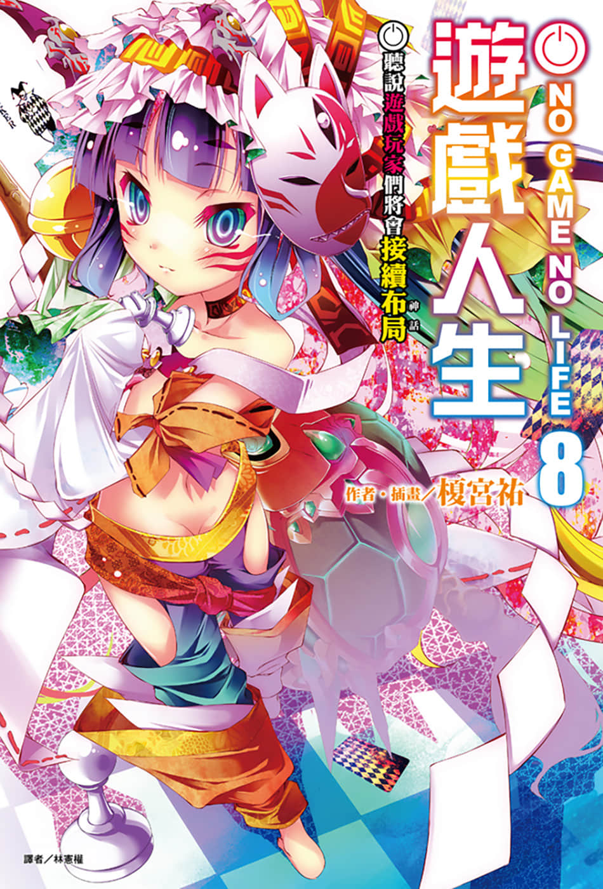
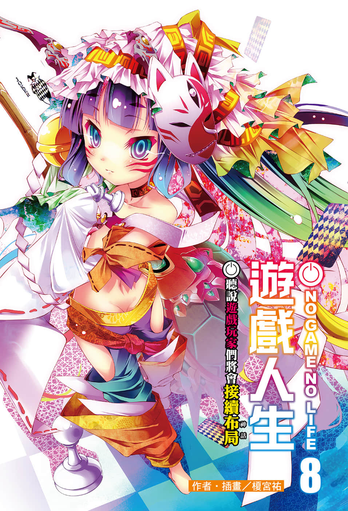
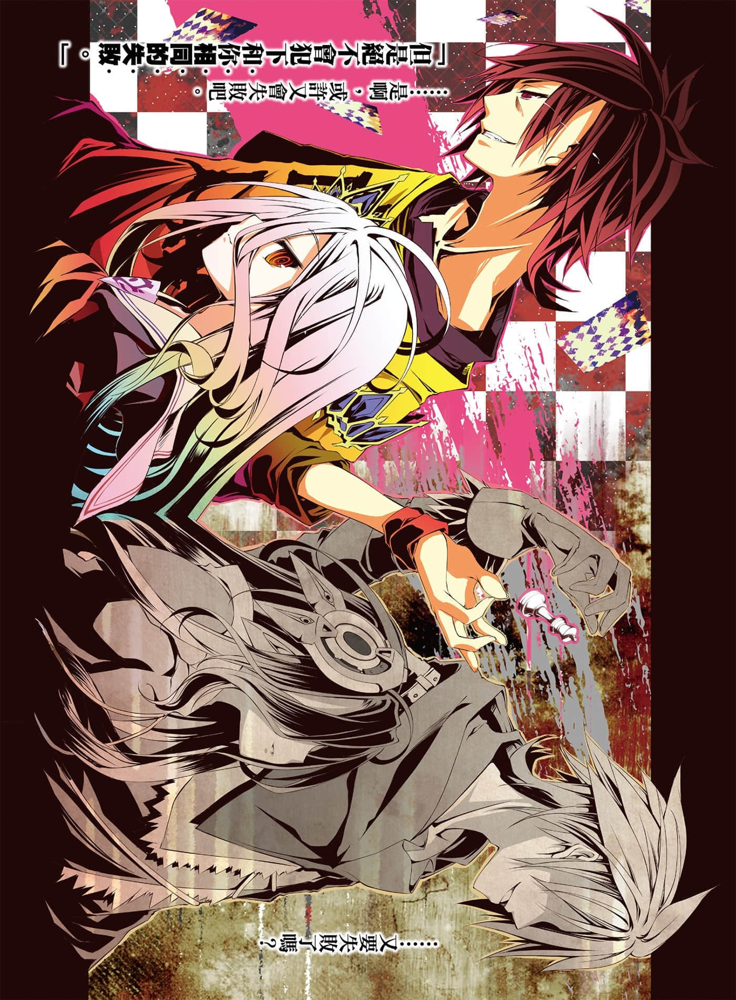
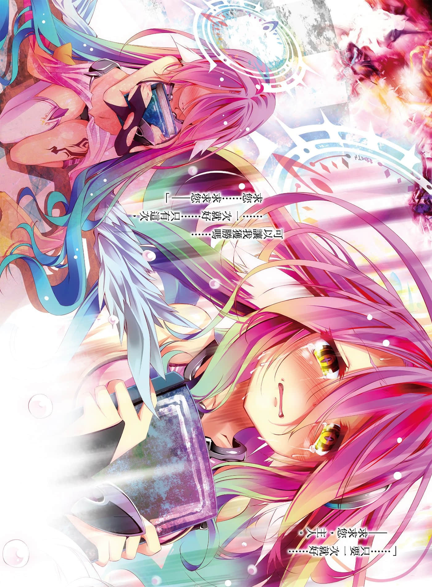
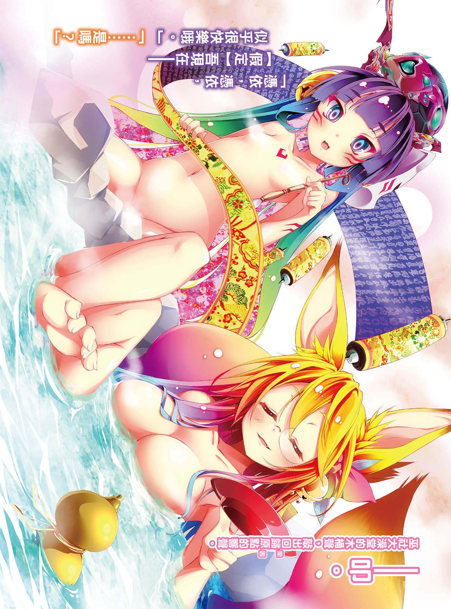
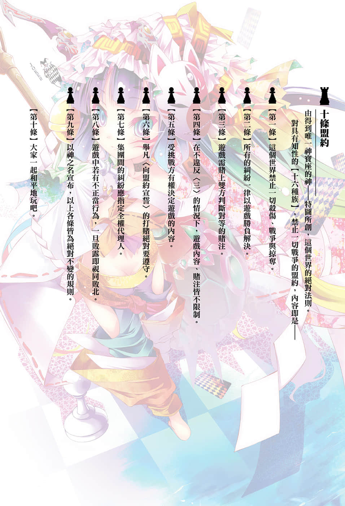
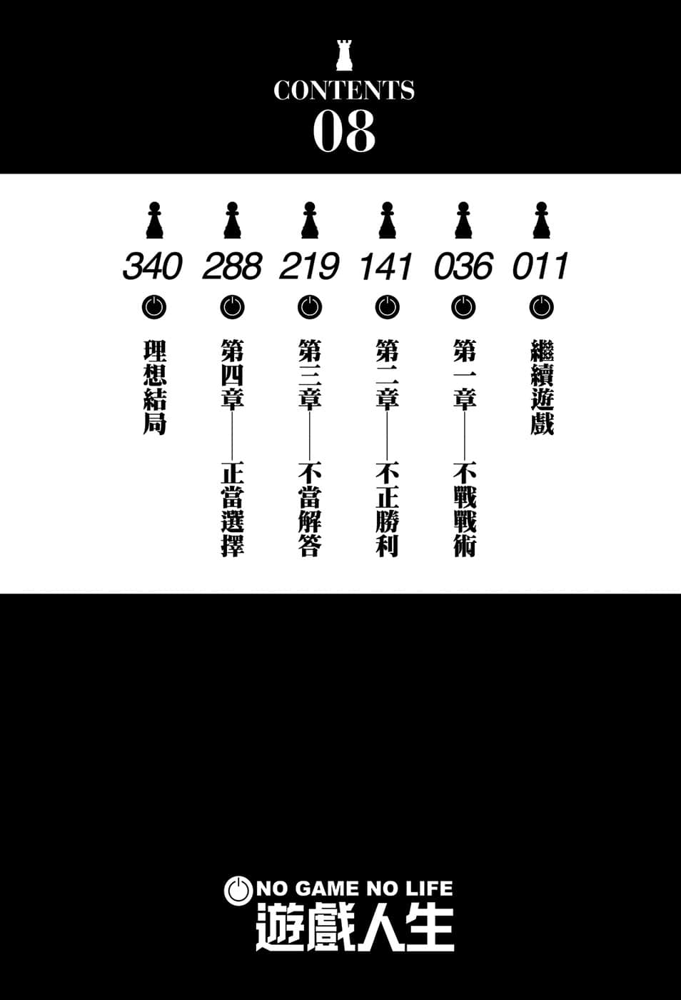

# 插图

> 来源：https://www.linovelib.com/novel/9/118068.html

台版 转自 深夜读书会

作者：榎宫祐

插画：榎宫祐

译者：林宪权

图源：深夜读书会

录入：深夜读书会

深夜读书会：ritdon.com

仅供个人学习交流使用，禁作商业用途

下载后请在24小时内删除，深夜读书会不负担任何责任

请尊重翻译、扫图、录入、校对的辛勤劳动，转载请保留信息

————————————————

【内容简介】

〔大标〕与神灵种的决战终于落幕！！

〔中标〕『 』的不败神话，是否将就此画上句点！？

【迪司博德】转变为一切都以游戏决定的世界——就在与神灵种的双六对战接近尾声的时候，阻挡在前方的却是吉普莉尔的【课题】——那正是重现世界改变之前远古大战的『战略模拟游戏』。

率领最弱的人类种，『空白』的目标是——这次绝不再让任何人死亡……！

「有人将世界改变成游戏哦……所以任何事都是有可能的吧——！！」

——不断持续牺牲的『定理』，挑战『未来』的『布局』从古老神话开始，终于承接至『最新的神话』——超人气异世界幻想故事的第八集！！

【作者简介】

榎宫祐

【绘者简介】

我是榎宫。作者因为『一味延迟交稿』被编辑用神也会爱上的笑容逼问，真是个无药可救的男人。凡事都要适可而止才行啊！（声音颤抖）

榎宫祐

靠着上一集后记所写的『圣诞节前能回家』的旗子之力，我回来了。虽然俗语说凡事适可而止，不过我认为人生做得太过火也是刚好。

我是榎宫。不可避的绝对命运，也就是您所知的『旗』，插太多会『绕一圈』（请另将「反转」两字置于「绕一圈」之上）而成为『逆旗』这一点也是众所周知的。

