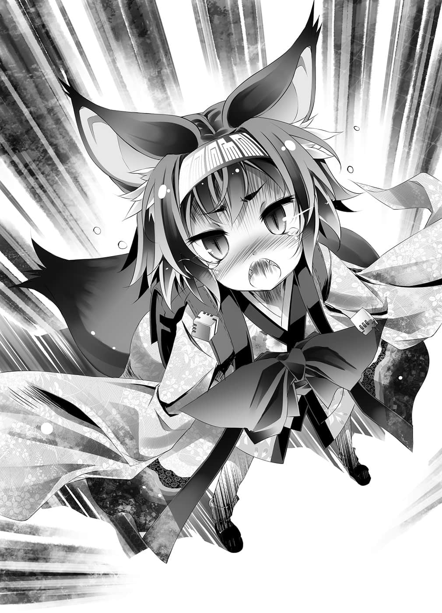

# 继续游戏

> 来源：https://www.linovelib.com/novel/9/2107.html

——如果为了世界非死不可的话。

自己究竟会怎么做呢？

有一名少女被迫面对那样的选择。

神告诉少女，要拯救即将毁灭的世界，少女非死不可。

经过一番苦恼与内心挣扎，最后少女流着泪……做出选择。

她说：我想要拯救世界，拯救我珍惜的人们所居住的这个地方，还有——拯救心爱之人。

于是她怀着悲壮的觉悟，颤抖着双唇，摇摇晃晃地走向神。

她选择牺牲自己，不过——

——『由我来代替她死吧。』

一名男人制止了少女，走到神的面前。

那是她不惜舍身也要拯救的其中一位心爱之人。

他深爱少女，同时也是少女所爱之人。

神问这个少女最爱之人说——『你不怕死吗？』

但是他面露笑容回答：与其让少女死，不如自己死掉。

因为——『有些事比死更可怕』。

于是男人就在如雷的喝采声中死亡，那个世界也因此得救。

被留下的少女流下一道眼泪，说要在这个得到救赎的世界，连同男人的份一起活下去。

在她说出那老套的台词后，仿佛赚人热泪的剧情套路一般，故事在此结束了。

但是——看到那样的结局，兄妹两人露出扫兴的眼神。

看着游戏片尾播出的工作人员名单，两人心里这么想：

而如果选择『同生』世界就会灭亡的话——

重要的『地形情报』几乎都没有描绘上去。

黑眼黑发的少年脸上流露扭曲的笑容，仿佛象征着他扭曲的性格。

蜡烛映照在昏暗的小洞窟内。

以三角形代表『单位』，以凸形代表『都市』……从这些情报可以了解，他们所在的这个小洞窟，似乎就是显示在『地图』中央的『首都』。

也就是说——他将不惜牺牲最爱之人也要活下去的恐惧，强行加诸少女身上……自己却用死亡逃避。

……然而，即使如此——

就算留下一句『我才不管世界会怎样咧，毁灭吧，笨蛋～！笨蛋！！』然后就逃之夭夭。

看来只要将『指令』写在这些纸上，再投入箱子里，就能够移动『单位』了。

原来如此，这就是所谓的『自我牺牲』。

——『你要强迫最爱的少女遭遇比死更可怕的事吗？』

——『Ｂ. Ｔ. １８４年７月１日 ０３：４５』

——【由课题对象者以外的人提出游戏，两人以上的成员立刻向盟约宣誓开始游戏，并取得胜利。】

空运作只要一松懈就快冻结的思考，勉强挤出话来。

这实在太了不起了，压倒性的高ＣＰ值，这是多么伟大的丰功伟业啊！！

兄妹认为，不应该选择『哪一个人死』，而是选择——

毕竟就算想要抱怨……抱怨的对象也已经不在人世了。

能够兼顾一切又不需付出任何牺牲……那样的方法——

自己或妹妹其中一人死？——这个选项只能说根本不予考虑。

……那么，这样想如何？

『这个世界』或许并不存在那样的方法吧。

「呵呵、呵呵呵……空～？」

但是为什么……为什么没有人对男人这么说呢？

那么何不两人一起逃到天涯海角，欢笑到最后一刻呢？

本来应该毁灭的世界，靠着两人的爱与勇气，及其他有的没有的而得以苟全——这样很好。

自己究竟会怎么做呢……？

吉普莉尔的【课题】——内容是——

对着盟约这么宣誓之后，他们被迫开始进行模拟过去『大战』的——『游戏』。

其存在的本身，就是建立在超乎常轨的法则上。

对于那个男人，对于自己原本赌上生命也要拯救的那个男人，少女会做何感想呢？

在稍远处则摆放着一个破破烂烂的木制『投书箱』。

想到这里，兄妹俩互相看着对方，得到相同的结论。

如果有人抗议那样的行为『自私』——不好意思，抗议驳回。

那恐怕是盟约生效前的时代时间标示方式。

那是剩下『两个』骰子而变成三．六岁的红发女童——史蒂芙的干笑声。

但是，即使如此——

反正世界原本就要毁灭了，所以就算最后真的毁灭了，也只是一如预定而已吧？

该怎么做才能既拯救两人——『也连同世界一起拯救』。

那我就要反问了。

照剧情所说，主角男人一个人的死拯救了世界。

空环视周围，心想首先必须掌握他们所置身的状况与游戏的规则。

让开始打瞌睡的妹妹躺下后，黑发的少年哥哥心里想着：

她也一定……『不会露出笑容』吧。黑发少年抚摸着妹妹的头发这么想。

「而且还是即时战略啊！她疯了吗！傻了吗！」

——这是一个四面都是裸露岩盘的狭窄黑暗空间。

但是那张老旧褪色的破『地图』是一张白纸——更正，是一片漆黑。

「……冷静下来，首先必须从掌握状况开始……！」

反正都是『自私行为』，要自私就应该贯彻到底才对吧。

觉得此种说法很不负责任吗？

空发出大叫，然后闭上眼睛沉思。

男人自己也说过，那是比死更可怕的事。

被留下来的少女是如何看待这件事的呢？

既然世界迟早会毁灭，即使现在就毁灭也没什么吧？

各剩『一个』骰子而变成一．八岁与一．一岁——跟婴孩一样的空与白的悲鸣声。

---

■ ■ ■

——自游戏开始已经过了三十八日。

男人说着那样的话，代替少女而死。

年幼的少年看着妹妹的睡脸，露出带着自嘲的苦笑。

飘浮在天上的螺旋大地——那是神灵种所构筑的『双六盘』。

看来这个游戏的设定是，除了首都周边和『斥候』侦察过的部分以外，其他情报都不会显示在地图之上。

——这到底是什么玩笑？

放置在中央的桌子上，摊开着一张『地图』。

但是身为一个人，把别人的善意视为理所当然，这样是对的吗？

红眼白发的少女则是脸色不悦，两人同时有一个感想——

这时响起了三个人的声音——

多么好听又美妙的言词——真是廉价的催泪套路。

「哼，你希望我回答那我就说了——有哪个白痴会规划这种事啊！！」

——假如为了世界非死不可的话。

单纯的『自私行为』，只要换个说法就不会有人抱怨了呢。

那到底是谁的责任？又是什么样的责任？

桌子的旁边有大量的纸和笔。

——那样的世界就让它灭亡吧。

好了，那么……

「当然，这也在你的计划之内吧～你就回答『是』好了♪」

原本必须数亿人的牺牲，却只要牺牲一人即可，而且可爱的少女女主角也没死。

——不然就『同死』。

相对地，在那张好似黑色羊皮纸的『地图』上，仿佛电脑游戏的介面一般，每分每秒的游戏情报变化都显示其上。

「……哥……这不是回合制……必、必须快点下指示……」

再说，如果要追究责任的话——把世界变成那样的人才要负责不是吗！？

那么一起活下来吗？……那当然是最好的选择了。

——真是卑鄙的家伙。

应该只有这两个选择而已。

但是现在——在第二百九十六格上，发生了更加超越法则的现象。

以及——宛如宣告世界崩毁般的连续冲击与巨响。

因为就算要抗议……抗议的对象也跟着世界一起消失了。

原来如此，这就是所谓的『自我牺牲』，说得可真好听呢。

——原来如此，『有些事比死更可怕』啊。

——要就『同生』。

一起死？——虽然好了一点，但他还是希望最好不要。

或许是对外面接连不断传来的冲击感到在意吧，史蒂芙起身说道：

「我、我去外面看一下哦！？」

「等一下！……我们追加派遣带着武器的单位出去探查吧。」

空振笔疾书，在纸上写下『指令』——

——『地图』所显示的时间，「体感一秒钟代表经过八小时」。

如果说这个洞窟是『首都』——也就是『玩家空间』的话，那么能否出去外面——意即前往『游戏内』，就很难讲了，假使能够出去也不知道会遭遇什么。

试着以手指触碰『地图』上的单位，单位情报便立即显示出来。

只不过没有显示年龄、性别等——『战斗力』的情报，实在极不方便就是了。

不过无论如何，空抄下显示的『ＩＤ单位名称』，然后投书。

带着斧头的单位随即以一秒八小时——

二八八〇〇倍速——『单位』这种肉眼无法辨别的速度冲向出口，站在户外。

「……哥，让斥候带武器……会降低机动力……那样不是白费吗……？」

「ＨＡＨＡＨＡ！妹妹啊，这就是哥哥的智慧了。」

对于妹妹的指摘，空无奈地摇摇头。

「因为很可能会遭遇其他种族，若不提高生存率，就无法随时得到情报——」

——但是，就在那之后……

气候改变，在洞窟内也感觉得到一阵风吹起的瞬间，数秒前刚出到户外的单位，仿佛雪融一般地从地图上消失了。

「…………刚才的那个是什么？」

空触碰桌上的『地图』，确认显示出的情报上写着——『灵骸风』。

「……还好你没有出去呢。」

也就是所谓的『战略模拟游戏』。

现在只是接受原本不愿承认的事实罢了。

他自问——『能赢吗？』

能得到的也只有『吉普莉尔的死亡』……就这样。

战斗根本是自杀行为，而且胜利条件只有一个——『攻陷敌方首都』。

——『输者就要自杀死亡』。

那就是——看来这完全不是在开玩笑。

随意建设都市，一旦和其他文明接邻，大量的敌兵马上就会涌入。

还周到地连那样的『保险』都特地为他们准备好了。

除了一部分的自虐玩家之外，这种游戏的厂商大概会收到海啸一般的投诉吧。

但是——

「用自己的生命做威胁，要求『 我们』认输……？」

明明能用核弹破坏设施，甚至破坏地形，但是却不会有任何罚则，还可以连续使用。

然后自答——『怎么可能赢得了！』

「挡住会空间转移的家伙！？你是指能使出地壳变动等级的大范围攻击的家伙们吗！？」

「事情很单纯——『想赢就杀了吉普莉尔我』。」

把所有的骰子让渡给对方——以及空他们将『胜过神灵种的方法』说出来。

那就只有——『地狱』两个字了。

不过就连这些都不是多大的问题。

而且即使是最好的情况——还是有一个人会死。

「谁怕谁啊……白——要拼了哦。」

虽然这么叫喊，但是空很清楚……吉普莉尔没有理由说谎。

「喂～～～～！？这个连熔岩地板也完全比不上的死亡场地是怎么回事！？」

只有在那种情况下，不会有人身亡。

「那、那么！只要弃、『弃权』不就好了！？」

世界受理吉普莉尔的【课题】，在二百九十六格上创造出了另一个世界。

「在这种炼狱里，人类种是如何存活下来的啊……！！」

在这个景象之前，无论是任何一部描写地球最终战争后的创作，都算是乐园了。

空这么说完后，心想——看来似乎真的不是玩笑。

（译注：一款回合制策略电脑游戏。）

原来如此，好吧，那就当这是『文明帝国』来思考看看吧——

那绝不是什么『战争』。

……这个地狱般的天地异变叫做『大战』？您在开玩笑吧？

不，其实打从一开始，那个眼神冰冷——语气仿佛完全不认识他们的吉普莉尔就已经告知结论了。

空间不知是无限扩张了，还是被压缩过了，虽不明白其中详细的原理，不过仿佛是将一个行星整个复制到十公里见方之内，那幅光景——

对于史蒂芙的提案，空在内心回答——是啊，没错。

空坐在椅子上，双手抱胸，低下了头。

吉普莉尔似乎不是在吓唬或说谎，而是真心提出那样的要求，而且——

而事实上，如果是吉普莉尔的话……若只是要到终点，她恐怕是办得到的吧。

——像是在呼应空的呐喊一般，天空再度亮起闪光。

然后过了数秒，不，大概数分钟左右吧。

世界遗产之类的附加效果建筑物更是无法生产。

「只有一方能活的游戏，根本没有什么『胜利』可言啊——！！」

「即、即使失去骰子也不会死对吧！？空也说过只要有人到达终点就可以了不是吗！！那么只要让吉普莉尔到达终点——」

但是仅仅五％的力量就能劈开大海，受到氢弹爆炸直接命中却仍毫发无伤的吉普莉尔，就算几亿名人类种一拥而上，也不可能对她造成一点擦伤，这是不言自明的道理。

单位的视野，随即仿佛投影片一般，凭空映射在洞窟内。

我方首都只要被发现，几乎肯定会立即败北，因为对方可是天翼种。

空心想——依照吉普莉尔所说，这是『文明帝国㊟』。

最恶劣的规则是下面这一条——

————

「……玩笑话……睡着之后再说……更何况是……不好笑的玩笑话……」

……如何呢？光这样就已经是空前绝后的难度了。

——或者应该说，就连一般设施都无法正常建设吧。

「这不是战略游戏呀！！别说什么战略——这根本没办法战斗啊！？」

在惨状如墓地般的荒野上，至今仍有激烈的冲击与闪光肆虐。

「……哥，即、即使如此……如果使用人海战术的话……或许可以挡住一次攻击——」

而且更过分的是——『限定第一次就要过关』的条件。

「不可能吧！带着斧头的成人战士单位只是被风一吹就蒸发了耶！？那么——」

那么这就是『大战』——过去人类种存活下来的时代。

就算失去所有的骰子——失去质量存在时间，那也只是没了肉体，变成灵体化而已。

——或许『斥候』也受到波及了吧，投影的影像中断，变成黑色画面。

这是重现过去『大战』的游戏。

……空心想——原来如此。

然后，冲击再度传来——空指着『地图』。

看到单位的视野——也就是『洞窟之外』的光景……那幅惨状。

看到他脸上充满恶意的残忍笑容，史蒂芙咽下口中的惊叫。

空这么大叫，然后做出结论。

没错，就算克服这个惊天动地的超难游戏，成功地取得胜利——

对于这个难度超乎常轨的游戏和状况，空精算完毕之后——

只要一吹过，人类种就会立即死亡，其风中夹杂着『灵骸』、尘土和灰烬。

因此即使吉普莉尔问到『我可以胜过主人吗』，空也没有否定。

不受盟约束缚的十六种族有多强——具体来说他并不清楚。

——就像是在等待空的回答一般，她们只是屏息静气地静候着。

三人不由抽了一口凉气。空声音沙哑，勉强装出笑容说道：

空以前所未有的愤怒表情大吼，史蒂芙则畏畏缩缩地问他：

有此深切的体认后，空触碰『地图』上的其中一个『斥候』——拉开影像。

对于这异样的气氛，不只是白，史蒂芙也闭口不语。

——自己的文明限定在『远古时代』，其他种族则是『现代』也望尘莫及的超高性能单位。

那就像是不会融化的雪，化成『黑灰』，将一望无际的大地全部覆盖。

照映出的『地图』随即产生些微的变化。

「——真是把我们看扁了，意思是……如果觉得赢不了，欢迎弃权是吗？」

更何况依照吉普莉尔的推测，过去的历史——那场战争是『人类种使其终结』的。

如果硬是要从空他们的语汇中，找出能精确形容那个景象的词语。

——就算赢了又怎样？

「……哈哈，这就是『大战』？喂喂，说谎也该有个限度吧，吉普莉尔。」

那即是在武力受盟约禁止之前，十六种族交战的光芒。

甚或是让人感觉有数小时之久的漫长思考后，空抬起头。

——对，什么不提，偏偏提出『那个规则』。

尽管这么呐喊，但是空也很明白……这也是理所当然的吧。

毕竟全文明皆处于『开局皆已宣战完毕』的状况。

——天空被灰尘所封闭，受到笼罩星球的战火灼烧，呈现一片暗红。

每当声响与光源闪动，海洋与大地就会如万花筒般产生改变——

即使能附带收到几颗骰子——但那又怎样呢？

没错——依照规则是可以『弃权』。

「地形又改变了哦！挡住一次攻击？受到流弹波及就会连同『首都』一起毁灭了啊！！」

好似随时会落下的破灭苍穹，源源不绝地降下苍蓝的『灵骸』。

空对脸色苍白僵在原地的史蒂芙这么说，不，应该说——

那就是从刚才到现在，毫不间断地震撼着这个小洞窟巨响的真相。

难易度设为天帝ＭＡＸ等级，蛮族大量出现，而且就连那些蛮族，我方也完全不是他们的对手。

空这么说完，眼神阴沉地缓缓站起。

「谁要让她称心如意啊。」

「………………嗯，明白了……」

白窥探空的真意——或许是体会了他话中的弦外之音吧，她严肃且毅然决然地点头同意。

「人类是如何从大战中存活下来的——是吗？」

说完这句话后，空与白一同在椅子上坐下，面对『地图』，握起了笔。

「如她所愿，我们就让她好好见识一下吧……」

「真、真的要玩吗——不，应该说真的赢得了吗！？」

就像这样，只有史蒂芙担心吉普莉尔——不。

说到底是否真的有胜算？对于这个疑问，空与白露出阴暗的笑容回答：

「——『轻松』啦，这种简单的游戏，闭着眼睛也能赢。」

「……超～游刃有余……」

虽不知吉普莉尔是基于怎样的意图，用这样的游戏挑战他们。

但是不管如何——她认为不惜代价也必须胜过他们。

如果不能做到的话就杀了自己。

既然她那样说——那么该采取的手段，原本就只有一个。

就这样，空露出了阴沉的笑容……

---

■ ■ ■

——同一时刻，在第三百零八格。

年幼的兽人呆立在原地，看着他们的影像投影在虚空中。

她是残余的骰子只剩两颗——身形比平常缩水不少的耳廓狐少女。

那个人影从许多文件中——取出『一张纸』，点了点头。

那个坐在飘浮于空中的墨壶上，散发出冷酷又带着压迫性存在感的对象。

这么说完后，他们继续说道：

——每个人都追求利益的话，就会变成那样。

……那么就算这个『双六』游戏到达了终点。

他们说了这句话，然后把这张纸托付给自己。

对于好似这么诉说的眼神，伊纲只能低着头，一句话也说不出口……

直到最终毁灭那一天，都不会有任何改变——

——无论游戏内外，都处于没有牺牲就无法结束的状况。

既然要臭屁地说出拯救世界这种话——

另一方面，有道与紧张感完全无缘的温吞声音这么说道。

她用甚至感觉不到冰冷的无温度眼神看着伊纲。

对于这个质疑，神灵种默不作答，不——是没有必要回答。

克拉米和菲尔趁乱企图夺取东部联合。

——要得到什么，就只有从别人那里夺取，那是必然的道理。

——如果为了世界，自己非死不可的话。

因此，被托付的那个人影，迈开不存在任何人记忆中的无比沉重的脚步。

——她注视着神灵种，宛如质问，又有如责备般，带着紊乱的思绪，就像是在无言地问道：「这原本应该是以神灵种为对手进行的双六游戏吧。」

——那就别正常去想就好了。

「嗯～虽然不太明白是怎么回事，不过森精种的船团终于来了哦～我都快无聊死了～」

——那总有一天，牺牲的数量一定会超过拯救的数量。

东部联合首都・巫雁岛的一角——有个人从旅馆的窗户探出头来，仰望遮蔽月光的螺旋大地，神灵种所创造的双六盘。

如果为了避免多数人牺牲，而肯定少数人的牺牲。

——『如果那样世界就能得救，自己就只有一死了。』

然后确信，状况似乎真的齐备了。

并且一个又一个地找寻下一名牺牲者。

布拉姆甚至利用那个状况，以兽人种的牺牲为垫脚石，强迫更多的牺牲出现。

你们想要夺走神的一切——『是由你们开始的』。

——同一时刻，在游戏之外。

---

■ ■ ■

无论选择自我牺牲或最小的牺牲，世界一点也不会因此得到拯救。

【该神灵种对『胜者』有义务履行其权力所及范围的『所有要求』。】

那只是『苟延残喘』而已——世界依然毫无改变地运转。

他们说过——这个世界是一场游戏。

空等人与吉普莉尔在进行的，是输了就有一方要牺牲的游戏。

——『不论牺牲的数量是一或二，是千或亿，都没什么差别。』

——现在的状况正如纸上所写，丝毫不差。

只要认同任何一个牺牲，牺牲就会永无止境地持续下去。

就如同水往低处流，既然是在正常情况下，那样的演变是不言自明的道理——

初濑伊纲对着给她看那个影像的人发出怒吼。

所有人都陷入相互背叛、欺骗、争夺——自相残杀的状况。

要得到什么，就只有从别人那里夺取，因此那是必然的道理。

那就不能允许任何牺牲，先试着拒绝再说吧。

那种愚蠢的『定理规则』——在这个世界已经不是必然，也不是绝对了。

然而，对于这么思考的伊纲，神灵种仿佛原本就毫无兴趣一般。

自己是这么回答的，但是——他们苦笑一声后，答道：

「为什么事情会变成伊纲要选择让谁死呢！？」

在安心的同时，也令人感到些微的不寒而栗，那个人影背起沉重的背包，走出了旅馆。

然而——

在装满了水——过于沉重的背包里，有人吵闹地主张其存在。

所以——要在这里画下休止符……

【奇问也，汝乃共犯者、共谋者，竟问为何？】

这个神灵种又会如何——？

「喂！运送时可以更小心一点吗！？明明不是达令还敢对我放肆，你好大的胆子，想与海洋为敌吗！？喂，你有在听吗？喂！？」

言外之意似乎是在这么责备伊纲，伊纲不禁倒抽了一口气。

神灵种所映出的是——当然的结论。

那个人影回想起托付那张纸的人对自己提出的问题：

仿佛是在说，她所映出的影像就是答案一般。

——因为她原本就连失望都无法理解，神淡淡地说道：

……背负着隔着背包抱怨，在物理上也很沉重的王牌。

自己究竟会怎么做呢？

——只要每个人都追求利益，就会变成这样。

他一步又一步，摇摇晃晃地，开始登上通往镇海探题府的无尽漫长坡道。

造成这个状况的不是伊纲谴责的神灵种，而是他们自己——神灵种的沉默似乎带着这样的解答。

「——」

「喂！又要我待在背包里吗！？你以为我是谁啊！！」

——『那样世界是无法得救的，所以你是白死了。』

当游戏内外，正有一群人混乱、焦躁、恐惧，只因中了计谋而惊慌失措时——

她的脸上没有责备之色，更不可能出现失望或绝望的表情。

「为什么……为什么大家要做这种事！得斯！」

【企图篡夺神灵种之至权，此等愚蠢愿望——必然演变至如此结果。】

——从对神灵种游戏开始，已经过了三十八天。
