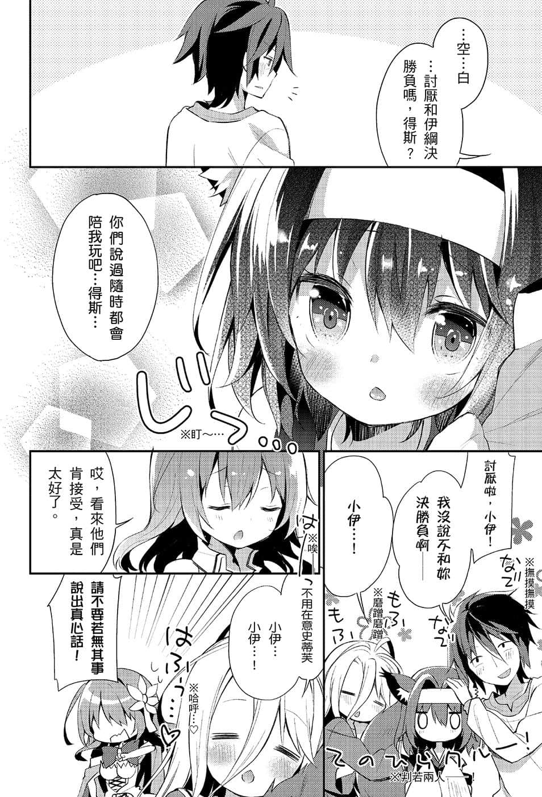
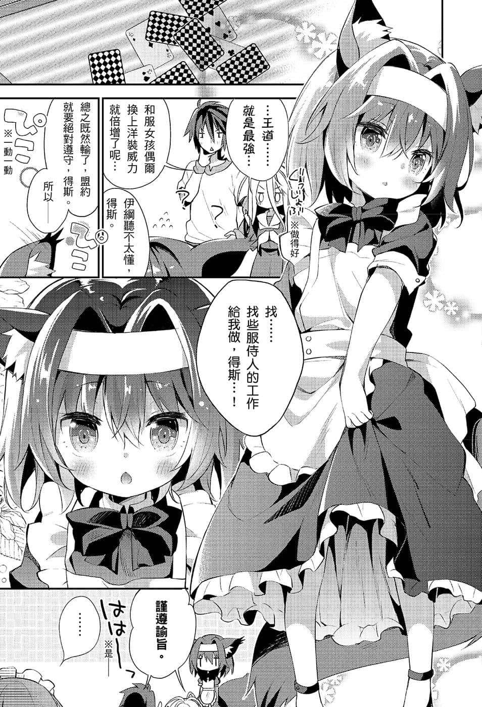
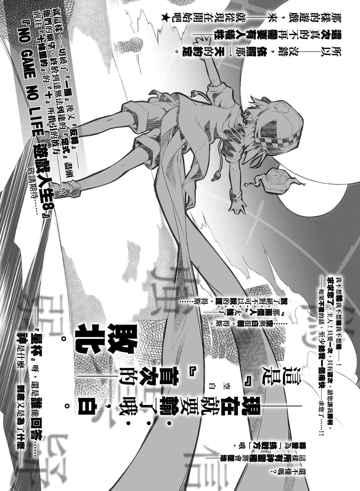
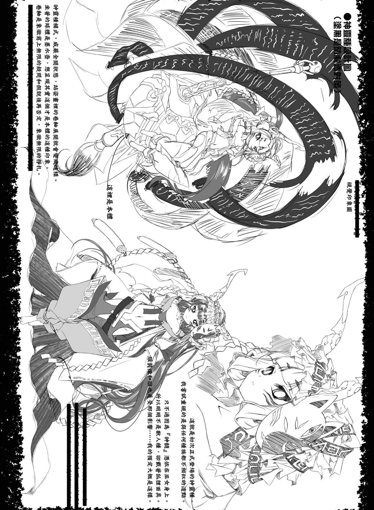
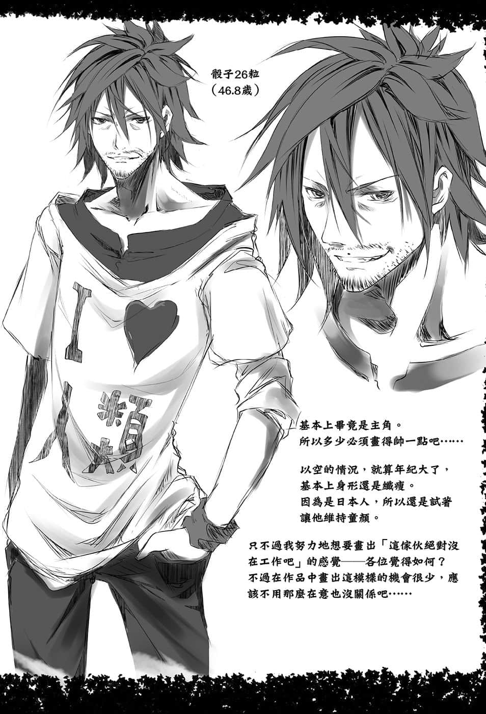
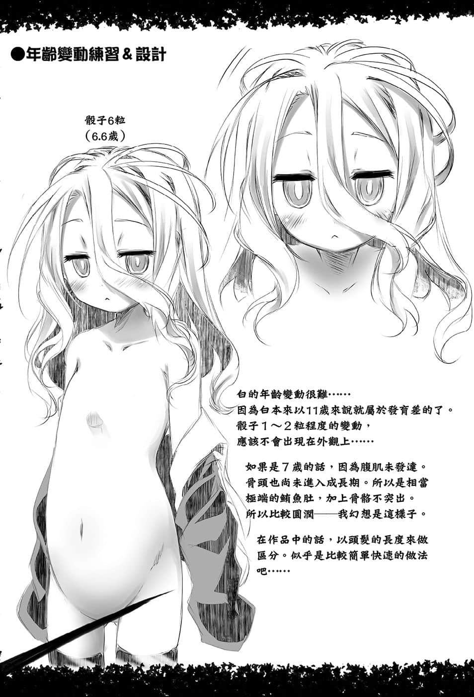
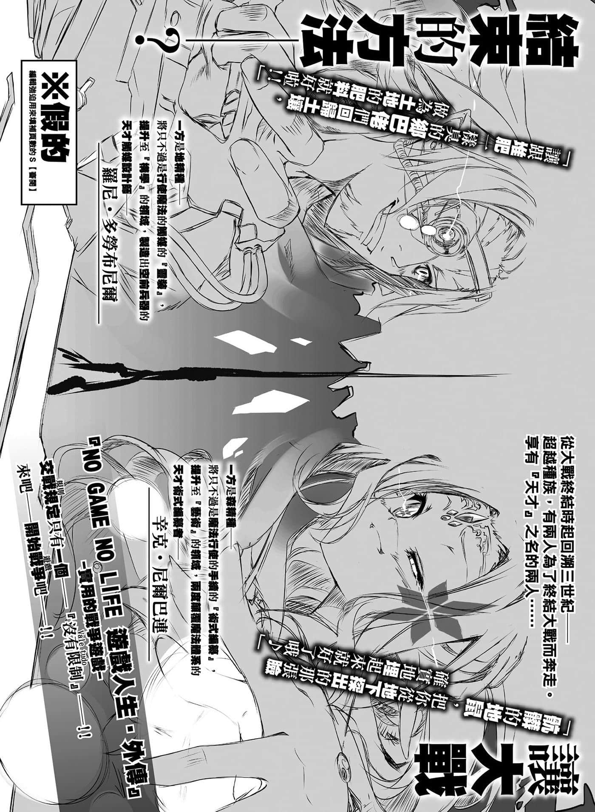

# 后记

> 来源：https://www.linovelib.com/novel/9/2105.html

本书是睽违一年三个月的新书，我是榎宫佑。

这次不只让大家久等，一度甚至还大幅度地延期发售。

在这里我要向各位读者，以及各相关单位致上深深的歉意。

…………

……………………

「……咦？结尾梗在哪？」

啊，第三代的责编Ｉ编辑，你好，这次没有梗哦？

「您真爱说笑——榎宫老师，您撞到头了吗！？（认真）」

不、那个，让大家等这么久，不管怎么说都……对吧。

只是迟交倒也罢了，居然需要延期呢。嗯。

「不、不过您虽然总是拖稿，但这次还真是相当地……为什么会变成这样呢？」

……那是因为啊。

有比深渊之底还要深的苦衷。

——请问您知道弗里德里希・尼采吗？

「真突然……不过这也不是今天才开始，我知道。」

尼采曰：神——独断论式的绝对善恶贫弱幻想已经死亡。

尽管如此，至今仍然存在着将「依循现实主义的思想——畏惧他人的评价，人际关系的摩擦等——迎合名为大众思想的偏见——追随多样化、形骸化的幻想——以被动、划一的方式决定行动理念，无明确自我者」骂为『畜群』，更说人不依靠『神』而立——带有明确的意志，不畏他人，依据无可动摇的『自我价值观』而行之人。

那也就是——应该成为『超人』者。

……大、大概。

「…………大概。」

我难得认真地在反省哦……下一集不会让大家等那么久了。

「聊些快乐的事吧！！欸～……对了！外传那件事如何！？」

（编注：大战初期，两大阵营皆对战争抱持乐观看法，认为短期内就会结束。）

身为尼采所骂的『畜群』，对于那样的评价，只好用我胆小如鼠的心脏恐惧地接下！

——这么一想，我不是『超人』，只是畜群。

——好了，那么在最后。

是让页数变得不上不下的我的错，真是对不起！！

比如说——

「那么当然第八集的原稿也会很快交稿吧？（笑容）」

以伊纲的视点描写迪司博德的世界——「游戏人生，得斯！」

不，反而没迟交才是异常吧！？

就内容的角度而言也必须快点推出才行吧。

各位读者一定会这样想吧！

我就是这样想的，您觉得如何！？嗯～～！？

别担心，在圣诞节前就可以回家了啦！！包在我身上！

咦？不是说过因为ＭＦ社纸张裁切的关系，所以不能省——

也就是——『超人』——不正是那些人吗——！！

「附带一提，如果宣传这个，肯定会有读者来吐槽，所以由我来帮读者代辩。」

「不，依照以往的模式，在这里榎宫老师应该会装作没听见，然后消失不是吗……」

虽然中二病发作，试着读看看尼采的作品，但毕竟头脑的才智致命性地不足！

不过大纲的开会，设定监修等等，我也直接参与了。

咦？不，当然发生了许多事情。

——一边是创作出我所无法比较的畅销作。

——因景气低迷，父母经营的事业随着巴西一起倾圮，我被从世界的里侧叫去帮忙。回到日本后，马上又遇到妹妹将结婚，所以要我再飞回巴西。但因老婆有喜的事也重迭在一起，我回复她没办法出席，结果她就教我帮她付新婚旅行的全额费用，随信还附上爱心符号——

就这样，读者的期待值超越音速，甚至成为突破范艾伦辐射带㊟的沉重压力！

对读者的期待、评价和沉重压力，完全不当一回事。

我和柊ましろ在动画化后，也因为制作体制崩溃，一直没有重新建立起来。

在第八集，重重铺设的伏笔，将会是怒涛的回收剧。

常常都是『反正差不多就这样吧』不是吗！？

那就来一点吧，请看！

——托各位的福，电视动画以好评结束了！

能够顺畅无比，毫无间断地，持续发表作品的人们。

为了追回落后许多的进度，我们会全力以赴的，请多多关照！

所以我的原稿就算迟交也是没办法的事不是吗？

写、写完这篇后记后，马上就开始制作分镜稿！

「——总结来说是怎样？」

从七月号开始，在月刊Comic Alive连载中！

——啊啊……没错，『他们』正是！

「…………」

如同尼采所称赞，查拉图斯特拉㊟所预言，如同闪电一般的人物！

还有六页的后记必须补满……

……欸？

但是请你们搜索记忆，回想看看。

这是去年夏天，出于作者我的希望与指名而启动的企划——呃～

「……一年以上——不，即使是连动画相关的手稿等工作全部结束的时间也包含在内，这么计算后，也还有半年以上吧……在那段期间，没有事情可写吗？」

出点子，想故事，都是由ユイザキ老师他们来想。

……嗯哼。

真的曾经有过超好玩的案例吗！？

——百闻不如一见。

喔，很好耶！这是快乐的话题！露骨地快乐的宣传呢！？

——大概就像这样，正在好评连载中！！

「——啊。」

深切地希望我们能再相逢，那么再会了！

害自己陷入沮丧低潮真是对不起大家！！

没问题的，第八集的原稿我已经写到某种程度了！

…………

「……被告处以火速完成第八集原稿之刑，还有全面禁止像这次这样的自作主张。」

可、可是在那之前呀，那个——

在那样的痛苦挣扎中，于是我这么想——

然后像个凡人一样，重心不稳地晃来晃去；然后普通地被压扁！普通～地苦恼呻吟！

不、不过……这个那个、我已经没有可写的话题了。

——隔了一年又三个月的连载空白期，玩那种花招可不是开玩笑的吧。

啊，是……是的，当然呀，没错。

不、不过顺着这个解释，让我们试着整理第六集发行后的状况吧。

去掉复杂的理论论战，映在伊纲眼中纯粹的世界——全都浓缩在『可爱』两字里，所以还请多多捧场——ユイザキ老师画的伊纲很可爱哦！（气势）

「——本篇的漫画化要怎么办呢……」

（编注：即琐罗亚斯德，祆教创始人。）

「榎宫老师，请等一下，那是——！！」

分镜稿分好之后，我就会以怒涛之势动笔了！！

祈祷着希望这一集能让大家觉得等得有价值。

当有人以『这个游戏超好玩的』这句话来推荐游戏。

「那是在插旗吧！？别说一年了，那是四年的泥沼旗子第一次世界大战㊟啊！？」

——『第七集一定会更加更加好看』！！

「……欸？」

——这种事你想听吗？（翻白眼）

能够不受大众左右，以自己明确的意志行事之人！

呜呜……呜呜……感、感谢您宽大的处置。

老、老实说，我没有自信。

自己提高难度搞垮自己。

（编注：在地球附近的近层宇宙空间中，由包围着地球的大量带电粒子，所聚集而成的轮胎状辐射层。）

是啊，当然的嘛！

游戏人生外传作品！

不过在此同时！第六集的下一集难度也暴增！

「这是谁的错呢……」

所以你说没有话题可写是？

「——什么～？（笑容）」

