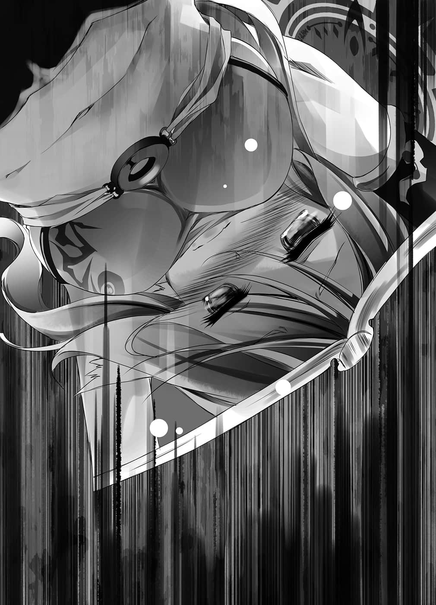

# 第一章 不战战术

> 来源：https://www.linovelib.com/novel/9/2108.html

——『大战』。赌上唯一神的宝座，众神与其眷属们争战的时代。

宛如在嘲笑逐渐毁灭的行星与脆弱的人们——

仿佛撕裂天地仍有不足般，将世界蹂躏殆尽的黑暗历史。

空与白挑战模拟那场大战的游戏，猛然地持续书写『指令』。

『活着』——就只是这样而已。

这时，那为了达成艰难至极的功业而不断书写文字的手，忽地停下。

「——！？白，我想到一个好点子了！！」

空喊出在脑中闪过的好主意。

「在指令书上写上『与隔壁的太太偷情』，这样不是很好玩吗！？」

——轰的一声。

又见一道闪光……一座山从『地图』上消失了。

直到数秒之前，那还是空他们的『首都』所在之地。

若非事前预测到攻击，命令『开拓者』单位『转移首都』的话，现在『首都』大概已连同那座山一起消失了吧。对于那样的破坏之光——两人似乎没有特别在意的样子，白竖起拇指回答：

「……哥，干得好……可是，必须下达……具体的指示……」

「啊～……欸，要怎样才能与隔壁的太太偷情呢——！？」

别说是偷情了，除了在脑内幻想之外，空根本没交过女友。

当空为了这个可能比『活着』更艰难的难题苦恼时——

「我才在想你们刚才都在忙些什么——你们到底悠哉地在做什么啊！？」

为了将两人写的『指令书』投入『投书箱』，而不停往返奔跑的史蒂芙大叫。

「如、如果晚了一步，在刚、刚才那道闪光下我们早死了……可、可以请你们认真一点吗！？」

第十五日的二二〇一时，在座标《粮食库x765 y9875》遇见《隔壁的太太单位clf e436》

「你头脑不错嘛！！没错，只要欺骗对方，让对方落入陷阱就行了！！」

因为在这个空间里——玩家应该是与外界隔绝的状态才是。

一旦都市完全消失的话，『人类种』就灭亡了，无论如何都会『走投无路』——不过这些都先不管。

隔壁的太太瞒着丈夫，不断地和偷情小王幽会。

没错，比如说是『这个』——

「明明是你造成的，还说什么可怕，对此你难道一点也不觉得不合理吗！？」

「好吧～那么我就认真使用头脑，来『战斗』看看吧？」

——第一张，指定《隔壁的太太单位clf e436》

「也就是说——！！命令盗取的人是我！以此为把柄胁迫进行一次关系的人也是我！」

「人类要在这样的环境生存下来，方法有限。」

我方若是遭到敌视，受到报复，那样只是徒增危险而已。

做一个不被敌方警戒，甚至不被认知——不被留心的存在。

正因如此，他们才在『实验』。

「…………」

「嗯～史蒂芙，你觉得该怎么做才能让隔壁的太太爱上自己呢？」

更不用说，他也没有指示《偷情小王》，对《隔壁的太太》要求两次以上的关系。

虽然胜算绝不算高，不过确实并非没有胜算。

「——什……！？」

「哎呀～你是在问我吗？我想想，如果你要参考我的经验——那就诈骗陷害，强迫对方爱上自己，这样如何？」

「但是！Ｂｕｔ！可是啊啊啊啊——！！」

空当然无从得知真相。

当然，如果正面迎战必然会失败……不过，比如说兽人种、森精种、海栖种或吸血种，空等人对【十六种族】的性质拥有某种程度以上的认识。

「哇～啊……真的搞上了……女人真是可怕～」

「再说，一般看来，这是——『从被将死开始的棋局』哦！」

不理会尽管疲累，却仍惊讶地投递『指令书』的史蒂芙，空一脸正经地继续说道：

但是这两个家伙的奸情，完全是他们自己的责任，这是不言自明的道理——！！

在这样的情形下，甚至不能轻易移动单位。

确实，单位《偷情小王》也被强制以那件事为把柄进行要胁。

「……他们会遵守那样的约定吗？如果看到那个之后你还这么相信，那要试试看吗？」

再来就是确保粮食——写『信』去挑衅吉普莉尔。

移动至座标《粮食库x765 y9875》，暗中盗取粮食

这样的呐喊虽然很有道理，但是那种事空也心知肚明。

史蒂芙脸色苍白地咽下唾液，空对她露出苦笑，点了点头。

「嗄、咦……？」

毕竟如今空他们是不满两岁的孩童身体，空一．八岁，白一．一岁，史蒂芙也只有三．六岁，对他们而言桌子太高，如果不站在椅子上，甚至无法书写『指令书』。

对于空发自真心的赞美，史蒂芙以发自真心的恳求回应。

听到白这么说，空露出笑容，他跳上桌子——『地图』上，将画面扩大。

「这方法……从吉普莉尔知道我们存在的那一刻开始，已经是不可能了吧？」

自始至终贯彻逃避才是最好的方法，但是——

然而——

「……哥……『偷情』……好像……成功了？」

可以交涉的条件确实不多，不过也不是完全没有筹码。

「……认真的事情啊，比如什么呢？」

——战斗，就是以武力确保生存领域。

——在『只要杀死对方夺取就好』的世界里，契约什么的……根本毫无意义。

要认真地做什么呢？

空随口问史蒂芙。

「追根究底，我甚至没有指示《隔壁的太太》要听从《偷情小王》的胁迫！！」

更何况推估吉普莉尔的意图，就算被攻击直接命中，空他们也不会死。

以对盗取行为视而不见为代价，要求肉体关系

最年长的史蒂芙处于要拼命地踮脚，才能勉强将指令书投进『投书箱』的状况。

确实，单位《隔壁的太太》是受空强迫做出盗取粮食的行为。

若是单位被天翼种发现，也就是『首都』被发现的话——一切就结束了。

战略游戏ＲＴＳ的铁则就是——首都受到『压制』后才会视为『陷落』。

「说得也是……我就试着用头脑进行『外交』吧。」

空要史蒂芙投递的两张『指令书』内容如下——

然后，空进一步——也就是说！

「你竟然能瞬间想到这种残忍无情的点子，你就不能把那样的头脑用在认真的事情上吗？」

「我造成的！？啥！你忘记『指令书』的内容了吗！？」

即使过了指定时间——两人仍在持续『呻吟～？』——

空露出苦笑。

由此可证——给予契机的人虽然是空。

「敌方只要起心动念，我方就会被消灭，然后就是名符其实的ＴＨＥ ＥＮＤ了。」

如小动物一般，如小虫子一般，如树叶一般，消除存在感。

那样的身体在这种地狱之中——不隔绝早就死了。

听她露出甜美的笑容这么回答，空一时说不出话来，然后——

而在那少数的选择之中，最现实的方法只有一个。

「我是在讽刺你哦！你就没有一点自觉吗！？」

「……对吧……哥，女人……很可怕吧……？」

空伸手一指，只见映在『地图』上的是——

异世界的知识、玩家才有的情报、粮食……等等。

「你努力的地方不对吧，而且赌上的不是矜持，是生命哦！！」

「那就是——彻底地逃避隐藏……没了。」

只见两个单位正表现出宣告『实验成功』的状态，不过——

「或许甚至能对一个种族造成致命伤——然后呢？那又怎样？」

也许能击破敌方一两个单位，更顺利的话——

如果轻举妄动，引来注目，而我方的『首都』一旦被发现……

自本日起的二十天内，每至二二〇〇时便会感到猛烈的饥饿

没错，空并没有指示《隔壁的太太》要爱上《偷情小王》。

也就是说，『外交』与『战斗』都没有意义。不，不只是这样。

然后——空毫不犹豫地写好两张『指令书』。

最多只能派出斥候，预测敌人的行动——转移首都，不让首都被流弹打中。

以这些知识为依据，操控单位，战术性地包围，发动奇袭，在夺走敌人战术性优势的局地战中，只要能善用地利的话……就有胜算。

只要再迟数秒，『首都』就陷落了，看到史蒂芙脸色苍白的模样，空内心随口回应——大概不会有问题啦。

——第二张，指定《偷情小王单位b3f c412》

「这两个家伙持续那个关系——『是出于他们自己的判断』吧！」

现状是——『什么也做不到』。

看到那个景象，空感到可怕，白则像是在对空进行洗脑一般，而史蒂芙则是对着他们大叫。

——外交，借由契约缔结的信赖关系。

——实际上，过去的人类种是如何从这场『大战』中存活下来的呢？

以这些东西为代价，能够与其他势力缔结什么合作或贸易约定吗——？

空高声呼喊。

粉碎天地的暴力风暴——看到那样的惨剧，史蒂芙也不得不确信了吧——

那个……也就是投影在虚空中的『斥候』视野——外界的光景。

「无法战斗！只要外出就会损耗单位＆游戏结束！！我赌上身为游戏玩家的矜持，想要享受连外交都不能进行的烂游戏，你就不能对我的努力表示赞许吗！？」

没错，只要被警戒就会『走投无路』，可是这一切却是从受到警戒的状况开局。

「…………不……不，你那个理论有点奇怪——」

「果然是因为背德感吗！？背叛丈夫有那么爽吗！？」

「不，那个！是你让她红杏出墙的，结果出了墙你还生气，这也不太对呀！？」

——不过，空与白无视吵闹的史蒂芙，两人露出满足的笑容，对这个『实验结果』感到非常满意。

看来这个游戏比想像中还要来得——有弹性。

是否继续偷情，『单位会自行判断』，如果是这样的程度——

「好，下一步！这是在和时间赛跑，所以你快去投递指令书吧！」

空停止夸张的悲叹，将事先写好的两张『指令书』交给史蒂芙。

被催促去投信的史蒂芙，冷眼对注视着『地图』的两人问道：

「……这次你下了什么恶毒的命令？」

「说我恶毒，实在令我感到意外啊，这是正当的『外交』，和『贸易交涉』的确认与实验。」

具体而言就是——

「命令《隔壁的太太》跟《先生》说她被人敲诈，要付给别人盗取粮食的遮口费，然后把遮口费交给《偷情小王》，收下钱的《偷情小王》则是远走高飞至第三都市——就是这样的指示。」

「那不叫外交，而是敲诈哦！！」

听到史蒂芙这么喊叫，空心想——「没错啊」。

简单说就是——

——『我偷了你的宝石，想要我归还就付钱』——就是这样。

如果被问到这样不叫敲诈，怎样才叫敲诈？那空当然会回答，这就是敲诈。

所以——

——看到《偷情小王》成功从《隔壁的先生》那里骗到遮口费，开始往第三都市移动之后，空笑意更深地回答：

想起游戏刚开始——距今三十八天前的事。

「……比那些还低贱的人类种小虫子三只吗……咦？」

「算了，即使不太明白是怎么回事，不过只要问人就好了吧♪」

用圆圈圈起，画了双重引线——甚至附注表明是最重要的情报。

不过，其中有一个特别标明的项目。

看着以天翼语如此写着的封面，她心想：

以及——她皱起眉头说道：

「……她从丈夫那里骗到全部财产——然后和小王远走高飞了……是吗？」

尽管要向野兽和虫子们开口问『我迷路了，请告诉我怎么走』——做出这种奇妙的举动，实在令人非常不愉快，而且也非她所乐意……

听到白这么说，空一脸讶异地触碰『地图』——再扩大显示。

胸前飘浮着九个白色的立方体，周围则是螺旋状的陌生大地。

大概将吉普莉尔所知的人物特征，以及其他资料，全部都记录上去了。

【史蒂芬妮・多拉】人类种，红发女性，称呼她小多。

是打从我出生以来，一直找寻至今的『答案』……

同时——

「……？……哥，出现失业者了……」

【空】黑发的人类种 【白】白发的人类种

空深思熟虑地望向移动至第三都市的单位们。

「我不想输我不想输我不想输啊……主人！！」

那里是与空他们所在洞窟相同的——『玩家空间』。

「真、真是冷血无情……啊啊，不过这样隔壁的夫妻就能恢复和平了吧。」

吉普莉尔侧着头，对自己与这些下等生物在一起之事感到不解。

另一方面——那个空间只是笼罩在寂静之中。

空他们笑着这么回答，然后忙碌地开始行动——

然而，那终究只是移动——

她远望四周，琥珀色的眼眸中，点亮十字的图形。

「……欸……为什么？」

上面写满了吉普莉尔抄写下的无数笔记。

想起写下这些句子时的自己，想起自己那时的心境——

比如说——

……早知会是这样……

---

■ ■ ■

看这个情况——

不过对此空似乎毫不介意，只是露出更深的笑意。

「……我不想输……」

颤抖着背部、肩膀和声音，宛如恳求一般，缩着身子，有如梦呓似地喃喃自语。

连没有指定的单位也能欺骗。

——『每当失去记忆时，阅读第三二〇五页。』

「……空？《隔壁的太太》跟《偷情小王》是不是在一起了呀？」

重要⇘

「……嗯，这样……就能采取……许多行动……对吧。」

【布拉姆・斯托卡】吸血种，对其性别没兴趣，可以视为蚊子。

「现在终于好玩起来了，要开始忙碌了哦～！」

【初濑伊野】兽人种，男性，可以理所当然地藐视他，很噁心。

——空间转移。

但是，就在那之后——

空与白猛然地开始书写『指令书』。

空笃定地断言，白对他露出尊敬的眼神，史蒂芙则是用像看厨余般的眼神看着他。

结果，超越空间的视觉，捕捉到在螺旋大地上前进的人们身影。

——既然如此，与其他种族也能够进行『外交』了吧。

吉普莉尔胸前飘浮着十颗骰子，但是她却什么也不做，只是低头等待着，不，她是在祈祷。

她带着近似后悔的那份感情，缓缓地翻开，打从这场『双六游戏』开始后，不知翻开多少次的页数——第三二〇五页。

「……哥，你又来了……你思考卑鄙的事时……表情好帅……！」

………………————

「……咦？这里是哪里？」

自顾自地这么认定之后，吉普莉尔张开羽翼，提升光圈的转速。

那也是为了确认，能从指示外的《隔壁的先生》骗到多少程度的遮口费。

————？

于是她就像这样，采取了非常合乎常识的行动。

吉普莉尔虽然毅然决然地如此宣言，但是——

空与白两位的随从，虽然爱着空，本人却顽固地否认。

感受着轻抚脸颊的风，吉普莉尔圆睁着双眼，侧着头感到疑问。

对于这份实在太不习惯的『感情』，吉普莉尔不知该如何应付，她用颤抖的手指触摸『日记』。

空发现了那样的『突破点』，史蒂芙则是冷眼看着他说道：

只见……《隔壁的先生》单位似乎身无分文，流浪街头。

……早知会是这样。

——嗯。

吉普莉尔用指尖，顺着颤抖的笔迹所写下的句子轻抚，低下了头。

也就是——『第一掷』。

「你们完全拒绝直视自己招来的不幸对吧……」

扭曲空间，连接两个座标——那就等于是无限速的移动。

游戏开始时，不要恢复成十个骰子或许还比较好。

两人皆来自异世界，羁绊强烈的兄妹——是我的新主人。

---

■ ■ ■

桌上同样摆放着摊开的『地图』，坐在桌前的则是吉普莉尔。

简单说就是，只要杀死害她丢脸的家伙，一切就解决了。

只有这次，她绝对要赢——不论要使出怎样的手段。

回过神来才发觉，自己独自一人，伫立在受风吹拂而如波浪般摇摆的草原上。

「一定要确实地杀死导致我必须去做这种事的始作俑者。毕竟，这状况似乎不是我自己造成的？」

希望空与白，希望她的主人们——能够『弃权』。

确实，他刻意没有写出『遮口费的具体内容』。

——虽然还是不清楚状况。

虚构的阿邦特・赫伊姆的办公室中央，果然也摆放着破旧的『投书箱』。

「所谓的外交，讲白了就是『集团敲诈』吧？」

吉普莉尔既不知道这是哪里，也不晓得自己为何在这里，她站了起来。

她抱着至今一直不断书写的——『日记』。

——就像这样潦草的记述。

正是当初掷下骰子时发生的事——……

「——好了！不管怎样总算找到突破点了哦，白！」

不管是空还是白——不，只要是认识她的人，看到她现在的样子，大概都会惊讶得说不出话吧。

他们完全不懂史蒂芙在说什么，不过先不管她。

「碍眼的吸血种虫子一只，嚣张地用两脚走路的兽人种野兽两只……」

「你们还是……不弃权吗？」

……史蒂芙则是轻声地问道：

——除此之外，连身高、三围、生活小故事都记载得很详细。

不要恢复记忆或许还比较好。

「————————啊咿！？」

如果途中有障碍物的话……就会变成这样。

这是与那笨拙的声音极不搭调的冲撞事故——以「速度等同无限」的高速，撞上空中的『不明物体』；伴随着巨大声响，吉普莉尔就像青蛙一样贴在空中。

然后就这样……慢慢地滑落……

如同从墙上剥落般，终于撞上地面。

「……呵、呵呵……竟敢用空间隔绝围困我……哼、哼哼哼——」

吉普莉尔头上肿了巨大的包，她站起来……脸上挂着笑容。

那是以天翼种之力仍无法认知、察觉的力量。

原来如此，不管是这个螺旋大地，还是连空间转移都能阻碍的隔绝。

能够办到那种事的人——如果是『神灵种所为』，那样就能想通了，不过——

「——好大的胆子啊啊啊！！」

想通是一回事——总之，先给我去死吧。

吉普莉尔祭出数发『天击』发泄，然后将空间破坏魔法等全使过一轮，大闹一阵之后——

…………

「……呼……呼……暂时先……放你一马……」

终于——看来她似乎明白做什么都没用的样子，吉普莉尔只能不情不愿地承认这一点。

那些在螺旋大地上前进的人们，他们要去的地方一定是神灵种所在之处吧。吉普莉尔接受了现实，总之就算要杀，现在也只能忍耐……她不愉快地开始前进。

状况依然不明，不过就时间而言，仅仅过了短短的数分钟。

中间夹着谜一般的黑暗，在度过四十二次空间的隔绝后——

——【在被岩浆吞没之前，做出装有四公升水的容器。】

就连主人们在制定规则时都疏忽了这个漏洞吧——不！

写下关于正在游戏盘上前进，刚才她还将其认知为下等动物的主人的记忆。

「……你以为你是谁啊？」

——原先。

在游戏开始之际，因为空的挑衅，吉普莉尔也察觉了这一点。

随着自以为了不起的声音再度响起，胸前的立方体增加一个。

日记所写的一切内容，不管是意义、心情，甚至价值……都变得不再明了。

但是吉普莉尔的心情原本就已经很恶劣了，这时又有这种幼稚的问题来烦她。

在游戏盘中前进的人——

没错，只有那样。

没有质量的『灵魂』不包含在内。

但是这阵无法形容，令人血液冻结的寒意。

然后——岩浆突然如海啸般从正面逼近而来。

「……原来如此……这就是——『恐惧』……是吗……」

吉普莉尔以魔法自行制造出『四公升的容器』，看着容器被雨水装满。

首先针对发生什么事了想起，也就是——

质量存在时间——没错，就是质量存在的时间。

——即使丧失了记忆。

只要阅读日记应该就能想起——

如果只是那样的话，只要全部记录在日记上就没有问题。

——【课题视为达成】。

——只有自己。

不，应该说那比较接近『丧失记忆的自己是另一个人吗？』这种论辩。

「对……直到在那个澡堂中，主人不经意地将骰子交给我为止……」

这是『容器』与『灵魂』境界不明确的魔法生命的性质。

——她完全不知道自己身上『发生什么事』了。

将大气中与地下含有的全部水分，连同喷水池的水一起浓缩起来，击向岩浆。

但是，只要事先将自己的心情、记忆，全部写在这本日记里——

……完全不知道这是什么意思。

一股令她牙齿打颤的寒意，让她升起想要抛弃一切逃走的冲动。

这时她终于体验并理解了那样的感情，但她像是在畏惧、逃避一般，将自己的见闻毫无疏漏地全部写在日记上。

吉普莉尔刻意——嘲笑着，然后依言而行。

「————————————！？」

「——啊啊……这就是——」

第二掷——再一次掷骰，与减少一个骰子同时——

——『灵魂』与『容器』……没有明确的境界……

那么吉普莉尔呢——？

那句话听起来简直就像在说——在岩浆到来之前，能解开就解看看吧。

——原来如此，骰子减少会让自己的记忆也跟着丧失。

布拉姆、伊野、伊纲、小多，然后是——空与白……主人们。

——自己这个天翼种，竟会称呼区区下等的人类种为主人，这一定有什么问题。

不，吉普莉尔当然明白那句话的意思。

吉普莉尔这么说完，而且也已经理解发生了什么事，她努力维系随时会失去的意识，牙齿打颤，用抖动的手——取出日记，猛然地开始书写。

看到他们即使骰子减少也不受影响的情况——假设转变为确信了。

眼前出现喷水池，以及分别写着五公升与三公升的两个容器。

吉普莉尔讶异地看着那个立方体。随即——

「……冷静下来……思考一下吧……」

先前的疑问——这里是哪里？为何会在这里？全都豁然开朗了。

——『恐怕会只剩下「基干术式」，然后重新启动』。

吉普莉尔再度翻页。

吉普莉尔抱着身体跪倒在地。

更大的问题——那么如果失去所有的骰子，自己会变得如何呢？

仅仅只是减少一个骰子就失去了那些记忆。

只不过在那之际，所有的记忆会被归零。

不只是主人们，那是『生物』都无法得知的情报。

意思就是要她用两个不同的容器，正确地量出四公升的水。

那也就是——

也就是说，将『容器』与『灵魂』分开——『只用容器』做为赌注，然而——

就这样——在蒸气爆炸所产生的倾盆大雨中。

---

■ ■ ■

在不变的寂静之中，只有吉普莉尔翻页的声音平淡地响起。

吉普莉尔以超越空间的视觉，重新环视四周。

她颤抖着身体，好似勉强挤出声音般地问道。

自己甚至连察觉都办不到……

这时便浮现一个带有浓厚可能性的假设。

就这样——在虚构的阿邦特・赫伊姆的办公室内。

吉普莉尔清查规则，开始慎重冷静地考察。

就跟其他的参加者相同——并不会死。

01：七名参加者，将会分得以自己『质量存在时间』依比例分割而成的十粒『骰子』。

其他参加者会变成『灵魂』——灵体吧。

她原先是这么确信的——

——为什么『只有自己的记忆消失』呢？

对于自己完美无缺的答案，吉普莉尔露出满足的表情。

因为术式重新启动——『重生』，那就不是自己了。

她拼命地说服自己快要错乱的思考。

就像这样，在一道似乎自以为了不起的声音响起的同时——

翻开的那一页写着那个假说。

就算失去所有的骰子，自己也会不受影响，依然敬爱主人吧。

——那应该是最重要的记忆。

最应该发觉这个规则有问题的人，不是别人，就是吉普莉尔自己。

「……发生……什么事了……？」

主人们是为了从游戏退场后也能活动而如此设计。

——发生什么事了……这个答案很清楚。

因为只会剩下构成魔法生命吉普莉尔的最小单位——没有质量的『术式』而已。

那段记忆……暂时消失了。只是如此而已。

这里是神灵种的双六盘，自己正参加双六游戏。

对于这个事实，活了六四〇七年时光的吉普莉尔——

只有不是生物，而是生命的天翼种——

恐怕是他们用游戏陷害自己，植入了对他们有利的记忆，一定是这样没错。

对于那样狂妄自大的猴子，就去看一眼吧，有机会就杀掉他们。

所以她怀着那样的『确信』——

——去见他们……去见主人们。

就这样——那一天。

在澡堂接到投过来的骰子——记忆全部恢复之后。

自己询问主人们——对『转生复制人』有什么看法。

拥有完全相同灵魂的自己，真的还是自己吗？

只要灵魂、基干术式、构成要素全部相同的话，那样就是自己了吗？

接着，听到主人们的回答，吉普莉尔这次……真的理解了。

过去的自己将那时的感情写了下来，翻开那一页，吉普莉尔忍不住苦笑一声。

「讨厌讨厌讨厌讨厌讨厌讨厌讨厌讨厌讨厌讨厌讨厌讨厌讨厌讨厌讨厌讨厌讨厌讨厌讨厌讨厌讨厌讨厌讨厌讨厌讨厌讨厌讨厌讨厌讨厌讨厌讨厌讨厌讨厌讨厌讨厌讨厌讨厌讨厌讨厌讨厌讨厌讨厌讨厌讨厌讨厌讨厌讨厌讨厌讨厌讨厌讨厌讨厌讨厌讨厌讨厌讨厌讨厌讨厌讨厌讨厌讨厌讨厌讨厌讨厌讨厌讨厌讨厌讨厌讨厌讨厌讨厌讨厌讨厌讨厌讨厌讨厌讨厌讨厌讨厌讨厌讨厌讨厌讨厌讨厌讨厌讨厌讨厌讨厌讨厌讨厌讨厌讨厌讨厌讨厌讨厌讨厌讨厌讨厌讨厌讨厌讨厌讨厌讨厌讨厌讨厌讨厌讨厌讨厌讨厌讨厌讨厌讨厌讨厌讨厌讨厌讨厌讨厌讨厌讨厌讨厌讨厌讨厌讨厌讨厌讨厌讨厌讨厌讨厌讨厌讨厌讨厌讨厌讨厌讨厌讨厌讨厌讨厌讨厌讨厌讨厌讨厌讨厌讨厌讨厌讨厌讨厌讨厌讨厌讨厌讨厌讨厌讨厌讨厌讨厌讨厌讨厌讨厌讨厌讨厌讨厌讨厌讨厌讨厌讨厌讨厌讨厌讨厌讨厌讨厌讨厌讨厌讨厌讨厌讨厌讨厌讨厌讨厌讨厌讨厌讨厌讨厌讨厌讨厌讨厌讨厌讨厌讨厌讨厌讨厌讨厌讨厌讨厌讨厌讨厌讨厌讨厌讨厌讨厌讨厌讨厌讨厌讨厌讨厌讨厌讨厌讨厌讨厌讨厌讨厌讨厌讨厌讨厌讨厌讨厌讨厌讨厌讨厌讨厌讨厌讨厌讨厌讨厌讨厌讨厌讨厌讨厌讨厌讨厌讨厌讨厌讨厌讨厌讨厌讨厌讨厌讨厌讨厌讨厌讨厌讨厌讨厌讨厌讨厌讨厌讨厌讨厌讨厌讨厌讨厌讨厌讨厌讨厌讨厌讨厌讨厌讨厌讨厌讨厌讨厌讨厌讨厌讨厌讨厌讨厌讨厌讨厌讨厌讨厌讨厌讨厌讨厌讨厌讨厌讨厌讨厌讨厌讨厌讨厌讨厌讨厌讨厌讨厌讨厌讨厌讨厌讨厌讨厌讨厌讨厌讨厌讨厌讨厌讨厌讨厌讨厌讨厌讨厌讨厌讨厌讨厌讨厌讨厌讨厌讨厌讨厌讨厌讨厌讨厌讨厌讨厌讨厌讨厌讨厌讨厌讨厌讨厌讨厌讨厌讨厌讨厌讨厌讨厌讨厌讨厌讨厌。」

只是罗列着同一个词语，泪迹斑斑的纸页如此诉说着。

诉说着失去记忆的自己——并不是自己。

不管是灵魂还是什么，就算找再多理由，如果失去记忆的自己，阅读留有全部记忆的这本日记——只觉得那是别人的日记的话。

那么那个存在终究只是——另一个人。

阅读某人的日记就能成为某人吗——？当然不可能。

这就如同即使读过再多的书，终究只能得到『知识』一样。

绝不可能连作者是以怎样的心情写下的都能完全体会。

做下这样的结论后，吉普莉尔再也不想将空交给她的骰子归还。

——『即使如此，主人们也一定会获胜吧。』

吉普莉尔抬起泪流满面的脸，露出小小的苦笑。

——【从神灵种所握有的七名灵魂中，选出一名杀死，移转至终点格。】

「……我真是差劲呢……」

那只是坐在飘浮于虚空的墨壶上，仿佛在那里经过了永远时光般的存在。

为了让失去记忆的自己也能执行这一切，她详细地将事情写在那一页上——

那并不是惊慌失措，伊纲只是如喘息一般，目光游移，身体颤抖着。

她看见『地图』开始显示出频繁的变化。

连物理法则也能超越的『血坏』——那样的知觉捕捉到遥远的战场。

毕竟，空他们大量传送来的『信』——充满挑衅的词语。

那就是要牺牲某个人，让这场游戏结束吗？

看到写着这一句话的书页，吉普莉尔心想：

大战终结之日，一切都改变的那个时候，世界是如何改变的呢？

在第三百零八格的边境——

【如此一来，汝即为『胜者』——一切皆会立刻结束吧。】

如果连这一切，以及其所代表的意义都忘记了的话——

那个存在冰冷地告知。

然而吉普莉尔也心知肚明，若只是那样做一定会『缺少什么』。

但至少让她确信会有那一天，并写下些什么之后再死——……

她因此感到前所未有的恐惧……

「可是——求求您，主人……」

上面详细写着——发动这场『大战』游戏的步骤。

「——————」

因此，她甚至赌上了『取胜神灵种的真正方法』。

但那样就是抱着十个骰子退场。

不过——吉普莉尔最后朝日记瞥了一眼。

伊纲身上笼罩着沸腾的血，挥下的每一拳都激发出巨大的声响。

更何况——那么做有可能会断绝主人们的胜利——甚或命脉。

或者明明没有资格——却仍不争气地流着泪，恳求拜托的这件事。

无论这场对神灵种战游戏的结果是什么，自己吉普莉尔都无法看到结局。

吉普莉尔忍不住露出自我厌恶的表情。

「……感谢你们，主人，那就恕我僭越了。」

只要彻底地将他们逼得走投无路，主人他们想不『弃权』也不行吧。

只要牺牲毫不关心地看着这一切的神灵种以及另外一人。

藐视一切的神灵种口中所说的是，伊纲所面临的【课题】——

「……是啊……主人们……『 空白』……不可能会接受败北……对吧。」

而且看到翻开的那一页，『借用侵占』骰子后所写的内容。

伊纲知道那样的光景。

信上只要写上一句——『弃权吧』或者『去死吧』。

就这样，吉普莉尔也拿起笔，开始书写『指令书』。

所以吉普莉尔再度询问主人们：

——必须回去，必须回去阻止才行。

只要这么写，身为所有物的自己是没有权力拒绝的……

若是可以，她甚至想当场死掉。

吉普莉尔低着头这么说道。

「主人们对着『不是我的某一个人』……呼唤『吉普莉尔』——」

「……如果有个不是我的某一个人，拥有我的长相、我的声音——」

「——那样是不行的啊，得斯——！！」

想像在最珍惜的记忆、最珍惜的人们身旁，被这么呼唤的人——

主人们大概会看不起自己吧，无论怎样的处罚她都甘愿接受。

那是游戏——只是幻觉而已，这一点伊纲很清楚。

伊纲知道——吉普莉尔不晓得，但是却想明了的那个答案。

【汝在犹豫什么，报上一个名字。】

那是模拟过去『大战』的游戏——创造出那种空间的是神灵种的力量。

——自己可以获胜吗？

——对上神灵种的『双六』游戏，如果谁到终点都可以的话——那就由吉普莉尔达成。

不过，那一方面也代表，他们『接受挑战』。

---

■ ■ ■

因为自己的主人空与白，他们两人不可能以「只要有人到终点就是大家获胜」——那种『败北』做为前提。

有只发出咆哮，仿佛要震碎格子尽头的空间般，凶猛的红色野兽。

——她从格子边缘俯视一个压缩到极限的空间。

——不，应该说如果主人允许她死的话，她现在就想死……但是！

——如果这是最后的游戏。

同时表示『允许吉普莉尔可以获胜』。

「让我——过去，得斯！！」

——竟然会是那样的——『另一个人』。

她知道过去的『大战』是怎样完结的，也晓得那场游戏将会如何结束。

——到底过了多久呢？

但是，生命如草芥一般，天地像玩具似地被撕裂。

「……求求您，只要一次就好……我求求您，主人……可以让我获胜吗……只要这次就好……求求您——！」

————…………

在那样的条件下——安排了看似只能『弃权』的游戏。

听到那无感情的声音，挥动着拳头，就连眼角的泪水也挥发的伊纲回过头。

「她却回以轻蔑的眼神……那种事我无论如何都无法认同……！」

如果又会忘记一切，她甚至想维持现状，拒绝再度掷骰。

既然现况是走上虽与特图告诉她的故事形式不同，本质却相同的道路，那么最后的结局一定也是——

——『相信是什么』……提出这个如今已无法回答的问题的存在。

那么至少，她想败给主人而死。

普通的敲打不可能越过空间之墙，然而即使如此，身受挥发的血液与焦躁感灼烧的伊纲，仍不断地挥出拳头、尖爪和利牙，在空间之墙上击打。

不然只要一句话，命令她去死——

——他们丝毫没有打算『弃权』吧。

她承认——自己害怕得不得了。

——只会以某人的死亡告终。

还是像现在这样，不惜使用卑劣的手段也要取得胜利这件事。

不管是日记上所写的一切——六四〇七年间，自己所见所闻，学习与感受到的一切。

不管是那个答案，或是人类种的力量，还是世界再一次变革的瞬间——

——无论如何也要获胜。

——那样一切就会结束。

不管是吉普莉尔与空他们在眼下厮杀的那场游戏。

还是发生在游戏外，伊野、布拉姆、克拉米和菲尔彼此厮杀的那场游戏。

或者是这一场不管谁到终点，这个神灵种都会死的厮杀游戏——全部都会结束。

那么——『再一个人』。

比如说……如果伊纲牺牲自己，到达终点的话——？

那样就能阻止更多的牺牲是吗——？

————！？

「……少开玩笑了，得斯……你是傻了吗，得斯——！？」

没有比这更愚蠢的事了，伊纲露出利牙怒吼道。

她不是对神灵种怒吼，而是对太过愚蠢的——自己咆哮。

说起来——伊纲先前一直认为『没必要把这个游戏想得太复杂』。

就结果来说，就是要全员相互背叛，才能彼此协助，最后有人能抵达终点。

她靠着年幼与特有的敏锐感性，发觉了那样的道理，在此情况下——她原本想自己获胜。

获胜之后……

——她本来打算要求『解救包含巫女在内的大家』。

但是，为什么自己没发觉呢？伊纲对自己感到火大，发出了悲鸣——

「那样一来——不就是『什么也没改变正负相抵』吗，得斯——！？」

抵达终点的话，大家都能得救？所以要抵达终点？

如果只是要拯救大家——那么别玩这种游戏就好了吧——！？

「……镜片的……素材……『玻璃』……几乎无限供应……」

就这样，侦察能力和地图显示范围扩大了，不过——

也就是在这个荒废的世界也能种植的农业法、保存食物的技术等等。

但是在这个死亡之灰从天而降，遭遇异种族就等同死亡的地狱里，能维持四位数数量的『斥候』——如今地图所显示的这个『地形情报』，就证明『斥候』的生存率提高了。

因为到目前为止，体感已经过数分钟，而在游戏内『斥候』最长也只能活两个月。

如果是本来的空或史蒂芙，即使坐着，伸出手也构得到『投书箱』。

单位只会遵照『指令』——依照『设计图』行动，然后在单位也不理解原理的状况下——将四片凹凸透镜组合起来，就完成了五十倍率的地上望远镜。

空、白、史蒂芙、吉普莉尔、伊纲、伊野、布拉姆——确实是七名。

「……哥……找到了……」

神灵种宣称，不管是一或二全都一样，伊纲吼叫着，一口咬定神灵种的话——是『谎言』。

——就宛如因古代核子战争而化成玻璃的沙漠一般。

没错，史蒂芙会惊讶也是理所当然的。

原本只能勉强点亮都市周边和少量『斥候』，其余一片漆黑的『地形情报』。

看到史蒂芙打从心底感到失望，空愤愤不平地反驳。

『不可解』之处实在太多，伊纲抱着头思考。

「这跟数量无关，得斯……像你这样的骗子——我最讨厌了，得斯！！」

「——我让他们制造出『望远镜』。」

不，追根究底的话——这个【课题】到底是谁写的！？

映在『地图』上的是——『Ｂ. Ｔ. １３２年』的标示。

伊纲泪眼汪汪地瞪着神灵种。

假设一定要牺牲某人，那么打从一开始就不该玩那种游戏——！

当然，如果只是那样，『斥候』的生存率并不会大幅提升。

「……输也没关系，得斯。我最讨厌你了，得斯——可是！」

但是——

他触碰『斥候』，放大画面，将斥候的视野投影至空中。

那些都是只要经过研磨，透明度就足以做为镜片使用的玻璃——而且是无限提供。

回应她的果然还是不含任何感情的神灵种的声音。

「当然，说到决定游戏胜败的最大关键——」

「哪有作弊！？这几乎符合『规则』哦！？使用游戏规则内的手段，哪里错了啊！」

空这么说着，以手指轻敲桌上摊开的『地图』，接着手指往空中一滑。

但是对退化至幼儿尺寸的三人而言，就连那样的高度都遥不可及——

那指的到底是谁——？

「——我不懂啊，得斯——！」

那样的话……

「……好慢……快点投书……！」

伊纲摇着头，就像是闹脾气的小孩，她心里想——不可能是那样。

帮他们投递指令书的史蒂芙则是被迫全力冲刺，来往奔向『投书箱』。

说起来——这个【课题】是怎么回事？

那么，那个方法是——听史蒂芙这么问，空露出得意的笑容。

---

■ ■ ■

不对，不是那样，绝对不是那么一回事——！

空这么说完，将世界地图投影到虚空中，看到那个地图，史蒂芙惊讶地睁大双眼。

——没错，无论如何，不达成【课题】，只要经过七十二小时，伊纲就会失去一个骰子，剩下一个骰子——到时她就无法再前进了。

「——是情报对吧？」

「果然如此——他们在『狩猎』。」

因此——伊纲狠瞪神灵种。

——绝对不对，不是那样！

更不用说如果为了到达终点，必须要突破这个课题，那又得再牺牲一人？

「再来只要投出『指令书』，叫他们彻底研磨，依照设计图制造就可以了。」

不会是那样，那是不可能的，那种游戏自己不可能同意！

如果什么也无法改变，什么也无法阻止的话，那么为什么——

史蒂芙忍不住询问如此重度劳动的意义。

那样非但不是正负相抵——而是赢了也是负数啊。

但是——如果也包含这个神灵种的灵魂——那不就是八名吗？

空有如嘲笑般地这么回答。

发现了一群不属于自己阵营的单位——『目标』的集团。

——神灵种握有的七名灵魂……？

「对，因为——这群笨蛋会为我们制造，想要多少有多少♪」

一边摸索、发掘这些技术，一边下达庞大『指令』的结果就是——

从与吉普莉尔开始游戏，已经过了十六小时。

靠着超过四位数的『斥候』，如今已经映出一个大陆的形状了。

即使在这一瞬间也有光芒闪动，足以在大地凿出巨洞的力量降下……没错，也就是说——

「你、你们有干劲是很好！但是也太极端了吧……！」

——若大家不能得救，那么即使抵达终点——又该要求什么呢？

——绝对是谎言。

能够欺骗单位——自从找到这个事实规则后，已经过了十小时。

从第三百零一格起就不断连续下去的【课题】——为何会这么密集！？

在核子战争也自叹弗如的世界里，只不过是使用一项未来技术就被说是作弊……？

即使是在现代的艾尔奇亚，透明度能用来制造镜片的玻璃也不多，而且也不便宜。

「……伊纲，绝对……不会说出任何人的名字，得斯！！」

看到那个集团定期循固定路径移动的情形，空暗自窃笑。

空与白在那段期间，手一刻也没停过，不断地书写『指令』。

「啊啊……果然是使诈或作弊那一类……」

……因为如果非牺牲某个人不可。

逐渐映出的世界……在点亮的世界地图上——

世界根本什么也没改变……得斯……

「……『超高温高压的冲击』……足以令沙漠、山陵——甚至矿山也挥发的力量。」

听到白这么说，空跳上桌子——『地图』上。

「——为什么特图……要告诉伊纲那样的故事……得斯……！」

不对——不对不对，伊纲摇着头思考，说起来、说起来……

还需要推算出较为安全的移动路线，确立生存技术。

「即使如此——我也不认同让你死，得斯！！」

更何况就算抵达终点，也会牺牲神灵种。

不是别人，正是那群笨蛋提供他们，从白铅矿提炼成的含铅的玻璃素材。

「——写好了，下一张！快点！！」

「原来这里是露西亚大陆！？什、什么时候变得这么清楚——」

白却说那种玻璃在大战时『几乎无限』，史蒂芙对此感到讶异。

更何况如果也包含了『巫女大人』，那应该是九名吧——！？

那也就是说，游戏内已消逝了将近五十二年的岁月——

虽然不知道是什么不对，不过直觉告诉伊纲。

那样一来，单位们就不需要什么光学技术。

【了解，无论如何，汝之败北已是注定。】

只有这一点，伊纲十分确信，她流着泪呐喊，可是——

「这、这是怎么办到的！？这么大量的『斥候』——」

「我被迫奔走……应该有正当的理由吧！？」

然后——空对着透过望远镜看到的部队，笑容满面地展开双臂。

「欢迎光临～兽人种的朋友们～♪我们是朋友吧～？」

「……那种朋友没人想要吧……」

「我会把你们拔光到一根毛都不剩」，听到空这样的副声道语音，史蒂芙小声地嘀咕。

——在大地被黑灰污染，下个瞬间一切会被消灭的世界。

想要定居农耕生活，除了上位种以外，其他的种族既没有那种余裕——也不划算。

更何况如果以兽人种的身体能力而言，便更是如此，狩猎采集生活才是更确实的方式。

不过问题是他们的狩猎路径与频率。

「……哥……路径计算出来了……」

配合无间，白瞬间计算出那条路径，把纸条拿给空看。

大约每三秒会在六条路径持续往复的——兽人种集团。

三秒……换算成游戏内的时间几乎是每日，而那代表的意义就是——

「如我所料……他们处于『饥饿状态』，好了，白！快乐的『外交』时间到了哦！」

生存在这种世界之中，想必猎物一定不够。

那也就是说——他们是少数有隙可乘的种族。

看到事态发展如同预料，空露出奸诈的笑容。

空与白在事先准备好的『指令书』上——只是添加了座标，然后交给史蒂芙。

史蒂芙再次全速冲刺，将『指令书』投递完回来之后。

「具、具体来说要怎么做呢……要拉拢兽人种……是吗？」

史蒂芙气喘吁吁地问道，但是空与白则是皱着眉头回答：

「咦？那当然是……粉碎她的精神与尊严，把各种快乐灌输给她，让她从此对我们言听计从——所以我最初就指示要抓女的啊。」

「……什、什么？不是要与兽人种进行外交吗？」

虽然史蒂芙降低要求，这么提出抗议，不过空却无视她的提议。

但是，即使如此——这是一个约定与契约都无意义的世界。

「……哥，那不是游戏……而是同人本的……定理。」

「——如果要和妖魔种进行外交……该怎么下手才好……！」

简单说就是——『人口买卖』的提案，空笑容满面地说道。

仿佛是现实的一切被迫服从于空与白的思考。

「可恶啊！原来欧克是妖魔种啊！难怪会失败！」

——然后，对方大概读了空所写的『情书』。

「无论是何种魔法，不管是怎样的力量——全部都没有用。」

空忍住快要崩溃倒地的冲动，双手颤抖地抓住平板电脑。

空露出更深的嘲笑继续说道：

——连同方法一起详细写在信上的空，只是阴森诡异地笑着。

「我让斥候把食物搁在那里了——另外还附上『情书』。」

——兽人种集团从地图上消失了。

「………………咦？」

——什……么……！？

「不！那不是失败的原因吧！？」

从空中的地图上可以看见，『森精种』一个单位循着来时路径回去。

「听好了，首先利用兽人种——拉拢一只森精种。」

「……喂，那个出发点一开始就很差劲啊！？」

当斥候到达兽人种的狩猎路径后——

「怎么可能……！我到底弄错了什么？还是疏漏了什么！？妖精被欧克抓到，从反抗到堕落只要两画格，这是游戏的定律，世间万物的定理吧！把一脸痴呆又性饥渴的森精种、不对，把『色精（エロフ）㊟』变成傀儡——这个完美得难以置信的计划到底哪里错了，又是怎样的错误啊——！！」

随即，只见兽人种集团，连同周围的景色，一起消失得不留痕迹——

原来如此，抓人的过程似乎很顺利，那么——

——只见映出的地图上，有一只『斥候』在移动。

就这样，将操纵一切的丝线都掌握在手中。

没错，用兽人语所写的信件上——空提案进行种族间的交易，那就是——

空露出不像一・八岁幼儿该有的邪恶笑容，宣布道：

没错，正是——极为轻松，非常容易，宛如理所当然般。

那么再来就可以命令他使用擅长的魔法——之后一个接一个。

『原本是打算如何拉拢？』白的眼神这么质问。

但是诅咒自己失策的空，根本听不见史蒂芙说的话。

然而在那之前，她关注的点是，那种事应该不可能办到吧。

见到空猛然辩驳——白或许是察觉什么了吧，于是这么质问，她半睁的双眼……令人感到无比冰冷。

「只要那样就能让对方无力反抗——不管以前游戏还是现在战争，这一点都不曾改变。」

「就是『外交贸易』的提案书啦。」

另外，人类种的存在一旦被发现就结束了，这一点也是无可撼动的事实。

熏制的鸡肉和醋腌番薯……对兽人种而言，那些食物想必是一顿美味大餐吧。

——欧克，也就是猪头人，即是猪族的兽人种吧。

——就在那个瞬间……

——那么对他们来说也是得偿所愿，或者应该说真令人羡慕。太不象话了，去死吧！

「咦……妖精被欧克集团那个后就会屈服吧？」

……怎么回事？史蒂芙似乎想这么问，在她开口之前，空便对她说明：

………………

「情书……就是信件吧，内容是什么？」

原来如此，对手是最擅长魔法，大名鼎鼎的森精种，不过……

「极为轻松，非常容易……比呼吸还要简单。」

这是多么基本的错误——竟然搞错外交对象了——！？

听到史蒂芙这么问，空与白只是看着投影的『地图』做为回答。

「喂！你对兽人种不感到抱歉吗……至、至少也装一下吧！？」

确实，能够欺骗种族单位这件事已经过验证。

————

那么——

彻底实行对方讨厌的事。

空急忙将在远处侦察的斥候视野投影出来。

「你要将人类种给饥饿的兽人种当成美味的食物吗？」

「有、有啊！！而且实际上也抓来了吧！？」

因为既然兽人种都将森精种单位带来了，表示他们一定和森精种单位有了美好的体验吧。

空大胆地断定并且接着说道：

实际时间约经过十八秒后，兽人种的集团拾获那些食物。

（译注：森精种（エルフ）在原文的读音是源自英文的ｅｌｆ，将中间的音稍一转变就变成色精。）

首先该思考如何挽回这个失误——他咬着指甲，表情焦躁地思考。

「……然后……接下来利用森精种……让他出卖……另一只同族。」

但回应他的是比海还深的寂静，以及冰寒刺骨的视线。

白露出冰冷的眼神，难以置信地说道。

正如他们的宣言，兽人种的集团带着森精种单位，出现在指定的场所。

「首先要得到一只『森精种单位』。」

便直接折返。

……不，晚点再来后悔，空这么说服自己。

所幸尽管尚未成熟，靠着农业改良与食物保存技术，在粮食上多少还有余裕。

空说得好像太阳从东方升起般理所当然，眼神中毫无疑念地回答道。

——一切发展都如预期。

本来，史蒂芙这时应该会痛骂几句吧，不过——

「……哥……你原本打算……如何得到……森精种单位……？」

与他们过于幼小的外貌相反，兄妹两人有如恶魔一般，冷酷地断言。史蒂芙看到他们那个样子，不禁感到不寒而栗，然后与两人一起观看——投影的『地图』。

察觉了话中之意，史蒂芙瞪大了眼，但是空却一副意外的表情。

以游戏来说，那既是基本，也是奥义，即是——

要找到空隙切入，并非那么容易——

只有这个诀窍，即便是用在战争，也是毫无例外的真理。

看来空似乎是发自真心，纯粹地对自己的失算感到苦恼。

妖魔种——未曾谋面，情报也过少的种族之一。

——不让对方做任何想做的事。

为了不让气味成为被追踪的线索，借由死灰隐蔽，并且谨慎小心地选择他们六日后会经过的路径，将食物摆放在那条路线上。

「……空？你有指示如何抓人吧？」

「因为我会制造状况——不让对方使用魔法，甚至不容许对方抵抗。」

「……拉拢……饥饿的兽人种……要怎么做？」

「话说空，我还是提醒你一下好了……欧克并不是兽人种哦。」

——只要拉拢了一只『森精种』，接着就利用他进行下一次『外交』。

…………

然而空还浑然不觉，拳头捶打在桌子上。

「每掳获一只森精种，就提供他们比这些加倍的食物♪」

白平淡理性地接着说明。

「……你、你说掳获森精种，那种事办得到吗！？」

接着打开记载关于【十六种族】的项目——仰望着天。

「办得到。」

即便是兽人种，真的能掳获最擅长魔法的种族吗？

三人茫然注视着地图，史蒂芙打破沉默问道。

看到那样的事实，史蒂芙惊讶地睁大双眼，空与白则是笑得更加得意。

然而他们都爆炸了，所以就原谅他们吧——

「……哥……这个……应该是欧克吧？」

白所点选的单位——距离刚才森精种的回程路径，位于略偏南方的位置。

单位名称——正是显示为【妖魔种・欧克８】。

「干得好！白！利用斥候引导他们，让他们的集团袭击森精种！！」

空毫不犹豫地抓起笔，以难以置信的速度书写『指令』。

「喂，等一下啊！你是不是忘记目的了呀！？」

史蒂芙指出那样是无法把人抓来的，但是——

「闭嘴！身为妖精，对欧克从抵抗转变为色精，那是命运啊！不写成『妖精』而写作『森精种妖精』，那样就想将『妖精必须被欧克征服』这个定理矇混过去，简直笑掉人的大牙，应该要受到天谴才对！！」

「最该受到天谴的人有资格说那种话吗～～！」

史蒂芙抱头大叫，一旁的空则是心想『而且，另外还有一点』——

将书写完的『指令书』投递后，空冷静地盘算着：

顺利的话——还可以打探情报不足的妖魔种的动向。

就算快乐堕落的可能性不大，如果是疲惫的森精种，那要擒捉也是有可能的。

——而且，更重要的一点。

空露出色眯眯的样子，举起智慧型手机，瞪着地图。

现在他脑中恐怕正在进行着极为淫荡的十八禁光景吧。

空选择应该正用望远镜看着那景象的斥候，想显示出他的视野，以手拉开画面——但是……

「……哥，现在一・八岁……禁止……十八禁……」

「呵、呵呵呵，呼哈哈哈！！我就知道你会这么说，我的妹妹啊！」

不过他们靠着使用同为创造主的武器——『虚空第零加护』，成功地消灭『魔王』。

虽然搞得相当复杂，不过吉普莉尔也有那种倾向。

「那么观战完毕！闭庭，解散，好了，要回到游戏啰！」

「如果是高速摄影模式拍的影片！我恢复十八岁后再确认，经过处理后以静止照储存，至少能看得到一个影格吧——这样一来应该就没问题了，你有异议吗！？」

这就是战争……真是残忍无情——空沮丧地垂头丧气，然而——

咻的一声，甚至听得到破风之声——史蒂芙伸手指着地图，打断空的想像。

「……哦～」

「不过——我也不打算错过附带发生的精采——」

「来人！快来人啊！？战犯要逃走了哦，制裁的法律在哪里呀！？」

更何况，常言说得好——Ｓ其实是Ｍ的另一面。

「……咦？」

「我就觉得菲尔那张高尚的脸很奇怪！不会有错！只要扒下她的伪装，她也一样肮脏下流啊！！哈～我能看见那家伙和克拉米在盖奇马希塔啊㊟！！」

「哼，我不懂你说什么！？无论何时，我采取的都是必要手段！」

最初不管是空、白甚至史蒂芙，都认为他们是被森精种的反击格杀。

「会出现这样的结果还不都是你造成的，亏你还有脸说那种话呀！？」

「还是要无节制地滥捕吗！连这一点都和原来世界的人相同吗……！可恶！欧克他们只不过是体质上有一胎多子的倾向，夜生活较强而已，你们就要从欧克们的身上夺走一切吗……！？这是知性生命体该做的事吗！！」

对于史蒂芙质问这接连不断的失误，即便是空也不禁脸颊流下了汗。

史蒂芙似乎坚持不打算放过空，进一步追问。

「那种事我听都没听过啊啊！！」

如果只是正常的战斗，应该不可能会打这么久。

突来的光芒从两军上方降下——没错，就有如灾害过境一般。

看到『地图』显示的画面，他的思绪顿时转变为疑问。

「原来如此，森精种推行的是奴隶制度——他们的目标是那个啊。」

那样的希望，如今也将连同一个种族一起被消灭了……

「如果是现在的话！我可以捧腹大笑给你看哦♪」

情势混沌不明，陷入胶着的全面战争——本以为这会是无休无止的浩劫……

事先毫无征兆，突然结束了。

仿佛在印证那个推理一般，只见原本有八只的欧克，现在由森精种拖着最后一只，再度踏上归途。

短短不到六十分钟——但凄惨无比的景象，令三人脑袋一片空白地望着虚空。

妖魔种顺利地遭到击破消灭，而欧克们则是纷纷被带走——

……说不定每个种族都是这样吧。

森精种遭遇大规模反击，出现巨大的伤亡，被迫进行撤退战。

不过——

森精种的军团与各地的妖魔种交战，开始捕捉欧克。

对于持续滥捕欧克的森精种，妖魔种的创造主——『魔王』介入。

然后……三人茫然地——看见在不到六十分钟的时间内所发生的一切。

空脸颊抽搐地说出这个推理。

大概是见到空这样高声雄辩，史蒂芙这时才发觉到了吧——

于是有如滚雪球一般，牺牲大量地增加，战火不断扩大……

——……

「嗯、嗯～这个嘛……确实与原先预料相差甚远……嗯。」

「……呜，为什么……！」

但是他们很快地察觉『并不是那样』，三人一同侧着头感到疑问。

本以为战线会就此结束——却因为出现了别的势力援助妖魔种——即是对『杀害幻想种』产生危机感的地精种和其他复数的幻想种，战线因此扩大。

白开口了。

「这情况该不会是……欧克被压榨到精尽人亡了吗……」

……沉思数秒后，空露出灿烂的笑容，正准备张开想像的翅膀——

想通了之后，接着空想起收克拉米为奴隶的菲尔。

「嗯～……白，看来时间比想像中还少——我们要加快速度了哦。」

——画面。空虽然想要接着这么说，但是——

然后从色精事件的失误，最后甚至因为蝴蝶效应，演变成巨大的战火。

不过——空拿起智慧型手机吼道：

「啥～！？企图让一只妖精转变成色精的人是我，这个我承认！但是！！」

「你、你……打从一开始就是这个目的吧！？」

战犯若无其事地回去书写『指令』，只有史蒂芙持续主张正义。

原本在色情理论看到一抹希望的说——啊啊。

「现实时间的一秒在游戏内是八小时！肉眼是看不见的！」

————

或许是原本在观战的『斥候』，因为攻击的余波而被炸死了吧，影像就此中断。

——说起来这个【课题】，演变成与吉普莉尔性命相搏本来就是个失误。

而在三人之中，最快建构出推论的是空，他咽下一口唾液。

——就这样。

两人面带复杂的表情，再度认真地开始猛烈地书写。

（译注：根据在动画《草莓狂热》中登场的角色凉水玉青所衍生的表情图案，每当出现百合场面便常被使用。原句的意思是『来了』，依据日文发音而音译成奇马希塔。）

因空他们多余的『介入』为开端而发生的是——

「——咕唔！」

当空沉浸在逃避现实的幻想中的期间，战况仍在持续进行。

空一副得意洋洋的样子，点选斥候。

——画面显示的欧克单位逐渐减少。

「……嗯……」

因为整整两秒——在游戏内长达十六小时之久，欧克的数量一只一只地减少。

——但是出人意料地。

「……哥……欧克愈来愈少……快要灭亡了哦！」

「……白，我想我们就把责任全部推给吉普莉尔吧，你觉得如何？」

——妖魔种与森精种开始全面开战。

说到这些将世界破坏殆尽的虐待狂们，那当然是难以想像的大变态——

森精种再度被迫陷入劣势，不过因视地精种为共同假想敌的势力，部分的龙精种以及妖精种也与森精种组成联合战线——

但是听到她坚持追究责任的主张，空猛然反驳。

——大概是说不出色精两字吧，她说得含糊不清。

「如果因为那样整个种族就化成色精，那就表示他们本来就是那样的种族吧！」

空好似在强迫自己接受一般……点了几下头。

「……哥……森精种……开始狩猎欧克了……哦？」

发出同样的破风之声，这次则是空指向森精种单位。

那么——到底发生什么事了呢……？

听到白发出的惊讶声，空和史蒂芙都抬起头来。

「因为空的关系，森精种如你所愿，变成——啊、欸、唔精了啊！这猥亵的历史窜改该怎么办啊！若是菲尔小姐看到，她会杀了你哦！？」

看到白阻挡自己的手，空以范本一般的三段笑法回应。

「……没有异议……」

「空～空～？你还要说这在你『预料之中』的话，最好趁现在说哦～！」

「……啊。」

由于天翼种的无差别攻击，造成两军『主力全灭』的结果——

宛如时间静止般的寂静不知过了几秒——或是几分钟。

空这么大叫——不过他忽然想到。

就像是以白的低语为导火线一般——

这么说完之后——他们把因为自己的关系而发生的超规模惨剧，全部推给吉普莉尔——当作什么也没发生过一般，彼此点头同意。

此时空正可说是站在神的视角——全力成为一个旁观者，进行思考，然后点头想通了。

——嗯……这代表什么意义呢？

不过，游戏时间却是横跨三年。

空垂下头，发出深沉的恸哭。

没办法——这个我不得不承认，空移开视线，这么回答道。

不只是空，连白的脸上也露出复杂的神情——

「——不过还是一如预料，而且是不太好的预料。」

「……要赢过我们……吉普莉尔本来就，只能这么做……」

史蒂芙或许是察觉到他们复杂的神情中——夹杂着焦躁的表情。

「………」

面对沉默注视着他们，像是在催促后续般等待着的史蒂芙……

「……我说过这个游戏即使闭着眼睛也能赢。」

空这么回答，写字的手丝毫没有停下。

——如果只是要获胜，只是要打败吉普莉尔的话——

这不是逞强，是真的可以『轻松获胜』，游戏简单也该有个限度。

「——真的是闭着眼睛也能获胜。」

「……嗯……如果只是要获胜的话……」

若只是要胜利，那只要能够认同牺牲某一个人——

「我们只要什么都不做就好了，只要那样，吉普莉尔就会自取灭亡。」

没错，比如说——刚才那个无差别攻击的行动。

正因为吉普莉尔察觉到人类种——空他们，所以才会采取那种行动。

于是就会演变成那样的结果——那样的必然。

「……所以动作要快，好了，拜托你投书了。」

史蒂芙被逐渐失去余裕的那个表情催促。

与过去的『大战』相同，她只是像个强者一样——蹂躏敌人而已。

---

■ ■ ■

——人类种。

「——做到这种地步，也不容许我输了呢……」

映在『地图』上的时间——标记着『Ｂ. Ｔ. １１２年』。

空他们只要在『信件』上写下一句，命令她『弃权』或是『死』，这个游戏就会结束。

吉普莉尔过去无缘见到的世界变革的时刻。

如果能借由神灵种的力量，依照【课题】印象，将格子内做改变的话。

名符其实是不同次元的力量——靠着人多势众，就连神灵种也能轻易打倒。

——『天翼种』随时随地都能自由移动到这个星球的每一个角落。

「咦……？情况有了改变呢……」

看遍各地而点亮的世界地图上，一个黑点也没有，全部看得一清二楚。

不过，无论如何。

那是她起码该尽的义务——书写到这里，吉普莉尔不禁思索。

……在那之后，直到结局之前——她还不知道会是怎样的发展。

只不过如果竭尽全力，最后仍败北的话——

没错——只要灭绝所有种族就好了。

『要骗过身为主人的本大爷胜出，这么大不敬的事情，你连想都不可能想吧～？』

主人们真的要正面讨伐自己——！！

刚才聚集在露西亚大陆的森精种和地精种——

「………」

她很清楚主人们是极为优秀的人类。

那群特地聚集起来的杂鱼……正好成为标靶，解决起来省事许多。

最后一步棋，人类种是如何结束大战，与机凯种又有怎样的关连——这些都晦暗不明。

即便是主人们，到时应该也只能弃权了。

然而再怎么优秀，面对这样的战力差距，他们能采取的手段应该只有一个。

那样——

她就要利用那个力量，用重现『大战』的游戏，向主人们挑战。

如果吉普莉尔全力挑战却仍然输了的话……

吉普莉尔未来无法见到的世界变革的时刻。

确认他们全都在经我方指示所发出的无差别攻击之下溃灭了。

天翼种们所照亮的『地图』。

当游戏内即将度过七十二年的岁月时——

「……那样真的好吗……吉普莉尔……」

——没错……根本不可能有任何乐趣。

解决完在露西亚大陆的事情——来到东边的爱莉叶拉大陆上空。

……那样就……

充满破坏与死亡，原本应该是令人心情雀跃的光景，但是吉普莉尔脸上的表情却很复杂。

「……既然如此，我该采取的做法就很单纯了。」

吉普莉尔露出复杂的笑容这么想到。

在书写【课题】时——吉普莉尔想到这个点子。

吉普莉尔只是例行性地，重新审视『地图』所映出的情势。

本来应该是最令她心情雀跃的游戏——

看到地图上变动的情报——对于情势开始改变的气氛，她惊讶地说道。

她抚摸『地图』，将外面的景色投影至虚空。

看着照理说是那样的光景，吉普莉尔却感觉这实在是——

最后的游戏竟然是这么地——无趣。

——明显是以天翼种吉普莉尔为敌。

移动的幻想种阿邦特・赫伊姆的办公室——吉普莉尔的『首都』。

——持续无差别地与几乎所有种族为敌。

这样的游戏，吉普莉尔至少必须拿出全力——而且取得胜利才行。

——与空他们开始游戏后，已经过了二十二小时。

——想到这个主意，写好【课题】时，吉普莉尔甚至自夸了一番。

『魔王』被讨伐的妖魔种已经接近灭亡。

……然而这个游戏实在是——

然后——当主人说『要挑战就要全力以赴哦？』的时候。

「果然是那样吗……是啊、是啊……当然是那样吧……」

吉普莉尔忽然这么自问。

再说除了天翼种之外，就连战神阿尔特休与其使徒的幻想种阿邦特・赫伊姆都在己方阵营。

大战时，非常不自然地，没有任何人留心的种族——人类种。

看到那个情况，吉普莉尔微微露出笑容，加快动笔的速度。

然后吉普莉尔事务性地、单调地继续书写『指令书』。

吉普莉尔优雅并且迅速确实地书写『指令书』，这时她忽地想到——

全部……对，这就是令人怀念的『大战』时的世界。

但是自己既没有享乐的余裕，更没有那样的权利。

——开始与神灵种进行『双六』游戏时。

吉普莉尔思考到这里，忽地——

无论如何都必须获胜——

对于那个答案——对于尚未知晓的事物——对于未知……她怀抱前所未有的期待。

她很清楚接下来的话，自己没有资格说出口，即使如此，她还是不禁想到——

对方是空与白，要以主人们——那个『 空白』为对手。

只要没有其他种族可利用，他们就连暗中活动都办不到。

然后也成功讨伐了幻想种十八只，龙精种七十八只，实在是战果丰硕。

她是那么想的，但是——

不过这中间完全没有使用任何战略或战术。

这个游戏是——『大战』，毫无疑问是吉普莉尔的主场。

只愿能在目睹主人们亲手编织的未来后再死。

吉普莉尔所操纵的『天翼种』，依然稳健确实地累积战果。

空那句挑衅的言语——就是在暗示『你当然会背叛吧？』

那确实是主人们非常有可能做的事，吉普莉尔这么想像，几乎有一半已经确定了。

森精种、地精种、甚至妖精种，全部的主力都已消灭。

开始再度为投递指令书而奔跑——

——不想输……非赢不可。

——失去记忆很恐怖，与其感受那种恐惧，那还不如一死。

——彻底地暗中行动，在背后操纵战局——只有如此而已。

至今各自为政，依照独自的想法行动的种族，开始联手了。

压倒性的弱者，是如何打败压倒性的强者——改变了世界。

过去『大战』的时候——只要别以战斗为乐，全力发动攻势，事情就能像这样轻而易举地发展吗？吉普莉尔发出一声不知该说是扫兴还是失望的叹息。

没错……这本来应该是最令她心情雀跃的游戏才是……

——那么请答应我的任性，至少……在最后让我一睹——

尚未出口的话，她又吞了回去。

「……这应该不是糟蹋了这个游戏的我能说的话吧……」

他们之所以能颠覆战局的那个理由，那个真相，一定就是这样吧。

但是他们没有这么做，对于胁迫他们的自己，他们以接受挑战做为回应。

吉普莉尔这样做真的好吗……主人。

——她已经什么也不明白了，只是低下了头。

吉普莉尔拂去沾湿『指令书』的水滴，一味地提笔书写。

---

■ ■ ■

然后，轰然巨响震撼天地。

「——咿呀啊啊哇啊啊！？怎么了呀——！？」

——游戏开始后，经过五十一小时又四十三分。

映在『地图』上的是——『Ｂ. Ｔ. １４年』的标示时间。

史蒂芙似乎昏睡了四小时左右，而吵醒她的是——

「喔，你醒来啦？没问题，只是转移前的『首都』被炸掉了。」

那是将数分钟前还是首都的场所，变成爆炸坑洞的冲击。

——史蒂芙一副想问「这样哪里没问题了」的样子。

「真没用……只不过四十七个小时多没睡，你就昏睡过去了啊？」

「……游戏中……竟然睡了五分钟以上……你的干劲不足。」

空与白看也不看她一眼，丝毫没有停下手上动作地说道。

「普、普通人类是一天要睡一次的哦！另外——」

如果是本来的史蒂芙，对于熬夜通宵也有相当的抵抗力，但毕竟是缩水至三・六岁的身体——

「一直跑来跑去也会昏倒哦——哇，这是怎么回事！？」

看到淹没地面的大量纸张，史蒂芙发出悲鸣。

「……那、那个……只、只要你们叫醒我，我就会努力投书——」

接着她似乎很过意不去地，对着手不停在书写的空与白这么说道。

没错——从不自然地清晰映出全世界的地形情报中，点选一只『斥候』，将单位的视野投影至空中。

「兽人种为了养活自己而工作，我们则是——用底价收购粮食！」

但是——这时空才停笔，回过头来说道：

不过在阳光照射不进的世界里，那里和其他地方同样都是一片冻土。

不断受到战火洗礼的大地虽然带着些微热度，但除此之外全球环境接近冻结。

单是露西亚大陆便拥有九座城市，甚至分散在全世界各大陆。

「……那、那么……你们现在在做什么……？」

（编注：指电玩游戏「模拟城市」。）

「————！」

那是当然的吧——毕竟那真的毫无疑问，确确实实是伟大的功业。

「……掌握食物者……即可掌握世界……！」

「……双赢经济……建立在资本主义上的……友好关系……」

空下达指示，让他们在制造后失去记忆，借此彻底进行机密管理——因此！

「我、我睡着的这段期间——你们是如何拉拢兽人种成为同伴的呢——！？」

……经过数秒的深思熟虑后，史蒂芙大声反驳：

「经过一百七十年的尝试！终于在这个濒临死亡的世界——」

「关于森精种是否比导致兽人种遭遇残忍报复的始作俑者——空更过分这一点，倒是让我感到疑惑哦！？」

「——什么？话说……地图——什么时候……」

他们『兽人种』不但没有拒绝的权力，甚至也没有选择的权力。

「所有『生物』都无法反抗的一件事——你知道是什么吗？」

「我们借由这个压倒性的武器——借由掌握胃袋来与世界竞争！！」

史蒂芙是指空误将兽人种和欧克搞混，让兽人种去诱拐森精种那件事。

「……白是在玩……牧场〇语㊟……」

——史蒂芙垂下头，一句话也说不出来。

自那之后，游戏内时间明明都经过一百一十八年了，兽人种如今仍遭受零星的报复行动，所以既没有部落，也没有食物，于是空匿名向濒临灭亡的兽人种提案，而形成了这个状况。

——没错，为这花费一世纪以上的伟大功业感到骄傲吧。

「……借由水耕栽培……成功施行大规模农作……！」

……咕噜～～

不过随便你怎么说——空嗤笑道。

使用经过改良的土壤以及化学肥料，找出不会降下死灰的场所。

空高声歌颂，白骄傲地挺起胸膛，不过——

不——严格来说，就连『人类种』也不知道那些东西的制造方法。

——说来那原本是天空被灰烬所遮蔽，阳光几乎无法照入的冻土。

但是，令人联想到古代罗马都市的那座城里，不管是在建筑的人，还是在耕种的人——

似乎是因为那一句话而爆发了吧，空拍打桌子大吼。

「肚子饿了就只能与我们交易，但是主导权——在我方手上！」

硬要说的话，因为这种话偏偏是从空的口中说出，实在令她难以释怀，但是……

见到两人在回答时依旧在振笔疾书，史蒂芙战战兢兢地问道。

那就是——

——那是爱莉叶拉大陆中部，赤道附近。

毕竟提供核心技术的是我方。

「没办法拉拢——不过就结果而言，有数个种族可以互相合作。」

在那座以石材和古代混凝土建造的都市里——甚至在进行『农业』。

「什么嘛，因为森精种过分残忍的报复，兽人种濒临灭亡，是我救了他们的说。」

看到史蒂芙怀疑的眼神，空略带不满地回答：

「……你们可以说出真心话……我能体会你们的心情……」

（编注：指电玩游戏「牧场物语」。）

「所以……我只是稍微帮了他们……因为他们很可怜嘛。」

「……有一半是……白的……『算式』……」

「而、而且……如果有多余的粮食，那还不如分给『人类种我们』——」

但是——

史蒂芙顿时醒悟，她与空、白一起看着世界地图。

空与白抬头挺胸高声宣言，不过史蒂芙也感动赞叹。

「啊，那不是现在要投递的。」

没错——看到『兽人种』工作的情形，史蒂芙不禁发出惊叹。

空摇着头心想——说这是压榨？

一段短暂的沉默之后，史蒂芙叹一口气说道：

只见那里建造了令史蒂芙也不禁为之惊讶的雄伟『都市』。

「什么啊，你连资本主义的基础都无法理解吗……亏你还是宰相呢。」

空这么说完，他的眼中绽放的光芒，有如霸王一般，强而有力，充满男子气概。

「你的意思是——因为无可奈何，所以只能牺牲别人了？」

「——我和白也已经饿到极限了！」

是啊，没错——这就是压榨。

空投影出别的单位的视野，然后说道——这就是和平的脚步。

「嗯～这个嘛，我现在是在玩——模〇城市㊟吧。」

空没有回答，取而代之是面对着『地图』——映出整个世界的『地形情报』。

「那才不是共存，那是压榨对吧！？」

如果天空没有被灰尘所遮蔽的话，那里应该是热带区域吧。

「来吧，不必客气，尽管称赞我们吧！在这个狗屁一样的战争世界，我们建立起基于资本主义的经济共荣！讴歌吧！这就是文化的胜利——这就是和平！」

「助人为快乐之本，施比受更有福——你看！」

没错，因为万一存在被察觉就困扰了。

「不过不管是改良土，还是化学肥料，能够制造和提供的只有人类种！」

空无视史蒂芙抗议的眼神，触碰着『地图』继续说道：

「就这样！物流与经济——相互贸易就此成立！」

史蒂芙精确地弹劾他，不过她又吞吞吐吐地接着说：

……

目前粮食尚难以支撑那样的人口，这也是事实——

懂得对这一点视而不见，才是资本主义的精髓吧！

白的肚子发出这样的声响，有如小动物一般，可爱又脆弱。

——『人类种』单位总数如今已超过『四五〇〇〇〇只』。

「这……这是什么……」

就这样，仰赖平板电脑的情报——不断尝试与失败持续了一个世纪。

简单说就是——『全部都是你的错吧』。

史蒂芙似乎以为是『指令书』投递停滞的关系，不过两人却轻松地回答：

因为即使如此，这仍是和平——这是无可撼动的事实！

「大家都那样说服自己的话，结果就是——『大战』不是吗？」

土壤实质上无法使用，能够运用的场所也几乎受到『死灰』污染。

史蒂芙的表情就像在说「差点被骗了」，但空则是叹一口气。

不过空仍是毫不停笔地回答：

「…………！」

空搔着头，好似在掩饰难为情般说道：

「饥饿……！」

或许是对空在人道方面已经不抱期望了吧。

「这是怎样的心情转变啊——不，这次你又在打什么主意了？」

成功研发出水耕栽培——这是身为普通阿宅的两人从未听过的技术。

「利用改良土和化学肥料！」

「已经五十一小时了哦！睡意还可以忍耐，但肚子就是会饿啊！」

「…………白……想吃泡面……吸～……」

白甚至吸了吸口水，目光像是在追逐某个看不见的东西。

「……我还是先确认一下好了，你们应该知道吧？这个游戏是——『幻觉』哦。」

「那又怎样！？即使是画出来的饼，吃下去说不定也很美味的吧！！」

「……至少会有……纸和涂料的味道……吸～」

两人真的非常饥饿了，受到他们的目光压迫，史蒂芙仍坚强地问道：

「那个……我们的一秒钟，在游戏里是八小时哦！」

史蒂芙因为熟睡了四小时，头脑也清楚了吧。

空他们绝不是没察觉——不！

他们拒绝察觉这个事实，但是却被史蒂芙无情地说破：

「没在五秒钟之内吃完的话……食物一定会腐败哦！」

————

两人冻结在原地，冰冷的程度比全球冻结的世界更夸张。

或许是花费一番心力才接受现实吧，两人整整僵住数秒——

「……那算了……现在没事可做了。」

「……哥……白想睡五分钟……可以吗？」

「好啊～啊，史蒂芙，这边的『指令书』请你投递，五分钟后叫醒我们～」

因为自己睡了四小时，史蒂芙也实在无法反对，于是依言将『指令书』投入箱子。

——由于无法一次搬完，所以她分趟往返，少量少量地投入『投书箱』。

天翼种，以及讨伐了天翼种之主战神阿尔特休的机凯种……

仿佛在嘲笑得意洋洋的井底之蛙一般，空继续说道：

「有明确的胜利条件——也就是注定一定会结束的情形。」

那么言下之意就是，人类种才是让『大战』终结的人……

「若是人类种终结了战争，那唯一神就是人类种了吧？」

——但是很遗憾。

看着映在地图上的大战，他不禁露出带着复杂情感的苦笑。

听见空的自言自语，史蒂芙像是想起了什么，停下投递的手。

「所以吉普莉尔说过，想知道若换做是我们会如何行动对吧！？」

——不是的，那不是办不办得到的问题。

「若是这种『大战』——我会和白两个人，一直逃到宇宙的尽头为止，只有这个选择♪」

「假设费尽千辛万苦，总算成功讨伐了神吧……然后呢？」

没错……『现实与游戏不同』。

「天知道？完全不明白那是什么意思。」

「————啊……」

而且实际上也真的存活下来了——光是这样，任何的称赞都已经不够了。

换算成游戏内的时间，大约将近一百七十七年。

吉普莉尔确实这么说过。

假设人类种使用某种方法利用机凯种，顺利地完全诱导战局……

「别说是人类种，无论是谁都无法结束这场『大战』。」

空与白露出无奈的苦笑——有如回答般地告诉她：

以这样的条件，能够做到这种地步，确实是相当不错的成果吧。

「这么说来，吉普莉尔好像曾经说过是人类种讨伐了神。」

「要让这场『大战』结束——那种事谁也不可能办到。」

但是，这若是现实——这时间空他们早就寿终正寝，回归大地了。

「你说他们还利用其他种族，让『大战』结束？别说傻话了……」

「可、可是空也利用了其他种族……只要你有心，应该也办得到吧！？」

史蒂芙带着无奈——不，以像是放弃说服的表情问道。

「——所以就是这样，我用我千锤百炼的游戏脑断言——！！」

而且过去的战争——既然那是真正的战争——

「……那样一来，之后会如何呢？」

「若有人打倒最强者，那这次则只是换成那个人被打倒而已——战争还是不会结束啊。」

首先，如果真的能办到——

史蒂芙战战兢兢地询问她的话中之意，空和白则是露出得意的笑容——

——如果世界因此毁灭，那就让它毁灭吧。

「……（点头点头）」

「……咦……？」

「还亏人类能存活下来呢……人类真的很顽强啊。」

虽然吉普莉尔说，这游戏是『大战』的重现——但绝对不是。

她话中暗指利用了机凯种的——人类种才是杀了神的种族。

「原来如此，那么我们姑且照着吉普莉尔的『误解』去思考吧。」

「咦？怪了，但你不是说过要赢这场『大战』很简单吗！？」

吉普莉尔透露着这样的讯息。

——游戏开始五十三小时。

然而，即使如此——就现状看来，能做到的事仍然极为有限。

看到他们一脸笑容坚定地断言，史蒂芙放弃争辩，叹了一口气。

没错——不只是存活下来而已。

空说完站起身，重新望向投影的『地图』。

空抱着白，躺在地上，注视着投影在空中的——『地图』。

「……呃——能俯瞰棋局、或是忠实服从命令的棋子……之类吗？」

他想起以最终战争后的世界为舞台，描写在那样的世界坚强生存的人们——之类的诸多游戏。

——如果是主人们的话会如何行动呢？吉普莉尔是这么说的。

听到史蒂芙这么问，空与白视线交会，露出苦笑。

「——不过……如果这真的是曾经发生的过去……」

「……那只是……吉普莉尔……睡昏头了……」

然后接下来是打倒的人被打倒，下一个再被下一个打倒……永远持续下去。

「就是说啊～♪……我就知道你们会这么说……唉……」

壮阔的故事——隐藏在人类种身上伟大的叙事诗。

接下来是机凯种，或者如果说是人类种操纵机凯种的话，就是人类种被打倒，如此而已。

「……你们就不会为了拯救世界挺身而出吗！你们不会这么想吗——」

正因为如此，空才会将人类评为……顽强。

「这种愚蠢的战争，让想打的人自己去打就好了。」

直到剩下最后一人，或者一个人也不剩为止。

当时的人类种察觉了这一点，却仍努力地求生存。

原来如此……如果能在这个地狱存活下来，那核爆后的冬天也不足为惧了吧。

——除了众神们自己，讨伐过神的只有两个种族。

成就那样的伟大功业，会有什么改变吗？

不只如此，她甚至还说——因为那次的杀神事件『世界才改变了』。

接着空用昏暗的眼神，对歪着头感到不解的史蒂芙提问：

这场『大战』——不可能结束。

空确实这么说过，然而——

既然不是游戏，而是真正的战争的话——

不理会惊讶的史蒂芙，空斩钉截铁地断言。

持续走在有再多条命也不够的钢索上，一直到了最后——

「……不仅限于战略游戏、西洋棋或将棋——以战争为题材的抽象策略游戏在与现实比较时，虽是最基本，但也是最不可能的前提——你知道是什么吗？」

「……世界什么的……我们一点也不在乎……」

每一个都不对。

就像原来的世界那样——

「嗯！一点也不会！」

史蒂芙绞尽脑汁，把她想到的一一列举出来。

「……那是什么意思呢……？」

——没错，事实上『大战』的胜利者是……『特图』。

而且比起那些因素，最大的原因是——

空把她的脚步声当成摇篮曲，有如自言自语般，茫然地喃喃说道：

空昏暗的眼神转变为笑容，躺在地上做出结论。

也就是——

「啊～…………」

——什么也不会改变。

两人带着充满自信的笑容如此断定，史蒂芙听了只能失望地垂下肩膀。

因为当时的人类种一定也察觉了吧。

「那是指游戏啊——用战略游戏的技巧怎么可能在实际的战争中获胜呢？」

照这样下去若不是永远没有结果，就是战至只有一个种族胜利残存，只有这两个选择。

甚至还拥有【十六种族】的情报，两人驱使那些资讯才得到这样的成果。

空与白的——异世界的知识，再加上这个世界的未来的知识。

「而且……做那种事也不划算——因为『没有意义』。」

那种事就算天地颠倒过来都不可能，空如此断言。

我们也要照自己喜欢的方式去做，毕竟不管怎么做——反正世界都会毁灭。

既然如此，就算现在毁灭，那也不会有人受害或抱怨吧。

空昏沉沉地想起过去的想法——但是史蒂芙却歪着头感到不解。

「不过……实际上『大战』是结束了，唯一神大人也——」

「没错，问题就在这里，所以——」

——即使如此，既然『过去的大战』仍是结束了。

若不可能结束的『这场大战游戏』，实际上却结束了的话——

「那就代表有『某个事物』是吉普莉尔疏忽了。」

「……某个事物……是什么啊？」

然而空却闭上眼，不回答那个问题，因为他答不出来。

——只能肯定这个游戏不可能是史实。

因为『这场大战游戏』没有「那个」。

在原本的世界也到处找寻过，却没有找到的东西。

——这个世界迪司博德有，而原本的世界地球却没有的东西。

只能不停牺牲的『定理世界』——缺少了继续走下去的——

『布局』。

「谁知道呢……不过依照我的游戏脑来思考的话……」

所以空只是嘻皮笑脸地……随口回答：

「大概是有某种只要满足条件就能破关的戏剧性因素吧？」

若是『文明帝国』，那就是像《技术胜利》或《外交胜利》那样的条件吧。

「…………既然如此……为什么……」

听到那个声音，空回答「好像是吧」，他在半梦半醒之间思考。

既然天翼种和机凯种，两边都没有灭亡，那就只有——

「……机凯种……没有灭亡呢……？」

——不能战斗，那就在不战的状况下——

是十六——是十六种族。

那种值得爱护的大笨蛋们，一定就是那样吧。

吉普莉尔顾虑到空他们，目的纯粹只是想让他们『弃权』的话……

——这个世界迪司博德有，而原本的世界地球所没有的东西。

「……我们什么也没做……结果就是这样，吉普莉尔自取灭亡。」

然而或许是没有余裕去理会她吧，空猛然触碰『地图』，不断反覆地缩放。

为了破解只能持续不断牺牲的『定理』……居然有人留下了通往未来的——

「我没办法像你们那样——活得那么帅气……」

——不能杀戮，那就在不杀的状况下——

「……可恶啊……你们也太帅了吧……」

即使如此，仍是无法胜利的话——那就不惜托付给『下一任』。

对那个情势感到震惊而提出疑问的人只有史蒂芙。

连绵不绝……直到最终那个不是自己的某人『胜利』为止。

相信非常接近于零，但却不是零的可能性。

「唔喔喔喔！？怎、怎么了呀！？」

————————！？

——空他们确实是被吉普莉尔盯上了。

若是如此——天翼种应该会反过来被消灭才对吧——！？

……没错，只剩下如游戏般的假说。

不管是史蒂芙的祖父——前国王，或是不知名的『那个人』。

「……不管她再怎么强，累积了这么多的仇恨值，结果就很明白了吧……？」

激烈到就算有几个种族灭亡也不足为奇的程度，那么——

空虽然这么说，不过他有一半已经确信『想必是有吧』。

「……无法征服胜利时……哥很常用『那招』吧。」

更何况若她以为『过去利用机凯种获胜』的是人类种的话。

就算赌上一切，纵然托付给下一任——也无法不挑战。

「……那、那样的话，吉普莉尔会死掉吗……？」

那正是『战略游戏新手常见』的头号错误。

既然这个游戏没有反映出来，那么就连吉普莉尔也不知道吧。

在这种地狱——把现实的大战当成游戏。

更不用说这是战至最后一人，或者直到全部种族灭绝才会结束的战争。

——【十六种族】位阶序列第十……『机凯种』……

「……是十六……」

那么她一定会认为——空他们会利用其他的种族吧。

没错，照这样发展下去就会以『首都陷落』——吉普莉尔的死亡做为结束。

从这种地狱般的『大战』存活下来的人类种。

投影的『地图』上，映出的时间是『Ｂ. Ｔ. ７年』。

空低下头——对着写有『Ｉ❤人类』的衬衫露出苦笑。

没错——空视线移向投影在空中的『地图』。

这么大的战争……不，可以称之为地壳变动的天灾不断持续着。

既然能够讨伐天翼种之神阿尔特休，那么是机凯种太强，导致天翼种报仇未果吗？

也就是说——等到把机凯种消灭殆尽后再说——！！

吉普莉尔和阿兹莉尔……空所认识的天翼种那些家伙们会缩在被子里哭泣吗？

——这么一句话。

然后就会——受到全员围攻。

「……哥，天翼种的神……讨伐神灵种阿尔特休的是……机凯种？」

突然结束了，那正可说是——

现存个体似乎极为稀少的机械种族……

也就是说——她的目的不是以『首都陷落』来杀死空他们的话。

就算使用别的手段也要取得胜利。

仿佛水滴般的声音响起：

难道说——难道说难道说难道说——

那即是——遭受他们的饱和攻击，吉普莉尔的『首都阿邦特・赫伊姆』。

树立了太多敌人。

——没有未知的种族——！！

以及由庞大的单位们，诸多种族的军团交织出的战况。

那就是消除可利用的种族，亦即只要消灭所有种族就好了，但是——

不过，那个与『唯一神的宝座』有关吧。

——达成『以零牺牲为胜利』的目标——

以秒为单位，一个又一个的单位接连消失——那是『天翼种』们。

当空正想得出神时，白对他说道。

朦胧的思绪中，又有一滴水滴滴落。

看到空有如弹簧般弹起，跳到桌子上，史蒂芙发出悲鸣。

为了封住这一招，她一定会采取最确实的手段。

他看遍每一个角落，将所有的情报全部清查一遍——然后说道：

空憧憬着那样的人，但是——

「……哥……你在和白……打即时战略游戏时……」

简直太离谱了，如果真有那样的方法，那正是——当空这么思考的时候——

「竟有『人类玩家』逼近至只差一步……？那家伙到底是何方神圣啊。」

『布局』……

是啊，空所憧憬的正是那样的人，他不甘心地喃喃自语。

『大战』——

赢得太容易。

然而说到那是什么，别说是空，白也无从得知。

「什——这、这是怎么回事？为什么吉普莉尔落入败势了！？」

白的眼神对上他，然后微微点头，仿佛在说：没错，就是那样。

「……哈哈……也就是说，真的有那种——『戏剧般的胜利条件』吗？」

没错，他是在确认映在『地图』上的种族——单位的种族总数。

「……特图，真的假的啊，『那个』是有人托付给你的吗？」

天翼种之主阿尔特休被杀后，在其中一方灭亡之前——那短暂的时间里……

当空用睡意朦胧的思绪这么说的时候——

空与白则是苦笑着回答：

——『游戏之神』揭示『十条盟约』所代表的意义。

竟然有一群笨蛋，将那样死缠烂打的战法当作惯用招数使用。

空喃喃自语，白与史蒂芙也随着他的视线看过去。

「意思是——连一个种族都没灭亡，『大战』就结束了吗！？」

那么，那个恐怕与唯一神——也就是和特图也有关。

——吉普莉尔说，讨伐天翼种之神阿尔特休的是机凯种。

本来——如果是真正的『大战』，光是那样就会陷入『走投无路』的状况，不过——

不可能吧，就算丧失了战意——那也先等报完仇再说吧。

主人被杀死，天翼种就丧失战意了？怎么可能，那种事才离谱呢。

然后真的——取得胜利。

即使是连外星人也会光着脚逃回母星球的战争。

以死逼迫对方接受游戏的人是吉普莉尔。

史蒂芙不知是否该庇护她，所以才这么问道。

「啥？谁会让她称心如意啊。」

「……你以为……我们做到这种地步……是为了什么……」

然而——她的问题却只是遭到空与白耻笑。

「闭上眼睛也能获胜？那种简单的烂游戏我们才不玩呢♪」

「……我们要自我限制……用更地狱般的难度去玩♪」

然后空似乎非常开心地——但是却冒着冷汗，坐到座位上。

「白，我们是我们，就照我们的作风，当个逊咖——不惜使用『禁招』了哦。」

没错，空说过自己无法活得那么帅气，既然如此，至少好好地、确实地、彻底地当个逊咖——他做出如此的宣言。

——那在原本世界的网路游戏中被视为——『禁招』。

就算退一百步来说，那种行为也是『败北』，或者比输了更难看。

甚至就连作弊程式使用者也会愤慨，不想与之混为一谈，最拙劣、幼稚、差劲的招数。

那就是——

「……可以吧，白，这是『 空白』第一次的——『败北』。」

空刻意向白这么确认，不过白则表示不用确认也知道。

「……这比胜利还难——」

白笑容满面地点头肯定，接着说道：

「……只要好玩……白就会……跟随哥……」

然后空也露出开心的笑容，振笔书写『指令书』。

「……赢得漂亮，主人……」

吉普莉尔宛如哀嚎一般，不惜说谎也要说服两人，但是史蒂芙却如此大吼。

「欸嘿……我们来了❤」

「不、不是——那个～啊、啊哈哈～」

——这样大战并不会结束，自己疏漏了什么？

---

■ ■ ■

听到空与白小声地在背后批评，史蒂芙说着说着，脸颊流下汗水……

「——啊？咦！？这、这这这这里是哪里、啊——吉普莉尔！？」

说那话的是羽翼，而说那话的是人——

——吉普莉尔是在修复术式施术室里迎接战争结束。

——『天翼种』的单位几乎全数战死，只剩下几个单位。

……悔————？

「我们会让你看到在那之后变成怎样的世界，所以就请你将就一下吧。」

——在世界的尽头，巨大西洋棋子的顶端。

「你并没有察觉就算失去骰子脱离游戏也不会死吗！？」

就在指令传达给单位的时候——

在困惑、惊讶的她的背后是——吉普莉尔的『首都』。

「为什么你要加入『输了就自杀』这种规则呢！？」

虽有细微的不同点，不过几乎与史实相同——就连『地图』所显示的日期也是。

「……你用性命威胁我们，我们这点报复也是理所当然的吧♪」

「所以，我们无法给你看世界是如何改变的——不过相对地……」

对方有计划地运用『虚空第零加护』和『髓爆』，稳健确实地削减『天翼种』的据点。

只有静观一切的存在，只有唯一神，只有特图——将他们的声音全都听在耳中。

就连大战终结之日，也几乎呈现出与史实相同的样貌——

「我一～～直都这么说呀！！只要有一边『弃权』不就好了！！」

阿邦特・赫伊姆的办公室，在被寂静笼罩的大厅里，忽然有人出现了。

如今的她已无——

「……白很想你……（轻笑吐舌）」

「难得要输了！至少——让我们好好地享受吧！！」

『这样的话，根本什么也没有改变……特图……你说谎骗了伊纲吗，得斯？』

也有人认为，世界奇怪复杂，因为永远无法明白，所以没有意义。

那道声音自吉普莉尔的背后响起。

「……………………我真是直到最后的最后……」

——以两个种族为主轴，各自串连龙精种、幻想种所组成的联合战线。

如今只剩『阿邦特・赫伊姆』与『阿尔特休』这两个单位。

那是现在认为世界不停在改变，如今这个瞬间也想要改变世界的两人。

特图笑容满面——看向能够回答所有疑问的人们。

…………吉普莉尔情急之下——选择『顺着史蒂芙的话说』。

---

■ ■ ■

究竟谁说的才是真实，或者——

「……没有察觉的人……大概只有她和……老头的说……」

直到数小时前，映出全世界的『地图』——与当时的状况几乎一致。

空与白的表情就像是恶作剧成功的小孩子。

说这话的是野兽。由于年幼的感性而不认同互相残杀的少女，发出的悲痛声音。

那是过去认为世界不会有任何改变，也无法改变的两人。

——空的笑声随着命令『最后的首都转移』这一指示响起。

吉普莉尔甚至没有余裕以笑容瞪着用手指着自己的史蒂芙……

『——诚然，什么也没改变，也不会改变。』

接着史蒂芙将接过的『指令书』——投入。

说完之后，吉普莉尔低下头，停下书写『指令书』的手。

——但是，吉普莉尔忽地察觉了——意外地察觉了。

她心中确信，果然终结『大战』的是……人类种。

但是听到他们接下来说的话——

吉普莉尔说不出话，脑袋空转、困惑，但现况宛如在嘲笑她的思考一般——

取而代之的是——用那支笔在取出的日记上书写。

自己眼看就要在连过去也不知道的状况下消失，空与白却即将编织出她所无法得知的未来，对于他们，吉普莉尔不禁这么问道，不过回答她的声音却——

——如今继承他们的两人做出的回答是——

---

■ ■ ■

「规则上并没有写……『不能将首都移转至对方的首都』对吧～？」

不管是过去或现在——

因此对于『大战』是如何结束的，她只能经由他人告知当时的状况，不过——

天翼种『首都』周边微微映出，在漆黑的『地图』上显示出的是——由森精种同盟与地精种同盟所构成的联军，与天翼种对峙的战况。

空与白站在椅子上，做出夸张的动作，脸颊泛红，一副忸忸怩怩的模样。

其中有妖精种与妖魔种加入的据点，及没有演变至全火力冲突的据点。

趴在桌上书写『指令书』的黑白两名孩童——

也有人认为，世界持续不断改变，即便是现在这个瞬间也正在改变中。

用胁迫的方式想逼他们弃权，如果仍是不肯认输的话，甚至不惜动用武力。

她重新构筑身体全部的精灵，甚至强行控制末梢神经——

有人认为，世界丝毫没有改变，也不会改变。

来人带着摊开在桌上的『地图』与『投书箱』。

「……我是个愚蠢得无可救药的仆从……」

仿佛自己本就不该存在的血液，全部往脚下流去的错觉，令吉普莉尔感到晕眩。

「……主人，世界是如何改变的呢？」

「……趁混乱……派遣『开拓者』潜入的辛苦……有价值了……（比ＹＡ）」

对于手段如此低劣的自己，主人们却仿佛在说『放马过来』一般，从正面应战，而且真的从正面——成功打败了自己。

就连最后的愿望也无法留下纪录，吉普莉尔对自己感到无言，抬头仰望天花板。

——『Ｂ. Ｔ. ２年11月９日』。

「再说吉普莉尔该不会——！」

确实主人们获胜，自己输了……那么在那之后呢——？

「那么就使用啰——使用『拔线』这个最逊的招式——！！」

「这样一来，一旦『首都陷落败北』，我们四人就要一起死了哦～！」

「唔哇～白，你看啊，先前没有察觉的家伙，现在用一副自以为了不起的语气在说话耶？」

遥远过去的那一日——想要改变世界的两人。

然后出现在那里的是与吉普莉尔同样，似乎无法理解状况的史蒂芙。

——她原本无论如何都想赢的。

有人认为，世界很单纯，就连小孩也能理解。

吉普莉尔满足地在日记上……留下最后的纪录。

「怎么可以——！我、我马上『弃权』，请主人们回去——」

亲眼目睹了结局，并且记录下来——

在主人们身上看到的可能性与期待，果然是正确的。

「——世界是如何改变的吗……很抱歉，这个我们无法回答你。」

说这话的是神。怀疑一切，如今就连自己也无法相信的少女，心灰意冷的声音。

她努力『装出』尴尬地半开玩笑的笑容。

「我是想如果要全力挑战，就得名符其实，设一个让主人必须拼命的规则❤」

吉普莉尔的声音和表情，令史蒂芙不禁感到脱力，说不出话来。

「啊，是吗？那我们在这看着，你就弃权吧！」

「……不必……顾虑我们……请便。」

但是空与白以笑容回应——只不过……

外表不满两岁的两个小孩，他们的笑容气势竟然压过了吉普莉尔。

「——竟然对我说谎……瞧不起人也该有个限度。」

「……那样的谎……连白都……骗不过……」

「咦？说、说谎？她是什么事情说谎了？」

果然——被主人们看穿了，吉普莉尔垂头丧气地露出苦笑。

「……难怪……主人们不命令我弃权。」

「那当然了，说什么『转生后还是自己吗』，提示都已经那么明显了。」

——术式的重新启动，以及伴随而来的丧失记忆，这其中存在诸多原因。

即便是主人们，应该也不可能知道得那么清楚，然而——

即使如此，失去全部骰子——就算游戏结束，记忆也不会回来。

从一些旁证，主人们轻易地推敲出这个事实，吉普莉尔重新对自己感到羞耻。

到底要小看主人们几次，这个无能的自己才会有所长进呢？

「所以就是这样，我们彼此都不能『弃权』和『胜利』——那么我们开始吧♪」

「……开始……什么呢……」

没错，『拔线』——那就是——

——然后，与那两人相同。

空打从心底开心地回答后，从她的身旁走过——在心里自嘲。

既然带着吉普莉尔，那么转移首都在实际上也已不可能。

这么说完之后，空与白从呆站在原地的吉普莉尔身旁通过，缓缓地、名正言顺、理所当然、仿佛那才是正常一般，自然地——

在吉普莉尔还愣在原地，只有史蒂芙喊叫的情况下——

「——来吧，接下来才是重头戏——好好享受吧！！」

一方认为，世界持续不断改变，即便是现在这个瞬间也正在改变中。

有那样神级的笨蛋，梦想一个全新的世界——然后到达那个世界。

最糟糕的是——还不可以赢。

「经过七十二小时——用【课题未达成】逃避。白，剩下多少时间？」

「……就是这个。」

像这样持续等待的人，等待了六千年以上，就是为了那个时刻，那一天，那个瞬间。

「就是『游戏这个世界』啊，没有人会死，也不会让任何人死，不管是你，或是任何一个人。」

光芒和巨响盖过史蒂芙和空的声音，震撼了星球。

「啊啊啊！只有确定会输这点让我很不甘心啊～可恶啊啊啊啊！！」

迫不及待的特图，摆动着手脚——看向那个。

「那还用说——吉普莉尔不是很想看吗！？」

——真是的，我本来自负比蠢不会输给任何人的啊。

听到空这么问，她的回答还是一如往常——只有一句话。

真是人下上有人啊。

——与他们战斗是无意义的事。

「对吧！？令人背脊发麻对吧！？」

空张开双臂表示——这不是『过去的「大战」』。

「对方是将全盛期的天翼种逼入绝境的妖魔鬼怪——拥有就连『天击』也为之逊色，宇宙规模的超级兵器，面对即便空手也是怪物的家伙们，以人类之身——逃避半世纪以上。」

「因为我们接下来将惨败——要『拔线』了。」

已经毁灭的世界，已然结束的世界。为那个早已崩毁的『定局』——宣告死亡的一步棋。

「……太棒了……♪」

与阿邦特・赫伊姆对峙的一切化为尘埃灰飞烟灭的景象呈现眼前。

「你们果然脑袋不正常啊啊！那种事怎么可能办得到——」

笔直地，一直线地，或者是平行滑下。

「……会改变的，改变世界的不是别人，就是你们！即使现在这个瞬间亦是如此！！」

然后在吉普莉尔的『指令书』上，一边写下单位名称，一边宣言。

虽不知他是如何改变的，不过空倒是知道世界变得如何了，那就是——

更何况若『首都』被发现，只要数秒钟，全员便会一起投胎。

没错——就在空将『指令书』投入的同时……

吉普莉尔低着头，空则是大步走近她。

这么说完之后，空将『指令书』投入，瞬间——

---

■ ■ ■

「……十六小时二十二分四十八秒……在游戏内是约一万九千六百五十六日，五十三点八五二……年。」

看着老旧的世界朝着毁灭的未来坠落而去，特图捧腹大笑。

「吉普莉尔，如果你看了觉得满意的话，请打赏我们——『两个骰子』哦♪」

「……那样……才有趣对吧……？」

听到那个答案，空一边书写『指令书』，一边苦笑。

——抓住吉普莉尔的『地图』和『指令书』。

不——应该说是这么相信的人，希望相信的人。

「……什——什么？」

「好了，吉普莉尔，我趁现在先跟你说清楚，这场游戏是『 我们』输了。」

空一边这么喊叫，一边对着吉普莉尔的『投书箱』——

「白，这是至今最高难度，而且是以败北为前提的超级艰难游戏，如何？」
