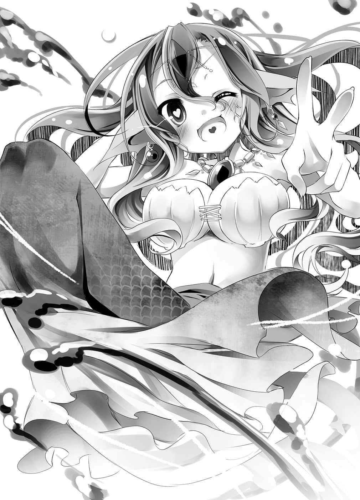
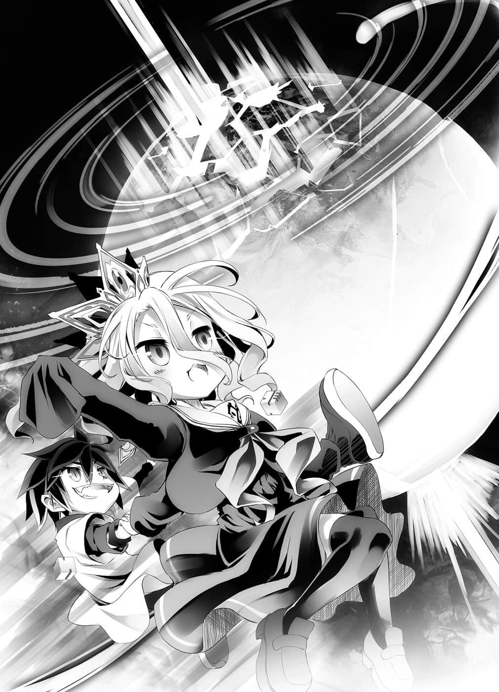
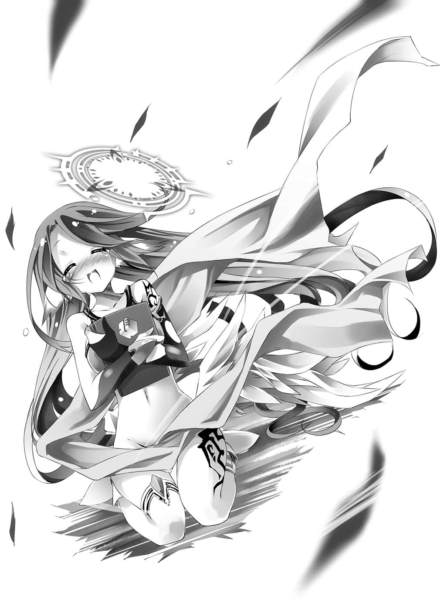

# 第二章 不正胜利

> 来源：https://www.linovelib.com/novel/9/2109.html

——东部联合首都・巫雁岛。

位于岛屿一隅的镇海探题府会客室里……

——一个难以名状，勉强可以说是人形，闪闪发光，骇人的怪异现象。

强壮结实的荧光肌肉——初濑伊野直挺挺地站在阳台上。

即使从神灵种战退场，变成了灵体——灵魂，他发光的缠腰布仍随风飘扬——

若拒绝直视那样奇怪的现象，往稀薄透明的前方看去——可以看见天上的螺旋大地。

而往后看则是——

「……真是的！到底发生什么事了……！」

「欸～克拉米～你就是因为那么急躁～才会长不高哦～」

恨恨地啧舌的是黑发的人类种，克拉米・杰尔。

纠缠着她的是——看起来像酒醉的森精种，菲尔・尼尔巴连。

趁巫女不在，前来逼迫进行游戏，要求赌上『东部联合』的两人吵吵闹闹。

「……话说，这个情况会持续到什么时候？我闲得发慌耶。」

这么说话的是吸血种少女——不，是外表宛如少女的少年，布拉姆・斯托卡。

由于他的介入，东部联合就算胜利也不得不交出活人供品。

无论胜败，没有牺牲就不会结束的状况——不管对设计的人，还是被设计的人而言都是如此。

他们都仰望着相同的天空，每人口中的不满与抱怨也都相同——

——————轰隆。

他们抱怨着不知已是第几次的『冲击』。

听觉可辨别领域外的声音、精灵的胎动震撼天地的同时……

非但如此——大概是庞大的精灵窜流，阻碍了术式吧。

与拥有神灵种阿尔特休和天翼种的最强最大阵营对峙。

响遍整个星球的那道声音，既非森精语，也不是地精语——不对，应该说什么语也不是。

从两天前起，超乎常轨的冲击，频频震撼东部联合。

『既没有优越的身体能力，也不会使用魔法，更没有长久的寿命——即使是那样的我们，仍然在这场大战中存活下来——那么「原因为何」呢。』

布拉姆和菲尔也没有来催促开始游戏，那么——

然而说话之人，明显是阿邦特・赫伊姆之外的——某人。

那是海栖种的女王——莱拉・罗蕾莱。

看到伊野终于从怨灵转变成喧闹鬼，千岁与克拉米发出悲鸣。

整座巫雁岛的灯光都消失——『停电』，笼罩在暗夜之中。

在那段期间，这群骗子所希望进行的潜入型电子游戏也无法使用。

但令人不解的是，所有听到那道声音的人，立刻就能明白其中的意思。

只见水从背包满溢出来，吵闹地随之出现的是——

那么，推测应该是某个能够借用幻想种阿邦特・赫伊姆这种存在的话语之人——

才这么想，菲尔突然露出即使在黑暗中也光辉灿烂的笑容。

————

当联合阵营的炮火如弹雨般洒下的时候——那道声音突然响彻四周。

「……又来了吗……」

「不过如果你想说我的胸围只够捏住的话，我可是会生气哦㊟！」

『我们能在这场大战存活下来是「为什么」。』

「————…………什么……」

庞大紊乱的精灵量，甚至造成街灯、蜡烛的熄灭。

「锵锵～～！达令在哪里～！？你心爱的莱拉从海底远道来爱你了哦～☆啊，当然那不是错字，而是名符其实『来爱你㊟』的意思❤」

换算成游戏时间，不满十五分钟的『宣誓』开始了。

众人看到她都哑然无语，心想——为什么海栖种女王会在这里？

「………………咿！克拉米对我好冷淡哦～呜呜。」

「欸～嘿～我心情很好哦～啊，我要享用下酒菜啰～♪」

——每当天上发出轰然巨响，巫雁岛就会重复停电与恢复的状况。

他抬头仰望应该是由神灵种的力量所造成的『双六盘』。

太强烈的精灵浊流，让她出现『精灵醉』的症状——不，那已经到了无法收拾的地步。

「要江千岁一等事务官……我应该有下令暂时谢绝所有的案件吧？」

——由于停电的关系，公共建设大概都停摆了吧。

——在天空画出螺旋状的大地，神灵种的『双六盘』。

但是在现实中，那个宣誓——仅仅在『三十二分之一秒』内就结束了。

而原本便是以巫社——神灵种的力量为动力的『电子游戏』固然不用说。

会客室的门被用力地打开，匆忙冲进来的女性这么喊道。

这次菲尔则是开始用脸颊磨蹭着克拉米，那个模样——只像是在发酒疯。

被菲尔抱住揉胸的克拉米，语气冰冷地继续说道：

有事情要发生……有件事即将发生，或者是另一个可能——

莱拉表示，她是在交通工具和电梯不断反覆瘫痪与恢复的状况下来此的。

那是有着栗鼠耳与尾巴——或许相当急迫吧，肩膀起伏不停喘气的兽人种女性——

「——怎么可能……那么，那个人究竟是谁————！？」

「克拉、克拉米～呜……克拉米讨厌我～呜、呜呜～」

——荧光肌肉男大声怒吼，五十层楼的建筑也为之震动。

听完千岁的报告，伊野轻轻地呼出一口气，然后——

（译注：日文见面的『见』和『爱』发音相同，只有汉字不同。）

——幻想种阿邦特・赫伊姆。

至于菲尔则是——

只要巫女能够在那段期间回来就没问题了，伊野在心中暗自祈祷。

这时就如熄火的炉子般冰冷，只有寂静与那道响起的声音。

没错——仿佛是想到另一个可能的人一般。

——是奥仙德吗？还是阿邦特・赫伊姆吗！？

虽然不确定发生了什么事。

『……我现在对那句话——深深感到羞耻。』

『我回答同胞们……因为我们是「弱者」。』

（译注：日文的『下酒菜』和『捏』的发音相同。）

每个人都有预感，都直觉地感受到——

原本粉碎天地的兵器与魔法交错四射的战场——

「喂！这个没办法治吗！？你们没有解酒药之类的东西吗！？」

不，不只是这个探题府，伊野叹一口气，往下俯视的街景全部——

「…………」

不——比起那种事——！！

伊野——不，不只是伊野，克拉米、精灵醉的菲尔……甚至布拉姆也是。

『因为是没有力量的弱者，所以我们胆小地思考逃跑的技术！！因为是无智的愚者，所以学习卑躬屈膝的生存之术！！经过连绵不断的思考与学习，我们靠着「智慧」存活下来了！！……我是这么回答的。』

『那终究只是愚者的妄想！我太欠缺想像力了！但如果是那样！要怎样才能想像到会有这种事呢！？没想到——啊啊，谁能想像会有那种事呢！竟然单纯只是——』

---

■ ■ ■

「……哦……菲，我不知道你是什么意思。」

——战场上鸦雀无声。

那是幻想种所发出的——『万能语言』。

「……呼。」

尽管受到克拉米等人的致死视线注目，千岁仍然坚毅地回答：

『过去——我曾经这么问我的同胞们。』

——既是森精种，又身为六重术者，过于优越的魔法适性，让她反受其害。

不理会愣在原地的众人，她朝四周东张西望后说道：

「下、下官明白！但、但是来宾说，在游戏开始之前，无论如何都要会面！」

「克拉米真是的～我知道的啦～克拉米最喜欢我了～❤」

……伊野过意不去的视线，观赏着对方上下摆动的丰满果实。

看到放下沉重背包的那个身影，他们都震惊地瞪大眼——停止思考。

镇海探题府的会客室里，照明全数熄灭，陷入一片黑暗。

「这次又是哪个混帐啊！？哪里的人渣背叛了啊！！」

「话说东部联合是怎么了！我在背包中待了两天耶——啊，是ｐｌａｙ吗？」

「初、初濑外务长官！恕、恕我打扰，有紧急案件！！」

「欸欸欸，真的哭了吗！？菲，菲！不管怎么说，你也醉得太过头啦——」

「没、没那种事！抱歉——不对，为什么我要道歉！？」

伊野在内心大吼，然后仰望上空——神灵种的双六盘。

不过对初濑伊野而言，那甚至可以说是『救赎』。

（……但愿这状况能持续下去……）

『因为你们太过无能了——根本超乎我的想像。』

——忽然间……

不管是谁都无所谓了，伊野甚至考虑忘掉一切，大开杀戒。

那就是——已经发生了。

宛如是为了证明那个想法，光芒大作，简直像要夺走天地的境界线般——

庞大的，无与伦比的『力量』放出——或者是解放。

只要是拥有精灵回廊连接神经之人，都一定可以理解那件事。

——而且完全没有怀疑的余地。

那就是战神，最强之神，神灵种阿尔特休——他的『神髓』消灭的证明。

发生什么事了——不，正在发生的是什么事？

就在谁也无法掌握的情况下，疑似讨伐战神的人继续往下说：

『你们并非愚者！是欠缺「思虑」；你们不是弱者！是不「学习」。于是我思考，那么应该如何称呼你们呢？……就连只有本能的野兽，都不会吼出夸耀自己聪明，那种令人听不下去的妄言，因此我思考……然后决定——就这样称呼你们。』

那就是——

『易于掌控到了可怜地步的——「家畜们」。』

然后以那道声音为信号——光芒再度大作。

『辛苦你们了，容我自我介绍。』

见到阿邦特・赫伊姆逐渐坠落的身影——每个人终于都理解了。

有个屠杀了最强的神灵种、天翼种以及幻想种的人——

自己被他利用了，而那个敌人，伴随着死亡的宣告，即将公开他的名字。

『「宣誓」要灭绝你们的就是我们——人类种。』

然后从逐渐坠落的阿邦特・赫伊姆，传来最后一句话。

——那句话尚未结束——

『好了，家畜们——舞动吧，在我的手掌上，做着以为自己能逃出的美梦。』

由于太过强大的力量互相冲突，爱莉叶拉大陆有一半葬送了。

---

■ ■ ■

「……而那个人……当然……不是自己对吧……♪」

换算成游戏内时间，那是发生不到两小时的事。

「……最大势力……天翼种不在……两大势力也……受创……」

「『色精』们因为想得到欧克而战的时候——是你中断了战争。」

投入『指令书』的空，与众人一起看着投影在虚空的『地图』。

「那只是『借口』，看吧，重头戏要开始了哦！」

没错，简单说就是——

没错，只是因为吉普莉尔——因为天翼种的势力而『中断』而已。

确实，他们原本是敌对的两个势力。

想要远距离操纵单位，进行首都移转，却不能把吉普莉尔留下。

这个短短不到『四分之一秒』，在刹那间发生的事情。

联合阵营——原来如此，那是森精种同盟与地精种同盟组成的共同战线。

不管是哪一边都没关系，或者该说那根本无关紧要，无论是谁都好。

……这个时候——

将阿邦特・赫伊姆的亡骸——『首都』周边的光景，投影至空中。

那么，若他们没有那么做，而是『有计划地运用』，把天翼种逼入绝境后，再将之击溃的话——

这个星球为何还能保留原形，愈来愈让人不解了……

这么一来会发生什么事——早已映在空他们的『地图』之上。

「……主、主人，可是这样的话，若『首都』遭到攻击，一下子就——」

空这么说完后，手指滑向『地图』。

又或许是想起那个『元凶』了，她冷眼看着空与白——

下达两个指示，那就是——单位自杀与单纯易懂的『传言』。

原本对峙的所有种族、所有单位，彼此使用的——『王牌』。

——是哪一边先开火的？

「……其实追溯源头，这本来是想要玩凌辱游戏，才莫名引发的战争吧。」

地精种的『髓爆』、幻想种的『坏放融界』、妖魔种的『始祖主转生』等等……

也许是忽然恢复冷静了……史蒂芙想到招致这个惨状的那个过于荒唐的动机。

赢得这次的战争后——如何赢得下一次的战争，才是他们思考的重点。

「只要碍事者消失，他们就会『继续战争』——他们彼此本来就是敌人吧。」

在消灭天翼种之前维持暂时的合作关系——

「哼，那才是我所认识的妖精，总觉得这个世界的森精种太过端庄了。所谓的妖精，应该是满脸汁液的高潮脸，发出『喔呵～』的呻吟才适合——」

就像这样，看着所有种族开始冲突的景象，空——露出带着最高轻蔑之意的笑容。

用吉普莉尔的『地图』、吉普莉尔的『指令书』、吉普莉尔的『投书箱』。

原本与阿邦特・赫伊姆对峙的『联合阵营』，全部被一个不剩地『歼灭』，看到这个事实，能够理解的只有两个人空和白。

「啊，对呀！？明明只要被察觉就会走投无路，为什么你还要报上名字！？」

森精种的『虚空第零加护』、龙精种的『崩哮』、妖精种的『堕落园』。

「……这种火力，甚至能创造出地狱最下层也不如的景色，他们却一直保留着。如果他们毫不保留地『集中使用』——我姑且问一下好了，天翼种的火力在这之上吗？」

「……哥……你同人本……看太多了……而且相当重口味……」

空他们与吉普莉尔的『首都』，已经化成抗拒一切的天然要塞。

起始于力量冲击而造成的死亡风暴，由于『灵骸之间的融合反应』，使得风暴如雷云般雷声隆隆。

只要对吉普莉尔的两个单位——《阿邦特・赫伊姆》与《阿尔特休》——

这已经没什么之上或之下了吧，空在内心附加这么一句。

就是『下一个被打倒对象』的抽选时间。

但是，双方都还保有一使用即会带来毁灭的战力。在相互保证破坏必能成立的状况下——

战争中的那些人，他们所想的不是如何赢得眼前的战争。

吉普莉尔终于从茫然自失的状态重新振作。听到她的声音，史蒂芙也肩头一震。

「主人……你们到底——做了什么呢！？」

「——来吧，看是要战到最后一人，还是直到一人不剩——好好打一场吧。」

当那些同时使用——一切就会化成尘烟。

没错——人类种的存在若是被察觉、受到查探，只要首都被发现，对方攻过来的话——在那个瞬间一切就结束了。

『天翼种』的单位已经一个不剩，主人亡故后，如今也无法生产单位——当然也不能转移首都。

只要有人进来就是被『压制』——他们会因为『首都陷落』而死亡，不过——

传言的意思就是——笨蛋们，快点重回杀戮吧。

从那之后开始了大规模战斗，而陷入消耗战的泥淖——

而这一点——事实上空他们也一样。

——那在空所知的原来世界的战史中，是常有之事。

——和原先预料的一样，只有空和白微微窃笑，眺望那幅光景。

化成死亡世界的『首都』周边——『人类种』也无法接近。

——让他们自相残杀了，这点道理吉普莉尔也明白吧。

然而，空只能带着苦笑回答。

「…………什么——……！」

没错——世界分成两大阵营的开端，就是妖魔种与森精种的战争。

「但是这时候——最强的神阿尔特休与幻想种阿邦特・赫伊姆被打倒了。」

两大阵营还有余力，而暂定敌人消失了，不管哪一边都会这么认为吧。

……空用一副无言到说不出感想的表情问道：

也就是说，这个『共同首都』——毫无武装，完全没有防备。

就这样『死亡风暴』——『灵骸』在阿邦特・赫伊姆的亡骸周围猛烈吹袭。

那么即使对「原本相信的背叛」感到疑虑，也只要附上一点根据就好了。

那么是哪一方，又要如何让他们发射呢？——吉普莉尔这么问道。

不管怎么说，那是连天翼种也可能瞬间被消灭的火力。

「……集战神阿尔特休与天翼种全力的——『神击』，最多也只能勉强抗衡吧。」

虽然受到史蒂芙的白眼，但是猛然书写『指令书』的元凶——空与白笑嘻嘻地继续说道：

——空他们与吉普莉尔的『共同首都阿邦特・赫伊姆』已经自我毁灭了。

因为打从一开始，双方就是处于确信会背叛的共同战斗关系。

——这样都还能抗衡啊？

「……我们什么也没做，做了什么的人……是吉普莉尔吧？」

因为那已经到了意义不明的地步，无法判别高下了，不过吉普莉尔却回答空：

「有人抢在己方之前，消灭了天翼种势力——有『叛徒』。」

但是对观看着事态发展的人们而言——

「也就是说，他们彼此都在观察对方，考虑的是打倒天翼种——『之后的事』。」

——比如说，没错，就像空做的那样。

每当出现闪电般的闪光，地壳就像遭到挖掘一样——

那么吉普莉尔发出惊叹的悲鸣问的是——如何做到的？

要让他们自相残杀的话，最低限度就是必须『有某一方先发动攻击』。

「——预备，开火！！……这样的号令♪」

「……他们原本的目的并不是吉普莉尔——天翼种。」

——『死亡风暴』，似乎是因为黑灰的相互作用，『灵骸』卷起蓝色闪耀的旋风现象。

「不会有人攻过来啦……」

粉碎天地的闪光已经开始互射——然后……

没错——打倒最强的敌人后。

空打断史蒂芙与吉普莉尔的话，如此断言道。

「因为他们会做什么，如何行动，走哪一条路径——我们全都知道。」

——没错，空与白知道。

谁会通过哪里，在何处战斗，于什么地方埋伏，攻击目标——这些他们全都了若指掌。

史蒂芙接连不断迅速地被交付『指令书』，为了投书而全速往返，听到空的话之后，她讶异地歪着头感到疑惑——不过，吉普莉尔或许是察觉那个做法了吧，她睁大了眼，呻吟着说：

「主人……怎么那样……您该不会是要——！？」

虽说是空与白在操纵——但『地图』详细到不自然的程度。

「没错，首先就是那个——布拉姆的祖先们真是可靠呢♪」

「布拉姆的祖先……！？你们拉拢了吸血种吗！？」

听到吉普莉尔与史蒂芙有如精神异常的悲鸣，空仍笑著书写。

——能够『外交』的种族很少，更不用说要取得协助了。

但是至少——在开始输之前，也有能够确实得到协助的种族。

即便察觉人类种的存在，但是因为毫无价值，所以完全无视人类种的种族。

然而只要拥有空他们的情报，就能将那个情报做最大的利用，避过战祸，渔翁得利。

——森精种、地精种，不管要吸哪一个种族的血都任君挑选——一个可靠的种族。

「只要拥有吸血种送来的情报，战局已经等同完全透明了，而且——」

敌人的情报摊在眼前——等于一切都在掌握之中。

在这样的情况下，就可以轻松预测『对方会如何行动』。

原因很简单，因为——

「他们的战术理论和战斗方法——全～～部都是我们教的♪」

被史蒂芙抓住前襟，空狼狈地指着『地图』。

这样顺便也切断了，能够从森精种领土进攻的陆地路线。

巨人种和月咏种——动态不明的种族会如何介入，这完全无法想像。

白这么说的同时——这次则是逼近的森精种军团被消灭了。

「很简单，只要在有小孩的森精种面前，带着她的孩子，然后『这样』说！」

「不、不是不是！！那么糟糕的手法，我和白怎么可能会用呢，你看！！」

利用吸血种得到庞大且精密的情报。

——不，他就像朗读『历史书』一般，平淡地喃喃念道。

「……不过，这次是……地精种……胜利。」

空一揭开如同自己的身体般，「经过浓缩」的残忍做法，立刻遭到史蒂芙痛骂。

在原本的世界，不管是怎样的战术理论，都没有预设对手是怪物，那么——

史蒂芙忍不住停下为投书而往返的脚步，发出焦躁的悲鸣。

所以——空他们才刻意教会他们。

即便空与白再怎么神通广大……要预测『大战』的一切是『不可能』的。

——只要有一个致命的判断误差。

不过，关于武器或技术的『运用法』……他们实在笨拙得令人摇头。

——只要有一个致命的指示错误。

「再说，所有的战术都是以用在『同等的对手』为前提。」

「……地精种在、山岳地带……无法活用机动力……投入战力损失、四十二・七％。」

对于个体性能优越的森精种，给予以混合部队编组的柔软风格纵深式防御。

「而森精种方面剩余五个师团，继续行军，得到『战术性的胜利』——」

只见大量的森精种军团，正往空他们让兽人种建造的城市进军。

空书写『指令书』的手仍不停下，他平淡地继续说明：

「因为那是我们让他们用的。」

——外行人——在得到『半吊子的知识』。

史蒂芙和吉普莉尔惊讶得说不出话来，只有空与白露出得意的笑容。

「哎～呀～是这样啊❤我要订正刚才的说法——你根本禽兽不如！！」

一百八十四年之间，布下重重谋略，空用骗术，逐渐将战局与动线转变为『确定事项』。

外行人不照理论，完全发挥蛮力的行动，那种行动才最难预测。

吉普莉尔的脸颊与额头上浮现汗珠，她在心中暗想：

「这么直接！？」

战况胶着——逐渐进入消耗战的『地图』上，必然地——

空与白看也不看一眼，书写着『指令书』，仿佛朗读预言书一般。

史蒂芙或许已经没有力气吐槽了吧，她放弃争辩，回去继续投递指令书。

只要将矛与盾事先交给双方——就会变成这样。

「Ｂ. Ｔ. －负２年８月５日，粮食问题日益严重，森精种为确保农产地而行动。」

史蒂芙听了愣住，获得解放的空，回到桌子上继续说道：

「但却是以『战略性的败北』告终，因为——」

——一切就掌握在手心上了。

「…………掌握食物者……即可掌握世界……！」

「……因为『虚空第零加护』引爆，剩下的五个师团也会消灭。」

更别提面对这样的怪物们，人类就算集合地球所有的武器，也无法与之一战。

「——给『同等的家伙们』使用才会有价值啊。」

主人们一定连那些都计算在内了吧，就连无法预测的都预测到了吧——但是——

对于机甲兵器优越的地精种，给予陆空的渗透战术、闪电战教义。

就这样，一切都在他们的小手掌握之中。看到空与白的身影——

就这样，两人残忍地——不过也开心无比地继续说道：

「……真是让人说不出话的恶魔行为……」

「『只要抵抗就杀死小孩♪』——只要这样！就可以得到一名傀儡了！」

「你提供粮食给兽人种，该不会就是为了这个目的吧！？」

「还会继续死哦～……不管是人，或不是人的种族，都会大量地死亡。」

「兽人种把森精种抓来的这一段成功了——对吧？」

更何况无论编织出再高明的战略，再怎么精密计算，还是会发生无法预测的事态。

但是——宛如无视怒不可遏的史蒂芙一般。

——制造出不让其使用魔法，也不能抵抗的状况——那种方法。

现在有一个部队的行军目标，正企图掠夺如今已是世界最大的谷仓地带——

——这个世界，不，应该说大战时这个时代的人们吧。

「……没错，让他们确实地陷入泥沼战，对吧？」

于天空飞行的战舰——因为空他们将海战理论中，所有能用在空战的战术理论，全部泄漏给地精种。

「……同样的目的，地精种……在同一个山岳迎击……交战九日。」

仅仅只是那样，『首都』马上会被发现，等在前方的就是不由分说的——『死亡』。

「那是世界有名的粮食产地，而且花费一世纪才建好，哪能那么简单就让他们攻下啊。」

「要让他们为了粮食，再互相厮杀一阵子——我说过了吧？」

只见映出北部山岳的画面上，森精种的军团忽然间——连同周围的地形——山岳，一起完全消失，看到那个情况，空邪恶地笑了。

「……是、是啊……啊！这么说来，『那个方法』我还没听你说过哦——！？」

——连续的全面开战与消耗战，会使粮食开始不足，这是再明白不过的道理。

——但是那样就伤脑筋了，空小声地窃笑。

「最后能胜出，且有余裕理会人类种的会是谁呢～？」

他们确实很惊人——拥有现代地球也比不上的技术与武器。

没有武器、技术的配合，那就没有价值，再加上『临阵磨枪』学会的理论也不值得依靠。

……然而就算拥有那些超常技术，对上的敌人也是超乎常理。

然而『空战』对拥有空中战舰的地精种而言，则是他们最擅长的战场。

一百八十四年之间，观察所有种族的动向，白以数学方式『预测』战局与动线。

——在『地图』之上，有光芒闪动。

空散发出稚气的纯真，露出有如太阳般的笑容，公布答案。

「喂，空！？兽人种的城市——那里要被袭击了哦！？」

看到主人们那样的身影。

————…………

听到空若无其事地说出这句荒唐无稽的话，不管是史蒂芙还是吉普莉尔都僵住了。

「主人……为什么『虚空第零加护森精种的武器』会攻击森精种——！？」

「……互相残杀吧……♪」

「……所以才……让他们建造城市……」

——『地图』映出陆路的进攻路线被切断后，森精种这次改从空路进攻的情况。

森精种的武器被用在森精种自己身上，这个谜题令吉普莉尔发出悲鸣。

书写『指令书』的手不停，空心里想到：

听空这么说着，史蒂芙和吉普莉尔都愣在原地。

「真是人渣！！」

——现代战术理论对人类种而言……是无用的长物。

「虽然把森精种变成『色精』拉拢至我方的计划失败……不过——」

「我、我们解放被迫引爆『虚空第零加护』的森精种！让她将兽人种对自己做的事情，一五一十地报告出来——我可是设计好，确实地引他们前来报复哦！！」

如此说道的空与白一同勾起一抹令人不舒服的笑意，同时——

「咦？啊～对啊，我们早就知道会这样。」

「带着四只龙精种的七个混合师团，从北部的山岳，企图压制农业都市。」

……山岳地形——在『极地战』上，地精种的机动战无用武之地。

难以确立有效的战术，偏向于人海、物量、火力战也属很正常的事。

挥动他们『临阵磨利的枪』时。

这些事他们两人一定比谁都清楚吧，然而两人却勇敢地——笑了。

没错——只要由我方教他们『如何行动』就好了。

极为轻松，非常容易，和呼吸一样简单的那个方法。

「哈哈！！这样还有人输得比我们惨的话——那个人的脑子就不妙了吧！？」

「……白……现在已经……不妙了……」

过去曾有过这么惨烈艰困的游戏吗？

毫无疑问，这是史无前例最高难度的游戏。看着欢笑的两人——

吉普莉尔不安地低下头，用颤抖的手，紧紧抱住日记。

————…………

「……啊啊……世界逐渐毁灭了。」

然后忙碌地往返投书的史蒂芙，如此喃喃说道。

投影在空中的是迈向死亡的星球，消散而逝的棋子，逐渐毁灭的世界——不过……

「对，会毁灭，这种发霉的『定理世界』——就让它继续毁灭吧。」

空这么说完，停下书写『指令书』的手，望向『地图』。

……迈向死亡的星球——曾经有一个时代，那就是现实。

……消散而逝的棋子——曾经有一个时代，那就是人命。

威胁、拐骗、杀戮、切割、利用、欺骗、背叛、折磨——

空使用一切手段，不管是肮脏的手法还是诈骗，只要不败露，甚至也不算违法——但是……

「……不择手段与牺牲——那种事谁都办得到。」

没错，那很简单，证据就是无论哪一个世界，大家一直以来都是这么做。

像那样不断累积牺牲，到最后——追求的究竟是什么？

是自己灭亡，还是只有自己生存，或者每个人都毁灭——那样的结局值得如此追求吗？

空不明白那样做的意义——他觉得自己永远也无法明白……

神灵种所映出的空等人——开始逐渐被逼入绝境，脸上也出现焦虑之色。

破解无论做什么都会伴随牺牲的『定理』——通往那个尽头的『布局』。

过去曾有一个人——嗤笑谁都办得到的愚蠢手段。

「还能怎么办！这是意料之内的意外同时发生了啊！」

『过去两人』所追求，从来未曾实现，接着通往『未来两人』——连绵不断地延续着……

世界变得如何了——？

或许是刚才的冲击，让她脚步不稳而跌倒了吧，史蒂芙流着泪大叫道。

——那样真的好吗？

---

■ ■ ■

「……特图，伊纲说你是骗子，得斯……原谅伊纲，得斯。」

创造并改变世界的特图——他接着这么说了。

就这样，地图回到游戏开始时那般黑漆漆一片，现在映出的是如今也正消失中的——仅存的少许『人类种』与『都市』的景况。

「世界已经变成连那种任性也能实现——也有可能实现的世界了。」

在遥远的过去，那一日手持『星杯』，颁布『十条盟约』之日。

（译注：这个术语主要是在描述故事进展时使用，是指无视故事之前立下的旗标，强制添加设定，以及操纵过度的偶然等手法，以达到方便作者推进故事剧情的目的。）

但如今却回到什么也映不出的一片漆黑——比起任何雄辩，这更如实显示出目前的战况。

那两人空与白一定不会犯下与那两人里克与休比相同的错误——

——假如为了世界非死不可的话。

因为，那应该是——他们已经为后人而破坏的世界……

「…………唔……本来……有自信的说……！」

「不过我们本来就知道这是不可能赢的游戏！在这样的条件下才好玩啊，对吧——！！」

空与白不像那两人——『那么强』——所以她才能安心。

也就是代表，距离经过七十二小时时限——还剩二十八分钟这个事实。

我说『你』啊。

伊纲坐在第三百零八格的地上，眺望着那个战局。

——没想到有这种御都合主义㊟的世界幻想啊。

——传来的冲击，打断了空加速的思考。

——经过七十小时。

投影的『地图』显示出——『Ｂ. Ｔ. －负53年』的时间标示。

自己曾经半放弃了，以为『这个世界』或许没有的那个『方法』——

空与白是和那两人相似——不过果然只有一点像。

伊纲垂着长耳朵，低头鞠躬道歉，心里想着。

贯穿极近处的光芒，使地壳上升至平流层，将其蒸发——然后……

直到十五小时前，『地图』还将世界映得明亮清晰，显示着战况的演变。

那么伟大的人类那家伙令青年自惭形秽，但是如今，青年是这么想的：

那么为这种老旧的『定理世界』宣告死亡，才是唯一能做到的感谢方式吧。

空与白压抑着焦躁，脸上勉强露出笑容，手上持续书写。

——你说对吧……不知名的某人……

该如何回答，要如何到达终点才好——伊纲还是不知道。

——遮蔽『首都阿邦特・赫伊姆』的『死亡风暴』受到吹拂——被剥离了。

终结过去的大战，与空和白有点相似的两人。

然后伊纲在神灵种既无感情也无情绪波动的脸上，看到些微的动摇。

那家伙……——不。

但是，即使如此，直觉仍是断定——伊纲没有做错。

那一日，听说了十条规则，站在能够远望巨大西洋棋子的土地上。

---

■ ■ ■

伊纲在记忆中不管搜寻多少次，他都确实地这么说了。

但是『两人』也还不够——那么连同『一切世界』一起胜利的方法又是什么？

「……测试不可能赢的游戏……能玩到什么地步……这就是挑战精神～」

——『为什么我会这么不甘心呢……』

空与白喊叫着回答，一边猛然地振笔疾书——一边瞪着『地图』。

数个种族灭亡，世界、星球已毁坏至无可挽回的地步。

——情报不足的种族无法完全预测动向，这是早就知道的事。

『月咏种』——大战时已经居住在红月上，最缺乏其情报的家伙介入了。

既没有能够调动的单位，也没有可间接引导的种族。

————…………

至今无人得到——甚至那两人空与白也尚未得到的——仅仅一胜。

这个完全无法预测的变数，招致原来是战略主轴的森精种与地精种，两个种族的灭亡。

对于这个问题——『一人』胜利也没有意义——那一日他曾经这么嘲笑过。

对于达成非凡功业的那两人，他们的姐姐克珑说过：

因月球落下而被击穿的天空，不管是吸血种还是『斥候』都被剧变的天地压碎、溃灭。

仿佛回答那个问题一般，手持『星杯』的特图说道：

仿佛未被讲述的神话败北，最终延续至被讲述的神话胜利一般……

「——不会有人死，也不让任何人死，不管是吉普莉尔、我们，或是任何一个人——」

将无限持续的败北，转变为有意义的败北，一笔勾销的——一胜。

过去的少年——黑发黑眼的青年，牵起妹妹的手，脸上绽放笑容。

——终于找到了。

——『信任为何』。

然后仿佛在找寻什么，又像是在追赶一般，只有少量的敌人单位，朝着褪去『死亡风暴』后的——空他们的『首都』缩小包围。

不过眺望着他们的伊纲，已经不再感到不安——她只是想起特图曾对自己说过的——不曾被他人讲述的古老故事。

虽是御都合主义，却是某人挑战自己所逃避的难关，付出他的一切才得到的——那种御都合主义……叫人能相信吗？

在遥远的过去，游戏——并不是开始。

在加速的思考中，过去的少年想起。

——回答她的只有沉默，伊纲再度看向投影的光景。

「喂！这要怎么办要怎么办啊～～！？」

可是——偏偏是这个种族，空不禁暗自咬牙。

他喜悦，却同时苦笑，然而——那并非一般的御都合主义。

看到世界逐渐毁灭的景象——伊纲笑着心想『所以那样就行了』。

而是早已开始——只是持续着而已。

「你死的话就赢不了了，得斯！伊纲相信绝对不是那样，得斯！」

因为在这里有——『十条盟约方法』。

甚至不容许任何一个牺牲的人——空望向吉普莉尔，露出笑容。

自己究竟会如何做呢？——他想起思考这个问题的那一天。

如果没有盟约和大战结束的事实，他对这件事可能会嗤之以鼻，付之一笑吧。

「……抱歉，得斯，因为伊纲头脑不好……无法回答你，得斯。」

——『……因为游戏还没结束啊。』

——『好了——「继续」游戏吧。』

我实在……不那么认为啊……

——最终直到『谁也不会被牺牲的一胜』。

【………………】

在几乎已经无计可施的状况下。

「『这个世界』是——游戏，已经变成游戏了。」

——不过，在『那个世界』却有那个方法。

「……主人，已经足够了，请下『命令』吧——」

吉普莉尔低下头，这么轻声说道——但是空与白打断她的话，即刻回答：

「吵死了♪」

「……吉普莉尔，坐下❤」

随着吉普莉尔被强制正座之后——

「唔喔喔喔喔！？刚才闪了一下！喂！！闪了一下哦！！」

或许是在听觉可辨别领域之外吧——连声音都无法听见的极近距离爆炸。

只有光与冲击，以及往返『投书箱』的史蒂芙在奔走。

「……这样下去，主人们——附带连小多都会死……」

「到了这个地步还被当成附带品，我真的要哭了哦！！」

唯一不明白状况的是史蒂芙，她陪着空他们与吉普莉尔冒险，赌上性命奔走。

她那无比的慈爱与善良，即便是空和白也感动得颤抖——

「请命令我『交出骰子后去死』——！！」

吉普莉尔带着哭声的悲鸣，震动了大厅。

那道声音让史蒂芙愣住，而她接下来说出的话，则是令史蒂芙怀疑是否听错了。

「……我很害怕……请……放过我吧……！」

吉普莉尔就像颤抖恳求一般，抱着日记，泪湿了地面。

对于她那个模样，空与白并不回应，史蒂芙也只能无语。

——回应的只有寂静……然后——

——————轰。

——交出骰子就会失去记忆——那样就无法自杀了。

————七十一小时四十五分。

「那对不肖的仆人是过分的光荣……请考虑您的立场。」

「那你就该像是我们的所有物！！好好地、确实地——当个逊咖啊！！」

——是的，确实除此之外也有留下其他事物。

然后史蒂芙尽管困惑，仍投妥了『指令书』——同时——

看了白交给他的算式一眼，空立刻心有灵犀地理解，他一边动着笔，一边呐喊。

令人确实地感到『死亡』逼近的冲击，让史蒂芙的肩膀一颤。在这个情况下——

留下了泪眼汪汪的白，恐惧奔跑的史蒂芙，以及低着头的吉普莉尔的未来——？

——下一次……下一次一定。

「我们不想死！！也不想让你死！！不想失去记忆，也不想让你失去记忆！！『所以请救救我们』！！失败的话大家就一起死——『即使如此还是不想那样』是吗！！」

——『当事人又是怎么想的呢』——！？

接着吉普莉尔递出胸前的九颗骰子说道：

——啊，难怪快流出来了，可恶啊！空在内心吼道。

「——那样耍帅能留下什么？给我说说看啊！？」

做着那种荒唐无稽的梦，并且还付诸实行的天文学级大笨蛋！

————

很不可思议地，空与白不知为何——仿佛先前看过了一般，他们能够确信。

立志要不牺牲一人，改变受战火灼烧，陷入绝望的『大战世界』。

「……可、可是！再这样下去，要是『首都』陷落的话——！」

想终结大战！？想拯救世界！？绝对不是！！

————但是——！

只不过是靠状况推测，然后再进一步推测而已。不过——

————七十一小时五十一分。

只要那样，这个游戏——这个由吉普莉尔擅自开始的死亡游戏就会结束。

不过那也仅只一瞬，他们马上又回头书写『指令书』——并且继续大吼：

空打断吉普莉尔的话，他的声音比破坏的冲击，更锐利地震撼大厅。

直到临死之前仍说着这种话——曾经有这么一个『超帅气的家伙玩家』。

「然后呢！说着『吉普莉尔，我不会让你的牺牲白费』这样的话，流下男儿泪——非要这样对自己说谎才叫帅气吗！？那样的人实在太帅了，要我怎样都没问题，所以顺便回答我一个疑问吧！？」

「主人们没有必要死，让我一个人死就——」

那是刻意暴露位置，吸引敌人的注意，在都市连同地图标示一起消失的情况下。

——人类种的一座都市——确确实实地消灭了。

空将新的『指令书』一甩，交给史蒂芙。

那样的神级玩家大人，不惜做到那种地步——他到底想做什么！？

已经称不上是大陆的大地崩毁，剩下的都市只有一个，『人类种』单位剩一百七十七个。

「……天翼种并不畏惧死亡，请下『命令』……」

这都是我吉普莉尔不好，主人没有错——『可是但是』。

因此，身为空他们的所有物，吉普莉尔就需要强制的命令。

那家伙确实留下了名为『十条盟约』的——『布局』。

即使如此——空与白仍心想：

「我们哪能那么『坚强』啊——谁要帅气地活着啊！！」

「稍微仿效一下你的主人们，丢脸地大哭大闹就好了吧！！」

「你以为你是谁啊！吉普莉尔！？你的主人是谁啊！？」

「死一个人就好！？不管一还是三，亿还是兆都一样，我才不管！！」

除了首都，只剩下两个都市，其中一个用来做为诱饵——经过仅仅数分钟，游戏时间还拖延不到五十天，敌人再度逼近。

空停下为了减轻恐惧而持续的吼叫——深吸一口气。

那是让敌人自身的攻击，引爆从已灭亡的地精种掳获而来的『髓爆』所造成。

————七十一小时四十九分。

——怒气沸腾的眼神，令史蒂芙和吉普莉尔不禁抽了一口气。

空仿佛是对那些帅气满点的主角们提出疑问一般——大喊：

她满足地这么说完后，脸上浮现笑容——

——那是不可能的事啊——！！

然后一句话驳回吉普莉尔的恳求。

他说这句话的语气毅然决然——不过却在颤抖。

「没错吧！？如果要帅的话，这时候我应该要赢过吉普莉尔对吧！？」

下次一定要创造不必有人牺牲——一切以游戏决定的世界。

以小声且平静的声音说道：

……根本没什么根据。

然后，空与白终于停笔回过头——只见他们的表情……

「……就做自己吧……？」

「我也是没有女友的历史＝年龄，且持续更新中，不知朋友为何物，特技只有说谎的阿宅游戏玩家大人哦！就算跟我说人类是能够改变的生物，但是水蚤不会变成鲸鱼啊！再怎么进化也有个限度吧！！——既然如此！！」

不想给人添麻烦，想要赢，不行的话宁愿死——『但是』？

吉普莉尔缓慢地说着，一边擦拭眼泪，一边像是在压抑心情一般。

只有这个办法，所以请主人至少连我的份一起活下去——这样吗！！

——那个帅气的神级玩家——『失败』了啊。

在想要到达那种『定局』的另一侧——做着这种愚不可及的梦。

然后吉普莉尔仿佛在强忍眼角的泪水般，露出痛苦的表情。

「不是全得就是全失，而且我也不会道歉。」

「吵死人了！？你给我闭嘴！你这样我会分心啊！！」

人类首屈一指，高贵无比的大笨蛋会为了那么『聪明』的理由行动？

那样的功业当然很惊人，我们丝毫不觉得自己能做到，但是——

但对于吉普莉尔的提醒，空用心虚的语气，白则是哭泣的表情——喊叫着以疑问句回答。

「那那、那时候的事！到时候再说！？」

「你爽快地以死逃避！留下这些悲伤哭泣的家伙！！还有背负着你的罪孽活下去的处男——那是什么结果啊！？我实在搞不懂，想到快发烧了喔！？」

「……哥……你最后一次上厕所……是什么时候……！？」

空这么呐喊，因为他的『指令书』——又有一个都市被光贯穿而消失。

「……又不会……陷落……吗？」

——因为恐惧失去记忆所以想死——『可是』？

不管是空、白还是史蒂芙，不，最坏的情况——参加神灵种战游戏的全员都会受到连累。

以世界为对手，挑战、挣扎、奋斗——即使如此仍无法达成。

「……明知主人们是为了我，才会下了这个危险的赌注……我还是要对主人们说——」

空与白的手仍不停止——只是心想：

不过，这一次是——『连同攻击的「敌人」也一起同归于尽』——的消失。

「——————！」

「你很害怕所以叫我们让你死！？你说你不怕死？吵死人了！！我可是怕死怕到别说是小便，甚至更糟糕的东西都快流出来了哦！！」

「少在那里啰里啰嗦！！简单说你就是想耍帅对吧！！」

对于终结大战，创造『十条盟约』契机的伟人，虽然很冒犯，但是不管说几次都可以！那位伟人——『失败』了啊——！！

「……既然你是……阿宅……尼特族游戏玩家的……所有物……！」

空与白持续书写指令——尽管发出怒吼，声音却在颤抖——

手虽然与白紧紧相握——但是脚却在地上抖动。

打破漫长沉默的是——再度窜过的闪光与冲击。

……过去曾有个非比寻常的笨蛋，把这样的『大战地狱』，当作游戏。

兄妹相视一笑——这才是自己啊。

不想死，也不希望别人死——更不想后悔。

什么都不愿意，拒绝了一切而来到这里迪司博德。

「万一——虽然那是不可能的，不过万一要死的时候，就全员一起死吧♪」

「……所以……你就放弃抵抗……做好觉悟，至少……」

两个小孩空与白爽快地说出这样的任性言论，就连耍赖的小孩都要自叹不如。

「我们就快乐地玩到最后吧！！这么刺激的游戏——可不常见哦！！」

仿佛回应空的笑容一般，又有一个都市带着敌人一起消灭了。

在自国领土内使用核子武器——也就是通称『贝尔卡式国防术㊟』——不，那已经是玉石具焚的『自爆』了，就连那样的手段也使出来——

（译注：源自于空战奇兵５或零，即是指在自国领土内使用核子武器。）

●——剩下五分四十二秒。

但是吉普莉尔仍低着头喃喃自语，只有史蒂芙听见她说的话。

「……即使如此……还是我的错……」

「嗯～……不……只是那两个人的脑袋不正常而已啦……大概。」

听到她这么说，吉普莉尔抬起头，不过看到的却是史蒂芙的——笑容。

「与其牺牲某个人，『不如全员一起死』，虽然是令人头痛的谬论，不过——」

史蒂芙脸上虽然是一副被他们打败的笑容，但爽朗地这么说完后，她再次开始奔走。

「——所以不会让任何人牺牲！这样的谬论，希望他们无论如何要贯彻到底！！」

将接过的『指令书』投入——

●——七十一小时五十八分。

然后无视众人的惊愕——见到『地图』上瞬间映出的单位身影。

●————七十二小时。

「……也不想……再后悔而死了……」

忽地，空看到在身旁露出苦涩表情，抓着头烦恼的妹妹——突然间——

那一定是错觉吧——……

空与白露出狰狞的笑容——「两人同时在一张『指令书』上」书写。

——压缩了一整个星球的空间被解放开来。

不管是逼近的大批敌军，甚至是龙精种的『崩哮』，全都尽归于『无』。

同时——

更何况根本也想不到任何『有效的手段』。

空与白这么喊道，原本无意中放开的手——重新紧紧握起。

——如果我们做不到的事，你们做到了的话，那么放心吧。

——随之而来是掩盖两人的声音，不偏不倚的——『直接命中』。

先前扭曲的物理法则，仿佛恢复记忆一般。

——『……又要失败了吗？』

但是——紧握的手感受到回应的触感——看到白的笑容，空心想：

——然后，空与白再次将目光移向虚无缥缈的轮廓，对他们露出笑容。

当那些敌军踏入『首都』的瞬间，每个人都产生要结束的确信。

「……………………！」

——接下来，你们没做到的事——我们会一肩承担。

「……光束扫射㊟……——！！」

不知为何——空感觉能够了解那个人的想法，仿佛他不是别人一般。

宛如从卫星轨道发射的炮击，从正上方贯穿『首都』的冲击发出巨响。

简单说，就是——『直觉』。

「……不知道……不过我想如果是机凯种……就会这么做……」

那个人只是单纯——想看到笑容而已。

他只是——『不喜欢』……如此而已。

「……不要……多管闲事……！！」

「但是我绝不会犯下和你相同的失败————！！」

的笑容——……

逼近首都的是一只格外巨大的龙精种，以及其率领的——大群杂鱼单位。

星球被崩毁的光芒笼罩，史蒂芙问『那到底是什么』。

即使如此——正当两人仍在寻找突破点，思考无限加速的时候……

空与白这么说完之后，回应的却是——啪哩的声音。

——终结『大战』的那个人类玩家，目的到底是什么呢？

●————七十一小时五十九分五十九秒。

过度加速的思考，与情报连结成抽象的影像——也就是看到错觉了。

之所以会演变成『终结大战』如此壮阔的——『手段』，那是因为——

在遇见他们之前，对她而言只是词语的这些感情，在心中激动地汹涌翻搅。

用智慧型手机确认时间的空与白，丝毫不感愧疚地回答：

加速至极限的思考，仿佛让无色无声的视野，甚至能辨识首都之外——每秒八小时——等于是三万倍速的景象。

「我命令单位把首都的座标告诉机凯种，要他们——『试着结束吧』♪」

就在思考无止境地加速之中。

两人百感交集写下的『指令书』，被史蒂芙投递了之后……

逃离『那个世界』后，来到的是——如此为他们量身订做的世界。

那是让天地发出悲鸣，垂直——贯穿行星的强力光束。

视界中奔窜的裂缝——以及连贯穿星球的力量也无法比拟的冲击。

……那个人一定是——不，他果然对世界毫不在意。

可是白却不知道该让它如何行动——于是空代替白下达『指示』。

强迫自己的主人们做这种事，那是万死也难辞其咎的大不敬之罪——不。

「……呼～～～～哈啊啊啊……嗯……」

「哈哈————！！让你们见识拉普达雷电

——「……是啊，或许会失败吧。」

如今她理解到，就连这样的思考也是最严重的侮辱后……便连谢罪都不在选项内了。

不管是重力或是时间都停止的白色空间里，只有四个人在其中飘荡。

看着充满焦躁与不安，咬着指甲的妹妹——白的表情，空想到。

自我厌恶、愧疚、不成熟、思虑浅薄——

听了空与白所说的话，吉普莉尔思考该说什么——却什么也想不到。

空与白一同抬头，见到眼前的景象，他们异常冷静地露出苦笑。

——剩下的单位数为十九，都市只剩『首都』，已经无计可施。

只见如影子般昏暗的两个轮廓——看不清楚面貌……他们分开站立。

「既然白那么认为，应该就是那样吧，所以虽然我也不知道，不过总之……」

（编注：出自动画「风之谷」。）

「…………」

那么——自己究竟该露出怎样的表情才好呢——

他只是——『选择随性而活』……如此而已。

其中两人——牵着手露出笑容。

两人这么说着，眼中所见的——影子们微微笑了。

白愿意握住这双染红的手——自己却没能为她做任何事。

——空的脑海里闪过无数的影像。

「我们约定过了……绝不会再放手——」

——那样的……某个人——

若不是空间与外界隔绝，『玩家空间』只怕会连粒子也不剩吧——

那是——不愿想起，却又不容忘记的记忆。

某个人的声音这么问——但是那道声音感觉是从正面传来。

空确信只要那个龙精种的嘴一开，刹那间对方就会蜂拥而入——

---

■ ■ ■

空与白对着阿邦特・赫伊姆的亡骸——『首都』，开心地各自喊出『想说上一次的台词』第五名和第八名。

空与白虽仍拼命在找寻对策——不过他们的手已经停下。

——如果是在这里的话，这次绝对——若在这里还是不行，那就无处可去了——让他们如此追求的目标。

「……空、白！——你们到底下了什么指示！？」

就这样，空与白将双方——『都不知道完整内容』的『指令书』匆匆写完——抛给史蒂芙。

如果不管世界死活，抛下一切逃走——她就不会露出笑容——

忽地——

空解答他对『人类种』下的命令。

空这么回答——

那一瞬间映出的单位，空完全无法预测其动向——白将之『指定』为『机凯种』。

空仿佛连灵魂都要吐出一般叹了一口长气。

如今已经不必看『地图』都能看见『敌人』接近了。

（编注：出自动画「天空之城」。）

「嗯……还满好玩的，吉普莉尔同学，你勉强算及格了。」

空这么说着，像是吃了黄莲一般，勉强露出笑容。

「……你竟然提出只能输的游戏，在那一刻起——我们就完全失败了。」

「……玩得很尽兴……不过下次会是……我们的完全胜利……」

白也相同，丝毫没有要责备或追究的样子。

「——你能让『 空白』初尝败绩，算你厉害——但是你要有觉悟。」

他们只是纯粹地——没错……

「百次、千次——你别以为大输个一万次就能了事哦！」

他们的表情中纯粹只有败北的不甘心。

两位主人嘴上还是十分逞强，丝毫不肯认输。

但是吉普莉尔打心底不明白他们在说什么……不禁愣在原地。

——『完全失败』？——『败绩』？

他们两人到底在说什么呢？

原本应该会是最后的……而且变成最差劲的游戏。

主人们非但没让它成为最后，甚至转变成最棒的游戏，还对这样的自己说——再来玩吧。

——即使得到『胜利所远远不及的败北』，输了还是输了，看到他们不甘心的模样，吉普莉尔似乎终于明白了，首先应该说出哪一句话，浮现哪一种表情。

「……感谢主人，吉普莉尔愧不敢当……」

随着涌上的感情这么说完后——她想起主人的话。

——『如果你看了觉得满意的话，请打赏我们「两颗骰子」哦♪』

因课题未达成而失去骰子的话，三人中就会有两人消失——

——除了空与白之外。

直到刚才还高高在上地伫立着的神灵种——已经不在。

「唔呣唔呣……真不爽，得斯……这时最好就是快点吃完饭睡觉，得斯。」

---

■ ■ ■

「……咦？这里是哪里呢？」

只考虑了零秒，她立刻把书翻至背面，上面写着——

「……嗯……嗯～算了，虽然不太清楚……」

伊纲还是不知道该怎么做——不过……

——会有更快乐的事发生。

不过那已成过去式了。

因为他们知道——伊纲所不知道的……这个游戏的获胜方法。

——即使输给空与白，不可思议地心情并不觉得讨厌。

天翼种不需要保护眼球，更别说应该也没有那样的感情——

还是即使无视那些到达终点——也只会造成那个神灵种死亡这件事。

「………………真令人火大，得斯。」

————【经过七十二小时——课题视为未达成。】

吉普莉尔毫无根据地，珍爱地抱着那本书，宛如歌唱一般地——笑了。

——『别担心，等着吧。』

「唔～～吃饱了，得斯。睡觉了！得斯！」

胸前飘浮着一个白色立方体，周围则是螺旋状的陌生大地。

——『像你这样的笨蛋，看封底就足够了。』

她正想要站起来，却发现端坐的膝上，放着一本书。

——既然不会感到不快，就先当是好事吧。

同样经过七十二小时——因【课题未达成】而只剩一颗骰子的伊纲，尽管身子更加缩水，仍一瞬间便抓住小鸟，流着口水宣布——

吉普莉尔既不知道这里是哪里，也不晓得自己为何在这里——

既然自己完全输给他们，那么除了大吃泄愤便只剩睡闷觉了。

「他们绝对知道，得斯！得斯！得斯～～！！」

吉普莉尔也不例外，他们两人也冒着生命危险走在钢索上。

什么也不必担心，只要乖乖坐下等待……一定——

说不定一切的答案——都只是出于这个原因吧。

感受着轻抚脸颊的风，吉普莉尔圆睁着双眼，感到疑问地说。

而是就算伊纲想胜，恐怕也胜不了吧。

回过神来才发觉，自己独自一人，伫立在受风吹拂而如波浪般摇摆的草原上。

心里火大——但又觉得更快乐，伊纲笑着想到。

他们的意思并不是——虽然谁赢都可以，不过我们会胜利。

——『别期待我们会让你赢哦』，『赢的人是我们』两人是这么回答的。

「感觉似乎……发生过非常好玩的事❤」

「……哇！？这、这是怎么一回事呢！？」

在高兴的同时，另一方面伊纲也非常不甘心，她躺在地上，摆动着手脚叫道。

---

■ ■ ■

数只可爱的小鸟们，停在幼女的头和肩膀上。

——『吉普莉尔，坐下❤』

反正骰子剩下一颗……伊纲已经不能再前进了。

因为游戏本来就设计成——若不接受牺牲别人，就无法胜利。

更何况一到终点神灵种就会死的话——不管怎样都会『走投无路』。

那是谁写的？是什么意思？这些全都不知道——不过……

「……哎呀？」

话一说完，伊纲便抱着尾巴，做好入眠的准备——

……吃亏了，她打心底觉得自己吃亏了。

在睡意渐浓的意识中，伊纲突然想到。

伊纲露出非常不高兴的表情，吃着捕获的猎物。

那么——就像是为了发泄至今为止的郁闷，伊纲猛烈地将粮食一扫而空。

虽然完全搞不清楚状况。

那一定是因为——他们不会让人死，也不会有人悲伤。

……嗯，找出是谁写的，然后杀了他吧❤

那的确是——被称为『眼泪』的存在。

『……这是……人类语吗？竟然用这么冷门的语言……』

吉普莉尔对于滑过脸颊的某个事物，惊讶得圆睁着眼睛。

————？

虽因太过讶异而不禁如此惊呼——但其实她知道那是什么。

「…………？」

「……反正我到不了终点了，得斯！那就不必忍耐了，得斯！」

因为这个世界——只是一个游戏。

令人在意的是在她消失之前——她似乎再度露出复杂的表情，不过——

——『每当失去记忆时，阅读第三二〇五页。』——封面原本这么写着，但是却被潦草地画上斜线更正，在下方这么写着。

伊纲还是不懂太复杂的事。

她又再说了一次，因为当然是那样吧，简单说就是——

「……来得好，得斯。」

「这全部都照他们的计划在进行不是吗？得斯♪」

在不付出任何牺牲，也不让任何人死的情况下，到达终点。

「唔～～！早知道这样，伊纲也和空与白比个胜负就好了，得斯！」

……说穿了，就是大吃一顿泄愤。

幼女摇摆着大尾巴，听着小鸟的鸣唱，一幅和平景象……但是——

————！

然后——在第三百零八格。

肚子主张只有鸟是不够的——伊纲打开背包，取出粮食。

耳中听着声音……却已经不明白那是什么意思了…………

——『今天的食物就是你们了』。

不管是这个【课题】排列出来的意义，或者选择牺牲就能抵达终点的理由。

不过似乎听从那个不知是谁留下的话比较好。

那很明显不是自己的笔迹，用她看不习惯的语言，写了两句话。

仿佛匆匆写上的意义不明的文字。

——『伊纲——不会输哦，得斯……？』当初这么确认的时候。

那是部分生物的眼球保护液，更有一部分的生物在感情显露时会流出这种东西的样子。

吉普莉尔没有那样的自觉，流着大颗泪珠，哈哈大笑。

想到空与白，和里克与休比只有一点点相似的理由。

主人的意思大概就是这样吧，于是吉普莉尔对主人说「什么打赏实在不敢当」，随即抓起胸前的骰子——

…………咕噜……

空虽然会欺骗他人——

——里克却是欺骗自己——

为了能够胜利，连自己也欺骗，如果那是里克的『坚强』。

那么就如同吉普莉尔的自取灭亡一样——若『坚强正是他的败因』的话——

那么说不定，那就是最后以平手告终的理由。

里克『失败』的理由——或许就是撒了绝不可以撒的谎。

「……嗯……空与白的味道很香，得斯。」

只有对自己不会说谎的骗子。

想起他们的味道，伊纲轻轻一笑，意识安心地逐渐坠落。

——『信任为何』——？

伊纲隐约觉得，那就是这个游戏最后归结出的答案吧。

过去那两人所无法到达的——『定局的尽头』。

——到达大家欢笑地结束游戏……然后再重新开始游戏的结局。

那个答案……一定是…………

---

■ ■ ■

另一方面——在第两百九十七格，几乎同一时刻。

空等人受到吉普莉尔的拜托，命令她『首先交出两颗骰子，之后只留下一颗骰子，并让渡出全部的骰子』。

就这样，他们投掷总计十一颗骰子的——第六掷。

前进一格，凉爽的风舒适地轻抚身体，空与白满面笑容——

「……哥……白可以达阵……吗？」

「是啊……真想就这样躺在这里……放松身体……」

她忽然停止动作，然后张望着四周说道：

只不过是『游戏中的游戏』，自己还好像达成了什么大事般，飒爽地离去。自己到底以为达成什么了？他们手撑着地，一脸笑容，感叹世间的无常。

「这是恢复体力的药草！在那之后，我们还有一点熏肉——」

然而——还没尝试就放弃，并不是好的态度！！

空与白不由分说地把骰子交给史蒂芙，接着往她的背上爬，史蒂芙则是甩开他们叫道：

这样任谁都会身心疲惫吧，而且两人甚至还——

粮食吃尽，依然没有移动手段，要再一次回归野生。但是，败北让他们沮丧无力，别说是野外求生，他们甚至连行动的干劲都枯竭了。

「那、那先不管！我们猜拳吧！」

确实，如果是那里的话，或许——

他们用如此灿烂的笑容——准备迎接今生的结局。

最重要的案件——『不想走路』这件事。

与吉普莉尔的游戏——只不过是【课题】而已……

「现、现在吃肉的话是反效果哦！！我把这草煎一煎，你们先喝下去吧！」

「……你们是真的忘记了吧……」

「……赞成……【向盟约宣誓】……」

他叫的就是——！

目的地在遥远的一百公里远处。

——他们不可能没有企图，他们的笑容甚至可以使史蒂芙的疑心转变为确信。

听到史蒂芙的喃喃自语，白伸出虚弱的手，取出平板电脑，打开神灵种的『双六盘』——也就是复制地上的这个双六游戏的地图，然后——

话一说完，史蒂芙开始找火——

「欸欸！？你说要『我拿五颗骰子背你们走』！？」

——仪式，操作掷骰的点数，也就是『乱数调整』。

或许是判断他们在开自己玩笑吧，史蒂芙叹了一口气说道：

————

「……最后？话说我可以问一个问题吗？」

听到史蒂芙这么问——空与白睁大双眼……

「……什……么……？」

空若无其事地无视那样的史蒂芙，重提刚才的话题，也就是——

对手还是背景都是奸笑脸孔的空与白。

「是啊……老实说，我原本打算直接回家了……」

——就像这样，史蒂芙嚷嚷着不习惯的顺势吐槽。

——不眠不休，不饮不食，只要走错一步就会丧命的艰难游戏。

「输的人收下五颗骰子，背着赢的两人，不眠不休一直走到『三百零七格』——就是这样！好了！【向盟约宣誓】！」

史蒂芙翻找背包，找寻可能还有的熏肉，但是——

那是小小孩童的声音，甚至藐视九岁的史蒂芙的声音。然而——

不掷出能够一口气到达终点的最大数字六十六——而是掷出『最低数值十一』呢？

十一颗骰子，如果能自由控制点数的话——为什么？

接下来——又要重新开始求生游戏，自己还逃避现实地把这个令人伤心的事实抛诸脑后，这颗脑袋差不多该更新了吧。

「……是草啊……至少……找蛋白质和碳水化合物来啊……」

承受不住史蒂芙藐视的眼神，两人移开了视线。

「……希望这是……最后的忍耐……才好……」

「更何况是以让我背为前提哦！？我怎么可能跟你们猜拳！？」

————输了。

「玩笑？什么玩笑——？」

——简单说就是把肉、鱼、米和必需胺基酸拿来。

「……或许会有耐用的马车或食物吧……即使如此也距离了二十公里远……」

「唉……你们还有体力开玩笑啊……现在重要的是掷骰点数的事——」

「什、什么！？我拿五颗也只有九岁呀——喂，听我说话啊！」

「为什么——你们要掷出『十一』这个数字呢……？」

「白、白！那个『仪式』？你做了吧！？」

虽然表面上死鸭子嘴硬，其实他们连懊恼的力气都没了，只想什么都不做地休息一星期。

看到他们有气无力的说话模样——史蒂芙或许理解了这样下去他们真的会死吧。

「……白……已经梦想着……要钻进被窝了……」

「话说……本来就是为了避免误入终点，所以才乱数解析的哦……！」

「……白累了……最后一次睡觉……是什么时候……」

「最少死一人，最坏的情况全员都会死，不想那样的话——我再说一次。」

空与白回答得理所当然，史蒂芙则是惊讶得张大了嘴。

十格的距离，一百公里——即使什么也没背，就算是成人，不眠不休地走的确是会死人。

旧东部联合、目前艾尔奇亚领土，做为陆路交易玄关的——商业都市。

史蒂芙讶异地这么开口，空却是——在各种意义上都逐渐变成灰色的脑细胞，这时突然一阵灵光闪过，他不禁大叫。

没错，而且是在『 空白』初尝败绩之后。

「我们将在这个神灵种的游戏——故意输掉，这样可以吗？」

——空的语气突然摆脱嬉闹的气氛。

虽说只有四小时——但是一个人睡着的罪恶感，让史蒂芙找来了谜一般的草。

经过读取画面后，两人仰望天空——终于想起来。

「……白想要……Ｃ9Ｈ11ＮＯ2苯丙氨酸或者Ｃ11Ｈ12Ｎ2Ｏ2色氨酸……还有Ｃ6Ｈ14Ｎ2Ｏ2离胺酸、Ｃ6Ｈ12Ｏ6葡萄糖……」

宛如从地底响起的声音、眼神，接下来的一句话——令史蒂芙为之愕然。

正是如此，就算空与白各减少成一个骰子。

白的眼神恢复一点希望这么说道。空想到——艾尔罗普市。

「……女神……大人……女神……在这里耶……哥。」

而且以小孩子的身体，维持着极限的紧张和专注力——持续了七十二小时。

但是——

没错——更何况如果声音可以影像化。

激励着只要一放松，随时都有可能崩溃的心——不！

踩着宛如初生羚羊的不稳脚步，即使如此他们仍——

「啊，好～❤【向盟约——我才不宣誓！？会死人的哦！？」

——现在的骰子数，空三颗，白、史蒂芙各两颗——点数『十一』。

第六掷——白将骰子一个一个地进行调整，在十一个中——有三个，最初的三掷掷出了『一』『一』『一』——然后她喃喃地说『乱数解析结束』。

「乐、乐观一点吧！或许再二十公里就结束了……！」

「啊、啊、那个——啊啊！这、这个是艾奇草哦！？」

这么说完后，空与白振奋最后的力量站起来。

要九岁的史蒂芙，背一个一．八岁和一个一．一岁的小孩，还是太勉强了吧。

——结束与吉普莉尔惨烈的游戏之后，只前进了一格。

他们的心早已崩溃，两人是缝缝补补，勉强让心还维持住原状。

在那之后全部都掷出『一』——掷出了他们目标的『十一』。

「……哥……两格前方……路径有削过……艾尔罗普市的……『城镇』……」

非但如此，空与白甚至已经无言地讨论过，回家之后马上睡闷觉，等到重新振作精神后再开检讨会——结果呢？

「——肚子饿了……我们几天没吃东西了啊……？」

「……咦？……因为不可以掷出……的啊？」

两人就像要求活命，逐渐窒息的鱼，眼睛逐渐变得混浊。

「……？如果有艾奇草生长的话——那这里不就是在艾尔奇亚领附近吗？」

然后气氛——不，一切判若两人的空，对着呆立在原地的史蒂芙，有如落井下石般地——『逼迫』她。

——他们一副想要就这样化成灰，被风吹送千里的神情。

——这样我们就不必走了嘛——！

「——跟我们猜拳，『接受吧』，拒绝的话就会有人死。」

空用命令的语气对史蒂芙说——既不给思考的时间，也不给思考的余裕。

不管空他们有何企图——她既没有时间思考对策，也没有选择权——甚至连拒绝权都没有。

不给予任何机会，空这么说完，有如嘲弄一般补充说道：

「放心吧，万一你赢了——我和白其中一人也会死，很公平吧♪」

然后是——无声……

空沉默不语，等待只能颤抖的史蒂芙。

「我不懂……那是什么意思……为什么必须做那种事！？」

——没错，玩这种游戏没有意义，史蒂芙的质疑也理所当然。

那就好比是没有赏金的俄罗斯轮盘，只有谁会死的游戏。

如果说存活下来就是赏金——那么这种游戏一开始别玩就好了。

所以——啪！

「没错！完全没必要玩，所以我们没有要玩♪」

空一拍手掌，刚才的气氛宛如骗人的一般——不，那是骗人的没错。

无论如何，空褪下恶魔般的脸孔，恢复成面露笑容的小孩——更正。

「…………」

是恢复成如果可以的话，真想赏他一拳的死小孩。空就像是在逃避史蒂芙的冰冷视线一般，微微流着冷汗继续说道：

「那、那个！不过！！如果这样的话，你就无权拒绝了……对吧？」

「……是啊……没错……呼～……」

史蒂芙的眼神仍然冰冷，不过看到她似乎觉得果然是玩笑话，而安心地松一口气的神情。

高高在上的神，面对区区下等生物竟赌上一切的理由。

就这样，空看着最疲惫的白，与史蒂芙一同举起手说道：

——那样就可以解释得通了，除此之外无法解释。

除了唯一没有被征收记忆的——『背叛者』。

「刑警并不打算放过他们……目的是让他们全员自白，把他们全部关进牢里。」

——不过……空和白相互交换了眼神。

比如说，在这个例题的情况，空有如嘲笑般说道：

「神灵种就是被这样威胁了，比如说，威胁她的是巫女——这么想你觉得如何？」

不——『为什么那么想要自白呢？』……

【贰】只要有一方自白，自白者可获『无罪释放』，保持沉默者将会处以『十年徒刑』。

——既然照一般思路来想，神灵种会死的话——

没错——没取得自白的话。

为什么这对神灵种而言不是必胜游戏的理由。

14：该神灵种对『胜者』有义务履行其权利所及范围的所有要求。

那么明明那个结果别无他途——为什么要用『释放』为饵呢？

「这在我们原本世界的戏剧中是常见的戏码，当使用囚徒困境时——」

特别是现在大概快气死的布拉姆和——克拉米她们更是如此。

没错——谁都会有心思、意图、目的——这是当然的。

这么说完之后，空再度回忆——囚徒困境的例题。

——就这样，啊啊……非常自然地。

所以追求自己的利益，互相背叛——才会通往相互合作的胜利。

囚犯们只要相信彼此，坚不吐实，就能得到较佳的结果——『两年徒刑』。

「我和白都有企图，而你看穿这一点，也拒绝猜拳……每个人都各怀心思。」

这就是众所周知的『囚徒困境』的例题……

——这样就能够说明一切了，只有一点除外。

「关于明明是没有必要玩的游戏，为什么我们却在玩的这个问题。」

空这么问道——史蒂芙则是无言以对，因为不用回答也知道。

【参】但是两人皆自白的话，两人皆会处以『五年徒刑』。

「说起来为什么『刑警』要提出那样的司法协商呢——这样♪」

如果是受到这样的威胁而开始游戏的话——空露出嘲讽的笑容。

两人笑了出来，因为就算没有记忆，要推算出那个答案也很简单。

「既然我们不打算付出牺牲，那么我们就会推测怎样才是正确解答吧？」

——可以做出任何要求的『胜者』。

困扰的是刑警才对——

最坏也能避过『十年徒刑』，运气好的话就会是『无罪释放』吧。

还有多项规则都不自然地反映出空等人的意图。

「没错，这个游戏的问题是，比起神灵种为何答应——」

就算也被要求赌上『参加者的一切』——空与白、布拉姆、吉普莉尔、巫女、伊野、伊纲，他们也被要求了只有这些成员能赌的东西吧。

既没有必要讨论，甚至也不需要讨论的记忆。

——大致如此。

---

■ ■ ■

但是只要囚犯们追求自己的利益，就一定会变成——『五年徒刑』。

「——简单说就是『不可以用一般的方式赢得胜利抵达终点』♪」。

「——更让人不懂的是，我们『要求了什么』。」

——【向盟约宣誓】。

史蒂芙连同白背着的空也一起背着，遵循盟约，走在草原上。

除了让犯人们自取灭亡之外，没有其他获胜方法的时候。

只能赌另一人保持沉默的可能性，自己选择自白，这么一来——

「最初要猜拳的时候，你认为我们绝对有什么企图吧？」

而那才是问题，也就是——

——依照囚徒困境所说，除了全员自白外，别无他途。

「好了，如果不想死，或者不想哪个人死的话，那就答应游戏吧。」

「被逼入困境的反而是『刑警』……主导权是在『犯人』那里。」

这是从威胁神灵种开始的游戏，就连要求她『不要死』是否管用，都不清楚。

「也就是说，这是『彼此信任就会胜利的游戏』♪真是非常健全的游戏呢！！」

「那就单纯只是『囚犯』和『刑警』，会变成全员都是玩家的心理战游戏。」

——只要看穿这一点，犯人们就没有必要互相包庇。

「这个游戏——使用囚徒困境那种纸上谈兵，自以为聪明的游戏，想要『正确地』过关，关键就是对于全员绝对会背叛这点没有一丝怀疑的——『信赖』。」

「是～啊！所以第二次我就掉以轻心了！呼、呼……」

没错，不用回答也知道，一般来想的话——就是『死亡』吧。

没错——大家不背叛那才伤脑筋，空窃笑着说道。

没错，那就是在——

反正只要有牺牲就是败北——再说谁想要那种力量呢？

「我可以断言，神灵种只是受到威胁而被迫玩这个游戏。」

空盘起腿说道。

这个例题若想让『困境』成立的话——靠『刑警』是不行的。

——刑警向囚犯Ａ与囚犯Ｂ提出某个司法协商。

「不过十格是开玩笑啦，只要两格就好，我们猜拳看谁来背白吧。」

空在史蒂芙的背后，语带讽刺地笑着做出总结。

「被威胁的一方——也就是神灵种如果输了……照一般思考，她会如何呢？」

那是在——现在也有重大的犯罪即将发生，必须从抓到的嫌犯口中套出自白，借此防范犯罪于未然的时候——

那个『刑警』的『急迫感』，正淡淡地暴露他的心思。

「你说陷害我的理由吗！？我完全、一点也不明白啊……！！」

就如同人会呼吸，河水会流动，风会吹拂一般。

只要看出『刑警』的『心思』，就能看到漏洞，以这个例题的情况而言——

更何况空他们丝毫不打算让任何人牺牲——不过……

因为只要有一方背叛自白，背叛方获得『无罪释放』，保密的人却是『十年徒刑』。

宛如真理，史蒂芙非常自然地输了猜拳，背着白——以及——

更何况退一百步来说，假设能够得到神的力量——那又要怎么做呢？

「这样一来你也顺便明白，『囚徒困境』不成立的理由了吧？」

【壹】两人保持沉默的话，均会被判处『两年徒刑』。

——没错，若不是这样的话，那就不合乎道理了——也就是说……

……不过因为没有规定『禁止休息』，所以应该没问题吧，不管怎样——

那么保持沉默这个选项——实际上并不存在。

或许是不满空又在关键处含糊带过吧，史蒂芙不满地鼓起脸颊。

为何会强迫神灵种玩没有赏金的俄罗斯轮盘呢？

可是，履行那个要求的神灵种，她的权利所及范围——『是到哪里』？

——如果『刑警』也有『心思』的话，那就不是困境——

既然游戏开始前的记忆被征收，那就没有资讯可以判断。

那就不要照一般思路去想就好了——单纯如此而已。

然而，听到那句话，史蒂芙突然停下脚步。

——空在内心道歉，接着说出破坏她那份安心的话语。

「这代表神灵种——『刑警』也有他的心思……对吧？」

「……那、那个，如果是那样的话，我有一个坏消息……」

史蒂芙就像是燃料用尽一般，回过头大叫：

「我、我没有做什么背叛的准备呀！？那、那个！我现在就背叛比较好吗——我可以问我该不该背叛吗！？」

史蒂芙担心因为自己的关系而输掉，看到她焦躁不安的样子，空与白露出苦笑。

「我们打从一开始就没相信史蒂芙……在这个游戏她可是个大包袱♪」

「……史蒂芙是不值得、背叛的人……在这里……一点用都没有。」

「……………………这个情况我该感到高兴吗？还是要沮丧比较好呢？」

看到她表情复杂地生气的模样，空与白相视苦笑。

——史蒂芙是不会背叛的吧，本来她应该是能全面信赖的人。

但讽刺的是——在这个游戏中，史蒂芙却变成最不值得信赖的人。

「不过——我们相信你。」

——突然听见背后传来阴森诡异的声音，史蒂芙回过头一看。

却看见空与白那像是戴着面具一般的笑容——

「我们称她为史蒂芙的家伙不能信任，不过——」

「……因为……你可以信任……所以……没问题……」

只有神灵种能独断决定的——三条规则。

想起那『第三条』规则，空与白露出灿烂的笑容。

然后看着那个人——肯定地断言：

「你会背叛，在规则上一定会背叛……我们很期待哦♪」
